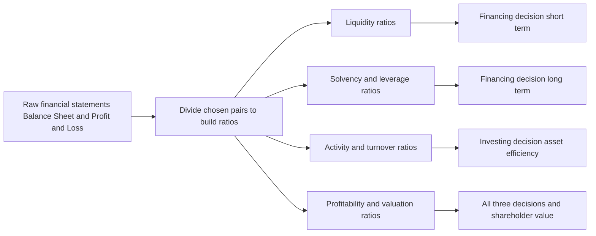
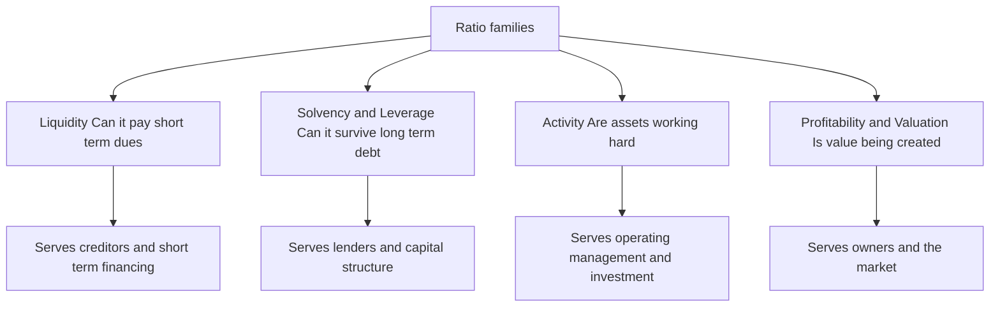
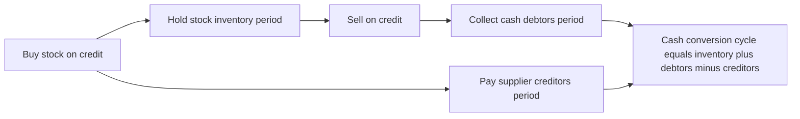
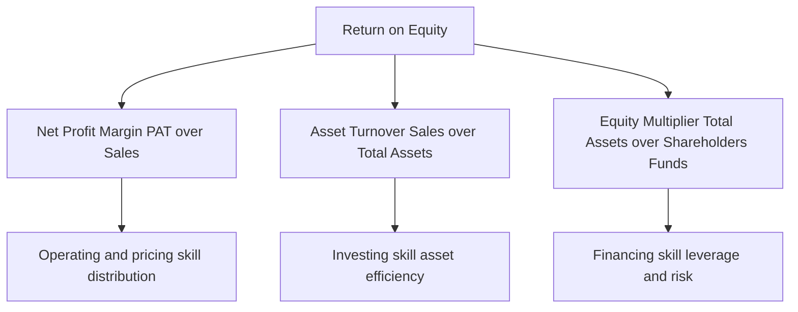

<!-- v2-deep -->

# Chapter 03 — Ratio Analysis (Financial Analysis & Planning)

## 1. The Problem

Imagine two companies drop their annual accounts on your desk. Company A earns a net profit of ₹50 lakh; Company B earns ₹5 crore. Which one is the better business to lend to, buy shares in, or run?

If your instinct is "Company B, obviously — it earns ten times more," you have just fallen into the trap that ratio analysis exists to prevent. Suppose Company A employed ₹2 crore of capital to make that ₹50 lakh (a 25% return), while Company B employed ₹50 crore to make ₹5 crore (a 10% return). Company A is the vastly superior business. The raw profit figure — the "absolute number" — told you the *opposite* of the truth.

This is the core problem. A financial statement is a pile of absolute rupee figures: sales of ₹30,00,000, inventory of ₹3,50,000, debentures of ₹6,00,000. Each number, standing alone, is almost meaningless. Is ₹3,50,000 of inventory "a lot"? You cannot possibly say. A lot *compared to what*? Compared to how fast the firm sells? Compared to last year? Compared to a competitor? A single rupee figure has no yardstick attached to it.

Financial statements were built to *record*, not to *evaluate*. They faithfully report what happened, but they do not tell you whether what happened was good or bad, safe or dangerous, improving or deteriorating. That judgement is what every user of accounts actually wants — the lender deciding whether the loan will be repaid, the shareholder deciding whether value is being created, the manager deciding where the business is bleeding. Raw statements do not answer their questions. **Ratio analysis is the machine that converts recorded facts into evaluative meaning.**

There is a second, subtler problem the raw statements cannot solve: **interpretation without context is undefined.** Even the same absolute number changes meaning depending on *who asks and why*. ₹5,00,000 of current liabilities is "safe" to a supplier owed ₹50,000 next week but "alarming" to a bank whose entire ₹5,00,000 overdraft is buried inside that figure. Different users need the *same* accounts sliced along *different* denominators. A single statement cannot pre-answer every stakeholder's question; a *family* of ratios can, because each ratio is a question asked by dividing the figure the user cares about by the figure that frames it. This is why the chapter is organised by *constituency* (creditor, lender, owner, market) rather than by statement — a point that returns in Section 4.

## 2. The Core Idea

A ratio is nothing more than one number divided by another, chosen so that the answer *means something*. That is the whole trick: you take two figures that individually say little, and by placing one over the other you manufacture a yardstick.

Think of a doctor. When you walk into a clinic, the doctor does not weigh your entire body of medical facts equally. Instead she takes a handful of *vital signs* — pulse, blood pressure, temperature, blood-sugar ratio. Each is a small number, but each is a *ratio* or *rate* deliberately constructed so that a trained eye instantly knows "normal," "worrying," or "emergency." A pulse of 72 means health; 150 at rest means alarm. The number is comparable across every human being on earth because it has an implicit denominator (beats *per minute*) and a known reference range.

A financial ratio is a vital sign for a business. Current Ratio is its blood pressure (can it meet short-term demands?). Interest Coverage is its pulse under load (can it carry its debt burden?). Net Profit Margin is its body temperature (is the core metabolism healthy?). Return on Equity is the overall fitness score. Just as a doctor never diagnoses from a single reading but reads them *together and against reference ranges*, an analyst never judges a firm from one ratio but from a **panel of ratios read against three benchmarks**: the firm's own past (trend), a rival firm (cross-section), and the industry norm (standard).

The denominator is what gives the ratio its power. Dividing profit by capital employed silently answers "profit *relative to the money it took to earn it*" — exactly the question the raw profit figure could not answer in Section 1. Choosing the right denominator is choosing the right question.

**The four forms a ratio can take — and why the form matters.** Every exam ratio is expressed in exactly one of four ways, and choosing the wrong form loses marks even when the arithmetic is right:

1. **Pure proportion "x : 1"** — used when numerator and denominator are the same *kind* of thing (assets vs claims): Current Ratio 2 : 1. The "1" anchors the comparison.
2. **Percentage "%"** — used for a part-of-a-whole or a return on a base: Net Profit 11.2% of sales, ROE 21%.
3. **"Times" (a rate of coverage or velocity)** — used when the numerator is a *flow* and you are counting how many times it covers or cycles the denominator: Interest Coverage 9 times, Inventory Turnover 6 times.
4. **"Days / months" (a duration)** — used for period ratios that translate a turnover into human time: Collection period 60 days.

The deep point: **the same underlying relationship can be shown as a rate or as a duration, and they are reciprocals scaled by the period.** Inventory turnover of 6 times *is* a holding period of 360 ÷ 6 = 60 days. The exam sometimes gives you one and asks for the other precisely to test whether you understand they are the same fact wearing different clothes.

**Two structural types of ratio.** Cutting across the four families is a distinction that governs which balance you use:

- A **stock ratio** relates two balance-sheet items measured *at a point in time* (Current Ratio, Debt–Equity). Both numerator and denominator are snapshots, so no averaging question arises.
- A **flow-to-stock ratio** relates a P&L flow *over a period* to a balance-sheet stock *at a point* (all turnover ratios, ROCE, ROE). Here the mismatch — a full-year numerator over a one-instant denominator — forces the *average of opening and closing* convention for the denominator. Miss this and every turnover ratio is subtly wrong.

Keeping this classification in your head tells you instantly, for any new ratio the examiner invents, whether the averaging rule applies.

## 3. Why It's Built This Way

Why ratios, and not just "read the statements carefully"? Because ratios solve three problems that absolute figures structurally cannot.

**Problem one: scale.** A ₹5 crore profit and a ₹50 lakh profit are not comparable until you neutralise size. Dividing by sales, or by capital, cancels out scale and lets a small firm and a giant be compared on equal terms. Ratios are *scale-free*.

**Problem two: the missing yardstick.** Meaning only exists in comparison. Ratios are built precisely so they can be lined up — this year versus last year (**trend / time-series analysis**), this firm versus that firm (**cross-sectional analysis**), and this firm versus the industry average (**benchmarking**). The ratio is the common language that makes comparison legal.

**Problem three: the interconnection of decisions.** A business is not a random heap of numbers; it is a *system*. Profit depends on sales, sales depend on assets deployed, assets are funded by a mix of debt and equity, and the debt mix feeds back into profit through interest. Ratios, and especially the DuPont chain (Section 4), expose these linkages so you can see *why* a result happened, not just *that* it happened.

Crucially, ratios are organised around the **three decisions that define Financial Management**: the **investing** decision (are assets deployed profitably?), the **financing** decision (is the debt–equity mix safe and cheap?), and the **distribution** decision (how much is returned to shareholders?) — all in service of the single objective, **maximising shareholder wealth**. Each ratio family, as we will see, is a lens trained on one of these decisions.

**A deeper "why": the trade-off ratios exist to expose.** The reason a *panel* of ratios is needed — not one super-ratio — is that the three FM decisions pull against each other, and no single number can show a tension. The sharpest is the **liquidity–profitability trade-off**. Holding a fat current ratio (piles of cash and stock) makes you safe but *lowers* return, because idle current assets earn little; chasing high return by squeezing working capital to the bone makes you fragile. A firm with Current Ratio 6 : 1 and ROCE 4% is "safe and dying"; one with Current Ratio 0.9 : 1 and ROCE 30% is "profitable and one shock from collapse." Only by reading a liquidity ratio *and* a profitability ratio *together* do you see the trade-off management has chosen. This is precisely why ratios come in families answering to different constituencies — the creditor's ideal and the owner's ideal are opposed, and the ratio panel is the negotiating table.

**Why "no single correct value."** Absolute figures at least aspire to be "true." Ratios deliberately do not — a Debt–Equity of 2 : 1 is prudent for a utility with stable cash flows and reckless for a cyclical start-up. The "correct" value is *contingent on industry, stage, and strategy*. This is a feature, not a defect: it forces the analyst to supply the missing context (the norm, the trend, the peer), which is exactly the judgement a mere number-reader lacks. A ratio is engineered to be meaningless *in isolation* so that it is meaningful *in comparison*.

*Figure 3.1 — Ratios convert recorded facts into signals that inform each Financial Management decision.*

## 4. Full Technical Content

We organise every exam ratio into four families, and for each we ask first *what decision it serves*, then state the formula. A ratio you cannot attach to a decision is a ratio you will misuse.

*Figure 3.2 — The four families and the constituency each one answers to.*

### 4.1 Liquidity Ratios — "Can the firm meet its near-term obligations?"

**Decision served:** short-term financing and creditworthiness. A supplier or bank giving 60-day credit does not care about ten-year profits; it cares whether cash will be there next quarter. Liquidity ratios test the buffer of short-term assets against short-term claims.

- **Current Ratio = Current Assets ÷ Current Liabilities.** The rule-of-thumb ideal is **2 : 1** — roughly two rupees of near-cash assets backing every rupee of near-term claim, leaving a margin even if some current assets (slow stock, doubtful debtors) prove less liquid than their book value. *Too low* signals a cash crunch; *too high* signals idle, unproductive current assets — liquidity bought at the cost of return.

- **Quick / Acid-Test / Liquid Ratio = Quick Assets ÷ Current Liabilities**, where **Quick Assets = Current Assets − Inventory − Prepaid Expenses**. Ideal **1 : 1**. This is the stricter test: it strips out inventory (the slowest current asset — it must first be sold, then collected) and prepaids (which will never turn back into cash). A firm can have a healthy current ratio yet fail the acid test if it is choked with unsold stock.

- **Cash / Absolute Liquidity Ratio = (Cash + Bank + Marketable Securities) ÷ Current Liabilities.** Ideal roughly **0.5 : 1**. The most conservative test — only genuine cash and cash-equivalents count. Used when even receivables are suspect.

*Why built this way:* the three ratios form a ladder of severity. Each successive ratio removes one more "not-quite-cash" asset from the numerator, so reading all three tells you not just *whether* the firm is liquid but *what* its liquidity rests on.

**Finer distinctions the exam tests:**

- **What counts as a "current" item.** Current Assets = inventory + trade receivables + bills receivable + cash & bank + marketable securities + prepaid expenses + short-term loans & advances. Current Liabilities = trade payables + bills payable + bank overdraft/cash credit + outstanding expenses + short-term provisions + current maturities of long-term debt. The examiner's favourite ambush is to slip a **long-term item into the current list** (e.g. a debenture redeemable in five years) or vice versa. Classify by the *twelve-month rule*, not by where it appears on the page.

- **Net Working Capital vs the Current Ratio.** NWC = Current Assets − Current Liabilities is an *absolute* figure (₹5,00,000); the Current Ratio is its *relative* twin. NWC tells you the rupee cushion; the ratio tells you the proportional cushion. Both can move in opposite directions if a firm grows — watch which the question asks for.

- **The window-dressing vulnerability.** Because liquidity ratios are *stock* ratios measured on one day, they are the most easily manipulated. Paying off ₹1,00,000 of creditors from ₹1,00,000 of cash the day before the balance-sheet date leaves NWC unchanged but *raises* the current ratio (both numerator and denominator fall by the same amount, so the ratio moves toward the higher of the two). Example: CA 4,00,000 / CL 2,00,000 = 2.0; after paying 1,00,000 → 3,00,000 / 1,00,000 = **3.0**. The firm looks more liquid without being one rupee healthier. Examiners test this "effect of a transaction on the ratio" directly (see Example 5.5).

- **Defensive-interval / interpretation nuance.** A current ratio *below* 1 means negative working capital — current liabilities exceed current assets. For most firms this is a red flag, but for cash-sale businesses with supplier credit (supermarkets, airlines) it is *normal and even efficient*: they collect from customers before they must pay suppliers. Never call sub-1 liquidity "bad" without asking what business it is.

### 4.2 Solvency / Leverage Ratios — "Can the firm survive its long-term debt?"

**Decision served:** the long-term financing decision — capital structure. Debt is cheaper than equity and its interest is tax-deductible, but it is a *fixed, unforgiving* claim: interest must be paid and principal repaid regardless of profits. Too much debt and a bad year becomes insolvency. These ratios measure how heavily the firm leans on borrowed money.

- **Debt–Equity Ratio = Long-term Debt ÷ Shareholders' Funds.** The classic gauge of gearing. A common comfort level is **2 : 1** for manufacturing. Higher means more financial risk borne by lenders relative to owners. (Shareholders' funds = Equity share capital + Reserves & surplus + Preference share capital, less fictitious assets.)

- **Proprietary Ratio = Shareholders' Funds ÷ Total Assets.** The mirror image — the proportion of the asset base funded by owners rather than outsiders. Higher is safer; it is the shock-absorber against which losses are borne before creditors are touched.

- **Capital Gearing Ratio = Fixed-income-bearing funds ÷ Equity-shareholders' funds = (Preference capital + Debt) ÷ (Equity capital + Reserves).** Measures the weight of *fixed-return* capital (which magnifies swings in equity earnings) against variable-return equity. High gearing = high financial risk *and* high potential reward to equity.

- **Interest Coverage Ratio = EBIT ÷ Interest.** A *flow* solvency test rather than a *stock* one. It asks: how many times over does operating profit cover the interest bill? A coverage of 9 means profit could fall dramatically before interest becomes unpayable. Lenders watch this more closely than any balance-sheet ratio because it measures the *ability to service*, not just the *quantum of* debt.

*Why built this way:* the first three are **stock** ratios (snapshots from the balance sheet — how the pile is funded); the last is a **flow** ratio (from the P&L — whether current earnings can carry the burden). Solvency needs both: a firm can look fine on debt–equity yet be one bad quarter from breaching its interest cover.

**Finer distinctions the exam tests:**

- **Two definitions of "Debt" in Debt–Equity.** The *narrow* (and ICAI-standard) numerator is **long-term debt only**. A *broad* version uses **total debt (long-term + short-term)**. If the question says "external debt" or "total outside liabilities," use the broad figure; otherwise use long-term. Always state which you used — the ratio can differ dramatically. For Deepak Ltd, long-term-only gives 0.375 : 1, but including the ₹1,50,000 overdraft would change it.

- **Debt to Total Assets / Total Debt Ratio = Total Debt ÷ Total Assets.** A close cousin of the proprietary ratio: Debt Ratio + Proprietary Ratio = 1 (when "debt" means all outside liabilities). This algebraic tie is a quick self-check and a common one-mark question.

- **Debt Service Coverage Ratio (DSCR)** = (PAT + Depreciation + Interest on term loan) ÷ (Interest + Instalment of principal). This upgrades interest coverage to include *principal repayment*, because a loan is only truly serviced if both interest *and* instalment are met. Term lenders and appraisal formats (project finance) rely on DSCR, not interest cover. Add back depreciation because it is a non-cash charge — cash, not accounting profit, repays a loan. Flag exact benchmark levels as "verify current ICAI/lender norms," but ~1.5–2 is commonly cited as acceptable.

- **Fixed Charges Coverage = (EBIT + Fixed charges before tax) ÷ (Interest + Fixed charges + Preference dividend grossed up).** Extends coverage to *all* fixed financial commitments, including lease rentals and preference dividends. The logic ladder — Interest Coverage → DSCR → Fixed Charges Coverage — mirrors the liquidity ladder: each step captures one more unavoidable outflow.

- **The tax subtlety in coverage ratios.** Interest is paid from *pre-tax* profit (it is deductible), so interest coverage correctly uses EBIT. But preference dividend and loan principal are paid from *post-tax* profit. When a coverage ratio mixes pre-tax and post-tax charges (as fixed-charges coverage does), post-tax charges must be **grossed up** to a pre-tax equivalent by dividing by (1 − tax rate), so numerator and denominator are on the same tax footing. Forgetting to gross up is a classic error.

- **Reading direction.** For Debt–Equity, Capital Gearing and Debt Ratio, *higher = riskier*. For Proprietary Ratio and all coverage ratios, *higher = safer*. Do not mechanically praise "higher."

### 4.3 Activity / Turnover Ratios — "How hard are the assets working?"

**Decision served:** the investing decision and operating efficiency. Capital tied up in assets has a cost. Turnover ratios measure how many rupees of sales each rupee of asset generates — the *velocity* of the asset base. Slow velocity means capital is sleeping.

- **Inventory (Stock) Turnover = Cost of Goods Sold ÷ Average Inventory.** How many times a year stock is sold and replaced. Higher = leaner, faster-moving stock (less capital locked, less obsolescence risk). *Holding period = 360 ÷ Turnover* days.

- **Debtors / Receivables Turnover = Credit Sales ÷ Average Receivables** (Receivables = Debtors + Bills Receivable). How fast credit sales convert to cash. *Collection period = 360 ÷ Turnover* days — the average number of days customers take to pay. Long collection = cash starved and higher bad-debt risk.

- **Creditors / Payables Turnover = Credit Purchases ÷ Average Payables** (Payables = Creditors + Bills Payable). *Payment period = 360 ÷ Turnover* days. Here, slower can be *better* — it is free supplier finance — provided you do not damage relationships or lose cash discounts.

- **Fixed Asset Turnover = Sales ÷ Net Fixed Assets**; **Total Asset Turnover = Sales ÷ Total Assets**; **Capital Turnover = Sales ÷ Capital Employed**; **Working Capital Turnover = Sales ÷ Net Working Capital.** Each asks the same question of a different asset pool: how much revenue is squeezed from it.

These three period ratios combine into the single most operationally useful number in the chapter:

- **Operating Cycle = Inventory holding period + Debtors collection period.**
- **Cash Conversion Cycle (CCC) = Inventory period + Debtors period − Creditors period.**

*Figure 3.3 — The cash conversion cycle. Fewer days means cash is freed faster and less working capital must be financed.*

*Why built this way:* every turnover ratio uses a **P&L flow in the numerator** (sales, COGS, purchases — a full year's activity) over a **balance-sheet stock in the denominator** (a point-in-time asset). Because the denominator is a snapshot, the theoretically correct figure is the **average of opening and closing balances**. When only a closing balance is available, use it — but know that you are approximating.

**Finer distinctions the exam tests:**

- **Numerator consistency — COGS vs Sales for inventory turnover.** The *correct* numerator for inventory turnover is **Cost of Goods Sold**, because inventory is carried at cost, so both numerator and denominator are on a cost basis. Some textbooks use Sales for convenience; this inflates the ratio by the profit margin and is technically inferior. Use COGS if it is available; if only Sales is given, use Sales and *state the assumption*. Mixing a cost-based denominator with a sales-based numerator is a hidden inconsistency the examiner rewards you for avoiding.

- **Raw-material vs finished-goods inventory periods.** In a manufacturing question, the "inventory period" may split into *raw material holding period* (Avg RM ÷ RM consumed per day), *WIP period* (Avg WIP ÷ Cost of production per day) and *finished-goods period* (Avg FG ÷ COGS per day). The full operating cycle then sums all three plus the debtors period, less the creditors period. FM working-capital questions lean on this granular version; keep the component-wise formula ready.

- **Gross vs net operating cycle.** The **gross operating cycle** = inventory period + debtors period (the full time from buying stock to collecting cash). The **net operating cycle = gross cycle − creditors period** — identical to the cash conversion cycle. The exam uses both names; know they are the same idea.

- **360 vs 365 vs 12.** Period = (Days in year) ÷ Turnover. ICAI problems commonly use **360** for arithmetic ease, but 365 is equally acceptable, and 12 gives the period in *months*. The choice changes the days figure, so *state it*. If a question gives "assume 360 days," obey it.

- **Working Capital Turnover — the double-edged ratio.** A *high* WC turnover usually means efficient use of working capital, but an *extremely* high figure can signal *over-trading* — running a large sales volume on a dangerously thin working-capital base, one debtor default away from a cash crisis. And if working capital is *negative*, the ratio becomes meaningless (a negative or nonsensical denominator). Flag this rather than reporting a garbage number.

- **Capital Turnover ties activity to profitability.** Note that **ROCE = Capital Turnover × Operating Profit Margin** (Sales/CE × EBIT/Sales = EBIT/CE). This is the two-factor DuPont for ROCE and a favourite "prove the relationship" question. It shows return can be lifted either by turning capital faster *or* by fattening margins — the same either/or DuPont reveals for ROE.

### 4.4 Profitability & Valuation Ratios — "Is value being created for owners?"

**Decision served:** ultimately *all three* decisions, judged at the finish line — shareholder wealth. Profitability ratios split into **margin ratios** (profit per rupee of sales) and **return ratios** (profit per rupee of capital), plus **market/valuation ratios** that connect the accounts to the share price and the distribution decision.

**Margins (base = Sales):**
- **Gross Profit Ratio = Gross Profit ÷ Sales.** Efficiency of production/purchasing before overheads.
- **Operating Profit Ratio = EBIT ÷ Sales.** Efficiency of core operations after overheads but before financing and tax.
- **Operating Ratio = (COGS + Operating expenses) ÷ Sales.** The cost-side mirror; Operating Ratio + Operating Profit Ratio = 100%.
- **Net Profit Ratio = PAT ÷ Sales.** The bottom-line squeeze after everything.

**Returns (base = Capital):**
- **Return on Capital Employed (ROCE) = EBIT ÷ Capital Employed**, where **Capital Employed = Total Assets − Current Liabilities = Shareholders' funds + Long-term debt.** The purest test of *investing* efficiency because EBIT (pre-interest, pre-tax) is the return to *all* providers of long-term capital, matched against *all* long-term capital. It is independent of how the firm is financed, so it isolates operating skill.
- **Return on Equity (ROE) / Return on Net Worth = PAT ÷ Shareholders' Funds.** The single most owner-relevant ratio — return earned on the owners' money after debt-holders and tax have been paid.
- **Return on Assets (ROA) = PAT ÷ Total Assets** (some use EBIT or PAT + interest in the numerator to keep it financing-neutral).

**Market / Valuation (base = share):**
- **Earnings Per Share (EPS) = Earnings available to equity ÷ Number of equity shares** (Earnings available to equity = PAT − Preference dividend).
- **Price–Earnings (P/E) Ratio = Market Price per Share ÷ EPS** — how many rupees the market pays per rupee of earnings; a proxy for growth expectations.
- **Dividend Payout Ratio = DPS ÷ EPS** (or Equity dividend ÷ Earnings available to equity) — the *distribution decision* made visible; **Retention Ratio = 1 − Payout.**
- **Dividend Yield = DPS ÷ MPS**; **Earnings Yield = EPS ÷ MPS.**
- **Book Value per Share = Equity shareholders' funds ÷ Number of equity shares.**

**Finer distinctions the exam tests:**

- **ROE for equity shareholders excludes preference capital.** There is a genuine ambiguity: "Return on Net Worth" sometimes uses *total* shareholders' funds (including preference) with PAT in the numerator, and sometimes uses *equity* funds only (excluding preference capital) with *earnings available to equity* (PAT − preference dividend) in the numerator. The two must be internally consistent: if you strip preference dividend from the numerator, strip preference capital from the denominator. State which definition you use; do not mix.

- **ROCE numerator variants and the "average capital employed" refinement.** Some questions specify **average capital employed = (Opening CE + Closing CE) ÷ 2**, or ask for ROCE on **PBIT (= EBIT)** vs a post-tax "return on investment." Where a firm has non-operating investments, purists exclude them from capital employed *and* exclude their income from EBIT, so the ratio measures *operating* return only. Read the numerator/denominator the question defines rather than defaulting.

- **Sustainable Growth Rate (SGR) = ROE × Retention Ratio (b).** This links profitability, distribution and growth in one line: the fastest a firm can grow *without raising fresh external equity* is the return it earns on equity times the fraction it ploughs back. It is the quantitative bridge from this chapter to Dividend and Growth decisions, and a frequent "compute the growth rate" ask. (Watch: use *retention*, b, not payout.)

- **P/E, Earnings Yield and cost of equity.** Earnings Yield = EPS ÷ MPS is the reciprocal of the P/E ratio (P/E 10 ⇒ earnings yield 10%). Under a no-growth full-payout assumption, earnings yield approximates the cost of equity — a link the valuation chapter exploits. A high P/E therefore means the market either expects growth or demands a low return; it is *not* automatically "expensive."

- **Dividend cover = 1 ÷ Payout = EPS ÷ DPS.** The inverse of the payout ratio, expressed in "times." A dividend cover of 2 means earnings are twice the dividend, i.e. a 50% payout. The exam may ask for cover rather than payout — same fact, reciprocal form.

- **Market-to-Book (Price-to-Book) = MPS ÷ Book Value per Share.** Above 1 means the market values the firm above its accounting net worth (intangibles, growth, ROE above cost of equity); below 1 hints at value-destruction or hidden asset problems. Ties directly to whether ROE exceeds the cost of equity.

### 4.5 The DuPont Decomposition — the ratio that explains the ratios

ROE tells you the owners earned, say, 21%. It does *not* tell you *why*, or *how to improve it*, or *what risk was taken to get it*. The **DuPont analysis** (devised at the DuPont corporation in the 1920s) cracks ROE open into its drivers, revealing that the same 21% can come from utterly different — and differently risky — business models.

**Three-step DuPont:**

$$\text{ROE} = \underbrace{\frac{\text{PAT}}{\text{Sales}}}_{\text{Net Profit Margin}} \times \underbrace{\frac{\text{Sales}}{\text{Total Assets}}}_{\text{Asset Turnover}} \times \underbrace{\frac{\text{Total Assets}}{\text{Shareholders' Funds}}}_{\text{Equity Multiplier}}$$

The insight is profound. ROE is driven by exactly three levers, one from each Financial Management decision:

1. **Net Profit Margin** — *operating/pricing skill*. How much profit per rupee of sales. (The distribution of the value chain.)
2. **Asset Turnover** — *investing skill*. How much sales per rupee of assets. (Efficiency of the investing decision.)
3. **Equity Multiplier** — *financing skill / leverage*. How much asset base is levered on each rupee of equity. (The financing decision made visible; a multiplier of 1.69 means assets are 1.69× the owners' money, the rest borrowed.)

A jeweller earns high ROE through fat *margins* on slow turnover. A supermarket earns the *same* ROE through razor-thin margins on furious *turnover*. A bank earns it through huge *leverage* on tiny margins. DuPont tells you *which kind of business you are looking at* — and warns you when a "great" ROE is actually just dangerous borrowing (a high equity multiplier) masquerading as skill.

*Figure 3.4 — DuPont splits ROE into one lever from each Financial Management decision, showing not just the result but its source and its risk.*

**Five-step (extended) DuPont** decomposes margin further into a tax lever and an interest lever:

$$\text{ROE} = \underbrace{\frac{\text{PAT}}{\text{PBT}}}_{\text{Tax burden}} \times \underbrace{\frac{\text{PBT}}{\text{EBIT}}}_{\text{Interest burden}} \times \underbrace{\frac{\text{EBIT}}{\text{Sales}}}_{\text{Operating margin}} \times \underbrace{\frac{\text{Sales}}{\text{Assets}}}_{\text{Asset turnover}} \times \underbrace{\frac{\text{Assets}}{\text{Equity}}}_{\text{Leverage}}$$

This separates *operating* performance (operating margin × turnover) from *financing/tax* effects (tax burden × interest burden × leverage), so you can see whether ROE improved because the business got better or merely because tax fell or debt rose.

**Why the chain telescopes — the first-principles guarantee.** DuPont is not a lucky coincidence; it is algebra. Each factor's denominator is the next factor's numerator, so every intermediate term cancels and the product collapses back to PAT ÷ Equity. Because it is an *identity* (true by construction, for any firm, in any year), the reconciliation *must* close to the direct ROE — if it doesn't, you have made an arithmetic slip or mixed two definitions of "equity" between factors. This is why DuPont doubles as a *self-checking* device: the identity is your proof that every component was computed on a consistent base.

**The leverage warning DuPont encodes.** Raising the equity multiplier always *mathematically* raises ROE — but only while ROCE exceeds the after-tax cost of debt. Once borrowing costs more than the assets earn, the same multiplier that magnified gains magnifies losses, and ROE falls *below* ROA. So a rising ROE driven purely by a rising equity multiplier is a **danger signal**, not a success: the firm is buying return with risk. DuPont is the tool that lets you tell "earned it" from "borrowed it."

## 5. Worked Examples

Throughout, we use the following statements of **Deepak Ltd** for the year ended 31 March. Every ratio in Sections 5.2–5.4 is computed from these exact figures and reconciles.

**Balance Sheet as at 31 March**

| Equity & Liabilities | ₹ | Assets | ₹ |
|---|---:|---|---:|
| Equity Share Capital (₹10 each) | 10,00,000 | Fixed Assets (net) | 15,00,000 |
| Reserves & Surplus | 4,00,000 | Non-current Investments | 2,00,000 |
| 12% Preference Share Capital | 2,00,000 | **Current Assets** | |
| 10% Debentures | 6,00,000 | Inventory (Stock) | 3,50,000 |
| **Current Liabilities** | | Trade Receivables (Debtors) | 3,00,000 |
| Trade Payables (Creditors) 2,50,000 | | Bills Receivable | 1,00,000 |
| Bills Payable 50,000 | | Cash & Bank | 2,50,000 |
| Bank Overdraft 1,50,000 | | | |
| Outstanding Expenses 50,000 | | | |
| Total Current Liabilities | 5,00,000 | | |
| **Total** | **27,00,000** | **Total** | **27,00,000** |

**Statement of Profit & Loss for the year**

| Particulars | ₹ |
|---|---:|
| Sales (of which credit sales ₹24,00,000) | 30,00,000 |
| Less: Cost of Goods Sold | 21,00,000 |
| **Gross Profit** | **9,00,000** |
| Less: Operating Expenses (admin + selling) | 3,60,000 |
| **Operating Profit (EBIT)** | **5,40,000** |
| Less: Interest on 10% Debentures | 60,000 |
| **Profit Before Tax (PBT)** | **4,80,000** |
| Less: Tax @ 30% | 1,44,000 |
| **Profit After Tax (PAT)** | **3,36,000** |
| Less: Preference Dividend (12% of 2,00,000) | 24,000 |
| **Earnings available to Equity** | **3,12,000** |

*Additional data:* Credit purchases during the year ₹18,00,000; Market price per equity share ₹31.20; Equity dividend declared 20% (i.e. ₹2 per share). For simplicity, closing balances are treated as representative (averages equal closing).

### Example 5.1 — Liquidity (easy)

*A bank is deciding whether to extend Deepak Ltd a 90-day working-capital line. Assess short-term liquidity.*

**Step 1 — Current Assets and Current Liabilities.**
Current Assets = 3,50,000 + 3,00,000 + 1,00,000 + 2,50,000 = **₹10,00,000.**
Current Liabilities = 2,50,000 + 50,000 + 1,50,000 + 50,000 = **₹5,00,000.**

**Step 2 — Current Ratio** = 10,00,000 ÷ 5,00,000 = **2.0 : 1.** Exactly the textbook ideal — comfortable short-term cushion.

**Step 3 — Quick Assets** = Current Assets − Inventory − Prepaid = 10,00,000 − 3,50,000 − 0 = ₹6,50,000.
**Quick Ratio** = 6,50,000 ÷ 5,00,000 = **1.3 : 1.** Above the 1:1 ideal — even excluding stock, the firm covers its current dues comfortably.

**Step 4 — Cash Ratio** = (Cash & Bank) ÷ CL = 2,50,000 ÷ 5,00,000 = **0.5 : 1.** Meets the conservative benchmark.

**Interpretation & decision:** All three liquidity signals are healthy and consistent — the current ratio is not being flattered by bloated inventory (the quick ratio confirms it). **The bank can extend the line with confidence.**

### Example 5.2 — Solvency & Activity (moderate)

*A debenture-holder wants to know whether Deepak Ltd can safely carry more debt, and how efficiently it runs its assets.*

**Solvency:**

**Step 1 — Debt–Equity.** Long-term debt = ₹6,00,000. Shareholders' funds = Equity capital 10,00,000 + Reserves 4,00,000 + Preference 2,00,000 = ₹16,00,000.
Debt–Equity = 6,00,000 ÷ 16,00,000 = **0.375 : 1.** Very conservatively financed — far below the 2:1 comfort ceiling; there is ample room to borrow.

**Step 2 — Proprietary Ratio** = Shareholders' funds ÷ Total Assets = 16,00,000 ÷ 27,00,000 = **0.59 (59%).** Owners fund nearly 60% of the asset base — a strong shock-absorber.

**Step 3 — Capital Gearing** = (Preference + Debt) ÷ (Equity capital + Reserves) = (2,00,000 + 6,00,000) ÷ (10,00,000 + 4,00,000) = 8,00,000 ÷ 14,00,000 = **0.57 : 1.** Low-geared — fixed-return capital is well below equity, so financial risk is modest.

**Step 4 — Interest Coverage** = EBIT ÷ Interest = 5,40,000 ÷ 60,000 = **9 times.** Operating profit covers interest nine times over; EBIT could fall almost 89% before interest becomes unpayable.

**Activity:**

**Step 5 — Inventory Turnover** = COGS ÷ Inventory = 21,00,000 ÷ 3,50,000 = **6 times.** Holding period = 360 ÷ 6 = **60 days.**

**Step 6 — Debtors Turnover** = Credit Sales ÷ Receivables = 24,00,000 ÷ (3,00,000 + 1,00,000) = 24,00,000 ÷ 4,00,000 = **6 times.** Collection period = 360 ÷ 6 = **60 days.**

**Step 7 — Creditors Turnover** = Credit Purchases ÷ Payables = 18,00,000 ÷ (2,50,000 + 50,000) = 18,00,000 ÷ 3,00,000 = **6 times.** Payment period = 360 ÷ 6 = **60 days.**

**Step 8 — Operating cycle & CCC.**
Operating Cycle = 60 (stock) + 60 (debtors) = **120 days.**
Cash Conversion Cycle = 60 + 60 − 60 = **60 days.**

**Interpretation & decision:** Low leverage plus 9× interest cover means the firm is *under*-borrowed and can comfortably service additional debentures — good news for the lender, and arguably a signal to management that cheap debt is being under-used. The 60-day cash cycle means every rupee of sales is locked up for two months before returning as cash; shaving the collection or holding period would release working capital.

### Example 5.3 — Profitability, Valuation & DuPont (exam-hard, fully reconciling)

*An equity analyst must judge whether Deepak Ltd creates shareholder value, value the share, and explain the source of its return.*

**Margins:**

| Ratio | Computation | Result |
|---|---|---|
| Gross Profit Ratio | 9,00,000 ÷ 30,00,000 | **30%** |
| Operating Profit Ratio | 5,40,000 ÷ 30,00,000 | **18%** |
| Operating Ratio | (21,00,000 + 3,60,000) ÷ 30,00,000 | **82%** |
| Net Profit Ratio | 3,36,000 ÷ 30,00,000 | **11.2%** |

*Reconciliation check:* Operating Ratio 82% + Operating Profit Ratio 18% = 100%. ✓

**Returns:**

**Step 1 — Capital Employed** = Total Assets − Current Liabilities = 27,00,000 − 5,00,000 = ₹22,00,000. (Check: Shareholders' funds 16,00,000 + Debt 6,00,000 = 22,00,000. ✓)
**ROCE** = EBIT ÷ Capital Employed = 5,40,000 ÷ 22,00,000 = **24.55%.**

**Step 2 — ROE** = PAT ÷ Shareholders' funds = 3,36,000 ÷ 16,00,000 = **21%.** *(This is the broad "Return on Net Worth" convention — PAT over total shareholders' funds, here including the ₹2,00,000 preference capital. The stricter Return on **Equity** view uses earnings after preference dividend over equity funds only: (3,36,000 − 24,000) ÷ 14,00,000 = **22.3%**. Both are examinable — read which base the question wants.)*

**Step 3 — ROA** = PAT ÷ Total Assets = 3,36,000 ÷ 27,00,000 = **12.44%.**

*Note the ladder:* ROCE (24.55%) > ROE (21%)? Here ROE is below ROCE because ROCE is a **pre-tax** return to all capital, while ROE is **after-tax** to equity only. Comparing like-with-like: the after-tax operating return exceeds the 10% cost of debt, so leverage is *favourable* — borrowing at 10% to earn ~24.5% pre-tax lifts equity returns. (This is the financial-leverage effect quantified in Chapter on Leverage.)

**Market / Valuation:**

**Step 4 — EPS** = Earnings available to equity ÷ No. of equity shares = 3,12,000 ÷ 1,00,000 = **₹3.12.**
(Number of shares = 10,00,000 ÷ 10 = 1,00,000.)

**Step 5 — P/E Ratio** = MPS ÷ EPS = 31.20 ÷ 3.12 = **10 times.**

**Step 6 — Dividend Payout** = DPS ÷ EPS = 2.00 ÷ 3.12 = **64.1%.** **Retention Ratio** = 35.9%.

**Step 7 — Dividend Yield** = 2.00 ÷ 31.20 = **6.41%**; **Earnings Yield** = 3.12 ÷ 31.20 = **10%.**

**Step 8 — Book Value per Share** = (Equity capital + Reserves) ÷ shares = 14,00,000 ÷ 1,00,000 = **₹14.** The share trades at 31.20, i.e. **2.23× book** — the market values the business well above its accounting net worth, consistent with a 24.5% ROCE.

**DuPont decomposition (three-step):**

$$\text{ROE} = \frac{\text{PAT}}{\text{Sales}} \times \frac{\text{Sales}}{\text{Total Assets}} \times \frac{\text{Total Assets}}{\text{Shareholders' Funds}}$$

$$= \frac{3{,}36{,}000}{30{,}00{,}000} \times \frac{30{,}00{,}000}{27{,}00{,}000} \times \frac{27{,}00{,}000}{16{,}00{,}000}$$

$$= 0.112 \times 1.1111 \times 1.6875 = 0.21 = \mathbf{21\%}$$

*Reconciliation:* 21% matches the direct ROE from Step 2. ✓

**Reading the DuPont result:** Deepak's 21% ROE is built on a *decent* margin (11.2%), a *modest* asset turnover (1.11×), and *low* leverage (equity multiplier only 1.69, because the firm is under-borrowed). The story DuPont tells: **the return is earned on operating quality, not on financial risk.** Since the equity multiplier is low and ROCE comfortably beats the cost of debt, management could *raise* ROE further simply by taking on more (favourable) debt — a financing-decision insight invisible in the bare 21% figure.

**Five-step check:**
ROE = (PAT/PBT) × (PBT/EBIT) × (EBIT/Sales) × (Sales/Assets) × (Assets/Equity)
= (3,36,000/4,80,000) × (4,80,000/5,40,000) × (5,40,000/30,00,000) × (30,00,000/27,00,000) × (27,00,000/16,00,000)
= 0.70 × 0.8889 × 0.18 × 1.1111 × 1.6875 = **0.21 = 21%.** ✓

The tax burden (0.70) and interest burden (0.8889) show that of the operating return, 30% is lost to tax and about 11% to interest — the rest flows to equity, amplified by leverage.

### Example 5.4 — Reverse ratios: reconstructing the accounts (exam-hard)

Increasingly the exam does not hand you the statements — it hands you the *ratios* and asks you to rebuild the figures. This tests whether you truly understand each formula as an equation you can invert.

*Given for Ratan Ltd:* Current Ratio 2.5 : 1; Quick Ratio 1.5 : 1; Working Capital ₹6,00,000; Inventory turnover 8 times (on COGS); Gross profit ratio 25%; Debtors collection period 36.5 days (assume 365-day year). Find Current Assets, Current Liabilities, Inventory, Sales and Debtors.

**Step 1 — Split the current ratio using working capital.**
Let Current Liabilities = x. Current Assets = 2.5x. Working Capital = CA − CL = 2.5x − x = 1.5x = ₹6,00,000.
⇒ x = 4,00,000. So **CL = ₹4,00,000** and **CA = 2.5 × 4,00,000 = ₹10,00,000.**

**Step 2 — Inventory from the gap between current and quick ratios.**
Quick Assets = Quick Ratio × CL = 1.5 × 4,00,000 = ₹6,00,000.
Inventory = CA − Quick Assets = 10,00,000 − 6,00,000 = **₹4,00,000.**
(Assuming no prepaids, quick assets = CA − inventory.)

**Step 3 — COGS and Sales from inventory turnover and GP ratio.**
Inventory turnover = COGS ÷ Inventory ⇒ COGS = 8 × 4,00,000 = ₹32,00,000.
Gross profit ratio 25% ⇒ COGS = 75% of Sales ⇒ Sales = 32,00,000 ÷ 0.75 = **₹42,66,667** (≈). Gross Profit = Sales − COGS = ₹10,66,667.

**Step 4 — Debtors from the collection period.**
Collection period = 365 × Debtors ÷ Credit Sales. Assuming all sales are credit:
Debtors = Collection period × Sales ÷ 365 = 36.5 × 42,66,667 ÷ 365 = **₹4,26,667** (≈).

**Reconciliation:** Debtors ₹4,26,667 must fit inside Quick Assets ₹6,00,000 — it does, leaving ₹1,73,333 of cash/other quick assets, which is internally consistent. ✓ Inventory ₹4,00,000 + Quick Assets ₹6,00,000 = CA ₹10,00,000. ✓

*Lesson:* every ratio is a solvable equation. Work from the ratio that has an absolute anchor (here Working Capital) outward, and check that each reconstructed figure nests inside the totals it must.

### Example 5.5 — Effect of transactions on ratios (exam trap, fully checked)

*Deepak Ltd's current ratio is 2 : 1 (CA ₹10,00,000, CL ₹5,00,000). For each independent transaction, state the new current ratio and whether it improved.*

**(a) Pay a creditor ₹1,00,000 in cash.**
CA → 10,00,000 − 1,00,000 = 9,00,000; CL → 5,00,000 − 1,00,000 = 4,00,000.
New ratio = 9,00,000 ÷ 4,00,000 = **2.25 : 1.** *Improved on paper.* First-principles reason: when a ratio already exceeds 1, subtracting the *same* amount from both terms pushes the ratio further above 1 — yet net working capital (₹5,00,000) is unchanged. The "improvement" is cosmetic.

**(b) Sell goods costing ₹1,00,000 for ₹1,20,000 on credit.**
Inventory −1,00,000, Debtors +1,20,000 ⇒ CA net +20,000 = 10,20,000; CL unchanged 5,00,000.
New ratio = 10,20,000 ÷ 5,00,000 = **2.04 : 1.** Slight genuine improvement — the ₹20,000 profit added real current assets.

**(c) Buy inventory ₹1,00,000 on credit.**
CA → 11,00,000; CL → 6,00,000. New ratio = 11,00,000 ÷ 6,00,000 = **1.83 : 1.** *Worsened* — adding equal amounts to both terms of a >1 ratio drags it *toward* 1.

**(d) Collect ₹1,00,000 from a debtor.**
Cash +1,00,000, Debtors −1,00,000 ⇒ CA unchanged; CL unchanged. New ratio = **2 : 1, no change.** A swap *within* current assets never moves the current ratio (though it *does* raise the quick and cash ratios if it converts a slow asset to cash — here debtors and cash are both quick, so even those are unchanged).

**The rule to memorise:** For a ratio already above 1, adding the same amount to numerator and denominator moves it *down* toward 1; subtracting the same amount moves it *up* away from 1. Below 1, the directions reverse. Transactions *within* one side (asset-for-asset, or liability-for-liability) leave that side's total — and hence the ratio — unchanged. Knowing this lets you answer "effect on ratio" questions in seconds without recomputing, and it exposes window-dressing (transaction (a)) for what it is.

## 6. Presentation / Format

Marks in the exam are lost not on arithmetic but on presentation. Follow this discipline:

1. **State the formula, then substitute, then answer, with units.** Every ratio: `Formula = numerator ÷ denominator = figure ÷ figure = result (unit).` Liquidity/solvency ratios are expressed as a **proportion "x : 1"**; turnover as **"times"**; period ratios as **"days"**; margins and returns as **"%"**.

2. **Show the build-up of composite figures.** Never write "Current Assets = 10,00,000" without the components. Examiners award marks for the working (e.g. the sum of stock + debtors + BR + cash), not just the total.

3. **Group by family** under clear headings — Liquidity, Solvency, Activity, Profitability — so the answer reads as a diagnostic panel.

4. **Always attach a one-line interpretation** when the question says "comment," "analyse," or "advise." A number without a verdict is half an answer.

5. **State your assumptions.** If you use 360 days (vs 365), or closing balances (vs averages), or include/exclude bank overdraft from current liabilities for the quick ratio, *say so in a note*. Examiners accept either convention if stated.

6. **Round sensibly and consistently.** Carry ratios to two decimals (or one for "x : 1") and keep the *same* rounding throughout a reconciliation, or DuPont will fail to close by a rounding whisker. Where a reconciliation must be exact, keep the fractions un-rounded until the final line.

7. **In reverse/reconstruction problems, define your unknown explicitly.** Write "Let CL = x" before building equations — it earns method marks even if an arithmetic slip costs you the final figure, and it lets the examiner follow your logic.

A model presentation block:

> **Current Ratio** = Current Assets ÷ Current Liabilities = ₹10,00,000 ÷ ₹5,00,000 = **2 : 1.**
> *Comment:* meets the ideal 2:1 norm; short-term liquidity is sound.

## 7. Connections

Ratio analysis is the hub that touches almost every other FM chapter:

- **Working Capital Management** — the operating cycle and cash conversion cycle (Section 4.3) *are* the analytical engine of working-capital planning; turnover ratios drive the estimation of stock, debtor and creditor levels.
- **Leverage** — the capital-gearing and interest-coverage ratios feed directly into the study of *financial leverage* and *degree of financial leverage*; the DuPont equity multiplier *is* leverage. Example 5.3's observation that ROCE > cost of debt is the trading-on-equity principle.
- **Cost of Capital & Capital Structure** — debt–equity and coverage ratios constrain how much debt a firm can raise and at what rate; they underpin the target capital structure. Earnings yield (4.4) is a first-cut estimate of the cost of equity.
- **Dividend Decisions** — payout, retention and dividend-yield ratios are the quantitative face of dividend policy; the Sustainable Growth Rate (ROE × retention) links this chapter directly to how fast dividends and the firm can grow without fresh equity.
- **Capital Budgeting** — ROCE and asset-turnover benchmarks inform the hurdle rate and the post-audit of whether investments delivered.
- **Business valuation / Strategic Management** — P/E, EPS, book value and market-to-book connect the accounts to market value; DuPont is a standard strategy-diagnosis tool for identifying a firm's competitive model (margin-led vs volume-led vs leverage-led).
- **Financial Statement basics / Accounting Standards** — because ratios inherit whatever accounting policies produced the figures (depreciation method, inventory valuation, revenue recognition), a change in policy can move a ratio with no change in the underlying business — the reason cross-firm comparison demands matched policies.

## 8. Traps & Examiner Tricks

1. **Quick assets ≠ Current assets − Inventory only.** You must *also* remove prepaid expenses (they can never become cash). Forgetting prepaids is the single most common slip.

2. **Bank overdraft in the quick ratio.** Some texts exclude a *chronic* bank overdraft from current liabilities (treating it as quasi-permanent finance) when computing the quick ratio, which raises the ratio. Either treatment is defensible — **state your assumption.** Here we included it.

3. **Credit vs total figures.** Debtors turnover uses **credit sales**, not total sales; creditors turnover uses **credit purchases**. If the question gives a split, using the total figure is wrong. If no split is given, assume all are credit and *say so*.

4. **Average vs closing balances.** The correct denominator for turnover ratios is the *average* of opening and closing. If opening figures are given, you *must* average — using closing alone will lose marks.

5. **Capital Employed — two routes, one answer.** Total Assets − Current Liabilities *must* equal Shareholders' funds + Long-term debt. If they don't, you have misclassified an item (a favourite trap: hiding a long-term loan among current liabilities, or a fictitious asset like preliminary expenses that must be deducted from shareholders' funds).

6. **ROCE numerator must be EBIT (pre-interest, pre-tax).** Using PAT in ROCE double-counts the financing effect and makes it non-comparable across firms with different gearing. Match a pre-financing return with an all-capital base.

7. **EPS uses earnings *after* preference dividend**, divided by the number of *equity* shares — not total share capital, and not PAT. Deducting the ₹24,000 preference dividend is easy to forget.

8. **A high ratio is not automatically "good."** A current ratio of 6:1 signals idle cash and poor asset use; a very high debtors period signals lax credit control; a very *low* creditors period may mean you are foregoing free finance. Always judge *against a norm and a trend*, never in isolation — the doctor's rule from Section 2.

9. **Direction of the payables ratio.** Slower payment (longer period) is often *favourable* (free finance) — the opposite of debtors, where slower is bad. Do not mechanically call "faster = better" for every turnover.

10. **The DuPont ROE denominator must match.** Use total shareholders' funds consistently in both the equity multiplier and the direct ROE, or the reconciliation breaks. Mixing "equity-only funds" and "total shareholders' funds" between the two is a classic self-inconsistency.

11. **Inventory turnover: COGS over cost, not Sales over cost.** Using Sales in the numerator while inventory sits at cost inflates the ratio by the margin. Use COGS unless only Sales is given; either way, keep numerator and denominator on the same (cost) basis and state the choice.

12. **Fictitious and intangible assets.** Preliminary expenses, discount on issue of shares, debit balance of P&L (accumulated losses) are *fictitious assets* — deduct them from shareholders' funds (and from total assets) before computing net-worth-based ratios. Whether to exclude goodwill/intangibles from "tangible net worth" depends on the question's wording; state your treatment.

13. **Gross up post-tax charges in coverage ratios.** Preference dividend and loan principal are paid post-tax; interest is pre-tax. When a single coverage ratio combines them, convert the post-tax items to a pre-tax equivalent by ÷ (1 − tax rate). Comparing a pre-tax numerator with an un-grossed post-tax charge is wrong.

14. **Units and the ":1" convention.** Writing a current ratio as "2" or "200%" instead of "2 : 1," or a turnover as a bare number instead of "6 times," or a period without "days," costs presentation marks. Match the unit to the ratio type.

15. **Effect-on-ratio direction errors.** For a ratio above 1, equal additions to both sides pull it *down*, equal subtractions push it *up*; below 1 the directions reverse; intra-side swaps leave it unchanged (Example 5.5). Candidates routinely guess the direction and get it backwards — reason it, don't guess.

16. **"Times" vs "days" are reciprocals scaled by the period.** If asked for the collection period but you computed the turnover, do 360 (or 365) ÷ turnover — do not report the turnover as if it were days.

## 9. First-Principles Recap

Strip everything away and the logic is a short chain. **Raw statements record but do not evaluate** — a rupee figure has no yardstick (Section 1). **A ratio manufactures a yardstick by division**, choosing a denominator that encodes the question you care about — profit *relative to capital*, assets *relative to claims* (Section 2). Because ratios are scale-free and comparable, they let you judge a firm against its **past, its rivals, and its industry** (Section 3).

We organise them around the **three Financial Management decisions**: liquidity and solvency ratios test the **financing** decision (short- and long-term — can we pay, can we survive our debt?); activity ratios test the **investing** decision (are the assets working hard?); profitability and valuation ratios test whether the whole system, plus the **distribution** decision, is **creating shareholder wealth** — the sole objective.

The crown is **DuPont**, which proves ROE is nothing more than **margin × turnover × leverage** — one lever from each decision — so that a return is never just a number but a *story* about how, and at what risk, it was earned. Because DuPont is an algebraic *identity*, its reconciliation must always close — which is why it doubles as the ultimate self-check that every component was computed on a consistent base. And every ratio is only as honest as the analyst who reads it *in context, against a norm, with its assumptions stated* — never in isolation (Sections 8, limitations below).

**Limitations to keep in view:** ratios inherit every weakness of the accounts they come from — they use *historical cost* (ignoring inflation and current values), rest on *accounting policies* that differ across firms (making cross-firm comparison treacherous unless policies match), are *window-dressable* at the balance-sheet date (Example 5.5's transaction (a)), ignore *qualitative* factors (management quality, brand, market position), can be distorted by *seasonality* (a year-end snapshot may not represent the year), suffer *price-level (inflation) distortion* that makes trend comparison across years unreliable, and have *no single "correct" value* — a ratio is only meaningful against an appropriate benchmark. A ratio is a question-generator, not an answer.

## 10. Quick-Revision Sheet

| # | Ratio | Formula | Ideal / Sense | Decision served |
|---|---|---|---|---|
| **Liquidity** | | | | |
| 1 | Current Ratio | Current Assets ÷ Current Liabilities | 2 : 1 | Short-term financing |
| 2 | Quick / Acid Test | (CA − Inventory − Prepaid) ÷ CL | 1 : 1 | Short-term financing |
| 3 | Cash / Absolute | (Cash + Bank + Marketable sec.) ÷ CL | 0.5 : 1 | Short-term financing |
| — | Net Working Capital | Current Assets − Current Liabilities | Positive cushion | Short-term financing |
| **Solvency / Leverage** | | | | |
| 4 | Debt–Equity | Long-term Debt ÷ Shareholders' Funds | ≤ 2 : 1 | Capital structure |
| 5 | Proprietary | Shareholders' Funds ÷ Total Assets | Higher safer | Capital structure |
| 6 | Capital Gearing | (Pref + Debt) ÷ (Equity cap + Reserves) | Context | Financing risk |
| 7 | Interest Coverage | EBIT ÷ Interest | Higher safer | Debt servicing |
| — | Debt to Total Assets | Total Debt ÷ Total Assets | = 1 − Proprietary | Capital structure |
| — | DSCR | (PAT + Dep + Int) ÷ (Int + Principal) | Higher safer | Term-loan servicing |
| **Activity / Turnover** | | | | |
| 8 | Inventory Turnover | COGS ÷ Avg Inventory | Higher = leaner | Working capital |
| 9 | Inventory Period | 360 ÷ Inventory Turnover | Fewer days | Working capital |
| 10 | Debtors Turnover | Credit Sales ÷ Avg Receivables | Higher = faster | Credit policy |
| 11 | Collection Period | 360 ÷ Debtors Turnover | Fewer days | Credit policy |
| 12 | Creditors Turnover | Credit Purchases ÷ Avg Payables | Context | Payables policy |
| 13 | Payment Period | 360 ÷ Creditors Turnover | Longer = free finance | Payables policy |
| 14 | Operating Cycle | Inventory period + Collection period | Fewer days | Working capital |
| 15 | Cash Conversion Cycle | Inv. period + Debtor period − Creditor period | Fewer days | Working capital |
| 16 | Fixed Asset Turnover | Sales ÷ Net Fixed Assets | Higher | Investing efficiency |
| 17 | Total Asset Turnover | Sales ÷ Total Assets | Higher | Investing efficiency |
| 18 | Capital Turnover | Sales ÷ Capital Employed | Higher | Investing efficiency |
| 19 | Working Capital Turnover | Sales ÷ Net Working Capital | Higher (watch over-trading) | Working capital |
| **Profitability — Margins** | | | | |
| 20 | Gross Profit Ratio | Gross Profit ÷ Sales | Higher | Pricing/production |
| 21 | Operating Profit Ratio | EBIT ÷ Sales | Higher | Core operations |
| 22 | Operating Ratio | (COGS + Op. exp) ÷ Sales | Lower | Cost control |
| 23 | Net Profit Ratio | PAT ÷ Sales | Higher | Bottom line |
| **Profitability — Returns** | | | | |
| 24 | ROCE | EBIT ÷ Capital Employed | Higher | Investing (all capital) |
| 25 | ROE / Return on Net Worth | PAT ÷ Shareholders' Funds | Higher | Owner return |
| 26 | ROA | PAT (or EBIT) ÷ Total Assets | Higher | Asset return |
| — | Sustainable Growth Rate | ROE × Retention ratio | Growth without new equity | Growth / distribution |
| **Valuation / Market** | | | | |
| 27 | EPS | (PAT − Pref. Div.) ÷ No. of equity shares | Higher | Owner value |
| 28 | P/E Ratio | Market Price ÷ EPS | Growth signal | Valuation |
| 29 | Dividend Payout | DPS ÷ EPS | Policy | Distribution |
| 30 | Retention Ratio | 1 − Payout | Policy | Distribution / growth |
| 31 | Dividend Yield | DPS ÷ Market Price | Income return | Distribution |
| 32 | Earnings Yield | EPS ÷ Market Price | Inverse of P/E | Valuation |
| 33 | Book Value per Share | (Equity cap + Reserves) ÷ Equity shares | vs Market price | Valuation |
| — | Dividend Cover | EPS ÷ DPS = 1 ÷ Payout | Higher safer | Distribution |
| — | Market-to-Book | Market Price ÷ Book Value per Share | > 1 = value created | Valuation |
| **DuPont** | | | | |
| 34 | ROE (3-step) | Net Margin × Asset Turnover × Equity Multiplier | Diagnostic | All three decisions |
| 35 | ROE (5-step) | Tax burden × Interest burden × Op. margin × Asset TO × Leverage | Diagnostic | Operating vs financing |
| — | ROCE (2-factor) | Capital Turnover × Operating Margin | Diagnostic | Investing |

**Key reconciliations to memorise:** Capital Employed = Total Assets − Current Liabilities = Shareholders' Funds + Long-term Debt · Operating Ratio + Operating Profit Ratio = 100% · Debt Ratio + Proprietary Ratio = 100% · Payout + Retention = 100% · Earnings Yield = 1 ÷ (P/E) · Turnover (times) × Period (days) = 360 · DuPont ROE must equal direct PAT ÷ Shareholders' Funds.
