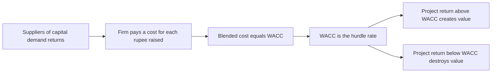
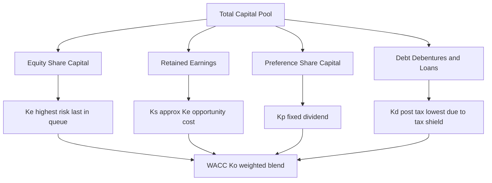
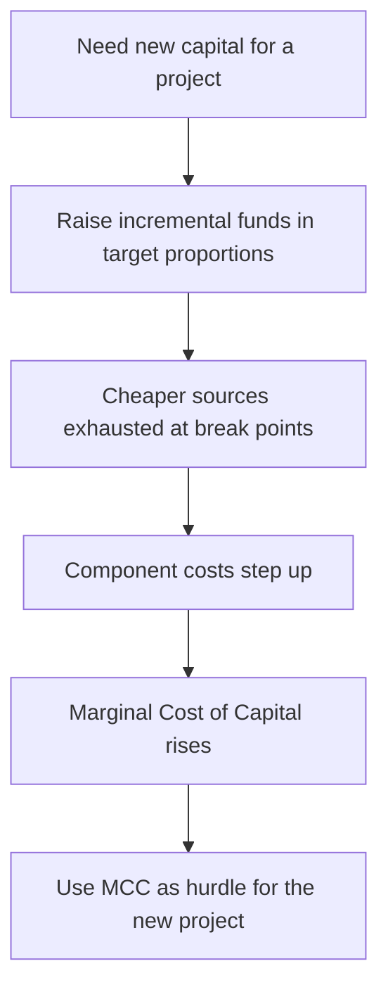
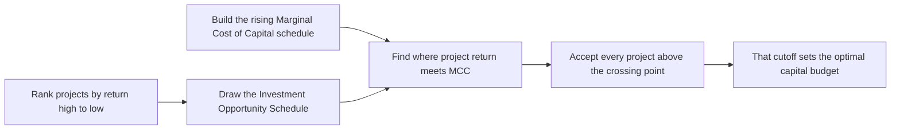

<!-- v2-deep -->

# Chapter 04 — Cost of Capital

## 1. The Problem — Money Is Not Free, So What Return Must a Project Clear?

In Chapter 03 you learned to say *yes* or *no* to an investment by discounting its future cash flows to today. But that whole machinery had a hidden ingredient we quietly waved through: **the discount rate**. Change the rate from 10% to 14% and an NPV can flip from positive to negative, an IRR-accept to an IRR-reject. The single most consequential number in capital budgeting is the rate — and we never justified where it comes from.

Here is the uncomfortable truth a finance manager must confront. A company does not conjure money from thin air. Every rupee it deploys was *supplied* by someone — a shareholder who bought equity, a bank that lent a term loan, a preference shareholder, a debenture-holder. **Each of these suppliers demanded a return in exchange for parting with their money.** The equity shareholder expects dividends and capital appreciation. The lender expects interest. The preference shareholder expects a fixed dividend. None of them handed cash over for charity.

So money has a **cost** — a price the firm pays for the privilege of using other people's capital. If a project earns *less* than what the firm pays to raise the money that funds it, the firm is destroying value: it borrows at 12% to earn 9%, a guaranteed slow bleed. If it earns *more*, it creates value — the surplus over the financing cost belongs to the equity owners.

This gives us the central role of cost of capital:

> **The cost of capital is the minimum rate of return a project must earn to leave the firm's value unchanged. It is the hurdle rate every investment must clear.**

That is why the invest decision and the finance decision are joined at the hip. You cannot decide *whether* to invest until you know *what it costs* to finance. The three FM decisions — invest, finance, distribute — all route through this one number.

**Three faces of the same idea (the examiner tests all three).** Cost of capital is defined in three equivalent ways, and a theory question may quote any of them:

- **The financing (supplier) view** — the *return demanded by suppliers of capital*. This is the definition we build the formulas from.
- **The opportunity-cost (investor) view** — the *return the firm's investors could earn on the next-best investment of equal risk*. This is why retained earnings are not free (§4.4) and why we discount at the rate investors could get elsewhere.
- **The break-even (firm) view** — the *minimum required rate of return that keeps the market price of the share unchanged*. Earn exactly the cost of capital and the share price neither rises nor falls; earn more and it rises. This is the view that links cost of capital directly to wealth maximisation.

**A component has three sub-costs baked into it.** When ICAI's study material dissects "cost of capital" conceptually, each source's cost is the sum of:

- **Return at zero risk** (the pure time-value of money, roughly the risk-free rate),
- **Business-risk premium** (compensation for the operating uncertainty of the firm's assets), and
- **Financial-risk premium** (extra compensation because the firm uses debt, which magnifies the volatility of equity returns).

Symbolically, cost of capital $K = r_0 + b + f$, where $r_0$ is the riskless return, $b$ the business-risk premium and $f$ the financial-risk premium. You rarely compute this decomposition numerically, but it explains *why* equity costs more than debt (equity absorbs both risk premiums in full) and why a highly-levered firm's equity gets dearer (the $f$ term swells).

*Figure 1: Cost of capital is the bridge from the finance decision to the invest decision.*

---

## 2. The Core Idea — The Weighted Rent on a Pool of Borrowed Tools

Imagine you run a workshop and you do not own a single tool. You rent everything. From one supplier you rent power drills at ₹100/day. From another you rent lathes at ₹300/day. From a third, a paint booth at ₹200/day. To keep the workshop open you pay a *blend* of these rents every single day, weighted by how much of each tool you've rented.

Now a customer offers you a job. Should you take it? Only if the job pays you *more per day than your blended daily rent*. If your average rent across all rented tools is ₹180/day, a job paying ₹150/day loses money even if it "feels" profitable in isolation. A job paying ₹250/day is worth taking.

The firm is that workshop. Its "tools" are the different **sources of finance** — equity, retained earnings, preference, debt. Each source charges its own "rent" (its component cost). The firm operates on a *blend* of them, weighted by how much it uses of each. That blended rent is the **Weighted Average Cost of Capital (WACC)** — and it is the number every project's return must beat.

Two subtleties fall straight out of the analogy, and they matter for the exam:

- **Riskier tools cost more.** The lathe (equity — last in line, no guaranteed return) costs more to rent than the drill (debt — first in line, contractually protected). We'll see cost of equity is always the highest component.
- **The blend depends on the *value* of each tool, not what you paid for it years ago.** If you want to know what it costs to keep operating *today*, you use *today's* rental rates on *today's* values — this is the seed of the market-weights argument later.

**Explicit vs implicit cost — a distinction the theory paper loves.** The "rent" you *pay in cash* (interest, dividend) is the **explicit cost** — the discount rate that equates the cash a source brings in with the present value of the cash outflows it triggers. But some costs are **implicit** (or *imputed*): they are opportunity costs that never appear as a cash payment. Retained earnings have a **zero explicit cost** (the firm pays nothing to keep them) but a very real **implicit cost** — the return shareholders forgo. When a firm uses debt today, it also incurs an *implicit* cost on future capital, because piling on debt now makes tomorrow's equity riskier and dearer. Whenever a question asks "is retained earnings free?", it is testing whether you can separate explicit (cash) from implicit (opportunity) cost.

**Average vs marginal, previewed.** The blended rent computed on the *whole existing pool* is the **average** cost of capital. The rent on the *next tool you rent* is the **marginal** cost. For an incremental job (a new project financed with new money), it is the marginal rent that matters — a point we develop fully in §4.6.

---

## 3. Why It's Built This Way — Risk, Priority, and the Tax System

Three structural facts about how a company is financed explain *every* formula in this chapter. Understand these and you never memorise a formula again — you *derive* it.

**Fact 1 — Capital sources sit in a priority queue.** When cash is distributed (or the firm is wound up), the queue is: debt-holders first, preference shareholders next, equity shareholders last. The equity holder is the **residual claimant** — she gets whatever is left, or nothing. Because she bears the most risk (last in line, no promise), she demands the **highest** return. Because the debt-holder is protected by contract and priority, he accepts the **lowest**. So we already know, before any arithmetic:

$$K_d < K_p < K_e$$

Cost of debt < cost of preference < cost of equity. If your computed numbers violate this ordering, you've made an error — this is a self-check built into the theory.

**Fact 2 — Interest is tax-deductible; dividends are not.** The tax law treats interest on debt as an *expense* that reduces taxable profit. Dividends (to equity or preference) are paid *out of after-tax profit* — they get no such deduction. This single asymmetry is the reason debt is cheaper than its coupon suggests, and it forces us to compute cost of debt on a **post-tax** basis. It is the deepest "why" in the chapter, so we'll unpack the mechanics fully in §4.

**Fact 3 — We finance with a *mix*, so we need a *weighted average*.** No real firm is 100% equity or 100% debt. It raises a pool. A project isn't funded by "the debt" or "the equity" specifically — it is funded by the *pool*. Therefore the relevant hurdle is the *average* cost of the pool, weighted by each source's share. Hence WACC — also called the **overall / composite cost of capital**, denoted $K_o$.

**Why not just use the cost of the source that actually funds the project?** Students often ask: if a new plant is bought entirely with a fresh 9% loan, why not use 9% as the hurdle instead of a 14% WACC? Because financing is *fungible*. Loading debt onto this project consumes the firm's borrowing capacity and forces the *next* project to be funded with costlier equity. Judging each project by the specific, temporarily-cheap money that happens to fund it would accept a string of low-return projects merely because debt was drawn first, then reject good projects later when only dear equity is left. The firm must therefore apply a **pooled, target-structure WACC** so every project faces the same, fair, blended hurdle. This is the "**pooling principle**", and it is the single most important reason WACC exists.

*Figure 2: The four component costs feed the weighted average, ordered by risk.*

---

## 4. Full Technical Content — Every Component Cost, With Its Reasoning

We build WACC bottom-up: first the cost of each individual source, then the blend. Notation used throughout: $K_e$ = cost of equity, $K_r$/$K_s$ = cost of retained earnings, $K_p$ = cost of preference, $K_d$ = cost of debt, $K_o$ = WACC. $t$ = tax rate.

**One idea unifies every component cost.** Each source's cost is the **discount rate that equates the net cash the source brings into the firm today with the present value of every cash outflow the firm must make to that supplier.** Interest, dividend, and redemption are outflows; net proceeds are the inflow. The "exact" way to solve for that rate is IRR/YTM (used for redeemable debt below); the ratio formulas ICAI uses are quick approximations of it. Keep this in mind and every formula reads as "annual cost ÷ money at your disposal."

### 4.1 Cost of Debt ($K_d$) — and why the tax shield changes everything

Debt has an explicit, contractual cost: the **interest** the firm promises to pay. That is the starting point. But two adjustments convert the coupon into the true economic cost.

**Adjustment A — the tax shield (the "why" behind post-tax).**
Suppose a firm borrows ₹100 at 10% coupon, and the tax rate is 30%. The stated interest is ₹10. But interest is deducted *before* computing tax, so paying ₹10 of interest reduces taxable income by ₹10, which reduces tax by ₹10 × 30% = ₹3. The government effectively subsidises ₹3 of the interest. So the firm's *real, out-of-pocket* cost is only ₹10 − ₹3 = ₹7, i.e. **7%**, not 10%.

The mechanism, expressed as a formula:

$$K_d = I \,(1 - t)$$

where $I$ is the interest rate (or interest amount over the relevant base). Equivalently, **post-tax cost = pre-tax cost × (1 − t)**. This is *the* reason firms favour a slice of debt: the tax system quietly discounts it. Preference and equity get **no** such adjustment because their dividends aren't deductible.

> **Tax-shield caveat (theory trap).** The shield only bites if the firm is **profitable enough to pay tax**. A loss-making firm, or one already sheltering profits with carried-forward losses, gets *no* deduction — its effective cost of debt is the full pre-tax coupon. If a problem states the firm has no taxable income, drop the (1 − t) factor. Examiners occasionally slip this in as a one-line qualifier.

**Adjustment B — net proceeds, not face value.**
The firm rarely receives the full face value. It may issue at a discount, pay flotation costs, or redeem at a premium. So we compute cost on the **net proceeds** actually received and account for the **redemption** actually paid.

*Irredeemable (perpetual) debt* — never repaid, interest forever:

$$K_d = \frac{I\,(1 - t)}{NP}$$

where $I$ = annual interest (₹ amount), $NP$ = net proceeds per debenture.

*Redeemable debt* — repaid after $n$ years. Use the **approximation formula** (ICAI's standard; exact method is IRR/YTM):

$$K_d = \frac{I\,(1 - t) + \dfrac{(RV - NP)}{n}}{\dfrac{RV + NP}{2}}$$

Read it as reasoning, not symbols:
- **Numerator** = the *annual* cost. First term: after-tax interest. Second term: the redemption premium or discount, spread evenly over the $n$ years of life. $(RV − NP)$ is what you gain (or lose) at maturity by having received $NP$ but repaying $RV$; dividing by $n$ annualises it.
- **Denominator** = the *average* amount of money at the firm's disposal over the life of the debt — the mean of what came in ($NP$) and what goes out ($RV$).

$RV$ = redemption value, $NP$ = net proceeds. Note the redemption premium/discount adjustment is **not** tax-adjusted in the standard ICAI treatment (only interest carries the tax shield).

**The exact method — Yield to Maturity (YTM) by interpolation.** When a problem says "find the cost of debt by the present-value / YTM method," the approximation above won't do. You find the rate $K_d$ (post-tax) at which:

$$NP = \sum_{y=1}^{n} \frac{I(1-t)}{(1+K_d)^y} + \frac{RV}{(1+K_d)^n}$$

Procedure: pick two trial rates, compute NPV of the debt cash flows at each, and interpolate:

$$K_d = L + \frac{NPV_L}{NPV_L - NPV_H}\times (H - L)$$

where $L$ and $H$ are the low and high trial rates and $NPV_L$, $NPV_H$ the corresponding net present values (inflow $NP$ minus PV of outflows). The approximation formula is just a shortcut that lands close to this IRR; use YTM only when the question demands it.

**Cost of a term loan / bank borrowing.** For a plain bank loan there is no premium or discount — net proceeds equal face value and redemption equals face value. The cost collapses to simply **$K_d = \text{Interest rate}\times(1 - t)$**. If the loan carries an upfront processing fee, reduce the net proceeds accordingly.

**Cost of a zero-coupon bond (deep-discount bond).** Here there is *no* annual interest; the entire return is the gap between issue price and redemption. The cost is the compound rate linking the two:

$$K_d = \left(\frac{RV}{NP}\right)^{1/n} - 1 \quad\text{(pre-tax)}$$

The implicit annual "interest" (the accreted discount) is tax-deductible each year, so the post-tax cost is lower; unless the problem gives the year-wise amortisation, ICAI usually accepts the pre-tax compound rate and notes the tax effect qualitatively. Flag as "apply tax treatment per the problem's instruction."

**Floating-rate note.** If a question quotes debt as "base rate + spread," use the current all-in rate as $I$; the (1 − t) treatment is unchanged.

### 4.2 Cost of Preference Capital ($K_p$) — a fixed dividend, no tax shield

Preference shares pay a fixed dividend, ranking ahead of equity but behind debt. The logic mirrors debt — *but with no (1 − t) factor*, because preference dividend is paid from after-tax profit and earns no deduction.

*Irredeemable preference:*

$$K_p = \frac{PD}{NP}$$

*Redeemable preference:*

$$K_p = \frac{PD + \dfrac{(RV - NP)}{n}}{\dfrac{RV + NP}{2}}$$

where $PD$ = annual preference dividend (₹). Same structure as redeemable debt, tax factor dropped.

> Exam nuance: if the problem mentions **Dividend Distribution Tax (DDT)** or a grossing-up on preference dividend, add it to $PD$. Post-2020 Indian law abolished DDT, so modern ICAI problems usually ignore it unless explicitly stated. Follow the problem. *(Verify current ICAI material / AY for the DDT position applicable to your attempt.)*

**Why preference sits between debt and equity — and can it ever misbehave?** Its dividend is fixed (like debt's coupon) but *not* contractually enforceable — a company can skip a preference dividend without triggering default, whereas skipping interest is default. So preference is riskier than debt (hence $K_p > K_d$) but safer than equity (fixed claim, priority over equity, hence $K_p < K_e$). *Edge case the examiner can spring:* if preference is issued at a **discount** and redeemable at a **premium**, both the $NP$ (small) and the $(RV − NP)$ term (large) push $K_p$ up — occasionally far enough to *approach or exceed* a heavily tax-shielded $K_d$. That does not violate the ordering, because the ordering compares like-for-like *risk*; verify your arithmetic but don't panic if a deeply-discounted preference edges near debt.

### 4.3 Cost of Equity ($K_e$) — the hardest, because equity makes no promise

Debt and preference *tell* you their cost (the coupon, the fixed dividend). Equity promises nothing — no fixed dividend, no maturity. So its cost must be *inferred* from what shareholders *expect*. Several models exist; know the first two cold and the rest by name.

**Model 1 — Dividend Valuation / Dividend Growth Model (Gordon).**
The intuition: a share is worth the present value of all future dividends. Rearranging that valuation to solve for the return the market is implicitly demanding gives us $K_e$.

*No growth* (constant dividend forever):

$$K_e = \frac{D}{P}$$

*Constant growth* at rate $g$ (Gordon's model):

$$K_e = \frac{D_1}{P_0} + g$$

where $D_1$ = expected dividend **next year** = $D_0(1+g)$, $P_0$ = current market price (use **net proceeds** if computing cost of *fresh* issue, to absorb flotation costs), $g$ = constant growth rate of dividends.

Read it as economics: the shareholder's return has two parts — the **dividend yield** ($D_1/P_0$, cash in hand) plus the **capital gain** ($g$, the price growing as dividends grow). Their sum is the total return she demands, which is exactly the firm's cost of equity.

*Estimating $g$:* if dividends grew from $D_{past}$ to $D_{now}$ over $n$ years, $g = \left(\dfrac{D_{now}}{D_{past}}\right)^{1/n} - 1$. Or, from fundamentals, $g = b \times r$ where $b$ = retention ratio and $r$ = return on equity (the **growth = retention × ROE** relationship). *Watch the exponent:* if dividends are given for years 0 through 5, that is **5 years of growth** (n = 5), not 6 — count the *intervals*, not the data points.

**Model 2 — Capital Asset Pricing Model (CAPM).**
The intuition: a shareholder demands the **risk-free rate** as a baseline, plus a **premium for risk** — and only *systematic* (non-diversifiable, market-wide) risk is rewarded, scaled by the stock's **beta**.

$$K_e = R_f + \beta\,(R_m - R_f)$$

where $R_f$ = risk-free return (govt securities), $R_m$ = expected market return, $\beta$ = the stock's sensitivity to market movements, and $(R_m − R_f)$ = the **market risk premium**. A β of 1 moves with the market; β > 1 is more volatile (higher cost); β < 1 is defensive (lower cost). CAPM shines when the firm pays no/erratic dividends, where Gordon's model breaks down.

*Why only systematic risk is priced:* a diversified investor has already washed out firm-specific (unsystematic) risk by holding many stocks, so the market refuses to pay her for bearing risk she could have diversified away. She is compensated *only* for the risk she cannot escape — the market-wide (systematic) component, captured by β. This is the conceptual heart of CAPM and a favourite one-mark theory point.

**Model 3 — Bond Yield plus Risk Premium approach.** A quick practitioner's estimate: since equity is riskier than the firm's own debt, add a judgement-based equity risk premium to the firm's pre-tax cost of debt:

$$K_e = \text{Yield on the firm's long-term debt} + \text{Risk premium}$$

Used when neither reliable dividends nor a trustworthy β are available. Know it by name; ICAI occasionally references it.

**Model 4 — Realised-yield / earnings-price approach.** In the absence of growth data, the **earnings yield** $E/P$ (earnings per share ÷ price) is sometimes used as a rough $K_e$. It equals the Gordon result *only* under the special assumption of zero growth and a 100% payout, so treat it as a crude proxy, not a general formula.

**Reconciling Gordon and CAPM.** The two rarely give the same number because they use different inputs (dividend expectations vs market-risk pricing). That is normal and *not* a mistake. In a problem that supplies data for both, ICAI usually expects you to compute both and either average them or use the one the question emphasises — read the requirement carefully.

### 4.4 Cost of Retained Earnings ($K_r$ or $K_s$) — the "free money" illusion

Students instinctively think retained earnings are *free* — the firm already has the cash, it paid nothing to keep it. **This is the classic trap.** Retained earnings are profits that *belonged to equity shareholders* and could have been paid out as dividends. By retaining them, the firm denies shareholders that cash. Shareholders tolerate this **only if** the firm reinvests it to earn at least what *they* could have earned — i.e., the cost of equity. This is an **opportunity cost** argument.

Therefore, as a first approximation:

$$K_r = K_e$$

Two refinements can *lower* $K_r$ slightly below $K_e$ (apply only if the problem gives the data):
- **Personal tax ($t_p$):** shareholders would have paid tax on dividends received, so the effective opportunity cost is reduced: $K_r = K_e(1 - t_p)$.
- **Brokerage/commission cost ($b$):** to reinvest a received dividend elsewhere, the shareholder pays brokerage, reducing what they'd effectively deploy: $K_r = K_e(1 - t_p)(1 - b)$.

Default for the exam unless told otherwise: **$K_r = K_e$**. But note the *difference from fresh equity*: fresh equity issue incurs **flotation costs** (reducing net proceeds), so cost of *new* equity is typically *higher* than cost of retained earnings. Retained earnings avoid issue costs.

> **The logic of the (1 − t_p)(1 − b) adjustment, made concrete.** Say the firm could pay ₹100 of dividends. The shareholder receives it, loses personal tax at say 10% (₹10), and pays 2% brokerage (₹1.80 on the remaining ₹90) to reinvest, leaving ₹88.20 actually working elsewhere. So retaining ₹100 inside the firm only needs to "beat" a ₹88.20 alternative — hence the opportunity cost is scaled down by (1 − t_p)(1 − b). The adjustment reflects *friction* the shareholder avoids by letting the firm retain. Only apply it when both figures are given; otherwise $K_r = K_e$.

### 4.5 The Blend — WACC ($K_o$)

Now combine. Multiply each component cost by its weight (share of total capital) and sum:

$$K_o = K_e \cdot w_e + K_r \cdot w_r + K_p \cdot w_p + K_d \cdot w_d$$

More cleanly:

$$WACC = \sum (\text{component cost} \times \text{weight})$$

Two ways to weight, and the choice is examined heavily.

| Weighting basis | What it uses | Pros | Cons |
|---|---|---|---|
| **Book value weights** | Balance-sheet (historical) values | Easy, stable, always available | Reflect *sunk* past values, not current cost of raising money |
| **Market value weights** | Current market prices of equity/debt | Reflect *today's* opportunity cost and true investor expectations | Prices fluctuate; unlisted firms lack them |

**Why market weights are preferred (the reasoning):** WACC is meant to be the *hurdle rate for raising money today to fund tomorrow's projects*. The relevant cost is what investors demand *now*, and that is embedded in *current market prices*, not the historical figures frozen in the balance sheet. A share issued at ₹10 par years ago may trade at ₹150 today — equity's true weight in the firm's economic value is driven by the ₹150, not the ₹10. Using book weights would understate equity's (larger, costlier) role and distort the hurdle rate. So: **market-value weights give a WACC that reflects the real, current cost of capital.** (The practical objection — prices move daily and unlisted debt has no quote — is why book weights survive as a fallback.)

**A third weighting basis you must recognise — marginal (target) weights.** Some questions specify the *proportions in which fresh funds will be raised* — the firm's **target capital structure**. When the decision is about new financing, these **marginal weights** are the most correct of all, because WACC is meant to price the *next* rupee. Example 3 uses exactly this basis. So the full hierarchy of correctness for a *financing* decision is: **marginal (target) weights > market weights > book weights.**

> Trap: When market weights are used and the firm has **retained earnings**, they usually have no separate market price. Convention: fold retained earnings into the **market value of equity** (equity's market cap already reflects retained profits). Alternatively, if instructed, split the equity market value between fresh equity and retained earnings in the *book-value proportion*. Follow the problem's instruction.

**Book value of debt vs market value of debt.** For redeemable debt, the market value is the PV of its remaining coupons and redemption at the current yield — often given directly as a quoted price. Use the *market* price for market-weight WACC and the balance-sheet (face) amount for book-weight WACC. Do not mix a market weight with a book cost or vice versa within one column.

**Should component costs be pre-tax or post-tax in the blend?** Always **post-tax throughout**. WACC is used to discount *post-tax* project cash flows in NPV, so consistency demands post-tax component costs. Debt enters at $I(1 − t)$; equity and preference are already effectively post-tax (no shield to remove). Mixing a pre-tax $K_d$ into WACC is a silent, marks-losing error.

### 4.6 Marginal Cost of Capital (MCC) — the cost of the *next* rupee

WACC as computed above is the *average* cost of the *existing* pool. But for a *new* project you're raising *new* money — and the cost of raising *additional* capital can differ from the historical average. The **marginal cost of capital** is the weighted average cost of the *incremental* (fresh) funds raised to finance new investment.

Why it rises as you raise more: cheap sources get exhausted. A firm can only retain so much earnings; beyond that it must issue fresh equity (with flotation costs → higher $K_e$). Lenders demand higher rates as leverage climbs. The point at which a source's cost jumps is a **break point**:

$$\text{Break point} = \frac{\text{Total amount of cheaper source available}}{\text{Weight of that source in capital structure}}$$

For *marginal* decisions, the MCC — not the historical WACC — is the correct hurdle. If the firm keeps its capital-structure proportions unchanged and component costs constant, MCC = WACC. When new financing shifts costs or proportions, MCC diverges and governs the accept/reject line for incremental projects.

**Multiple break points and the MCC schedule.** A single raise can cross *several* break points — one where retained earnings run out, another where cheap debt is exhausted and a higher coupon kicks in, and so on. Each break point starts a new "step," and the sequence of WACCs across steps forms the **marginal cost of capital schedule** (a rising staircase). To find the break points, compute one for *each* source that has a limited cheap tranche, then sort them ascending; between consecutive break points the MCC is constant, and it jumps at each. Pair this schedule against the firm's ranked investment opportunities (the **Investment Opportunity Schedule**): accept projects from the highest return downward until a project's return falls below the MCC prevailing at that cumulative level of financing. The intersection is the firm's **optimal capital budget**.

*Figure 3: Marginal cost of capital is the hurdle for incremental investment.*

*Figure 4: The optimal capital budget sits where the investment opportunity schedule meets the marginal cost of capital.*

---

## 5. Worked Examples — Full Step-by-Step

### Example 1 (Warm-up) — Every component cost in isolation

**Data.** Reliable Ltd, tax rate 30%.
- (a) Debentures: ₹100 face, 12% coupon, irredeemable, issued at ₹96 net.
- (b) Preference: ₹100 face, 10% dividend, irredeemable, issued at ₹105 (premium).
- (c) Equity: current price ₹80, dividend just paid $D_0$ = ₹6, growth 5%.
- (d) Also compute equity via CAPM: $R_f$ = 7%, $R_m$ = 15%, β = 1.2.
- (e) Retained earnings.

**(a) Cost of irredeemable debt.**
After-tax interest = ₹12 × (1 − 0.30) = ₹8.40.
$$K_d = \frac{8.40}{96} = 0.0875 = \mathbf{8.75\%}$$

**(b) Cost of irredeemable preference.**
No tax adjustment. $NP$ = ₹105.
$$K_p = \frac{10}{105} = 0.0952 = \mathbf{9.52\%}$$

**(c) Cost of equity — Gordon.**
$D_1 = D_0(1+g) = 6 × 1.05 = ₹6.30$.
$$K_e = \frac{6.30}{80} + 0.05 = 0.07875 + 0.05 = 0.12875 = \mathbf{12.88\%}$$

**(d) Cost of equity — CAPM.**
$$K_e = 7\% + 1.2\,(15\% - 7\%) = 7\% + 1.2 × 8\% = 7\% + 9.6\% = \mathbf{16.6\%}$$
(The two methods differ because they use different inputs — normal. The exam expects whichever the problem's data supports.)

**(e) Cost of retained earnings.** No personal tax/brokerage given, so $K_r = K_e = \mathbf{12.88\%}$ (using the Gordon figure).

**Self-check on ordering:** $K_d$ 8.75% < $K_p$ 9.52% < $K_e$ 12.88%. Priority-queue logic holds. ✓

---

### Example 2 (Redeemable instruments + full WACC, book vs market weights)

**Data.** Sterling Ltd, tax rate 25%. Capital structure and details:

| Source | Book value (₹) | Market value (₹) | Details |
|---|---|---|---|
| Equity (₹10 shares) | 40,00,000 | 90,00,000 | $D_1$ = ₹4, price ₹22.50, g = 6% |
| Retained earnings | 20,00,000 | (in equity MV) | — |
| 12% Preference (₹100) | 10,00,000 | 9,00,000 | Redeemable at par in 5 yrs, current price ₹90 |
| 10% Debentures (₹100) | 30,00,000 | 31,00,000 | Redeemable at ₹105 in 6 yrs, net proceeds ₹98 |

**Step 1 — Cost of equity (Gordon).**
$$K_e = \frac{4}{22.50} + 0.06 = 0.1778 + 0.06 = 0.2378 = \mathbf{23.78\%}$$
Retained earnings: $K_r = K_e = 23.78\%$.

**Step 2 — Cost of redeemable preference.**
$PD$ = ₹12, $RV$ = ₹100, $NP$ = ₹90, $n$ = 5.
Annualised premium/discount = (100 − 90)/5 = ₹2.
Average funds = (100 + 90)/2 = ₹95.
$$K_p = \frac{12 + 2}{95} = \frac{14}{95} = 0.1474 = \mathbf{14.74\%}$$

**Step 3 — Cost of redeemable debt.**
$I$ = ₹10, $t$ = 0.25 → after-tax interest = 10 × 0.75 = ₹7.50.
$RV$ = ₹105, $NP$ = ₹98, $n$ = 6.
Annualised (RV − NP) = (105 − 98)/6 = 7/6 = ₹1.1667.
Average funds = (105 + 98)/2 = ₹101.50.
$$K_d = \frac{7.50 + 1.1667}{101.50} = \frac{8.6667}{101.50} = 0.0854 = \mathbf{8.54\%}$$

**Self-check ordering:** $K_d$ 8.54% < $K_p$ 14.74% < $K_e$ 23.78%. ✓

**Step 4 — WACC using BOOK weights.**
Total book capital = 40 + 20 + 10 + 30 = ₹100,00,000 (lakhs, convenient).

| Source | Book value (₹ lakh) | Weight | Cost | Weight × Cost |
|---|---|---|---|---|
| Equity | 40 | 0.40 | 23.78% | 9.512% |
| Retained earnings | 20 | 0.20 | 23.78% | 4.756% |
| Preference | 10 | 0.10 | 14.74% | 1.474% |
| Debentures | 30 | 0.30 | 8.54% | 2.562% |
| **Total** | **100** | **1.00** | | **18.304%** |

**WACC (book weights) = 18.30%.**

**Step 5 — WACC using MARKET weights.**
Retained earnings have no separate market value → folded into equity's market cap (₹90 lakh already reflects them). So market values: Equity ₹90 lakh, Preference ₹9 lakh, Debentures ₹31 lakh. (We apply $K_e$ to the whole equity market value, since retained earnings' opportunity cost is also $K_e$.)
Total market value = 90 + 9 + 31 = ₹130 lakh.

| Source | Market value (₹ lakh) | Weight | Cost | Weight × Cost |
|---|---|---|---|---|
| Equity (incl. retained) | 90 | 0.6923 | 23.78% | 16.463% |
| Preference | 9 | 0.0692 | 14.74% | 1.020% |
| Debentures | 31 | 0.2385 | 8.54% | 2.037% |
| **Total** | **130** | **1.0000** | | **19.520%** |

**WACC (market weights) = 19.52%.**

**Interpretation.** Market WACC (19.52%) > book WACC (18.30%) because equity — the costliest source — carries a *larger* weight at market value (69% vs 60% book) than its historical book share suggests. The market figure is the truer hurdle rate: any new project must beat ~19.5% to create value.

---

### Example 3 (Exam-hard) — Cost of new (fresh) capital, flotation, and Marginal Cost of Capital with a break point

**Data.** Vertex Ltd plans to raise ₹50,00,000 for expansion, maintaining its target capital structure: **Equity 50%, Preference 10%, Debt 40%.** Tax rate 30%.

- **Equity:** Current market price ₹120. Next year's dividend $D_1$ = ₹12, growth 8%. Fresh equity issue incurs flotation cost of ₹8 per share (i.e., net proceeds ₹112). The firm has ₹15,00,000 of **retained earnings** available (no flotation cost).
- **Preference:** Fresh 11% preference at ₹100 face, redeemable at par in 5 years, net proceeds ₹96.
- **Debt:** 10% debentures, ₹100 face, redeemable at par in 10 years, net proceeds ₹95.

**Required:** (i) component costs; (ii) the retained-earnings break point; (iii) WACC below and above the break point; (iv) the marginal cost governing the ₹50 lakh raise.

**Step 1 — Cost of retained earnings (no flotation).**
$$K_r = \frac{D_1}{P_0} + g = \frac{12}{120} + 0.08 = 0.10 + 0.08 = \mathbf{18.00\%}$$

**Step 2 — Cost of fresh equity (with flotation → use net proceeds ₹112).**
$$K_e = \frac{12}{112} + 0.08 = 0.1071 + 0.08 = 0.1871 = \mathbf{18.71\%}$$
Fresh equity costs more than retained earnings — exactly because of flotation cost. ✓

**Step 3 — Cost of fresh redeemable preference.**
$PD$ = ₹11, $RV$ = ₹100, $NP$ = ₹96, $n$ = 5.
Annualised (RV − NP) = (100 − 96)/5 = ₹0.80.
Average = (100 + 96)/2 = ₹98.
$$K_p = \frac{11 + 0.80}{98} = \frac{11.80}{98} = 0.1204 = \mathbf{12.04\%}$$

**Step 4 — Cost of fresh redeemable debt.**
After-tax interest = 10 × (1 − 0.30) = ₹7.
$RV$ = ₹100, $NP$ = ₹95, $n$ = 10.
Annualised (RV − NP) = (100 − 95)/10 = ₹0.50.
Average = (100 + 95)/2 = ₹97.50.
$$K_d = \frac{7 + 0.50}{97.50} = \frac{7.50}{97.50} = 0.0769 = \mathbf{7.69\%}$$

**Self-check ordering:** $K_d$ 7.69% < $K_p$ 12.04% < $K_r$ 18.00% < $K_e$ 18.71%. ✓

**Step 5 — Retained-earnings break point.**
Retained earnings are the *cheap* form of equity. Equity is 50% of the structure. The firm can fund equity from retained earnings only until the ₹15 lakh runs out:
$$\text{Break point} = \frac{\text{Retained earnings available}}{\text{Weight of equity}} = \frac{15,00,000}{0.50} = ₹30,00,000$$
So up to ₹30 lakh of *total* new capital, the equity portion (50% × ₹30L = ₹15L) is covered by retained earnings. Beyond ₹30 lakh, further equity must be fresh issue at the higher $K_e$.

**Step 6 — WACC (marginal) below the break point (raises up to ₹30 lakh).**
Equity component uses $K_r$ = 18.00%.

| Source | Weight | Cost | Weight × Cost |
|---|---|---|---|
| Equity (retained) | 0.50 | 18.00% | 9.000% |
| Preference | 0.10 | 12.04% | 1.204% |
| Debt | 0.40 | 7.69% | 3.076% |
| **MCC (first ₹30L)** | | | **13.28%** |

**Step 7 — WACC (marginal) above the break point (₹30L–₹50L slice).**
Equity component now uses fresh $K_e$ = 18.71%.

| Source | Weight | Cost | Weight × Cost |
|---|---|---|---|
| Equity (fresh) | 0.50 | 18.71% | 9.355% |
| Preference | 0.10 | 12.04% | 1.204% |
| Debt | 0.40 | 7.69% | 3.076% |
| **MCC (beyond ₹30L)** | | | **13.64%** |

**Step 8 — Marginal cost governing the full ₹50 lakh raise.**
The ₹50 lakh spans both zones: ₹30 lakh at 13.28% and ₹20 lakh at 13.64%. The *weighted marginal cost* of the whole raise:
$$\text{MCC} = \frac{(30 × 13.28\%) + (20 × 13.64\%)}{50} = \frac{398.4 + 272.8}{50} = \frac{671.2}{50} = \mathbf{13.42\%}$$

**Interpretation.** The *next* ₹20 lakh is dearer (13.64%) than the first ₹30 lakh (13.28%) because cheap retained earnings are exhausted and costlier fresh equity kicks in. For accept/reject on the expansion, the **marginal cost of 13.42%** — not any historical WACC — is the hurdle. A project promising, say, 13% would be *rejected* even though it "sounds profitable," because it fails to cover the cost of the very money raised to fund it.

---

### Example 4 (Exam-hard) — Cost of equity by three methods, then WACC, and a reconciliation

**Data.** Aster Ltd, tax rate 30%. The board wants the cost of equity estimated by *three* approaches and then a book-value WACC.

- Equity: 5,00,000 shares of ₹10, currently quoted at ₹64. Last dividend $D_0$ = ₹4, and dividends have grown steadily from ₹2.72 five years ago to ₹4 now.
- CAPM inputs: $R_f$ = 6%, market return $R_m$ = 14%, β = 1.10.
- Bond-yield-plus-premium: the firm's long-term debt yields 11% pre-tax; a judgement risk premium of 5% applies.
- Debt in the books: ₹40,00,000 of 11% debentures at par, irredeemable, issued at par (net proceeds ₹100).

**Step 1 — Estimate the growth rate $g$ from dividend history.**
Dividends grew from ₹2.72 to ₹4 over **5 years** (5 intervals).
$$g = \left(\frac{4}{2.72}\right)^{1/5} - 1 = (1.4706)^{0.2} - 1$$
$(1.4706)^{0.2}$: take ln → ln 1.4706 = 0.3857; ÷5 = 0.07714; $e^{0.07714}$ = 1.0802.
$$g = 1.0802 - 1 = 0.0802 \approx \mathbf{8\%}$$

**Step 2 — Cost of equity, Gordon.**
$D_1 = D_0(1+g) = 4 × 1.08 = ₹4.32$.
$$K_e = \frac{4.32}{64} + 0.08 = 0.0675 + 0.08 = 0.1475 = \mathbf{14.75\%}$$

**Step 3 — Cost of equity, CAPM.**
$$K_e = 6\% + 1.10\,(14\% - 6\%) = 6\% + 1.10 × 8\% = 6\% + 8.8\% = \mathbf{14.80\%}$$

**Step 4 — Cost of equity, Bond yield + risk premium.**
$$K_e = 11\% + 5\% = \mathbf{16.00\%}$$

**Reconciliation.** Gordon (14.75%) and CAPM (14.80%) agree closely — reassuring, because both draw on market-consistent inputs (the ₹64 price already embeds the 8% growth the market expects, and β prices the same equity risk). The bond-yield method (16%) sits higher because its 5% premium is a *judgement* add-on, deliberately conservative. For WACC we use the **CAPM/Gordon consensus of ≈14.78%** (average of the two market-based figures); the bond-yield number is a sanity check, not the driver.

Take $K_e = \dfrac{14.75 + 14.80}{2} = \mathbf{14.78\%}$.

**Step 5 — Cost of irredeemable debt (post-tax).**
$$K_d = \frac{11(1 - 0.30)}{100} = \frac{7.70}{100} = \mathbf{7.70\%}$$

**Step 6 — Book-value WACC.**
Equity book value = 5,00,000 × ₹10 = ₹50,00,000. Debt = ₹40,00,000. Total = ₹90,00,000.

| Source | Book value (₹ lakh) | Weight | Cost | Weight × Cost |
|---|---|---|---|---|
| Equity | 50 | 0.5556 | 14.78% | 8.211% |
| Debt | 40 | 0.4444 | 7.70% | 3.422% |
| **Total** | **90** | **1.0000** | | **11.633%** |

**WACC ≈ 11.63%.**

**Self-check.** $K_d$ 7.70% < $K_e$ 14.78% ✓; weights sum to 1.0000 ✓; WACC lies *between* the two component costs (7.70% and 14.78%) as any weighted average must — a quick sanity test that catches gross slips. ✓

---

### Example 5 (Examiner-tweak drill) — Zero-coupon debt, loss-making tax edge, and a break point on debt

**Data.** Nimbus Ltd, target structure **Equity 60%, Debt 40%**, plans to raise ₹1,00,00,000. Tax rate 30%.

- Equity: price ₹150, $D_1$ = ₹15, g = 7%. Retained earnings available: ₹24,00,000 (no flotation). Fresh equity net proceeds ₹140 (flotation ₹10).
- Debt tranche 1: bank loan up to ₹20,00,000 at 9% (post-tax already? No — pre-tax coupon 9%).
- Debt tranche 2: beyond ₹20,00,000, the firm must issue a **zero-coupon bond**, face ₹100, 5-year maturity, issued at ₹68.
- Twist: the firm expects a tax loss this year, so **no tax shield is available on debt this year** — compute debt cost on a *pre-tax* basis and flag it.

**Step 1 — Cost of retained earnings.**
$$K_r = \frac{15}{150} + 0.07 = 0.10 + 0.07 = \mathbf{17.00\%}$$

**Step 2 — Cost of fresh equity.**
$$K_e = \frac{15}{140} + 0.07 = 0.1071 + 0.07 = 0.1771 = \mathbf{17.71\%}$$

**Step 3 — Cost of debt tranche 1 (bank loan), no tax shield this year.**
Because there is no taxable income, the shield is worthless: $K_{d1} = 9\% × (1 − 0) = \mathbf{9.00\%}$ (pre-tax). *Flag: if the firm returns to profit, this falls to 9%(1 − 0.30) = 6.30% — verify the tax position stated in the problem.*

**Step 4 — Cost of debt tranche 2 (zero-coupon), no tax shield.**
$$K_{d2} = \left(\frac{100}{68}\right)^{1/5} - 1 = (1.4706)^{0.2} - 1 = 1.0802 - 1 = 0.0802 = \mathbf{8.02\%}$$
(No annual coupon, so no shield to worry about this year anyway; the accreted discount would be deductible in a profitable year — flag for the tax-paying case.)

**Step 5 — Break points.**
*Equity break point* (retained earnings exhaust): $\dfrac{24,00,000}{0.60} = ₹40,00,000$.
*Debt break point* (₹20L bank loan exhausts, weight of debt 40%): $\dfrac{20,00,000}{0.40} = ₹50,00,000$.
So as total financing climbs: cheap equity (retained) runs out at ₹40L; cheap debt (bank loan) runs out at ₹50L. Two break points → three MCC steps.

**Step 6 — MCC schedule.**

*Step A: ₹0 – ₹40L* (retained equity 17.00%, bank debt 9.00%):
$$0.60 × 17.00\% + 0.40 × 9.00\% = 10.20\% + 3.60\% = \mathbf{13.80\%}$$

*Step B: ₹40L – ₹50L* (fresh equity 17.71%, bank debt still 9.00%):
$$0.60 × 17.71\% + 0.40 × 9.00\% = 10.626\% + 3.60\% = \mathbf{14.23\%}$$

*Step C: ₹50L – ₹100L* (fresh equity 17.71%, zero-coupon debt 8.02%):
$$0.60 × 17.71\% + 0.40 × 8.02\% = 10.626\% + 3.208\% = \mathbf{13.83\%}$$

**Reading the schedule.** MCC rises from 13.80% to 14.23% when retained earnings run out, then *falls* to 13.83% once the bank loan is replaced by the cheaper zero-coupon bond (8.02% < 9.00%). This non-monotonic staircase is the "examiner tweak": break points do not always push MCC *up* — a later tranche can be cheaper. **Lesson: build the schedule tranche by tranche; never assume MCC only rises.** For the full ₹1 crore raise, weight each step's rupees:
$$\text{MCC}_{overall} = \frac{40(13.80) + 10(14.23) + 50(13.83)}{100} = \frac{552.0 + 142.3 + 691.5}{100} = \frac{1385.8}{100} = \mathbf{13.86\%}$$

---

## 6. Presentation / Format — How to Lay It Out in the Exam

Examiners award marks for structure, not just the final number. Adopt this discipline:

1. **State the formula first, then substitute.** Write $K_d = \frac{I(1-t) + (RV-NP)/n}{(RV+NP)/2}$, *then* plug numbers. Markers can award method marks even if arithmetic slips.
2. **Compute each component in a labelled sub-part** (a), (b), (c)… before touching WACC.
3. **Always present WACC as a table** with columns: Source | Value | Weight | Cost | Weighted Cost, and a **totals row**. The weights column must sum to 1.0000 — show it.
4. **State the weighting basis explicitly** ("WACC using market value weights") — if the question doesn't specify, compute **both** and note market is theoretically preferred.
5. **Carry 2 decimal places** in percentages; state final WACC to two decimals.
6. **Write a one-line interpretation** ("Any project must earn > X% to add value") — it signals conceptual understanding.
7. **Show your net-proceeds working.** When flotation, discount or premium is involved, write "Net proceeds = Face − flotation = ₹…" on its own line so the marker sees *why* your denominator isn't the face value.
8. **Round late, not early.** Carry intermediate figures to four decimals and round only the final percentage; premature rounding of $g$ or a component cost can shift WACC by several basis points and cost a reconciliation mark.
9. **Label the basis of every cost as pre- or post-tax.** One explicit line — "all component costs are post-tax" — pre-empts any doubt about the debt figure.

A clean WACC table skeleton:

| Source | Amount (₹) | Weight | Component Cost (%) | Weighted Cost (%) |
|---|---|---|---|---|
| Equity | … | … | … | … |
| Retained earnings | … | … | … | … |
| Preference | … | … | … | … |
| Debt | … | … | … | … |
| **Total** | **…** | **1.0000** | | **WACC = …** |

---

## 7. Connections — Where This Plugs Into the Rest of FM

- **← Chapter 03 (Capital Budgeting):** WACC *is* the discount rate you used in NPV and the hurdle you compared IRR against. This chapter supplies the number that chapter assumed. NPV computed at WACC directly measures value created *above* the cost of financing.
- **→ Capital Structure (Leverage) chapters:** Because $K_d < K_e$ and debt has a tax shield, adding debt initially *lowers* WACC — the seed of the "optimal capital structure" question. But too much debt raises financial risk, pushing both $K_e$ and $K_d$ up. WACC is the scoreboard on which the capital-structure debate (Net Income, Net Operating Income, MM, Traditional views) is settled.
- **→ Dividend Decision:** Cost of retained earnings ($K_r = K_e$) links straight to whether to retain or distribute. If the firm can reinvest retained earnings above $K_e$, retention creates value (Walter/Gordon models build on exactly this).
- **→ Business Valuation:** WACC is the discount rate for Free Cash Flow to Firm (FCFF); $K_e$ discounts Free Cash Flow to Equity (FCFE).
- **↔ Risk & Return / CAPM:** β and the market risk premium reappear across FM; cost of equity is where they first do real work.
- **↔ Leverage & the financial-risk premium:** the $f$ term in §1's decomposition ($K = r_0 + b + f$) is exactly what the degree of financial leverage governs — this chapter and the leverage chapter are two views of the same risk premium.
- **→ Economic Value Added (EVA):** EVA = NOPAT − (WACC × Capital Employed). WACC is the charge for capital that a firm must beat to create *economic* profit, not just accounting profit — a direct downstream use of this chapter's output.

---

## 8. Traps & Examiner Tricks

1. **Forgetting the tax shield on debt.** Using the 10% coupon directly instead of 10%(1 − t). Only **interest** gets the shield — never preference or equity dividends.
2. **Tax-adjusting the redemption premium.** In the redeemable-debt formula, only the *interest* term carries (1 − t); the (RV − NP)/n term does **not** (standard ICAI treatment). Don't over-apply the tax factor.
3. **Treating retained earnings as free.** The single most common conceptual error. $K_r = K_e$ by opportunity cost. Zero is always wrong.
4. **Using $D_0$ instead of $D_1$ in Gordon.** The numerator is *next year's expected* dividend = $D_0(1+g)$. Mixing them up understates $K_e$.
5. **Ignoring flotation costs / using price instead of net proceeds** for *fresh* issues. New equity/debt costs are computed on **net proceeds**, which is why fresh equity > retained earnings.
6. **Book vs market weights confusion.** If the question gives market values, use them (and say why they're preferred). Don't default to book out of habit. And remember to fold retained earnings into equity's market value.
7. **Ordering violation as a silent error signal.** If your computed $K_e < K_d$, you've almost certainly slipped — re-check. Risk logic forbids it (barring exotic tax edge cases).
8. **Marginal vs average confusion.** For a *new* project financed by *new* money, the hurdle is the **marginal** cost of capital, which can exceed the historical average once break points are crossed.
9. **CAPM sign/premium error.** The premium is β × (R_m − R_f), *added* to R_f. Don't compute β × R_m. And (R_m − R_f) is the *excess* return, not R_m alone.
10. **Weights not summing to 1.** Always show the totals row; a weight column that doesn't total 1.0000 flags an arithmetic slip before you lose the final marks.
11. **Miscounting the growth period $n$.** Dividends "from year 0 to year 5" span *5* intervals, not 6. An off-by-one in the exponent of $g = (D_{now}/D_{past})^{1/n} - 1$ throws off $K_e$ and every downstream figure.
12. **Mixing pre-tax cost with a market weight (or vice versa).** Keep the *whole* blend post-tax and keep weight-basis consistent — all market or all book — across every row. Never a market weight against a book-face cost.
13. **Assuming MCC only rises.** A later, cheaper tranche (e.g. a low zero-coupon yield replacing a dearer loan) can *lower* a subsequent step. Build the schedule tranche by tranche instead of assuming a monotonic staircase (see Example 5).
14. **Applying the tax shield to a loss-making firm.** No taxable profit means no deduction — use the pre-tax coupon and flag it. The (1 − t) factor is not automatic.
15. **Grossing-up preference dividend for DDT when DDT no longer applies.** Post-2020 there is generally no DDT; only gross up if the problem explicitly says so. Verify the position for your attempt's AY.
16. **Confusing earnings yield (E/P) with cost of equity.** E/P equals $K_e$ only under zero growth and full payout; otherwise it is a crude proxy, not the Gordon result.

---

## 9. First-Principles Recap

Strip everything away and here is the chain of reasoning, rebuildable from scratch:

- Money is supplied by investors who **demand a return**. That demanded return is the firm's **cost** for using their money. Equivalently, it is the shareholders' **opportunity cost** and the **break-even** return that leaves the share price unchanged.
- Suppliers sit in a **priority queue** (debt → preference → equity). Risk rises down the queue, so demanded return rises: $K_d < K_p < K_e$.
- Each component cost embeds a riskless return plus a **business-risk** and a **financial-risk** premium; equity carries both in full, which is why it is dearest.
- **Interest is tax-deductible; dividends are not.** So debt's true cost is $I(1 − t)$ — the government subsidises part of it. This alone makes debt the cheapest source and explains why firms lever up. But the shield only works if the firm actually pays tax.
- **Debt cost** = after-tax interest ÷ funds employed (net proceeds for perpetual; spread-the-premium average formula for redeemable; YTM interpolation when exactness is demanded; compound rate for zero-coupon).
- **Preference cost** = same shape as debt but **no** tax shield.
- **Equity cost** must be *inferred* (equity promises nothing): dividend yield + growth (**Gordon**, $D_1/P_0 + g$), risk-free + β × market premium (**CAPM**), or **bond yield + risk premium** as a fallback. Only *systematic* risk is priced.
- **Retained earnings** are *not free* — their cost is the equity shareholders' foregone return, so $K_r = K_e$ (an *implicit* cost with zero *explicit* cost). Fresh equity is dearer because of flotation costs.
- The firm finances with a **mix**, so the true hurdle is the **weighted average** — WACC. Weight by **marginal/target proportions** for a financing decision, else by **market value**, because these reflect today's real cost of capital.
- For the **next** project funded by **new** money, use the **marginal** cost of capital, which steps up (or occasionally down) as tranches change at their **break points**. Pair the MCC schedule with the investment opportunity schedule to set the optimal capital budget.
- **The output — WACC/MCC — is the hurdle rate.** Beat it, create value; miss it, destroy value. That is why cost of capital is the hinge connecting the finance decision to the invest decision, both in service of maximising shareholder wealth.

---

## 10. Quick-Revision Sheet

**Component costs**

| Source | Formula | Key notes |
|---|---|---|
| Irredeemable debt | $K_d = \dfrac{I(1-t)}{NP}$ | Tax shield on interest only |
| Redeemable debt | $K_d = \dfrac{I(1-t) + (RV-NP)/n}{(RV+NP)/2}$ | Premium term **not** tax-adjusted |
| Debt by YTM | Interpolate $K_d = L + \dfrac{NPV_L}{NPV_L - NPV_H}(H-L)$ | Exact method when demanded |
| Term loan | $K_d = \text{rate}\times(1-t)$ | No premium/discount |
| Zero-coupon bond | $K_d = (RV/NP)^{1/n} - 1$ | Discount accretes; tax per problem |
| Irredeemable preference | $K_p = \dfrac{PD}{NP}$ | No (1 − t) |
| Redeemable preference | $K_p = \dfrac{PD + (RV-NP)/n}{(RV+NP)/2}$ | No (1 − t) |
| Equity — Gordon | $K_e = \dfrac{D_1}{P_0} + g$ | $D_1 = D_0(1+g)$; use NP for fresh issue |
| Equity — CAPM | $K_e = R_f + \beta(R_m - R_f)$ | Only systematic risk priced |
| Equity — Bond yield + premium | $K_e = \text{debt yield} + \text{risk premium}$ | Fallback when no dividend/β |
| Retained earnings | $K_r = K_e$ | Opportunity cost; not free |
| Retained (with adj.) | $K_r = K_e(1-t_p)(1-b)$ | Only if personal tax/brokerage given |

**Growth rate**

| Method | Formula |
|---|---|
| From dividend history | $g = (D_{now}/D_{past})^{1/n} - 1$ (count intervals) |
| From fundamentals | $g = b \times r$ (retention × ROE) |

**WACC & marginal**

| Item | Formula / Rule |
|---|---|
| WACC | $K_o = \sum(\text{component cost} \times \text{weight})$ |
| Weights hierarchy | **Marginal/target > market > book** |
| All costs | Post-tax; weight-basis consistent across rows |
| Sanity test | WACC lies *between* the lowest and highest component cost |
| Ordering check | $K_d < K_p < K_r \le K_e$ |
| Break point | $\dfrac{\text{Amount of cheaper source}}{\text{Weight of that source}}$ |
| Marginal cost of capital | WACC of the *incremental* funds; build tranche by tranche (can rise or fall) |
| Optimal capital budget | Where MCC schedule meets the investment opportunity schedule |

**Golden rule:** Accept a project only if its return **> WACC (or MCC for new financing)**. Above the hurdle creates shareholder value; below it destroys value.
