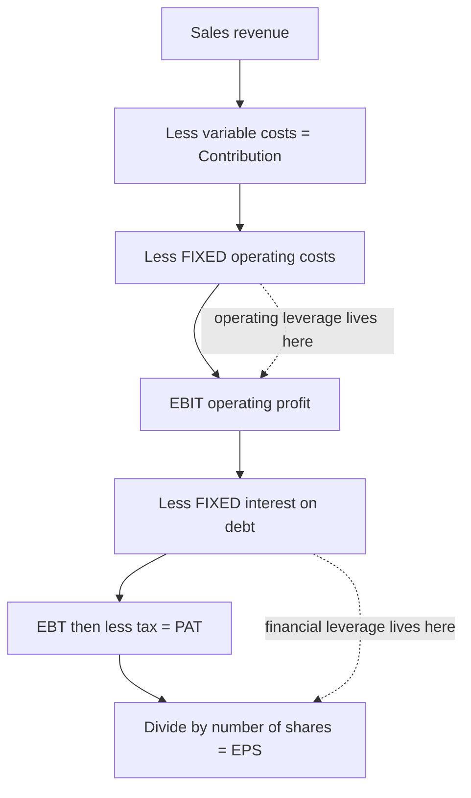
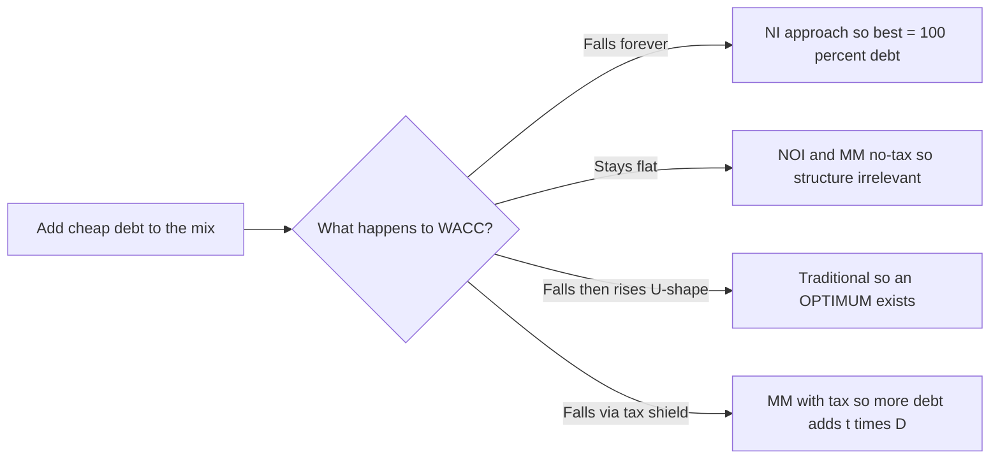
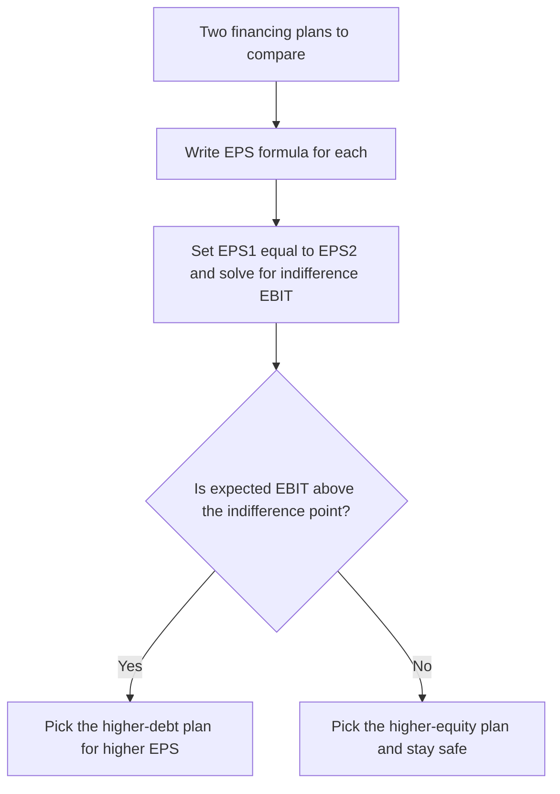

# Chapter 05 — Capital Structure & Leverage

## 1. The Problem

A company needs ₹100 crore to build a factory. That capital can come from two fundamentally different kinds of people:

- **Lenders** (debentures, term loans, bonds) — they give you money, demand a *fixed* interest payment every year no matter how the business does, and want their principal back on a fixed date. They take almost no business risk, so they accept a modest return.
- **Owners** (equity shareholders) — they give you money and get *whatever is left over* after everyone else is paid. In a bad year they may get nothing; in a great year they take the whole upside. They carry the business risk, so they demand a higher return.

The finance manager must decide: **of that ₹100 crore, how much should be borrowed and how much raised from owners?** This is the *financing decision* — the second of the three FM decisions (invest, finance, distribute). The invest decision (Chapter 04, capital budgeting) decides *which assets* to buy. The financing decision decides *whose money* buys them.

Here is the tension that makes this genuinely hard:

- Debt is **cheap** — interest rates are lower than the return equity holders demand, and interest is **tax-deductible**, making it cheaper still. So loading up on debt should *raise* the return to owners.
- Debt is **dangerous** — that fixed interest bill must be paid in a terrible year as well as a wonderful one. Every rupee of debt adds a fixed claim ahead of the owners. Too much debt and one bad year of trading can wipe out the owners entirely, or push the firm into insolvency.

So the question "how much debt?" is really the question "how do I trade off a higher expected return for owners against the higher risk that they are ruined?" That trade-off is the subject of this chapter.

Before we can answer *how much* debt, we must first be able to **measure** how a firm's cost structure and financing structure magnify swings in profit. That measurement tool is **leverage**. Leverage is the microscope; capital structure theory is the diagnosis; the trade-off is the prescription.

---

## 2. The Core Idea — Analogy

Think of a **crowbar (a lever)**. Push down gently on the long end and the short end exerts a huge force. The lever *magnifies* your input. But it magnifies in both directions — if you push the wrong way, you break the thing you were trying to move.

A firm has two levers stacked one on top of the other.

**Lever 1 — Operating leverage (the cost structure lever).** A firm with heavy **fixed costs** (rent, salaried staff, depreciation on a big plant) is like a long crowbar sitting on its *sales*. Once fixed costs are covered, every extra rupee of sales drops almost entirely to operating profit (EBIT). A small % rise in sales creates a large % rise in EBIT. Wonderful going up; brutal going down.

**Lever 2 — Financial leverage (the financing lever).** On top of EBIT sits a second lever made of **fixed financial costs** — interest on debt. Once interest is covered, every extra rupee of EBIT flows to the owners. A small % rise in EBIT creates a large % rise in earnings per share (EPS). Again — wonderful up, brutal down.

Stack the two levers and you get **combined leverage**: a small wiggle in *sales* becomes a violent swing in *EPS*.

The whole chapter is about understanding these levers, measuring how long each one is, and then — in the capital structure theories — asking whether pulling the financing lever *actually makes the owners richer* or merely makes their ride bumpier without any real gain.

*Figure 1 — The income statement is a staircase of two fixed-cost steps; each step is a lever that magnifies the swing passing through it.*

---

## 3. Why It's Built This Way

**Why separate operating and financial leverage at all?** Because they arise from two different, independently-controllable decisions and carry two different kinds of risk.

- Operating leverage comes from the **asset/technology choice** (the invest decision). A firm that automates (high fixed cost, low variable cost) has high operating leverage. This drives **business risk** — the inherent variability of EBIT.
- Financial leverage comes from the **financing choice** (how much debt). This drives **financial risk** — the *extra* variability in owners' returns caused purely by fixed financing charges.

A manager can offset one with the other. A firm in a volatile industry (high business risk) is wise to keep financial leverage low; a stable utility (low business risk) can safely carry lots of debt. Splitting leverage into two levers lets us reason about this offsetting.

**Why does the whole edifice rest on "value = maximise shareholder wealth"?** Because interest is a contract and dividends are a residual. The lenders' claim is fixed and legally senior; the owners bear the consequence of every financing choice. So the *right* capital structure is the one that makes the **equity shareholders** richest — measured either as the highest market value of equity, or equivalently the lowest overall cost of capital (WACC). These two are the same coin: value is highest exactly when WACC is lowest, because value = expected operating cash flow ÷ WACC.

That single equivalence — **maximise value ⟺ minimise WACC** — is the axis on which all four capital structure theories turn. Each theory is really just a different answer to one question: *"As you add cheap debt, what happens to WACC?"*

---

## 4. Full Technical Content

### 4.1 The measurement layer — the three leverages

We measure leverage as an **elasticity**: the percentage response of an *output* to a 1% change in an *input*. All three are computed at a *given base level* of sales/EBIT — leverage is not a constant, it changes as you move along the income statement.

**Operating leverage (DOL) — how sales swings become EBIT swings.**

$$\text{DOL} = \frac{\%\ \Delta\ \text{EBIT}}{\%\ \Delta\ \text{Sales}} = \frac{\text{Contribution}}{\text{EBIT}}$$

where **Contribution = Sales − Variable Costs** and **EBIT = Contribution − Fixed Costs**.

*Why does Contribution/EBIT equal the elasticity?* Because when sales rise by ΔS%, contribution rises by exactly ΔS% (variable costs scale with sales), but fixed costs don't move — so the *whole* rupee increase in contribution lands on EBIT. EBIT therefore rises by (Contribution/EBIT) × ΔS%. The ratio Contribution/EBIT is the multiplier. If there are **no fixed costs**, Contribution = EBIT and DOL = 1 (no magnification). The bigger the fixed costs, the smaller the EBIT relative to contribution, the bigger the ratio, the longer the lever.

**Financial leverage (DFL) — how EBIT swings become EPS swings.**

$$\text{DFL} = \frac{\%\ \Delta\ \text{EPS}}{\%\ \Delta\ \text{EBIT}} = \frac{\text{EBIT}}{\text{EBIT} - \text{Interest}} = \frac{\text{EBIT}}{\text{EBT}}$$

If the firm has **preference shares** (whose dividend is fixed but paid out of *after-tax* profit), the fixed financial charge must be grossed up to a pre-tax basis:

$$\text{DFL} = \frac{\text{EBIT}}{\text{EBIT} - \text{Interest} - \dfrac{\text{Preference Dividend}}{1 - t}}$$

*Why EBIT/EBT?* Interest is fixed. When EBIT rises by ΔE%, the whole rupee increase flows past the fixed interest bill to EBT, so EBT rises by (EBIT/EBT) × ΔE%. Tax is a constant proportion, so EPS rises by the same %. With **no debt**, Interest = 0, EBIT = EBT, DFL = 1.

**Combined leverage (DCL) — how sales swings become EPS swings.**

$$\text{DCL} = \text{DOL} \times \text{DFL} = \frac{\%\ \Delta\ \text{EPS}}{\%\ \Delta\ \text{Sales}} = \frac{\text{Contribution}}{\text{EBIT} - \text{Interest}} = \frac{\text{Contribution}}{\text{EBT}}$$

*Why does it just multiply?* Sales → EBIT is magnified by DOL; EBIT → EPS is magnified by DFL. Chain them and the middle term (EBIT) cancels: Contribution/EBIT × EBIT/EBT = Contribution/EBT. DCL tells you the total whip: a 1% change in sales moves EPS by DCL%.

| Leverage | Formula | Input → Output | Risk it measures |
|---|---|---|---|
| DOL | Contribution / EBIT | Sales → EBIT | Business (operating) risk |
| DFL | EBIT / (EBIT − Interest) | EBIT → EPS | Financial risk |
| DCL | Contribution / EBT = DOL × DFL | Sales → EPS | Total risk |

**Reading the numbers.** A DOL of 3 means a 10% fall in sales causes a 30% collapse in EBIT. A DFL of 2 means that 30% EBIT fall becomes a 60% EPS collapse. DCL = 6: a 10% sales dip cuts EPS by 60%. High leverage is a promise of feast *and* famine.

### 4.2 The decision layer — capital structure theories

Now the real question. Debt is cheaper than equity. So does replacing equity with debt keep lowering WACC (and raising value) forever? Four theories give four answers.

Setup notation: $K_d$ = cost of debt, $K_e$ = cost of equity, $K_o$ = WACC (overall). Value of firm V = value of equity S + value of debt D. Because debt is cheaper, $K_d < K_e$ always.

**(a) Net Income (NI) approach — "debt always helps, load up."**
Assumes $K_d$ and $K_e$ stay **constant** as you add debt. Since you keep swapping expensive equity for cheap debt and neither cost rises, WACC **falls continuously** and firm value **rises continuously**. Optimal structure = **100% debt**. This is the aggressive extreme — intuitive but unrealistic, because it ignores that piling on debt scares both lenders and owners.

Under NI, value the equity by capitalising the residual earnings: $S = \dfrac{\text{EBIT} - \text{Interest}}{K_e}$, then V = S + D, and $K_o = \text{EBIT}/V$.

**(b) Net Operating Income (NOI) approach — "capital structure is irrelevant."**
The opposite extreme. Assumes **WACC ($K_o$) is constant** — it is fixed by the firm's *business risk*, not its financing. Value the firm as a whole: $V = \dfrac{\text{EBIT}}{K_o}$, independent of the debt/equity split. As you add cheap debt, $K_e$ **rises exactly enough** to offset the saving, because equity holders see the extra financial risk and demand more. The cheapness of debt is an illusion — it's perfectly cancelled by dearer equity. **No optimal structure exists**; every split gives the same value. Here $K_e = K_o + (K_o - K_d)\dfrac{D}{S}$.

**(c) Traditional approach — "there is a sweet spot."**
The pragmatic middle. Says both extremes are partly right. Up to a *moderate* level of debt, $K_e$ rises only mildly (owners aren't yet alarmed) and $K_d$ stays low, so the cheap debt genuinely pulls **WACC down** and value up. But beyond a prudent point, *both* $K_e$ and $K_d$ rise sharply (everyone now fears bankruptcy), and WACC turns **back up**. WACC therefore traces a **U-shape (saucer)**; its lowest point is the **optimal capital structure** — the debt level that maximises firm value. This is the examinable "there exists an optimum, find it" story.

**(d) Modigliani–Miller (MM) approach — the rigorous NOI.**
MM proved *why* NOI must hold, using arbitrage.

*MM without taxes* (Propositions I & II): In a perfect market, two firms with identical operating earnings but different gearing **must** have the same value. If not, investors use **homemade leverage** — borrowing on personal account to buy the cheaper firm's shares — and arbitrage forces the values to converge. So $V_L = V_U$; WACC is constant; capital structure is irrelevant. Prop II: $K_e$ rises linearly with gearing, $K_e = K_o + (K_o - K_d)\dfrac{D}{S}$ — the extra return exactly compensates the extra risk, nothing is gained.

*MM with corporate taxes:* Now interest is tax-deductible, creating a real cash saving — the **interest tax shield** worth $t \times D$ per rupee of permanent debt. This tilts the answer:

$$V_L = V_U + (t \times D)$$

Value now *rises* with debt because of the tax shield. Taken literally this implies 100% debt again — which is why the practical world adds **financial distress and bankruptcy costs** to get the trade-off theory below.

*Figure 2 — All four theories answer one question: as you add debt, which way does WACC go?*

### 4.3 The synthesis — the trade-off theory

Real firms live between MM-with-tax (debt is great) and the fear of ruin. The **trade-off theory** says:

$$\text{Value of levered firm} = \text{Value if all-equity} + \underbrace{\text{PV of tax shield}}_{\text{pulls debt UP}} - \underbrace{\text{PV of financial distress \& bankruptcy costs}}_{\text{pushes debt DOWN}}$$

The tax shield rewards more debt; distress costs (higher interest demanded, lost customers/suppliers, fire-sale of assets, legal costs, management distraction) punish it. The **optimum** is where the marginal tax benefit of one more rupee of debt just equals the marginal distress cost — exactly the U-shaped WACC of the Traditional approach, now given an economic reason.

### 4.4 The tactical tool — EBIT-EPS indifference analysis

Theories tell you *whether* an optimum exists; **EBIT-EPS analysis** is the practical device a manager uses to *choose between two specific financing plans* (say "raise ₹50 lakh by equity" vs "by 12% debt"). It answers: *at what EBIT do the two plans give the same EPS, and given my expected EBIT, which plan gives higher EPS?*

General EPS formula for any plan:

$$\text{EPS} = \frac{(\text{EBIT} - I)(1 - t) - \text{Preference Dividend}}{N}$$

where $I$ = interest, $t$ = tax rate, $N$ = number of equity shares.

**The indifference (break-even) EBIT** between Plan 1 and Plan 2 is the EBIT that makes EPS₁ = EPS₂:

$$\frac{(\text{EBIT}^* - I_1)(1-t) - PD_1}{N_1} = \frac{(\text{EBIT}^* - I_2)(1-t) - PD_2}{N_2}$$

Solve for EBIT\*. The **decision rule**:

- If **expected EBIT > indifference EBIT** → choose the plan with **more fixed financial cost (more debt/preference)** — its higher leverage now works in your favour, giving higher EPS.
- If **expected EBIT < indifference EBIT** → choose the **less-levered (more equity)** plan — you're below the level where fixed charges pay off.
- Also check the **financial break-even EBIT** (the EBIT where EPS = 0), i.e. EBIT = Interest + PD/(1−t). Below it a plan destroys owner value.

*Figure 3 — The EBIT-EPS decision tree for choosing a financing plan.*

---

## 5. Worked Examples

### Example 1 (Easy) — Computing all three leverages and reading them

**Data.** Sunrise Ltd sells 50,000 units at ₹40 each. Variable cost ₹24/unit. Fixed operating costs ₹4,00,000. The firm has ₹10,00,000 of 10% debentures. Tax 30%. Compute DOL, DFL, DCL and interpret.

**Step 1 — Build the income statement.**

| Item | Working | ₹ |
|---|---|---|
| Sales | 50,000 × 40 | 20,00,000 |
| Less: Variable cost | 50,000 × 24 | 12,00,000 |
| **Contribution** | | **8,00,000** |
| Less: Fixed cost | | 4,00,000 |
| **EBIT** | | **4,00,000** |
| Less: Interest | 10% × 10,00,000 | 1,00,000 |
| **EBT** | | **3,00,000** |
| Less: Tax @30% | | 90,000 |
| **PAT** | | **2,10,000** |

**Step 2 — Apply the formulas.**

$$\text{DOL} = \frac{\text{Contribution}}{\text{EBIT}} = \frac{8,00,000}{4,00,000} = 2.00$$

$$\text{DFL} = \frac{\text{EBIT}}{\text{EBT}} = \frac{4,00,000}{3,00,000} = 1.33$$

$$\text{DCL} = \text{DOL} \times \text{DFL} = 2.00 \times 1.33 = 2.67 \quad \left(= \frac{\text{Contribution}}{\text{EBT}} = \frac{8,00,000}{3,00,000} = 2.67\right)$$

**Step 3 — Interpret (this is the marks-fetching part).**
- DOL 2.0: a 10% rise in sales → 20% rise in EBIT (and a 10% fall in sales → 20% fall in EBIT).
- DFL 1.33: a 10% rise in EBIT → 13.3% rise in EPS.
- DCL 2.67: a 10% rise in sales → 26.7% rise in EPS.

**Step 4 — Verify DCL by a fresh 10% sales increase.** New sales 55,000 units.

| Item | ₹ |
|---|---|
| Contribution (55,000 × 16) | 8,80,000 |
| EBIT (− 4,00,000) | 4,80,000 |
| EBT (− 1,00,000) | 3,80,000 |

EBIT rose from 4,00,000 to 4,80,000 = **+20%** ✓ (matches DOL 2 × 10%).
EBT rose from 3,00,000 to 3,80,000 = **+26.7%** ✓ (matches DCL 2.67 × 10%). EPS, being PAT/N with N and t fixed, rises the same 26.7%. **Reconciled.**

### Example 2 (Moderate) — Leverage with preference shares; working backwards

**Data.** A firm's capital: Equity ₹20,00,000 (2,00,000 shares of ₹10), 12% Preference ₹5,00,000, 10% Debt ₹15,00,000. EBIT ₹6,00,000. Tax 40%. Find DFL and DCL given Contribution ₹9,00,000. Then find EPS.

**Step 1 — Fixed financial charges.**
Interest = 10% × 15,00,000 = ₹1,50,000.
Preference dividend = 12% × 5,00,000 = ₹60,000 (this is *after-tax* — preference dividend is not tax-deductible).

**Step 2 — DFL, grossing up the preference dividend.** Because preference dividend is paid from post-tax profit, to place it on the same pre-tax footing as interest we divide by (1 − t):

$$\text{Grossed-up PD} = \frac{60,000}{1 - 0.40} = \frac{60,000}{0.60} = 1,00,000$$

$$\text{DFL} = \frac{\text{EBIT}}{\text{EBIT} - I - \dfrac{PD}{1-t}} = \frac{6,00,000}{6,00,000 - 1,50,000 - 1,00,000} = \frac{6,00,000}{3,50,000} = 1.71$$

**Step 3 — DOL and DCL.**

$$\text{DOL} = \frac{\text{Contribution}}{\text{EBIT}} = \frac{9,00,000}{6,00,000} = 1.50$$
$$\text{DCL} = 1.50 \times 1.71 = 2.57$$

**Step 4 — EPS to close the loop.**

| Item | ₹ |
|---|---|
| EBIT | 6,00,000 |
| Less: Interest | 1,50,000 |
| EBT | 4,50,000 |
| Less: Tax @40% | 1,80,000 |
| PAT | 2,70,000 |
| Less: Preference dividend | 60,000 |
| Earnings for equity | 2,10,000 |
| ÷ Shares 2,00,000 | **EPS ₹1.05** |

**Trap illustrated:** a student who forgot to gross up the ₹60,000 preference dividend would wrongly compute DFL = 6,00,000/(6,00,000 − 1,50,000 − 60,000) = 6,00,000/3,90,000 = 1.54, understating financial risk. The grossing-up is the whole point — see Traps §8.

### Example 3 (Exam-hard) — EBIT-EPS indifference between three plans

**Data.** Meridian Ltd needs ₹40,00,000 for expansion. It is evaluating three financing plans. The company currently has no debt and 2,00,000 equity shares outstanding (this expansion is *additional* capital). Market price and issue price of equity ₹100/share. Tax 40%.

- **Plan A — All equity:** issue 40,000 new shares of ₹100.
- **Plan B — Debt + equity:** ₹20,00,000 via 10% debt + 20,000 new shares of ₹100.
- **Plan C — Debt + preference:** ₹20,00,000 via 10% debt + ₹20,00,000 via 12% preference shares.

Expected EBIT after expansion ₹12,00,000. (i) Compute EPS under each plan. (ii) Find the indifference EBIT between Plan A and Plan B. (iii) Recommend.

**Step 1 — Set up the share counts and fixed charges.** Existing 2,00,000 shares are common to all plans; add the new issue.

| | Plan A | Plan B | Plan C |
|---|---|---|---|
| Interest | 0 | 2,00,000 | 2,00,000 |
| Preference dividend | 0 | 0 | 2,40,000 |
| New shares issued | 40,000 | 20,000 | 0 |
| **Total shares N** | 2,40,000 | 2,20,000 | 2,00,000 |

(Interest = 10% × 20,00,000 = 2,00,000. Preference dividend = 12% × 20,00,000 = 2,40,000.)

**Step 2 — EPS at expected EBIT ₹12,00,000.** Using EPS = [(EBIT − I)(1−t) − PD] / N.

*Plan A:* (12,00,000 − 0)(0.60) / 2,40,000 = 7,20,000 / 2,40,000 = **₹3.00**

*Plan B:* (12,00,000 − 2,00,000)(0.60) / 2,20,000 = (10,00,000 × 0.60)/2,20,000 = 6,00,000/2,20,000 = **₹2.727**

*Plan C:* [(12,00,000 − 2,00,000)(0.60) − 2,40,000] / 2,00,000 = (6,00,000 − 2,40,000)/2,00,000 = 3,60,000/2,00,000 = **₹1.80**

| Plan | EPS at EBIT ₹12,00,000 |
|---|---|
| A (all equity) | ₹3.00 |
| B (debt + equity) | ₹2.727 |
| C (debt + preference) | ₹1.80 |

At the expected EBIT, **Plan A wins** — a signal that ₹12,00,000 EBIT is *below* the level where leverage pays. Let us prove it.

**Step 3 — Indifference EBIT between Plan A and Plan B.** Set EPS_A = EPS_B:

$$\frac{(\text{EBIT})(0.60)}{2,40,000} = \frac{(\text{EBIT} - 2,00,000)(0.60)}{2,20,000}$$

Cancel 0.60 and cross-multiply:

$$2,20,000 \times \text{EBIT} = 2,40,000 \times (\text{EBIT} - 2,00,000)$$
$$2,20,000\,\text{EBIT} = 2,40,000\,\text{EBIT} - 4,80,00,00,000$$

(Note: 2,40,000 × 2,00,000 = 4,80,00,00,000.)

$$4,80,00,00,000 = 20,000\,\text{EBIT} \implies \text{EBIT}^* = \frac{4,80,00,00,000}{20,000} = 24,00,000$$

**Indifference EBIT (A vs B) = ₹24,00,000.**

**Step 4 — Verify the indifference point.** At EBIT ₹24,00,000:
- Plan A: (24,00,000 × 0.60)/2,40,000 = 14,40,000/2,40,000 = **₹6.00**
- Plan B: (24,00,000 − 2,00,000)(0.60)/2,20,000 = (22,00,000 × 0.60)/2,20,000 = 13,20,000/2,20,000 = **₹6.00** ✓

Both give ₹6.00 — the lines cross exactly here. **Reconciled.**

**Step 5 — Indifference EBIT between Plan A and Plan C** (for completeness).

$$\frac{0.60\,\text{EBIT}}{2,40,000} = \frac{0.60(\text{EBIT}-2,00,000) - 2,40,000}{2,00,000}$$

Cross-multiply:
$$2,00,000 \times 0.60\,\text{EBIT} = 2,40,000\left[0.60\,\text{EBIT} - 1,20,000 - 2,40,000\right]$$
$$1,20,000\,\text{EBIT} = 2,40,000\left[0.60\,\text{EBIT} - 3,60,000\right]$$
$$1,20,000\,\text{EBIT} = 1,44,000\,\text{EBIT} - 86,40,00,00,000$$
$$86,40,00,00,000 = 24,000\,\text{EBIT} \implies \text{EBIT}^* = 36,00,000$$

*Check:* PD grossed up = 2,40,000/0.60 = 4,00,000; so effectively Plan C's total pre-tax fixed charge is Interest 2,00,000 + grossed PD 4,00,000 = 6,00,000. At EBIT 36,00,000: Plan A EPS = (36,00,000×0.60)/2,40,000 = 21,60,000/2,40,000 = ₹9.00. Plan C EPS = (36,00,000−2,00,000)(0.60)−2,40,000 all /2,00,000 = (34,00,000×0.60 − 2,40,000)/2,00,000 = (20,40,000 − 2,40,000)/2,00,000 = 18,00,000/2,00,000 = ₹9.00 ✓.

**Step 6 — Recommendation.** Expected EBIT is ₹12,00,000, which is **below both indifference points** (₹24,00,000 vs B and ₹36,00,000 vs C). Below the indifference EBIT the *less-levered* plan gives higher EPS, which the numbers confirm (A ₹3.00 > B ₹2.727 > C ₹1.80). **Recommend Plan A (all equity).** The firm should only reach for debt/preference if it expects EBIT to sustainably exceed ₹24,00,000. Note also each plan's **financial break-even** (EPS = 0): Plan B needs EBIT ≥ ₹2,00,000; Plan C needs EBIT ≥ Interest + PD/(1−t) = 2,00,000 + 4,00,000 = ₹6,00,000 just to give equity holders anything — a starker risk in C.

### Example 4 (Theory-computational) — Capital structure valuation: NI vs NOI vs MM-tax

**Data.** Two firms are identical except for gearing. Both have EBIT ₹8,00,000. $K_d$ = 10%. Firm U is all-equity; Firm L has ₹20,00,000 of debt. Equity capitalisation rate for U, $K_e$ = 16%.

**(a) NOI / MM without tax.** WACC is fixed by business risk; value the whole firm:
$$V_U = \frac{\text{EBIT}}{K_o} = \frac{8,00,000}{0.16} = 50,00,000$$
Under MM-no-tax, $V_L = V_U = ₹50,00,000$. Firm L's equity S = V − D = 50,00,000 − 20,00,000 = ₹30,00,000. Its cost of equity has *risen*:
$$K_e^L = K_o + (K_o - K_d)\frac{D}{S} = 0.16 + (0.16 - 0.10)\frac{20,00,000}{30,00,000} = 0.16 + 0.06 \times 0.667 = 0.20\ (20\%)$$
*Interpretation:* the cheap 10% debt bought nothing — equity holders now demand 20% instead of 16%, exactly cancelling the saving. WACC stays 16%. **Structure irrelevant.**

**(b) MM with corporate tax** (t = 35%). Now debt carries a tax shield:
$$V_U = \frac{\text{EBIT}(1-t)}{K_e} = \frac{8,00,000 \times 0.65}{0.16} = \frac{5,20,000}{0.16} = 32,50,000$$
$$V_L = V_U + t \times D = 32,50,000 + 0.35 \times 20,00,000 = 32,50,000 + 7,00,000 = 39,50,000$$
*Interpretation:* the ₹20,00,000 of permanent debt adds ₹7,00,000 of value purely from the interest tax shield. **Levered firm is worth more** — the tax version breaks the irrelevance and favours debt.

**(c) NI approach view** (for contrast; $K_e$ = 16% constant, $K_d$ = 10%, ignore tax). Value equity as residual:
$$S = \frac{\text{EBIT} - \text{Interest}}{K_e} = \frac{8,00,000 - 2,00,000}{0.16} = \frac{6,00,000}{0.16} = 37,50,000$$
$$V = S + D = 37,50,000 + 20,00,000 = 57,50,000; \quad K_o = \frac{\text{EBIT}}{V} = \frac{8,00,000}{57,50,000} = 13.9\%$$
*Interpretation:* because NI holds $K_e$ constant, adding debt lifts V from 50,00,000 (all-equity) to 57,50,000 and drops WACC to 13.9% — so NI says gear up to the maximum. Three theories, three different verdicts on the same firm — exactly the point of §4.2.

---

## 6. Presentation / Format

**How to lay out a leverage answer (earns method marks even if arithmetic slips):**

1. Always build the **vertical income statement** first: Sales → Contribution → EBIT → EBT → PAT → EPS. Label each line. Examiners award marks for the correct *format* and *sub-totals*.
2. State each formula **before** substituting numbers.
3. Show DOL, DFL, DCL as a small table; then **one line of interpretation each** ("DOL 2 means…"). Interpretation is explicitly marked in ICAI schemes.

**How to lay out an EBIT-EPS answer:**

1. Tabulate each plan's Interest, Preference dividend, and Number of shares side by side.
2. Compute EPS for each plan in columns.
3. Show the indifference-EBIT equation, solve, and **verify** by plugging EBIT\* back into both plans (equal EPS proves it).
4. State the decision rule explicitly and give a one-sentence recommendation tied to expected EBIT vs indifference EBIT.

**How to present capital structure theory:** For NI/NOI/Traditional, present a table of D, S, V, $K_e$, $K_d$, $K_o$ at each debt level, then a one-line conclusion (falls / constant / U-shaped). For MM, state the proposition, the arbitrage logic, then the valuation ($V_L = V_U + tD$).

| Standard leverage presentation | Standard EBIT-EPS presentation |
|---|---|
| Vertical P&L with sub-totals | Column-per-plan table |
| Formula stated, then substituted | EPS formula per column |
| DOL/DFL/DCL table | Indifference equation + solve |
| One-line interpretation each | Verify + decision rule |

---

## 7. Connections

- **Capital budgeting (Ch 04):** the invest decision *creates* operating leverage (choosing a capital-intensive project raises fixed costs and DOL). Financing that project is where financial leverage enters. The two chapters are the two halves of "buy the asset / pay for the asset."
- **Cost of capital (Ch 03):** capital structure theory is literally a theory of *how WACC behaves as gearing changes*. The optimal capital structure is the minimum-WACC point; you cannot discuss it without $K_e$, $K_d$, $K_o$.
- **Cost of equity & risk:** DFL and Prop II both say the same thing — more debt makes equity riskier, so $K_e$ must rise. Leverage (measurement) and MM (theory) are two languages for one fact.
- **Dividend decision (Ch 06):** the third FM decision. Retained earnings are a source of equity; a firm distributing heavily must raise more external capital, feeding back into the capital-structure choice.
- **Ratio analysis:** DFL is intimately related to the **interest coverage ratio** (EBIT/Interest); a low coverage ⇒ high DFL ⇒ high financial risk.

---

## 8. Traps & Examiner Tricks

1. **Preference dividend not grossed up.** In DFL and in EBIT-EPS, preference dividend is *after-tax*; interest is *pre-tax*. In DFL divide PD by (1−t); in the financial break-even use EBIT = I + PD/(1−t). Forgetting this is the single most common leverage error (Example 2, Example 3 Step 6).

2. **Confusing "more leverage is good" with "more leverage is safe."** Leverage magnifies EPS *upward only when EBIT is rising*. Below the indifference/break-even EBIT, high leverage gives *lower* EPS and can wipe out owners. The exam loves an EBIT that sits *below* the indifference point (Example 3) precisely to catch students who reflexively pick the debt plan.

3. **Treating DOL, DFL as constants.** They are computed *at a base level*; they change as sales/EBIT move. A question giving "DOL at 50,000 units" does not give DOL at 60,000 units.

4. **Using DFL = EBIT/EBT when there are preference shares.** That short formula is only valid with *no* preference capital. With preference shares you must subtract the grossed-up PD in the denominator.

5. **NI vs NOI mix-up.** NI → $K_e$, $K_d$ constant, WACC falls, 100% debt optimal. NOI → $K_o$ constant, $K_e$ rises, structure irrelevant. Students swap them. Mnemonic: **N**et **I**ncome capitalises the **income to equity** (residual), so it's equity-focused and finds an optimum trend; **N**et **O**perating **I**ncome capitalises the **whole firm's operating income**, so structure doesn't matter.

6. **MM without vs with tax.** No-tax: $V_L = V_U$ (irrelevant). With tax: $V_L = V_U + tD$ (debt adds value). State clearly which world the question is in. Also: the tax shield uses the **market value of debt** (usually = book value for a fresh issue) and applies to *permanent* debt.

7. **Homemade leverage direction.** In MM arbitrage, investors *borrow personally* to substitute for corporate leverage (to buy the undervalued unlevered firm) — a favourite 4-mark theory question. Be able to state the mechanism, not just the conclusion.

8. **Number of shares in EBIT-EPS.** Include *existing plus newly issued* shares, and keep the existing block common across plans. Dropping the existing shares corrupts every EPS.

9. **Combined leverage shortcut error.** DCL = Contribution/EBT — students sometimes write Contribution/EBIT (that's DOL) or EBIT/EBT (that's DFL). DCL uses Contribution on top and EBT on the bottom (with grossed-up PD if preference exists).

10. **Sign of the change.** DOL/DFL/DCL magnify *both* directions. If asked the effect of a *fall* in sales, apply the same multiplier with a negative sign — the EPS collapse is what demonstrates financial risk.

---

## 9. First-Principles Recap

Start from the one goal: **make the equity owners as rich as possible.** Owners are paid last, so everything that sits *ahead* of them — variable costs, fixed operating costs, interest — shapes both how much they get and how violently it swings.

- Fixed operating costs create a lever between **sales and EBIT** → **operating leverage (DOL)** → **business risk.** You choose it when you choose your assets.
- Fixed financing costs create a lever between **EBIT and EPS** → **financial leverage (DFL)** → **financial risk.** You choose it when you choose your debt/equity mix.
- Multiply them and a wiggle in sales becomes a lurch in EPS → **combined leverage (DCL)** → **total risk.**

Then the big question: *does adding cheap debt actually make owners richer, or just increase the swing?* Four theories answer by asking what happens to WACC. **NI** says WACC falls forever (gear to 100%). **NOI/MM-no-tax** say WACC is constant — cheap debt is exactly cancelled by dearer equity (structure irrelevant). **Traditional** says WACC is U-shaped, so a sweet spot exists. **MM-with-tax** says the interest tax shield genuinely adds value, $V_L = V_U + tD$. The **trade-off theory** reconciles everyone: tax shield pulls debt up, distress costs push it down, and the optimum is where they balance.

Finally, to *act*, the manager uses **EBIT-EPS indifference analysis** — find the EBIT where two plans tie; above it, lean into debt; below it, stay in equity. Every formula in this chapter is just a precise way of asking the one question: *how does this financing choice move the risk and return of the people who own the firm?*

---

## 10. Quick-Revision Sheet

**Income statement skeleton:** Sales − Variable Cost = **Contribution** − Fixed Cost = **EBIT** − Interest = **EBT** − Tax = **PAT** − Pref. Div = Equity earnings ÷ N = **EPS**.

| Concept | Formula | Notes |
|---|---|---|
| Contribution | Sales − Variable cost | — |
| EBIT | Contribution − Fixed cost | Operating profit |
| DOL | Contribution / EBIT | Sales→EBIT; business risk; =1 if no fixed cost |
| DFL | EBIT / (EBIT − Interest) = EBIT/EBT | EBIT→EPS; financial risk; =1 if no debt |
| DFL (with pref.) | EBIT / [EBIT − I − PD/(1−t)] | Gross up preference dividend |
| DCL | DOL × DFL = Contribution / EBT | Sales→EPS; total risk |
| EPS | [(EBIT − I)(1−t) − PD] / N | N = existing + new shares |
| Financial break-even EBIT | I + PD/(1−t) | EBIT where EPS = 0 |
| Indifference EBIT | Solve EPS₁ = EPS₂ | Above it → pick more debt |
| NI approach | S = (EBIT − I)/Kₑ; V = S + D; Kₒ = EBIT/V | Kₑ, Kd constant; WACC falls; 100% debt |
| NOI approach | V = EBIT/Kₒ; Kₑ = Kₒ + (Kₒ−Kd)(D/S) | Kₒ constant; structure irrelevant |
| Traditional | — | WACC U-shaped; optimum exists |
| MM no tax | V_L = V_U; Kₑ = Kₒ + (Kₒ−Kd)(D/S) | Arbitrage/homemade leverage |
| MM with tax | V_L = V_U + t·D; V_U = EBIT(1−t)/Kₑ | Tax shield adds value |
| Trade-off | V_L = V_U + PV(tax shield) − PV(distress) | Optimum = balance point |

**Decision rule (EBIT-EPS):** Expected EBIT **>** indifference EBIT → choose **more debt/preference** (higher EPS). Expected EBIT **<** indifference EBIT → choose **more equity** (higher EPS, safer).

**Theory one-liners:** NI = debt always good (WACC ↓). NOI = debt irrelevant (WACC flat). Traditional = optimum exists (WACC U). MM no-tax = irrelevant by arbitrage. MM tax = debt adds tD. Trade-off = tax shield vs distress cost.

**Risk map:** DOL → business risk (asset choice). DFL → financial risk (financing choice). DCL → total risk. Leverage magnifies **both** up and down.
