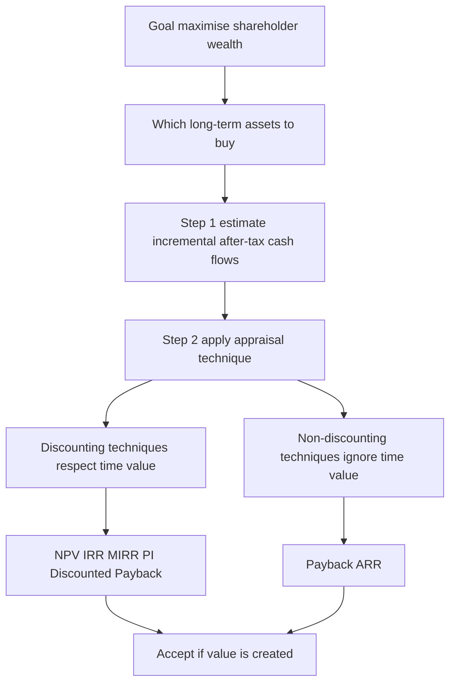
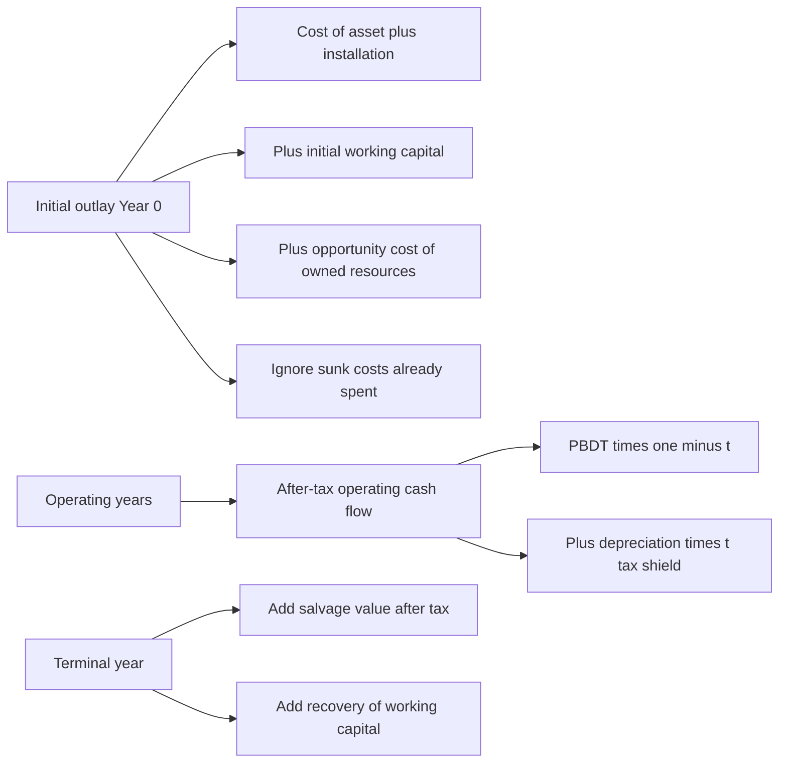
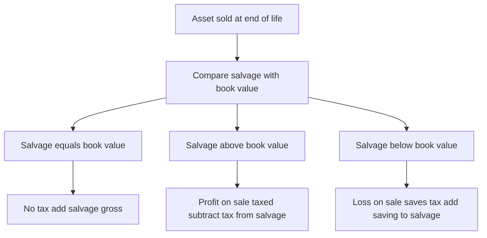
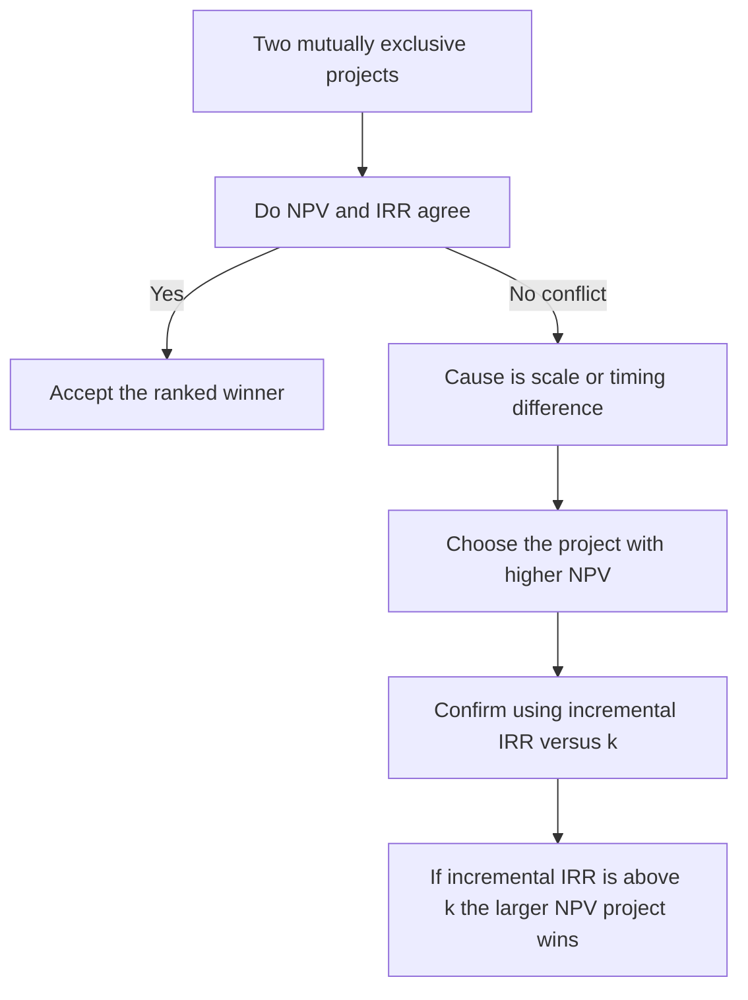
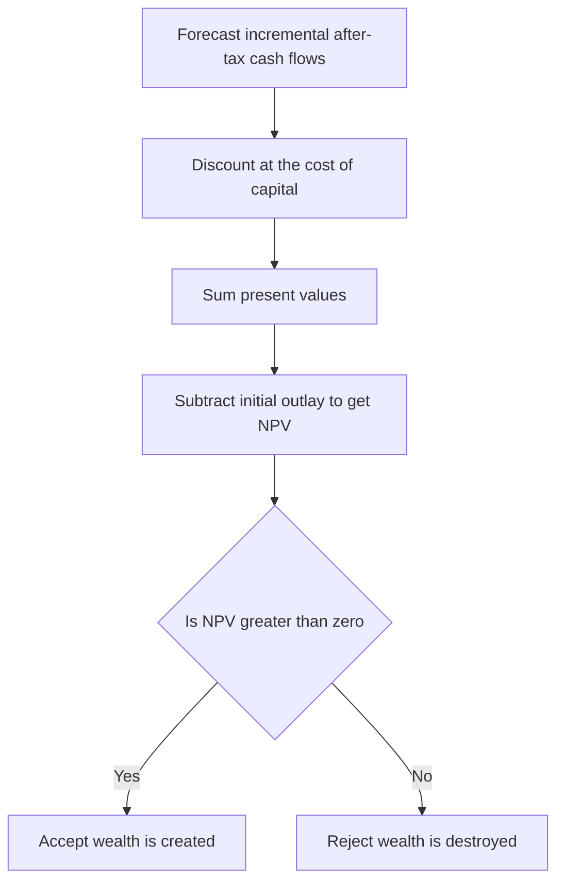

<!-- v2-deep -->

# Chapter 06 — Capital Budgeting (Investment Decisions)

## 1. The Problem

A company earns money by tying up cash in *things that produce cash*: a new plant, a fleet of trucks, a second production line, a research programme, a retail outlet. These are **long-term assets**, and the act of deciding which of them to buy — and which to reject — is called **capital budgeting**. The word "budgeting" is a little misleading. This is not routine allocation of an annual spend. It is the single most consequential thing a finance manager does, because a long-term investment decision has four features that no other decision shares all at once:

1. **The outlay is large.** A capital project can absorb a big chunk of the firm's total capital. A mistake is not a rounding error; it can sink the company.
2. **It is effectively irreversible.** Once you have poured concrete, installed the assembly line, and trained the workforce, you cannot un-buy it at par. If you got it wrong, you sell specialised equipment for scrap at a fraction of cost. The exit door is narrow and expensive.
3. **The consequences unfold over many years.** A machine bought today throws off cash for eight or ten years. You are committing not just this year's money but a *stream* of future outcomes.
4. **The future is uncertain.** Those cash flows are forecasts. You are betting real cash today against estimates of tomorrow.

Put these together and you get the central difficulty: **you must compare money you spend now with money you hope to receive across many future years, when a rupee now and a rupee in year seven are not the same thing.** Ordinary accounting cannot answer this. The Profit & Loss account tells you what happened last year using accrual rules; it does not tell you whether committing ₹50 lakh today to earn an uncertain trickle of cash over a decade *creates or destroys shareholder value*. We need a discipline built specifically for large, irreversible, multi-year, uncertain commitments. That discipline is capital budgeting.

The chapter answers three questions in order. First, **which numbers** should we feed into the decision (the cash-flow question). Second, **which yardstick** should we measure them against (the technique question). Third, **what to do when the yardsticks disagree** (the NPV-vs-IRR question).

**A finer distinction the exam tests — the kinds of capital-budgeting decision.** ICAI expects you to know that projects come in categories, because the *category dictates the yardstick*:

- **Accept–reject (independent) decisions.** Each project stands alone; accepting one does not preclude another. Rule: accept every project with NPV > 0 (equivalently IRR > k, PI > 1). Here NPV and IRR *never* conflict.
- **Mutually exclusive decisions.** You may pick only one from a set (e.g., two machines that do the same job, or two ways to build the same factory). Ranking now matters, and NPV and IRR can disagree — the heart of §4.3.
- **Capital-rationing decisions.** The total budget is capped below the sum of all worthwhile projects, so you must select the *combination* that maximises total NPV within the ceiling. This is where the Profitability Index earns its keep.
- **Replacement and abandonment decisions.** Whether to replace an existing asset with a better one, or to abandon a project early. These are *incremental* problems — you analyse only the change in cash flows, and abandonment introduces the idea that a project's best life may be shorter than its physical life.

Keeping these four boxes straight in your head is half the battle: the examiner signals the box in the first two lines of the question ("the company can undertake only one of the following…" = mutually exclusive; "funds available are limited to ₹X" = rationing).

---

## 2. The Core Idea (Analogy)

Think of a capital project as **planting an orchard**.

You spend a lump of money *now* — clearing land, buying saplings, fencing, the first year of irrigation. For a while nothing comes back; the trees are growing. Then, year after year, the orchard yields fruit you can sell. Eventually the trees age, yields fall, and one day you clear the land and sell the timber and the plot.

Every idea in this chapter is just a sensible orchard-owner's question:

- **How long until I get my planting money back?** → *Payback*.
- **Getting it back in cash — but a basket of fruit in year 5 is worth less to me than a basket today, so let me count the discounted baskets.** → *Discounted Payback*.
- **On average, what return does the orchard earn on the money tied up in it?** → *Accounting Rate of Return*.
- **Adding up every future basket at its true present-day worth, minus what I planted — am I richer or poorer?** → *Net Present Value*. This is the master question, because "am I richer?" is *exactly* what a shareholder wants to know.
- **What is the orchard's own internal growth rate — the interest rate at which it exactly breaks even?** → *Internal Rate of Return*.
- **For every rupee I plant, how many rupees of present-value fruit do I harvest?** → *Profitability Index*, the question you ask when you have more good orchards than money.

The analogy also fixes the cash-flow rules. The orchard owner counts **fruit actually sold** (cash), not the *notional* value of fruit still on the branch (profit). He ignores the money already spent last year on a soil survey (sunk cost). He remembers that this land could have been rented out (opportunity cost). And he remembers he must keep some working money aside for seeds and wages each season, money he gets back when he finally clears the orchard (working capital).

**Pushing the analogy further, because the exam pushes it further.** Suppose the orchard-owner is *already* farming the plot with an old, low-yield variety of tree. Deciding whether to uproot them and plant a new high-yield variety is a **replacement decision**: he does not count the *total* fruit from the new trees, only the *extra* fruit over what the old trees would still have given, minus the scrap value of timber he forfeits by uprooting early, plus the sale value of the old timber now. Suppose two saplings need *different-sized* plots and he has only so much land — he cannot plant both — that is **mutual exclusivity**. Suppose he has cash for only three of five good orchards — that is **capital rationing**, and he plants the orchards that give the most fruit-value per rupee of planting money. And suppose one variety yields heavily for three years then must be cleared at a cost (uprooting diseased roots is expensive) — a late *cash outflow* — that is the **non-conventional cash flow** that breaks IRR. The orchard image holds all the way to the hardest exam variation.

---

## 3. Why It's Built This Way

**Why cash flows and not accounting profit?** Because shareholders can only spend cash. Profit is an accountant's opinion shaped by accrual conventions — depreciation schedules, provisions, accruals — none of which is money you can bank. Depreciation, in particular, is a non-cash bookkeeping entry: no rupee leaves the firm when you charge depreciation. So capital budgeting works in cash. (Depreciation still matters, but *only* through the tax it saves — the "tax shield" — which is a genuine cash effect. More on this below.)

**Why discount at all?** A rupee today can be invested to become more than a rupee next year; equivalently, a rupee promised next year is worth less than a rupee in hand. This is the time value of money (Chapter 05). Any technique that ignores it — Payback, ARR — is telling you *something*, but not whether value is created. Any technique that respects it — NPV, IRR, MIRR, PI, Discounted Payback — is speaking the shareholder's language.

**Why does NPV sit at the centre?** Because the goal of financial management is to **maximise shareholder wealth**, and NPV is denominated in exactly those units: rupees of wealth added today. An NPV of ₹4,20,000 is a claim that accepting the project makes the owners ₹4,20,000 richer *right now*, after fully paying the providers of capital their required return. No other technique makes so direct a promise. Everything else is either a rougher proxy (Payback, ARR) or a re-expression of the same discounting logic in a different unit (IRR is a %, PI is a ratio). We build the whole edifice on NPV and judge the others by how well they approximate it.

**Why is the discount rate the *cost of capital* specifically — and why is it an opportunity cost?** The rate *k* is not an arbitrary "interest rate." It is the return the firm's investors could earn *elsewhere on equally risky investments*. If shareholders could get 12% on comparable-risk assets, then any project inside the firm must clear 12% before it adds value — earning less would make shareholders poorer than if the firm simply returned the cash for them to invest outside. That is why *k* is called the **opportunity cost of capital** and why it doubles as the **reinvestment assumption**: cash the project throws off could be reinvested at *k* elsewhere, so NPV's assumption that interim flows compound at *k* is the neutral, defensible one. IRR's rival assumption — that interim cash reinvests at the project's own (possibly sky-high) IRR — quietly assumes the firm can keep finding equally brilliant projects, which is usually false. This single point is the deep reason NPV beats IRR whenever they fight.

**Why after-tax, and why incremental?** Tax is a genuine cash outflow to the government, so pre-tax cash flows overstate what shareholders keep — appraisal must be **post-tax**. And the only cash flows that belong are those that *change because of the decision*: the firm's value rises by the value it did not otherwise have. Anything the firm would spend or receive regardless of the project is noise. "Incremental and after-tax" is therefore not a rule to memorise but a direct consequence of "we are measuring the change in shareholder wealth."

*Figure 6.1 — Capital budgeting flows from the wealth-maximisation goal down to an accept or reject decision.*

---

## 4. Full Technical Content

### 4.1 Estimating the right cash flows

Before any formula, get the inputs right. A brilliant technique on wrong numbers gives a confidently wrong answer. Five rules govern which cash flows enter the analysis.

**Rule 1 — Use incremental cash flows.** Count only cash flows that *change because of the decision*. The question is always: "firm *with* the project minus firm *without* it." A cost the firm bears either way is irrelevant.

**Rule 2 — Ignore sunk costs.** Money already spent and unrecoverable cannot be changed by today's decision, so it is not incremental. A ₹2,00,000 feasibility study conducted last year is gone whether you accept or reject; it never enters the appraisal. Examiners love to bury a sunk cost in the data hoping you will deduct it.

**Rule 3 — Include opportunity costs.** If the project uses a resource the firm *already owns* but which has an alternative use, the sacrificed benefit is a real cost of the project. Using a vacant company-owned building that could have been rented for ₹1,50,000 a year means the project bears a ₹1,50,000 opportunity cost, even though no cheque is written.

**Rule 4 — Include working capital.** A running project needs cash tied up in inventory, receivables and cash buffers, net of trade payables. This **net working capital** is an outflow when the project starts (or ramps up) and a **recovery (inflow)** when the project ends and the balances are liquidated. It is not depreciated and not a P&L expense, but it is very real cash committed and released.

**Rule 5 — Ignore financing cash flows in the cash-flow line; put them in the discount rate.** Do **not** subtract interest or dividends when computing project cash flows. The cost of financing is already captured by discounting at the cost of capital. Subtracting interest *and* discounting would double-count it.

**A note on allocated overheads and inflation:** exclude head-office overheads that would be incurred anyway (not incremental); include any *additional* overhead the project causes. If cash flows are stated in nominal (money) terms, discount at a nominal rate; keep real with real. ICAI problems are almost always nominal.

**Finer distinctions the examiner exploits inside these five rules.**

- **Incremental *working-capital increases* mid-life.** Working capital is not always a single outflow at year 0. If sales grow year on year, the WC needed grows too, so each year carries an *incremental* WC outflow equal to the *increase* over the prior year's level; the *entire accumulated* balance is recovered at the end. A question that gives "working capital required at 25% of each year's sales" is testing exactly this: you outflow only the year-on-year *change*, not the whole balance each year.
- **Opportunity cost of an asset that would otherwise be *sold*.** If the project retains a machine the firm would otherwise sell for ₹3,00,000, the forgone ₹3,00,000 sale proceeds (net of any tax on the sale) is an opportunity cost charged to the project at year 0.
- **Cannibalisation (erosion) and complementary effects.** If a new product steals sales from the firm's existing product, the lost contribution on the old product is an *incremental outflow* of the new project. Conversely, if the new project *lifts* sales of a complementary product, that extra contribution is an incremental inflow. Both are real "with minus without" effects that students routinely miss.
- **Half-year / mid-year timing.** ICAI problems assume year-end cash flows unless told otherwise; do not invent mid-year discounting. But a salvage "received at the *beginning* of the next year" or an outlay "spread over two years" must be placed in the stated period.
- **Sunk cost with a twist.** A cost already *committed by contract* but not yet paid can still be unavoidable and therefore effectively sunk. What matters is *avoidability*, not whether cash has physically moved yet.

**Depreciation and tax — the one place a non-cash item bites.** Depreciation is not a cash flow, but it is tax-deductible, so it *reduces tax*, and tax is cash. The standard build-up of an operating year's cash flow:

| Line | Item |
|---|---|
| A | Incremental sales revenue |
| B | Less incremental cash operating costs |
| C | = Profit before depreciation and tax (PBDT) = A − B |
| D | Less depreciation |
| E | = Profit before tax (PBT) = C − D |
| F | Less tax at rate t |
| G | = Profit after tax (PAT) = E − F |
| H | Add back depreciation |
| **I** | **= After-tax cash flow = G + D** |

Equivalently, **After-tax cash flow = PBDT × (1 − t) + Depreciation × t**. The term *Depreciation × t* is the **depreciation tax shield**: the cash the firm keeps because depreciation lowered its tax bill. Whenever a project *also* saves cost rather than earning revenue, the same logic applies to the saving.

**What if the project makes a tax loss in a year?** If PBT is negative, tax is *negative* — i.e., the loss shelters other profits of the firm and generates a **tax saving (inflow)**, *provided* the firm has other taxable profits to set it against (the standard ICAI assumption). If the firm has no other income, the loss is carried forward and the shield is *deferred*, not lost. Read whether the question says "the company has other profitable operations" — that phrase authorises you to treat the year's tax as negative.

**Straight-line vs Written-Down-Value (WDV) depreciation.** Under SLM the annual charge is constant, so the tax shield is a level annuity. Under WDV the charge is high early and low late, so the tax shields are *front-loaded* — and front-loaded shields have higher present value, making a WDV project look marginally better than the same project on SLM. ICAI questions usually specify the method; if they say "written down value at 25%," apply the rate to the *reducing balance* each year, and note that under WDV the asset is generally *not* fully depreciated over the project life, so a **terminal balancing charge/allowance** on sale is common (see below).

**Terminal-year extras.** In the final year add: (i) salvage value of the asset, and (ii) recovery of working capital. If salvage differs from book value there is a tax effect on the profit or loss on sale — add it only when the problem gives a tax rate and enough book-value information.

**Tax on sale of the asset — the four cases you must be able to handle instantly:**

1. **Salvage = book value (WDV):** no profit, no loss, no tax. Salvage enters gross.
2. **Salvage > book value:** profit on sale = (Salvage − Book value); tax outflow = profit × t. Net salvage = Salvage − tax on profit. (When salvage exceeds *original cost*, the portion up to cost is a balancing charge; the excess is a capital gain — ICAI Inter generally keeps salvage below cost, so treat the whole excess over book value as ordinary balancing charge unless told otherwise. Verify current ICAI material / AY for capital-gains nuances.)
3. **Salvage < book value:** loss on sale = (Book value − Salvage); this loss saves tax = loss × t (a *tax saving, inflow*). Net salvage = Salvage + tax saving on loss.
4. **Salvage = 0 but book value > 0 (asset scrapped):** full remaining book value is a terminal *loss*, saving tax = Book value × t.

*Figure 6.2 — The three buckets of project cash flow: the initial outlay, the operating stream, and the terminal recoveries.*

*Figure 6.5 — Deciding the tax effect on salvage, the single most common terminal-year trap.*

### 4.2 The techniques — what each one tells you

#### (a) Payback Period — "How fast do I get my money back?"

The payback period is the time taken for cumulative cash inflows to recover the initial outlay. With **even** annual cash flows:

**Payback = Initial Investment ÷ Annual Cash Inflow.**

With **uneven** cash flows, accumulate year by year and interpolate within the recovery year:

**Payback = Completed years + (Unrecovered cost at start of recovery year ÷ Cash flow during recovery year).**

*What it tells you:* how quickly the firm's capital is returned — a crude liquidity and risk gauge. Shorter is preferred. *Decision rule:* accept if payback ≤ a management-set maximum.

*Why it is not enough:* it ignores the time value of money and, fatally, **ignores everything after the payback point.** A project that pays back in three years then dies is ranked above one that pays back in 3.5 years and then gushes cash for a decade. It measures return *of* capital, not return *on* capital.

*Where it is genuinely useful (say this in a theory question):* it is a rough **risk and liquidity filter**, favoured by firms facing tight liquidity, high uncertainty about distant cash flows, or fast technological obsolescence (where distant cash flows are speculative anyway). Its **payback reciprocal** (1 ÷ payback) approximates the IRR for long-lived, roughly even-cash-flow projects — a fact examiners occasionally test.

#### (b) Discounted Payback — Payback that respects time value

Same idea, but you accumulate the **discounted** (present-value) cash flows until they recover the outlay. It fixes payback's first flaw (time value) but not its second (it still ignores post-payback cash). It is always longer than ordinary payback. *Decision rule:* accept if discounted payback ≤ target. *Subtle point:* if a project's discounted payback is *shorter than its life*, its NPV must be positive — because by the recovery point the discounted inflows already equal the outlay, and everything after adds more; so discounted payback occurring within the life is a sufficient condition for NPV > 0.

#### (c) Accounting Rate of Return (ARR) — the accountant's yardstick

ARR measures profitability using **accounting profit**, not cash:

**ARR = Average Annual Profit After Tax ÷ Average Investment × 100.**

**Average Investment = (Initial Investment − Salvage) ÷ 2 + Salvage + Additional Working Capital**, i.e. the average book value tied up over the life plus any working capital and salvage floor. (Some texts use ARR on *initial* investment — state your basis. ICAI's default is average investment.)

*Reading the average-investment formula from first principles:* under straight-line depreciation the book value falls in a straight line from (Cost) down to (Salvage), so its *average* over the life is the midpoint, (Cost + Salvage)/2, which rearranges to (Cost − Salvage)/2 + Salvage. Working capital stays tied up the whole life (recovered only at the end), so its *full* amount — not half — is added. That is *why* salvage and WC are added at full value but the depreciable portion is halved.

*What it tells you:* the book rate of return, comparable to a required accounting return. *Decision rule:* accept if ARR ≥ target. *Weaknesses:* uses profit not cash, ignores time value, and is sensitive to depreciation policy. Its one virtue is that it ties to reported financial statements, which managers are judged on (and on which their bonuses often depend — a real behavioural reason ARR survives).

#### (d) Net Present Value (NPV) — the master measure

Discount every incremental after-tax cash flow to today at the cost of capital *k*, and subtract the initial outlay:

**NPV = Σ [ CFₜ ÷ (1 + k)ᵗ ] − Initial Investment**, summed from t = 1 to n.

*What it tells you:* the **rupee increase in shareholder wealth** from accepting the project, after the capital providers have been paid their required return *k*. *Decision rule:* accept if **NPV > 0**; among mutually exclusive projects, choose the highest NPV. *Why it is theoretically best:*

1. It is denominated in wealth (rupees), the exact objective.
2. It uses **all** cash flows across the whole life.
3. It respects the time value of money.
4. It uses the correct opportunity cost of capital as the discount rate.
5. It is **additive**: NPV(A + B) = NPV(A) + NPV(B), so project values sum cleanly — no other measure does this.
6. It assumes interim cash flows are reinvested at *k*, the cost of capital — a defensible assumption (see MIRR and the IRR critique).

*Shortcut for level cash flows:* when annual cash flows are equal, do not discount year by year — multiply by the **annuity (PVIFA) factor**. For a growing or a perpetual stream, use the growing-annuity / perpetuity formulas from Chapter 05. Examiners award the same marks for the annuity shortcut and it slashes arithmetic error.

*The one thing NPV does not tell you:* it does not tell you the *rate* of return or the *scale-efficiency* of the capital, which is why managers still ask for IRR and PI alongside it, and why capital rationing needs PI.

#### (e) Internal Rate of Return (IRR) — the project's own break-even rate

The IRR is the discount rate at which **NPV = 0** — the rate the project itself earns on the capital tied up in it:

**Σ [ CFₜ ÷ (1 + IRR)ᵗ ] − Initial Investment = 0.**

There is no algebraic solution for uneven flows; you find it by **trial and error plus linear interpolation** between a rate that gives a small positive NPV (L) and a rate that gives a small negative NPV (H):

**IRR = L + [ NPV_L ÷ (NPV_L − NPV_H) ] × (H − L).**

*Choosing good trial rates fast.* For **even** cash flows, IRR is exact-ish via the annuity factor: the required PVIFA = Initial Investment ÷ Annual cash flow; look up which rate gives that factor for the given life, and you often land within one interpolation. For **uneven** flows, a quick first guess is the rate near (average annual cash flow ÷ investment) adjusted upward because early flows dominate. Always pick L and H *close together* (2–3% apart) around the zero — linear interpolation is only accurate over a short arc of a curved NPV profile; a wide bracket (say 10% to 25%) introduces real error and can lose marks against the official answer.

*What it tells you:* the project's percentage yield, to be compared with the cost of capital. *Decision rule:* accept if **IRR > k**. *Why managers love it:* a percentage is intuitive and needs no externally supplied discount rate to rank a single project. *Its flaws (see §4.3):* it can give multiple answers with non-conventional cash flows, it assumes reinvestment at the IRR itself (often unrealistically high), and it can rank mutually exclusive projects wrongly because it ignores scale.

#### (f) Modified IRR (MIRR) — IRR with an honest reinvestment assumption

MIRR repairs IRR's reinvestment flaw. **Compound** all cash *inflows* forward to the terminal year at the cost of capital (their reinvestment rate) to get a **Terminal Value (TV)**; keep the outlay at time 0; then find the single rate that grows the outlay into the TV over n years:

**MIRR = ( Terminal Value of inflows ÷ Present Value of outflows )^(1/n) − 1.**

*What it tells you:* a percentage yield that assumes reinvestment at *k* (realistic) rather than at IRR. It always gives a unique answer and usually sits between the IRR and *k*. *Decision rule:* accept if MIRR > k. *Handling multiple outflows:* if outflows occur in more than one period, discount *every* outflow back to time 0 at *k* to form "PV of outflows," and compound *every* inflow forward to year n at *k* to form the Terminal Value; then apply the formula. This is precisely why MIRR is immune to the multiple-IRR problem — it collapses the messy sign pattern into one outflow (today) and one inflow (terminal).

#### (g) Profitability Index (PI) — value per rupee invested

**PI = Present Value of future cash inflows ÷ Initial Investment.** (Equivalently PI = 1 + NPV/Investment.)

*What it tells you:* how much present-value benefit each rupee of outlay produces — a *relative* measure. *Decision rule:* accept if **PI > 1** (which is identical to NPV > 0). *Its special use:* **capital rationing.** When capital is limited and projects are divisible, rank by PI to squeeze the most NPV out of a fixed budget. Its weakness is the same scale-blindness as IRR — a high PI on a tiny project can add less absolute wealth than a lower PI on a large one, so for *indivisible* mutually exclusive projects, NPV still rules.

*A caution the examiner tests:* PI works cleanly for rationing **only when projects are divisible and rationing is for a single period.** If projects are **indivisible** (all-or-nothing), PI ranking can leave the budget partly unused and is *not* guaranteed optimal — you must instead test **feasible combinations** and pick the bundle with the highest *total* NPV within the ceiling. And beware whether PI is defined on "PV of inflows ÷ initial outlay" (gross PI, accept if > 1) or "NPV ÷ initial outlay" (net PI, accept if > 0) — different textbooks differ; state which you use.

### 4.2A Special decision types the exam loves

**Replacement decisions.** You are replacing an old asset with a new one. Analyse *incrementally*:
- **Year-0 net outlay** = Cost of new asset − Sale proceeds of old asset (net of tax on its sale) − any WC change. If selling the old asset below its book value creates a loss, add the tax saving; above book value, deduct tax on the profit.
- **Operating years** = *incremental* cash flow = (new asset's cash flow − old asset's cash flow it replaces), and crucially the **incremental depreciation** (new asset's depreciation − old asset's depreciation the firm forgoes) drives the tax shield.
- **Terminal year** = incremental salvage (new asset's future salvage − the salvage the old asset would have fetched at that future date). Miss any of these "old-asset-forgone" legs and the answer is wrong.

**Projects with unequal lives (mutually exclusive).** You cannot compare the raw NPV of a 3-year machine with a 5-year machine — the 5-year one has more time to add value simply because it lasts longer. Two standard fixes:
- **Equivalent Annual Cost / Annuity (EAC / EAA):** convert each project's NPV into a level annual equivalent by dividing NPV by the PVIFA for its own life at *k*. Compare the *annual* figures. Lowest equivalent annual *cost* (for cost-only problems) or highest equivalent annual *benefit* wins.
- **Replacement-chain (LCM) method:** repeat each project until both reach a common horizon (the LCM of the lives — e.g., 3 and 5 → 15 years), then compare total NPVs. EAC is faster and preferred in exams; the chain method is the intuition behind it.

**Abandonment decisions.** A project's *economic* life can be shorter than its *physical* life. Compute the NPV of continuing versus the abandonment value (net salvage) available now; abandon at the point where continuing one more year adds no positive incremental present value. The exam version: given salvage values at the end of each year and the operating cash flows, find the *optimal year to abandon* by comparing "value if abandoned now" against "PV of (next year's cash flow + next year's salvage)".

### 4.3 NPV vs IRR — when they conflict and how to resolve it

For a single, conventional, independent project (one sign change: outflow then inflows), NPV and IRR always agree: NPV > 0 exactly when IRR > k. **The conflict arises only for mutually exclusive projects** (you can pick only one), and it has two roots:

- **Scale difference:** a small project can have a dazzling IRR but add little absolute wealth; a large project with a lower IRR can add far more.
- **Timing difference:** IRR implicitly assumes interim cash is reinvested at the IRR; NPV assumes reinvestment at k. When two projects have very different cash-flow *timing*, the two measures can rank them differently.

Graphically, each project's NPV falls as the discount rate rises (the **NPV profile**). Two profiles cross at the **Fisher's intersection** — the "crossover rate." *Below* the crossover rate the two methods rank projects differently; *above* it they agree. The crossover rate is itself the IRR of the *incremental* cash flows — a neat fact that ties the graph to the incremental-IRR test below.

**Resolution: trust NPV.** NPV measures absolute wealth added, which is the objective, and it uses the correct reinvestment rate. A clean way to see *why* NPV is right is the **incremental IRR**: compute the IRR of the *difference* in cash flows (bigger project minus smaller). If that incremental IRR exceeds the cost of capital, the extra investment in the bigger project earns more than k, so the bigger project is better — which is exactly what its higher NPV was telling you. MIRR, by fixing the reinvestment assumption, also usually resolves the conflict in NPV's favour.

**The multiple-IRR / no-IRR pathology (non-conventional flows).** If the sign of the cash-flow stream changes *more than once* (e.g., outflow, inflows, then a large outflow for plant decommissioning or a mine's restoration cost), Descartes' rule of signs allows *as many IRRs as there are sign changes*. Two sign changes → possibly two IRRs, both mathematically valid, neither meaningful. Some non-conventional streams have *no real IRR* at all. The decision rule "accept if IRR > k" becomes unusable. **Fix:** use NPV (unambiguous) or MIRR (always unique). Recognising a non-conventional stream and *refusing* to interpolate a single IRR is itself worth marks.

*Figure 6.3 — Resolving an NPV versus IRR conflict: NPV is decisive; incremental IRR confirms why.*

---

## 5. Worked Examples

Discount factors used below (round to 3 decimals). Verify with 1/(1+k)ᵗ.

| Year | @10% | @12% | @14% | @15% | @16% | @18% | @20% |
|---|---|---|---|---|---|---|---|
| 1 | 0.909 | 0.893 | 0.877 | 0.870 | 0.862 | 0.847 | 0.833 |
| 2 | 0.826 | 0.797 | 0.769 | 0.756 | 0.743 | 0.718 | 0.694 |
| 3 | 0.751 | 0.712 | 0.675 | 0.658 | 0.641 | 0.609 | 0.579 |
| 4 | 0.683 | 0.636 | 0.592 | 0.572 | 0.552 | 0.516 | 0.482 |
| 5 | 0.621 | 0.567 | 0.519 | 0.497 | 0.476 | 0.437 | 0.402 |

### Example 1 — Warming up: Payback, Discounted Payback, ARR and NPV on even cash flows

*A machine costs ₹10,00,000, has a life of 5 years and no salvage value. It is expected to generate profit after tax of ₹1,00,000 per year. Depreciation is straight-line. Cost of capital is 10%. Evaluate the project on Payback, Discounted Payback, ARR and NPV.*

**Step 1 — Get the cash flow.** Straight-line depreciation = ₹10,00,000 ÷ 5 = ₹2,00,000 per year (non-cash). Annual cash flow = PAT + Depreciation = ₹1,00,000 + ₹2,00,000 = **₹3,00,000** per year, even across all 5 years.

**Step 2 — Payback.** Even flows, so Payback = 10,00,000 ÷ 3,00,000 = **3.33 years** (3 years 4 months). Recovered by end of year 3 = ₹9,00,000; remaining ₹1,00,000 recovered in ₹1,00,000/₹3,00,000 = 0.33 of year 4.

**Step 3 — Discounted Payback.** Discount each ₹3,00,000 at 10% and accumulate:

| Year | Cash flow | DF @10% | PV | Cumulative PV |
|---|---|---|---|---|
| 1 | 3,00,000 | 0.909 | 2,72,700 | 2,72,700 |
| 2 | 3,00,000 | 0.826 | 2,47,800 | 5,20,500 |
| 3 | 3,00,000 | 0.751 | 2,25,300 | 7,45,800 |
| 4 | 3,00,000 | 0.683 | 2,04,900 | 9,50,700 |
| 5 | 3,00,000 | 0.621 | 1,86,300 | 11,37,000 |

Outlay ₹10,00,000 is recovered during year 5. Unrecovered at start of year 5 = 10,00,000 − 9,50,700 = ₹49,300. Fraction = 49,300 ÷ 1,86,300 = 0.265. **Discounted payback = 4.26 years** — notably longer than the simple 3.33, because later rupees are worth less.

**Step 4 — ARR.** Average PAT = ₹1,00,000 (constant). Average investment = (Initial − Salvage)/2 + Salvage = (10,00,000 − 0)/2 + 0 = ₹5,00,000. ARR = 1,00,000 ÷ 5,00,000 = **20%**.

**Step 5 — NPV.** Total PV of inflows = ₹11,37,000 (from the table). NPV = 11,37,000 − 10,00,000 = **₹1,37,000 > 0 → Accept.** The project earns more than the 10% required return; it adds ₹1,37,000 of wealth today. (Note ARR of 20% looks handsome, but the wealth-relevant answer is the NPV.)

*Annuity cross-check:* PVIFA(10%, 5yr) = 0.909+0.826+0.751+0.683+0.621 = 3.790. PV of inflows = 3,00,000 × 3.790 = ₹11,37,000 — matches the year-by-year table exactly, confirming both the arithmetic and the annuity shortcut.

### Example 2 — The full ICAI-style NPV with tax, depreciation, working capital and salvage

*Nirvana Ltd is evaluating a project requiring plant costing ₹20,00,000 and an initial investment in working capital of ₹3,00,000. The plant has a useful life of 4 years and an expected salvage value of ₹2,00,000 at the end of year 4. Working capital will be fully recovered at the end of the project. Depreciation is straight-line on the depreciable base. Expected sales, cash operating costs are below. Tax rate is 30%; cost of capital is 12%. Should the project be accepted?*

| Year | Sales (₹) | Cash operating costs (₹) |
|---|---|---|
| 1 | 15,00,000 | 8,00,000 |
| 2 | 18,00,000 | 9,00,000 |
| 3 | 20,00,000 | 10,00,000 |
| 4 | 16,00,000 | 8,50,000 |

**Step 1 — Initial outlay (Year 0).** Plant ₹20,00,000 + Working capital ₹3,00,000 = **₹23,00,000 outflow.**

**Step 2 — Depreciation.** Depreciable base = Cost − Salvage = 20,00,000 − 2,00,000 = ₹18,00,000. Straight-line over 4 years = **₹4,50,000 per year.**

**Step 3 — After-tax operating cash flows.** Build up each year: PBDT = Sales − Cash costs; PBT = PBDT − Dep; Tax = 30% of PBT; PAT = PBT − Tax; Cash flow = PAT + Dep.

| Line | Year 1 | Year 2 | Year 3 | Year 4 |
|---|---|---|---|---|
| Sales | 15,00,000 | 18,00,000 | 20,00,000 | 16,00,000 |
| Less cash costs | 8,00,000 | 9,00,000 | 10,00,000 | 8,50,000 |
| PBDT | 7,00,000 | 9,00,000 | 10,00,000 | 7,50,000 |
| Less depreciation | 4,50,000 | 4,50,000 | 4,50,000 | 4,50,000 |
| PBT | 2,50,000 | 4,50,000 | 5,50,000 | 3,00,000 |
| Less tax @30% | 75,000 | 1,35,000 | 1,65,000 | 90,000 |
| PAT | 1,75,000 | 3,15,000 | 3,85,000 | 2,10,000 |
| Add depreciation | 4,50,000 | 4,50,000 | 4,50,000 | 4,50,000 |
| **Operating cash flow** | **6,25,000** | **7,65,000** | **8,35,000** | **6,60,000** |

**Step 4 — Terminal-year additions (Year 4).** Salvage received = ₹2,00,000. Because the asset was depreciated down to its salvage value (book value at end = ₹2,00,000), sale at ₹2,00,000 produces **no profit or loss, hence no tax** on sale. Recovery of working capital = ₹3,00,000. Total terminal inflow = 2,00,000 + 3,00,000 = **₹5,00,000.**

**Step 5 — Net cash flows and NPV @12%.**

| Year | Cash flow (₹) | DF @12% | PV (₹) |
|---|---|---|---|
| 0 | (23,00,000) | 1.000 | (23,00,000) |
| 1 | 6,25,000 | 0.893 | 5,58,125 |
| 2 | 7,65,000 | 0.797 | 6,09,705 |
| 3 | 8,35,000 | 0.712 | 5,94,520 |
| 4 | 6,60,000 + 5,00,000 = 11,60,000 | 0.636 | 7,37,760 |
| | | **PV of inflows** | **25,00,110** |

**NPV = 25,00,110 − 23,00,000 = ₹2,00,110 > 0 → Accept.** The project adds roughly ₹2.00 lakh of present-day wealth after paying capital its 12% and after all tax.

*Self-check on the working-capital treatment:* the ₹3,00,000 went out at year 0 and came back at year 4 — it is neither depreciated nor taxed, exactly as a recoverable advance should be. The salvage entered gross because no tax arose. Both are the classic examiner test-points.

**"What if the examiner tweaks it?" — three variations on the same problem.**

- *Variation A — salvage is ₹3,50,000, not ₹2,00,000.* Then salvage (₹3,50,000) exceeds book value (₹2,00,000). Profit on sale = ₹1,50,000; tax at 30% = ₹45,000. Net salvage = 3,50,000 − 45,000 = ₹3,05,000. Terminal inflow becomes 3,05,000 + 3,00,000 = ₹6,05,000 (year-4 CF = 6,60,000 + 6,05,000 = 12,65,000). NPV rises. *Note the depreciable base does not change* — it was still Cost − *expected* salvage of ₹2,00,000 when the schedule was set; the examiner is testing whether you keep the depreciation schedule fixed while re-taxing the *actual* higher salvage.
- *Variation B — WDV depreciation at 25% instead of SLM.* Now depreciation is 5,00,000, 3,75,000, 2,81,250, 2,10,938…, front-loaded, so early tax shields are larger and their PV is higher — NPV improves versus SLM. At year-4 sale the book value (₹8,43,750 after four years' WDV, approx) will usually differ from salvage, generating a terminal balancing allowance/charge that must be taxed. Watch the sign.
- *Variation C — working capital is 20% of each year's sales, built up as sales grow.* Then WC at each year-end = 20% of that year's sales: 3,00,000; 3,60,000; 4,00,000; 3,20,000. You outflow the *increment* each year (3,00,000 at year 0 based on year-1 sales, then +60,000, then +40,000, then a *release* of 80,000 as sales fall in year 4), and recover the *whole remaining balance* at the end. This is the incremental-WC trap in §4.1.

### Example 3 — IRR, MIRR, PI, and an NPV-vs-IRR conflict between mutually exclusive projects

*Vega Ltd must choose ONE of two mutually exclusive projects, each with a life of 3 years. Cost of capital is 10%. Cash flows (₹):*

| Year | Project S (small) | Project L (large) |
|---|---|---|
| 0 | (5,00,000) | (10,00,000) |
| 1 | 3,00,000 | 3,50,000 |
| 2 | 2,50,000 | 4,50,000 |
| 3 | 2,00,000 | 6,50,000 |

*Compute NPV, IRR, PI for each; compute MIRR for each; identify and resolve any conflict.*

**Step 1 — NPV @10%.** DFs: 0.909, 0.826, 0.751.

*Project S:*

| Year | CF | DF | PV |
|---|---|---|---|
| 1 | 3,00,000 | 0.909 | 2,72,700 |
| 2 | 2,50,000 | 0.826 | 2,06,500 |
| 3 | 2,00,000 | 0.751 | 1,50,200 |
| | | PV inflows | 6,29,400 |

NPV_S = 6,29,400 − 5,00,000 = **₹1,29,400.** PI_S = 6,29,400 ÷ 5,00,000 = **1.26.**

*Project L:*

| Year | CF | DF | PV |
|---|---|---|---|
| 1 | 3,50,000 | 0.909 | 3,18,150 |
| 2 | 4,50,000 | 0.826 | 3,71,700 |
| 3 | 6,50,000 | 0.751 | 4,88,150 |
| | | PV inflows | 11,78,000 |

NPV_L = 11,78,000 − 10,00,000 = **₹1,78,000.** PI_L = 11,78,000 ÷ 10,00,000 = **1.18.**

**Step 2 — IRR of each (trial and interpolation).**

*Project S.* Try 20%: PVs = 3,00,000×0.833 + 2,50,000×0.694 + 2,00,000×0.579 = 2,49,900 + 1,73,500 + 1,15,800 = 5,39,200; NPV = +39,200. Try 30% (DFs 0.769, 0.592, 0.455): 2,30,700 + 1,48,000 + 91,000 = 4,69,700; NPV = −30,300. Interpolate:
IRR_S = 20 + [39,200 ÷ (39,200 + 30,300)] × 10 = 20 + (39,200/69,500)×10 = 20 + 5.64 = **≈25.6%.**

*Project L.* Try 18%: PVs = 3,50,000×0.847 + 4,50,000×0.718 + 6,50,000×0.609 = 2,96,450 + 3,23,100 + 3,95,850 = 10,15,400; NPV = +15,400. Try 20%: 3,50,000×0.833 + 4,50,000×0.694 + 6,50,000×0.579 = 2,91,550 + 3,12,300 + 3,76,350 = 9,80,200; NPV = −19,800. Interpolate:
IRR_L = 18 + [15,400 ÷ (15,400 + 19,800)] × 2 = 18 + (15,400/35,200)×2 = 18 + 0.875 = **≈18.9%.**

**Step 3 — The conflict.** Rankings disagree:

| Measure | Project S | Project L | Winner |
|---|---|---|---|
| NPV | ₹1,29,400 | ₹1,78,000 | **L** |
| IRR | 25.6% | 18.9% | **S** |
| PI | 1.26 | 1.18 | **S** |

IRR and PI (both *relative* measures) prefer the small project; NPV (the *absolute wealth* measure) prefers the large one. This is the classic **scale conflict**.

**Step 4 — Resolve via incremental analysis (L − S).** The extra investment in choosing L over S is ₹5,00,000 at year 0, buying these extra cash flows:

| Year | L − S (₹) |
|---|---|
| 0 | (5,00,000) |
| 1 | 3,50,000 − 3,00,000 = 50,000 |
| 2 | 4,50,000 − 2,50,000 = 2,00,000 |
| 3 | 6,50,000 − 2,00,000 = 4,50,000 |

NPV of the increment @10% = 50,000×0.909 + 2,00,000×0.826 + 4,50,000×0.751 − 5,00,000 = 45,450 + 1,65,200 + 3,37,950 − 5,00,000 = **+₹48,600.** (This equals NPV_L − NPV_S = 1,78,000 − 1,29,400 = 48,600 — a clean cross-check.) The incremental IRR solves 5,00,000 = 50,000/(1+r) + 2,00,000/(1+r)² + 4,50,000/(1+r)³. Testing 15%: 50,000×0.870 + 2,00,000×0.756 + 4,50,000×0.658 = 43,500 + 1,51,200 + 2,96,100 = 4,90,800; NPV = −9,200. Testing 14%: 50,000×0.877 + 2,00,000×0.769 + 4,50,000×0.675 = 43,850 + 1,53,800 + 3,03,750 = 5,01,400; NPV = +1,400. Incremental IRR ≈ 14 + [1,400/(1,400+9,200)]×1 ≈ **14.1%**, comfortably **above the 10% cost of capital.** So the extra ₹5,00,000 spent on L earns about 14.1% — better than the 10% it costs — and should be spent. (This incremental IRR of ~14.1% is also the **Fisher crossover rate**: below 14.1% NPV prefers L, above it NPV prefers S.)

**Step 5 — Decision.** **Choose Project L.** It adds more absolute shareholder wealth (₹1,78,000 vs ₹1,29,400), and the incremental analysis confirms the extra outlay earns above the cost of capital. Project S's superior IRR/PI is a scale illusion: a great return on a smaller base.

**Step 6 — MIRR (the reinvestment fix), shown for Project S.** Compound S's inflows to end of year 3 at 10%: Year 1 grows for 2 years → 3,00,000×(1.10)² = 3,63,000; Year 2 grows for 1 year → 2,50,000×1.10 = 2,75,000; Year 3 → 2,00,000. Terminal Value = 3,63,000 + 2,75,000 + 2,00,000 = ₹8,38,000. MIRR_S = (8,38,000 ÷ 5,00,000)^(1/3) − 1 = (1.676)^(1/3) − 1. Cube root of 1.676 ≈ 1.1878, so **MIRR_S ≈ 18.8%.** Notice it is far below the 25.6% IRR — because MIRR reinvests interim cash at a realistic 10%, not at 25.6%. This is precisely why IRR overstates and why, when it clashes with NPV, we side with NPV.

*MIRR for Project L (for completeness):* TV = 3,50,000×1.21 + 4,50,000×1.10 + 6,50,000 = 4,23,500 + 4,95,000 + 6,50,000 = 15,68,500. MIRR_L = (15,68,500 ÷ 10,00,000)^(1/3) − 1 = (1.5685)^(1/3) − 1 ≈ 1.1615 − 1 = **≈16.2%.** Now MIRR ranks L (16.2%) above S — wait, it ranks S (18.8%) above L (16.2%). MIRR is still a *rate* and so still carries residual scale-blindness for mutually exclusive projects; the airtight tie-breaker remains the *incremental* analysis of Step 4, which is why NPV plus incremental IRR — not MIRR — is the examiner's preferred resolution.

### Example 4 — Replacement decision with sale of the old machine and incremental depreciation

*Orion Ltd owns an old machine bought 2 years ago for ₹8,00,000, being depreciated straight-line over 6 years to nil (so ₹1,33,333 a year; current book value ₹5,33,333). It can be sold today for ₹3,00,000. A new machine costs ₹12,00,000, has a 4-year life, nil salvage, straight-line depreciation. The new machine cuts annual cash operating costs by ₹4,50,000. Tax rate 30%, cost of capital 10%. Should Orion replace?*

**Step 1 — Year-0 net investment.** New machine ₹12,00,000. Sale of old machine brings ₹3,00,000, but its book value is ₹5,33,333, so selling at ₹3,00,000 realises a **loss on sale of ₹2,33,333**, which saves tax = 2,33,333 × 30% = ₹70,000. Cash from disposal = 3,00,000 + 70,000 = ₹3,70,000.
Net year-0 outlay = 12,00,000 − 3,70,000 = **₹8,30,000.**

**Step 2 — Incremental depreciation.** New machine depreciation = 12,00,000 ÷ 4 = ₹3,00,000 a year. Old machine's depreciation *forgone* (it had 4 years left at ₹1,33,333) = ₹1,33,333 a year. **Incremental depreciation = 3,00,000 − 1,33,333 = ₹1,66,667 a year.**

**Step 3 — Incremental operating cash flow.** Pre-tax cost saving = ₹4,50,000 a year (this is the incremental PBDT). Incremental PBT = 4,50,000 − 1,66,667 = ₹2,83,333. Tax @30% = ₹85,000. Incremental PAT = ₹1,98,333. Add back incremental depreciation ₹1,66,667. **Incremental after-tax cash flow = ₹3,65,000 a year** for 4 years.
*Shortcut check:* PBDT×(1−t) + Dep×t = 4,50,000×0.70 + 1,66,667×0.30 = 3,15,000 + 50,000 = ₹3,65,000. Matches.

**Step 4 — Terminal year.** Both machines end at nil salvage in year 4 (new machine nil; old machine would also have reached nil), so no incremental terminal salvage, no WC change.

**Step 5 — NPV.** Level ₹3,65,000 for 4 years at 10%. PVIFA(10%,4) = 0.909+0.826+0.751+0.683 = 3.169. PV of inflows = 3,65,000 × 3.169 = ₹11,56,685.
NPV = 11,56,685 − 8,30,000 = **₹3,26,685 > 0 → Replace.**

*Self-check on the two "old-asset-forgone" legs:* we credited the tax saving on the *loss* at disposal (₹70,000) and we *subtracted* the old machine's depreciation from the new one's to get incremental depreciation. Drop either leg and the NPV is materially wrong — these are the exact points ICAI awards/deducts marks on in replacement problems.

### Example 5 — Mutually exclusive projects with UNEQUAL lives (Equivalent Annual Cost)

*Delta Ltd needs a pump. Machine X costs ₹6,00,000, lasts 3 years, and has annual after-tax running cash outflows of ₹1,50,000. Machine Y costs ₹9,00,000, lasts 5 years, and has annual after-tax running cash outflows of ₹1,10,000. Neither has salvage. Cost of capital 10%. Which is cheaper?*

A raw NPV-of-costs comparison is invalid — Y is examined over 5 years, X over only 3, so Y "looks" costlier merely because it runs longer. Convert each to an **Equivalent Annual Cost (EAC)**.

**Machine X.** PV of costs = 6,00,000 + 1,50,000 × PVIFA(10%,3). PVIFA(10%,3) = 0.909+0.826+0.751 = 2.486. PV of running costs = 1,50,000 × 2.486 = ₹3,72,900. Total PV cost = 6,00,000 + 3,72,900 = ₹9,72,900.
EAC_X = Total PV cost ÷ PVIFA(10%,3) = 9,72,900 ÷ 2.486 = **₹3,91,352 per year.**

**Machine Y.** PVIFA(10%,5) = 0.909+0.826+0.751+0.683+0.621 = 3.790. PV of running costs = 1,10,000 × 3.790 = ₹4,16,900. Total PV cost = 9,00,000 + 4,16,900 = ₹13,16,900.
EAC_Y = 13,16,900 ÷ 3.790 = **₹3,47,467 per year.**

**Decision.** EAC_Y (₹3,47,467) < EAC_X (₹3,91,352) → **choose Machine Y**; on a like-for-like *annual* basis it is the cheaper pump, even though its total lifetime PV cost (₹13.17 lakh) is larger than X's (₹9.73 lakh). The whole point of EAC is to strip out the "Y just runs longer" illusion.

*Sanity check via the logic:* Y's higher upfront cost (₹3,00,000 more) buys two extra years of service and a ₹40,000-a-year lower running cost; spread over its longer life, that trade favours Y. EAC quantifies exactly that intuition.

---

## 6. Presentation / Format

Examiners award marks for a clean, standard layout. For an NPV problem, present in this order:

1. **Working Note 1 — Depreciation** (base, method, annual charge).
2. **Working Note 2 — Calculation of after-tax operating cash flows**, in the Sales → PBDT → PBT → Tax → PAT → add-back-Depreciation vertical format, all years side by side.
3. **Working Note 3 — Initial outlay** (asset + installation + working capital + opportunity cost) and **terminal flows** (salvage net of tax + WC recovery).
4. **Main table — NPV**: columns *Year | Net cash flow | Discount factor | Present value*, with a totals row and the final "NPV = PV of inflows − Initial outlay."
5. **Decision line**, one sentence: "Since NPV is positive (₹…), the project is financially viable and should be accepted."

For IRR: show two trial rates bracketing zero, then the interpolation formula with numbers substituted. For a ranking question: end with a small comparison table (NPV, IRR, PI, Payback) and a reasoned recommendation naming NPV as the decisive criterion. Always state assumptions (e.g., "salvage equals book value, so no tax on sale"; "working capital fully recovered").

**Extra presentation discipline that saves marks:**
- **State the discount-factor source.** Write "DF from tables" or show 1/(1+k)ᵗ; if you use annuity (PVIFA) factors for level flows, say so — graders accept either but want to see which.
- **Round consistently.** Fix decimals (usually 3 for DFs, whole rupees for money) at the start; erratic rounding across a table looks careless and can push your NPV away from the official figure.
- **For replacement problems**, add a working note labelled "Incremental depreciation" and one labelled "Disposal of old asset (tax effect)" — the two legs examiners check first.
- **For unequal-life problems**, explicitly state the method ("Equivalent Annual Cost, since lives differ") — writing the reason earns the conceptual mark even before the arithmetic.
- **For an abandonment problem**, tabulate value-if-continued vs value-if-abandoned year by year and name the optimal abandonment year in the decision line.
- **Never leave a computed number unused.** If you compute IRR, PI and NPV, your conclusion must *reconcile* them ("IRR/PI favour S on scale grounds but NPV, the wealth measure, favours L; recommend L"). A bare number dump without a reasoned pick loses the decision mark.

---

## 7. Connections

- **Chapter 05 (Time Value of Money):** the discount factors and present-value machinery are the entire engine here. Annuity factors shortcut even-cash-flow NPVs; the growing-annuity and perpetuity formulas handle escalating or infinite-life projects.
- **Cost of Capital chapter:** the discount rate *k* used in NPV and the hurdle in IRR/MIRR is the **weighted average cost of capital (WACC)**. A wrong WACC poisons every NPV. The financing decision (capital structure) feeds capital budgeting through this single number — and note the subtle circularity that Rule 5 avoids: financing effects belong in *k*, never in the cash-flow line.
- **Risk analysis in capital budgeting:** the next layer — sensitivity analysis, scenario analysis, probability/expected-NPV, certainty-equivalents, and the risk-adjusted discount rate — all sit on top of the NPV built here. The *decision tree* for sequential decisions is discounted-NPV logic applied stage by stage.
- **Capital rationing / working-capital management:** PI ranking connects investment appraisal to the reality of limited funds; the working-capital numbers link to the Working Capital Management chapter (the inventory + receivables − payables that become the "net WC" outflow here).
- **Leasing vs Buy:** a financing-flavoured application of incremental after-tax discounting — same machinery, different cash-flow set (lease rentals, lost depreciation shield, avoided outlay).
- **Strategic Management (SM half of the paper):** capital budgeting is how corporate strategy becomes numbers — a growth strategy is ultimately a portfolio of positive-NPV projects, and abandonment analysis is the financial face of a "divestment/retrenchment" strategy.

---

## 8. Traps & Examiner Tricks

1. **Deducting a sunk cost.** A past feasibility/market-research spend is dangled in the data. Ignore it. It is not incremental.
2. **Forgetting the opportunity cost** of a company-owned resource (land, a building that could be rented, machine time diverted from another product, or an old asset that could be sold). Include it as an outflow.
3. **Subtracting interest from cash flows.** Never. Financing cost lives in the discount rate; subtracting interest double-counts it.
4. **Treating depreciation as a cash outflow.** It is not cash. It enters *only* to compute tax, then is added back. The only cash effect is the tax shield.
5. **Omitting the working-capital recovery** in the final year, or depreciating/taxing working capital. WC is an outflow at start (and on each mid-life increase), an equal inflow at end, untaxed.
6. **Tax on salvage.** If salvage ≠ book value, there is a profit/loss on sale that is taxed (or gives a tax saving). If salvage = book value, no tax. Read the depreciation basis carefully — a machine depreciated to nil but sold for scrap generates a *taxable* profit equal to the scrap value.
7. **Using PAT instead of cash flow in NPV/IRR** (forgetting to add back depreciation).
8. **Ranking mutually exclusive projects by IRR or PI.** For "choose one" decisions, NPV is decisive; IRR/PI can mislead on scale. Reach for incremental IRR to justify.
9. **Multiple IRRs / no IRR.** Non-conventional cash flows (a big outflow in a middle or final year — e.g., mine closure costs) can produce more than one IRR or none. Use NPV or MIRR instead; do not blindly interpolate.
10. **Mismatching nominal and real.** If a rate is "real," don't apply it to nominal cash flows. ICAI problems are nominal; keep everything nominal.
11. **ARR base confusion.** Average vs initial investment gives different ARRs. Default to *average investment* unless told otherwise, and state it.
12. **Wrong depreciable base.** Straight-line depreciation is on (Cost − Salvage), not on Cost, when a salvage value is given.
13. **Comparing unequal-life projects on raw NPV.** Invalid — the longer project has more time to accumulate value. Use Equivalent Annual Cost/Benefit (or the replacement-chain over the LCM of lives). State the method.
14. **Replacement problems — forgetting the "old asset forgone" legs.** You must (i) net the *after-tax* sale proceeds of the old machine against the new outlay, and (ii) use *incremental* depreciation (new − old) for the tax shield. Both are routinely dropped.
15. **Incremental working capital.** When WC is a percentage of each year's (rising) sales, outflow only the *year-on-year increase*, not the whole balance each year; recover the accumulated balance at the end.
16. **Cannibalisation / erosion ignored.** If the new product eats into existing product sales, the lost contribution is an incremental outflow. Genuinely incremental, genuinely missed.
17. **Interpolating IRR over too wide a bracket.** Linear interpolation across a curved profile (e.g., 10%–25%) gives a materially wrong IRR. Bracket tightly (2–3% apart) around the sign change.
18. **Loss-year tax.** A negative PBT should produce a tax *saving* (negative tax) only if the firm has other taxable profits; if the question is silent or says "no other income," the shield is deferred, not immediate. Read the wording.
19. **Capital rationing with indivisible projects.** Do not blindly rank by PI — test feasible *combinations* for the highest total NPV within the budget ceiling; PI ranking is optimal only for divisible, single-period rationing.
20. **Depreciation on WDV not fully written off.** Under WDV a terminal balancing charge/allowance almost always arises on sale because book value ≠ salvage; tax it.

---

## 9. First-Principles Recap

Strip everything away and this is the logic:

Shareholders want to be richer. A long-term investment makes them richer only if the cash it eventually returns is worth more today than the cash it consumes now. "Worth today" forces discounting, because a rupee later is worth less than a rupee now. So we (1) forecast the **incremental after-tax cash** the decision causes — counting opportunity costs and working capital, ignoring sunk costs and financing flows, adding back non-cash depreciation but keeping its tax shield — and (2) bring every rupee to a common today using the cost of capital. **If the discounted inflows exceed the outflow, wealth is created: accept.** That single sentence is NPV, and NPV *is* the objective in rupee form. Every other technique is either a shortcut that drops one of these principles (Payback drops later cash and time value; ARR drops cash and time value) or the same principle re-expressed as a rate or ratio (IRR, MIRR, PI). When they quarrel, the one that speaks directly in wealth — NPV — wins.

Two deeper corollaries worth carrying into the exam hall. First, **every disagreement between the techniques traces back to a dropped principle**: IRR-vs-NPV scale conflicts arise because a *rate* discards scale; unequal-life comparisons fail because raw NPV forgets that a longer project simply has more time; the multiple-IRR mess arises because a *single* rate cannot describe a stream that changes direction more than once. Diagnose the dropped principle and the resolution is automatic — restore the missing principle (use absolute wealth, annualise, or fall back to NPV/MIRR). Second, **the reinvestment assumption is the hidden hinge**: NPV's assumption (reinvest at *k*, the opportunity cost) is the neutral truth; IRR's assumption (reinvest at the project's own IRR) flatters good projects and is usually false. MIRR exists solely to make that assumption honest. If you can articulate the reinvestment point, you can answer any "why is NPV superior?" theory question cold.

*Figure 6.4 — The whole discipline compressed: cash in, discount, compare, decide.*

---

## 10. Quick-Revision Sheet

| Technique | Formula | Decision rule | Time value | Uses |
|---|---|---|---|---|
| **Payback (even)** | Initial Investment ÷ Annual Cash Inflow | Accept if ≤ target | No | Cash flows |
| **Payback (uneven)** | Completed yrs + Unrecovered ÷ Next-yr flow | Accept if ≤ target | No | Cash flows |
| **Discounted Payback** | Accumulate PV of flows until outlay recovered | Accept if ≤ target | Yes | Cash flows |
| **ARR** | Avg Annual PAT ÷ Avg Investment × 100 | Accept if ≥ target | No | Accounting profit |
| **NPV** | Σ CFₜ/(1+k)ᵗ − Investment | Accept if > 0; pick highest | Yes | Cash flows |
| **IRR** | Rate where NPV = 0; L + [NPV_L/(NPV_L−NPV_H)]×(H−L) | Accept if > k | Yes | Cash flows |
| **MIRR** | (Terminal Value of inflows ÷ PV of outflows)^(1/n) − 1 | Accept if > k | Yes | Cash flows |
| **Profitability Index** | PV of inflows ÷ Investment = 1 + NPV/Investment | Accept if > 1 | Yes | Cash flows |
| **Equivalent Annual Cost** | Total PV of costs ÷ PVIFA(k, life) | Lowest EAC wins | Yes | Cash flows |

**Supporting relations:**

| Item | Formula |
|---|---|
| After-tax operating cash flow | PBDT × (1 − t) + Depreciation × t |
| Depreciation tax shield | Depreciation × Tax rate |
| Straight-line depreciation | (Cost − Salvage) ÷ Life |
| WDV depreciation | Rate × Opening written-down value each year |
| Average investment (ARR) | (Cost − Salvage) ÷ 2 + Salvage + Additional WC |
| Initial outlay | Asset + Installation + Initial WC + Opportunity cost |
| Terminal inflow | Salvage (net of tax) + WC recovered |
| Net salvage if salvage > book value | Salvage − t × (Salvage − Book value) |
| Net salvage if salvage < book value | Salvage + t × (Book value − Salvage) |
| Replacement year-0 outlay | New cost − after-tax proceeds of old asset |
| Incremental depreciation (replacement) | New asset dep − Old asset dep forgone |
| Discount factor | 1 ÷ (1 + k)ᵗ |
| Incremental IRR test | IRR of (Large − Small) cash flows vs k |
| Fisher crossover rate | Discount rate where NPV of two projects is equal = incremental IRR |

**Decision-type map:** *Independent* → accept all NPV > 0. *Mutually exclusive, equal lives* → highest NPV (confirm with incremental IRR). *Mutually exclusive, unequal lives* → Equivalent Annual Cost/Benefit. *Capital rationing, divisible* → rank by PI. *Capital rationing, indivisible* → best feasible combination by total NPV. *Replacement* → incremental cash flows, incremental depreciation, after-tax disposal of old asset. *Abandonment* → optimal life where continuing adds no positive PV.

**One-line memory hooks:** *Cash not profit. Incremental, not total. Sunk is gone, opportunity counts. Depreciation only for tax, then add it back. Working capital out at start, back at end. Tax the salvage only if it differs from book value. Unequal lives means annualise. Replacement means incremental. Discount everything. NPV rules; when in doubt, ask "am I richer today?"*
