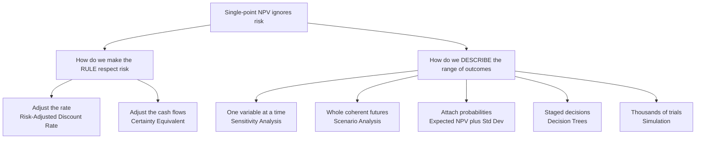
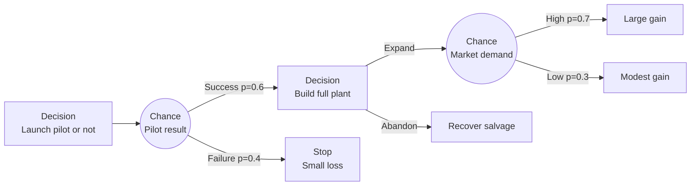
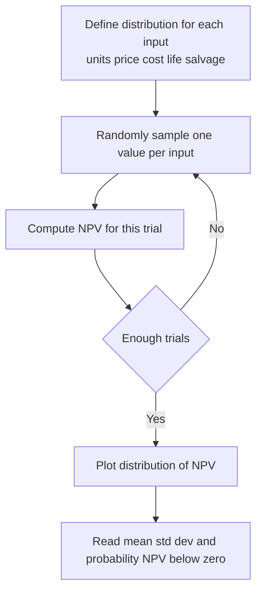
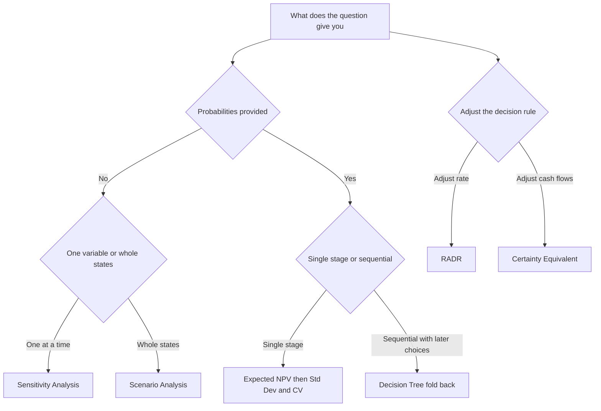
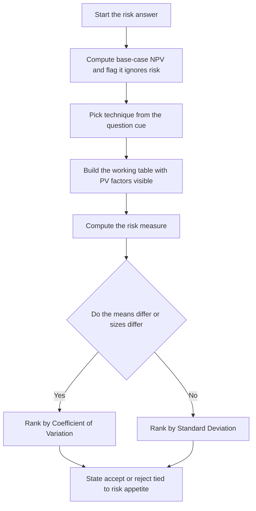

<!-- v2-deep -->

# Chapter 07 — Risk Analysis in Capital Budgeting

## 1. The Problem: The NPV You Computed Is a Comfortable Lie

In Chapter 6 you learned to appraise a project. You forecast the cash flows, picked a discount rate, and computed the Net Present Value. If NPV was positive, you accepted. Clean, decisive, mathematical.

Now sit with an uncomfortable truth. Every one of those cash flows was a **guess about the future**. The ₹40 lakh you wrote down for "Year 3 operating cash flow" is not a fact — it is a hope, dressed up in the false precision of a number with no error bar attached to it.

Consider a real decision. Your company is evaluating a new product line. The finance team hands you this:

| Year | Cash Flow (₹) |
|------|---------------|
| 0 | (10,00,000) |
| 1 | 4,00,000 |
| 2 | 4,00,000 |
| 3 | 5,00,000 |

At a 10% discount rate the NPV comes to roughly ₹+3,25,000. Accept, says the model.

But **where did the ₹4,00,000 for Year 1 come from?** It came from assuming you sell 20,000 units at ₹100 with a ₹80 cost. What if you sell only 15,000 units? What if a competitor launches first and the price falls to ₹90? What if raw material inflation pushes cost to ₹85? Each of those is plausible. Under some combinations the same "accept" project quietly becomes a wealth-destroying trap with a **negative** NPV.

Here is the core problem this chapter solves:

> A single-point NPV tells you the destination if everything goes exactly as forecast. It tells you **nothing** about how likely that is, how far you might miss, or which assumption you most need to protect. Two projects can have identical NPVs — and yet one is a safe bet and the other a coin flip with your factory as the stake.

Capital budgeting decisions are **large, long-lived, and irreversible**. You cannot un-build a plant. The further into the future a cash flow sits, the less you can trust the forecast — yet a ₹10 crore plant is justified precisely by those distant, least-trustworthy years. Ignoring risk does not make a project safe; it only makes you **blind** to the danger you have already accepted.

**Why does risk deserve its own chapter — isn't a positive NPV enough?** Because NPV is a *conditional* statement: "given these exact inputs, value is created." The three features of a capital project — **size** (a big cheque you can't easily claw back), **irreversibility** (sunk cost, thin resale market for a half-built plant), and **long horizon** (errors compound the further out you forecast) — combine so that being *wrong* is not a rounding error but a solvency event. A trader who is wrong closes the position by lunch; a firm that is wrong about a plant lives with it for fifteen years. That asymmetry is why risk analysis is not optional polish but core diligence.

So the questions this chapter must answer are:

1. **How do we adjust the accept/reject rule itself** so it demands a higher reward from a riskier project? (Risk-adjusted discount rate, certainty equivalent.)
2. **How do we probe a single forecast** to see which assumption is fragile? (Sensitivity analysis.)
3. **How do we model a whole coherent future** rather than one variable at a time? (Scenario analysis.)
4. **How do we attach probabilities** and compute an *expected* NPV, and then measure the *spread* of outcomes around it? (Expected NPV, standard deviation, coefficient of variation.)
5. **How do we handle decisions that unfold in stages**, where later choices depend on earlier outcomes? (Decision trees.)
6. **How do we let a computer roll the dice thousands of times** to see the full shape of what might happen? (Simulation.)

Each technique exists because a simpler one fell short. We will build them in that order.

---

## 2. The Core Idea: A Weather Forecast, Not a Calendar Date

A single-point NPV is like a calendar that says **"It will rain 12 mm on the afternoon of 14 August."** Absurdly precise, and almost certainly wrong in the specifics.

Risk analysis converts that into a **weather forecast**: *"70% chance of rain, most likely 8–15 mm, with a small chance of a washout flood."* Notice what the forecast gives you that the calendar date never could:

- A **central expectation** (what to plan around).
- A **range** (how wrong you might be).
- The **tail risk** (the rare catastrophe you must insure against).
- **What drives it** (the monsoon system, i.e. which variable matters).

That is exactly the upgrade we are performing on capital budgeting. We stop pretending the future is a fixed number and start describing it as a **distribution** — a fan of possibilities, each with a likelihood.

The second analogy, for the discount-rate side of the story: think of the **interest a lender charges**. A bank lends to the Government of India at a low rate, and to a first-time entrepreneur at a much higher rate. Same rupee, different price — because the second borrower **might not pay back**. The extra percentage points are a **risk premium**. When we discount a risky project's cash flows at a higher rate, we are doing precisely what the bank does: demanding more reward per rupee of risk before we part with our capital. Risk isn't just measured; it is **priced into the hurdle**.

Hold both pictures in your head:
- **Weather forecast** = describing the spread of outcomes (sensitivity, scenario, probability, simulation).
- **Risk premium on a loan** = adjusting the decision rule to punish risk (risk-adjusted rate, certainty equivalent).

Everything in this chapter is one of these two moves: **describe the risk**, or **charge for it**.

**A third mental picture — the archer's grouping.** Imagine two archers whose *average* arrow lands dead centre. One archer's arrows cluster tightly around the bullseye; the other's are scattered all over the target, averaging out to centre only by luck. Same mean, very different reliability. Expected NPV is where the arrows *average*; standard deviation is how *tightly they group*. A risk-averse manager prefers the tight grouping even for the same average — because with capital you fire the arrow only once, and a wild miss can bankrupt you. This is why we never judge a project by its expected NPV alone.

---

## 3. Why It's Built This Way: Risk vs Uncertainty, and Two Honest Roads

Before the machinery, one distinction the examiner loves and that clarifies your thinking.

**Risk vs Uncertainty (Frank Knight's distinction).**
- **Risk** is when you *can* attach probabilities to outcomes — like a dice throw. You don't know the result, but you know the odds. Insurance companies live here.
- **Uncertainty** is when you *cannot* reliably attach probabilities — a genuinely novel product, an untested market. You know outcomes are possible but not how likely.

In practice, capital budgeting lives in a grey zone: we estimate probabilities from history, judgement, and analysis, knowing they are imperfect. The techniques below span the spectrum — sensitivity analysis needs *no* probabilities (good for true uncertainty), while expected NPV and simulation *require* them (they treat the problem as measurable risk).

**Where do the probabilities even come from?** The examiner may ask you to *classify* the source, so know the three:
- **Objective probabilities** — derived from long-run frequency or hard historical data (e.g. equipment failure rates from ten years of records). Repeatable, defensible.
- **Subjective probabilities** — the informed judgement of managers where no history exists (a first-of-its-kind product). Legitimate but only as good as the judge.
- **A blend** — most real capital budgeting, where history anchors the estimate and judgement adjusts it.
The moment a question hands you a probability, it has silently moved you from Knight's "uncertainty" into his "risk". Recognising that shift tells you the whole quantitative toolkit (expected NPV, σ, CV, trees, simulation) is now available.

**Why two separate roads to adjust the decision rule?**

There are two philosophically different ways to make the accept/reject rule respect risk, and understanding *why both exist* is more important than memorising either.

Road 1 — **Adjust the discount rate (RADR).** Keep the cash flows as forecast, but discount them harder. The logic: risk is a cost, and the cost of risk grows with time, so bake the premium into the rate, where compounding automatically makes it bite harder in later years.

Road 2 — **Adjust the cash flows (Certainty Equivalent, CE).** Shrink each risky cash flow down to the *certain* amount you'd accept in exchange for it, then discount all those "de-risked" flows at the plain **risk-free rate**. The logic: risk and the time value of money are two *different* things, so deal with them *separately* — squeeze the risk out of the numerator first, then apply pure time value in the denominator.

They exist as rivals because each fixes a flaw in the other, and the examiner tests whether you understand the trade-off (Section 4 makes the conflict precise). This is the recurring pattern of the chapter: **no technique is final; each is a response to the limitation of the one before it.**

**The deeper "why": describing vs charging are answering different questions.** Notice these two roads do not compete with the *describing* techniques — they answer a different question. RADR and CE change the **accept/reject threshold**; sensitivity, scenario, probability, trees, and simulation change **how much you understand about the outcome**. A complete, board-grade appraisal usually does *both*: it charges for risk in the hurdle rate *and* describes the spread so the board can see the downside it is accepting. Students who think the techniques are alternatives — "do I use RADR *or* sensitivity?" — miss that they operate on different parts of the decision. You can, and often should, run a sensitivity analysis on a project you are already discounting at a RADR.

*Figure 1: The two families of risk techniques — pricing the risk into the rule, and describing the spread of outcomes.*

---

## 4. Full Technical Content: The Machinery, With the "Why" Attached

### 4.1 Sources of risk — name them before you model them

Cash flows are uncertain because their **components** are uncertain. Listing the drivers is the first analytical act:

- **Project-specific risk** — errors in your own estimates (units, cost, life).
- **Competitive/industry risk** — rivals' actions, technology shifts.
- **Market/economy-wide risk** — inflation, interest rates, GDP cycles, exchange rates.
- **International & political risk** — regulation, taxation, expropriation.

Every technique below is ultimately a way of translating uncertainty in these **inputs** into uncertainty in the **output** (NPV).

**Diversifiable vs non-diversifiable — the distinction that decides the premium.** A finer cut the examiner rewards: of the risks above, some are **unique/unsystematic** (specific to this project — a machine breakdown, a factory fire) and can be *diversified away* by a shareholder holding many companies; others are **systematic/market** risk (GDP, interest rates, inflation) that hit *all* projects together and *cannot* be diversified away. This matters because, under CAPM logic (Section 7), a well-diversified shareholder should only be rewarded for **systematic** risk — the risk premium in a RADR is compensation for the part of risk you *cannot* escape. A stand-alone measure like σ of a single project captures *total* risk (systematic + unsystematic); a market measure like β captures only the systematic part. When a question asks "should this premium reflect the project's *total* risk or only its market risk?", the answer turns on whether the decision-maker is diversified.

### 4.2 Risk-Adjusted Discount Rate (RADR)

**The rule.** Discount the (unchanged) expected cash flows at a rate that includes a risk premium:

$$\text{RADR} = R_f + \text{Risk Premium}$$

where $R_f$ is the risk-free rate. Then apply the ordinary NPV formula:

$$\text{NPV} = \sum_{t=1}^{n} \frac{CF_t}{(1 + \text{RADR})^{t}} - CF_0$$

**Why it works.** A higher denominator shrinks present values. Riskier project → higher premium → higher hurdle → project must produce more to survive. Because the rate is *compounded*, $(1+r)^t$, the penalty **grows automatically with time** — distant cash flows (the least trustworthy) get punished the most. That is elegant and intuitive.

**Where does the premium come from?** Three defensible sources, in rising order of rigour: (i) **managerial judgement** — a flat "add 3% for a new-market project" rule of thumb; (ii) **the firm's own required returns** by risk class — group projects into buckets (replacement, expansion, new product, R&D) each with a standard premium; (iii) **CAPM** — derive it from the project's beta, $R_f + \beta(R_m - R_f)$, so the premium is market-calibrated rather than plucked from the air. The exam may hand you any of these; recognise that all three feed the *same* RADR formula.

**Relationship to WACC.** The firm's WACC is the right discount rate only for a project of *average* firm risk. A RADR adjusts *around* WACC: a riskier-than-average project gets a rate **above** WACC, a safer one a rate **below** WACC. A classic conceptual trap is discounting every project at a single firm-wide WACC — this over-accepts risky projects (their true hurdle should be higher) and wrongly rejects safe ones (their hurdle should be lower). RADR fixes exactly this mismatch.

**The hidden flaw — and why CE was invented.** That same compounding is a **crude assumption**: RADR forces risk to increase at a constant compound rate every year. But not every project's risk grows smoothly with time. A project might be very risky in Year 1 (will the product even launch?) and *safer* later once it's established. RADR cannot express that shape — it mechanically assumes risk keeps compounding. This over-penalises long, back-loaded projects. That flaw is precisely what the Certainty Equivalent method fixes.

### 4.3 Certainty Equivalent (CE) approach

**The rule.** Convert each risky cash flow into its **certainty equivalent** by multiplying by a certainty-equivalent coefficient $\alpha_t$ (alpha), then discount those certain amounts at the **risk-free rate**:

$$\text{NPV} = \sum_{t=1}^{n} \frac{\alpha_t \times CF_t}{(1 + R_f)^{t}} - CF_0$$

The coefficient is defined as:

$$\alpha_t = \frac{\text{Certain cash flow the decision-maker would accept}}{\text{Expected risky cash flow}}$$

$\alpha_t$ lies between 0 and 1. **Lower $\alpha$ = more risk** (you'd swap the risky flow for a much smaller sure thing). As risk perception rises, $\alpha$ falls.

**Why it's the theoretically superior method.** It separates the **two things RADR tangles together**:
- Time value → handled *purely* by discounting at $R_f$.
- Risk → handled *separately and explicitly* in the numerator, year by year.

Because each year gets its **own** $\alpha_t$, the analyst can say "Year 1 is very risky ($\alpha_1 = 0.70$), Year 5 is safer once established ($\alpha_5 = 0.85$)" — a flexibility RADR simply does not have. Theory prefers CE for this honesty. Note the direction carefully: the *smaller* the α, the *riskier* that year is perceived to be, because you would trade the risky flow for only a small guaranteed sum.

**Why RADR still dominates in practice.** Estimating a defensible $\alpha_t$ for every single year is subjective and hard to justify to a board. A single risk-adjusted rate is easier to communicate, benchmark, and defend. So CE wins the argument but RADR wins the meeting.

**The reconciliation (exam favourite).** The two methods give the *same* NPV when their implied risk treatments agree. The relationship between the coefficient and the rates is:

$$\alpha_t = \frac{(1 + R_f)^{t}}{(1 + \text{RADR})^{t}}$$

Because RADR > $R_f$, the denominator grows faster, so $\alpha_t$ **declines as $t$ rises** — meaning RADR *implicitly* assumes risk keeps growing every year. This equation is the mathematical proof of RADR's hidden assumption from Section 4.2.

**Reading the reconciliation both ways (a common exam variant).** The formula is bidirectional. If a question *gives* you the RADR and $R_f$ and asks for the "implied certainty-equivalent coefficients", plug in and compute $\alpha_t = (1+R_f)^t/(1+\text{RADR})^t$ for each year. If instead it gives you the $\alpha_t$ and $R_f$ and asks "what single RADR is consistent with these coefficients?", rearrange for each year: $\text{RADR}_t = \left[(1+R_f)/\alpha_t^{1/t}\right] - 1$. The catch: a *constant* RADR is consistent with the α's only if the α's decline in the exact geometric pattern the formula produces. If management's stated α's fall faster or slower than that geometric decline, **no single RADR can reproduce them** — which is itself the proof that CE is more flexible. Being able to argue this in words earns the conceptual marks.

| Feature | RADR | Certainty Equivalent |
|---|---|---|
| What is adjusted | The discount rate (denominator) | The cash flows (numerator) |
| Discount rate used | Risk-free + premium | Risk-free rate only |
| Risk each year | Forced to grow at compound rate | Set independently per year |
| Ease of use | Easy, board-friendly | Harder, subjective per year |
| Theoretical soundness | Weaker (mixes risk and time) | Stronger (separates them) |

### 4.4 Sensitivity Analysis — "what breaks this project?"

RADR and CE change the *rule*. But they don't tell you **which assumption is dangerous**. Sensitivity analysis does.

**The idea.** Take one input at a time, flex it up or down (say ±10%), hold everything else constant, and watch what happens to NPV. The input that moves NPV the most is the **most sensitive** — that's where your forecasting effort and managerial vigilance must concentrate.

**Two ways to express it in the exam:**
1. **NPV sensitivity** — recompute NPV for a given % change in each variable; the largest swing = most critical.
2. **Break-even / margin of safety** — find the % change in each variable that drives NPV to **zero**. The variable needing the *smallest* adverse change to wipe out NPV is the most critical (thinnest safety margin).

$$\text{Sensitivity margin (\%)} = \frac{\text{NPV}}{\text{PV of the variable being flexed}} \times 100$$

**A subtlety in that margin formula.** "PV of the variable being flexed" means the present value of the *stream that variable controls*, not the variable's rupee value in one year. For selling price, it is the PV of total sales revenue over the life; for variable cost, the PV of total variable cost; for the initial outlay, simply the outlay itself (it is already at time 0). Getting the denominator right is where students lose marks — a price sensitivity margin computed against one year's revenue instead of the whole-life PV of revenue will be wrong by the annuity factor.

**Why it's powerful and where it fails.** It needs **no probabilities** — perfect for genuine uncertainty. It's transparent and pinpoints the variable to defend. **But** it flexes variables *one at a time* and in *isolation*, which is unrealistic — in a recession, sales volume *and* price *and* cost all move together. It tells you *what* is sensitive, not *how likely* the adverse move is. It also ignores that some variables *cannot* move independently (price and volume are linked by the demand curve). Those gaps are exactly why scenario analysis and probability analysis come next.

**What the examiner can tweak.** Watch for a question that flexes variables by *different* percentages (price ±5% but volume ±15%, reflecting that volume is genuinely more uncertain) — you must not blindly apply a uniform ±10%. Also watch for a "two-way" or "spider" sensitivity where two variables move and you report the NPV surface; the principle is unchanged but the arithmetic doubles.

### 4.5 Scenario Analysis — flex everything together, coherently

**The idea.** Instead of one variable at a time, define a small number of **internally consistent complete states of the world** — typically Pessimistic, Most Likely, Optimistic — where *every* variable is set to the value appropriate to that world simultaneously. Compute NPV for each.

**Why it beats sensitivity.** In a "recession" scenario, volume falls *and* price falls *and* costs may rise — sensitivity analysis would never capture that *joint* movement. Scenario analysis respects the fact that variables are **correlated**. Assigning rough probabilities to the three scenarios lets you compute an expected NPV across them.

**The bridge to probability analysis.** Once you attach probabilities to the scenarios, scenario analysis quietly *becomes* a coarse expected-NPV calculation with only three outcomes. This is why the chapter's ordering matters: scenario analysis is the conceptual stepping-stone between "no probabilities" (sensitivity) and "full probability distributions" (expected NPV, simulation). If an exam gives you pessimistic/most-likely/optimistic NPVs *and* their probabilities and asks for expected NPV and σ, you are really doing Section 4.6 with three data points — do not treat it as a separate method.

**Its limit.** Only a handful of scenarios — reality has infinitely many, and the choice of "pessimistic" is itself arbitrary (how pessimistic?). Two analysts can pick different worlds and reach different conclusions. That gap is what simulation fills.

### 4.6 Probability, Expected NPV, and measuring spread

Now we attach **probabilities** to outcomes and compute genuine statistical measures. This is the heart of quantitative risk analysis.

**Expected value of a cash flow:**

$$\overline{CF_t} = \sum_{i=1}^{m} p_i \times CF_{ti}$$

where $p_i$ is the probability of outcome $i$ (probabilities sum to 1). This is the **probability-weighted average** — the centre of the fan.

**Expected NPV:**

$$\overline{\text{NPV}} = \sum_{t=1}^{n} \frac{\overline{CF_t}}{(1+r)^{t}} - CF_0$$

**Standard Deviation — measuring the spread.** Expected NPV is only the centre. Two projects with the *same* expected NPV can have wildly different **dispersion**. Standard deviation ($\sigma$) measures how far outcomes scatter around the mean:

$$\sigma = \sqrt{\sum_{i=1}^{m} p_i \left(CF_i - \overline{CF}\right)^{2}}$$

A **higher $\sigma$ = more risk** (wider fan of outcomes). $\sigma$ is an *absolute* measure of risk in rupees. Note $\sigma$ is in the **same units** as the cash flow (rupees) precisely because we took the square root of the variance; variance itself is in "rupees squared", an uninterpretable unit, which is why we rarely quote variance as the final risk measure.

**Coefficient of Variation — risk per rupee of return.** Here's the trap $\sigma$ falls into: a big project naturally has a big $\sigma$ just because the numbers are big, not because it's riskier *per rupee*. To compare projects of **different sizes**, we standardise:

$$\text{CV} = \frac{\sigma}{\overline{\text{NPV}} \text{ (or expected value)}}$$

CV is **risk per unit of return**. When two projects differ in scale or in expected return, **CV is the correct comparator, not $\sigma$.** *Lower CV = better risk-return trade-off.* This distinction (when to use $\sigma$ vs CV) is a classic exam discriminator.

**A caution on CV's denominator.** CV is only meaningful when the mean is *positive* and comfortably away from zero. If expected NPV is near zero, CV explodes toward infinity and becomes meaningless; if the mean is negative, CV changes sign and the "lower is better" rule breaks. In practice, CV is most often computed on the **expected cash flow or expected value**, which is safely positive, rather than on the expected NPV which can be small. Read the question to see which base it wants; state your base explicitly.

**Independent vs dependent cash flows.** If each year's cash flow is **independent**, the standard deviation of the *NPV* is:

$$\sigma_{\text{NPV}} = \sqrt{\sum_{t=1}^{n} \frac{\sigma_t^{2}}{(1+r)^{2t}}}$$

If cash flows are **perfectly correlated** (a bad year stays bad), risk is higher:

$$\sigma_{\text{NPV}} = \sum_{t=1}^{n} \frac{\sigma_t}{(1+r)^{t}}$$

Perfect correlation gives a larger $\sigma$ than independence — because there's no year-to-year averaging to smooth the shocks. Knowing *which* formula to apply from the wording ("independent" vs "correlated") is itself an examiner trick.

**Why the discount factor is *squared* in the independent formula.** This trips up almost everyone. When cash flows are independent, *variances* add (a theorem of statistics), not standard deviations. The variance of a discounted flow $\sigma_t/(1+r)^t$ is $\sigma_t^2/(1+r)^{2t}$ — the discount factor gets squared because variance is a squared quantity. You sum those variances, then take one final square root. In the perfectly-correlated case, by contrast, the *standard deviations* themselves add (there is no diversification benefit), so each is discounted by the plain $(1+r)^t$ and summed directly. If you ever find yourself squaring the discount factor in the correlated formula, or *not* squaring it in the independent one, stop — you have mixed the two.

**The mixed case (a harder tweak).** Reality is often *between* the two extremes — cash flows partly correlated. The full formula involves covariance terms and correlation coefficients between years; ICAI's Intermediate syllabus generally restricts you to the two clean extremes (fully independent or perfectly correlated), so if a question implies partial correlation without giving correlation coefficients, state your assumption and pick the nearer extreme. Do not invent covariance data.

### 4.7 Decision Trees — when today's choice depends on tomorrow's outcome

Everything so far assumes a **single, once-and-for-all** decision. But many real investments are **sequential**: build a pilot plant now, and *only if* it succeeds, invest in the full plant. The second decision depends on the first outcome. A flat expected-NPV calculation can't represent that branching.

**The idea.** Draw the decision as a **tree**:
- **Decision nodes** (squares) — points where *you* choose.
- **Chance/outcome nodes** (circles) — points where *nature* decides, each branch carrying a probability.
- **Branches** — the flows.

**Roll back (fold back) the tree.** Evaluate from **right to left**: at each chance node compute the expected value; at each decision node pick the branch with the highest value. The initial decision's value is the expected value of playing optimally throughout.

**Joint and conditional probabilities.** A tree's branches often carry *conditional* probabilities — "given the pilot succeeded, demand is high with probability 0.7". The probability of reaching a *terminal* node is the **product** of the probabilities along its path (the joint probability). The examiner's favourite trap: handing you conditional probabilities and expecting you to multiply along the branch, while a careless student treats them as unconditional and adds or averages wrongly. Always verify that the joint probabilities of all terminal nodes emanating from a single starting point **sum to 1**.

**Discounting inside a tree.** In a genuine multi-period tree the cash flows arrive in *different years*, so each terminal payoff should be discounted back to time 0 before you fold back. Many exam problems simplify by giving you already-present-valued payoffs (or by ignoring discounting explicitly) — read the question. If it gives raw future cash flows with years and a discount rate, you must discount each branch's flow to present value *first*, then apply probabilities and fold back.

**Why it matters.** It captures the *value of flexibility* — the option to abandon, expand, or wait. A rigid NPV ignores that you can *react* to how things unfold; a decision tree rewards the fact that you'll make good choices later. This is the conceptual seed of **real options**, which the SM/AFM ladder develops further: the option to abandon, expand, defer, or switch all show up first as branches in a decision tree.

*Figure 2: A two-stage decision tree — squares are choices you control, circles are outcomes nature controls; you fold back from right to left.*

### 4.8 Simulation — let the computer live a thousand futures

Scenario analysis gives three futures; reality has millions. **Monte Carlo simulation** (Hertz's technique, 1964) is the industrial-scale answer.

**The idea.** For *every* uncertain input (units, price, cost, life, salvage), specify a **probability distribution** rather than a single number. Then the computer:
1. Randomly draws one value from each input's distribution.
2. Computes the NPV for that one complete random future.
3. Repeats thousands of times.
4. Plots the **distribution of NPVs** that results.

**How the random draw actually works (the conceptual mechanic).** Each input's distribution is converted to a cumulative distribution; the computer draws a random number between 0 and 1 and reads off the corresponding input value. Correlations between inputs (price and volume moving together) are imposed by drawing correlated random numbers. You will not be asked to code this in an ICAI exam, but you *may* be asked to describe the steps — memorise the four-step loop above and the phrase "assign a probability distribution to each variable, then sample repeatedly."

**What you get that nothing else provides.** Not one NPV, not three — a **full probability distribution of NPV**: the mean, the standard deviation, and crucially the **probability that NPV < 0** (the chance the project destroys value). It handles many variables *and* their correlations at once.

**The catch.** It is data-hungry and model-dependent — you must specify every distribution and every correlation, and a wrong distribution in gives garbage out. It's expensive and can create false confidence. It also does not, by itself, *make* the decision — it produces a distribution that a human must still judge against risk appetite. But conceptually it is the natural end-point: scenario analysis with the number of scenarios turned up to infinity.

*Figure 3: The Monte Carlo simulation loop — repeat the draw-and-compute cycle thousands of times to build the NPV distribution.*

### 4.9 A ladder of sophistication — and what each rung costs

It helps to see the *describing* techniques as one ladder, each rung buying more realism at the price of more data:

| Rung | Technique | Probabilities needed | Variables moved | What it tells you |
|---|---|---|---|---|
| 1 | Sensitivity | None | One at a time | Which assumption is fragile |
| 2 | Scenario | Rough (optional) | All, in a few coherent bundles | Range across a handful of worlds |
| 3 | Expected NPV + σ + CV | Full, per outcome | All, via weighted outcomes | Centre and spread numerically |
| 4 | Decision tree | Full, incl. conditional | All, across stages | Value of staged flexibility |
| 5 | Simulation | Full distribution per input | All, continuously, correlated | The entire NPV distribution and P(NPV<0) |

The exam-craft point: **the question's data tells you which rung you are on.** No probabilities and "flex price by X%" → rung 1. Three states with probabilities → rung 2/3. "Test then decide" → rung 4. "Distribution of every input" → rung 5. You almost never *choose* the rung; the question's information structure chooses it for you.

---

## 5. Worked Examples

### Example 1 — Sensitivity Analysis (which assumption breaks the project?)

**Data.** A project needs an initial outlay of ₹10,00,000 and lasts 4 years. Expected figures per year:

- Annual sales volume: 10,000 units
- Selling price: ₹60 per unit
- Variable cost: ₹35 per unit
- Annual fixed cost (cash): ₹80,000
- Cost of capital: 10%; ignore tax; no salvage.

**Base-case NPV.**

Contribution per unit = 60 − 35 = ₹25.
Annual cash flow = (10,000 × 25) − 80,000 = 2,50,000 − 80,000 = **₹1,70,000**.

PV factor of annuity, 10%, 4 years = 3.1699.

PV of inflows = 1,70,000 × 3.1699 = ₹5,38,883.
NPV = 5,38,883 − 10,00,000 = **₹(4,61,117)**.

Hold on — the base case is **negative**. Let me re-scale so the illustration is instructive. Revise annual volume to **25,000 units** (the rest unchanged).

Annual cash flow = (25,000 × 25) − 80,000 = 6,25,000 − 80,000 = **₹5,45,000**.
PV of inflows = 5,45,000 × 3.1699 = ₹17,27,596.
**Base NPV = 17,27,596 − 10,00,000 = ₹7,27,596.** Positive — accept on base case.

**Now flex each variable by an adverse 10%, one at a time.**

*(a) Selling price −10%:* price 60 → 54. Contribution 54 − 35 = 19.
CF = (25,000 × 19) − 80,000 = 4,75,000 − 80,000 = 3,95,000.
PV inflows = 3,95,000 × 3.1699 = 12,52,111. NPV = **₹2,52,111**.
NPV fell from 7,27,596 → 2,52,111, a drop of ₹4,75,485 (a **65%** fall).

*(b) Variable cost +10%:* cost 35 → 38.5. Contribution 60 − 38.5 = 21.5.
CF = (25,000 × 21.5) − 80,000 = 5,37,500 − 80,000 = 4,57,500.
PV inflows = 4,57,500 × 3.1699 = 14,50,229. NPV = **₹4,50,229**.
Drop of ₹2,77,367 (a **38%** fall).

*(c) Volume −10%:* 25,000 → 22,500.
CF = (22,500 × 25) − 80,000 = 5,62,500 − 80,000 = 4,82,500.
PV inflows = 4,82,500 × 3.1699 = 15,29,477. NPV = **₹5,29,477**.
Drop of ₹1,98,119 (a **27%** fall).

*(d) Initial outlay +10%:* 10,00,000 → 11,00,000.
NPV = 17,27,596 − 11,00,000 = **₹6,27,596**.
Drop of ₹1,00,000 (a **14%** fall).

**Sensitivity ranking (most to least critical):**

| Variable flexed −/+10% | New NPV (₹) | Fall in NPV (₹) | % Fall | Rank |
|---|---|---|---|---|
| Selling price | 2,52,111 | 4,75,485 | 65% | **1 (most critical)** |
| Variable cost | 4,50,229 | 2,77,367 | 38% | 2 |
| Sales volume | 5,29,477 | 1,98,119 | 27% | 3 |
| Initial outlay | 6,27,596 | 1,00,000 | 14% | 4 (least critical) |

**Interpretation.** NPV is **most sensitive to selling price** — a mere 10% price slip cuts NPV by nearly two-thirds. Management should protect pricing (contracts, brand, differentiation) above all else, and forecast price with the most care. Note the *insight*: price hits hardest because it changes contribution *without* any offset, whereas volume also carries the ₹80,000 fixed cost that is unaffected by the −10% (fixed cost doesn't scale down with volume), and the outlay is a one-time, undiscounted-into-the-future hit.

**Why price beats volume even though both feed contribution — the first-principles reason.** A −10% price change removes ₹6 of contribution per unit (from ₹25 to ₹19), a 24% cut in unit contribution. A −10% volume change keeps unit contribution at ₹25 but sells 2,500 fewer units. Because price acts on *every* unit's margin while volume only removes marginal units (whose fixed-cost absorption was already covered), price is the more violent lever. This is the same operating-leverage intuition from the Leverage chapter: the variable that hits the *margin on all units* dominates.

**Break-even margin check (variable = selling price).** How far can price fall before NPV = 0? NPV = 0 needs PV inflows = 10,00,000, i.e. annual CF = 10,00,000 / 3.1699 = ₹3,15,467. Required contribution = (3,15,467 + 80,000)/25,000 = ₹15.82 per unit → price = 35 + 15.82 = ₹50.82. That's a fall of (60 − 50.82)/60 = **15.3%**. The price has only a ~15% safety margin — the thinnest of all variables, confirming it as the critical driver.

### Example 2 — Expected NPV, Standard Deviation & Coefficient of Variation

**Data.** Two mutually exclusive projects, each costing ₹1,00,000, single year life, cost of capital 10%. Year-1 cash flows depend on the economy:

| State | Probability | Project A CF (₹) | Project B CF (₹) |
|---|---|---|---|
| Recession | 0.30 | 90,000 | 40,000 |
| Normal | 0.40 | 1,20,000 | 1,20,000 |
| Boom | 0.30 | 1,50,000 | 2,00,000 |

**Step 1 — Expected cash flow.**

Project A: (0.30 × 90,000) + (0.40 × 1,20,000) + (0.30 × 1,50,000)
= 27,000 + 48,000 + 45,000 = **₹1,20,000**.

Project B: (0.30 × 40,000) + (0.40 × 1,20,000) + (0.30 × 2,00,000)
= 12,000 + 48,000 + 60,000 = **₹1,20,000**.

**Identical expected cash flow.** A naive analyst would call them equal. They are not.

**Step 2 — Expected NPV.**

Discount factor at 10%, 1 year = 0.9091.
Both: Expected NPV = (1,20,000 × 0.9091) − 1,00,000 = 1,09,091 − 1,00,000 = **₹9,091**. Same for both.

**Step 3 — Standard deviation of the cash flow.**

*Project A:*

| State | p | CF − mean | (CF−mean)² | p × (CF−mean)² |
|---|---|---|---|---|
| Recession | 0.30 | −30,000 | 90,00,00,000 | 27,00,00,000 |
| Normal | 0.40 | 0 | 0 | 0 |
| Boom | 0.30 | +30,000 | 90,00,00,000 | 27,00,00,000 |

Variance = 54,00,00,000. $\sigma_A = \sqrt{54,00,00,000}$ = **₹23,238**.

*Project B:*

| State | p | CF − mean | (CF−mean)² | p × (CF−mean)² |
|---|---|---|---|---|
| Recession | 0.30 | −80,000 | 6,40,00,00,000 | 1,92,00,00,000 |
| Normal | 0.40 | 0 | 0 | 0 |
| Boom | 0.30 | +80,000 | 6,40,00,00,000 | 1,92,00,00,000 |

Variance = 3,84,00,00,000. $\sigma_B = \sqrt{3,84,00,00,000}$ = **₹61,968**.

**Step 4 — Interpret.** Same expected NPV (₹9,091), but Project B's spread ($\sigma$ = ₹61,968) is nearly **three times** Project A's (₹23,238). Project B is far riskier — its recession outcome (₹40,000) doesn't even cover the outlay, so its NPV in recession is negative.

**Step 5 — Coefficient of variation** (here both have equal expected value, so ranking by $\sigma$ already suffices, but compute CV on the cash flow for completeness):

CV_A = 23,238 / 1,20,000 = **0.194**.
CV_B = 61,968 / 1,20,000 = **0.516**.

**Decision.** For a **risk-averse** decision-maker, choose **Project A** — same expected reward, much lower risk (lower $\sigma$ and lower CV). This example makes the chapter's central point concrete: *expected NPV alone is not enough; you must look at dispersion.*

**When would CV (not $\sigma$) be the decider?** If the two projects had *different* expected NPVs — say B also had a higher expected return — then comparing raw $\sigma$ would be unfair to the bigger project. CV normalises risk per rupee of return and becomes the correct tie-breaker.

**Examiner tweak — what if B's mean were higher?** Suppose Project B's boom cash flow were ₹2,60,000 instead of ₹2,00,000, lifting its expected CF to ₹1,38,000 (expected NPV ₹25,455) while σ rises to about ₹78,000. Now σ says B is riskier *and* the means differ, so σ alone cannot rank them. Compute CV: CV_B = 78,000/1,38,000 ≈ 0.565 vs CV_A = 0.194. A moves less risk per rupee, so a risk-averse decision-maker still prefers A — but now the choice genuinely *trades* B's higher return against A's lower risk, and a risk-seeking manager might legitimately pick B. This is the situation the syllabus wants you to recognise: **σ ranks only when means are equal; CV ranks when they differ; and even CV cannot force a choice once risk appetite enters.**

### Example 3 — Certainty Equivalent vs RADR (and their reconciliation)

**Data.** Project outlay ₹6,00,000. Expected (risky) cash flows and management's certainty-equivalent coefficients:

| Year | Expected CF (₹) | CE coefficient αₜ |
|---|---|---|
| 1 | 3,00,000 | 0.90 |
| 2 | 3,00,000 | 0.80 |
| 3 | 3,00,000 | 0.70 |

Risk-free rate = 6%. Company's risk-adjusted rate = 12%.

**Part A — CE method (discount certain amounts at 6%).**

| Year | CF | αₜ | Certain CF (₹) | PVF @6% | PV (₹) |
|---|---|---|---|---|---|
| 1 | 3,00,000 | 0.90 | 2,70,000 | 0.9434 | 2,54,718 |
| 2 | 3,00,000 | 0.80 | 2,40,000 | 0.8900 | 2,13,600 |
| 3 | 3,00,000 | 0.70 | 2,10,000 | 0.8396 | 1,76,316 |

PV of inflows = 2,54,718 + 2,13,600 + 1,76,316 = ₹6,44,634.
**NPV (CE) = 6,44,634 − 6,00,000 = ₹44,634.** Accept.

**Part B — RADR method (discount full CF at 12%).**

| Year | CF (₹) | PVF @12% | PV (₹) |
|---|---|---|---|
| 1 | 3,00,000 | 0.8929 | 2,67,870 |
| 2 | 3,00,000 | 0.7972 | 2,39,160 |
| 3 | 3,00,000 | 0.7118 | 2,13,540 |

PV of inflows = 7,20,570. **NPV (RADR) = 7,20,570 − 6,00,000 = ₹1,20,570.** Accept.

**Why do they differ so much (₹44,634 vs ₹1,20,570)?** Because the two methods embed *different* risk assumptions. The CE coefficients here (0.90, 0.80, 0.70) penalise risk **harder** than the 12% RADR does. We can prove this by backing out the RADR's *implied* CE coefficients using $\alpha_t = (1.06/1.12)^t$:

| Year | Implied αₜ from RADR = (1.06/1.12)ᵗ |
|---|---|
| 1 | 0.9464 |
| 2 | 0.8957 |
| 3 | 0.8478 |

The RADR *implicitly* assumes gentler coefficients (0.946, 0.896, 0.848) than management's stated (0.90, 0.80, 0.70). Management is **more cautious** than the 12% rate reflects, so the CE NPV is lower. **Lesson:** the two methods reconcile *only* when the stated $\alpha_t$ equals the RADR-implied $\alpha_t$. They are the same machine viewed from two ends — and the divergence here is a diagnostic, not an error.

**Reverse tweak — find the RADR that reproduces management's α's.** Suppose the examiner asks: "What single RADR would give NPV equal to the CE result?" Since the stated α's (0.90, 0.80, 0.70) fall *faster* than any single-rate geometric decline can, **no single RADR reproduces all three years exactly** — but you can find the RADR that matches Year 1: $\alpha_1 = 1.06/(1+\text{RADR}) = 0.90 \Rightarrow 1+\text{RADR} = 1.06/0.90 = 1.1778$, so RADR ≈ **17.8%** for Year 1. Check Year 3: that same 17.8% would imply $\alpha_3 = (1.06/1.1778)^3 = 0.728$, but management said 0.70 — close but not equal. The mismatch *is the answer*: it demonstrates in numbers that management's risk profile is steeper than a constant premium can capture, the exact theoretical superiority of CE. Being able to produce this argument, not just the arithmetic, is what separates a full-marks answer.

**Edge case — a rising α (risk that falls over time).** If a question gave α's of 0.70, 0.80, 0.90 (rising), it would describe a project *riskiest at the start* and safer once established — a start-up whose survival is the main risk. No positive constant RADR can ever produce a rising α (the reconciliation formula forces α to *fall* with t whenever RADR > R_f). So a rising-α project is one where RADR is not merely inaccurate but *structurally incapable* of representing the risk, and CE is the only honest tool. This is a favourite "explain why" question.

### Example 4 — Decision Tree (staged investment with the option to abandon)

**Data.** A firm can run a market test for ₹1,00,000 now. Test outcomes: **Favourable** (p = 0.6) or **Unfavourable** (p = 0.4). If favourable, it may invest ₹5,00,000 in full production, whose *present value of future cash flows* (already discounted) is either ₹12,00,000 (p = 0.7) or ₹4,00,000 (p = 0.3). If unfavourable, full production's PV would be ₹6,00,000 (p = 0.5) or ₹2,00,000 (p = 0.5). The firm will invest only where it pays; otherwise it walks away (₹0 further). Ignore discounting of the ₹5,00,000 and test cost for simplicity.

**Fold back from the right.**

*Favourable branch — value if it invests:*
Expected PV of production = (0.7 × 12,00,000) + (0.3 × 4,00,000) = 8,40,000 + 1,20,000 = ₹9,60,000.
Net of ₹5,00,000 investment = 9,60,000 − 5,00,000 = **₹4,60,000** (positive → invest). Value at this decision node = ₹4,60,000.

*Unfavourable branch — value if it invests:*
Expected PV = (0.5 × 6,00,000) + (0.5 × 2,00,000) = 3,00,000 + 1,00,000 = ₹4,00,000.
Net of ₹5,00,000 = 4,00,000 − 5,00,000 = **₹(1,00,000)** (negative → do NOT invest). Value at this node = **₹0** (abandon).

*Roll back to the test-result chance node:*
Expected value = (0.6 × 4,60,000) + (0.4 × 0) = ₹2,76,000.

*Initial decision — run the test?*
Value = 2,76,000 − 1,00,000 (test cost) = **₹1,76,000 > 0 → run the test.**

**The insight the tree reveals.** The *option to abandon* after an unfavourable test is worth real money. If the firm had committed to full production regardless, the unfavourable branch would have dragged expected value down by (0.4 × −1,00,000) = −40,000. By retaining the *right but not the obligation* to proceed, it protects that downside. A flat NPV cannot see this flexibility; the decision tree prices it.

**Quantifying the value of the test (a deeper follow-up).** Compare two worlds. *Without* the test, the firm would decide blind. Its unconditional expected PV of production, net of ₹5,00,000, using overall demand probabilities, would need computing — but the *point* of the test is that it lets the firm **condition its ₹5,00,000 commitment on information**. The abandonment saving of ₹40,000 (computed above) is a lower bound on what the information is worth. If that saving exceeded the ₹1,00,000 test cost, the test would pay for itself on downside-avoidance alone; here it does not, so the test earns its keep through the *upside* branch (the ₹4,60,000 it unlocks with probability 0.6). This "expected value of information" framing — comparing the value of deciding *with* versus *without* the test — is exactly the kind of extension an examiner adds to lift a routine tree into a discriminating question.

### Example 5 — RADR with uneven cash flows and a salvage value (full NPV build)

**Data.** A firm evaluates a machine costing ₹8,00,000, life 4 years, salvage ₹50,000 at end of Year 4. It is riskier than average, so management sets a RADR of 14% (risk-free 7% + 7% premium). Expected after-tax cash flows: Year 1 ₹2,00,000; Year 2 ₹3,00,000; Year 3 ₹3,50,000; Year 4 ₹2,50,000 (operating) plus the ₹50,000 salvage. PVF at 14%: 0.8772, 0.7695, 0.6750, 0.5921.

**Compute.**

| Year | Cash flow (₹) | PVF @14% | PV (₹) |
|---|---|---|---|
| 1 | 2,00,000 | 0.8772 | 1,75,440 |
| 2 | 3,00,000 | 0.7695 | 2,30,850 |
| 3 | 3,50,000 | 0.6750 | 2,36,250 |
| 4 | 2,50,000 + 50,000 = 3,00,000 | 0.5921 | 1,77,630 |

PV of inflows = 1,75,440 + 2,30,850 + 2,36,250 + 1,77,630 = ₹8,20,170.
**NPV at RADR 14% = 8,20,170 − 8,00,000 = ₹20,170.** Marginally positive → accept, but thin.

**The "what if" the examiner loves.** Suppose the board argues the premium is too high — the machine is a proven replacement, not a new venture — and the correct RADR is 10% (risk-free 7% + only 3% premium). PVF at 10%: 0.9091, 0.8264, 0.7513, 0.6830.

| Year | Cash flow (₹) | PVF @10% | PV (₹) |
|---|---|---|---|
| 1 | 2,00,000 | 0.9091 | 1,81,820 |
| 2 | 3,00,000 | 0.8264 | 2,47,920 |
| 3 | 3,50,000 | 0.7513 | 2,62,955 |
| 4 | 3,00,000 | 0.6830 | 2,04,900 |

PV of inflows = 8,97,595. **NPV at 10% = ₹97,595.** The project's attractiveness **quadruples** when the premium is halved.

**The lesson.** The accept/reject verdict here is dominated by the *choice of premium*, a subjective input. This exposes RADR's soft underbelly: a defensible-looking 4-percentage-point swing in the premium moves NPV from "barely accept" to "comfortably accept." An examiner can ask you to compute NPV at two rates and *comment* — the marks are in observing that the decision is fragile to the premium and recommending the premium be justified (ideally via CAPM/beta) rather than asserted. Notice too the salvage value rides in the final year's flow and is discounted at the *same* RADR — a common slip is to discount salvage at the risk-free rate, which is wrong under RADR (only CE discounts at risk-free).

### Example 6 — Standard deviation of NPV: independent vs perfectly correlated

**Data.** A 3-year project, outlay ₹5,00,000, discount rate 10%. Expected annual cash flow ₹2,50,000 each year, with a per-year standard deviation σₜ = ₹60,000 in each of the three years. PVF at 10%: 0.9091, 0.8264, 0.7513; and the squared factors (for variance) are 0.8264, 0.6830, 0.5645.

**Expected NPV (same either way).**
PV of inflows = 2,50,000 × (0.9091 + 0.8264 + 0.7513) = 2,50,000 × 2.4868 = ₹6,21,700.
Expected NPV = 6,21,700 − 5,00,000 = **₹1,21,700**.

**Case A — cash flows independent.** Variances add after discounting by the *squared* factor:

| Year | σₜ (₹) | σₜ² | (1+r)^(2t) factor | σₜ² / (1+r)^(2t) |
|---|---|---|---|---|
| 1 | 60,000 | 3,60,00,00,000 | 0.8264 | 2,97,50,40,000 |
| 2 | 60,000 | 3,60,00,00,000 | 0.6830 | 2,45,88,00,000 |
| 3 | 60,000 | 3,60,00,00,000 | 0.5645 | 2,03,22,00,000 |

Sum of discounted variances = 7,46,60,40,000.
$\sigma_{\text{NPV(independent)}} = \sqrt{7,46,60,40,000}$ ≈ **₹86,406**.

**Case B — cash flows perfectly correlated.** Standard deviations add after discounting by the *plain* factor:

σ_NPV = 60,000 × (0.9091 + 0.8264 + 0.7513) = 60,000 × 2.4868 = **₹1,49,208**.

**Reconcile and interpret.** Same expected NPV (₹1,21,700) in both cases, but risk is far higher under correlation: σ jumps from ~₹86,406 to ₹1,49,208, a **73% increase**. The reason is purely statistical — independent years partly cancel (a bad Year 1 can be offset by a good Year 2), so variances add and the square root tempers the total; perfectly correlated years never cancel (a bad Year 1 signals bad Years 2 and 3), so the standard deviations add in full. 

**Verify the logic with CV.** Under independence, CV = 86,406/1,21,700 = 0.71; under perfect correlation, CV = 1,49,208/1,21,700 = 1.23. The correlated project carries far more risk per rupee of expected NPV. **Exam-craft:** the single word "independent" or "perfectly correlated" in the question flips you between these two formulas and roughly doubles the answer — misreading it is a guaranteed lost-marks trap. If the question is silent, state your assumption explicitly before computing.

---

## 6. Framework Summary & Presentation Format

For a **written exam answer**, present risk analysis in this disciplined order (examiners reward structure):

1. **State the base-case NPV** and note it ignores risk.
2. **Identify the technique demanded** by the question wording (see cue table below).
3. **Show the working in a table** — expected values, deviations, PV factors, all visible.
4. **Compute the risk measure** ($\sigma$, CV, expected NPV, tree roll-back).
5. **Interpret and decide** — never stop at a number; state the accept/reject and *why*, referencing risk appetite.

**Question-cue → technique map:**

| The question says... | Use this technique |
|---|---|
| "how much does NPV change if price falls X%" | Sensitivity analysis |
| "best / worst / most-likely case" | Scenario analysis |
| "probabilities of cash flows... expected NPV" | Expected NPV |
| "which project is riskier" (same size/return) | Standard deviation |
| "which project is riskier" (different size/return) | Coefficient of variation |
| "risk-adjusted rate" / "premium over risk-free" | RADR |
| "certainty equivalent coefficients / factors" | CE method |
| "test market then decide / sequential / abandon option" | Decision tree |
| "distribution of every input / thousands of trials" | Simulation |
| "independent cash flows" / "perfectly correlated" | σ of NPV — pick the matching formula |
| "implied certainty coefficients from the rate" | CE–RADR reconciliation |

**Presentation micro-rules that earn easy marks.** (i) Always quote the PVF and the *source* rate you used, so a checker can follow the arithmetic. (ii) Round only at the *final* step; premature rounding of PV factors causes reconciliation mismatches. (iii) For σ questions, lay out the deviation table exactly as in Examples 2 and 6 — the examiner awards method marks for the table even if the final root is slightly off. (iv) End every answer with a one-sentence *recommendation tied to risk appetite*, never a bare number. (v) If the question is silent on independence/correlation or on the discounting convention inside a tree, **state your assumption in one line** before computing — it protects the marks whichever way the model answer went.

*Figure 4: A decision map for selecting the correct risk technique from the wording of an exam problem.*

*Figure 5: The disciplined answer-writing sequence — from base NPV to a risk-appetite-anchored recommendation.*

---

## 7. Connections

- **Chapter 6 (Investment Decisions).** This chapter is a *direct extension* of NPV. Every risk method still ends in an NPV or a modified NPV; you are upgrading the *inputs* (cash flows via CE, scenarios, probabilities) or the *rate* (RADR), not replacing the appraisal engine.
- **Cost of Capital.** The risk-free rate $R_f$ and the risk premium in RADR come straight from cost-of-capital theory. The **CAPM** ($R_f + \beta(R_m - R_f)$) is the market-based way to *derive* a project's risk-adjusted rate — RADR and CAPM shake hands here. The distinction between systematic and unsystematic risk (Section 4.1) is *why* CAPM uses β (systematic risk only) while a stand-alone σ captures total risk.
- **Portfolio theory & diversification.** Standard deviation and coefficient of variation are the same tools used to measure security and portfolio risk. Correlation between projects' cash flows echoes correlation between securities — a firm's projects form a *portfolio*, and diversification can reduce total $\sigma$. The independent-vs-correlated σ formulas of Section 4.6 are the single-project analogue of portfolio variance with and without diversification benefit.
- **Leverage & Break-even (Chapter on Leverage).** Sensitivity analysis's break-even margin is conceptually the operating break-even point: high fixed cost (operating leverage) makes NPV *more* sensitive to volume — a direct link between cost structure and project risk. Example 1's insight that price beats volume is the same margin-of-safety logic seen through a capital-budgeting lens.
- **Strategic Management (SM side).** Scenario analysis and decision trees map onto **strategic option analysis** and staged/real-option thinking — the "flexibility" a decision tree prices is the same *strategic flexibility* SM prizes. The abandon/expand/defer branches of a tree are the conceptual seed of the **real options** developed at the AFM/final level.

---

## 8. Traps & Examiner Tricks

1. **Confusing $\sigma$ with CV.** Same expected value → rank by $\sigma$. *Different* expected values or project sizes → **must** use CV. Ranking big projects by raw $\sigma$ is the single most common error.
2. **Wrong $\sigma_{NPV}$ formula.** "Independent cash flows" → use the square-root-of-sum-of-squares formula (discount by $(1+r)^{2t}$). "Perfectly correlated" → simple sum of discounted $\sigma_t$. Read the wording; they give different answers (Example 6 shows the ~73% gap).
3. **CE discount rate.** In the certainty-equivalent method, discount at the **risk-free rate**, *never* the risk-adjusted rate. Using RADR on already-de-risked flows **double-counts** risk. Losing a mark here is pure carelessness.
4. **RADR direction.** Higher risk → *higher* rate → *lower* NPV. Some students mistakenly *lower* the rate for risk. The premium is *added*.
5. **$\alpha$ direction.** Lower certainty-equivalent coefficient = *more* risk. $\alpha$ falls as risk rises and (in RADR-implied form) falls as the year gets later. A *rising* α cannot be reproduced by any positive constant RADR — a favourite "explain why" trap (Example 3 edge case).
6. **Sensitivity = "which is most critical", not "which is good".** The most sensitive variable is the *most dangerous* to mis-estimate — the one to control — not necessarily the biggest contributor to NPV.
7. **Decision tree fold-back direction.** Always evaluate **right to left**. At *chance* nodes take expected values; at *decision* nodes take the *maximum*. Averaging at a decision node (instead of choosing the best) is wrong — you *control* that node.
8. **Forgetting the abandonment option value.** In staged problems, a negative continuation branch is replaced by **₹0 (walk away)**, not the negative number — you won't invest in a value-destroying stage.
9. **Probabilities must sum to 1.** A quick sanity check; if a question's probabilities don't sum to 1, re-read (often conditional probabilities that need multiplying along the branch). Joint probability of a terminal node = product along its path.
10. **Expected NPV ≠ any actual outcome.** The expected NPV (e.g. ₹9,091) may be a value that *never actually occurs* in any single state. It's a long-run average, not a prediction of one play.
11. **Salvage value discounting under RADR.** Salvage rides in the final year's cash flow and is discounted at the **RADR**, not the risk-free rate. Only in the CE method does anything get discounted at risk-free (Example 5).
12. **Sensitivity margin denominator.** The "% change to zero NPV" uses NPV over the **whole-life PV of the variable's stream**, not one year's figure. Dividing by a single year's revenue is a silent error.
13. **Variance units.** σ is in rupees (same as cash flow) because it is the *square root* of variance. Reporting variance (rupees-squared) as "the risk" and comparing it to a cash flow is a conceptual slip.
14. **WACC-for-everything.** Discounting every project at the firm's single WACC ignores that riskier projects need a higher hurdle. RADR exists precisely to adjust around WACC; a question describing a project "riskier than the firm's average" is cueing you to *raise* the rate above WACC.

---

## 9. First-Principles Recap

Strip everything away and here is the logic, rebuilt from nothing:

1. A forecast cash flow is a **guess**, so a single NPV is a point estimate with an invisible error bar. Pretending the bar isn't there doesn't remove the risk — it removes your *awareness* of it.
2. There are only **two honest responses** to that: change the **decision rule** so it charges for risk, or **describe** the range of outcomes so you can judge them. These are not rivals — a complete appraisal does both.
3. **Charging for risk** can be done in the **rate** (RADR — easy, but forces risk to compound with time) or in the **cash flows** (Certainty Equivalent — theoretically cleaner, separates risk from time, but subjective). They are the same machine from two ends and reconcile via $\alpha_t = (1+R_f)^t/(1+\text{RADR})^t$; they agree only when the stated coefficients match the rate-implied ones.
4. **Describing risk** escalates in sophistication as each method's limits appear: **sensitivity** (one variable, no probabilities) → **scenario** (coherent whole states) → **expected NPV + $\sigma$ + CV** (probabilities and spread) → **decision trees** (staged, flexible choices) → **simulation** (every input as a distribution, infinite scenarios). Each rung buys realism at the price of more data.
5. The **centre** of the outcome fan is expected NPV; the **width** is standard deviation; the **width per rupee of return** is the coefficient of variation. Whether that width partly cancels (independent years) or compounds (correlated years) changes σ dramatically. A rational decision weighs *both* centre and width against your **risk appetite**.
6. Only **systematic** risk earns a premium for a diversified owner; the unsystematic part can be diversified away. That is why the market-based RADR uses β and why a firm holding many projects behaves like a portfolio.
7. Ultimately, risk analysis doesn't give you certainty — nothing can. It gives you an **informed relationship with uncertainty**: you know your central bet, how wrong you might be, which assumption to guard, and what the disaster case costs. That is the entire point.

---

## 10. Quick-Revision Sheet

**Core formulas**

| Concept | Formula |
|---|---|
| RADR | $R_f$ + Risk premium; NPV = Σ CFₜ/(1+RADR)ᵗ − CF₀ |
| Certainty Equivalent | NPV = Σ (αₜ·CFₜ)/(1+R_f)ᵗ − CF₀ |
| CE coefficient | αₜ = Certain CF / Expected risky CF (0 ≤ α ≤ 1) |
| CE–RADR reconciliation | αₜ = (1+R_f)ᵗ / (1+RADR)ᵗ |
| RADR from α (Year t) | RADRₜ = (1+R_f)/αₜ^(1/t) − 1 |
| Expected cash flow | $\overline{CF}$ = Σ pᵢ·CFᵢ |
| Expected NPV | Σ $\overline{CF_t}$/(1+r)ᵗ − CF₀ |
| Standard deviation | σ = √[Σ pᵢ(CFᵢ − $\overline{CF}$)²] |
| Coefficient of variation | CV = σ / Expected value |
| σ of NPV (independent) | √[Σ σₜ²/(1+r)²ᵗ] |
| σ of NPV (perfectly correlated) | Σ σₜ/(1+r)ᵗ |
| Sensitivity margin | NPV / PV of the variable × 100 |
| Joint prob (tree terminal node) | product of branch probabilities along the path |

**Decision rules at a glance**

- **RADR:** higher risk → higher rate → lower NPV. Accept if NPV > 0. Adjust *around* WACC, not from scratch.
- **CE:** de-risk flows with αₜ, discount at **risk-free** rate. Accept if NPV > 0. Lower α = more risk.
- **Sensitivity:** variable with the **biggest NPV swing** / **thinnest margin** = most critical → guard it.
- **Scenario:** compute NPV in pessimistic / likely / optimistic; probability-weight if asked (then it *is* a 3-point expected NPV).
- **Expected NPV + risk:** same size/return → pick **lower σ**; different size/return → pick **lower CV**; once risk appetite enters, even CV need not force the choice.
- **Decision tree:** fold back right→left; expected value at circles, maximum at squares; replace negative continuation with **₹0 (abandon)**; multiply conditional probabilities along the branch.
- **Simulation:** distribution per input → thousands of trials → read mean, σ, and **P(NPV < 0)**.

**Risk vs uncertainty:** Risk = probabilities knowable (expected NPV, simulation apply). Uncertainty = probabilities unknowable (sensitivity, scenario apply — they need no probabilities). Probabilities come from objective data, subjective judgement, or a blend.

**Systematic vs unsystematic:** Unsystematic (project-specific) risk diversifies away; systematic (market) risk does not and is what a risk premium/β rewards.

**One-line memory hooks**
- *RADR punishes the rate; CE punishes the cash flow.*
- *σ is risk in rupees; CV is risk per rupee.*
- *Sensitivity finds the fragile assumption; scenario moves them all together; simulation moves them all, forever.*
- *A decision tree pays you for the right to change your mind.*
- *Independent years cancel; correlated years compound — the same σₜ, a very different σ of NPV.*
- *Only CE discounts at the risk-free rate; RADR discounts everything — salvage included — at the risk-adjusted rate.*
