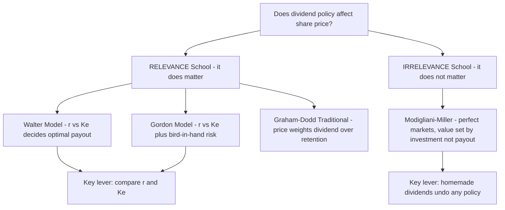
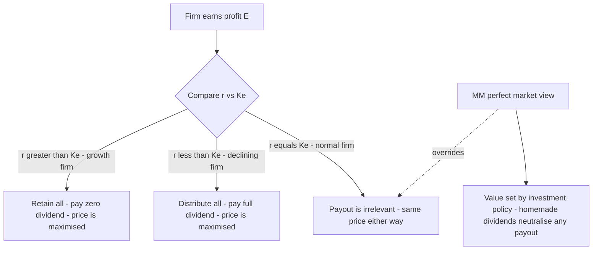
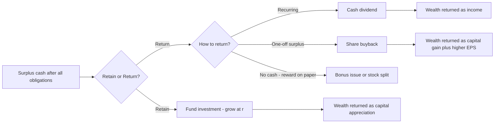
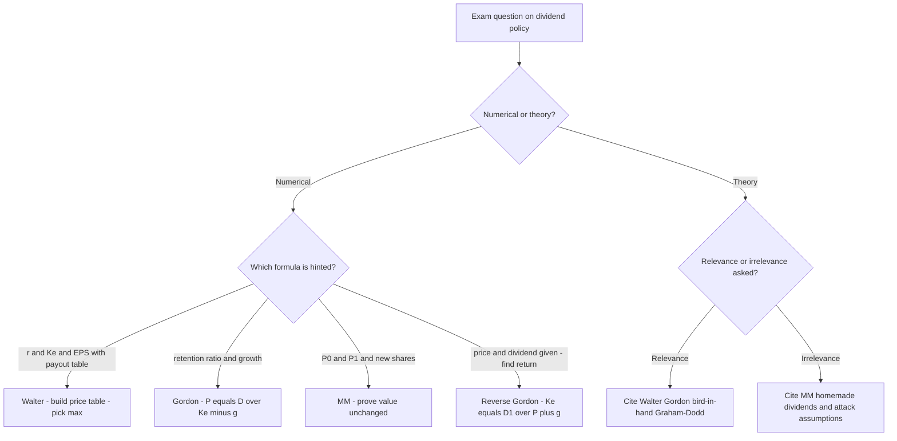

<!-- v2-deep -->

# Chapter 08 — Dividend Decisions

## 1. The Problem

A company has just closed its books. After paying every supplier, every lender, every tax officer and every preference shareholder, it is left with a pile of profit that belongs, in law and in economics, to the equity shareholders. Call it ₹10 per share of distributable earnings.

Now the board sits down and faces a deceptively simple question:

> **How much of this ₹10 do we hand back to shareholders as a cheque today, and how much do we keep inside the business to fund tomorrow?**

That single fork is the **dividend decision**. It is the third of the three great financial decisions — after the *investment decision* (Chapter on capital budgeting: which projects to accept) and the *financing decision* (Chapter on capital structure: what mix of debt and equity to raise). But it has a peculiar, almost philosophical, character that the other two do not.

Here is why it is genuinely hard. Suppose the firm pays out the entire ₹10. The shareholder is happy today — cash in hand, spendable, certain. But the firm now has no internal money to grow; to finance new projects it must go to the market and issue fresh shares or borrow. Every rupee paid out is a rupee that must be *re-raised*, and re-raising is not free — there are issue costs, dilution, and the discipline of the market.

Now suppose instead the firm pays out nothing and retains the whole ₹10. It can plough it back into projects. If those projects earn a handsome return, the retained rupee grows into more than a rupee of future value, and the share price rises to reflect it. The shareholder gets *capital appreciation* instead of cash. But — and this is the crux — the shareholder wanted, perhaps, cash today. And "future value" is uncertain; a bird in hand today may be worth two in the bush of next year's projections.

So the dividend decision is a tug-of-war between two claims on the same rupee:

| Claim | Argument for paying out | Argument for retaining |
|---|---|---|
| **The shareholder** | Wants cash today; distrusts future promises | Trusts management to grow the rupee |
| **The firm** | Signals confidence and health | Avoids costly external financing |

And the deep question underneath — the one that has occupied finance theorists for seventy years — is this:

> **Does the split between "pay out" and "retain" actually change the value of the share, or is it a matter of complete indifference?**

That is the question this chapter is built to answer. Some brilliant economists (Walter, Gordon) say dividend policy *matters* enormously — it is **relevant**. Others, equally brilliant (Modigliani and Miller), prove with airtight algebra that it is **irrelevant**. Both cannot be right in the same world; the resolution lies in *which assumptions you believe*. That is the intellectual spine of Chapter 08.

**Two vocabulary distinctions the exam quietly relies on.** First, *dividend policy* (the long-run rule the firm follows — e.g. "pay out 40% of earnings every year") is not the same as a single *dividend decision* (this year's declaration). Theories evaluate the *policy*. Second, the object being maximised is **shareholder wealth**, which equals *market price of the share plus dividends already received*, not merely the market price. A policy that raises price by ₹5 while cutting a ₹6 dividend has *reduced* wealth. Keep "wealth = price + dividend received" in the back of your mind — MM's proof leans on exactly this.

---

## 2. The Core Idea (Analogy)

Picture a fruit orchard that you own.

Every season the trees bear fruit. You face the same fork the board faces. You can:

- **Harvest and sell all the fruit today** — cash in your pocket now (this is the *dividend*), or
- **Leave some fruit to fall, rot, and re-seed the soil** — planting new saplings that will thicken the orchard and yield more fruit in future seasons (this is *retention* funding growth).

Now, the value of the orchard as an asset depends on one thing above all: **how good the soil and climate are at turning a re-seeded fruit into future fruit.** Call this the *return on the orchard*, `r`.

Compare `r` against the return you could get by taking the cash today and planting it in *someone else's* orchard down the road — the market's going rate, your *opportunity cost*, call it `Ke`.

- If **your** orchard grows a re-seeded fruit into *more* fruit than the market would (`r > Ke`), you should re-seed everything. Retention creates value. Don't harvest.
- If your orchard is tired and grows a re-seeded fruit into *less* than the market would (`r < Ke`), you should harvest every fruit and invest the cash elsewhere. Pay everything out.
- If your orchard exactly matches the market (`r = Ke`), it makes no difference whether you harvest or re-seed — you end up equally wealthy either way.

That single comparison — **`r` versus `Ke`** — is the heartbeat of the entire relevance school (Walter and Gordon). Hold onto it; every formula below is just an arithmetic dressing of this one intuition.

And the *irrelevance* school (MM) adds a twist to the analogy: it says that in a perfect market with no transaction costs, if you *want* cash but the orchard re-seeded everything, you can simply **sell a few saplings** to raise your own cash — a "homemade dividend" — and you are exactly as well off. Conversely, if the orchard paid out cash you didn't need, you re-invest it by buying more saplings. Because you can undo the manager's choice costlessly, the choice itself creates no value. The orchard's worth is set entirely by the *quality of its trees* (its investment decisions), not by the harvesting schedule.

**Extending the analogy to the real world.** The clean orchard story breaks the moment friction enters. If the government taxes *harvested fruit* (dividends) more heavily than *the sale of grown saplings* (capital gains), you now prefer re-seeding even when `r` only barely matches the market — tax tilts the scale. If selling saplings costs a broker's fee (transaction cost), the "homemade dividend" is no longer free, so a firm that pays cash to income-hungry retirees genuinely helps them. And if outsiders cannot see how good your soil is (information asymmetry), the *act of harvesting a steady crop each year* becomes a costly, credible signal that your trees are healthy. Each of these frictions is a real ICAI "factor influencing dividend policy" (§4.5) dressed in orchard clothing — which is why the real world lands between pure relevance and pure irrelevance.

---

## 3. Why It's Built This Way

Before any formula, understand *why* the theories take the shape they do. Each is an answer to "what determines the price of a share?"

The foundational truth of all valuation is that **a share is worth the present value of the cash the shareholder expects to receive from it.** The only cash a pure equity share ever delivers is (a) dividends while you hold it, and (b) the sale price when you sell — which is itself just the present value of all *future* dividends to the next holder. So, ultimately:

> **Share price = present value of the entire future stream of dividends.**

This is why dividend policy *seems* like it must matter — dividends are literally the thing being valued. The relevance theorists take this at face value: change the dividend stream, change the price.

But MM spotted the subtlety. The dividend you don't pay today doesn't vanish — it stays in the firm, grows, and comes back as a *larger* dividend (or capital gain) later. If the firm reinvests at exactly the shareholder's required return `Ke`, the present value of "less now, more later" is identical to "more now, less later." The *stream* has the same present value regardless of *timing*. So value depends on the earning power of assets, not on the calendar of payouts.

The theories therefore differ in exactly *one* place: **what they assume about the reinvestment rate `r` relative to `Ke`, and about the frictions of the real world (taxes, issue costs, information gaps).** Once you see that, the whole chapter organises itself:

*Figure 1 — The logical map of Chapter 08: two schools, the models within each, split by their assumptions about `r` versus `Ke` and market frictions.*

**A third, quieter position — the residual theory.** Sitting between the two poles is a purely *practical* stance that ICAI expects you to know: dividends are simply a **residual**. The firm first funds every project with `r > Ke` out of retained earnings (because internal equity is the cheapest finance — no issue cost, no dilution); whatever cash is *left over* is paid as dividend. Under this view the dividend is an *output*, not a *decision* — a by-product of the investment plan and the target capital structure. It explains why fast-growing firms rationally pay nothing (no residual survives the capital budget) while mature cash-cows pay heavily (the residual is large). We develop it in §4.4A.

---

## 4. Full Technical Content (Formulas With the "Why")

### 4.1 Common notation

| Symbol | Meaning |
|---|---|
| `E` | Earnings per share (EPS) |
| `D` | Dividend per share (DPS) |
| `r` | Rate of return the firm earns on retained earnings (return on investment) |
| `Ke` | Cost of equity / shareholders' capitalisation (required) rate |
| `P` | Market price per share |
| `b` | Retention ratio = fraction of earnings retained = `(E − D) / E` |
| `(1 − b)` | Payout ratio = fraction of earnings paid as dividend = `D / E` |
| `g` | Growth rate in dividends = `b × r` |

The two most important quantities are always `r` and `Ke`. Every relevance result is a comparison of these two.

**A unit-discipline note before any arithmetic.** Rates (`r`, `Ke`, `g`) can be written as percentages (15%) or decimals (0.15); ratios (`b`, payout) are pure fractions. The single most common exam slip is mixing a percentage into a decimal formula. Fix one convention at the top of your answer — decimals are safest — and convert everything before substituting. Also memorise the identity chain: `payout = D/E = 1 − b`, `b = 1 − D/E = (E − D)/E`, and `g = br`. If a question gives you *payout*, get `b` first; if it gives *g* and `r`, back out `b = g/r`.

---

### 4.2 Walter's Model (James E. Walter, 1963) — Relevance

**The idea:** Walter argues that dividend policy almost always affects value, because the firm's internal reinvestment rate `r` and the market's required rate `Ke` are rarely equal. The firm should retain if it can beat the market, and distribute if it cannot.

**The formula:**

$$P = \dfrac{D + \dfrac{r}{K_e}(E - D)}{K_e}$$

Read it slowly. There are two pieces inside the bracket:

- `D` — the dividend, valued rupee-for-rupee.
- `(r / Ke)(E − D)` — the *retained* earnings `(E − D)`, but **scaled by the ratio `r/Ke`**. This scaling is the whole insight. If the firm reinvests retained money at `r` while the market only demands `Ke`, then each retained rupee is "worth" `r/Ke` rupees to shareholders. The entire bracket is then capitalised (divided) by `Ke` to convert the perpetual earnings stream into a price.

**Where the formula comes from (first principles).** The retained portion `(E − D)` is invested to earn `r` forever, producing an extra perpetual cash flow of `r(E − D)` per year. Capitalised at `Ke`, that perpetuity is worth `r(E − D)/Ke` today. Add the current dividend `D` to get the total value the shareholder receives, then capitalise the *whole* stream once more at `Ke`. Rearranged, that is exactly `P = [D + (r/Ke)(E − D)] / Ke`. So the double appearance of `Ke` is not a typo: one `Ke` capitalises the growth perpetuity *inside* the bracket, the outer `Ke` capitalises the total earnings stream into a price.

**The decision rule that falls out:**

| Type of firm | Relationship | Optimal payout | Why |
|---|---|---|---|
| **Growth firm** | `r > Ke` | **0% payout** (retain everything) | Every retained rupee earns more than shareholders demand; price rises as payout falls |
| **Declining firm** | `r < Ke` | **100% payout** (distribute everything) | Firm destroys value on reinvestment; hand cash back so shareholders redeploy it |
| **Normal firm** | `r = Ke` | **Indifferent** | Price is the same at every payout; policy irrelevant *here* |

**The "corner solution" insight — why Walter always prescribes 0% or 100%.** Look at the formula as a straight line in `D`. Rewrite it as `P = (E·r/Ke)/Ke + D(1 − r/Ke)/Ke`. The coefficient on `D` is `(1 − r/Ke)/Ke`. If `r > Ke` this coefficient is *negative*, so `P` falls continuously as `D` rises — pushing `D` to its lowest possible value, zero. If `r < Ke` the coefficient is *positive*, so `P` rises with `D` — pushing `D` to its maximum, 100%. There is never an interior optimum. This is both Walter's cleanest prediction and his biggest unrealism: real firms do not pay either everything or nothing. Examiners love asking you to *derive* or *justify* the all-or-nothing conclusion.

**Assumptions of Walter's model (know these cold — examiners love them):**

1. **All financing is internal** — no debt or new equity is ever raised. Retained earnings are the *only* source of finance.
2. **`r` and `Ke` are constant** — the return on investment and the cost of equity never change no matter how much is retained. (Unrealistic: in reality `r` falls as you take on more marginal projects.)
3. **Constant EPS and DPS** — beginning values of `E` and `D` never change; the model is a snapshot.
4. **Infinite life** — the firm lives forever, so the earnings are a perpetuity (hence dividing by `Ke`).
5. **100% payout or 100% retention at the extremes** are permissible.

**Criticisms (the flip side of the assumptions — worth a mark each in theory answers):**

- **Constant `r` is false.** As a firm exhausts its best projects, marginal `r` falls. A realistic firm has `r > Ke` on early projects and `r < Ke` on later ones, implying an *interior* optimum payout that Walter's rigid model cannot capture.
- **No external finance is unrealistic.** Tying investment entirely to retention wrongly *entangles* the investment and dividend decisions, which finance theory says should be separable.
- **Constant `Ke` ignores risk.** A firm's risk (and therefore `Ke`) shifts with its capital structure and business mix; assuming it fixed is heroic.

---

### 4.3 Gordon's Model (Myron J. Gordon, 1962) — Relevance & "Bird-in-Hand"

**The idea:** Gordon reaches the same relevance conclusion as Walter but from a richer, more psychological angle. His famous **"bird-in-hand" argument** says investors are *risk-averse* and value a certain dividend today more than an uncertain capital gain tomorrow. Distant dividends are discounted at a higher rate because they are riskier. Therefore a firm that retains and pushes rewards into the uncertain future depresses its price. Paying dividends now reduces perceived risk and lifts price.

**The formula** (the constant-growth dividend valuation model, also called the Gordon Growth Model):

$$P = \dfrac{E(1 - b)}{K_e - br}$$

where:
- `E(1 − b)` = the current dividend `D` (earnings × payout ratio),
- `br` = `g`, the growth rate of dividends (retention ratio × return),
- so equivalently `P = D / (Ke − g)`.

The denominator `Ke − br` is the heart of it: retaining more (higher `b`) raises growth `g = br`, which shrinks the denominator and — *if `r > Ke`* — raises `P`.

**Why `g = br` (derivation).** Growth in dividends comes only from ploughed-back earnings earning `r`. Each year the firm retains fraction `b` of earnings and reinvests it at `r`, so earnings (and hence dividends, at a constant payout) grow by `b × r` per year. That single line — retained fraction times its return — *is* the growth rate. This is why a firm cannot grow faster than `b × r` internally, and why a 100%-payout firm (`b = 0`) has zero growth and reduces to `P = E/Ke`, the no-growth perpetuity.

The denominator `Ke − br` is the heart of it: retaining more (higher `b`) raises growth `g = br`, which shrinks the denominator and — *if `r > Ke`* — raises `P`.

**The decision rule (identical logic to Walter):**

| Type of firm | Relationship | Optimal payout | Effect of higher retention |
|---|---|---|---|
| **Growth firm** | `r > Ke` | 0% payout | Higher retention → higher price |
| **Declining firm** | `r < Ke` | 100% payout | Higher retention → lower price |
| **Normal firm** | `r = Ke` | Indifferent | Price unaffected by payout |

**Assumptions of Gordon's model:**

1. **All-equity firm** — no debt.
2. **No external financing** — retained earnings are the only funding source (same as Walter).
3. **Constant `r`** and **constant `Ke`**.
4. **`Ke > br`** (i.e. `Ke > g`) — *mandatory*, else the denominator turns zero or negative and price becomes infinite or meaningless. This is the model's mathematical guardrail.
5. **Constant retention ratio `b`** forever, hence constant growth `g`.
6. **Corporate tax ignored** (in the basic form).

> **Note — the two faces of Gordon.** The *basic* Gordon model above assumes `r` and `Ke` are given and derives price. When the exam gives you EPS, `r`, `Ke` and a retention ratio, you plug straight in. The bird-in-hand *narrative* (investors discount future dividends more) is the conceptual justification for relevance — quote it in theory questions.

**Gordon read backwards — the cost-of-equity link.** Rearrange `P = D/(Ke − g)` to `Ke = D/P + g = D/P + br`. This is the **dividend-growth (or "Gordon") approach to `Ke`** you met in the cost-of-capital chapter. So Gordon's dividend model and the dividend-growth estimate of `Ke` are *the same equation* read in opposite directions: give me `Ke` and I price the share; give me the price and I extract `Ke`. When a problem hands you `P`, `D` and `g` and asks for cost of equity, you are silently using Gordon. Watch for the variant that uses *next year's* dividend `D₁ = D₀(1 + g)`: then `Ke = D₁/P + g`. ICAI questions sometimes give `D₀` (dividend just paid) and expect you to grow it one period — a classic hidden step.

**Gordon versus Walter — same rule, different numbers.** Both give identical *directional* advice (retain if `r > Ke`), but they will *not* produce the same price for the same data, because Walter capitalises a level perpetuity while Gordon capitalises a *growing* one. Do not "cross-check" a Walter answer against a Gordon answer and panic when they differ — they are meant to. If a single question asks for both, present two separate valuations.

---

### 4.4 Modigliani–Miller Hypothesis (Modigliani & Miller, 1961) — Irrelevance

**The idea:** MM prove that under a *perfect capital market*, dividend policy has **no effect whatsoever** on share price or shareholder wealth. What a shareholder gains in dividend, she exactly loses in capital appreciation, and vice versa. Value is determined solely by the firm's **earning power and investment policy** — the quality of the trees, not the harvest schedule.

**The mechanism — "homemade dividends":** If a firm pays no dividend but an investor wants cash, she sells a sliver of her holding to manufacture her own dividend. If a firm pays a dividend she didn't want, she buys more shares. Because in a perfect market this can be done *costlessly and without tax*, the firm's policy is something every investor can privately undo. A choice everyone can reverse for free cannot create or destroy value. This is an **arbitrage** argument, the same weapon MM used in capital structure.

**The valuation engine.** MM value the share by the single-period arbitrage condition: the price today is the present value of the dividend received plus the price at year-end, discounted at `Ke`:

$$P_0 = \dfrac{P_1 + D_1}{1 + K_e}$$

Rearranged to find the price that *should* prevail: `P_1 = P_0(1 + K_e) − D_1`.

**Valuing the whole firm** (the part that proves irrelevance). Let `n` = existing shares, `Δn` = new shares issued during the year at price `P1`, `I` = new investment, `E` = total earnings (net income). Then the value of the firm is:

$$nP_0 = \dfrac{(n + \Delta n)P_1 - I + E}{1 + K_e}$$

The number of new shares needed is driven by the shortfall between investment and *retained* earnings:

$$\Delta n \times P_1 = I - (E - nD_1)$$

The magic: when you substitute `Δn` back into the value equation, **`D1` cancels out completely.** The firm's value `nP0` comes out the same whether the dividend is ₹0 or ₹100. That algebraic cancellation *is* the proof of irrelevance. (You'll see it happen numerically in §5.3.)

**Watch the sign logic in the new-shares equation.** `I − (E − nD₁)` reads: investment needed, *minus* the earnings left after paying total dividends `nD₁` (that leftover `E − nD₁` is retained earnings). A bigger dividend shrinks retained earnings, so a bigger dividend *forces a bigger new issue* — and the new shareholders capture exactly the value the old shareholders "took out" as dividend. That transfer, not any value creation, is why the total is unchanged. If the firm's retained earnings already exceed its investment (`E − nD₁ ≥ I`), then `Δn` is zero or negative (a buyback) and *no new shares are issued* — a common special case examiners set to check you don't blindly force a positive `Δn`.

**Assumptions of MM (the load-bearing wall — attack these to defend relevance):**

1. **Perfect capital markets** — free information, rational investors, no single investor can move prices.
2. **No taxes** (or same tax on dividends and capital gains).
3. **No flotation / issue costs** — new shares are raised costlessly.
4. **No transaction costs** — investors buy/sell without brokerage (makes homemade dividends free).
5. **Fixed investment policy** — the firm's capital budget is decided independently and is *not* affected by how much dividend it pays.
6. **Perfect certainty** (in the original form) — later relaxed, but the basic proof assumes known returns.

**How the real world breaks each assumption (and revives relevance).** This is the examiner's favourite "critically evaluate MM" question — answer it assumption-by-assumption:

- **Taxes exist and differ.** When dividends are taxed more heavily than capital gains, investors prefer retention/buyback — the *tax-preference* argument, the opposite tilt to bird-in-hand.
- **Flotation costs are real.** Re-raising a rupee paid out costs issue expenses, so paying out and re-issuing is *not* a wash — retention is cheaper.
- **Transaction costs are real.** An income-seeking investor selling shares to make a "homemade dividend" pays brokerage, so a cash dividend genuinely serves them better — the *transaction-cost* case for relevance.
- **Information is asymmetric.** Managers know more than investors, so a dividend *announcement* conveys information (signalling) that moves price — impossible in MM's transparent world.

*Figure 2 — The relevance decision tree (Walter/Gordon) with MM's irrelevance conclusion shown as the special case that swallows the whole tree when markets are perfect.*

---

### 4.4A The Residual Theory of Dividends

**The idea:** Dividends are whatever cash *remains* after the firm has funded, from retained earnings, every project worth doing. The logic is a cost-of-capital argument: retained earnings are the **cheapest source of equity** because they carry no flotation cost and no dilution. So a value-maximising firm should:

1. Determine its optimal capital budget (accept all projects with `r > Ke`, or positive NPV).
2. Fund the equity portion of that budget out of retained earnings first.
3. Pay out **only the residual** — earnings left after the capital budget is met.
4. If the budget exhausts all earnings (or exceeds them), pay *no* dividend and possibly raise external finance.

**Why it matters for the exam.** The residual theory *explains observed behaviour* that the pure models only assert: growth firms with rich project pipelines pay little or nothing (no residual survives), while mature firms with few `r > Ke` projects pay generously (large residual). It also implies dividends will be **unstable** year to year — high in lean-investment years, zero in heavy-investment years — which clashes with the real-world observation that firms *smooth* dividends. That clash sets up Linter's model (§4.4B).

**A one-line numerical feel.** If a firm earns ₹50 lakh, targets 60% equity in its capital structure, and plans a ₹60 lakh capital budget, the equity needed is 0.60 × 60 = ₹36 lakh. Funded from the ₹50 lakh earnings, the residual dividend is ₹50 − ₹36 = **₹14 lakh** (payout 28%). Raise the capital budget to ₹90 lakh and equity needed is ₹54 lakh > ₹50 lakh earnings → residual dividend **nil**, and the firm must raise fresh equity of ₹4 lakh. The dividend is a pure by-product of the investment plan and the target debt-equity mix.

---

### 4.4B Traditional (Graham–Dodd) and Linter Positions

These two named views appear in ICAI theory questions; know the formula and the one-line intuition of each.

**Graham–Dodd "traditional" position.** Benjamin Graham and David Dodd argued the market places *far more weight on dividends than on retained earnings* — a rupee of dividend supports several rupees of price, whereas a rupee retained supports much less, because investors distrust reinvestment. Their stylised valuation multiplier is:

$$P = m\left(D + \dfrac{E}{3}\right)$$

where `m` is a market multiplier. The "1 and 1/3" weighting (a full weight on `D`, only one-third on `E`) is the whole point: dividends are valued roughly **three times** as heavily as retained earnings. This is a strong *relevance* stance — even stronger than Gordon — and its takeaway is "the market prizes the dividend cheque." *(The exact multiplier form is a stylisation; verify the precise expression against current ICAI material for your attempt.)*

**Linter's model (dividend *behaviour*, not valuation).** John Linter observed how firms *actually set* dividends and found two facts: (1) firms have a **target payout ratio**, and (2) they **smooth** dividends toward that target, adjusting only *partially* each year so dividends never lurch. The adjustment rule:

$$D_1 = D_0 + \big[(\text{target payout} \times EPS) - D_0\big] \times \text{adjustment factor}$$

The *adjustment factor* (between 0 and 1) captures management's reluctance to move all the way to target in one step — because a raised dividend is a *promise* they hate to break, and a cut is read as distress. Linter's model is the theoretical backbone of the real-world **"sticky dividend"** and **signalling** behaviour: firms would rather retain a windfall than raise a dividend they might have to cut. Where the residual theory predicts *volatile* dividends, Linter documents that firms deliberately *stabilise* them — the tension between the two is a favourite discussion prompt.

---

### 4.5 Factors Influencing Dividend Policy in the Real World

Theory tells us what *should* happen in idealised worlds. In practice, boards weigh a cluster of concrete factors. Group them so they are memorable:

**A. Firm's internal position**
- **Liquidity / cash position** — profit is an accrual concept; you can be profitable yet cash-poor. Dividends need *cash*, not book profit.
- **Financing needs & growth stage** — a young, fast-growing firm hoards earnings (high `r`); a mature firm with few projects distributes.
- **Stability of earnings** — firms with steady earnings can commit to steady dividends; volatile earners cannot.

**B. Shareholder-facing considerations**
- **Shareholder expectations & clientele effect** — some investors (retirees, trusts) want income; others (young, wealthy) want growth. Firms attract a "clientele" and are reluctant to disturb it.
- **Signalling** — a dividend *increase* signals management's confidence in future earnings; a *cut* is read as distress. Boards therefore keep dividends *sticky* (rarely cut).

**C. External / legal constraints**
- **Legal provisions** — the Companies Act, 2013 (Section 123) permits dividends only out of current or accumulated profits (or moneys provided by government); rules on transfer to reserves and depreciation apply.
- **Taxation** — the relative tax on dividends versus capital gains shifts investor preference. (Post-2020 in India, dividends are taxed in shareholders' hands at their slab rate, restoring a bias toward retention/buyback for high-bracket investors.)
- **Contractual / loan restrictions** — debt covenants often cap dividends to protect lenders.
- **Access to capital markets** — a firm that can raise money cheaply and easily feels freer to pay out; a credit-constrained firm retains.
- **Inflation** — under inflation, depreciation on historical cost is inadequate to replace assets, so firms retain more to fund replacement.
- **Control** — issuing new equity to replace paid-out dividends dilutes existing owners' control; controlling families prefer to retain.

**A memory hook for the exam:** the drivers cluster into **L-E-G-A-L + C** — **L**iquidity, **E**arnings stability, **G**rowth/financing needs, **A**ccess to capital markets, **L**egal & contractual limits, plus the soft **C** trio of **C**lientele, **C**ontrol and **C**onfidence-signalling. If asked to "discuss factors," structure the answer under *internal / shareholder-facing / external* headings rather than dumping a list — it reads as understanding, not memorisation.

**Legal spine you should be able to cite — Companies Act, 2013 (verify current text for your attempt):**
- **Section 123** — dividend may be paid *only* out of (a) current year's profits after providing for depreciation, (b) accumulated past profits similarly provided for, or (c) money provided by Central/State Government for the purpose. Interim dividend may be declared out of surplus in the profit and loss account and current-year profits. A company *may* (no longer mandatorily, post-amendment) transfer a portion of profits to reserves before declaring dividend.
- **Unpaid Dividend Account / IEPF** — dividend declared but unpaid must be moved to a special *Unpaid Dividend Account* within a stipulated period; amounts unclaimed for seven years transfer to the **Investor Education and Protection Fund (IEPF)**.
- **Section 68–70** — govern **buy-back** of securities (see §4.6): sources, limits (e.g. buy-back capped as a percentage of paid-up capital and free reserves), debt-equity ceiling post-buyback, and the bar on further issue for a cooling-off period.

*(Treat the specific numeric ceilings and time limits as "verify against current ICAI study material / latest amendment" — they are periodically revised.)*

---

### 4.6 Forms of Dividend and the Buyback Link

**Forms of dividend:**

| Form | What it is | Effect |
|---|---|---|
| **Cash dividend** | Cash paid per share | Reduces cash and reserves; needs liquidity |
| **Stock dividend (bonus shares)** | Extra shares issued free from reserves | No cash leaves; capitalises reserves; share count rises, price adjusts down proportionately — *wealth unchanged* |
| **Stock split** | Face value split (e.g. ₹10 → two ₹5 shares) | Purely cosmetic; more shares at lower price; improves liquidity/marketability |
| **Scrip / bond dividend** | Dividend paid in promissory notes/securities when cash is short | Defers cash outflow |

**Bonus issue versus stock split — the fine distinction examiners test.** Both raise the share count and cut the per-share price without changing total wealth, but the *accounting* differs sharply:
- A **bonus issue** *capitalises reserves*: it moves money from free reserves into paid-up **share capital**, and the **face value per share is unchanged** (a ₹10 share stays ₹10; you just own more of them). Reserves fall; capital rises; net worth is unchanged.
- A **stock split** *changes only the face value*: a ₹10 share becomes two ₹5 shares. **No reserve is capitalised**, share capital in total is unchanged, and there is no accounting entry touching reserves. It is purely a re-denomination.
Trap: "a bonus issue increases the paid-up capital, a stock split does not." True — and a favourite one-mark distinction.

**Share buyback (repurchase) — the mirror image of a dividend.** Instead of distributing cash *pro rata* as a dividend, the firm uses cash to *buy back* its own shares from willing sellers and extinguish them. The link is direct and examinable:

- A buyback is an **alternative route to return surplus cash** to shareholders. Both a dividend and a buyback shrink the firm's cash and equity.
- After a buyback the **number of shares falls**, so **EPS rises** and remaining shareholders own a larger slice — capital appreciation instead of a cash cheque.
- **Tax angle:** historically buybacks let investors take returns as capital gains (often taxed lighter than dividends), making buyback a *tax-efficient substitute* for dividend. It also lets a firm return *one-off* surplus without committing to a higher *recurring* dividend (protecting the sticky-dividend signal). *(Indian buy-back taxation has been amended repeatedly — verify the current incidence, e.g. company-level vs shareholder-level tax, for your attempt.)*
- **Signalling & control:** buybacks signal that management thinks the share is undervalued, and can shore up promoter control by reducing floating stock.

Conceptually: **Dividend and buyback are two taps on the same tank of surplus cash.** The dividend-decision framework — pay out versus retain — expands to *how* to pay out: cash dividend or buyback.

---

## 5. Worked Examples (Numerical & Reconciling)

### 5.1 Walter's Model — three firm types, verifying the decision rule

**Given:** EPS `E` = ₹10, Cost of equity `Ke` = 12%. We test three payout ratios (0%, 50%, 100%) for three firms.

**Formula:** `P = [ D + (r/Ke)(E − D) ] / Ke`

**Firm 1 — Growth firm, `r` = 15% ( r > Ke ):**

| Payout | `D` | `(r/Ke)(E−D)` = `(0.15/0.12)(10−D)` | Numerator `D + …` | `P = ÷ 0.12` |
|---|---|---|---|---|
| 0% | 0 | 1.25 × 10 = 12.50 | 12.50 | **₹104.17** |
| 50% | 5 | 1.25 × 5 = 6.25 | 11.25 | ₹93.75 |
| 100% | 10 | 1.25 × 0 = 0 | 10.00 | ₹83.33 |

*Price is highest (₹104.17) at **0% payout**.* Confirms: growth firm should retain everything. ✓

**Firm 2 — Declining firm, `r` = 10% ( r < Ke ):**

| Payout | `D` | `(0.10/0.12)(10−D)` = `0.8333(10−D)` | Numerator | `P = ÷ 0.12` |
|---|---|---|---|---|
| 0% | 0 | 0.8333 × 10 = 8.333 | 8.333 | ₹69.44 |
| 50% | 5 | 0.8333 × 5 = 4.167 | 9.167 | ₹76.39 |
| 100% | 10 | 0.8333 × 0 = 0 | 10.00 | **₹83.33** |

*Price is highest (₹83.33) at **100% payout**.* Confirms: declining firm should distribute everything. ✓

**Firm 3 — Normal firm, `r` = 12% ( r = Ke ):**

At any payout, `(r/Ke) = 1`, so numerator = `D + (E − D) = E = 10` always, and `P = 10 / 0.12 = ₹83.33` regardless of payout. *Payout is irrelevant here.* ✓

> **Reconciliation:** all three firms confirm Walter's rule exactly, and note the "normal firm" price of ₹83.33 equals `E/Ke` — the no-growth perpetuity value, a useful sanity anchor.

---

### 5.2 Gordon's Model — retention and the growth firm

**Given:** EPS `E` = ₹10, `Ke` = 12%. Compare two retention ratios for a growth firm (`r` = 15%) and, as a contrast, a declining firm (`r` = 10%).

**Formula:** `P = E(1 − b) / (Ke − br)`

**Growth firm, `r` = 15%:**

*Retention `b` = 40% (so payout 60%, D = ₹6):*
- `g = br = 0.40 × 0.15 = 0.06`
- `P = 6 / (0.12 − 0.06) = 6 / 0.06 = ` **₹100.00**

*Retention `b` = 60% (payout 40%, D = ₹4):*
- `g = 0.60 × 0.15 = 0.09`
- `P = 4 / (0.12 − 0.09) = 4 / 0.03 = ` **₹133.33**

*Higher retention (60% vs 40%) lifted the price from ₹100 to ₹133.33.* For a growth firm, retain more. ✓

**Declining firm, `r` = 10%:**

*Retention `b` = 40% (D = ₹6):* `g = 0.04`; `P = 6 / (0.12 − 0.04) = 6 / 0.08 = ` **₹75.00**
*Retention `b` = 60% (D = ₹4):* `g = 0.06`; `P = 4 / (0.12 − 0.06) = 4 / 0.06 = ` **₹66.67**

*Higher retention *lowered* the price from ₹75 to ₹66.67.* For a declining firm, distribute more. ✓

> **Reconciliation & warning:** the results echo Walter's rule perfectly. Also watch the guardrail `Ke > br`: had we set `b = 80%` for the growth firm, `br = 0.12 = Ke`, the denominator would be zero and price would explode to infinity — economically nonsensical, which is exactly why Gordon *requires* `Ke > br`.

---

### 5.3 Modigliani–Miller — proving irrelevance numerically

**Given:** A firm has `n` = 1,00,000 equity shares, current price `P0` = ₹100, `Ke` = 10%. This year's net income `E` = ₹10,00,000 and planned new investment `I` = ₹20,00,000. We compare **Case A: pays a ₹5 dividend** versus **Case B: pays no dividend**, and check the firm's value is identical.

**Step 1 — Year-end price `P1` from `P0 = (P1 + D1)/(1 + Ke)`:**

- Case A: `100 = (P1 + 5)/1.10 → P1 = 110 − 5 = ` **₹105**
- Case B: `100 = (P1 + 0)/1.10 → P1 = ` **₹110**

**Step 2 — External funds & new shares needed** (`ΔnP1 = I − (E − nD1)`):

*Case A (dividend ₹5):*
- Total dividend paid = 1,00,000 × 5 = ₹5,00,000
- Retained earnings = 10,00,000 − 5,00,000 = ₹5,00,000
- External finance needed = 20,00,000 − 5,00,000 = ₹15,00,000
- New shares `Δn` = 15,00,000 / 105 = **14,285.71 shares**

*Case B (no dividend):*
- Retained earnings = ₹10,00,000
- External finance needed = 20,00,000 − 10,00,000 = ₹10,00,000
- New shares `Δn` = 10,00,000 / 110 = **9,090.91 shares**

**Step 3 — Value of the firm** `nP0 = [ (n + Δn)P1 − I + E ] / (1 + Ke)`:

*Case A:*
- `(n + Δn)P1 = (1,00,000 + 14,285.71) × 105 = 1,14,285.71 × 105 = ₹1,20,00,000`
- `= [1,20,00,000 − 20,00,000 + 10,00,000] / 1.10 = 1,10,00,000 / 1.10 = ` **₹1,00,00,000**

*Case B:*
- `(n + Δn)P1 = (1,00,000 + 9,090.91) × 110 = 1,09,090.91 × 110 = ₹1,20,00,000`
- `= [1,20,00,000 − 20,00,000 + 10,00,000] / 1.10 = 1,10,00,000 / 1.10 = ` **₹1,00,00,000**

**Step 4 — Reconcile against the starting value:** existing shareholders' wealth `nP0 = 1,00,000 × 100 = ₹1,00,00,000`.

> **Both cases give exactly ₹1,00,00,000 — identical to the opening value.** Whether the firm pays ₹5 or ₹0, firm value is unchanged. The dividend paid in Case A is precisely offset by the larger number of new shares issued (which dilutes the pie into more slices at a lower `P1`). **Dividend policy is irrelevant — QED.** ✓

---

### 5.4 MM with a wealth check for existing shareholders

The §5.3 proof shows *firm* value is unchanged; a sharper exam variant asks whether the **existing** shareholders are equally well off, because that is what dividend policy is really about. Using the same Case A (₹5 dividend) figures:

**Wealth of old shareholders at year-end = value of shares they still hold + dividend they received.**

- Old shareholders continue to own their `n` = 1,00,000 shares, now worth `P1` = ₹105 each → `1,00,000 × 105 = ₹1,05,00,000`.
- Plus dividend received today = ₹5,00,000.
- Total = ₹1,10,00,000. *But that ₹5,00,000 is cash-in-hand this year; the ₹1,05,00,000 is year-end value.* Bring both to today: `(1,05,00,000 + 5,00,000)/1.10 = 1,10,00,000/1.10 = ` **₹1,00,00,000**.

**Case B (no dividend):** old shareholders own 1,00,000 shares at `P1` = ₹110 → ₹1,10,00,000 at year-end, no dividend. Present value = `1,10,00,000/1.10 = ` **₹1,00,00,000**.

> **Identical again — ₹1,00,00,000 either way.** In Case A the shareholder took ₹5,00,000 as cash but her shares are worth ₹5 less each (₹105 vs ₹110); in Case B she took nothing but her shares are worth ₹5 more. The dividend merely *converts* capital gain into cash, rupee-for-rupee. This is the "what a shareholder gains in dividend she loses in capital appreciation" statement made numerical. Note the key idea: the *new* shareholders, not the old ones, absorb exactly the dividend that was paid — they inject ₹15,00,000 (Case A) vs ₹10,00,000 (Case B) for shares worth exactly that, so they are neither enriched nor robbed. ✓

---

### 5.5 Reverse Gordon — extracting the cost of equity

**Given:** A share currently trades at `P` = ₹120. The company just paid a dividend `D0` = ₹6, retains `b` = 40% and earns `r` = 20% on retentions. Find the cost of equity `Ke` implied by the market price.

**Step 1 — Growth rate:** `g = br = 0.40 × 0.20 = 0.08` (8%).

**Step 2 — Next year's dividend** (the trap — grow `D0` one period): `D1 = D0(1 + g) = 6 × 1.08 = ₹6.48`.

**Step 3 — Gordon rearranged:** `Ke = D1/P + g = 6.48/120 + 0.08 = 0.054 + 0.08 = 0.134 = ` **13.4%**.

**Reconciliation / self-check:** plug back into Gordon forward — `P = D1/(Ke − g) = 6.48/(0.134 − 0.08) = 6.48/0.054 = ₹120`. ✓ Matches the given price exactly.

> **Two exam traps embedded here.** (i) Using `D0` (₹6) instead of `D1` (₹6.48) gives `Ke = 6/120 + 0.08 = 13%` — a *wrong* answer that "looks clean," so examiners award it zero. Always ask: is the given dividend *just paid* (`D0`, grow it) or *expected next year* (`D1`, use directly)? (ii) `g` here had to be *derived* from `b × r`; a weaker student would hunt for a "growth rate" in the question and not find one.

---

### 5.6 Buyback versus dividend — EPS and price effect

**Given:** A firm has 10,00,000 shares, EPS of ₹8, and a P/E multiple of 12 (so price = 8 × 12 = ₹96). It has ₹96,00,000 surplus cash and considers either (A) a special cash dividend of ₹9.60 per share, or (B) buying back shares at the current ₹96. Post-tax personal taxes aside, compare EPS and shareholder position. *(Assume earnings after the payout are unchanged at ₹80,00,000 total; ignore interest lost on cash for simplicity — a standard exam simplification.)*

**Option A — special dividend:**
- Cash out = 10,00,000 × 9.60 = ₹96,00,000. Shares unchanged at 10,00,000.
- EPS unchanged = ₹8. Price (at P/E 12) = ₹96, *but* the share now trades ex-dividend, so it falls by the ₹9.60 paid → ₹86.40. Shareholder holds a ₹86.40 share + ₹9.60 cash = **₹96 total.**

**Option B — buyback at ₹96:**
- Shares repurchased = 96,00,000 / 96 = 1,00,000 shares. Shares remaining = 9,00,000.
- New EPS = 80,00,000 / 9,00,000 = **₹8.89** (rounded). Price at P/E 12 = 8.89 × 12 = **₹106.67**.
- A continuing shareholder's single share is now worth ₹106.67 (versus ₹96 + ₹9.60 cash = ₹96 of share + cash in Option A).

**Reconciliation:** In a frictionless world the two are equivalent — a holder of one share in Option A has ₹86.40 of share + ₹9.60 cash = ₹96; in Option B, if she sold the *same fraction* to raise ₹9.60 of cash she would end at the same ₹96 (homemade dividend, MM again). The *apparent* EPS/price boost in Option B is not free value creation — it is concentration: fewer shares split the same earnings, and shareholders who *sold* took cash instead. What buyback genuinely changes is (i) **tax treatment** (capital-gains route vs dividend), (ii) **signalling** (management thinks ₹96 is cheap), and (iii) **flexibility** (one-off, no recurring commitment). ✓

> **Trap:** students report "buyback raises EPS therefore raises shareholder wealth." The EPS *rises* mechanically, but per the MM logic total wealth is unchanged in a perfect market; the real advantages are tax, signalling and flexibility — say *that*, not "EPS went up."

---

### 5.7 A quick applied judgement — factor conflict

*Scenario:* A profitable but cash-strapped IT firm earning `r` = 22% (well above its `Ke` = 14%) has always paid a ₹4 dividend. This year a covenant on a new loan restricts dividends, and cash is tight, yet shareholders expect the usual ₹4.

*Reasoning:* On pure theory (Walter/Gordon, `r > Ke`) the firm *should* retain everything and pay ₹0 — reinvestment creates value. But three real-world factors pull the other way: (i) **signalling** — cutting a long-standing dividend to ₹0 would be read as distress and hammer the price; (ii) **clientele** — income-seeking holders would exit; (iii) yet **liquidity** and **loan covenants** make a full ₹4 impossible. The pragmatic resolution: pay a *modest, maintainable* dividend (say ₹1–2) to preserve the signal and clientele, retain the rest to exploit high `r`, and consider a **bonus issue** to satisfy shareholders without cash outflow. This illustrates why real boards never mechanically follow Walter/Gordon — frictions dominate, and Linter's "sticky dividend" instinct wins.

---

## 6. Framework Summary (Format & Model Recap)

**The three models on one page:**

| Feature | Walter | Gordon | Modigliani–Miller |
|---|---|---|---|
| **School** | Relevance | Relevance | Irrelevance |
| **Author / year** | James E. Walter, 1963 | Myron Gordon, 1962 | Modigliani & Miller, 1961 |
| **Core formula** | `P = [D + (r/Ke)(E−D)]/Ke` | `P = E(1−b)/(Ke − br)` | `P0 = (P1 + D1)/(1+Ke)` |
| **Central lever** | `r` vs `Ke` | `r` vs `Ke` + bird-in-hand risk | Homemade dividends / arbitrage |
| **Growth firm (r>Ke)** | 0% payout | 0% payout | Doesn't matter |
| **Declining (r<Ke)** | 100% payout | 100% payout | Doesn't matter |
| **Normal (r=Ke)** | Indifferent | Indifferent | Doesn't matter |
| **Key mandatory condition** | Constant r, Ke; all internal finance | `Ke > br` | Perfect market, no tax, no issue cost |
| **Weakness** | Assumes constant r (unreal) | Same; oversimplifies risk | Assumptions never hold in reality |

**The supporting positions (theory-answer fodder):**

| Position | One-line claim | Stance |
|---|---|---|
| **Residual theory** | Dividend = earnings left after funding all `r > Ke` projects | Practical / relevance-flavoured |
| **Graham–Dodd traditional** | `P = m(D + E/3)` — market prizes dividends ~3× retentions | Strong relevance |
| **Linter's model** | Firms set a target payout and *smooth* toward it partially | Behavioural (explains sticky dividends) |

**Standard solution format for a Walter/Gordon numerical (write it this way in the exam):**
1. State the formula and identify `E`, `D`, `r`, `Ke`, `b`.
2. Classify the firm: is `r >`, `<` or `= Ke`? State the expected optimal payout.
3. Compute `P` at each required payout in a neat table.
4. Conclude: identify the payout that maximises `P` and confirm it matches the `r`–`Ke` rule.

**Standard solution format for an MM numerical:**
1. Find `P1` from `P0 = (P1 + D1)/(1 + Ke)` for each dividend scenario.
2. Compute retained earnings `= E − nD1`, then external funds needed `= I − retained`, then `Δn = external ÷ P1`.
3. Plug into `nP0 = [(n + Δn)P1 − I + E]/(1 + Ke)`.
4. Show the two scenarios give the *same* value and state "dividend irrelevant."

*Figure 3 — The full "how to return cash" map: the pay-out-versus-retain fork extended into cash dividend, buyback, and bonus/split routes.*

*Figure 4 — Question-triage map: read the data given and the keywords to pick the right model before writing a line.*

---

## 7. Connections

- **To capital budgeting (investment decision):** Walter and Gordon's `r` is nothing but the *return on the projects* the firm would fund with retained earnings — the IRR of its investment opportunities. Dividend policy is therefore downstream of the project pipeline: a firm rich in `r > Ke` projects *naturally* retains. MM makes this explicit — value is set by investment policy, full stop. The **residual theory** is the sharpest expression of this dependence: the dividend is literally the leftover after the capital budget.
- **To cost of capital:** `Ke` here is the same cost of equity computed in the cost-of-capital chapter (via CAPM or the dividend-growth model). Note the beautiful circularity: Gordon's `P = D/(Ke − g)` *is* the dividend-growth model, rearranged to solve for `Ke = D/P + g`. Dividend theory and cost-of-equity estimation are the same equation read in two directions (worked live in §5.5).
- **To capital structure (financing decision):** MM authored *both* the dividend-irrelevance and the capital-structure-irrelevance propositions, using the identical arbitrage/homemade weapon. Recognising the shared logic (investors can costlessly replicate anything the firm does) unlocks both chapters at once.
- **To valuation:** the constant-growth Gordon model is the workhorse of equity valuation generally, not just dividend policy.
- **To buyback and bonus (this chapter):** the "how to return cash" question is the practical extension of "whether to return cash." Buyback also connects to **EPS/leverage** — repurchasing shares with cash or debt raises EPS and gearing.
- **To financial-statement law:** Section 123 (dividend sources) and Sections 68–70 (buy-back) tie this chapter to company law — the *legality* constraint that overrides any theory.

---

## 8. Traps & Examiner Tricks

1. **Confusing `r` and `Ke`.** `r` is what the *firm earns on reinvestment*; `Ke` is what *shareholders require*. Swapping them inverts every conclusion. Always label them explicitly.
2. **Percent vs decimal in the ratio.** In Walter, `r/Ke` must use *consistent* units. `15%/12% = 1.25`; don't accidentally compute `0.15/12`. A classic silent error.
3. **Forgetting the final division by `Ke`.** Walter's whole bracket is still divided by `Ke`. Students compute the numerator and stop.
4. **Gordon denominator going non-positive.** If `br ≥ Ke`, the model breaks. Examiners plant a high retention/high-`r` combo to see if you flag "`Ke > br` violated." State the guardrail.
5. **Reading MM's `D1` cancellation as an accident.** It is the *entire point*. If your MM answer shows different firm values in the dividend vs no-dividend cases, you've made an arithmetic slip — recheck `Δn`.
6. **New shares issued at `P1`, not `P0`.** In MM, fresh equity is raised at the *year-end* price `P1`, because issue happens after the year's value has been created. Using `P0` is a common blunder.
7. **"Bonus issue increases shareholder wealth."** *False.* A bonus/stock split leaves total wealth unchanged — more shares at a proportionately lower price. Only the *packaging* changes.
8. **Assuming higher dividend always raises price.** Only true when `r < Ke` (declining firm). For a growth firm it *lowers* price. The direction depends entirely on the `r`–`Ke` comparison.
9. **Citing bird-in-hand as MM's argument.** Bird-in-hand is *Gordon's* (relevance) point; MM explicitly *reject* it, arguing risk is set by investment policy, not payout timing. Attribute carefully.
10. **Mixing up "irrelevance under perfect markets" with "irrelevance always."** MM's conclusion is *conditional* on its assumptions. Introduce taxes or issue costs and dividends become relevant again — which is why the real world has dividend policies at all.
11. **Using `D0` where `D1` is required (or vice versa) in Gordon.** If the dividend is "just paid," grow it by `(1 + g)` before dividing; if it is "expected," use it as-is. §5.5 shows how a clean-looking wrong number is planted.
12. **Deriving `g` — it is often *not* handed to you.** `g = b × r`; and `b = 1 − payout`. A question that gives payout and `r` but "no growth rate" expects you to build `g` yourself.
13. **Bonus vs split accounting.** Bonus *capitalises reserves and raises paid-up capital* (face value unchanged); a split *only re-denominates face value* (reserves and total capital untouched). Don't blur them.
14. **Confusing residual theory with a valuation model.** Residual theory explains *how much* dividend is paid (leftover after capex); it is not a share-pricing formula. Don't try to "compute a price" from it.
15. **Treating buyback's EPS rise as wealth creation.** EPS rises because shares fall, not because value is created; state the tax/signalling/flexibility advantages instead (§5.6).
16. **Forgetting the legal ceiling.** However attractive a payout is on theory, Section 123 requires profits (after depreciation) to exist; a firm with carried-forward losses may be legally barred from paying — mention it in "advise the board" questions.

---

## 9. First-Principles Recap

Strip everything away and rebuild from the single seed:

1. **A share is worth the present value of all future cash to its holder.** Dividends and eventual sale price are that cash.
2. A rupee of profit can be **paid out now** or **retained and reinvested at rate `r`**, later returning to the shareholder as a bigger dividend or a capital gain.
3. The shareholder's yardstick is her **required return `Ke`** — what she could earn elsewhere at equal risk.
4. **If the firm reinvests at `r > Ke`, retention creates value** (grow the orchard); **if `r < Ke`, distribution creates value** (harvest and reinvest elsewhere); **if `r = Ke`, it's a wash.** This is the whole relevance school — Walter and Gordon are just two algebraic costumes on this one idea, Gordon adding the *bird-in-hand* claim that certainty of near dividends further favours payout, and Graham–Dodd going further still (market prizes the dividend cheque ~3× over retentions).
5. **But** if markets are perfect — no taxes, no transaction costs, no issue costs — a shareholder can costlessly manufacture whatever cash pattern she wants (**homemade dividends**), so the firm's choice can be undone by anyone and therefore creates no value. **Value is fixed by the earning power of assets (investment policy), not by the payout schedule.** This is MM's irrelevance.
6. **The real world sits between the two.** Because taxes, issue costs, liquidity limits, signalling, clientele effects and legal constraints are *real*, dividend policy *does* matter in practice — which is why boards keep dividends **sticky** (Linter), pay only the **residual** after funding good projects, and increasingly use **buybacks** as a flexible, tax-smart alternative.

Everything in Chapter 08 is a specialisation of these six sentences.

---

## 10. Quick-Revision Sheet

**The one comparison that rules relevance:** `r` vs `Ke`.
- `r > Ke` (growth) → retain all → 0% payout.
- `r < Ke` (declining) → distribute all → 100% payout.
- `r = Ke` (normal) → indifferent.

**Walter's model:**
$$P = \frac{D + \frac{r}{K_e}(E - D)}{K_e}$$
Assumptions: all-internal finance, constant `r` & `Ke`, constant EPS/DPS, infinite life. Always corner solution (0% or 100%). Criticism: constant `r` unreal; entangles investment and dividend decisions.

**Gordon's model (constant growth):**
$$P = \frac{E(1 - b)}{K_e - br}, \qquad g = br$$
Guardrail: **`Ke > br`**. Justification: **bird-in-hand** (certain near dividends valued higher). Higher retention raises price *iff* `r > Ke`. Reverse form: `Ke = D1/P + g` (grow `D0` to `D1` first).

**MM irrelevance:**
$$P_0 = \frac{P_1 + D_1}{1 + K_e}, \qquad nP_0 = \frac{(n+\Delta n)P_1 - I + E}{1 + K_e}, \qquad \Delta n P_1 = I - (E - nD_1)$$
Assumptions: perfect market, no tax, no issue/transaction cost, fixed investment policy. Proof: `D1` cancels → value unchanged. Mechanism: **homemade dividends**. If retained earnings ≥ investment, `Δn ≤ 0` (no fresh issue).

**Supporting positions:** *Residual theory* — dividend = earnings left after funding all `r > Ke` projects (explains why growth firms pay nil). *Graham–Dodd traditional* — `P = m(D + E/3)`, market weights dividends ~3× retentions (verify exact form). *Linter* — target payout + partial adjustment ⇒ sticky, smoothed dividends.

**Key numbers to remember from worked examples:**
- Walter growth firm (E=10, r=15%, Ke=12%): 0% payout → ₹104.17 (max); 100% → ₹83.33.
- Gordon growth firm (E=10, r=15%, Ke=12%): b=60% → ₹133.33 > b=40% → ₹100.
- MM (n=1,00,000, P0=100, Ke=10%, E=10L, I=20L): firm value = ₹1,00,00,000 whether dividend is ₹5 or ₹0; existing-shareholder wealth also ₹1,00,00,000 either way.
- Reverse Gordon (P=120, D0=6, b=40%, r=20%): g=8%, D1=6.48, Ke=13.4%.
- Buyback (10L shares, EPS 8, P/E 12, ₹96L cash): buyback 1L shares → EPS ₹8.89, price ₹106.67; equivalent wealth to a ₹9.60 dividend in a perfect market.

**Factors influencing dividend policy:** liquidity, financing needs/growth stage, earnings stability, shareholder expectations & clientele, signalling, legal provisions (Sec 123 Companies Act 2013), taxation, loan covenants, access to capital, inflation, control. Memory hook: **L-E-G-A-L + C** (Clientele, Control, Confidence-signalling).

**Legal spine (verify current text/AY):** Sec 123 — dividend only out of profits after depreciation / accumulated profits / govt moneys; interim dividend from surplus; unpaid dividend → Unpaid Dividend A/c → IEPF after 7 years. Sec 68–70 — buy-back sources, limits, debt-equity ceiling.

**Forms of dividend:** cash; stock dividend (bonus — capitalises reserves, raises paid-up capital, face value same); stock split (re-denominates face value only); scrip/bond. Bonus & split leave total wealth unchanged.

**Buyback:** alternative to cash dividend to return surplus; reduces share count → raises EPS; tax-efficient (capital-gains route, verify current tax); flexible for one-off surplus; signals undervaluation and supports control. Dividend and buyback = two taps on the same cash tank.

**Attribution one-liners:** Walter 1963 (relevance, r vs Ke). Gordon 1962 (relevance, bird-in-hand, constant growth). Modigliani–Miller 1961 (irrelevance, homemade dividends, arbitrage). Graham–Dodd (traditional, market prizes dividends). Linter (sticky dividends, partial adjustment). Residual theory (dividend as leftover after capex).
