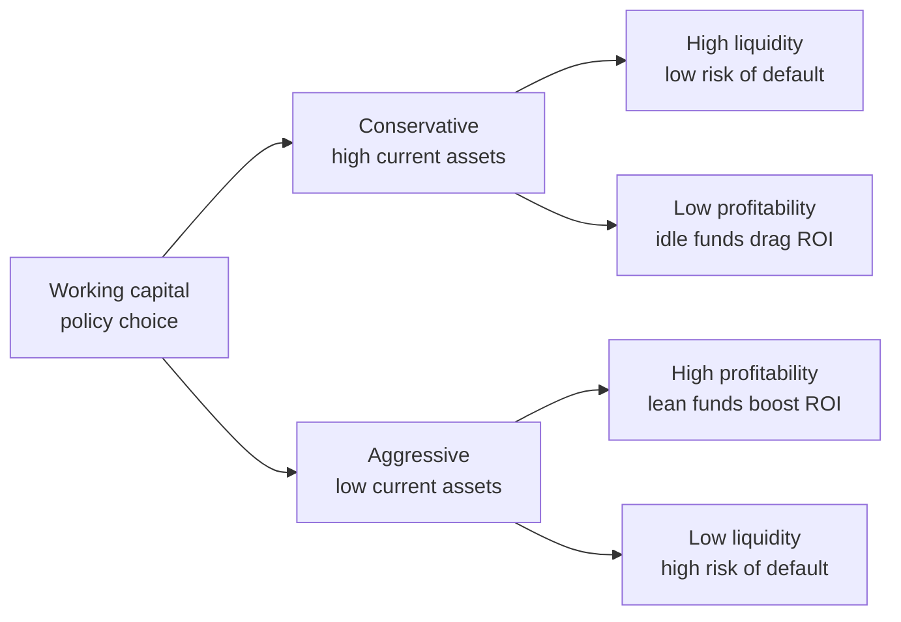
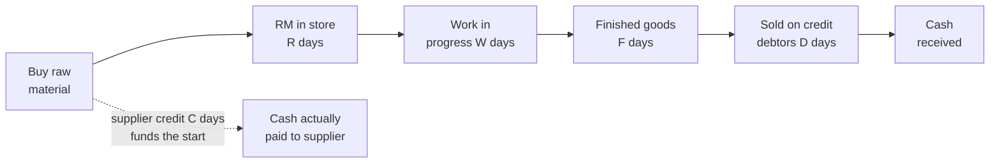
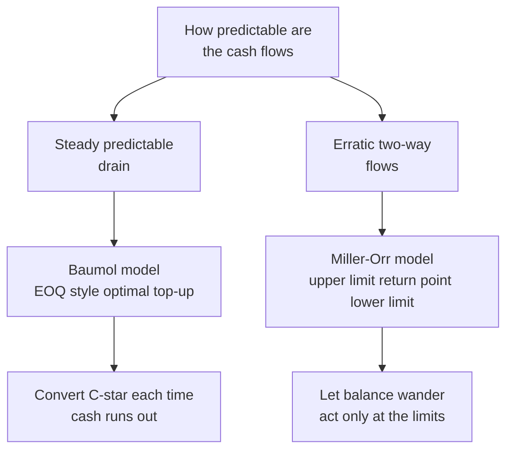
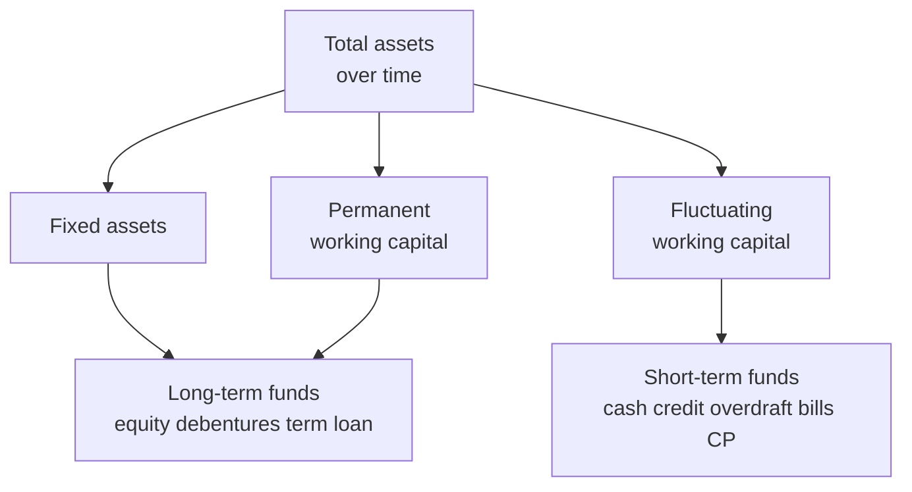

# Chapter 09 — Working Capital Management

## 1. The Problem: A Profitable Company Can Still Go Broke on a Tuesday

Imagine you run a small manufacturing firm. Your annual accounts look wonderful: sales of ₹120 crore, a net profit of ₹9 crore, a return on capital that would make any investor smile. On paper you are thriving. And yet, on the 7th of the month, your production manager tells you the steel supplier has stopped deliveries because you owe them ₹40 lakh and are three weeks late. Your workers' wages fall due tomorrow — ₹22 lakh — and the bank balance shows ₹6 lakh. Your customers owe you ₹80 lakh, but none of it is due for another twenty days.

You are profitable. You are also, right now, unable to pay. This is the single most important idea in this chapter, and it is deeply counter-intuitive to a beginner: **profit is an opinion measured over a year; cash is a fact measured every single day.** A firm does not fail because it is unprofitable. It fails because on some specific Tuesday it cannot convert its profitability into cash fast enough to meet an obligation that has arrived.

Where did all the money go? It did not vanish. It is *tied up* — locked inside the business in forms you cannot immediately spend:

- ₹28 crore sitting as **raw material, work-in-progress and finished goods** in the warehouse.
- ₹19 crore owed to you by **customers who bought on credit** (debtors / receivables).
- Some **cash** you must keep as a float to handle day-to-day surprises.

Against this, part of the funding is provided for free by your **suppliers**, who let you pay 30 days after delivery (creditors / payables). The *net* amount your own money has to fund is:

> **Net Working Capital = Current Assets − Current Liabilities**
> = (Inventory + Receivables + Cash) − (Payables + other short-term dues)

The problem this chapter solves is therefore not "how do we make profit" (that was Chapters on costing and leverage). It is: **how much money must we permanently keep frozen inside the operating cycle to keep the wheels turning, how do we shrink that frozen amount without stalling the business, and how do we fund it?** Get it wrong on the low side and you get the Tuesday above — insolvency, lost suppliers, penal interest, distress. Get it wrong on the high side and you have crores of idle rupees earning nothing, dragging your return on investment down. Working capital management is the discipline of walking this tightrope.

## 2. The Core Idea: The Business as a Water Pipeline

Picture the business as a long, transparent **pipeline**. You pour money in one end — you buy raw material. The money then *flows* slowly along the pipe, changing form as it goes: raw material becomes work-in-progress, becomes finished goods, becomes a credit sale (a debtor), and finally, when the customer pays, becomes cash again at the far end. Then you pour that cash back in the near end to buy the next batch. The business is a machine for pushing rupees around this loop, and it skims a little profit off each rupee on every lap.

Two things follow immediately from the pipeline picture.

**First, the pipeline is always full.** At any instant there is raw material in the pipe, WIP in the pipe, finished goods in the pipe, and debtors in the pipe — *simultaneously*. You cannot empty it and stay in business. That "always full" volume is your working capital. It is permanently frozen, not because of waste, but because that is simply how much is in transit at any moment.

**Second, the longer the pipe, the more money is frozen inside it.** If raw material sits for 60 days, WIP for 15, finished goods for 30, and customers take 45 days to pay, then a rupee poured in takes 150 days to come back. During those 150 days you must keep pouring in new rupees to keep production going. A long pipe (a long **operating cycle**) needs a lot of standing water (a lot of working capital). Shorten the pipe and you free up cash without selling a single extra unit.

The one relief valve: your suppliers fund the *first stretch* of the pipe for you. If they give 30 days' credit, then for the first 30 days of that 150-day journey you are spending *their* money, not yours. Your own money only has to fund the remaining 120 days. That is the **cash conversion cycle** — the length of pipe *you* personally must keep filled.

This analogy carries the entire chapter. Every technique that follows is one of only two moves: **shorten the pipe** (manage inventory, receivables, payables) or **decide how much standing water is prudent and how to fund it** (estimation and financing). Keep the pipeline in your head and nothing below is memorisation — it is just plumbing.

## 3. Why It's Built This Way: The Liquidity–Profitability Trade-Off

Why can't we just hold enormous working capital to be safe, or almost none to be lean? Because the two goals a treasurer is judged on pull in opposite directions, and *every* working capital decision is a re-balancing of the same tension.

**Liquidity** is the ability to pay your bills the moment they fall due. More current assets — bigger cash float, generous customer credit, deep inventory — means you almost never get caught short. Safety.

**Profitability** rewards you for *not* keeping money idle. Every rupee locked in inventory or debtors is a rupee that cost you something to raise (interest, or the return shareholders demand) and is now earning nothing productive. The more you freeze, the lower your **Return on Investment**, because ROI = Profit ÷ Investment, and working capital is part of the denominator. Fatten working capital and ROI thins.

So the firm faces a genuine dilemma, and it must consciously choose a posture:



*Figure 1 — Every working capital stance trades safety against return; there is no free lunch.*

- A **conservative** (relaxed) policy holds large current assets and relies on long-term funds. Sleeps well at night, earns less.
- An **aggressive** (restrictive) policy holds minimal current assets and leans on short-term credit. Earns more, occasionally has a bad Tuesday.
- A **moderate** policy sits between, matching the maturity of funds to the life of the assets they finance (the *matching* or *hedging* principle, developed in Part 4's financing section).

This is *why* the subject exists as a management discipline rather than a formula you apply once. There is no universally "correct" amount of working capital — only an amount appropriate to a firm's risk appetite, its industry, and the reliability of its cash inflows. A pharma distributor with steady demand can run leaner than a project engineering firm with lumpy, uncertain receipts. The techniques in Part 4 do not *tell you the answer*; they let you *see the trade-off clearly* so you can choose it deliberately instead of stumbling into it.

Two supporting distinctions the examiner expects you to know, both flowing from the pipeline:

- **Gross vs Net working capital.** *Gross* = total current assets (the treasurer's view: what must I manage?). *Net* = current assets − current liabilities (the financier's view: how much long-term funding does the short-term cycle demand?).
- **Permanent vs Fluctuating working capital.** The pipe is *always* at least, say, ₹15 crore full — the minimum standing water needed even in the slackest season. That irreducible core is **permanent (fixed) working capital** and behaves like a long-term asset. On top of it, festival or seasonal spikes add **temporary (fluctuating) working capital** that comes and goes. This split, illustrated below, is the entire logic of the financing section — you fund the permanent core with long-term money and the temporary spikes with short-term money.

## 4. Full Technical Content: The Machinery, Each Part With Its Reason

### 4.1 The Operating Cycle — measuring the length of the pipe

The **operating cycle** is the time between paying out cash for inputs and finally receiving cash from customers. Because it *is* the length of the pipe, it is the master driver of how much working capital a firm needs. We build it stage by stage, each stage being "how long does a rupee sit in this form?"

For a manufacturing firm the gross operating cycle has four legs:

| Stage | What it measures | Formula (in days) |
|---|---|---|
| Raw Material holding period (R) | How long RM sits before entering production | Average RM stock ÷ (Annual RM consumption ÷ 365) |
| WIP holding period (W) | How long goods stay part-finished | Average WIP stock ÷ (Annual cost of production ÷ 365) |
| Finished Goods holding period (F) | How long finished stock waits to be sold | Average FG stock ÷ (Annual cost of goods sold ÷ 365) |
| Debtors / Receivables collection period (D) | How long customers take to pay | Average debtors ÷ (Annual credit sales ÷ 365) |

> **Gross Operating Cycle (GOC) = R + W + F + D**

The relief valve — supplier credit — is subtracted:

| Stage | What it measures | Formula (in days) |
|---|---|---|
| Creditors / Payables period (C) | How long we delay paying suppliers | Average creditors ÷ (Annual credit purchases ÷ 365) |

> **Net Operating Cycle (Cash Conversion Cycle) = R + W + F + D − C**

Notice the *denominators are not all "sales".* This is the commonest exam slip. Each stock is valued at the cost basis at which it actually exists in the pipe: raw material at RM *consumption*, WIP at *cost of production*, finished goods at *cost of goods sold*, debtors at *sales* (because debtors are booked at selling price, which includes profit). Match the numerator's valuation to the denominator's flow, always.



*Figure 2 — Cash goes out when we pay the supplier and comes back when the debtor pays; the gap we must self-fund is R plus W plus F plus D minus C.*

**Why the cycle drives the WC need.** Working capital is roughly the daily cash operating cost multiplied by the number of days that cash is frozen. Halve the cycle and, for the same sales, you roughly halve the frozen amount. This is why "reduce inventory days" and "collect faster" are not accounting pieties — each day shaved off the cycle is real cash handed back to you.

### 4.2 Estimating the Working Capital Requirement

You cannot manage what you cannot size. Before financing anything, you must forecast *how much* working capital next year's plan demands. Two methods dominate the exam.

**(a) Operating-cycle / current-assets-and-liabilities method (the workhorse).** You estimate the rupee value tied up in each current asset and deduct each current liability. The logic for each line is "annual flow × holding days ÷ 365", i.e. the daily flow multiplied by how many days it stands in the pipe.

| Component | How to estimate the rupee amount |
|---|---|
| Raw materials | Annual RM consumption × RM holding period ÷ 365 |
| Work-in-progress | See WIP costing note below |
| Finished goods | Annual cost of goods sold × FG holding period ÷ 365 |
| Debtors | Annual cost of sales (or sales) × debtors period ÷ 365 |
| Cash / bank | Minimum float judged necessary |
| *Less:* Creditors | Annual credit purchases × creditors period ÷ 365 |
| *Less:* Outstanding wages | Annual wages × lag in payment ÷ 365 |
| *Less:* Outstanding overheads | Annual overheads × lag in payment ÷ 365 |

**The WIP subtlety.** Goods sitting half-made carry their *full* raw material (added at the very start of production) but only a *part* of their labour and overhead, because those costs accrue gradually as work proceeds. Convention: raw material is included at 100%, while labour and overheads are included at their **degree of completion** (often 50%, meaning "on average, jobs in the shop are half-done"). Forgetting to halve conversion cost — or wrongly halving the raw material too — is a classic trap.

**Debtors at cost vs at sales.** Debtors on the balance sheet include profit, but the *cash you have frozen* in them is only the *cost* you incurred. For a pure funding estimate, value debtors at **cost of sales**; if the question says "compute debtors" or is silent and gives a sales figure, value at **selling price**. Read the instruction — the examiner deliberately tests both.

**Safety margin.** Estimates can be wrong, so firms add a buffer — e.g. "add 10% for contingencies" — applied to net working capital. Apply it only if the question asks.

**(b) Percentage-of-sales method (quick and dirty).** If history shows working capital has run at, say, 25% of sales, then next year's working capital ≈ 25% × forecast sales. Fast, useful for first-cut budgeting, but blind to changes in efficiency or cycle length. The exam uses it for speed; the operating-cycle method for rigour.

### 4.3 Managing the Components — the levers that shorten the pipe

Estimation tells you the size; *management* shrinks it. Each current asset and liability has its own toolkit.

**Inventory management.** Inventory is the longest, most controllable stretch of pipe. Hold too little and production halts or sales are lost (stock-out cost); hold too much and you pay carrying cost (storage, insurance, obsolescence, and the interest on the money frozen). The reconciling technique is the **Economic Order Quantity**, which finds the order size that minimises *total* cost — ordering cost falls as you order in bigger batches, carrying cost rises. They cross at the optimum:

> **EOQ = √(2 × A × O ÷ C)**
> where A = annual usage (units), O = ordering cost per order, C = carrying cost per unit per year.

Supporting inventory tools the examiner may name:
- **ABC analysis** — concentrate control on the vital few high-value items (A) and loosen it on the trivial many (C).
- **Re-order level = maximum usage × maximum lead time**; **safety stock** cushions demand/lead-time surprises.
- **JIT (Just-in-Time)** — drive inventory toward zero by synchronising delivery with use; slashes the pipe but demands utterly reliable suppliers.

**Receivables management (credit policy).** Extending credit is a marketing weapon — it wins sales — but each rupee of debtors is frozen cash that also risks becoming a bad debt. Credit policy is the deliberate setting of *how much* credit to grant. Its levers are the **credit period**, **cash discount** (e.g. "2/10 net 30" — 2% off if paid within 10 days, else full amount by 30), **credit standards** (whom to sell to on credit), and **collection effort**.

The decision rule is marginal and clean: **a liberalisation of credit is worth it only if the extra contribution from extra sales exceeds the extra cost of the extra investment in debtors plus extra bad debts and discounts.** We will run this numerically in Part 5.

**Payables management.** Trade creditors are *free, spontaneous* finance — interest-free funding of the pipe's opening stretch. Stretching payables lengthens C and shrinks your cash conversion cycle. But it is not costless: forgoing a cash discount to delay payment can carry a punishing implied interest rate, and chronic lateness wrecks supplier goodwill and your credit rating. The examiner loves the **cost of forgoing a cash discount**:

> **Cost of forgoing discount ≈ [ d ÷ (100 − d) ] × [ 365 ÷ (credit period − discount period) ]**

where d is the discount %. If this annualised rate exceeds your cost of short-term borrowing, *take the discount*; if not, *delay and keep the free credit*.

**Cash management.** Cash itself earns nothing (or little), yet you must hold some to meet payments — the same liquidity-profitability tension in miniature. Hold too much and you sacrifice interest income; too little and you face costly emergency borrowing or fire-sale of securities. Two models give the optimal cash balance.

*Baumol Model (deterministic — cash used at a steady, predictable rate).* It treats cash exactly like EOQ inventory: each time you top up the cash box from marketable securities you incur a fixed **transaction cost** (b); every rupee you keep in cash rather than securities costs the **interest forgone** (i). The optimal amount to convert each time:

> **Optimal cash (C\*) = √(2 × b × T ÷ i)**
> where T = total cash needed over the period, b = cost per transaction, i = interest rate per period.

*Miller-Orr Model (stochastic — cash flows bounce around unpredictably).* Real cash balances don't drain steadily; they wander up and down. Miller-Orr sets a **lower limit (L)** (a safety floor set by management) and computes an **upper limit** and a **return point**. Let the balance drift freely between limits; when it hits the upper limit, invest the excess down to the return point; when it hits the lower limit, sell securities to top up to the return point.

> **Spread Z = 3 × ∛( 3 × b × σ² ÷ 4i )** &nbsp;&nbsp; (σ² = variance of daily cash flows)
> **Return Point = Lower limit + (Spread ÷ 3)**
> **Upper limit = Lower limit + Spread**

Baumol suits predictable outflows (a firm paying steady salaries); Miller-Orr suits volatile, two-way flows (a firm with erratic receipts). Both answer the same question — *how much cash is the right amount of idle cash* — which is the liquidity-profitability trade-off wearing a formula.



*Figure 3 — Choosing a cash model is a question about the shape of your cash flows, not a preference.*

### 4.4 Financing the Working Capital — where the standing water comes from

Having sized the frozen amount, you must fund it. The organising idea is the **matching (hedging) principle**: fund an asset with a source whose maturity matches the asset's life. Permanent working capital (the always-full core) behaves like a fixed asset and should be funded with **long-term** sources (equity, debentures, term loans, retained profit). Temporary/fluctuating working capital (seasonal spikes) should be funded with **short-term** sources (cash credit, overdraft, bill discounting, commercial paper, trade credit) that can be repaid when the spike recedes.



*Figure 4 — The matching principle funds the always-full core long and the seasonal spikes short.*

Three financing postures fall straight out of this:
- **Matching (moderate):** long funds the permanent part, short funds the temporary part. Balanced.
- **Conservative:** long-term funds cover *even part of* the fluctuating need — safe, expensive (idle long funds in slack season), lower ROI.
- **Aggressive:** short-term funds finance *even part of* the permanent core — cheap, risky (refinancing and interest-rate exposure), higher ROI.

Short-term sources the examiner expects you to name and rank by cost: **trade credit** (spontaneous, "free" unless discount forgone), **bank finance** — cash credit and overdraft (against security, interest only on the amount drawn), **bill/invoice discounting** and **factoring** (sell receivables for early cash, shrinking D), **commercial paper** (unsecured short-term notes, only for high-rated firms), and **public deposits**. Bank finance in India was historically sized by norms such as the **Tandon** and **Maximum Permissible Bank Finance** committee recommendations — worth knowing by name.

## 5. Worked Examples

### Example 1 — Operating cycle and cash conversion cycle (full computation)

**Data (Sundaram Castings Ltd, year ended 31 March):**

| Item | ₹ |
|---|---|
| Annual raw material consumption | 73,00,000 |
| Annual cost of production | 1,09,50,000 |
| Annual cost of goods sold | 1,20,45,000 |
| Annual credit sales | 1,46,00,000 |
| Annual credit purchases | 80,30,000 |
| Average raw material stock | 12,00,000 |
| Average WIP stock | 6,00,000 |
| Average finished goods stock | 9,90,000 |
| Average debtors | 24,00,000 |
| Average creditors | 11,00,000 |

*(Use 365 days.)*

**Step 1 — Raw material holding period.**
Daily RM consumption = 73,00,000 ÷ 365 = ₹20,000/day.
R = 12,00,000 ÷ 20,000 = **60 days**.

**Step 2 — WIP holding period.**
Daily cost of production = 1,09,50,000 ÷ 365 = ₹30,000/day.
W = 6,00,000 ÷ 30,000 = **20 days**.

**Step 3 — Finished goods holding period.**
Daily COGS = 1,20,45,000 ÷ 365 = ₹33,000/day.
F = 9,90,000 ÷ 33,000 = **30 days**.

**Step 4 — Debtors collection period.**
Daily credit sales = 1,46,00,000 ÷ 365 = ₹40,000/day.
D = 24,00,000 ÷ 40,000 = **60 days**.

**Step 5 — Creditors period.**
Daily credit purchases = 80,30,000 ÷ 365 = ₹22,000/day.
C = 11,00,000 ÷ 22,000 = **50 days**.

**Result.**
Gross Operating Cycle = R + W + F + D = 60 + 20 + 30 + 60 = **170 days**.
Cash Conversion Cycle = GOC − C = 170 − 50 = **120 days**.

**Self-check / interpretation.** A rupee spends 170 days in the pipe, but suppliers fund the first 50, so the firm self-funds 120 days. Reconciliation via number of cycles per year: 365 ÷ 120 ≈ 3.04 turns. Daily cash operating cost is roughly the daily production cost, ₹30,000; over 120 self-funded days that is about ₹36 lakh of core working capital — consistent with the balance-sheet figures (RM 12 + WIP 6 + FG ~10 + Debtors 24 − Creditors 11 ≈ ₹41 lakh, the small difference being the profit margin embedded in debtors). The numbers hang together.

### Example 2 — Estimating working capital requirement (full statement with WIP nuance)

**Data (Ganga Products Ltd):** Budgeted output 60,000 units/year, produced evenly. Per-unit costs: Raw material ₹80; Direct labour ₹30; Overheads ₹30. Selling price ₹160.
Holding norms: RM in store 1 month; WIP 0.5 month (RM 100% complete, labour & overheads 50% complete); Finished goods 1 month; Debtors 2 months (value at total cost). Suppliers give 1 month credit on raw material; wages lag 0.5 month. Assume 12 months of 30 days. Add 10% contingency on net working capital. Cash float ₹1,50,000.

**Annual figures.**
RM = 60,000 × 80 = ₹48,00,000. Labour = 60,000 × 30 = ₹18,00,000. Overheads = 60,000 × 30 = ₹18,00,000.
Total cost = ₹84,00,000. Sales = 60,000 × 160 = ₹96,00,000.

**Current assets.**

| Component | Working | ₹ |
|---|---|---|
| Raw material stock (1 month) | 48,00,000 × 1/12 | 4,00,000 |
| WIP: RM (0.5 mth, 100%) | 48,00,000 × 0.5/12 × 100% | 2,00,000 |
| WIP: Labour (0.5 mth, 50%) | 18,00,000 × 0.5/12 × 50% | 37,500 |
| WIP: Overheads (0.5 mth, 50%) | 18,00,000 × 0.5/12 × 50% | 37,500 |
| Finished goods (1 month at total cost) | 84,00,000 × 1/12 | 7,00,000 |
| Debtors (2 months at total cost) | 84,00,000 × 2/12 | 14,00,000 |
| Cash float | given | 1,50,000 |
| **Total current assets** | | **29,25,000** |

**Current liabilities.**

| Component | Working | ₹ |
|---|---|---|
| Creditors for RM (1 month) | 48,00,000 × 1/12 | 4,00,000 |
| Outstanding wages (0.5 month) | 18,00,000 × 0.5/12 | 75,000 |
| **Total current liabilities** | | **4,75,000** |

**Net working capital before contingency** = 29,25,000 − 4,75,000 = **₹24,50,000**.
Add 10% contingency = 2,45,000.
**Working capital required = ₹26,95,000.**

**Self-check.** WIP conversion cost was correctly taken at 50% (₹37,500 each for labour and overhead) while WIP raw material stayed at 100% (₹2,00,000) — the signature test of this problem. Finished goods and debtors are at *total cost* (₹84 lakh base), not at sales, because the question said "at cost." Had debtors been valued at selling price, they would be 96,00,000 × 2/12 = ₹16,00,000, raising net WC by ₹2,00,000 — showing exactly why you must read the valuation instruction.

### Example 3 — Credit policy decision (receivables management, marginal analysis)

**Data (Meghna Ltd):** Current annual credit sales ₹100,00,000 at a variable cost of 70% of sales; present credit period 30 days, no bad debts. The firm considers relaxing to 60 days, which would raise sales by 20% to ₹120,00,000. Bad debts would rise to 1% of the *new* sales. Required pre-tax return on investment in debtors = 20%. Assume debtors carried at total cost; 360-day year. Should Meghna relax credit?

**Step 1 — Extra contribution from extra sales.**
Contribution margin = 1 − 0.70 = 30%.
Extra sales = ₹20,00,000. Extra contribution = 20,00,000 × 30% = **₹6,00,000**.

**Step 2 — Extra investment in debtors (at cost).**
Total cost at new level = 120,00,000 × 70% = ₹84,00,000. New debtors (cost) = 84,00,000 × 60/360 = ₹14,00,000.
Old cost = 100,00,000 × 70% = ₹70,00,000. Old debtors (cost) = 70,00,000 × 30/360 = ₹5,83,333.
Extra investment = 14,00,000 − 5,83,333 = ₹8,16,667.
Cost of this extra investment at 20% = 8,16,667 × 20% = **₹1,63,333**.

**Step 3 — Extra bad debts.**
New bad debts = 1% × 120,00,000 = ₹1,20,000. Old = nil. Extra = **₹1,20,000**.

**Step 4 — Net effect.**

| Item | ₹ |
|---|---|
| Extra contribution (benefit) | 6,00,000 |
| Less: cost of extra debtors investment | (1,63,333) |
| Less: extra bad debts | (1,20,000) |
| **Net gain from relaxing credit** | **3,16,667** |

**Decision:** Relax the credit period to 60 days — it adds ₹3,16,667 of net benefit.

**Self-check.** The benefit (₹6,00,000 of fresh contribution) comfortably outweighs the two costs of carrying more, riskier debtors (₹2,83,333 total). Note debtors were valued at *cost* because the frozen cash is the cost, not the marked-up price — consistent with Example 2's logic. Had we (incorrectly) valued debtors at sales, the investment cost would rise but the conclusion here would still hold; the method, not the luck of the numbers, is what earns marks.

### Example 4 — Cost of forgoing a cash discount (payables decision)

**Data:** A supplier offers terms **2/15 net 45**. The firm can borrow short-term at 18% p.a. Should it take the discount or delay payment to day 45?

**Cost of forgoing the 2% discount** = [ d ÷ (100 − d) ] × [ 365 ÷ (45 − 15) ]
= [ 2 ÷ 98 ] × [ 365 ÷ 30 ] = 0.020408 × 12.1667 = **24.8% p.a.**

**Decision:** Forgoing the discount costs an effective 24.8% per year, far above the 18% cost of borrowing. **Take the discount** — pay on day 15, borrowing from the bank if needed, because bank money at 18% is cheaper than the 24.8% implicitly charged by the supplier for the extra 30 days of credit.

**Self-check.** The rule "take the discount when its annualised cost exceeds your borrowing rate" is satisfied (24.8% > 18%). If the borrowing rate had been, say, 30%, the answer would flip: keep the free 30 days and forgo the small discount.

### Example 5 — Baumol optimal cash balance (brief)

**Data:** Annual cash disbursement T = ₹36,00,000, spread evenly. Cost per conversion of securities to cash b = ₹150. Interest on securities i = 12% p.a.

**C\*** = √(2 × b × T ÷ i) = √(2 × 150 × 36,00,000 ÷ 0.12) = √(1,08,00,00,000 ÷ 0.12) = √(9,00,00,00,000) ≈ **₹94,868**.

**Interpretation.** The firm should convert about ₹94,868 of securities into cash each time it runs dry, making roughly 36,00,000 ÷ 94,868 ≈ 38 conversions a year. Average cash held ≈ C\*/2 ≈ ₹47,434 — the balance at which transaction cost and interest forgone are minimised, the cash-box twin of EOQ.

## 6. Format & Framework Summary

**Standard presentation of a working-capital-requirement statement** (memorise the skeleton — the examiner awards marks for layout and correct sub-headings):

```
A. Current Assets
   Raw materials                      xxx
   Work-in-progress                   xxx   (RM 100%, conversion at % complete)
   Finished goods                     xxx   (at cost of production/COGS)
   Debtors                            xxx   (at cost OR sales — per instruction)
   Cash & bank balance                xxx
                                     -----
   Total Current Assets (A)           XXX

B. Current Liabilities
   Creditors for materials            xxx
   Outstanding wages                  xxx
   Outstanding overheads              xxx
                                     -----
   Total Current Liabilities (B)      XXX

C. Net Working Capital (A - B)        XXX
D. Add: contingency margin (if any)   xxx
E. Working Capital Required           XXX
```

**Formula ready-reckoner.**

| Purpose | Formula |
|---|---|
| Net working capital | Current assets − current liabilities |
| Gross operating cycle | R + W + F + D |
| Cash conversion cycle | R + W + F + D − C |
| Any holding period (days) | Average balance ÷ (annual flow ÷ 365) |
| EOQ (inventory) | √(2AO ÷ C) |
| Cost of forgoing discount | [d ÷ (100−d)] × [365 ÷ (credit − discount period)] |
| Baumol optimal cash | √(2bT ÷ i) |
| Miller-Orr spread | 3 × ∛(3bσ² ÷ 4i) |
| Miller-Orr return point | Lower limit + spread ÷ 3 |

## 7. Connections

- **To leverage & cost of capital (earlier chapters):** the "required return on investment in debtors" in credit-policy problems *is* the firm's cost of capital. Working capital sits in the denominator of ROI, so shrinking the cycle directly lifts the returns those chapters measure.
- **To ratio analysis:** current ratio, quick ratio, inventory turnover, debtor days and creditor days are simply the operating cycle read backwards off the balance sheet. A rising cycle shows up as deteriorating turnover ratios before it shows up as a cash crisis.
- **To costing (EOQ, marginal costing):** EOQ reappears identically in both inventory and Baumol cash management — same square-root trade-off, different labels. The contribution-margin logic of credit policy is pure marginal costing.
- **To capital budgeting:** a new project's *incremental working capital* is a genuine cash outflow at start (and a recovery at end) in the project's NPV. Analysts who ignore it overstate project returns.
- **To strategic management (FM-SM paper):** aggressive vs conservative working-capital posture mirrors the firm's competitive strategy — a cost-leader runs lean; a differentiator carrying wide product range and generous credit runs richer working capital by design.

## 8. Traps & Examiner Tricks

1. **Wrong denominator per stage.** RM period uses RM *consumption*, WIP uses *cost of production*, FG uses *COGS*, debtors use *sales*. Using "sales" for everything is the number-one lost-marks error.
2. **WIP conversion cost not scaled to completion.** Raw material in WIP is 100%; labour and overheads only at the stated degree of completion. Also the reverse trap — do *not* halve the raw material.
3. **Debtors at cost vs at sales.** Read the instruction. "At cost" → use cost of sales; silent with a sales figure → often selling price. State your assumption.
4. **Credit vs total figures.** Debtor and creditor periods use *credit* sales/purchases, not total. If only total is given and cash sales exist, adjust.
5. **365 vs 360 vs 12 months of 30 days.** Use whichever the question specifies; state it. Mixing bases mid-solution corrupts every ratio.
6. **Forgetting the contingency margin — or adding it when not asked.** Apply only on instruction, and to net working capital.
7. **Cost of forgoing discount misread.** The rule is: take the discount when its annualised cost *exceeds* the borrowing rate. Students routinely invert this.
8. **Baumol vs Miller-Orr choice.** Steady/predictable flows → Baumol; volatile two-way flows → Miller-Orr. Naming the wrong model loses the conceptual marks even if arithmetic is right.
9. **Confusing gross and net working capital, permanent and fluctuating.** The financing question turns on the permanent/fluctuating split; the management question on gross current assets. Keep the pairs straight.
10. **Treating trade credit as truly free.** It is free *only until a discount is forgone*; then it may carry 20–40% implied interest. Never call payables "costless" without that caveat.

## 9. First-Principles Recap

Strip everything away and one sentence remains: **a business must keep money frozen inside its operating pipeline, and management is the art of keeping the pipeline just long enough to run smoothly and no longer.** From that single idea, everything in this chapter regenerates without memorisation:

- *Why manage it at all?* Because frozen money is safe but idle (liquidity vs profitability). — Part 3.
- *How much is frozen?* However long the pipe is: R + W + F + D − C days of daily operating cost. — the operating cycle, Part 4.1.
- *How much money exactly?* Daily flow × holding days, summed across assets, less spontaneous liabilities. — estimation, Part 4.2.
- *How do we shrink it?* Order inventory optimally (EOQ), collect faster (credit policy), pay slower prudently (payables), hold the right cash (Baumol/Miller-Orr). — Part 4.3.
- *How do we fund the residue?* Match maturities — long funds for the permanent core, short funds for seasonal spikes. — Part 4.4.

If you can draw Figure 2 from memory and explain why each denominator differs, you understand working capital management. The formulas are just that drawing written in algebra.

## 10. Quick-Revision Sheet

**One-line idea:** Working capital = money frozen in the operating pipeline; manage the length of the pipe and how you fund the standing water.

**The cycle**
- Gross Operating Cycle = R + W + F + D
- Cash Conversion Cycle = R + W + F + D − C
- Each period = Average balance ÷ (annual flow ÷ days); match numerator valuation to denominator flow.
- Denominators: RM→consumption, WIP→cost of production, FG→COGS, Debtors→sales, Creditors→purchases.

**Estimation**
- Current assets: RM, WIP (RM 100% + conversion at % complete), FG at cost, Debtors at cost/sales per instruction, Cash float.
- Less spontaneous liabilities: creditors, outstanding wages/overheads.
- Net WC = CA − CL; add contingency only if asked.
- Quick method: WC ≈ % of sales.

**Component levers**
- Inventory: EOQ = √(2AO/C); ABC; reorder level = max usage × max lead time; JIT.
- Receivables: relax credit only if extra contribution > extra debtor-carrying cost + extra bad debts + discounts.
- Payables: cost of forgoing discount = [d/(100−d)] × [365/(credit − discount period)]; take discount if this > borrowing rate.
- Cash: Baumol √(2bT/i) for steady flows; Miller-Orr (spread, return point, limits) for volatile flows.

**Financing**
- Matching principle: permanent WC ← long-term funds; fluctuating WC ← short-term funds.
- Postures: conservative (safe, low ROI) / moderate (matching) / aggressive (risky, high ROI).
- Short-term sources: trade credit, cash credit/overdraft, bill discounting, factoring, commercial paper, public deposits. (Tandon / MPBF norms.)

**Golden rule:** Profit is annual and optional; solvency is daily and non-negotiable. Manage the cash conversion cycle and you manage both.
