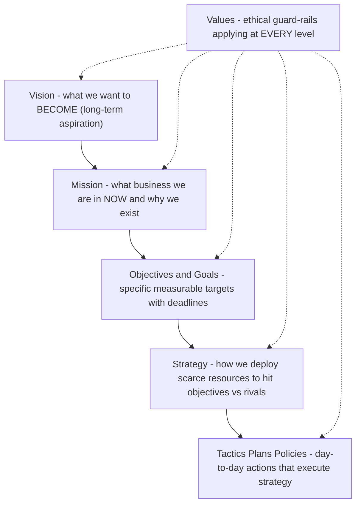
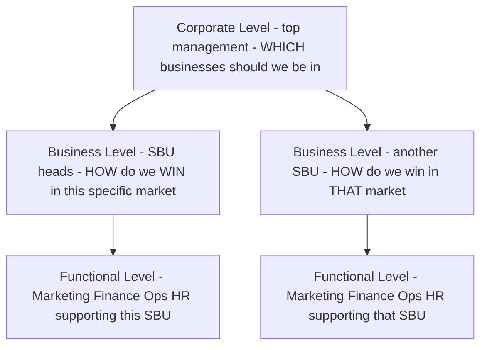
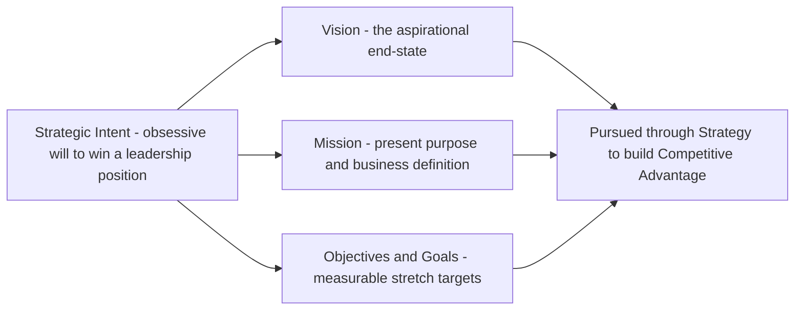
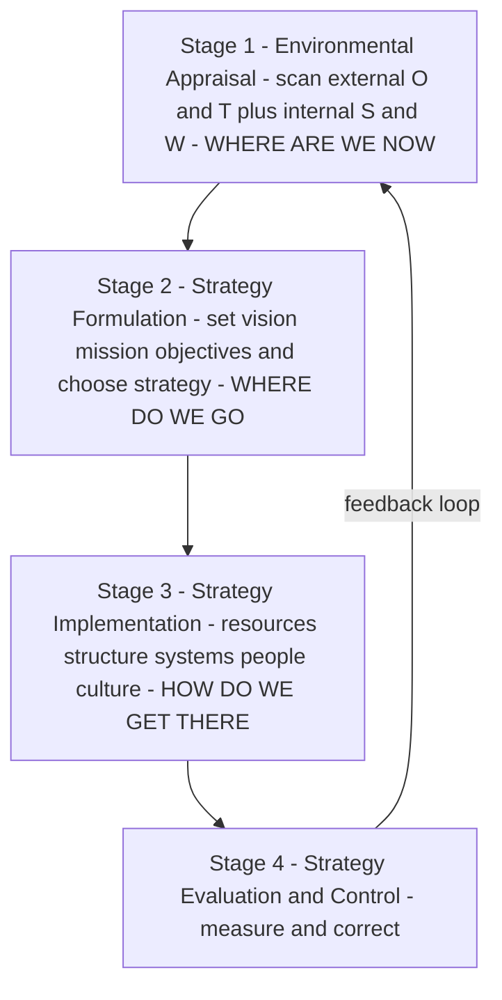

# Chapter 10 — SM: Introduction to Strategic Management

> This is the first chapter of the Strategic Management half of your syllabus. Everything you learned in Financial Management answered the question *"How do we finance and deploy money efficiently?"* Strategic Management answers a bigger, scarier question: *"Given that the future is uncertain and our resources are limited, where should this organisation go, and how do we get there before someone else does?"* Notice the shift. FM optimises within a known game. SM decides **which game to play**.

---

## 1. The Problem — Why Does "Strategy" Need To Exist At All?

Imagine you are handed the keys to a mid-sized company. You have a factory, a bank balance, 400 employees, and a product that sells reasonably well today. A simple question lands on your desk: *"What do we do next year?"*

You quickly discover this question is a monster, because it hides four brutal facts:

1. **Resources are scarce.** You cannot enter every market, hire every talent, or build every product. Money spent on a new plant is money not spent on R&D. **Every "yes" is a hundred silent "no"s.** Someone has to decide which few bets deserve the scarce rupees.

2. **The future is uncertain.** You are not deciding for the world as it is today; you are committing resources today for a world that will exist in three to five years — a world with new competitors, new technology, changed customer tastes, and policy shifts you cannot forecast precisely. You must act now on a future you cannot see clearly.

3. **Competitors want exactly what you want.** Your customers, your suppliers, your margins — rivals are hunting the same prize. If you drift while they aim, they eat your lunch. The environment is not a neutral backdrop; it is *actively adversarial*.

4. **The organisation is a crowd, not a person.** Marketing wants to cut prices to grab share. Finance wants to protect margins. Operations wants long, stable production runs. HR wants to invest in people. Left alone, each pulls in its own direction and the firm tears itself apart. Someone must give them **one shared direction** so their efforts add up instead of cancelling out.

Put these four together and the problem becomes sharp:

> **How does an organisation direct its scarce resources toward a desirable competitive future, in the face of uncertainty, while making thousands of people pull in the same direction?**

That single sentence *is* the problem strategic management exists to solve. Nothing in this chapter — vision, mission, levels of strategy, the strategic process, competitive advantage — makes sense unless you keep this problem in front of you. Each concept is a tool that chips away at one face of this monster.

If the future were certain, you'd just *plan* (a schedule, a budget). If resources were infinite, you'd just *do everything*. If there were no competitors, any direction would do. **Strategy is the child of scarcity, uncertainty, and rivalry.** Remove any one and strategy collapses into mere administration.

---

## 2. The Core Idea — Strategy as the "Game Plan of a Fleet at Sea"

Here is the analogy to carry through the whole chapter.

Picture a fleet of ships setting out to reach a distant, unseen shore where treasure is rumoured to lie. The captain cannot see the destination. Storms will come. Rival fleets sail the same waters chasing the same treasure. Fuel and crew are finite.

- The captain first needs a **picture of the shore worth reaching** — *"a prosperous colony where our people thrive."* That is **VISION**: the far-off, inspiring destination.
- The captain needs to state **what business this fleet is in and how it will sail** — *"we are traders, not pirates; we win by trust and speed."* That is **MISSION**: present purpose and identity.
- The captain needs **concrete waypoints** — *"reach the Cape by March, lose no more than one ship, carry 500 tonnes."* Those are **OBJECTIVES/GOALS**: measurable milestones.
- The captain needs **rules the crew will never break**, even under pressure — *"we never abandon a sister ship."* Those are **VALUES**: the moral guard-rails.
- The captain needs a **way of sailing that rivals cannot easily copy** — a secret current only this fleet knows. That is **COMPETITIVE ADVANTAGE**.
- And the captain needs a **burning resolve to win even though rivals are bigger** — *"we WILL plant our flag first."* That is **STRATEGIC INTENT**.

Strategy is the *whole coordinated answer* to "where, why, how, and by what rules do we sail?" — deliberately chosen, then continuously adjusted as storms reveal themselves.

The key insight the analogy delivers: **strategy is both a destination and a discipline of choosing.** It is not one document filed away; it is a *living set of choices* about direction and method that keeps the fleet coherent while the sea keeps changing.

---

## 3. Why It's Built This Way — The Logic Behind the Hierarchy

Students memorise "Vision → Mission → Objectives → Strategy → Tactics" as a ladder. But *why* this order? Because each rung answers a different unavoidable question, and each must be answered before the next makes sense.

Think of it as **descending from dream to deed** — from the abstract and enduring to the concrete and immediate:

| Rung | Question it answers | Time horizon | Nature |
|------|--------------------|--------------|--------|
| **Vision** | What do we ultimately want to *become*? | Very long (10+ yrs, aspirational) | Inspirational, future |
| **Mission** | What is our business and purpose *now*? Who do we serve, how? | Present, ongoing | Identity, present |
| **Objectives / Goals** | What specific results, by when? | Medium (1–5 yrs) | Measurable targets |
| **Strategy** | How will we deploy resources to hit those objectives against rivals? | Medium–long | Method / plan |
| **Tactics / Plans / Policies** | What day-to-day actions execute the strategy? | Short | Operational |

The reason the hierarchy runs **top-down** is *coherence*. If you set objectives before you know your mission, you get busy targets that lead nowhere meaningful. If you pick a strategy before you have a vision, you optimise a route to an unwanted place. **The upper rung gives meaning to the lower rung; the lower rung gives reality to the upper rung.** Vision without objectives is a daydream; objectives without vision are a treadmill.

There is also a *human* reason for building it this way. Recall problem-fact #4: the organisation is a crowd. A shared vision and mission act as a **magnetic north** — every employee, from the CFO to a shop-floor operator, can check "does what I'm doing point north?" This is how you get thousands of people to pull together without a manager standing over each one. The hierarchy is a **coordination technology**, not decoration.

Finally, why keep *values* alongside the whole ladder rather than as one rung? Because values are the **constraints that apply at every level** — the things you won't do to win, whatever the vision or strategy. They keep the pursuit legitimate and the culture intact. A strategy that violates the firm's values corrodes the very organisation meant to execute it.

---

## 4. Full Technical Content — Every Framework, Wrapped in Its "Why"

Now we build the exam-complete toolkit. For each concept: **what it is, why it exists, and how ICAI expects you to state it.**

### 4.1 What Strategy Is — And Isn't

**Strategy** (per the classic definitions ICAI cites) is *the determination of the basic long-term goals and objectives of an enterprise, and the adoption of courses of action and allocation of resources necessary to carry out these goals* — this is **Alfred D. Chandler's** definition (1962). Notice it bundles three things: goals + action + resource allocation. That bundling is deliberate — a goal with no resources is a wish; resources with no goal are waste.

Two complementary lenses ICAI wants you to know:

- **Strategy as intended / deliberate** — the planned, forward-looking design ("what we mean to do").
- **Strategy as emergent / realised** — the pattern that actually shows up in a stream of decisions over time ("what we ended up doing"), a distinction popularised by **Henry Mintzberg**. Real strategy = the deliberate parts that survived + the emergent parts that arose from a changing environment.

**Why this matters:** it answers problem-fact #2 (uncertainty). Because the future is unknowable, no plan survives contact with reality unchanged. Good strategic management is *deliberate about direction but flexible about route.*

**What strategy is NOT** (a favourite exam trap):
- It is **not forecasting** — forecasting predicts; strategy *decides and commits*.
- It is **not a to-do list or a budget** — those are operational.
- It is **not about doing things right (efficiency); it is about doing the right things (effectiveness).** Efficiency lives in operations; effectiveness lives in strategy. A firm can be superbly efficient at making a product no one wants — efficient, but strategically dead.

### 4.2 Strategic Management — Definition and the Three Enduring Questions

**Strategic Management** is the *set of managerial decisions and actions that determine the long-run performance of an organisation.* It involves environmental scanning, strategy formulation, strategy implementation, and evaluation & control.

It continuously answers three questions (memorise this triad — it structures the whole subject):

> **Where are we now?** (current position, resources, environment)
> **Where do we want to go?** (vision, mission, objectives)
> **How do we get there?** (strategy, implementation, control)

Every framework in Strategic Management is a sub-tool for one of these three questions.

**Why strategic management (and not just "planning")?** Because planning assumes a stable, known future. Strategic management explicitly builds in *scanning* and *evaluation & control* loops precisely because the future is uncertain and adversarial. It is planning with a nervous system.

**Benefits ICAI expects you to list** (each tied to the core problem):
- Gives **direction** — solves the "crowd pulling apart" problem.
- Prepares for the **future / reduces surprise** — tackles uncertainty by forcing you to think ahead.
- Provides a basis for **allocating scarce resources** rationally — tackles scarcity.
- Builds **competitive advantage** — tackles rivalry.
- Improves **coordination and control** — aligns action with intent.

**Limitations (be balanced — examiners reward this):** the environment is turbulent and hard to predict; strategy is time- and cost-intensive; a rigid plan can blind managers to change; and it is difficult to forecast accurately in a dynamic environment.

### 4.3 Vision

**Definition:** A vision is the **desired future state** of the organisation — an aspirational description of what it wants to achieve or become in the long term. It answers *"What do we want to become?"*

**Why it exists:** to give the fleet a distant shore worth sailing toward. Vision energises and inspires; it lifts eyes above quarterly numbers.

**Characteristics of a good vision (exam-listable):** clear and unambiguous; inspiring and challenging; forward-looking and future-oriented; describes a *desired* state, not the current one; short enough to remember; provides long-term direction.

*Example:* A vision like *"to be the most respected mobility company on earth"* — no product mentioned, no timeline, pure aspiration.

### 4.4 Mission

**Definition:** A mission statement describes the organisation's **present business and reason for existence** — *what we do, for whom, and how, right now.* It answers *"What is our business? Why do we exist?"*

**Why it exists:** vision points at the horizon; mission grounds you in *today's* identity so daily decisions have a reference. It converts an abstract dream into a working purpose.

**A good mission statement (per ICAI) typically addresses:**
- The **basic product/service** and primary markets (what business are we in).
- The **customers/clients** served.
- The **principal technology** or how the need is met.
- The organisation's **philosophy, self-concept, and public image / concern for stakeholders**.

**Characteristics:** it should be feasible, precise, clear, motivating, distinctive, and indicate the major components of strategy. It should be **broad enough to allow growth but specific enough to give identity.** (Too broad — "we improve lives" — is meaningless; too narrow — "we make 12-inch cast-iron pans" — traps you when the market shifts. This is the *"marketing myopia"* warning of Theodore Levitt: railroads defined themselves as "railroads" not "transportation" and died.)

**Vision vs Mission — the distinction examiners love:**

| Dimension | Vision | Mission |
|-----------|--------|---------|
| Question | What do we want to *become*? | What is our *business* now? |
| Orientation | Future, aspirational | Present, operational identity |
| Focus | Where we are going | Why we exist / what we do |
| Time | Long-term end-state | Ongoing |

### 4.5 Objectives and Goals

**Definition:** **Objectives** are the **specific, measurable end-results** an organisation seeks within a defined time frame; they translate the mission into concrete performance targets. (ICAI often uses *goals* for broader open-ended intentions and *objectives* for specific measurable ones; both operationalise the mission.)

**Why they exist:** vision and mission are directional but not measurable. You cannot manage what you cannot measure. Objectives convert purpose into **milestones you can hit, track, and be held accountable for** — the waypoints of the voyage.

**Characteristics of well-set objectives (exam-listable):**
- **Specific and measurable** (quantifiable where possible).
- **Realistic yet challenging** (achievable but stretching).
- **Time-bound** (a deadline).
- **Consistent and hierarchical** (functional objectives ladder up to corporate ones).
- **Understandable and acceptable** to those who must achieve them.

*Example:* Vision = "be the leading player." Mission = "provide affordable quality electric two-wheelers to Indian commuters." Objective = "capture 15% market share and achieve ₹500 crore revenue by FY 2028." Notice how each is more concrete than the last.

### 4.6 Values

**Definition:** Values are the **core beliefs and ethical principles** that guide the behaviour of the organisation and its people — the non-negotiables.

**Why they exist:** to keep the pursuit of vision *legitimate* and the culture *coherent*. Values are the guard-rails that apply at every level of the hierarchy simultaneously. They answer: *"What will we not compromise, whatever the strategy?"* (e.g., integrity, customer-first, safety, respect). Values make the firm trustworthy to employees, customers, and society — which is itself a competitive asset.

### 4.7 The Hierarchy, Assembled

*Figure 1 — The strategic hierarchy descends from enduring dream to daily deed; values constrain every rung.*

### 4.8 Levels of Strategy — Because One Size Cannot Fit a Whole Organisation

A large firm is not one decision-maker but a stack of them: the group chairman, the head of the two-wheeler division, and the plant's production manager all make "strategic" choices — but about *very different things*. So strategy exists at **three levels**, each answering a different question. This is a guaranteed exam topic.

**(a) Corporate-level strategy** — decided by top management / board.
- **Question:** *"What set of businesses should we be in?"*
- **Concern:** the overall scope and direction of the whole enterprise — which industries to enter or exit, diversification, acquisitions, allocation of resources *across* business units. It seeks to answer how the firm as a portfolio creates more value than the sum of its parts (the "parenting" question).
- *Example:* Should Tata be in salt, steel, software, and cars — and how much capital goes to each?

**(b) Business-level (competitive) strategy** — decided by SBU (Strategic Business Unit) heads.
- **Question:** *"How do we compete and win in THIS particular business/market?"*
- **Concern:** building competitive advantage in a single industry — cost leadership vs differentiation, positioning against direct rivals. This is where competitive advantage (Section 4.9) is actually forged.
- *Example:* How does the electric-two-wheeler division beat Ola and Ather — on price, or on features?

**(c) Functional-level strategy** — decided by department heads (marketing, finance, operations, HR).
- **Question:** *"How does each function support the business strategy?"*
- **Concern:** maximising resource productivity within a function and aligning it with the business strategy — e.g., the marketing plan, the financing plan, the production plan.
- *Example:* If the business strategy is differentiation, the R&D function's strategy prioritises innovation; the marketing function's strategy prioritises brand-building over discounting.

**Why three levels and not one?** Because the questions genuinely differ in *scope* and require different information and time horizons. Corporate strategy plays with the *portfolio*; business strategy plays *within a market*; functional strategy plays *within a department*. Crucially, they must **nest**: functional strategies serve the business strategy, which serves the corporate strategy. Misalignment between levels is a classic cause of strategic failure — a brilliant division strategy starved of corporate funds, or a marketing function discounting while the business strategy demands premium positioning.

*Figure 2 — Strategy cascades across three nested levels; lower levels serve higher ones.*

### 4.9 Competitive Advantage — The Prize Strategy Is Chasing

**Definition:** A **competitive advantage** exists when a firm delivers **superior value** to customers, or comparable value at a lower cost, in a way that rivals find **difficult to imitate** — allowing it to earn above-average returns over time.

**Why the concept exists:** recall problem-fact #3 — rivalry. In a competitive market, ordinary firms earn only ordinary (competitive) returns; any excess profit gets competed away. To earn *more*, you must possess something rivals **cannot easily copy**. Competitive advantage is the technical name for "the secret current only our fleet knows."

**Two broad generic routes to it (Michael E. Porter):**
- **Cost leadership** — becoming the lowest-cost producer, so you can price lower or pocket wider margins.
- **Differentiation** — offering something uniquely valuable (brand, quality, features, service) that customers pay a premium for.
(A third, **focus**, applies either route to a narrow niche. Porter's generic strategies are covered fully in the competitive-strategy chapter; here you only need that competitive advantage is *what* strategy pursues.)

**Sustainable competitive advantage:** advantage that *persists* because it is protected by barriers to imitation — rare and valuable resources, proprietary technology, brand, scale, network effects, or a hard-to-copy culture. (This links forward to the **resource-based view** and the VRIO/VRIN idea: a resource confers sustainable advantage when it is **Valuable, Rare, Inimitable, and the firm is Organised** to exploit it.)

**Why "sustainable" is the whole point:** a temporary advantage (a clever ad, a price cut) is quickly matched. Strategy seeks advantages that *last* — because only lasting advantage lets you plan and invest for that uncertain future with confidence.

### 4.10 Strategic Intent — The Ambition That Stretches the Firm

**Definition:** **Strategic intent** is the organisation's **obsessive, long-term ambition to achieve a leadership position** — a stretching aspiration that its current resources and capabilities do *not yet* support, which drives the firm to innovate and build new capabilities. The concept is from **Gary Hamel and C.K. Prahalad** (1989).

**Why it exists:** conventional "strategic fit" thinking says *match your strategy to your current resources* — play only the games you can already win. Hamel and Prahalad observed that industry-changing winners (like Canon vs Xerox, Komatsu vs Caterpillar) did the *opposite*: they set an ambition far beyond their means and then *stretched* to close the gap. Strategic intent is the **engine that converts a small challenger into a giant-killer** — it creates a productive *misfit* between ambition and resources that forces creativity.

**Strategic intent is the umbrella concept expressed through the hierarchy** you already learned. ICAI presents strategic intent as being *articulated through* vision, mission, business definition, goals and objectives. In other words:

> **Vision + Mission + Objectives together express the firm's strategic intent** — its fundamental long-term direction and will to win.

**Key characteristics (Hamel & Prahalad):** it captures the *essence of winning*; it is *stable over time* (doesn't change with every market wobble); it sets a *stretch* target; and it engages the *emotions and energy* of every employee, not just the boardroom.

*Figure 3 — Strategic intent is the will-to-win expressed through the vision-mission-objectives hierarchy, pursued via strategy to build competitive advantage.*

### 4.11 The Strategic Management Process — The Loop That Ties It All Together

Everything above is *content*; the **process** is the *machine* that produces and renews that content. ICAI's model has four stages (some texts phrase environmental appraisal as part of formulation; know both the four-stage and the "scanning-formulation-implementation-evaluation" phrasing):

**Stage 1 — Environmental / Strategic Appraisal (Scanning).**
*"Where are we now?"* Scan the **external environment** (opportunities and threats — economic, political, technological, social, competitive forces) and the **internal environment** (strengths and weaknesses — resources, capabilities). This is the reality-check that keeps strategy honest against the uncertain, adversarial world. (SWOT and PESTLE live here.)

**Stage 2 — Strategy Formulation.**
*"Where do we want to go, and how?"* Establish/refine vision, mission, and objectives, then design the corporate-, business-, and functional-level strategies to reach them given the appraisal. This is *choosing the route*.

**Stage 3 — Strategy Implementation.**
*"Put the plan into action."* Turn the chosen strategy into results: allocate resources and budgets, design the organisation structure, set policies and procedures, lead and motivate people, manage change. **This is where most strategies fail** — a great plan poorly executed beats nothing. Structure, resources, systems, and culture must all be aligned to the strategy.

**Stage 4 — Strategy Evaluation and Control.**
*"Are we on track? Correct course."* Set performance standards, measure actual results against them, and take corrective action. Because the environment keeps changing, this stage **feeds back** into scanning and formulation — making the process a *loop*, not a line. This feedback loop is precisely how strategic management copes with uncertainty (problem-fact #2).

*Figure 4 — The strategic management process is a continuous loop, not a one-off line; evaluation feeds back into scanning.*

---

## 5. Worked Examples / Applied Cases

Strategic Management is tested through *application to scenarios*, not calculation. Here are three worked cases showing how to deploy the frameworks in an answer.

### Applied Case 1 — Diagnosing the Hierarchy at "VoltRide Motors"

**Scenario:** VoltRide, a startup, tells investors: *"We dream of a India where every commuter rides clean. (A) We build affordable, reliable electric scooters for young Indian city commuters using our in-house battery technology, and we never compromise on rider safety. (B) By FY 2028 we will sell 3 lakh units a year and reach ₹800 crore revenue. (C)"* Classify statements A, B, C and identify what's missing.

**Analysis:**
- *"We dream of an India where every commuter rides clean"* → **Vision** — future aspiration, no product/timeline, inspirational.
- **(A)** *"We build affordable, reliable electric scooters for … commuters using in-house battery tech … never compromise on safety"* → **Mission** (present business, customer, technology, self-concept) *plus* an embedded **Value** ("never compromise on rider safety").
- **(B)/(C)** *"By FY 2028 … 3 lakh units … ₹800 crore"* → **Objectives** — specific, measurable, time-bound.

**What's missing / advice:** The statements express *what* and *how much*, but the *how we will win against Ola and Ather* — the **business-level competitive strategy** and the source of **sustainable competitive advantage** — is unstated. VoltRide should articulate whether it competes on **cost leadership** (cheapest scooter) or **differentiation** (superior battery/range). Its in-house battery technology is a candidate **VRIN resource** — if it is valuable, rare and hard to imitate, it can anchor sustainable advantage. Note also the healthy **strategic intent**: an ambition ("every commuter rides clean") far beyond current tiny scale — a productive stretch.

*This is exactly the classify-and-critique format ICAI uses.*

### Applied Case 2 — Three Levels of Strategy at a Diversified Group

**Scenario:** "Sunrise Group" owns three businesses: FMCG, hotels, and a software services unit. The board must decide (i) whether to sell the loss-making hotels and invest the proceeds in software; (ii) how the FMCG unit should beat Hindustan Unilever in rural markets; (iii) how the software unit's HR department should reduce attrition. Assign each decision to a strategy level and justify.

**Analysis:**

| Decision | Level | Why |
|----------|-------|-----|
| (i) Sell hotels, reinvest in software | **Corporate-level** | It concerns the *portfolio of businesses the group should be in* and allocation of resources *across* units — the defining corporate question. |
| (ii) How FMCG beats HUL in rural markets | **Business-level** | It concerns building *competitive advantage within a single industry/market* against a direct rival. |
| (iii) Software HR reduces attrition | **Functional-level** | It concerns maximising productivity *within one function* (HR) in support of the software business strategy. |

**Coherence check:** These must nest. If corporate strategy (i) starves FMCG of capital, business strategy (ii) may fail for lack of funds; if the HR strategy (iii) fails and engineers quit, the software business (into which corporate wants to invest) cannot deliver. **Alignment across levels is the point** — an examiner rewards you for noticing the interdependence, not just the labels.

### Applied Case 3 — Strategic Intent Versus Strategic Fit at "Komal Tools"

**Scenario:** Komal Tools is a small Indian hand-tool maker with 4% domestic market share, competing against a global giant with 40% share. The CEO declares: *"Within 15 years we will be the world's most trusted tool brand."* The CFO objects: *"That's absurd — our resources don't remotely support it. We should stick to what we can afford."* Evaluate both positions.

**Analysis:**
- The CFO argues from **strategic fit** — match ambition to *current* resources. Safe, but it condemns Komal to permanent smallness; it can never out-grow a rival by only playing games it already wins.
- The CEO is exercising **strategic intent** (Hamel & Prahalad): an *obsessive, stretching* ambition deliberately larger than current means, designed to *force* the organisation to build new capabilities and innovate. History's giant-killers (Canon vs Xerox, Komatsu vs Caterpillar) won exactly this way — by leveraging resources creatively toward an outsized intent rather than trimming ambition to fit resources.

**Judgement:** The intent is *not* absurd *provided* it is coupled with (a) stability over time, (b) genuine capability-building milestones (a resource-leverage plan), and (c) emotional engagement of employees. Intent without an execution and capability-building path is mere fantasy; intent *with* it is the engine of transformation. The right answer blends both: **an ambitious intent, executed through disciplined, resource-leveraging objectives.**

---

## 6. Framework Summary / Presentation Format

When an exam question asks you to *define, distinguish, or apply* these concepts, present crisply. Reusable scaffolds:

**Vision vs Mission vs Objectives (one-glance table):**

| | Vision | Mission | Objectives |
|---|--------|---------|-----------|
| Answers | What to *become* | What business we *are in* | What *results* by when |
| Time | Long-term future | Present, ongoing | Medium-term, dated |
| Measurable? | No | No | **Yes** |
| Example | "Most respected mobility firm" | "Affordable EVs for city commuters" | "15% share by 2028" |

**Levels of strategy (one-glance table):**

| Level | Decided by | Central question | Concern |
|-------|-----------|------------------|---------|
| Corporate | Top mgmt / board | Which businesses to be in? | Portfolio, scope, resource split across units |
| Business (SBU) | SBU heads | How to win in this market? | Competitive advantage within one industry |
| Functional | Dept heads | How does each function support? | Productivity + alignment within a function |

**The three enduring questions ↔ the process:**
- *Where are we now?* → **Environmental Appraisal**
- *Where do we want to go?* → **Strategy Formulation** (vision/mission/objectives)
- *How do we get there (and stay on track)?* → **Implementation + Evaluation & Control**

**Answer-writing tip:** For 4–6 mark questions, always (1) name the concept, (2) give the author if there is one (Chandler for strategy definition, Mintzberg for deliberate/emergent, Porter for competitive advantage/generic strategies, Hamel & Prahalad for strategic intent, Levitt for marketing myopia), (3) state *why* it exists, (4) give a one-line example. The "author + why" combination is what separates a top answer from a memorised one.

---

## 7. Connections — How This Chapter Wires Into the Rest of SM (and FM)

- **→ Environmental analysis chapters (PESTLE, Porter's Five Forces, SWOT):** these are the *tools* of Stage 1 (Environmental Appraisal). This chapter told you *why* you scan; those chapters tell you *how*.
- **→ Competitive strategy / Porter's generic strategies:** Section 4.9 opened the idea of competitive advantage; the generic-strategies chapter details *cost leadership, differentiation, and focus* as the routes to it.
- **→ Corporate-level strategy (Ansoff matrix, BCG, expansion/diversification):** deepens the corporate level of Section 4.8 — the "which businesses" question.
- **→ Strategy implementation, structure and culture chapters:** expand Stage 3 — the "structure follows strategy" idea (Chandler again) and how culture, leadership and systems must align.
- **→ Back to Financial Management:** resource allocation in strategy *is* capital budgeting and financing decisions in FM. When corporate strategy says "invest in software, exit hotels," FM's NPV/IRR tools evaluate *whether the numbers back the strategic choice*. **Strategy chooses the direction; FM checks the arithmetic and funds it.** The two halves of your syllabus meet exactly here — strategy sets the objective, finance allocates the scarce rupees to reach it.

---

## 8. Traps & Examiner Tricks

1. **Vision ↔ Mission swap.** The single most common error. Remember: *Vision = future "become"; Mission = present "business/why."* If a statement is measurable or dated, it's an **objective**, not either.
2. **Calling a measurable target a "vision."** Visions are *never* quantified. "₹800 crore by 2028" is an objective, full stop.
3. **"Strategy = long-term planning."** No. Planning assumes a knowable future; strategy explicitly handles uncertainty and rivalry, and includes *emergent* strategy (Mintzberg). Don't equate them.
4. **Efficiency vs effectiveness confusion.** Strategy = *doing the right things* (effectiveness). Operations = *doing things right* (efficiency). Examiners bait you with "improving productivity" (functional/efficiency) and dress it as strategy.
5. **Mixing up the three levels.** A decision about *which markets/industries* = corporate; *how to beat a rival in one market* = business; *within a department* = functional. Read the scope carefully.
6. **Forgetting the feedback loop.** If asked to draw/describe the strategic management process, you **must** show evaluation & control feeding *back* into scanning. Drawing it as a straight line loses marks — it misses how the process copes with change.
7. **Strategic intent ≠ vision (subtle).** Intent is the *stretching will to win*; it is *expressed through* vision, mission and objectives. Attribute it to **Hamel & Prahalad**, and stress the "stretch beyond current resources" idea — that's the marks-carrying phrase.
8. **Naming no author.** ICAI rewards attribution. Blank authors = generic answer. Keep the roster (Chandler, Mintzberg, Porter, Hamel & Prahalad, Levitt) ready.
9. **Omitting limitations.** "Discuss strategic management" wants *benefits and limitations*. A one-sided answer caps your marks. Always add the turbulence/cost/rigidity caveats.
10. **Treating values as decoration.** If a scenario has an ethical guard-rail ("never compromise on safety"), *name it as a value* and note it constrains every level — easy marks most students miss.

---

## 9. First-Principles Recap

Rebuild the whole chapter from the single problem, and you never have to memorise it:

- Because **resources are scarce, the future is uncertain, and rivals are hunting the same prize**, an organisation of many people needs *one deliberate, adjustable direction* → this necessity **is** strategy.
- To give the crowd a shared direction, you build a **hierarchy of purpose**: **Vision** (become) → **Mission** (present business) → **Objectives** (measurable targets) → **Strategy** (method) → **Tactics** (daily action), with **Values** guarding every rung. Upper rungs give *meaning*; lower rungs give *reality*.
- Because a big firm makes decisions at different scopes, strategy splits into **three nested levels** — **corporate** (which businesses), **business** (how to win in one), **functional** (how each department supports). Lower serves higher.
- The prize the whole effort chases is **competitive advantage** — something *valuable and hard to imitate* that lets you earn above-average returns despite rivalry; when protected by barriers to imitation it becomes **sustainable**.
- The *will* to chase an outsized future — an ambition beyond current resources that forces the firm to stretch — is **strategic intent** (Hamel & Prahalad), and it is *expressed through* the vision-mission-objectives hierarchy.
- All of this is produced and renewed by a **four-stage loop** — **appraise → formulate → implement → evaluate**, with evaluation feeding back — which is simply the disciplined way to keep answering *where are we, where do we go, how do we get there* in a world that won't hold still.

Every term in this chapter is a *named tool* for one face of the founding problem. Know the problem, and the tools are obvious.

---

## 10. Quick-Revision Sheet

**THE PROBLEM strategy solves:** direct **scarce** resources toward a desirable **competitive** future under **uncertainty**, while making a **crowd** pull one way.

**THREE ENDURING QUESTIONS:** Where are we now? / Where do we want to go? / How do we get there?

**HIERARCHY (top→down):** Vision (become) → Mission (present business/why) → Objectives (measurable, dated) → Strategy (method) → Tactics/Policies (daily). **Values** = ethical guard-rails at every level.

- **Vision** — future aspiration; clear, inspiring, forward-looking; *not* measurable.
- **Mission** — present business, customers, technology, philosophy; broad enough to grow, specific enough for identity. Watch **marketing myopia** (Levitt).
- **Objectives** — specific, measurable, realistic-yet-challenging, time-bound, consistent/hierarchical, acceptable.
- **Values** — non-negotiable ethical principles; a source of trust and competitive strength.

**LEVELS OF STRATEGY:**
- **Corporate** (top mgmt) — *which businesses?* — portfolio, diversification, resource split.
- **Business/SBU** — *how to win in this market?* — competitive advantage.
- **Functional** (dept) — *how does each function support?* — productivity + alignment. **Lower serves higher.**

**COMPETITIVE ADVANTAGE** — superior value / lower cost, hard to imitate → above-average returns. Routes (**Porter**): cost leadership, differentiation, focus. **Sustainable** when protected by barriers to imitation (VRIN: Valuable, Rare, Inimitable, Organised-to-exploit).

**STRATEGIC INTENT** (**Hamel & Prahalad**) — obsessive, stable, *stretching* ambition beyond current resources; the essence of winning; expressed through vision + mission + objectives.

**STRATEGIC MANAGEMENT PROCESS (loop):**
1. **Environmental Appraisal** — external O/T + internal S/W (where are we).
2. **Formulation** — set vision/mission/objectives + choose strategy (where to go).
3. **Implementation** — resources, structure, systems, people, culture (get there); *most strategies fail here*.
4. **Evaluation & Control** — measure vs standards, correct → **feeds back** to Stage 1.

**AUTHOR ROSTER:** Chandler (strategy definition; structure follows strategy) · Mintzberg (deliberate vs emergent) · Porter (competitive advantage / generic strategies / five forces) · Hamel & Prahalad (strategic intent, core competence) · Levitt (marketing myopia).

**KILLER DISTINCTIONS:** Vision=future / Mission=present · Effectiveness (strategy, right things) vs Efficiency (operations, things right) · Strategy ≠ forecasting/planning · Process is a **loop**, not a line.
