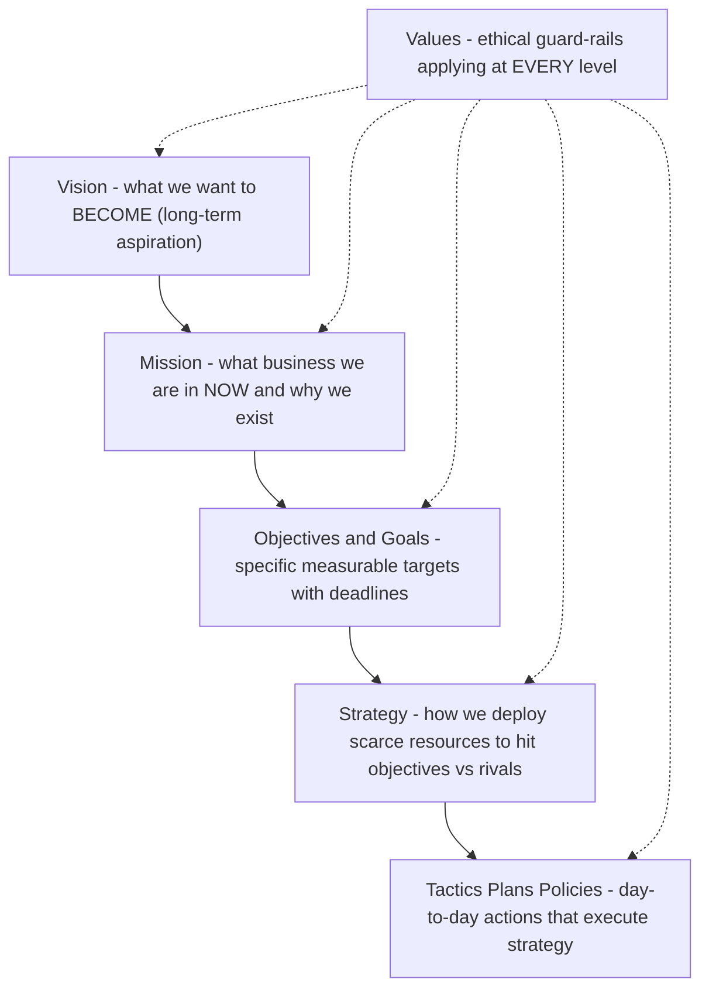
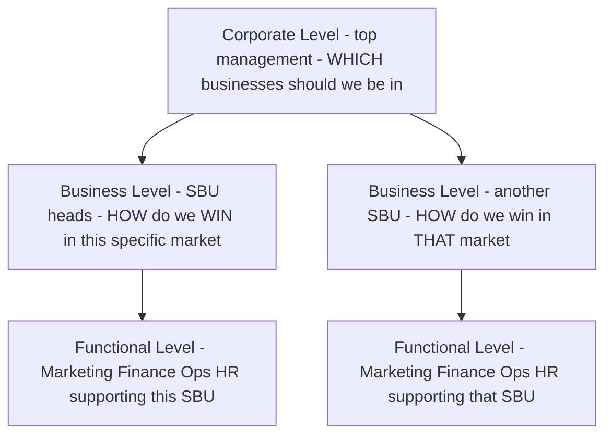
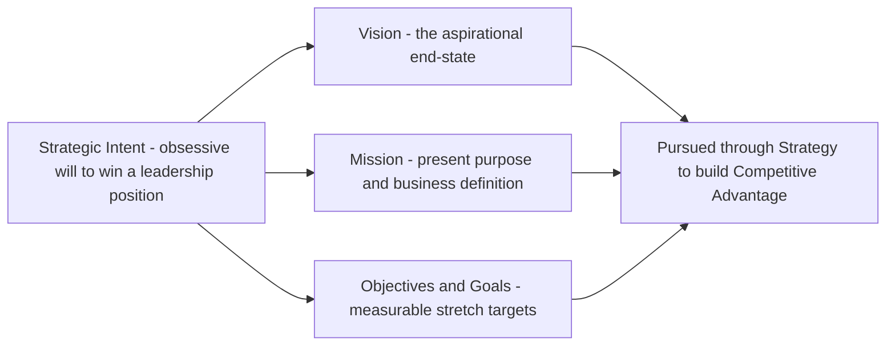
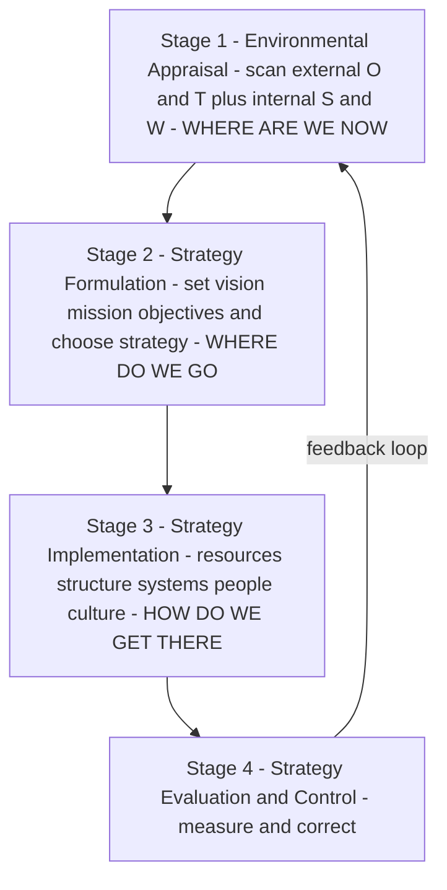
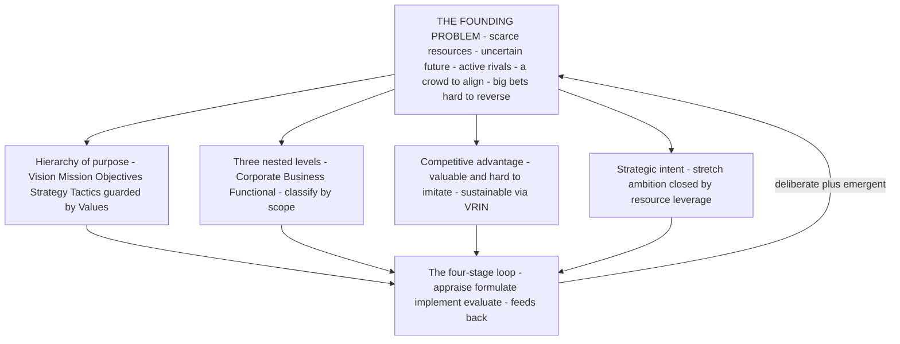

<!-- v2-deep -->

# Chapter 10 — SM: Introduction to Strategic Management

> This is the first chapter of the Strategic Management half of your syllabus. Everything you learned in Financial Management answered the question *"How do we finance and deploy money efficiently?"* Strategic Management answers a bigger, scarier question: *"Given that the future is uncertain and our resources are limited, where should this organisation go, and how do we get there before someone else does?"* Notice the shift. FM optimises within a known game. SM decides **which game to play**. FM asks "how do we do the thing right?"; SM asks "are we even doing the right thing?" Keep that one-line contrast in your head — it is the seed from which every distinction in this chapter grows.

---

## 1. The Problem — Why Does "Strategy" Need To Exist At All?

Imagine you are handed the keys to a mid-sized company. You have a factory, a bank balance, 400 employees, and a product that sells reasonably well today. A simple question lands on your desk: *"What do we do next year?"*

You quickly discover this question is a monster, because it hides four brutal facts:

1. **Resources are scarce.** You cannot enter every market, hire every talent, or build every product. Money spent on a new plant is money not spent on R&D. **Every "yes" is a hundred silent "no"s.** Someone has to decide which few bets deserve the scarce rupees.

2. **The future is uncertain.** You are not deciding for the world as it is today; you are committing resources today for a world that will exist in three to five years — a world with new competitors, new technology, changed customer tastes, and policy shifts you cannot forecast precisely. You must act now on a future you cannot see clearly.

3. **Competitors want exactly what you want.** Your customers, your suppliers, your margins — rivals are hunting the same prize. If you drift while they aim, they eat your lunch. The environment is not a neutral backdrop; it is *actively adversarial*.

4. **The organisation is a crowd, not a person.** Marketing wants to cut prices to grab share. Finance wants to protect margins. Operations wants long, stable production runs. HR wants to invest in people. Left alone, each pulls in its own direction and the firm tears itself apart. Someone must give them **one shared direction** so their efforts add up instead of cancelling out.

Put these four together and the problem becomes sharp:

> **How does an organisation direct its scarce resources toward a desirable competitive future, in the face of uncertainty, while making thousands of people pull in the same direction?**

That single sentence *is* the problem strategic management exists to solve. Nothing in this chapter — vision, mission, levels of strategy, the strategic process, competitive advantage — makes sense unless you keep this problem in front of you. Each concept is a tool that chips away at one face of this monster.

If the future were certain, you'd just *plan* (a schedule, a budget). If resources were infinite, you'd just *do everything*. If there were no competitors, any direction would do. **Strategy is the child of scarcity, uncertainty, and rivalry.** Remove any one and strategy collapses into mere administration.

**A fifth, quieter fact — irreversibility.** Notice why the four facts *bite* rather than merely inconvenience. Strategic decisions are largely **irreversible and resource-committing**. If you build the wrong factory, you cannot un-pour the concrete next quarter; if you exit a market, re-entering may cost years of lost trust. This is what separates a *strategic* decision from an *operational* one. An operational decision (reorder inventory, reschedule a shift) is small, frequent, reversible, and made low in the hierarchy. A strategic decision is **large, rare, hard to reverse, made at the top, and it shapes every operational decision that follows for years.** Examiners love a scenario that asks you to classify a decision as strategic vs operational — the test is: *does it commit significant resources over a long horizon in a way that is costly to undo, and does it define the arena in which smaller choices are made?* If yes, it is strategic.

**Why "next year" is the wrong frame.** The opening question — "what do we do next year?" — is itself a trap the good strategist reframes. Next-year thinking is *budgeting*; it optimises the current position. Strategy asks the harder question: *"What must we start building now that will only pay off in five years, and which rival is already building it?"* The gap between those two questions is the gap between administration and strategy.

---

## 2. The Core Idea — Strategy as the "Game Plan of a Fleet at Sea"

Here is the analogy to carry through the whole chapter.

Picture a fleet of ships setting out to reach a distant, unseen shore where treasure is rumoured to lie. The captain cannot see the destination. Storms will come. Rival fleets sail the same waters chasing the same treasure. Fuel and crew are finite.

- The captain first needs a **picture of the shore worth reaching** — *"a prosperous colony where our people thrive."* That is **VISION**: the far-off, inspiring destination.
- The captain needs to state **what business this fleet is in and how it will sail** — *"we are traders, not pirates; we win by trust and speed."* That is **MISSION**: present purpose and identity.
- The captain needs **concrete waypoints** — *"reach the Cape by March, lose no more than one ship, carry 500 tonnes."* Those are **OBJECTIVES/GOALS**: measurable milestones.
- The captain needs **rules the crew will never break**, even under pressure — *"we never abandon a sister ship."* Those are **VALUES**: the moral guard-rails.
- The captain needs a **way of sailing that rivals cannot easily copy** — a secret current only this fleet knows. That is **COMPETITIVE ADVANTAGE**.
- And the captain needs a **burning resolve to win even though rivals are bigger** — *"we WILL plant our flag first."* That is **STRATEGIC INTENT**.

Strategy is the *whole coordinated answer* to "where, why, how, and by what rules do we sail?" — deliberately chosen, then continuously adjusted as storms reveal themselves.

The key insight the analogy delivers: **strategy is both a destination and a discipline of choosing.** It is not one document filed away; it is a *living set of choices* about direction and method that keeps the fleet coherent while the sea keeps changing.

**Push the analogy one step further — where the real skill lies.** Anyone can *pick* a destination. The captain's genuine skill shows in two places the beginner overlooks. First, **choosing what NOT to do**: a fleet that tries to visit every island reaches none. Strategy is as much a list of rejected voyages as chosen ones — "we will not chase the northern route however tempting the rumour." A strategy that says "we'll pursue every opportunity" is not a strategy; it is an admission that no one has chosen. Second, **maintaining coherence under pressure**: when a storm hits, the untrained crew each does what seems locally sensible — and the fleet scatters. The vision-mission-values structure exists precisely so that, in the fog, every ship still knows which way is north *without* a signal from the flagship. That is why the hierarchy is a coordination technology, not a filing exercise.

**The trade-off nobody escapes.** The captain who commits hard to one route sails fast but risks sailing fast in the wrong direction if the treasure moves. The captain who keeps every option open never commits enough resources to any route to actually arrive. **Strategy lives on this knife-edge between commitment and flexibility** — commit enough to build advantage, stay flexible enough to survive surprise. This is the tension Mintzberg's *deliberate vs emergent* (Section 4.1) puts a name to.

---

## 3. Why It's Built This Way — The Logic Behind the Hierarchy

Students memorise "Vision → Mission → Objectives → Strategy → Tactics" as a ladder. But *why* this order? Because each rung answers a different unavoidable question, and each must be answered before the next makes sense.

Think of it as **descending from dream to deed** — from the abstract and enduring to the concrete and immediate:

| Rung | Question it answers | Time horizon | Nature |
|------|--------------------|--------------|--------|
| **Vision** | What do we ultimately want to *become*? | Very long (10+ yrs, aspirational) | Inspirational, future |
| **Mission** | What is our business and purpose *now*? Who do we serve, how? | Present, ongoing | Identity, present |
| **Objectives / Goals** | What specific results, by when? | Medium (1–5 yrs) | Measurable targets |
| **Strategy** | How will we deploy resources to hit those objectives against rivals? | Medium–long | Method / plan |
| **Tactics / Plans / Policies** | What day-to-day actions execute the strategy? | Short | Operational |

The reason the hierarchy runs **top-down** is *coherence*. If you set objectives before you know your mission, you get busy targets that lead nowhere meaningful. If you pick a strategy before you have a vision, you optimise a route to an unwanted place. **The upper rung gives meaning to the lower rung; the lower rung gives reality to the upper rung.** Vision without objectives is a daydream; objectives without vision are a treadmill.

There is also a *human* reason for building it this way. Recall problem-fact #4: the organisation is a crowd. A shared vision and mission act as a **magnetic north** — every employee, from the CFO to a shop-floor operator, can check "does what I'm doing point north?" This is how you get thousands of people to pull together without a manager standing over each one. The hierarchy is a **coordination technology**, not decoration.

Finally, why keep *values* alongside the whole ladder rather than as one rung? Because values are the **constraints that apply at every level** — the things you won't do to win, whatever the vision or strategy. They keep the pursuit legitimate and the culture intact. A strategy that violates the firm's values corrodes the very organisation meant to execute it.

**The hierarchy also runs bottom-up as a reality test — the "means–ends chain."** The top-down flow is about *meaning*; but there is a mirror flow about *feasibility*. Each level is the **end** for the level below it and a **means** for the level above it. A tactic is a means to an objective; an objective is a means to the mission; the mission is a means to the vision. This is the classic **means–ends chain**, and it works in both directions:
- **Downward (meaning):** the vision tells you which objectives are worth setting.
- **Upward (reality):** if no achievable set of objectives and tactics can possibly reach the vision, the vision is fantasy and must be pulled back down to earth.

A vision that cannot be decomposed into a plausible ladder of objectives is not inspiring — it is dishonest. This upward feasibility check is exactly what separates *strategic intent* (an ambitious-but-buildable stretch, Section 4.10) from mere *wishful thinking*. Examiners test this: a scenario where the vision and the objectives are wildly disconnected is inviting you to say "the means–ends chain is broken."

**Why the horizons must nest, not overlap arbitrarily.** Notice the time horizons *telescope* — long, medium, short. This is not cosmetic. A shorter-horizon rung must fit *inside* the window of the rung above it, or the firm oscillates. If objectives are set for five years but strategy is reviewed monthly and lurches each time, the objectives never get a stable run at completion. Stability of the higher rungs is what lets the lower rungs actually be executed — which is why Hamel and Prahalad insist strategic intent must be *stable over time* (Section 4.10). Frequent changes at the top shatter every plan below.

---

## 4. Full Technical Content — Every Framework, Wrapped in Its "Why"

Now we build the exam-complete toolkit. For each concept: **what it is, why it exists, and how ICAI expects you to state it.**

### 4.1 What Strategy Is — And Isn't

**Strategy** (per the classic definitions ICAI cites) is *the determination of the basic long-term goals and objectives of an enterprise, and the adoption of courses of action and allocation of resources necessary to carry out these goals* — this is **Alfred D. Chandler's** definition (1962). Notice it bundles three things: goals + action + resource allocation. That bundling is deliberate — a goal with no resources is a wish; resources with no goal are waste.

Two complementary lenses ICAI wants you to know:

- **Strategy as intended / deliberate** — the planned, forward-looking design ("what we mean to do").
- **Strategy as emergent / realised** — the pattern that actually shows up in a stream of decisions over time ("what we ended up doing"), a distinction popularised by **Henry Mintzberg**. Real strategy = the deliberate parts that survived + the emergent parts that arose from a changing environment.

**Why this matters:** it answers problem-fact #2 (uncertainty). Because the future is unknowable, no plan survives contact with reality unchanged. Good strategic management is *deliberate about direction but flexible about route.*

**Finer distinction — Mintzberg's full vocabulary (examiner gold).** ICAI treats "deliberate vs emergent" as the headline, but the underlying picture has three moving parts and it is worth carrying them:
- **Intended strategy** — what management *planned*.
- **Deliberate strategy** — the portion of the intended strategy that *actually got implemented* as planned.
- **Emergent strategy** — a coherent pattern of actions that *arose without being intended* (from front-line experiments, market feedback, accidents that worked).
- **Realised strategy** — what the firm *actually did* = deliberate + emergent.
- **Unrealised strategy** — the intended portion that was *abandoned* along the way.

The payoff phrase for an answer: *"Realised strategy is rarely the same as intended strategy; the difference is made up of unrealised intentions dropped and emergent patterns picked up."* This single sentence shows an examiner you understand strategy is not a static document.

**Mintzberg's 5 Ps of strategy (a listable sub-topic).** Strategy can be viewed as a **Plan** (intended course), a **Ploy** (a specific manoeuvre to outwit a rival), a **Pattern** (consistency in behaviour over time — the emergent view), a **Position** (locating the firm in its market/environment), and a **Perspective** (the firm's ingrained way of seeing the world, its "personality"). If a question asks "what are the different ways strategy can be understood?", the 5 Ps is the crisp scaffold.

**What strategy is NOT** (a favourite exam trap):
- It is **not forecasting** — forecasting predicts; strategy *decides and commits*.
- It is **not a to-do list or a budget** — those are operational.
- It is **not about doing things right (efficiency); it is about doing the right things (effectiveness).** Efficiency lives in operations; effectiveness lives in strategy. A firm can be superbly efficient at making a product no one wants — efficient, but strategically dead.

**Strategy as trade-off, not just aspiration.** The deepest first-principles point about "what strategy is": strategy is fundamentally about **deliberately choosing to be different, which necessarily means choosing what to give up.** If two firms could each do everything the other does, neither has a strategy — they have a race to operational efficiency that competes profits away (recall problem-fact #3). A real strategy contains **trade-offs**: "we serve *this* customer and deliberately serve *that* one worse." A budget airline gives up meals, seat comfort, and connections to win on price — the giving-up *is* the strategy. Students who describe strategy as "a plan to do lots of good things" have missed the core; examiners reward "a coherent set of choices including what NOT to do."

### 4.2 Strategic Management — Definition and the Three Enduring Questions

**Strategic Management** is the *set of managerial decisions and actions that determine the long-run performance of an organisation.* It involves environmental scanning, strategy formulation, strategy implementation, and evaluation & control.

It continuously answers three questions (memorise this triad — it structures the whole subject):

> **Where are we now?** (current position, resources, environment)
> **Where do we want to go?** (vision, mission, objectives)
> **How do we get there?** (strategy, implementation, control)

Every framework in Strategic Management is a sub-tool for one of these three questions.

**Why strategic management (and not just "planning")?** Because planning assumes a stable, known future. Strategic management explicitly builds in *scanning* and *evaluation & control* loops precisely because the future is uncertain and adversarial. It is planning with a nervous system.

**Benefits ICAI expects you to list** (each tied to the core problem):
- Gives **direction** — solves the "crowd pulling apart" problem.
- Prepares for the **future / reduces surprise** — tackles uncertainty by forcing you to think ahead.
- Provides a basis for **allocating scarce resources** rationally — tackles scarcity.
- Builds **competitive advantage** — tackles rivalry.
- Improves **coordination and control** — aligns action with intent.
- Turns the firm **proactive rather than reactive** — instead of merely responding to shocks, it shapes and anticipates them. (Add this line; ICAI phrases a key benefit as "makes an organisation more proactive than reactive.")

**Limitations (be balanced — examiners reward this):** the environment is turbulent and hard to predict; strategy is time- and cost-intensive; a rigid plan can blind managers to change; and it is difficult to forecast accurately in a dynamic environment. Add three more that ICAI-style answers reward: (a) **implementation is harder than formulation** — a good plan badly executed fails; (b) strategic management can breed a false sense of **certainty/over-commitment**, making managers cling to a losing plan; and (c) it demands **top-management time and skill** that smaller firms may lack.

**A distinction examiners exploit — strategic management vs strategic planning.** They are *not* synonyms. **Strategic planning** is largely the *formulation* end — analysing, forecasting, and producing a plan document. **Strategic management** is the *whole enterprise* — formulation **plus** implementation **plus** evaluation and control, treated as a continuous, organisation-wide managerial responsibility. Planning is a *component* of management. Firms that "did strategic planning" in the 1970s often produced fat binders no one executed; the field renamed itself *strategic management* precisely to force attention onto implementation and control. If a question contrasts the two, the mark-carrying point is: **planning stops at the plan; management carries it through action and correction.**

### 4.3 Vision

**Definition:** A vision is the **desired future state** of the organisation — an aspirational description of what it wants to achieve or become in the long term. It answers *"What do we want to become?"*

**Why it exists:** to give the fleet a distant shore worth sailing toward. Vision energises and inspires; it lifts eyes above quarterly numbers.

**Characteristics of a good vision (exam-listable):** clear and unambiguous; inspiring and challenging; forward-looking and future-oriented; describes a *desired* state, not the current one; short enough to remember; provides long-term direction.

**Why a vision must be *slightly* unreasonable.** A vision that is comfortably achievable fails its own job. Its purpose is to *pull* the organisation beyond what it would reach by inertia — so it must sit just beyond current grasp (this is the seed of *strategic intent*, Section 4.10). But push too far and it becomes a joke the staff privately mock, which *demotivates*. The craft is calibrating the vision to be **believable yet stretching** — inspiring belief while demanding growth. The exam distinction: a vision that is merely a forecast ("we will grow 8% like the market") is not a vision at all; it lacks stretch.

**The benefits a good vision delivers (listable):** it fosters *long-term thinking*, *inspires and motivates* employees, gives a *basis for the mission*, helps *coordinate* action toward a common end, and *sets a boundary* that keeps the firm from drifting into unrelated ventures. Note the last one: a vision quietly *rejects* options that don't point toward it.

*Example:* A vision like *"to be the most respected mobility company on earth"* — no product mentioned, no timeline, pure aspiration.

### 4.4 Mission

**Definition:** A mission statement describes the organisation's **present business and reason for existence** — *what we do, for whom, and how, right now.* It answers *"What is our business? Why do we exist?"*

**Why it exists:** vision points at the horizon; mission grounds you in *today's* identity so daily decisions have a reference. It converts an abstract dream into a working purpose.

**A good mission statement (per ICAI) typically addresses:**
- The **basic product/service** and primary markets (what business are we in).
- The **customers/clients** served.
- The **principal technology** or how the need is met.
- The organisation's **philosophy, self-concept, and public image / concern for stakeholders**.

**Characteristics:** it should be feasible, precise, clear, motivating, distinctive, and indicate the major components of strategy. It should be **broad enough to allow growth but specific enough to give identity.** (Too broad — "we improve lives" — is meaningless; too narrow — "we make 12-inch cast-iron pans" — traps you when the market shifts. This is the *"marketing myopia"* warning of Theodore Levitt: railroads defined themselves as "railroads" not "transportation" and died.)

**First-principles — why the mission defines a *need served*, not a *product made*.** Products are mortal; needs are (relatively) immortal. A firm anchored to a *product* ("we make DVDs") dies when the product does. A firm anchored to a *customer need* ("we bring home entertainment") survives the product's death by migrating to the next product that serves the same need (streaming). This is the operational core of avoiding marketing myopia. Levitt's rule: **define your business by the customer benefit you deliver, not by the physical thing you currently sell.** Railroads should have said "we are in transportation," Kodak "we are in memories/imaging," not "we make film." When a scenario firm defines itself narrowly by product, the marks lie in spotting the myopia *and* proposing the broader need-based redefinition.

**The over-correction trap (what if the examiner tweaks it).** Levitt is often misread as "always define your business as broadly as possible." Not so. A mission that is *too* broad ("we are in the business of making people happy") gives no identity and no guidance — every option looks on-mission, so the coordination benefit vanishes. The skill is a **Goldilocks band**: broad enough to survive the product's death, narrow enough that a shop-floor worker can tell what is *off*-mission. If a question hands you an absurdly broad mission, the correct critique is *not* "make it broader" — it is "it lacks the specificity to guide and to identify."

**Vision vs Mission — the distinction examiners love:**

| Dimension | Vision | Mission |
|-----------|--------|---------|
| Question | What do we want to *become*? | What is our *business* now? |
| Orientation | Future, aspirational | Present, operational identity |
| Focus | Where we are going | Why we exist / what we do |
| Time | Long-term end-state | Ongoing |

### 4.5 Objectives and Goals

**Definition:** **Objectives** are the **specific, measurable end-results** an organisation seeks within a defined time frame; they translate the mission into concrete performance targets. (ICAI often uses *goals* for broader open-ended intentions and *objectives* for specific measurable ones; both operationalise the mission.)

**Goals vs Objectives — the finer distinction ICAI sometimes tests.** Though the words are often used interchangeably, the sharper convention is: **goals** are *broader, open-ended, qualitative* intentions ("improve customer satisfaction"), while **objectives** are the *specific, measurable, time-bound* expressions of those goals ("raise our satisfaction score from 78 to 85 by March 2028"). A goal is the *direction*; an objective is the *quantified milestone on that road*. If a question gives you both terms, map the vague one to "goal" and the numeric one to "objective."

**Why they exist:** vision and mission are directional but not measurable. You cannot manage what you cannot measure. Objectives convert purpose into **milestones you can hit, track, and be held accountable for** — the waypoints of the voyage.

**Characteristics of well-set objectives (exam-listable):**
- **Specific and measurable** (quantifiable where possible).
- **Realistic yet challenging** (achievable but stretching).
- **Time-bound** (a deadline).
- **Consistent and hierarchical** (functional objectives ladder up to corporate ones).
- **Understandable and acceptable** to those who must achieve them.

**The dark side of objectives — why "measurable" can backfire.** Precisely *because* objectives are measurable and people are held to them, they distort behaviour when set carelessly. Three failure modes worth naming:
- **Tunnel vision** — what is measured gets attention; what isn't gets neglected. Set only a sales-volume objective and quality quietly rots.
- **Gaming / short-termism** — staff hit the number by means that damage the firm (channel-stuffing to make a quarter's revenue target).
- **The multiple-objective conflict** — maximise market share *and* maximise margin *and* minimise risk simultaneously is often impossible; objectives that pull against each other paralyse the firm.

The design fix is *balance and consistency*: a small set of objectives spanning the key result areas, mutually consistent, so hitting one does not sabotage another. This is why "consistent and hierarchical" is a listed characteristic, not a nicety.

*Example:* Vision = "be the leading player." Mission = "provide affordable quality electric two-wheelers to Indian commuters." Objective = "capture 15% market share and achieve ₹500 crore revenue by FY 2028." Notice how each is more concrete than the last.

### 4.6 Values

**Definition:** Values are the **core beliefs and ethical principles** that guide the behaviour of the organisation and its people — the non-negotiables.

**Why they exist:** to keep the pursuit of vision *legitimate* and the culture *coherent*. Values are the guard-rails that apply at every level of the hierarchy simultaneously. They answer: *"What will we not compromise, whatever the strategy?"* (e.g., integrity, customer-first, safety, respect). Values make the firm trustworthy to employees, customers, and society — which is itself a competitive asset.

**The test of a *real* value versus a *poster* value.** Every firm claims "integrity" and "customer-first"; these are worthless as stated. A value is real **only if it costs something to uphold** — only if there is a foreseeable situation where living the value means *forgoing a profit or a shortcut.* "We never compromise on rider safety" is a real value only if the firm would genuinely delay a profitable launch to fix a safety flaw. In a scenario, the way to identify a *binding* value (worth marks) versus decoration is to ask: *does this principle constrain a choice the firm would otherwise make for money?* If it never bites, it is a slogan, not a value. This is exactly why values are drawn constraining *every* rung of the hierarchy — their whole function is to be the line strategy may not cross.

### 4.7 The Hierarchy, Assembled

*Figure 1 — The strategic hierarchy descends from enduring dream to daily deed; values constrain every rung.*

### 4.8 Levels of Strategy — Because One Size Cannot Fit a Whole Organisation

A large firm is not one decision-maker but a stack of them: the group chairman, the head of the two-wheeler division, and the plant's production manager all make "strategic" choices — but about *very different things*. So strategy exists at **three levels**, each answering a different question. This is a guaranteed exam topic.

**(a) Corporate-level strategy** — decided by top management / board.
- **Question:** *"What set of businesses should we be in?"*
- **Concern:** the overall scope and direction of the whole enterprise — which industries to enter or exit, diversification, acquisitions, allocation of resources *across* business units. It seeks to answer how the firm as a portfolio creates more value than the sum of its parts (the "parenting" question).
- *Example:* Should Tata be in salt, steel, software, and cars — and how much capital goes to each?

**(b) Business-level (competitive) strategy** — decided by SBU (Strategic Business Unit) heads.
- **Question:** *"How do we compete and win in THIS particular business/market?"*
- **Concern:** building competitive advantage in a single industry — cost leadership vs differentiation, positioning against direct rivals. This is where competitive advantage (Section 4.9) is actually forged.
- *Example:* How does the electric-two-wheeler division beat Ola and Ather — on price, or on features?

**(c) Functional-level strategy** — decided by department heads (marketing, finance, operations, HR).
- **Question:** *"How does each function support the business strategy?"*
- **Concern:** maximising resource productivity within a function and aligning it with the business strategy — e.g., the marketing plan, the financing plan, the production plan.
- *Example:* If the business strategy is differentiation, the R&D function's strategy prioritises innovation; the marketing function's strategy prioritises brand-building over discounting.

**What is an SBU, and why the concept matters.** A **Strategic Business Unit** is a distinct, self-contained division of a diversified firm that has *its own set of competitors, its own market, and can be planned independently* of the rest of the firm — and so has its own profit responsibility. The test for whether something is a genuine SBU: it should have a **distinct mission, its own competitors, and a manager accountable for its results.** Why the firm bothers to carve itself into SBUs: because a single conglomerate strategy cannot possibly fit businesses as different as salt and software — each faces different rivals and dynamics, so each needs its *own* business-level strategy. SBUs are the organisational device that makes the *business level* possible at all.

**A subtle level-assignment rule examiners exploit — the same activity sits at different levels depending on scope.** "Marketing" is not automatically functional. *Deciding the firm's overall brand architecture across all businesses* is corporate; *deciding how the two-wheeler division positions against Ather* is business-level; *deciding this quarter's ad spend and channels for that division* is functional. **The level is set by the SCOPE of the decision, not by the department name on it.** Never classify by keyword ("it mentions HR, so functional"); classify by *breadth of what is being decided.*

**Why three levels and not one?** Because the questions genuinely differ in *scope* and require different information and time horizons. Corporate strategy plays with the *portfolio*; business strategy plays *within a market*; functional strategy plays *within a department*. Crucially, they must **nest**: functional strategies serve the business strategy, which serves the corporate strategy. Misalignment between levels is a classic cause of strategic failure — a brilliant division strategy starved of corporate funds, or a marketing function discounting while the business strategy demands premium positioning.

**Edge case — the single-business firm.** In a firm with only one business (a focused startup, a standalone factory), the **corporate and business levels collapse into one.** The "which businesses" question and the "how do we win here" question are answered by the same team, because there is only one business. Do not force three distinct levels onto a single-business scenario; state that corporate and business levels *coincide* and only the functional level is genuinely separate. Examiners plant single-business firms to see if you apply the model mechanically or intelligently.

*Figure 2 — Strategy cascades across three nested levels; lower levels serve higher ones.*

### 4.9 Competitive Advantage — The Prize Strategy Is Chasing

**Definition:** A **competitive advantage** exists when a firm delivers **superior value** to customers, or comparable value at a lower cost, in a way that rivals find **difficult to imitate** — allowing it to earn above-average returns over time.

**Why the concept exists:** recall problem-fact #3 — rivalry. In a competitive market, ordinary firms earn only ordinary (competitive) returns; any excess profit gets competed away. To earn *more*, you must possess something rivals **cannot easily copy**. Competitive advantage is the technical name for "the secret current only our fleet knows."

**Two broad generic routes to it (Michael E. Porter):**
- **Cost leadership** — becoming the lowest-cost producer, so you can price lower or pocket wider margins.
- **Differentiation** — offering something uniquely valuable (brand, quality, features, service) that customers pay a premium for.
(A third, **focus**, applies either route to a narrow niche. Porter's generic strategies are covered fully in the competitive-strategy chapter; here you only need that competitive advantage is *what* strategy pursues.)

**The "stuck in the middle" warning (worth a line).** Porter's sharp claim is that a firm must *choose* one generic route. A firm that tries to be *both* the cheapest *and* the most differentiated usually achieves neither — it carries the cost of differentiation without the price premium, and cannot match the true cost-leader's price. This "stuck in the middle" position earns below-average returns. The exam link back to Section 4.1: this is the **trade-off** nature of strategy made concrete — choosing a route means giving up the other route's advantages.

**Sustainable competitive advantage:** advantage that *persists* because it is protected by barriers to imitation — rare and valuable resources, proprietary technology, brand, scale, network effects, or a hard-to-copy culture. (This links forward to the **resource-based view** and the VRIO/VRIN idea: a resource confers sustainable advantage when it is **Valuable, Rare, Inimitable, and the firm is Organised** to exploit it.)

**VRIN/VRIO unpacked — first principles of *why each letter is necessary.*** Walk the logic, because examiners award the reasoning, not the acronym:
- **Valuable** — if the resource does not help exploit an opportunity or neutralise a threat, it is irrelevant, however rare. (A resource no customer pays for cannot create advantage.)
- **Rare** — if every rival has it too, it only achieves *competitive parity*, not advantage. Common resources are table stakes.
- **Inimitable (and non-substitutable)** — if rivals can *copy* it (imitation) or achieve the same benefit a *different* way (substitution), any advantage is *temporary*. Inimitability is what makes advantage *sustainable* rather than fleeting.
- **Organised to exploit** — even a valuable, rare, inimitable resource yields nothing if the firm's structure, processes and culture cannot actually *deploy* it. A brilliant patent in a firm that cannot commercialise is dead capital.

The mark-carrying insight: **Valuable + Rare gives you advantage; Inimitable makes it last; Organised lets you capture it.** Drop any letter and see what breaks — that is how you demonstrate understanding rather than recall. (Note the "N" in VRIN — *Non-substitutable* — as an alternative fourth condition to "Organised"; ICAI material uses both formulations, so recognise either.)

**Why "sustainable" is the whole point:** a temporary advantage (a clever ad, a price cut) is quickly matched. Strategy seeks advantages that *last* — because only lasting advantage lets you plan and invest for that uncertain future with confidence.

**Edge case — can advantage be *deliberately* temporary?** In fast-moving industries (tech, fashion) where *nothing* stays inimitable for long, some firms pursue a chain of *short* advantages — a "string of temporary advantages" strategy — moving to the next before the last is copied. This does not contradict the theory: the *sustainable* thing is the firm's **capability to keep generating fresh advantages** (a dynamic capability), which is itself the rare, inimitable resource. If an examiner argues "in tech, sustainable advantage is impossible," the sophisticated reply is that the sustainable asset has shifted from a *product* to a *renewal capability*.

### 4.10 Strategic Intent — The Ambition That Stretches the Firm

**Definition:** **Strategic intent** is the organisation's **obsessive, long-term ambition to achieve a leadership position** — a stretching aspiration that its current resources and capabilities do *not yet* support, which drives the firm to innovate and build new capabilities. The concept is from **Gary Hamel and C.K. Prahalad** (1989).

**Why it exists:** conventional "strategic fit" thinking says *match your strategy to your current resources* — play only the games you can already win. Hamel and Prahalad observed that industry-changing winners (like Canon vs Xerox, Komatsu vs Caterpillar) did the *opposite*: they set an ambition far beyond their means and then *stretched* to close the gap. Strategic intent is the **engine that converts a small challenger into a giant-killer** — it creates a productive *misfit* between ambition and resources that forces creativity.

**Fit vs Stretch — the two philosophies, stated cleanly (frequent exam pairing).**
- **Strategic fit** (traditional planning school): start from *current resources*, then choose only strategies those resources can support. Prudent, but self-limiting — it lets today's constraints cap tomorrow's ambition, so a small firm stays small.
- **Strategic stretch / intent** (Hamel & Prahalad): start from *ambition*, deliberately set beyond current means, then *leverage* existing resources creatively to close the gap. The gap itself is the fuel — it forces the firm to do more with less, to invent rather than merely allocate.
The point examiners want is not "stretch is right, fit is wrong." It is that **fit uses resources efficiently within limits; stretch expands the limits.** A mature, resource-rich firm can afford fit; a resource-poor challenger *must* stretch or it can never overtake a bigger rival. The best answer says *when* each applies.

**Resource leverage — the missing mechanism.** Setting an outsized intent is worthless without the mechanism that closes the gap: **resource leverage** — getting far more out of the resources you have. Hamel and Prahalad list ways a stretched firm leverages: *concentrating* resources on a few strategic goals (not spreading thin), *accumulating* learning faster, *complementing* one resource with another, *conserving* resources by reusing them, and *recovering* resources quickly by shortening the time between spend and payback. When a scenario CEO declares a giant ambition, the exam-grade critique is: *"Intent is credible only if paired with a resource-leverage plan — concentrate, accumulate, complement, conserve, recover — otherwise it is fantasy."*

**Strategic intent is the umbrella concept expressed through the hierarchy** you already learned. ICAI presents strategic intent as being *articulated through* vision, mission, business definition, goals and objectives. In other words:

> **Vision + Mission + Objectives together express the firm's strategic intent** — its fundamental long-term direction and will to win.

**Key characteristics (Hamel & Prahalad):** it captures the *essence of winning*; it is *stable over time* (doesn't change with every market wobble); it sets a *stretch* target; and it engages the *emotions and energy* of every employee, not just the boardroom.

*Figure 3 — Strategic intent is the will-to-win expressed through the vision-mission-objectives hierarchy, pursued via strategy to build competitive advantage.*

### 4.11 The Strategic Management Process — The Loop That Ties It All Together

Everything above is *content*; the **process** is the *machine* that produces and renews that content. ICAI's model has four stages (some texts phrase environmental appraisal as part of formulation; know both the four-stage and the "scanning-formulation-implementation-evaluation" phrasing):

**Stage 1 — Environmental / Strategic Appraisal (Scanning).**
*"Where are we now?"* Scan the **external environment** (opportunities and threats — economic, political, technological, social, competitive forces) and the **internal environment** (strengths and weaknesses — resources, capabilities). This is the reality-check that keeps strategy honest against the uncertain, adversarial world. (SWOT and PESTLE live here.)

**Stage 2 — Strategy Formulation.**
*"Where do we want to go, and how?"* Establish/refine vision, mission, and objectives, then design the corporate-, business-, and functional-level strategies to reach them given the appraisal. This is *choosing the route*.

**Stage 3 — Strategy Implementation.**
*"Put the plan into action."* Turn the chosen strategy into results: allocate resources and budgets, design the organisation structure, set policies and procedures, lead and motivate people, manage change. **This is where most strategies fail** — a great plan poorly executed beats nothing. Structure, resources, systems, and culture must all be aligned to the strategy.

**Stage 4 — Strategy Evaluation and Control.**
*"Are we on track? Correct course."* Set performance standards, measure actual results against them, and take corrective action. Because the environment keeps changing, this stage **feeds back** into scanning and formulation — making the process a *loop*, not a line. This feedback loop is precisely how strategic management copes with uncertainty (problem-fact #2).

**Formulation vs Implementation — the distinction the whole field turns on.** ICAI leans hard on this contrast; keep the paired differences ready:

| | Formulation | Implementation |
|---|---|---|
| Nature | Positioning *before* action | Managing *during* action |
| Focus | *Effectiveness* — doing the right things | *Efficiency* — doing things right |
| Activity | Intellectual, analytical | Operational, motivational |
| Skills needed | Analysis, judgement, intuition | Leadership, coordination, administration |
| Requires | A few good strategists at the top | Many people across the firm |
| Failure mode | Choosing the wrong direction | Choosing the right direction but not executing |

The deep point: **a mediocre strategy well implemented usually beats a brilliant strategy poorly implemented** — because a strategy that is never turned into action delivers nothing, while even an ordinary plan pursued with disciplined execution produces real results. This is why Stage 3 is flagged as where most strategies die.

**"Strategy vs Tactics" — a distinction ICAI slips in here.** *Strategy* is the overall, longer-horizon method to reach objectives against rivals, decided higher up, hard to reverse. *Tactics* are the short-horizon, specific actions that execute the strategy, decided lower down, easily adjusted. A useful line: *"Strategy is the plan to win the war; tactics are the moves to win each battle."* Losing tactically in a skirmish can be acceptable if it serves the strategic aim; winning every skirmish while losing the war is strategic failure.

*Figure 4 — The strategic management process is a continuous loop, not a one-off line; evaluation feeds back into scanning.*

### 4.12 Strategic Decision-Making — What Makes a Decision "Strategic"

A sub-topic ICAI expects you to be able to *characterise*, not just name. **Strategic decisions** differ from routine/operational ones on several axes at once — this is the checklist that lets you classify any decision in a scenario:

- **Long-term horizon** — consequences unfold over years, not weeks.
- **Resource-committing and often irreversible** — they lock up significant money and capacity that cannot be easily recovered.
- **Made by top management** — they concern the whole firm's direction, so they sit at the top of the hierarchy.
- **Directional / holistic** — they set the frame *within which* all smaller (tactical/operational) decisions are then made.
- **Environment-facing** — they must reconcile the firm's internal resources with an uncertain, competitive external world, so they carry high uncertainty and high stakes.
- **Complex and non-routine** — no standard formula; they demand judgement, not a lookup table.

Contrast with an **operational decision**: short-term, reversible, low-level, repetitive, made within the frame the strategic decision already set. The one-line test again: *does it commit big resources over a long horizon in a way that shapes the arena for smaller decisions?* If yes, strategic; if it merely operates within an existing frame, operational.

---

## 5. Worked Examples / Applied Cases

Strategic Management is tested through *application to scenarios*, not calculation. Here are worked cases showing how to deploy the frameworks in an answer, easy → exam-hard, each ending with a self-check.

### Applied Case 1 — Diagnosing the Hierarchy at "VoltRide Motors"

**Scenario:** VoltRide, a startup, tells investors: *"We dream of a India where every commuter rides clean. (A) We build affordable, reliable electric scooters for young Indian city commuters using our in-house battery technology, and we never compromise on rider safety. (B) By FY 2028 we will sell 3 lakh units a year and reach ₹800 crore revenue. (C)"* Classify statements A, B, C and identify what's missing.

**Analysis:**
- *"We dream of an India where every commuter rides clean"* → **Vision** — future aspiration, no product/timeline, inspirational.
- **(A)** *"We build affordable, reliable electric scooters for … commuters using in-house battery tech … never compromise on safety"* → **Mission** (present business, customer, technology, self-concept) *plus* an embedded **Value** ("never compromise on rider safety").
- **(B)/(C)** *"By FY 2028 … 3 lakh units … ₹800 crore"* → **Objectives** — specific, measurable, time-bound.

**What's missing / advice:** The statements express *what* and *how much*, but the *how we will win against Ola and Ather* — the **business-level competitive strategy** and the source of **sustainable competitive advantage** — is unstated. VoltRide should articulate whether it competes on **cost leadership** (cheapest scooter) or **differentiation** (superior battery/range). Its in-house battery technology is a candidate **VRIN resource** — if it is valuable, rare and hard to imitate, it can anchor sustainable advantage. Note also the healthy **strategic intent**: an ambition ("every commuter rides clean") far beyond current tiny scale — a productive stretch.

**Self-check:** Every statement is now mapped to exactly one hierarchy element, the embedded value is caught (a mark most students miss), and the *gap* (competitive strategy) is named — matching ICAI's classify-and-critique format.

### Applied Case 2 — Three Levels of Strategy at a Diversified Group

**Scenario:** "Sunrise Group" owns three businesses: FMCG, hotels, and a software services unit. The board must decide (i) whether to sell the loss-making hotels and invest the proceeds in software; (ii) how the FMCG unit should beat Hindustan Unilever in rural markets; (iii) how the software unit's HR department should reduce attrition. Assign each decision to a strategy level and justify.

**Analysis:**

| Decision | Level | Why |
|----------|-------|-----|
| (i) Sell hotels, reinvest in software | **Corporate-level** | It concerns the *portfolio of businesses the group should be in* and allocation of resources *across* units — the defining corporate question. |
| (ii) How FMCG beats HUL in rural markets | **Business-level** | It concerns building *competitive advantage within a single industry/market* against a direct rival. |
| (iii) Software HR reduces attrition | **Functional-level** | It concerns maximising productivity *within one function* (HR) in support of the software business strategy. |

**Coherence check:** These must nest. If corporate strategy (i) starves FMCG of capital, business strategy (ii) may fail for lack of funds; if the HR strategy (iii) fails and engineers quit, the software business (into which corporate wants to invest) cannot deliver. **Alignment across levels is the point** — an examiner rewards you for noticing the interdependence, not just the labels.

**Self-check:** Each decision is classified by *scope* (across-businesses / within-one-market / within-one-department), not by keyword, and the nesting interdependence is stated — the two things Section 4.8 flagged as marks-carrying.

### Applied Case 3 — Strategic Intent Versus Strategic Fit at "Komal Tools"

**Scenario:** Komal Tools is a small Indian hand-tool maker with 4% domestic market share, competing against a global giant with 40% share. The CEO declares: *"Within 15 years we will be the world's most trusted tool brand."* The CFO objects: *"That's absurd — our resources don't remotely support it. We should stick to what we can afford."* Evaluate both positions.

**Analysis:**
- The CFO argues from **strategic fit** — match ambition to *current* resources. Safe, but it condemns Komal to permanent smallness; it can never out-grow a rival by only playing games it already wins.
- The CEO is exercising **strategic intent** (Hamel & Prahalad): an *obsessive, stretching* ambition deliberately larger than current means, designed to *force* the organisation to build new capabilities and innovate. History's giant-killers (Canon vs Xerox, Komatsu vs Caterpillar) won exactly this way — by leveraging resources creatively toward an outsized intent rather than trimming ambition to fit resources.

**Judgement:** The intent is *not* absurd *provided* it is coupled with (a) stability over time, (b) genuine capability-building milestones (a resource-leverage plan), and (c) emotional engagement of employees. Intent without an execution and capability-building path is mere fantasy; intent *with* it is the engine of transformation. The right answer blends both: **an ambitious intent, executed through disciplined, resource-leveraging objectives.**

**Self-check:** Both positions are named with their correct labels (fit / intent), both authors' logic is used, and the answer refuses the false binary — landing on "intent *plus* resource leverage" — which is the balanced judgement examiners reward.

### Applied Case 4 — Strategic vs Operational Decision, and Marketing Myopia at "PrintPro" *(new — exam-hard)*

**Scenario:** PrintPro is India's leading maker of office laser-printer cartridges, mission stated as *"to be the finest manufacturer of laser cartridges in India."* Sales are sliding as offices go paperless. Four proposals reach the board: (i) automate a plant line to cut cartridge cost 12%; (ii) redefine the company as being in "office document and information management," entering document-scanning and cloud-storage services; (iii) run a festival discount next month to clear stock; (iv) acquire a small document-management software firm. Identify which proposals are *strategic* vs *operational*, critique the current mission, and advise.

**Analysis — classify first:**

| Proposal | Strategic or Operational? | Reasoning |
|----------|--------------------------|-----------|
| (i) Automate line, cut cost 12% | **Operational–functional** (borderline) | Improves *efficiency within* the existing business; sizeable spend but does not change *which business* PrintPro is in. It optimises the current position — doing things right, not doing the right thing. |
| (ii) Redefine as "document & information management" | **Strategic (corporate)** | Redefines the *business the firm is in* — a long-horizon, hard-to-reverse, direction-setting choice. This is the mission-level move. |
| (iii) Festival discount next month | **Operational–tactical** | Short-term, reversible, low-level; executes within the existing frame. |
| (iv) Acquire a software firm | **Strategic (corporate)** | Changes the portfolio of businesses; commits major irreversible resources across a new industry. |

**Mission critique — marketing myopia (Levitt):** PrintPro's mission is defined by the **product** ("laser cartridges"), not the **customer need** (helping offices handle documents/information). As offices go paperless, the *product* is dying but the *need* is only shifting form. This is textbook marketing myopia — like railroads calling themselves "railroads" not "transportation." Proposal (ii) is precisely the Levitt cure: **redefine the business by the need served, not the object sold.**

**But apply the over-correction guard (Section 4.4):** "office document and information management" is broad — good, it survives the cartridge's death — yet PrintPro must not over-stretch to "we help offices" (too vague to guide or identify). The redefinition should stay wide enough to migrate to new products, narrow enough that staff know what is off-mission.

**Advice / synthesis:** Reframe the mission around the enduring customer need (proposal ii's direction), use the acquisition (iv) to *build the capability* the new mission requires — this is **resource leverage** turning strategic intent into capability — while treating (i) automation and (iii) the discount as operational moves that fund and cushion the transition but are *not* the strategy. The decline in the core product is an **external threat** surfaced by Stage-1 environmental appraisal; the whole episode shows the *loop* working — evaluation revealed a falling market, forcing re-formulation of the mission.

**Self-check:** Each proposal is classified using the strategic-vs-operational checklist (horizon, reversibility, scope), the myopia is both *diagnosed* and *corrected without over-correcting*, and the answer wires in three prior tools (levels of strategy, resource leverage, the process loop) — demonstrating integration rather than recall.

### Applied Case 5 — Deliberate vs Emergent Strategy at "ChaiPoint Foods" *(new — tests Mintzberg)*

**Scenario:** ChaiPoint's board *intended* in 2024 to grow purely by opening company-owned tea cafés (its deliberate plan). Over two years, franchise enquiries flooded in, so regional managers quietly began signing franchises; separately, an experiment selling packaged tea leaves at café counters took off and became 30% of revenue. Meanwhile the planned expansion into airport lounges was dropped when landlord rents proved unviable. Using Mintzberg's vocabulary, describe what ChaiPoint's *realised* strategy actually is, and what the board should learn.

**Analysis — map each element to Mintzberg's terms:**
- **Intended strategy:** grow via company-owned cafés only.
- **Deliberate strategy (intended and realised):** the company-owned café rollout that *did* proceed.
- **Unrealised strategy:** the airport-lounge expansion — intended but *abandoned* (rents unviable).
- **Emergent strategy:** the franchising *and* the packaged-tea retail — coherent patterns that arose *without being planned*, from front-line action and a successful experiment.
- **Realised strategy = deliberate + emergent** = company cafés **+** franchising **+** packaged-tea retail.

**What the board should learn:** Realised strategy diverged sharply from intended strategy — and *that is normal and healthy*, not a failure of planning. Because the future was uncertain (problem-fact #2), the environment surfaced opportunities (franchise demand, retail appetite) the plan never foresaw. The lesson is **not** "control the managers harder to force the plan," but "build a process that *notices* promising emergent patterns and consciously *folds the good ones into* the next deliberate plan" — i.e., let Stage-4 evaluation feed emergent learning back into Stage-2 formulation. Killing the emergent franchising to protect the original plan would have destroyed value.

**Self-check:** Every one of the five Mintzberg terms is instantiated with a concrete scenario fact, realised = deliberate + emergent is computed explicitly, and the takeaway ties to the process loop and to uncertainty — showing *why* emergent strategy exists rather than merely defining it.

---

## 6. Framework Summary / Presentation Format

When an exam question asks you to *define, distinguish, or apply* these concepts, present crisply. Reusable scaffolds:

**Vision vs Mission vs Objectives (one-glance table):**

| | Vision | Mission | Objectives |
|---|--------|---------|-----------|
| Answers | What to *become* | What business we *are in* | What *results* by when |
| Time | Long-term future | Present, ongoing | Medium-term, dated |
| Measurable? | No | No | **Yes** |
| Example | "Most respected mobility firm" | "Affordable EVs for city commuters" | "15% share by 2028" |

**Levels of strategy (one-glance table):**

| Level | Decided by | Central question | Concern |
|-------|-----------|------------------|---------|
| Corporate | Top mgmt / board | Which businesses to be in? | Portfolio, scope, resource split across units |
| Business (SBU) | SBU heads | How to win in this market? | Competitive advantage within one industry |
| Functional | Dept heads | How does each function support? | Productivity + alignment within a function |

**Formulation vs Implementation (one-glance):**

| | Formulation | Implementation |
|---|---|---|
| When | Before action | During action |
| Aim | Effectiveness (right things) | Efficiency (things right) |
| Who | Few strategists at top | Many people across firm |
| Skill | Analysis, judgement | Leadership, coordination |

**Fit vs Stretch (one-glance):**

| | Strategic Fit | Strategic Stretch / Intent |
|---|---|---|
| Starts from | Current resources | Ambition beyond resources |
| Logic | Match strategy to means | Leverage means to close the gap |
| Suits | Resource-rich, mature firms | Resource-poor challengers |
| Risk | Self-limiting; stays small | Fantasy if no leverage plan |

**The three enduring questions ↔ the process:**
- *Where are we now?* → **Environmental Appraisal**
- *Where do we want to go?* → **Strategy Formulation** (vision/mission/objectives)
- *How do we get there (and stay on track)?* → **Implementation + Evaluation & Control**

**Answer-writing tip:** For 4–6 mark questions, always (1) name the concept, (2) give the author if there is one (Chandler for strategy definition, Mintzberg for deliberate/emergent and the 5 Ps, Porter for competitive advantage/generic strategies, Hamel & Prahalad for strategic intent, Levitt for marketing myopia), (3) state *why* it exists, (4) give a one-line example. The "author + why" combination is what separates a top answer from a memorised one.

---

## 7. Connections — How This Chapter Wires Into the Rest of SM (and FM)

- **→ Environmental analysis chapters (PESTLE, Porter's Five Forces, SWOT):** these are the *tools* of Stage 1 (Environmental Appraisal). This chapter told you *why* you scan; those chapters tell you *how*.
- **→ Competitive strategy / Porter's generic strategies:** Section 4.9 opened the idea of competitive advantage; the generic-strategies chapter details *cost leadership, differentiation, and focus* as the routes to it, plus the "stuck in the middle" warning.
- **→ Corporate-level strategy (Ansoff matrix, BCG, expansion/diversification):** deepens the corporate level of Section 4.8 — the "which businesses" question, and how SBUs are managed as a portfolio.
- **→ Strategy implementation, structure and culture chapters:** expand Stage 3 — the "structure follows strategy" idea (Chandler again) and how culture, leadership and systems must align. The formulation-vs-implementation table (Section 4.11) previews this.
- **→ Resource-based view / core competence:** Section 4.9's VRIN and Section 4.10's resource leverage both flow into the RBV, where a firm's *internal* resources (not just industry position) explain advantage — Hamel and Prahalad's "core competence" is the bridge.
- **→ Back to Financial Management:** resource allocation in strategy *is* capital budgeting and financing decisions in FM. When corporate strategy says "invest in software, exit hotels," FM's NPV/IRR tools evaluate *whether the numbers back the strategic choice*. **Strategy chooses the direction; FM checks the arithmetic and funds it.** The two halves of your syllabus meet exactly here — strategy sets the objective, finance allocates the scarce rupees to reach it. Concretely: strategic intent sets the *stretch target*, objectives make it *measurable*, and FM's cost of capital sets the *minimum return* any strategic investment must clear to be worth funding.

---

## 8. Traps & Examiner Tricks

1. **Vision ↔ Mission swap.** The single most common error. Remember: *Vision = future "become"; Mission = present "business/why."* If a statement is measurable or dated, it's an **objective**, not either.
2. **Calling a measurable target a "vision."** Visions are *never* quantified. "₹800 crore by 2028" is an objective, full stop.
3. **"Strategy = long-term planning."** No. Planning assumes a knowable future; strategy explicitly handles uncertainty and rivalry, and includes *emergent* strategy (Mintzberg). Don't equate them. Also don't equate *strategic planning* with *strategic management* — planning stops at the plan; management carries it through implementation and control.
4. **Efficiency vs effectiveness confusion.** Strategy = *doing the right things* (effectiveness). Operations = *doing things right* (efficiency). Examiners bait you with "improving productivity" (functional/efficiency) and dress it as strategy. Note the twist: within the *process*, formulation is about effectiveness and implementation about efficiency — so both words can appear in one correct answer.
5. **Mixing up the three levels.** A decision about *which markets/industries* = corporate; *how to beat a rival in one market* = business; *within a department* = functional. **Classify by SCOPE, not by the department keyword** — "marketing" can be corporate, business, or functional depending on breadth.
6. **Forgetting the feedback loop.** If asked to draw/describe the strategic management process, you **must** show evaluation & control feeding *back* into scanning. Drawing it as a straight line loses marks — it misses how the process copes with change.
7. **Strategic intent ≠ vision (subtle).** Intent is the *stretching will to win*; it is *expressed through* vision, mission and objectives. Attribute it to **Hamel & Prahalad**, and stress the "stretch beyond current resources" idea plus **resource leverage** — those are the marks-carrying phrases.
8. **Naming no author.** ICAI rewards attribution. Blank authors = generic answer. Keep the roster (Chandler, Mintzberg, Porter, Hamel & Prahalad, Levitt) ready.
9. **Omitting limitations.** "Discuss strategic management" wants *benefits and limitations*. A one-sided answer caps your marks. Always add the turbulence/cost/rigidity/implementation-is-harder caveats.
10. **Treating values as decoration.** If a scenario has an ethical guard-rail ("never compromise on safety"), *name it as a value* and note it constrains every level — and remember the test: a real value is one that would cost the firm a profit to uphold.
11. **Over-applying Levitt.** Marketing myopia does *not* mean "always define your business as broadly as possible." A too-broad mission ("we make people happy") loses identity and guidance. Aim for the Goldilocks band — broad enough to outlive the product, narrow enough to direct action.
12. **Forcing three levels onto a single-business firm.** In a one-business firm, corporate and business levels *coincide*. Saying "here are all three distinct levels" when only one business exists shows mechanical, not intelligent, application.
13. **Missing emergent strategy in a scenario.** If a firm's actual behaviour diverged from its plan because the market threw up opportunities, that is *emergent* strategy — name it, and note realised = deliberate + emergent. Treating the divergence as a "planning failure" is the wrong read.
14. **Calling every big-spend decision "strategic."** Spend size alone doesn't make a decision strategic. Test horizon + irreversibility + whether it sets the *frame* for smaller decisions. A large one-off ad buy can still be operational.

---

## 9. First-Principles Recap

Rebuild the whole chapter from the single problem, and you never have to memorise it:

- Because **resources are scarce, the future is uncertain, and rivals are hunting the same prize** — and because the big commitments are **hard to reverse** — an organisation of many people needs *one deliberate, adjustable direction* → this necessity **is** strategy. And strategy is inseparably about **trade-offs**: choosing to be different means choosing what *not* to do.
- To give the crowd a shared direction, you build a **hierarchy of purpose**: **Vision** (become) → **Mission** (present business) → **Objectives** (measurable targets) → **Strategy** (method) → **Tactics** (daily action), with **Values** guarding every rung. Upper rungs give *meaning* (top-down); lower rungs give *reality* through the means–ends chain (bottom-up feasibility test).
- Because a big firm makes decisions at different scopes, strategy splits into **three nested levels** — **corporate** (which businesses), **business** (how to win in one, via SBUs), **functional** (how each department supports). Lower serves higher; in a single-business firm the top two coincide. Classify by *scope*, not keyword.
- The prize the whole effort chases is **competitive advantage** — something *valuable and hard to imitate* that lets you earn above-average returns despite rivalry; when protected by barriers to imitation (**VRIN**: Valuable, Rare, Inimitable, Non-substitutable / Organised) it becomes **sustainable**. Valuable+Rare gives advantage; Inimitable makes it last; Organised lets you capture it.
- The *will* to chase an outsized future — an ambition beyond current resources that forces the firm to stretch — is **strategic intent** (Hamel & Prahalad), *expressed through* the vision-mission-objectives hierarchy and made real by **resource leverage** (concentrate, accumulate, complement, conserve, recover). Contrast **fit** (match strategy to means) with **stretch** (leverage means to grow beyond them).
- No plan survives contact with an uncertain world, so realised strategy = **deliberate + emergent** (Mintzberg). Good strategic management stays deliberate about *direction* but flexible about *route*, and folds useful emergent patterns back into the next plan.
- All of this is produced and renewed by a **four-stage loop** — **appraise → formulate → implement → evaluate**, with evaluation feeding back — which is simply the disciplined way to keep answering *where are we, where do we go, how do we get there* in a world that won't hold still. Formulation chooses the right things; implementation (where most strategies die) does them right.

Every term in this chapter is a *named tool* for one face of the founding problem. Know the problem, and the tools are obvious.

*Figure 5 — Every tool in the chapter descends from the one founding problem and is renewed through the strategic-management loop.*

---

## 10. Quick-Revision Sheet

**THE PROBLEM strategy solves:** direct **scarce** resources toward a desirable **competitive** future under **uncertainty**, while making a **crowd** pull one way — through commitments that are **hard to reverse**.

**STRATEGIC vs OPERATIONAL decision:** strategic = long-horizon, resource-committing, largely irreversible, top-level, sets the frame for smaller choices. Operational = short, reversible, low-level, works within the frame.

**THREE ENDURING QUESTIONS:** Where are we now? / Where do we want to go? / How do we get there?

**HIERARCHY (top→down):** Vision (become) → Mission (present business/why) → Objectives (measurable, dated) → Strategy (method) → Tactics/Policies (daily). **Values** = ethical guard-rails at every level. Means–ends chain works both ways: meaning downward, feasibility upward.

- **Vision** — future aspiration; clear, inspiring, forward-looking, *stretching*; *not* measurable.
- **Mission** — present business, customers, technology, philosophy; broad enough to grow, specific enough for identity. Watch **marketing myopia** (Levitt) — define by *need served*, not *product made* — but don't over-broaden.
- **Objectives** — specific, measurable, realistic-yet-challenging, time-bound, consistent/hierarchical, acceptable. Beware tunnel vision, gaming, conflicting objectives.
- **Goals vs objectives** — goals broad/qualitative; objectives specific/quantified/dated.
- **Values** — non-negotiable ethical principles; real only if they'd cost a profit to uphold; a source of trust and competitive strength.

**WHAT STRATEGY IS/ISN'T:** determination of long-term goals + courses of action + resource allocation (**Chandler**). Not forecasting, not a budget, not efficiency. It is **effectiveness** and **trade-offs** (choosing what NOT to do). **Mintzberg:** realised = deliberate + emergent; unrealised = dropped intentions; **5 Ps** = Plan, Ploy, Pattern, Position, Perspective.

**LEVELS OF STRATEGY:**
- **Corporate** (top mgmt) — *which businesses?* — portfolio, diversification, resource split.
- **Business/SBU** — *how to win in this market?* — competitive advantage. (SBU = distinct mission, own competitors, own P&L.)
- **Functional** (dept) — *how does each function support?* — productivity + alignment. **Lower serves higher; classify by scope.** Single-business firm → top two levels coincide.

**COMPETITIVE ADVANTAGE** — superior value / lower cost, hard to imitate → above-average returns. Routes (**Porter**): cost leadership, differentiation, focus; avoid "stuck in the middle." **Sustainable** when protected by barriers to imitation (**VRIN**: Valuable, Rare, Inimitable, Non-substitutable / Organised-to-exploit).

**STRATEGIC INTENT** (**Hamel & Prahalad**) — obsessive, stable, *stretching* ambition beyond current resources; essence of winning; expressed through vision + mission + objectives; realised via **resource leverage** (concentrate, accumulate, complement, conserve, recover). **Fit** (match to means) vs **Stretch** (grow the means).

**STRATEGIC MANAGEMENT PROCESS (loop):**
1. **Environmental Appraisal** — external O/T + internal S/W (where are we).
2. **Formulation** — set vision/mission/objectives + choose strategy (where to go); *effectiveness*.
3. **Implementation** — resources, structure, systems, people, culture (get there); *efficiency*; *most strategies fail here*.
4. **Evaluation & Control** — measure vs standards, correct → **feeds back** to Stage 1.

**STRATEGIC MANAGEMENT vs STRATEGIC PLANNING:** planning stops at the plan (formulation); management = formulation + implementation + control, continuous and firm-wide.

**AUTHOR ROSTER:** Chandler (strategy definition; structure follows strategy) · Mintzberg (deliberate vs emergent; 5 Ps) · Porter (competitive advantage / generic strategies / five forces / stuck-in-the-middle) · Hamel & Prahalad (strategic intent, resource leverage, core competence) · Levitt (marketing myopia).

**KILLER DISTINCTIONS:** Vision=future / Mission=present · Effectiveness (strategy/formulation, right things) vs Efficiency (operations/implementation, things right) · Strategy ≠ forecasting/planning · Fit vs Stretch · Deliberate vs Emergent · Formulation vs Implementation · Strategic vs Operational decision · Process is a **loop**, not a line.
