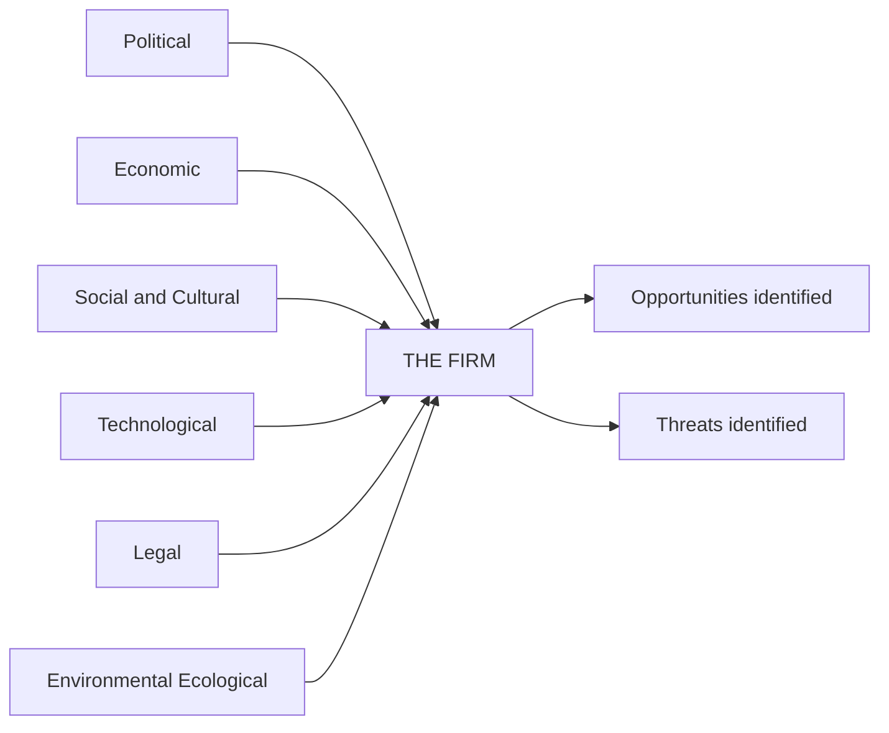
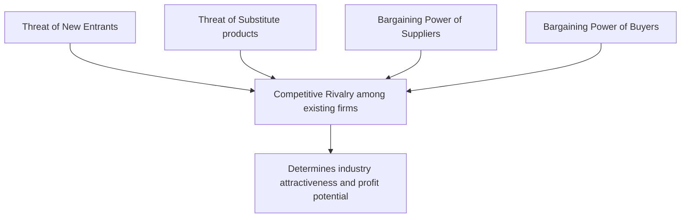
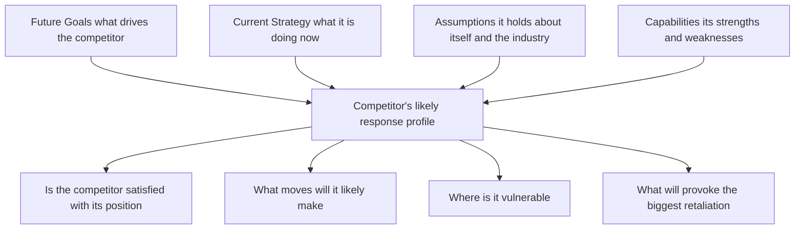
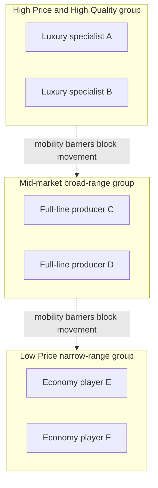

# Chapter 11 — SM: Analysis of the External Environment

## 1. The Problem

Sit in the CEO's chair of a mid-sized Indian company for a moment. You control a great deal: your factories, your people, your prices, your marketing budget, your product roadmap. These are the things *inside* your boundary — your resources and capabilities. If the entire universe of business were just this inside world, strategy would be simple: get better at what you do, cut costs, work harder.

But every serious business failure in history was killed by something the CEO did **not** control.

- Kodak did not lose because its film got worse — it lost because *digital photography* arrived outside its walls and destroyed the need for film.
- Indian film-camera dealers, video-cassette libraries, PCO/STD booths, and typewriter makers did not become lazy — a **technological** shift outside them dissolved their entire reason to exist.
- A perfectly efficient thermal-power company can be hammered by a new **environmental** regulation, a spike in **imported coal** prices, or a government **subsidy** redirected to solar.

Here is the uncomfortable truth that defines this chapter: **opportunities and threats do not come from inside the firm. They arise entirely outside it — in the environment.** A firm's own strengths and weaknesses live inside; its opportunities and threats live outside. You can be the strongest player in your industry and still be wiped out by a change you never saw coming.

So the strategic manager faces a hard problem. The outside world is:

- **Vast** — economy, politics, technology, society, law, ecology, competitors, suppliers, buyers, substitutes… where do you even start?
- **Fast-changing** — what was true last year is false today.
- **Ambiguous** — the same event (say, a recession) is a threat to one firm and an opportunity to another.
- **Uncontrollable** — you cannot change GDP growth or a court judgment; you can only *anticipate* and *position* for it.

The manager cannot simply "watch everything." That produces a fog of trivia, not strategy. What is needed is a **disciplined way to look outside** — to scan the environment, sort the signals from the noise, and convert raw external facts into two precise strategic outputs: *opportunities to exploit* and *threats to defend against*. That conversion process is called **environmental analysis** or **environmental scanning**, and it is the subject of this chapter.

The reason this comes so early in strategy is structural. Strategy is the art of matching the firm to its environment. You cannot decide *where to compete* or *how to compete* until you understand the terrain you are competing on. Analysis of the external environment is the map-making step that must precede every strategic choice.

---

## 2. The Core Idea — Analogy

Think of a **ship's captain planning a voyage.**

The captain knows his own vessel intimately — its engine power, hull strength, crew skill, fuel reserves. That is the *internal* environment. But no captain plans a route by staring only at his own ship. He studies the **sea and the sky**: the weather ahead, the currents, the depth of water, the rocks, the pirates, the other ships competing for the same trade route.

Crucially, the captain organises this scan into **layers**, from far to near:

- **The distant weather system** — a monsoon forming a thousand miles away. It doesn't touch him today, but it shapes everything. He can do nothing to change it; he can only prepare. This is the **macro-environment** (PESTLE).
- **The immediate waters** — the specific rocks, the narrow strait, the rival ships jostling for the same harbour right now. This is his **industry environment** (Porter's Five Forces).
- **That one particular rival ship** shadowing him, whose captain he must out-think move by move. This is **competitor analysis**.

Notice three things the captain understands instinctively, which map exactly onto environmental analysis:

1. **He cannot control the sea, only read it.** The environment is a *given*; strategy is the *response*.
2. **The same weather is opportunity for one ship, threat for another.** A strong tailwind speeds a well-rigged ship and capsizes a badly-rigged one. Environment has no fixed meaning — it acquires meaning only in relation to a specific firm's strengths.
3. **He scans in layers because the layers behave differently.** Distant weather is slow, broad, and uncontrollable; the rival ship is immediate, specific, and interactive. Using one tool for both would be foolish. This is exactly why we have *different frameworks* for the macro layer (PESTLE) and the industry layer (Five Forces).

The whole chapter is simply the captain's disciplined scan, formalised into named tools.

---

## 3. Why It's Built This Way

Why do we need frameworks at all? Why not just "keep an eye on things"?

Because the human mind, left unstructured, scans the environment **lazily and with bias**. A manager will notice the competitor who just cut prices (dramatic, immediate) and completely miss the demographic shift quietly hollowing out his customer base over a decade. Frameworks exist to force *completeness* and *discipline* — to make you look in the corners you would naturally ignore.

**Why layer the environment (macro vs. industry vs. competitor)?** Because the layers differ on two axes that matter enormously for how you respond:

| Layer | How far from the firm | Can the firm influence it | Right tool |
|---|---|---|---|
| Macro-environment | Remote, affects all industries | Almost never — only adapt | PESTLE |
| Industry environment | Close, specific to your sector | Partially — through strategy | Porter's Five Forces |
| Competitor/immediate | Direct rivalry, firm-vs-firm | Yes — move and counter-move | Competitor & strategic-group analysis |

A single tool cannot handle all three, because a monsoon and a rival ship demand different kinds of thinking. So strategy uses a **telescope for the far layer and a microscope for the near layer.**

**Why does each framework decompose the world into a fixed list of forces or factors?** Because a checklist is the enemy of blind spots. PESTLE's six letters guarantee you will not forget the *legal* dimension just because you were obsessed with *technology*. Porter's five forces guarantee you will not price your product purely against direct rivals while ignoring the *substitute* that is about to make your whole category obsolete. The list is a discipline device, not a bureaucratic ritual.

**Why analyse threats *and* opportunities from the same scan?** Because they are the same facts viewed through the lens of a specific firm's capabilities. An ageing population is a threat to a toy company and a golden opportunity to a healthcare firm. The scan produces neutral facts; the firm's own profile converts each fact into O or T. This is precisely why external analysis (this chapter) feeds directly into SWOT — the O and T half of SWOT *is* the output of environmental scanning.

---

## 4. Full Technical Content

### 4.1 What environmental scanning is, and its purpose

**Environmental scanning** is the process of monitoring, evaluating, and disseminating information from the external (and internal) environment to key people within the firm. Its purpose is to give **early warning** of threats and **early sighting** of opportunities, so the firm can respond *before* the change fully arrives rather than after it has done damage.

A well-run scan looks for four things (a useful checklist):

1. **Events** — important and specific occurrences (a new tax, a competitor's product launch).
2. **Trends** — the general direction in which events are moving (rising urbanisation, falling data prices).
3. **Issues** — a concern or debate arising from trends/events (data-privacy debate).
4. **Expectations** — the demands made by interested groups (stakeholders wanting greener products).

The environment is conventionally split into:

- **Micro (task/operating) environment** — the actors *close* to the firm that affect its ability to serve customers: suppliers, customers, competitors, market intermediaries, financiers, the public. These are firm-specific and partly influenceable.
- **Macro (general/remote) environment** — the broad forces affecting *all* firms in a society: analysed via PESTLE. Uncontrollable; the firm can only adapt.

### 4.2 The macro-environment — PESTLE analysis

**The problem PESTLE solves:** the macro-environment is enormous and the manager needs a *complete, memorable checklist* so that no major category of external force is forgotten. PESTLE (an extension of the older PEST) breaks the remote environment into **six factor-groups**. It is a **checklist framework**, not a predictive model — its job is coverage, not calculation.

*Figure 1 — PESTLE surrounds the firm with six factor-groups the manager must scan; the scan is only complete when each has been turned into a specific opportunity or threat.*

| Letter | Factor group | What it covers | WHY it matters / what it signals |
|---|---|---|---|
| **P** | Political | Government stability, political ideology, centre-state relations, taxation policy, foreign-trade regulations, "Make in India" and similar drives, government attitude to the industry | Signals the *rules of the game* set by the State — who can enter, what is taxed, what is favoured. Shifts here can create or destroy entire markets overnight |
| **E** | Economic | GDP growth, inflation, interest rates, exchange rates, disposable income, credit availability, business cycle stage, fiscal & monetary policy | Signals the *size and health of demand* and the *cost of capital and inputs*. Determines whether customers can afford you and whether financing is cheap |
| **S** | Social / Socio-cultural | Demographics (age, urbanisation, population growth), lifestyle changes, education levels, attitudes, tastes, values, family structures | Signals *what people want and how many of them* — the deep, slow-moving driver of demand patterns. Easy to ignore, deadly when missed |
| **T** | Technological | Rate of innovation, R&D activity, automation, new production/IT methods, obsolescence of existing tech, digital disruption | Signals both *threat of obsolescence* and *opportunity for new products/processes*. The fastest and most disruptive macro force |
| **L** | Legal | Company law, competition law, consumer-protection law, labour law, environmental law, contract enforcement, IPR protection, product-safety norms | Signals *compliance obligations and legal risk*. Overlaps with Political but focuses on the *specific enforceable rules* the firm must obey |
| **E** | Environmental / Ecological | Climate change, pollution norms, carbon regulation, availability of natural resources, weather, sustainability expectations, waste-disposal rules | Signals *sustainability constraints and green opportunities*. Increasingly decisive — non-compliance can shut a plant; green positioning can win markets |

**How to actually use PESTLE (the discipline):**
1. List the relevant factors under each of the six heads.
2. For each factor, assess the *direction* and *likely impact* on the firm.
3. Classify each as an **opportunity** or a **threat** *for this specific firm*.
4. Judge *timing* and *importance* — not every factor is equally urgent.
5. Feed the result into SWOT and strategy formulation.

The single most common PESTLE error is stopping at *description* ("interest rates are rising"). The framework only delivers value when you convert the fact into a firm-specific **implication** ("rising rates raise our cost of capital and slow our customers' vehicle purchases — a threat to our auto-finance arm").

### 4.3 The industry environment — Porter's Five Forces

**The problem this solves:** PESTLE tells you about the weather over the whole economy, but not *why some industries are chronically profitable and others chronically poor.* Airlines routinely lose money; branded pharmaceuticals and premium software earn rich, durable returns. This difference is not luck and not management quality — it is **structural**. **Michael E. Porter** (Harvard Business School, *Competitive Strategy*, 1980) argued that the profitability of an industry is determined by **five competitive forces** that together set the intensity of competition and the ceiling on prices. The stronger the forces, the more they *squeeze* the profit out of the industry; the weaker they are, the more profit the incumbents get to keep.

The core insight: **an industry's profit potential is not fixed — it is shaped by five forces, and strategy is the art of positioning the firm where those forces are weakest, or of actively reshaping the forces in your favour.**

*Figure 2 — Porter's Five Forces: four surrounding forces press in on the central rivalry, and together they set how much profit the industry can retain.*

**Force 1 — Threat of New Entrants (potential competition).**
New entrants bring extra capacity, want market share, and often cut prices to get in — all of which *reduces* incumbents' profits. What holds them back is **barriers to entry**. High barriers → low threat → incumbents protected → higher profits. Key barriers: **economies of scale** (new entrant must enter big or bear a cost disadvantage), **capital requirements**, **product differentiation / brand loyalty**, **switching costs** for customers, **access to distribution channels**, **government policy and licensing**, and **cost advantages independent of scale** (patents, proprietary technology, location, experience curve).
*Signal:* Low barriers signal that any profits will quickly attract entrants who compete them away — the industry cannot hold onto high returns.

**Force 2 — Bargaining Power of Suppliers.**
Powerful suppliers extract value by charging high prices or reducing quality/service, squeezing the industry's margins. Suppliers are powerful when: they are **few and concentrated** (fewer than the industry they sell to), their input is **critical / has no substitute**, **switching costs** to change supplier are high, they can credibly **threaten forward integration**, and the industry is *not* an important customer to them.
*Signal:* Strong supplier power signals that value created in the chain will be captured *upstream*, not by your industry — margins leak to suppliers.

**Force 3 — Bargaining Power of Buyers (customers).**
Powerful buyers force prices down, demand more quality/service, and play competitors against each other — all at the expense of industry profit. Buyers are powerful when: they are **few or buy in large volumes**, the product is **standardised/undifferentiated** (so they can switch freely), their **switching costs are low**, they earn **low profits** (making them price-sensitive), they can credibly **threaten backward integration**, and the product is **unimportant to their quality** or is a large fraction of their cost.
*Signal:* Strong buyer power signals value is captured *downstream* by customers; the industry becomes a price-taker.

**Force 4 — Threat of Substitute Products.**
Substitutes are products from *other industries* that perform the same function (tea vs coffee, video-conferencing vs air travel, plastic vs aluminium). They place a **ceiling on the price** the industry can charge — raise your price above the point where the substitute becomes attractive and buyers defect. The threat is high when the substitute offers a better **price-performance trade-off** and switching costs are low.
*Signal:* Strong substitute threat caps industry pricing power and profitability, however friendly the rivalry among direct competitors may be. This is the force managers most often forget.

**Force 5 — Competitive Rivalry among Existing Firms (the central force).**
This is the intensity of direct jockeying — price wars, advertising battles, new products, better service. High rivalry competes profits away. Rivalry is intense when: there are **many or equally balanced competitors**, industry **growth is slow** (so share must be *taken* from rivals), **fixed costs or storage costs are high** (pressure to fill capacity by cutting price), products **lack differentiation / have low switching costs**, capacity must be added in **large increments**, competitors are **diverse** in strategy/origin, **strategic stakes are high**, and **exit barriers are high** (firms stay and fight even while losing money).
*Signal:* The other four forces feed into rivalry; high overall force levels manifest as bloody competition and thin margins.

**Putting the model to work.** Porter's rule of thumb: *the stronger the collective forces, the lower the industry's profitability.* An "attractive" industry is one where the forces are **weak** (high entry barriers, weak buyers and suppliers, few substitutes, gentle rivalry). Strategy then means (a) **positioning** the firm where the forces are weakest, (b) **exploiting change** in the forces before rivals do, or (c) **reshaping** the forces in your favour (e.g., raising switching costs to weaken buyer power, building scale to raise entry barriers).

> **Note on the "sixth force."** Later strategists (Andrew Grove and others) argue **complementors** — makers of complementary products (apps for a phone, fuel stations for cars) — form a sixth force. ICAI treats the classical model as *five* forces; know complementors as an extension, not a replacement.

### 4.4 Competitor analysis

The Five Forces describe the industry *structure*; competitor analysis zooms into **specific rival firms** so you can anticipate their moves. Porter proposed profiling each major competitor on **four components**:

*Figure 3 — Porter's competitor-analysis framework: two "what it wants" components and two "what it can do" components combine to predict a rival's behaviour.*

- **Future goals** — what drives the competitor (growth? cash? prestige?). Tells you whether it is content or hungry, and how it will react to pressure.
- **Current strategy** — what it is actually doing now (its business model and how it competes). The baseline you must out-manoeuvre.
- **Assumptions** — the beliefs it holds about itself and the industry. Blind spots here are *your* opportunity: a rival who wrongly believes "customers will never switch" is exposed.
- **Capabilities** — its genuine strengths and weaknesses, which set the limits of how hard and fast it can respond.

Combining these answers the practical questions: *Is the rival satisfied? What moves will it make? Where is it vulnerable? What will provoke fierce retaliation?* Good competitor analysis lets you **act while the rival is slow, and avoid poking a rival who will retaliate brutally.**

### 4.5 Strategic groups

Rarely do all firms in an industry compete the same way. Within one industry, clusters of firms follow *similar strategies* along key dimensions (price/quality positioning, breadth of product line, geographic reach, distribution channel, degree of vertical integration). Each cluster is a **strategic group**.

A **strategic group map** plots firms on two strategic dimensions (e.g. price vs. product range), revealing the competitive structure *inside* the industry. Its uses:

- Your **closest rivals** are the firms in *your* strategic group — they compete for the same customers in the same way. Rivalry is fiercest *within* a group.
- **Mobility barriers** are the obstacles preventing a firm from moving from one group to another (e.g. a mass-market carmaker cannot easily jump into the luxury group — it lacks brand, dealers, engineering). These are like entry barriers *inside* an industry.
- Empty spaces on the map may signal **unserved market opportunities**; crowded cells signal **fierce competition**.
- The five forces often press on *different groups with different intensity* — a premium group may be shielded from substitutes and buyer power that batter the mass-market group.

*Figure 4 — A strategic-group map clusters firms by similar strategy; mobility barriers keep a firm from jumping groups, and rivalry is hottest within each cluster.*

---

## 5. Worked Examples / Applied Cases

### Case A — PESTLE scan for an Indian electric-vehicle (EV) two-wheeler start-up

The founder must decide whether to invest ₹300 crore in a new EV scooter plant. Before touching a spreadsheet, she runs a PESTLE scan and, crucially, converts each factor into an **O or T** for *her* firm.

| Factor | Observation | Opportunity or Threat |
|---|---|---|
| **Political** | Government "FAME" subsidy and state EV policies push clean mobility | **Opportunity** — subsidies lower effective customer price and boost demand |
| **Economic** | Rising petrol prices; but high interest rates raise financing cost for buyers | Mixed — fuel savings are an **opportunity**; costly EMIs a **threat** |
| **Social** | Young urban buyers increasingly climate-conscious and status-seeking on "new tech" | **Opportunity** — target demographic wants exactly this product |
| **Technological** | Battery costs falling ~annually; but charging-infra still thin | Falling cells = **opportunity**; sparse charging = **threat** to adoption |
| **Legal** | Tightening emission and safety-certification norms | **Opportunity** — hurts petrol rivals more than EVs; raises entry barrier |
| **Environmental** | Pollution norms and city bans on old ICE vehicles | **Opportunity** — regulation actively pushes customers toward EVs |

**Reading the scan:** the macro-environment is *strongly favourable* — most forces convert to opportunities, and even the threats (charging, EMIs) are the *general* barriers to the category, not specific to this firm. Verdict: proceed to the industry-level analysis. Notice the framework did its job — it forced her to spot that *legal* certification norms are actually an ally (they hurt incumbents more), a point pure enthusiasm would miss.

### Case B — Five Forces analysis of the Indian civil-airline industry (why it loses money)

A classic exam scenario: "Using Porter's model, explain why Indian airlines struggle to make sustained profit."

| Force | Assessment for airlines | Why it hurts profit |
|---|---|---|
| **Threat of new entrants** | Moderate-high — capital-heavy, but aircraft can be *leased*, and open-sky policy lowers barriers | New carriers repeatedly enter and trigger price wars |
| **Supplier power** | **Very high** — only Boeing/Airbus (aircraft), monopoly fuel suppliers, and airport operators; fuel is a huge, uncontrollable cost | Value leaks upstream to fuel and aircraft suppliers |
| **Buyer power** | **High** — price-transparent online booking, near-zero switching cost, price-sensitive leisure travellers | Buyers force fares down to marginal cost |
| **Threat of substitutes** | Growing — premium trains, video-conferencing for business travel | Caps the fares airlines can charge on short routes |
| **Rivalry** | **Intense** — many balanced players, undifferentiated seats, high fixed costs, empty seats perish daily, high exit barriers (lease commitments) | Relentless price wars; capacity dumped at any price to fill seats |

**Conclusion:** *four of the five forces are strong.* High supplier and buyer power squeeze both ends, substitutes cap the top, and brutal rivalry finishes the job. Structurally, the airline industry gives away almost all the value it creates — which is exactly why even well-run carriers earn thin, volatile profits. **This demonstrates Porter's central claim: profitability is set by structure, not effort.** A strategist's response: escape the worst force (e.g., differentiate to weaken buyer power via loyalty programmes, or dominate a route to raise entry barriers).

### Case C — Strategic groups and competitor analysis in the Indian passenger-car market

A new entrant wants to know *where* to compete and *whom* it will really fight.

**Strategic-group map (dimensions: price positioning × product-line breadth):**

- **Group 1 — Mass-market, broad line:** Maruti Suzuki, Hyundai, Tata — wide range, value pricing, huge dealer/service networks.
- **Group 2 — Premium/luxury, narrow line:** Mercedes, BMW, Audi — high price, prestige brand, exclusive dealers.
- **Group 3 — Value/utility niche:** budget-focused, narrow economy range.

**Insights the map yields:**
1. If the entrant positions as a value hatchback, its **real rivals are Group 1**, not the luxury brands — rivalry is *within* the group.
2. **Mobility barriers** into Group 2 are steep: brand heritage, engineering, and an exclusive dealer network cannot be bought quickly — so the entrant cannot simply "move upmarket" to escape competition.
3. The mass-market group faces **high buyer power and intense rivalry** (thin margins, price wars); the luxury group is partly shielded — its buyers are less price-sensitive and substitutes are weaker.

**Competitor analysis of the leading rival (Maruti), using Porter's four components:**

- **Future goals:** defend dominant market share and volume leadership → it will *fiercely retaliate* against any share grab.
- **Current strategy:** value pricing + unmatched service network + fuel efficiency.
- **Assumptions:** believes its service-network moat is unassailable — a possible *blind spot* if EVs and app-based service reduce the value of physical networks.
- **Capabilities:** enormous scale, deep pockets, entrenched distribution — it can sustain a price war longer than a new entrant.

**Strategic conclusion:** a head-on price war with Maruti in its core group is suicidal (it can outlast you and will retaliate). The intelligent play is to **attack the assumption/blind spot** — e.g., an EV or digitally-serviced model where Maruti's physical-network advantage matters less. This is competitor analysis converting into an actual strategy.

---

## 6. Framework Summary / How to Present It in the Exam

When a question says "analyse the external environment of X," structure your answer in **layers, outer to inner**, and always end each layer with the O/T or profitability implication.

| Layer | Framework | Author | Core question it answers | Output |
|---|---|---|---|---|
| Macro / remote | **PESTLE** | (evolved from Aguilar's ETPS / PEST) | What broad forces affect *all* firms and how do they affect *us*? | Opportunities & Threats |
| Industry | **Five Forces** | Michael Porter, 1980 | How attractive/profitable is this industry and why? | Industry attractiveness; where to position |
| Sub-industry structure | **Strategic Group Map** | Porter / Hunt | Who are our *closest* rivals; where are the gaps? | Nearest competitors; mobility barriers; white space |
| Individual rival | **Competitor Analysis (4 components)** | Michael Porter | What will a specific rival do next? | Predicted moves; vulnerabilities |

**A model exam answer template:**
1. State *why* scanning matters (opportunities/threats arise outside the firm).
2. Run **PESTLE** — one line per letter, each ending in "…which is an opportunity/threat because…".
3. Run **Five Forces** — rate each force high/medium/low with a *reason*, then conclude on industry attractiveness.
4. Add **competitor / strategic-group** insight if the question is firm-specific.
5. Close by **converting the analysis into a strategic implication** — never leave the analysis hanging.

The examiner rewards the *reasoning and the implication*, not the mere listing of the six letters or five forces.

---

## 7. Connections

- **To SWOT / internal analysis:** External analysis produces the **O and T**; internal analysis (resources, capabilities, value chain) produces the **S and W**. Together they form the SWOT that drives strategy formulation. This chapter is literally the right-hand half of SWOT.
- **To strategic management process:** Environmental scanning is **stage two** of the strategic-management process (after establishing vision/mission and objectives, before strategy formulation). You cannot formulate strategy without first analysing the environment.
- **To competitive strategy (generic strategies):** Porter's Five Forces (this chapter) leads directly into Porter's *generic strategies* — cost leadership, differentiation, focus — which are the **responses** a firm chooses to defend against the five forces. Analysis here; prescription there.
- **To corporate/business-level strategy:** Strategic-group and competitor analysis inform *where to compete* (corporate strategy) and *how to compete* (business strategy).
- **To FM (capital budgeting, Chapter 06):** The *economic* factor of PESTLE (interest rates, growth) and industry attractiveness feed the demand forecasts and discount rates behind every NPV. Weak industry structure means fragile cash flows — external analysis is the reality-check on optimistic projections.

---

## 8. Traps & Examiner Tricks

1. **Describing instead of implying.** Writing "GDP is growing at 7%" earns little. You must add the *firm-specific implication* — "…which expands disposable income and is an opportunity for our premium product." PESTLE without O/T conversion is half an answer.
2. **Forgetting substitutes.** The most-missed force. Students analyse direct rivals and suppliers but forget that a product from *another industry* caps their prices. Always ask: "what else could the customer buy instead of this whole category?"
3. **Confusing competitors (rivalry force) with substitutes.** Rivalry = other firms making the *same* product (Pepsi vs Coke). Substitutes = *different* products meeting the same need (juice, water vs cola). Examiners love this distinction.
4. **Confusing new entrants with existing rivals.** New entrants are *potential/future* competitors kept out by barriers; rivalry is *current* competition. Different force, different logic.
5. **Getting the profitability logic backwards.** Remember: **strong forces = LOW profit** (they squeeze you); **weak forces = HIGH profit**. An "attractive" industry has *weak* forces. Students often invert this.
6. **Confusing PESTLE's Political and Legal, or PESTLE with the micro-environment.** Political = government stance/policy/ideology; Legal = specific enforceable laws. And PESTLE is *macro* — suppliers, customers and competitors belong to the *micro* environment and are handled by Five Forces, not PESTLE.
7. **Treating the environment as having one fixed meaning.** The same factor is an opportunity for one firm and a threat for another. An answer that says "recession is a threat" without asking "to whom?" misses the point — for a discount retailer, recession is an opportunity.
8. **Naming the wrong author.** Five Forces = **Michael Porter (1980)**. Do not attribute it to Ansoff or Mintzberg. Competitor-analysis four-components and strategic groups are also Porter. PESTLE evolved from Francis Aguilar's ETPS. Wrong attribution loses easy marks.
9. **Listing barriers to entry as if they help entrants.** High barriers *protect incumbents* and *deter* entrants — they *reduce* the threat of new entrants and *raise* incumbent profits. Students sometimes reverse the direction.
10. **Ignoring that the firm can reshape forces.** Five Forces is not a fatalistic verdict. Strong firms *change* the structure — building scale to raise entry barriers, creating switching costs to weaken buyer power. The best answers show strategy *acting on* the forces, not just enduring them.

---

## 9. First-Principles Recap

Strip everything away and this chapter rests on one chain of logic:

1. A firm's **survival depends on matching itself to a world it does not control.**
2. That world's *opportunities and threats* originate **outside** the firm — so the firm must deliberately **look outside** (scan the environment), because the untrained mind scans lazily and misses slow, non-dramatic dangers.
3. The outside world has **layers** that behave differently (remote vs. industry vs. rival), so we use **different tools per layer** — a telescope (PESTLE) for the far layer, a microscope (Five Forces, competitor analysis) for the near layer.
4. **PESTLE** is a *completeness checklist* — six factor-groups so no macro force is forgotten; its output is a list of firm-specific opportunities and threats.
5. **Porter's Five Forces** explains *why some industries are structurally richer than others*: five forces squeeze industry profit, so attractiveness is high only where the forces are weak. Strategy = position where forces are weakest, or reshape the forces.
6. **Competitor analysis and strategic groups** sharpen the focus to the *specific rivals* you actually fight, predict their moves, and reveal white space and mobility barriers.
7. Every framework is worthless until its output is **converted into a strategic implication** — an opportunity to seize or a threat to defend. Analysis that does not change a decision is just description.

If you internalise only one sentence: *strategy is the disciplined act of reading a world you cannot control and positioning a firm you can.*

---

## 10. Quick-Revision Sheet

**Why scan?** Opportunities & threats arise *outside* the firm (strengths & weaknesses are inside). Scanning gives early warning of threats and early sight of opportunities. Environment = micro (task: suppliers, customers, competitors — partly controllable) + macro (general: PESTLE — uncontrollable). Scan for **events, trends, issues, expectations**.

**PESTLE (macro checklist):**
| Letter | Factor | Signals |
|---|---|---|
| P | Political | Govt stability, ideology, policy, taxation, trade rules |
| E | Economic | GDP, inflation, interest & exchange rates, income, cycle |
| S | Social | Demographics, lifestyle, values, tastes, education |
| T | Technological | Innovation rate, automation, obsolescence, digital disruption |
| L | Legal | Company/competition/labour/consumer/IPR laws |
| E | Environmental | Climate, pollution norms, resources, sustainability |
*Always convert each factor into a firm-specific O or T.*

**Porter's Five Forces (industry attractiveness — Michael Porter, 1980):**
| Force | Strong when… | Signals |
|---|---|---|
| New entrants | Low entry barriers (scale, capital, brand, distribution, policy) | Profits attract entrants, competed away |
| Supplier power | Few, critical input, no substitute, can forward-integrate | Value leaks upstream |
| Buyer power | Few/large buyers, standard product, low switching cost | Value captured downstream; price-taker |
| Substitutes | Better price-performance alternative from another industry | Caps industry pricing |
| Rivalry | Many/balanced firms, slow growth, high fixed & exit costs, no differentiation | Price wars, thin margins |
**Golden rule: strong forces → LOW profit; weak forces → HIGH profit. Attractive industry = weak forces.**

**Competitor analysis (Porter, 4 components):** Future goals + Current strategy + Assumptions + Capabilities → predict rival's moves, spot blind spots and vulnerabilities.

**Strategic groups:** clusters of firms with similar strategies; closest rivals are *within* your group; **mobility barriers** block movement between groups; empty cells = white-space opportunity.

**Author cheat-sheet:** Five Forces, generic strategies, competitor analysis, strategic groups → **Michael Porter**. PESTLE → evolved from Aguilar's ETPS/PEST. Sixth force (complementors) → Grove (extension only).

**One-line essence:** Read the world you cannot control (PESTLE + Five Forces + competitor analysis); position the firm you can — and always end analysis with an opportunity to seize or a threat to defend.
