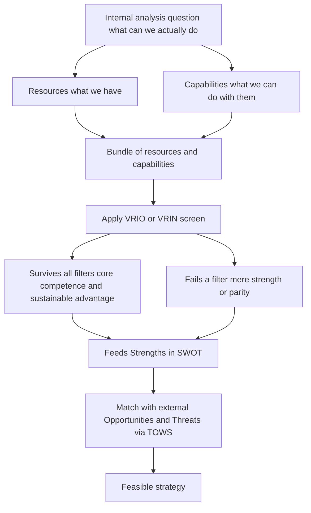
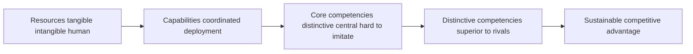
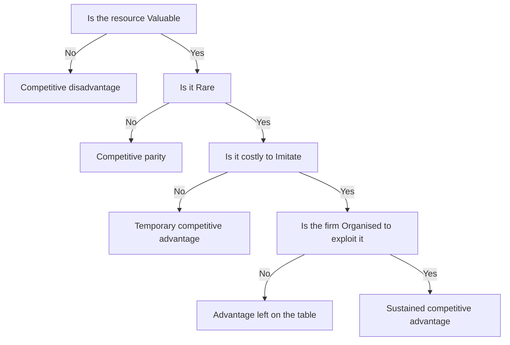
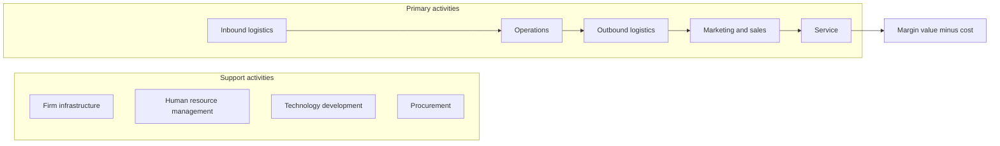
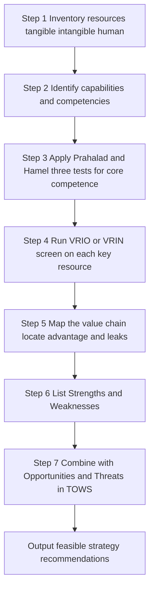

<!-- v2-deep -->

# Chapter 12 — SM: Analysis of the Internal Environment

## 1. The Problem

A strategist who has just finished scanning the *outside* world — the industry structure, the five forces, the PESTLE trends, the moves of rivals — holds half a map. The external scan tells you what the terrain looks like: where the mountains of competition are, where the rivers of demand flow, where the weather of regulation is turning. But it says nothing about **your own army**. It cannot tell you whether *you* are equipped to take a particular hill.

Two firms staring at the *same* external environment should often adopt *different* strategies — and the reason lies entirely inside them. Consider two players in Indian aviation looking at the identical opportunity of rising domestic air travel. One has a lean, single-fleet, low-cost operating machine tuned over a decade; the other carries a bloated cost base, mixed fleet, and legacy labour contracts. The opportunity is the same; the *feasible* response is not. The low-cost carrier can profitably chase price-sensitive fliers; the legacy carrier that copies that move bleeds to death. **The external environment defines what is attractive; the internal environment defines what is achievable.** Strategy is the marriage of the two — and a strategy that is attractive but not achievable is a fantasy.

This is why we must now look *inward*. The internal analysis answers a deceptively simple question: **What can this firm actually do better than, worse than, or the same as its rivals — and which of those differences can be turned into a durable advantage?** Three sub-questions follow:

1. **What do we have?** — the stock of resources and capabilities.
2. **Which of these are genuinely special?** — the test that separates ordinary strengths from *competitive advantage*.
3. **Where in our activities is value actually created or destroyed?** — the anatomy of the firm as a chain of value-adding steps.

Get the inward look wrong and every downstream decision is poisoned. A firm that mistakes a common capability for a rare one will pick a strategy it cannot defend; a firm blind to its own weakness will walk into a war it cannot win. The discipline that prevents this is **internal environment analysis**, and its ultimate payoff is the *inside-out* view of competitive advantage: the idea that lasting advantage grows not from picking a nice industry, but from owning something rivals cannot easily copy.

**A finer framing of the same problem — the two schools of strategy.** There are, historically, two rival explanations for why some firms out-earn others. The **positioning school** (Porter's Five Forces, external analysis) says advantage comes from *where you sit* — pick an attractive industry and defend a good position in it. The **Resource-Based View** (this chapter) says advantage comes from *what you own* — a bundle of resources rivals cannot copy. The exam-mature answer is that these are *complements, not rivals*: the outside tells you which games are worth playing; the inside tells you which games you can win. Internal analysis is the RBV half of that story, and it exists precisely because the positioning school could not explain why two firms in the *identical* position still earn differently. That residual, unexplained gap is what forces the strategist to look inward — and it is the intellectual seed of everything in this chapter.

---

## 2. The Core Idea (Analogy)

Think of a firm as a **professional kitchen preparing to enter a cooking competition**.

The external analysis (the previous chapters) told the head chef about the *competition itself*: the judges' tastes, the rival kitchens, the trend toward regional cuisine, the price of saffron this season. Useful — but it says nothing about whether *this* kitchen can win.

So the chef turns around and audits the kitchen:

- **Resources** are what the kitchen simply *has*: the ovens, the knives, the pantry of ingredients, the cash to buy more, the brand name on the door, the trained brigade of cooks, the secret family recipe locked in the safe. Some are tangible (the copper pans), some intangible (the reputation, the recipe).
- **Capabilities** are what the kitchen can *do* by putting resources to work in a coordinated way: plate two hundred covers an hour without a dropped dish, invent a new dish under time pressure, source the freshest fish before rivals get to the market. A pile of good knives is a resource; the *ability to butcher a whole tuna in four minutes* is a capability.
- **Core competence** is the one or two things the kitchen does so distinctively well that they define who it is — say, a mastery of fermentation that no rival can match, learned over twenty years, embedded in the tacit know-how of the team. It is a capability that is *central* to competing, *hard to imitate*, and *transferable* across many dishes on the menu.

Now the crucial test. A rival can buy the same ovens tomorrow. A rival can copy the plating within a week. But the twenty-year fermentation know-how, tangled up in the team's shared habits and the chef's palate? That cannot be bought, copied, or poached wholesale. **That** — and only that — is what wins competitions year after year. The whole of internal analysis is the chef learning to tell the difference between the ovens (nice, but everyone has them) and the fermentation mastery (rare, precious, and the true source of victory).

And to find *where* the magic happens, the chef walks the line from delivery door to dining table — receiving, storing, prepping, cooking, plating, serving — asking at each station: *does value get added here, is it a cost sink, and how do we compare to the kitchen next door?* That walk is **value chain analysis**.

**Pushing the analogy to its exam-relevant edges.** Three subtleties the metaphor also captures — and the examiner tests:

- **Why "poach the chef" rarely works.** A rival that lures away the head chef does *not* automatically acquire the fermentation mastery, because the mastery lives in the *team's shared routines*, not in one person's head. This is **social complexity** and **causal ambiguity** made concrete — the advantage is a property of the *system*, not of any transferable part. This is exactly why sustainable advantage survives even the loss of star employees.
- **The idle oven earns nothing.** A kitchen can own the best oven in the city and still lose if the brigade cannot coordinate around it. Owning the resource is worthless without the *organisation* to exploit it — the **O** in VRIO, dramatised. A resource unused is a resource wasted.
- **Yesterday's signature dish is today's table stakes.** The dish that won last year is now on every rival's menu. A capability that was once *rare* decays to *parity* as the market copies it. Advantage is not a trophy on the shelf; it is a perishable good that must be continually renewed — which is why the chef never stops auditing.

---

## 3. Why It's Built This Way

**Why look inward at all, when the external world is where customers and rivals live?** Because of a hard empirical fact that reshaped strategy in the 1980s and 90s: firms in the *same* industry, facing the *same* forces, earn *persistently different* profits. If industry structure explained everything, all airlines would earn alike — they don't. The gap must come from *inside*: from differences in what firms own and can do. This insight gave rise to the **Resource-Based View (RBV)** of the firm, whose banner claim is that competitive advantage is rooted in a firm's bundle of resources and capabilities, not merely in its industry position.

**Why distinguish resources from capabilities so pedantically?** Because owning a thing is not the same as being able to *use* it well. Two firms may hold identical assets and earn wildly different returns because one has the organisational skill to weave those assets into something customers pay for. Resources are nouns; capabilities are verbs; advantage lives in the verbs. A resource sitting idle earns nothing.

**Why do we need a formal test like VRIO/VRIN?** Because managers systematically over-rate their own strengths. Everything the firm is good at *feels* like an advantage. But most strengths are merely **competitive parity** — necessary to play, insufficient to win, because rivals have them too. The VRIO screen exists to be *ruthless*: it strips away the flattering self-assessment and asks the cold question, *would a rival struggle to replicate this?* Only resources that survive all four filters deserve the label "sustainable competitive advantage." The test is deliberately hard because advantage, by definition, is scarce.

**Why the value chain, rather than just looking at the firm as a whole?** Because "we are efficient" is a useless statement for a manager who wants to *act*. Advantage is not a fog that hangs over the whole company; it is created at *specific activities* and destroyed at others. To manage it you must disaggregate the firm into the discrete activities where costs are incurred and value is added, so you can see *precisely* which link in the chain is your source of edge and which is a leak. Michael Porter built the value chain to make advantage *locatable* and therefore *manageable*.

**Why end with SWOT/TOWS?** Because the inward look and the outward look must eventually be *joined*. Strengths and weaknesses (internal) mean nothing until matched against opportunities and threats (external). The purpose of internal analysis is not a list of strengths for its own sake — it is to feed a *synthesis* that produces action. SWOT collects the four; TOWS forces you to *combine* them into strategies. The whole chapter is built to end there because that is where analysis becomes strategy.

**Why does the RBV insist advantage be *sustainable*, not merely present?** Because a one-off advantage that rivals erase next quarter changes nothing about long-run profits. The whole architecture — rarity, inimitability, non-substitutability — is engineered to isolate the *durable* subset of strengths. Economists call the underlying idea **isolating mechanisms**: barriers that stop the normal process of competition from bidding your excess profit away to zero. Every filter after "Valuable" is really a different isolating mechanism in disguise. This is *why* the screen is cumulative and *why* inimitability sits at its heart.

**Why capabilities can also be a *trap* — the core-rigidity idea.** A competence built and rewarded over decades becomes so embedded that the firm cannot let it go when the world changes. Yesterday's **core competence** hardens into today's **core rigidity**: Kodak's mastery of film chemistry became the very thing that blinded it to digital. The exam point is subtle but examinable — a strength is not permanently a strength; the *same* deep capability that wins in one era can trap the firm in the next. This is *why* internal analysis is a continuous audit, never a one-time verdict.

*Figure 12.1 — The inside-out logic: from what the firm owns, through the screen that finds what is special, to a strategy matched against the outside world.*

---

## 4. Full Technical Content

### 4.1 Resources — the raw stock

A **resource** is any asset, tangible or intangible, that a firm owns or controls and can deploy to conceive and execute strategy. Resources fall into three families:

| Family | Nature | Examples |
|---|---|---|
| **Tangible** | Physical, countable, on the balance sheet | Plant and machinery, land, cash, raw material stock, distribution network hardware |
| **Intangible** | Non-physical, often *off* the balance sheet | Brand reputation, patents and trademarks, proprietary technology, organisational culture, customer relationships, accumulated know-how |
| **Human** | Skills and knowledge embodied in people | Managerial talent, engineering expertise, worker productivity, the tacit skills of the workforce |

A crucial teaching point: **intangible resources are usually the more powerful source of advantage.** Tangible assets are visible, valued, and purchasable — a rival can buy the same machine. Intangibles like reputation and culture are invisible, hard to value, and cannot be bought at any price; they must be *built* over years. That very inimitability is what makes them strategically precious.

**Finer distinction — resources vs. assets vs. competencies.** Not every accounting *asset* is a strategic *resource*. Cash tied in obsolete inventory is an asset on the balance sheet but a strategic dead-weight; conversely, a firm's reputation is a strategic resource that appears nowhere on the balance sheet. The strategist's definition is *deployability toward strategy*, not accounting recognition. This is why the most valuable resources (brand, culture, know-how) are precisely the ones auditors struggle to value — their inimitability and their invisibility are the *same* property seen from two angles.

**A common examiner tweak — "is money a resource?"** Yes, financial resources (cash, borrowing capacity, retained earnings) are a legitimate tangible resource, because they can be *deployed* to acquire other resources. But by themselves they are almost never a *source of sustainable advantage*, because capital is the most mobile and least rare resource of all — anyone with a good project can raise it. Cash buys parity, rarely superiority. If a question asks you to VRIO a cash pile, the honest verdict is usually *Valuable but not Rare* ⇒ **parity**.

### 4.2 Capabilities (competencies) — the skill of using resources

A **capability** (also called a *competence*) is the firm's capacity to deploy resources in a coordinated way to achieve a desired end. It resides not in any single asset but in the *routines, processes, and organisational glue* that combine many resources. Capabilities are built through *learning and repetition* and typically cut across functional boundaries. A firm's capability in "rapid new-product development," for instance, weaves together R&D talent, market intelligence, supplier links, and manufacturing flexibility.

Capabilities can be arranged in a hierarchy of increasing strategic power:

*Figure 12.2 — The ladder from owned resources up to sustainable advantage; each rung is narrower and harder to reach.*

**Threshold vs. distinctive capabilities — a distinction the exam loves.** Capabilities split into two tiers. **Threshold capabilities** are the minimum needed just to be *in* the game — a bank must be able to clear cheques, a hospital must be able to keep records. They earn no advantage; they are the price of entry, and their absence is a fatal weakness. **Distinctive (or "core") capabilities** are those that let the firm *outperform* rivals. The strategic mistake is to pour investment into polishing threshold capabilities (where the ceiling is only *parity*) instead of the distinctive ones (where advantage actually lives). Map every capability into one of these two tiers before deciding where to invest.

**Dynamic capabilities — the capability to change your capabilities.** In fast-moving industries, a *static* set of strengths decays. A **dynamic capability** is the higher-order ability to *reconfigure, renew, and rebuild* the ordinary capabilities as the environment shifts — sensing change, seizing it, and transforming the resource base. This is the answer to the core-rigidity trap of Section 3: the firms that survive disruption are not those with the best *current* capabilities but those with the best *capability to acquire new ones*. If a question mentions "rapidly changing / turbulent environment," dynamic capabilities is the concept the examiner is fishing for.

### 4.3 Core competence — Prahalad and Hamel

The idea of **core competence** was introduced by **C.K. Prahalad and Gary Hamel** (Harvard Business Review, 1990). A core competence is not any capability — it is one that passes **three tests**:

1. **Provides access to a wide variety of markets** — it is *transferable*, underpinning many products, not just one. (Honda's competence in engines feeds cars, bikes, generators, lawnmowers.)
2. **Makes a significant contribution to perceived customer benefits** — customers actually *value* what it produces.
3. **Is difficult for competitors to imitate** — it is complex, tacit, and built over time, so it cannot be quickly copied.

Prahalad and Hamel's memorable metaphor: the firm is a *tree*. Core competencies are the **root system**; core products are the **trunk**; business units are the **branches**; and end products are the **leaves and fruit**. Competitors admiring your fruit miss the roots that produce it — and the roots are where competition is really won. A firm should therefore think of itself as a *portfolio of competencies*, not merely a portfolio of businesses.

**Core competence vs. distinctive competence.** A *core* competence is central and hard to imitate. A **distinctive competence** is a competence that is also *superior to that of rivals* — something the firm does demonstrably better than anyone in the field. Distinctive competencies are the ones that translate most directly into advantage; core competencies that are merely matched by rivals give parity, not superiority.

**Untangling the four look-alike terms — an exam minefield.** Students routinely blur *competence*, *core competence*, *distinctive competence*, and *competitive advantage*. Keep them on a ladder of narrowing scope:

| Term | Precise meaning | Test it must pass |
|---|---|---|
| **Competence / capability** | Any coordinated ability to deploy resources | Just needs to *exist* |
| **Core competence** | A competence that is central, transferable across markets, valued by customers, hard to imitate | Prahalad & Hamel's 3 tests |
| **Distinctive competence** | A competence the firm performs *better than all rivals* | Core competence + *superiority* |
| **Competitive advantage** | The market outcome (superior value/profit) that a distinctive competence produces | Manifests as above-average returns |

The one-line anchor: *a core competence becomes distinctive when it beats rivals, and a distinctive competence becomes competitive advantage when the market rewards it.* Each step adds one condition.

**A subtle trap — "core" does not mean "important."** A competence can be operationally vital yet strategically *not* core, if every rival has it too. Payroll processing is important; it is not a core competence for a car maker because it neither differentiates nor is hard to imitate. "Core" is a *strategic* label (central + rare + inimitable + transferable), not a synonym for "essential to keep the lights on."

### 4.4 The VRIO / VRIN screen — the ruthless test

This is the analytical heart of the Resource-Based View, developed by **Jay Barney**. It asks four questions of any resource or capability to determine what kind of advantage — if any — it can yield. The original form was **VRIN** (Valuable, Rare, Inimitable, Non-substitutable); Barney later reframed the fourth filter as **Organisation**, giving **VRIO**.

| Filter | Question it asks | If NO, the result is... |
|---|---|---|
| **V — Valuable** | Does it help exploit an opportunity or neutralise a threat, letting the firm improve efficiency or effectiveness? | Competitive *disadvantage* |
| **R — Rare** | Is it possessed by only a few (ideally one) competitors? | Competitive *parity* |
| **I — Inimitable (costly to imitate)** | Would rivals face a significant cost disadvantage in obtaining or developing it? | *Temporary* competitive advantage |
| **O — Organised to exploit** (VRIO) *or* **N — Non-substitutable** (VRIN) | Is the firm organised — with the right structure, systems, processes — to actually capture the value? *or* Is there no equivalent substitute a rival could use instead? | Unrealised advantage / substitutable |

The logic is **cumulative** — a resource must clear each filter *in turn*:

*Figure 12.3 — The VRIO decision tree; only a resource that answers Yes at every gate yields sustained competitive advantage.*

**Why inimitability is the linchpin.** Value and rarity get you a *head start*, but rivals will chase you. What makes advantage *sustainable* is the barrier to imitation. Barney identifies why some resources resist copying:

- **Unique historical conditions** — the resource was acquired through a path in time that cannot be rerun (first-mover land grab, a founder's vision).
- **Causal ambiguity** — even the firm itself cannot fully articulate *why* it is good at something; rivals cannot copy what nobody can specify. (Culture is the classic case.)
- **Social complexity** — the resource rests on intricate interpersonal relationships, trust, and reputation that cannot be engineered on command.

The **O** — Organisation — is the reminder that a brilliant resource wasted by a firm that cannot exploit it yields nothing. Structure, control systems, culture, and reward systems must be aligned to *convert* potential advantage into realised advantage. It is the "so what — can you actually use it?" filter.

**How to read the "V" gate correctly — value is not permanent.** A resource that was valuable can *become* valueless when the environment shifts, flipping the firm straight to competitive *disadvantage*. When digital photography arrived, Kodak's film-chemistry mastery did not merely stop being an advantage — it became a liability (idle plants, sunk investment, cultural inertia). The "V" question must therefore be re-asked against the *current* environment, never assumed from history. This is the formal RBV statement of the core-rigidity idea.

**A precise reading of each exit — what each verdict actually *means* for action:**

| Verdict | Where it exits | What the firm should *do* |
|---|---|---|
| **Competitive disadvantage** | Fails V | Fix, outsource, or exit the activity — it is destroying value |
| **Competitive parity** | Passes V, fails R | Maintain at efficient cost; it is *necessary* but never a source of edge — do not over-invest |
| **Temporary advantage** | Passes V, R; fails I | Exploit *fast* and use the window to build a more durable asset before rivals copy |
| **Unrealised advantage** | Passes V, R, I; fails O | The resource is genuinely special but the *organisation* is wasting it — fix structure/systems, not the resource |
| **Sustained advantage** | Passes all | Protect and deepen; this is the crown jewel |

**Two filters, one hidden equivalence — VRIN's N and VRIO's O.** Students ask which is "right." They test *different* leaks and Barney meant the later VRIO to *subsume* the concern. **Non-substitutability (N)** guards against a rival reaching the *same customer benefit by a different route* — you may have an inimitable resource, but if a substitute delivers equivalent value, your rarity is worthless (a firm with an inimitable canal loses to a railway). **Organisation (O)** guards against the firm's *own* failure to exploit what it has. Modern exam practice: quote **VRIO** as the primary framework, but be ready to name **non-substitutability** as a distinct threat to sustainability if the question raises substitutes.

### 4.5 Value Chain Analysis — Michael Porter

Where VRIO tells you *whether* you have advantage, the **value chain** tells you *where* it comes from. Introduced by **Michael Porter** in *Competitive Advantage* (1985), it disaggregates the firm into **nine strategically relevant activities** to locate the sources of cost and differentiation. Every activity either adds value (that the customer will pay for) or adds cost — and the **margin** is the difference between total value created and total cost of performing the activities.

The activities split into two groups.

**Primary activities** — directly concerned with creating and delivering the product:

| Primary activity | What it covers |
|---|---|
| **Inbound logistics** | Receiving, storing, and distributing inputs — material handling, warehousing, inventory control |
| **Operations** | Transforming inputs into the final product — machining, assembly, packaging |
| **Outbound logistics** | Storing and distributing the finished product to buyers — order processing, delivery |
| **Marketing and sales** | Informing buyers and inducing purchase — advertising, pricing, channel management, sales force |
| **Service** | Enhancing or maintaining product value after sale — installation, repair, training, spare parts |

**Support (secondary) activities** — they underpin the primary activities and each other:

| Support activity | What it covers |
|---|---|
| **Firm infrastructure** | General management, planning, finance, accounting, legal, quality management |
| **Human resource management** | Recruiting, training, developing, and compensating all types of personnel |
| **Technology development** | R&D, process automation, product design, know-how that improves the product or the activities |
| **Procurement** | The *function* of purchasing inputs used across the value chain (distinct from inbound logistics, which is the physical handling) |

*Figure 12.4 — Porter's value chain; support activities run across the top and feed every primary activity that flows left to right toward margin.*

**How to use it.** (1) *Identify* each activity and its cost. (2) *Diagnose* which activities are sources of competitive advantage — where the firm creates value cheaper than or differently from rivals. (3) *Examine linkages* — activities are interdependent; better quality inspection (operations) reduces service costs later; tighter procurement lowers inbound logistics cost. Optimising linkages, not just individual boxes, is where hidden advantage lives. (4) *Compare* with competitors' chains (benchmarking) to find where you lead and where you leak.

The value chain sits inside a larger **value system** — the chain of your suppliers upstream and your channels and buyers downstream. Advantage often comes from managing these *interfaces* (e.g., linking your inbound logistics tightly to a supplier's outbound logistics via just-in-time delivery).

**The value chain reads differently for a service firm.** Porter's template was drawn for a manufacturer, and examiners like to test whether you can *adapt* it. For a bank, hospital, or software firm there is no physical "inbound logistics of raw material"; instead the primary chain is dominated by information handling and the customer's presence in the process. A common adaptation: for a service business, treat *operations* as the core service delivery, *marketing and sales* and *service* as heavily weighted, and *inbound/outbound logistics* as light or informational. The exam-safe move is to keep Porter's nine categories but *re-interpret* each in the firm's own terms rather than forcing physical-goods language onto a service.

**Cost drivers vs. differentiation — the two lenses on the same chain.** The value chain answers *both* generic-strategy questions from one diagram:
- For **cost leadership**: hunt each activity's *cost drivers* (scale, capacity utilisation, linkages, location, timing) and drive them below rivals'.
- For **differentiation**: hunt each activity's *uniqueness drivers* — the points where an activity can create buyer value nobody else offers (design in Technology development, responsiveness in Service).
A firm cannot usually maximise both across every activity, which is *why* the value chain also warns against getting "stuck in the middle": chasing cost cuts in an activity that is your differentiation source destroys the very edge you sell.

**Margin is not accounting profit.** A frequent misread: "margin" in Porter's chain is the difference between the *total value the buyer is willing to pay* and the *total cost of all activities* — a strategic, willingness-to-pay concept, not the gross-margin line in the P&L. A firm can have healthy accounting margin yet a *weak* Porter margin if its costs are only low because it under-invests in value the customer would happily pay more for.

### 4.6 SWOT and TOWS — the synthesis

**SWOT analysis** collates the outputs of internal and external analysis into a 2×2:

- **Strengths** and **Weaknesses** are *internal* — the direct output of the resource, capability, competence, and value-chain analysis above. A strength is a resource/capability that gives an edge; a weakness is a deficiency that puts the firm at a disadvantage.
- **Opportunities** and **Threats** are *external* — favourable and unfavourable conditions in the environment (from the external-analysis chapters).

SWOT alone is a *list*, and a list is not a strategy. Its weakness is that it stops at description. The **TOWS Matrix** (a name that reverses SWOT, developed by **Heinz Weihrich**) fixes this by *pairing* internal factors with external ones to generate concrete strategic options:

| | **Strengths (S)** | **Weaknesses (W)** |
|---|---|---|
| **Opportunities (O)** | **SO — Maxi-Maxi**: use strengths to seize opportunities (aggressive growth) | **WO — Mini-Maxi**: overcome weaknesses to grab opportunities (turnaround / develop) |
| **Threats (T)** | **ST — Maxi-Mini**: use strengths to counter threats (defend / diversify) | **WT — Mini-Mini**: minimise weaknesses and avoid threats (defensive / retrench) |

The point of TOWS is *forcing the combination*. It converts four static lists into four families of *action*, which is exactly the bridge from analysis to strategy that internal analysis exists to build.

**The classification trap that decides half the marks — which quadrant does a factor belong in?** The single most common SWOT error is putting an *internal* factor in the external row or vice-versa. The test is ownership and origin, not good-versus-bad:
- If the firm *controls* it and it lives *inside* the boundary (a skill, an asset, a process, a culture) it is a **Strength or Weakness** — even if it is caused by an external event.
- If it arises in the *environment* and applies to *all players* (a regulation, a demographic shift, a new technology, a competitor's move) it is an **Opportunity or Threat** — even if only your firm is well placed to exploit it.

Worked mini-example: "government announces subsidy for electric vehicles." That is an **Opportunity** (external, open to all). "Our firm already owns EV battery patents" is a **Strength** (internal, ours alone). Students wrongly merge them into one box; the exam wants the *pairing* of the two (an **SO** move), which is impossible if you misfile either one.

**A finer point examiners exploit — the same fact can be a strength *and* a weakness.** A firm's deep specialisation in one technology is a *strength* (world-class competence) and a *weakness* (dangerous dependence, core rigidity) simultaneously. Mature answers acknowledge the duality rather than forcing a single label, then resolve it through TOWS by pairing the strength-face against opportunities and the weakness-face against threats.

**SWOT's inherent limitations (worth a line in a long answer).** It is static (a snapshot in time), it does not weight or prioritise factors, the same item can be argued into different boxes, and it risks producing long lists that paralyse rather than guide. TOWS partly fixes the "list not strategy" flaw, but even TOWS does not tell you *which* of the four strategy families to pursue first — that requires ranking factors by materiality. Naming these limits signals exam maturity.

---

## 5. Worked Examples / Applied Cases

### Case A — Running the VRIO screen on a paint company

*Scenario.* **Asha Coatings Ltd**, a mid-sized Indian decorative-paint maker, lists four things it believes are strengths. Apply the VRIO screen to classify each and predict the type of advantage.

1. **A nationwide dealer-and-tinting network** of 45,000 outlets built over 40 years, with tinting machines placed free at each dealer and deep relational trust with painters.
2. **ISO-certified, modern manufacturing plants.**
3. **A patented low-VOC resin formulation**, patent valid 6 more years.
4. **A skilled finance team** producing clean, timely accounts.

*Analysis.*

| Resource | Valuable? | Rare? | Costly to imitate? | Organised to exploit? | Verdict |
|---|---|---|---|---|---|
| Dealer + tinting network | Yes — drives reach and repeat sales | Yes — no rival has this density | Yes — 40 years of relationships, socially complex, causally ambiguous | Yes — sales & supply systems built around it | **Sustained competitive advantage** |
| Modern ISO plants | Yes | No — every serious rival has them | — | — | **Competitive parity** |
| Patented resin | Yes | Yes | Yes *but time-limited* — patent expires in 6 years | Yes | **Temporary competitive advantage** |
| Skilled finance team | Yes (avoids errors) | No — common capability | — | — | **Competitive parity** |

*Interpretation and reconciliation.* Only the **dealer-tinting network** clears all four gates — and note *why* it is inimitable: it rests on decades of accumulated relationships (unique historical conditions), tacit trust (causal ambiguity), and interpersonal networks (social complexity). This, not the shiny plants, is where Asha's durable edge lives, so strategy should *protect and deepen* it. The patent is real but *temporary* — it gives advantage only until it expires, so Asha must convert the head start into something more durable (brand, follow-on innovation) before year six. The plants and finance team, though genuine competencies, are only *parity*: necessary to compete, useless as a source of superiority. **The screen's value is precisely that it demotes three of the four "strengths."** A naive strength-list would have treated all four as equal weapons; VRIO shows only one is a weapon and one is a fast-fading edge.

*Examiner tweak — "the patent is challenged and struck down in year 2."* Then the resin fails the **I** gate immediately (rivals can now legally copy it), collapsing from *temporary advantage* to *parity* — and, if the firm had over-invested plant capacity betting on the patent's protection, arguably to *disadvantage*. The lesson: a resource made rare *only* by legal protection is fragile, because the barrier is external and revocable, not built into the firm's own socially complex fabric. Contrast the dealer network, whose barrier no court can dissolve.

### Case B — Value chain diagnosis of an e-commerce grocer

*Scenario.* **FreshCart**, an online grocery start-up, is losing money and cannot see why. Its founders believe the problem is "high costs generally." Walk the value chain to *locate* the leak and the edge.

*Analysis, activity by activity.*

- **Inbound logistics** — sourcing directly from farmers and mandis. *Cost is moderate; here lies a strength* — direct sourcing cuts out middlemen, lowering input cost versus rivals who buy from wholesalers.
- **Operations** — the *dark stores* (mini-warehouses) where orders are picked and packed. *This is the leak.* Pickers waste time hunting items in a poorly laid-out store; wastage of perishables is high. Cost per order here is double the benchmark.
- **Outbound logistics** — last-mile delivery via gig riders. *Cost high but at parity* with rivals; not a differentiator.
- **Marketing and sales** — heavy discount-led customer acquisition. *A cost sink*: customers churn once discounts stop; the money buys no loyalty.
- **Service** — refunds for spoiled goods, driven by the operations wastage above. *A cost caused by an upstream link.*

*Linkage insight (the key finding).* The high **service** cost (refunds) and the high **operations** cost are *the same problem seen twice* — poor dark-store layout and perishable handling cause both wastage (operations) and spoilage complaints (service). Fixing the operations link *simultaneously* cuts the service link. This is exactly the *linkage* effect Porter warns about: optimising boxes in isolation misses it, but tracing the chain reveals that one fix heals two wounds.

*Reconciliation.* The founders' diagnosis — "costs are high generally" — was useless for action. The value chain converts the fog into a map: the *strength* to build on is **inbound logistics** (direct sourcing), the *primary weakness* to fix is **operations** (dark-store efficiency), and the discount-led **marketing** is a strategic dead-end that buys no durable asset. Note also what value chain analysis did that VRIO could not: it told them *where* to act, not merely *whether* they had advantage.

### Case C — SWOT to TOWS for a regional bank

*Scenario.* **Sahyadri Bank**, a strong regional player in western India, must set a growth strategy. Turn its factors into action using TOWS.

*Internal (from resource/value-chain analysis).*
- **Strengths (S):** deep rural branch network and local trust; low-cost deposit base.
- **Weaknesses (W):** dated core banking technology; weak in digital/mobile channels; thin urban presence.

*External (from environment scan).*
- **Opportunities (O):** government push for rural financial inclusion; fintech partnership models available to license.
- **Threats (T):** aggressive digital-first banks poaching younger customers; rising compliance costs.

*TOWS synthesis.*

| | Strengths | Weaknesses |
|---|---|---|
| **Opportunities** | **SO:** Leverage the trusted rural network + low-cost deposits to become the lead bank for government inclusion schemes — an aggressive expansion that plays to the bank's core strength. | **WO:** License fintech platforms to fix the digital weakness quickly and ride the same inclusion wave (turnaround by borrowing capability rather than building it). |
| **Threats** | **ST:** Use the trust and relationship strength to defend the customer base against digital-first raiders — "high-touch where they are high-tech." | **WT:** In segments where the bank is both weak (digital) and under attack (young urban customers), avoid a head-on fight; retrench from unprofitable urban branches and consolidate. |

*Reconciliation and lesson.* Notice that the *same* weakness (dated technology) produces *different* strategies depending on which external factor it is paired with — a **WO** licensing move to seize opportunity, versus a **WT** retreat to dodge threat. This is the whole point of TOWS over a bare SWOT list: **the matching, not the listing, is where strategy is born.** A SWOT that stopped at four bullet lists would have left Sahyadri with information and no decision.

### Case D — The core-competence / core-rigidity flip (Prahalad-Hamel meets the trap)

*Scenario.* **Meridian Films Ltd** dominated photographic film for decades. Its **core competence** was industrial-scale precision coating of light-sensitive chemistry onto film — a competence that (1) fed many markets (consumer film, X-ray film, motion-picture stock, industrial imaging), (2) delivered benefits customers valued (image quality), and (3) took decades and vast tacit know-how to build. Textbook Prahalad-Hamel: it passed all three tests. Then digital sensors arrived.

*Analysis — run the same competence through VRIO before and after.*

| Filter | Film era | Digital era |
|---|---|---|
| **Valuable?** | Yes — quality imaging | **No** — customers no longer need film chemistry at all |
| **Rare?** | Yes | Moot — the "V" gate already failed |
| **Inimitable?** | Yes — decades of tacit process | Yes, *but now irrelevant* — nobody wants to imitate it |
| **Organised?** | Yes | Yes — and this is the tragedy: the whole organisation is optimised for the wrong thing |

*Interpretation.* The competence did not weaken — it stayed rare and inimitable to the end. What changed is the **V** gate: the environment removed the *value*, flipping a crown-jewel resource straight to **competitive disadvantage**. Worse, the very depth of the competence (plants, culture, skills, incentives all built around film) became a **core rigidity** that slowed the firm's pivot to digital — the more inimitable the competence, the harder it was to abandon.

*Reconciliation and the exam lesson.* This case links three ideas the syllabus keeps separate: **core competence** (Prahalad-Hamel), **VRIO's V-gate** (Barney), and **dynamic capabilities** (the missing higher-order ability to reconfigure). The one-line takeaway: *sustained advantage requires not only owning a VRIO resource but continually re-testing its "V" against a moving environment — and holding the dynamic capability to rebuild the resource base when the answer turns to No.* An examiner who gives you a "once-dominant firm disrupted by new technology" stem is almost always testing this competence-to-rigidity flip.

### Case E — Reconciling all the tools on one firm (integration question)

*Scenario.* **Nirmal Dairy Co-operative** wants a single integrated internal analysis. Show how each framework contributes a *different* piece so the exam answer is a pipeline, not a repetition.

*The pipeline in action.*

1. **Resources inventory.** Tangible: chilling plants, milk-collection vans. Intangible: 50-year "pure and fresh" brand, farmer trust. Human: veterinary and quality staff. Financial: modest cash.
2. **Capabilities.** A dense village-level milk-collection-and-cold-chain capability that gets morning milk to processing within hours — weaving together vans, chilling points, farmer relationships, and routing know-how.
3. **Core competence (Prahalad-Hamel 3 tests).** That cold-chain-plus-farmer-network competence (a) feeds many products — milk, curd, ghee, ice cream; (b) delivers the freshness customers pay a premium for; (c) took 50 years and countless village relationships to build ⇒ genuine core competence.
4. **VRIO.** Valuable (freshness premium) · Rare (no rival has this village density) · Inimitable (social complexity + unique history) · Organised (co-operative structure aligns farmers' incentives) ⇒ **sustained competitive advantage.** The brand rides on the same footing. The chilling plants alone, by contrast, are *parity*.
5. **Value chain.** The advantage is *located* in **inbound logistics** (collection/cold-chain) and **firm infrastructure** (the co-operative governance that secures farmer loyalty). The *leak* is **marketing** — weak modern branding versus private players. A linkage: strong inbound quality reduces downstream **service** complaints.
6. **SWOT.** S: cold-chain competence, trusted brand, farmer loyalty. W: weak marketing, thin cash, dated packaging. O: rising urban demand for "pure" dairy, e-commerce channels. T: deep-pocketed private dairies, input-cost inflation.
7. **TOWS.** **SO:** use freshness competence + brand to win premium urban e-commerce shelves. **WO:** partner an ad agency (borrow marketing capability) to convert the freshness story into urban sales. **ST:** lean on farmer loyalty to lock supply against private-dairy raiding. **WT:** where cash-constrained and out-marketed, avoid head-on national advertising wars; defend the regional stronghold.

*Reconciliation.* Each tool did a job no other tool could: Prahalad-Hamel *named* the root competence, VRIO *graded* it as durable, the value chain *located* it (and found the marketing leak), and TOWS *converted* everything into four strategy families. The self-check: the SO strategy must trace directly back to a VRIO-passing resource (freshness competence) matched to a real external opportunity (urban premium demand) — if a proposed strategy cannot be traced back to a specific box in an earlier step, it is unfounded. That traceability *is* the mark scheme.

---

## 6. Framework Summary / Format

When an exam question says "analyse the internal environment of Firm X" or "identify the sources of competitive advantage," present the answer as a *pipeline*, not a jumble. The recommended flow:

*Figure 12.5 — The examinable sequence for a full internal-environment analysis, ending in strategy.*

**Framework roll-call (memorise the author with the tool):**

| Framework | Author | What it answers |
|---|---|---|
| Resource-Based View | Wernerfelt; developed by Barney | *Why* look inside for advantage |
| Core competence | Prahalad & Hamel (1990) | Which capabilities *define* the firm |
| VRIO / VRIN | Jay Barney | *Whether* a resource yields sustainable advantage |
| Value Chain | Michael Porter (1985) | *Where* value and cost arise |
| SWOT | (Traditional, Learned/Andrews origin) | *Collate* internal + external factors |
| TOWS Matrix | Heinz Weihrich | *Combine* factors into strategies |

**Which tool for which question stem — a routing guide.** Examiners rarely say "use VRIO"; they describe a situation. Match the stem to the tool:

| If the question stem says... | Reach for... |
|---|---|
| "Is this strength a *sustainable* advantage?" / "what kind of advantage?" | VRIO / VRIN |
| "What *defines* this firm / underpins its many products?" | Core competence (Prahalad-Hamel 3 tests) |
| "*Where* are costs incurred / value created?" / "diagnose the cost problem" | Value chain |
| "A once-dominant firm is disrupted by new technology" | Core competence → core rigidity → dynamic capabilities |
| "*Combine* internal and external factors into a strategy" | TOWS (not bare SWOT) |
| "List the firm's internal and external position" | SWOT, then push on to TOWS |

**Model answer skeleton (how to *lay out* the script).** Open by stating the two-school framing (positioning vs. resource-based) in one line; run the seven-step pipeline with a *labelled heading* per step; put VRIO and the value chain in *tables*, not prose; end every case with an explicit **verdict** (type of advantage) and a **TOWS-derived recommendation**. Tables and named authors are where the marks concentrate.

---

## 7. Connections

- **To the external-analysis chapters (Porter's Five Forces, PESTLE):** Internal analysis is the *other half*. Five Forces tells you if the *industry* is attractive; internal analysis tells you if *you* can win in it. The two meet in SWOT — external forces populate Opportunities/Threats, internal analysis populates Strengths/Weaknesses.
- **To competitive strategy (cost leadership vs. differentiation):** A generic strategy is only viable if a *core competence* supports it. Cost leadership demands a value chain that is genuinely lower-cost at key links; differentiation demands a resource rivals cannot imitate. The value chain is the diagnostic tool for *both* — you find cost advantage by comparing activity costs, and differentiation advantage by finding activities that create unique buyer value. The "stuck in the middle" warning is really a value-chain warning: you cannot minimise cost and maximise uniqueness in the *same* activity.
- **To corporate strategy and diversification:** Prahalad and Hamel's competence view argues a firm should diversify into businesses that *share* its core competencies (related diversification), because that is where the root system can feed new branches. Unrelated diversification that leaves the competencies behind destroys the very source of advantage.
- **To strategic control and structure:** The **O in VRIO** — organisation — links straight to the chapters on structure and systems. An advantage-bearing resource is worthless unless structure, culture, and reward systems are aligned to exploit it.
- **To strategic change and turnaround:** The core-rigidity / dynamic-capabilities idea connects internal analysis to the change-management chapters. A firm whose "V" gate has silently flipped to No needs not a better strategy but a *transformation* of its resource base — the strategist must diagnose the flip early, which is exactly what a repeated internal audit is for.
- **To financial analysis (the FM half of the syllabus):** Resources and capabilities eventually show up as numbers — a genuine cost-leadership value chain appears as a superior operating margin and asset turnover; an inimitable intangible often explains a market value far above book value. Ratio analysis is downstream *evidence* of the qualitative advantage internal analysis names.

---

## 8. Traps and Examiner Tricks

1. **Confusing resources with capabilities.** A resource is a *thing you have*; a capability is *something you can do* with things. "Skilled engineers" is a human resource; "ability to design a car in 18 months" is a capability. Examiners reward the precise distinction.
2. **Treating every strength as a competitive advantage.** The classic error. Most strengths are only *parity* (V and maybe R, but not I). Always run them through VRIO before calling anything an "advantage." A strength that rivals also have is *table stakes*, not an edge.
3. **Forgetting that advantage from an imitable resource is only *temporary*.** Patents expire, technology is reverse-engineered. Only inimitable, causally ambiguous, socially complex resources give *sustained* advantage. State the *type* of advantage, not just "advantage."
4. **Dropping the "O" from VRIO.** Students recall V-R-I and forget the firm must be *Organised* to exploit the resource. An un-exploited advantage yields nothing — mention it.
5. **VRIN vs VRIO confusion.** Know both: VRIN's fourth filter is **N**on-substitutability; VRIO's is **O**rganisation. Barney's later, more-cited version is VRIO. State whichever the question names, and know the difference if asked.
6. **Confusing Procurement with Inbound Logistics.** In Porter's chain, **Procurement** is a *support* activity — the *function* of buying inputs. **Inbound logistics** is a *primary* activity — the *physical handling* of received inputs. They are different boxes.
7. **Confusing Firm Infrastructure (support) with the primary chain.** General management, finance, and legal are *support*, not primary. And note **Technology development** is support even in a tech company — it develops the *know-how*, while Operations *uses* it.
8. **Stopping at SWOT.** A SWOT list scores few marks; the examiner wants the *TOWS* combination into SO/ST/WO/WT strategies. The four-quadrant matching is where the marks — and the strategy — are.
9. **Mislabelling the TOWS cells.** SO = Maxi-Maxi (strengths×opportunities), WT = Mini-Mini (weaknesses×threats). Do not swap them. A quick anchor: the *good-good* corner is aggressive; the *bad-bad* corner is defensive.
10. **Attributing the wrong author.** Core competence = **Prahalad & Hamel**; VRIO/VRIN = **Barney**; Value Chain = **Porter**; TOWS = **Weihrich**. Mixing these up is a common and easily avoided lost mark.
11. **Misfiling internal vs. external factors in SWOT.** The commonest classification slip. "A new government subsidy" is *external* (Opportunity) even though it helps you; "our patent on the subsidised product" is *internal* (Strength). The test is origin and control, not whether the factor is favourable. Get this wrong and the TOWS pairing collapses.
12. **Calling every important activity a "core competence."** "Core" means central *and* rare *and* inimitable *and* transferable — not merely essential. Payroll is essential and not core. Reserve "core competence" for what passes Prahalad-Hamel's three tests.
13. **Assuming "Valuable" is permanent.** The V-gate must be re-tested against the *current* environment. A resource valuable yesterday can be valueless (even a liability) today — the core-rigidity flip. If the stem describes a disruptive technology, the expected move is to show a former strength failing V and demanding dynamic capabilities.
14. **Confusing threshold with distinctive capabilities.** A capability that merely lets you *stay in the game* (threshold) can never be a source of advantage no matter how well done. Do not showcase a threshold capability as the firm's edge; the edge lives only in distinctive/core capabilities.
15. **Forcing Porter's manufacturing chain onto a service firm verbatim.** For a bank or hospital, re-*interpret* the nine activities in information/service terms rather than inventing physical "inbound logistics." Blindly listing "raw material warehousing" for a software firm signals rote learning.
16. **Reading "margin" as accounting profit.** In the value chain, margin = buyer's total willingness-to-pay minus total activity cost — a strategic concept, not the P&L gross-margin line.

---

## 9. First-Principles Recap

Strip everything away and the logic of this chapter is a single chain of *why*:

- Firms in the same industry earn different profits → therefore the difference must lie *inside* them → therefore we must analyse the internal environment.
- What lies inside is **resources** (what we have) put to work as **capabilities** (what we can do) → the standouts among these are **core competencies**, the roots of the tree.
- But not every capability wins. To separate the winners we apply a hard test — **VRIO/VRIN** — because only a resource that is Valuable, Rare, costly to Imitate, and Organised-for/Non-substitutable can give *sustained* advantage. Everything else is mere parity.
- To *find* where advantage is created we disaggregate the firm into its **value chain** — five primary and four support activities — and hunt for the links where we beat rivals and the links where we leak, watching the *linkages* between them.
- Finally, an inward look is useless alone; it must be *joined* to the outward look. We collate the two in **SWOT** and — crucially — *combine* them in **TOWS** into concrete SO/ST/WO/WT strategies.

But the chain does not stop at a verdict, because the environment moves. A resource that passes VRIO today can fail the **V** gate tomorrow when technology or demand shifts, turning a crown jewel into a **core rigidity**. So the deepest first-principle is that advantage is *perishable*: sustaining it requires the higher-order **dynamic capability** to keep re-testing every resource against a moving world and to rebuild the resource base when the answer changes. Internal analysis is therefore not a one-time audit but a standing discipline.

The one sentence to carry out of the chapter: **sustainable competitive advantage comes not from sitting in a nice industry but from owning something valuable, rare, and hard to copy — knowing exactly where in your own activities that something lives, and continually re-checking that it is still valuable at all.** That is the inside-out view.

---

## 10. Quick-Revision Sheet

**Why look inward:** same industry, different profits ⇒ the gap is internal ⇒ Resource-Based View (Barney/Wernerfelt). Two schools: *positioning* (outside) vs. *resource-based* (inside) — complements, not rivals.

**Resources** (what we *have*): Tangible (plant, cash) · Intangible (brand, patents, culture) · Human (skills). *Intangibles are the stronger source of advantage — hard to buy or copy.* Cash = Valuable but rarely Rare ⇒ usually only parity.

**Capabilities** (what we can *do*): coordinated deployment of resources; built by learning; cross-functional. *Threshold* = price of entry (parity ceiling); *distinctive/core* = source of edge. *Dynamic capability* = ability to rebuild capabilities as the world changes.

**Core competence — Prahalad & Hamel (1990), 3 tests:** (1) access to many markets, (2) significant customer benefit, (3) hard to imitate. Metaphor: roots (competencies) → trunk (core products) → branches (units) → fruit (end products). *Distinctive competence = also superior to rivals.* Ladder: competence → core competence (3 tests) → distinctive competence (superiority) → competitive advantage (market reward). *"Core" ≠ merely "important."* Beware **core rigidity**: yesterday's competence can trap you.

**VRIO / VRIN — Barney (cumulative gates):**
| Filter | Fails ⇒ |
|---|---|
| **V**aluable | Competitive disadvantage |
| **R**are | Competitive parity |
| **I**nimitable | Temporary advantage |
| **O**rganised (VRIO) / **N**on-substitutable (VRIN) | Unrealised / substitutable |
All pass ⇒ **Sustained competitive advantage.** Inimitability sources: unique history · causal ambiguity · social complexity. *Re-test V against the current environment — value can vanish.*

**Value Chain — Porter (1985):**
- *Primary:* Inbound logistics → Operations → Outbound logistics → Marketing & sales → Service.
- *Support:* Firm infrastructure · HRM · Technology development · Procurement.
- Value − Cost = **Margin** (willingness-to-pay concept, not P&L gross margin). Watch *linkages*; sits inside a larger *value system* (suppliers ↔ firm ↔ channels).
- Two lenses: *cost drivers* (for cost leadership) vs. *uniqueness drivers* (for differentiation). Re-interpret the nine activities for service firms.
- Trap: Procurement = support (buying function); Inbound logistics = primary (physical handling).

**SWOT:** S, W = internal (origin + control); O, T = external (environment). Classification test = origin, not favourable/unfavourable. A list, not a strategy; static; unweighted.

**TOWS — Weihrich (combine):**
| | S | W |
|---|---|---|
| **O** | SO Maxi-Maxi (aggressive) | WO Mini-Maxi (turnaround) |
| **T** | ST Maxi-Mini (defend) | WT Mini-Mini (retrench) |

**Pipeline:** Resources → Capabilities → Core competence (3 tests) → VRIO screen → Value chain map → S & W → TOWS → strategy. *Self-check: every proposed strategy must trace back to a specific VRIO-passing resource matched to a real external factor.*

**One-liner:** Advantage = owning something Valuable + Rare + Inimitable + Organised-to-exploit, knowing where in the value chain it lives, and continually re-checking it is still valuable at all. Inside-out view.
