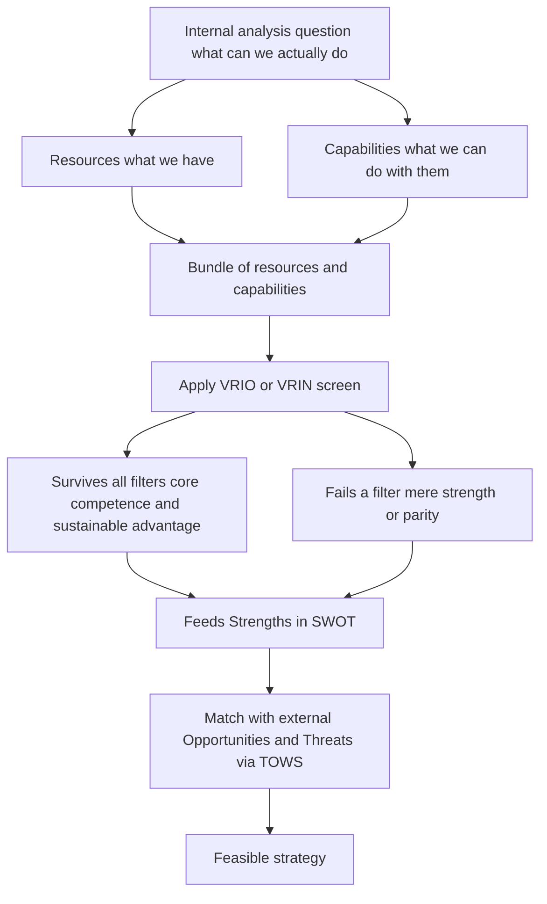
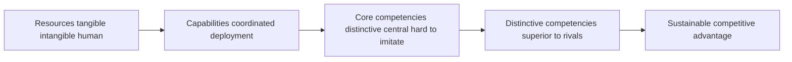
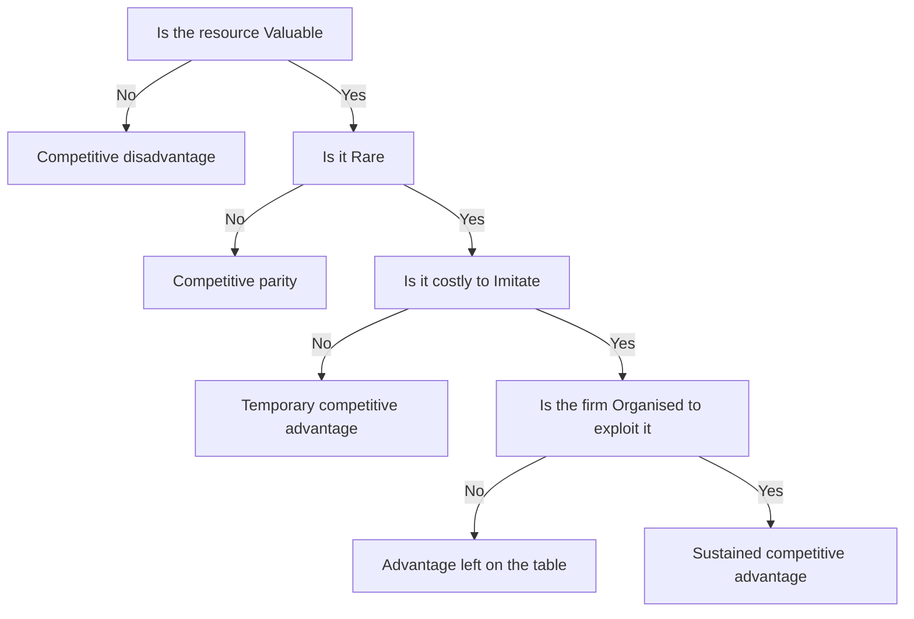
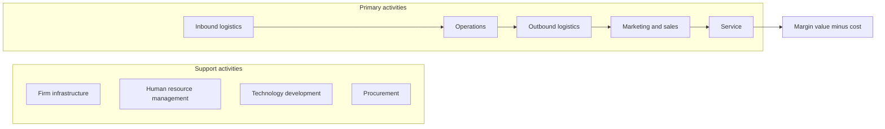
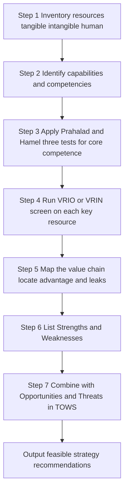

# Chapter 12 — SM: Analysis of the Internal Environment

## 1. The Problem

A strategist who has just finished scanning the *outside* world — the industry structure, the five forces, the PESTLE trends, the moves of rivals — holds half a map. The external scan tells you what the terrain looks like: where the mountains of competition are, where the rivers of demand flow, where the weather of regulation is turning. But it says nothing about **your own army**. It cannot tell you whether *you* are equipped to take a particular hill.

Two firms staring at the *same* external environment should often adopt *different* strategies — and the reason lies entirely inside them. Consider two players in Indian aviation looking at the identical opportunity of rising domestic air travel. One has a lean, single-fleet, low-cost operating machine tuned over a decade; the other carries a bloated cost base, mixed fleet, and legacy labour contracts. The opportunity is the same; the *feasible* response is not. The low-cost carrier can profitably chase price-sensitive fliers; the legacy carrier that copies that move bleeds to death. **The external environment defines what is attractive; the internal environment defines what is achievable.** Strategy is the marriage of the two — and a strategy that is attractive but not achievable is a fantasy.

This is why we must now look *inward*. The internal analysis answers a deceptively simple question: **What can this firm actually do better than, worse than, or the same as its rivals — and which of those differences can be turned into a durable advantage?** Three sub-questions follow:

1. **What do we have?** — the stock of resources and capabilities.
2. **Which of these are genuinely special?** — the test that separates ordinary strengths from *competitive advantage*.
3. **Where in our activities is value actually created or destroyed?** — the anatomy of the firm as a chain of value-adding steps.

Get the inward look wrong and every downstream decision is poisoned. A firm that mistakes a common capability for a rare one will pick a strategy it cannot defend; a firm blind to its own weakness will walk into a war it cannot win. The discipline that prevents this is **internal environment analysis**, and its ultimate payoff is the *inside-out* view of competitive advantage: the idea that lasting advantage grows not from picking a nice industry, but from owning something rivals cannot easily copy.

---

## 2. The Core Idea (Analogy)

Think of a firm as a **professional kitchen preparing to enter a cooking competition**.

The external analysis (the previous chapters) told the head chef about the *competition itself*: the judges' tastes, the rival kitchens, the trend toward regional cuisine, the price of saffron this season. Useful — but it says nothing about whether *this* kitchen can win.

So the chef turns around and audits the kitchen:

- **Resources** are what the kitchen simply *has*: the ovens, the knives, the pantry of ingredients, the cash to buy more, the brand name on the door, the trained brigade of cooks, the secret family recipe locked in the safe. Some are tangible (the copper pans), some intangible (the reputation, the recipe).
- **Capabilities** are what the kitchen can *do* by putting resources to work in a coordinated way: plate two hundred covers an hour without a dropped dish, invent a new dish under time pressure, source the freshest fish before rivals get to the market. A pile of good knives is a resource; the *ability to butcher a whole tuna in four minutes* is a capability.
- **Core competence** is the one or two things the kitchen does so distinctively well that they define who it is — say, a mastery of fermentation that no rival can match, learned over twenty years, embedded in the tacit know-how of the team. It is a capability that is *central* to competing, *hard to imitate*, and *transferable* across many dishes on the menu.

Now the crucial test. A rival can buy the same ovens tomorrow. A rival can copy the plating within a week. But the twenty-year fermentation know-how, tangled up in the team's shared habits and the chef's palate? That cannot be bought, copied, or poached wholesale. **That** — and only that — is what wins competitions year after year. The whole of internal analysis is the chef learning to tell the difference between the ovens (nice, but everyone has them) and the fermentation mastery (rare, precious, and the true source of victory).

And to find *where* the magic happens, the chef walks the line from delivery door to dining table — receiving, storing, prepping, cooking, plating, serving — asking at each station: *does value get added here, is it a cost sink, and how do we compare to the kitchen next door?* That walk is **value chain analysis**.

---

## 3. Why It's Built This Way

**Why look inward at all, when the external world is where customers and rivals live?** Because of a hard empirical fact that reshaped strategy in the 1980s and 90s: firms in the *same* industry, facing the *same* forces, earn *persistently different* profits. If industry structure explained everything, all airlines would earn alike — they don't. The gap must come from *inside*: from differences in what firms own and can do. This insight gave rise to the **Resource-Based View (RBV)** of the firm, whose banner claim is that competitive advantage is rooted in a firm's bundle of resources and capabilities, not merely in its industry position.

**Why distinguish resources from capabilities so pedantically?** Because owning a thing is not the same as being able to *use* it well. Two firms may hold identical assets and earn wildly different returns because one has the organisational skill to weave those assets into something customers pay for. Resources are nouns; capabilities are verbs; advantage lives in the verbs. A resource sitting idle earns nothing.

**Why do we need a formal test like VRIO/VRIN?** Because managers systematically over-rate their own strengths. Everything the firm is good at *feels* like an advantage. But most strengths are merely **competitive parity** — necessary to play, insufficient to win, because rivals have them too. The VRIO screen exists to be *ruthless*: it strips away the flattering self-assessment and asks the cold question, *would a rival struggle to replicate this?* Only resources that survive all four filters deserve the label "sustainable competitive advantage." The test is deliberately hard because advantage, by definition, is scarce.

**Why the value chain, rather than just looking at the firm as a whole?** Because "we are efficient" is a useless statement for a manager who wants to *act*. Advantage is not a fog that hangs over the whole company; it is created at *specific activities* and destroyed at others. To manage it you must disaggregate the firm into the discrete activities where costs are incurred and value is added, so you can see *precisely* which link in the chain is your source of edge and which is a leak. Michael Porter built the value chain to make advantage *locatable* and therefore *manageable*.

**Why end with SWOT/TOWS?** Because the inward look and the outward look must eventually be *joined*. Strengths and weaknesses (internal) mean nothing until matched against opportunities and threats (external). The purpose of internal analysis is not a list of strengths for its own sake — it is to feed a *synthesis* that produces action. SWOT collects the four; TOWS forces you to *combine* them into strategies. The whole chapter is built to end there because that is where analysis becomes strategy.

*Figure 12.1 — The inside-out logic: from what the firm owns, through the screen that finds what is special, to a strategy matched against the outside world.*

---

## 4. Full Technical Content

### 4.1 Resources — the raw stock

A **resource** is any asset, tangible or intangible, that a firm owns or controls and can deploy to conceive and execute strategy. Resources fall into three families:

| Family | Nature | Examples |
|---|---|---|
| **Tangible** | Physical, countable, on the balance sheet | Plant and machinery, land, cash, raw material stock, distribution network hardware |
| **Intangible** | Non-physical, often *off* the balance sheet | Brand reputation, patents and trademarks, proprietary technology, organisational culture, customer relationships, accumulated know-how |
| **Human** | Skills and knowledge embodied in people | Managerial talent, engineering expertise, worker productivity, the tacit skills of the workforce |

A crucial teaching point: **intangible resources are usually the more powerful source of advantage.** Tangible assets are visible, valued, and purchasable — a rival can buy the same machine. Intangibles like reputation and culture are invisible, hard to value, and cannot be bought at any price; they must be *built* over years. That very inimitability is what makes them strategically precious.

### 4.2 Capabilities (competencies) — the skill of using resources

A **capability** (also called a *competence*) is the firm's capacity to deploy resources in a coordinated way to achieve a desired end. It resides not in any single asset but in the *routines, processes, and organisational glue* that combine many resources. Capabilities are built through *learning and repetition* and typically cut across functional boundaries. A firm's capability in "rapid new-product development," for instance, weaves together R&D talent, market intelligence, supplier links, and manufacturing flexibility.

Capabilities can be arranged in a hierarchy of increasing strategic power:

*Figure 12.2 — The ladder from owned resources up to sustainable advantage; each rung is narrower and harder to reach.*

### 4.3 Core competence — Prahalad and Hamel

The idea of **core competence** was introduced by **C.K. Prahalad and Gary Hamel** (Harvard Business Review, 1990). A core competence is not any capability — it is one that passes **three tests**:

1. **Provides access to a wide variety of markets** — it is *transferable*, underpinning many products, not just one. (Honda's competence in engines feeds cars, bikes, generators, lawnmowers.)
2. **Makes a significant contribution to perceived customer benefits** — customers actually *value* what it produces.
3. **Is difficult for competitors to imitate** — it is complex, tacit, and built over time, so it cannot be quickly copied.

Prahalad and Hamel's memorable metaphor: the firm is a *tree*. Core competencies are the **root system**; core products are the **trunk**; business units are the **branches**; and end products are the **leaves and fruit**. Competitors admiring your fruit miss the roots that produce it — and the roots are where competition is really won. A firm should therefore think of itself as a *portfolio of competencies*, not merely a portfolio of businesses.

**Core competence vs. distinctive competence.** A *core* competence is central and hard to imitate. A **distinctive competence** is a competence that is also *superior to that of rivals* — something the firm does demonstrably better than anyone in the field. Distinctive competencies are the ones that translate most directly into advantage; core competencies that are merely matched by rivals give parity, not superiority.

### 4.4 The VRIO / VRIN screen — the ruthless test

This is the analytical heart of the Resource-Based View, developed by **Jay Barney**. It asks four questions of any resource or capability to determine what kind of advantage — if any — it can yield. The original form was **VRIN** (Valuable, Rare, Inimitable, Non-substitutable); Barney later reframed the fourth filter as **Organisation**, giving **VRIO**.

| Filter | Question it asks | If NO, the result is... |
|---|---|---|
| **V — Valuable** | Does it help exploit an opportunity or neutralise a threat, letting the firm improve efficiency or effectiveness? | Competitive *disadvantage* |
| **R — Rare** | Is it possessed by only a few (ideally one) competitors? | Competitive *parity* |
| **I — Inimitable (costly to imitate)** | Would rivals face a significant cost disadvantage in obtaining or developing it? | *Temporary* competitive advantage |
| **O — Organised to exploit** (VRIO) *or* **N — Non-substitutable** (VRIN) | Is the firm organised — with the right structure, systems, processes — to actually capture the value? *or* Is there no equivalent substitute a rival could use instead? | Unrealised advantage / substitutable |

The logic is **cumulative** — a resource must clear each filter *in turn*:

*Figure 12.3 — The VRIO decision tree; only a resource that answers Yes at every gate yields sustained competitive advantage.*

**Why inimitability is the linchpin.** Value and rarity get you a *head start*, but rivals will chase you. What makes advantage *sustainable* is the barrier to imitation. Barney identifies why some resources resist copying:

- **Unique historical conditions** — the resource was acquired through a path in time that cannot be rerun (first-mover land grab, a founder's vision).
- **Causal ambiguity** — even the firm itself cannot fully articulate *why* it is good at something; rivals cannot copy what nobody can specify. (Culture is the classic case.)
- **Social complexity** — the resource rests on intricate interpersonal relationships, trust, and reputation that cannot be engineered on command.

The **O** — Organisation — is the reminder that a brilliant resource wasted by a firm that cannot exploit it yields nothing. Structure, control systems, culture, and reward systems must be aligned to *convert* potential advantage into realised advantage. It is the "so what — can you actually use it?" filter.

### 4.5 Value Chain Analysis — Michael Porter

Where VRIO tells you *whether* you have advantage, the **value chain** tells you *where* it comes from. Introduced by **Michael Porter** in *Competitive Advantage* (1985), it disaggregates the firm into **nine strategically relevant activities** to locate the sources of cost and differentiation. Every activity either adds value (that the customer will pay for) or adds cost — and the **margin** is the difference between total value created and total cost of performing the activities.

The activities split into two groups.

**Primary activities** — directly concerned with creating and delivering the product:

| Primary activity | What it covers |
|---|---|
| **Inbound logistics** | Receiving, storing, and distributing inputs — material handling, warehousing, inventory control |
| **Operations** | Transforming inputs into the final product — machining, assembly, packaging |
| **Outbound logistics** | Storing and distributing the finished product to buyers — order processing, delivery |
| **Marketing and sales** | Informing buyers and inducing purchase — advertising, pricing, channel management, sales force |
| **Service** | Enhancing or maintaining product value after sale — installation, repair, training, spare parts |

**Support (secondary) activities** — they underpin the primary activities and each other:

| Support activity | What it covers |
|---|---|
| **Firm infrastructure** | General management, planning, finance, accounting, legal, quality management |
| **Human resource management** | Recruiting, training, developing, and compensating all types of personnel |
| **Technology development** | R&D, process automation, product design, know-how that improves the product or the activities |
| **Procurement** | The *function* of purchasing inputs used across the value chain (distinct from inbound logistics, which is the physical handling) |

*Figure 12.4 — Porter's value chain; support activities run across the top and feed every primary activity that flows left to right toward margin.*

**How to use it.** (1) *Identify* each activity and its cost. (2) *Diagnose* which activities are sources of competitive advantage — where the firm creates value cheaper than or differently from rivals. (3) *Examine linkages* — activities are interdependent; better quality inspection (operations) reduces service costs later; tighter procurement lowers inbound logistics cost. Optimising linkages, not just individual boxes, is where hidden advantage lives. (4) *Compare* with competitors' chains (benchmarking) to find where you lead and where you leak.

The value chain sits inside a larger **value system** — the chain of your suppliers upstream and your channels and buyers downstream. Advantage often comes from managing these *interfaces* (e.g., linking your inbound logistics tightly to a supplier's outbound logistics via just-in-time delivery).

### 4.6 SWOT and TOWS — the synthesis

**SWOT analysis** collates the outputs of internal and external analysis into a 2×2:

- **Strengths** and **Weaknesses** are *internal* — the direct output of the resource, capability, competence, and value-chain analysis above. A strength is a resource/capability that gives an edge; a weakness is a deficiency that puts the firm at a disadvantage.
- **Opportunities** and **Threats** are *external* — favourable and unfavourable conditions in the environment (from the external-analysis chapters).

SWOT alone is a *list*, and a list is not a strategy. Its weakness is that it stops at description. The **TOWS Matrix** (a name that reverses SWOT, developed by **Heinz Weihrich**) fixes this by *pairing* internal factors with external ones to generate concrete strategic options:

| | **Strengths (S)** | **Weaknesses (W)** |
|---|---|---|
| **Opportunities (O)** | **SO — Maxi-Maxi**: use strengths to seize opportunities (aggressive growth) | **WO — Mini-Maxi**: overcome weaknesses to grab opportunities (turnaround / develop) |
| **Threats (T)** | **ST — Maxi-Mini**: use strengths to counter threats (defend / diversify) | **WT — Mini-Mini**: minimise weaknesses and avoid threats (defensive / retrench) |

The point of TOWS is *forcing the combination*. It converts four static lists into four families of *action*, which is exactly the bridge from analysis to strategy that internal analysis exists to build.

---

## 5. Worked Examples / Applied Cases

### Case A — Running the VRIO screen on a paint company

*Scenario.* **Asha Coatings Ltd**, a mid-sized Indian decorative-paint maker, lists four things it believes are strengths. Apply the VRIO screen to classify each and predict the type of advantage.

1. **A nationwide dealer-and-tinting network** of 45,000 outlets built over 40 years, with tinting machines placed free at each dealer and deep relational trust with painters.
2. **ISO-certified, modern manufacturing plants.**
3. **A patented low-VOC resin formulation**, patent valid 6 more years.
4. **A skilled finance team** producing clean, timely accounts.

*Analysis.*

| Resource | Valuable? | Rare? | Costly to imitate? | Organised to exploit? | Verdict |
|---|---|---|---|---|---|
| Dealer + tinting network | Yes — drives reach and repeat sales | Yes — no rival has this density | Yes — 40 years of relationships, socially complex, causally ambiguous | Yes — sales & supply systems built around it | **Sustained competitive advantage** |
| Modern ISO plants | Yes | No — every serious rival has them | — | — | **Competitive parity** |
| Patented resin | Yes | Yes | Yes *but time-limited* — patent expires in 6 years | Yes | **Temporary competitive advantage** |
| Skilled finance team | Yes (avoids errors) | No — common capability | — | — | **Competitive parity** |

*Interpretation and reconciliation.* Only the **dealer-tinting network** clears all four gates — and note *why* it is inimitable: it rests on decades of accumulated relationships (unique historical conditions), tacit trust (causal ambiguity), and interpersonal networks (social complexity). This, not the shiny plants, is where Asha's durable edge lives, so strategy should *protect and deepen* it. The patent is real but *temporary* — it gives advantage only until it expires, so Asha must convert the head start into something more durable (brand, follow-on innovation) before year six. The plants and finance team, though genuine competencies, are only *parity*: necessary to compete, useless as a source of superiority. **The screen's value is precisely that it demotes three of the four "strengths."** A naive strength-list would have treated all four as equal weapons; VRIO shows only one is a weapon and one is a fast-fading edge.

### Case B — Value chain diagnosis of an e-commerce grocer

*Scenario.* **FreshCart**, an online grocery start-up, is losing money and cannot see why. Its founders believe the problem is "high costs generally." Walk the value chain to *locate* the leak and the edge.

*Analysis, activity by activity.*

- **Inbound logistics** — sourcing directly from farmers and mandis. *Cost is moderate; here lies a strength* — direct sourcing cuts out middlemen, lowering input cost versus rivals who buy from wholesalers.
- **Operations** — the *dark stores* (mini-warehouses) where orders are picked and packed. *This is the leak.* Pickers waste time hunting items in a poorly laid-out store; wastage of perishables is high. Cost per order here is double the benchmark.
- **Outbound logistics** — last-mile delivery via gig riders. *Cost high but at parity* with rivals; not a differentiator.
- **Marketing and sales** — heavy discount-led customer acquisition. *A cost sink*: customers churn once discounts stop; the money buys no loyalty.
- **Service** — refunds for spoiled goods, driven by the operations wastage above. *A cost caused by an upstream link.*

*Linkage insight (the key finding).* The high **service** cost (refunds) and the high **operations** cost are *the same problem seen twice* — poor dark-store layout and perishable handling cause both wastage (operations) and spoilage complaints (service). Fixing the operations link *simultaneously* cuts the service link. This is exactly the *linkage* effect Porter warns about: optimising boxes in isolation misses it, but tracing the chain reveals that one fix heals two wounds.

*Reconciliation.* The founders' diagnosis — "costs are high generally" — was useless for action. The value chain converts the fog into a map: the *strength* to build on is **inbound logistics** (direct sourcing), the *primary weakness* to fix is **operations** (dark-store efficiency), and the discount-led **marketing** is a strategic dead-end that buys no durable asset. Note also what value chain analysis did that VRIO could not: it told them *where* to act, not merely *whether* they had advantage.

### Case C — SWOT to TOWS for a regional bank

*Scenario.* **Sahyadri Bank**, a strong regional player in western India, must set a growth strategy. Turn its factors into action using TOWS.

*Internal (from resource/value-chain analysis).*
- **Strengths (S):** deep rural branch network and local trust; low-cost deposit base.
- **Weaknesses (W):** dated core banking technology; weak in digital/mobile channels; thin urban presence.

*External (from environment scan).*
- **Opportunities (O):** government push for rural financial inclusion; fintech partnership models available to license.
- **Threats (T):** aggressive digital-first banks poaching younger customers; rising compliance costs.

*TOWS synthesis.*

| | Strengths | Weaknesses |
|---|---|---|
| **Opportunities** | **SO:** Leverage the trusted rural network + low-cost deposits to become the lead bank for government inclusion schemes — an aggressive expansion that plays to the bank's core strength. | **WO:** License fintech platforms to fix the digital weakness quickly and ride the same inclusion wave (turnaround by borrowing capability rather than building it). |
| **Threats** | **ST:** Use the trust and relationship strength to defend the customer base against digital-first raiders — "high-touch where they are high-tech." | **WT:** In segments where the bank is both weak (digital) and under attack (young urban customers), avoid a head-on fight; retrench from unprofitable urban branches and consolidate. |

*Reconciliation and lesson.* Notice that the *same* weakness (dated technology) produces *different* strategies depending on which external factor it is paired with — a **WO** licensing move to seize opportunity, versus a **WT** retreat to dodge threat. This is the whole point of TOWS over a bare SWOT list: **the matching, not the listing, is where strategy is born.** A SWOT that stopped at four bullet lists would have left Sahyadri with information and no decision.

---

## 6. Framework Summary / Format

When an exam question says "analyse the internal environment of Firm X" or "identify the sources of competitive advantage," present the answer as a *pipeline*, not a jumble. The recommended flow:

*Figure 12.5 — The examinable sequence for a full internal-environment analysis, ending in strategy.*

**Framework roll-call (memorise the author with the tool):**

| Framework | Author | What it answers |
|---|---|---|
| Resource-Based View | Wernerfelt; developed by Barney | *Why* look inside for advantage |
| Core competence | Prahalad & Hamel (1990) | Which capabilities *define* the firm |
| VRIO / VRIN | Jay Barney | *Whether* a resource yields sustainable advantage |
| Value Chain | Michael Porter (1985) | *Where* value and cost arise |
| SWOT | (Traditional, Learned/Andrews origin) | *Collate* internal + external factors |
| TOWS Matrix | Heinz Weihrich | *Combine* factors into strategies |

---

## 7. Connections

- **To the external-analysis chapters (Porter's Five Forces, PESTLE):** Internal analysis is the *other half*. Five Forces tells you if the *industry* is attractive; internal analysis tells you if *you* can win in it. The two meet in SWOT — external forces populate Opportunities/Threats, internal analysis populates Strengths/Weaknesses.
- **To competitive strategy (cost leadership vs. differentiation):** A generic strategy is only viable if a *core competence* supports it. Cost leadership demands a value chain that is genuinely lower-cost at key links; differentiation demands a resource rivals cannot imitate. The value chain is the diagnostic tool for *both* — you find cost advantage by comparing activity costs, and differentiation advantage by finding activities that create unique buyer value.
- **To corporate strategy and diversification:** Prahalad and Hamel's competence view argues a firm should diversify into businesses that *share* its core competencies (related diversification), because that is where the root system can feed new branches. Unrelated diversification that leaves the competencies behind destroys the very source of advantage.
- **To strategic control and structure:** The **O in VRIO** — organisation — links straight to the chapters on structure and systems. An advantage-bearing resource is worthless unless structure, culture, and reward systems are aligned to exploit it.

---

## 8. Traps and Examiner Tricks

1. **Confusing resources with capabilities.** A resource is a *thing you have*; a capability is *something you can do* with things. "Skilled engineers" is a human resource; "ability to design a car in 18 months" is a capability. Examiners reward the precise distinction.
2. **Treating every strength as a competitive advantage.** The classic error. Most strengths are only *parity* (V and maybe R, but not I). Always run them through VRIO before calling anything an "advantage." A strength that rivals also have is *table stakes*, not an edge.
3. **Forgetting that advantage from an imitable resource is only *temporary*.** Patents expire, technology is reverse-engineered. Only inimitable, causally ambiguous, socially complex resources give *sustained* advantage. State the *type* of advantage, not just "advantage."
4. **Dropping the "O" from VRIO.** Students recall V-R-I and forget the firm must be *Organised* to exploit the resource. An un-exploited advantage yields nothing — mention it.
5. **VRIN vs VRIO confusion.** Know both: VRIN's fourth filter is **N**on-substitutability; VRIO's is **O**rganisation. Barney's later, more-cited version is VRIO. State whichever the question names, and know the difference if asked.
6. **Confusing Procurement with Inbound Logistics.** In Porter's chain, **Procurement** is a *support* activity — the *function* of buying inputs. **Inbound logistics** is a *primary* activity — the *physical handling* of received inputs. They are different boxes.
7. **Confusing Firm Infrastructure (support) with the primary chain.** General management, finance, and legal are *support*, not primary. And note **Technology development** is support even in a tech company — it develops the *know-how*, while Operations *uses* it.
8. **Stopping at SWOT.** A SWOT list scores few marks; the examiner wants the *TOWS* combination into SO/ST/WO/WT strategies. The four-quadrant matching is where the marks — and the strategy — are.
9. **Mislabelling the TOWS cells.** SO = Maxi-Maxi (strengths×opportunities), WT = Mini-Mini (weaknesses×threats). Do not swap them. A quick anchor: the *good-good* corner is aggressive; the *bad-bad* corner is defensive.
10. **Attributing the wrong author.** Core competence = **Prahalad & Hamel**; VRIO/VRIN = **Barney**; Value Chain = **Porter**; TOWS = **Weihrich**. Mixing these up is a common and easily avoided lost mark.

---

## 9. First-Principles Recap

Strip everything away and the logic of this chapter is a single chain of *why*:

- Firms in the same industry earn different profits → therefore the difference must lie *inside* them → therefore we must analyse the internal environment.
- What lies inside is **resources** (what we have) put to work as **capabilities** (what we can do) → the standouts among these are **core competencies**, the roots of the tree.
- But not every capability wins. To separate the winners we apply a hard test — **VRIO/VRIN** — because only a resource that is Valuable, Rare, costly to Imitate, and Organised-for/Non-substitutable can give *sustained* advantage. Everything else is mere parity.
- To *find* where advantage is created we disaggregate the firm into its **value chain** — five primary and four support activities — and hunt for the links where we beat rivals and the links where we leak, watching the *linkages* between them.
- Finally, an inward look is useless alone; it must be *joined* to the outward look. We collate the two in **SWOT** and — crucially — *combine* them in **TOWS** into concrete SO/ST/WO/WT strategies.

The one sentence to carry out of the chapter: **sustainable competitive advantage comes not from sitting in a nice industry but from owning something valuable, rare, and hard to copy — and knowing exactly where in your own activities that something lives.** That is the inside-out view.

---

## 10. Quick-Revision Sheet

**Why look inward:** same industry, different profits ⇒ the gap is internal ⇒ Resource-Based View (Barney/Wernerfelt).

**Resources** (what we *have*): Tangible (plant, cash) · Intangible (brand, patents, culture) · Human (skills). *Intangibles are the stronger source of advantage — hard to buy or copy.*

**Capabilities** (what we can *do*): coordinated deployment of resources; built by learning; cross-functional.

**Core competence — Prahalad & Hamel (1990), 3 tests:** (1) access to many markets, (2) significant customer benefit, (3) hard to imitate. Metaphor: roots (competencies) → trunk (core products) → branches (units) → fruit (end products). *Distinctive competence = also superior to rivals.*

**VRIO / VRIN — Barney (cumulative gates):**
| Filter | Fails ⇒ |
|---|---|
| **V**aluable | Competitive disadvantage |
| **R**are | Competitive parity |
| **I**nimitable | Temporary advantage |
| **O**rganised (VRIO) / **N**on-substitutable (VRIN) | Unrealised / substitutable |
All pass ⇒ **Sustained competitive advantage.** Inimitability sources: unique history · causal ambiguity · social complexity.

**Value Chain — Porter (1985):**
- *Primary:* Inbound logistics → Operations → Outbound logistics → Marketing & sales → Service.
- *Support:* Firm infrastructure · HRM · Technology development · Procurement.
- Value − Cost = **Margin.** Watch *linkages*; sits inside a larger *value system* (suppliers ↔ firm ↔ channels).
- Trap: Procurement = support (buying function); Inbound logistics = primary (physical handling).

**SWOT:** S, W = internal; O, T = external. A list, not a strategy.

**TOWS — Weihrich (combine):**
| | S | W |
|---|---|---|
| **O** | SO Maxi-Maxi (aggressive) | WO Mini-Maxi (turnaround) |
| **T** | ST Maxi-Mini (defend) | WT Mini-Mini (retrench) |

**Pipeline:** Resources → Capabilities → Core competence (3 tests) → VRIO screen → Value chain map → S & W → TOWS → strategy.

**One-liner:** Advantage = owning something Valuable + Rare + Inimitable + Organised-to-exploit, and knowing where in the value chain it lives. Inside-out view.
