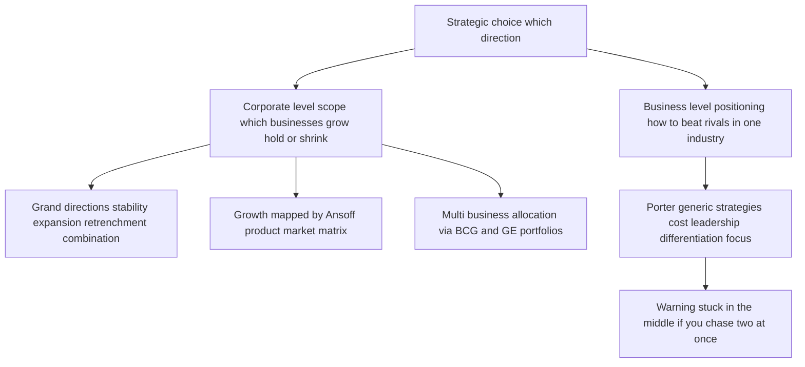
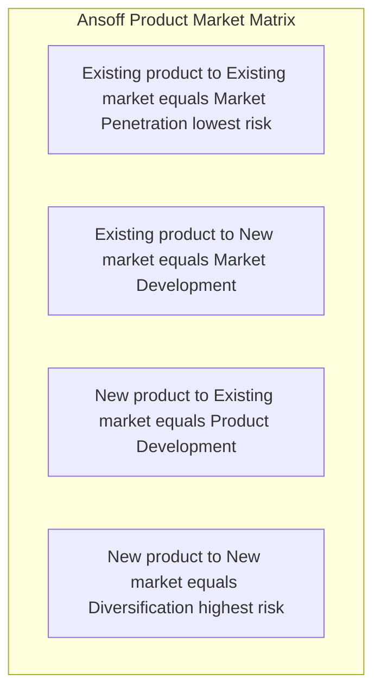
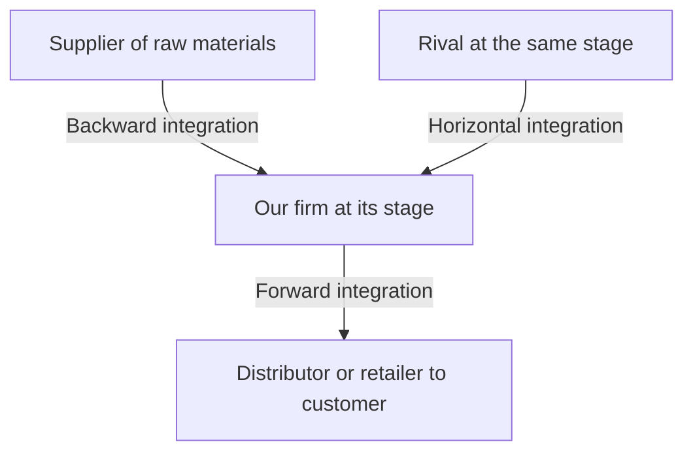
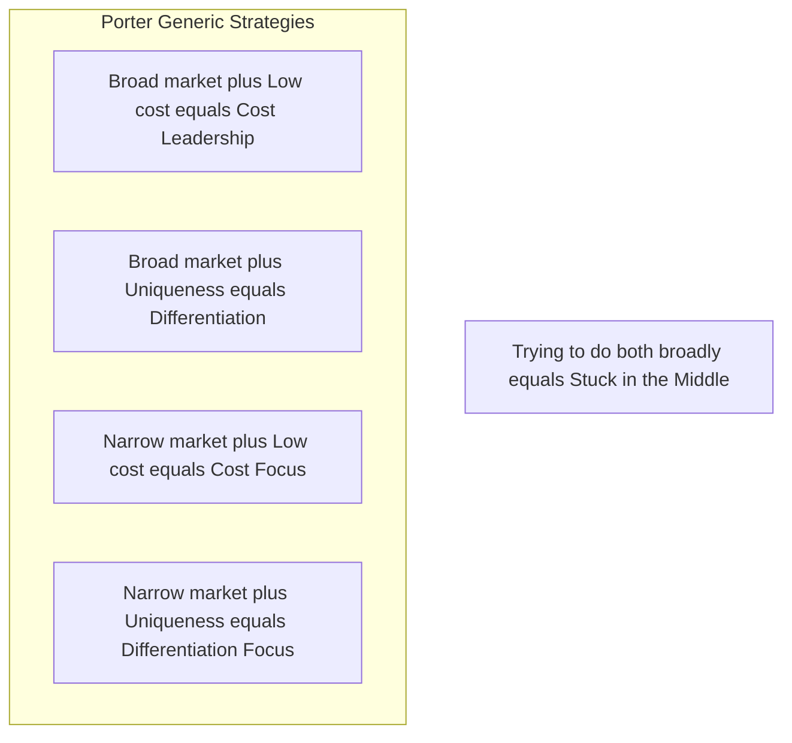
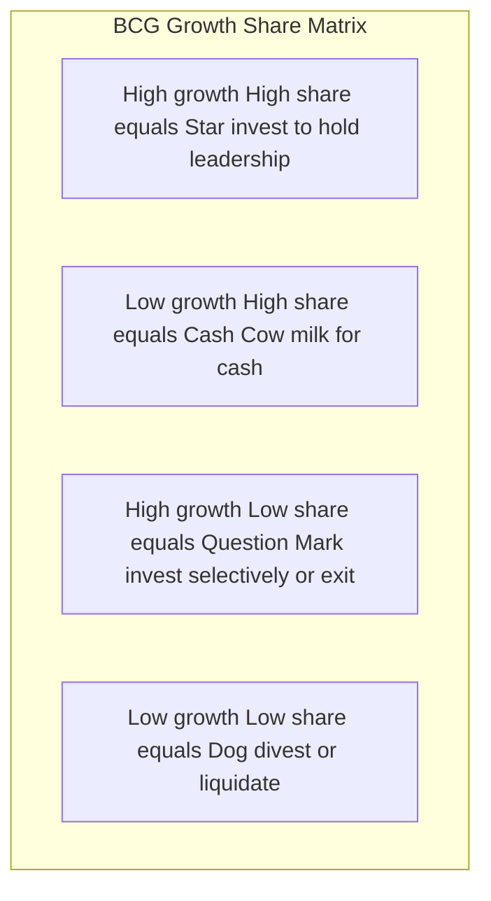
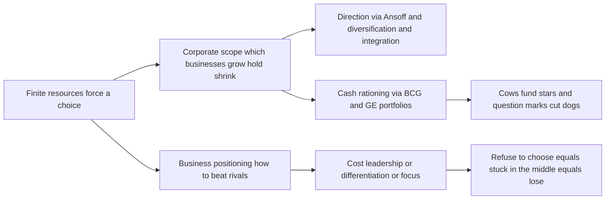

<!-- v2-deep -->

# Chapter 13 — SM: Strategic Choices

## 1. The Problem

By now the strategist has done the hard analytical work. The external scan (Chapter 11) mapped the terrain — the industry structure, the five forces, the PESTLE trends. The internal scan (Chapter 12) audited the army — the resources, capabilities, and the one or two core competences that might win a war. The manager sits at the desk holding a rich diagnosis. And now comes the moment that analysis was only ever a servant to: **a decision must be made about where the firm will go.**

Here is the brutal truth that forces the decision. **A firm cannot be all things to all people, in all markets, at all price points, all at once.** Resources are finite. Management attention is the scarcest resource of all. A rupee of capital spent entering a new country is a rupee not spent deepening the home market; a factory built to chase volume at low cost is a factory that cannot also be tuned to craft premium bespoke goods. Every strategy that says *yes* to one path implicitly says *no* to a dozen others. Strategy, in the words often attributed to Michael Porter, is fundamentally about **what NOT to do** — about deliberately choosing a narrow, defensible position rather than sprawling everywhere and standing for nothing.

The firm that refuses to choose does not thereby keep all its options open. It becomes *incoherent*: it spreads its capital thin, confuses its customers about what it stands for, and gets beaten in every segment by rivals who concentrated their fire. The airline that tries to be both the cheapest and the most luxurious ends up neither cheap enough for the budget flier nor plush enough for the business traveller — and both walk to competitors who chose.

So the manager faces two nested questions of *direction*:

1. **At the level of the whole corporation:** In what businesses should we be, and should the overall enterprise grow, hold steady, or shrink? *This is corporate-level strategy.*
2. **At the level of each individual business:** Within a given industry, how will this business win against its direct rivals? *This is business-level (competitive) strategy.*

These two questions demand different tools because they solve different problems. The corporate question is about *scope* — the breadth of the firm's playing field. The business question is about *positioning* — how to beat the players already on your field. This chapter arms the strategist with the classic frameworks that structure each choice, and — crucially — teaches each framework by the specific choice it exists to discipline. Because a framework you cannot connect to a decision is just a diagram to memorise, and this guide has no patience for that.

**A third, often-forgotten level.** Beneath corporate and business strategy sits **functional-level strategy** — the strategy of each department (marketing, finance, operations, HR, R&D) that *implements* the business-level choice. It matters here because it is the examiner's neat three-tier hierarchy: corporate (*which businesses*) → business (*how to compete in each*) → functional (*how each function supports the chosen way of competing*). A cost-leadership business strategy, for instance, *dictates* a functional operations strategy of standardisation and a functional HR strategy of high-productivity, lean staffing. When a question asks "at what level does the marketing head operate?", the answer is *functional*. The three levels are not independent choices made in isolation; they must be **vertically consistent** — a differentiation business strategy paired with a penny-pinching functional strategy that starves R&D and service is internally contradictory and will fail. Hold this hierarchy in mind; it frames everything below.

---

## 2. The Core Idea (Analogy)

Think of the firm as a **general commanding an army across a theatre of war**, deciding on strategy for a whole campaign.

The general faces two entirely different classes of decision, and confusing them loses wars.

The first is the **grand-strategic** decision, taken at headquarters: *On how many fronts do we fight, and are we advancing, holding, or retreating?* Do we open a second front in a new territory (expansion)? Do we consolidate the ground we hold and dig in (stability)? Do we abandon an indefensible salient to save the army (retrenchment)? Do we advance on one front while withdrawing from another (combination)? This is the choice about **the shape and size of the whole war** — which theatres, how many, growing or shrinking. In business language this is **corporate-level strategy**, and it is set at the top, for the enterprise as a whole.

The second is the **field-tactical** decision, taken by the commander of each individual front: *Given that I must fight the enemy already dug in opposite me on this particular battlefield, how do I actually beat him?* Do I win by being cheaper to supply and outlasting him in a war of attrition (cost leadership)? Do I win by fielding a uniquely superior weapon he cannot match (differentiation)? Or do I ignore the broad front and concentrate all my force on one narrow gap in his line (focus)? This is the choice about **how to win a single battle against a specific foe**. In business language this is **business-level (competitive) strategy**.

The genius of the classic frameworks is that they are *maps for these two distinct decisions*. When the general asks "which fronts, growing or shrinking?" the **Ansoff matrix** lays out the growth options and the **BCG/GE portfolios** show which fronts to feed and which to starve. When the field commander asks "how do I beat the enemy opposite me?" **Porter's generic strategies** name the three — and only three — coherent ways to win, and warn that the commander who tries to do two at once ends up "stuck in the middle," beaten by both the cost-attritionist and the superior-weapon specialist.

Extend the analogy one notch further to feel *why* the "stuck in the middle" warning bites. A general who tries to equip every soldier with both the *lightest* pack (to march fastest and cheapest) *and* the *heaviest* armour (to be unbeatable in a fixed fight) gets an army that is neither fast nor protected — it is out-marched by the light force and out-fought by the heavy one. The physical impossibility of being simultaneously light and heavy is exactly the *activity conflict* Porter identifies between low cost and differentiation. The analogy is not decoration; it is the mechanism.

The rest of this chapter is the general's toolkit — each tool tied to the exact question a commander would be foolish to answer without it.

---

## 3. Why It's Built This Way

**Why separate corporate strategy from business strategy at all?** Because they answer different questions and are owned by different people. A diversified group like the Tata or Aditya Birla conglomerate has a *corporate* headquarters deciding which industries to be in — steel, software, telecom, retail — and, separately, each of those businesses has its own leadership deciding how to beat *its* rivals. The corporate question is "what game(s) should we play?"; the business question is "how do we win the game we're in?" A single-business firm collapses the two, but the *logic* is still distinct: first pick the field, then pick how to fight on it. Mixing them produces the classic error of answering a positioning question with a scope answer ("we'll grow!" is not a strategy for beating a rival who is out-innovating you).

**Why does corporate strategy come down to just four grand directions — stability, expansion, retrenchment, combination?** Because at the highest level of abstraction, a firm relative to its current position can only do one of three things — *stay roughly where it is, get bigger, or get smaller* — plus the real-world truth that a multi-business firm usually does several of these at once (combination). These are not arbitrary; they are the exhaustive logical set of directional moves. Every specific corporate action (a merger, a plant closure, a new-country launch) is a species of one of these four genera. The taxonomy exists so a board can classify and debate its posture without drowning in individual deals.

**Why did Igor Ansoff build a 2×2 of products against markets in 1957?** Because "we want to grow" is uselessly vague. Growth has to come from *somewhere*, and there are only two levers a firm can pull: what it sells (products) and who it sells to (markets). Cross "existing vs new" on each axis and you get exactly four growth paths of steadily rising risk. Ansoff's insight was that these four are *not equally risky* — selling more of what you know to people you know is far safer than selling something new to strangers — so a firm can consciously sequence its growth from safe to bold rather than lurching blindly.

**Why did Michael Porter (1980) insist there are only three generic ways to compete?** Because competitive advantage can logically come from only two sources — being the **lowest-cost** producer, or offering something **uniquely valuable (differentiated)** that commands a premium — and a firm can pursue either across a **broad** market or a **narrow** one. That gives cost leadership, differentiation, and focus (with cost and differentiation variants). Porter's deeper claim, and the reason the framework has teeth, is that the *underlying logic* of low cost and of differentiation pull in *opposite directions*: cost leadership demands standardisation and ruthless economy, differentiation demands variety and investment in distinctiveness. A firm that reaches for both usually achieves neither and lands **"stuck in the middle"** — the framework is built precisely to expose that trap.

**Why the portfolio matrices (BCG, GE)?** Because once a firm owns several businesses, the corporate centre faces a *resource-allocation* problem: cash is finite and every unit clamours for it. The board needs a way to see the whole portfolio at a glance and decide *which units to fund, which to milk, and which to abandon*. The BCG matrix (1970) and the richer GE/McKinsey matrix (early 1970s) exist to turn a jumble of businesses into a picture on which those funding decisions can be argued rationally rather than politically.

**Why is the whole edifice *risk-graded* rather than flat?** This is the unifying "why" behind almost every framework here, and examiners reward the student who sees it. Strategy is deployment of capital under uncertainty, and uncertainty rises with *unfamiliarity*. The firm knows its current products and current customers best, so anything that keeps one of those constant is lower-risk than changing both. That single principle explains: (i) why stability is the least-risky corporate posture; (ii) why Ansoff orders penetration below diversification; (iii) why *related* diversification beats *unrelated* on risk; and (iv) why a *balanced* BCG portfolio (mixing safe cash cows with risky question marks) is prudent. The frameworks are not four unrelated diagrams — they are four cross-sections of one risk-versus-familiarity gradient.

*Figure 13.1 — The architecture of strategic choice: two levels, each with its own frameworks, each framework tied to a specific decision.*

---

## 4. Full Technical Content

### 4.1 Corporate-Level Strategy: the four grand directions

Corporate strategy answers *what businesses we are in and whether the enterprise as a whole is advancing, holding, or retreating.* There are four grand alternatives.

**(a) Stability strategy.** The firm chooses to *continue with its current businesses, serving broadly the same customers with the same products, at roughly the same scale.* It is the least risky of the strategies and, contrary to the beginner's assumption, it is **not** "doing nothing." A stability strategy is a *conscious decision to maintain the status quo* — to keep the ship on its present heading because the position is comfortable and the environment stable. The firm still works hard: it improves incrementally, defends its share, and consolidates. Stability is appropriate when the firm is doing reasonably well, the environment is not threatening, and the risks of a big move outweigh the rewards. Its danger is **complacency** — a firm that "stabilises" in a fast-moving industry is really just falling behind slowly.

There are recognised sub-types worth naming: **no-change** (carry on, monitor for the need to react), **profit/harvesting** (sacrifice long-term position to prop up short-term profit — often a prelude to exit), and **pause/proceed-with-caution** (a deliberate breather after a burst of rapid expansion, to let the organisation digest before growing again). The finer distinction the examiner probes: a *no-change* strategy is genuinely passive maintenance — the firm sees no reason to alter course; a *pause* strategy is *temporary and deliberate*, chosen precisely because the firm has *just grown fast* and needs to stabilise systems, train people, and let cash flow catch up *before growing again*. Pause is therefore a stability strategy *in service of future expansion* — a comma, not a full stop. Confusing "pause" (a rest between sprints) with "no-change" (a settled cruising speed) is a common error.

**(b) Expansion (Growth) strategy.** The firm seeks *substantial growth* — redefining the business, adding products or markets, or increasing the scale of operations well beyond incremental. This is the most common and most glamorous corporate posture, pursued when the environment is munificent, the firm has slack resources, and management is ambitious. Growth can be achieved organically or by acquisition, and the *directions* of growth (into which products and markets) are precisely what the Ansoff matrix maps, and the *methods* (diversification, integration) are covered in 4.3–4.4. Expansion is riskier than stability — it stretches resources and management — but standing still while rivals grow is often the greater risk.

Distinguish the *reasons* firms expand, because the examiner frames "why grow?" questions around them: **survival** (in a growing industry, a static firm's relative share erodes and its unit costs stay above rivals riding the experience curve — growth is defensive), **profitability and drive** (management ambition, the pull of higher returns), **prestige and psychological drive** (empire-building — a real but dangerous motive that can destroy value when growth is pursued for its own sake), and **economies of scale** (larger scale lowers unit cost, itself a competitive weapon). Flag the trap: *growth is not automatically good.* Uncontrolled expansion beyond the firm's managerial and financial capacity — "over-trading" in finance terms — is a classic route to the very distress that later forces retrenchment.

**(c) Retrenchment strategy.** The firm *pulls back* — reducing the scope of its activities, exiting weak businesses, cutting costs sharply, or shrinking to a defensible core. It is chosen under distress: when performance is poor, the environment has turned hostile, or the firm has over-extended. Retrenchment is not defeat; it is *surgery to save the patient*. Its recognised forms escalate in severity:

- **Turnaround** — the firm stays in its businesses but radically overhauls operations to reverse a decline: cutting costs, shedding assets, changing management, refocusing on core products. The *intention is recovery*, not exit. Textbook turnaround *elements* the examiner may ask you to list: changing the leadership, redefining strategic focus, divesting or curtailing unwanted assets/activities, improving profitability of retained operations (cost reduction, revenue enhancement), and making careful acquisitions of complementary lines. The tell-tale signs that *signal the need* for a turnaround — persistent negative cash flow, falling margins and market share, adverse debt-equity movements, deteriorating working capital, high employee turnover, mounting inventory — are themselves examinable.
- **Divestment (divestiture)** — the firm *sells or spins off* a business unit or major asset. Chosen when a unit is a persistent drain, is worth more to someone else, or when the cash is needed to strengthen the core. A turnaround that fails often ends in divestment.
- **Liquidation** — the most extreme: the business is *closed down* and its assets sold piecemeal. It is the strategy of last resort, an admission that the business cannot be saved or sold as a going concern, chosen to salvage whatever value remains before it evaporates. Note the human and reputational cost: liquidation is considered the *least attractive* strategy because it is an admission of failure, damages the firm's reputation and stakeholder relationships, and destroys the going-concern premium — which is precisely why divestment (selling as a going concern to someone who values it more) is preferred whenever a buyer can be found.

**(d) Combination strategy.** In reality, a diversified firm rarely applies a single posture across all its businesses. **Combination** means *pursuing two or more of the above simultaneously or sequentially across different units.* The classic case: a conglomerate *grows* its promising software arm, *holds steady* in its mature steel business, and *retrenches* out of a loss-making telecom venture — all in the same year. Combination is the norm for large multi-business enterprises precisely because different units sit at different points in their life cycles and face different environments. It can also be *sequential*: expand, then pause (stability), then retrench a weak spin-off, then expand again. The examiner's finer point: combination is only *available* to multi-business (or multi-region, multi-product) firms — a single-product single-market firm has nothing to combine across. So if a case names several distinct SBUs receiving *different* treatment, the corporate label is almost always **combination**, even though each individual unit is on a stability/expansion/retrenchment path.

| Grand direction | Core move | When chosen | Sub-types |
|---|---|---|---|
| Stability | Maintain current position | Doing well; stable, low-threat environment | No-change; profit/harvesting; pause/proceed-with-caution |
| Expansion | Substantial growth in products/markets/scale | Munificent environment; slack resources; ambition | Concentration; integration; diversification; cooperation/internationalisation |
| Retrenchment | Pull back to a defensible core | Poor performance; hostile environment; over-extension | Turnaround; divestment; liquidation |
| Combination | Different postures across different units | Multi-business firm; units at different life stages | Simultaneous or sequential mixes |

**Expansion by *cooperation* — the modes examiners add on top of Ansoff.** Ansoff maps growth *directions*; a parallel question is the *mode* of growth — go it alone or partner. The recognised cooperative expansion modes are: **mergers** (two firms combine into one), **acquisitions/takeovers** (one firm buys another), **joint ventures** (two firms create a jointly-owned new entity, typically to share risk and combine complementary strengths — common for entering a foreign market with a local partner), and **strategic alliances** (a looser cooperative arrangement, short of equity combination, to pursue shared objectives). These are cooperative because the firm grows *with* another rather than purely organically. A related mode is **expansion through internationalisation** — taking the firm across borders — which is itself really *market development* (existing products, new geographic markets) elevated to a corporate posture because of the added political, currency, and cultural risk. Keep the distinction crisp: *direction* (Ansoff — which products/markets) versus *mode* (organic vs merger/acquisition/JV/alliance) are two different axes of the same expansion decision.

### 4.2 The Ansoff Product-Market Matrix — mapping the *directions* of growth

Once a firm has chosen expansion, *where* should it grow? Igor Ansoff (1957) answered with the **product-market matrix**, crossing products (existing vs new) against markets (existing vs new) to yield four growth strategies of increasing risk.

*Figure 13.2 — Ansoff's four growth paths, ordered from the safest (penetration, both known) to the boldest (diversification, both new).*

- **Market Penetration** — *existing products, existing markets.* Sell more of what you already make to the customers you already have. Levers: increase usage frequency, win rivals' customers, convert non-users, cut price, advertise harder. It is the **lowest-risk** path because nothing is unfamiliar. A toothpaste brand pushing "brush twice a day" to grow consumption is penetrating.
- **Market Development** — *existing products, new markets.* Take today's product to new customer groups or geographies. Levers: new regions/countries, new customer segments, new distribution channels. Risk is moderate — the product is proven, but the market's needs and competition are unknown. A biscuit maker entering a new state or exporting abroad is developing markets.
- **Product Development** — *new products, existing markets.* Sell something new to your loyal customer base. Levers: new features, new variants, next-generation products for people who already trust you. Risk is moderate — you know the customers, but the product is unproven. A bank offering its existing account-holders a new insurance product is developing products.
- **Diversification** — *new products, new markets.* Enter a business new to the firm on both axes. This is the **highest-risk** path — everything is unfamiliar — and it is important enough that Ansoff treats it as its own major growth strategy, examined next.

The matrix disciplines the growth conversation by forcing "we'll grow" into one of four boxes and making the **risk gradient explicit**: a prudent firm generally exhausts penetration before it develops markets or products, and diversifies only with eyes open to the risk.

**The finer classification points examiners exploit.** (1) *Why are market development and product development treated as "equally moderate" when one changes the market and the other the product?* They are not always equal — the risk depends on *which* unknown is larger for the specific firm. A firm with deep customer relationships but weak innovation finds market development safer; a firm with strong R&D but a saturated home market finds product development safer. The exam-safe statement is "both are moderate and riskier than penetration but less risky than diversification"; the nuanced statement adds "the relative risk of the two depends on where the firm's competence and the environment's uncertainty lie." (2) *Penetration has a natural ceiling* — once the firm has saturated its usage and share in the existing product-market, further penetration yields diminishing returns and even provokes destructive price wars; this ceiling is precisely *why* firms are eventually forced up the risk gradient into development and diversification. (3) *Market development includes new distribution channels and new uses*, not just new geographies — reframing an industrial adhesive as a consumer craft product (new segment, same product) is market development. Do not restrict market development to "going abroad."

### 4.3 Diversification — related and unrelated

Diversification (the fourth Ansoff cell) means entering *new products for new markets* — a business genuinely new to the firm. The critical distinction is *how connected* the new business is to the existing one.

- **Related (concentric) diversification** — the new business shares a meaningful *link* with the existing one: common technology, similar production skills, shared distribution channels, related customers, or a common brand. The strategic logic is **synergy** — the "2 + 2 = 5" effect where the combined businesses are worth more than the sum because they share and reinforce resources. A shampoo maker moving into soaps and skincare (shared FMCG distribution, R&D, and brand) is diversifying relatedly. Because it builds on existing competences, related diversification is generally **lower-risk** and more defensible.
- **Unrelated (conglomerate) diversification** — the new business has *no meaningful operational link* to the existing one; the firm simply enters an attractive industry. The logic here is **not** operational synergy but **financial**: spreading risk across uncorrelated businesses, deploying surplus cash into higher-return opportunities, and exploiting general management skill. A steel company buying an insurance business is diversifying conglomerately. It is **higher-risk** because the firm has no special competence in the new field and cannot draw on shared operations — the only glue is the corporate centre's capital and management.

The examiner's favourite point: **relatedness is the source of synergy, and synergy is the justification for diversification.** Unrelated diversification that cannot show a real financial or managerial rationale is often value-destroying — the market can diversify risk more cheaply than a conglomerate can.

**Deeper on synergy — the four recognised types.** "Synergy" is not one thing; the examiner rewards naming its varieties. (i) **Marketing synergy** — shared brand, distribution, sales force, advertising, and reputation (the shampoo-to-soap case). (ii) **Operating synergy** — shared plants, technologies, procurement, and the spreading of fixed costs and overheads over a larger volume. (iii) **Investment synergy** — shared plant, machinery, R&D, raw-material inventories, and tooling, so the combined capital base does more work. (iv) **Management synergy** — the same experienced management team's know-how transferred to solve similar strategic and operational problems in the new business. When a case asks "what synergy justifies this diversification?", answer with the *specific type*, not a vague "there is synergy."

**The "why the market can diversify risk more cheaply" argument — first principles.** A conglomerate justifies unrelated diversification by "spreading risk." But an *investor* can already spread risk simply by holding shares in a steel company and an insurance company separately — costlessly and reversibly. When the firm does the diversifying instead, it imposes a *conglomerate discount*: extra head-office cost, cross-subsidisation of weak units, and reduced transparency, all of which the investor cannot unwind. So *risk-spreading alone is not a valid corporate justification* — the diversification must add something the investor cannot replicate (real operating/managerial synergy, or access to opportunities the investor cannot reach). This is the sharp version of "unrelated diversification is often value-destroying," and it is a favourite discriminating point in higher-mark answers.

### 4.4 Integration — vertical and horizontal

A special, disciplined form of expansion is **integration** — growing along the *industry's own value system* rather than into unrelated fields.

- **Vertical integration** — the firm expands into *stages of its own supply chain*, taking ownership of activities it previously bought or sold to.
  - **Backward (upstream) integration** — moving *towards the source of supply*: a manufacturer acquires its raw-material supplier. Motive: secure inputs, control quality, capture the supplier's margin, reduce dependence. A car maker buying a steel or tyre plant integrates backward.
  - **Forward (downstream) integration** — moving *towards the customer*: a manufacturer acquires its distributor or retail outlets. Motive: control the route to market, capture the retailer's margin, get closer to customer information. A manufacturer opening its own branded retail stores integrates forward.
- **Horizontal integration** — the firm expands by *acquiring or merging with competitors at the same stage of the value chain* — a rival making the same product. Motive: gain market share, achieve economies of scale, reduce competition, widen the product line for the same customers. One cement maker buying another is horizontal integration.

*Figure 13.3 — Directions of integration: vertical moves up and down the firm's own supply chain, horizontal moves sideways to absorb same-stage rivals.*

Integration is really a *subset of expansion*, but it deserves its own vocabulary because the strategic logic — controlling the value system versus entering new value systems — is distinct from diversification.

**The costs and risks of integration — the examiner's balancing counterweight.** Students over-praise integration; the discriminating answer names its downsides. Vertical integration (i) *raises fixed costs and reduces flexibility* — you are now locked into an in-house supplier even when an outside one becomes cheaper or better; (ii) *demands competences you may not possess* — running a steel plant is a genuinely different business from running a car assembly line, so backward integration can be an *unrelated diversification in disguise* if the acquired stage shares little with the core; (iii) *can dull incentives* — a captive in-house supplier faces no market pressure and may grow complacent; and (iv) *balancing problem* — the efficient scale of the upstream stage rarely matches the downstream stage, leaving either surplus capacity or a shortfall to buy in anyway. So the modern counter-trend is *outsourcing / de-integration* — focusing on core activities and buying the rest from specialists — which is the opposite move and equally valid depending on whether the market for that input is reliable and competitive. When a question asks "should the firm integrate backward?", a top answer weighs securing supply *against* the loss of flexibility and the competence gap, rather than assuming integration is always good.

**Horizontal integration's special edge case — the regulatory limit.** Because horizontal integration *reduces the number of competitors*, it collides with competition (anti-trust) law. In India, a horizontal combination beyond specified thresholds requires clearance from the Competition Commission, which can block or condition it to prevent an "appreciable adverse effect on competition." So the strategic attraction of horizontal integration (less rivalry, more scale, more market power) is precisely what triggers regulatory scrutiny — a point worth flagging in a case even though the exact thresholds are law-paper detail. *(Verify current thresholds/limits against current ICAI Law material for the relevant AY.)*

### 4.5 Business-Level Strategy: Porter's Generic Strategies

Now descend from the corporation to a *single business* facing rivals in its industry. The question changes entirely: **not "which businesses?" but "how do we beat the specific competitors on this field?"** Michael Porter (1980) argued that any coherent answer reduces to one of **three generic strategies**, defined by two choices: the *source* of advantage (low cost vs differentiation) and the *scope* of the target (broad vs narrow).

*Figure 13.4 — Porter's generic strategies as a 2×2 of competitive scope against source of advantage — with the fatal "stuck in the middle" outcome for the firm that will not choose.*

**(a) Cost Leadership.** The business aims to be the **lowest-cost producer in its industry**, serving a broad market. It sells at or near the average price but, because its costs are lowest, it earns above-average margins — and in a price war it can undercut everyone and survive when rivals bleed. Cost leadership is built from **economies of scale, tight cost control, efficient operations, low-cost inputs, standardised products, and experience-curve effects.** The classic exemplar is a no-frills low-cost airline or a mass-market retailer competing on everyday low prices. Note the crucial subtlety: the goal is *lowest cost*, not necessarily lowest price — the low cost is the weapon; the firm chooses when to convert it into low price. Its vulnerability: a technological shift that wipes out the scale advantage, or rivals learning to imitate the cost base.

*How cost leadership defends against each of the five forces* (an examiner favourite that ties Ch. 11 to Ch. 13): against **rivals**, low cost lets it survive a price war others cannot; against **buyers**, buyers can only push price down to the level of the *next-most-efficient* rival, and the cost leader still profits below that floor; against **suppliers**, greater volume gives more bargaining power and a fatter buffer to absorb input-cost rises; against **new entrants**, the scale-and-experience cost advantage is itself a barrier; against **substitutes**, low price keeps the firm competitive against substitute products. A single-most-important *requirement* to sustain it: the cost leader must not ignore the *bases of differentiation* — it must offer a product buyers find *acceptable/comparable*, or discounting will not save it.

**(b) Differentiation.** The business aims to offer something **perceived as unique across the industry** — superior quality, design, brand, features, service, or technology — for which customers willingly pay a **price premium**. The premium must exceed the extra cost of being distinctive, so profit comes from the *gap* between premium and added cost. Differentiation builds **customer loyalty and lowers price sensitivity**, insulating the firm from price competition. Exemplars: premium smartphone brands, luxury goods, firms competing on trusted quality. Its vulnerability: customers may decide the premium is not worth it (especially in a downturn), imitators may erode the uniqueness, or the basis of differentiation may cease to matter to buyers.

*The crucial economic condition* the examiner tests: differentiation is profitable **only if the price premium the buyer will pay exceeds the extra cost of achieving the distinctiveness.** A firm can differentiate lavishly and still lose money if it gold-plates features buyers do not value. So the differentiator must differentiate on dimensions buyers *actually* care about and can *perceive* — and must keep the cost of differentiating *below* the premium it earns. Two failure modes follow directly: (i) *over-differentiation* — providing more uniqueness than buyers will pay for; and (ii) *uniqueness buyers cannot perceive or verify* — investing in quality invisible to the customer, who therefore will not pay for it.

**(c) Focus (Niche).** The business targets a **narrow segment** — a particular buyer group, product line, or geographic market — and serves it exceptionally well, *either* by being the lowest cost within that niche (**cost focus**) *or* by being uniquely differentiated for that niche (**differentiation focus**). The logic: by concentrating on one narrow target, the focuser meets its needs better than broad-line rivals who must compromise to serve everyone. Exemplar: a firm making specialised equipment for one industry, or a boutique serving one affluent segment. Its vulnerability: the niche may shrink or vanish, broad rivals may sub-segment and attack the niche, or the cost of focus may rise until broad players undercut it.

*Why focus works at all* — first principles: broad-market rivals design their product and cost structure to satisfy the *average* customer across a wide market. Any segment whose needs differ from that average is therefore *under-served* (its special needs unmet) or *over-served* (paying for features it does not want). The focuser exploits exactly that gap — tailoring precisely to the segment the broad rivals can only serve as a compromise. The focus strategy *evaporates* when the segment's needs converge with the mainstream (no gap left to exploit) or when the segment is too small to sustain a dedicated competitor.

**(d) The "Stuck in the Middle" trap.** This is Porter's sharpest warning and a perennial exam favourite. A firm that **fails to make a clear generic choice** — that tries to be both low-cost *and* differentiated across a broad market — usually achieves **neither**. It cannot match the cost leader's prices because it carries the costs of differentiation, and it cannot match the differentiator's distinctiveness because it compromises to keep costs down. The result is **below-average profitability**: beaten on price by the cost leader, beaten on value by the differentiator, and abandoned by focused rivals in every niche. The reason is structural, not a matter of effort: the *underlying activities* required for low cost (standardisation, economy) and for differentiation (variety, investment) genuinely conflict. **The whole point of the generic-strategy framework is to force a clear, committed choice** — which is the chapter's opening theme made concrete at the business level.

(The examiner will accept, and Porter later conceded, that a few firms achieve *both* low cost and differentiation — e.g., when a quality-driven redesign also cuts waste, or when a firm pioneers a major process innovation that is simultaneously cheaper and better. But this is treated as the exception, usually *temporary* until rivals imitate; the default teaching is that a firm must commit to one generic strategy.)

**Focus's own "stuck in the middle."** A subtle exam variation: a *focuser* is not immune. If a focused firm grows greedy and begins chasing *both* cost focus *and* differentiation focus within its niche — or worse, tries to broaden out of the niche while keeping its niche cost structure — it re-creates the stuck-in-the-middle problem at small scale. The discipline required is the same: even within a niche, pick *cost* focus or *differentiation* focus, not both.

### 4.6 Portfolio Analysis: allocating cash across many businesses

For a *multi-business* firm, one further corporate question remains: **among the businesses we own, which do we feed with cash, which do we milk, and which do we abandon?** Two portfolio matrices answer this by plotting each business unit (SBU) on a grid.

**The BCG Growth-Share Matrix (Boston Consulting Group, 1970).** It plots each SBU on two axes: **market growth rate** (vertical — a proxy for the *cash the unit needs* to keep up) against **relative market share** (horizontal — a proxy for the *cash the unit generates*, via scale and experience). This yields four quadrants:

*Figure 13.5 — The BCG matrix: each business unit placed by its market growth and its relative share, prescribing a cash strategy for each quadrant.*

| Quadrant | Growth | Share | Cash behaviour | Prescribed strategy |
|---|---|---|---|---|
| **Star** | High | High | Generates and consumes lots of cash | Invest to hold/grow leadership; tomorrow's cash cow |
| **Cash Cow** | Low | High | Generates far more cash than it needs | Milk it; use its surplus to fund Stars and Question Marks |
| **Question Mark** (Problem Child) | High | Low | Consumes lots of cash, generates little | Invest selectively to build into a Star, or divest |
| **Dog** | Low | Low | Ties up cash for little return | Divest or liquidate |

The BCG logic is a **cash-flow story**: the surplus from *Cash Cows* funds *Stars* (to keep them winning) and selected *Question Marks* (to turn them into Stars), while *Dogs* are cut loose. The balanced portfolio has cows to fund the future and stars/question-marks to *be* the future. Its **limitations** — heavily examined — are that it uses only *two* crude variables, treats market share as the sole driver of profitability, defines "market" ambiguously, and the label "Dog" can prematurely condemn a unit that still throws off useful cash.

**How the two axes are actually measured — the numerical mechanics examiners now test.** The vertical axis, *market growth rate*, is the annual percentage growth of the SBU's market; conventionally the dividing line between "high" and "low" is set around **10%** (or, in some texts, the GDP/industry-average growth). The horizontal axis, *relative market share* (RMS), is **not** the firm's own market share — it is:

> **Relative Market Share = SBU's own market share ÷ market share of its largest rival.**

The dividing line is **1.0×**: an RMS above 1.0 means the SBU is the *market leader* (its share exceeds the biggest competitor's), placing it on the "high share" side; below 1.0 means it is a *follower*. Worked micro-example: if your unit holds 20% of a market and the largest competitor holds 40%, your RMS = 20/40 = **0.5×** → low-share side (a follower). If instead you hold 40% and the biggest rival holds 20%, RMS = 40/20 = **2.0×** → high-share side (the leader). This is why two firms can *both* have "20% share" yet sit on opposite sides of the BCG matrix — RMS depends on the *rival's* share, not just your own. Reversing the ratio (dividing rival's share by yours) is a classic silent error that flips every unit's quadrant.

**The dynamic reading — the "success sequence" and the "disaster sequence."** BCG is not a snapshot; it implies *movement over time*. The healthy path (**success sequence**): a *Question Mark*, funded aggressively, becomes a *Star*; the Star's market matures and it becomes a *Cash Cow*, whose surplus then funds the *next* generation of Question Marks. The unhealthy path (**disaster sequence**): a Star, under-invested, loses share and slips to a *Question Mark* and then a *Dog*; or a Cash Cow, milked too hard with nothing left to fund the future, leaves the firm with a portfolio of Dogs and no engine of renewal. The examiner's point: a portfolio can *look* fine today (plenty of cash cows) yet be strategically bankrupt if it has no stars or question marks to become *tomorrow's* cows — balance across the *life cycle*, not just across cash flow, is the test.

**The GE/McKinsey Nine-Cell Matrix (early 1970s).** Built to fix BCG's crudeness, the GE matrix replaces the two single-factor axes with two **composite, multi-factor** axes: **Industry (market) attractiveness** (built from growth, size, profitability, competitive intensity, regulation — not just growth) on one axis, and **Business (competitive) strength** (built from market share, brand, cost position, technology, quality — not just share) on the other. Each axis is scored High / Medium / Low, giving a **3×3, nine-cell grid**.

| Business strength ↓ / Industry attractiveness → | High attractiveness | Medium | Low |
|---|---|---|---|
| **High strength** | Invest / Grow | Invest / Grow | Selectivity / Hold |
| **Medium** | Invest / Grow | Selectivity / Hold | Harvest / Divest |
| **Low** | Selectivity / Hold | Harvest / Divest | Harvest / Divest |

The three diagonal *zones* give the prescription: the **top-left green zone** (attractive industry + strong business) says **invest and grow**; the **middle diagonal yellow zone** says **be selective / hold / earn**; the **bottom-right red zone** (weak business + unattractive industry) says **harvest or divest**. Because its axes are richer and its resolution finer (nine cells not four), the GE matrix gives more nuanced guidance than BCG — at the cost of requiring subjective weighting of many factors, which is its own limitation. Both matrices serve the *same underlying decision*: **where to put the corporation's finite cash.**

**How the GE composite scores are built — the mechanic examiners can ask you to compute.** Each axis is a *weighted average*. You list the factors on an axis, assign each a **weight** (weights on an axis sum to 1.00), **rate** each factor (say 1–5), multiply weight × rating, and sum. Example for *industry attractiveness*: market growth (weight 0.30, rating 4 → 1.20) + market size (0.20, rating 3 → 0.60) + profitability (0.25, rating 5 → 1.25) + competitive intensity (0.15, rating 2 → 0.30) + regulatory climate (0.10, rating 3 → 0.30) = **3.65 on a 1–5 scale → "high" attractiveness.** The identical procedure produces the business-strength score. The unit is then plotted at (attractiveness score, strength score). The subjectivity — and the exam trap — lives in *who chooses the weights and ratings*: shift the weights and a unit slides between zones, which is exactly why GE's richness is also its weakness.

**BCG versus GE — a compact contrast the examiner rewards:**

| Feature | BCG | GE / McKinsey |
|---|---|---|
| Cells | 4 (2×2) | 9 (3×3) |
| Vertical axis | Market growth rate (single factor) | Industry attractiveness (multi-factor composite) |
| Horizontal axis | Relative market share (single factor) | Business strength (multi-factor composite) |
| Underlying driver | Cash flow / experience curve | Overall attractiveness × ability to compete |
| Main strength | Simple, vivid, cash-flow logic | Richer, more realistic, finer resolution |
| Main weakness | Two crude variables; "Dog" over-condemns | Subjective weighting; complex, judgement-heavy |

---

## 5. Applied Cases

**Case 1 — The FMCG major deciding how to grow (Ansoff + diversification + integration).**
*Scenario:* "SwadFoods" is India's leading packaged-snacks maker, dominant in its home region, with strong distribution and a trusted brand. The board wants growth. Advise using the appropriate framework.

*Application:* This is a corporate **expansion** decision, and the directions are mapped by **Ansoff**. The safest first move is **market penetration** — push existing snacks harder in the home region via promotion and wider availability (lowest risk). Next, **market development** — take the same snacks to new states or export markets (product proven, market new). In parallel, **product development** — launch new snack variants to the existing loyal base. **Diversification** into, say, packaged beverages would be *related* (shared FMCG distribution, brand, and shelf presence → real synergy) and therefore defensible; diversifying into, say, real estate would be *unrelated* and hard to justify without a purely financial rationale. If input costs and supply reliability are the pressure point, **backward integration** into a potato-processing or oil-supply operation secures inputs; if reaching customers is the issue, **forward integration** into branded retail outlets tightens the route to market. *Conclusion:* sequence growth up the Ansoff risk gradient, favour *related* diversification for synergy, and use integration only where controlling a supply-chain stage solves a real problem.

**Case 2 — The airline that got "stuck in the middle" (Porter's generic strategies).**
*Scenario:* "MidAir" tried to offer business-class comfort *and* budget fares. It lost money for years while a low-cost carrier and a full-service premium carrier both thrived. Diagnose using Porter.

*Application:* MidAir attempted **both** cost leadership and differentiation on a broad market and achieved **neither** — the textbook **stuck-in-the-middle** outcome. Its comfort features (differentiation costs) meant it could never match the low-cost carrier's fares; its fare-cutting meant it could never invest enough to match the premium carrier's product. It was **beaten on price by the cost leader and on value by the differentiator**, exactly as Porter predicts, because the activities required for the two sources of advantage genuinely conflict. *Remedy:* MidAir must make a committed generic choice — either strip out costs and become a true **cost leader** competing on price, *or* invest to become a genuine **differentiator** commanding a premium, *or* retreat to a defensible **focus** niche (e.g., a specific profitable route bundle it can dominate). The lesson is the chapter's opening theme: refusing to choose is itself a losing choice.

**Case 3 — The conglomerate rationing cash across its units (BCG + GE + corporate directions).**
*Scenario:* "VistaGroup" owns four businesses: a booming fintech app (high growth, low share), a dominant legacy cement business (low growth, high share), a fast-growing solar unit where it leads (high growth, high share), and a shrinking landline-telecom unit with tiny share (low growth, low share). Advise the board.

*Application:* Plot on the **BCG matrix**: cement is a **Cash Cow** (milk it for surplus), solar is a **Star** (invest to hold leadership — tomorrow's cash cow), fintech is a **Question Mark** (invest *selectively* to try to turn it into a Star, else exit), and landline-telecom is a **Dog** (divest or liquidate). The cash-flow prescription: **use the cement cow's surplus to fund the solar star and the fintech question mark, and cut the telecom dog.** Translated into *corporate grand directions*, VistaGroup is running a **combination strategy** — *expansion* in solar and fintech, *stability/harvesting* in cement, and *retrenchment (divestment/liquidation)* in telecom, all at once. For a *richer* read incorporating profitability, regulation, and competitive strength — not just growth and share — the board should re-plot on the **GE nine-cell matrix**, which might, for instance, reveal that the "Dog" telecom unit sits in an unattractive industry *and* has weak business strength (firmly in the red harvest/divest zone), confirming the exit — while checking that fintech's industry attractiveness justifies the selective investment.

**Case 4 — Placing units on the BCG matrix from raw share data (numerical, self-verified).**
*Scenario:* "NovaCorp" runs three SBUs. The board hands you a table and asks you to classify each and prescribe a strategy. Cut-offs: market growth "high" if above 10%; relative market share "high" if above 1.0×.

| SBU | Market growth this year | NovaCorp's own share | Largest rival's share |
|---|---|---|---|
| A — Smart wearables | 22% | 18% | 30% |
| B — Kitchen appliances | 4% | 35% | 15% |
| C — Home audio | 5% | 8% | 40% |

*Step 1 — compute Relative Market Share (RMS = own share ÷ largest rival's share):*
- A: 18 ÷ 30 = **0.60×** → below 1.0 → *low* share.
- B: 35 ÷ 15 = **2.33×** → above 1.0 → *high* share.
- C: 8 ÷ 40 = **0.20×** → below 1.0 → *low* share.

*Step 2 — classify on growth × RMS:*
- A: high growth (22%) + low share (0.60×) → **Question Mark**.
- B: low growth (4%) + high share (2.33×) → **Cash Cow**.
- C: low growth (5%) + low share (0.20×) → **Dog**.

*Step 3 — prescribe:* invest *selectively* in A to try to build share into a Star (or exit if it cannot reach leadership); *milk* B for surplus and redeploy that cash to fund A; *divest or liquidate* C. Fund flow: **cash cow B → question mark A; cut dog C.**

*Self-check / verification:* Note the exam trap this case is built to expose — SBU A has a *higher own share (18%)* than SBU C (8%), so a careless student might rank A as "stronger." But **RMS, not own share, decides the axis**: A's 18% against a 30% rival is *weak* (0.60×), whereas B's 35% against a 15% rival is *dominant* (2.33×). Own share in isolation is meaningless without the rival's share — that is the whole reason BCG uses a *relative* measure. Also verify the growth axis independently: A alone crosses the 10% line, correctly making it the only high-growth (cash-hungry) unit, consistent with its Question Mark status. Classification and prescription reconcile.

**Case 5 — Does the differentiation actually pay? (numerical Porter, easy → exam-hard, self-verified).**
*Scenario:* "CraftCycle" makes bicycles. Its plain model costs ₹6,000 to make and sells at ₹8,000 (₹2,000 margin). Marketing proposes a *premium* version with a lighter frame, better brakes, and a lifetime warranty. The upgrades add **₹2,500** to unit cost. Research says buyers will pay a **₹3,200 premium** over the plain model's price. A rival threatens to copy the upgrades within a year, after which the premium buyers will pay falls to **₹1,800**. Advise using Porter's differentiation economics.

*Step 1 — the core differentiation test (year 1, before imitation):* differentiation is profitable **only if the premium exceeds the added cost.** Premium buyers will pay = ₹3,200; added cost = ₹2,500. Net gain per unit = 3,200 − 2,500 = **+₹700**. So the premium model earns a *higher* margin than the plain one: new margin = ₹2,000 (base) + ₹700 = **₹2,700 per unit** versus ₹2,000. Differentiation *pays* — proceed.

*Step 2 — the "what if the examiner tweaks it" twist (year 2, after imitation):* once the rival copies the features, buyers will pay only a ₹1,800 premium while CraftCycle still incurs the ₹2,500 extra cost. Net = 1,800 − 2,500 = **−₹700 per unit.** The differentiation now *destroys* ₹700 of margin versus the plain model — the classic Porter vulnerability: *imitation erodes the premium while the cost of differentiating remains.*

*Step 3 — the strategic conclusion:* differentiation is only worth pursuing if CraftCycle can either (a) protect the uniqueness (patent the frame, build a brand, lock in warranty relationships) so the premium *survives* imitation, or (b) recover the investment inside the one-year window before the premium collapses. If neither holds, the "differentiation" is a trap — it wins one year and loses every year after. This is the difference between *sustainable* differentiation and a *temporary* feature gap.

*Self-check / verification:* Verify the decision rule is applied consistently — in both years the test is the *same*: (premium buyers will pay) minus (extra cost to differentiate). Year 1: 3,200 − 2,500 = +700 (do it). Year 2: 1,800 − 2,500 = −700 (don't). The sign flip comes *entirely* from the premium falling (3,200 → 1,800) while cost stays fixed at 2,500 — exactly Porter's warning that differentiation profit is the *gap* between premium and added cost, and that gap is only as durable as the uniqueness. The arithmetic reconciles with the theory.

**Case 6 — GE nine-cell placement by weighted score (numerical, self-verified).**
*Scenario:* "MediSol," a diagnostics firm, must decide whether to keep investing in its rural-clinics SBU. Score its *industry attractiveness* and its *business strength* on a 1–5 scale using the weights below (each axis's weights sum to 1.00). Zones: score above ~3.67 = High, 2.33–3.67 = Medium, below 2.33 = Low.

*Industry attractiveness:*
| Factor | Weight | Rating (1–5) | Weight × Rating |
|---|---|---|---|
| Market growth | 0.35 | 5 | 1.75 |
| Market size | 0.20 | 4 | 0.80 |
| Profitability | 0.25 | 2 | 0.50 |
| Competitive intensity | 0.10 | 3 | 0.30 |
| Regulatory support | 0.10 | 4 | 0.40 |
| **Total** | **1.00** | | **3.75 → High** |

*Business strength:*
| Factor | Weight | Rating (1–5) | Weight × Rating |
|---|---|---|---|
| Relative market share | 0.30 | 2 | 0.60 |
| Brand / reputation | 0.20 | 3 | 0.60 |
| Cost position | 0.25 | 2 | 0.50 |
| Technology / R&D | 0.15 | 2 | 0.30 |
| Distribution reach | 0.10 | 3 | 0.30 |
| **Total** | **1.00** | | **2.30 → Low** |

*Placement:* High attractiveness × Low business strength → the cell that prescribes **Selectivity / Hold** (top-right-ish of the yellow diagonal): the *industry* is worth being in, but MediSol is *weak* in it. Prescription: do **not** pour money in blindly (strength is low) and do **not** abandon it (industry is attractive) — invest *selectively* to build the one or two capabilities that would lift business strength (share and cost position, the lowest-rated factors), or find a partner/JV that supplies them.

*Self-check / verification:* Recompute totals independently — attractiveness: 1.75+0.80+0.50+0.30+0.40 = 3.75; strength: 0.60+0.60+0.50+0.30+0.30 = 2.30. Both weight columns sum to 1.00 (0.35+0.20+0.25+0.10+0.10 = 1.00; 0.30+0.20+0.25+0.15+0.10 = 1.00), so the weighted averages are legitimate. Now the examiner's tweak: *raise the profitability rating from 2 to 4* (say a new reimbursement scheme). Attractiveness rises by 0.25×(4−2) = +0.50 → 4.25, deepening "High" — but business strength is unchanged, so MediSol *still* sits in a Selectivity/Hold cell, only more firmly on the attractive-industry side. The lesson the numbers make concrete: **attractiveness of the industry does not, by itself, justify aggressive investment — the firm's own strength must also be high** to enter the green "Invest/Grow" zone. This is precisely GE's advance over a growth-only view like BCG's vertical axis.

---

## 6. Framework Summary

| Framework / Model | Author & year | The choice it structures | Core content |
|---|---|---|---|
| Three levels of strategy | Standard SM | Who decides what | Corporate (which businesses) → Business (how to compete) → Functional (how each function supports) |
| Four grand corporate directions | Standard SM taxonomy | Should the enterprise grow, hold, shrink, or mix? | Stability, Expansion, Retrenchment, Combination |
| Retrenchment sub-types | Standard SM | How far to pull back under distress | Turnaround → Divestment → Liquidation (rising severity) |
| Expansion modes (cooperation) | Standard SM | Grow alone or with a partner | Organic; Merger; Acquisition; Joint Venture; Strategic Alliance; Internationalisation |
| Ansoff Product-Market Matrix | Igor Ansoff, 1957 | *Where* to grow (which products, which markets) | Penetration, Market Dev, Product Dev, Diversification (rising risk) |
| Related vs Unrelated diversification | Standard SM | How connected the new business should be | Related = synergy (marketing/operating/investment/management), lower risk; Unrelated = financial logic, higher risk |
| Vertical & Horizontal integration | Standard SM | Grow along the value system vs sideways | Backward, Forward (vertical); same-stage rivals (horizontal); weigh loss of flexibility |
| Porter's Generic Strategies | Michael Porter, 1980 | How a single business beats its rivals | Cost Leadership, Differentiation, Focus (+ stuck-in-the-middle warning) |
| BCG Growth-Share Matrix | Boston Consulting Group, 1970 | Which multi-business units to fund/milk/cut | Stars, Cash Cows, Question Marks, Dogs (cash-flow logic; RMS = own ÷ rival's share) |
| GE / McKinsey Nine-Cell Matrix | GE & McKinsey, early 1970s | Same, with richer multi-factor axes | Industry attractiveness × Business strength (weighted composites) → Invest / Selectivity / Harvest |

---

## 7. Connections

- **To Chapters 11–12 (external and internal analysis):** Strategic choice is where the two analyses *converge into action*. The external scan (attractiveness of industries, five forces) feeds the *industry-attractiveness* axis of the GE matrix and tells you whether a market is worth entering (Ansoff, diversification). The internal scan (core competences, VRIO) tells you whether you can *win* there — feeding the *business-strength* axis and grounding Porter's choice (your competence determines whether cost leadership or differentiation is even feasible). **Choice without prior analysis is gambling; analysis without choice is paralysis.**
- **To SWOT/TOWS (Ch. 12):** The generic and corporate strategies are the *menu* from which the TOWS synthesis selects. A "Strength–Opportunity" cell in TOWS often points to *expansion*; a "Weakness–Threat" cell often points to *retrenchment*; "Strength–Threat" often points to *differentiation or focus* to defend; "Weakness–Opportunity" often points to a *joint venture/alliance* that borrows the missing capability.
- **Porter's earlier work (Five Forces):** The generic strategies (this chapter) are the strategist's *response* to the Five Forces (Ch. 11). You differentiate to reduce buyer power and rivalry; you pursue cost leadership to survive intense rivalry and squeeze suppliers; you focus to sidestep forces that are brutal in the broad market but mild in a niche. The two Porter frameworks are two halves of one argument — diagnosis then prescription.
- **To the Product Life Cycle:** The corporate directions and BCG quadrants map onto the life cycle. *Introduction/growth* stages breed Question Marks and Stars and call for *expansion*; *maturity* breeds Cash Cows and calls for *stability/harvesting*; *decline* breeds Dogs and calls for *retrenchment*. Reading a case's life-cycle stage often predicts the right quadrant and direction.
- **Forward to strategy implementation & the value chain:** A chosen generic strategy dictates how the *value chain* (Ch. 12) must be configured — a cost leader tunes every activity for economy; a differentiator invests in the activities that create uniqueness. Choice sets the target; implementation (structure, systems, the McKinsey 7S) delivers it. The *functional-level* strategies introduced in Part 1 are exactly this translation of the business-level choice into departmental action.

---

## 8. Traps & Examiner Tricks

1. **"Stability strategy means doing nothing."** *False.* Stability is a *conscious, active* decision to maintain position — the firm still improves and defends. Never equate stability with inaction. And distinguish *pause* (a deliberate rest before more growth) from *no-change* (settled cruising).
2. **Confusing the two *levels*.** Corporate strategy = *which businesses / grow-hold-shrink*; business strategy = *how to beat rivals in one industry*; functional strategy = *how a department supports the business choice*. An exam question about "how to compete against a rival" wants **Porter**, not Ansoff. A question about "which businesses to invest in" wants **BCG/GE**, not generic strategies. A question about the *marketing manager's* strategy is **functional**.
3. **Cost leadership ≠ low price.** The cost leader has the *lowest cost*; it may still price near the market average and pocket the margin. Do not say a cost leader must always charge the lowest price. Also remember it must keep its product *acceptable* to buyers, not just cheap.
4. **Mislabelling integration as diversification.** Integration is growth *along the firm's own value system* (its suppliers, distributors, or same-stage rivals). Diversification is entry into a *new business*. Backward/forward = vertical; same-stage = horizontal. Keep them separate. Watch the edge case: backward integration into a *very different* upstream business can effectively be *unrelated diversification in disguise*.
5. **Ansoff risk ordering.** Penetration (lowest) → Market/Product Development (moderate) → Diversification (highest). Examiners love asking you to rank them by risk — memorise the gradient *and its reason* (both-known is safest, both-new is riskiest). Do not restrict *market development* to "going abroad" — new segments, channels, and uses count too.
6. **"Stuck in the middle" mis-diagnosis.** It is the specific failure of trying to be *both* cost leader *and* differentiator on a *broad* market and achieving neither — not merely "a weak firm." State the *mechanism*: beaten on price by the cost leader and on value by the differentiator, because the underlying activities conflict. Remember a *focuser* can also get stuck in the middle within its niche.
7. **BCG axes reversed.** Vertical axis = **market growth rate** (cash *needed*); horizontal = **relative market share** (cash *generated*). Swapping them flips every quadrant. Also: a **Dog** is low-growth *and* low-share, not just "a bad business."
8. **RMS computed wrongly.** Relative Market Share = **your share ÷ largest rival's share**, with the high/low line at **1.0×** — *not* your raw share, and *not* rival's ÷ yours. A unit with 18% own share can be a low-share follower (rival has 30% → 0.60×) while a unit with 15% can be a high-share leader (biggest rival has 5% → 3.0×). Own share alone tells you nothing.
9. **BCG vs GE confusion.** BCG = 4 cells, 2 *single-factor* axes (growth, share). GE = 9 cells, 2 *multi-factor* axes (industry attractiveness, business strength, each a weighted composite). If a question stresses "many factors," "weights and ratings," or "nine cells," it wants GE. Know both authors and years.
10. **Related vs unrelated diversification rationale.** Related diversification's justification is **synergy** (shared operations — name the type: marketing/operating/investment/management); unrelated's is **financial** (risk-spreading, cash deployment). Don't attribute operational synergy to unrelated diversification — it has none. And know the sharp critique: *pure* risk-spreading is not a valid corporate justification, because investors can diversify more cheaply themselves.
11. **Retrenchment ≠ failure/defeat.** It is a legitimate strategic choice (surgery to save the firm). Know the escalating order: turnaround (fix and stay) → divestment (sell a unit as a going concern) → liquidation (close and sell assets piecemeal — the *least attractive*, last resort).
12. **Assuming an attractive industry justifies investment.** On the GE matrix, a *high-attractiveness* industry does **not** by itself warrant "invest/grow" — the firm's *own business strength* must also be high. A strong industry with a weak position sits in "Selectivity/Hold," not the green zone. Both axes must be satisfied.
13. **Treating BCG as a static snapshot.** BCG implies *movement*: the success sequence (Question Mark → Star → Cash Cow) versus the disaster sequence (Star → Question Mark → Dog). A portfolio flush with cash cows but *no* stars or question marks is strategically bankrupt — no engine for tomorrow's cash. Balance across the *life cycle*, not just today's cash flow.
14. **Diversification vs expansion labels.** Diversification is *one cell of Ansoff / one mode of expansion*, not a synonym for growth. Penetration and development are growth *without* diversification. Reserve "diversification" for genuinely new-product-and-new-market moves.

---

## 9. First-Principles Recap

Strip everything to bedrock and the chapter is one idea unfolding: **because resources and attention are finite, a firm must choose a direction — and every real "yes" is a hundred implicit "no"s.** That single constraint generates the whole edifice.

- At the **corporate** level, the finite-resource constraint means the enterprise, relative to its current footprint, can only *hold* (stability), *grow* (expansion), *shrink* (retrenchment), or *mix these across units* (combination). Four directions, logically exhaustive.
- When it chooses to grow, growth must come from *products* or *markets*, each *old or new* — Ansoff's four cells, ordered by risk because unfamiliarity *is* risk. And it must choose a *mode* — organic or cooperative (merger, acquisition, JV, alliance) — a separate axis from direction.
- Growth into new businesses is disciplined by *relatedness* (synergy — marketing, operating, investment, management — versus pure financial logic) and, when it moves along the industry's own chain, by *integration* (vertical up/down, horizontal sideways), always weighed against the loss of flexibility integration imposes.
- At the **business** level, advantage can spring from only two roots — *being cheapest* or *being uniquely valuable* — pursued *broadly or narrowly*: Porter's three generic strategies. And because the two roots demand *opposite* activities, reaching for both leaves you *stuck in the middle*, beaten by everyone who chose. Differentiation pays only when the *premium exceeds the added cost*, and only for as long as the uniqueness *survives imitation*.
- When a firm owns *many* businesses, finite cash must be *rationed*: the portfolio matrices (BCG's cash-flow logic with its relative-share measure and success/disaster sequences, GE's richer weighted-composite read) turn "which units to feed" into a picture you can argue over — remembering that *both* attractiveness and strength must be high to justify aggressive investment.

Every framework in this chapter is a *disciplined way of making one choice the finite-resource constraint forces upon the firm.* Learn the choice, and the framework is obvious. Memorise the framework without the choice, and you have learned nothing.

*Figure 13.6 — The one-idea spine of the chapter: a single finite-resource constraint branching into every framework, each ending in the same warning that refusing to choose is itself a losing choice.*

---

## 10. Quick-Revision Sheet

**Three levels:** Corporate (*which businesses / grow-hold-shrink*) → Business (*how to beat rivals in one industry*) → Functional (*how each department supports the business choice*). Must be vertically consistent.

**Corporate grand directions (4):** Stability (no-change / profit-harvest / pause) · Expansion (growth) · Retrenchment (turnaround → divestment → liquidation) · Combination (mix across units — only for multi-business firms).

**Expansion modes (separate from Ansoff direction):** Organic · Merger · Acquisition · Joint Venture · Strategic Alliance · Internationalisation.

**Ansoff (1957) — growth by product × market, rising risk:**
- Penetration (old product, old market) — lowest risk
- Market Development (old product, new market — includes new segments/channels/uses)
- Product Development (new product, old market)
- Diversification (new product, new market) — highest risk

**Diversification:** Related (concentric) = shared resources → *synergy* (marketing / operating / investment / management), lower risk · Unrelated (conglomerate) = no link → *financial* logic, higher risk (pure risk-spreading is not a valid corporate justification).

**Integration:** Vertical — Backward (towards supplier) / Forward (towards customer); Horizontal — absorb same-stage rivals. Weigh against loss of flexibility, competence gap, and (horizontal) competition-law scrutiny.

**Porter (1980) generic strategies (business level):**
- Cost Leadership — lowest *cost*, broad market (scale, efficiency, standardisation); product must stay acceptable
- Differentiation — unique value, broad market, price premium; pays only if *premium > added cost* and uniqueness survives imitation
- Focus — narrow niche, via cost focus *or* differentiation focus (not both)
- **Stuck in the middle** — chase two at once → neither → below-average profit (mechanism: activities conflict)

**BCG (1970) — Market Growth (cash needed) × Relative Market Share (cash generated):**
- RMS = **own share ÷ largest rival's share**; high/low line at **1.0×**; growth line ≈ **10%**
- Star (Hi-Hi) → invest to hold · Cash Cow (Lo-Hi) → milk · Question Mark (Hi-Lo) → invest selectively or exit · Dog (Lo-Lo) → divest. *Cows fund stars and question marks; cut dogs.*
- Dynamic: success sequence QM → Star → Cash Cow; disaster sequence Star → QM → Dog. Balance across the life cycle.

**GE/McKinsey (early 1970s) — 9 cells:** Industry Attractiveness × Business Strength (weighted multi-factor composites) → green *Invest/Grow*, yellow *Selectivity/Hold*, red *Harvest/Divest*. Richer than BCG; *both* axes must be high to invest aggressively. Weakness: subjective weights.

**One-line spine:** *Finite resources force a choice → corporate scope (Ansoff / diversification / integration / portfolios) and business positioning (Porter) → refusing to choose loses.*
