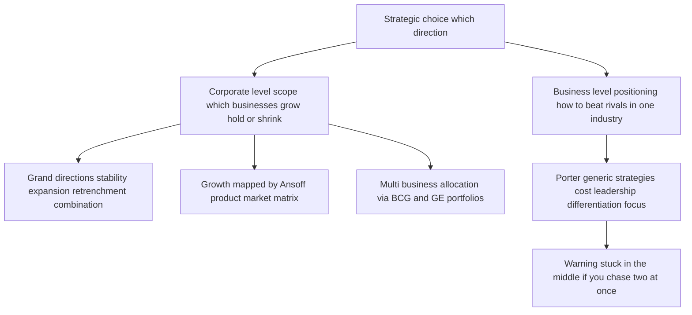
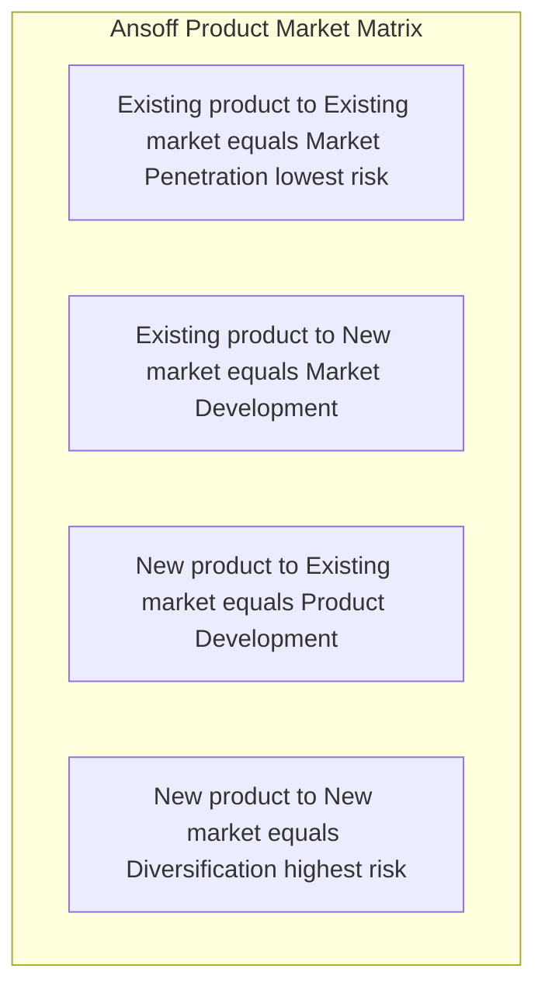
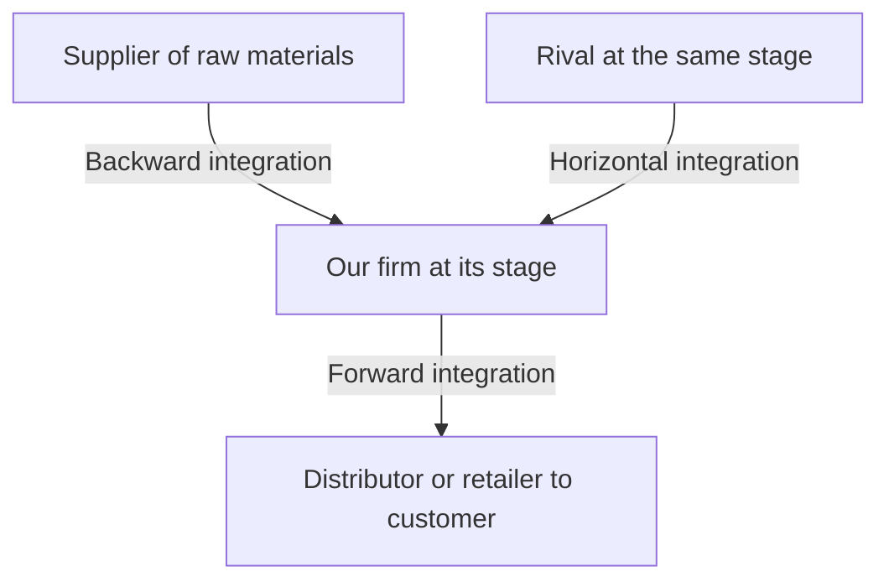
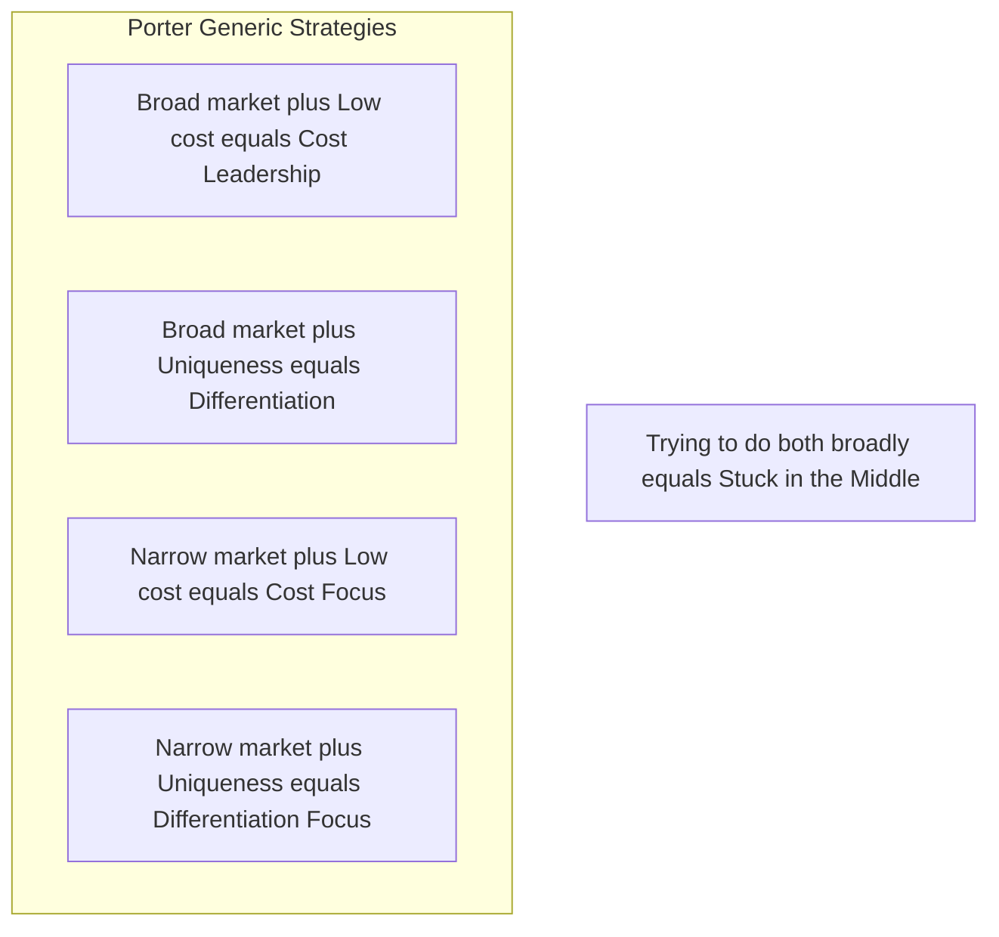
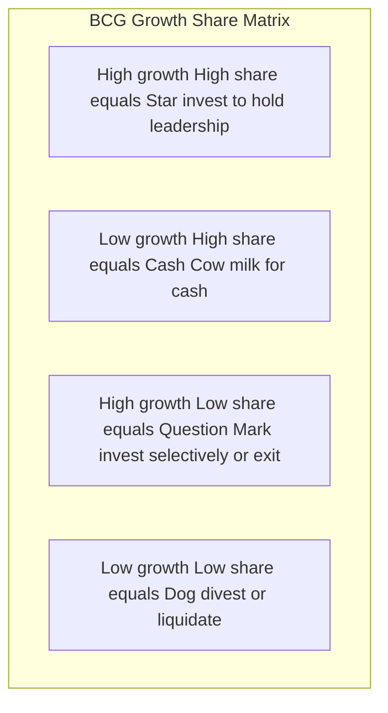

# Chapter 13 — SM: Strategic Choices

## 1. The Problem

By now the strategist has done the hard analytical work. The external scan (Chapter 11) mapped the terrain — the industry structure, the five forces, the PESTLE trends. The internal scan (Chapter 12) audited the army — the resources, capabilities, and the one or two core competences that might win a war. The manager sits at the desk holding a rich diagnosis. And now comes the moment that analysis was only ever a servant to: **a decision must be made about where the firm will go.**

Here is the brutal truth that forces the decision. **A firm cannot be all things to all people, in all markets, at all price points, all at once.** Resources are finite. Management attention is the scarcest resource of all. A rupee of capital spent entering a new country is a rupee not spent deepening the home market; a factory built to chase volume at low cost is a factory that cannot also be tuned to craft premium bespoke goods. Every strategy that says *yes* to one path implicitly says *no* to a dozen others. Strategy, in the words often attributed to Michael Porter, is fundamentally about **what NOT to do** — about deliberately choosing a narrow, defensible position rather than sprawling everywhere and standing for nothing.

The firm that refuses to choose does not thereby keep all its options open. It becomes *incoherent*: it spreads its capital thin, confuses its customers about what it stands for, and gets beaten in every segment by rivals who concentrated their fire. The airline that tries to be both the cheapest and the most luxurious ends up neither cheap enough for the budget flier nor plush enough for the business traveller — and both walk to competitors who chose.

So the manager faces two nested questions of *direction*:

1. **At the level of the whole corporation:** In what businesses should we be, and should the overall enterprise grow, hold steady, or shrink? *This is corporate-level strategy.*
2. **At the level of each individual business:** Within a given industry, how will this business win against its direct rivals? *This is business-level (competitive) strategy.*

These two questions demand different tools because they solve different problems. The corporate question is about *scope* — the breadth of the firm's playing field. The business question is about *positioning* — how to beat the players already on your field. This chapter arms the strategist with the classic frameworks that structure each choice, and — crucially — teaches each framework by the specific choice it exists to discipline. Because a framework you cannot connect to a decision is just a diagram to memorise, and this guide has no patience for that.

---

## 2. The Core Idea (Analogy)

Think of the firm as a **general commanding an army across a theatre of war**, deciding on strategy for a whole campaign.

The general faces two entirely different classes of decision, and confusing them loses wars.

The first is the **grand-strategic** decision, taken at headquarters: *On how many fronts do we fight, and are we advancing, holding, or retreating?* Do we open a second front in a new territory (expansion)? Do we consolidate the ground we hold and dig in (stability)? Do we abandon an indefensible salient to save the army (retrenchment)? Do we advance on one front while withdrawing from another (combination)? This is the choice about **the shape and size of the whole war** — which theatres, how many, growing or shrinking. In business language this is **corporate-level strategy**, and it is set at the top, for the enterprise as a whole.

The second is the **field-tactical** decision, taken by the commander of each individual front: *Given that I must fight the enemy already dug in opposite me on this particular battlefield, how do I actually beat him?* Do I win by being cheaper to supply and outlasting him in a war of attrition (cost leadership)? Do I win by fielding a uniquely superior weapon he cannot match (differentiation)? Or do I ignore the broad front and concentrate all my force on one narrow gap in his line (focus)? This is the choice about **how to win a single battle against a specific foe**. In business language this is **business-level (competitive) strategy**.

The genius of the classic frameworks is that they are *maps for these two distinct decisions*. When the general asks "which fronts, growing or shrinking?" the **Ansoff matrix** lays out the growth options and the **BCG/GE portfolios** show which fronts to feed and which to starve. When the field commander asks "how do I beat the enemy opposite me?" **Porter's generic strategies** name the three — and only three — coherent ways to win, and warn that the commander who tries to do two at once ends up "stuck in the middle," beaten by both the cost-attritionist and the superior-weapon specialist.

The rest of this chapter is the general's toolkit — each tool tied to the exact question a commander would be foolish to answer without it.

---

## 3. Why It's Built This Way

**Why separate corporate strategy from business strategy at all?** Because they answer different questions and are owned by different people. A diversified group like the Tata or Aditya Birla conglomerate has a *corporate* headquarters deciding which industries to be in — steel, software, telecom, retail — and, separately, each of those businesses has its own leadership deciding how to beat *its* rivals. The corporate question is "what game(s) should we play?"; the business question is "how do we win the game we're in?" A single-business firm collapses the two, but the *logic* is still distinct: first pick the field, then pick how to fight on it. Mixing them produces the classic error of answering a positioning question with a scope answer ("we'll grow!" is not a strategy for beating a rival who is out-innovating you).

**Why does corporate strategy come down to just four grand directions — stability, expansion, retrenchment, combination?** Because at the highest level of abstraction, a firm relative to its current position can only do one of three things — *stay roughly where it is, get bigger, or get smaller* — plus the real-world truth that a multi-business firm usually does several of these at once (combination). These are not arbitrary; they are the exhaustive logical set of directional moves. Every specific corporate action (a merger, a plant closure, a new-country launch) is a species of one of these four genera. The taxonomy exists so a board can classify and debate its posture without drowning in individual deals.

**Why did Igor Ansoff build a 2×2 of products against markets in 1957?** Because "we want to grow" is uselessly vague. Growth has to come from *somewhere*, and there are only two levers a firm can pull: what it sells (products) and who it sells to (markets). Cross "existing vs new" on each axis and you get exactly four growth paths of steadily rising risk. Ansoff's insight was that these four are *not equally risky* — selling more of what you know to people you know is far safer than selling something new to strangers — so a firm can consciously sequence its growth from safe to bold rather than lurching blindly.

**Why did Michael Porter (1980) insist there are only three generic ways to compete?** Because competitive advantage can logically come from only two sources — being the **lowest-cost** producer, or offering something **uniquely valuable (differentiated)** that commands a premium — and a firm can pursue either across a **broad** market or a **narrow** one. That gives cost leadership, differentiation, and focus (with cost and differentiation variants). Porter's deeper claim, and the reason the framework has teeth, is that the *underlying logic* of low cost and of differentiation pull in *opposite directions*: cost leadership demands standardisation and ruthless economy, differentiation demands variety and investment in distinctiveness. A firm that reaches for both usually achieves neither and lands **"stuck in the middle"** — the framework is built precisely to expose that trap.

**Why the portfolio matrices (BCG, GE)?** Because once a firm owns several businesses, the corporate centre faces a *resource-allocation* problem: cash is finite and every unit clamours for it. The board needs a way to see the whole portfolio at a glance and decide *which units to fund, which to milk, and which to abandon*. The BCG matrix (1970) and the richer GE/McKinsey matrix (early 1970s) exist to turn a jumble of businesses into a picture on which those funding decisions can be argued rationally rather than politically.

*Figure 13.1 — The architecture of strategic choice: two levels, each with its own frameworks, each framework tied to a specific decision.*

---

## 4. Full Technical Content

### 4.1 Corporate-Level Strategy: the four grand directions

Corporate strategy answers *what businesses we are in and whether the enterprise as a whole is advancing, holding, or retreating.* There are four grand alternatives.

**(a) Stability strategy.** The firm chooses to *continue with its current businesses, serving broadly the same customers with the same products, at roughly the same scale.* It is the least risky of the strategies and, contrary to the beginner's assumption, it is **not** "doing nothing." A stability strategy is a *conscious decision to maintain the status quo* — to keep the ship on its present heading because the position is comfortable and the environment stable. The firm still works hard: it improves incrementally, defends its share, and consolidates. Stability is appropriate when the firm is doing reasonably well, the environment is not threatening, and the risks of a big move outweigh the rewards. Its danger is **complacency** — a firm that "stabilises" in a fast-moving industry is really just falling behind slowly.

There are recognised sub-types worth naming: **no-change** (carry on, monitor for the need to react), **profit/harvesting** (sacrifice long-term position to prop up short-term profit — often a prelude to exit), and **pause/proceed-with-caution** (a deliberate breather after a burst of rapid expansion, to let the organisation digest before growing again).

**(b) Expansion (Growth) strategy.** The firm seeks *substantial growth* — redefining the business, adding products or markets, or increasing the scale of operations well beyond incremental. This is the most common and most glamorous corporate posture, pursued when the environment is munificent, the firm has slack resources, and management is ambitious. Growth can be achieved organically or by acquisition, and the *directions* of growth (into which products and markets) are precisely what the Ansoff matrix maps, and the *methods* (diversification, integration) are covered in 4.3–4.4. Expansion is riskier than stability — it stretches resources and management — but standing still while rivals grow is often the greater risk.

**(c) Retrenchment strategy.** The firm *pulls back* — reducing the scope of its activities, exiting weak businesses, cutting costs sharply, or shrinking to a defensible core. It is chosen under distress: when performance is poor, the environment has turned hostile, or the firm has over-extended. Retrenchment is not defeat; it is *surgery to save the patient*. Its recognised forms escalate in severity:

- **Turnaround** — the firm stays in its businesses but radically overhauls operations to reverse a decline: cutting costs, shedding assets, changing management, refocusing on core products. The *intention is recovery*, not exit.
- **Divestment (divestiture)** — the firm *sells or spins off* a business unit or major asset. Chosen when a unit is a persistent drain, is worth more to someone else, or when the cash is needed to strengthen the core. A turnaround that fails often ends in divestment.
- **Liquidation** — the most extreme: the business is *closed down* and its assets sold piecemeal. It is the strategy of last resort, an admission that the business cannot be saved or sold as a going concern, chosen to salvage whatever value remains before it evaporates.

**(d) Combination strategy.** In reality, a diversified firm rarely applies a single posture across all its businesses. **Combination** means *pursuing two or more of the above simultaneously or sequentially across different units.* The classic case: a conglomerate *grows* its promising software arm, *holds steady* in its mature steel business, and *retrenches* out of a loss-making telecom venture — all in the same year. Combination is the norm for large multi-business enterprises precisely because different units sit at different points in their life cycles and face different environments. It can also be *sequential*: expand, then pause (stability), then retrench a weak spin-off, then expand again.

| Grand direction | Core move | When chosen | Sub-types |
|---|---|---|---|
| Stability | Maintain current position | Doing well; stable, low-threat environment | No-change; profit/harvesting; pause/proceed-with-caution |
| Expansion | Substantial growth in products/markets/scale | Munificent environment; slack resources; ambition | Concentration; integration; diversification; cooperation/internationalisation |
| Retrenchment | Pull back to a defensible core | Poor performance; hostile environment; over-extension | Turnaround; divestment; liquidation |
| Combination | Different postures across different units | Multi-business firm; units at different life stages | Simultaneous or sequential mixes |

### 4.2 The Ansoff Product-Market Matrix — mapping the *directions* of growth

Once a firm has chosen expansion, *where* should it grow? Igor Ansoff (1957) answered with the **product-market matrix**, crossing products (existing vs new) against markets (existing vs new) to yield four growth strategies of increasing risk.

*Figure 13.2 — Ansoff's four growth paths, ordered from the safest (penetration, both known) to the boldest (diversification, both new).*

- **Market Penetration** — *existing products, existing markets.* Sell more of what you already make to the customers you already have. Levers: increase usage frequency, win rivals' customers, convert non-users, cut price, advertise harder. It is the **lowest-risk** path because nothing is unfamiliar. A toothpaste brand pushing "brush twice a day" to grow consumption is penetrating.
- **Market Development** — *existing products, new markets.* Take today's product to new customer groups or geographies. Levers: new regions/countries, new customer segments, new distribution channels. Risk is moderate — the product is proven, but the market's needs and competition are unknown. A biscuit maker entering a new state or exporting abroad is developing markets.
- **Product Development** — *new products, existing markets.* Sell something new to your loyal customer base. Levers: new features, new variants, next-generation products for people who already trust you. Risk is moderate — you know the customers, but the product is unproven. A bank offering its existing account-holders a new insurance product is developing products.
- **Diversification** — *new products, new markets.* Enter a business new to the firm on both axes. This is the **highest-risk** path — everything is unfamiliar — and it is important enough that Ansoff treats it as its own major growth strategy, examined next.

The matrix disciplines the growth conversation by forcing "we'll grow" into one of four boxes and making the **risk gradient explicit**: a prudent firm generally exhausts penetration before it develops markets or products, and diversifies only with eyes open to the risk.

### 4.3 Diversification — related and unrelated

Diversification (the fourth Ansoff cell) means entering *new products for new markets* — a business genuinely new to the firm. The critical distinction is *how connected* the new business is to the existing one.

- **Related (concentric) diversification** — the new business shares a meaningful *link* with the existing one: common technology, similar production skills, shared distribution channels, related customers, or a common brand. The strategic logic is **synergy** — the "2 + 2 = 5" effect where the combined businesses are worth more than the sum because they share and reinforce resources. A shampoo maker moving into soaps and skincare (shared FMCG distribution, R&D, and brand) is diversifying relatedly. Because it builds on existing competences, related diversification is generally **lower-risk** and more defensible.
- **Unrelated (conglomerate) diversification** — the new business has *no meaningful operational link* to the existing one; the firm simply enters an attractive industry. The logic here is **not** operational synergy but **financial**: spreading risk across uncorrelated businesses, deploying surplus cash into higher-return opportunities, and exploiting general management skill. A steel company buying an insurance business is diversifying conglomerately. It is **higher-risk** because the firm has no special competence in the new field and cannot draw on shared operations — the only glue is the corporate centre's capital and management.

The examiner's favourite point: **relatedness is the source of synergy, and synergy is the justification for diversification.** Unrelated diversification that cannot show a real financial or managerial rationale is often value-destroying — the market can diversify risk more cheaply than a conglomerate can.

### 4.4 Integration — vertical and horizontal

A special, disciplined form of expansion is **integration** — growing along the *industry's own value system* rather than into unrelated fields.

- **Vertical integration** — the firm expands into *stages of its own supply chain*, taking ownership of activities it previously bought or sold to.
  - **Backward (upstream) integration** — moving *towards the source of supply*: a manufacturer acquires its raw-material supplier. Motive: secure inputs, control quality, capture the supplier's margin, reduce dependence. A car maker buying a steel or tyre plant integrates backward.
  - **Forward (downstream) integration** — moving *towards the customer*: a manufacturer acquires its distributor or retail outlets. Motive: control the route to market, capture the retailer's margin, get closer to customer information. A manufacturer opening its own branded retail stores integrates forward.
- **Horizontal integration** — the firm expands by *acquiring or merging with competitors at the same stage of the value chain* — a rival making the same product. Motive: gain market share, achieve economies of scale, reduce competition, widen the product line for the same customers. One cement maker buying another is horizontal integration.

*Figure 13.3 — Directions of integration: vertical moves up and down the firm's own supply chain, horizontal moves sideways to absorb same-stage rivals.*

Integration is really a *subset of expansion*, but it deserves its own vocabulary because the strategic logic — controlling the value system versus entering new value systems — is distinct from diversification.

### 4.5 Business-Level Strategy: Porter's Generic Strategies

Now descend from the corporation to a *single business* facing rivals in its industry. The question changes entirely: **not "which businesses?" but "how do we beat the specific competitors on this field?"** Michael Porter (1980) argued that any coherent answer reduces to one of **three generic strategies**, defined by two choices: the *source* of advantage (low cost vs differentiation) and the *scope* of the target (broad vs narrow).

*Figure 13.4 — Porter's generic strategies as a 2×2 of competitive scope against source of advantage — with the fatal "stuck in the middle" outcome for the firm that will not choose.*

**(a) Cost Leadership.** The business aims to be the **lowest-cost producer in its industry**, serving a broad market. It sells at or near the average price but, because its costs are lowest, it earns above-average margins — and in a price war it can undercut everyone and survive when rivals bleed. Cost leadership is built from **economies of scale, tight cost control, efficient operations, low-cost inputs, standardised products, and experience-curve effects.** The classic exemplar is a no-frills low-cost airline or a mass-market retailer competing on everyday low prices. Note the crucial subtlety: the goal is *lowest cost*, not necessarily lowest price — the low cost is the weapon; the firm chooses when to convert it into low price. Its vulnerability: a technological shift that wipes out the scale advantage, or rivals learning to imitate the cost base.

**(b) Differentiation.** The business aims to offer something **perceived as unique across the industry** — superior quality, design, brand, features, service, or technology — for which customers willingly pay a **price premium**. The premium must exceed the extra cost of being distinctive, so profit comes from the *gap* between premium and added cost. Differentiation builds **customer loyalty and lowers price sensitivity**, insulating the firm from price competition. Exemplars: premium smartphone brands, luxury goods, firms competing on trusted quality. Its vulnerability: customers may decide the premium is not worth it (especially in a downturn), imitators may erode the uniqueness, or the basis of differentiation may cease to matter to buyers.

**(c) Focus (Niche).** The business targets a **narrow segment** — a particular buyer group, product line, or geographic market — and serves it exceptionally well, *either* by being the lowest cost within that niche (**cost focus**) *or* by being uniquely differentiated for that niche (**differentiation focus**). The logic: by concentrating on one narrow target, the focuser meets its needs better than broad-line rivals who must compromise to serve everyone. Exemplar: a firm making specialised equipment for one industry, or a boutique serving one affluent segment. Its vulnerability: the niche may shrink or vanish, broad rivals may sub-segment and attack the niche, or the cost of focus may rise until broad players undercut it.

**(d) The "Stuck in the Middle" trap.** This is Porter's sharpest warning and a perennial exam favourite. A firm that **fails to make a clear generic choice** — that tries to be both low-cost *and* differentiated across a broad market — usually achieves **neither**. It cannot match the cost leader's prices because it carries the costs of differentiation, and it cannot match the differentiator's distinctiveness because it compromises to keep costs down. The result is **below-average profitability**: beaten on price by the cost leader, beaten on value by the differentiator, and abandoned by focused rivals in every niche. The reason is structural, not a matter of effort: the *underlying activities* required for low cost (standardisation, economy) and for differentiation (variety, investment) genuinely conflict. **The whole point of the generic-strategy framework is to force a clear, committed choice** — which is the chapter's opening theme made concrete at the business level.

(The examiner will accept, and Porter later conceded, that a few firms achieve *both* low cost and differentiation — e.g., when a quality-driven redesign also cuts waste. But this is treated as the exception; the default teaching is that a firm must commit to one generic strategy.)

### 4.6 Portfolio Analysis: allocating cash across many businesses

For a *multi-business* firm, one further corporate question remains: **among the businesses we own, which do we feed with cash, which do we milk, and which do we abandon?** Two portfolio matrices answer this by plotting each business unit (SBU) on a grid.

**The BCG Growth-Share Matrix (Boston Consulting Group, 1970).** It plots each SBU on two axes: **market growth rate** (vertical — a proxy for the *cash the unit needs* to keep up) against **relative market share** (horizontal — a proxy for the *cash the unit generates*, via scale and experience). This yields four quadrants:

*Figure 13.5 — The BCG matrix: each business unit placed by its market growth and its relative share, prescribing a cash strategy for each quadrant.*

| Quadrant | Growth | Share | Cash behaviour | Prescribed strategy |
|---|---|---|---|---|
| **Star** | High | High | Generates and consumes lots of cash | Invest to hold/grow leadership; tomorrow's cash cow |
| **Cash Cow** | Low | High | Generates far more cash than it needs | Milk it; use its surplus to fund Stars and Question Marks |
| **Question Mark** (Problem Child) | High | Low | Consumes lots of cash, generates little | Invest selectively to build into a Star, or divest |
| **Dog** | Low | Low | Ties up cash for little return | Divest or liquidate |

The BCG logic is a **cash-flow story**: the surplus from *Cash Cows* funds *Stars* (to keep them winning) and selected *Question Marks* (to turn them into Stars), while *Dogs* are cut loose. The balanced portfolio has cows to fund the future and stars/question-marks to *be* the future. Its **limitations** — heavily examined — are that it uses only *two* crude variables, treats market share as the sole driver of profitability, defines "market" ambiguously, and the label "Dog" can prematurely condemn a unit that still throws off useful cash.

**The GE/McKinsey Nine-Cell Matrix (early 1970s).** Built to fix BCG's crudeness, the GE matrix replaces the two single-factor axes with two **composite, multi-factor** axes: **Industry (market) attractiveness** (built from growth, size, profitability, competitive intensity, regulation — not just growth) on one axis, and **Business (competitive) strength** (built from market share, brand, cost position, technology, quality — not just share) on the other. Each axis is scored High / Medium / Low, giving a **3×3, nine-cell grid**.

| Business strength ↓ / Industry attractiveness → | High attractiveness | Medium | Low |
|---|---|---|---|
| **High strength** | Invest / Grow | Invest / Grow | Selectivity / Hold |
| **Medium** | Invest / Grow | Selectivity / Hold | Harvest / Divest |
| **Low** | Selectivity / Hold | Harvest / Divest | Harvest / Divest |

The three diagonal *zones* give the prescription: the **top-left green zone** (attractive industry + strong business) says **invest and grow**; the **middle diagonal yellow zone** says **be selective / hold / earn**; the **bottom-right red zone** (weak business + unattractive industry) says **harvest or divest**. Because its axes are richer and its resolution finer (nine cells not four), the GE matrix gives more nuanced guidance than BCG — at the cost of requiring subjective weighting of many factors, which is its own limitation. Both matrices serve the *same underlying decision*: **where to put the corporation's finite cash.**

---

## 5. Applied Cases

**Case 1 — The FMCG major deciding how to grow (Ansoff + diversification + integration).**
*Scenario:* "SwadFoods" is India's leading packaged-snacks maker, dominant in its home region, with strong distribution and a trusted brand. The board wants growth. Advise using the appropriate framework.

*Application:* This is a corporate **expansion** decision, and the directions are mapped by **Ansoff**. The safest first move is **market penetration** — push existing snacks harder in the home region via promotion and wider availability (lowest risk). Next, **market development** — take the same snacks to new states or export markets (product proven, market new). In parallel, **product development** — launch new snack variants to the existing loyal base. **Diversification** into, say, packaged beverages would be *related* (shared FMCG distribution, brand, and shelf presence → real synergy) and therefore defensible; diversifying into, say, real estate would be *unrelated* and hard to justify without a purely financial rationale. If input costs and supply reliability are the pressure point, **backward integration** into a potato-processing or oil-supply operation secures inputs; if reaching customers is the issue, **forward integration** into branded retail outlets tightens the route to market. *Conclusion:* sequence growth up the Ansoff risk gradient, favour *related* diversification for synergy, and use integration only where controlling a supply-chain stage solves a real problem.

**Case 2 — The airline that got "stuck in the middle" (Porter's generic strategies).**
*Scenario:* "MidAir" tried to offer business-class comfort *and* budget fares. It lost money for years while a low-cost carrier and a full-service premium carrier both thrived. Diagnose using Porter.

*Application:* MidAir attempted **both** cost leadership and differentiation on a broad market and achieved **neither** — the textbook **stuck-in-the-middle** outcome. Its comfort features (differentiation costs) meant it could never match the low-cost carrier's fares; its fare-cutting meant it could never invest enough to match the premium carrier's product. It was **beaten on price by the cost leader and on value by the differentiator**, exactly as Porter predicts, because the activities required for the two sources of advantage genuinely conflict. *Remedy:* MidAir must make a committed generic choice — either strip out costs and become a true **cost leader** competing on price, *or* invest to become a genuine **differentiator** commanding a premium, *or* retreat to a defensible **focus** niche (e.g., a specific profitable route bundle it can dominate). The lesson is the chapter's opening theme: refusing to choose is itself a losing choice.

**Case 3 — The conglomerate rationing cash across its units (BCG + GE + corporate directions).**
*Scenario:* "VistaGroup" owns four businesses: a booming fintech app (high growth, low share), a dominant legacy cement business (low growth, high share), a fast-growing solar unit where it leads (high growth, high share), and a shrinking landline-telecom unit with tiny share (low growth, low share). Advise the board.

*Application:* Plot on the **BCG matrix**: cement is a **Cash Cow** (milk it for surplus), solar is a **Star** (invest to hold leadership — tomorrow's cash cow), fintech is a **Question Mark** (invest *selectively* to try to turn it into a Star, else exit), and landline-telecom is a **Dog** (divest or liquidate). The cash-flow prescription: **use the cement cow's surplus to fund the solar star and the fintech question mark, and cut the telecom dog.** Translated into *corporate grand directions*, VistaGroup is running a **combination strategy** — *expansion* in solar and fintech, *stability/harvesting* in cement, and *retrenchment (divestment/liquidation)* in telecom, all at once. For a *richer* read incorporating profitability, regulation, and competitive strength — not just growth and share — the board should re-plot on the **GE nine-cell matrix**, which might, for instance, reveal that the "Dog" telecom unit sits in an unattractive industry *and* has weak business strength (firmly in the red harvest/divest zone), confirming the exit — while checking that fintech's industry attractiveness justifies the selective investment.

---

## 6. Framework Summary

| Framework / Model | Author & year | The choice it structures | Core content |
|---|---|---|---|
| Four grand corporate directions | Standard SM taxonomy | Should the enterprise grow, hold, shrink, or mix? | Stability, Expansion, Retrenchment, Combination |
| Retrenchment sub-types | Standard SM | How far to pull back under distress | Turnaround → Divestment → Liquidation (rising severity) |
| Ansoff Product-Market Matrix | Igor Ansoff, 1957 | *Where* to grow (which products, which markets) | Penetration, Market Dev, Product Dev, Diversification (rising risk) |
| Related vs Unrelated diversification | Standard SM | How connected the new business should be | Related = synergy, lower risk; Unrelated = financial logic, higher risk |
| Vertical & Horizontal integration | Standard SM | Grow along the value system vs sideways | Backward, Forward (vertical); same-stage rivals (horizontal) |
| Porter's Generic Strategies | Michael Porter, 1980 | How a single business beats its rivals | Cost Leadership, Differentiation, Focus (+ stuck-in-the-middle warning) |
| BCG Growth-Share Matrix | Boston Consulting Group, 1970 | Which multi-business units to fund/milk/cut | Stars, Cash Cows, Question Marks, Dogs (cash-flow logic) |
| GE / McKinsey Nine-Cell Matrix | GE & McKinsey, early 1970s | Same, with richer multi-factor axes | Industry attractiveness × Business strength → Invest / Selectivity / Harvest |

---

## 7. Connections

- **To Chapters 11–12 (external and internal analysis):** Strategic choice is where the two analyses *converge into action*. The external scan (attractiveness of industries, five forces) feeds the *industry-attractiveness* axis of the GE matrix and tells you whether a market is worth entering (Ansoff, diversification). The internal scan (core competences, VRIO) tells you whether you can *win* there — feeding the *business-strength* axis and grounding Porter's choice (your competence determines whether cost leadership or differentiation is even feasible). **Choice without prior analysis is gambling; analysis without choice is paralysis.**
- **To SWOT/TOWS (Ch. 12):** The generic and corporate strategies are the *menu* from which the TOWS synthesis selects. A "Strength–Opportunity" cell in TOWS often points to *expansion*; a "Weakness–Threat" cell often points to *retrenchment*.
- **Porter's earlier work:** The generic strategies (this chapter) are the strategist's *response* to the Five Forces (Ch. 11). You differentiate to reduce buyer power and rivalry; you pursue cost leadership to survive intense rivalry. The two Porter frameworks are two halves of one argument.
- **Forward to strategy implementation & the value chain:** A chosen generic strategy dictates how the *value chain* (Ch. 12) must be configured — a cost leader tunes every activity for economy; a differentiator invests in the activities that create uniqueness. Choice sets the target; implementation (structure, systems, the McKinsey 7S) delivers it.

---

## 8. Traps & Examiner Tricks

1. **"Stability strategy means doing nothing."** *False.* Stability is a *conscious, active* decision to maintain position — the firm still improves and defends. Never equate stability with inaction.
2. **Confusing the two *levels*.** Corporate strategy = *which businesses / grow-hold-shrink*; business strategy = *how to beat rivals in one industry*. An exam question about "how to compete against a rival" wants **Porter**, not Ansoff. A question about "which businesses to invest in" wants **BCG/GE**, not generic strategies.
3. **Cost leadership ≠ low price.** The cost leader has the *lowest cost*; it may still price near the market average and pocket the margin. Do not say a cost leader must always charge the lowest price.
4. **Mislabelling integration as diversification.** Integration is growth *along the firm's own value system* (its suppliers, distributors, or same-stage rivals). Diversification is entry into a *new business*. Backward/forward = vertical; same-stage = horizontal. Keep them separate.
5. **Ansoff risk ordering.** Penetration (lowest) → Market/Product Development (moderate) → Diversification (highest). Examiners love asking you to rank them by risk — memorise the gradient *and its reason* (both-known is safest, both-new is riskiest).
6. **"Stuck in the middle" mis-diagnosis.** It is the specific failure of trying to be *both* cost leader *and* differentiator on a *broad* market and achieving neither — not merely "a weak firm." State the *mechanism*: beaten on price by the cost leader and on value by the differentiator.
7. **BCG axes reversed.** Vertical axis = **market growth rate** (cash *needed*); horizontal = **relative market share** (cash *generated*). Swapping them flips every quadrant. Also: a **Dog** is low-growth *and* low-share, not just "a bad business."
8. **BCG vs GE confusion.** BCG = 4 cells, 2 *single-factor* axes (growth, share). GE = 9 cells, 2 *multi-factor* axes (industry attractiveness, business strength). If a question stresses "many factors" or "nine cells," it wants GE. Know both authors and years.
9. **Related vs unrelated diversification rationale.** Related diversification's justification is **synergy** (shared operations); unrelated's is **financial** (risk-spreading, cash deployment). Don't attribute operational synergy to unrelated diversification — it has none.
10. **Retrenchment ≠ failure/defeat.** It is a legitimate strategic choice (surgery to save the firm). Know the escalating order: turnaround (fix and stay) → divestment (sell a unit) → liquidation (close and sell assets).

---

## 9. First-Principles Recap

Strip everything to bedrock and the chapter is one idea unfolding: **because resources and attention are finite, a firm must choose a direction — and every real "yes" is a hundred implicit "no"s.** That single constraint generates the whole edifice.

- At the **corporate** level, the finite-resource constraint means the enterprise, relative to its current footprint, can only *hold* (stability), *grow* (expansion), *shrink* (retrenchment), or *mix these across units* (combination). Four directions, logically exhaustive.
- When it chooses to grow, growth must come from *products* or *markets*, each *old or new* — Ansoff's four cells, ordered by risk because unfamiliarity *is* risk.
- Growth into new businesses is disciplined by *relatedness* (synergy vs pure financial logic) and, when it moves along the industry's own chain, by *integration* (vertical up/down, horizontal sideways).
- At the **business** level, advantage can spring from only two roots — *being cheapest* or *being uniquely valuable* — pursued *broadly or narrowly*: Porter's three generic strategies. And because the two roots demand *opposite* activities, reaching for both leaves you *stuck in the middle*, beaten by everyone who chose.
- When a firm owns *many* businesses, finite cash must be *rationed*: the portfolio matrices (BCG's cash-flow logic, GE's richer multi-factor read) turn "which units to feed" into a picture you can argue over.

Every framework in this chapter is a *disciplined way of making one choice the finite-resource constraint forces upon the firm.* Learn the choice, and the framework is obvious. Memorise the framework without the choice, and you have learned nothing.

---

## 10. Quick-Revision Sheet

**Two levels of choice:** Corporate (*which businesses / grow-hold-shrink*) vs Business (*how to beat rivals in one industry*).

**Corporate grand directions (4):** Stability (no-change / profit / pause) · Expansion (growth) · Retrenchment (turnaround → divestment → liquidation) · Combination (mix across units).

**Ansoff (1957) — growth by product × market, rising risk:**
- Penetration (old product, old market) — lowest risk
- Market Development (old product, new market)
- Product Development (new product, old market)
- Diversification (new product, new market) — highest risk

**Diversification:** Related (concentric) = shared resources → *synergy*, lower risk · Unrelated (conglomerate) = no link → *financial* logic, higher risk.

**Integration:** Vertical — Backward (towards supplier) / Forward (towards customer); Horizontal — absorb same-stage rivals.

**Porter (1980) generic strategies (business level):**
- Cost Leadership — lowest cost, broad market (scale, efficiency, standardisation)
- Differentiation — unique value, broad market, price premium
- Focus — narrow niche, via cost focus *or* differentiation focus
- **Stuck in the middle** — chase two at once → neither → below-average profit

**BCG (1970) — Growth (cash needed) × Relative Share (cash generated):**
- Star (Hi-Hi) → invest to hold · Cash Cow (Lo-Hi) → milk · Question Mark (Hi-Lo) → invest selectively or exit · Dog (Lo-Lo) → divest. *Cows fund stars and question marks; cut dogs.*

**GE/McKinsey (early 1970s) — 9 cells:** Industry Attractiveness × Business Strength (multi-factor) → green *Invest/Grow*, yellow *Selectivity/Hold*, red *Harvest/Divest*. Richer than BCG.

**One-line spine:** *Finite resources force a choice → corporate scope (Ansoff / diversification / integration / portfolios) and business positioning (Porter) → refusing to choose loses.*
