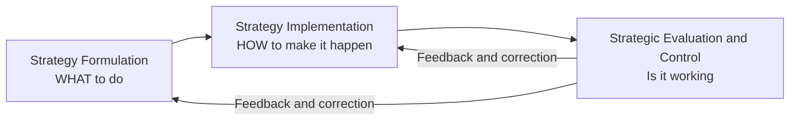
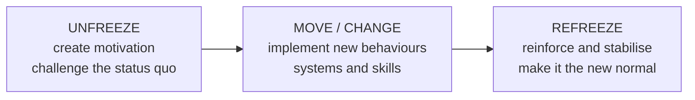
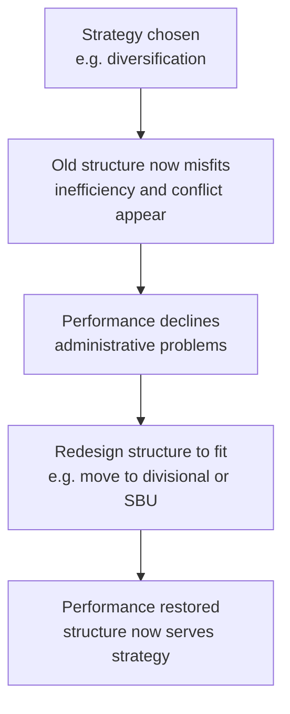
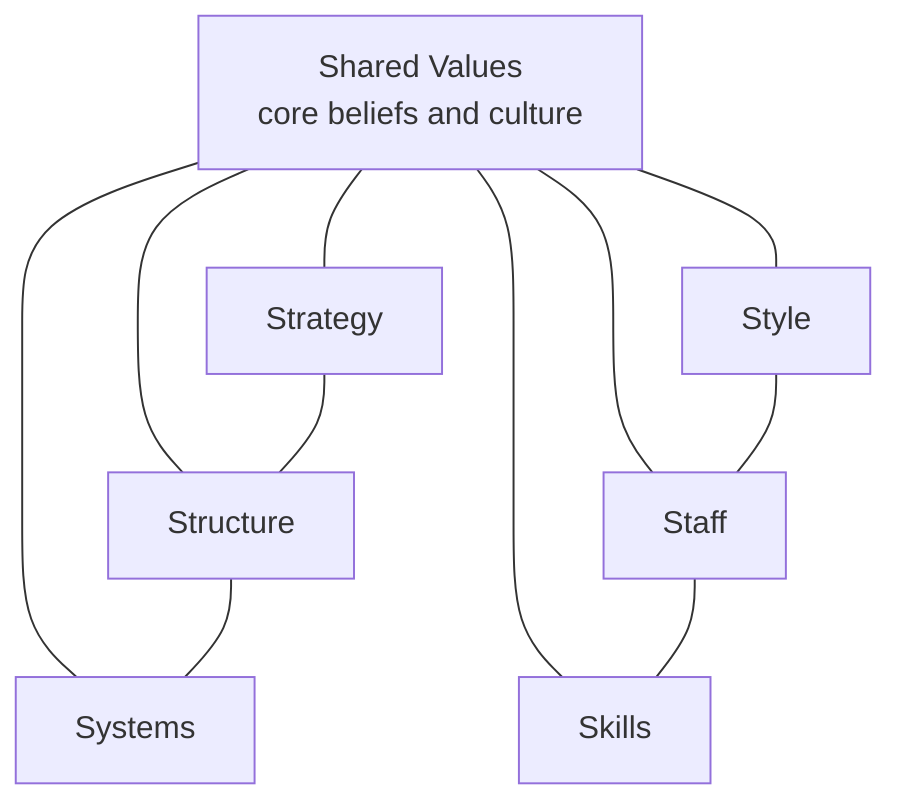
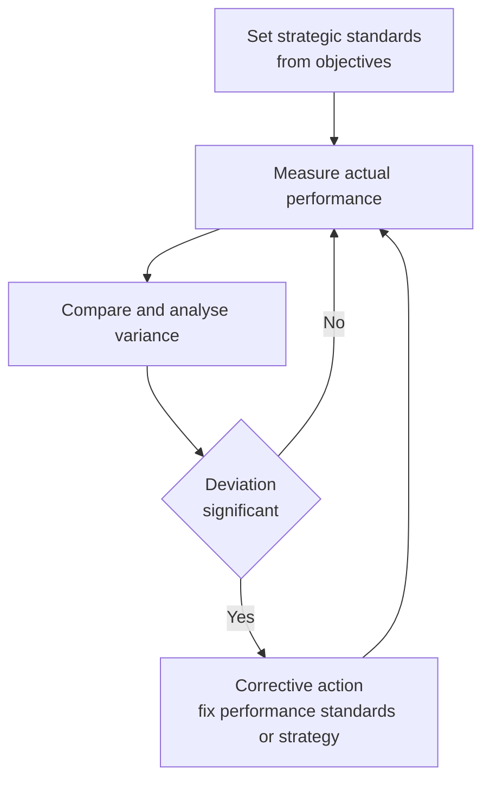
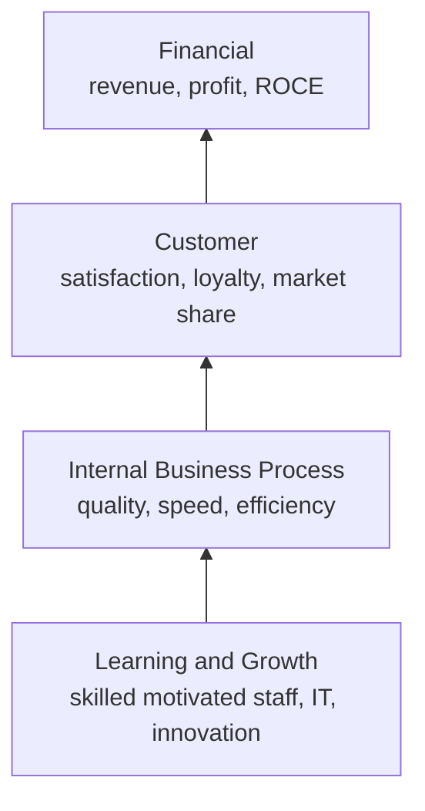

# Chapter 14 — SM — Strategy Implementation & Evaluation

## 1. The Problem

Imagine you are the newly appointed CEO of a mid-sized Indian dairy company. You spend six months and a large consulting fee producing a beautiful strategy: move from selling loose milk to branded value-added products — cheese, flavoured yoghurt, paneer — targeting urban health-conscious consumers. The logic is watertight. The market data is real. The board applauds. The 120-page strategy document is bound in glossy covers and placed on every director's shelf.

Eighteen months later, nothing has changed. Milk still leaves the plant in cans. The sales force still calls on the same sweet-shops. The factory manager never got the new packaging line because "budgets were tight." The regional heads quietly ignored the plan because their bonuses are still tied to litres of milk sold, not rupees of branded product. The document is on the shelf; the company is exactly where it was.

This is the single most important — and most humbling — fact in strategic management: **a brilliant strategy that is not executed is worth less than a mediocre strategy that is.** Research consistently finds that the majority of strategies fail not because they were wrongly *chosen*, but because they were never properly *implemented*. This is called the **strategy-execution gap**.

So the problem this chapter answers is: **once you know WHAT to do, how do you actually make an organisation DO it — and how do you know whether it worked?**

That single problem splits into four managerial questions, and every framework in this chapter is an answer to one of them:

| Manager's real question | The tool that answers it |
|---|---|
| "My people resist the new plan. How do I move them?" | Strategic change management (Lewin, Kurt Lewin's three-stage model) |
| "My current org chart was built for the OLD strategy. What shape should it be now?" | Structure-follows-strategy (Chandler); structural types |
| "I've changed the boxes on the chart, but the culture and skills still pull the old way." | McKinsey 7S Framework (hard + soft elements) |
| "How do I know, mid-flight, whether the strategy is actually working — before it's too late?" | Strategic control & the Balanced Scorecard (Kaplan & Norton) |

Notice the sequence. You cannot implement without overcoming resistance (change), you cannot execute without the right vehicle (structure), the vehicle only moves if all its parts are aligned (7S), and you are flying blind without instruments (control). We will build each idea only *after* we have felt the pain it removes.

---

## 2. The Core Idea

Strategy has two halves, and students consistently underrate the second one.

**Strategy Formulation** is deciding *what* to do — analysis, choice, positioning. It is done by a few people, at the top, using judgement, before the action. It is entrepreneurial and analytical.

**Strategy Implementation** is *making it happen* — action, coordination, resource commitment. It involves *many* people, across all levels, using operational and administrative skill, during the action. It is about integration.

The core idea of this chapter is captured in one sentence: **Formulation is placing forces before the action; implementation is managing forces during the action.** A good strategy sets a direction, but an organisation is a living system of structures, people, incentives, skills and shared beliefs. Change one part and the others fight back. Implementation is therefore not a "final step" — it is a *systems alignment* problem.

The second core idea is about **feedback**. You do not implement a strategy and then wait years to see the annual profit figure. Profit is a *lagging* indicator — by the time it turns bad, the causes are long gone. Modern strategy demands **strategic control**: continuously checking whether the *assumptions* behind the strategy still hold and whether the *drivers* of future performance (customers, processes, learning) are healthy. This is why the Balanced Scorecard exists — to look at the dashboard, not just the rear-view mirror.

*Figure 1: Strategy is a loop, not a line — evaluation feeds corrections back into both formulation and implementation.*

---

## 3. Why It's Built This Way

Why do we treat implementation as a distinct discipline with its own frameworks, rather than assuming "a good manager will just get it done"? Because the failure modes are predictable and structural, not random.

**First, the people who plan are rarely the people who execute.** Strategy is conceived at the top; it is delivered by the middle and the front line. Every layer between the boardroom and the factory floor is a place where meaning can be lost, priorities can be re-interpreted, and quiet resistance can accumulate. This is why change management is a *technical* subject and not just "leadership vibes."

**Second, organisations are built for stability, not for change.** Structures, budgets, reporting lines, reward systems and standard operating procedures exist precisely to make behaviour *repeatable*. That is a virtue during steady state and a curse during strategic change — the very machinery that makes a company efficient at the old strategy actively resists the new one. So you need deliberate mechanisms to overcome the organisation's own inertia.

**Third, the elements of an organisation are interdependent.** You cannot pull one lever in isolation. Give the sales force a new strategy but the old incentive scheme, and the incentive wins every time. This interdependence is exactly what the McKinsey 7S framework was designed to expose — it forces you to check that all seven elements point the same way.

**Fourth, financial results arrive too late to steer by.** Accounting profit tells you how yesterday's decisions turned out. If your only instrument is the P&L, you are driving by looking in the mirror. The Balanced Scorecard was built because managers needed *leading* indicators — signals of future performance — not just lagging financial ones.

So implementation and control have their own frameworks because the problem has a specific shape: dispersed execution, organisational inertia, systemic interdependence, and delayed feedback. Each framework is a purpose-built tool for one of those four realities.

---

## 4. Full Technical Content

### 4.1 The Strategy-Execution Gap and the Nature of Implementation

Implementation is the sum of activities that turn a formulated strategy into results. It typically requires:

- **Institutionalising the strategy** — building it into structures, systems and culture so it becomes "how we do things here."
- **Resource allocation** — directing money, people and time toward the new priorities (a strategy the budget ignores is not a strategy).
- **Structuring** — designing an organisation that can deliver the strategy.
- **Behavioural implementation** — leadership, culture, and managing change and resistance.
- **Functional/operational implementation** — plans, policies and procedures in each function (marketing, finance, operations, HR) that push in the strategy's direction.

The difference between formulation and implementation is worth memorising as a contrast, because examiners love it:

| Dimension | Strategy Formulation | Strategy Implementation |
|---|---|---|
| Nature | Positioning forces *before* action | Managing forces *during* action |
| Focus | Effectiveness — doing the right things | Efficiency — doing things right |
| Process | Primarily intellectual / analytical | Primarily operational / administrative |
| Skills needed | Analytical and conceptual | Motivational, leadership, integrating |
| People involved | A few, at the top | Many, across all levels |
| Requires | Good coordination among a few executives | Coordination among many people |

### 4.2 Strategic Change Management — Overcoming the Human Barrier

The first wall implementation hits is **resistance to change**. People resist for rational and emotional reasons: fear of the unknown, loss of status or security, comfort with the status quo, distrust of management, or simple inertia. Ignoring this is the most common cause of failed implementation.

The foundational model — and the one the ICAI syllabus expects you to know by name — is **Kurt Lewin's Three-Stage Model of Change**:

1. **Unfreezing** — Create the *motivation* to change. Shake the organisation out of its comfortable equilibrium by making the case that the status quo is dangerous (a "burning platform"). Communicate the threats and opportunities. Reduce the forces holding the old behaviour in place. Without unfreezing, people simply refuse to let go.

2. **Changing / Moving** — Implement the new behaviours, structures, systems and skills. This is where training, new processes, new roles and new leadership behaviours are introduced. The organisation is in transition and needs support, communication and quick wins.

3. **Refreezing** — Lock in the new state so it becomes the new normal. Reinforce through revised reward systems, new SOPs, culture and structure, so the organisation does not slide back to old habits. Change that is not refrozen decays.

*Figure 2: Lewin's three-stage model — you must melt the old shape before you can pour the new one, then let it set.*

A practical, expanded roadmap for **managing strategic change** (the version ICAI presents):

- **Recognise the need for change** and diagnose what specifically must change.
- **Create a shared vision** and communicate it relentlessly — people cannot commit to a direction they cannot see.
- **Institutionalise the change** by aligning structure, systems, rewards and culture.
- **Provide resources and training**, and secure the commitment of key managers and opinion leaders.
- **Manage resistance** through participation, communication, education, negotiation and, where necessary, support — turning potential blockers into participants.

The deeper lesson: resistance is *reduced by involvement*. People support what they help create. Participation is not a courtesy; it is the single most effective anti-resistance tool.

### 4.3 Organisation Structure and Strategy — "Structure Follows Strategy"

Once people are willing to move, you need a *vehicle* to move them: the organisation structure. The landmark insight comes from business historian **Alfred D. Chandler**, who studied large American corporations (DuPont, General Motors, Sears, Standard Oil) and concluded: **"Structure follows strategy."**

His argument: when a firm changes its strategy (e.g., diversifies into new products or regions), the *old* structure becomes a source of inefficiency and administrative problems. Performance declines until the firm redesigns its structure to fit the new strategy. Structure is the servant of strategy, not the master — but a mismatched structure will strangle even a great strategy. This is *why* restructuring so often accompanies a strategic shift.

The main structural types the syllabus requires, each suited to a different strategy:

| Structure | Best fit strategy / situation | Key trade-off |
|---|---|---|
| **Simple / Entrepreneurial** | Small firm, single owner-manager, one product/market | Fast and flexible but overloads the owner; fails as firm grows |
| **Functional** | Single or dominant product line, stable environment | Efficient and specialised, but silos and poor cross-coordination |
| **Divisional (Product/Geographic/Market)** | Diversified products, regions or customer groups | Accountability and focus per division, but duplication of resources |
| **Strategic Business Unit (SBU)** | Large, highly diversified firm with many divisions | Groups related divisions for control; adds a management layer |
| **Matrix** | Multiple projects/products needing shared specialists | Flexible, dual expertise, but dual reporting causes conflict |
| **Network / Virtual / Hourglass** | Firms that outsource non-core functions; flat, IT-enabled | Lean and adaptive, but dependence on partners and less control |

**The Hourglass structure** deserves a note because it is distinctly modern and examinable: driven by information technology and business process re-engineering, the middle-management layer is *thinned dramatically*. A broad top (strategic layer) and a broad bottom (operating layer) are connected by a narrow middle — hence "hourglass." Benefits: lower costs, faster communication, empowered lower levels. Cost: fewer promotion opportunities and heavy workload on the surviving middle managers.

*Figure 3: Chandler's logic — a strategy change makes the existing structure a liability until the structure is realigned.*

### 4.4 Leadership and Culture — The Behavioural Engine

Structure is the skeleton; leadership and culture are the muscle and the nervous system.

**Strategic leadership** is the leader's ability to anticipate, envision, maintain flexibility, think strategically, and work with others to initiate changes that create a viable future for the organisation. Two roles dominate implementation:

- **Transformational leadership** — inspiring and energising people to transcend self-interest for the organisation's vision; ideal for large-scale change because it changes *hearts*, not just tasks.
- **Transactional leadership** — managing through exchange (rewards for performance, correction for deviation); useful for steady execution and control.

Effective implementation usually needs both: transformational to set direction and unfreeze, transactional to lock in and refreeze.

**Organisational culture** — the shared values, beliefs, assumptions and norms that govern "how we do things here" — is described by many as the ultimate implementation lever because *culture eats strategy for breakfast*. A strategy that contradicts the prevailing culture will be quietly sabotaged; a strategy consistent with culture is carried along by it.

Managers can shape culture through: the behaviours leaders reward and model; stories and heroes the organisation celebrates; rituals and symbols; recruitment and socialisation; and, above all, the reward system. Where strategy and culture clash, the manager has three broad options: (a) change the strategy to fit the culture, (b) change the culture to fit the strategy (slow and hard), or (c) manage around the culture. The key exam point: **culture must be treated as an active variable in implementation, not a fixed backdrop.**

### 4.5 The McKinsey 7S Framework — Checking That Everything Aligns

Now we reach the integrating framework. You have changed the structure. You have new leadership. But the *strategy still isn't landing*. Why? Because you changed some elements and not others, and the unchanged ones are pulling the organisation back.

The **McKinsey 7S Framework**, developed by **Tom Peters and Robert Waterman** (with Richard Pascale and Anthony Athos) at consulting firm McKinsey, was built precisely to answer: *"Which internal elements must be aligned for a strategy to be implemented successfully?"* Its central claim is that organisational effectiveness comes from the **alignment of seven interdependent elements** — change one and you must realign the rest.

The seven, split into **Hard S's** (tangible, easier for management to define and influence) and **Soft S's** (intangible, culture-driven, harder to change but often decisive):

**Hard elements:**
1. **Strategy** — the plan to build and sustain competitive advantage.
2. **Structure** — how the organisation is arranged; who reports to whom.
3. **Systems** — the daily procedures, processes and information flows (budgeting, IT, appraisal) that get work done.

**Soft elements:**
4. **Shared Values** (originally "Superordinate Goals") — the core beliefs and culture at the *centre* of the model; the glue that holds the other six together.
5. **Style** — the leadership and management style; how managers actually behave and spend their time.
6. **Staff** — the people, their numbers, and how they are recruited, developed and motivated.
7. **Skills** — the distinctive capabilities and competencies of the organisation as a whole.

The genius of the model is that **Shared Values sit at the centre**, connected to all others — signalling that culture is the anchor of alignment. There is no strict hierarchy among the seven; they form a web, and effective implementation means all seven are mutually reinforcing.

*Figure 4: McKinsey 7S — Shared Values at the hub, with hard elements (Strategy, Structure, Systems) and soft elements (Style, Staff, Skills) all interlinked; misalignment anywhere weakens implementation.*

**How to use it as a diagnostic:** list the current state of each S, then the desired state under the new strategy, and find the *gaps* and *conflicts*. Wherever an S contradicts the strategy — old systems, wrong skills, an incompatible style — you have found the reason implementation is stalling.

### 4.6 Strategic Evaluation and Control — Steering the Strategy

Implementation without control is a rocket without guidance. **Strategic evaluation and control** is the process of determining the effectiveness of a strategy in achieving objectives and taking corrective action where needed. It answers: *"Are we still on course, and if not, what do we change?"*

**Why it is essential:** the environment shifts, assumptions made during formulation may prove wrong, and implementation always deviates from plan. Control provides the feedback that keeps strategy adaptive. It performs three functions: (i) it checks whether the strategy is being implemented as planned, (ii) it checks whether the results are as intended, and (iii) it checks whether the *premises* on which the strategy was built still hold.

The generic **control process** has four steps:
1. **Set standards / benchmarks** derived from objectives.
2. **Measure actual performance.**
3. **Compare** actual against standard and analyse variances.
4. **Take corrective action** — adjust performance, standards, or the strategy itself.

**Strategic vs Operational Control — a crucial distinction:**

| Basis | Strategic Control | Operational Control |
|---|---|---|
| Focus | Direction of the whole organisation; "are we doing the right things?" | Efficiency of individual actions; "are we doing things right?" |
| Time horizon | Long term | Short term (days, weeks, months) |
| Concerned with | Environment, assumptions, overall strategy | Resource utilisation, day-to-day operations |
| Nature | Externally oriented, adaptive | Internally oriented, corrective |
| Question asked | Should we continue with this strategy? | Are we meeting the current targets? |

The four **types of strategic control** (from Schendel and Hofer, as presented in the ICAI material):

1. **Premise Control** — checks whether the *assumptions and predictions* on which the strategy was built (about the economy, industry, competitors, technology) are still valid. If a key premise fails, the strategy may need rethinking.
2. **Implementation Control** — assesses whether the strategy should continue or be changed in light of *events as implementation proceeds*, using strategic thrusts (checking milestones) and milestone reviews.
3. **Strategic Surveillance** — a broad, unfocused *monitoring* of a wide range of events inside and outside the firm that could threaten the strategy; deliberately not tied to any one premise.
4. **Special Alert Control** — the rapid, thorough reconsideration of a strategy triggered by a *sudden, unexpected event* (a crisis, an acquisition of a competitor, a natural disaster, a regulatory shock).

*Figure 5: The strategic control loop — continuous comparison of actual against standard, feeding corrective action.*

### 4.7 The Balanced Scorecard — Why Financial Measures Alone Are Insufficient

Here is the sharpest question of the chapter: *what should you measure to know if a strategy is working?* The instinctive answer — "profit and financial ratios" — is dangerously incomplete, and understanding *why* is a favourite examiner theme.

**Why financial measures alone fail:**

- They are **lagging indicators** — they report the *outcomes* of past decisions. By the time profit falls, the damage is done and the causes are gone.
- They say **nothing about the drivers of future performance** — customer loyalty, process quality, employee capability and innovation. A firm can boost this year's profit by slashing R&D and training, and look healthy on the P&L while destroying tomorrow.
- They **encourage short-termism** and can be manipulated through accounting choices.
- They ignore **intangible assets** — brand, knowledge, relationships — which drive value in a modern economy.

To fix this, **Robert Kaplan and David Norton** developed the **Balanced Scorecard (BSC)** in the early 1990s. Its core idea: measure performance across **four balanced perspectives**, linking *lagging* financial outcomes to their *leading* non-financial drivers.

| Perspective | Core question | Example measures |
|---|---|---|
| **Financial** | How do we look to shareholders? | Revenue growth, ROCE, profit margin, cash flow |
| **Customer** | How do customers see us? | Satisfaction, retention, market share, on-time delivery |
| **Internal Business Process** | What must we excel at? | Cycle time, defect/quality rates, cost efficiency, innovation cycle |
| **Learning and Growth** (Innovation & Learning) | Can we continue to improve and create value? | Employee training, skills, IT capability, staff retention, new ideas |

The perspectives are **causally linked**, and this cause-and-effect chain is the intellectual heart of the model: invest in **Learning & Growth** (skilled, motivated staff) → this improves **Internal Processes** (faster, higher quality) → which delights **Customers** (loyalty, repeat business) → which finally produces strong **Financial** results. Read that chain backwards and you see why financials alone are insufficient: they are the *last* link, driven by three earlier links that no purely financial report ever shows you.

*Figure 6: The Balanced Scorecard cause-and-effect chain — non-financial drivers at the bottom feed the financial outcomes at the top; financial results are the last link, not the whole story.*

The BSC is therefore both a **measurement system** and, more powerfully, a **strategic management and communication system**: it translates a strategy into a coherent set of objectives and measures across the four perspectives, so every level of the organisation can see how its work links to the strategy.

---

## 5. Applied Cases

### Case 1 — The Dairy Company Revisited (Change + Structure + 7S)

Return to the branded-dairy CEO from Section 1. Diagnose the failed implementation using our frameworks.

*Change (Lewin):* There was no **unfreezing**. Regional heads never felt the status quo was dangerous, so they saw no reason to move. Fix: build a burning platform (show that loose-milk margins are collapsing and a private competitor is capturing urban shelves), communicate a vivid vision, involve regional heads in designing the rollout.

*Structure (Chandler):* The firm's **functional structure** (one big sales department selling "milk") suits a single-product strategy, not a multi-product branded portfolio. Structure follows strategy — the CEO should move to a **divisional/product structure**, with a dedicated Value-Added Products division owning P&L for cheese and yoghurt, so accountability exists.

*7S misalignment:* Strategy changed, but **Systems** (incentives still pay per litre of milk), **Skills** (sales force can't sell branded FMCG), and **Staff** (no brand managers hired) never changed. **Shared Values** still worship volume, not brand. The single most powerful fix is realigning the reward **System** to branded-product revenue — because the incentive was silently overruling the strategy.

*Exam-style answer line:* "The strategy failed at the implementation stage due to inadequate change management (no unfreezing), a structure misaligned with the diversified strategy, and 7S misalignment — particularly in Systems (incentives), Skills and Shared Values."

### Case 2 — The Software Firm's Balanced Scorecard (Control + BSC)

A profitable IT services firm reports record annual profit, and the board is delighted. The strategy head, however, is worried and proposes a Balanced Scorecard. Why?

Because profit is a **lagging indicator**. Digging into the four perspectives reveals: **Customer** — satisfaction scores are falling and two large clients did not renew; **Internal Process** — project defect rates are rising; **Learning & Growth** — attrition of senior engineers hit 30% and training spend was cut to boost this year's margin. The record profit was *bought* by starving the three leading perspectives. The causal chain predicts that next year's financials will collapse.

*Lesson demonstrated:* The BSC exposes the *drivers* of future performance that the P&L conceals. This is precisely why "financial measures alone are insufficient." Corrective action: reinvest in retention and training (Learning & Growth) and quality (Internal Process) even at the cost of short-term margin.

### Case 3 — The Bank Facing a Sudden Regulatory Shock (Strategic Control Types)

A retail bank's five-year strategy assumes stable interest-rate regulation and steady growth. Map the control types:

- **Premise Control:** the strategy *assumes* interest rates stay in a band. The control team continuously tests whether that premise holds.
- **Strategic Surveillance:** the bank broadly monitors fintech entrants, RBI signals, and macro trends — not looking for anything specific, just scanning for threats.
- **Implementation Control:** as the branch-expansion plan rolls out, milestone reviews check whether each phase is delivering; if branch profitability lags, the roll-out is paused.
- **Special Alert Control:** the RBI abruptly changes capital-adequacy norms overnight. This triggers an *immediate, thorough reconsideration* of the strategy — a special alert response, not a routine review.

*Lesson demonstrated:* Different control types catch different threats — slow premise drift vs sudden shocks vs implementation slippage. A firm needs all four, not just annual budget reviews (which are merely *operational* control).

---

## 6. Framework Summary

| Framework / Concept | Author(s) | Purpose (the problem it solves) |
|---|---|---|
| Formulation vs Implementation distinction | Classical SM | Clarifies that "deciding" and "doing" need different skills and people |
| Three-Stage Change Model (Unfreeze–Move–Refreeze) | Kurt Lewin | Overcome human resistance to strategic change |
| Structure follows Strategy | Alfred D. Chandler | Redesign the organisation so its structure fits the new strategy |
| Structural types (functional, divisional, SBU, matrix, network, hourglass) | Organisation theory | Match the vehicle to the strategy and situation |
| Transformational vs Transactional leadership | Leadership theory | Provide both inspiration for change and control for execution |
| Organisational culture as implementation lever | Behavioural SM | Align "how we do things here" with the strategy |
| McKinsey 7S Framework | Peters, Waterman, Pascale, Athos (McKinsey) | Align all seven internal elements for successful implementation |
| Strategic vs Operational control | SM theory | Separate "doing right things" (direction) from "doing things right" (efficiency) |
| Four types of strategic control (Premise, Implementation, Surveillance, Special Alert) | Schendel and Hofer | Detect different kinds of threats to the strategy in time |
| Balanced Scorecard (four perspectives) | Kaplan and Norton | Measure leading drivers, not just lagging financials; translate strategy into action |

---

## 7. Connections

**To earlier chapters (Formulation):** This chapter is the *second half* of the strategic management process. Formulation chapters (vision/mission, environmental analysis, SWOT/TOWS, generic strategies, corporate-level strategies like Ansoff and BCG) decided *what* to do. Everything here executes and evaluates those choices. The feedback loop in Figure 1 means evaluation can send you *back* to reformulate.

**To FM (the other half of your paper):** Resource allocation in implementation is *capital budgeting and budgeting* — the FM tools that direct money to strategic priorities. The Financial perspective of the Balanced Scorecard uses FM metrics (ROCE, cash flow, growth). A strategy without a financial plan behind it is the same disease as a budget that ignores the strategy.

**Internal web:** Change management (4.2) softens the ground so structure (4.3) can be rebuilt; structure is one of the seven S's, so 7S (4.5) is the *integrator* that ties change, structure, leadership and culture together; control and the BSC (4.6–4.7) then check whether the whole aligned system is delivering. Notice that **Structure** and **Systems** appear in both the structure discussion and the 7S — they are the same organisational levers seen at different zoom levels.

**To general management:** Lewin, transformational leadership, and culture come from Organisational Behaviour; Chandler from business history; the BSC from management accounting. Strategy borrows and integrates — that integration *is* the discipline.

---

## 8. Traps & Examiner Tricks

1. **"Strategy follows structure" (reversed).** Chandler said **structure follows strategy** — strategy is chosen first, structure is redesigned to fit. Reversing it is an instant lose-mark. (There is a nuance that structure can later constrain strategy, but the examinable proposition is *structure follows strategy*.)

2. **Confusing the two S-frameworks.** McKinsey **7S** has seven elements with **Shared Values at the centre**. Do not confuse it with anything else. Memorise all seven and which are *hard* (Strategy, Structure, Systems) vs *soft* (Shared Values, Style, Staff, Skills). A very common error is listing only six or forgetting Shared Values.

3. **Getting the 7S authors wrong.** It is **Peters and Waterman** (McKinsey), *not* Kaplan and Norton (that's the Balanced Scorecard). Mixing up author–framework pairs is a classic trap: Lewin = change; Chandler = structure; Peters/Waterman = 7S; Kaplan/Norton = BSC; Schendel/Hofer = types of strategic control.

4. **Balanced Scorecard perspectives — order and names.** Four perspectives: **Financial, Customer, Internal Business Process, Learning & Growth.** Students drop "Learning & Growth" or rename "Internal Process" as "operations." Also remember the *causal direction* runs from Learning & Growth up to Financial.

5. **"Why financial measures alone are insufficient" — don't just say 'they are old.'** The full answer: financial measures are **lagging indicators**, ignore the **drivers of future performance**, encourage **short-termism**, and miss **intangible assets**. Give reasons, not adjectives.

6. **Strategic vs Operational control mixed up.** Strategic control = long-term, external, "are we doing the right things?" Operational control = short-term, internal, "are we doing things right?" Examiners test the *basis of distinction* in a table — practise reproducing it.

7. **The four types of strategic control blurred.** Premise (assumptions), Implementation (milestones as you go), Surveillance (broad unfocused scanning), Special Alert (sudden shock). The trap is describing "Surveillance" and "Premise" identically — the key difference is that **surveillance is unfocused/broad** while **premise control is targeted at specific assumptions.**

8. **Treating implementation as a single step.** Implementation is a *set* of activities — institutionalising, resource allocation, structuring, behavioural and functional implementation. Listing only "allocate resources" is thin.

9. **Lewin's stages out of order or missing Refreeze.** Order is **Unfreeze → Move/Change → Refreeze.** The most-forgotten stage is **Refreeze** — and forgetting it mirrors the real-world error of change that decays because it was never locked in.

---

## 9. First-Principles Recap

Strip everything away and rebuild it from the ground up.

An organisation is a system built for *repeatable* behaviour. A new strategy demands *different* behaviour. Therefore implementation is, at root, a fight against the organisation's own inertia. From that single truth, every framework follows by logical necessity:

- People resist changing behaviour → you need a **change process** (Lewin: melt the old shape, reshape, let it set).
- Behaviour flows through the org chart → the chart must fit the new strategy (**Chandler: structure follows strategy**).
- But the chart is only one of several interlocking parts → all parts must point the same way (**7S: align hard and soft elements around shared values**).
- Behaviour is energised and directed by people at the top → **leadership and culture** are levers, not backdrops.
- You cannot know if new behaviour is producing results until you *measure* — and financial results arrive too late → you need **strategic control** and **leading indicators** (BSC: measure the drivers, then the outcomes; check premises, not just profits).

The whole chapter reduces to one loop: *make people willing to change, give them a structure that fits, align every internal element behind it, and continuously check leading and lagging signals so you can correct before it's too late.* Formulation chooses the destination; implementation and control get you there and keep you on the road.

---

## 10. Quick-Revision Sheet

**Core distinction**
- Formulation = positioning forces *before* action; effectiveness; few people; analytical.
- Implementation = managing forces *during* action; efficiency; many people; operational.
- Strategy-execution gap: most strategies fail in execution, not choice.

**Change management — Lewin (3 stages)**
- **Unfreeze** (create motivation, challenge status quo) → **Move/Change** (implement new behaviours, systems, skills) → **Refreeze** (reinforce, make it the new normal).
- Resistance reduced by *participation and communication*.

**Structure follows Strategy — Chandler**
- Change strategy → old structure misfits → performance drops → redesign structure.
- Types: Simple, Functional, Divisional, SBU, Matrix, Network/Virtual, **Hourglass** (thin middle, IT-driven, empowered lower levels).

**Leadership & Culture**
- Transformational (inspire change) + Transactional (reward/control execution).
- Culture = shared values/norms; "culture eats strategy for breakfast." Align or manage around it.

**McKinsey 7S — Peters & Waterman**
- **Hard:** Strategy, Structure, Systems.
- **Soft:** Shared Values (centre), Style, Staff, Skills.
- Alignment of all seven = successful implementation; change one, realign the rest.

**Strategic Evaluation & Control**
- Process: set standards → measure → compare → corrective action.
- **Strategic control:** long-term, external, "right things." **Operational control:** short-term, internal, "things right."
- Four types (Schendel & Hofer): **Premise** (assumptions), **Implementation** (milestones), **Surveillance** (broad scan), **Special Alert** (sudden shock).

**Balanced Scorecard — Kaplan & Norton**
- Why financials alone fail: *lagging, ignore future drivers, short-termism, miss intangibles.*
- Four perspectives (bottom-up causal chain): **Learning & Growth → Internal Business Process → Customer → Financial.**
- BSC = measurement + strategy communication system; balances leading and lagging indicators.

**Author–Framework pairs (memorise):**
Lewin = change | Chandler = structure follows strategy | Peters & Waterman = 7S | Kaplan & Norton = Balanced Scorecard | Schendel & Hofer = types of strategic control.
