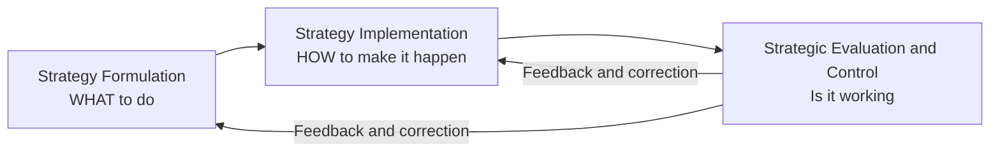
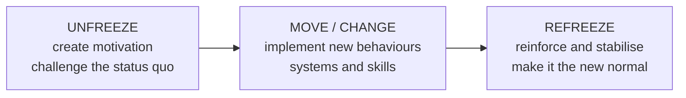
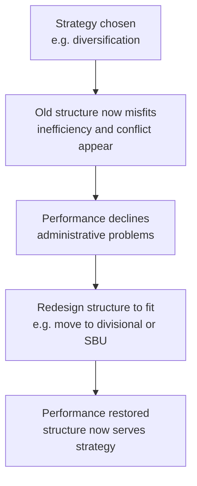
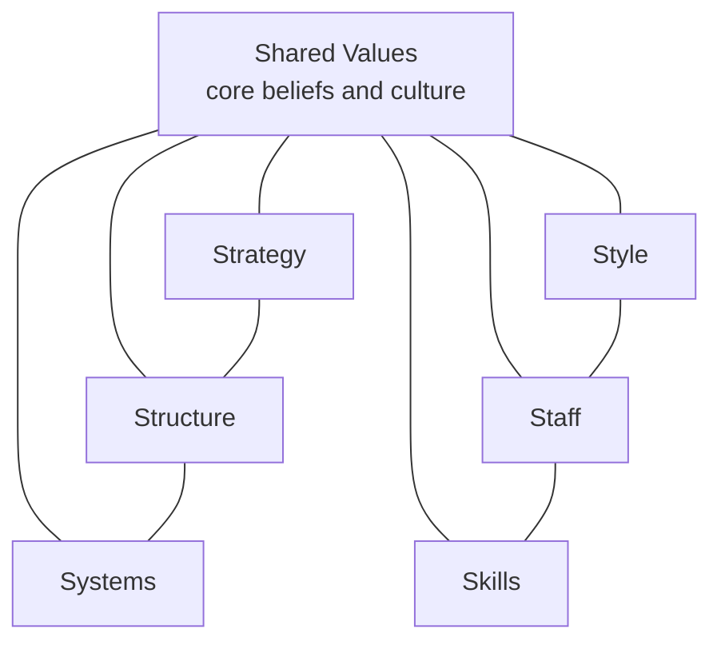
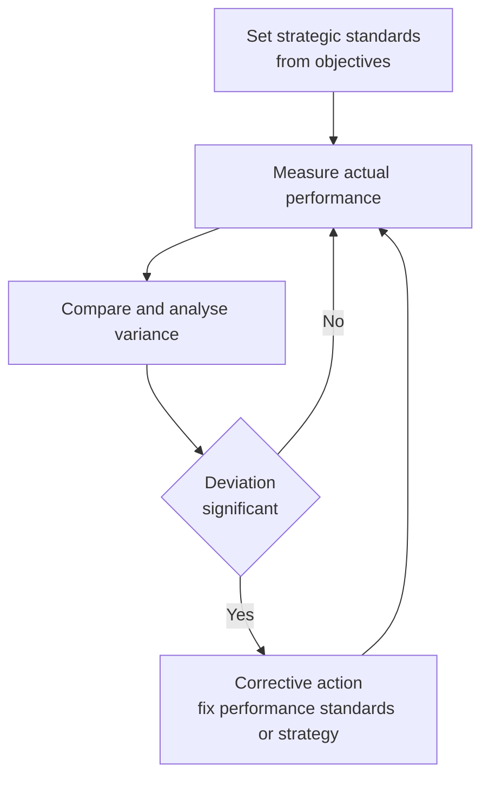
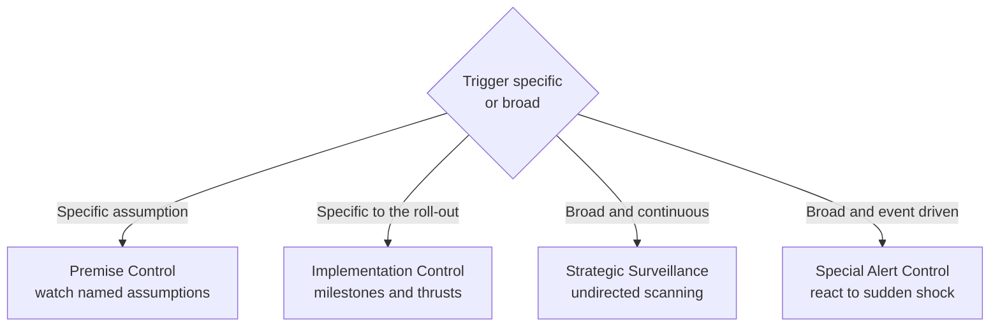
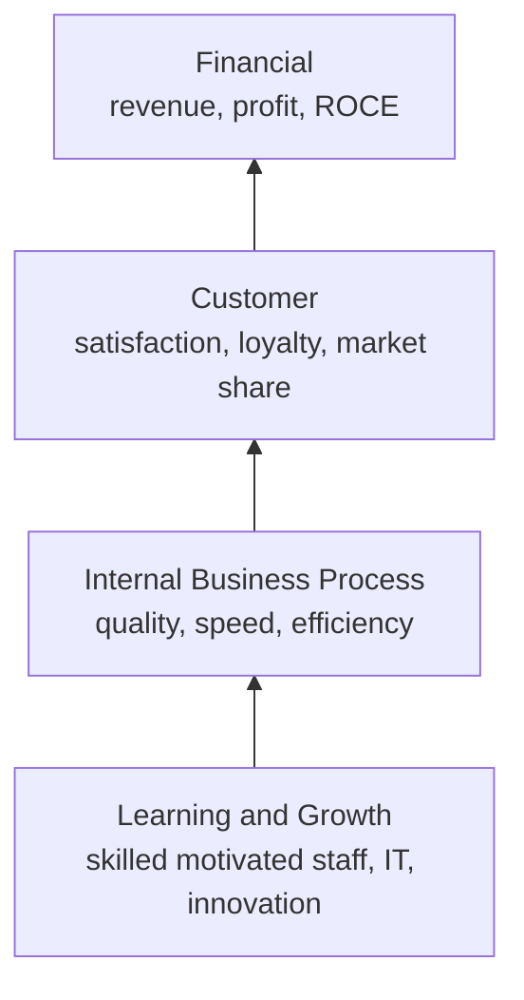

<!-- v2-deep -->

# Chapter 14 — SM — Strategy Implementation & Evaluation

## 1. The Problem

Imagine you are the newly appointed CEO of a mid-sized Indian dairy company. You spend six months and a large consulting fee producing a beautiful strategy: move from selling loose milk to branded value-added products — cheese, flavoured yoghurt, paneer — targeting urban health-conscious consumers. The logic is watertight. The market data is real. The board applauds. The 120-page strategy document is bound in glossy covers and placed on every director's shelf.

Eighteen months later, nothing has changed. Milk still leaves the plant in cans. The sales force still calls on the same sweet-shops. The factory manager never got the new packaging line because "budgets were tight." The regional heads quietly ignored the plan because their bonuses are still tied to litres of milk sold, not rupees of branded product. The document is on the shelf; the company is exactly where it was.

This is the single most important — and most humbling — fact in strategic management: **a brilliant strategy that is not executed is worth less than a mediocre strategy that is.** Research consistently finds that the majority of strategies fail not because they were wrongly *chosen*, but because they were never properly *implemented*. This is called the **strategy-execution gap**.

So the problem this chapter answers is: **once you know WHAT to do, how do you actually make an organisation DO it — and how do you know whether it worked?**

That single problem splits into four managerial questions, and every framework in this chapter is an answer to one of them:

| Manager's real question | The tool that answers it |
|---|---|
| "My people resist the new plan. How do I move them?" | Strategic change management (Kurt Lewin's three-stage model) |
| "My current org chart was built for the OLD strategy. What shape should it be now?" | Structure-follows-strategy (Chandler); structural types |
| "I've changed the boxes on the chart, but the culture and skills still pull the old way." | McKinsey 7S Framework (hard + soft elements) |
| "How do I know, mid-flight, whether the strategy is actually working — before it's too late?" | Strategic control & the Balanced Scorecard (Kaplan & Norton) |

Notice the sequence. You cannot implement without overcoming resistance (change), you cannot execute without the right vehicle (structure), the vehicle only moves if all its parts are aligned (7S), and you are flying blind without instruments (control). We will build each idea only *after* we have felt the pain it removes.

**A subtler framing the examiner rewards.** Formulation is an act of *judgement under uncertainty* performed once; implementation is an act of *coordination under interdependence* performed continuously. The reason implementation is harder is not that it is intellectually deeper — it is that it must be right *everywhere at once*. A formulation error is a single wrong bet; an implementation error is any one of a thousand small misalignments — a stale incentive here, an untrained team there, a reporting line that never changed. Strategy fails the way a chain fails: at its weakest link, not its average strength. Keep that "weakest-link" intuition; it explains why the 7S insistence on *total* alignment is not perfectionism but necessity.

---

## 2. The Core Idea

Strategy has two halves, and students consistently underrate the second one.

**Strategy Formulation** is deciding *what* to do — analysis, choice, positioning. It is done by a few people, at the top, using judgement, before the action. It is entrepreneurial and analytical.

**Strategy Implementation** is *making it happen* — action, coordination, resource commitment. It involves *many* people, across all levels, using operational and administrative skill, during the action. It is about integration.

The core idea of this chapter is captured in one sentence: **Formulation is placing forces before the action; implementation is managing forces during the action.** A good strategy sets a direction, but an organisation is a living system of structures, people, incentives, skills and shared beliefs. Change one part and the others fight back. Implementation is therefore not a "final step" — it is a *systems alignment* problem.

The second core idea is about **feedback**. You do not implement a strategy and then wait years to see the annual profit figure. Profit is a *lagging* indicator — by the time it turns bad, the causes are long gone. Modern strategy demands **strategic control**: continuously checking whether the *assumptions* behind the strategy still hold and whether the *drivers* of future performance (customers, processes, learning) are healthy. This is why the Balanced Scorecard exists — to look at the dashboard, not just the rear-view mirror.

A third idea knits the other two together: **implementation and evaluation are not sequential, they are simultaneous.** You do not finish implementing and then start evaluating. From the first day of execution, control is already running — checking milestones, testing premises, scanning the environment. The neat "formulate, then implement, then evaluate" story is a teaching simplification; in reality all three run as overlapping loops. This is exactly why the process is drawn as a cycle (Figure 1) and not a straight assembly line. When an exam question asks "is strategic management a one-time exercise?", the answer is a firm *no* — it is a continuous, iterative, feedback-driven process, and this chapter is where that loop closes.

*Figure 1: Strategy is a loop, not a line — evaluation feeds corrections back into both formulation and implementation.*

---

## 3. Why It's Built This Way

Why do we treat implementation as a distinct discipline with its own frameworks, rather than assuming "a good manager will just get it done"? Because the failure modes are predictable and structural, not random.

**First, the people who plan are rarely the people who execute.** Strategy is conceived at the top; it is delivered by the middle and the front line. Every layer between the boardroom and the factory floor is a place where meaning can be lost, priorities can be re-interpreted, and quiet resistance can accumulate. This is why change management is a *technical* subject and not just "leadership vibes."

**Second, organisations are built for stability, not for change.** Structures, budgets, reporting lines, reward systems and standard operating procedures exist precisely to make behaviour *repeatable*. That is a virtue during steady state and a curse during strategic change — the very machinery that makes a company efficient at the old strategy actively resists the new one. So you need deliberate mechanisms to overcome the organisation's own inertia.

**Third, the elements of an organisation are interdependent.** You cannot pull one lever in isolation. Give the sales force a new strategy but the old incentive scheme, and the incentive wins every time. This interdependence is exactly what the McKinsey 7S framework was designed to expose — it forces you to check that all seven elements point the same way.

**Fourth, financial results arrive too late to steer by.** Accounting profit tells you how yesterday's decisions turned out. If your only instrument is the P&L, you are driving by looking in the mirror. The Balanced Scorecard was built because managers needed *leading* indicators — signals of future performance — not just lagging financial ones.

So implementation and control have their own frameworks because the problem has a specific shape: dispersed execution, organisational inertia, systemic interdependence, and delayed feedback. Each framework is a purpose-built tool for one of those four realities.

**A deeper "why" behind the whole discipline: interdependence turns simple changes into system changes.** In a machine, you can replace one part and leave the rest untouched. In an organisation, every part is bound to the others by expectations, habits and incentives, so touching one part sends ripples through all of them. This is why a manager cannot "just change the strategy" — changing the strategy silently obligates changes in structure, systems, skills, staffing and culture, and if those obligations go unmet, the organisation snaps back to its old configuration like a stretched spring. Every framework in this chapter is, at bottom, a device for managing the ripples: Lewin manages the *human* ripple (resistance), Chandler the *structural* ripple, 7S the *whole-system* ripple, and strategic control the *time* ripple (feedback delay). Seen this way the chapter is not five unrelated topics; it is one problem — interdependence — attacked from five angles.

---

## 4. Full Technical Content

### 4.1 The Strategy-Execution Gap and the Nature of Implementation

Implementation is the sum of activities that turn a formulated strategy into results. It typically requires:

- **Institutionalising the strategy** — building it into structures, systems and culture so it becomes "how we do things here."
- **Resource allocation** — directing money, people and time toward the new priorities (a strategy the budget ignores is not a strategy).
- **Structuring** — designing an organisation that can deliver the strategy.
- **Behavioural implementation** — leadership, culture, and managing change and resistance.
- **Functional/operational implementation** — plans, policies and procedures in each function (marketing, finance, operations, HR) that push in the strategy's direction.

The difference between formulation and implementation is worth memorising as a contrast, because examiners love it:

| Dimension | Strategy Formulation | Strategy Implementation |
|---|---|---|
| Nature | Positioning forces *before* action | Managing forces *during* action |
| Focus | Effectiveness — doing the right things | Efficiency — doing things right |
| Process | Primarily intellectual / analytical | Primarily operational / administrative |
| Skills needed | Analytical and conceptual | Motivational, leadership, integrating |
| People involved | A few, at the top | Many, across all levels |
| Requires | Good coordination among a few executives | Coordination among many people |

**Finer distinction — "interrelated but not identical."** Formulation and implementation are *distinct* activities but not *watertight* compartments; they overlap and feed each other. An implementation reality (say, the sales force simply cannot sell branded FMCG) can force a change in the formulated strategy itself. So the examinable nuance is: they are analytically separable and require different skills, yet operationally intertwined. Answering "they are completely separate stages" is only half right.

**The link between strategy formulation and implementation — the ICAI four-relationship view.** ICAI describes the formulation-implementation relationship along the lines that (a) forward linkages — the *design* of the strategy shapes how it will be implemented (a bold strategy demands more structural and behavioural change); and (b) backward linkages — the *existing* structure, systems and resources constrain which strategies are even feasible. A firm rarely formulates in a vacuum; it formulates knowing what it can execute. This two-way linkage is why "structure follows strategy" is true as a principle yet, in practice, structure also quietly *limits* strategy — a paradox we return to in the Chandler trap.

**Where implementation typically breaks — the six common barriers** (useful as a ready-made list for "why do strategies fail in implementation?"): (i) inadequate or vague communication of the strategy downward; (ii) resource allocation that still funds the old priorities; (iii) reward systems tied to old behaviour; (iv) an organisation structure that does not fit the new strategy; (v) leadership that champions the plan verbally but does not model the change; and (vi) a culture that contradicts the strategy. Notice each barrier maps onto exactly one framework in this chapter — that is not a coincidence, it is the chapter's architecture.

### 4.2 Strategic Change Management — Overcoming the Human Barrier

The first wall implementation hits is **resistance to change**. People resist for rational and emotional reasons: fear of the unknown, loss of status or security, comfort with the status quo, distrust of management, or simple inertia. Ignoring this is the most common cause of failed implementation.

**Sources of resistance — worth naming precisely**, because examiners ask "why do people resist change?": (i) *fear of the unknown* — uncertainty about new roles and demands; (ii) *loss of self-interest* — threat to pay, status, power or job security; (iii) *distrust of management* or of the motives behind the change; (iv) *different perceptions* — some genuinely believe the change is wrong; (v) *social/peer pressure* to conform to the group's resistance; and (vi) *low tolerance for change* — some people psychologically cope poorly with disruption regardless of its merits. The managerial value of this list: each source has a *different* antidote (fear → communication; loss of interest → negotiation/participation; distrust → involvement and transparency), so a manager must first *diagnose the source* before choosing a tactic.

The foundational model — and the one the ICAI syllabus expects you to know by name — is **Kurt Lewin's Three-Stage Model of Change**:

1. **Unfreezing** — Create the *motivation* to change. Shake the organisation out of its comfortable equilibrium by making the case that the status quo is dangerous (a "burning platform"). Communicate the threats and opportunities. Reduce the forces holding the old behaviour in place. Without unfreezing, people simply refuse to let go.

2. **Changing / Moving** — Implement the new behaviours, structures, systems and skills. This is where training, new processes, new roles and new leadership behaviours are introduced. The organisation is in transition and needs support, communication and quick wins.

3. **Refreezing** — Lock in the new state so it becomes the new normal. Reinforce through revised reward systems, new SOPs, culture and structure, so the organisation does not slide back to old habits. Change that is not refrozen decays.

**First-principles WHY Lewin has exactly three stages.** Think of behaviour as being held in place by two opposing sets of forces — *driving forces* pushing toward change and *restraining forces* holding the status quo (this is Lewin's own "force-field" logic). At equilibrium the two are balanced, so nothing moves. You can force change by cranking up the driving forces, but that only raises tension and rebounds. The smarter route — and the reason *unfreezing* comes first — is to *reduce the restraining forces* (fear, habit, incentives) so the balance tips with less pressure. *Moving* shifts the behaviour to a new equilibrium point. *Refreezing* rebuilds restraining forces *around the new position* so it holds. Miss any stage and the physics fails: skip unfreezing and you push against a locked spring; skip refreezing and the spring pulls you back. The three stages are not arbitrary — they are the only way to move a system that is held by opposing forces.

*Figure 2: Lewin's three-stage model — you must melt the old shape before you can pour the new one, then let it set.*

A practical, expanded roadmap for **managing strategic change** (the version ICAI presents):

- **Recognise the need for change** and diagnose what specifically must change.
- **Create a shared vision** and communicate it relentlessly — people cannot commit to a direction they cannot see.
- **Institutionalise the change** by aligning structure, systems, rewards and culture.
- **Provide resources and training**, and secure the commitment of key managers and opinion leaders.
- **Manage resistance** through participation, communication, education, negotiation and, where necessary, support — turning potential blockers into participants.

**The tactics for overcoming resistance — Kotter & Schlesinger's six methods** (frequently examinable, and a natural pairing with the "sources of resistance" list): (1) **Education and communication** — used when resistance stems from misinformation; slow but durable. (2) **Participation and involvement** — used when initiators lack information and others have power to resist; builds ownership. (3) **Facilitation and support** — for resistance rooted in fear/adjustment problems; e.g. training, counselling. (4) **Negotiation and agreement** — where someone will clearly lose out and has power to resist; e.g. buying out an objection. (5) **Manipulation and co-optation** — covert; giving a resistance leader a symbolic role; fast and cheap but risks backlash if discovered. (6) **Explicit and implicit coercion** — force, threats; last resort, fast but leaves lasting resentment. The examinable insight is the *trade-off*: the top methods are slow but build genuine commitment; the bottom methods are fast but breed resentment. A skilled change agent moves *down* this list only as speed pressure and power imbalance increase.

The deeper lesson: resistance is *reduced by involvement*. People support what they help create. Participation is not a courtesy; it is the single most effective anti-resistance tool.

**Kotter's Eight-Step Change Model — the modern extension of Lewin** (ICAI treats this as an elaboration, so know the mapping): Steps 1-4 (*establish urgency, form a guiding coalition, create a vision, communicate the vision*) elaborate Lewin's **Unfreeze**; steps 5-7 (*empower action / remove obstacles, generate short-term wins, consolidate gains*) elaborate **Move**; step 8 (*anchor new approaches in the culture*) is Lewin's **Refreeze**. The exam value: if asked to compare, say Kotter *operationalises* Lewin — same three-phase skeleton, finer instructions. Note especially step 6 (*short-term wins*): quick, visible wins during the Move phase are what keep momentum and starve the sceptics of ammunition — a very common exam point.

### 4.3 Organisation Structure and Strategy — "Structure Follows Strategy"

Once people are willing to move, you need a *vehicle* to move them: the organisation structure. The landmark insight comes from business historian **Alfred D. Chandler**, who studied large American corporations (DuPont, General Motors, Sears, Standard Oil) and concluded: **"Structure follows strategy."**

His argument: when a firm changes its strategy (e.g., diversifies into new products or regions), the *old* structure becomes a source of inefficiency and administrative problems. Performance declines until the firm redesigns its structure to fit the new strategy. Structure is the servant of strategy, not the master — but a mismatched structure will strangle even a great strategy. This is *why* restructuring so often accompanies a strategic shift.

**The two-way truth (the nuance examiners reward).** Chandler's proposition runs *forward*: strategy is chosen, structure is redesigned to fit. But the *backward* linkage is also real — an existing structure conditions what strategies management can even conceive and execute. A rigid functional structure may blind a firm to a diversification opportunity because "we don't have anyone who could run a separate division." So the safe exam formulation is: **the dominant, examinable proposition is "structure follows strategy," while recognising that structure can subsequently constrain strategy** — a feedback relationship, not a one-way street. State the proposition cleanly first, then add the nuance; do not lead with the nuance or you risk appearing to reverse Chandler.

The main structural types the syllabus requires, each suited to a different strategy:

| Structure | Best fit strategy / situation | Key trade-off |
|---|---|---|
| **Simple / Entrepreneurial** | Small firm, single owner-manager, one product/market | Fast and flexible but overloads the owner; fails as firm grows |
| **Functional** | Single or dominant product line, stable environment | Efficient and specialised, but silos and poor cross-coordination |
| **Divisional (Product/Geographic/Market)** | Diversified products, regions or customer groups | Accountability and focus per division, but duplication of resources |
| **Strategic Business Unit (SBU)** | Large, highly diversified firm with many divisions | Groups related divisions for control; adds a management layer |
| **Matrix** | Multiple projects/products needing shared specialists | Flexible, dual expertise, but dual reporting causes conflict |
| **Network / Virtual / Hourglass** | Firms that outsource non-core functions; flat, IT-enabled | Lean and adaptive, but dependence on partners and less control |

**Reading the trade-offs from first principles — the coordination-vs-specialisation tension.** Every structure is a compromise between two goods that pull in opposite directions: *specialisation* (group by function so experts sit together and get efficient) and *coordination* (group by product/region so everything a customer needs sits under one boss). You cannot maximise both at once. A **functional** structure maximises specialisation (all marketers together, all engineers together) at the cost of coordination (marketing and engineering barely talk — the classic "silo"). A **divisional** structure maximises coordination within each product/region (the yoghurt division has its own marketing, ops and finance, all pointed at yoghurt) at the cost of specialisation and *duplication* (three divisions each running their own small marketing team). A **matrix** is the ambitious attempt to get *both* — a functional axis and a project/product axis crossing — which is why it delivers dual expertise but also creates the notorious "two-boss problem" and conflict. Once you see the trade-off as specialisation vs coordination, you can *derive* the right structure for any case instead of memorising a table: single product + stable → coordination is cheap, so choose functional; many products → coordination is expensive, so pay for divisional.

**When does a firm outgrow functional structure?** The classic tipping point is **diversification**. A single-product firm coordinates easily under functional structure. The moment it adds unrelated products or distant regions, the functional CEO becomes a bottleneck — every cross-product decision must climb to the top. That overload is the "administrative problem" Chandler observed, and it is the trigger to move to divisional/SBU. Being able to state the *trigger* (diversification-driven overload at the apex) is worth more marks than merely listing structures.

**The Strategic Business Unit (SBU) — why add a layer on purpose?** When divisions multiply (say 30+ product divisions), the CEO cannot personally oversee each. Grouping *related* divisions into a handful of SBUs — each with its own mission, competitors and strategy — restores span-of-control sanity and lets each SBU be planned and controlled as a semi-autonomous business. The cost is an extra management layer and possible loss of economies across SBUs. Characteristics ICAI stresses: an SBU is a *distinct business*, has its *own set of competitors*, and has a *manager accountable for strategic planning and profit*.

**The Hourglass structure** deserves a note because it is distinctly modern and examinable: driven by information technology and business process re-engineering, the middle-management layer is *thinned dramatically*. A broad top (strategic layer) and a broad bottom (operating layer) are connected by a narrow middle — hence "hourglass." Benefits: lower costs, faster communication, empowered lower levels. Cost: fewer promotion opportunities and heavy workload on the surviving middle managers — a real morale and career-path problem, because the middle rung people used to climb has been removed.

**Network / Virtual structure — the logical extreme.** Here the firm keeps only its *core* competence and outsources everything else (manufacturing, logistics, even design) to a web of partners coordinated by IT. It is maximally lean and flexible, but the firm surrenders control and becomes dependent on partners — a strategic vulnerability if a key partner defects or underperforms. Contrast with the hourglass, which *thins* the middle but keeps activities in-house; the network *externalises* them entirely.

*Figure 3: Chandler's logic — a strategy change makes the existing structure a liability until the structure is realigned.*

### 4.4 Leadership and Culture — The Behavioural Engine

Structure is the skeleton; leadership and culture are the muscle and the nervous system.

**Strategic leadership** is the leader's ability to anticipate, envision, maintain flexibility, think strategically, and work with others to initiate changes that create a viable future for the organisation. Two roles dominate implementation:

- **Transformational leadership** — inspiring and energising people to transcend self-interest for the organisation's vision; ideal for large-scale change because it changes *hearts*, not just tasks. It works through *charisma, inspirational motivation, intellectual stimulation and individualised consideration.*
- **Transactional leadership** — managing through exchange (rewards for performance, correction for deviation); useful for steady execution and control. It works through *contingent reward* and *management-by-exception* (stepping in only when targets are missed).

Effective implementation usually needs both: transformational to set direction and unfreeze, transactional to lock in and refreeze. **The examinable mapping:** transformational leadership powers the *Unfreeze* and *Move* stages (vision, energy, momentum); transactional leadership powers *Refreeze* (rewards and controls that stabilise the new behaviour). A leader who is all inspiration and no reward system creates excitement that decays; a leader who is all reward system and no vision cannot get people to leave the old equilibrium in the first place.

**Two roles a leader plays in implementation (ICAI framing).** (i) The leader as a *change agent* — the visible sponsor who articulates the vision, mobilises resources and removes obstacles; and (ii) the leader as a *culture-builder* — shaping shared values through what they consistently reward, model and pay attention to. The chief executive is ultimately the "chief implementation officer": strategy that lacks a visible, committed leader-sponsor is the single most reliable predictor of implementation failure.

**Organisational culture** — the shared values, beliefs, assumptions and norms that govern "how we do things here" — is described by many as the ultimate implementation lever because *culture eats strategy for breakfast*. A strategy that contradicts the prevailing culture will be quietly sabotaged; a strategy consistent with culture is carried along by it.

Managers can shape culture through: the behaviours leaders reward and model; stories and heroes the organisation celebrates; rituals and symbols; recruitment and socialisation; and, above all, the reward system. Where strategy and culture clash, the manager has three broad options: (a) change the strategy to fit the culture, (b) change the culture to fit the strategy (slow and hard), or (c) manage around the culture. The key exam point: **culture must be treated as an active variable in implementation, not a fixed backdrop.**

**The strategy-culture compatibility matrix (a fine distinction ICAI uses).** Managers can classify the situation on two axes — *how important the new strategic changes are* and *how compatible they are with the existing culture* — giving four broad postures: (1) **Manage around the culture** when changes are important but culture is only mildly incompatible — reroute the plan through structural/procedural changes rather than fighting values head-on. (2) **Reinforce the culture** when changes are important *and* compatible — the easiest case; ride the culture. (3) **Change the culture** when the strategy is vital but the culture is strongly opposed — the hardest, slowest path, justified only when the strategy is truly make-or-break. (4) **Tolerate/reformulate** when changes are minor and incompatible — often not worth the fight. The value of this matrix is that it stops students from giving the naive answer "just change the culture" — culture change is a *last resort* reserved for high-stakes, high-conflict situations because it is so slow and costly.

### 4.5 The McKinsey 7S Framework — Checking That Everything Aligns

Now we reach the integrating framework. You have changed the structure. You have new leadership. But the *strategy still isn't landing*. Why? Because you changed some elements and not others, and the unchanged ones are pulling the organisation back.

The **McKinsey 7S Framework**, developed by **Tom Peters and Robert Waterman** (with Richard Pascale and Anthony Athos) at consulting firm McKinsey, was built precisely to answer: *"Which internal elements must be aligned for a strategy to be implemented successfully?"* Its central claim is that organisational effectiveness comes from the **alignment of seven interdependent elements** — change one and you must realign the rest.

The seven, split into **Hard S's** (tangible, easier for management to define and influence) and **Soft S's** (intangible, culture-driven, harder to change but often decisive):

**Hard elements:**
1. **Strategy** — the plan to build and sustain competitive advantage.
2. **Structure** — how the organisation is arranged; who reports to whom.
3. **Systems** — the daily procedures, processes and information flows (budgeting, IT, appraisal) that get work done.

**Soft elements:**
4. **Shared Values** (originally "Superordinate Goals") — the core beliefs and culture at the *centre* of the model; the glue that holds the other six together.
5. **Style** — the leadership and management style; how managers actually behave and spend their time.
6. **Staff** — the people, their numbers, and how they are recruited, developed and motivated.
7. **Skills** — the distinctive capabilities and competencies of the organisation as a whole.

The genius of the model is that **Shared Values sit at the centre**, connected to all others — signalling that culture is the anchor of alignment. There is no strict hierarchy among the seven; they form a web, and effective implementation means all seven are mutually reinforcing.

**Why the hard/soft split matters strategically.** The *hard* elements (Strategy, Structure, Systems) can be found in plans, charts and manuals — management can change them by decree, relatively quickly. The *soft* elements (Style, Staff, Skills, Shared Values) live in people's heads and habits — they cannot be changed by memo and take far longer. The examinable insight is the trap this creates: managers change the *easy* (hard) elements, declare victory, and are then baffled when implementation stalls — because the *decisive* (soft) elements never moved. In the dairy case, the CEO changed Strategy and (belatedly) Structure but left Skills, Staff, Style and Shared Values untouched; the soft elements quietly won. Peters and Waterman's own research punchline was precisely that excellent companies win on the *soft* S's, which their competitors neglect.

**The distinction between Staff and Skills** (a fine point students blur): *Staff* is about the **people as resources** — how many, of what kind, how recruited, developed, socialised and motivated. *Skills* is about the **organisation's collective capabilities** — what the firm *as a whole* is distinctively good at (e.g., "3M is good at innovation"), which can outlast any individual employee. You can have talented Staff and still lack an organisational Skill, or possess a deep organisational Skill that survives staff turnover. Keep them separate in answers.

**Skills vs Systems** is another easy confusion: *Systems* are the formal procedures and processes (the appraisal system, the budgeting cycle, the IT platform); *Skills* are competencies. A firm can have excellent systems and weak skills, or vice versa.

*Figure 4: McKinsey 7S — Shared Values at the hub, with hard elements (Strategy, Structure, Systems) and soft elements (Style, Staff, Skills) all interlinked; misalignment anywhere weakens implementation.*

**How to use it as a diagnostic:** list the current state of each S, then the desired state under the new strategy, and find the *gaps* and *conflicts*. Wherever an S contradicts the strategy — old systems, wrong skills, an incompatible style — you have found the reason implementation is stalling.

**A structured 7S diagnostic procedure** (turns the model from a list into a tool): (1) start with **Shared Values** — what does the strategy require the organisation to *believe*? (2) Check each *hard* element against the strategy — does the Structure enable it, do the Systems reward it? (3) Check each *soft* element — does leadership Style model it, do Staff have the motivation, do we possess the Skills? (4) Map the *interconnections* — because the S's are interdependent, a fix in one may break another (e.g., decentralising Structure demands new Skills in lower managers and new Systems of delegated control). (5) Realign iteratively until all seven are mutually reinforcing. The exam-ready summary: 7S is not a checklist to tick once but an alignment loop to run until the web is coherent.

### 4.6 Strategic Evaluation and Control — Steering the Strategy

Implementation without control is a rocket without guidance. **Strategic evaluation and control** is the process of determining the effectiveness of a strategy in achieving objectives and taking corrective action where needed. It answers: *"Are we still on course, and if not, what do we change?"*

**Why it is essential:** the environment shifts, assumptions made during formulation may prove wrong, and implementation always deviates from plan. Control provides the feedback that keeps strategy adaptive. It performs three functions: (i) it checks whether the strategy is being implemented as planned, (ii) it checks whether the results are as intended, and (iii) it checks whether the *premises* on which the strategy was built still hold.

**The distinctive difficulty of *strategic* evaluation** (an examinable subtlety): unlike operational control, strategic control faces *measurement problems* (long time-horizons make outcomes hard to attribute), *environmental turbulence* (the yardstick keeps moving), and the *timing problem* (by the time strategic results are visible, corrective windows may have closed). This is precisely why strategic control leans on *leading* indicators and *premise* checks rather than waiting for final financial outcomes — it must steer before the results arrive.

The generic **control process** has these steps (ICAI's version, six-step):
1. **Determine what to control** — pick the objectives and strategic variables worth monitoring.
2. **Set standards / benchmarks** derived from objectives.
3. **Measure actual performance.**
4. **Compare** actual against standard and analyse variances.
5. **Analyse whether the deviation is acceptable** — decide if the variance is within tolerance.
6. **Take corrective action** — adjust performance, revise standards, or reformulate the strategy itself.

Note the branching at step 5: not every deviation triggers action — only *significant* ones outside the tolerance band. Over-correcting on noise is itself an error (it destabilises the organisation); this is why the loop explicitly tests *significance* before acting.

**Strategic vs Operational Control — a crucial distinction:**

| Basis | Strategic Control | Operational Control |
|---|---|---|
| Focus | Direction of the whole organisation; "are we doing the right things?" | Efficiency of individual actions; "are we doing things right?" |
| Time horizon | Long term | Short term (days, weeks, months) |
| Concerned with | Environment, assumptions, overall strategy | Resource utilisation, day-to-day operations |
| Nature | Externally oriented, adaptive | Internally oriented, corrective |
| Question asked | Should we continue with this strategy? | Are we meeting the current targets? |
| Data used | Mostly external, often qualitative | Mostly internal, quantitative |
| Corrective action | May reformulate the strategy | Adjusts execution within the existing strategy |

The four **types of strategic control** (from Schendel and Hofer, as presented in the ICAI material):

1. **Premise Control** — checks whether the *assumptions and predictions* on which the strategy was built (about the economy, industry, competitors, technology) are still valid. If a key premise fails, the strategy may need rethinking. It is **focused** — each premise is identified in advance and assigned to someone to watch.
2. **Implementation Control** — assesses whether the strategy should continue or be changed in light of *events as implementation proceeds*, using two tools: *monitoring strategic thrusts* (checking whether the key steps/programmes are working) and *milestone reviews* (comprehensive reassessments at critical points in the roll-out).
3. **Strategic Surveillance** — a broad, **unfocused** *monitoring* of a wide range of events inside and outside the firm that could threaten the strategy; deliberately not tied to any one premise. Its whole point is to catch the threat *nobody thought to list* as a premise.
4. **Special Alert Control** — the rapid, thorough reconsideration of a strategy triggered by a *sudden, unexpected event* (a crisis, an acquisition of a competitor, a natural disaster, a regulatory shock). Often institutionalised through *contingency plans and crisis teams*.

**The organising logic behind the four types** (so you never confuse them): sort them on two questions — *is the trigger specific or broad?* and *is the monitoring continuous or event-driven?* **Premise** = specific + continuous (watch named assumptions all the time). **Surveillance** = broad + continuous (scan everything, all the time). **Implementation** = specific + continuous but *internal* (watch the roll-out's milestones). **Special Alert** = broad + event-driven (a shock happens, you react hard and fast). Premise and Surveillance are the pair most often confused; the discriminator is *focus* — premise control targets *pre-identified* assumptions, surveillance is deliberately *undirected*.

*Figure 5: The strategic control loop — continuous comparison of actual against standard, feeding corrective action.*

*Figure 6: A decision tree for the four control types — sort by whether the trigger is a specific assumption, the roll-out itself, broad continuous scanning, or a sudden shock.*

### 4.7 The Balanced Scorecard — Why Financial Measures Alone Are Insufficient

Here is the sharpest question of the chapter: *what should you measure to know if a strategy is working?* The instinctive answer — "profit and financial ratios" — is dangerously incomplete, and understanding *why* is a favourite examiner theme.

**Why financial measures alone fail:**

- They are **lagging indicators** — they report the *outcomes* of past decisions. By the time profit falls, the damage is done and the causes are gone.
- They say **nothing about the drivers of future performance** — customer loyalty, process quality, employee capability and innovation. A firm can boost this year's profit by slashing R&D and training, and look healthy on the P&L while destroying tomorrow.
- They **encourage short-termism** and can be manipulated through accounting choices.
- They ignore **intangible assets** — brand, knowledge, relationships — which drive value in a modern economy.

To fix this, **Robert Kaplan and David Norton** developed the **Balanced Scorecard (BSC)** in the early 1990s. Its core idea: measure performance across **four balanced perspectives**, linking *lagging* financial outcomes to their *leading* non-financial drivers.

| Perspective | Core question | Example measures |
|---|---|---|
| **Financial** | How do we look to shareholders? | Revenue growth, ROCE, profit margin, cash flow |
| **Customer** | How do customers see us? | Satisfaction, retention, market share, on-time delivery |
| **Internal Business Process** | What must we excel at? | Cycle time, defect/quality rates, cost efficiency, innovation cycle |
| **Learning and Growth** (Innovation & Learning) | Can we continue to improve and create value? | Employee training, skills, IT capability, staff retention, new ideas |

The perspectives are **causally linked**, and this cause-and-effect chain is the intellectual heart of the model: invest in **Learning & Growth** (skilled, motivated staff) → this improves **Internal Processes** (faster, higher quality) → which delights **Customers** (loyalty, repeat business) → which finally produces strong **Financial** results. Read that chain backwards and you see why financials alone are insufficient: they are the *last* link, driven by three earlier links that no purely financial report ever shows you.

**The "balance" the name promises — four balances, not one.** The scorecard is "balanced" along several axes simultaneously, and stating them earns marks: (i) balance between *financial and non-financial* measures; (ii) balance between *lagging outcome* measures and *leading driver* measures; (iii) balance between *external* perspectives (Financial for shareholders, Customer for the market) and *internal* perspectives (Process, Learning); and (iv) balance between *short-term* and *long-term* objectives. A common thin answer names only the first balance; the strong answer names all four.

**Each perspective carries its own lag/lead pairing.** Within a single perspective you typically set an *outcome* (lagging) measure and a *driver* (leading) measure. For example, in the Customer perspective, "market share" is a lagging outcome while "on-time delivery" is a leading driver of that share. This internal lead-lag pairing is what makes each perspective actionable rather than merely descriptive.

**The BSC as a strategy map.** Kaplan and Norton later extended the scorecard into a *strategy map* — a one-page cause-and-effect diagram linking objectives across the four perspectives, showing exactly *how* intangible assets (Learning & Growth) convert into financial outcomes. For the exam, know that the strategy map is the *visual articulation* of the causal chain and is what lets the BSC double as a communication device.

*Figure 7: The Balanced Scorecard cause-and-effect chain — non-financial drivers at the bottom feed the financial outcomes at the top; financial results are the last link, not the whole story.*

The BSC is therefore both a **measurement system** and, more powerfully, a **strategic management and communication system**: it translates a strategy into a coherent set of objectives and measures across the four perspectives, so every level of the organisation can see how its work links to the strategy.

**Limitations of the BSC** (examiners increasingly ask for a balanced critique): (i) it can become a mechanical *measurement* exercise if the causal *logic* is ignored; (ii) too many measures dilute focus — a good scorecard keeps only a handful of vital measures per perspective; (iii) the cause-effect links are *assumed*, not proven, and may be wrong for a given firm; (iv) gathering non-financial data is costly and the measures can themselves be gamed; and (v) it needs continual updating as strategy evolves. Knowing the limitations signals mastery beyond rote reproduction.

---

## 5. Applied Cases

### Case 1 — The Dairy Company Revisited (Change + Structure + 7S)

Return to the branded-dairy CEO from Section 1. Diagnose the failed implementation using our frameworks.

*Change (Lewin):* There was no **unfreezing**. Regional heads never felt the status quo was dangerous, so they saw no reason to move. Fix: build a burning platform (show that loose-milk margins are collapsing and a private competitor is capturing urban shelves), communicate a vivid vision, involve regional heads in designing the rollout.

*Structure (Chandler):* The firm's **functional structure** (one big sales department selling "milk") suits a single-product strategy, not a multi-product branded portfolio. Structure follows strategy — the CEO should move to a **divisional/product structure**, with a dedicated Value-Added Products division owning P&L for cheese and yoghurt, so accountability exists.

*7S misalignment:* Strategy changed, but **Systems** (incentives still pay per litre of milk), **Skills** (sales force can't sell branded FMCG), and **Staff** (no brand managers hired) never changed. **Shared Values** still worship volume, not brand. The single most powerful fix is realigning the reward **System** to branded-product revenue — because the incentive was silently overruling the strategy.

*Exam-style answer line:* "The strategy failed at the implementation stage due to inadequate change management (no unfreezing), a structure misaligned with the diversified strategy, and 7S misalignment — particularly in Systems (incentives), Skills and Shared Values."

### Case 2 — The Software Firm's Balanced Scorecard (Control + BSC)

A profitable IT services firm reports record annual profit, and the board is delighted. The strategy head, however, is worried and proposes a Balanced Scorecard. Why?

Because profit is a **lagging indicator**. Digging into the four perspectives reveals: **Customer** — satisfaction scores are falling and two large clients did not renew; **Internal Process** — project defect rates are rising; **Learning & Growth** — attrition of senior engineers hit 30% and training spend was cut to boost this year's margin. The record profit was *bought* by starving the three leading perspectives. The causal chain predicts that next year's financials will collapse.

*Lesson demonstrated:* The BSC exposes the *drivers* of future performance that the P&L conceals. This is precisely why "financial measures alone are insufficient." Corrective action: reinvest in retention and training (Learning & Growth) and quality (Internal Process) even at the cost of short-term margin.

### Case 3 — The Bank Facing a Sudden Regulatory Shock (Strategic Control Types)

A retail bank's five-year strategy assumes stable interest-rate regulation and steady growth. Map the control types:

- **Premise Control:** the strategy *assumes* interest rates stay in a band. The control team continuously tests whether that premise holds.
- **Strategic Surveillance:** the bank broadly monitors fintech entrants, RBI signals, and macro trends — not looking for anything specific, just scanning for threats.
- **Implementation Control:** as the branch-expansion plan rolls out, milestone reviews check whether each phase is delivering; if branch profitability lags, the roll-out is paused.
- **Special Alert Control:** the RBI abruptly changes capital-adequacy norms overnight. This triggers an *immediate, thorough reconsideration* of the strategy — a special alert response, not a routine review.

*Lesson demonstrated:* Different control types catch different threats — slow premise drift vs sudden shocks vs implementation slippage. A firm needs all four, not just annual budget reviews (which are merely *operational* control).

### Case 4 — Quantifying a Balanced Scorecard (Weighted-Scoring, exam-hard)

Examiners sometimes attach *numbers* to the BSC to test whether you can operate it, not just describe it. A manufacturer sets the following scorecard for the year. Each measure has a weight (importance), a target, and an actual. Compute a composite scorecard score.

| Perspective (weight) | Measure | Weight within persp. | Target | Actual | Achievement % (Actual ÷ Target, capped at 100%) |
|---|---|---|---|---|---|
| **Financial (40%)** | ROCE | 60% | 18% | 15% | 15 ÷ 18 = 83.3% |
| | Revenue growth | 40% | 12% | 12% | 100% |
| **Customer (25%)** | Retention rate | 50% | 90% | 81% | 90% |
| | On-time delivery | 50% | 95% | 95% | 100% |
| **Internal Process (20%)** | Defect rate (lower is better) | 100% | 2.0% | 2.5% | target ÷ actual = 2.0 ÷ 2.5 = 80% |
| **Learning & Growth (15%)** | Training hours/employee | 50% | 40 | 30 | 75% |
| | Staff retention | 50% | 88% | 88% | 100% |

*Step 1 — perspective sub-scores* (weight-within × achievement, summed):
- Financial: 0.60×83.3 + 0.40×100 = 50.0 + 40.0 = **90.0%**
- Customer: 0.50×90 + 0.50×100 = 45.0 + 50.0 = **95.0%**
- Internal Process: 1.00×80 = **80.0%**
- Learning & Growth: 0.50×75 + 0.50×100 = 37.5 + 50.0 = **87.5%**

*Step 2 — composite score* (perspective weight × sub-score):
- 0.40×90.0 + 0.25×95.0 + 0.20×80.0 + 0.15×87.5
- = 36.0 + 23.75 + 16.0 + 13.125 = **88.875% ≈ 88.9%**

*Self-check / reconciliation:* the perspective weights sum to 0.40+0.25+0.20+0.15 = 1.00 ✔, and within each perspective the sub-weights sum to 1.00 ✔, so the composite is a proper weighted average and must lie between the lowest sub-score (80.0) and the highest (95.0) — 88.9% does, confirming no arithmetic slip.

*The exam trap and the insight:* note two deliberate tricks. (a) For the **defect rate**, *lower is better*, so achievement = target ÷ actual, **not** actual ÷ target — reversing this is the classic mistake and would have wrongly given 125%. (b) Revenue growth and staff retention hit target exactly (100%) and *mask* the weak spots; the composite 88.9% looks healthy, but the strategy head should not be reassured — the **Learning & Growth** and **Internal Process** weaknesses (under-training and rising defects) are exactly the *leading* drivers that will pull down the *lagging* Financial score next year. The number is a starting point; the *diagnosis of which perspective is dragging* is the real answer.

*What if the examiner tweaks it:* if achievement were **not** capped at 100%, revenue growth over-performance could offset ROCE under-performance, hiding the ROCE gap — which is why many firms cap at 100% (you should not be rewarded for over-shooting one target while missing another). If asked, state the capping assumption explicitly.

### Case 5 — Lewin Force-Field on a Factory Automation Drive (Change, exam-hard)

A garment factory wants to automate cutting to cut costs 20%. Workers, supervisors and the union resist. Apply Lewin's *force-field* logic quantitatively-in-spirit.

*Driving forces:* cost pressure from competitors, a large client demanding lower prices, management's capex approval. *Restraining forces:* fear of job losses (strongest), workers' lack of machine skills, union distrust of past broken promises, supervisors' fear of losing authority.

*The naive manager* simply pushes harder on driving forces — announces the automation as a done deal and threatens closure otherwise (coercion). Result: the union strikes; tension rebounds; the restraining forces *strengthen* because distrust deepens. This illustrates Lewin's warning that *increasing driving force alone raises tension and provokes counter-force.*

*The skilled manager* attacks the **restraining** forces during **Unfreeze**: guarantees redeployment rather than layoffs (removes the fear-of-job-loss restraint — the largest one), funds reskilling (removes the skills restraint), and involves the union in designing the transition (removes the distrust restraint via *participation*, and converts a blocker into a co-owner). Only *then* does moving become low-tension. During **Move**, deliver a quick win (one automated line running with redeployed, retrained staff visibly better off) to starve the sceptics — Kotter's short-term win. During **Refreeze**, revise the incentive **System** to reward productivity of the new line and update SOPs so the old manual process is no longer even an option.

*Lesson demonstrated:* the leverage is in *reducing restraints*, not *adding pressure* — and the anti-resistance tactic that does the heavy lifting is **participation** (Kotter & Schlesinger method 2), chosen precisely because the union *has power to resist* and management *lacked the information* about shop-floor realities that only workers held. Match the tactic to the source of resistance.

---

## 6. Framework Summary

| Framework / Concept | Author(s) | Purpose (the problem it solves) |
|---|---|---|
| Formulation vs Implementation distinction | Classical SM | Clarifies that "deciding" and "doing" need different skills and people |
| Forward & backward linkage (formulation–implementation) | ICAI SM | Design of strategy shapes execution; existing capabilities constrain choice |
| Three-Stage Change Model (Unfreeze–Move–Refreeze) | Kurt Lewin | Overcome human resistance to strategic change |
| Force-field analysis (driving vs restraining forces) | Kurt Lewin | Diagnose *which* forces to weaken to move a system with least tension |
| Six methods to overcome resistance | Kotter & Schlesinger | Match anti-resistance tactic to the source and power of resistance |
| Eight-step change model | John Kotter | Operationalise Lewin into concrete change steps |
| Structure follows Strategy | Alfred D. Chandler | Redesign the organisation so its structure fits the new strategy |
| Structural types (functional, divisional, SBU, matrix, network, hourglass) | Organisation theory | Match the vehicle to the strategy; trade specialisation vs coordination |
| Transformational vs Transactional leadership | Leadership theory | Provide both inspiration for change and control for execution |
| Strategy–culture compatibility matrix | Behavioural SM | Choose whether to reinforce, manage around, or change the culture |
| McKinsey 7S Framework | Peters, Waterman, Pascale, Athos (McKinsey) | Align all seven internal elements for successful implementation |
| Strategic vs Operational control | SM theory | Separate "doing right things" (direction) from "doing things right" (efficiency) |
| Four types of strategic control (Premise, Implementation, Surveillance, Special Alert) | Schendel and Hofer | Detect different kinds of threats to the strategy in time |
| Balanced Scorecard (four perspectives) | Kaplan and Norton | Measure leading drivers, not just lagging financials; translate strategy into action |
| Strategy map | Kaplan and Norton | Visualise the cause-effect chain linking the four perspectives |

---

## 7. Connections

**To earlier chapters (Formulation):** This chapter is the *second half* of the strategic management process. Formulation chapters (vision/mission, environmental analysis, SWOT/TOWS, generic strategies, corporate-level strategies like Ansoff and BCG) decided *what* to do. Everything here executes and evaluates those choices. The feedback loop in Figure 1 means evaluation can send you *back* to reformulate.

**To FM (the other half of your paper):** Resource allocation in implementation is *capital budgeting and budgeting* — the FM tools that direct money to strategic priorities. The Financial perspective of the Balanced Scorecard uses FM metrics (ROCE, cash flow, growth). A strategy without a financial plan behind it is the same disease as a budget that ignores the strategy. The BSC composite scoring in Case 4 is literally a weighted-average technique you already use in FM.

**Internal web:** Change management (4.2) softens the ground so structure (4.3) can be rebuilt; structure is one of the seven S's, so 7S (4.5) is the *integrator* that ties change, structure, leadership and culture together; control and the BSC (4.6–4.7) then check whether the whole aligned system is delivering. Notice that **Structure** and **Systems** appear in both the structure discussion and the 7S — they are the same organisational levers seen at different zoom levels. Notice too that the *reward system* recurs everywhere: it is a 7S "System," the tool of *transactional* leadership, the lever of *Refreeze*, and the silent villain of the dairy case — a single mechanism doing four jobs.

**To general management:** Lewin, transformational leadership, and culture come from Organisational Behaviour; Chandler from business history; the BSC from management accounting. Strategy borrows and integrates — that integration *is* the discipline.

---

## 8. Traps & Examiner Tricks

1. **"Strategy follows structure" (reversed).** Chandler said **structure follows strategy** — strategy is chosen first, structure is redesigned to fit. Reversing it is an instant lose-mark. State the clean proposition first; only *then* add the nuance that structure can later *constrain* strategy. Do not lead with the nuance.

2. **Confusing the two S-frameworks.** McKinsey **7S** has seven elements with **Shared Values at the centre**. Memorise all seven and which are *hard* (Strategy, Structure, Systems) vs *soft* (Shared Values, Style, Staff, Skills). A very common error is listing only six or forgetting Shared Values.

3. **Getting the 7S authors wrong.** It is **Peters and Waterman** (McKinsey), *not* Kaplan and Norton (that's the Balanced Scorecard). Mixing up author–framework pairs is a classic trap: Lewin = change; Chandler = structure; Peters/Waterman = 7S; Kaplan/Norton = BSC; Schendel/Hofer = types of strategic control; Kotter & Schlesinger = methods to overcome resistance.

4. **Blurring Staff vs Skills (and Skills vs Systems) in 7S.** *Staff* = the people as a resource (numbers, recruitment, motivation); *Skills* = the organisation's collective competencies (what the firm is distinctively good at); *Systems* = formal procedures/processes. Three different things — keep them apart.

5. **Balanced Scorecard perspectives — order and names.** Four perspectives: **Financial, Customer, Internal Business Process, Learning & Growth.** Students drop "Learning & Growth" or rename "Internal Process" as "operations." Also remember the *causal direction* runs from Learning & Growth up to Financial.

6. **"Why financial measures alone are insufficient" — don't just say 'they are old.'** The full answer: financial measures are **lagging indicators**, ignore the **drivers of future performance**, encourage **short-termism**, and miss **intangible assets**. Give reasons, not adjectives.

7. **BSC arithmetic — the "lower is better" reversal.** In a numeric BSC, measures like defect rate, cost, cycle time or attrition are *inverse* — achievement = target ÷ actual, **not** actual ÷ target. Getting this backwards flips a poor result into a fake over-performance (see Case 4).

8. **Naming only one "balance" of the Balanced Scorecard.** It balances *financial vs non-financial*, *lagging vs leading*, *internal vs external*, and *short vs long term.* Name all four for full marks.

9. **Strategic vs Operational control mixed up.** Strategic control = long-term, external, "are we doing the right things?" Operational control = short-term, internal, "are we doing things right?" Examiners test the *basis of distinction* in a table — practise reproducing it.

10. **The four types of strategic control blurred.** Premise (assumptions), Implementation (milestones as you go), Surveillance (broad unfocused scanning), Special Alert (sudden shock). The trap is describing "Surveillance" and "Premise" identically — the key difference is that **surveillance is unfocused/broad** while **premise control is targeted at specific, pre-identified assumptions.**

11. **Treating implementation as a single step.** Implementation is a *set* of activities — institutionalising, resource allocation, structuring, behavioural and functional implementation. Listing only "allocate resources" is thin.

12. **Lewin's stages out of order or missing Refreeze.** Order is **Unfreeze → Move/Change → Refreeze.** The most-forgotten stage is **Refreeze** — and forgetting it mirrors the real-world error of change that decays because it was never locked in.

13. **"Just change the culture."** Culture change is the *slowest, hardest, last-resort* option, justified only when the strategy is vital *and* strongly incompatible with culture. Prefer *reinforcing* or *managing around* the culture; reach for culture change only when forced. Naming it as the default is a maturity error.

14. **Over-correcting on noise in the control loop.** Not every variance triggers action — only *significant* ones outside the tolerance band. Reacting to every small deviation destabilises the organisation; the control process explicitly tests *significance* first.

---

## 9. First-Principles Recap

Strip everything away and rebuild it from the ground up.

An organisation is a system built for *repeatable* behaviour. A new strategy demands *different* behaviour. Therefore implementation is, at root, a fight against the organisation's own inertia — and because the parts are interdependent, the fight must be won *everywhere at once*, at the weakest link. From those two truths, every framework follows by logical necessity:

- People resist changing behaviour → you need a **change process** (Lewin: melt the old shape, reshape, let it set) — and because behaviour is held by opposing forces, the lever is *reducing restraints*, not adding pressure (force-field).
- Behaviour flows through the org chart → the chart must fit the new strategy (**Chandler: structure follows strategy**), trading specialisation against coordination.
- But the chart is only one of several interlocking parts → all parts must point the same way (**7S: align hard and soft elements around shared values**), and the *soft* parts are the ones managers neglect and therefore the ones that sink implementation.
- Behaviour is energised and directed by people at the top → **leadership and culture** are levers, not backdrops; transformational to unfreeze, transactional to refreeze.
- You cannot know if new behaviour is producing results until you *measure* — and financial results arrive too late → you need **strategic control** and **leading indicators** (BSC: measure the drivers, then the outcomes; check premises, not just profits).

The whole chapter reduces to one loop: *make people willing to change, give them a structure that fits, align every internal element behind it, and continuously check leading and lagging signals so you can correct before it's too late.* Formulation chooses the destination; implementation and control get you there and keep you on the road.

---

## 10. Quick-Revision Sheet

**Core distinction**
- Formulation = positioning forces *before* action; effectiveness; few people; analytical.
- Implementation = managing forces *during* action; efficiency; many people; operational.
- They are *interrelated but not identical*; forward linkage (design shapes execution) + backward linkage (capabilities constrain choice).
- Strategy-execution gap: most strategies fail in execution, not choice. Fails at the *weakest link*, not the average.

**Change management — Lewin (3 stages)**
- **Unfreeze** (create motivation, challenge status quo) → **Move/Change** (implement new behaviours, systems, skills) → **Refreeze** (reinforce, make it the new normal).
- Force-field: weaken *restraining* forces rather than crank up *driving* forces.
- Sources of resistance: fear of unknown, loss of self-interest, distrust, different perceptions, peer pressure, low tolerance.
- Overcoming resistance (Kotter & Schlesinger, slow→fast): Education → Participation → Facilitation → Negotiation → Manipulation/Co-optation → Coercion.
- Kotter 8 steps operationalise Lewin (steps 1-4 = Unfreeze, 5-7 = Move, 8 = Refreeze).
- Resistance reduced most by *participation*.

**Structure follows Strategy — Chandler**
- Change strategy → old structure misfits → performance drops → redesign structure.
- Trade-off lens: *specialisation* (functional) vs *coordination* (divisional); matrix chases both, gets dual-boss conflict.
- Trigger to leave functional: diversification-driven overload at the apex.
- Types: Simple, Functional, Divisional, SBU (groups related divisions; own competitors + profit-accountable manager), Matrix, Network/Virtual (outsource all but core), **Hourglass** (thin middle, IT-driven, empowered lower levels, weak promotion path).

**Leadership & Culture**
- Transformational (inspire change; charisma, inspiration, intellectual stimulation, individualised consideration) → Unfreeze/Move.
- Transactional (contingent reward, management-by-exception) → Refreeze.
- Culture = shared values/norms; "culture eats strategy for breakfast."
- Strategy–culture matrix: *reinforce* (important + compatible), *manage around* (important + mildly incompatible), *change culture* (vital + strongly opposed — last resort), *tolerate* (minor + incompatible).

**McKinsey 7S — Peters & Waterman**
- **Hard:** Strategy, Structure, Systems (changeable by decree, fast).
- **Soft:** Shared Values (centre), Style, Staff, Skills (live in habits, slow, decisive).
- Managers change the easy hard S's and neglect the decisive soft S's — the core failure.
- Staff ≠ Skills; Skills ≠ Systems.
- Alignment of all seven = successful implementation; change one, realign the rest.

**Strategic Evaluation & Control**
- Process (6 steps): determine what to control → set standards → measure → compare → judge significance → corrective action. Act only on *significant* deviations.
- **Strategic control:** long-term, external, qualitative, "right things"; may reformulate strategy. **Operational control:** short-term, internal, quantitative, "things right"; adjusts execution.
- Four types (Schendel & Hofer): **Premise** (specific assumptions, continuous), **Implementation** (milestones + strategic thrusts as roll-out proceeds), **Surveillance** (broad, unfocused scanning), **Special Alert** (sudden shock, event-driven).

**Balanced Scorecard — Kaplan & Norton**
- Why financials alone fail: *lagging, ignore future drivers, short-termism, miss intangibles.*
- Four perspectives (bottom-up causal chain): **Learning & Growth → Internal Business Process → Customer → Financial.**
- Four "balances": financial/non-financial, lagging/leading, internal/external, short/long term.
- Numeric BSC: weight × achievement, capped at 100%; *inverse* measures (defect, cost, attrition) use target ÷ actual.
- Strategy map = visual cause-effect chain. Limitations: assumed (not proven) links, gaming, cost, measure overload.
- BSC = measurement + strategy communication system.

**Author–Framework pairs (memorise):**
Lewin = change (+ force-field) | Kotter = 8-step change | Kotter & Schlesinger = overcoming-resistance methods | Chandler = structure follows strategy | Peters & Waterman = 7S | Kaplan & Norton = Balanced Scorecard (+ strategy map) | Schendel & Hofer = types of strategic control.
