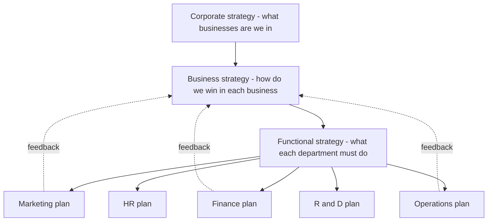
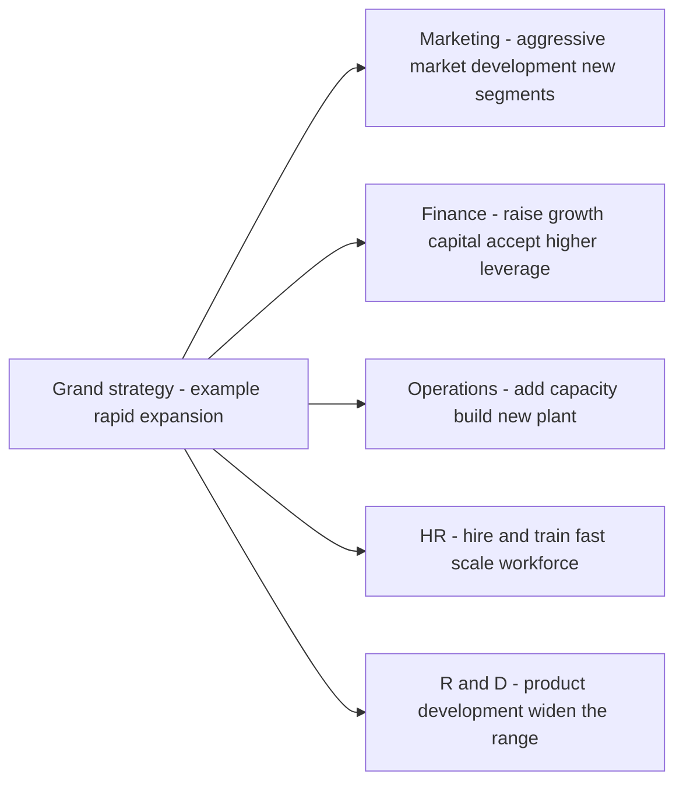
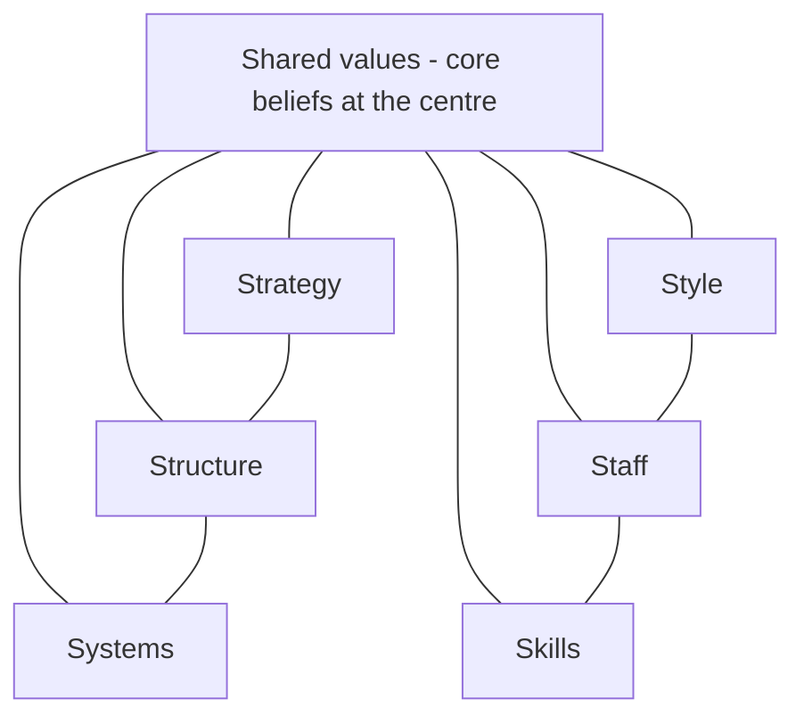
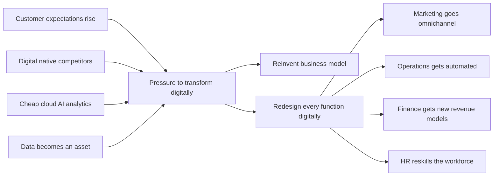
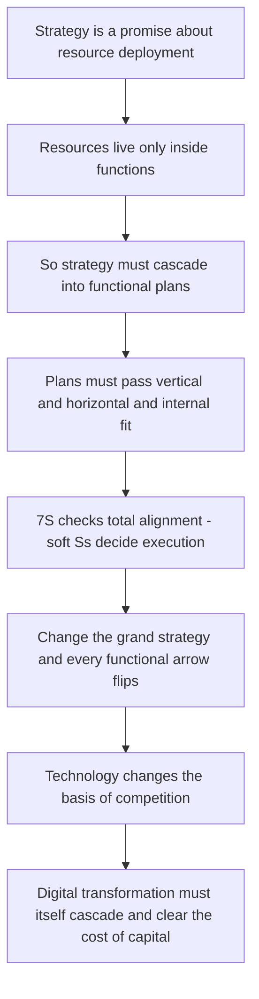

<!-- v2-deep -->

# Chapter 15 — SM: Functional & Digital Strategy

## 1. The Problem — A Brilliant Strategy That Nobody Can Actually Do

Imagine you are the CEO of **Aravind Motors**, a mid-sized Indian two-wheeler maker. After months of analysis, your board signs off on a bold corporate strategy: *"Become the No. 1 electric scooter brand for young urban Indians within five years."* Everybody claps. The strategy document is beautiful.

Then Monday morning arrives. Your marketing head asks, "Which customers exactly, and what price?" Your operations head asks, "Do I retool the petrol-engine assembly line or build a new plant?" Your finance head asks, "Where does the ₹800 crore come from, and what return do I promise investors?" Your HR head asks, "I have 4,000 workers skilled in combustion engines. Do I retrain them or hire battery engineers?" Your R&D head asks, "Do we license a battery-management system or develop our own?"

Suddenly the beautiful strategy is a wall of silence. Nobody argues with the *vision*. But nobody knows what to **do** on Tuesday. That is the problem this chapter solves.

**A corporate or business strategy is only a promise. It becomes real only when it is translated into decisions that each function makes every day.** A strategy that stays at the top — in the boardroom, on the slide deck — is what strategists call a *"strategy on paper."* The gap between the grand plan and the daily work of departments is where most strategies quietly die. Studies of strategy execution repeatedly find that the failure is rarely in the *thinking*; it is in the *cascade*.

Let us be precise about *why* the cascade fails so often, because the exam rewards this diagnosis. There are four recurring failure modes, and each maps to a fix this chapter supplies:

- **Translation failure** — the grand words ("be No. 1") never get converted into a *measurable functional target* ("capture 15% of the sub-₹1.2 lakh EV scooter segment by Year 3"). Cure: functional objectives that ladder up to the strategy.
- **Alignment failure** — each function makes a locally sensible plan that contradicts another function's plan (marketing promises 60-day delivery; operations can only do 90). Cure: horizontal fit.
- **Resource failure** — the strategy is cascaded but the money, people or machines are never actually reallocated to match; the old budget quietly rules. Cure: strategy *is* a pattern of resource allocation, enforced through the finance and HR functions.
- **Feedback failure** — the top never hears that the plan is infeasible until it is too late. Cure: the upward feedback loop.

There is a second, newer version of the same problem. Even if Aravind Motors perfectly cascades its strategy into marketing, finance, operations, HR and R&D, a *digital-native* competitor — say a startup that sells scooters online, uses data to predict demand, swaps batteries through an app, and pushes software updates over the air — can make the whole functional structure obsolete. So the manager faces two questions at once:

1. **How do I make my strategy real by pushing it down into every function?** (Functional strategy)
2. **How do I keep the whole business relevant when technology is rewriting the rules of my industry?** (Digital strategy)

This chapter answers both, and shows they are the same discipline seen from two angles. The unifying claim to carry through all ten sections: *strategy is real only when resources move inside functions, and in the modern economy the movement is increasingly digital.*

---

## 2. The Core Idea — Strategy Is a Cascade, Not a Statement

The single most important idea in this chapter is the **hierarchy of strategy** and the flow between its levels.

A firm makes strategy at three levels, and each level exists to *serve and constrain* the level below it:

- **Corporate strategy** answers: *"What businesses should we be in?"* (Scope, direction, portfolio.)
- **Business strategy** answers: *"How do we win in each business?"* (Competitive advantage — cost or differentiation.)
- **Functional strategy** answers: *"What must each department do to deliver that win?"* (The day-to-day plans of marketing, finance, operations, HR, R&D.)

The core idea is that **strategy only becomes action when it flows down this hierarchy and each function converts the grand strategy into its own concrete plan** — and, crucially, when those functional plans are *mutually consistent* with each other and *aligned* to the strategy above them. This flowing-down is called **cascading**; the mutual consistency is called **alignment**.

*Figure 15.1 — Strategy cascades downward into functions, and functional reality feeds back upward to shape strategy.*

Notice the dotted feedback arrows. Cascading is not a one-way waterfall. Functions report back what is *feasible* — finance says "we can raise only ₹500 crore," operations says "retooling takes 18 months" — and this reshapes the strategy. Great strategy is a **loop**, not a memo.

**A finer distinction the exam tests — the three "verbs" of the hierarchy.** Corporate strategy *directs* (sets scope), business strategy *positions* (chooses the basis of advantage), functional strategy *executes* (deploys resources). A neat way to remember the boundary: if the decision changes *which industry's profit pool you fish in*, it is corporate; if it changes *how you beat rivals in the same pool*, it is business; if it changes *how a department supports that fight*, it is functional. Many single-business firms (a standalone restaurant chain) collapse the corporate and business levels into one — the two-level firm is a valid special case, and examiners sometimes test whether you notice that a small firm has no separate "corporate" layer.

**Why "cascade" is the exact right metaphor.** A waterfall loses nothing as it falls; a cascade *steps down* and can also spray back up. At each step the strategy gains specificity (from "win in EVs" to "penetration price at ₹95,000") and loses ambiguity. The information that flows *up* is different in kind from what flows down: down flows *intent* (goals, priorities), up flows *feasibility* (constraints, capacity, cost). Confusing these two directions is a common analytical error — the top should not micro-specify functional tactics on the way down, and functions should not silently reset the strategy on the way up.

The digital angle simply extends this idea: **digital transformation is a corporate/business strategy choice that must ALSO cascade into every function.** Going digital is not "the IT department buys software." It changes what marketing does (digital channels), what operations does (automation, analytics), what finance does (new revenue models), what HR does (new skills). If digital stays trapped in IT, it fails exactly the way a boardroom strategy fails when it stays in the boardroom.

---

## 3. Why It's Built This Way — The Logic Behind the Hierarchy

Why do we separate strategy into corporate, business and functional levels at all? Why not one big plan? The answer reveals the deep logic.

**Reason 1: Different questions need different decision-makers.** The CEO cannot decide the reorder quantity for spare parts, and the warehouse manager cannot decide which countries to enter. Splitting strategy by level matches each decision to the person with the right information and authority. This is the principle of **decision decentralisation**.

**Reason 2: Scope of impact differs.** A corporate decision (exit a business) affects everything and is nearly irreversible — so it is made rarely, by the top, with full analysis. A functional decision (change an ad campaign) affects one area and can be reversed in weeks. The hierarchy matches *reversibility and reach* to the *level* of decision.

**Reason 3: Functions are where resources actually get committed.** A strategy is ultimately a pattern of *resource allocation*. But money, people and machines live inside functions. So strategy cannot become real until functions decide how to deploy those resources. The functional level is where abstract intent meets concrete resource.

**Reason 4: Consistency must be engineered, not assumed.** Left alone, each function optimises *itself*. Marketing wants variety and low prices (to sell more); operations wants standardisation and long runs (to cut cost); finance wants low inventory (to save cash); HR wants stable headcount. These pull in opposite directions. The hierarchy exists to force **cross-functional alignment** so that all functions row in the same direction as the grand strategy. This is why we say functional strategies must be *internally consistent* (with each other) and *externally consistent* (with the business strategy).

**Reason 5 (the digital layer): technology changes the constraints.** Historically, the "grand strategy" set the direction and functions obeyed. But digital technologies (cloud, AI, analytics, platforms) can *create* strategic options that didn't exist — e.g., a data asset that becomes a new business. So the hierarchy now has a two-way relationship with technology: strategy directs technology, but technology also *enables new strategy*. That is why "digital strategy" is not a functional afterthought; it is woven through every level.

**The deeper first-principles account — why functional conflict is the *default*, not an accident.** Each function is rewarded on a different metric, so each rationally maximises a different variable. This is a classic *local-optimisation* problem: the sum of locally optimal decisions is almost never the globally optimal decision. Consider the table below — each cell is *individually correct* for that function and *collectively destructive*:

| Function | What it locally wants | Why (its metric) | The clash it creates |
|---|---|---|---|
| Marketing | Wide product range, low price | Sales revenue, market share | Kills operations' economies of scale; drains finance's cash |
| Operations | Few variants, long runs, high inventory buffers | Unit cost, capacity utilisation | Contradicts marketing's variety and finance's low-inventory wish |
| Finance | Low inventory, low leverage, high payback | Cash, ROCE, risk | Starves operations' buffers and marketing's spend |
| HR | Stable headcount, gradual change | Morale, retention, low cost-per-hire | Blocks the fast reskilling a bold strategy needs |
| R&D | Big long-horizon budgets, freedom | Innovation output | Fights finance's payback discipline |

The hierarchy is the *governance device* that overrides these local optima and forces a single shared objective. This is precisely why "alignment" is treated as an engineering task with explicit fit-tests (Section 4.4), not as a hope.

**Why not just write one giant integrated plan?** Because of **bounded rationality** and **information cost**. No single mind holds the reorder quantities of 10,000 SKUs *and* the geopolitics of entering Vietnam. Decomposing strategy by level lets each layer work at the right altitude with the right information, then reconnects the layers through cascading and feedback. The three-level structure is therefore not bureaucracy — it is the *minimum viable division of cognitive labour* that a complex firm needs.

---

## 4. Full Technical Content — The Frameworks and Their "Why"

### 4.1 The Three Levels of Strategy (Recap with Precision)

| Level | Key question | Typical decision | Time horizon | Who owns it |
|---|---|---|---|---|
| Corporate | What businesses? | Diversify, acquire, divest, allocate capital across units | 5–10 years | Board, CEO |
| Business (SBU) | How to compete? | Cost leadership vs differentiation vs focus | 3–5 years | SBU head |
| Functional | How to support? | Marketing mix, financing, production, staffing | 1–2 years | Functional heads |

The **Strategic Business Unit (SBU)** is the pivot: it is a self-contained division with its own competitors, its own market, and its own profit responsibility. Business strategy is made at SBU level; functional strategy supports each SBU.

**Three defining characteristics of an SBU (frequently examined):** (i) it is a *single business or a collection of related businesses* that can be planned separately from the rest of the firm; (ii) it has its *own set of competitors*; and (iii) it has a *manager responsible for strategic planning and profit* who controls the profit-affecting factors. If a division lacks distinct competitors or cannot be planned independently, it is not a true SBU. The test the examiner likes: *could this unit, in principle, be sold off and survive as a standalone business?* If yes, it is SBU-like.

**A fourth, often-forgotten level — the *operational* or *tactical* layer.** Below functional strategy sit the day-to-day operating decisions (this week's production schedule, today's ad bids). The syllabus foregrounds three levels, but knowing that functional strategy is *itself* further decomposed into operating plans helps you avoid the trap of calling a scheduling decision a "strategy." Rule of thumb: *strategy allocates resources across a horizon; operations executes within an allocation already made.*

### 4.2 Why Functional Strategy Exists — The "Grand Strategy → Functional Plan" Logic

A **grand strategy** (also called *master* or *corporate* strategy) is the overall game plan — e.g., *Expansion*, *Stability*, *Retrenchment*, or *Combination*. But a grand strategy is directional, not operational. To make it operational, each functional area must translate it into a **functional strategy**: a plan for how that function will deploy its resources to advance the grand strategy.

The **logic of alignment** is: *every functional plan must answer "How does what I do help achieve the grand strategy?"* If a functional plan cannot answer this, it is either useless activity or, worse, activity that *pulls against* the strategy.

*Figure 15.2 — One grand strategy (expansion) dictates a coherent, mutually reinforcing set of functional strategies.*

The power of the diagram: notice how *expansion* makes every function say "more/bigger/faster." Now imagine the grand strategy were *retrenchment* — every arrow would reverse: marketing prunes weak products, finance conserves cash, operations closes plants, HR downsizes, R&D cuts projects. The functional strategy is a *derivative* of the grand strategy. That is the whole point.

**The grand-strategy → functional-posture map (a high-value revision table).** The examiner frequently gives a grand strategy and asks you to derive each function's stance. Memorise the *direction of each arrow* under each grand strategy:

| Function | Expansion | Stability | Retrenchment |
|---|---|---|---|
| Marketing | New markets/products, aggressive promotion | Defend share, refine mix | Prune weak products/segments, harvest |
| Finance | Raise growth capital, accept leverage, reinvest (low dividend) | Steady, moderate payout | Conserve cash, cut capex, sell assets |
| Operations | Add capacity, new plants/tech | Optimise existing capacity | Close/consolidate plants, cut inventory |
| HR | Hire and train fast, scale | Stable headcount, develop existing staff | Downsize, redeploy, VRS |
| R&D | Product development, widen range | Incremental improvement | Cut/defer projects, focus on essentials |

*Why this matters:* it turns a vague essay into a defensible answer. If asked "a firm adopts a retrenchment strategy — outline its functional strategies," you simply read down the retrenchment column and justify each with the alignment logic.

### 4.3 The Five Functional Strategies in Detail

#### (a) Marketing Strategy — the demand-side plan

Marketing strategy specifies **target market + marketing mix (the 4 Ps)** to achieve the business objective.

- **Product** — range, features, quality, branding, packaging. (Wide range for differentiation; standardised for cost leadership.)
- **Price** — skimming (high price, premium) vs penetration (low price, volume). Must match the competitive strategy.
- **Place (distribution)** — intensive, selective, or exclusive channels; increasingly *omnichannel* (physical + digital).
- **Promotion** — advertising, sales promotion, personal selling, publicity, digital/social.

The marketing strategy must be **consistent with the business strategy**: a differentiator uses premium pricing and heavy branding; a cost leader uses penetration pricing and lean promotion.

**Deeper distinctions the exam tests inside marketing strategy:**

- **STP precedes the 4 Ps.** *Segmentation → Targeting → Positioning* comes first; the 4 Ps are how you *deliver* the chosen position. A common exam slip is to jump to the mix without first fixing the segment and position. The mix is the *answer*; STP is the *question*.
- **The 4 Ps vs the 7 Ps (services).** For services, the mix extends to *People, Process, Physical evidence* (Booms & Bitner). A bank or a hospital is judged on staff behaviour (People), queue design (Process) and ambience (Physical evidence) as much as on Product/Price. Know when to switch to 7 Ps.
- **Skimming vs penetration — the decision rule.** Skim when demand is price-*inelastic*, the product is novel/differentiated, imitation is hard, and you want to recover R&D fast. Penetrate when demand is price-*elastic*, scale economies are large, network effects reward volume, and you want to deter entry. Aravind's EV uses penetration precisely because volume drives cost down (scale) and adoption (network of charging/service).
- **Push vs pull promotion.** *Push* drives product *through* the channel (trade incentives, dealer margins); *pull* creates end-customer demand that pulls product through (advertising, branding). Cost leaders often push; differentiators often pull.

#### (b) Financial Strategy — the resource-supply plan

Financial strategy answers: *How do we fund the strategy, and how do we measure and reward returns?* Its components:

- **Capital structure** — the debt–equity mix. Growth strategies often accept more leverage; stability strategies keep it conservative.
- **Financing decisions** — sources of funds (retained earnings, equity, debt, hybrid).
- **Investment/capital budgeting** — which projects get capital (aligned to grand strategy priorities).
- **Dividend policy** — payout vs reinvestment; expansion favours reinvestment.
- **Working capital management** — cash, receivables, inventory to sustain operations.

Finance is the **enabler and the scorekeeper**: it supplies the money and it measures whether the strategy is creating value (ROI, ROCE, EVA).

**The bridge to the FM half of the paper (examiners love cross-links):** financial strategy is where SM meets FM. The *cost of capital* sets the hurdle rate for capital budgeting; *leverage* magnifies both returns and risk; *EVA = NOPAT − (Capital × WACC)* is the value-creation scorecard. A grand strategy that promises growth but destroys EVA (returns below WACC) is a *value-destroying* strategy even if revenue rises — a subtle point the examiner uses to test whether you understand that *growth is not automatically good.* Only growth that earns above the cost of capital creates value.

#### (c) Operations / Production Strategy — the supply-side plan

Operations strategy decides *how the product or service is made and delivered*:

- **Capacity** — how much, when to add, where located.
- **Process choice** — job/batch/mass/continuous; automation level.
- **Facilities and layout** — plant location, size, technology.
- **Supply chain** — make vs buy, supplier relationships, logistics.
- **Quality** — TQM, Six Sigma; quality level matched to strategy (cost leader = "good enough at low cost"; differentiator = "superior").
- **Inventory** — JIT vs buffer stocks.

Operations is where **cost and quality are actually born**. A cost-leadership business strategy *lives or dies* in operations.

**The strategic tension inside operations — efficiency vs flexibility.** Process choice sits on a spectrum: *job → batch → mass → continuous.* Moving right raises efficiency (lower unit cost) but lowers flexibility (harder to vary the product). A differentiator that needs variety cannot run a rigid continuous process; a cost leader that needs the lowest unit cost cannot afford job-shop flexibility. The *order-winner vs order-qualifier* idea (Hill) sharpens this: a *qualifier* is the minimum a product needs to be considered (a car must be safe); an *order-winner* is what actually clinches the sale (price for a cost leader, features for a differentiator). Operations must be tuned to protect the order-winner.

#### (d) Human Resource (HR) Strategy — the people plan

HR strategy ensures the firm has the *right people, with the right skills, motivated in the right direction*:

- **Manpower planning** — forecasting numbers and skills needed by the strategy.
- **Recruitment and selection** — building the workforce the strategy requires.
- **Training and development** — closing the skill gap (critical during digital transformation).
- **Performance appraisal and rewards** — aligning individual behaviour to strategic goals.
- **Retention, culture, and change management** — keeping talent and enabling change.

HR is the **strategy-culture bridge**: a strategy the workforce cannot or will not execute is dead. When strategy changes (e.g., going digital), HR carries the reskilling burden.

**Why HR is the make-or-break function in transformation.** Structure and systems can be bought or copied; *skills and shared values cannot be installed overnight.* This is why the two "soft Ss" that resist change most (Staff, Skills) live inside HR's remit. A firm can order new machines in months but rebuild a workforce's capability only over years — so HR is usually the *binding constraint* on how fast a bold strategy can move. The reward system is the sharpest lever: *what gets measured and paid gets done.* If Aravind keeps paying bonuses on petrol-scooter volume, no memo about EVs will change behaviour. Reward realignment is the cheapest, fastest alignment tool HR owns.

#### (e) Research & Development (R&D) Strategy — the innovation plan

R&D strategy governs *how the firm innovates*:

- **Innovation posture** — *first mover / pioneer* (be first, high risk, high reward) vs *follower / imitator* (let others prove the market, then improve).
- **Product vs process R&D** — new products (differentiation) vs cheaper methods (cost leadership).
- **Make vs buy technology** — in-house development vs licensing/acquisition.
- **R&D intensity** — how much to spend; matched to how much the strategy depends on innovation.

R&D is the **future-supply plan**: it determines whether the firm has something to sell tomorrow.

**First-mover advantages vs disadvantages (a common 4-mark question).** *Advantages:* technological leadership, pre-emption of scarce assets and shelf space, buyer switching costs, and the chance to set industry standards. *Disadvantages:* high R&D and market-education cost, technological/market uncertainty, and "free-rider" followers who imitate cheaply once you have proven the market. The strategic rule: *pioneer where the advantage is defensible (patents, network effects, standards) and follow where imitation is cheap and the market is proven.* Aravind pioneers on battery-management *software* (defensible, differentiating) but follows on *chassis* (proven, cheap to copy) — a textbook split posture.

### 4.4 Ensuring Alignment — Functional Plans Must Fit Three Ways

A functional strategy is well-designed only if it satisfies three fit-tests:

1. **Vertical fit (with strategy above):** Does it advance the business/grand strategy?
2. **Horizontal fit (with other functions):** Is it consistent with what other functions are doing? (Marketing's promised delivery dates must match operations' capacity.)
3. **Internal fit (within the function):** Are the sub-decisions consistent? (Premium pricing + cheap packaging = mismatch.)

The classic diagnostic tool for checking whether *all* elements of the organisation are aligned is the **McKinsey 7S Framework** (Peters, Waterman & Pascale). It argues that effective strategy execution needs seven interdependent elements to be mutually consistent:

*Figure 15.3 — McKinsey 7S: three hard elements (Strategy, Structure, Systems) and four soft elements (Style, Staff, Skills, Shared Values) must all align for execution to succeed.*

The 7S insight for this chapter: **you cannot change strategy without changing the supporting functional Ss.** A new digital strategy demands new Systems, new Skills, new Staff and often a new Style and Shared Values — otherwise the old organisation quietly rejects the new strategy like a body rejecting a transplant.

**Why the split into "hard" and "soft" Ss matters.** The *hard* Ss (Strategy, Structure, Systems) are tangible, top-down and relatively easy to identify and change on paper. The *soft* Ss (Style, Staff, Skills, Shared Values) are cultural, hard to see and hard to change — yet they decide whether execution actually happens. McKinsey's central finding: *managers over-invest in the hard Ss and under-invest in the soft ones, which is why so many restructurings fail.* Shared Values sit at the centre because they anchor all six others; change them last and the transformation reverts.

**A quick alignment self-check the examiner rewards** — for any proposed functional plan, run the three fits in order: *(1) does it serve the strategy above? (2) does it fit the other functions? (3) is it internally consistent?* A plan that passes all three is "aligned"; naming which fit a given scenario *fails* is a favourite short-answer prompt (e.g., "premium brand sold through discount channels" fails **internal** fit; "sales target exceeds plant capacity" fails **horizontal** fit).

### 4.5 Digital Transformation — Why Functions Must Go Digital

**Digital transformation** is the deep, strategic reinvention of how a firm creates and delivers value using digital technologies — not merely digitising existing processes, but rethinking the business model itself.

There is a useful distinction the exam rewards:

- **Digitisation** — converting analog information to digital (paper records → database).
- **Digitalisation** — using digital tech to improve *existing* processes (online order form replaces phone order).
- **Digital transformation** — using digital tech to *change the business model and value proposition* itself (from selling scooters to selling battery-swap-as-a-service).

A memory hook for the three-rung ladder: **data → process → business model.** Digitisation changes the *data* (analog to digital), digitalisation changes a *process* (faster, online), transformation changes the *business model* (what you sell and how you earn). The depth increases at each rung and so does the strategic stakes.

**Why must firms adapt? The strategic drivers of digital transformation:**

1. **Changing customer expectations** — customers now expect the speed, convenience, personalisation and 24×7 availability that digital leaders (Amazon, Netflix) have trained them to want. A firm that cannot match this loses relevance.
2. **Competitive pressure and disruption** — digital-native entrants and platform businesses attack industries with lower cost structures and network effects. Adapt or be disrupted (the "Kodak problem").
3. **Technology availability and falling cost** — cloud, AI and analytics are now cheap and rentable; capabilities once reserved for giants are available to all, so *not* using them is a disadvantage.
4. **Data as a strategic asset** — firms sit on data that, analysed, reveals demand, risk and opportunity. Rivals who exploit their data out-decide those who don't.
5. **Globalisation and connectivity** — digital channels remove geography as a barrier, both as opportunity (new markets) and threat (new competitors).
6. **Operational efficiency and agility** — automation and analytics cut cost and speed up response; laggards carry a permanent cost/speed handicap.

The deep reason firms *must* adapt: **digital technology changes the basis of competition in the industry.** When it does, a firm's existing sources of advantage can turn into liabilities (e.g., a large branch network becomes dead weight when banking goes mobile). Refusing to adapt is not "staying safe" — it is choosing a slow structural decline.

**The exam's favourite counter-nuance — transformation is not free or costless.** Examiners increasingly test whether you can also list the *challenges/barriers* to digital transformation, not just the drivers: (i) **legacy systems** that are costly and risky to replace; (ii) **cultural resistance** and fear of job loss; (iii) **skill gaps** in data/AI talent; (iv) **cybersecurity and data-privacy risk** that grows with digitisation; (v) **high upfront investment** with uncertain payback; and (vi) **change-management fatigue**. A balanced answer pairs the drivers (*why adapt*) with the barriers (*why it is hard*) and concludes that the barriers are reasons to *manage* transformation well, not reasons to *avoid* it — because standing still is itself a decision with a cost.

*Figure 15.4 — The strategic drivers force digital transformation, which must cascade into a redesign of every function.*

### 4.6 E-Business Models — How Firms Make Money Digitally

An **e-business model** describes *how a firm creates, delivers and captures value using the internet and digital channels*. The ICAI syllabus expects familiarity with the major transaction and revenue models.

**By parties transacting (the classic e-commerce matrix):**

| Model | Meaning | Example |
|---|---|---|
| B2C | Business to Consumer | Amazon, Myntra selling to shoppers |
| B2B | Business to Business | IndiaMART, steel supplier to manufacturer |
| C2C | Consumer to Consumer | OLX, eBay (a platform enabling individuals to trade) |
| C2B | Consumer to Business | A freelancer bidding for a company's project; influencers selling reach |
| B2G / B2A | Business to Government/Administration | GeM portal, e-tendering |

**By revenue/value logic (how the model actually earns):**

- **E-tailer / online store** — sells goods directly online (owns inventory). *Revenue: product margin.*
- **Marketplace / platform** — connects buyers and sellers without owning inventory. *Revenue: commission/listing fees.* Benefits from **network effects** (more buyers attract more sellers and vice versa).
- **Subscription (SaaS/content)** — recurring fee for ongoing access (Netflix, Zoho). *Revenue: predictable recurring revenue.*
- **Advertising / freemium** — free service funded by ads or paid upgrades (Google, Spotify free tier). *Revenue: ads or premium conversions.*
- **Aggregator** — brands and standardises third-party providers under one interface (Ola, Uber, Oyo, Zomato). *Revenue: commission on aggregated supply.*
- **On-demand / gig** — matches instant demand to available supply (Swiggy, Urban Company). *Revenue: transaction fee.*
- **Brokerage / transaction fee** — facilitates transactions for a cut (Zerodha, payment gateways).

The strategic point: **the e-business model determines the firm's cost structure, its source of advantage (often network effects or data), and which functions matter most.** A marketplace lives on technology, trust and network scale, not on manufacturing — so its functional strategy looks radically different from a traditional manufacturer's.

**Aggregator vs marketplace — the distinction the exam tests.** Both are asset-light intermediaries, but they differ in *control and branding.* A **marketplace** (Amazon Marketplace, eBay) lists third-party sellers under *their own* names — the platform is a neutral venue and the seller's brand shows. An **aggregator** (Ola, Oyo, Zomato) brings fragmented providers under *one common brand and quality standard* — the customer buys "an Oyo room," not "Hotel X listed on Oyo." Key features of the aggregator model: (i) providers are *partners*, not employees; (ii) the aggregator does not *own* the assets; (iii) it sets *quality standards and pricing*; and (iv) it markets under a *single unified brand*. Mislabelling an aggregator as a marketplace (or vice versa) is a frequent MCQ trap.

**Why network effects are the deep source of platform advantage.** In a marketplace/aggregator, value rises with the number of participants — more buyers attract more sellers, which attracts more buyers (a *virtuous flywheel*). This creates a **winner-takes-most** dynamic and a formidable entry barrier: a new rival must attract both sides simultaneously (the "chicken-and-egg" cold-start problem). This is why platform businesses spend heavily early to reach *critical mass*, after which the network defends itself. A manufacturer has no such self-reinforcing moat — which is exactly why the model choice reshapes the entire competitive logic.

### 4.7 Emerging Technologies as Strategic Levers

These are not "IT topics" — the syllabus treats them as *strategic levers* that change what a firm can do. A **strategic lever** is a capability that, when pulled, shifts the firm's competitive position.

| Technology | What it does | Strategic use (the "why") |
|---|---|---|
| **Cloud computing** | Rent computing/storage on demand | Converts fixed IT capex into flexible opex; lets even small firms scale instantly; enables speed and global reach |
| **Big Data & Analytics** | Extract insight from large data | Better decisions; demand prediction; personalisation; risk management — turns data into advantage |
| **Artificial Intelligence & Machine Learning** | Machines that learn and decide | Automation, forecasting, personalisation, chatbots, fraud detection — scales expertise and cuts cost |
| **Internet of Things (IoT)** | Connected sensors on physical assets | Real-time monitoring, predictive maintenance, new service models (pay-per-use) |
| **Blockchain** | Distributed, tamper-proof ledger | Trust without intermediaries; supply-chain traceability; secure transactions |
| **Robotics / Automation / RPA** | Machines/software doing repetitive work | Lower cost, higher quality and speed in operations and back-office |
| **Mobile & Social** | Ubiquitous connected customers | Direct customer relationships, new channels, community and word-of-mouth |

**Why firms MUST treat these as strategic, not optional:**

- They **change the cost curve** — a rival using AI-driven automation can undercut you permanently.
- They **change customer expectations** — once one bank offers instant AI-assisted service, all must.
- They **create new advantages that compound** — data and AI improve with use (more data → better model → better product → more users → more data). This *flywheel* means late movers may never catch up.
- They **can destroy old advantages** — cloud erased the advantage of owning big data centres; analytics erased the advantage of "gut feel" gained over decades.

The manager's takeaway: **emerging technologies must be evaluated as strategic choices — which lever, pulled in which function, produces advantage aligned to our grand strategy — not delegated to IT as a purchase.**

**A cross-functional mapping to fight the "tech = R&D" trap.** The examiner rewards showing *breadth* — that one technology serves many functions. Map each lever across the value chain:

| Technology | Marketing | Operations | Finance | HR |
|---|---|---|---|---|
| AI/ML | Personalised offers, chatbots | Predictive maintenance, quality vision | Fraud detection, credit scoring | Resume screening, attrition prediction |
| Analytics | Demand forecasting, targeting | Route/inventory optimisation | Working-capital analytics | Workforce planning |
| Cloud | Scalable campaigns | Elastic capacity, global rollout | Opex flexibility | Remote collaboration tools |
| IoT | Usage-based offers | Real-time asset monitoring | Pay-per-use billing | Safety/wearable monitoring |

*The lesson:* a single lever pulled in one function is under-using it; strategic value comes from deploying the lever *across* functions in service of the grand strategy.

**RPA vs AI — a subtle distinction sometimes tested.** *RPA (Robotic Process Automation)* follows *fixed rules* to automate repetitive, structured tasks (copying data between systems) — it does not "learn." *AI/ML* handles *unstructured, judgemental* tasks and improves with data. Calling a rule-based bot "AI" is a precision error; the reverse — expecting RPA to make judgement calls — is a design error.

---

## 5. Applied Cases — Strategy Meets the Real World

### Case 15.1 — Aravind Motors Goes Electric (cascading a grand strategy)

**Situation:** Recall Aravind Motors' grand strategy — become India's No. 1 electric urban scooter brand in five years (an *expansion via product development* strategy). Show how it cascades.

**Analysis — functional translation:**

- **Marketing:** Target *young urban commuters* (18–35, tier-1/2 cities). Position on "smart, clean, low running cost." Penetration pricing to build volume and network. Omnichannel: online booking + experience stores. → *Vertical fit: supports rapid market capture.*
- **Finance:** Raise ₹800 cr via a mix of equity (dilution acceptable for growth) and green bonds. Reinvest profits (no dividend). Capital budgeting prioritises the battery plant. → *Supplies and scores the growth.*
- **Operations:** Build a new EV-dedicated plant; adopt modular/automated assembly; secure battery supply (make-vs-buy: license cell tech, assemble packs in-house). JIT for components. → *Where the cost advantage is born.*
- **HR:** Reskill combustion-engine workers into battery/electronics roles; hire software and battery engineers; performance metrics tied to EV launch milestones. → *Bridges strategy to capability.*
- **R&D:** Pioneer posture on battery-management software (source of differentiation); follower posture on chassis (use proven designs). → *Secures tomorrow's product.*

**Exam-style conclusion:** The strategy becomes real only because each function derived a *consistent* plan from it. Note the horizontal fit: marketing's penetration pricing *demands* operations' low-cost automation *and* finance's willingness to fund losses early — remove any one and the strategy collapses.

### Case 15.2 — "Sahakari Bank" Faces Digital Disruption (why firms must adapt)

**Situation:** Sahakari Bank, a traditional regional bank with 300 branches, is losing young customers to app-only neobanks and UPI-first fintechs. The board asks: "Is digital just a new mobile app, or something bigger?"

**Analysis — apply the drivers of digital transformation:**

- *Changing customer expectations:* young customers expect instant, 24×7, app-based service — branches feel slow.
- *Competitive disruption:* neobanks have near-zero branch cost and can price/serve better.
- *Cheap technology:* cloud + AI make world-class digital banking rentable, not a giant's privilege.
- *Data asset:* Sahakari's transaction data can power credit scoring and cross-sell — currently unused.

**Recommendation:** This is **digital transformation, not digitalisation.** A mere app (digitalisation) leaves the costly branch-heavy model intact. True transformation reimagines the model: digital-first onboarding, AI credit scoring, branches repurposed as advisory hubs. This cascades into functions — **Operations** automates back-office (RPA), **HR** reskills tellers into advisors, **Finance** shifts from branch-cost to tech-investment, **Marketing** moves to digital acquisition.

**Exam-style conclusion:** The bank *must* adapt because digital technology has **changed the basis of competition** in banking; its branch network — once an advantage — is becoming a cost liability. Refusing to transform is choosing structural decline (the Kodak lesson).

### Case 15.3 — "FreshLeaf" Chooses an E-Business Model (model selection + tech levers)

**Situation:** FreshLeaf, a farm-produce startup, must decide how to sell online. Options: (a) buy produce and e-tail it, or (b) run a marketplace connecting farmers directly to consumers.

**Analysis:**

- **E-tailer model:** owns inventory → margin revenue, but high working-capital and spoilage risk; controls quality tightly. Functionally *operations-heavy*.
- **Marketplace model:** connects farmers and buyers → commission revenue, asset-light, benefits from **network effects**; but must solve trust and quality assurance. Functionally *technology- and trust-heavy*.

**Tech levers to pull:** **Analytics** to forecast demand and cut spoilage; **cloud** to scale the platform cheaply; **AI** for demand prediction and dynamic pricing; **IoT/mobile** for cold-chain tracking. **Marketing** builds a trusted brand; **HR** needs data and platform talent, not warehouse labour, if marketplace is chosen.

**Exam-style conclusion:** The chosen **e-business model dictates the functional strategy**: a marketplace makes technology and network scale the core functions, while an e-tailer makes operations and working-capital management core. The *emerging-tech levers* (analytics, cloud, AI) are what make either model competitive — they are strategic choices, not IT purchases.

### Case 15.4 — "TitanTools" Retrenches (deriving functional strategy for a *contracting* grand strategy)

**Situation:** TitanTools, a hand-tools maker, has three product lines — Premium (profitable), Standard (break-even), and Economy (loss-making, shrinking market). Cash is tight and the bank wants leverage cut. The board chooses a **retrenchment/turnaround** grand strategy. Derive each function's plan.

**Analysis — read down the retrenchment column of Section 4.2, then justify:**

- **Marketing:** *Prune the Economy line*, harvest the Standard line for cash, and concentrate promotion behind the profitable Premium line. → *Vertical fit: focuses scarce spend on the survivor.*
- **Finance:** *Conserve cash* — cut discretionary capex, sell the idle Economy-line plant, use proceeds to *deleverage*, suspend dividend. → *Restores solvency, satisfies the bank.*
- **Operations:** *Consolidate* — close/repurpose the Economy plant, shift Premium/Standard to fewer, higher-utilisation facilities, cut buffer inventory to release working capital. → *Where the cost is actually removed.*
- **HR:** *Right-size* via redeployment and a voluntary retirement scheme; retain critical Premium-line skills; communicate honestly to protect morale of the survivors. → *Executes the cut without gutting capability.*
- **R&D:** *Defer* speculative projects; focus the reduced budget on incremental Premium-line improvements that defend margin. → *Protects the one line worth a future.*

**Self-check — do the fits hold?** Vertical: every plan serves "shrink to a profitable core." Horizontal: marketing's decision to *drop* Economy is what *lets* operations close that plant and finance sell it — the arrows reinforce. Internal: finance's "sell assets + deleverage + no dividend" are mutually consistent.

**The examiner tweak — "what if the board instead chose *stability*?"** Then no plant closes, no line is dropped; each function *defends and optimises the existing position* (middle column of the table): marketing defends share, operations optimises current capacity, finance keeps a moderate payout, HR develops existing staff, R&D does incremental improvement. **Same firm, opposite functional postures — because the grand strategy changed.** This is the single most testable idea in the chapter: *functional strategy is a derivative of the grand strategy, so change the grand strategy and every functional arrow flips.*

### Case 15.5 — "PrintPro" Climbs the Digital Ladder (digitisation vs digitalisation vs transformation, with a value-creation check)

**Situation:** PrintPro runs neighbourhood print shops. It is evaluating three digital initiatives and asks which rung of the ladder each sits on — and which is genuinely *strategic*.

- **Initiative A:** Scan all paper job-cards into a searchable database. → **Digitisation** (analog data → digital). Improves record-keeping; does *not* change the process or model.
- **Initiative B:** Let customers upload files and pay via an online order form instead of visiting the shop. → **Digitalisation** (a digital tool improves an *existing* process — ordering). Faster, cheaper, but PrintPro still just prints and sells prints.
- **Initiative C:** Build a platform where any local business designs marketing collateral online, and PrintPro routes each job to the *nearest partner print shop*, taking a commission — PrintPro stops owning presses and becomes an **aggregator of print capacity**. → **Digital transformation** (the *business model* changes: from asset-heavy printer to asset-light platform earning commission, powered by network effects).

**The value-creation cross-check (link to financial strategy).** Suppose Initiative C needs ₹5 crore of platform investment, PrintPro's WACC is 14%, and analysts project incremental NOPAT of ₹1.1 crore per year at steady state.

- Capital charge = ₹5 cr × 14% = **₹0.70 cr**.
- EVA = NOPAT − capital charge = ₹1.10 cr − ₹0.70 cr = **+₹0.40 cr**.
- Since EVA > 0, the transformation earns *above* the cost of capital → it **creates value**, not just revenue.

**Reconciliation / self-verify:** Return on the ₹5 cr investment = 1.10 / 5.00 = **22%**, which exceeds WACC of 14% by 8 percentage points; multiplying that 8% spread by the ₹5 cr capital base gives 0.08 × 5 = **₹0.40 cr**, exactly the EVA computed above. The two methods agree, so the numbers are consistent.

**Examiner tweak — "what if NOPAT were only ₹0.60 cr?"** Then EVA = 0.60 − 0.70 = **−₹0.10 cr**; return = 0.60/5 = 12% < 14% WACC. The transformation would *grow the business but destroy value.* Lesson: **digital transformation is not automatically good — it must clear the cost-of-capital hurdle like any strategic investment.** This is the trap where a candidate praises a flashy digital move without checking whether it earns its capital.

### Case 15.6 — "MediSwift" Picks Skimming vs Penetration (marketing-strategy fit under two business strategies)

**Situation:** MediSwift has invented a patented rapid diagnostic device. Two go-to-market options are on the table; unit variable cost is ₹200, and it has patent protection for 6 years.

- **Option 1 — Skimming:** Launch at ₹900. Expected Year-1 volume 40,000 units.
- **Option 2 — Penetration:** Launch at ₹350. Expected Year-1 volume 2,20,000 units.

**Contribution comparison (self-verified):**

- Skimming contribution = (900 − 200) × 40,000 = ₹700 × 40,000 = **₹2.80 crore**.
- Penetration contribution = (350 − 200) × 2,20,000 = ₹150 × 2,20,000 = **₹3.30 crore**.

**Cross-check by ratio:** penetration's per-unit contribution (₹150) is 150/700 ≈ 21.4% of skimming's, but its volume (2,20,000) is 5.5× skimming's; 0.214 × 5.5 ≈ 1.18, i.e. penetration yields ~18% more total contribution — matching ₹3.30 cr / ₹2.80 cr = 1.18. Consistent.

**The strategic reasoning (not just the arithmetic).** Higher Year-1 contribution alone does *not* settle it — the *business strategy* must decide:

- If MediSwift pursues **differentiation** (premium, protected, image-driven), **skimming** fits: it recovers R&D fast, signals quality, and the 6-year patent shields it from imitators, so it need not rush to deter entry.
- If MediSwift pursues **cost leadership / market dominance** (build an installed base, lock in hospitals, sell consumables later), **penetration** fits: high early volume builds the base and network of trained users, and the razor-and-blades follow-on revenue (test strips) dwarfs the launch margin.

**Examiner tweak — "the patent is only 1 year, and rivals can copy cheaply."** Now skimming is dangerous: a high price *invites* rapid entry once protection lapses. **Penetration to pre-empt entry and grab share becomes the better strategic fit even though per-unit margin is thin.** Lesson: the pricing choice must fit *both* the business strategy *and* the imitation/entry conditions — never pick the higher-contribution number mechanically. This is the classic "compute both, then reason" question where the marks are in the *reasoning*, not the sum.

### Case 15.7 — "ShopEasy" Diagnoses a Broken Cascade with 7S (spotting which fit fails)

**Situation:** ShopEasy, a retailer, announced a bold *"premium experience"* differentiation strategy 18 months ago. Sales are flat and staff seem indifferent. Diagnose using the three fits and 7S.

**Diagnosis:**

- **Structure** still rewards store managers purely on *cost per transaction* → a *systems/reward* misalignment (soft-S "Style/Staff" pulling against the new Strategy). This is a **vertical-fit failure**: the reward system does not advance the strategy above it.
- **Marketing** promises "personalised premium service" while **Operations** cut staff-per-store to save cost → a **horizontal-fit failure**: two functions contradict each other.
- **Skills** were never upgraded — staff got no service training → a soft-S gap that guarantees execution failure regardless of intent.

**Recommendation:** Realign the reward system to service quality (fix vertical fit), restore service staffing to match the premium promise (fix horizontal fit), and invest in skills training (close the soft-S gap). **Shared Values** — a genuine belief in premium service — must be built last and deliberately, or the old cost culture reasserts itself.

**Exam-style conclusion:** ShopEasy's strategy did not fail in *conception* but in *cascade and alignment.* The 7S lens shows the *hard* Ss were changed on paper (Strategy) while the *soft* Ss (Style, Staff, Skills, Shared Values) and the reward *Systems* were left in the old configuration — the transplant was rejected. This is the canonical "why good strategies fail in execution" answer.

---

## 6. Framework Summary

| Framework / Concept | Author / Origin | Purpose (the problem it solves) |
|---|---|---|
| Three levels of strategy (Corporate/Business/Functional) | Classical strategic management | Matches each strategic decision to the right level and decision-maker |
| Grand strategies (Expansion/Stability/Retrenchment/Combination) | Glueck & Jauch | Give the overall directional game plan that functions must serve |
| Functional strategies (Marketing, Finance, Operations, HR, R&D) | Strategic management canon | Translate grand strategy into concrete departmental resource plans |
| Marketing mix — 4 Ps (7 Ps for services) | E. Jerome McCarthy (7 Ps: Booms & Bitner) | Structure the demand-side plan (Product, Price, Place, Promotion; +People, Process, Physical evidence) |
| STP (Segmentation, Targeting, Positioning) | Marketing canon (Kotler) | Fix *who* and *what position* before designing the mix |
| Skimming vs penetration pricing | Pricing theory | Choose launch price to fit strategy and entry conditions |
| Order-winners vs order-qualifiers | Terry Hill | Tune operations to protect what actually wins the sale |
| First-mover vs follower posture | Innovation strategy | Decide when to pioneer and when to imitate |
| McKinsey 7S | Peters, Waterman & Pascale | Diagnose whether all hard and soft elements are aligned for execution |
| Three fits (Vertical/Horizontal/Internal) | Alignment logic | Test whether a functional plan is well-designed |
| Digitisation vs Digitalisation vs Digital transformation | Digital strategy literature | Distinguish depth of digital change; transformation reinvents the model |
| Drivers *and barriers* of digital transformation | Digital strategy literature | Explain *why* firms must adapt and *why* it is hard |
| E-business models (B2C/B2B/C2C/C2B/B2G; marketplace, aggregator, SaaS…) | E-commerce framework | Classify how a firm creates and captures value digitally |
| Network effects / winner-takes-most | Platform economics | Explain the self-reinforcing moat of platform models |
| EVA = NOPAT − (Capital × WACC) | Stern Stewart | Test whether a strategy *creates value*, not just revenue |
| Emerging technologies as strategic levers (AI, analytics, cloud, IoT, blockchain, RPA) | Contemporary strategy | Treat technology as a cross-functional competitive lever, not an IT expense |

---

## 7. Connections — How This Chapter Links to the Rest of SM

- **To the strategy hierarchy (earlier chapters):** Functional strategy is the *bottom* of the Corporate → Business → Functional pyramid. This chapter is where the earlier "how do we compete" (Porter's generic strategies) becomes daily action.
- **To Porter's generic strategies:** A *cost leadership* business strategy dictates lean operations, penetration pricing and process R&D; a *differentiation* strategy dictates premium marketing, quality operations and product R&D. Functional strategy is Porter's strategy *made operational*.
- **To Porter's Value Chain:** The five functional strategies map onto the value chain's primary (operations, marketing/sales) and support (HR, technology/R&D, finance/infrastructure) activities. Functional strategy is essentially *choosing how each value-chain activity is configured* to support the chosen advantage.
- **To Ansoff's Matrix:** *Market development* and *product development* growth choices land directly on marketing and R&D functional strategies. The grand strategy of *expansion* is executed through Ansoff-type moves that functions carry out.
- **To strategy implementation & structure:** McKinsey 7S connects functional strategy to *structure, systems, staff, style* — the implementation chapters. Alignment is the theme both chapters share.
- **To strategic control:** Finance's role as *scorekeeper* (ROI, EVA) links to the control chapter — functional metrics are how strategy is monitored. The Balanced Scorecard (financial, customer, internal-process, learning) is the multi-function control instrument that cascades strategy into measurable functional targets.
- **To BCG/portfolio analysis:** Corporate resource-allocation decisions (which SBU gets cash) become each SBU's *financial* functional strategy constraint. A "cash cow" SBU funds a "star" SBU — a corporate decision that lands as a financial-strategy input in each unit.
- **To the FM half of the paper:** Financial strategy (capital structure, cost of capital, capital budgeting, dividend, working capital) *is* the FM syllabus viewed as strategy execution — the clearest SM↔FM bridge in the course.

---

## 8. Traps & Examiner Tricks

1. **Confusing the three levels.** A classic trap: labelling a *functional* decision as "corporate strategy." "Should we advertise on Instagram?" is *functional* (marketing), not corporate. Always ask: *what businesses (corporate) / how to win (business) / how to support (functional)?*

2. **Treating digital transformation as buying software.** Examiners love the case where a firm "went digital" by launching an app but kept the old model — mark it as *digitalisation*, not *transformation*. Transformation changes the **business model**, not just a process.

3. **Digitisation vs digitalisation vs digital transformation.** These three sound alike; the exam tests precise definitions. Digitisation = analog→digital *data*; digitalisation = digital improves a *process*; transformation = digital reinvents the *business model*. Memory hook: **data → process → business model.**

4. **Forgetting horizontal fit.** Students list functional strategies in isolation. The examiner wants you to show *consistency across functions* — e.g., marketing's sales forecast must match operations' capacity and finance's working capital. State the alignment explicitly.

5. **Naming the wrong 4th P or wrong author.** The marketing mix is *Product, Price, Place, Promotion* (McCarthy). Do not write "Packaging" as one of the core 4 Ps. For services, the extra three are *People, Process, Physical evidence* (Booms & Bitner) — don't invent others.

6. **7S — hard vs soft elements.** A frequent MCQ: which are the *soft* Ss? Answer: *Style, Staff, Skills, Shared Values.* Hard: *Strategy, Structure, Systems.* Shared Values sits at the centre.

7. **Emerging tech treated as R&D-only.** Trap: putting AI/cloud only under R&D. They are *cross-functional strategic levers* — AI serves marketing (personalisation), operations (automation), finance (fraud), HR (hiring). Show breadth (use the Section 4.7 mapping table).

8. **E-business model confusion.** Don't confuse *marketplace* (no inventory, commission, neutral venue, seller's brand shows) with *e-tailer* (owns inventory, product margin) — or with *aggregator* (asset-light but sells under *one common brand* with set quality standards, e.g. Oyo/Ola). And C2B ≠ B2C — direction matters.

9. **One-way cascade fallacy.** The exam rewards mentioning the *feedback loop*: functions report feasibility back up, reshaping strategy. Strategy is a loop, not a waterfall.

10. **"Why must firms adapt?" answered weakly.** Don't just say "because of competition." Name the *strategic drivers* (customer expectations, disruption, cheap tech, data as asset) and the deep reason: **digital changes the basis of competition, turning old advantages into liabilities.** For a full-mark answer, also name the *barriers* (legacy systems, culture, skill gaps, cybersecurity, cost).

11. **Praising digital/growth without a value check.** Growth and "going digital" are not automatically good. If numbers are given, test whether the return beats the cost of capital (EVA > 0). A strategy that grows revenue while earning below WACC *destroys* value.

12. **Picking a pricing/model option by the bigger number alone.** When two options are computed (skimming vs penetration, e-tailer vs marketplace), the marks are in the *strategic reasoning* — fit with the business strategy, entry/imitation conditions, and horizontal fit — not in whichever contribution is larger.

13. **Missing that the grand strategy *flips every functional arrow*.** If the examiner switches expansion → retrenchment (or stability), you must reverse *every* functional posture accordingly. Answering with expansion-style functional plans for a retrenchment scenario is a guaranteed mark loss.

14. **Calling rule-based automation "AI."** RPA follows fixed rules and does not learn; AI/ML handles judgement and improves with data. Keep the distinction precise.

---

## 9. First-Principles Recap

Strip everything away and rebuild from zero:

1. **A strategy is a promise about how resources will be deployed to win.** Until resources actually move, it is only words.
2. **Resources live inside functions** — money in finance, machines in operations, people in HR, demand in marketing, ideas in R&D. So strategy can only become real *inside functions*.
3. Therefore **strategy must cascade**: the grand strategy must be translated by each function into a concrete plan — and those plans must be *consistent* with the strategy above (vertical fit) and *with each other* (horizontal fit). Alignment is engineered, not assumed, because each function's *default* is to optimise its own local metric, and the sum of local optima is not the global optimum.
4. **The check for total alignment** is the 7S test: strategy, structure, systems, style, staff, skills and shared values must all point the same way — and the soft Ss (which live largely inside HR and culture) are the ones that quietly reject a change if left in the old configuration.
5. **Because functional strategy is a derivative of the grand strategy, changing the grand strategy flips every functional arrow.** Expansion says "more/bigger/faster"; retrenchment says "fewer/smaller/leaner." Same firm, opposite functional postures.
6. **Technology changes the constraints.** Digital tools don't just help execute strategy — they *change what strategies are possible* and *change the basis of competition*. When the basis of competition shifts, standing still means decline.
7. Therefore **digital transformation is a strategic choice that must itself cascade** into every function: it is not an IT project. The drivers (customers, disruption, cheap tech, data) make adaptation compulsory; the barriers (legacy, culture, skills, security, cost) make it *hard*, not optional. And like any strategic investment, it must clear the cost-of-capital hurdle to *create* value rather than merely add revenue.
8. **E-business models and emerging technologies (AI, analytics, cloud)** are the concrete *forms* this digital strategy takes — the levers a manager pulls, in specific functions, to build advantage aligned with the grand strategy. The deepest of these advantages (network effects, compounding data) are *self-reinforcing*, which is why they create winner-takes-most moats a traditional manufacturer never enjoys.

*Figure 15.5 — The chapter compressed to a single logical chain from first principle to digital conclusion.*

The whole chapter is one sentence: **A grand strategy is only real when every function turns it into aligned action — and in the modern economy, "action" increasingly means digital action.**

---

## 10. Quick-Revision Sheet

**Three levels:** Corporate (what businesses) → Business/SBU (how to win) → Functional (how to support). Cascade down; feedback up. *Verbs:* corporate *directs*, business *positions*, functional *executes*.

**SBU test:** distinct competitors + independently plannable + own profit responsibility. "Could it be sold and survive alone?"

**Five functional strategies:**
- *Marketing* — STP first, then 4 Ps (Product, Price, Place, Promotion — McCarthy; +People/Process/Physical evidence for services). Skimming vs penetration; push vs pull.
- *Finance* — capital structure, financing, capital budgeting, dividend, working capital. Enabler + scorekeeper. Value check: EVA = NOPAT − (Capital × WACC).
- *Operations* — capacity, process, facilities, supply chain, quality, inventory. Efficiency↔flexibility trade-off; protect the order-winner. Where cost/quality is born.
- *HR* — manpower planning, recruit, train, appraise/reward, retain. Strategy–culture bridge; usually the *binding constraint* on speed; reward system is the sharpest lever.
- *R&D* — first-mover vs follower; product vs process; make vs buy tech. Future-supply plan.

**Grand strategy → functional posture:** Expansion = more/bigger/faster; Stability = defend/optimise; Retrenchment = fewer/smaller/leaner. *Change the grand strategy and every arrow flips.*

**Three fits for alignment:** Vertical (with strategy above) + Horizontal (with other functions) + Internal (within function).

**McKinsey 7S:** Hard = Strategy, Structure, Systems. Soft = Style, Staff, Skills. Centre = Shared Values. Soft Ss decide execution and are hardest to change.

**Digital depth ladder:** Digitisation (data analog→digital) → Digitalisation (improve a process) → **Digital transformation** (reinvent the business model). Hook: *data → process → business model.*

**Drivers of digital transformation (why adapt):** rising customer expectations; digital-native disruption; cheap cloud/AI/analytics; data as strategic asset; global connectivity; efficiency/agility. **Barriers (why hard):** legacy systems, culture/resistance, skill gaps, cybersecurity/privacy, high upfront cost. Deep reason: *digital changes the basis of competition; old advantages become liabilities.*

**E-business models:**
- By parties: B2C, B2B, C2C, C2B, B2G.
- By revenue logic: e-tailer (owns inventory, margin), marketplace/platform (commission, neutral venue, seller's brand, network effects), aggregator (one common brand + set quality standards, e.g. Ola/Oyo/Zomato), subscription/SaaS (recurring), advertising/freemium, on-demand/gig, brokerage.
- Moat: network effects → winner-takes-most; solve the cold-start (chicken-and-egg) problem to reach critical mass.

**Emerging tech as strategic levers:** Cloud (capex→opex, scale), Big Data & Analytics (insight, prediction), AI/ML (automation, personalisation, *learns*), IoT (real-time, predictive maintenance, pay-per-use), Blockchain (trust, traceability), RPA (rule-based, *does not learn*). *Cross-functional, not IT-only.*

**One-line exam anchor:** *"Corporate strategy is a promise; functional strategy is how the promise is kept; digital strategy is how the promise is kept in the modern economy."*
