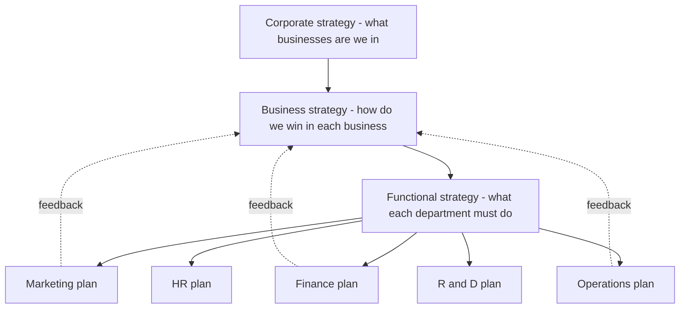
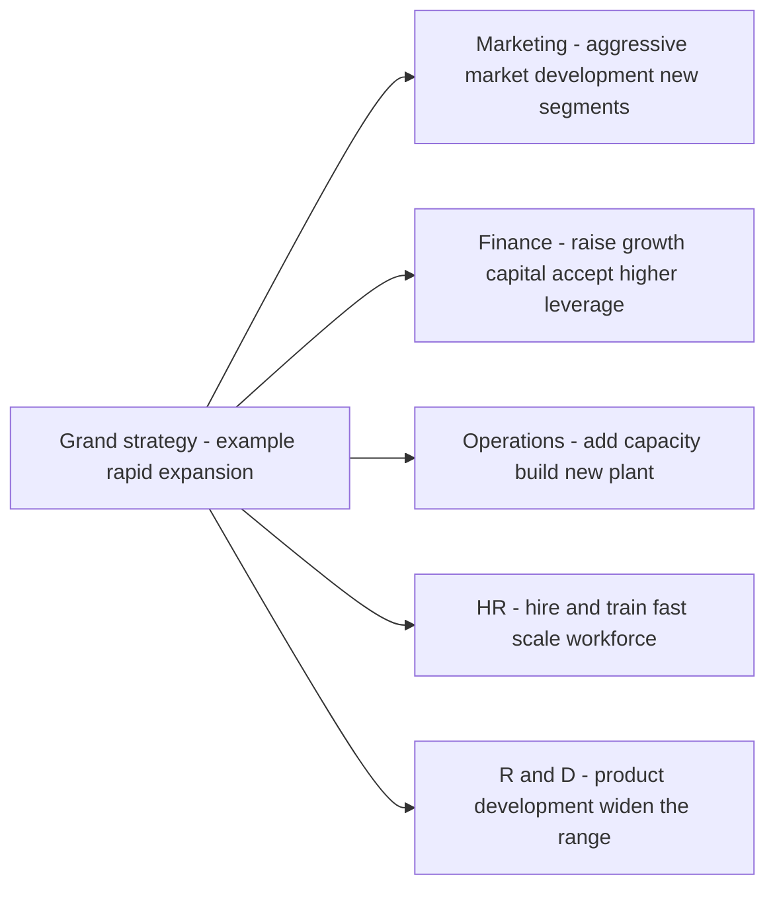
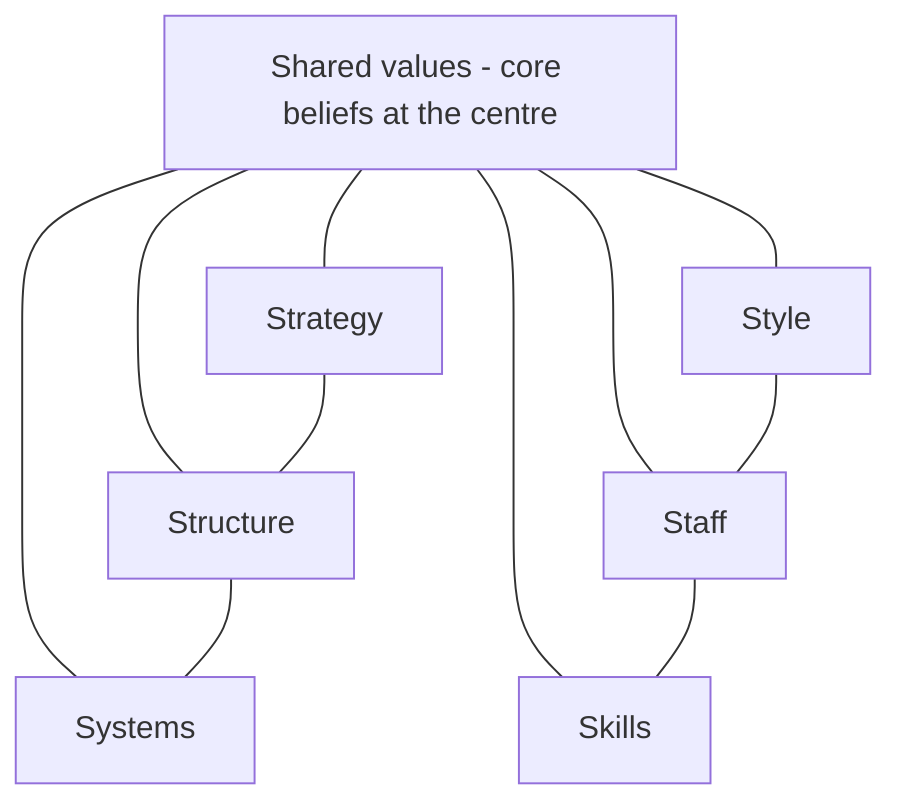
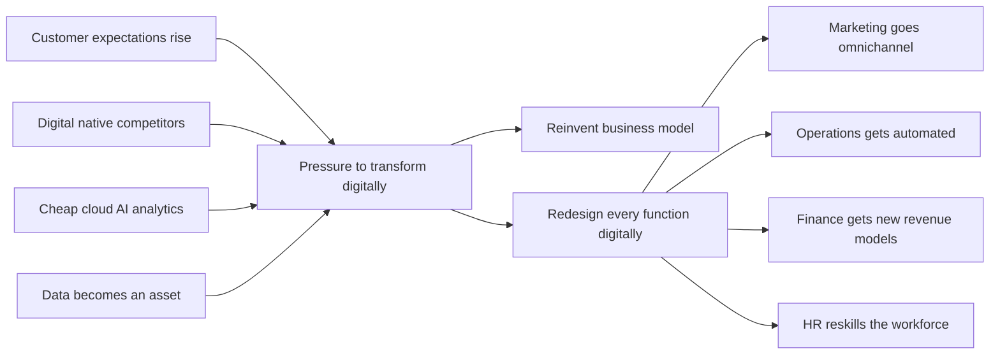

# Chapter 15 — SM: Functional & Digital Strategy

## 1. The Problem — A Brilliant Strategy That Nobody Can Actually Do

Imagine you are the CEO of **Aravind Motors**, a mid-sized Indian two-wheeler maker. After months of analysis, your board signs off on a bold corporate strategy: *"Become the No. 1 electric scooter brand for young urban Indians within five years."* Everybody claps. The strategy document is beautiful.

Then Monday morning arrives. Your marketing head asks, "Which customers exactly, and what price?" Your operations head asks, "Do I retool the petrol-engine assembly line or build a new plant?" Your finance head asks, "Where does the ₹800 crore come from, and what return do I promise investors?" Your HR head asks, "I have 4,000 workers skilled in combustion engines. Do I retrain them or hire battery engineers?" Your R&D head asks, "Do we license a battery-management system or develop our own?"

Suddenly the beautiful strategy is a wall of silence. Nobody argues with the *vision*. But nobody knows what to **do** on Tuesday. That is the problem this chapter solves.

**A corporate or business strategy is only a promise. It becomes real only when it is translated into decisions that each function makes every day.** A strategy that stays at the top — in the boardroom, on the slide deck — is what strategists call a *"strategy on paper."* The gap between the grand plan and the daily work of departments is where most strategies quietly die. Studies of strategy execution repeatedly find that the failure is rarely in the *thinking*; it is in the *cascade*.

There is a second, newer version of the same problem. Even if Aravind Motors perfectly cascades its strategy into marketing, finance, operations, HR and R&D, a *digital-native* competitor — say a startup that sells scooters online, uses data to predict demand, swaps batteries through an app, and pushes software updates over the air — can make the whole functional structure obsolete. So the manager faces two questions at once:

1. **How do I make my strategy real by pushing it down into every function?** (Functional strategy)
2. **How do I keep the whole business relevant when technology is rewriting the rules of my industry?** (Digital strategy)

This chapter answers both, and shows they are the same discipline seen from two angles.

---

## 2. The Core Idea — Strategy Is a Cascade, Not a Statement

The single most important idea in this chapter is the **hierarchy of strategy** and the flow between its levels.

A firm makes strategy at three levels, and each level exists to *serve and constrain* the level below it:

- **Corporate strategy** answers: *"What businesses should we be in?"* (Scope, direction, portfolio.)
- **Business strategy** answers: *"How do we win in each business?"* (Competitive advantage — cost or differentiation.)
- **Functional strategy** answers: *"What must each department do to deliver that win?"* (The day-to-day plans of marketing, finance, operations, HR, R&D.)

The core idea is that **strategy only becomes action when it flows down this hierarchy and each function converts the grand strategy into its own concrete plan** — and, crucially, when those functional plans are *mutually consistent* with each other and *aligned* to the strategy above them. This flowing-down is called **cascading**; the mutual consistency is called **alignment**.

*Figure 15.1 — Strategy cascades downward into functions, and functional reality feeds back upward to shape strategy.*

Notice the dotted feedback arrows. Cascading is not a one-way waterfall. Functions report back what is *feasible* — finance says "we can raise only ₹500 crore," operations says "retooling takes 18 months" — and this reshapes the strategy. Great strategy is a **loop**, not a memo.

The digital angle simply extends this idea: **digital transformation is a corporate/business strategy choice that must ALSO cascade into every function.** Going digital is not "the IT department buys software." It changes what marketing does (digital channels), what operations does (automation, analytics), what finance does (new revenue models), what HR does (new skills). If digital stays trapped in IT, it fails exactly the way a boardroom strategy fails when it stays in the boardroom.

---

## 3. Why It's Built This Way — The Logic Behind the Hierarchy

Why do we separate strategy into corporate, business and functional levels at all? Why not one big plan? The answer reveals the deep logic.

**Reason 1: Different questions need different decision-makers.** The CEO cannot decide the reorder quantity for spare parts, and the warehouse manager cannot decide which countries to enter. Splitting strategy by level matches each decision to the person with the right information and authority. This is the principle of **decision decentralisation**.

**Reason 2: Scope of impact differs.** A corporate decision (exit a business) affects everything and is nearly irreversible — so it is made rarely, by the top, with full analysis. A functional decision (change an ad campaign) affects one area and can be reversed in weeks. The hierarchy matches *reversibility and reach* to the *level* of decision.

**Reason 3: Functions are where resources actually get committed.** A strategy is ultimately a pattern of *resource allocation*. But money, people and machines live inside functions. So strategy cannot become real until functions decide how to deploy those resources. The functional level is where abstract intent meets concrete resource.

**Reason 4: Consistency must be engineered, not assumed.** Left alone, each function optimises *itself*. Marketing wants variety and low prices (to sell more); operations wants standardisation and long runs (to cut cost); finance wants low inventory (to save cash); HR wants stable headcount. These pull in opposite directions. The hierarchy exists to force **cross-functional alignment** so that all functions row in the same direction as the grand strategy. This is why we say functional strategies must be *internally consistent* (with each other) and *externally consistent* (with the business strategy).

**Reason 5 (the digital layer): technology changes the constraints.** Historically, the "grand strategy" set the direction and functions obeyed. But digital technologies (cloud, AI, analytics, platforms) can *create* strategic options that didn't exist — e.g., a data asset that becomes a new business. So the hierarchy now has a two-way relationship with technology: strategy directs technology, but technology also *enables new strategy*. That is why "digital strategy" is not a functional afterthought; it is woven through every level.

---

## 4. Full Technical Content — The Frameworks and Their "Why"

### 4.1 The Three Levels of Strategy (Recap with Precision)

| Level | Key question | Typical decision | Time horizon | Who owns it |
|---|---|---|---|---|
| Corporate | What businesses? | Diversify, acquire, divest, allocate capital across units | 5–10 years | Board, CEO |
| Business (SBU) | How to compete? | Cost leadership vs differentiation vs focus | 3–5 years | SBU head |
| Functional | How to support? | Marketing mix, financing, production, staffing | 1–2 years | Functional heads |

The **Strategic Business Unit (SBU)** is the pivot: it is a self-contained division with its own competitors, its own market, and its own profit responsibility. Business strategy is made at SBU level; functional strategy supports each SBU.

### 4.2 Why Functional Strategy Exists — The "Grand Strategy → Functional Plan" Logic

A **grand strategy** (also called *master* or *corporate* strategy) is the overall game plan — e.g., *Expansion*, *Stability*, *Retrenchment*, or *Combination*. But a grand strategy is directional, not operational. To make it operational, each functional area must translate it into a **functional strategy**: a plan for how that function will deploy its resources to advance the grand strategy.

The **logic of alignment** is: *every functional plan must answer "How does what I do help achieve the grand strategy?"* If a functional plan cannot answer this, it is either useless activity or, worse, activity that *pulls against* the strategy.

*Figure 15.2 — One grand strategy (expansion) dictates a coherent, mutually reinforcing set of functional strategies.*

The power of the diagram: notice how *expansion* makes every function say "more/bigger/faster." Now imagine the grand strategy were *retrenchment* — every arrow would reverse: marketing prunes weak products, finance conserves cash, operations closes plants, HR downsizes, R&D cuts projects. The functional strategy is a *derivative* of the grand strategy. That is the whole point.

### 4.3 The Five Functional Strategies in Detail

#### (a) Marketing Strategy — the demand-side plan

Marketing strategy specifies **target market + marketing mix (the 4 Ps)** to achieve the business objective.

- **Product** — range, features, quality, branding, packaging. (Wide range for differentiation; standardised for cost leadership.)
- **Price** — skimming (high price, premium) vs penetration (low price, volume). Must match the competitive strategy.
- **Place (distribution)** — intensive, selective, or exclusive channels; increasingly *omnichannel* (physical + digital).
- **Promotion** — advertising, sales promotion, personal selling, publicity, digital/social.

The marketing strategy must be **consistent with the business strategy**: a differentiator uses premium pricing and heavy branding; a cost leader uses penetration pricing and lean promotion.

#### (b) Financial Strategy — the resource-supply plan

Financial strategy answers: *How do we fund the strategy, and how do we measure and reward returns?* Its components:

- **Capital structure** — the debt–equity mix. Growth strategies often accept more leverage; stability strategies keep it conservative.
- **Financing decisions** — sources of funds (retained earnings, equity, debt, hybrid).
- **Investment/capital budgeting** — which projects get capital (aligned to grand strategy priorities).
- **Dividend policy** — payout vs reinvestment; expansion favours reinvestment.
- **Working capital management** — cash, receivables, inventory to sustain operations.

Finance is the **enabler and the scorekeeper**: it supplies the money and it measures whether the strategy is creating value (ROI, ROCE, EVA).

#### (c) Operations / Production Strategy — the supply-side plan

Operations strategy decides *how the product or service is made and delivered*:

- **Capacity** — how much, when to add, where located.
- **Process choice** — job/batch/mass/continuous; automation level.
- **Facilities and layout** — plant location, size, technology.
- **Supply chain** — make vs buy, supplier relationships, logistics.
- **Quality** — TQM, Six Sigma; quality level matched to strategy (cost leader = "good enough at low cost"; differentiator = "superior").
- **Inventory** — JIT vs buffer stocks.

Operations is where **cost and quality are actually born**. A cost-leadership business strategy *lives or dies* in operations.

#### (d) Human Resource (HR) Strategy — the people plan

HR strategy ensures the firm has the *right people, with the right skills, motivated in the right direction*:

- **Manpower planning** — forecasting numbers and skills needed by the strategy.
- **Recruitment and selection** — building the workforce the strategy requires.
- **Training and development** — closing the skill gap (critical during digital transformation).
- **Performance appraisal and rewards** — aligning individual behaviour to strategic goals.
- **Retention, culture, and change management** — keeping talent and enabling change.

HR is the **strategy-culture bridge**: a strategy the workforce cannot or will not execute is dead. When strategy changes (e.g., going digital), HR carries the reskilling burden.

#### (e) Research & Development (R&D) Strategy — the innovation plan

R&D strategy governs *how the firm innovates*:

- **Innovation posture** — *first mover / pioneer* (be first, high risk, high reward) vs *follower / imitator* (let others prove the market, then improve).
- **Product vs process R&D** — new products (differentiation) vs cheaper methods (cost leadership).
- **Make vs buy technology** — in-house development vs licensing/acquisition.
- **R&D intensity** — how much to spend; matched to how much the strategy depends on innovation.

R&D is the **future-supply plan**: it determines whether the firm has something to sell tomorrow.

### 4.4 Ensuring Alignment — Functional Plans Must Fit Three Ways

A functional strategy is well-designed only if it satisfies three fit-tests:

1. **Vertical fit (with strategy above):** Does it advance the business/grand strategy?
2. **Horizontal fit (with other functions):** Is it consistent with what other functions are doing? (Marketing's promised delivery dates must match operations' capacity.)
3. **Internal fit (within the function):** Are the sub-decisions consistent? (Premium pricing + cheap packaging = mismatch.)

The classic diagnostic tool for checking whether *all* elements of the organisation are aligned is the **McKinsey 7S Framework** (Peters, Waterman & Pascale). It argues that effective strategy execution needs seven interdependent elements to be mutually consistent:

*Figure 15.3 — McKinsey 7S: three hard elements (Strategy, Structure, Systems) and four soft elements (Style, Staff, Skills, Shared Values) must all align for execution to succeed.*

The 7S insight for this chapter: **you cannot change strategy without changing the supporting functional Ss.** A new digital strategy demands new Systems, new Skills, new Staff and often a new Style and Shared Values — otherwise the old organisation quietly rejects the new strategy like a body rejecting a transplant.

### 4.5 Digital Transformation — Why Functions Must Go Digital

**Digital transformation** is the deep, strategic reinvention of how a firm creates and delivers value using digital technologies — not merely digitising existing processes, but rethinking the business model itself.

There is a useful distinction the exam rewards:

- **Digitisation** — converting analog information to digital (paper records → database).
- **Digitalisation** — using digital tech to improve *existing* processes (online order form replaces phone order).
- **Digital transformation** — using digital tech to *change the business model and value proposition* itself (from selling scooters to selling battery-swap-as-a-service).

**Why must firms adapt? The strategic drivers of digital transformation:**

1. **Changing customer expectations** — customers now expect the speed, convenience, personalisation and 24×7 availability that digital leaders (Amazon, Netflix) have trained them to want. A firm that cannot match this loses relevance.
2. **Competitive pressure and disruption** — digital-native entrants and platform businesses attack industries with lower cost structures and network effects. Adapt or be disrupted (the "Kodak problem").
3. **Technology availability and falling cost** — cloud, AI and analytics are now cheap and rentable; capabilities once reserved for giants are available to all, so *not* using them is a disadvantage.
4. **Data as a strategic asset** — firms sit on data that, analysed, reveals demand, risk and opportunity. Rivals who exploit their data out-decide those who don't.
5. **Globalisation and connectivity** — digital channels remove geography as a barrier, both as opportunity (new markets) and threat (new competitors).
6. **Operational efficiency and agility** — automation and analytics cut cost and speed up response; laggards carry a permanent cost/speed handicap.

The deep reason firms *must* adapt: **digital technology changes the basis of competition in the industry.** When it does, a firm's existing sources of advantage can turn into liabilities (e.g., a large branch network becomes dead weight when banking goes mobile). Refusing to adapt is not "staying safe" — it is choosing a slow structural decline.

*Figure 15.4 — The strategic drivers force digital transformation, which must cascade into a redesign of every function.*

### 4.6 E-Business Models — How Firms Make Money Digitally

An **e-business model** describes *how a firm creates, delivers and captures value using the internet and digital channels*. The ICAI syllabus expects familiarity with the major transaction and revenue models.

**By parties transacting (the classic e-commerce matrix):**

| Model | Meaning | Example |
|---|---|---|
| B2C | Business to Consumer | Amazon, Myntra selling to shoppers |
| B2B | Business to Business | IndiaMART, steel supplier to manufacturer |
| C2C | Consumer to Consumer | OLX, eBay (a platform enabling individuals to trade) |
| C2B | Consumer to Business | A freelancer bidding for a company's project; influencers selling reach |
| B2G / B2A | Business to Government/Administration | GeM portal, e-tendering |

**By revenue/value logic (how the model actually earns):**

- **E-tailer / online store** — sells goods directly online (owns inventory). *Revenue: product margin.*
- **Marketplace / platform** — connects buyers and sellers without owning inventory. *Revenue: commission/listing fees.* Benefits from **network effects** (more buyers attract more sellers and vice versa).
- **Subscription (SaaS/content)** — recurring fee for ongoing access (Netflix, Zoho). *Revenue: predictable recurring revenue.*
- **Advertising / freemium** — free service funded by ads or paid upgrades (Google, Spotify free tier). *Revenue: ads or premium conversions.*
- **Aggregator** — brands and standardises third-party providers under one interface (Ola, Uber, Oyo, Zomato). *Revenue: commission on aggregated supply.*
- **On-demand / gig** — matches instant demand to available supply (Swiggy, Urban Company). *Revenue: transaction fee.*
- **Brokerage / transaction fee** — facilitates transactions for a cut (Zerodha, payment gateways).

The strategic point: **the e-business model determines the firm's cost structure, its source of advantage (often network effects or data), and which functions matter most.** A marketplace lives on technology, trust and network scale, not on manufacturing — so its functional strategy looks radically different from a traditional manufacturer's.

### 4.7 Emerging Technologies as Strategic Levers

These are not "IT topics" — the syllabus treats them as *strategic levers* that change what a firm can do. A **strategic lever** is a capability that, when pulled, shifts the firm's competitive position.

| Technology | What it does | Strategic use (the "why") |
|---|---|---|
| **Cloud computing** | Rent computing/storage on demand | Converts fixed IT capex into flexible opex; lets even small firms scale instantly; enables speed and global reach |
| **Big Data & Analytics** | Extract insight from large data | Better decisions; demand prediction; personalisation; risk management — turns data into advantage |
| **Artificial Intelligence & Machine Learning** | Machines that learn and decide | Automation, forecasting, personalisation, chatbots, fraud detection — scales expertise and cuts cost |
| **Internet of Things (IoT)** | Connected sensors on physical assets | Real-time monitoring, predictive maintenance, new service models (pay-per-use) |
| **Blockchain** | Distributed, tamper-proof ledger | Trust without intermediaries; supply-chain traceability; secure transactions |
| **Robotics / Automation / RPA** | Machines/software doing repetitive work | Lower cost, higher quality and speed in operations and back-office |
| **Mobile & Social** | Ubiquitous connected customers | Direct customer relationships, new channels, community and word-of-mouth |

**Why firms MUST treat these as strategic, not optional:**

- They **change the cost curve** — a rival using AI-driven automation can undercut you permanently.
- They **change customer expectations** — once one bank offers instant AI-assisted service, all must.
- They **create new advantages that compound** — data and AI improve with use (more data → better model → better product → more users → more data). This *flywheel* means late movers may never catch up.
- They **can destroy old advantages** — cloud erased the advantage of owning big data centres; analytics erased the advantage of "gut feel" gained over decades.

The manager's takeaway: **emerging technologies must be evaluated as strategic choices — which lever, pulled in which function, produces advantage aligned to our grand strategy — not delegated to IT as a purchase.**

---

## 5. Applied Cases — Strategy Meets the Real World

### Case 15.1 — Aravind Motors Goes Electric (cascading a grand strategy)

**Situation:** Recall Aravind Motors' grand strategy — become India's No. 1 electric urban scooter brand in five years (an *expansion via product development* strategy). Show how it cascades.

**Analysis — functional translation:**

- **Marketing:** Target *young urban commuters* (18–35, tier-1/2 cities). Position on "smart, clean, low running cost." Penetration pricing to build volume and network. Omnichannel: online booking + experience stores. → *Vertical fit: supports rapid market capture.*
- **Finance:** Raise ₹800 cr via a mix of equity (dilution acceptable for growth) and green bonds. Reinvest profits (no dividend). Capital budgeting prioritises the battery plant. → *Supplies and scores the growth.*
- **Operations:** Build a new EV-dedicated plant; adopt modular/automated assembly; secure battery supply (make-vs-buy: license cell tech, assemble packs in-house). JIT for components. → *Where the cost advantage is born.*
- **HR:** Reskill combustion-engine workers into battery/electronics roles; hire software and battery engineers; performance metrics tied to EV launch milestones. → *Bridges strategy to capability.*
- **R&D:** Pioneer posture on battery-management software (source of differentiation); follower posture on chassis (use proven designs). → *Secures tomorrow's product.*

**Exam-style conclusion:** The strategy becomes real only because each function derived a *consistent* plan from it. Note the horizontal fit: marketing's penetration pricing *demands* operations' low-cost automation *and* finance's willingness to fund losses early — remove any one and the strategy collapses.

### Case 15.2 — "Sahakari Bank" Faces Digital Disruption (why firms must adapt)

**Situation:** Sahakari Bank, a traditional regional bank with 300 branches, is losing young customers to app-only neobanks and UPI-first fintechs. The board asks: "Is digital just a new mobile app, or something bigger?"

**Analysis — apply the drivers of digital transformation:**

- *Changing customer expectations:* young customers expect instant, 24×7, app-based service — branches feel slow.
- *Competitive disruption:* neobanks have near-zero branch cost and can price/serve better.
- *Cheap technology:* cloud + AI make world-class digital banking rentable, not a giant's privilege.
- *Data asset:* Sahakari's transaction data can power credit scoring and cross-sell — currently unused.

**Recommendation:** This is **digital transformation, not digitalisation.** A mere app (digitalisation) leaves the costly branch-heavy model intact. True transformation reimagines the model: digital-first onboarding, AI credit scoring, branches repurposed as advisory hubs. This cascades into functions — **Operations** automates back-office (RPA), **HR** reskills tellers into advisors, **Finance** shifts from branch-cost to tech-investment, **Marketing** moves to digital acquisition.

**Exam-style conclusion:** The bank *must* adapt because digital technology has **changed the basis of competition** in banking; its branch network — once an advantage — is becoming a cost liability. Refusing to transform is choosing structural decline (the Kodak lesson).

### Case 15.3 — "FreshLeaf" Chooses an E-Business Model (model selection + tech levers)

**Situation:** FreshLeaf, a farm-produce startup, must decide how to sell online. Options: (a) buy produce and e-tail it, or (b) run a marketplace connecting farmers directly to consumers.

**Analysis:**

- **E-tailer model:** owns inventory → margin revenue, but high working-capital and spoilage risk; controls quality tightly. Functionally *operations-heavy*.
- **Marketplace model:** connects farmers and buyers → commission revenue, asset-light, benefits from **network effects**; but must solve trust and quality assurance. Functionally *technology- and trust-heavy*.

**Tech levers to pull:** **Analytics** to forecast demand and cut spoilage; **cloud** to scale the platform cheaply; **AI** for demand prediction and dynamic pricing; **IoT/mobile** for cold-chain tracking. **Marketing** builds a trusted brand; **HR** needs data and platform talent, not warehouse labour, if marketplace is chosen.

**Exam-style conclusion:** The chosen **e-business model dictates the functional strategy**: a marketplace makes technology and network scale the core functions, while an e-tailer makes operations and working-capital management core. The *emerging-tech levers* (analytics, cloud, AI) are what make either model competitive — they are strategic choices, not IT purchases.

---

## 6. Framework Summary

| Framework / Concept | Author / Origin | Purpose (the problem it solves) |
|---|---|---|
| Three levels of strategy (Corporate/Business/Functional) | Classical strategic management | Matches each strategic decision to the right level and decision-maker |
| Grand strategies (Expansion/Stability/Retrenchment/Combination) | Glueck & Jauch | Give the overall directional game plan that functions must serve |
| Functional strategies (Marketing, Finance, Operations, HR, R&D) | Strategic management canon | Translate grand strategy into concrete departmental resource plans |
| Marketing mix — 4 Ps | E. Jerome McCarthy | Structure the demand-side plan (Product, Price, Place, Promotion) |
| McKinsey 7S | Peters, Waterman & Pascale | Diagnose whether all hard and soft elements are aligned for execution |
| Digitisation vs Digitalisation vs Digital transformation | Digital strategy literature | Distinguish depth of digital change; transformation reinvents the model |
| Drivers of digital transformation | Digital strategy literature | Explain *why* firms must adapt (customers, disruption, cheap tech, data) |
| E-business models (B2C/B2B/C2C/C2B/B2G; marketplace, SaaS, aggregator…) | E-commerce framework | Classify how a firm creates and captures value digitally |
| Emerging technologies as strategic levers (AI, analytics, cloud, IoT, blockchain) | Contemporary strategy | Treat technology as a competitive lever, not an IT expense |

---

## 7. Connections — How This Chapter Links to the Rest of SM

- **To the strategy hierarchy (earlier chapters):** Functional strategy is the *bottom* of the Corporate → Business → Functional pyramid. This chapter is where the earlier "how do we compete" (Porter's generic strategies) becomes daily action.
- **To Porter's generic strategies:** A *cost leadership* business strategy dictates lean operations, penetration pricing and process R&D; a *differentiation* strategy dictates premium marketing, quality operations and product R&D. Functional strategy is Porter's strategy *made operational*.
- **To Ansoff's Matrix:** *Market development* and *product development* growth choices land directly on marketing and R&D functional strategies. The grand strategy of *expansion* is executed through Ansoff-type moves that functions carry out.
- **To strategy implementation & structure:** McKinsey 7S connects functional strategy to *structure, systems, staff, style* — the implementation chapters. Alignment is the theme both chapters share.
- **To strategic control:** Finance's role as *scorekeeper* (ROI, EVA) links to the control chapter — functional metrics are how strategy is monitored.
- **To BCG/portfolio analysis:** Corporate resource-allocation decisions (which SBU gets cash) become each SBU's *financial* functional strategy constraint.

---

## 8. Traps & Examiner Tricks

1. **Confusing the three levels.** A classic trap: labelling a *functional* decision as "corporate strategy." "Should we advertise on Instagram?" is *functional* (marketing), not corporate. Always ask: *what businesses (corporate) / how to win (business) / how to support (functional)?*

2. **Treating digital transformation as buying software.** Examiners love the case where a firm "went digital" by launching an app but kept the old model — mark it as *digitalisation*, not *transformation*. Transformation changes the **business model**, not just a process.

3. **Digitisation vs digitalisation vs digital transformation.** These three sound alike; the exam tests precise definitions. Digitisation = analog→digital *data*; digitalisation = digital improves a *process*; transformation = digital reinvents the *business model*.

4. **Forgetting horizontal fit.** Students list functional strategies in isolation. The examiner wants you to show *consistency across functions* — e.g., marketing's sales forecast must match operations' capacity and finance's working capital. State the alignment explicitly.

5. **Naming the wrong 4th P or wrong author.** The marketing mix is *Product, Price, Place, Promotion* (McCarthy). Do not write "Packaging" as one of the core 4 Ps.

6. **7S — hard vs soft elements.** A frequent MCQ: which are the *soft* Ss? Answer: *Style, Staff, Skills, Shared Values.* Hard: *Strategy, Structure, Systems.* Shared Values sits at the centre.

7. **Emerging tech treated as R&D-only.** Trap: putting AI/cloud only under R&D. They are *cross-functional strategic levers* — AI serves marketing (personalisation), operations (automation), finance (fraud), HR (hiring). Show breadth.

8. **E-business model confusion.** Don't confuse *marketplace* (no inventory, commission, network effects) with *e-tailer* (owns inventory, product margin). And C2B ≠ B2C — direction matters.

9. **One-way cascade fallacy.** The exam rewards mentioning the *feedback loop*: functions report feasibility back up, reshaping strategy. Strategy is a loop, not a waterfall.

10. **"Why must firms adapt?" answered weakly.** Don't just say "because of competition." Name the *strategic drivers* (customer expectations, disruption, cheap tech, data as asset) and the deep reason: **digital changes the basis of competition, turning old advantages into liabilities.**

---

## 9. First-Principles Recap

Strip everything away and rebuild from zero:

1. **A strategy is a promise about how resources will be deployed to win.** Until resources actually move, it is only words.
2. **Resources live inside functions** — money in finance, machines in operations, people in HR, demand in marketing, ideas in R&D. So strategy can only become real *inside functions*.
3. Therefore **strategy must cascade**: the grand strategy must be translated by each function into a concrete plan — and those plans must be *consistent* with the strategy above (vertical fit) and *with each other* (horizontal fit). Alignment is engineered, not assumed.
4. **The check for total alignment** is the 7S test: strategy, structure, systems, style, staff, skills and shared values must all point the same way.
5. **Technology changes the constraints.** Digital tools don't just help execute strategy — they *change what strategies are possible* and *change the basis of competition*. When the basis of competition shifts, standing still means decline.
6. Therefore **digital transformation is a strategic choice that must itself cascade** into every function: it is not an IT project. The drivers (customers, disruption, cheap tech, data) make adaptation compulsory, not optional.
7. **E-business models and emerging technologies (AI, analytics, cloud)** are the concrete *forms* this digital strategy takes — the levers a manager pulls, in specific functions, to build advantage aligned with the grand strategy.

The whole chapter is one sentence: **A grand strategy is only real when every function turns it into aligned action — and in the modern economy, "action" increasingly means digital action.**

---

## 10. Quick-Revision Sheet

**Three levels:** Corporate (what businesses) → Business/SBU (how to win) → Functional (how to support). Cascade down; feedback up.

**Five functional strategies:**
- *Marketing* — target market + 4 Ps (Product, Price, Place, Promotion — McCarthy).
- *Finance* — capital structure, financing, capital budgeting, dividend, working capital. Enabler + scorekeeper.
- *Operations* — capacity, process, facilities, supply chain, quality, inventory. Where cost/quality is born.
- *HR* — manpower planning, recruit, train, appraise/reward, retain. Strategy–culture bridge.
- *R&D* — first-mover vs follower; product vs process; make vs buy tech. Future-supply plan.

**Three fits for alignment:** Vertical (with strategy above) + Horizontal (with other functions) + Internal (within function).

**McKinsey 7S:** Hard = Strategy, Structure, Systems. Soft = Style, Staff, Skills. Centre = Shared Values.

**Digital depth ladder:** Digitisation (data analog→digital) → Digitalisation (improve a process) → **Digital transformation** (reinvent the business model).

**Drivers of digital transformation (why adapt):** rising customer expectations; digital-native disruption; cheap cloud/AI/analytics; data as strategic asset; global connectivity; efficiency/agility. Deep reason: *digital changes the basis of competition; old advantages become liabilities.*

**E-business models:**
- By parties: B2C, B2B, C2C, C2B, B2G.
- By revenue logic: e-tailer (owns inventory, margin), marketplace/platform (commission, network effects), subscription/SaaS (recurring), advertising/freemium, aggregator (Ola/Oyo/Zomato), on-demand/gig, brokerage.

**Emerging tech as strategic levers:** Cloud (capex→opex, scale), Big Data & Analytics (insight, prediction), AI/ML (automation, personalisation), IoT (real-time, predictive maintenance), Blockchain (trust, traceability), RPA/Robotics (cost, speed). *Cross-functional, not IT-only.*

**One-line exam anchor:** *"Corporate strategy is a promise; functional strategy is how the promise is kept; digital strategy is how the promise is kept in the modern economy."*
