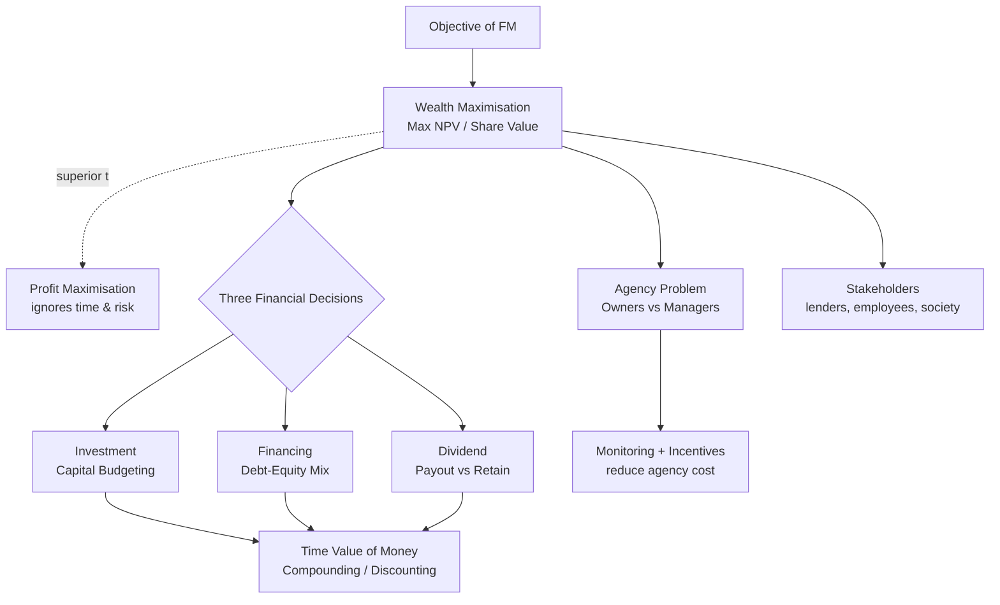

# Q&A — Scope & Objectives of Financial Management

> ICAI CA Intermediate | Financial Management | Chapter 1: Scope & Objectives of FM
> All amounts in Rupees (₹). Formulas per ICAI Study Material.

---

## Section A — Concept-Check Questions (with answers)

**A1. Define Financial Management and state its twin core concerns.**
*Answer:* Financial Management is that managerial activity concerned with the **planning, acquisition (procurement) and efficient utilisation of funds** to maximise the value of the firm. Its two core concerns are: (i) **procurement of funds** at the least cost/risk, and (ii) **effective utilisation (deployment)** of those funds to generate returns above their cost.

**A2. Why is "Wealth Maximisation" considered superior to "Profit Maximisation"?**
*Answer:* Wealth maximisation (maximising the Net Present Value/market value of shareholders' equity) is superior because it (i) considers the **time value of money**, (ii) accounts for **risk and uncertainty**, (iii) is based on **cash flows** rather than ambiguous accounting profit, and (iv) has a **long-term** focus. Profit maximisation ignores timing of returns, ignores risk, is vague ("which profit?"), and can encourage short-termism.

**A3. Name and one-line-define the three key financial decisions.**
*Answer:*
1. **Investment (Capital Budgeting) Decision** — where to deploy funds; selecting long-term assets/projects.
2. **Financing Decision** — the optimal mix of debt and equity (capital structure).
3. **Dividend Decision** — how much profit to distribute vs. retain (payout policy).

**A4. What is the "Agency Problem"? Name two mechanisms to reduce it.**
*Answer:* The agency problem is the **conflict of interest between principals (shareholders) and agents (managers)**, where managers may pursue personal goals (perks, empire-building, job security) instead of maximising shareholder wealth. Mitigation mechanisms: (i) **monitoring** (audits, board oversight); (ii) **incentives/bonding** (ESOPs, performance-linked pay). Agency costs = monitoring costs + bonding costs + residual loss.

**A5. Distinguish "compounding" from "discounting."**
*Answer:* **Compounding** moves money **forward** in time to find a Future Value: FV = PV(1+i)ⁿ. **Discounting** moves money **backward** to find Present Value: PV = FV/(1+i)ⁿ. They are reciprocal processes.

**A6. Differentiate an annuity from a perpetuity.**
*Answer:* An **annuity** is a series of **equal cash flows for a finite number of periods** (e.g., ₹1,000 for 5 years). A **perpetuity** is an equal cash flow **forever** (infinite); its present value = Cash Flow ÷ i.

**A7. What is a sinking fund? What is capital recovery?**
*Answer:* A **sinking fund factor** finds the equal annual deposit needed to accumulate a **target future sum** (e.g., to redeem debentures/replace an asset): Deposit = FV × [i / ((1+i)ⁿ − 1)]. **Capital recovery** finds the equal annual amount to recover a **present sum** (e.g., loan instalment): Instalment = PV × [i / (1 − (1+i)⁻ⁿ)]. They are reciprocals of the annuity-compounding and annuity-discounting factors respectively.

**A8. Why is finance treated as a distinct/separate function?**
*Answer:* Because financial decisions (raising, allocating and returning capital) require **specialised analytical skills, cut across all departments, directly affect firm value and liquidity, and involve risk-return trade-offs** that other functions do not handle. It links to accounting (data), economics (theory) and operations (fund needs) but focuses uniquely on the **acquisition and use of funds**.

---

## Section B — Graded Computational Problems (full workings)

### B1 (Easy) — Simple Future Value (Compounding)
**Q.** ₹50,000 is invested at 8% p.a. compounded annually for 3 years. Find the maturity value.
**Solution:**
FV = PV(1+i)ⁿ = 50,000 × (1.08)³
(1.08)³ = 1.259712
FV = 50,000 × 1.259712 = **₹62,985.60**
*Interest earned = 62,985.60 − 50,000 = ₹12,985.60.*

### B2 (Easy) — Present Value (Discounting)
**Q.** What sum today equals ₹1,00,000 receivable after 4 years at 10% p.a.?
**Solution:**
PV = FV/(1+i)ⁿ = 1,00,000 / (1.10)⁴
(1.10)⁴ = 1.4641
PV = 1,00,000 / 1.4641 = **₹68,301.35**
*Check: 68,301.35 × 1.4641 = 1,00,000. ✔*

### B3 (Easy-Moderate) — Present Value of an Annuity
**Q.** Find the PV of ₹20,000 received at each year-end for 5 years at 12% p.a.
**Solution:**
PVAF(12%,5) = [1 − (1.12)⁻⁵] / 0.12
(1.12)⁵ = 1.762342 → (1.12)⁻⁵ = 0.567427
PVAF = (1 − 0.567427)/0.12 = 0.432573/0.12 = 3.604776
PV = 20,000 × 3.604776 = **₹72,095.52**

### B4 (Moderate) — Future Value of an Annuity
**Q.** ₹10,000 is deposited at each year-end for 6 years at 9% p.a. Find the accumulated sum.
**Solution:**
FVAF(9%,6) = [(1.09)⁶ − 1] / 0.09
(1.09)⁶ = 1.677100 → (1.677100 − 1)/0.09 = 0.677100/0.09 = 7.523335
FV = 10,000 × 7.523335 = **₹75,233.35**

### B5 (Moderate) — Sinking Fund
**Q.** A company must redeem ₹50,00,000 of debentures in 5 years. It will set aside equal year-end deposits earning 10% p.a. Find the annual deposit.
**Solution:**
Sinking Fund Deposit = FV × [i / ((1+i)ⁿ − 1)]
(1.10)⁵ = 1.610510 → denominator = 0.610510
Factor = 0.10 / 0.610510 = 0.163797
Deposit = 50,00,000 × 0.163797 = **₹8,18,987** (≈ ₹8,18,987)
*Verify via FVAF: 8,18,987 × 6.10510 = ₹50,00,004 ≈ ₹50,00,000. ✔ (rounding)*

### B6 (Moderate) — Capital Recovery / Loan Instalment
**Q.** A ₹12,00,000 loan at 11% p.a. is repayable in 4 equal year-end instalments. Find the instalment.
**Solution:**
Instalment = PV × [i / (1 − (1+i)⁻ⁿ)] = PV / PVAF(11%,4)
(1.11)⁴ = 1.518070 → (1.11)⁻⁴ = 0.658731
PVAF = (1 − 0.658731)/0.11 = 0.341269/0.11 = 3.102446
Instalment = 12,00,000 / 3.102446 = **₹3,86,791**
*Verify: 3,86,791 × 3.102446 = ₹12,00,000. ✔*

### B7 (Exam-Hard) — Perpetuity & Growing Perpetuity
**Q.** (a) A share pays a constant dividend of ₹15 forever; required return 12%. Find value. (b) If instead the dividend of ₹15 grows at 4% p.a. forever, find value.
**Solution:**
(a) Perpetuity value = CF/i = 15 / 0.12 = **₹125**
(b) Growing perpetuity = D₁/(i − g). Here D₁ = 15 (next year's), i = 0.12, g = 0.04
Value = 15 / (0.12 − 0.04) = 15 / 0.08 = **₹187.50**
*Growth raises value from ₹125 to ₹187.50.*

### B8 (Exam-Hard) — Effective Annual Rate (EAR)
**Q.** A bank quotes 12% p.a. nominal. Find the effective annual rate if compounded (i) quarterly, (ii) monthly. Which is costlier for a borrower?
**Solution:**
EAR = (1 + r/m)ᵐ − 1
(i) Quarterly, m=4: (1 + 0.12/4)⁴ − 1 = (1.03)⁴ − 1 = 1.125509 − 1 = **12.5509%**
(ii) Monthly, m=12: (1 + 0.12/12)¹² − 1 = (1.01)¹² − 1 = 1.126825 − 1 = **12.6825%**
*More frequent compounding → higher EAR → monthly is costlier for the borrower.*

### B9 (Exam-Hard) — Mixed: Deferred Annuity valuation
**Q.** A project pays nothing in years 1–2, then ₹40,000 per year at the end of years 3, 4 and 5. At 10%, find the value today.
**Solution:**
Step 1 — PV of a 3-year annuity as at end of year 2:
PVAF(10%,3) = [1 − (1.10)⁻³]/0.10; (1.10)³ = 1.331 → (1.10)⁻³ = 0.751315
PVAF = (1 − 0.751315)/0.10 = 0.248685/0.10 = 2.486852
Value at t=2 = 40,000 × 2.486852 = ₹99,474.08
Step 2 — Discount that lump sum from t=2 to t=0:
PV = 99,474.08 / (1.10)² = 99,474.08 / 1.21 = **₹82,209.98**
*Cross-check via individual PVs: 40,000×(0.751315+0.683013+0.620921)= 40,000×2.055249 = ₹82,209.96 ≈ ₹82,210. ✔*

---

## Section C — Past-Paper-Style Full Questions (model answers)

### C1. "Wealth maximisation is a better operational goal than profit maximisation." Discuss. (5 marks)
**Model Answer:**
Profit maximisation was the traditional objective but suffers from four defects: (1) **Ambiguity** — profit is undefined (gross/net, short/long-run, pre/post-tax). (2) **Ignores timing** — ₹1 lakh earned in year 1 is treated equal to ₹1 lakh in year 5, ignoring the **time value of money**. (3) **Ignores risk** — two projects with the same profit but different risk are treated identically. (4) **Ignores quality of earnings / cash flows**.
**Wealth maximisation** overcomes these: it maximises the **net present value of shareholders' wealth** = present value of future cash flows discounted at a risk-adjusted rate. It (a) uses cash flows, (b) discounts for time, (c) embeds risk in the discount rate, and (d) has a long-term orientation aligned with the market price of the share. Hence it is the **operationally superior and universally accepted** goal of financial management. *(Caveat: it assumes efficient markets and can conflict with wider stakeholder/social interests.)*

### C2. Explain the three key decisions in Financial Management with an example each. (6 marks)
**Model Answer:**
1. **Investment/Capital Budgeting Decision** — deciding *where* to commit long-term funds; e.g., choosing to build a new ₹10-crore plant (evaluated by NPV/IRR). Working-capital (short-term investment) is also part.
2. **Financing Decision** — deciding the **capital structure**, i.e., the debt–equity mix that minimises the **weighted average cost of capital (WACC)**; e.g., raising ₹10 crore as ₹6 crore equity + ₹4 crore debt.
3. **Dividend Decision** — deciding the **payout ratio**, i.e., how much of profit to distribute as dividend vs. retain for growth; e.g., paying 40% and retaining 60%.
Together these three maximise the value of the firm, balancing **return and risk**.

### C3. Discuss the Agency Relationship and Agency Costs in a company. (5 marks)
**Model Answer:**
In a company, **shareholders (principals)** delegate management to **directors/managers (agents)**. Because ownership and control are separated, managers may act in self-interest — excessive perquisites, empire-building, risk-averse behaviour to protect their jobs, or short-termism — instead of maximising shareholder wealth. This conflict is the **agency problem**.
**Agency costs** are the costs of managing this conflict: (i) **Monitoring costs** (audit, board supervision, reporting); (ii) **Bonding costs** (contracts/guarantees managers give); (iii) **Residual loss** (wealth lost despite monitoring/bonding). Mechanisms to align interests include **performance-linked pay, ESOPs/stock options, threat of takeover, debt covenants, and an active independent board**. A similar conflict exists between **shareholders and lenders/creditors** (over risky investment and dividends), managed via **debt covenants**.

### C4. Who are the stakeholders of a firm, and how does FM balance their interests? (4 marks)
**Model Answer:**
Stakeholders include **shareholders, lenders/creditors, employees, customers, suppliers, government and society**. While the primary FM objective is **shareholder wealth maximisation**, this cannot be sustained by ignoring others: lenders need timely interest/repayment (protected by covenants), employees need fair wages, customers need quality, government needs taxes/compliance, and society needs responsible (ESG) conduct. FM therefore pursues wealth maximisation **subject to** honouring contractual and social obligations — a **long-run value view** where good stakeholder relations underpin sustainable share value.

---

## Section D — MCQs & Case Scenarios (answer + one-line reasoning)

**D1.** The primary goal of financial management is to maximise:
(a) Sales (b) Profit (c) Shareholders' wealth (d) Market share
**Ans: (c)** — Wealth (NPV/market value) maximisation is the accepted objective.

**D2.** Which decision determines the capital structure of a firm?
(a) Investment (b) Financing (c) Dividend (d) Liquidity
**Ans: (b)** — Financing decision fixes the debt–equity mix.

**D3.** The process of finding present value from a future value is called:
(a) Compounding (b) Amortising (c) Discounting (d) Annuitising
**Ans: (c)** — Discounting brings future money to today.

**D4.** The PV of a perpetuity of ₹500 at 10% is:
(a) ₹5,000 (b) ₹50,000 (c) ₹500 (d) ₹550
**Ans: (a)** — 500 ÷ 0.10 = ₹5,000.

**D5.** The factor used to find the annual deposit to accumulate a target future sum is the:
(a) Capital recovery factor (b) Sinking fund factor (c) PVAF (d) Discount factor
**Ans: (b)** — Sinking fund factor = i/((1+i)ⁿ−1).

**D6.** If nominal rate is 12% compounded monthly, EAR is:
(a) 12.00% (b) 12.36% (c) 12.68% (d) 12.55%
**Ans: (c)** — (1.01)¹²−1 = 12.68%.

**D7 (Case).** A manager rejects a positive-NPV risky project fearing it may cause losses and threaten his job, though shareholders would gain. This illustrates:
(a) Wealth maximisation (b) Agency problem (c) Time value of money (d) Capital rationing
**Ans: (b)** — Manager's self-interest diverges from owners' wealth — a classic agency conflict.

**D8 (Case).** Firm X reports higher accounting profit than Y but its cash flows arrive much later and are riskier. Under wealth maximisation, X is not necessarily better because wealth maximisation considers:
(a) Only profit (b) Time value and risk of cash flows (c) Sales volume (d) Dividend rate
**Ans: (b)** — Timing and risk of cash flows drive value, not raw accounting profit.

---

## Mermaid Diagram — The FM Objective & Decision Map

---

## Quick Formula Recap
- FV = PV(1+i)ⁿ | PV = FV/(1+i)ⁿ
- PVAF = [1 − (1+i)⁻ⁿ]/i | FVAF = [(1+i)ⁿ − 1]/i
- Perpetuity = CF/i | Growing perpetuity = D₁/(i − g)
- Sinking Fund = FV × i/((1+i)ⁿ − 1) | Capital Recovery = PV × i/(1 − (1+i)⁻ⁿ)
- EAR = (1 + r/m)ᵐ − 1
- Agency cost = Monitoring + Bonding + Residual loss
