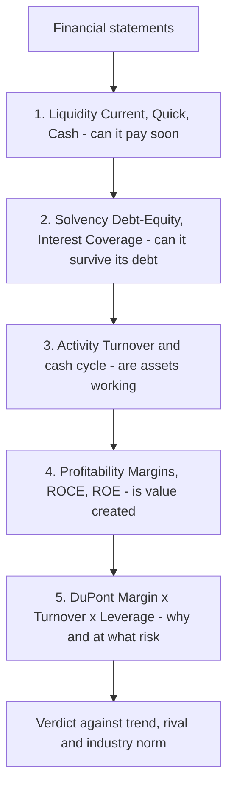

# Q&A — Ratio Analysis (Financial Analysis & Planning)

*CA Intermediate | Financial Management | ICAI Study Material aligned | All figures in Rupees (₹) | 360-day year unless stated*

---

## SECTION A — Concept Check (Short Answer)

**A1. Why is an absolute profit figure almost useless for judging a business?**
A rupee figure has no yardstick attached to it. ₹5 crore profit sounds bigger than ₹50 lakh, but if the first took ₹50 crore of capital (10% return) and the second ₹2 crore (25% return), the smaller earner is the better business. A ratio manufactures a yardstick by division — profit *relative to the capital it took to earn it* — neutralising scale and enabling comparison.

**A2. Ratio analysis is compared to a doctor reading vital signs. Explain the analogy.**
Each ratio is a "vital sign" deliberately built so a trained eye instantly reads normal/worrying/critical: Current Ratio = blood pressure (near-term stress), Interest Coverage = pulse under load, Net Profit Margin = body temperature, ROE = overall fitness. Like a doctor, an analyst never diagnoses from one reading — ratios are read *together* and against three benchmarks: the firm's own past (trend), a rival (cross-section), and the industry (standard).

**A3. Name the four ratio families and the decision each one serves.**
Liquidity → short-term financing/creditworthiness; Solvency-Leverage → long-term financing/capital structure; Activity-Turnover → investing decision/asset efficiency; Profitability-Valuation → all three decisions judged at the finish line, i.e. shareholder wealth.

**A4. State the formula for Quick Ratio and the two items removed from current assets.**
Quick Ratio = Quick Assets ÷ Current Liabilities, where Quick Assets = Current Assets − **Inventory** − **Prepaid Expenses**. Inventory is the slowest current asset (must be sold, then collected); prepaids can never turn back into cash. Ideal 1 : 1.

**A5. Why must ROCE use EBIT and not PAT in the numerator?**
Capital Employed is funded by *all* long-term providers (equity + debt). EBIT is the return earned *before* interest and tax, i.e. the return available to *all* of them. Matching a pre-financing return to an all-capital base makes ROCE independent of gearing and comparable across firms. Using PAT would double-count the financing effect.

**A6. Give the two identities for Capital Employed.**
Capital Employed = Total Assets − Current Liabilities = Shareholders' Funds + Long-term Debt. Both routes must give the same figure; if they don't, an item is misclassified.

**A7. Write the three-step DuPont identity and name each lever's decision.**
ROE = (PAT/Sales) × (Sales/Total Assets) × (Total Assets/Shareholders' Funds) = Net Profit Margin × Asset Turnover × Equity Multiplier. Margin = operating/pricing skill (distribution of value chain); Turnover = investing skill; Equity Multiplier = financing skill/leverage.

**A8. Why is a *high* ratio not automatically good?**
Ratios are judged against a norm, not maximised. A 6:1 current ratio signals idle cash and poor asset use; a long debtors period signals lax credit control; a very short creditors period may mean forgoing free supplier finance. Meaning exists only against a benchmark and a trend.

**A9. State two limitations of ratio analysis.**
(i) They inherit accounting weaknesses — historical cost ignores inflation/current values; differing accounting policies make cross-firm comparison treacherous. (ii) They can be window-dressed at the balance-sheet date, ignore qualitative factors (management, brand), and have no single "correct" value. A ratio is a question-generator, not an answer.

---

## SECTION B — Graded Computational Problems (Full Workings)

### B1 (Easy) — Current & Quick Ratio
Current Assets ₹8,00,000 (of which Inventory ₹3,00,000, Prepaid ₹50,000); Current Liabilities ₹4,00,000. Compute Current and Quick Ratios.

**Answer.**
Current Ratio = 8,00,000 ÷ 4,00,000 = **2 : 1.**
Quick Assets = 8,00,000 − 3,00,000 − 50,000 = ₹4,50,000.
Quick Ratio = 4,50,000 ÷ 4,00,000 = **1.125 : 1.**
*Comment:* both above ideal; liquidity sound and not merely propped up by stock.

### B2 (Easy) — Interest Coverage & Debt–Equity
EBIT ₹5,40,000; Interest ₹60,000; Long-term Debt ₹6,00,000; Shareholders' Funds ₹16,00,000. Find Interest Coverage and Debt–Equity.

**Answer.**
Interest Coverage = EBIT ÷ Interest = 5,40,000 ÷ 60,000 = **9 times.** EBIT could fall ~89% before interest is unpayable.
Debt–Equity = 6,00,000 ÷ 16,00,000 = **0.375 : 1** — well below the 2:1 ceiling; under-borrowed.

### B3 (Moderate) — Turnover & Collection Period with averaging
Credit Sales ₹24,00,000; opening Receivables ₹3,60,000, closing ₹4,40,000. Compute Debtors Turnover and Collection Period (360 days).

**Answer.**
Average Receivables = (3,60,000 + 4,40,000) ÷ 2 = ₹4,00,000.
Debtors Turnover = Credit Sales ÷ Avg Receivables = 24,00,000 ÷ 4,00,000 = **6 times.**
Collection Period = 360 ÷ 6 = **60 days.**
*Note:* averaging is compulsory when opening figures are given; closing-only would lose marks.

### B4 (Moderate) — Operating Cycle & Cash Conversion Cycle
Inventory holding 60 days, Debtors collection 60 days, Creditors payment 45 days. Find Operating Cycle and CCC.

**Answer.**
Operating Cycle = Inventory period + Collection period = 60 + 60 = **120 days.**
Cash Conversion Cycle = 60 + 60 − 45 = **75 days.**
*Comment:* every rupee of sales is locked up 75 days before returning as cash; shortening collection or extending payables frees working capital.

### B5 (Moderate) — Margins reconciliation
Sales ₹30,00,000; COGS ₹21,00,000; Operating Expenses ₹3,60,000. Compute Gross Profit Ratio, Operating Profit Ratio, Operating Ratio and verify the identity.

**Answer.**
Gross Profit = 30,00,000 − 21,00,000 = ₹9,00,000 → GP Ratio = 9,00,000 ÷ 30,00,000 = **30%.**
EBIT = 9,00,000 − 3,60,000 = ₹5,40,000 → Operating Profit Ratio = 5,40,000 ÷ 30,00,000 = **18%.**
Operating Ratio = (21,00,000 + 3,60,000) ÷ 30,00,000 = 24,60,000 ÷ 30,00,000 = **82%.**
*Check:* Operating Ratio 82% + Operating Profit Ratio 18% = **100%.** ✓

### B6 (Exam-hard) — Reconstruct the balance sheet from ratios
A firm has: Current Ratio 2.5, Quick Ratio 1.5, Current Liabilities ₹4,00,000, Stock Turnover 8 times (on COGS), Gross Profit 25% of Sales, Debtors Collection Period 36 days (360-day year), all sales on credit. Find Current Assets, Inventory, Sales, COGS, Debtors and Cash.

**Answer.**
**Step 1 — Current Assets** = Current Ratio × CL = 2.5 × 4,00,000 = **₹10,00,000.**
**Step 2 — Quick Assets** = Quick Ratio × CL = 1.5 × 4,00,000 = ₹6,00,000.
**Step 3 — Inventory** = CA − Quick Assets = 10,00,000 − 6,00,000 = **₹4,00,000** (no prepaids).
**Step 4 — COGS** = Stock Turnover × Inventory = 8 × 4,00,000 = **₹32,00,000.**
**Step 5 — Sales.** GP is 25% of Sales, so COGS = 75% of Sales → Sales = 32,00,000 ÷ 0.75 = **₹42,66,667** (Gross Profit ₹10,66,667).
**Step 6 — Debtors** = Sales × (Collection period ÷ 360) = 42,66,667 × 36 ÷ 360 = **₹4,26,667.**
**Step 7 — Cash & bank** = Quick Assets − Debtors = 6,00,000 − 4,26,667 = **₹1,73,333.**
*Reconciliation:* Inventory 4,00,000 + Debtors 4,26,667 + Cash 1,73,333 = ₹10,00,000 = Current Assets. ✓

### B7 (Exam-hard) — Full DuPont, three-step and five-step, reconciling
From the P&L: Sales ₹30,00,000; EBIT ₹5,40,000; Interest ₹60,000; PBT ₹4,80,000; PAT ₹3,36,000 (tax 30%). Balance sheet: Total Assets ₹27,00,000; Shareholders' Funds ₹16,00,000. Compute ROE directly, then via 3-step and 5-step DuPont.

**Answer.**
**Direct ROE** = PAT ÷ Shareholders' Funds = 3,36,000 ÷ 16,00,000 = **21%.**

**Three-step DuPont:**
= (PAT/Sales) × (Sales/Total Assets) × (Total Assets/SH Funds)
= (3,36,000/30,00,000) × (30,00,000/27,00,000) × (27,00,000/16,00,000)
= 0.112 × 1.1111 × 1.6875 = **0.21 = 21%.** ✓

**Five-step DuPont:**
= (PAT/PBT) × (PBT/EBIT) × (EBIT/Sales) × (Sales/Assets) × (Assets/Equity)
= (3,36,000/4,80,000) × (4,80,000/5,40,000) × (5,40,000/30,00,000) × (30,00,000/27,00,000) × (27,00,000/16,00,000)
= 0.70 × 0.8889 × 0.18 × 1.1111 × 1.6875 = **0.21 = 21%.** ✓
*Reading:* Tax burden 0.70 and interest burden 0.8889 show 30% of operating return lost to tax and ~11% to interest; the low equity multiplier (1.69) proves the 21% is earned on operating quality, not financial risk — leaving room to lift ROE with more (favourable) debt since ROCE (24.55%) > cost of debt (10%).

---

## SECTION C — Past-Paper-Style Full Questions

### C1. Comprehensive ratio panel (16 marks)
**Nirmal Ltd — Balance Sheet as at 31 March**

| Equity & Liabilities | ₹ | Assets | ₹ |
|---|---:|---|---:|
| Equity Capital (₹10) | 10,00,000 | Fixed Assets (net) | 15,00,000 |
| Reserves & Surplus | 4,00,000 | Investments (non-current) | 2,00,000 |
| 12% Preference Capital | 2,00,000 | Inventory | 3,50,000 |
| 10% Debentures | 6,00,000 | Debtors | 3,00,000 |
| Current Liabilities | 5,00,000 | Bills Receivable | 1,00,000 |
| | | Cash & Bank | 2,50,000 |
| **Total** | **27,00,000** | **Total** | **27,00,000** |

P&L: Sales ₹30,00,000 (credit ₹24,00,000); COGS ₹21,00,000; Operating Exp ₹3,60,000; EBIT ₹5,40,000; Interest ₹60,000; PBT ₹4,80,000; Tax @30% ₹1,44,000; PAT ₹3,36,000; Preference dividend ₹24,000. Credit purchases ₹18,00,000. Compute liquidity, solvency, activity and profitability ratios and comment.

**Model Answer.**

*Liquidity* — Current Assets = 3,50,000 + 3,00,000 + 1,00,000 + 2,50,000 = ₹10,00,000.
- Current Ratio = 10,00,000 ÷ 5,00,000 = **2 : 1** (ideal).
- Quick Ratio = (10,00,000 − 3,50,000) ÷ 5,00,000 = 6,50,000 ÷ 5,00,000 = **1.3 : 1** (above 1:1).
- Cash Ratio = 2,50,000 ÷ 5,00,000 = **0.5 : 1** (meets 0.5 norm).

*Solvency* — Shareholders' Funds = 10,00,000 + 4,00,000 + 2,00,000 = ₹16,00,000.
- Debt–Equity = 6,00,000 ÷ 16,00,000 = **0.375 : 1** (under-borrowed).
- Proprietary = 16,00,000 ÷ 27,00,000 = **0.59** (owners fund ~59% of assets).
- Interest Coverage = 5,40,000 ÷ 60,000 = **9 times.**

*Activity* (closing = average assumed) —
- Inventory Turnover = 21,00,000 ÷ 3,50,000 = **6 times**; holding = **60 days.**
- Debtors Turnover = 24,00,000 ÷ 4,00,000 = **6 times**; collection = **60 days.**
- Creditors Turnover = 18,00,000 ÷ 3,00,000 = **6 times**; payment = **60 days.**
- Operating Cycle = 120 days; CCC = 60 + 60 − 60 = **60 days.**

*Profitability* —
- GP Ratio **30%**, Operating Profit Ratio **18%**, Net Profit Ratio = 3,36,000 ÷ 30,00,000 = **11.2%.**
- ROCE = 5,40,000 ÷ (27,00,000 − 5,00,000) = 5,40,000 ÷ 22,00,000 = **24.55%.**
- ROE = 3,36,000 ÷ 16,00,000 = **21%.**
- EPS = (3,36,000 − 24,000) ÷ 1,00,000 = **₹3.12.**

*Comment:* Nirmal Ltd is highly liquid, conservatively financed (Debt–Equity 0.375, cover 9×) and profitable (ROCE 24.55% > 10% cost of debt). It is *under*-leveraged: raising cheap debt would amplify the 21% ROE. The 60-day cash cycle is the main working-capital lever.

### C2. Reconciliation of Capital Employed and leverage verdict (6 marks)
Using C1, verify Capital Employed by both routes and advise whether leverage is favourable.

**Model Answer.**
Route 1: Total Assets − Current Liabilities = 27,00,000 − 5,00,000 = **₹22,00,000.**
Route 2: Shareholders' Funds + Long-term Debt = 16,00,000 + 6,00,000 = **₹22,00,000.** ✓ (Both agree.)
ROCE (pre-tax return to all capital) = 24.55%; cost of debt = 10% (pre-tax). Since the firm earns 24.55% on funds costing 10%, borrowing adds to equity returns — **leverage is favourable (trading on equity works)**; the firm can safely raise more debt.

### C3. DuPont diagnosis (4 marks)
Two firms each report ROE of 20%. Firm X: Net margin 10%, Asset Turnover 0.5, Equity Multiplier 4.0. Firm Y: Net margin 4%, Asset Turnover 2.5, Equity Multiplier 2.0. Diagnose their business models and comment on risk.

**Model Answer.**
X: 0.10 × 0.5 × 4.0 = **20%** — a *margin-and-leverage* driven model (think a heavily borrowed asset-heavy business); the equity multiplier of 4.0 means 75% of assets are debt-funded → high financial risk.
Y: 0.04 × 2.5 × 2.0 = **20%** — a *volume/turnover* driven model (supermarket-style) with only half its assets borrowed → lower financial risk.
*Verdict:* identical ROE, very different quality. Y's return rests on operating velocity; X's rests substantially on leverage and is more fragile in a downturn. DuPont exposes that the 20% figures are not equivalent.

---

## SECTION D — MCQs & Case Scenarios

**D1.** Quick Assets are computed as:
(a) Current Assets − Current Liabilities (b) Current Assets − Inventory − Prepaid Expenses (c) Cash + Bank only (d) Current Assets − Debtors
**Answer: (b).** Inventory (slowest) and prepaids (never become cash) are removed.

**D2.** ROCE is calculated as:
(a) PAT ÷ Capital Employed (b) EBIT ÷ Total Assets (c) EBIT ÷ Capital Employed (d) PAT ÷ Shareholders' Funds
**Answer: (c).** Pre-financing return (EBIT) matched to all long-term capital keeps it gearing-neutral.

**D3.** For Debtors Turnover the correct numerator is:
(a) Total Sales (b) Credit Sales (c) Cash Sales (d) COGS
**Answer: (b).** Only credit sales create receivables; using total sales overstates turnover.

**D4.** An Equity Multiplier of 1.69 means:
(a) 69% of assets are debt-funded (b) assets are 1.69× shareholders' funds (c) debt–equity is 1.69 (d) ROE is 169%
**Answer: (b).** Total Assets ÷ Shareholders' Funds = 1.69; the remaining 0.69× of assets is outside financing.

**D5.** Operating Ratio + Operating Profit Ratio equals:
(a) Gross Profit Ratio (b) Net Profit Ratio (c) 100% (d) Current Ratio
**Answer: (c).** They are cost-side and profit-side mirrors of sales.

**D6.** Longer *creditors* (payment) period is generally:
(a) always bad (b) favourable as free finance, if discounts/relationships aren't lost (c) irrelevant (d) same effect as longer debtors period
**Answer: (b).** Unlike debtors, slower payables extend interest-free supplier finance.

**D7. Case.** Sun Ltd has Current Ratio 4:1 and a debtors collection period of 120 days, both far above industry norms. Which statement is correct?
(a) Excellent liquidity, nothing to worry (b) High ratios prove strong management (c) Ratios signal idle current assets and lax credit control — a problem, not a strength (d) The firm should raise the current ratio further
**Answer: (c).** High is not automatically good; excess liquidity and slow collection mean capital is sleeping and bad-debt risk is rising.

**D8. Case.** A firm reports ROE up from 18% to 24%, but DuPont shows margin and turnover unchanged while the equity multiplier rose from 1.8 to 2.4. The ROE rise is due to:
(a) better operations (b) more leverage/financial risk (c) higher sales (d) lower tax
**Answer: (b).** Only the leverage lever moved — ROE improved by borrowing more, not by getting better, so the added return carries added risk.

---

## Mermaid — Diagnostic reading order for a ratio panel

*Read top to bottom, never a single ratio in isolation — the doctor's rule: a panel, against reference ranges.*

---

*End of Q&A — Ratio Analysis. Key reconciliations to memorise: Capital Employed = TA − CL = SH Funds + LT Debt · Operating Ratio + Operating Profit Ratio = 100% · Payout + Retention = 100% · DuPont ROE must equal direct PAT ÷ Shareholders' Funds.*
