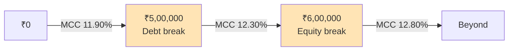

# Q&A — Cost of Capital

*CA Intermediate | Financial Management | ICAI Study Material aligned | All figures in Rupees (₹)*

---

## SECTION A — Concept Check (Short Answer)

**A1. What is "cost of capital" and why is it called a hurdle rate?**
It is the minimum rate of return a firm must earn on its investments to keep the market value of its shares unchanged, i.e., to satisfy all suppliers of funds. It is the "rent" paid on money. It is a *hurdle rate* because a project must clear (earn more than) it to add value — projects with IRR below the cost of capital destroy wealth.

**A2. Why is the cost of debt taken on a post-tax basis while the cost of equity is not?**
Interest on debt is a tax-deductible expense, so it creates a **tax shield** (saving = Interest × Tax rate). The real burden of debt to the firm is lower than the coupon rate. Dividends to equity/preference holders are an appropriation of profit, not a deductible expense, so no tax shield exists — hence Ke and Kp need no tax adjustment.

**A3. State the formula for post-tax cost of irredeemable debt.**
Kd = I(1 − t) / Net Proceeds, where I = annual interest in ₹, t = tax rate, Net Proceeds = issue price − flotation costs (or market price for existing debt).

**A4. Why is the cost of retained earnings usually taken as (nearly) equal to the cost of equity?**
Retained earnings are shareholders' money reinvested by the firm. Their cost is the **opportunity cost** — the return shareholders forgo by not receiving the cash as dividend and investing it themselves. Hence Kr = Ke, though Kr may be marginally lower when personal tax/brokerage on distributed dividends is considered: Kr = Ke(1 − tp)(1 − b).

**A5. Distinguish book-value weights from market-value weights in WACC.**
Book-value weights use balance-sheet amounts (easy, stable, but historic/understated for equity). Market-value weights use current market prices (theoretically correct, as cost of capital is a forward-looking market concept), but fluctuate. When market data is available, market weights are preferred.

**A6. What is the marginal cost of capital (MCC) and a "break point"?**
MCC is the cost of raising **one additional rupee** of new capital. As a firm raises more funds, component costs rise in steps. A **break point** is the total amount of new capital that can be raised before the cost of one component rises:
Break point = (Total funds available at a given cost from a source) / (Weight of that source in the capital structure).

**A7. Write the two formulas for Ke.**
- Dividend (Gordon) growth model: Ke = (D₁ / P₀) + g, where D₁ = D₀(1+g).
- CAPM: Ke = Rf + β(Rm − Rf).

---

## SECTION B — Graded Computational Problems (Full Workings)

### B1 (Easy) — Post-tax cost of irredeemable debt
A company issues 12% irredeemable debentures of face value ₹100 at par. Flotation cost is 2%. Tax rate 30%. Find Kd.

**Answer.**
Interest I = 12% × 100 = ₹12. Net proceeds = 100 − 2 = ₹98.
Kd = I(1 − t) / NP = 12(1 − 0.30) / 98 = 8.4 / 98 = **8.57%**.

### B2 (Easy) — Cost of preference shares (irredeemable)
10% preference shares of ₹100 issued at a 5% premium; flotation cost ₹3 per share. Find Kp.

**Answer.**
Preference dividend PD = ₹10. Net proceeds = 100 + 5 − 3 = ₹102.
Kp = PD / NP = 10 / 102 = **9.80%**. (No tax adjustment — dividends are not deductible.)

### B3 (Moderate) — Cost of redeemable debt (approximation method)
12% debentures, face value ₹100, issued at ₹96, redeemable at par after 6 years. Tax 30%. Find Kd.

**Answer.**
Using the approximation (YTM short-cut):
Kd = [ I(1 − t) + (RV − NP)/n ] / [ (RV + NP)/2 ]
- I(1 − t) = 12 × 0.70 = 8.4
- (RV − NP)/n = (100 − 96)/6 = 4/6 = 0.667
- (RV + NP)/2 = (100 + 96)/2 = 98
Kd = (8.4 + 0.667) / 98 = 9.067 / 98 = **9.25%**.

### B4 (Moderate) — Ke by Gordon and CAPM (reconcile)
A share has current market price ₹120, just-paid dividend D₀ = ₹6, constant growth g = 8%. Also Rf = 7%, Rm = 15%, β = 1.25.

**Answer.**
*Gordon:* D₁ = 6(1.08) = ₹6.48. Ke = 6.48/120 + 0.08 = 0.054 + 0.08 = **13.4%**.
*CAPM:* Ke = 7 + 1.25(15 − 7) = 7 + 1.25 × 8 = 7 + 10 = **17%**.
The two differ because they use different inputs (dividend expectations vs market risk premium); in exams use the model the data supports. Here Gordon gives 13.4%, CAPM gives 17%.

### B5 (Exam-hard) — Full WACC: Book value vs Market value weights
Amrit Ltd's capital structure and data:

| Source | Book Value (₹) | Market Value (₹) | Component cost |
|---|---|---|---|
| Equity shares (₹10 each) | 8,00,000 | 16,00,000 | Ke = 16% |
| Retained earnings | 4,00,000 | — (subsumed in equity MV) | Kr = 16% |
| 10% Preference shares | 2,00,000 | 2,20,000 | Kp = 10.5% |
| 12% Debentures | 6,00,000 | 5,80,000 | Kd = 8.4% (post-tax) |

Compute WACC under (a) book-value weights and (b) market-value weights. For market value, split the equity market value (₹16,00,000) between equity and retained earnings in the ratio of their book values (8:4).

**Answer.**

*(a) Book-value weights*

| Source | BV (₹) | Weight | Cost | Weight × Cost |
|---|---|---|---|---|
| Equity | 8,00,000 | 0.400 | 16% | 6.400 |
| Retained earnings | 4,00,000 | 0.200 | 16% | 3.200 |
| Preference | 2,00,000 | 0.100 | 10.5% | 1.050 |
| Debentures | 6,00,000 | 0.300 | 8.4% | 2.520 |
| **Total** | **20,00,000** | 1.000 | | **13.17%** |

WACC (book) = 6.40 + 3.20 + 1.05 + 2.52 = **13.17%**.

*(b) Market-value weights* — split ₹16,00,000 equity MV in 8:4 ratio → Equity ₹10,66,667; Retained earnings ₹5,33,333.

| Source | MV (₹) | Weight | Cost | Weight × Cost |
|---|---|---|---|---|
| Equity | 10,66,667 | 0.4267 | 16% | 6.827 |
| Retained earnings | 5,33,333 | 0.2133 | 16% | 3.413 |
| Preference | 2,20,000 | 0.0880 | 10.5% | 0.924 |
| Debentures | 5,80,000 | 0.2320 | 8.4% | 1.949 |
| **Total** | **25,00,000** | 1.000 | | **13.11%** |

WACC (market) = 6.827 + 3.413 + 0.924 + 1.949 = **13.11%**.

*Reconciliation:* Both weight columns sum to 1.000 and all component ₹ sum to their totals (20,00,000 and 25,00,000). WACC is marginally lower on market weights here because debt's market value fell (raising its post-tax cheap weight only slightly) while equity MV rose. Book WACC 13.17% ≈ Market WACC 13.11%.

### B6 (Exam-hard) — Marginal Cost of Capital with break points
Bharat Ltd maintains a target structure of **50% equity, 10% preference, 40% debt**. It plans large expansion. Cost schedules:

- **Equity/Retained earnings:** Retained earnings available = ₹3,00,000 at Ke = 15%. Beyond that, fresh equity costs 16%.
- **Debt:** First ₹2,00,000 of debt at post-tax Kd = 8%; additional debt at 9%.
- **Preference:** Kp = 12% at all levels.

Compute the break points and the marginal cost of capital in each range.

**Answer.**

**Step 1 — Break points** = amount of cheap source ÷ its weight.
- Equity break: ₹3,00,000 ÷ 0.50 = **₹6,00,000**.
- Debt break: ₹2,00,000 ÷ 0.40 = **₹5,00,000**.

So the ranges of total new capital are: 0–5,00,000 | 5,00,000–6,00,000 | above 6,00,000.

**Step 2 — MCC in each range** (WACC using target weights and the applicable marginal cost):

*Range 1: ₹0 – ₹5,00,000* (RE at 15%, debt at 8%, pref 12%)

| Source | Weight | Cost | Product |
|---|---|---|---|
| Equity | 0.50 | 15% | 7.50 |
| Preference | 0.10 | 12% | 1.20 |
| Debt | 0.40 | 8% | 3.20 |
| **MCC** | | | **11.90%** |

*Range 2: ₹5,00,000 – ₹6,00,000* (RE still 15%, but debt now 9%)

| Source | Weight | Cost | Product |
|---|---|---|---|
| Equity | 0.50 | 15% | 7.50 |
| Preference | 0.10 | 12% | 1.20 |
| Debt | 0.40 | 9% | 3.60 |
| **MCC** | | | **12.30%** |

*Range 3: above ₹6,00,000* (fresh equity 16%, debt 9%)

| Source | Weight | Cost | Product |
|---|---|---|---|
| Equity | 0.50 | 16% | 8.00 |
| Preference | 0.10 | 12% | 1.20 |
| Debt | 0.40 | 9% | 3.60 |
| **MCC** | | | **12.80%** |

*Check:* Weights sum to 1.00 in every range; costs step up only after a break point; MCC rises 11.90% → 12.30% → 12.80%. A project should be accepted only if its return exceeds the MCC of the funds raised to finance it.

---

## SECTION C — Past-Paper-Style Full Questions

### C1. Compute the WACC (book weights) from a balance sheet extract.
Chetak Ltd's sources: Equity share capital (₹10 shares) ₹5,00,000; Reserves & surplus ₹2,50,000; 9% Preference shares ₹1,50,000; 11% Debentures ₹3,00,000. Additional data: expected equity dividend ₹2.40 per share, growth 5%, market price ₹20; preference issued at par; debentures issued at par, tax 25%; treat reserves as carrying the same cost as equity.

**Model Answer.**

*Component costs:*
- Ke = D₁/P₀ + g = 2.40/20 + 0.05 = 0.12 + 0.05 = **17%**. Kr (reserves) = 17%.
- Kp = 9/100 = **9%** (par, no flotation).
- Kd = I(1 − t)/NP = 11(1 − 0.25)/100 = 8.25/100 = **8.25%**.

*WACC (book):*

| Source | ₹ | Weight | Cost | Product |
|---|---|---|---|---|
| Equity | 5,00,000 | 0.4167 | 17% | 7.083 |
| Reserves | 2,50,000 | 0.2083 | 17% | 3.542 |
| Preference | 1,50,000 | 0.1250 | 9% | 1.125 |
| Debentures | 3,00,000 | 0.2500 | 8.25% | 2.063 |
| **Total** | **12,00,000** | 1.0000 | | **13.81%** |

**WACC = 13.81%.** (Column of ₹ reconciles to ₹12,00,000; weights to 1.0000.)

### C2. Explain, with the priority-queue idea, why Ke > Kp > Kd for a typical firm.
**Model Answer.** Suppliers of capital form a **priority queue** on the firm's cash flows and on liquidation. Debt-holders are paid first (fixed interest, legal claim, secured) — lowest risk, so they demand the lowest return; interest also earns a tax shield, cutting the firm's cost further. Preference shareholders rank next (fixed dividend but payable only out of profits, no legal enforcement like debt) — a middle risk and middle cost. Equity shareholders are the residual, last-in-queue claimants bearing the most risk (no fixed return, paid last), so they demand the highest return. Hence **Kd (post-tax) < Kp < Ke**. This ordering is why an all-equity firm has a higher cost of capital and why a sensible debt dose can lower WACC.

### C3. A firm's β is 1.4, risk-free rate 6%, market return 14%. Its debentures yield 10% pre-tax, tax 30%. Capital = 60% equity, 40% debt (market weights). Find WACC and state whether a project with IRR 12% should be accepted.
**Model Answer.**
- Ke (CAPM) = 6 + 1.4(14 − 6) = 6 + 1.4 × 8 = 6 + 11.2 = **17.2%**.
- Kd = 10(1 − 0.30) = **7%**.
- WACC = 0.60 × 17.2 + 0.40 × 7 = 10.32 + 2.80 = **13.12%**.

**Decision:** Project IRR 12% < WACC 13.12%. **Reject** — it fails to clear the hurdle rate and would erode shareholder value.

---

## SECTION D — MCQs & Case Scenarios

**D1.** Interest on debt is tax-deductible; therefore the post-tax cost of 10% debt at 30% tax is:
(a) 10% (b) 7% (c) 13% (d) 3%
**Answer: (b) 7%.** Kd = 10 × (1 − 0.30) = 7%.

**D2.** The cost of retained earnings is best described as:
(a) zero, since it is internal (b) equal to the interest rate (c) the opportunity cost to shareholders (d) always higher than Ke
**Answer: (c).** Retained earnings carry the shareholders' opportunity cost, so Kr ≈ Ke.

**D3.** For WACC, the theoretically preferable weighting scheme is:
(a) book value (b) market value (c) target/notional (d) equal weights
**Answer: (b) market value.** Cost of capital is a market-based, forward-looking concept.

**D4.** A break point in the marginal cost of capital schedule is reached when:
(a) WACC equals IRR (b) a component's cost changes as more is raised (c) the firm is out of retained earnings only (d) tax rate changes
**Answer: (b).** Break point = (funds at a given cost) ÷ (that source's weight); it marks where a component cost steps up.

**D5 (Case).** Vayu Ltd finances with 50% equity (Ke 18%), 20% preference (Kp 13%), 30% debt (Kd post-tax 8%). It has ₹4,00,000 retained earnings; equity beyond that costs 20%. Equity weight is 0.50.
*(i) Break point for equity?* = 4,00,000 / 0.50 = **₹8,00,000**.
*(ii) MCC for the first ₹8,00,000?* = 0.50×18 + 0.20×13 + 0.30×8 = 9 + 2.6 + 2.4 = **14.0%**.
*(iii) MCC just beyond ₹8,00,000?* Replace 18% with 20%: 0.50×20 + 2.6 + 2.4 = 10 + 5.0 = **15.0%**.
*Reasoning:* only equity's cost steps up; preference and debt weights/costs are unchanged, so MCC rises from 14.0% to 15.0%.

**D6.** Which is NOT tax-adjusted in WACC?
(a) Cost of debentures (b) Cost of term loan (c) Cost of preference shares (d) Cost of public deposits carrying interest
**Answer: (c).** Preference dividends are an appropriation, not a deductible expense — no tax shield.

---

## Connections & Traps (Exam Recap)

- **Capital budgeting:** WACC is the discount rate for NPV and the cut-off for IRR — a wrong cost of capital flips accept/reject decisions.
- **Capital structure:** Because Kd < Ke, adding debt can lower WACC up to the point where financial risk pushes Ke (and Kd) up — the trade-off theory.
- **Dividend/valuation:** Ke feeds directly into Gordon's valuation P₀ = D₁/(Ke − g); cost of capital and value are two sides of one coin.

**Examiner traps to avoid:**
1. Forgetting the (1 − t) factor only on debt — never on preference or equity.
2. Using face value instead of **net proceeds** (deduct flotation, adjust premium/discount).
3. Mixing D₀ and D₁ in Gordon's model — always grow the dividend: D₁ = D₀(1+g).
4. Dividing break-point funds by the wrong denominator — divide by the **source's weight**, not by total capital.
5. Splitting equity market value from retained earnings incorrectly — allocate in book-value ratio when a separate MV isn't given.
6. Reading the question's weight basis (book vs market) — answer what is asked.

## Quick-Revision Formula Sheet

| Item | Formula |
|---|---|
| Kd (irredeemable) | I(1 − t) / NP |
| Kd (redeemable, approx.) | [I(1 − t) + (RV − NP)/n] / [(RV + NP)/2] |
| Kp (irredeemable) | PD / NP |
| Kp (redeemable, approx.) | [PD + (RV − NP)/n] / [(RV + NP)/2] |
| Ke (Gordon) | D₁/P₀ + g ; D₁ = D₀(1+g) |
| Ke (CAPM) | Rf + β(Rm − Rf) |
| Kr | Ke, or Ke(1 − tp)(1 − b) |
| WACC | Σ (weight × component cost) |
| Break point | Funds available at a cost ÷ source weight |

*Rule of thumb ordering:* Kd(post-tax) < Kp < Kr ≈ Ke. Always reconcile weights to 1.00 and ₹ columns to totals before finalising WACC.
