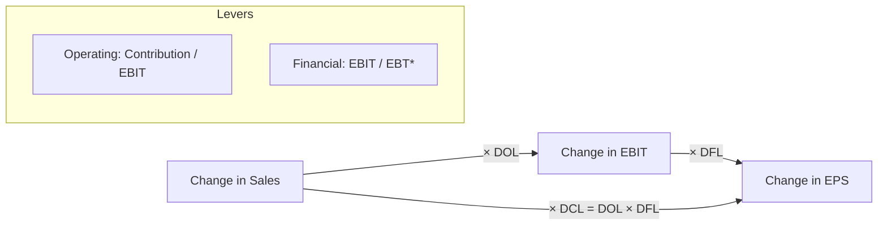

# Q&A — Capital Structure & Leverage

> CA Intermediate · Financial Management · ICAI SM aligned · All figures in Rupees (₹)
> Every question is immediately followed by a complete model answer. Self-verify: all data reconciles.

---

## Section A — Concept-Check (short answer)

**A1. Distinguish business risk from financial risk.**
**Ans.** Business risk is the variability in operating profit (EBIT) arising from the firm's operations, cost structure and demand — it exists even with zero debt and is measured by **DOL**. Financial risk is the additional variability in EPS caused by using fixed-cost capital (debt/preference), measured by **DFL**. Business risk is a *pre-financing* risk; financial risk is *superimposed* by the financing mix.

**A2. Define the two "levers" and the combined lever.**
**Ans.** Operating leverage (DOL = Contribution ÷ EBIT) magnifies a change in sales into a larger change in EBIT. Financial leverage (DFL = EBIT ÷ [EBIT − I − Pref.Div/(1−t)]) magnifies a change in EBIT into a larger change in EPS. **DCL = DOL × DFL = Contribution ÷ (EBIT − I − Pref.Div/(1−t))** links sales straight to EPS.

**A3. State the objective of capital structure planning.**
**Ans.** To choose the debt–equity mix that **minimises WACC (Ko)** and thereby **maximises the value of the firm** and shareholders' wealth, subject to acceptable risk and adequate liquidity/flexibility.

**A4. What does "trading on equity" mean?**
**Ans.** Using fixed-cost funds (debt/preference) whose cost is lower than the return earned, so that the surplus accrues to equity — raising EPS/ROE. It is favourable only when **ROI > cost of debt**; otherwise leverage back-fires.

**A5. Name the four capital-structure theories and their core claim about WACC.**
**Ans.** (1) **Net Income (NI):** more debt → WACC falls → value rises (capital structure *relevant*). (2) **Net Operating Income (NOI):** WACC constant → value unaffected (*irrelevant*). (3) **Traditional:** WACC first falls then rises → an *optimum* exists. (4) **Modigliani–Miller:** without tax same as NOI (arbitrage); **with tax**, value rises by tax shield = **Vu + (D×t)**.

**A6. Why is a high DCL risky?**
**Ans.** A small drop in sales is doubly magnified into a large fall in EPS, so earnings become highly volatile — dangerous if business risk (DOL) is already high; prudent firms offset high DOL with low DFL.

---

*EBT\* = EBIT − Interest − Pref.Div/(1−t)*

---

## Section B — Graded Computational Problems

### B1 (Easy) — Compute all three leverages
Sales ₹10,00,000; Variable cost 60% of sales; Fixed cost ₹1,50,000; Interest ₹50,000. Find DOL, DFL, DCL.

**Ans.**
- Contribution = 10,00,000 − 6,00,000 = **₹4,00,000**
- EBIT = 4,00,000 − 1,50,000 = **₹2,50,000**
- EBT = 2,50,000 − 50,000 = **₹2,00,000**
- **DOL** = Contribution ÷ EBIT = 4,00,000 ÷ 2,50,000 = **1.60**
- **DFL** = EBIT ÷ EBT = 2,50,000 ÷ 2,00,000 = **1.25**
- **DCL** = DOL × DFL = 1.60 × 1.25 = **2.00** (check: Contribution ÷ EBT = 4,00,000 ÷ 2,00,000 = 2.00 ✓)

*Reading:* a 10% rise in sales lifts EPS by 20%.

### B2 (Easy-Moderate) — Leverage with preference dividend
EBIT ₹8,00,000; Interest ₹1,00,000; Preference dividend ₹1,40,000; Tax 30%. Find DFL.

**Ans.** Pref. dividend is paid from post-tax profit, so gross it up: 1,40,000 ÷ (1−0.30) = **₹2,00,000**.
- EBT\* = EBIT − I − Pref.Div/(1−t) = 8,00,000 − 1,00,000 − 2,00,000 = **₹5,00,000**
- **DFL = 8,00,000 ÷ 5,00,000 = 1.60**

*Trap avoided:* preference dividend is NOT tax-deductible, hence the (1−t) grossing-up in the denominator.

### B3 (Moderate) — Work back from leverage to EPS impact
A firm has DOL = 2.0 and DFL = 1.5. Sales are expected to rise 8%. By what % will EBIT and EPS change?

**Ans.**
- %Δ EBIT = DOL × %Δ Sales = 2.0 × 8% = **16%**
- %Δ EPS = DFL × %Δ EBIT = 1.5 × 16% = **24%** (also = DCL × %Δ Sales = 3.0 × 8% = 24% ✓)

### B4 (Moderate-Hard) — EBIT–EPS analysis: three financing plans
A company needs ₹20,00,000. Existing equity: nil. Tax 30%. Expected EBIT ₹6,00,000. Three plans:
- **Plan A:** All equity — 2,00,000 shares of ₹10.
- **Plan B:** ₹10,00,000 equity (1,00,000 shares) + ₹10,00,000 12% debt.
- **Plan C:** ₹10,00,000 equity (1,00,000 shares) + ₹10,00,000 10% preference.
Compute EPS under each and advise.

**Ans.**

| Item | Plan A (Equity) | Plan B (Debt) | Plan C (Pref.) |
|---|---|---|---|
| EBIT | 6,00,000 | 6,00,000 | 6,00,000 |
| Less: Interest | — | 1,20,000 | — |
| EBT | 6,00,000 | 4,80,000 | 6,00,000 |
| Less: Tax @30% | 1,80,000 | 1,44,000 | 1,80,000 |
| PAT | 4,20,000 | 3,36,000 | 4,20,000 |
| Less: Pref. Div | — | — | 1,00,000 |
| Earnings for equity | 4,20,000 | 3,36,000 | 3,20,000 |
| No. of shares | 2,00,000 | 1,00,000 | 1,00,000 |
| **EPS (₹)** | **2.10** | **3.36** | **3.20** |

*Advice:* Plan B (debt) gives the highest EPS because interest is tax-deductible and cheaper than preference; since ROI (6,00,000/20,00,000 = 30%) far exceeds 12% cost of debt, trading on equity is favourable. **Choose Plan B**, subject to acceptable financial risk.

### B5 (Exam-Hard) — EBIT–EPS indifference point
Using Plans A and B of B4, find the EBIT indifference point and interpret.

**Ans.** At indifference, EPS(A) = EPS(B):

$$\frac{(EBIT)(1-t)}{N_A} = \frac{(EBIT - I)(1-t)}{N_B}$$

$$\frac{EBIT \times 0.70}{2,00,000} = \frac{(EBIT - 1,20,000)\times 0.70}{1,00,000}$$

Cancel 0.70; cross-multiply: 1,00,000 × EBIT = 2,00,000 × (EBIT − 1,20,000)
→ EBIT = 2EBIT − 2,40,000 → **EBIT = ₹2,40,000**.

**Check EPS at ₹2,40,000:**
- Plan A: 2,40,000×0.70 ÷ 2,00,000 = 1,68,000 ÷ 2,00,000 = **₹0.84**
- Plan B: (2,40,000−1,20,000)×0.70 ÷ 1,00,000 = 84,000 ÷ 1,00,000 = **₹0.84** ✓

*Interpretation:* above EBIT of ₹2,40,000 the levered Plan B gives higher EPS; below it, the equity Plan A is safer. Since expected EBIT ₹6,00,000 >> ₹2,40,000, debt is justified.

### B6 (Exam-Hard) — NI, NOI & MM valuation
EBIT ₹5,00,000; 12% Debt ₹10,00,000; Equity-capitalisation rate (Ke) 16%; Tax ignored (NI/NOI) except MM-tax part. Overall rate (Ko) for NOI = 15%.

**(a) Net Income approach — value of firm.**
- Interest = 12% × 10,00,000 = 1,20,000
- Earnings to equity = 5,00,000 − 1,20,000 = 3,80,000
- Value of equity S = 3,80,000 ÷ 0.16 = **₹23,75,000**
- Value of debt B = **₹10,00,000**
- **V = S + B = ₹33,75,000**; WACC = EBIT ÷ V = 5,00,000 ÷ 33,75,000 = **14.81%**

**(b) Net Operating Income approach.**
- V = EBIT ÷ Ko = 5,00,000 ÷ 0.15 = **₹33,33,333**
- S = V − B = 33,33,333 − 10,00,000 = **₹23,33,333**
- Implied Ke = 3,80,000 ÷ 23,33,333 = **16.29%** (rises with leverage — WACC stays 15%).

**(c) MM with tax (t = 30%).** Value of unlevered firm Vu = EBIT(1−t) ÷ Ke; take Ke = 16%.
- Vu = 5,00,000 × 0.70 ÷ 0.16 = 3,50,000 ÷ 0.16 = **₹21,87,500**
- Value of levered firm VL = Vu + (Debt × t) = 21,87,500 + (10,00,000 × 0.30) = 21,87,500 + 3,00,000 = **₹24,87,500**
- Tax shield on debt = **₹3,00,000**, which is the gain from leverage.

---

## Section C — Past-Paper-Style Full Questions

### C1. (RTP-style, 8 marks)
The following data relate to XYZ Ltd: Sales ₹25,00,000; P/V ratio 40%; Fixed cost ₹5,00,000; 15% Debentures ₹8,00,000; 12% Preference capital ₹5,00,000; Equity shares 1,00,000 of ₹10; Tax 30%.
Compute (i) DOL, (ii) DFL, (iii) DCL, (iv) EPS.

**Ans.**
- Contribution = 40% × 25,00,000 = **₹10,00,000**
- EBIT = 10,00,000 − 5,00,000 = **₹5,00,000**
- Interest = 15% × 8,00,000 = **₹1,20,000**
- EBT = 5,00,000 − 1,20,000 = **₹3,80,000**; Tax = 1,14,000; PAT = **₹2,66,000**
- Pref. dividend = 12% × 5,00,000 = **₹60,000**
- **(i) DOL** = 10,00,000 ÷ 5,00,000 = **2.00**
- **(ii) DFL** = EBIT ÷ [EBIT − I − PrefDiv/(1−t)] = 5,00,000 ÷ [5,00,000 − 1,20,000 − 60,000/0.70]
  = 5,00,000 ÷ [5,00,000 − 1,20,000 − 85,714] = 5,00,000 ÷ 2,94,286 = **1.699 ≈ 1.70**
- **(iii) DCL** = 2.00 × 1.70 = **3.40**
- **(iv) EPS** = (PAT − Pref.Div) ÷ shares = (2,66,000 − 60,000) ÷ 1,00,000 = **₹2.06**

### C2. (Exam, 6 marks) — Choose between two structures
A firm requires ₹30,00,000, expected EBIT ₹7,50,000, tax 30%. Option 1: all equity (3,00,000 shares of ₹10). Option 2: ₹15,00,000 equity (1,50,000 shares) + ₹15,00,000 10% debt. Find the indifference EBIT and recommend.

**Ans.** Indifference: EBIT×0.70/3,00,000 = (EBIT−1,50,000)×0.70/1,50,000
→ 1,50,000·EBIT = 3,00,000(EBIT − 1,50,000) → EBIT = 2EBIT − 4,50,000 → **EBIT = ₹4,50,000**.
Expected EBIT ₹7,50,000 > ₹4,50,000, so **Option 2 (debt)** yields higher EPS.
*Verify EPS at ₹7,50,000:* Opt 1 = 7,50,000×0.70/3,00,000 = **₹1.75**; Opt 2 = (7,50,000−1,50,000)×0.70/1,50,000 = 4,20,000/1,50,000 = **₹2.80**. Debt wins. ✓

---

## Section D — MCQs & Case Scenarios

**D1.** Operating leverage is best described as:
(a) EBIT/EBT  (b) Contribution/EBIT  (c) Contribution/EBT  (d) EBIT/Sales
**Ans. (b)** — DOL measures how contribution magnifies into EBIT.

**D2.** Under MM with corporate tax, the gain from leverage equals:
(a) Vu  (b) Debt × Ke  (c) Debt × Tax rate  (d) EBIT × Tax rate
**Ans. (c)** — VL = Vu + D·t; the tax shield = D × t.

**D3.** A firm has DOL 3 and DFL 2. If EPS must not swing more than 30% for a given sales change, the max tolerable sales change is:
(a) 5%  (b) 10%  (c) 15%  (d) 30%
**Ans. (a)** — DCL = 6; 30% ÷ 6 = 5% sales change.

**D4.** According to the Net Operating Income approach, as debt increases, WACC:
(a) falls  (b) rises  (c) stays constant  (d) becomes zero
**Ans. (c)** — NOI holds Ko constant; only Ke rises to offset cheaper debt.

**D5.** Trading on equity is beneficial only when:
(a) ROI < interest rate  (b) ROI = interest rate  (c) ROI > interest rate  (d) tax = 0
**Ans. (c)** — surplus of return over debt cost accrues to equity.

**D6. Case.** Alpha Ltd (high DOL of 2.5 due to heavy fixed assets) is planning a large 14% debt issue that would raise DFL to 2.4. Expected DCL ≈ 6.0. Comment.
**Ans.** Stacking high financial leverage on already-high operating leverage gives a DCL of 6 — a mere 10% sales fall would slash EPS by 60%. **Recommendation:** keep DFL low (finance more by equity) so that combined risk stays manageable; high-DOL firms should carry conservative debt.

**D7.** The EBIT–EPS indifference point is the EBIT at which:
(a) EPS is maximum  (b) EPS is the same under two financing plans  (c) EPS is zero  (d) WACC is minimum
**Ans. (b)** — below it the less-levered plan is better; above it the more-levered plan is better.

**D8.** Under the Traditional approach, the optimum capital structure is the point where:
(a) Ke is minimum  (b) Kd is minimum  (c) WACC (Ko) is minimum and value is maximum  (d) debt is maximum
**Ans. (c)** — the Traditional view says WACC first falls, reaches a minimum (the optimum), then rises as excessive debt pushes up both Ke and Kd.

**D9. Case.** Beta Ltd earns ROI of 9% and can raise 12% debt. Management wants more leverage to boost EPS. Advise.
**Ans.** Since ROI (9%) < cost of debt (12%), trading on equity is **unfavourable** — every rupee of debt earns less than it costs, so leverage would *reduce* EPS and ROE and raise financial risk. Beta should avoid additional debt and consider equity or retained earnings instead.

**D10.** In MM (no-tax) theory, two identical firms differing only in leverage cannot have different values because:
(a) taxes equalise them  (b) arbitrage by investors eliminates any price gap  (c) Ke is fixed  (d) dividends are equal
**Ans. (b)** — investors switch (home-made leverage/arbitrage) until both firms' values converge, so WACC and value are independent of capital structure.

---

## Quick-Revision Formula Sheet

| Metric | Formula |
|---|---|
| Contribution | Sales − Variable Cost |
| EBIT | Contribution − Fixed Cost |
| DOL | Contribution ÷ EBIT |
| DFL | EBIT ÷ [EBIT − I − Pref.Div/(1−t)] |
| DCL | DOL × DFL = Contribution ÷ [EBIT − I − Pref.Div/(1−t)] |
| EPS | (EBIT − I)(1−t) − Pref.Div ÷ No. of equity shares |
| Indifference EBIT | (EBIT−I₁)(1−t)−PD₁ ⁄ N₁ = (EBIT−I₂)(1−t)−PD₂ ⁄ N₂ |
| NI: Value | S = (EBIT−I)/Ke ; V = S + B ; Ko = EBIT/V |
| NOI: Value | V = EBIT/Ko ; S = V − B |
| MM (with tax) | VL = Vu + (D × t) ; Vu = EBIT(1−t)/Ke |

**Golden rules:** (1) Gross-up preference dividend by (1−t) in DFL. (2) Interest is tax-deductible, preference dividend is not. (3) Optimum structure = minimum WACC = maximum value. (4) Offset high business risk (DOL) with low financial risk (DFL).
