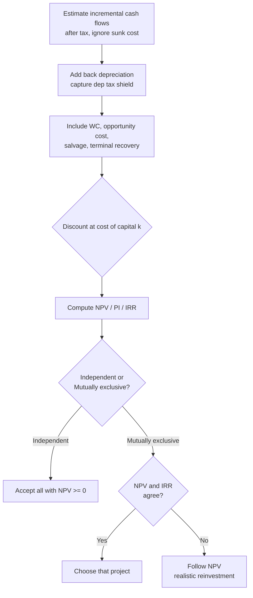

# Q&A — Capital Budgeting (Investment Decisions)

> CA Intermediate · Financial Management (ICAI SM) · Currency: Rupees (₹)
> Every question is immediately followed by a complete model answer. All numeric data self-reconciles.

---

## SECTION A — Concept-Check (Short Answer)

**A1. Define capital budgeting and state why it is "irreversible".**
**Answer.** Capital budgeting is the process of evaluating and selecting long-term investment proposals (in fixed assets/projects) whose cash flows extend beyond one year. It is largely irreversible because it commits large, sunk funds to assets that cannot be re-sold without heavy loss, and it shapes the firm's risk-return profile for years. Hence a wrong decision cannot be easily undone.

**A2. Distinguish between accounting profit and cash flow. Which is relevant for capital budgeting?**
**Answer.** Accounting profit is measured after non-cash charges (depreciation) on an accrual basis. Cash flow is the actual movement of money. Capital budgeting uses **cash flows**, because value depends on real inflows/outflows available for reinvestment and returns, not book profits. Depreciation is added back but its **tax shield** (Depreciation × tax rate) is a genuine cash saving.

**A3. What is the "incremental principle"? Give one item that is included and one excluded.**
**Answer.** Only cash flows that **change** because of the project are relevant. *Included:* opportunity cost (e.g., rent forgone on a building used by the project). *Excluded:* sunk costs (money already spent, e.g., a past feasibility study) and allocated common overheads that do not change.

**A4. State the formula for the PV factor and explain what the discount rate represents.**
**Answer.** PV factor for year *n* = 1 / (1 + k)ⁿ, where *k* is the discount rate. The discount rate represents the firm's **cost of capital / required rate of return** — the minimum return demanded by fund providers, reflecting the time value of money and project risk.

**A5. Give the decision rule for NPV, IRR, PI and Payback.**
**Answer.**
- **NPV** = PV of inflows − PV of outflows. Accept if NPV ≥ 0; higher is better.
- **IRR** = rate at which NPV = 0. Accept if IRR ≥ cost of capital.
- **PI (Profitability Index)** = PV of inflows ÷ Initial outflow. Accept if PI ≥ 1.
- **Payback** = time to recover the initial outlay. Accept if payback ≤ target period (shorter is better).

**A6. Why can NPV and IRR give conflicting rankings for mutually exclusive projects?**
**Answer.** Conflicts arise due to (a) differences in **scale** (size of outlay), (b) differences in **timing/pattern** of cash flows, and (c) the **reinvestment assumption** — NPV assumes intermediate cash flows are reinvested at the cost of capital, IRR assumes reinvestment at the IRR itself. When they conflict, **NPV is preferred** because it measures absolute rupee wealth added and uses a realistic reinvestment rate.

**A7. What is the discounted payback period and how is it superior to simple payback?**
**Answer.** Discounted payback is the time taken for the **discounted** cash inflows to recover the initial outlay. It is superior to simple payback because it recognises the time value of money; however, like simple payback it still ignores cash flows arising **after** the payback point.

**A8. Write the terminal-year cash flow components.**
**Answer.** Terminal year cash flow = Operating cash flow of the year + After-tax salvage value + Recovery of working capital − any removal/decommissioning cost. After-tax salvage = Salvage − Tax on (Salvage − Book value), where a loss gives a tax saving.

---

## SECTION B — Graded Computational Problems (Easy → Exam-Hard)

### B1 (Easy) — Payback and ARR
A machine costs ₹1,00,000 and gives equal annual cash inflows of ₹25,000 for 6 years. Straight-line depreciation, no salvage. Find (i) Payback and (ii) ARR on average investment.

**Answer.**
(i) Payback = Initial outlay ÷ Annual inflow = 1,00,000 ÷ 25,000 = **4 years**.
(ii) Annual depreciation = 1,00,000 ÷ 6 = ₹16,667.
Annual accounting profit = Cash inflow − Depreciation = 25,000 − 16,667 = ₹8,333.
Average investment = 1,00,000 ÷ 2 = ₹50,000.
ARR = 8,333 ÷ 50,000 = **16.67%**.

---

### B2 (Easy-Moderate) — NPV with equal cash flows (annuity)
Project outlay ₹2,00,000; annual after-tax cash inflow ₹60,000 for 5 years; cost of capital 10%. PVAF(10%, 5) = 3.791. Compute NPV and PI.

**Answer.**
PV of inflows = 60,000 × 3.791 = ₹2,27,460.
NPV = 2,27,460 − 2,00,000 = **₹27,460** (positive → Accept).
PI = 2,27,460 ÷ 2,00,000 = **1.137**.

---

### B3 (Moderate) — Cash flow estimation with depreciation tax shield
A firm buys equipment for ₹5,00,000, life 5 years, straight-line, salvage nil. Expected annual sales ₹4,00,000, cash operating cost ₹2,50,000. Tax rate 30%, cost of capital 12%. PVAF(12%,5) = 3.605. Compute annual cash flow and NPV.

**Answer.**
Depreciation = 5,00,000 ÷ 5 = ₹1,00,000.

| Item | ₹ |
|---|---|
| Sales | 4,00,000 |
| Less: Cash operating cost | 2,50,000 |
| Less: Depreciation | 1,00,000 |
| **PBT** | **50,000** |
| Less: Tax @30% | 15,000 |
| **PAT** | **35,000** |
| Add back: Depreciation | 1,00,000 |
| **Annual cash flow (CFAT)** | **1,35,000** |

PV of inflows = 1,35,000 × 3.605 = ₹4,86,675.
NPV = 4,86,675 − 5,00,000 = **−₹13,325** (negative → Reject).

*Check via tax-shield route:* CFAT = (Sales − Cost)(1−t) + Dep×t = 1,50,000×0.70 + 1,00,000×0.30 = 1,05,000 + 30,000 = ₹1,35,000. ✓ Reconciles.

---

### B4 (Moderate-Hard) — Working capital + salvage, uneven flows
Project: Plant ₹8,00,000; working capital ₹1,00,000 introduced at start and fully recovered at end. Life 4 years, SLM depreciation on plant, salvage ₹80,000 (equal to book residual assumption: depreciate ₹7,20,000 over 4 years). Tax 30%, k = 10%. Operating cash inflows before tax and depreciation: Yr1 ₹3,00,000, Yr2 ₹3,50,000, Yr3 ₹4,00,000, Yr4 ₹3,00,000.
PVF(10%): 0.909, 0.826, 0.751, 0.683. Compute NPV.

**Answer.**
Depreciable base = 8,00,000 − 80,000 = 7,20,000 → Depreciation/yr = ₹1,80,000.
Book value at end = ₹80,000 = salvage → **no profit/loss on sale**, so after-tax salvage = ₹80,000.

CFAT each year = (Pre-tax cash profit − Dep)(1−t) + Dep, i.e. (X − 1,80,000)×0.70 + 1,80,000.

| Yr | Cash profit (X) | X−Dep = PBT | Tax 30% | PAT | +Dep | CFAT |
|---|---|---|---|---|---|---|
| 1 | 3,00,000 | 1,20,000 | 36,000 | 84,000 | 1,80,000 | 2,64,000 |
| 2 | 3,50,000 | 1,70,000 | 51,000 | 1,19,000 | 1,80,000 | 2,99,000 |
| 3 | 4,00,000 | 2,20,000 | 66,000 | 1,54,000 | 1,80,000 | 3,34,000 |
| 4 | 3,00,000 | 1,20,000 | 36,000 | 84,000 | 1,80,000 | 2,64,000 |

Terminal (end Yr4) additions: Salvage ₹80,000 + WC recovery ₹1,00,000 = ₹1,80,000.
Yr4 total inflow = 2,64,000 + 1,80,000 = ₹4,44,000.

Initial outlay (Yr0) = Plant 8,00,000 + WC 1,00,000 = ₹9,00,000.

| Yr | Cash flow | PVF | PV |
|---|---|---|---|
| 1 | 2,64,000 | 0.909 | 2,39,976 |
| 2 | 2,99,000 | 0.826 | 2,46,974 |
| 3 | 3,34,000 | 0.751 | 2,50,834 |
| 4 | 4,44,000 | 0.683 | 3,03,252 |
| | | **PV inflows** | **10,41,036** |

NPV = 10,41,036 − 9,00,000 = **₹1,41,036** (positive → **Accept**).

---

### B5 (Exam-Hard) — NPV vs IRR conflict, mutually exclusive
Two mutually exclusive projects (outlay ₹1,00,000 each), cost of capital 10%:
- **Project X:** inflows ₹40,000 p.a. for 4 years.
- **Project Y:** ₹10,000; ₹20,000; ₹40,000; ₹1,00,000 over 4 years.
PVAF(10%,4) = 3.170; PVF(10%): 0.909, 0.826, 0.751, 0.683.
Compute NPV of each and identify the conflict; recommend using the crossover logic.

**Answer.**
**Project X NPV** = 40,000 × 3.170 − 1,00,000 = 1,26,800 − 1,00,000 = **₹26,800**.

**Project Y NPV:**
| Yr | CF | PVF | PV |
|---|---|---|---|
| 1 | 10,000 | 0.909 | 9,090 |
| 2 | 20,000 | 0.826 | 16,520 |
| 3 | 40,000 | 0.751 | 30,040 |
| 4 | 1,00,000 | 0.683 | 68,300 |
| | | PV | 1,23,950 |

NPV(Y) = 1,23,950 − 1,00,000 = **₹23,950**.

**IRR indication:** X returns cash faster (front-loaded), so its IRR is higher; Y is back-loaded so at low discount rates its heavy Year-4 inflow gives good value, but at high rates it collapses. Testing X at 22%: 40,000 × PVAF(22%,4 = 2.494) = 99,760 ≈ 1,00,000 → **IRR(X) ≈ 22%**. For Y, IRR ≈ 18% (Year-4 flow discounted harder). 

**Conflict:** By **NPV**, X (₹26,800) > Y (₹23,950) → choose X. By IRR, X (~22%) > Y (~18%) → also X here — but the *margin* differs, and had Y's terminal flow been larger the rankings would reverse below the crossover rate.
**Recommendation:** For mutually exclusive projects, follow **NPV** — it measures absolute wealth added and assumes reinvestment at the realistic cost of capital (10%), not the inflated IRR. **Select Project X.**

---

### B6 (Exam-Hard) — Interpolating IRR
A project costs ₹3,00,000 and yields ₹1,00,000 per year for 5 years. PVAF(15%,5)=3.352, PVAF(20%,5)=2.991. Find IRR by interpolation.

**Answer.**
Required PVAF for zero NPV = Outlay ÷ Annual inflow = 3,00,000 ÷ 1,00,000 = 3.000.
This lies between 15% (3.352) and 20% (2.991).
NPV at 15% = 1,00,000×3.352 − 3,00,000 = +35,200.
NPV at 20% = 1,00,000×2.991 − 3,00,000 = −900.

IRR = 15% + [35,200 ÷ (35,200 + 900)] × (20% − 15%)
= 15% + (35,200 ÷ 36,100) × 5% = 15% + 4.875% = **≈ 19.88%**.

Since IRR (19.88%) > any cost of capital below it, the project is acceptable up to ~19.9%.

---

## SECTION C — Past-Paper-Style Full Questions

### C1. Full appraisal with all four techniques
*XYZ Ltd is considering a project costing ₹10,00,000 with a 5-year life, SLM depreciation, no salvage. After-tax cash inflows (CFAT): ₹3,00,000; ₹3,00,000; ₹3,00,000; ₹3,00,000; ₹3,00,000. Cost of capital 12%. Evaluate using Payback, Discounted Payback, NPV, PI and IRR. PVAF(12%,5)=3.605; PVF(12%): 0.893, 0.797, 0.712, 0.636, 0.567; PVAF(14%,5)=3.433; PVAF(16%,5)=3.274.*

**Answer.**
**Payback:** 10,00,000 ÷ 3,00,000 = **3.33 years** (3 years + 1,00,000/3,00,000).

**Discounted cash flows (12%):**
| Yr | CFAT | PVF | PV | Cumulative PV |
|---|---|---|---|---|
| 1 | 3,00,000 | 0.893 | 2,67,900 | 2,67,900 |
| 2 | 3,00,000 | 0.797 | 2,39,100 | 5,07,000 |
| 3 | 3,00,000 | 0.712 | 2,13,600 | 7,20,600 |
| 4 | 3,00,000 | 0.636 | 1,90,800 | 9,11,400 |
| 5 | 3,00,000 | 0.567 | 1,70,100 | 10,81,500 |

**Discounted payback:** After Yr4 cumulative = 9,11,400; shortfall = 88,600; recovered in Yr5 = 88,600 ÷ 1,70,100 = 0.52 → **≈ 4.52 years**.

**NPV** = 10,81,500 − 10,00,000 = **₹81,500** (Accept).

**PI** = 10,81,500 ÷ 10,00,000 = **1.08** (Accept).

**IRR:** Required PVAF = 10,00,000 ÷ 3,00,000 = 3.333.
At 14%: NPV = 3,00,000×3.433 − 10,00,000 = +29,900.
At 16%: NPV = 3,00,000×3.274 − 10,00,000 = −17,800.
IRR = 14% + [29,900 ÷ (29,900 + 17,800)] × 2% = 14% + 1.25% = **≈ 15.25%**.
Since IRR 15.25% > cost of capital 12% → **Accept**. All methods agree.

---

### C2. Replacement decision with incremental cash flows
*A company runs an old machine (book value ₹2,00,000, remaining life 4 years, current salvage ₹80,000, salvage after 4 years nil, annual cash operating cost ₹5,00,000). A new machine costs ₹6,00,000, life 4 years, SLM, salvage nil, annual cash operating cost ₹3,20,000. Tax 30%, k = 10%. PVAF(10%,4)=3.170. Should the machine be replaced? (Assume old machine's remaining depreciation ₹50,000 p.a.; new machine depreciation ₹1,50,000 p.a.)*

**Answer.** Work on **incremental** basis (New − Old).

**Incremental initial outlay (Yr0):**
Cost of new machine 6,00,000 − Salvage of old 80,000 = ₹5,20,000.
*(Tax on old machine sale: sold at 80,000 vs book 2,00,000 → loss 1,20,000 → tax saving 36,000. Simplified version ignores this; full version reduces outlay to 5,20,000 − 36,000 = ₹4,84,000. We show the standard SM treatment below.)*

**Incremental operating savings (pre-tax) = 5,00,000 − 3,20,000 = ₹1,80,000 p.a.**
**Incremental depreciation = 1,50,000 − 50,000 = ₹1,00,000 p.a.**

Incremental CFAT = (Savings − Δ Dep)(1−t) + Δ Dep
= (1,80,000 − 1,00,000) × 0.70 + 1,00,000
= 56,000 + 1,00,000 = **₹1,56,000 p.a.**

PV of savings = 1,56,000 × 3.170 = ₹4,94,520.
NPV = 4,94,520 − 5,20,000 = **−₹25,480** → on the simplified outlay, marginally **reject**.
With tax saving on old-machine loss (outlay ₹4,84,000): NPV = 4,94,520 − 4,84,000 = **+₹10,520 → replace.**
**Conclusion:** The decision is finely balanced; once the tax shield on the loss-on-sale is recognised, replacement is marginally worthwhile. State the assumption clearly in the exam.

---

### C3. Project with working capital, inflation-free real terms
*A project needs plant ₹12,00,000 (life 3 years, SLM, salvage ₹3,00,000) and working capital ₹2,00,000 recovered at end. EBDT (earnings before depreciation and tax): ₹7,00,000 each year. Tax 30%, k = 12%. PVF(12%): 0.893, 0.797, 0.712. Compute NPV. (Book value end = ₹3,00,000 = salvage → no gain/loss.)*

**Answer.**
Depreciation = (12,00,000 − 3,00,000) ÷ 3 = ₹3,00,000 p.a.
CFAT = (EBDT − Dep)(1−t) + Dep = (7,00,000 − 3,00,000)×0.70 + 3,00,000 = 2,80,000 + 3,00,000 = ₹5,80,000 p.a.

Initial outlay = 12,00,000 + 2,00,000 = ₹14,00,000.
Terminal extras (Yr3) = Salvage 3,00,000 + WC 2,00,000 = ₹5,00,000; Yr3 total = 5,80,000 + 5,00,000 = ₹10,80,000.

| Yr | Cash flow | PVF | PV |
|---|---|---|---|
| 1 | 5,80,000 | 0.893 | 5,17,940 |
| 2 | 5,80,000 | 0.797 | 4,62,260 |
| 3 | 10,80,000 | 0.712 | 7,68,960 |
| | | **PV** | **17,49,160** |

NPV = 17,49,160 − 14,00,000 = **₹3,49,160** → **Accept.**

---

## Decision-Flow Diagram

---

## SECTION D — MCQs & Case Scenarios

**D1.** Depreciation is relevant in capital budgeting because it —
(a) is a cash outflow (b) reduces PBT only (c) provides a **tax shield** (d) is irrelevant
**Answer: (c)** — Depreciation itself is non-cash but its tax saving (Dep × t) is a real cash inflow.

**D2.** For mutually exclusive projects with conflicting rankings, the preferred criterion is —
(a) IRR (b) Payback (c) **NPV** (d) ARR
**Answer: (c)** — NPV measures absolute wealth added and uses a realistic reinvestment rate.

**D3.** A project has PI = 0.95. It should be —
(a) accepted (b) **rejected** (c) deferred (d) accepted if payback < 3 yrs
**Answer: (b)** — PI < 1 means PV of inflows < outlay, i.e., negative NPV.

**D4.** IRR is the discount rate at which —
(a) NPV is maximum (b) **NPV is zero** (c) PI is maximum (d) payback equals life
**Answer: (b)** — By definition IRR sets PV of inflows equal to outlay.

**D5.** A sunk cost of ₹50,000 already incurred on market research should be —
(a) added to outlay (b) **ignored** (c) depreciated (d) treated as inflow
**Answer: (b)** — Only future incremental cash flows are relevant; past costs are sunk.

**D6.** Working capital recovered at project end is —
(a) taxable income (b) **a terminal-year cash inflow** (c) a sunk cost (d) depreciation
**Answer: (b)** — It returns to the firm and adds to terminal cash flow (not taxed).

**D7 (Case).** *A firm's project has NPV +₹40,000 at 10% and −₹5,000 at 14%. Its cost of capital is 12%.* The IRR is approximately, and the decision is —
(a) 13.6%, accept (b) 10%, reject (c) 14%, reject (d) 8%, accept
**Answer: (a)** — IRR = 10 + (40,000/45,000)×4 ≈ 13.6% > 12% → accept.

**D8 (Case).** *Project A: outlay ₹5,00,000, NPV ₹60,000. Project B: outlay ₹2,00,000, NPV ₹40,000. Capital rationing applies.* The better choice on PI is —
(a) A, higher NPV (b) **B, higher PI** (c) both equal (d) neither
**Answer: (b)** — PI(A)=5,60,000/5,00,000=1.12; PI(B)=2,40,000/2,00,000=1.20. Under rationing, higher PI (B) gives more value per rupee invested.

---

## One-Line Quick-Revision Recap
- Use **after-tax incremental cash flows**, add back depreciation, capture its **tax shield**.
- Ignore **sunk costs**; include **opportunity cost**, **working capital** (out at start, back at end) and **after-tax salvage**.
- **NPV ≥ 0**, **PI ≥ 1**, **IRR ≥ k** → accept; on conflict for mutually exclusive projects, **trust NPV**.
- **Discounted payback** beats simple payback (recognises time value) but both ignore post-payback flows.
