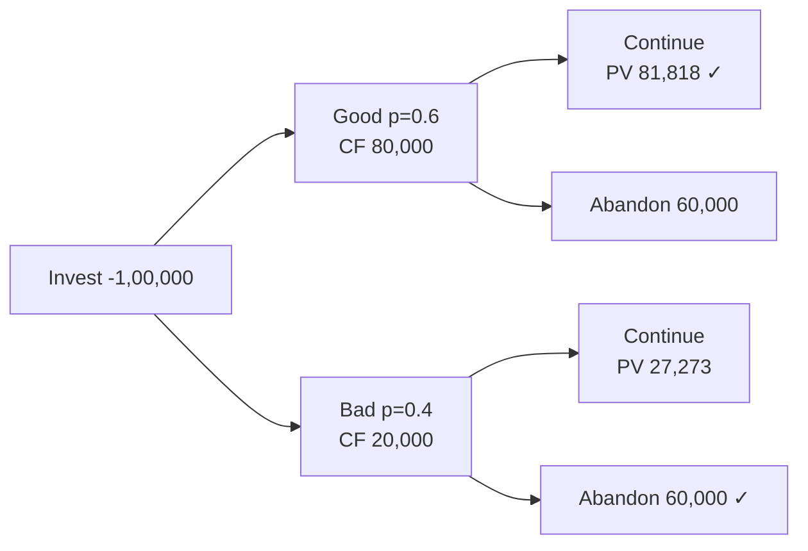

# Q&A — Risk Analysis in Capital Budgeting

> ICAI CA Intermediate | Financial Management. All figures in Rupees (₹). Formulas per ICAI study material.

---

## SECTION A — Concept Check (Short Answer)

**A1. Why is a single-point NPV described as a "comfortable lie"?**
A single NPV collapses a range of possible futures into one number. It hides the *dispersion* of outcomes — two projects with the same NPV of ₹10,00,000 can carry vastly different risk. It gives false precision and no information about the probability of loss.

**A2. Distinguish "risk" from "uncertainty" (Knight).**
*Risk* = outcomes are unknown but their **probability distribution is known/estimable** (objective or subjective probabilities can be assigned). *Uncertainty* = outcomes exist but **probabilities cannot be reliably assigned**. Capital-budgeting techniques (expected NPV, σ) formally require *risk*; pure uncertainty is handled by scenario/judgement.

**A3. Name the two "roads" to price risk in a project.**
(1) **Adjust the discount rate** — Risk-Adjusted Discount Rate (RADR): higher risk → higher rate. (2) **Adjust the cash flows** — Certainty Equivalent (CE): convert risky flows into their certain equivalents, then discount at the risk-free rate.

**A4. List five sources of risk in a capital project.**
Project-specific risk, competitive/industry risk, market (economy-wide) risk, international/currency risk, and technology/obsolescence risk. (Also inflation and political risk.)

**A5. What is the coefficient of variation (CV) and why is it preferred over σ for ranking?**
CV = Standard Deviation ÷ Expected Value = σ/ENPV. It is a **relative** measure of risk per rupee of return, so it correctly ranks projects of *different sizes*, which absolute σ cannot.

**A6. State the decision rule for RADR-based NPV.**
Discount expected cash flows at RADR = Risk-free rate + Risk premium. Accept if NPV ≥ 0; among alternatives choose highest NPV.

**A7. What does sensitivity analysis measure, and its key limitation?**
It measures how NPV responds to a change in **one variable at a time**, isolating the most critical variable. Limitation: it ignores *interdependence* between variables and does not attach probabilities — it shows *what* could go wrong, not *how likely*.

**A8. What is Monte Carlo simulation (Hertz)?**
A computer technique that assigns a probability distribution to each input, then repeatedly (thousands of times) samples random values to build a **probability distribution of NPV** — giving expected NPV, its σ and probability of loss.

**A9. What is scenario analysis and how does it improve on sensitivity analysis?**
Scenario analysis flexes **several variables together** into internally consistent "states" — typically Pessimistic, Most-likely and Optimistic — and computes NPV for each. Unlike sensitivity analysis (one variable at a time), it captures the *joint* movement of variables (e.g., in a recession both price and volume fall together), giving a more realistic range of NPV.

**A10. List three examiner traps in this chapter.**
(1) Discounting certainty-equivalent flows at the RADR instead of the risk-free rate. (2) Using σ (absolute) to rank projects of different sizes instead of CV. (3) In a decision tree, forgetting to take the *max* of continue-vs-abandon at each decision node, or discounting the wrong number of years. Others: adding a risk premium twice (in CF *and* rate), and treating uncertainty as if probabilities were known.

---

## SECTION B — Graded Computational Problems (fully reconciled)

### B1 (Basic) — Expected NPV, σ and CV

A project costs ₹1,00,000 today. Its single-year cash inflow depends on the economy:

| State | Probability | Cash Flow (₹) |
|-------|------------|---------------|
| Recession | 0.30 | 80,000 |
| Normal | 0.40 | 1,20,000 |
| Boom | 0.30 | 1,60,000 |

Risk-free rate = 10%. Compute expected cash flow, σ, CV and expected NPV.

**Answer.**
Expected CF = 0.30(80,000) + 0.40(1,20,000) + 0.30(1,60,000)
= 24,000 + 48,000 + 48,000 = **₹1,20,000**

Variance = Σ p(x − x̄)²:
- (80,000 − 1,20,000)² × 0.30 = (−40,000)² × 0.30 = 1,600,000,000 × 0.30 = 48,00,00,000
- (1,20,000 − 1,20,000)² × 0.40 = 0
- (1,60,000 − 1,20,000)² × 0.30 = 48,00,00,000

Variance = 96,00,00,000 → σ = √96,00,00,000 = **₹30,984** (≈ ₹30,984)
CV = 30,984 ÷ 1,20,000 = **0.258**

Expected NPV = 1,20,000/1.10 − 1,00,000 = 1,09,091 − 1,00,000 = **₹9,091**.

---

### B2 (Intermediate) — Sensitivity Analysis Ranking

A 1-year project: Initial outlay ₹4,00,000; Annual sales 10,000 units at ₹50; variable cost ₹30/unit; cost of capital 10%; life 1 year (inflow at year-end). Base contribution = 10,000 × (50−30) = ₹2,00,000.

Test which variable NPV is most sensitive to, using a **10% adverse change** in (i) selling price, (ii) volume, (iii) initial outlay.

**Answer.** (Contribution is a 5-year annuity; PVAF(10%,5) = 3.791.)
Base NPV = 2,00,000 × 3.791 − 4,00,000 = 7,58,200 − 4,00,000 = **₹3,58,200**.

(i) **Price −10%** → ₹45; contribution = 10,000×(45−30)=1,50,000.
NPV = 1,50,000×3.791 − 4,00,000 = 5,68,650 − 4,00,000 = ₹1,68,650. Change = (3,58,200−1,68,650)/3,58,200 = **−52.9%**.

(ii) **Volume −10%** → 9,000 units; contribution = 9,000×20 = 1,80,000.
NPV = 1,80,000×3.791 − 4,00,000 = 6,82,380 − 4,00,000 = ₹2,82,380. Change = **−21.2%**.

(iii) **Outlay +10%** → ₹4,40,000.
NPV = 7,58,200 − 4,40,000 = ₹3,18,200. Change = **−11.2%**.

**Ranking (most → least sensitive): Selling price > Volume > Initial outlay.** Selling price is the critical variable; management must protect pricing.

---

### B3 (Advanced) — CE vs RADR reconciliation

A project's expected cash flow is ₹1,10,000 at the end of year 1. Risk-free rate = 6%, RADR = 10%.

(a) Find NPV of the year-1 flow via RADR (PV only).
(b) Find the certainty-equivalent coefficient (α₁) that reproduces the **same** present value using the risk-free rate.

**Answer.**
(a) PV via RADR = 1,10,000 / 1.10 = **₹1,00,000**.

(b) CE method: PV = (α₁ × 1,10,000)/1.06 must equal ₹1,00,000.
α₁ × 1,10,000 = 1,00,000 × 1.06 = 1,06,000
α₁ = 1,06,000 / 1,10,000 = **0.9636**.

**Reconciliation:** The general link is α_t = (1+r_f)^t / (1+RADR)^t. Here (1.06/1.10) = 0.9636 ✓. Both roads yield identical PV of ₹1,00,000 when α is set consistently — confirming CE and RADR are two views of the *same* risk adjustment. Note CE is theoretically superior because RADR applies a *constant* premium that (via compounding) assumes risk grows geometrically over time, which may not be true.

---

### B4 (Advanced) — Decision Tree with Abandonment Option

A firm invests ₹1,00,000 now. Year-1 outcome: Good (p=0.6) gives CF ₹80,000; Bad (p=0.4) gives CF ₹20,000. At end of year 1 the firm may **abandon** for a salvage of ₹60,000, or continue to year 2. If continued: after Good, year-2 CF = ₹90,000 (certain); after Bad, year-2 CF = ₹30,000 (certain). Discount rate = 10%. Should the firm plan to abandon in the Bad branch?

**Answer (fold-back).**
Value at year-1 node = year-1 CF + max(salvage, PV of continuing).

*Bad branch:* Continue → PV of year-2 = 30,000/1.10 = ₹27,273. Abandon → ₹60,000.
Since 60,000 > 27,273, **abandon**. Node value (end yr1) = 20,000 + 60,000 = ₹80,000.

*Good branch:* Continue → PV of year-2 = 90,000/1.10 = ₹81,818. Abandon → ₹60,000.
81,818 > 60,000 → **continue**. Node value (end yr1) = 80,000 + 81,818 = ₹1,61,818.

Expected value at end of year 1 = 0.6(1,61,818) + 0.4(80,000) = 97,091 + 32,000 = ₹1,29,091.
Discount to today: 1,29,091/1.10 = ₹1,17,356.
**NPV = 1,17,356 − 1,00,000 = ₹17,356.**

Decision: **Accept**, and the plan is to *abandon in the Bad branch* — the abandonment option adds value (without it, Bad-branch value would be only 20,000+27,273=47,273).

---

## SECTION C — Past-Paper-Style Questions

**C1.** *Explain, with the decision rule, the Certainty Equivalent approach and how it differs from RADR. (5 marks)*

**Model Answer.** Under the **Certainty Equivalent (CE)** approach, each risky expected cash flow (CF_t) is multiplied by a certainty-equivalent coefficient α_t (0 ≤ α_t ≤ 1) reflecting management's risk preference — the more risky/distant the flow, the lower α. The resulting *certain* cash flows are discounted at the **risk-free rate**:
NPV = Σ [α_t × CF_t / (1+r_f)^t] − Initial Outlay. Accept if NPV ≥ 0.

**Difference from RADR:** RADR adjusts the **denominator** (one risk-loaded discount rate for all years), whereas CE adjusts the **numerator** (year-specific α). RADR's constant premium implies risk compounds uniformly over time (a weakness); CE lets risk vary each year and separates the *time value* (r_f) from the *risk adjustment* (α), making it theoretically superior — though α is subjective and harder to estimate.

---

**C2.** *A company evaluates two mutually exclusive projects. X: ENPV ₹50,000, σ ₹15,000. Y: ENPV ₹80,000, σ ₹28,000. Advise using coefficient of variation. (4 marks)*

**Model Answer.**
CV_X = 15,000/50,000 = **0.30**. CV_Y = 28,000/80,000 = **0.35**.
Project X has lower risk per rupee of expected return. **However**, Y has a higher absolute ENPV (₹80,000 vs ₹50,000). For a risk-averse firm concerned with relative risk, choose **X**; if the firm can absorb the extra risk and seeks maximum value, Y is defensible. The CV rule alone favours **X** (lower relative risk). State the assumption explicitly in the exam.

---

**C3.** *Distinguish independent vs perfectly correlated cash flows for computing project σ over time. (4 marks)*

**Model Answer.**
When yearly cash flows are **independent**, risks partly offset, so the project standard deviation combines variances:
σ = √[ Σ σ_t² / (1+r_f)^{2t} ].
When flows are **perfectly (positively) correlated**, a bad year signals bad following years — no diversification — so standard deviations add directly:
σ = Σ [ σ_t / (1+r_f)^t ].
The correlated case gives a **larger** σ (higher risk) for the same yearly σ's. Reality usually lies between the two.

---

## SECTION D — MCQs / Case Scenarios

**D1.** RADR for a *riskier-than-average* project should be:
(a) below cost of capital (b) equal to risk-free rate (c) **above cost of capital** (d) zero.
**Ans: (c)** — higher risk demands a higher premium, so rate exceeds the firm's normal WACC.

**D2.** Certainty-equivalent coefficients as time increases typically:
(a) increase (b) **decrease** (c) stay constant (d) equal 1.
**Ans: (b)** — distant flows are riskier, so α falls with time.

**D3.** Coefficient of variation is best used to compare projects with:
(a) same size (b) **different sizes/scales** (c) same σ (d) equal ENPV.
**Ans: (b)** — CV is relative, so it neutralises scale differences.

**D4.** In a decision tree, "rolling back" (fold-back) means:
(a) computing from origin forward (b) **evaluating from the terminal nodes backward to the root** (c) ignoring probabilities (d) summing outlays.
**Ans: (b)** — expected values are computed at end nodes and worked back, choosing the best action at each decision node.

**D5.** Which technique attaches a *probability distribution to every input* and simulates thousands of NPV outcomes?
(a) Sensitivity analysis (b) Scenario analysis (c) **Monte Carlo simulation** (d) Payback.
**Ans: (c)** — Hertz's simulation produces a full distribution of NPV.

**D6.** Sensitivity analysis is criticised because it:
(a) uses probabilities (b) **changes only one variable at a time, ignoring interdependence** (c) needs no data (d) always overstates NPV.
**Ans: (b)**.

**D7. Case:** A project has ENPV ₹2,00,000, σ ₹40,000, distribution assumed normal. Probability that NPV is negative is found using Z = (0 − 2,00,000)/40,000 = −5. Interpretation:
(a) high chance of loss (b) **near-zero probability of loss** (c) 50% loss (d) cannot compute.
**Ans: (b)** — Z = −5 lies far in the left tail; P(NPV<0) ≈ 0, so the project is very safe.

**D8.** The CE approach discounts certain-equivalent flows at the:
(a) RADR (b) WACC (c) **risk-free rate** (d) IRR.
**Ans: (c)** — risk is already removed from the numerator, so only time value remains.

---

## Quick-Revision Formula Sheet

| Concept | Formula |
|--------|---------|
| Expected value | x̄ = Σ p·x |
| Std deviation | σ = √[Σ p(x − x̄)²] |
| Coeff. of variation | CV = σ / x̄ |
| RADR-NPV | Σ CF_t/(1+RADR)^t − I₀ |
| CE-NPV | Σ α_t·CF_t/(1+r_f)^t − I₀ |
| CE ↔ RADR link | α_t = (1+r_f)^t/(1+RADR)^t |
| σ (independent) | √[Σ σ_t²/(1+r_f)^{2t}] |
| σ (correlated) | Σ σ_t/(1+r_f)^t |

**Decision rules:** NPV ≥ 0 accept. Lower CV = lower relative risk. Higher risk → higher RADR / lower α. Decision tree: fold back, pick max at each choice node. Sensitivity: rank by % NPV change → find critical variable.
