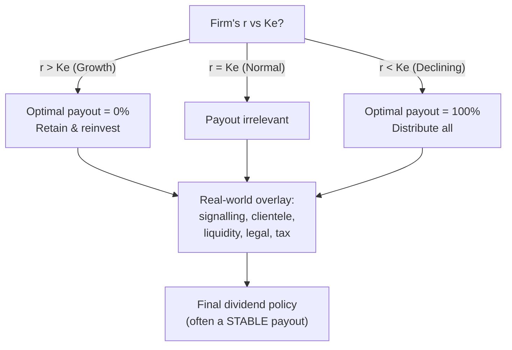

# Q&A — Dividend Decisions

*CA Intermediate | Financial Management | ICAI Study Material aligned | All figures in Rupees (₹)*

---

## SECTION A — Concept Check (Short Answer)

**A1. What is a "dividend decision" and why is it a financing decision in disguise?**
The dividend decision determines what proportion of earnings is **paid out** to shareholders as dividend versus **retained** in the business. Every rupee retained is a rupee of internal equity financing that avoids a fresh issue; every rupee paid out must be replaced by external funds if the firm still wants to invest. So the payout ratio is simultaneously a *distribution* decision and a *financing* decision — the two are joined at the hip.

**A2. State the core question the dividend theories try to answer.**
Does the **pattern of payout** (high dividend now vs retention and future dividend) change the **market value** of the share, given the firm's investment programme? "Relevance" theories (Walter, Gordon) say yes; the "irrelevance" theory (Modigliani–Miller) says no — under its assumptions value depends only on earning power and investment policy, not on how earnings are split.

**A3. Walter's model — write the valuation formula and the decision rule.**
P = [D + (r/Ke)(E − D)] / Ke, where D = dividend per share, E = EPS, r = firm's return on investment, Ke = cost of equity.
Decision rule by firm type:
- **Growth firm (r > Ke):** payout should be **0%** (retain everything) — price is maximised at nil dividend.
- **Declining firm (r < Ke):** payout should be **100%** — price is maximised at full distribution.
- **Normal firm (r = Ke):** payout is **irrelevant** — price is unchanged at any payout.

**A4. Gordon's model (dividend growth / "bird-in-hand") — formula and its logic.**
P = E(1 − b) / (Ke − br), where b = retention ratio, (1 − b) = payout, and growth g = b × r. Investors prefer a certain current dividend to an uncertain future capital gain ("a bird in hand is worth two in the bush"), so they discount distant dividends more heavily. Like Walter, it concludes r > Ke ⇒ retain, r < Ke ⇒ distribute.

**A5. State the MM dividend-irrelevance argument in one line, plus its key formula.**
Under perfect markets, no taxes, no flotation/transaction costs and a given investment policy, a shareholder is **indifferent** between dividends and capital gains because any desired cash can be created by selling shares ("homemade dividends"); paying a dividend merely lowers the ex-dividend price by the same amount. Valuation: P₀ = (P₁ + D₁) / (1 + Ke).

**A6. List the main factors that influence a real-world dividend decision.**
Legal (Companies Act / dividend rules), liquidity/cash position, financing needs & investment opportunities, stability of earnings, access to capital markets, contractual/loan covenants, control considerations (avoiding dilution), shareholders' tax position and expectations, inflation, and the desire for a **stable dividend** (signalling). "Clientele effect" and signalling underpin why managers rarely cut dividends.

**A7. Distinguish the main forms of dividend and name two share-based alternatives.**
Forms: **cash dividend** (most common), **stock dividend / bonus shares** (capitalisation of reserves, no cash outflow), and **scrip/property dividends** (rare). Share-based alternatives to a cash payout are the **bonus issue** and the **share buyback (repurchase)** — buyback returns cash by reducing share count, raising EPS and often signalling that shares are undervalued.

---

## SECTION B — Graded Computational Problems (Full Workings, Self-Verifying)

### B1 (Easy) — Walter's model, single price
EPS = ₹10, DPS = ₹6, r = 15%, Ke = 12%. Find the market price and comment.

**Answer.**
P = [D + (r/Ke)(E − D)] / Ke = [6 + (0.15/0.12)(10 − 6)] / 0.12
= [6 + 1.25 × 4] / 0.12 = [6 + 5] / 0.12 = 11 / 0.12 = **₹91.67**.
Since r (15%) > Ke (12%), this is a **growth firm**; price would be even higher at a *lower* payout. Check at D = 0: P = (0.15/0.12 × 10)/0.12 = 12.5/0.12 = ₹104.17 — confirms nil payout maximises price.

### B2 (Easy) — Gordon's model
EPS = ₹20, retention b = 40%, r = 18%, Ke = 15%. Find price.

**Answer.**
Growth g = b × r = 0.40 × 0.18 = 0.072. Dividend D₁ = E(1 − b) = 20 × 0.60 = ₹12.
P = D₁ / (Ke − g) = 12 / (0.15 − 0.072) = 12 / 0.078 = **₹153.85**.
Since r > Ke, higher retention (higher g) lifts price — a growth-firm result consistent with Walter.

### B3 (Moderate) — Walter across three payouts (reconcile the pattern)
EPS = ₹8, r = 10%, Ke = 12.5%. Compute price at payouts of 0%, 50% and 100%.

**Answer.** r/Ke = 0.10/0.125 = 0.80. P = [D + 0.80(8 − D)] / 0.125.

| Payout | D (₹) | Numerator D + 0.80(8 − D) | Price = ÷0.125 |
|---|---|---|---|
| 0% | 0 | 0 + 0.80×8 = 6.40 | **₹51.20** |
| 50% | 4 | 4 + 0.80×4 = 7.20 | **₹57.60** |
| 100% | 8 | 8 + 0.80×0 = 8.00 | **₹64.00** |

*Reconciliation:* r (10%) < Ke (12.5%) ⇒ **declining firm** ⇒ price rises monotonically with payout, peaking at **100% payout (₹64.00)**. The model behaves exactly as the decision rule predicts.

### B4 (Moderate) — MM hypothesis: prove value is unchanged
A firm has 1,00,000 shares, current price P₀ = ₹100, Ke = 10%. It expects net income of ₹5,00,000 and plans investment of ₹10,00,000 next year. Show, under MM, that firm value is the same whether it (a) pays no dividend or (b) pays a ₹10 per share dividend.

**Answer.**
Step 1 — Ex-dividend price: P₀ = (P₁ + D₁)/(1 + Ke) ⇒ P₁ = P₀(1 + Ke) − D₁ = 100(1.10) − D₁ = 110 − D₁.

**(a) No dividend (D₁ = 0):** P₁ = ₹110.
- New funds needed from issue = Investment − (Net income − Dividends) = 10,00,000 − (5,00,000 − 0) = ₹5,00,000.
- New shares = 5,00,000 / 110 = 4,545.45 shares.
- Value of firm = (existing shares + new shares) × P₁ − new funds... use the clean identity:
  Value to existing holders = [n × P₁ + n × D₁ ... ] Let us use nP₀.

nP₀ = [n×D₁ + n×P₁ − (I − E)] / (1 + Ke) where n = 1,00,000.
= [0 + 1,00,000×110 − (10,00,000 − 5,00,000)] / 1.10
= [1,10,00,000 − 5,00,000] / 1.10 = 1,05,00,000 / 1.10 = **₹95,45,455**.

**(b) Dividend ₹10 (D₁ = 10):** P₁ = 110 − 10 = ₹100.
- New funds = I − (E − nD₁) = 10,00,000 − (5,00,000 − 10,00,000) = 10,00,000 − (−5,00,000) = ₹15,00,000.
nP₀ = [1,00,000×10 + 1,00,000×100 − (10,00,000 − 5,00,000)] / 1.10
= [10,00,000 + 1,00,00,000 − 5,00,000] / 1.10 = 1,05,00,000 / 1.10 = **₹95,45,455**.

*Reconciliation:* Value to existing shareholders is **₹95,45,455 in both cases** — dividend policy is irrelevant. Paying ₹10 dividend simply forces a larger fresh issue (₹15,00,000 vs ₹5,00,000), diluting future value by exactly the cash paid out today.

### B5 (Exam-hard) — Applied factor conflict: choose a policy
Sindhu Ltd earns EPS ₹15, has r = 20%, Ke = 16%. Management is under pressure from small shareholders to keep a **stable ₹9 dividend**, but the finance team notes a large positive-NPV expansion needing internal funds. Using Walter's model, quantify the cost of the ₹9 dividend versus the theoretically optimal payout, then advise reconciling theory with the real-world factors.

**Answer.**
r/Ke = 0.20/0.16 = 1.25. P = [D + 1.25(15 − D)] / 0.16.

| Policy | D (₹) | Numerator | Price |
|---|---|---|---|
| Theoretical optimum (r > Ke ⇒ nil) | 0 | 1.25×15 = 18.75 | **₹117.19** |
| Demanded stable dividend | 9 | 9 + 1.25×6 = 16.50 | **₹103.13** |

*Cost of the stable dividend* = 117.19 − 103.13 = **₹14.06 per share** of theoretical value forgone.
*Advice:* Walter says a growth firm (r > Ke) should retain everything, so the ₹9 payout "costs" ₹14.06/share on paper. But the model ignores real factors: (i) abruptly cutting a long-standing dividend sends a **negative signal** and may crash the price more than the model's gain; (ii) the **clientele** of small shareholders relies on the cash; (iii) legal/liquidity limits. A pragmatic reconciliation: retain the **bulk** of earnings for the positive-NPV project, maintain a **modest stable cash dividend** to protect signalling/clientele, and communicate the growth rationale — capturing most of the retention benefit without a value-destroying dividend shock.

---

## SECTION C — Past-Paper-Style Full Questions

### C1. The following data relate to Meghna Ltd: EPS ₹12, Ke = 12%. Using Walter's model, determine the value of the share at payout ratios of 25%, 50% and 75% when (a) r = 15% and (b) r = 10%. Comment.

**Model Answer.** P = [D + (r/Ke)(E − D)] / Ke.

**(a) r = 15%, r/Ke = 1.25:**

| Payout | D | D + 1.25(12 − D) | Price |
|---|---|---|---|
| 25% | 3 | 3 + 1.25×9 = 14.25 | **₹118.75** |
| 50% | 6 | 6 + 1.25×6 = 13.50 | **₹112.50** |
| 75% | 9 | 9 + 1.25×3 = 12.75 | **₹106.25** |

Price **falls** as payout rises ⇒ growth firm (r > Ke) ⇒ retain more.

**(b) r = 10%, r/Ke = 0.8333:**

| Payout | D | D + 0.8333(12 − D) | Price |
|---|---|---|---|
| 25% | 3 | 3 + 0.8333×9 = 10.50 | **₹87.50** |
| 50% | 6 | 6 + 0.8333×6 = 11.00 | **₹91.67** |
| 75% | 9 | 9 + 0.8333×3 = 11.50 | **₹95.83** |

Price **rises** with payout ⇒ declining firm (r < Ke) ⇒ distribute more. The two panels neatly demonstrate Walter's central proposition that the optimal payout hinges entirely on the sign of (r − Ke).

### C2. Explain the "bird-in-hand" argument and how Gordon's model captures it. Under what condition does Gordon's model break down?
**Model Answer.** Gordon argues investors are risk-averse and place a **higher certainty-value** on a dividend received now than on a capital gain expected later, because future dividends are riskier. As the payout falls (retention rises), the stream of dividends is pushed further into the future and discounted more heavily, so the required return effectively rises and value falls — *unless* the retained funds earn more than Ke. This is embedded in P = E(1 − b)/(Ke − br): higher b lifts g = br, which helps value **only if r > Ke**. **Breakdown:** the formula is valid only when Ke > g (i.e., Ke > br); if br ≥ Ke the denominator becomes zero or negative and the model gives an infinite/negative, meaningless price — a "super-growth" firm cannot be valued by the constant-growth model.

### C3. Distinguish a bonus issue from a share buyback, and state the effect of each on EPS and shareholders' wealth.
**Model Answer.**
- **Bonus issue (stock dividend):** free shares issued by capitalising reserves. **No cash** leaves the firm; number of shares **rises**, so **EPS falls** proportionately and the market price adjusts down. Total shareholder wealth is **theoretically unchanged** (more shares × lower price). It signals confidence and improves liquidity/marketability of the share.
- **Share buyback (repurchase):** the firm uses **surplus cash** to buy back and cancel its own shares. Number of shares **falls**, so **EPS rises**; it returns cash to exiting holders, can raise the price, is often used when shares are undervalued or to return excess cash tax-efficiently, and can improve return ratios (ROE) by shrinking the equity base.
In short, a bonus issue divides the same pie into more slices (no cash), while a buyback shrinks the pie's slices using cash — opposite effects on share count and EPS, both broadly wealth-neutral in perfect markets but powerful **signals** in practice.

### C4. A company has 5,00,000 equity shares, market price ₹40, Ke = 12%. It expects a dividend of ₹4 per share and net income of ₹25,00,000, with planned investment of ₹30,00,000. Using MM, find (a) price at year-end if dividend is paid and if not, and (b) number of new shares to be issued if the dividend is paid.
**Model Answer.**
(a) P₁ = P₀(1 + Ke) − D₁.
- Dividend paid: P₁ = 40(1.12) − 4 = 44.8 − 4 = **₹40.80**.
- No dividend: P₁ = 44.8 − 0 = **₹44.80**.

(b) If dividend is paid: total dividend = 5,00,000 × 4 = ₹20,00,000.
Retained earnings = 25,00,000 − 20,00,000 = ₹5,00,000.
External funds required = Investment − Retained earnings = 30,00,000 − 5,00,000 = ₹25,00,000.
New shares = 25,00,000 / 40.80 = **61,274.5 ≈ 61,275 shares**.
*Insight:* the dividend of ₹20,00,000 is funded by issuing ₹25,00,000 of new shares that dilute existing holders by exactly the dividend's present value — leaving wealth unchanged, as MM asserts.

---

## SECTION D — MCQs & Case Scenarios

**D1.** Under Walter's model, for a firm where r > Ke, the optimum dividend-payout ratio is:
(a) 100% (b) 50% (c) 0% (d) any ratio
**Answer: (c) 0%.** A growth firm maximises price by retaining all earnings to reinvest at r > Ke.

**D2.** In Gordon's model, the growth rate g equals:
(a) b + r (b) b × r (c) r − b (d) r/b
**Answer: (b) b × r.** Growth = retention ratio × return on investment.

**D3.** The MM dividend-irrelevance hypothesis rests on the concept of:
(a) bird-in-hand (b) homemade dividends & arbitrage (c) tax preference (d) signalling
**Answer: (b).** Investors replicate any payout by selling/holding shares, so dividend policy is irrelevant to value.

**D4.** A bonus issue (stock dividend):
(a) increases cash outflow (b) reduces number of shares (c) leaves total shareholder wealth broadly unchanged (d) always raises EPS
**Answer: (c).** More shares at a proportionately lower price; no cash moves, wealth is broadly unchanged.

**D5.** A share buyback typically:
(a) lowers EPS (b) raises EPS by reducing share count (c) uses no cash (d) issues fresh capital
**Answer: (b).** Fewer shares outstanding raise EPS; cash is returned to shareholders.

**D6 (Case).** Godavari Ltd has EPS ₹10, r = 12%, Ke = 12% (a "normal" firm). Its board debates paying 30%, 60% or 90% of earnings.
*(i) Using Walter, price at 60% payout?* r/Ke = 1. P = [6 + 1×(10 − 6)]/0.12 = 10/0.12 = **₹83.33**.
*(ii) Price at 30% and 90% payout?* Both = [D + 1×(10 − D)]/0.12 = 10/0.12 = **₹83.33** each.
*(iii) Conclusion?* Because r = Ke, **dividend policy is irrelevant** — price is ₹83.33 at every payout. The board can choose payout on non-value grounds (liquidity, signalling).

**D7 (Case).** Kaveri Ltd (growth firm, r = 20%, Ke = 14%, EPS ₹15) currently pays a 40% dividend. An analyst claims cutting the dividend to nil would raise the price.
*Verify using Walter.* r/Ke = 1.4286.
- At 40% (D = 6): P = [6 + 1.4286(15 − 6)]/0.14 = [6 + 12.857]/0.14 = 18.857/0.14 = **₹134.69**.
- At nil (D = 0): P = [1.4286 × 15]/0.14 = 21.429/0.14 = **₹153.06**.
*Verdict:* The analyst is **correct on the model** — price rises ₹134.69 → ₹153.06 (+₹18.37). But signalling/clientele risk of a sudden cut must be weighed before acting.

---

## Connections & Traps (Exam Recap)

- **Cost of capital:** Ke is the discount rate in every dividend model; Gordon's P = D₁/(Ke − g) is the same equation used to *derive* Ke = D₁/P₀ + g.
- **Capital structure:** retention is internal equity — a heavy-payout policy forces more external financing, linking dividend and capital-structure decisions.
- **Capital budgeting:** the "residual" view says pay as dividend only what is left after funding all positive-NPV projects — the investment decision has first claim on cash.

**Examiner traps to avoid:**
1. In Walter, dividing by Ke **only once** at the end — the whole bracket is divided by Ke; do not also discount the retained part separately.
2. Confusing the **decision rule direction:** r > Ke ⇒ *low* payout; r < Ke ⇒ *high* payout. Many candidates reverse it.
3. In Gordon, using g = b×r but then forgetting Ke must exceed g for a valid price.
4. In MM, mis-computing **external funds** = Investment − (Net income − Dividends); a wrong sign here breaks the proof.
5. Treating a **bonus issue as increasing wealth** — it does not; only a buyback returns actual cash.
6. Mixing **EPS (E)** and **DPS (D)** in Walter — E is total earnings per share, D is only the paid-out part.

## Quick-Revision Formula Sheet

| Item | Formula / Rule |
|---|---|
| Walter's price | P = [D + (r/Ke)(E − D)] / Ke |
| Walter decision rule | r > Ke ⇒ payout 0%; r < Ke ⇒ 100%; r = Ke ⇒ irrelevant |
| Gordon's price | P = E(1 − b) / (Ke − br); valid only if Ke > br |
| Growth rate | g = b × r (b = retention, 1 − b = payout) |
| MM valuation | P₀ = (P₁ + D₁)/(1 + Ke) |
| MM ex-div price | P₁ = P₀(1 + Ke) − D₁ |
| MM external funds | New funds = Investment − (Net income − Total dividend) |
| No. of new shares (MM) | External funds ÷ P₁ |
| Bonus issue | ↑ shares, ↓ EPS/price, no cash, wealth ~ unchanged |
| Buyback | ↓ shares, ↑ EPS, returns cash, signals undervaluation |

*Golden rule:* first classify the firm by (r − Ke), apply the model, compute the price at each payout, then **overlay real-world factors** (signalling, clientele, liquidity, legal, tax) before recommending a policy.
