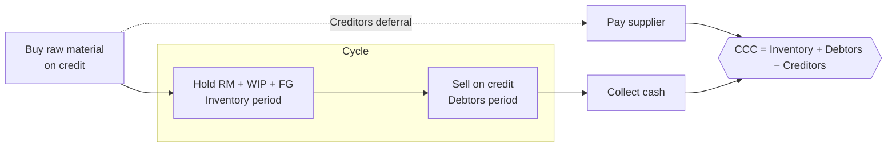

# Q&A — Working Capital Management

> CA Intermediate · Financial Management (ICAI) · Currency: Rupees (₹)
> Every question is immediately followed by a complete model answer. All numeric data self-reconciles.

---

## SECTION A — Concept-Check (Short Answer)

**A1. Why can a profitable firm fail to pay a supplier on a Tuesday?**
**Answer.** Profit is an accrual/book measure; paying bills needs **cash**. A firm may report profit yet have its money locked in inventory and receivables (customers not yet paying) while creditors fall due now. This liquidity gap is a **working-capital**, not a profitability, problem — the classic reason a profitable firm becomes technically insolvent.

**A2. Distinguish gross and net working capital.**
**Answer.** **Gross WC** = total current assets (inventory + receivables + cash + short-term investments). **Net WC** = current assets − current liabilities. Gross WC reflects the *funds invested* in current assets; net WC reflects the *liquidity cushion* and the portion financed by long-term sources. A positive net WC means part of current assets is funded by long-term capital.

**A3. Distinguish permanent and fluctuating (temporary) working capital.**
**Answer.** **Permanent WC** is the minimum level of current assets always needed to run operations (core inventory/receivables) — it behaves like a fixed asset. **Fluctuating WC** is the extra current-asset need driven by seasonality/demand spikes. Permanent WC should be financed by long-term funds; fluctuating WC by short-term sources.

**A4. State the liquidity–profitability trade-off.**
**Answer.** Holding more current assets (cash, inventory, liberal credit) raises **liquidity/safety** but lowers **profitability** (idle low-earning assets, carrying costs). Holding less raises returns but risks stock-outs and default. Working-capital management chooses the balance that minimises total cost/maximises value.

**A5. Write the operating cycle and cash conversion cycle.**
**Answer.**
- **Operating Cycle (OC)** = Inventory holding period (Raw material + WIP + Finished goods) + Receivables (debtors) collection period.
- **Cash Conversion Cycle (CCC)** = OC − Creditors (payables) deferral period.
CCC is the number of days the firm's own cash is tied up before it comes back.

**A6. What does a negative cash conversion cycle mean?**
**Answer.** Suppliers and customers finance operations: the firm collects from customers (or sells for cash) **before** it must pay suppliers. Common in fast-moving retail/e-commerce. It means working capital needs are effectively financed by trade creditors — a strong liquidity position.

**A7. State the matching (hedging) principle of WC financing.**
**Answer.** Finance each asset with a source of matching maturity: **long-term** assets and **permanent** current assets with long-term funds; **fluctuating** current assets with short-term funds. Aggressive policy uses more short-term finance (cheaper, riskier); conservative policy uses more long-term finance (costlier, safer).

**A8. Give the EOQ formula and what it minimises.**
**Answer.** EOQ = √(2AO ÷ C), where A = annual demand (units), O = ordering cost per order, C = carrying cost per unit per year. EOQ is the order size that **minimises total inventory cost** (ordering + carrying), the point where ordering cost = carrying cost.

**A9. What is the cost of forgoing a cash discount (formula)?**
**Answer.** Annualised cost = [d ÷ (100 − d)] × [365 ÷ (N − t)], where d = discount %, N = normal credit period, t = discount period. If this exceeds the firm's short-term borrowing rate, **take the discount**.

**A10. Contrast Baumol and Miller-Orr cash models.**
**Answer.** **Baumol** treats cash like inventory (EOQ logic) assuming **steady, predictable** outflows; it gives an optimal transfer size C = √(2AT ÷ i). **Miller-Orr** handles **uncertain/random** cash flows using an upper limit, lower limit and a return point; it acts when cash hits the bounds.

---

## SECTION B — Graded Computational Problems (Easy → Exam-Hard)

### B1 (Easy) — Operating & cash conversion cycle
Raw material holding 45 days, WIP 15 days, finished goods 30 days, debtors 60 days, creditors 50 days. Compute OC and CCC.

**Answer.**
OC = 45 + 15 + 30 + 60 = **150 days**.
CCC = 150 − 50 = **100 days**. The firm's cash is locked for 100 days per cycle.

---

### B2 (Easy) — EOQ and number of orders
Annual demand 24,000 units; ordering cost ₹150/order; carrying cost ₹4/unit/year. Find EOQ, number of orders, and total relevant cost.

**Answer.**
EOQ = √(2 × 24,000 × 150 ÷ 4) = √(72,00,000 ÷ 4) = √18,00,000 = **1,342 units** (≈1,342).
Number of orders = 24,000 ÷ 1,342 = **≈18 orders**.
Ordering cost = 18 × 150 = ₹2,683; Carrying cost = (1,342 ÷ 2) × 4 = ₹2,683.
Total relevant cost = **₹5,366** (ordering = carrying, confirming EOQ). ✔

---

### B3 (Moderate) — Cost of forgoing cash discount
Terms "2/10, net 45". Firm's bank overdraft costs 18% p.a. Should the firm take the discount? (Use 365 days.)

**Answer.**
Cost of forgoing = [2 ÷ (100 − 2)] × [365 ÷ (45 − 10)]
= (2 ÷ 98) × (365 ÷ 35) = 0.020408 × 10.4286 = 0.2128 = **21.28% p.a.**
Since 21.28% > 18% overdraft rate, the implicit cost of *not* paying early exceeds borrowing cost → **take the discount** (borrow at 18% to pay on day 10). ✔

---

### B4 (Moderate) — Baumol cash model
Annual cash disbursement ₹12,00,000, spread evenly. Cost per transfer ₹100; interest forgone on cash 12% p.a. Find optimal transfer size and number of transfers.

**Answer.**
C* = √(2 × A × T ÷ i) = √(2 × 12,00,000 × 100 ÷ 0.12)
= √(24,00,00,000 ÷ 0.12) = √2,00,00,00,000 = **₹44,721**.
Number of transfers = 12,00,000 ÷ 44,721 = **≈27 transfers**.
Average cash balance = 44,721 ÷ 2 = ₹22,361; total cost = holding (22,361×0.12=2,683) + transaction (27×100=2,683) = **₹5,366**. ✔ (holding = transaction cost).

---

### B5 (Exam-Hard) — Working capital estimation with WIP nuance
Estimate net working capital (total-cost basis) for annual output 1,20,000 units.
Per unit: Raw material ₹40, Direct labour ₹15, Overheads ₹25 (total cost ₹80).
Holding periods: Raw material 1 month; WIP ½ month; Finished goods 1 month; Debtors 2 months (at total cost); Creditors 1 month (raw material). WIP: material 100% issued at start, labour & overheads 50% complete. Cash balance ₹50,000. Assume 12 months, no profit loading on debtors.

**Answer.** Annual figures: RM = 1,20,000×40 = ₹48,00,000; Labour = ₹18,00,000; OH = ₹30,00,000; Total cost = ₹96,00,000. Monthly factor = ÷12.

**Current Assets**
| Item | Working | ₹ |
|---|---|---|
| Raw material (1 mth) | 48,00,000 × 1/12 | 4,00,000 |
| WIP — material (100%) | 48,00,000 × 0.5/12 × 1.0 | 2,00,000 |
| WIP — labour (50%) | 18,00,000 × 0.5/12 × 0.5 | 37,500 |
| WIP — overhead (50%) | 30,00,000 × 0.5/12 × 0.5 | 62,500 |
| Finished goods (1 mth, total cost) | 96,00,000 × 1/12 | 8,00,000 |
| Debtors (2 mth, total cost) | 96,00,000 × 2/12 | 16,00,000 |
| Cash | — | 50,000 |
| **Total Current Assets** | | **31,50,000** |

**Current Liabilities**
| Item | Working | ₹ |
|---|---|---|
| Creditors for RM (1 mth) | 48,00,000 × 1/12 | 4,00,000 |

**Net Working Capital = 31,50,000 − 4,00,000 = ₹27,50,000.**
*WIP nuance:* material is fully in WIP but labour/overhead only to the degree of completion (½ month × 50%). Missing this over-states WIP. ✔

---

### B6 (Exam-Hard) — Credit policy: marginal (incremental) analysis
Present: sales ₹40,00,000, all credit, collection 30 days, no bad debts. Proposed: extend credit to 60 days, sales rise to ₹48,00,000; bad debts 1% of new total sales; variable cost 70% of sales; required return on investment in debtors 20%. Should the new policy be adopted? (360 days; debtors valued at total cost = variable cost since no fixed-cost change.)

**Answer.**
Contribution margin = 30% of sales.
Incremental sales = 48,00,000 − 40,00,000 = ₹8,00,000.
**Incremental contribution** = 8,00,000 × 30% = ₹2,40,000.

Investment in debtors (at variable cost 70%):
- Present: (40,00,000 × 0.70) × 30/360 = 28,00,000 × 1/12 = ₹2,33,333.
- Proposed: (48,00,000 × 0.70) × 60/360 = 33,60,000 × 1/6 = ₹5,60,000.
- Incremental investment = 5,60,000 − 2,33,333 = ₹3,26,667.
**Opportunity cost @20%** = 3,26,667 × 20% = ₹65,333.

Incremental bad debts = 48,00,000 × 1% = ₹48,000 (present nil).

| Item | ₹ |
|---|---|
| Incremental contribution | 2,40,000 |
| Less: Opportunity cost of extra debtors | (65,333) |
| Less: Incremental bad debts | (48,000) |
| **Net gain** | **1,26,667** |

Net gain is positive → **adopt the 60-day policy.** ✔

---

## SECTION C — Past-Paper-Style Questions

**C1.** *"Explain the factors determining the working capital requirement of a company." (5 marks)*
**Answer.** Key determinants:
1. **Nature of business** — trading/service firms need less; manufacturing needs more.
2. **Length of operating cycle** — longer cycle ties up more funds.
3. **Scale of operations / production policy** — steady vs seasonal production.
4. **Credit policy** — liberal terms to customers raise debtors; credit from suppliers reduces need.
5. **Inventory & manufacturing time** — longer processing raises WIP.
6. **Growth & expansion** — rising sales need more permanent WC.
7. **Price-level changes / inflation** — raise the money value of assets.
8. **Operating efficiency & turnover** — faster turnover lowers WC.

**C2.** *A firm has an operating cycle of 120 days and annual operating cost (cash) of ₹73,00,000. Estimate working capital by the operating-cycle method assuming a desired cash balance of ₹1,00,000. (365 days)*
**Answer.** Number of operating cycles per year = 365 ÷ 120 = 3.04.
WC for operations = Annual cost ÷ cycles = 73,00,000 ÷ 3.04 = ₹24,00,658 (≈ 73,00,000 × 120/365 = ₹24,00,000).
Add desired cash ₹1,00,000 → **Working capital ≈ ₹25,00,000.** ✔

**C3.** *"Distinguish between an aggressive and a conservative working-capital financing policy and their effect on risk and return." (4 marks)*
**Answer.** **Aggressive:** finances even part of permanent current assets with short-term funds. Lower cost (short-term rates usually cheaper) → higher return, but higher **liquidity/refinancing risk**. **Conservative:** finances all permanent and part of fluctuating assets with long-term funds; surplus parked in marketable securities. Lower risk, but lower return (idle long-term funds, higher interest cost). A **moderate/matching** policy lies between the two.

**C4.** *State ABC analysis and JIT, and how each controls inventory cost. (4 marks)*
**Answer.** **ABC analysis** classifies inventory by value: 'A' items (few items, high value) get tight control and low stock; 'C' items (many, low value) get loose control. It focuses managerial effort where money is. **JIT (Just-in-Time)** procures/produces only as needed, cutting carrying cost and obsolescence to near zero, but demands reliable suppliers and disciplined logistics; a stock-out halts production, so supplier reliability is critical.

---

## SECTION D — MCQs / Case Scenarios

**D1.** Cash conversion cycle equals:
(a) OC + creditors period (b) OC − creditors period (c) Debtors + creditors (d) Inventory − debtors
**Answer: (b).** CCC removes the free financing period from suppliers.

**D2.** As order size increases, ordering cost per year ____ and carrying cost ____:
(a) rises, rises (b) falls, rises (c) rises, falls (d) falls, falls
**Answer: (b).** Fewer, larger orders cut ordering cost but raise average stock/carrying cost; EOQ balances them.

**D3.** Terms 3/15, net 45. Annualised cost of forgoing discount (365 days) is closest to:
(a) 12% (b) 24% (c) 38% (d) 46%
**Answer: (c).** Cost = [3/(100−3)] × [365/(45−15)] = 0.03093 × 12.167 = **37.6% ≈ 38%**; formula = [d/(100−d)] × [365/(N−t)].

**D4.** Miller-Orr model is preferred over Baumol when:
(a) cash flows are steady (b) cash flows are random/uncertain (c) interest rates are zero (d) there are no transaction costs
**Answer: (b).** Miller-Orr models random cash flows with upper/lower control limits.

**D5.** Permanent working capital should ideally be financed by:
(a) trade creditors (b) bank overdraft (c) long-term funds (d) commercial paper
**Answer: (c).** Permanent WC behaves like a fixed asset; matching principle funds it long-term.

**D6 (Case).** A retailer sells only for cash, holds 20 days inventory and pays suppliers in 40 days. Its CCC is:
(a) +60 days (b) +20 days (c) −20 days (d) 0
**Answer: (c).** CCC = 20 (inventory) + 0 (debtors) − 40 (creditors) = **−20 days**; suppliers finance operations.

---

## Mermaid — The Cash Conversion Cycle

---

## Formula Ready-Reckoner

| Concept | Formula |
|---|---|
| Operating cycle | RM + WIP + FG + Debtors period (days) |
| Cash conversion cycle | OC − Creditors period |
| Inventory period | (Avg inventory ÷ COGS) × 365 |
| Debtors period | (Avg debtors ÷ Credit sales) × 365 |
| Creditors period | (Avg creditors ÷ Credit purchases) × 365 |
| EOQ | √(2AO ÷ C) |
| Cost of forgoing discount | [d/(100−d)] × [365/(N−t)] |
| Baumol optimal cash | √(2 × Annual cash × Cost/transfer ÷ interest) |
| Miller-Orr spread | 3 × [ (3 × txn cost × variance) ÷ (4 × daily interest) ]^(1/3) |

---

## Traps & Examiner Tricks
1. **WIP degree of completion** — apply completion % only to labour & overhead; material is usually 100% (see B5).
2. **Debtors basis** — value at **cost** unless the question says "at selling price"; watch profit loading.
3. **Cost of discount** — use (N − t) days, not N; annualise with 365.
4. **EOQ carrying cost** — if given as % of unit price, C = price × %.
5. **Include desired minimum cash** in WC estimation; exclude depreciation (non-cash) from cash cost.
6. **Take the discount** only if its annualised cost exceeds the borrowing rate.

## First-Principles Recap
Working capital is the **oil in the pipeline** between buying inputs and collecting cash. Manage the *time* (shorten the cash cycle) and the *cost* (EOQ, discounts, matching finance), balancing liquidity against profitability. Cash — not profit — pays the bills on Tuesday.
