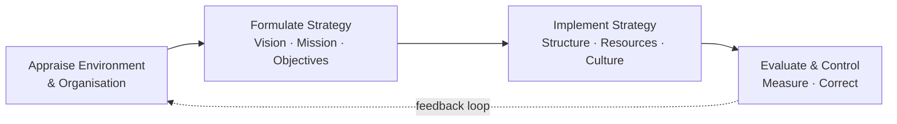

# Q&A — SM — Introduction to Strategic Management

> CA Intermediate · Paper 6 · Strategic Management · ICAI syllabus
> Every question is followed immediately by a complete model answer. Frameworks and definitions follow the ICAI SM module.

---

## SECTION A — Concept-Check (short, definitional)

**A1. Define "strategy" and "strategic management" in ICAI terms.**
**Answer.** *Strategy* is the game plan management uses to stake out a market position, conduct operations, attract and satisfy customers, compete successfully, and achieve organisational objectives. It is a blend of proactive (intended) and reactive (emergent/adaptive) actions.
*Strategic management* is the process of forming a vision, crafting objectives and strategy, implementing/executing the strategy, and evaluating performance with corrective adjustments in light of experience, changing conditions and new ideas. In short: it is the set of managerial decisions and actions that determine the long-run performance of an enterprise.

**A2. Distinguish Vision from Mission.**
**Answer.**
- **Vision** — describes what the organisation aspires to *become* in the long-term future; it is aspirational, directional, future-oriented ("where we want to go"). Example verb: *to be.*
- **Mission** — states the organisation's *present* purpose: what business we are in, whom we serve, and how; it answers "what is our business and why we exist" today.
Vision precedes mission conceptually: vision is the destination, mission is the reason for the journey now.

**A3. What are "objectives" and how do they differ from "goals"?**
**Answer.** *Objectives* are the end results an organisation seeks to achieve; they are specific, measurable, time-bound, and translate the mission into concrete performance targets (e.g., "earn 15% ROCE by 2028"). *Goals* are broader, open-ended, less quantified statements of intent. ICAI treats objectives as the operational, measurable form of goals — objectives close the gap between broad goals and action.

**A4. State the three levels of strategy.**
**Answer.**
1. **Corporate-level strategy** — top management; *which businesses to be in* (scope, diversification, portfolio, resource allocation across SBUs).
2. **Business-level strategy** — SBU heads; *how to compete* in a particular industry (cost leadership, differentiation, focus — competitive advantage).
3. **Functional-level strategy** — functional managers (marketing, finance, HR, operations, R&D); *how each function supports* the business strategy.

**A5. What is "competitive advantage"?**
**Answer.** Competitive advantage is the position a firm occupies when it delivers greater value to customers than rivals — through lower cost, superior differentiation, or focus — enabling above-average, *sustainable* returns. It is sustainable when it is hard for rivals to imitate or erode.

**A6. Define "strategic intent" and list its components.**
**Answer.** Strategic intent is the sustained obsession and stretching ambition of an organisation to achieve a leadership position, often out of proportion to its current resources. ICAI's hierarchy of strategic intent: **Vision → Mission → Business definition → Goals → Objectives.** It reflects a desired leadership position and the criteria the organisation uses to chart progress.

**A7. What are organisational "values"?**
**Answer.** Values are the core beliefs, principles and ethical standards that guide behaviour, decisions and the culture of an organisation (e.g., integrity, customer-first, safety). They act as boundaries and glue: shaping *how* the mission is pursued.

---

## SECTION B — Applied Scenario & Framework Application

**B1. (Hierarchy diagnosis.)** A start-up's founder writes on a whiteboard: *"We will deliver hot meals to any Indian pin-code within 20 minutes."* The team argues whether this is a vision, mission or objective. Diagnose it and rewrite the missing layers.

**Answer.**
- The statement mixes a **mission** cue (what business — hot-meal delivery) with an **objective** cue (measurable "20 minutes", "any pin-code"). As written it is closest to an **operational objective**, not a vision.
- Correct hierarchy:
  - **Vision:** "To make home-cooked-quality food instantly accessible to every Indian household." (aspirational, timeless)
  - **Mission:** "We run a technology-enabled kitchen network that delivers fresh, affordable hot meals reliably across India." (present purpose + business definition)
  - **Objective:** "Deliver 90% of orders within 20 minutes across all serviced pin-codes by FY2028." (measurable, time-bound)
  - **Values:** food safety, speed, honesty in pricing.
**Rule applied:** Vision = *become*; Mission = *are/do now*; Objective = *measure by when*.

**B2. (Three levels of strategy.)** A diversified group runs (i) an FMCG business and (ii) a paints business, sharing a corporate parent. For each of the three strategy levels, give one decision the group would take.

**Answer.**

| Level | Decision-maker | Illustrative decision |
|---|---|---|
| Corporate | Group board | Exit low-margin FMCG categories and reinvest cash into the high-growth paints SBU; decide the business portfolio and capital allocation. |
| Business (Paints SBU) | Paints CEO | Pursue **differentiation** via premium designer finishes and dealer-tinting machines to build competitive advantage vs. rivals. |
| Functional (Paints–Marketing) | Marketing head | Launch a colour-consultancy app and influencer campaign to *support* the differentiation strategy. |

**Key point:** corporate answers *where to compete*, business answers *how to win*, functional answers *how to support*.

**B3. (Strategic intent vs strategic fit.)** Firm X (small, ambitious) declares it will become the domestic market leader in five years despite holding only 4% share. Firm Y (established) tailors its plans strictly to its current resources and market position. Contrast the two philosophies and state which reflects strategic intent.

**Answer.**
- **Firm X — Strategic Intent (stretch philosophy):** ambition deliberately *exceeds* current resources; the gap is closed by leveraging resources creatively, building capabilities and relentless focus. Drives innovation and mobilises the organisation around a stretching goal.
- **Firm Y — Strategic Fit (fit philosophy):** matches ambitions to *available* resources and current environment; conservative, lower risk, but can under-reach and cede leadership.
- **Verdict:** Firm X reflects **strategic intent** — "leadership out of proportion to resources." Best practice combines both: intent supplies the stretch, fit supplies the discipline of feasible execution.

**B4. (Strategic management process.)** List and briefly explain the stages of the strategic management process and show them in a diagram.

**Answer.** ICAI's four-stage process:
1. **Environmental & organisational appraisal** — scan external environment (opportunities/threats) and internal resources (strengths/weaknesses).
2. **Establishing direction / Strategy formulation** — set vision, mission, objectives; craft corporate, business and functional strategies.
3. **Strategy implementation** — allocate resources, design structure, systems, leadership and culture to execute.
4. **Strategic evaluation & control** — measure performance against objectives, take corrective action; the loop feeds back.

---

## SECTION C — Past-Paper-Style Questions

**C1. "Strategic management is not needed by small organisations." Do you agree? Give reasons. (5 marks)**

**Answer.** *Disagree.* Strategic management benefits organisations of every size because it:
1. **Gives direction** — even a small firm needs a clear vision/mission to avoid drifting with day-to-day pressures.
2. **Improves preparedness for change** — anticipating environmental shifts (regulation, technology, rivalry) is vital when a small firm has thin buffers.
3. **Allocates scarce resources wisely** — with limited capital and people, prioritisation via strategy matters *more*, not less.
4. **Builds competitive advantage** — helps a small player pick a defensible niche (focus strategy).
5. **Aligns effort** — objectives cascade so everyone pulls the same way.
The *formality* may be lighter for a small firm, but the *discipline* of strategic thinking is universal. Hence strategic management is essential regardless of size.

**C2. Explain the interlinked hierarchy: Vision → Mission → Objectives → Strategy. Why is order important? (5 marks)**

**Answer.**
- **Vision** sets the aspirational long-term destination.
- **Mission** anchors the present purpose and business definition consistent with the vision.
- **Objectives** convert the mission into measurable, time-bound targets.
- **Strategy** is the means chosen to reach those objectives, and thereby fulfil the mission and move toward the vision.
**Why order matters:** each layer supplies the *premise* for the next. Objectives set without a mission become arbitrary; strategy crafted without objectives has no yardstick for success. A top-down flow ensures internal consistency (alignment) and provides feedback criteria for evaluation (bottom-up control). Reversing the order produces activity without direction — motion without progress.

**C3. Describe the three levels at which strategy operates in a large diversified company, naming the key strategic question at each level. (6 marks)**

**Answer.** (See B2 for the worked example.)
1. **Corporate level** — *"What set of businesses should we be in?"* Concerns scope, diversification, vertical integration, portfolio balancing, and allocation of corporate resources among SBUs.
2. **Business (SBU) level** — *"How should we compete in this industry?"* Concerns building sustainable competitive advantage through cost leadership, differentiation or focus within a single line of business.
3. **Functional level** — *"How do we support the business strategy?"* Concerns operational plans in marketing, finance, operations, HR, R&D — maximising resource productivity in service of the business strategy.
The three levels form a nested hierarchy; consistency across them is essential for coherent execution.

**C4. What is meant by "sustainable competitive advantage"? How does it differ from ordinary competitive advantage? (4 marks)**

**Answer.** *Competitive advantage* exists when a firm earns returns above the industry average by offering superior value (lower cost or better differentiation). It becomes **sustainable** when rivals cannot easily imitate, substitute or erode it over time — typically because it rests on **valuable, rare, inimitable and non-substitutable** resources/capabilities, strong brand, network effects, proprietary technology or scale economies. Ordinary advantage can be fleeting (a temporary price cut); sustainable advantage endures, producing durable above-average profitability. The strategic goal is to *convert* transient advantages into sustainable ones.

---

## SECTION D — MCQs & Case Scenarios

**D1.** Which statement best describes a *vision*?
(a) Present purpose of the firm  (b) A measurable annual target  (c) The long-term aspirational future state  (d) A functional action plan
**Answer: (c).** Vision is future-oriented and aspirational; mission is present purpose (a); objective is measurable target (b).

**D2.** "How should we compete in the smartphone market?" is a question at which level?
(a) Corporate  (b) Business  (c) Functional  (d) Operational
**Answer: (b).** "How to compete" within one industry is business-level strategy; "which industries" would be corporate.

**D3.** Strategic intent is best captured by which idea?
(a) Match ambition to current resources  (b) Leadership ambition out of proportion to current resources  (c) Cost minimisation only  (d) Short-term profit maximisation
**Answer: (b).** Strategic intent is the stretch philosophy — ambition deliberately exceeds present resources.

**D4.** The correct ICAI hierarchy of strategic intent is:
(a) Mission → Vision → Objectives → Goals  (b) Vision → Mission → Business definition → Goals → Objectives  (c) Objectives → Goals → Mission → Vision  (d) Goals → Vision → Mission → Objectives
**Answer: (b).** Vision leads; objectives (measurable) sit at the operational base.

**D5. (Case scenario.)** *ZenCart*, an e-commerce firm, states: Vision — "to be India's most loved shopping destination"; it then sets a target "cut delivery time to 24 hours in 50 cities by FY27" and its logistics team redesigns warehouse routing to hit it. Map each element to the correct concept.
**Answer.**
- "Most loved shopping destination" = **Vision** (aspirational).
- "Cut delivery time to 24 hours … by FY27" = **Objective** (measurable, time-bound).
- Logistics warehouse-routing redesign = **Functional-level strategy** supporting a **business-level** service-differentiation advantage.
One-line reasoning: aspiration → target → functional action is the vision-to-execution cascade.

**D6.** Which is NOT a stage of the strategic management process?
(a) Environmental appraisal  (b) Strategy formulation  (c) Dividend declaration  (d) Strategy evaluation & control
**Answer: (c).** Dividend declaration is a finance decision, not a stage of the SM process.

---

## First-Principles Recap

Strategy exists because resources are **scarce**, the future is **uncertain**, rivals create **rivalry**, and a firm must move a large "fleet" of people/units in one direction (the **fleet-at-sea** analogy — many ships, one bearing, held together by shared vision). The vision-mission-objectives hierarchy is simply *destination → purpose → measurable milestones → route*, ensuring every unit rows the same way. Levels of strategy answer *where to compete* (corporate), *how to win* (business), and *how to support* (functional). Competitive advantage is the payoff; strategic intent is the fuel.

## Quick-Revision Sheet

| Concept | One-line memory hook |
|---|---|
| Vision | What we want to **become** (future) |
| Mission | What we **are / do** now (purpose) |
| Objectives | **Measurable** + time-bound targets |
| Values | Beliefs that guide **how** |
| Corporate strategy | **Which** businesses (scope) |
| Business strategy | **How** to compete (advantage) |
| Functional strategy | How each function **supports** |
| Competitive advantage | Superior value → above-average, **sustainable** returns |
| Strategic intent | Ambition **> resources** (stretch) |
| SM process | Appraise → Formulate → Implement → Evaluate (loop) |

**Examiner traps to avoid:**
1. Do **not** swap vision (future) and mission (present).
2. "How to compete" is **business**, not corporate.
3. Strategic **intent** = stretch beyond resources; strategic **fit** = match resources — don't confuse them.
4. Objectives must be **measurable/time-bound**; a broad wish is only a goal.
5. The SM process is a **loop** (evaluation feeds back), not a one-way line.

*Connections:* this chapter is the gateway — competitive advantage links forward to Competitive/Porter analysis; the SM process links to strategy formulation and implementation chapters; and it ties back to **FM** because strategy sets the objectives (growth, ROCE, value maximisation) that financial decisions on investment, financing and dividends must ultimately serve.
