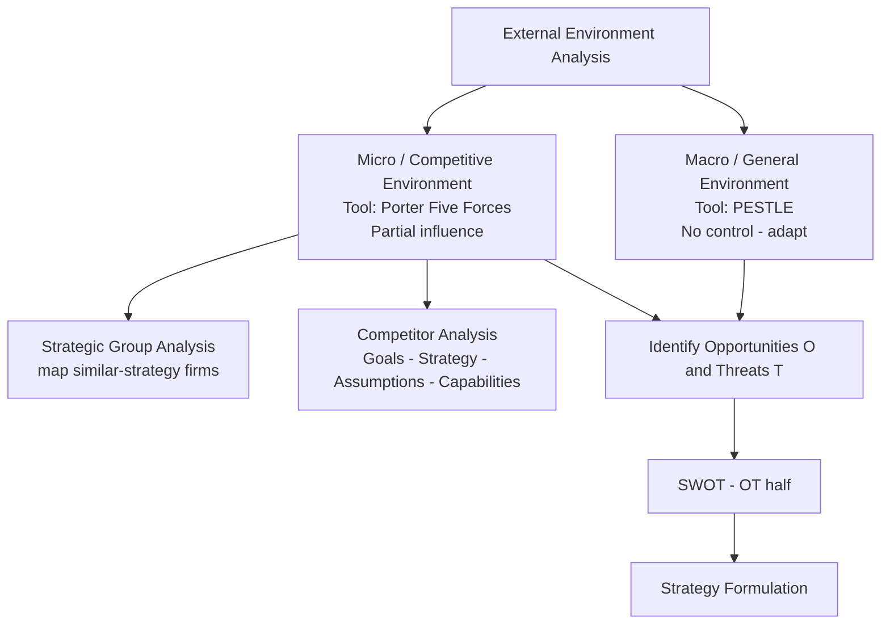

# Q&A — SM — Analysis of External Environment

> CA Intermediate • Paper 6: Financial Management & Strategic Management • SM Portion
> Chapter: Analysis of the External Environment (Environmental Scanning, PESTLE, Porter's Five Forces, Competitor & Strategic Group Analysis)
> Every question is immediately followed by a complete model answer. All figures in Rupees (₹).

---

## Section A — Concept-Check Questions (with answers)

**A1. Why must a firm analyse its external environment at all?**
*Model answer:* Opportunities and threats do not originate inside the firm — they arise **outside** it (customers, competitors, regulators, technology, macro-economy). A firm cannot control these forces but must **anticipate and adapt** to them. External analysis converts vague signals into identified **Opportunities (O)** and **Threats (T)**, which feed the "OT" half of SWOT and drive strategy formulation. Without it, the firm steers blind — like a captain sailing without scanning the horizon.

**A2. Explain the "ship's captain layered-scan" idea behind environmental analysis.**
*Model answer:* A captain scans in **concentric layers** — the immediate deck, the surrounding water, the weather on the horizon. Similarly a strategist scans the environment in layers of increasing distance/controllability:
1. **Internal** (controllable) — not part of external analysis.
2. **Micro / Task / Industry environment** — customers, competitors, suppliers (Porter's Five Forces). Firm has *some* influence.
3. **Macro / General / Remote environment** — Political, Economic, Social, Technological, Legal, Environmental (PESTLE). Firm has *no* control, only adaptation.
Each layer is scanned separately then integrated, so nothing on the "horizon" is missed.

**A3. Distinguish the micro (competitive) environment from the macro (general) environment.**
*Model answer:*
| Basis | Micro / Competitive | Macro / General |
|---|---|---|
| Also called | Task / industry environment | Remote environment |
| Constituents | Customers, competitors, suppliers, intermediaries, market | Political, Economic, Socio-cultural, Technological, Legal, Environmental |
| Control | Firm has partial influence | Firm has no control |
| Tool | Porter's Five Forces | PESTLE analysis |
| Impact | Industry-specific | Affects all industries broadly |

**A4. What are the characteristics of the business environment?**
*Model answer:* The business environment is **(1) Complex** (many interacting forces), **(2) Dynamic** (constantly changing), **(3) Multi-faceted** (same event seen as opportunity by one firm, threat by another), **(4) Far-reaching impact** (affects growth/survival), and **(5) Inter-related** (a change in one factor triggers others, e.g., political change → economic policy change).

**A5. List the components of environmental scanning and its purpose.**
*Model answer:* Environmental scanning is the process of **gathering, analysing and dispensing** information about the external environment. Purpose: to detect **early warning signals** of threats and opportunities. It involves **(a) events**, **(b) trends**, **(c) issues**, and **(d) expectations** of stakeholders. Output feeds strategy so the firm can respond proactively rather than reactively.

**A6. Name the six factors of PESTLE and give one Indian example of each.**
*Model answer:*
- **P**olitical — stability of government, FDI policy (e.g., relaxed FDI in defence).
- **E**conomic — GDP growth, inflation, interest/repo rate, exchange rate.
- **S**ocio-cultural — rising health consciousness, urbanisation, demographics.
- **T**echnological — automation, EV batteries, UPI/digital payments.
- **L**egal — Companies Act, GST law, Consumer Protection Act, labour codes.
- **E**nvironmental — pollution norms (BS-VI), carbon-emission targets, EV push.

**A7. State Porter's Five Forces.**
*Model answer:* (1) **Threat of new entrants**, (2) **Bargaining power of buyers**, (3) **Bargaining power of suppliers**, (4) **Threat of substitute products/services**, (5) **Rivalry among existing competitors**. Together they determine **industry attractiveness / long-run profitability**. Strong forces → low profitability; weak forces → high profitability.

**A8. What is a strategic group?**
*Model answer:* A **strategic group** is a set of firms in the same industry following **similar strategies** along the same dimensions (e.g., price range, quality, distribution, product breadth). Firms *within* a group compete most intensely; **mobility barriers** make it hard to shift from one group to another. A strategic group **map** (usually a 2-axis chart) reveals white spaces and the closest rivals.

**A9. Differentiate a competitor analysis from an industry analysis.**
*Model answer:* **Industry analysis** (Five Forces / PESTLE) assesses the *overall attractiveness and structure* of the industry. **Competitor analysis** drills into *specific rival firms* — their **future goals, current strategy, assumptions, and capabilities** (the four components) — to predict their likely moves and reactions. Industry analysis is macro-within-industry; competitor analysis is firm-specific.

**A10. What are the four diagnostic components of competitor analysis (Porter)?**
*Model answer:* (1) **Future goals** — what drives the competitor; (2) **Current strategy** — what the competitor is doing now; (3) **Assumptions** — what the competitor believes about itself and the industry; (4) **Capabilities** — strengths and weaknesses. Combining these builds a **response profile**: Is the competitor satisfied? What moves will it make? Where is it vulnerable? What will provoke retaliation?

---

## Section B — Applied Scenario & Framework-Application Questions (with model answers)

**B1. (PESTLE — Electric Vehicles).** An Indian auto-maker is deciding whether to launch a mass-market electric vehicle (EV). Apply PESTLE to identify the key external factors.
*Model answer:*
- **Political:** Government EV mission, FAME-II subsidies, state-level EV policies, "Make in India" — **Opportunity**. Policy reversal risk — **Threat**.
- **Economic:** Rising fuel prices make EV running costs attractive (O); high battery cost and interest rates raise the ₹ price and EMI (T); per-capita income growth expands the addressable market (O).
- **Socio-cultural:** Growing environmental awareness and status appeal of EVs (O); "range anxiety" and habit of petrol vehicles (T).
- **Technological:** Improving battery energy density, falling ₹/kWh cost, charging-tech advances (O); dependence on imported cells and fast obsolescence (T).
- **Legal:** BS-VI/emission norms and possible ICE-ban timelines favour EVs (O); safety/battery-certification compliance cost (T).
- **Environmental:** Pollution-reduction targets and carbon commitments push EV demand (O); lithium mining and battery-disposal concerns (T).
**Conclusion:** PESTLE shows a net-favourable but subsidy-and-battery-cost-dependent environment; launch is attractive if charging infrastructure and battery localisation improve.

**B2. (Porter's Five Forces — Airline industry).** Assess the attractiveness of the Indian domestic airline industry using the Five Forces.
*Model answer:*
1. **Threat of new entrants — MODERATE/HIGH.** Aircraft can be leased (low capital barrier), but slots, brand, and regulatory clearances are barriers. Recent entrants show the threat is real.
2. **Bargaining power of buyers — HIGH.** Passengers are price-sensitive, switching cost is near-zero, price-comparison portals give full transparency.
3. **Bargaining power of suppliers — HIGH.** Aircraft duopoly (Boeing/Airbus), volatile jet-fuel (ATF) prices, few lessors and skilled pilots.
4. **Threat of substitutes — MODERATE.** Rail (esp. premium/express trains) and video-conferencing (for business travel) substitute on some routes.
5. **Rivalry — VERY HIGH.** Many carriers, undifferentiated product, high fixed costs and perishable inventory (empty seat = lost revenue) → aggressive price wars.
**Conclusion:** With four of five forces strong, the industry is **structurally unattractive / low-profit**; success needs cost leadership, high load factors and route dominance.

**B3. (Strategic Groups — Car market).** Map the Indian passenger-car market into strategic groups and explain the managerial insight.
*Model answer:* Using two dimensions — **Price/positioning (X-axis: economy → luxury)** and **Product breadth (Y-axis: narrow → wide)** — the groups are:
- **Mass-market wide-range** — Maruti Suzuki, Hyundai, Tata (many models, economy-to-mid price).
- **Premium/mid-luxury** — Toyota, Honda, Volkswagen, Skoda.
- **Luxury** — Mercedes-Benz, BMW, Audi (narrow range, high price).
- **Niche/EV-focused** — specialist EV players.
**Insight:** A firm competes most fiercely with others **inside its own group**; **mobility barriers** (brand, dealer network, technology) make jumping to the luxury group costly. The map exposes **white spaces** (e.g., wide-range premium-EV) as opportunities.

**B4. (Competitor analysis — four components).** A mid-size FMCG firm wants to profile its largest rival. Apply Porter's four-component competitor analysis.
*Model answer:*
- **Future goals:** Rival targets 15% market-share and rural expansion → aggressive, will fight for volume.
- **Current strategy:** Low-price, high-distribution, heavy advertising in Tier-2/3 towns.
- **Assumptions:** Rival believes it is the cost leader and that premium segments are small — a **blind spot** the firm can exploit by attacking premium/health segments.
- **Capabilities:** Strong distribution and cash reserves (strength); weak digital/D2C presence (weakness).
**Response profile:** The rival is satisfied in mass markets but will retaliate hard on price; it is **vulnerable in the premium/online channel**, so the firm should differentiate there rather than start a price war.

**B5. (O/T conversion).** "Every environmental change is simultaneously an opportunity and a threat." Illustrate with the entry of GST.
*Model answer:* GST is **multi-faceted**: for an organised, compliant manufacturer it removed cascading taxes and unified the national market → **Opportunity** (lower logistics cost, wider reach). For a small, cash-based unorganised player, compliance burden and loss of tax-arbitrage → **Threat**. The strategist's job is to **convert** the same signal into O or T *relative to the firm's own resources* — this is why external analysis must always be read against internal strengths/weaknesses (SWOT).

---

## Section C — Past-Paper-Style Questions (with model answers)

**C1. "Environmental scanning helps a firm to be proactive rather than reactive." Explain the process and its benefits. (5 marks)**
*Model answer:* Environmental scanning is the continuous **monitoring, gathering and analysis** of information about external events, trends, issues and stakeholder expectations. **Process:** (i) identify relevant environmental factors; (ii) collect data through scanning/monitoring/forecasting; (iii) analyse for early-warning signals; (iv) disseminate to strategists. **Benefits:** detects opportunities and threats early, reduces strategic surprise, guides resource allocation, improves long-range planning, and lets the firm **shape** rather than merely **react** to change. It is the essential input to SWOT and strategy formulation.

**C2. Explain Porter's Five Forces model and its use in strategy formulation. (6 marks)**
*Model answer:* Porter's model holds that industry profitability is governed by five competitive forces: **(1) rivalry among existing firms, (2) threat of new entrants, (3) threat of substitutes, (4) bargaining power of buyers, (5) bargaining power of suppliers.** The **collective strength** of these forces determines the industry's profit potential — the stronger they are, the lower the returns. **Use in strategy:** managers (a) assess industry attractiveness before entering/exiting; (b) locate the firm where forces are weakest; (c) design defences — build entry barriers, differentiate to blunt buyer power, integrate to reduce supplier power; and (d) exploit **shifts** in the forces (e.g., new technology) before rivals do. The model thus links industry structure to competitive strategy.

**C3. Write short notes on: (a) Strategic Group Analysis and (b) Components of Competitor Analysis. (4 + 4 marks)**
*Model answer:*
**(a) Strategic Group Analysis:** A strategic group is a cluster of firms pursuing similar strategies on similar dimensions (price, quality, breadth, distribution). Plotting groups on a two-dimensional **strategic-group map** shows (i) the firm's closest rivals, (ii) **mobility barriers** protecting each group, (iii) empty **white spaces** (opportunities), and (iv) the intensity of intra-group vs inter-group rivalry. It refines Five-Forces analysis by revealing that competition is uneven across the industry.
**(b) Competitor analysis** examines four components of each key rival — **Future goals** (what drives it), **Current strategy** (what it is doing), **Assumptions** (what it believes), and **Capabilities** (its strengths/weaknesses). Combining these yields a **response profile** predicting the rival's likely moves and vulnerabilities, guiding offensive and defensive strategy.

**C4. "The business environment is complex, dynamic and inter-related." Discuss the characteristics of the business environment with examples. (5 marks)**
*Model answer:* **(1) Complex** — a web of many forces (economic, legal, technological) interacting simultaneously, hard to grasp in totality. **(2) Dynamic** — constantly changing (e.g., shifting consumer tastes, new regulations). **(3) Multi-faceted / relative** — the same change is an opportunity for one firm and a threat for another (e.g., import liberalisation). **(4) Far-reaching impact** — environmental forces decide the survival, growth and profitability of firms. **(5) Inter-related** — factors are linked; a political change (new government) can trigger economic policy shifts, which alter technology adoption. These characteristics make continuous scanning essential.

---

## Section D — MCQs & Case Scenarios (correct option + one-line reasoning)

**D1.** PESTLE analysis is used primarily to scan the:
(a) Internal environment (b) Micro/competitive environment (c) Macro/general environment (d) Financial environment
**Answer: (c).** PESTLE covers uncontrollable remote/general-environment forces.

**D2.** Which is **NOT** one of Porter's Five Forces?
(a) Bargaining power of buyers (b) Threat of substitutes (c) Government regulation (d) Rivalry among existing firms
**Answer: (c).** Government regulation is a PESTLE factor, not a distinct Five-Forces element.

**D3.** Firms in the same strategic group are characterised by:
(a) Different sizes only (b) Similar strategies on similar dimensions (c) Operating in different industries (d) Having no common competitors
**Answer: (b).** A strategic group follows similar strategies along the same dimensions.

**D4.** The four components of competitor analysis are future goals, current strategy, capabilities and:
(a) Assumptions (b) Advertising budget (c) Market share (d) Dividend policy
**Answer: (a).** Assumptions (what the rival believes) is the fourth diagnostic component.

**D5.** Zero switching cost and full price transparency for customers indicate high:
(a) Threat of new entrants (b) Bargaining power of buyers (c) Supplier power (d) Threat of substitutes
**Answer: (b).** Easy switching plus transparency raises buyers' bargaining power.

**D6. Case scenario:** A pharma start-up finds that a new patent-law amendment will let it market a generic drug two years earlier, but the same law lets three rivals do likewise. Identify the strategic reading.
(a) Pure opportunity (b) Pure threat (c) Both an opportunity and a threat (multi-faceted) (d) Neutral
**Answer: (c).** The same legal change is an opportunity (earlier entry) and a threat (rival entry) — the multi-faceted, relative nature of the environment.

**D7.** The environment layer over which a firm has *the least* control is the:
(a) Internal environment (b) Micro environment (c) Macro/remote environment (d) Task environment
**Answer: (c).** Macro forces (PESTLE) are wholly uncontrollable; the firm can only adapt.

---

## Framework Summary — Exam Presentation Template

**One-line memory hooks:**
- **PESTLE** = 6 uncontrollable macro forces → adapt.
- **Five Forces** = industry attractiveness → position where forces are weakest.
- **Strategic groups** = who your *closest* rivals really are.
- **Competitor analysis** = **G-S-A-C** (Goals, Strategy, Assumptions, Capabilities) → response profile.
- All roads lead to **O & T → SWOT → Strategy**.

---

## Traps & Examiner Tricks (10)

1. **Mixing PESTLE with Five Forces.** PESTLE = macro/uncontrollable; Five Forces = industry/micro. Do not list "competition" under PESTLE or "government" as a Sixth Force.
2. **Only five, not six, forces.** "Government/complementors" are influences, not one of Porter's five.
3. **Strong forces = LOW profit.** Students reverse this — strong competitive forces reduce attractiveness.
4. **Opportunity vs Threat is relative.** The same event is O for one firm, T for another — always relate to the firm's resources.
5. **Strategic group ≠ industry.** Firms in a strategic group are a *subset* following similar strategies, not the whole industry.
6. **Mobility barriers vs entry barriers.** Mobility barriers block movement *between strategic groups*; entry barriers block *entry into the industry*.
7. **Competitor analysis components** — remember **assumptions** (most-forgotten of the four) and that the output is a **response profile**.
8. **Environmental scanning ≠ SWOT.** Scanning is the *input process*; SWOT is the *framework* that organises the output.
9. **Threat of substitutes ≠ rivalry.** Substitutes come from *other industries* (rail vs airline); rivalry is *within* the industry.
10. **PESTLE "E" is doubly loaded.** First E = **Economic**, last E = **Environmental (ecological)** — keep them distinct.

---

## First-Principles Recap

Opportunities and threats live **outside** the firm and cannot be controlled — only anticipated. So the strategist **scans in layers** (like a ship's captain): the far horizon (**macro/PESTLE**) and the surrounding waters (**micro/Five Forces**), then zooms into the nearest vessels (**strategic groups** and **individual competitors**). Each layer is checklisted so nothing is missed, and every signal is **converted into an O or a T relative to the firm's own strengths**. Those O's and T's populate the **SWOT** matrix and drive **strategy formulation**. The logic is: *scan → identify O/T → match with internal S/W → choose strategy.*

---

## Connections

- **SWOT:** External analysis supplies the **O** and **T**; internal analysis supplies **S** and **W**. External analysis is literally the "OT engine".
- **Strategy process:** Environmental appraisal is **stage 2** of the strategic-management process (after vision/mission, before strategy choice).
- **Generic strategies:** Five-Forces findings guide the choice between **cost leadership, differentiation and focus** (e.g., position to blunt the strongest force).
- **FM link — Capital budgeting:** A favourable PESTLE/Five-Forces reading raises expected cash flows and lowers perceived risk, feeding directly into the **NPV/IRR** appraisal (e.g., the EV project's projected ₹ cash inflows and discount rate reflect subsidy stability and competitive intensity). Strategic attractiveness and financial viability must agree before commitment.

---

## Quick-Revision Sheet

| Concept | Core content |
|---|---|
| Layers | Internal → Micro (Five Forces) → Macro (PESTLE) |
| PESTLE | Political, Economic, Socio-cultural, Technological, Legal, Environmental |
| Five Forces | Entrants, Buyers, Suppliers, Substitutes, Rivalry → industry attractiveness |
| Rule | Strong forces = low profit; position where forces are weakest |
| Strategic group | Firms with similar strategies; mobility barriers; map = closest rivals + white space |
| Competitor analysis | Goals • Strategy • Assumptions • Capabilities → response profile |
| Env. characteristics | Complex, Dynamic, Multi-faceted, Far-reaching, Inter-related |
| Scanning | Gather–analyse–disseminate events/trends/issues/expectations |
| Output | Opportunities & Threats → SWOT (OT) → strategy formulation |
| Common trap | Don't confuse PESTLE (macro) with Five Forces (micro); strong forces reduce profit |

*— End of Q&A: SM — Analysis of External Environment —*
