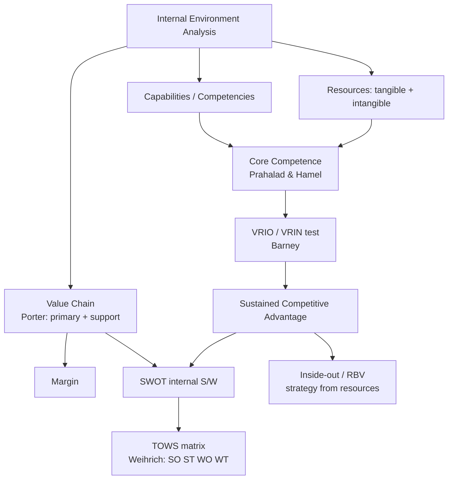
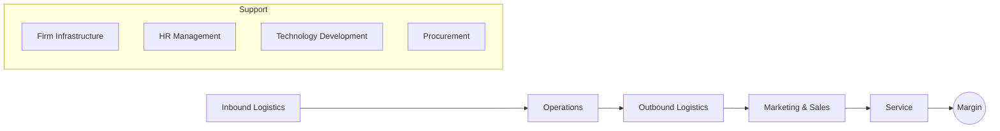

# Q&A — SM — Analysis of Internal Environment

> CA Intermediate | Paper 6 — Financial Management & Strategic Management (SM part)
> Chapter: Analysis of the Internal Environment (Resources, Capabilities, Core Competencies, VRIO/VRIN, Value Chain, SWOT/TOWS)
> All amounts in Rupees (₹). Frameworks per ICAI SM study material.

---

## How this chapter fits together

---

## Section A — Concept-Check (short answer)

**A1. Distinguish between resources and capabilities.**
Resources are the productive **assets** a firm owns or controls — inputs into the production process. They are of two kinds: **tangible** (plant, cash, land, inventory) and **intangible** (brand, patents, reputation, know-how). **Capabilities** are the firm's **capacity to deploy resources**, usually in combination, to perform an activity or task. Resources alone rarely yield advantage; the way they are bundled and used (the capability) does. Example: aircraft are resources; the ability to run reliable on-time scheduling is a capability.

**A2. What is a core competence? State the three tests of Prahalad & Hamel.**
A core competence is a **harmonised bundle of skills and technologies** (not a single skill) that provides competitive advantage. The three tests are: (i) it provides **potential access to a wide variety of markets**; (ii) it makes a **significant contribution to perceived customer benefits** of the end product; and (iii) it is **difficult for competitors to imitate**.

**A3. Expand VRIO and VRIN. Which framework each belongs to.**
Both are from Barney's Resource-Based View. **VRIO** = **V**aluable, **R**are, **I**nimitable, **O**rganised (to capture value). **VRIN** = **V**aluable, **R**are, **I**nimitable, **N**on-substitutable. VRIN is the earlier formulation; VRIO replaces "non-substitutable" with "organisation" — asking whether the firm is actually **organised to exploit** the resource.

**A4. Name Porter's five primary activities and four support activities in the value chain.**
**Primary:** Inbound Logistics, Operations, Outbound Logistics, Marketing & Sales, Service.
**Support:** Firm Infrastructure, Human Resource Management, Technology Development, Procurement.
The difference between total value created and total cost of performing activities is the **Margin**.

**A5. What is the "inside-out" view of competitive advantage?**
It is the **Resource-Based View (RBV)** perspective: advantage originates **inside** the firm — from its distinctive resources and competencies — and strategy is built by leveraging these outward into markets. It contrasts with the "outside-in" (positioning/industry) view of Porter's five forces, where strategy starts from industry structure.

**A6. What does TOWS add to SWOT?**
SWOT merely **lists** Strengths, Weaknesses, Opportunities, Threats. The **TOWS matrix (Weihrich)** forces **synthesis** by pairing internal and external factors into four strategy sets: **SO** (maxi-maxi, use strengths to grab opportunities), **ST** (maxi-mini, use strengths to avoid threats), **WO** (mini-maxi, fix weaknesses by seizing opportunities), and **WT** (mini-mini, defensive, minimise both).

---

## Section B — Applied Scenario & Framework-Application Questions

**B1. VRIO analysis (full framework application).**
*Scenario:* "AgroFresh Ltd" runs a nationwide cold-chain logistics network built over 15 years with proprietary route-optimisation software, dedicated relationships with 4,000 farmers, and an internal analytics team. Rivals can buy trucks and refrigeration, but cannot easily replicate the farmer relationships or the tacit routing knowledge. Apply the VRIO framework and state the competitive implication of each resource.

**Model Answer:**
Run each resource through the four VRIO questions (Valuable? Rare? Inimitable? Organised?):

| Resource | Valuable? | Rare? | Costly to Imitate? | Organised? | Implication |
|---|---|---|---|---|---|
| Trucks & refrigeration | Yes | No | No | Yes | Competitive **parity** |
| Route-optimisation software | Yes | Yes | Partly (can be reverse-engineered) | Yes | **Temporary** advantage |
| Farmer relationships (15 yrs) | Yes | Yes | Yes (social complexity, path dependency) | Yes | **Sustained** advantage |
| Analytics team + tacit knowledge | Yes | Yes | Yes (causal ambiguity) | Yes | **Sustained** advantage |

*Decision rule (VRIO ladder):* Not valuable → disadvantage; Valuable but not rare → parity; Valuable + rare but imitable → temporary advantage; Valuable + rare + inimitable + organised → **sustained competitive advantage**. AgroFresh's sustained edge rests on the socially complex, path-dependent farmer relationships and tacit analytics knowledge — the trucks are mere table-stakes. Strategy should **defend and deepen** the relationship and knowledge assets, not over-invest in easily copied hardware.

**B2. Core competence identification.**
*Scenario:* A diversified group makes small electric motors, uses them across ceiling fans, mixer-grinders, water pumps and e-bikes, and customers report its appliances "just run quietly for years." Is "miniature precision motor engineering" a core competence? Justify against all three Prahalad-Hamel tests.

**Model Answer:**
Apply each test:
1. **Access to varied markets** — Yes. The same motor competence feeds fans, mixers, pumps and e-bikes: multiple end-markets from one root skill. Passed.
2. **Contribution to customer benefit** — Yes. Quiet, durable running is precisely the perceived benefit customers value. Passed.
3. **Difficult to imitate** — Yes, if the skill is a harmonised bundle (metallurgy + winding design + tolerancing + QC) rather than a buyable component. Passed.
Since all three tests hold, "miniature precision motor engineering" qualifies as a **core competence**, functioning as the "root system" nourishing several "product-tree branches." Strategic implication: protect and build the competence, license it selectively, and use it as the platform for entering further motor-dependent product categories.

**B3. Value chain application.**
*Scenario:* A boutique coffee-roaster wants to know where it creates the most value. Map its activities to Porter's value chain and identify two activities where a competitive edge is most defensible.

**Model Answer:**
Mapping to Porter's chain:
- **Inbound logistics:** direct sourcing of single-origin green beans from named estates.
- **Operations:** small-batch roasting with a signature roast profile.
- **Outbound logistics:** freshness-dated dispatch, cold-chain for perishables.
- **Marketing & Sales:** storytelling brand, subscription model.
- **Service:** brew guidance, easy replacements.
- **Support:** Procurement (estate relationships), Technology development (roast-curve data), HRM (skilled roasters), Infrastructure (quality systems).

The two most **defensible edges**: (i) **Operations** — the tacit signature roast profile developed by skilled roasters (hard to copy, links to Technology development and HRM support activities); (ii) **Procurement/Inbound** — exclusive estate relationships. These map onto rare, inimitable resources, so value-chain analysis and VRIO reinforce each other. **Margin** = customer's willingness-to-pay for the branded experience minus the cost of running the chain.

**B4. TOWS synthesis.**
*Scenario:* A regional bakery has: Strengths — strong local brand, low-cost skilled labour; Weaknesses — no online ordering, single-city presence; Opportunities — rising demand for healthy snacks, growth of food-delivery apps; Threats — national chains entering, rising wheat prices. Build a TOWS matrix with one strategy in each cell.

**Model Answer:**

| | **Opportunities** (healthy demand, delivery apps) | **Threats** (national chains, wheat prices) |
|---|---|---|
| **Strengths** (brand, cheap skilled labour) | **SO (maxi-maxi):** Launch a premium healthy-snack line under the trusted local brand, leveraging cheap skilled labour to price competitively. | **ST (maxi-mini):** Use brand loyalty and labour-cost advantage to defend share and out-localise incoming national chains. |
| **Weaknesses** (no online, single-city) | **WO (mini-maxi):** List on delivery apps to overcome the online-ordering gap and ride the delivery-app opportunity. | **WT (mini-mini):** Lock in forward wheat-supply contracts and keep to the core city rather than over-expanding while vulnerable. |

Each cell **pairs** an internal factor with an external factor, which is what distinguishes TOWS from a static SWOT list.

---

## Section C — Past-Paper-Style Questions with Model Answers

**C1. "A firm's resources by themselves do not confer competitive advantage." Explain with reference to resources, capabilities and core competencies. (5 marks)**

**Model Answer:**
Resources are stocks of assets — tangible (plant, finance) and intangible (brand, patents, know-how). But a competitor can often **acquire similar resources**; hence resources alone give at best parity. Advantage emerges when resources are **combined and deployed** through **capabilities** — the firm's proficiency in performing activities (e.g., rapid new-product development). When several capabilities are woven into a **harmonised, hard-to-imitate bundle** that opens multiple markets and delivers customer value, they become a **core competence**. Thus the causal chain is Resources → Capabilities → Core Competence → Competitive Advantage. It is the higher-order integration, protected by **causal ambiguity, social complexity and path dependency**, that resists imitation — which is why a balance sheet of assets does not, by itself, explain why one firm out-competes another.

**C2. Explain Porter's Value Chain and how it helps a firm build competitive advantage. Draw the framework. (6 marks)**

**Model Answer:**
Porter's value chain disaggregates a firm into **strategically relevant activities** to understand costs and sources of differentiation. Activities are of two types:
- **Primary activities** (create/deliver the product): Inbound Logistics → Operations → Outbound Logistics → Marketing & Sales → Service.
- **Support activities** (enable the primary ones): Firm Infrastructure, Human Resource Management, Technology Development, Procurement.

**Margin** is value created minus cost of performing all activities. Competitive advantage is built by either performing activities at **lower cost** than rivals (cost advantage) or performing them in ways buyers value more (**differentiation**), and by managing the **linkages** between activities (e.g., better inbound quality reduces service cost) and with suppliers/channels.

**C3. What is the TOWS matrix? How does it improve upon SWOT analysis? (5 marks)**

**Model Answer:**
The TOWS matrix, developed by **Heinz Weihrich**, is a systematic tool that **matches** a firm's internal Strengths (S) and Weaknesses (W) with external Opportunities (O) and Threats (T) to generate strategy alternatives across four quadrants:
- **SO — Maxi-Maxi:** deploy strengths to exploit opportunities (aggressive/growth).
- **ST — Maxi-Mini:** use strengths to counter threats.
- **WO — Mini-Maxi:** overcome weaknesses by pursuing opportunities.
- **WT — Mini-Mini:** minimise weaknesses and avoid threats (defensive/retrenchment).

**Improvement over SWOT:** ordinary SWOT is a **static inventory** of four lists that does not by itself say what to *do*. TOWS is **action-oriented** — it converts the four factors into concrete, paired strategy options, forcing the strategist to synthesise internal and external analysis into decisions.

**C4. Distinguish between the "inside-out" (resource-based) and "outside-in" (positioning) views of strategy. (4 marks)**

**Model Answer:**

| Basis | Inside-out (RBV) | Outside-in (Positioning) |
|---|---|---|
| Starting point | Firm's internal resources & competencies | Industry structure & market |
| Key question | What are we uniquely good at? | Where is the attractive position? |
| Core tool | VRIO/VRIN, core competence | Porter's Five Forces |
| Source of advantage | Distinctive, inimitable resources | Favourable industry position |
| Proponents | Barney; Prahalad & Hamel | Porter |

The RBV argues that in turbulent markets a firm's own **resource base is a more stable foundation** for strategy than shifting industry positions; the two views are complementary, not mutually exclusive.

---

## Section D — MCQs / Case Scenarios

**D1.** In VRIO, the "O" stands for:
A) Opportunity  B) Organisation  C) Originality  D) Output
**Answer: B — Organisation.** The firm must be organised to capture the value of a valuable, rare, inimitable resource.

**D2.** Which is a *support* activity in Porter's value chain?
A) Operations  B) Outbound Logistics  C) Procurement  D) Service
**Answer: C — Procurement.** Operations, Outbound Logistics and Service are primary activities.

**D3.** A resource that is valuable and rare but *imitable* yields:
A) Sustained advantage  B) Temporary advantage  C) Competitive parity  D) Disadvantage
**Answer: B — Temporary advantage.** Rivals will eventually imitate it, so the edge is not sustained.

**D4.** The TOWS "WT" cell corresponds to which strategy posture?
A) Maxi-Maxi  B) Maxi-Mini  C) Mini-Maxi  D) Mini-Mini
**Answer: D — Mini-Mini.** WT minimises both weaknesses and threats (defensive).

**D5.** The concept of "core competence" as a root system feeding product branches was given by:
A) Michael Porter  B) Jay Barney  C) Prahalad & Hamel  D) Heinz Weihrich
**Answer: C — Prahalad & Hamel** (Harvard Business Review, 1990).

**D6.** *Case:* "NeoPharma" holds a patent (protected 8 more years) for a molecule that is the only cure for a condition; it has manufacturing and distribution ready. Best VRIO description?
A) Valuable only  B) Valuable + Rare, parity  C) Valuable, Rare, Inimitable, Organised — sustained advantage  D) Non-valuable
**Answer: C.** A patent makes the resource valuable, rare and legally inimitable, and NeoPharma is organised to exploit it — sustained competitive advantage (until patent expiry).

**D7.** *Case:* A retailer lists all its strengths and weaknesses and stops there without matching them to market conditions. This tool is best described as:
A) A completed TOWS matrix  B) A static SWOT list needing synthesis  C) VRIN analysis  D) Value chain
**Answer: B — a static SWOT list needing synthesis.** Without pairing internal and external factors (TOWS), it does not generate strategy.

**D8.** In VRIN, "N" stands for:
A) Novel  B) Non-substitutable  C) Necessary  D) Networked
**Answer: B — Non-substitutable.** Even a rare, inimitable resource loses value if an equivalent substitute exists.

---

## One-page recap

- **Chain of advantage:** Resources → Capabilities → Core Competence → Sustained Competitive Advantage.
- **VRIO ladder:** Not-V → disadvantage; V-only → parity; V+R → temporary; V+R+I+O → **sustained**.
- **Prahalad & Hamel core competence tests:** market access + customer benefit + hard to imitate.
- **Porter value chain:** 5 primary (Inbound, Operations, Outbound, Marketing & Sales, Service) + 4 support (Infrastructure, HRM, Tech Dev, Procurement) → **Margin**.
- **Weihrich TOWS:** SO / ST / WO / WT — synthesis, not a list.
- **Inside-out (RBV)** starts from resources; **outside-in** starts from industry structure — use both.
