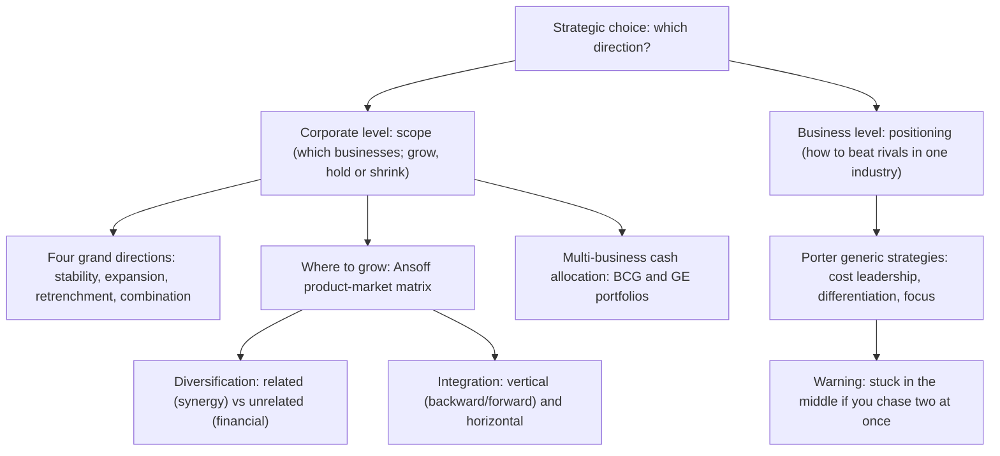

# Q&A — SM Strategic Choices

> Exam-oriented question bank for CA Intermediate, Strategic Management, Chapter "Strategic Choices". Every question is followed immediately by a complete model answer. Frameworks follow ICAI SM: four grand corporate directions, Ansoff, related/unrelated diversification, vertical/horizontal integration, Porter's generic strategies, BCG and GE/McKinsey portfolio matrices.

---

## Map of Strategic Choice (Mermaid)

---

## Section A — Concept-Check Questions (with answers)

**A1. Distinguish corporate-level strategy from business-level strategy.**
Corporate-level strategy answers a question of *scope*: which businesses the firm should be in and whether the enterprise as a whole should grow, hold steady, or shrink. It is set at headquarters for the whole enterprise. Business-level (competitive) strategy answers a question of *positioning*: within a single industry, how a business will beat its direct rivals. The corporate question is "what game(s) should we play?"; the business question is "how do we win the game we are in?"

**A2. Name the four grand directions of corporate strategy.**
Stability, Expansion (growth), Retrenchment, and Combination. Relative to its current position a firm can only stay roughly where it is, get bigger, or get smaller, plus (for multi-business firms) do several of these at once. These four are the logically exhaustive set of directional moves.

**A3. Is a stability strategy the same as "doing nothing"? Explain.**
No. Stability is a *conscious, active* decision to maintain the current position because the environment is stable and the firm is doing reasonably well. The firm still improves incrementally, defends its share, and consolidates. Its recognised sub-types are no-change, profit/harvesting, and pause/proceed-with-caution. Its danger is complacency in a fast-moving industry.

**A4. List the three sub-types of retrenchment in ascending order of severity.**
Turnaround (overhaul operations but stay in the business, intending recovery) → Divestment/divestiture (sell or spin off a unit or major asset) → Liquidation (close the business and sell its assets piecemeal, the last resort).

**A5. State Ansoff's four growth strategies and order them by risk.**
Market Penetration (existing product, existing market) — lowest risk; Market Development (existing product, new market) — moderate; Product Development (new product, existing market) — moderate; Diversification (new product, new market) — highest risk. Risk rises with unfamiliarity: both-known is safest, both-new is riskiest.

**A6. Differentiate related from unrelated diversification.**
Related (concentric) diversification enters a new business that shares a link with the existing one — common technology, production skills, distribution, customers, or brand — and its justification is *synergy* (2+2=5), making it lower-risk. Unrelated (conglomerate) diversification enters an attractive industry with *no operational link*; its logic is purely *financial* — risk-spreading and cash deployment — making it higher-risk because the firm has no special competence in the new field.

**A7. Define backward, forward, and horizontal integration with one example each.**
Backward (upstream) integration: moving towards the source of supply — a car maker buying a steel plant. Forward (downstream) integration: moving towards the customer — a manufacturer opening its own retail stores. Horizontal integration: acquiring/merging with a same-stage rival — one cement maker buying another. Backward and forward are the two forms of vertical integration.

**A8. Name Porter's three generic strategies and the two dimensions that define them.**
Cost Leadership, Differentiation, and Focus. The two dimensions are the *source* of advantage (low cost vs differentiation/uniqueness) and the *scope* of the target market (broad vs narrow). Focus splits into cost focus and differentiation focus within a narrow niche.

**A9. Explain "stuck in the middle."**
A firm that fails to make a clear generic choice — trying to be both low-cost and differentiated across a broad market — achieves neither. It cannot match the cost leader's prices (it carries differentiation costs) and cannot match the differentiator's distinctiveness (it compromises to keep costs down). Result: below-average profitability, beaten on price by the cost leader and on value by the differentiator. The failure is structural because low-cost activities (standardisation, economy) and differentiation activities (variety, investment) genuinely conflict.

**A10. What do the two axes of the BCG matrix represent, and why?**
Vertical axis = market growth rate, a proxy for the *cash the unit needs* to keep up. Horizontal axis = relative market share, a proxy for the *cash the unit generates* through scale and experience. The matrix is fundamentally a cash-flow story.

**A11. Name the four BCG quadrants and the prescribed strategy for each.**
Star (high growth, high share) — invest to hold/grow leadership. Cash Cow (low growth, high share) — milk for cash to fund others. Question Mark/Problem Child (high growth, low share) — invest selectively to build into a Star, or divest. Dog (low growth, low share) — divest or liquidate.

**A12. How does the GE/McKinsey matrix improve on BCG?**
GE replaces BCG's two single-factor axes with two *multi-factor composite* axes: Industry (market) Attractiveness (growth, size, profitability, competitive intensity, regulation) and Business (competitive) Strength (market share, brand, cost position, technology, quality). Each is scored High/Medium/Low, giving a 3×3 nine-cell grid with richer, finer guidance. The cost is subjective weighting of many factors.

**A13. State the cash-flow logic that links the BCG quadrants.**
The surplus cash from Cash Cows funds Stars (to keep them winning) and selected Question Marks (to turn them into Stars), while Dogs are cut loose. A balanced portfolio has cows to fund the future and stars/question-marks to *be* the future.

**A14. Is "cost leadership" the same as "lowest price"?**
No. The cost leader has the *lowest cost*, which is a weapon, not a pricing rule. It may price at or near the market average and pocket a higher margin, choosing when to convert its low cost into a low price (for example, surviving a price war by undercutting rivals).

**A15. Define combination strategy with an example.**
Combination means pursuing two or more grand directions simultaneously or sequentially across different units. Example: a conglomerate grows its software arm (expansion), holds its mature steel business (stability), and exits a loss-making telecom venture (retrenchment) in the same year. It is the norm for large multi-business firms because units sit at different life-cycle stages.

---

## Section B — Applied Scenario & Framework-Application Questions (with answers)

**B1 (Ansoff). "Amrit Dairy" sells packaged milk and curd, is dominant in one state, and wants to grow. Map its four growth options using Ansoff and rank them by risk.**
- Market Penetration (lowest risk): sell more milk/curd to existing customers in the home state — raise usage, win rivals' customers, widen availability, promote harder. Nothing is unfamiliar.
- Market Development (moderate): take the same milk/curd to new states or export markets. Product proven, market new.
- Product Development (moderate): launch new dairy variants (flavoured milk, cheese, yoghurt) to the existing loyal base. Customers known, product unproven.
- Diversification (highest): enter a new product for a new market (e.g., packaged juices in a new region) — everything unfamiliar.
Recommendation: exhaust penetration first, then develop markets/products, and diversify only with eyes open to the risk.

**B2 (Diversification). Amrit Dairy considers (i) entering packaged fruit juices and (ii) buying a cement plant. Classify each and advise.**
(i) Fruit juices is *related (concentric)* diversification — shared cold-chain distribution, FMCG retail shelves, and brand trust create real synergy; lower-risk and defensible. (ii) A cement plant is *unrelated (conglomerate)* diversification — no operational link, justified only by financial logic (risk-spreading, cash deployment). Advise pursuing the juice move for synergy and rejecting cement unless a compelling purely-financial rationale exists, since the firm has no competence there and the market can diversify risk more cheaply than a conglomerate.

**B3 (Integration). Amrit Dairy faces unreliable raw-milk supply and weak last-mile reach. Which integration moves address each, and are they vertical or horizontal?**
For unreliable milk supply: *backward (vertical) integration* — acquire or set up dairy-farm/chilling operations to secure inputs, control quality, and capture the supplier margin. For weak last-mile reach: *forward (vertical) integration* — open own branded retail/parlour outlets to control the route to market and get closer to customers. Buying a rival dairy would be *horizontal integration* (same-stage), useful for market share and scale but not the fix for these two specific problems.

**B4 (Porter). "MidAir" offered business-class comfort AND budget fares, lost money for years while a low-cost carrier and a full-service premium carrier both thrived. Diagnose and prescribe using Porter.**
Diagnosis: MidAir pursued *both* cost leadership and differentiation on a broad market and achieved neither — the classic *stuck-in-the-middle* outcome. Its comfort features (differentiation costs) prevented matching the low-cost carrier's fares; its fare-cutting prevented investing enough to match the premium carrier's product. It was beaten on price by the cost leader and on value by the differentiator because the two sets of activities conflict. Prescription: make one committed generic choice — either strip costs to become a true cost leader competing on price, or invest to become a genuine differentiator commanding a premium, or retreat to a defensible focus niche (e.g., dominate a specific profitable route bundle).

**B5 (Porter). Give the source of advantage, market scope, and one vulnerability for each of cost leadership, differentiation, and focus.**
- Cost Leadership: source = lowest cost via scale, efficiency, standardisation, experience curve; scope = broad; vulnerability = a technology shift that erases the scale advantage, or imitation of the cost base.
- Differentiation: source = uniqueness (quality, design, brand, service) earning a price premium; scope = broad; vulnerability = customers deciding the premium is not worth it (especially in a downturn), imitation, or the basis of differentiation ceasing to matter.
- Focus: source = serving one narrow segment better than broad rivals, via cost focus or differentiation focus; scope = narrow; vulnerability = the niche shrinking or vanishing, broad rivals sub-segmenting to attack it, or focus costs rising until broad players undercut.

**B6 (BCG). "VistaGroup" owns: a booming fintech app (high growth, low share); a dominant legacy cement business (low growth, high share); a fast-growing solar unit where it leads (high growth, high share); a shrinking landline-telecom unit with tiny share (low growth, low share). Plot on BCG and prescribe.**
- Cement = Cash Cow (low growth, high share) → milk it for surplus cash.
- Solar = Star (high growth, high share) → invest to hold leadership; tomorrow's cash cow.
- Fintech = Question Mark (high growth, low share) → invest selectively to build into a Star, else exit.
- Landline-telecom = Dog (low growth, low share) → divest or liquidate.
Cash-flow prescription: use the cement cow's surplus to fund the solar star and the fintech question mark, and cut the telecom dog.

**B7 (Linking BCG to corporate directions). Restate VistaGroup's overall posture in terms of the four grand directions.**
It is a *combination strategy*: expansion in solar and fintech, stability/harvesting in cement, and retrenchment (divestment or liquidation) in telecom — all pursued at once, which is typical of a multi-business firm whose units sit at different life-cycle stages.

**B8 (GE/McKinsey). VistaGroup wants a richer read than BCG for its telecom and fintech units. How would the GE matrix refine the advice?**
Re-plot each unit on Industry Attractiveness (growth, size, profitability, competitive intensity, regulation) versus Business Strength (share, brand, cost position, technology, quality). The telecom unit likely sits in the bottom-right red zone — unattractive industry and weak business strength — confirming harvest/divest. Fintech's high industry attractiveness should be weighed against its currently weak business strength (low share): if attractiveness is strong enough, the middle "selectivity/hold/invest" zone justifies the selective investment; if business strength cannot realistically be built, the GE read cautions against pouring cash in. GE thus adds profitability, regulation, and competitive strength that BCG's growth-and-share axes miss.

**B9 (BCG limitations). State four limitations of the BCG matrix an examiner expects.**
(1) It uses only two crude single-factor variables (growth and share). (2) It treats relative market share as the sole driver of profitability, which is an oversimplification. (3) The definition of "the market" is ambiguous, and redefining it moves units between quadrants. (4) The label "Dog" can prematurely condemn a unit that still throws off useful cash. (Also acceptable: it ignores synergies between units and external factors like regulation.)

**B10 (Mixed frameworks). A single-business snack firm asks whether to (a) grow, (b) how to compete, and (c) later, having acquired two more businesses, how to allocate cash. Name the correct framework for each and justify.**
(a) Growth direction → *Ansoff* matrix (plus diversification/integration for methods), because the question is about where to grow across products and markets. (b) How to compete against rivals → *Porter's generic strategies*, because it is a business-level positioning question. (c) Allocating cash across several owned businesses → *BCG/GE portfolio matrices*, because it is a multi-business resource-allocation question. Using the wrong level (e.g., answering "how to beat a rival" with "we'll grow") is the classic exam error.

---

## Section C — Past-Paper-Style Descriptive Questions (with answers)

**C1. Explain the four grand strategic alternatives available at the corporate level. (approx. 8 marks)**
At the corporate level a firm chooses among four logically exhaustive directions.
1. *Stability* — a conscious decision to maintain the current businesses, customers, products, and scale. It is the least risky posture, appropriate when the firm is doing well and the environment is stable and non-threatening. It is not inaction; the firm still improves and defends. Sub-types: no-change, profit/harvesting, and pause/proceed-with-caution. Its danger is complacency.
2. *Expansion (Growth)* — substantial growth by adding products, markets, or scale, pursued when the environment is munificent, resources are slack, and management is ambitious. It is riskier than stability but standing still while rivals grow can be riskier still. Directions are mapped by Ansoff; methods include diversification and integration.
3. *Retrenchment* — pulling back to a defensible core under distress (poor performance, hostile environment, over-extension). Its escalating forms are turnaround (fix and stay), divestment (sell a unit), and liquidation (close and sell assets). It is surgery to save the firm, not defeat.
4. *Combination* — pursuing two or more of the above simultaneously or sequentially across different units, the norm for diversified firms whose units are at different life stages.

**C2. Describe Ansoff's product-market growth matrix and explain why the four strategies differ in risk. (approx. 6-8 marks)**
Igor Ansoff (1957) crossed products (existing vs new) against markets (existing vs new) to yield four growth strategies.
- *Market Penetration* (existing product, existing market): sell more of what you make to current customers via higher usage, winning rivals' customers, converting non-users, price, and advertising. Lowest risk.
- *Market Development* (existing product, new market): take the proven product to new regions, segments, or channels. Moderate risk — market unknown.
- *Product Development* (new product, existing market): sell new products/variants to the loyal base. Moderate risk — product unproven.
- *Diversification* (new product, new market): enter a business new on both axes. Highest risk.
The strategies differ in risk because unfamiliarity is risk: penetration touches nothing new; diversification touches everything new; development touches one unknown. The matrix disciplines "we'll grow" into a concrete box and makes the risk gradient explicit, so a prudent firm generally exhausts penetration before developing markets/products and diversifies only knowingly.

**C3. Explain Porter's generic strategies and the concept of "stuck in the middle." (approx. 8 marks)**
Michael Porter (1980) argued that competitive advantage springs from only two sources — lowest cost or differentiation (uniqueness) — pursued across a broad or a narrow market, giving three generic strategies.
- *Cost Leadership*: be the lowest-cost producer in a broad market through scale, efficiency, tight cost control, low-cost inputs, standardisation, and experience-curve effects, earning above-average margins and surviving price wars.
- *Differentiation*: offer something perceived as unique across the industry (quality, design, brand, service, technology) for a price premium that exceeds the added cost, building loyalty and reducing price sensitivity.
- *Focus*: target one narrow segment and serve it exceptionally well, either as the low-cost player in the niche (cost focus) or as the uniquely differentiated player (differentiation focus).
*Stuck in the middle* is Porter's warning: a firm that will not commit to a single generic strategy — chasing both low cost and differentiation on a broad market — achieves neither. It carries differentiation costs (so cannot match the cost leader's prices) yet compromises distinctiveness (so cannot match the differentiator), and is abandoned by focused rivals in every niche. The result is below-average profitability, and the cause is structural: the activities of low cost and of differentiation genuinely conflict.

**C4. Discuss related and unrelated diversification, and explain when each is justified. (approx. 6 marks)**
Diversification means entering a business new to the firm (new product, new market). *Related (concentric)* diversification enters a business that shares a meaningful link — common technology, production skills, distribution channels, customers, or brand — with the existing one. Its justification is *synergy*, the 2+2=5 effect from sharing and reinforcing resources; because it builds on existing competences it is lower-risk and more defensible (e.g., a shampoo maker moving into soaps and skincare). *Unrelated (conglomerate)* diversification enters an attractive industry with no operational link; its justification is *financial* — spreading risk across uncorrelated businesses, deploying surplus cash into higher returns, and exploiting general management skill (e.g., a steel firm buying an insurer). It is higher-risk because the firm lacks special competence in the new field and the only glue is the corporate centre's capital and management. Related diversification is justified when genuine operational synergy exists; unrelated diversification is justified only when a real financial or managerial rationale is present, since otherwise the market can diversify risk more cheaply.

**C5. Compare the BCG matrix with the GE/McKinsey matrix as tools of portfolio analysis. (approx. 8 marks)**
Both matrices help a multi-business firm decide where to allocate finite cash by plotting each SBU on a grid.
- *BCG Growth-Share Matrix (1970)*: two single-factor axes — market growth rate (cash needed) and relative market share (cash generated) — giving four quadrants: Star (invest), Cash Cow (milk), Question Mark (invest selectively or exit), Dog (divest). Its logic is a cash-flow story: cows fund stars and question marks; dogs are cut. Strengths: simple and intuitive. Limitations: only two crude variables, share treated as sole profit driver, ambiguous market definition, and "Dog" can prematurely condemn a cash-generating unit.
- *GE/McKinsey Nine-Cell Matrix (early 1970s)*: two multi-factor composite axes — Industry Attractiveness (growth, size, profitability, competitive intensity, regulation) and Business Strength (share, brand, cost, technology, quality) — each scored High/Medium/Low, giving nine cells and three zones (green invest/grow, yellow selectivity/hold, red harvest/divest). Strength: richer, more nuanced guidance. Limitation: requires subjective weighting of many factors.
Both serve the same underlying decision — where to put the corporation's finite cash — but GE offers finer resolution at the cost of greater subjectivity.

**C6. Explain vertical and horizontal integration as strategies of expansion. (approx. 6 marks)**
Integration is expansion along the industry's own value system rather than into unrelated fields. *Vertical integration* takes ownership of stages of the firm's own supply chain: *backward (upstream)* integration moves towards the source of supply (a manufacturer acquiring its raw-material supplier) to secure inputs, control quality, and capture the supplier's margin; *forward (downstream)* integration moves towards the customer (a manufacturer opening its own retail outlets) to control the route to market and capture the retailer's margin. *Horizontal integration* expands by acquiring or merging with same-stage rivals making the same product (one cement maker buying another) to gain market share, achieve economies of scale, reduce competition, and widen the product line. Integration differs from diversification because it grows within the firm's own value system rather than entering a genuinely new business.

---

## Section D — MCQs / Case Scenarios (correct option + one-line reasoning)

**D1.** Which corporate strategy is the *least risky*?
A) Expansion  B) Retrenchment  C) Stability  D) Diversification
**Answer: C.** Stability maintains the current position in a stable environment, avoiding the resource stretch of the others.

**D2.** In Ansoff's matrix, selling an *existing product* to a *new market* is:
A) Market Penetration  B) Market Development  C) Product Development  D) Diversification
**Answer: B.** Existing product + new market = Market Development.

**D3.** The *highest-risk* Ansoff strategy is:
A) Penetration  B) Market Development  C) Product Development  D) Diversification
**Answer: D.** Diversification is new on both axes, so everything is unfamiliar.

**D4.** A car manufacturer acquiring its steel supplier is an example of:
A) Forward integration  B) Backward integration  C) Horizontal integration  D) Conglomerate diversification
**Answer: B.** Moving towards the source of supply is backward (upstream) vertical integration.

**D5.** One cement company merging with another cement company is:
A) Vertical integration  B) Horizontal integration  C) Related diversification  D) Market development
**Answer: B.** Absorbing a same-stage rival is horizontal integration.

**D6.** The justification for *unrelated* (conglomerate) diversification is primarily:
A) Operational synergy  B) Financial logic (risk-spreading, cash deployment)  C) Economies of scale  D) Experience curve
**Answer: B.** With no operational link, the only rationale is financial, not synergy.

**D7.** A firm that tries to be both low-cost and differentiated across a broad market and achieves neither is:
A) A focuser  B) A cost leader  C) Stuck in the middle  D) A differentiator
**Answer: C.** Failing to commit to one generic strategy leaves it beaten on both price and value.

**D8.** In Porter's framework, cost leadership means the firm has the lowest ___:
A) Price  B) Cost  C) Market share  D) Product variety
**Answer: B.** The cost leader has the lowest cost, which it may or may not convert into the lowest price.

**D9.** In the BCG matrix, the vertical axis represents:
A) Relative market share  B) Market growth rate  C) Industry attractiveness  D) Business strength
**Answer: B.** The vertical axis is market growth rate (a proxy for cash needed).

**D10.** A business unit with *low market growth* and *high relative market share* is a:
A) Star  B) Question Mark  C) Cash Cow  D) Dog
**Answer: C.** Low growth + high share defines a Cash Cow, to be milked for surplus cash.

**D11.** A *high-growth, low-share* unit in BCG should typically be:
A) Milked  B) Invested selectively or divested  C) Liquidated immediately  D) Held with no investment
**Answer: B.** A Question Mark is invested selectively to become a Star, or divested if hopeless.

**D12.** The GE/McKinsey matrix uses which two axes?
A) Growth rate and market share  B) Industry attractiveness and business strength  C) Cost and differentiation  D) Products and markets
**Answer: B.** GE uses multi-factor Industry Attractiveness and Business Strength axes.

**D13.** The GE/McKinsey matrix has how many cells?
A) Four  B) Six  C) Nine  D) Twelve
**Answer: C.** A 3×3 grid gives nine cells, finer than BCG's four.

**D14.** The escalating order of retrenchment sub-types is:
A) Liquidation → Divestment → Turnaround  B) Turnaround → Divestment → Liquidation  C) Divestment → Turnaround → Liquidation  D) Turnaround → Liquidation → Divestment
**Answer: B.** Severity rises from fixing-and-staying to selling a unit to closing the business.

**D15. Case.** "NovaTech" runs three units: a market-leading, fast-growing cloud unit; a mature, dominant printing unit generating steady surplus; and a small, declining fax-machine unit with negligible share. Its overall posture is best described as:
A) Pure stability  B) Pure expansion  C) Combination strategy  D) Pure retrenchment
**Answer: C.** Growing the cloud Star, milking the printing Cash Cow, and exiting the fax Dog simultaneously is a combination strategy.

**D16. Case.** A boutique firm makes premium hearing aids for one narrow, affluent customer group and serves it better than broad-line rivals. This is:
A) Cost leadership  B) Differentiation focus  C) Cost focus  D) Market penetration
**Answer: B.** Serving a narrow niche via uniqueness/premium quality is differentiation focus.

**D17. Case.** A bank offers its existing account-holders a brand-new insurance product. In Ansoff terms this is:
A) Market Penetration  B) Market Development  C) Product Development  D) Diversification
**Answer: C.** New product sold to the existing customer base is Product Development.

**D18. Case.** A toothpaste brand runs a "brush twice a day" campaign to raise consumption among current users. This is:
A) Market Development  B) Market Penetration  C) Product Development  D) Diversification
**Answer: B.** Selling more of an existing product to existing customers is Market Penetration.

---

*End of question bank. Frameworks align with ICAI Strategic Management: corporate grand directions, Ansoff (1957), diversification and integration, Porter's generic strategies (1980), BCG Growth-Share Matrix (1970), and the GE/McKinsey Nine-Cell Matrix.*
