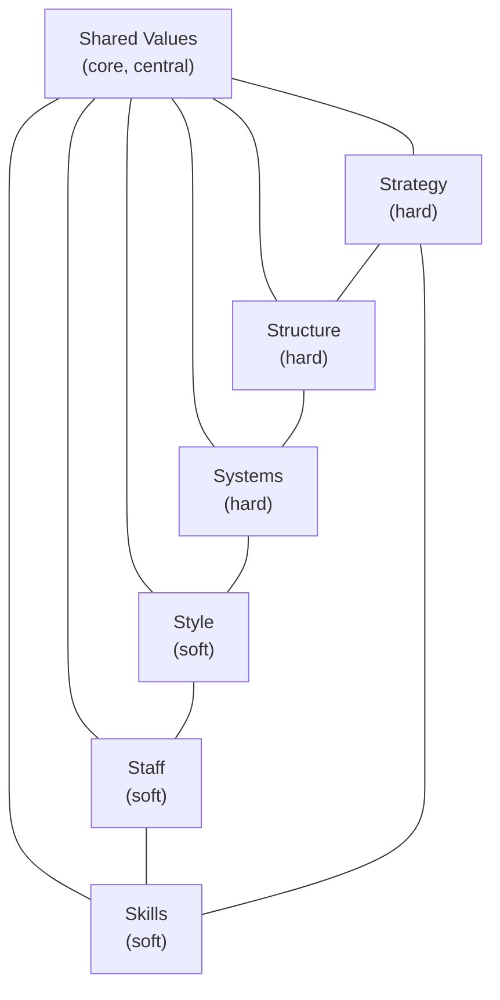
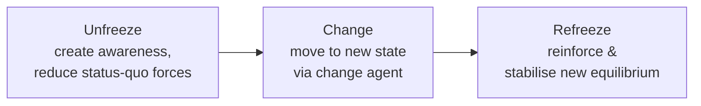

# Q&A — SM — Strategy Implementation & Evaluation

> ICAI CA Intermediate, Strategic Management. Covers strategy execution, the strategy-execution gap, structure–strategy linkage (Chandler), leadership & culture, McKinsey 7S, strategic vs operational control, types of strategic control, and the Balanced Scorecard. Every question is followed immediately by a complete model answer.

---

## Section A — Concept-Check Questions (with answers)

**A1. What is "strategy implementation"?**
Strategy implementation is the sum total of activities and choices required to put a formulated strategy into action. It converts strategic plans into deployment of resources, structures, systems, budgets, procedures, people and leadership so that the intended strategy is actually executed. Formulation is positioning forces before action; implementation is managing forces during action.

**A2. Distinguish strategy formulation from strategy implementation.**
Formulation precedes implementation; it is an intellectual, analytical, entrepreneurial process needing good judgement, done by a few strategists. Implementation follows; it is an operational, administrative process needing motivation and leadership skills, requiring coordination among many people. Formulation focuses on effectiveness (doing the right things); implementation focuses on efficiency (doing things right).

**A3. What is the "strategy-execution gap"?**
It is the difference between what a firm plans (formulated strategy) and what it actually achieves (realised strategy). Even excellent strategies fail if execution is weak. Causes include poor communication, misaligned structure, weak leadership, resistant culture, inadequate resource allocation, and absence of control systems. "Strategy implementation is more difficult than formulation."

**A4. State Chandler's thesis on structure and strategy.**
Alfred Chandler concluded that "structure follows strategy" — changes in a firm's strategy lead to changes in its organisational structure. A new strategy creates new administrative problems; unless structure is realigned to the new strategy, the strategy will not be executed efficiently and performance declines.

**A5. Name the three elements needed to translate strategy into action.**
(i) Institutionalising the strategy — building it into the organisation through leadership, structure and culture; (ii) Operationalising the strategy — through plans, programmes, budgets and procedures; (iii) Reviewing and controlling — monitoring performance against strategy.

**A6. What are Lewin's three stages of managing change?**
(i) Unfreezing the situation — reducing forces that maintain status quo and creating awareness of the need for change; (ii) Changing to a new state — moving through altered behaviour, structure and systems, often via a change agent; (iii) Refreezing — reinforcing and stabilising the new equilibrium so change becomes permanent.

**A7. List the seven elements of the McKinsey 7S framework.**
Strategy, Structure, Systems (the three "hard" S's) and Style, Staff, Skills, Shared Values (the four "soft" S's). Shared Values sit at the centre and link all others.

**A8. Differentiate the "hard" and "soft" S's in 7S.**
Hard S's — Strategy, Structure, Systems — are tangible, easier to identify and directly influenced by management. Soft S's — Style, Staff, Skills, Shared Values — are intangible, culture-driven, harder to change but equally critical for effectiveness. All seven must be aligned.

**A9. Define strategic control and name its two broad focuses.**
Strategic control is the process of monitoring and correcting the strategy and its implementation to ensure the firm stays on course. It focuses on (i) whether the strategy is being implemented as planned (operational focus) and (ii) whether the underlying assumptions and direction remain valid (strategic focus).

**A10. Name the four types of strategic control.**
Premise control, Implementation control, Strategic surveillance, and Special alert control.

**A11. What is the Balanced Scorecard and who developed it?**
Developed by Robert Kaplan and David Norton, the Balanced Scorecard is a performance-measurement and strategic-management tool that supplements traditional financial measures with three additional perspectives, giving a "balanced" view of performance and linking measures to strategy.

**A12. What is operational control and how does it differ from strategic control?**
Operational control monitors performance at the operational/action level over the short term, keeping current operations on track (e.g., budgets, schedules). Strategic control is broader and longer-term, questioning whether the strategy itself is correct and being executed, and it tolerates ambiguity and external focus.

---

## Section B — Applied Scenario & Framework-Application Questions (with model answers)

**B1. A firm shifts from a single-product domestic strategy to a diversified multi-product multinational strategy but keeps its old centralised functional structure. Performance falls. Diagnose using Chandler.**
Per Chandler ("structure follows strategy"), the new diversification strategy creates new administrative problems — coordination across products and geographies — that a centralised functional structure cannot handle. The mismatch causes inefficiency and control loss. Remedy: realign to a divisional / SBU (product- or geography-based) structure with decentralised decision-making, so structure supports the executed strategy. Structural inertia is a classic cause of the strategy-execution gap.

**B2. Employees resist a new ERP-driven process change. Apply Lewin's model to manage it.**
Unfreeze: communicate why change is needed (competitive pressure, obsolete systems), address anxieties, involve employees, and weaken forces supporting the old way. Change: introduce the new ERP through a change agent, provide training, pilot runs, and support; alter roles and workflows. Refreeze: institutionalise the new system via revised SOPs, rewards for adoption, and reinforcement so employees do not slip back to old habits. This turns a one-off change into a stable new normal.

**B3. Two merging companies have very different cultures causing friction. How do culture and leadership drive implementation?**
Culture — the shared values, beliefs and norms — determines whether people accept or resist the strategy; a strategy-supportive culture eases execution, a hostile one blocks it. Leadership must bridge the gap by articulating a shared vision, modelling desired behaviour, communicating relentlessly, and using symbolic and substantive actions to build a unified culture. Strategic leadership + strategy-culture fit are essential to close the execution gap in a post-merger integration.

**B4. A CEO wants a holistic check that "everything fits" before a major turnaround. Apply McKinsey 7S.**
Test alignment of all seven elements: Strategy (the turnaround plan), Structure (does the org chart support it?), Systems (are processes/IT adequate?), Style (is leadership style suitable?), Staff (right people/numbers?), Skills (do capabilities exist?), and Shared Values (do core beliefs support the new direction?). Any misaligned S undermines the others; the model shows the turnaround succeeds only when all seven are mutually reinforcing, especially the soft S's around Shared Values.

**B5. An airline's core assumption was cheap fuel; oil prices triple. Which strategic control applies and why?**
Premise control — it checks whether the assumptions (premises) on which the strategy was built remain valid. The cheap-fuel premise has broken, so the strategy must be re-examined and possibly revised (hedging, fare changes, fleet efficiency). If the shock were sudden and dramatic (e.g., a geopolitical embargo), special alert control would trigger an immediate rethink through crisis reassessment.

**B6. Management wants to measure performance beyond profit, capturing customers, processes and learning. Recommend and outline a framework.**
Recommend the Balanced Scorecard. Set objectives, measures, targets and initiatives under four perspectives: (i) Financial — profitability, ROI, revenue growth; (ii) Customer — satisfaction, retention, market share; (iii) Internal Business Process — quality, cycle time, efficiency; (iv) Learning & Growth — employee skills, innovation, information systems. Linking non-financial leading indicators to financial lagging results gives a balanced, strategy-aligned performance picture.

**B7. A tech firm faces continuous, unpredictable industry shifts and wants broad environmental scanning not tied to any one assumption. Which control type?**
Strategic surveillance — a broad, unfocused, general monitoring of a wide range of events inside and outside the firm that could threaten the strategy. Unlike premise or implementation control (both narrowly targeted), surveillance is loose and open-ended, well-suited to volatile environments where threats can arise from unexpected directions.

---

## Section C — Past-Paper-Style Descriptive Questions (with model answers)

**C1. "Strategy implementation is more difficult than strategy formulation." Discuss. (5 marks)**
Formulation is an analytical, entrepreneurial exercise done by a small strategist group deciding the right direction. Implementation is administrative — it demands mobilising the whole organisation, its structure, systems, resources, people, leadership and culture to act in concert, over a sustained period. Difficulties arise from: coordinating many people; overcoming resistance to change; aligning structure to strategy; building a supportive culture; allocating resources; and installing control systems. Because it depends on motivation, execution discipline and behavioural change rather than pure analysis, implementation is generally harder and is where most good strategies fail — the strategy-execution gap.

**C2. Explain the McKinsey 7S framework and its significance in strategy implementation. (6 marks)**
The 7S framework, by Waterman, Peters and Phillips of McKinsey, holds that organisational effectiveness requires alignment of seven interconnected elements. Hard S's: Strategy (plan to build competitive advantage), Structure (how the organisation is arranged and who reports to whom), Systems (procedures and processes governing daily work). Soft S's: Style (leadership and management approach), Staff (people and their development), Skills (distinctive competencies of the firm), Shared Values (core beliefs at the centre linking all others). Significance: it stresses that changing strategy alone is insufficient; all seven must fit together, and the soft, culture-related S's are as decisive as the hard ones. It is a diagnostic tool to spot misalignments that cause implementation failure.

**C3. Describe the four types of strategic control. (6 marks)**
(i) Premise control — systematically checks whether the assumptions (environmental and industry premises) underlying the strategy still hold; if a key premise fails, the strategy is revised. (ii) Implementation control — assesses whether the strategy should be changed in light of unfolding results as it is implemented, through monitoring strategic thrusts and milestone reviews. (iii) Strategic surveillance — broad, unfocused monitoring of a wide range of internal and external events likely to affect the strategy. (iv) Special alert control — the rapid, thorough reconsideration of strategy triggered by a sudden, unexpected event (crisis, acquisition, disaster), usually through a crisis team. Together they keep both the strategy and its execution under continuous review.

**C4. What is the strategy-execution gap and how can leadership and culture help close it? (5 marks)**
The strategy-execution gap is the shortfall between planned and realised strategy — a well-formulated strategy delivering poor results because of weak implementation. Leadership closes it by setting direction, communicating a clear vision, allocating resources, motivating people, driving change and modelling desired behaviour (strategic leadership). Culture closes it when shared values and norms support the strategy; a strategy-culture fit generates commitment, while a mismatch breeds resistance. Managers can strengthen fit by aligning symbols, rewards, structures and stories with the strategy. Effective leadership plus a supportive culture translate intent into action and bridge the gap.

**C5. Explain the Balanced Scorecard and its four perspectives. (6 marks)**
Kaplan and Norton's Balanced Scorecard translates an organisation's mission and strategy into a comprehensive set of performance measures across four balanced perspectives. Financial: "To succeed financially, how should we appear to shareholders?" — profitability, revenue growth, ROI. Customer: "To achieve our vision, how should we appear to customers?" — satisfaction, retention, market share. Internal Business Process: "To satisfy shareholders and customers, what processes must we excel at?" — quality, efficiency, cycle time. Learning & Growth: "To achieve our vision, how will we sustain our ability to change and improve?" — employee skills, innovation, systems. By combining financial (lagging) and non-financial (leading) indicators and linking them to strategy, it prevents over-reliance on short-term financial results and provides a balanced view.

**C6. Discuss Chandler's "structure follows strategy" and its implication for implementation. (5 marks)**
Alfred Chandler's study of large US corporations found a common sequence: a new strategy is chosen → new administrative problems emerge → economic performance declines → a new, appropriate structure is devised → profit returns. His conclusion, "structure follows strategy," means the organisational structure must be designed to fit the chosen strategy. Implication for implementation: firms adopting growth or diversification strategies must redesign structure (e.g., from functional to divisional/SBU) so that authority, coordination and control match strategic demands. Retaining an outdated structure creates inefficiency and is a leading cause of implementation failure.

---

## Section D — MCQs / Case Scenarios (correct option + one-line reasoning)

**D1.** "Structure follows strategy" is attributed to:
(a) Kaplan & Norton (b) Alfred Chandler (c) Kurt Lewin (d) Michael Porter
**Answer: (b) Alfred Chandler** — his research established that structural change follows strategic change.

**D2.** In Lewin's model, reinforcing the new behaviour so it becomes permanent is:
(a) Unfreezing (b) Changing (c) Refreezing (d) Surveillance
**Answer: (c) Refreezing** — it stabilises and institutionalises the new equilibrium.

**D3.** Which is NOT one of the "soft" S's in McKinsey 7S?
(a) Style (b) Staff (c) Systems (d) Shared Values
**Answer: (c) Systems** — Systems is a "hard" S (with Strategy and Structure).

**D4.** Checking whether the assumptions underlying a strategy still hold is:
(a) Implementation control (b) Premise control (c) Strategic surveillance (d) Special alert control
**Answer: (b) Premise control** — it monitors the validity of strategic premises.

**D5.** A sudden terrorist attack forcing an immediate strategy rethink triggers:
(a) Premise control (b) Special alert control (c) Operational control (d) Strategic surveillance
**Answer: (b) Special alert control** — it responds to sudden, unexpected events via rapid reassessment.

**D6.** The Balanced Scorecard was developed by:
(a) Peters & Waterman (b) Chandler (c) Kaplan & Norton (d) Ansoff
**Answer: (c) Kaplan & Norton** — they introduced it in the early 1990s.

**D7.** Which perspective of the Balanced Scorecard covers employee skills and innovation?
(a) Financial (b) Customer (c) Internal Process (d) Learning & Growth
**Answer: (d) Learning & Growth** — it addresses the capacity to change and improve.

**D8.** Broad, unfocused monitoring of a wide range of events that may affect the strategy is:
(a) Premise control (b) Strategic surveillance (c) Implementation control (d) Budgetary control
**Answer: (b) Strategic surveillance** — deliberately general and open-ended.

**D9.** Strategy formulation emphasises _____ while implementation emphasises _____.
(a) efficiency; effectiveness (b) effectiveness; efficiency (c) control; planning (d) both effectiveness
**Answer: (b) effectiveness; efficiency** — formulate the right things, implement them right.

**D10.** Operational control differs from strategic control mainly in that it is:
(a) long-term and external (b) short-term and focused on current operations (c) unfocused (d) assumption-based
**Answer: (b) short-term and focused on current operations** — strategic control is broader and longer-term.

**D11. Case:** A retail chain's strategy assumed steady 8% consumer-income growth. A recession cuts incomes sharply, and management convenes to reassess the strategy's foundation. This is an example of:
(a) Refreezing (b) Premise control (c) Learning perspective (d) Divisional restructuring
**Answer: (b) Premise control** — the income-growth premise has failed, prompting reassessment.

**D12. Case:** After adopting a global diversification strategy, ABC Ltd keeps its centralised functional structure and struggles to coordinate. The root cause per Chandler is:
(a) weak scorecard (b) structure not realigned to the new strategy (c) refreezing too early (d) premise control failure
**Answer: (b) structure not realigned to the new strategy** — structure must follow strategy.

---

## Mermaid Diagram — McKinsey 7S Framework

## Mermaid Diagram — Lewin's Change Process

---

## One-Line Revision Hooks
- Formulation = effectiveness; Implementation = efficiency; implementation is harder.
- Chandler: **Structure follows Strategy.**
- Lewin: **Unfreeze → Change → Refreeze.**
- 7S: Hard (Strategy, Structure, Systems) + Soft (Style, Staff, Skills, Shared Values); Shared Values at centre.
- Four strategic controls: **Premise, Implementation, Surveillance, Special Alert.**
- Balanced Scorecard (Kaplan–Norton): **Financial, Customer, Internal Process, Learning & Growth.**
- Strategy-execution gap is bridged by leadership + supportive culture + aligned structure/systems.
