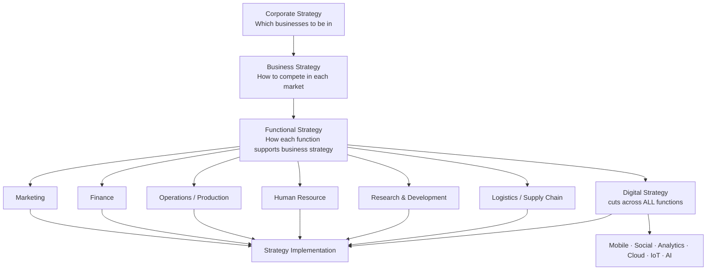

# Q&A — SM — Functional & Digital Strategy

> CA Intermediate | Paper 6 — Financial Management & Strategic Management (SM part)
> Chapter: Functional-Level Strategy (Marketing, Finance, Operations, HR, R&D, Logistics/SCM) & Digital Strategy
> Frameworks per ICAI SM study material.

---

## How the strategy hierarchy fits together

Functional strategy is the **third and lowest tier** of the strategy pyramid: it converts business-level intent into action within each department, is **shorter in horizon**, **more specific/measurable**, and provides the **feedback** that keeps higher strategies grounded.

---

## Section A — Concept-Check (short answer + answers)

**A1. What is a functional strategy and why is it needed?**
A functional strategy is the **short-term, function-specific game plan** for a key activity (marketing, finance, operations, HR, R&D, logistics) that translates broad business strategy into concrete departmental action. It is needed because: (i) it gives **direction and support** to the business strategy; (ii) it forces **coordination and consistency** across functions; (iii) it defines the **activities and tasks** to be done at the operating level; and (iv) it creates an environment for **efficient day-to-day management**.

**A2. State the three levels of strategy and who owns functional strategy.**
The three levels are **Corporate** (top management — scope/portfolio), **Business** (SBU heads — competitive positioning), and **Functional** (functional/departmental managers — resource productivity). Functional strategy is owned by **functional managers** but must be **approved by the SBU/business head** to ensure alignment.

**A3. Name the four elements of the marketing mix (4 Ps) and the extended service Ps.**
The 4 Ps are **Product, Price, Place (distribution), Promotion**. For services these are extended to **7 Ps** by adding **People, Process, and Physical evidence**. Marketing strategy also rests on **STP — Segmentation, Targeting, Positioning** before the mix is designed.

**A4. What does financial strategy deal with?**
Financial strategy is concerned with (i) **acquisition of capital / sources of funds**, (ii) **capital budgeting** (which investments to make), (iii) **dividend and working-capital decisions**, and (iv) **management of the capital structure, cash flow and financial risk** — all so the firm has the funds to execute its business strategy.

**A5. Distinguish logistics management from supply chain management (SCM).**
**Logistics** is an activity *within* the firm — managing the **flow and storage of goods, services and information** from point of origin to point of consumption (inbound + outbound). **SCM** is broader: it is the **integration of all key business processes across the entire network** of suppliers, manufacturers, distributors and customers. Logistics is a **subset** of SCM; SCM coordinates *multiple* organisations, logistics coordinates flows.

**A6. What is a digital strategy?**
A digital strategy is a plan that uses **digital technologies (mobile, social, analytics, cloud, IoT, AI)** to improve business performance — either by **creating new differentiated offerings** or by **transforming processes** for efficiency. It specifies *how* the organisation will apply technology to compete, serve customers and operate, and it **cuts across every function** rather than sitting in one.

**A7. List the components/tools of digital marketing.**
**Search Engine Optimisation (SEO), Search Engine Marketing / Pay-Per-Click (SEM/PPC), Social Media Marketing, Content Marketing, Email Marketing, Mobile Marketing, and Affiliate/Influencer Marketing.**

**A8. What is the difference between e-commerce and e-business?**
**E-commerce** is narrowly the **buying and selling of goods/services online** (the transaction). **E-business** is broader — using digital technology for **all** internal and external business processes (procurement, CRM, supply chain, collaboration), of which e-commerce is one part.

---

## Section B — Applied Scenario & Framework-Application Questions

**B1. Aligning functional strategies to a low-cost business strategy.**
*Scenario:* "ValuMart" pursues a **cost-leadership** business strategy in retail groceries. Draft the thrust of each functional strategy so all functions reinforce the chosen positioning.

**Model Answer:**
Every function must be tuned to *drive cost down while protecting acceptable quality*:
- **Marketing:** low-price positioning, high-volume promotions, private-label products, minimal advertising spend; place = high-footfall no-frills stores.
- **Finance:** tight working-capital control, low-cost sources of funds, strict capital rationing, high asset turnover targets.
- **Operations:** standardised layouts, economies of scale, high capacity utilisation, lean processes, waste minimisation.
- **HR:** productivity-linked pay, multi-skilling, lean staffing, low overhead structure.
- **Logistics/SCM:** centralised warehousing, backhauling, vendor consolidation, just-in-time replenishment to cut inventory cost.
- **R&D:** process innovation (not costly product innovation) to keep lowering unit cost.
The key SM point: **functional strategies must be internally consistent with each other and with the business strategy** — a single function pulling toward differentiation would raise cost and destroy the advantage.

**B2. Marketing strategy using STP + 4 Ps.**
*Scenario:* A dairy firm launches a premium probiotic yoghurt aimed at health-conscious urban millennials. Build its marketing strategy.

**Model Answer:**
1. **Segmentation** — split the market by demographics (age 25-40, urban), psychographics (health-conscious) and behaviour (regular yoghurt buyers).
2. **Targeting** — select the *urban health-conscious millennial* segment (concentrated/niche targeting).
3. **Positioning** — position as a *scientifically-backed gut-health premium yoghurt*.
4. **Marketing mix (4 Ps):**
 - *Product:* probiotic yoghurt, premium packaging, clear health claims.
 - *Price:* premium/skimming price consistent with the quality signal.
 - *Place:* modern trade, health stores, quick-commerce apps.
 - *Promotion:* digital-first — influencer and content marketing, social media, targeted ads.
STP precedes the mix; the mix must be **coherent with the positioning** (a premium product cannot carry a discount price without eroding the position).

**B3. Building a digital strategy — framework application.**
*Scenario:* A traditional 30-store apparel retailer is losing sales to online rivals and wants to "go digital." Outline the steps/components of a sound digital strategy.

**Model Answer:**
A digital strategy should be built, not bolted on:
1. **Assess the current digital maturity** and customer expectations.
2. **Define digital objectives** aligned to business strategy (e.g., omni-channel reach, higher conversion).
3. **Choose the technology levers** — the ICAI digital building blocks: **Mobile** (app), **Social media** (engagement), **Big Data & Analytics** (personalisation, demand sensing), **Cloud** (scalable IT), **IoT** (smart inventory/RFID), **AI** (recommendations, chatbots).
4. **Redesign the customer journey** — website + app + click-and-collect linking the 30 stores (omni-channel).
5. **Adopt digital marketing** — SEO, PPC, social, email, content.
6. **Rework operations & SCM** for online fulfilment.
7. **Build capabilities & culture**, then **measure with analytics** and iterate.
Key SM insight: digital strategy is **cross-functional** and must **enable the business strategy**, not exist as a stand-alone IT project.

**B4. SCM vs logistics decision.**
*Scenario:* An FMCG firm faces frequent stock-outs at retailers despite full warehouses. Is this a logistics problem or an SCM problem, and what should it do?

**Model Answer:**
It is primarily an **SCM (integration) problem**, not just internal logistics. Warehouses are full (logistics/storage is fine) but demand information is not flowing across the chain, so the right SKUs are not reaching the right retailers. The firm should: (i) **integrate demand and supply information** across suppliers–plant–distributors–retailers; (ii) use **analytics for demand forecasting**; (iii) enable **collaborative planning and replenishment (CPFR)**; and (iv) tighten **last-mile logistics**. This shows the exam distinction: **logistics = flow/storage within the firm; SCM = end-to-end integration across partners.**

---

## Section C — Past-Paper-Style Descriptive Questions

**C1. "Functional strategies are the connecting link between overall strategy and its implementation." Explain the importance of functional strategies. (5 marks)**

**Model Answer:**
Functional strategies operationalise the higher strategy; their importance lies in:
1. **Operationalising strategy** — they translate abstract business strategy into concrete tasks that departments can actually execute.
2. **Consistency and coordination** — by tying each function's plan to the same business objective, they ensure the functions **pull in one direction** and avoid working at cross-purposes.
3. **Resource allocation and productivity** — they guide how money, people and machines are deployed **efficiently** within each function.
4. **Direction and control basis** — they set functional targets and standards, giving a **benchmark for performance evaluation** and control.
5. **Bottom-up feedback** — functional experience feeds information upward, helping refine business and corporate strategy.
Thus functional strategy is the **bridge** between formulation and implementation — without it, strategy stays on paper.

**C2. Explain the key functional strategies an organisation should develop while implementing its business strategy. (6 marks)**

**Model Answer:**
The principal functional strategies are:
- **Marketing strategy** — decides the target market and the marketing mix (Product, Price, Place, Promotion; STP), i.e., *how the firm will reach and satisfy customers*.
- **Financial strategy** — deals with sourcing funds, capital structure, investment (capital budgeting), dividend, and working-capital and risk management, i.e., *how the strategy will be financed*.
- **Operations / Production strategy** — covers capacity, location, layout, technology, quality and process design, i.e., *how goods/services are produced efficiently*.
- **Human Resource strategy** — planning, recruitment, training, motivation, appraisal and retention, i.e., *building the people capability to execute*.
- **Research & Development strategy** — product and process innovation and the choice between being a technology **leader or follower**.
- **Logistics / Supply-Chain strategy** — managing flow of goods, storage and integration across the supply network.
Each must be **mutually consistent** and aligned to the business strategy.

**C3. Discuss the role of digital technologies (the digital transformation building blocks) in modern strategy. (5 marks)**

**Model Answer:**
Digital technologies reshape how firms create and deliver value. The main building blocks per ICAI are:
1. **Mobile** — always-on access to customers; m-commerce and mobile-first services.
2. **Social Media** — two-way engagement, brand building, feedback and viral reach.
3. **Big Data & Analytics** — converts data into insight for personalisation, forecasting and better decisions.
4. **Cloud Computing** — scalable, low-cost, on-demand IT infrastructure enabling agility.
5. **Internet of Things (IoT)** — connected devices generating real-time operational data (smart inventory, predictive maintenance).
6. **Artificial Intelligence (AI)** — automation, recommendation engines, chatbots and smarter decision support.
Strategically these let firms **differentiate** (new digital offerings), **cut cost** (process automation) and **reach markets** faster. Because they cut across every function, digital strategy must be **owned at the business level**, not left to IT.

---

## Section D — MCQs / Case Scenarios

**D1.** Functional strategy is primarily concerned with:
 (a) Which businesses to enter (b) Competitive positioning of an SBU (c) Maximising resource productivity within a function (d) Deciding the corporate vision
**Answer: (c)** — Functional strategy operates at department level to make resource use efficient; (a)/(d) are corporate and (b) is business level.

**D2.** The extended marketing mix for services adds which three elements to the 4 Ps?
 (a) People, Process, Physical evidence (b) Place, Promotion, Price (c) Planning, People, Profit (d) Product, Process, People
**Answer: (a)** — Services add People, Process and Physical evidence to make the 7 Ps.

**D3.** Logistics management is best described as:
 (a) Integration of all firms in a network (b) Managing flow and storage of goods/information within the firm (c) Only outbound transport (d) The same thing as SCM
**Answer: (b)** — Logistics = flow + storage of goods, services and information; it is a **subset** of SCM.

**D4.** "Non-technical, cheap, scalable, pay-as-you-use IT infrastructure available over the internet" describes:
 (a) IoT (b) Big Data (c) Cloud Computing (d) Blockchain
**Answer: (c)** — Cloud computing provides on-demand, scalable, pay-per-use computing resources.

**D5.** SEO, PPC, content and email marketing are components of:
 (a) Financial strategy (b) Digital/Online marketing (c) Production strategy (d) HR strategy
**Answer: (b)** — These are the standard tools of digital (online) marketing.

**D6. Case scenario.** A pharma company decides to be a **technology follower** rather than a leader, letting rivals bear early R&D risk and then imitating proven products at lower cost. This is a choice within which functional strategy?
 (a) Marketing (b) Research & Development (c) Finance (d) Logistics
**Answer: (b)** — Leader-vs-follower is a core **R&D strategy** decision on technology positioning.

**D7. Case scenario.** An omni-channel retailer uses purchase-history data to recommend products and forecast demand store-by-store. The digital building block chiefly at work is:
 (a) Social Media (b) Big Data & Analytics (c) Mobile (d) IoT
**Answer: (b)** — Turning historical data into recommendations and forecasts is Big Data & Analytics.

**D8.** Which statement is correct about the strategy hierarchy?
 (a) Functional strategy has the longest time horizon (b) Functional strategy is broader than corporate strategy (c) Functional strategy is more specific and shorter-term than business strategy (d) Functional strategy is set by the board only
**Answer: (c)** — Functional strategy is the most specific, measurable and shortest-horizon tier.

---

## Section E — Traps & Examiner Tricks (quick revision)

- **Level confusion:** "which businesses to be in" = corporate; "how to compete" = business; "how each function supports" = functional. Examiners test which level a decision belongs to.
- **Logistics ≠ SCM.** Logistics is *within* the firm (flow + storage); SCM is *integration across the whole network*. Logistics is a subset.
- **4 Ps vs 7 Ps.** Add People, Process, Physical evidence **only for services**.
- **STP comes before the mix.** Segmentation → Targeting → Positioning, *then* the 4 Ps.
- **E-commerce ≠ e-business.** E-commerce = the online transaction; e-business = all digital business processes.
- **Digital strategy is cross-functional**, not an IT-department project — it must enable the business strategy.
- **Consistency rule:** all functional strategies must align with each other and with the business strategy; one misaligned function destroys the advantage.
- **R&D leader vs follower** is a strategic choice, not merely a budget decision.

---

### First-principles recap
Corporate strategy sets *where* to play, business strategy sets *how to win*, and **functional strategy makes winning happen day-to-day** by turning intent into coordinated departmental action. **Digital strategy** is the modern layer that runs *through* every function, using mobile, social, analytics, cloud, IoT and AI to differentiate, cut cost and reach markets — but only when it is anchored to the business strategy it serves.
