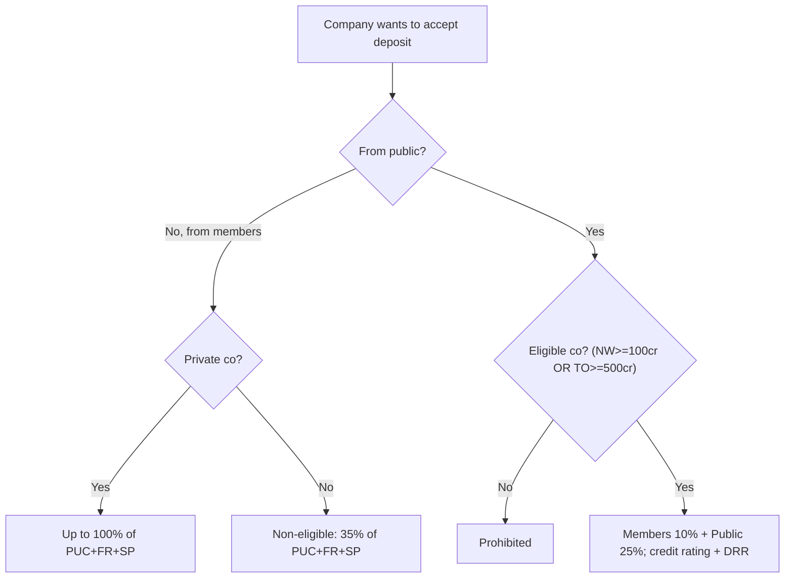
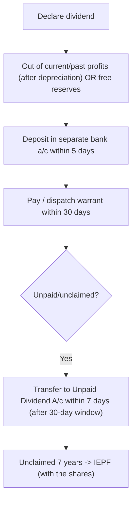
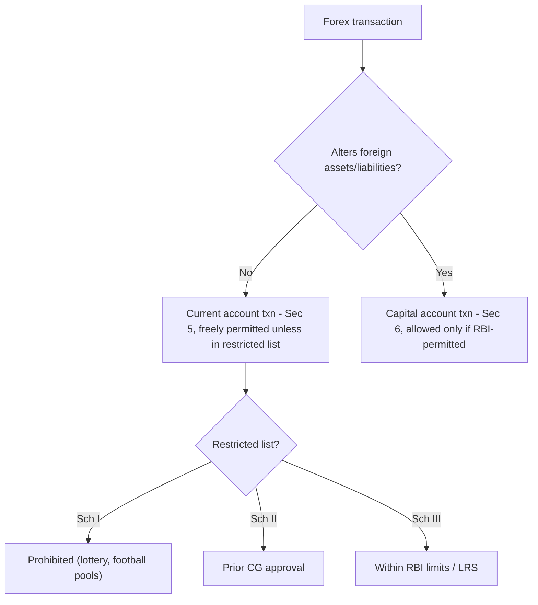

# Corporate & Other Laws — Quick-Revision Cheat-Sheet

> Last-mile scan sheet (CA Inter, Companies Act 2013 unless noted). **Verify any AY-specific / monetary tax-linked thresholds against current ICAI study material** — some limits shift with amendments/notifications. "days" = calendar days unless "clear days" stated.

---

## 1. Preliminary & Incorporation (Ch. I–II)

| Item | Sec | Key point / limit |
|---|---|---|
| Small company | 2(85) | Paid-up ≤ ₹4 cr **and** turnover ≤ ₹40 cr (not public/holding/subsidiary/Sec 8/governed by special Act) |
| OPC | 2(62), 3 | 1 member + 1 nominee; only natural resident person |
| Members min | 3 | Public 7, Private 2, OPC 1 |
| Members max | 2(68) | Private **200** (excl. present/past employee-members) |
| Reservation of name | 4 | Valid **20 days** from approval (new co.) / 60 days (change) |
| Registered office | 12 | Have RO **within 30 days** of incorporation; verify (INC-22) within 30 days; change intimated 30 days |
| Commencement of business | 10A | Declaration (INC-20A) within **180 days**; subscribers pay + verify RO — else struck off |
| Effect of registration | 9 | Body corporate, perpetual succession, common seal (optional), can hold property |
| Sec 8 (charitable) | 8 | Licence; profits applied to objects, no dividend; alteration needs CG |

**Lifting corporate veil** — fraud, enemy character, tax evasion, sham. **Doctrine of ultra vires** (Ashbury) — void, not ratifiable.

---

## 2. Prospectus & Allotment (Ch. III)

| Item | Sec | Point |
|---|---|---|
| Public offer / prospectus | 23,26 | Contents u/s 26; registered with ROC before issue |
| Misstatement | 34/35 | Civil (35) + criminal (34) liability; 447 fraud |
| Private placement | 42 | Offer to ≤ **200** persons/FY (per kind of security, excl QIB & ESOP); allot **within 60 days** of money receipt else refund in 15 days (else 12% interest); no public advt |
| Return of allotment | 39 | File **within 30 days** (PAS-3) |
| Min subscription | 39 | If not received, refund within period; allotment void |
| Global depository receipts | 41 | By special resolution |

---

## 3. Share Capital & Debentures (Ch. IV)

| Item | Sec | Limit / time |
|---|---|---|
| Certificate issue | 56 | Allotment **2 months**; transfer **1 month**; debentures **6 months** |
| Transfer instrument | 56 | Lodge SH-4 **within 60 days** of execution |
| Further issue / Rights | 62 | Offer letter open **15–30 days**; renounceable |
| ESOP / preferential | 62 | Special resolution |
| Variation of class rights | 48 | Consent ¾ of class / special res.; dissent 10% → Tribunal in 21 days |
| Reduction of capital | 66 | Special res + **Tribunal** confirmation |
| Buy-back | 68 | ≤ **25%** paid-up + free reserves; debt-equity ≤ 2:1; **cooling 1 yr**; ≤10% by board res., >10% special res. |
| Bonus shares | 63 | Out of free reserves/SP/CRR; not in lieu of dividend; can't reissue forfeited |
| Sweat equity | 54 | special res.; **no 1-yr wait** (that condition omitted w.e.f. 7 May 2018) |
| Prohibition on preference share | 55 | Redeemable ≤ **20 yrs** (infra 30 yrs) |
| Debenture Redemption Reserve | 71 | Out of profits; no voting rights on debentures |

Capital: **Nominal / Issued / Subscribed / Called-up / Paid-up**. CRR (Sec 69) on buy-back = nominal value bought back.

---

## 4. Deposits (Ch. V, Sec 73–76)

- **Eligible company**: net worth ≥ ₹100 cr **or** turnover ≥ ₹500 cr + special res + SEBI/RBI compliance.
- **Deposit Repayment Reserve**: deposit **20%** of deposits maturing next FY into scheduled bank, **on/before 30 April**.
- **Deposit Repayment Reserve is NOT to be used** for any purpose other than repayment.

| Depositor type | Limit (% of paid-up + free reserves + securities premium) |
|---|---|
| Non-eligible co. — from members | ≤ **35%** |
| Eligible co. — from members | ≤ **10%** |
| Eligible co. — from public | ≤ **25%** |
| Private co. — from members | up to **100%** (certain start-ups/conditions: no limit) |

Tenure: **6 months to 36 months** (short-term for liquidity ≤10% may be ≥3 months). Not secured by company's own shares.

---

## 5. Registration of Charges (Ch. VI, Sec 77–87)

| Item | Sec | Time limit |
|---|---|---|
| Register charge (created **on/after 02.11.2018**) | 77 | **30 days**; Registrar may allow **+60 days** (add'l fee); further **+60 days** (ad valorem) |
| Created **before 02.11.2018** | 77 | 30 days; condonation up to **300 days** then 6 months of Amdt Act |
| Satisfaction of charge | 82 | Intimate **within 30 days** (Registrar may condone 300 days) |
| Register of charges (with co.) | 85 | CHG-7, permanent |
| Effect of non-registration | 77 | Charge void against liquidator/creditors; money still repayable |

---

## 6. Management & Administration (Ch. VII)

| Item | Sec | Limit / time |
|---|---|---|
| Annual Return | 92 | MGT-7; file **within 60 days** of AGM |
| AGM — first | 96 | Within **9 months** of close of 1st FY |
| AGM — subsequent | 96 | Within **6 months** of FY close; gap ≤ **15 months**; business hrs 9–6, not national holiday, at RO/city |
| EGM | 100 | By Board; on requisition (members holding ≥10% paid-up voting) |
| Notice of meeting | 101 | **21 clear days** (shorter with 95% consent) |
| Quorum | 103 | Public: 5 (≤1000 members), 15, 30; Private: 2 |
| Proxy | 105 | Deposit **48 hrs** before; proxy no speaking, votes only on poll; 1 person ≤ 50 members/5% |
| Resolutions filed | 117 | MGT-14 **within 30 days** |
| Minutes | 118 | Prepare/sign **within 30 days** |
| Beneficial interest declaration | 89 | Within **30 days** |
| Significant Beneficial Owner | 90 | SBO ≥ 10%; BEN-1 to co. within 30 days |
| Register of members | 88 | Maintain from date of registration |

**Special resolution** = ≥ **¾** votes. **Ordinary** = > 50%. Postal ballot (110) for items notified.

---

## 7. Dividend (Ch. VIII, Sec 123–127)

| Item | Sec | Point |
|---|---|---|
| Interim dividend | 123(3) | By Board; from surplus/current-yr profit |
| Rate cap on reserves | 123 (Rules) | Draw from reserves ≤ avg of last 3 yrs' rates (loss year rule) |
| No dividend | 123 | If default in deposits repayment (subsists) |
| Unpaid Dividend A/c | 124 | Non-payment interest **18% p.a.** |
| IEPF | 125 | Unclaimed 7 consecutive years → shares + dividend to IEPF |

---

## 8. Accounts (Ch. IX) & Audit (Ch. X)

| Item | Sec | Point / time |
|---|---|---|
| Books of account | 128 | At RO; preserve **8 years**; can keep electronic |
| Financial statements | 129 | True & fair; Sch III; consolidated if subsidiary |
| Filing of FS | 137 | File **within 30 days** of AGM (AOC-4); if no AGM, within 30 days of due date |
| Board's Report | 134 | Directors' Responsibility Statement |
| CSR | 135 | NW ≥ ₹500 cr **or** TO ≥ ₹1000 cr **or** net profit ≥ ₹5 cr → spend **2%** of avg net profit (3 yrs); unspent transfer rules |
| Internal audit | 138 | Prescribed classes |
| First auditor | 139(6) | By **Board within 30 days**; else members in EGM within **90 days** |
| Subsequent auditor | 139 | AGM appoints for **5 yrs**; ratification removed |
| Rotation | 139(2) | Listed + prescribed: individual **1 term (5 yrs)**, firm **2 terms (10 yrs)**; cooling **5 yrs** |
| Removal of auditor | 140 | Special res + **CG (CLB) prior approval**; resignation ADT-3 within 30 days |
| Auditor's powers/duties | 143 | Access to books; report on fraud (≥₹1 cr → CG within prescribed) |
| Non-audit services barred | 144 | Accounting, internal audit, actuarial, investment banking, mgmt services etc. |
| Auditor eligibility | 141 | Disqualifications: business interest, indebtedness > ₹5 lakh, relative holds security > ₹1 lakh |
| Cost audit | 148 | CG may direct |

**CARO / fraud reporting** — auditor duty; penalties u/s 147.

---

## 9. Directors & Board (context — key numbers)

| Item | Sec | Limit |
|---|---|---|
| Min/Max directors | 149 | Public 3, Private 2, OPC 1; max **15** (more by special res.) |
| Resident director | 149(3) | ≥1 stayed **≥182 days** in India |
| Woman director | 149(1) | Listed + prescribed public cos |
| First Board meeting | 173 | **Within 30 days** of incorporation |
| Board meetings | 173 | Min **4/year**; gap ≤ **120 days** (OPC/small/dormant: 1 each half-year, gap ≥ 90 days) |
| Retire by rotation | 152 | Public: ≥ ⅔ rotational; ⅓ retire each AGM |
| DIN / max directorships | 165 | ≤ **20** companies (≤ **10** public) |
| Disqualification | 164 | Non-filing FS/AR 3 yrs; unpaid deposit/dividend 1 yr |
| Loan to directors | 185 | Prohibited (exceptions: MD/WTD scheme, ordinary course @ rate ≥ Govt bond) |
| Loans & investments | 186 | ≤ 60% (paid-up+FR+SP) or 100% FR+SP; layers ≤ 2 |
| Related Party Txn | 188 | Board/OR; interested member not vote |
| Disclosure of interest | 184 | MBP-1 at first BM / on change |

---

## 10. LLP Act 2008

| Item | Point |
|---|---|
| Nature | Body corporate, separate legal entity, perpetual succession; partners' liability **limited** |
| Partners | Min **2**, no max; min **2 designated partners**, ≥1 **resident in India (182 days)** |
| Incorporation | FiLLiP; name reserved; LLP agreement (Sec 23) — if silent, **First Schedule** governs |
| Liability | Partner not liable for another's wrongful act/omission; LLP liable, partner personally for own fraud |
| Annual filings | **Form 11** (Annual Return) within **60 days** of FY close; **Form 8** (Statement of Account & Solvency) within **30 days** of end of 6 months of FY → by **30 Oct** |
| Audit | Required if turnover > **₹40 lakh** or contribution > **₹25 lakh** |
| Conversion | Firm/Pvt co/unlisted public co → LLP (Sch II/III/IV) |
| Contribution | Tangible/intangible; form/valuation in agreement |

---

## 11. General Clauses Act 1897

| Sec | Rule |
|---|---|
| 3(35) | "**Month**" = British calendar month |
| 3(66) | "**Year**" = British calendar year (Jan–Dec) |
| 6 | **Effect of repeal** — no revival, saves rights/liabilities/penalties accrued |
| 6A | Repeal of Act making textual amendment doesn't revive |
| 9 | "**From**" excludes first day; "**to**" includes last day |
| 10 | If prescribed period's **last day is a holiday**, act valid on next working day (not for limitation acts already covered) |
| 13 | **Gender & number** — masculine incl. feminine; singular incl. plural |
| 16 | Power to appoint incl. power to **suspend / dismiss** |
| 21 | Power to make orders/rules incl. power to **add, amend, vary, rescind** |
| 27 | **Service by post** deemed effected when correctly addressed, prepaid, posted (unless contrary proved) |

---

## 12. Interpretation of Statutes

**Primary rules:** Literal/Grammatical → **Golden rule** (avoid absurdity) → **Mischief rule** (Heydon's case: 4 points — old law, mischief, remedy, reason) → **Harmonious construction** → **Beneficial construction**.

**Aids** — *Internal*: long/short title, preamble, headings, marginal notes, definitions, proviso, illustrations, explanation, schedules, punctuation. *External*: dictionaries, historical/parliamentary background, statement of objects, foreign decisions, later social/scientific.

| Maxim | Meaning |
|---|---|
| **Noscitur a sociis** | Word takes meaning from **surrounding** words |
| **Ejusdem generis** | General words after specific → limited to **same genus** |
| **Reddendo singula singulis** | Refer **each** phrase to its appropriate subject |
| **Expressio unius est exclusio alterius** | Express mention of one **excludes** others |
| **Contemporanea expositio** | Old statute read as **understood when passed** |
| **Ut res magis valeat quam pereat** | Prefer construction that makes statute **effective** |
| **Generalia specialibus non derogant** | **Special** provision prevails over general |

*Mandatory ("shall") vs Directory ("may")* — depends on intent, consequence of non-compliance.

---

## 13. FEMA 1999

| Sec | Point |
|---|---|
| Object | Facilitate external trade + orderly forex market (regulatory, not draconian like FERA) |
| 2(v) | **Person Resident in India** — resided > **182 days** in preceding FY (excl. those leaving for employment/business abroad; incl. those coming for such) |
| 2 | **Current account txn** vs **Capital account txn** (alters assets/liabilities outside/in India) |
| 3 | No dealing in forex except through authorised person |
| 5 | **Current account** transactions — **freely permitted** unless restricted (CAT Rules 2000: Sch I prohibited, Sch II CG approval, Sch III RBI limits) |
| 6 | **Capital account** transactions — permissible as specified by **RBI** |
| 7 | Export — declare full value; realise/repatriate |
| 13 | **Penalty** — up to **3× amount** involved (if quantifiable) or **₹2 lakh**; continuing **₹5,000/day** |
| 15 | **Compounding** of contravention (before Adjudicating Officer / RBI) |
| 46/47 | CG rules / RBI regulations |

**Authorised person** = authorised dealer/money-changer/offshore banking unit. **FDI vs FPI vs ECB** governed by RBI regs.

---

### Rapid time-limit recall (days)
5 (dividend a/c) · 7 (unpaid div transfer) · 15–30 (rights) · 20 (name) · 21 (clear notice) · 30 (RO, allotment return, MGT-14, minutes, charge, first BM, FS filing, first auditor by Board) · 48 hrs (proxy) · 60 (transfer lodge, private placement, annual return) · 90 (first auditor by members) · 120 (BM gap) · 180 (commencement 10A / resident director days 182) · 300 (charge condonation) · IEPF 7 yrs · books 8 yrs.
