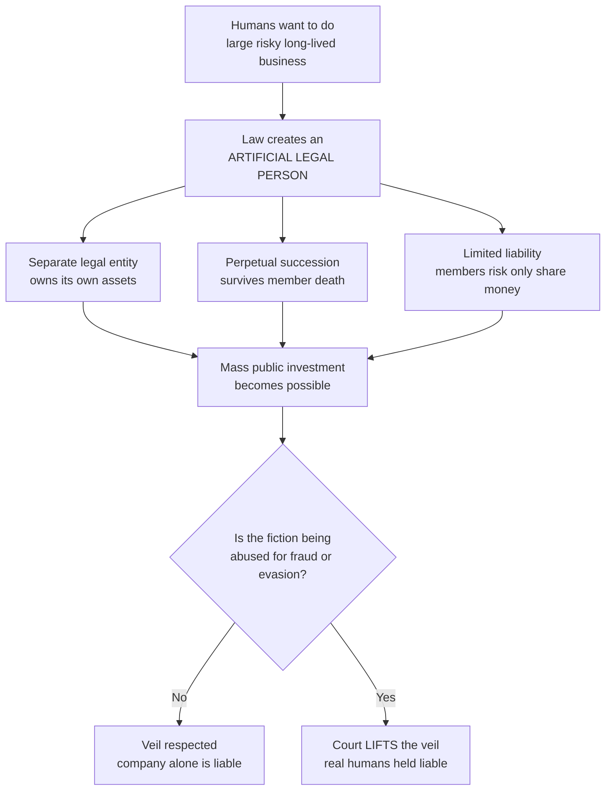
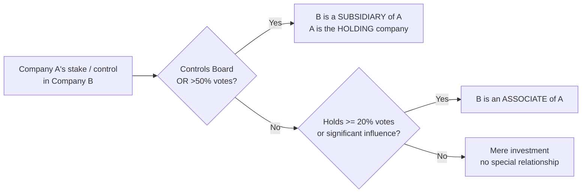
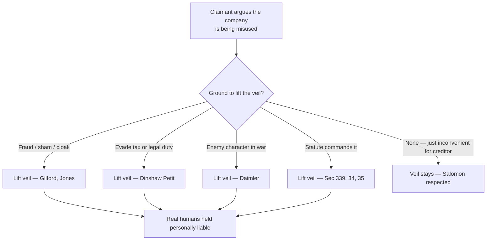
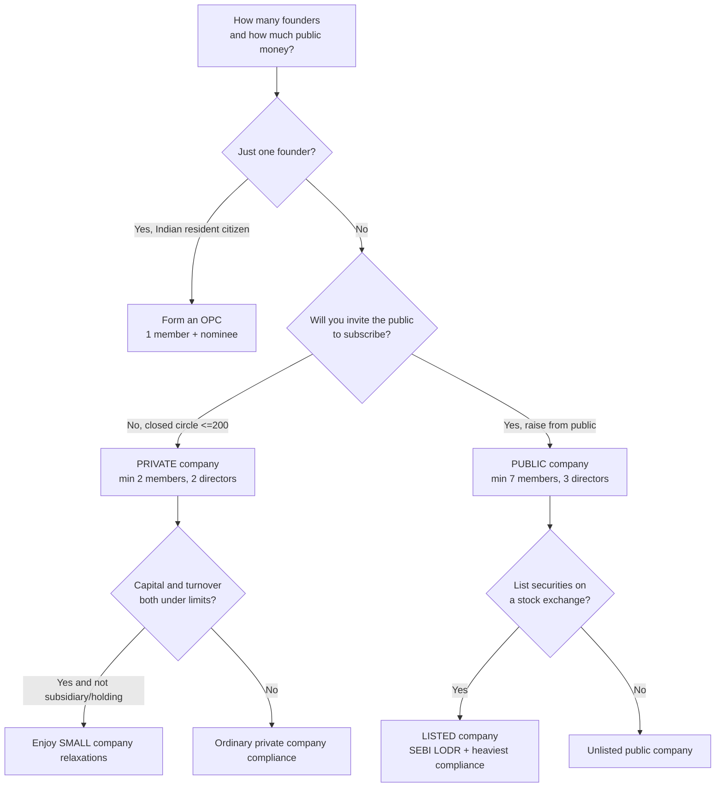

# Chapter 01 — Companies Act 2013: Preliminary & Key Definitions

> *"A company is not a thing you can touch. It is a legal fiction — an artificial person the law agrees to pretend exists. Every definition in this chapter is the law drawing the exact outline of that fiction, because the moment you invent an invisible person who can own property and owe money, clever people will try to abuse the gap between the fiction and reality."*

---

## 1. The Problem — Why We Needed to Invent the "Company" at All

Imagine there is **no** company law. You and four friends want to build a railway. It needs crores of rupees, thousands of investors, and it will run for 100 years. Try to do this with only the ordinary law of partnership and contract, and you hit four brick walls:

**Problem 1 — The business dies when a person dies.**
A partnership is just an *agreement between specific humans*. Legally, the firm **is** the partners. So the day one partner dies, retires, or goes insane, that partnership legally dissolves. A railway that must run for a century cannot re-form its legal existence every time a shareholder dies. Investors will not commit money to something that evaporates on a funeral.

**Problem 2 — Unlimited, ruinous personal liability.**
In a partnership every partner is **jointly and severally liable** for the *whole* debt. If the firm owes ₹10 crore and cannot pay, creditors can seize *your house, your car, your savings* — not just the money you put in. Worse, they can chase *any one* partner for the *entire* amount. No sane small investor will buy ₹5,000 of railway shares if it means their entire net worth is on the hook for the railway's ₹500-crore debts. Without a liability cap, **mass public investment is impossible.**

**Problem 3 — You cannot pool money from thousands of strangers.**
A partnership works between a handful of people who trust each other and all manage the business. It collapses at scale. You cannot have 40,000 shareholders each being a "partner" who can bind the firm and is personally liable for everything.

**Problem 4 — Whose name owns the assets?**
If the firm *is* the humans, then the land, the trains, the tracks are owned by *the individuals jointly*. Every time ownership changes, title has to be re-registered to a new set of humans. Contracts are with *individuals*, so they must be re-signed. It is legally unworkable.

**The deeper abuse the law also had to prevent:** once you *do* invent a limited-liability artificial person, the opposite danger appears — **fraudsters hiding behind the fiction.** A cheat can set up "XYZ Ltd", take deposits from the public, siphon the money to himself, then let the company "fail" and say *"Sorry, the company owes you, not me, and the company has no money."* So the same law that grants the shield must also define **when the shield can be ripped away.**

Every definition and doctrine in this chapter exists to solve one of these five problems: **death, ruin, scale, ownership, and the fraud that limited liability invites.**

---

## 2. The Core Idea — The Artificial Person With a Ring-Fence Around It

The law's solution is one radical move: **create a new legal person.**

When a company is incorporated (registered), the law says: *"A brand-new person now exists — separate from every human who created it or owns it. It has its own name, its own PAN, can own property in its own name, can sue and be sued in its own name, can enter contracts, and — crucially — it lives until the law formally kills it, regardless of what happens to its members."*

This single fiction dissolves all four practical problems at once:

- Because the person is **separate**, it owns its own assets — ownership problem solved.
- Because the person is **immortal until wound up** (perpetual succession), the death of members is irrelevant — the death problem solved.
- Because the *company* owes the debts (not the members), and members only promised to pay for their shares, member liability is capped at the unpaid value of their shares — **limited liability** — the ruin problem solved.
- Because the shares are transferable and the person is separate, thousands of strangers can invest small sums freely — the scale problem solved.

But the fifth problem — **fraudsters abusing the shield** — cannot be solved by the fiction itself. It is solved by a *counter-doctrine*: **lifting / piercing the corporate veil.** The "veil" is the imaginary curtain between the company and its members. Normally the court respects it. But when the fiction is being used *as a cloak for fraud, evasion, or sham*, the court will **look behind the curtain**, identify the real humans, and hold *them* liable.

So the whole architecture is a **shield plus an exception to the shield**:

*Figure 1 — The company is a shield the law grants, plus a court's power to withdraw the shield when it is abused.*

---

## 3. Why It's Built This Way — The Logic of Each Safeguard

Before the section numbers, understand *why the machinery has the exact shape it has.* Each design choice is a plugged loophole.

- **Why "separate legal entity" is the foundation stone.** Everything else is a consequence. If the company were *not* a separate person, it could not own assets, could not survive members, and members could not have limited liability. This principle was cemented in **Salomon v. Salomon & Co. Ltd (1897)** — the House of Lords held that even a "one-man company" is legally distinct from that man, so his personal guarantee ranked ahead of unsecured creditors. The company, once validly incorporated, is a real legal person even if one human controls it entirely.

- **Why limited liability is capped at the *unpaid* amount, not zero.** The law does not let members walk away scot-free. If you agreed to buy shares of face value ₹10 and paid only ₹6, you still owe ₹4 — the company (or its liquidator) can call it. This protects **creditors**: the promised capital is a fund creditors can rely on. Limited liability limits your downside to *your promise*, not below it.

- **Why the law forces sub-categories (private, public, OPC, small).** A one-size company law would either over-regulate the corner shop or under-regulate the listed giant. The abuse to prevent is **mismatched regulation** — crushing a small business with disclosure rules meant for a company holding public money, or letting a company with 40,000 public investors escape scrutiny meant for a family firm. So the Act **scales the compliance burden to the public interest at stake.** More public money and more outside stakeholders → more rules.

- **Why holding/subsidiary/associate must be *defined precisely.***  Once a company can *own shares in another company*, fraudsters build **pyramids of companies** to hide control, shift losses into a subsidiary, dodge consolidation, or claim two "separate" companies are unrelated when one secretly controls the other. Precise definitions (based on **share capital, voting power, and board control**) force the true web of control into the open through consolidated accounts.

- **Why "listed" is its own category.** A listed company has taken money from the **anonymous investing public** via a stock exchange. The public cannot individually negotiate protections, so the law (and SEBI) must impose them. Listing status is the trigger for the heaviest disclosure and governance load.

- **Why veil-lifting is deliberately *narrow* and mostly judge-made.** If courts pierced the veil casually, limited liability would be worthless and investment would dry up (back to Problem 2). So piercing is an **exception**, used only for fraud, evasion of law/obligation, sham, or specific statutory commands — never merely because it would be convenient for a creditor.

---

## 4. Full Technical Content — Section by Section, Each With Its "Why"

> The Act is the **Companies Act, 2013** (India). Definitions live in **Section 2**. *Always confirm exact sub-clause numbers and current thresholds against the latest ICAI study material / bare Act, as amendments (esp. 2015, 2017, 2019, 2020) and rules revise limits.*

### 4.1 What a "company" is — Section 2(20)

**Section 2(20): "company" means a company incorporated under this Act or under any previous company law.**

*Why so circular?* Because the point is that a company is **a creature of statute** — it exists *only* because a law says it does and it was registered under that law. You cannot "become a company" by agreement, as you can a partnership. This ties company existence to the **register kept by the Registrar of Companies (ROC)**, which is what makes the public able to *check* who they are dealing with.

**The characteristics that flow from incorporation (know these cold):**

| Characteristic | What it means | Problem it solves |
|---|---|---|
| Separate legal entity | Company is a person distinct from members | Ownership, and shielding members |
| Limited liability | Members liable only up to unpaid share value (or guarantee) | Ruinous personal liability |
| Perpetual succession | Company lives regardless of member death/exit until wound up | Business dying with a person |
| Common seal (now optional) | Historically the company's "signature" | Acting as a person in contracts |
| Separate property | Company owns assets in its own name; members have **no insurable/ownership interest** in company assets | Re-registering title on every change |
| Capacity to sue and be sued | In its own name | Enforcing/being held to obligations |
| Transferability of shares | Especially in public companies | Free flow of investment |

**Landmark hooks for memory:**
- *Salomon v. Salomon (1897)* — separate entity, even a one-man company.
- *Lee v. Lee's Air Farming (1961)* — Lee could be **both** the controlling shareholder **and** an *employee* of his own company; when he died flying its plane, his widow claimed workers' compensation *from the company*. Company and man are different persons, so an employment contract between them is real.
- *Macaura v. Northern Assurance (1925)* — Macaura owned all the shares of a timber company but insured the timber in his **own** name. Timber burned; insurer refused. Held: the *company* owned the timber, **not** Macaura, so he had **no insurable interest**. Separate property, ruthlessly applied.

### 4.2 Private vs Public company — Sections 2(68) and 2(71)

**Section 2(68) — Private company.** A company which, by its **articles**:
1. **Restricts the right to transfer its shares** — *why?* A private company is a closed circle (often family/friends); it does not want outsiders forcing their way in, and it does not take public money, so shares are not freely tradeable.
2. **Limits the number of members to 200** (excluding present and past employees who are members) — *why 200?* It is the line between a "private, closed" body and one large enough that it is effectively raising money from the public. Joint holders count as one member.
3. **Prohibits any invitation to the public** to subscribe for securities — *why?* This is the core distinction: a private company must **not** tap the public. The moment you solicit the public, you must accept public-company scrutiny.
   *Minimum members = 2.*

**Section 2(71) — Public company.** A company which is **not** a private company, **and** (per the section's structure) a company that is a **subsidiary of a public company is deemed public** even if its articles say "private" — *why this deeming?* To stop the **pyramid trick**: making a subsidiary "private" on paper to escape rules, while a public company (and thus public money) sits above it controlling it. Substance over form.
   *Minimum members = 7; no upper limit; minimum directors = 3 (private = 2, OPC = 1).*

> **Note on paid-up capital.** The 2013 Act originally prescribed a *minimum paid-up capital* (₹1 lakh private / ₹5 lakh public). The **Companies (Amendment) Act, 2015 removed** the minimum paid-up capital requirement. *Confirm in current material — many old questions still quote the old figures as a trap.*

### 4.3 One Person Company (OPC) — Sections 2(62) and 3

**The problem OPC solves:** A **sole** entrepreneur previously had a cruel choice — run a proprietorship (simple, but **unlimited personal liability**) or find a second person just to satisfy the "minimum 2 members" rule for a private company (artificial, often a sham nominee). Neither is honest. OPC (a J.J. Irani Committee recommendation) gives a **single** person the **limited-liability shield** without needing a fake second member.

**Section 2(62): OPC = a company which has only *one* person as a member.**

Key built-in safeguards (each solving a specific worry):

| Feature | Rule | Why |
|---|---|---|
| Nominee | The sole member must **name a nominee** in the memorandum who becomes member on his death/incapacity | Perpetual succession needs a successor — with one member, death would otherwise kill the company |
| Who can form | Only a **natural person** who is an **Indian citizen and resident** in India; and can form only **one** OPC and be nominee in only **one** | Prevents shell-company chains and misuse by non-persons |
| Conversion trigger | Historically OPC had to convert to private/public if paid-up capital exceeded **₹50 lakh** or average annual turnover exceeded **₹2 crore** (over 3 years). *The 2021 rules removed these thresholds, allowing OPCs to grow and convert voluntarily — confirm current rule.* | Originally to push large businesses out of the "one-man" form; later liberalised to encourage entrepreneurship |
| Restrictions | OPC **cannot** carry on Non-Banking Financial Investment activities / invest in securities of other bodies corporate; a minor cannot be member or nominee | OPC is for a genuine solo operating business, not a holding/finance vehicle |

*Section 3 (formation) tells you how many people form each type: Public = 7 or more, Private = 2 or more, OPC = 1.* **Memory hook: 7-2-1** (public–private–OPC).

### 4.4 Small company — Section 2(85)

**The problem:** A tiny company should not drown in the same compliance as a mid-size one. "Private company" alone is too broad — a ₹90-crore private company is not "small". So the Act carves a **sub-set of private companies** that get *relaxations* (fewer board meetings, no cash-flow statement, lighter penalties, simplified annual return).

**Section 2(85): a small company is a company (not public) whose:**
- **paid-up share capital** does **not** exceed a prescribed limit, **and**
- **turnover** does **not** exceed a prescribed limit.

*Both* conditions must be met (it is an **AND**). The figures have been raised repeatedly. Originally ₹50 lakh capital / ₹2 crore turnover; the widely-cited revised limits are **paid-up capital ≤ ₹4 crore and turnover ≤ ₹40 crore**. *Confirm the exact current limits in ICAI material — this is a favourite exam-update trap.*

**Who can NEVER be a small company (the exclusions — and their logic):**
- a **public company** — by definition too open;
- a **holding or subsidiary** company — it is part of a larger group, so not truly "small";
- a company registered under **Section 8** (non-profit) — different regime;
- a company governed by a **special Act** (e.g., banks, insurers).

*Why the exclusions?* Each is a way someone might *look* small on its own numbers while actually being embedded in something large or public — the relaxations would then be abused.

### 4.5 Holding, subsidiary, and associate — Sections 2(46), 2(87), 2(6)

These three define **control relationships between companies.** The abuse to prevent: **hiding true control and shifting profits/losses across a corporate pyramid** so outsiders can't see who really runs and who really owns what.

**Section 2(87) — Subsidiary company.** Company B is a subsidiary of Company A (the holding company) if A:
- **controls the composition of B's Board of Directors** (i.e., A can appoint/remove a majority of B's directors), **OR**
- **exercises or controls more than one-half of the total voting power** of B, either alone or with subsidiaries.

*Why "OR" and why both a board test and a voting test?* Because control can be exercised **two ways** — by owning the *votes* or by controlling the *board*. A cheat who owns only 40% but has a contractual right to name most directors still *controls* B. Covering both closes the gap.

> **Layering restriction:** The Act (via rules under Section 2(87) proviso) restricts the **number of layers of subsidiaries** (generally **not more than two layers**, with exceptions). *Why?* Endless subsidiary-of-subsidiary chains are exactly how money and control are hidden. *Confirm the current layer limit and exemptions.*

**Section 2(46) — Holding company.** The mirror image: A is the holding company of B if B is its subsidiary. (Definition simply says a company of which other companies are subsidiaries.) Note the 2017 amendment clarified "company" here includes any **body corporate**.

**Section 2(6) — Associate company.** A company in which another company has a **"significant influence"** — meaning control of **at least 20% of total voting power**, *or* control of business decisions under an agreement — **but which is NOT a subsidiary** and is not a joint venture. *Why 20%?* Below control (>50%) but enough to *materially influence* — the accounting world's threshold for "you influence this company, so you must disclose it." A joint venture is also treated as an associate for this purpose.

**The clean ladder of control (memorise the numbers):**

| Relationship | Test | Threshold |
|---|---|---|
| Associate | Significant influence | ≥ 20% voting power (but ≤ 50%, not control of board) |
| Subsidiary / Holding | Control | > 50% voting power **OR** control of Board composition |

*Figure 2 — The control ladder: cross 20% and you "influence"; cross 50% or control the board and you "own".*

### 4.6 Listed company — Section 2(52)

**Section 2(52): a listed company means a company which has *any of its securities* listed on a recognised stock exchange.**

*Why a separate label?* Because listing = the company sold securities to the **anonymous public** through an exchange. That public needs the strongest protection, so listing is the trigger for SEBI (LODR) regulations, extra disclosures, independent directors, audit committees, etc. **Note (2020 amendment):** the definition was refined so that companies which list *only certain classes of securities* (e.g., only debt/NCDs on certain terms) may be **excluded** from being "listed" for some purposes — *confirm current carve-outs.* The logic: full listed-company burden should fall where **public equity** is truly in play.

### 4.7 Other key definitions worth exact recall

| Section | Term | One-line essence | Why it exists |
|---|---|---|---|
| 2(11) | Body corporate | Any incorporated body, incl. foreign companies; **excludes** co-operative societies & specified bodies | Broader than "company"; used so rules catch all corporate forms |
| 2(20) | Company | Incorporated under this/previous Act | Creature of statute |
| 2(45) | Government company | ≥ 51% paid-up capital held by Central/State Govt | Public money = special audit (CAG) |
| 2(42) | Foreign company | Incorporated outside India but has a place of business/operations in India | Bring foreign firms operating here under Indian disclosure |
| 2(85) | Small company | Private + capital & turnover under limits | Proportionate lighter compliance |
| 2(62) | OPC | One member | Limited liability for a solo founder |
| 2(30) | Debenture | Instrument evidencing a debt (incl. bonds) | Defines the borrowing instrument |
| 2(84) | Share | Share in the share capital of a company | The unit of ownership |
| Sec 8 | Non-profit company | Formed to promote commerce, art, science, charity etc.; profits applied to objects, no dividend | Charitable objects without the "Ltd"/"Pvt Ltd" tag |

### 4.8 Lifting / Piercing the Corporate Veil — the counter-doctrine

Recall the fifth problem: limited liability **invites** fraud. The veil is the separation between company and members. Courts (and the statute) **lift** it — treat the company and the humans as one — in these situations:

**A. Judicial (judge-made) grounds — the court looks behind the curtain when:**

1. **Fraud or improper conduct / to defeat the law.** The classic: *Gilford Motor Co. v. Horne (1933)* — Horne signed a non-compete, then formed a company to solicit his old employer's customers, arguing "the *company* is competing, not me." Court saw the company as a **sham/cloak** and enforced the covenant against it. *Jones v. Lipman (1962)* — Lipman contracted to sell land, then transferred it to a company he controlled to escape the sale. Court pierced the veil and ordered specific performance.
2. **Enemy character in wartime.** *Daimler Co. v. Continental Tyre (1916)* — a company registered in England but controlled by German nationals during WWI was treated as an **enemy**; the court looked at *who really controlled it.*
3. **Evasion of tax or a legal obligation.** Where a company is a device to dodge tax (*Sir Dinshaw Maneckjee Petit* — a man formed companies purely to receive his own income and reduce tax; veil lifted).
4. **Sham / façade / mere agent.** Where the company is really just the **alter ego or agent** of the members with no independent business.
5. **Protecting public interest / preventing injustice.**

**B. Statutory grounds — the Act itself lifts the veil:**

| Situation | Section (confirm) | Who becomes personally liable |
|---|---|---|
| **Fraudulent conduct of business** during winding up / otherwise | **Sec 339** (fraudulent trading) | Persons who ran the business with intent to defraud creditors — **personally, without limit** |
| **Misrepresentation in prospectus** | **Sec 34 / 35** | Directors, promoters, experts — for loss to investors |
| **Failure to return application money / mis-statement** | Sec 26, 35 | Persons responsible |
| **Officer in default** provisions | Sec 2(60) & various | The specific human "officer in default" |
| **Ultra vires / improper acts** | various | Directors personally |

*Why the statute keeps some grounds explicit rather than leaving all to judges?* For **certainty** — creditors and investors need to know in advance that fraud will not hide behind the shield, and courts need a firm hook.

*Figure 3 — Veil-lifting decision tree: the shield is withdrawn only for fraud, evasion, enemy character, or a statutory command — never mere convenience.*

---

## 5. Applied Scenarios (exam-style, reasoned to the outcome)

**Scenario 1 — The uninsured sawmill (separate property).**
*Facts:* R owns 100% of the shares of Timber Pvt Ltd, which owns a stock of logs. R insures the logs in **his own name**. A fire destroys them. The insurer refuses to pay.
*Reasoning:* The logs belong to **Timber Pvt Ltd**, a separate legal person (Sec 2(20)). A shareholder — even a 100% shareholder — has **no ownership or insurable interest** in the company's assets (*Macaura v. Northern Assurance*). R insured property he did not legally own.
*Outcome:* Insurer is **not liable**; R cannot recover. The correct step would have been for **the company** to take the policy.

**Scenario 2 — The "private" subsidiary of a public parent.**
*Facts:* Alpha Ltd (a public company) holds 90% of Beta's shares. Beta's articles restrict share transfer, cap members at 200, and ban public invitations — so Beta calls itself a private company and claims private-company relaxations.
*Reasoning:* Under Sec 2(71), a company that is a **subsidiary of a public company is deemed to be a public company**, whatever its articles say. Beta is >50% controlled by Alpha, so Beta is Alpha's subsidiary (Sec 2(87)), hence **deemed public.**
*Outcome:* Beta must comply as a **public company**; it **cannot** claim private-company or small-company relaxations. (Substance over form defeats the pyramid trick.)

**Scenario 3 — The non-compete dodged through a new company.**
*Facts:* H sold his business and signed a covenant not to solicit its customers for 3 years. Six months later he forms "H Solutions Pvt Ltd", of which he is the sole controller, and *the company* starts soliciting those very customers. H argues, "I am not competing — a separate legal person is."
*Reasoning:* The company is a **mere cloak / sham** created to evade a legal obligation (*Gilford Motor v. Horne*). Courts lift the veil where the corporate form is a device to defeat the law.
*Outcome:* The court **lifts the veil**, treats the company as H himself, and **enforces the covenant** (injunction) against both H and H Solutions Pvt Ltd.

**Scenario 4 — Is it "small"?**
*Facts:* Gamma Pvt Ltd has paid-up capital ₹3 crore and turnover ₹50 crore. Delta Pvt Ltd has capital ₹1 crore, turnover ₹20 crore, but is a subsidiary of Omega Ltd.
*Reasoning:* Small company (Sec 2(85)) needs **both** capital **and** turnover under the limits *(≈ ₹4 cr / ₹40 cr — confirm current)*. Gamma fails the **turnover** test (₹50 cr > ₹40 cr) → **not small**. Delta meets the numbers but is a **subsidiary**, which is an **express exclusion** → **not small.**
*Outcome:* Neither qualifies as a small company. (Remember: numbers are AND, and holding/subsidiary is auto-excluded.)

**Scenario 5 — The lone founder wanting a shield.**
*Facts:* S, an Indian resident citizen, wants limited liability but has no partner and no wish to invent a fake second member.
*Reasoning:* An **OPC** (Sec 2(62), Sec 3) lets a single natural person incorporate with limited liability. S must **nominate** a person (for perpetual succession) and can form only **one** OPC. Minimum directors = 1.
*Outcome:* S incorporates an OPC, names a nominee in the memorandum, and gets the shield honestly.

---

## 6. Procedure / Compliance Summary — Choosing and Forming the Right Type

While detailed incorporation is Chapter 2, the *definitional choices* made at formation are here:

*Figure 4 — Formation decision tree: the founder count and the appetite for public money drive the legal category, which drives the compliance load.*

**Formation minimums at a glance:**

| Type | Min members | Max members | Min directors | Public invitation? |
|---|---|---|---|---|
| OPC | 1 | 1 | 1 | No |
| Private | 2 | 200 | 2 | No |
| Public | 7 | No limit | 3 | Yes |

**Key forms/registers (indicative — detailed in Ch. 2):** SPICe+ (INC-32) for incorporation, INC-33/34 (e-MOA/e-AOA), and the ROC register that makes company status publicly verifiable. *Confirm current form names.*

---

## 7. Connections — How This Chapter Wires Into the Rest of the Law

- **Chapter 2 (Incorporation, MOA/AOA):** The definitions here decide *which* incorporation route, capital clause, and object clause you use. "Separate legal entity" is *born* at incorporation (Sec 9).
- **Prospectus & Public Deposits:** "Public company" and "listed company" status are the triggers for prospectus rules (Sec 23–42) and deposit rules — because those chapters are about **public money**, the very thing these categories track.
- **Accounts & Audit:** Holding/subsidiary/associate (Sec 2(6), 2(46), 2(87)) drive **consolidated financial statements** (Sec 129) — the whole point of defining control is to force the group's true picture into the accounts.
- **Directors:** Minimum director counts (1/2/3) and "officer in default" (Sec 2(60)) connect to Board composition and personal liability.
- **Winding up / IBC:** Veil-lifting for **fraudulent trading (Sec 339)** connects to insolvency; the shield's limits matter most when the company is dying.
- **SEBI Act & LODR:** "Listed company" hands off to the securities-law regime.
- **Other Laws (Interpretation of Statutes):** Reading definitions ("means" vs "includes", inclusive vs exhaustive) is itself an examinable skill in the Other Laws part.

---

## 8. Traps & Examiner Tricks

1. **Minimum paid-up capital is GONE.** The 2015 amendment removed the ₹1 lakh/₹5 lakh minimums. Questions quoting them as *current* are testing whether you know the amendment. There is **no** minimum paid-up capital now.
2. **Small company numbers are "AND", exclusions are automatic.** Both capital **and** turnover must be under the limits. A holding **or** subsidiary company, a Section 8 company, and a company under a special Act can **never** be small — regardless of their numbers.
3. **Subsidiary-of-public is deemed public.** Even with private-company articles, a subsidiary of a public company is public (Sec 2(71)). Classic trap.
4. **Member count: "200" vs "50".** Under the 2013 Act a private company limit is **200** (it was 50 under the 1956 Act). Old figure = trap. Also: **past/present employee-members are excluded** from the count, and **joint holders count as one.**
5. **Associate vs Subsidiary threshold.** Associate = **≥20%** voting power (significant influence, *not* control). Subsidiary = **>50%** or **board control**. Do not confuse "significant influence" (20%) with "control" (50%).
6. **Macaura trap.** A 100% shareholder still does **not** own the company's assets and has **no** insurable interest in them.
7. **Salomon holds even for one-man companies.** A validly incorporated company is separate even if one person owns and runs everything. Do **not** lift the veil merely because one person controls the company — you need fraud/evasion/sham/statute.
8. **Veil-lifting is narrow.** Mere inconvenience to a creditor, or the company simply being unable to pay, is **not** a ground. Look for **fraud, sham, evasion, enemy character, or an express statutory provision.**
9. **"Body corporate" ≠ "company".** Body corporate (Sec 2(11)) is broader — includes foreign companies — but **excludes** co-operative societies and certain bodies. A question may hinge on this width.
10. **OPC restrictions.** Only a **natural person, Indian citizen and resident**; can form **one** OPC and be nominee in **one**; **cannot** do NBFI/invest-in-securities activity; a **minor** cannot be member/nominee. The old ₹50 lakh/₹2 crore mandatory-conversion thresholds were **relaxed** in 2021 — check current position.
11. **Listed definition carve-out (2020).** Some companies listing only specified securities may be excluded from "listed" for certain purposes. Watch the update.
12. **Perpetual succession ≠ immortality.** The company survives *members'* deaths, but it **can** be wound up / struck off — it lives *until the law ends it*, not forever unconditionally.

---

## 9. First-Principles Recap

Strip everything away and rebuild it from zero:

1. Big, long-lived, risky business needs **money from many strangers**. Strangers won't invest if the venture **dies with a person** or if it **ruins them personally**.
2. The law's fix: **invent an artificial legal person** — separate, immortal-until-wound-up, owning its own assets. From this one fiction fall **separate entity, perpetual succession, separate property, capacity to sue, and (via a promise-cap) limited liability.** *(Salomon, Lee, Macaura.)*
3. That fiction must be **regulated in proportion to the public interest at stake** — hence the categories. One founder → **OPC**. Closed circle, no public money → **private**; if tiny → **small** (relaxations). Public money → **public**; if traded on an exchange → **listed** (heaviest load).
4. Once companies can **own other companies**, control hides in **pyramids** — so the law defines control precisely: **≥20% = associate (influence)**, **>50% or board control = subsidiary/holding**, forcing the true group into **consolidated accounts.**
5. The shield **invites fraud**, so the law keeps a **counter-power**: **lift the veil** for fraud, sham/cloak, evasion of law/tax, enemy character, or where a **statute** (Sec 339, 34, 35) commands — and hold the **real humans** liable. But this power is **narrow**, or the shield (and investment) would be worthless.

If you can regenerate the categories and the veil doctrine from *"we invented a person, and we must both trust and police that fiction,"* you never need to memorise them.

---

## 10. Quick-Revision Sheet

**Core sections**

| Section | Term | Key number / rule |
|---|---|---|
| 2(20) | Company | Incorporated under this/previous Act |
| 2(68) | Private company | Restricts transfer; **max 200** members; no public invitation; **min 2** |
| 2(71) | Public company | Not private; subsidiary of public = **deemed public**; **min 7**; **min 3 directors** |
| 2(62) | OPC | **One** member + nominee; natural Indian resident citizen; one OPC only; **min 1 director** |
| 2(85) | Small company | Private + capital **≤ ₹4 cr** *and* turnover **≤ ₹40 cr** *(confirm)*; excludes public/holding/subsidiary/Sec 8/special-Act |
| 2(87) | Subsidiary | Control of **Board** OR **>50%** voting power; layers limited (≈2) |
| 2(46) | Holding | Company whose subsidiaries exist |
| 2(6) | Associate | **Significant influence = ≥20%** voting power (not subsidiary) |
| 2(52) | Listed | Any securities listed on recognised stock exchange (some 2020 carve-outs) |
| 2(11) | Body corporate | Incl. foreign cos; excl. co-op societies, specified bodies |
| 2(45) | Government company | **≥51%** Govt paid-up capital |
| 2(42) | Foreign company | Incorporated outside India + place of business/operations in India |
| Sec 3 | Formation | Public **7** / Private **2** / OPC **1** (memory: **7-2-1**) |
| Sec 9 | Effect of incorporation | Separate legal person, perpetual succession, common seal (optional), capacity to sue |

**Formation minimums (7-2-1):** Public 7 members / 3 directors • Private 2 / 2 • OPC 1 / 1. Max members: Private 200, OPC 1, Public unlimited.

**Control ladder:** ≥20% = **Associate** (influence) → >50% or board control = **Subsidiary/Holding** (control).

**Characteristics of a company:** Separate legal entity • Limited liability • Perpetual succession • Separate property • Common seal (optional) • Capacity to sue & be sued • Transferable shares.

**Veil-lifting grounds:** Fraud/sham/cloak (*Gilford, Jones*) • Tax/obligation evasion (*Dinshaw Petit*) • Enemy character (*Daimler*) • Statute (Sec **339** fraudulent trading; Sec **34/35** prospectus). **Not** lifted for mere creditor inconvenience.

**Landmark cases:** *Salomon* (separate entity) • *Lee* (member can also be employee) • *Macaura* (no insurable interest in company property) • *Gilford / Jones* (sham to evade obligation) • *Daimler* (enemy character) • *Dinshaw Petit* (tax evasion).

**Amendment flags to verify in current ICAI material / bare Act:** no minimum paid-up capital (2015) • small-company limits (₹4 cr / ₹40 cr) • OPC conversion thresholds removed (2021) • subsidiary layer limit • listed-company carve-outs (2020).

---

*End of Chapter 01. Next: Chapter 02 — Incorporation of a Company, MOA & AOA — where this artificial person is actually born.*
