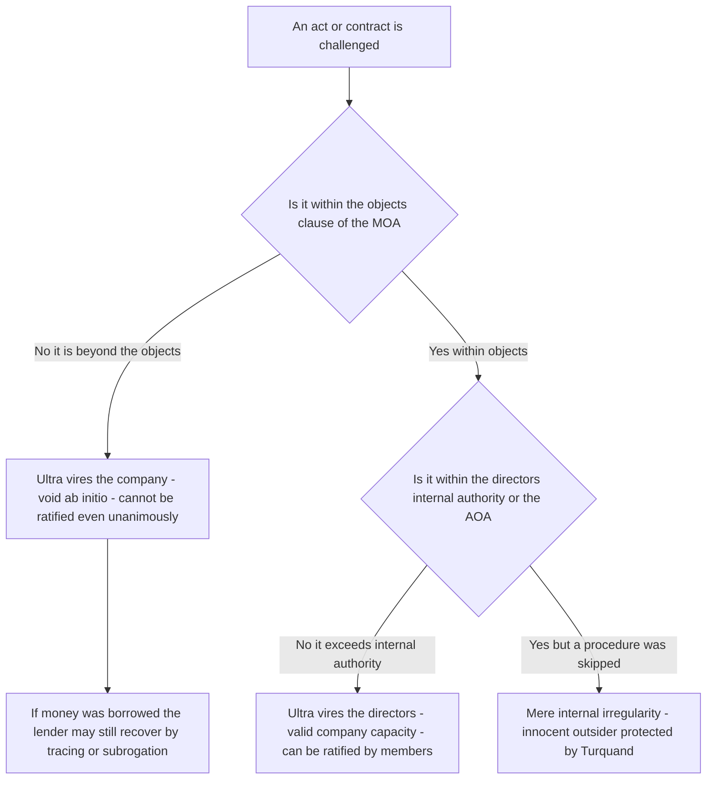
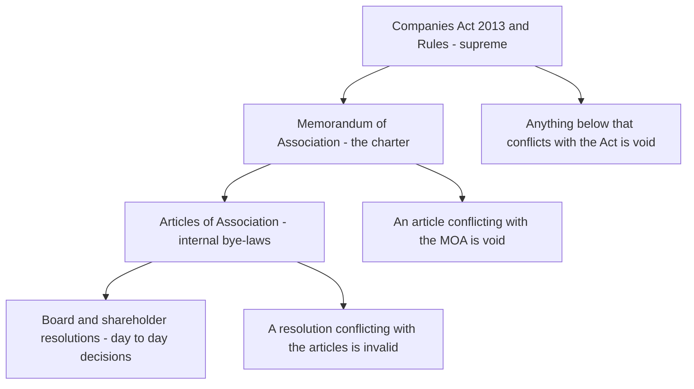
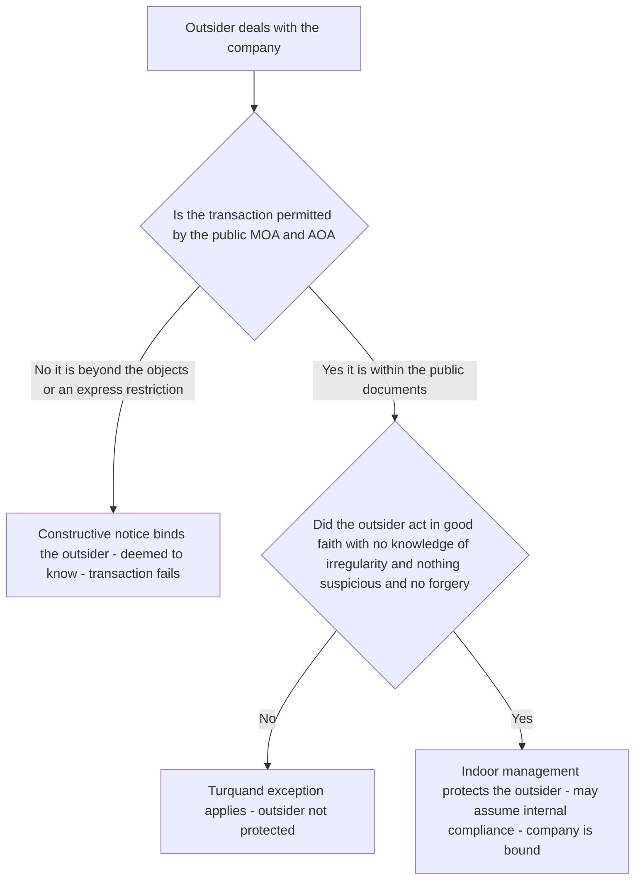
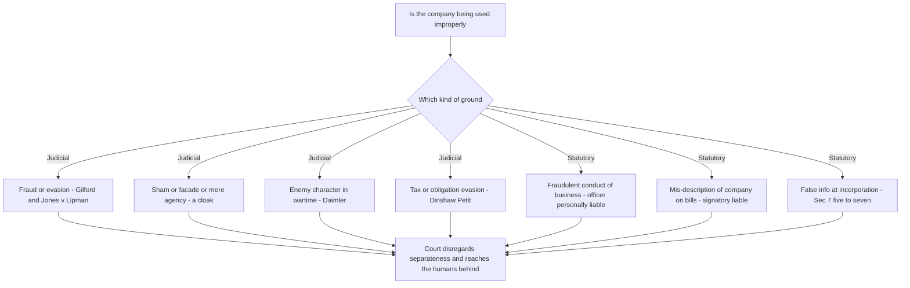
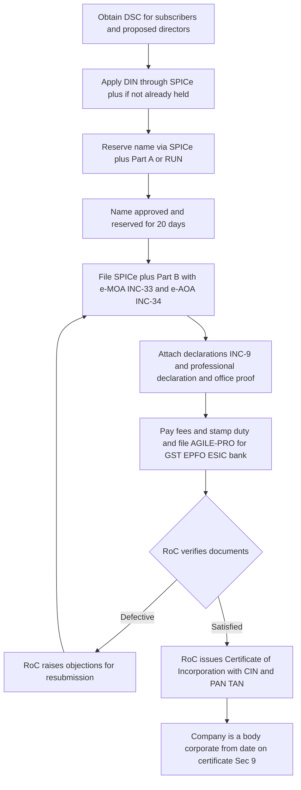
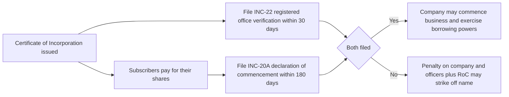

<!-- v2-deep -->

# Chapter 02 — Incorporation of a Company

> Guiding law of these notes: never memorise a section until you have felt the wound it was written to close. A company is an artificial person. It can own property, sue, be sued, borrow crores, and vanish overnight leaving creditors staring at empty offices. The entire law of incorporation exists to answer one dangerous question: *if we are going to let people create an immortal, faceless, limited-liability person out of thin air, how do we stop that person from becoming a weapon?*

---

## 1. The Problem — What goes wrong when a "company" can be born in secret

Imagine there were no incorporation law. Anyone could stand up tomorrow, call themselves "Reliance Global Traders Ltd", collect deposits from the public, sign contracts, and — when things went bad — simply disappear. There would be:

- **No public record.** A supplier extending 90 days credit has no way to check whether the "company" even exists, who owns it, where it is registered, or what it is allowed to do.
- **No accountability trail.** When the entity collapses, whom do you sue? Who were the real humans behind it? Where did the money go?
- **No fixed constitution.** The people running it could claim today they are a shoe business and tomorrow a chit-fund, changing their object whenever convenient, so no investor could ever pin down what their money would be used for.
- **Unlimited fraud by "limited liability".** Limited liability is a gift from society — it says "if the business fails, your personal house is safe." That gift is easily abused: promoters could pile up debts, shield themselves, and walk away rich while creditors starve.
- **The "one-way mirror" problem.** Outsiders dealing with the entity cannot see inside it. They don't know which director is authorised to sign, whether a board meeting really happened, whether the loan was properly approved. Either outsiders bear that risk (and stop dealing) or insiders bear it (and are trapped by their own paperwork). Somebody has to lose.
- **The capital-illusion problem.** A group may advertise a grand "authorised capital of ₹10 crore" while not a single rupee has actually reached the bank account. A creditor who extends credit trusting that figure is trusting an illusion. So the law must force a moment where the newborn *proves* the subscription money is real — this later crystallises as Sec 10A.
- **The phoenix problem.** A dishonest group runs a company into the ground, sheds its debts, and rises again as a *new* company with the same people and the same business — leaving each successive set of creditors stranded. Separate personality, meant as a shield, becomes an escape hatch. Veil-lifting and fraud-in-incorporation provisions exist precisely to singe the phoenix.

Add these to the earlier abuses and you have the complete rap-sheet this chapter answers.

Every single rule in this chapter is a scar from one of these abuses. Incorporation is not bureaucracy for its own sake — it is the **price of admission** for the extraordinary privileges of separate personality and limited liability. The State says: *you may create this artificial immortal person, but only through a public, recorded, verified birth, with a written constitution, identifiable promoters, and clear rules about who the outside world can trust.*

**Why this matters more than it looks.** Notice that two very different groups need protection, and they pull in opposite directions:

- **Insiders** (members, especially minority members) need protection *from the managers* — that their money is spent only on the stated objects, that the constitution is not rewritten against them overnight.
- **Outsiders** (creditors, suppliers, lenders, employees) need protection *from the company* — that the entity is real, reachable, has genuine capital, and that the person who signed actually had authority.

A well-designed incorporation regime cannot maximise protection for both at once; every doctrine in this chapter is a *negotiated allocation of risk* between these two camps. When you read a rule, always ask: *whose risk did this shift, and to whom?* That single question unlocks almost every exam problem, because the examiner is nearly always testing whether you can identify which camp the law is protecting in a given fact pattern.

---

## 2. The Core Idea — Incorporation as a *public, documented birth in exchange for privilege*

The protective principle is a **bargain**:

> Society grants a company two magical powers — **separate legal personality** (it is a person distinct from its members) and **limited liability** (members risk only what they agreed to invest). In return, the company must be **born on a public register**, carry a **written and published constitution** limiting what it may do, and expose enough **identity and authority information** that the outside world can deal with it safely.

From this one bargain, everything flows:

1. **Public birth (registration with the Registrar of Companies).** A neutral State officer verifies documents and issues a birth certificate — the *Certificate of Incorporation* — which becomes the entity's legal DNA.
2. **A written constitution (MOA + AOA).** The **Memorandum of Association (MOA)** is the company's charter facing *outward* — its name, home State, objects, and liability. The **Articles of Association (AOA)** are the rulebook facing *inward* — how the company governs itself. Because these are public, the world can read the limits before dealing.
3. **Doctrines that split risk fairly between insider and outsider.** *Ultra vires* protects members and creditors from managers exceeding the objects. *Constructive notice* protects the company by deeming outsiders to have read the public documents. *Indoor management (Turquand's rule)* protects outsiders from hidden internal irregularities they could not have discovered.

Hold these three pillars in your head. The rest of the chapter is just detail hanging off them.

**Do not conflate the two privileges.** *Separate legal personality* and *limited liability* are **different gifts** and can exist apart. Personality means the company is a distinct legal person that owns its own assets and bears its own debts. Limited liability means the *members'* exposure is capped at their unpaid share value (or guarantee sum). Proof they are separable: an **unlimited company** has *full* separate personality yet its members carry *no* liability cap at all. So "the company is separate" does **not** automatically mean "the members are protected" — the **liability clause of the MOA** decides that second question independently. The examiner exploits this by giving an *unlimited* company and asking whether members are shielded (they are not) while separateness still holds (it does). Tag the two privileges apart from the first day and you will never be trapped by this.

**A cleaner mental model — the three questions every rule answers.** If the whole chapter is a bargain, then every rule is one of only three moves in that bargain. Tag each rule you learn with one tag:

| The question | Whose protection | The rules that answer it |
|--------------|------------------|--------------------------|
| *Is this entity real and identifiable?* | Outsiders | Registration (Sec 7), certificate (Sec 9), promoter identity (2(69)), registered office (Sec 12), Sec 10A capital reality |
| *What is it allowed to do, and can I trust the change?* | Insiders / investors | Objects clause, ultra vires, hard MOA alteration (Sec 13), entrenchment (Sec 5) |
| *Can I trust the person in front of me who claims to bind it?* | Outsiders | Constructive notice, indoor management (Turquand), veil-lifting, statutory contract (Sec 10) |

If you can drop any rule from this chapter into one of these three rows, you already understand it. The section number is just an address.

---

## 3. Why it's built this way — the logic behind each safeguard

Before the section numbers, let us reason out *why each protective device exists*, so the numbers stick.

**The deepest why of all — why does society grant artificial personhood at all?** Not out of generosity, but because it *unlocks capital*. Three problems make large enterprise impossible without it: (i) **risk** — no rational person stakes their entire personal fortune on a venture that could fail, so *limited liability* caps the downside and coaxes ordinary savings into industry; (ii) **continuity** — projects outlast individuals, so *perpetual succession* lets an enterprise survive the death or exit of any founder; (iii) **liquidity** — investors want to exit without dismantling the business, so *transferable shares* let ownership change hands while the enterprise runs on. Separate personality is the legal container that makes all three possible at once. Every safeguard in this chapter is the *price* charged for that container — the State hands over the capital-raising machine, but bolts on registration, a constitution, and the trust-doctrines so the machine cannot be turned into a fraud engine. Read this way, the chapter is not "a list of company-law rules"; it is *the terms of a licence to raise money from strangers.*

**Why require promoters to be named and accountable?**
Someone conceives the company, arranges its formation, and often profits from selling assets to it. If that person could hide, they could rig the founding deal — e.g., buy land for ₹10 lakh and secretly resell it to the new company for ₹50 lakh. So the law defines the **promoter** and imposes a **fiduciary duty**: full disclosure of any profit, no secret gains. Accountability begins before the company even breathes.

**Why a Memorandum with an objects clause?**
An investor hands money to a company on the faith that it will be used for a *stated purpose*. If managers could spend it on anything, the investor's bet is meaningless. The **objects clause** freezes the purpose in a public document. The doctrine of **ultra vires** then makes any act *beyond* those objects void — not merely voidable — precisely because we want investors to be able to rely on the limit absolutely.

**Why Articles at all, and why can outsiders be bound by them?**
Internal governance rules (who signs, quorum, borrowing limits) must be knowable. Making the AOA public lets counterparties check authority. The flip side — **constructive notice** — deems everyone to have read them, otherwise the public-document system is pointless.

**Why then soften constructive notice with the indoor management rule?**
Because pure constructive notice would be *cruel and impractical*. The public documents show that "the board may authorise a loan," but an outsider can never see whether the board *actually met and voted*. Making outsiders verify internal compliance would freeze commerce. So **Turquand's rule** says: outsiders may assume internal procedures were duly followed. Insider irregularities are the company's problem, not the counterparty's — unless the outsider knew, or the situation was suspicious (forgery, etc.). This is the law balancing the one-way mirror fairly.

**Why a formal registration certificate that is "conclusive"?**
If the validity of a company's birth could be reopened years later ("actually the paperwork was defective"), every contract it ever signed would be under a cloud. So once the Registrar issues the certificate, it is **conclusive evidence** of due incorporation. Certainty for the whole marketplace beats perfect purity of paperwork.

**Why distinguish a *public* company from a *private* company at all?**
The deepest divide in the Act is between companies that may tap the *general public* for money and those that stay close-held. Everything harsher — more members to form (7 vs 2), stricter disclosure, no right to restrict share transfer — attaches to the public company *because it puts the savings of strangers at risk*. The private company [Sec 2(68)] earns lighter treatment by *promising restraint*: it restricts the right to transfer shares, caps members at 200, and prohibits any invitation to the public to subscribe. The moment a company breaks those promises, it forfeits the concessions. So the public/private line is not a formality — it is the law calibrating protection to the width of the public's exposure. *This is why nearly every rule in the chapter has a "public vs private" fork; the examiner tests whether you know which side you are on.*

**Why let founders "entrench" some articles beyond a special resolution?**
Ordinarily majority rules. But a pure majority-rule constitution lets a 51% bloc strip a vulnerable minority (say, an investor who negotiated a veto) the day after signing. Entrenchment lets the constitution bind even the future majority, so bargained-for rights survive. The law tolerates this dilution of majority rule *because the alternative — no enforceable minority protection — would deter the very investment incorporation is meant to attract.*

**Why cap the size of an *unregistered* profit-association?**
If a large group could carry on business for gain *without* incorporating, it would enjoy the scale of a company while dodging the public register, the constitution and the disclosure that protect everyone dealing with it — exactly the abuses of Section 1, re-entering by the back door. So the law says: below a threshold, trade informally as a partnership; *above* it, you have grown large enough that society insists on the full incorporation bargain. That threshold is the illegal-association rule (Sec 464) — the *entry* counterpart to the minimum-members rule.

**Why do a company's *past debts survive* every conversion and re-registration?**
Because a creditor extended credit to a *particular* legal person on the strength of its then-liabilities and structure. If merely changing the corporate clothing (private↔public, guarantee↔shares, unlimited↔limited) could erase those debts, incorporation would become a laundering machine for obligations — the very fraud limited liability is policed against. Hence the golden thread (Sec 18(3)): the entity may re-dress, but it carries its history with it. Certainty for creditors again beats convenience for the company.

**Why insist on a registered office within a fixed number of days?**
An artificial person with no address is unreachable — a summons cannot be served, an inspector cannot visit, a creditor cannot find it. The registered office is the company's *legal home*: the single place where communications are validly served and the statutory registers are kept. That is why Sec 12 demands verification of a real office within 30 days. An entity you cannot find is an entity you cannot hold accountable, so the address is not a formality — it is the physical anchor of the whole accountability trail.

**Why put both a professional's and a founder's signature on the birth file?**
The Registrar cannot personally investigate every applicant. So the Act deputises two independent gatekeepers: a *professional* (CA/CS/CWA/advocate) certifies that the Act's requirements are met, and each *subscriber/first director* personally declares that they carry no disqualifying conviction or fraud. A false birth then needs at least two liars — one expert and one founder — each staking their own liability. Fraud is deterred by *multiplying* the number of people who must lie to achieve it.

**Why give every director a DIN and every filing a digital signature?**
Because the accountability trail is worthless if the humans behind the company cannot be uniquely pinned down. A Director Identification Number is a permanent, unique tag that follows a person across every company he ever touches, so a disqualified or serial-fraud director cannot quietly reappear under a slightly different spelling of his name. The digital signature binds *that specific person* to *that specific filing*.

Now, with the *why* in hand, the sections become obvious rather than arbitrary.

---

## 4. Full Technical Content — section by section, each with its reason

> Statute base: **Companies Act 2013** and the **Companies (Incorporation) Rules, 2014**. Where a precise number or limit is one commonly mis-stated, I flag *"confirm in ICAI material / bare Act."*

### 4.1 Promoters — Section 2(69)

**Definition [Sec 2(69)].** A *promoter* is a person:
(a) **named as such** in the prospectus or in the annual return (Sec 92); **or**
(b) who has **control over the affairs** of the company, directly or indirectly, as shareholder, director or otherwise; **or**
(c) in accordance with whose **advice, directions or instructions** the Board is accustomed to act.

*Why three limbs?* Limb (a) catches the openly named promoter; limb (b) catches the person controlling from the shadows; limb (c) catches the puppet-master behind nominee directors. The definition is drawn wide precisely so a real controller cannot escape duty by staying unnamed.
*Carve-out:* a person acting **merely in a professional capacity** (lawyer, CA, banker advising on formation) is **not** a promoter — otherwise no professional would help form a company.

**Finer distinction the exam tests — *who is NOT* a promoter.** The professional carve-out is narrow: it protects the professional *only while acting in that professional character*. The moment the CA/advocate takes shares to control the venture, or negotiates the founding purchase for a slice of the profit, he crosses into limb (b) and becomes a promoter with full fiduciary duty. *Trap:* the label ("I was only the auditor") does not save you; the **substance of the role** decides. Equally, a person who merely lends money for formation, or a director appointed *after* incorporation who took no part in floating the company, is **not** a promoter — promotion is a pre-birth activity.

**When does promotion begin and end?** It **begins** the moment a person conceives the idea and starts the steps to give the company reality (finding subscribers, negotiating the founding contracts, drafting the MOA). It **ends** when the Board takes over management of the newly-born company — typically once directors are in place and running affairs. This matters because a promoter's fiduciary duty and secret-profit liability attach only to the *promotion period*; a later ordinary transaction is judged by ordinary rules.

**Legal position & duties.** A promoter is **neither an agent nor a trustee** of the company (the company doesn't exist yet), but stands in a **fiduciary relationship** to it. Consequences:
- Must **not make secret profit**; any profit must be **disclosed** to an independent Board or the members and, if undisclosed, is **recoverable** and the contract may be rescinded.
- Must make **full disclosure** of interest in transactions with the company.
- Liable for **misstatements in the prospectus** (Sec 34/35) and may be liable in criminal fraud (Sec 447) for founding frauds.

**The two classic secret-profit patterns (examiner favourite).**
1. **Promoter sells his OWN asset to the company without disclosure.** He bought land for ₹10 lakh before promotion, then sells it to the company for ₹50 lakh. The ₹40 lakh is a **secret profit** *if not disclosed* — the company can either **rescind** the sale and take its money back, or (if it prefers to keep the land) **recover the undisclosed profit**. It cannot generally do both.
2. **Promoter, while already a promoter, buys an asset and flips it to the company.** Here he holds a fiduciary position *at the time of purchase*, so the profit belongs to the company outright — even full disclosure does not let him keep a profit made *out of* the fiduciary relationship without genuine, informed consent.
*The saving grace for the promoter:* disclosure to an **independent Board** or to the **whole body of members/shareholders** legitimises the profit. A disclosure to a Board he himself controls is **no disclosure at all** (the classic *Erlanger v New Sombrero Phosphate* point — disclosure must be to an independent organ).

**The company's remedies against a defaulting promoter — the toolkit (and its limits).** When a promoter breaches his fiduciary duty (secret profit, non-disclosure, misrepresentation), the company may choose among:
1. **Rescission of the contract** — undo the transaction and restore both sides to their original positions. *But rescission is barred* if: (a) the company, with full knowledge, **affirmed** the contract; (b) **restitution is impossible** (the asset has been consumed, resold, or altered so the parties cannot be restored); (c) an **innocent third party** has acquired rights for value; or (d) there has been undue **lapse of time / laches**. Miss these bars and a "rescission" answer is wrong.
2. **Recovery of the secret profit** (account of profits) — keep the contract but make the promoter **disgorge** the undisclosed gain. Used where rescission is barred or the company prefers to retain the asset.
3. **Damages for breach of fiduciary duty / misrepresentation** — where the company suffered loss beyond the mere profit (e.g., it overpaid and the asset is worth less than paid). *Note:* the company generally cannot both rescind *and* recover the profit *and* claim damages — it elects the remedy that makes it whole without double recovery.

*First-principles why:* the remedies mirror the wrong. A *secret gain* is met by *disgorgement*; a *tainted bargain* is met by *rescission*; a *loss* is met by *damages*. The bars on rescission exist because equity will not unwind a deal it cannot cleanly reverse or that would injure an innocent third party — the promoter's misconduct does not entitle the company to harm outsiders.

**Remuneration of promoters.** A promoter has **no automatic right** to recover promotion expenses or claim payment from the company — the company was not a party to any agreement before it existed. In practice he is paid by (a) a lump sum or commission provided for in the articles, (b) sale of his property to the company at a *disclosed* profit, or (c) an option/allotment of shares. *Trap:* a bare clause in the articles is **not a contract** the promoter can sue on (Sec 10 binds members *inter se*, not outsiders — see 4.3); he depends on the company actually honouring it.

**Pre-incorporation (preliminary) contracts.** A company cannot be bound by contracts made *before* it existed — it had no legal capacity to authorise them. So:
- The company is **not bound**, and **cannot sue or be sued** on such a contract, and **cannot ratify** it (there was no principal at the time). *Memory hook: you cannot ratify on behalf of a person who was not yet born.*
- The **promoter is personally liable** on the contract (*Kelner v Baxter* — agents for a non-existent principal are personally bound).
- **Rescue route:** under the **Specific Relief Act 1963 (Secs 15(h) and 19(e))**, if the contract was for the *purposes of the company* and the company *adopts/warrants* it after incorporation, the other party can enforce it against the company. So the modern practical answer is: the company can take the benefit by adoption, but it is not automatic ratification.

**Two conditions the Specific Relief rescue quietly requires (fine distinction):** for the counterparty to enforce against the company, (i) the contract must have been entered into by the promoter **for the purposes of the company**, and (ii) the company must **accept/warrant/adopt** it after incorporation. Miss either and the promoter alone remains liable. *Also note the asymmetry:* Sec 15(h) lets the **other party** enforce against the company, and Sec 19(e) lets the **company** enforce against the other party — but *only if it has adopted the contract and communicated that acceptance*. The company cannot cherry-pick the benefit while denying the burden.

**A razor-fine distinction the examiner loves — *how the promoter signed* [Kelner v Baxter vs Newborne v Sensolid].** Personal liability of the promoter is **not** automatic; it turns on *the capacity in which he signed*:
- In ***Kelner v Baxter***, the promoter signed *as agent*, "on behalf of" the unborn company. Since the named principal did not exist, the agent was held **personally liable** — an agent for a non-existent principal steps into the contract himself.
- In ***Newborne v Sensolid***, the document was signed in the *company's own name* (the promoter merely authenticating it), purporting that *the company itself* contracted. Because the company did not exist, there was **no contract at all** — and the promoter, who had not contracted in his own name, was **not** personally liable either, so *neither* party could enforce.

*The lesson:* signing "for and on behalf of X Ltd" (agent form) tends to bind the promoter personally; signing as though "X Ltd" itself is the contracting party (company form) may leave a void with *no one* bound. These are English common-law positions; in India the Specific Relief adoption route can override the harsher outcome once a company is later formed and adopts the deal — *so state both the common-law position and the Specific Relief overlay.*

**Promoter remuneration — the edge cases.** Because the company cannot contract before birth, a promoter's reward is always precarious. Watch three traps: (i) a promise of remuneration in a *pre-incorporation* agreement cannot be enforced against the company — it was not a party; (ii) a bare *article* fixing his fee is **not** an enforceable contract (Sec 10 binds members inter se, not a member acting in an outsider capacity — *Eley*); (iii) if the company *does* pay, the payment and any profit must still satisfy the *disclosure* rule, or it becomes a recoverable secret profit. A prudent promoter therefore secures a **fresh, post-incorporation contract** expressly ratifying his reward.

### 4.2 The Memorandum of Association (MOA) — Sections 2(56), 4, 13

**What it is.** The MOA is the company's **charter** — its supreme, outward-facing document defining its relationship with the outside world. *Why supreme?* Because it declares the very identity and boundaries of the artificial person; nothing the company does inside can exceed it.

**Clauses of the MOA [Sec 4] — the mnemonic "N-S-O-L-C-S" (Name, Situation, Object, Liability, Capital, Subscription):**

| # | Clause | What it fixes | Why it exists |
|---|--------|---------------|----------------|
| 1 | **Name** clause | The company's name, ending "Limited" / "Private Limited" (or licensed exception) | Public identity; the suffix warns the world that liability is limited |
| 2 | **Situation / Registered office** clause | The **State** in which the registered office is situated | Fixes jurisdiction — which High Court, which RoC — and a place to serve legal notice |
| 3 | **Object** clause | What the company may do | The heart of *ultra vires*; lets investors know the purpose of their money |
| 4 | **Liability** clause | Whether members' liability is limited by shares, by guarantee, or unlimited | Warns creditors how far members' pockets go |
| 5 | **Capital** clause | Authorised (nominal) share capital and its division | Caps how many shares can be issued; basis for stamp/fee |
| 6 | **Subscription (Association)** clause | Subscribers agree to take at least one share and form the company | The founding act — proof real people chose to associate |

*Finer point on the Situation clause:* the MOA fixes only the **State**, not the exact address. The precise address of the registered office is a **Sec 12** matter, notified in **INC-22**. *Why the split?* Moving office *within* a State does not disturb jurisdiction and should be easy; moving to *another* State changes the High Court and RoC and therefore needs the heavy Sec 13 procedure. Keep "State = MOA/Sec 13" and "address = Sec 12/INC-22" separate — the examiner mixes them.

*Finer point on the Subscription clause:* each subscriber must sign and **take at least one share** and write the number of shares taken against his name. For a company **limited by guarantee**, the equivalent is the guarantee clause, where each member undertakes to contribute a fixed sum to the assets *on winding up* — not now. That guarantee sum, not share capital, is the ceiling of his liability.

*Name-clause safeguards [Sec 4(2)–(4)]:* a name must **not be identical or too nearly resemble** an existing company/trademark, must **not be undesirable** in the Central Government's opinion, and must **not use restricted words** (e.g., "National", "Bank", "Stock Exchange", "Insurance", "Small Company") without approval — *why?* to prevent passing-off and public deception. A proposed name can be **reserved** via **RUN / SPICe+** and is valid for **20 days** (for a new company) from the date of approval — *confirm current limit in ICAI material.* For an **existing company** changing its name, a reserved name is valid **60 days** — *confirm current figure.*

*What if the RoC registers a name that later turns out to be too similar to an existing one?* Sec 16 gives a **rectification of name** remedy: the Central Government may direct a change (the company must comply within a set period), and a proprietor of a registered trademark may apply within a limited window (historically 3 years — *confirm current period*). So a wrong name is not fatal to incorporation; it is *curable* by direction. This dovetails with certificate-conclusiveness: the birth stands, only the label is corrected.

**When a reserved name is obtained by false information [Sec 4(5)(ii)].** If a name reservation was secured by *wrong or false information*: (i) *before incorporation* — the reservation is **cancelled** and the applicant faces a penalty; (ii) *after incorporation* — the Central Government may, after hearing the company, direct it to change its name within a set period, strike it off, or take other action. *Why the graduated remedy?* A name is a public identity; a lie to obtain it poisons the identity itself, so the response scales with how far the company has already relied on the tainted name.

**What counts as "identical or too nearly resembling" — the availability test.** In deciding whether a proposed name clashes with an existing one, differences usually **ignored** include: change of tense/number/case, addition or removal of merely descriptive words (e.g., "Products", "Industries", "Enterprises"), punctuation, spacing, the words "the" and "and", and phonetically identical spellings. So "Sunrise Foods Limited" and "Sun-Rise Food Private Limited" are treated as the *same* name. *Why so strict?* Because the whole point of the name clause is to stop *confusion* in the market, and near-identity confuses just as effectively as exact identity. *Confirm the current list of ignored differences in the Companies (Incorporation) Rules.*

**Object clause under the 2013 Act.** The old split into "main / ancillary / other objects" is gone. Now the MOA states **the objects for which the company is proposed to be incorporated and matters considered necessary in furtherance thereof.** *Why simplified?* Because the old "other objects" list was abused to smuggle in unrelated businesses. *Fine distinction:* powers *reasonably incidental or ancillary* to the stated objects are **implied** even if not written — a manufacturing company may borrow, hire staff, and buy raw material without a separate clause, because those are the necessary means to the stated end. What is *not* implied is a *new line of business*.

**Doctrine of Ultra Vires — the reason the object clause has teeth.**
"*Ultra*" = beyond; "*vires*" = powers. An act **outside the objects clause** is **ultra vires the company** and **void** — it cannot be ratified even by *unanimous* shareholders, because ratification cannot cure something the company never had capacity to do. Leading case: ***Ashbury Railway Carriage & Iron Co. v Riche (1875)*** — a contract to finance railway construction was outside the objects (making railway carriages) and was held void even though every shareholder approved.
Consequences of ultra vires:
- The act/contract is **void ab initio**; neither side can enforce it.
- **Injunction:** any member can restrain the company from an ultra vires act (*Attorney-General v Great Eastern Railway* recognised the doctrine but confined it to genuine excess).
- **Directors personally liable** to restore company funds spent ultra vires (breach of duty).
- **Property acquired** ultra vires is still the company's property; and money/property traceable can be recovered.

**Why an ultra vires act simply *cannot* be cured — the deepest point.** An ultra vires act is void because the company **never had the capacity** to do it, and you cannot ratify, affirm, or estop your way into a capacity you were never given. Hence:
- **Unanimous shareholder ratification fails** — even 100% of members cannot vote the company a power its own charter withheld.
- **Estoppel fails** — the company cannot be "estopped" by its own conduct into being bound by a void act; nor can an outsider claim the company held out the transaction as valid, because *no one* had power to make it valid.
- **Lapse of time / performance fails** — part-performance, delay, or the other side having acted on it do **not** breathe life into a void act; contrast this with a *voidable* act, which affirmation or delay can validate.

*Contrast that with the merely-irregular act:* an act *within* the company's powers but done in breach of an internal procedure is only **voidable/ratifiable** — there ratification, estoppel and Turquand all operate. The whole trap is that "ultra vires" sounds like one idea but hides this fault-line between *no capacity* (incurable) and *defective exercise of an existing capacity* (curable).

**Breach of warranty of authority — the outsider's fallback.** If a director/agent purports to bind the company to something the company *cannot* do (ultra vires) or that he had *no authority* to do, and the innocent outsider suffers loss, the outsider may sue **that agent personally** for **breach of warranty of authority** — the agent impliedly *warranted* he had the authority he claimed. *Why?* The loss should fall on the person who misrepresented his authority, not on the innocent counterparty — a neat allocation of risk consistent with the whole chapter's logic.

**Ultra vires borrowing — a sharper sub-rule.** If a company *borrows* money for an ultra vires purpose, the loan is void and the lender cannot sue *on the loan as a debt*. But equity does not leave the lender wholly stranded: (a) **tracing** — if the borrowed money is still identifiable or was used to buy identifiable assets, the lender can trace and recover it; (b) **subrogation** — if the borrowed money was used to pay off the company's *lawful* (intra vires) debts, the lender steps into the shoes of the paid-off creditor to that extent. *Why?* The company should not be *enriched* by keeping money it had no capacity to borrow. This is a favourite twist: the loan is "void" yet the lender recovers — because recovery rests on tracing/subrogation, not on the void contract.

**The reasonably-incidental line — where implied powers stop.** A company has, by implication, every power *reasonably incidental* to its stated objects, but nothing more. Two recurring examples decide most problems:
- **Borrowing, hiring staff, buying raw material** — implied for any trading/manufacturing company as the necessary *means* to the stated end. *Not* ultra vires even if unwritten.
- **Gifts, gratuities, political or charitable donations, pensions to ex-employees** — valid *only if* they can fairly be said to advance the company's business (e.g., staff goodwill that improves the business), and ultra vires if purely gratuitous with no business nexus. The judicial test: *is the payment reasonably incidental to carrying on the company's business, and made bona fide for its benefit?* A donation with a genuine business rationale (retaining goodwill, complying with a statute) survives; a naked gift of the company's money does not.

*Charitable-donation trap:* students often write "a company can never donate — ultra vires." Wrong. A donation *connected to the business* — or now expressly mandated CSR spending under **Sec 135** for qualifying companies — is intra vires. The doctrine strikes only *purposeless* or *unconnected* expenditure. *Confirm the CSR linkage and thresholds in ICAI material.*

**The three-layer ultra vires test — visualised.**

*Figure 5: The three-layer test — beyond the company is fatal, beyond the directors is ratifiable, a mere procedural slip is curable by Turquand.*

*Distinguish two "ultra vires" traps (examiner favourite):* an act may be ultra vires **the company** (beyond MOA — void, unrescuable) or merely ultra vires **the directors/Articles** (beyond internal authority but within the company's powers — this **can be ratified** by members). Only the first is fatal. A third, subtler layer: an act *within* the company's objects but done in *breach of a procedural condition* (no resolution passed) is neither — it is an **indoor-management** problem, curable by Turquand for an innocent outsider (see 4.5).

**Alteration of the MOA [Sec 13] — deliberately made hard.**
*Why hard?* Because the MOA is the promise on which outsiders relied; changing it lightly would betray that reliance. General rule: **special resolution (SR)** plus, for sensitive clauses, **extra approval.**

| Clause changed | What is required | Why the extra guard |
|----------------|------------------|----------------------|
| Name | SR **+ Central Government (RoC) approval** | Protects other businesses from confusing name changes |
| Registered office **from one State to another** | SR **+ Central Government (Regional Director) confirmation** [Sec 13(4)] | Shifts jurisdiction; creditors/employees of the old State must be heard |
| Registered office within same State but **different RoC jurisdiction** | SR **+ Regional Director confirmation** | Same protection at RoC level |
| Object clause | **SR** (and if the company raised money from public via prospectus and has unutilised amount, extra disclosure/exit) [Sec 13(8)] | Investors gave money for the old objects; they must be protected |
| Capital clause | SR (with Sec 61/64 procedure) | Alters shareholders' rights |
| Liability clause | Generally not increasable without member consent | You cannot enlarge a member's risk without agreement |

Every alteration must be **filed with the RoC** and takes effect on **registration** of the change. *Fine points:* (i) the **name change** takes effect only when the RoC issues a **fresh certificate of incorporation** reflecting the new name — until then the old name stands; (ii) the special resolution for a name/object change is filed in **MGT-14 within 30 days**; (iii) a registered-office shift *from one State to another* requires an application to the **Regional Director**, advertisement, and an opportunity for creditors and the affected RoC/State to object — because it can prejudice people who trusted the old jurisdiction.

**Object-clause change when the company raised money from the public [Sec 13(8)] — the dissenter's exit.** A special resolution alone suffices to change the objects, *but* if the company has **raised money from the public through a prospectus** and still holds an **unutilised amount**, it may change the objects only if: (i) a special resolution is passed; (ii) details are **published** (newspaper advertisement and on the website) and given to the shareholders; and (iii) **dissenting shareholders are given an exit offer** by the promoters/controlling shareholders in accordance with SEBI regulations. *Why this extra machinery?* Because the public subscribed on the faith of the *old* objects; if the company now wants to redeploy their still-unspent money on *new* objects, an investor who disagrees must be allowed to **cash out** rather than have his money silently repurposed. It is the objects-clause promise (Section 3, "what may it do?") being honoured even at the point of change. *Trap:* assuming a bare SR always suffices to change objects — it does *not* where public money is involved and unutilised.

*What the examiner tweaks:* "Can a company shift its registered office from Mumbai (Maharashtra) to Pune (Maharashtra)?" — same State, so no RD confirmation needed *unless* it crosses RoC jurisdiction; ordinary board/SR + INC-22 (and Sec 12 process) suffices. "From Mumbai to Bengaluru?" — different State → **Sec 13(4) + Regional Director confirmation**. Read the geography carefully.

**Capital-clause alterations [Sec 61] — the five moves a limited company may make** (by ordinary resolution if the articles authorise). Sharply distinguish *alteration* of capital (Sec 61 — a change in the *structure/number* of shares) from *reduction* of capital (Sec 66 — an actual return or cancellation of issued capital, needing **Tribunal** confirmation because it touches the creditors' buffer):
1. **Increase** the authorised (nominal) capital.
2. **Consolidate** and divide shares into larger denominations (consolidation that changes members' voting % now needs Tribunal approval).
3. **Sub-divide** shares into smaller denominations.
4. **Convert** fully paid shares into stock and reconvert stock into shares.
5. **Cancel** unissued shares ("diminution" — *not* a reduction of capital, because nothing issued is being cancelled).

*Why does Sec 61 need only an ordinary resolution and no Tribunal, while Sec 66 needs the Tribunal?* Sec 61 merely re-arranges the *authorised* structure and hands no money back to members, so the creditors' security is untouched; Sec 66 actually *shrinks the fund* creditors rely on, so a court must confirm no one is prejudiced. *Trap:* labelling a Sec 61 sub-division or consolidation as needing Tribunal confirmation, or mis-calling the cancellation of *unissued* shares a "reduction of capital."

### 4.3 The Articles of Association (AOA) — Sections 2(5), 5, 14

**What it is.** The AOA is the **internal rulebook** — the bye-laws for running the company: share issue and transfer, calls, board and general meetings, voting, directors' powers, dividends, borrowing, winding-up. *Why separate from the MOA?* Because the outside world cares about *what* the company is and may do (MOA), while members care about *how* it is governed (AOA). Two audiences, two documents. **The AOA is subordinate to the MOA** — where they conflict, the MOA prevails; and neither may violate the Act.

**The hierarchy of authority — read every conflict top-down.**

*Figure 6: When two documents clash, the higher one always wins — Act over MOA over AOA over resolutions. Locate the conflict on this ladder and the answer is automatic.*

**MOA vs AOA — the comparison the exam wants in a table:**

| Feature | Memorandum (MOA) | Articles (AOA) |
|---------|------------------|----------------|
| Nature | Charter; defines the company to the outside world | Bye-laws; regulate internal management |
| Relationship | Supreme; subordinate only to the Act | Subordinate to **both** the Act and the MOA |
| Scope | Powers and objects (what the company *may* do) | The manner of exercising those powers (*how*) |
| Alteration | Hard — SR + often CG/RD approval (Sec 13) | Easier — SR + filing (Sec 14) |
| Effect of an act beyond it | Ultra vires the company → **void**, un-ratifiable | Merely irregular → **ratifiable**; outsiders may invoke Turquand |
| Compulsory? | Every company must have one | A company limited by shares may adopt Table F instead of registering its own |

**Model articles — Tables F, G, H, I, J [Sec 5, Schedule I].** The Act supplies ready-made articles by company type; a company may adopt them wholly, partly, or write its own. *Why offered?* To make formation cheap and to supply sensible defaults. *Default rule:* if a company limited by shares registers **no** articles, **Table F applies automatically**; if it registers articles that are silent on a point, Table F fills the gap unless expressly excluded.

| Table | For which company |
|-------|-------------------|
| **F** | Company limited by **shares** |
| **G** | Company limited by **guarantee having share capital** |
| **H** | Company limited by **guarantee without share capital** |
| **I** | **Unlimited** company having share capital |
| **J** | **Unlimited** company without share capital |

**Entrenchment [Sec 5(3)–(4)] — a lock inside the rulebook.** The articles may contain **entrenchment provisions** — clauses that can be altered only by conditions *more restrictive* than a special resolution (e.g., unanimous consent). *Why allow this?* To let founders/investors protect vital rights (e.g., a minority's veto) from being stripped by a bare majority. **How entrenchment is created matters:** on **formation** it may be included by the subscribers agreeing; **after** formation it can be added only by **all members** of a company (unanimous agreement) — because entrenchment binds everyone's future power, so everyone must consent. Entrenchment must be **noted to the RoC** (in the incorporation forms, or in the amendment filing) so the public knows the extra lock exists. *Fine limit:* entrenchment can make alteration *harder* than an SR, never *easier* — you cannot entrench a clause down to a mere ordinary resolution.

**Alteration of Articles [Sec 14] — easier than MOA, but bounded.** Alterable by **special resolution**, filed with RoC. *Why easier than MOA?* Because articles are the members' own internal arrangement; they should be free to re-govern themselves. **Limits (the guardrails):**
- Cannot conflict with the **MOA** or the **Act**.
- Cannot **increase a member's liability** to contribute more, without written consent (Sec 38 legacy principle carried into Sec 14/Sec 6 supremacy).
- Must be **bona fide for the benefit of the company as a whole**, not to oppress a minority.
- Cannot do anything **illegal or against public policy**, and cannot **override a court/Tribunal order**.
- Converting **private → public** or **public → private** via article change needs the added approvals below (Sec 14 proviso — private conversion needs Central Government/RD approval).
- Cannot be a **breach of contract with an outsider** disguised as a valid alteration — the *power* to alter always exists (a company cannot contract out of its statutory right to alter its articles), but if the alteration breaks a contract, the company must pay **damages** even though the alteration itself is valid (*Southern Foundries v Shirlaw*).

*Deeper why on "cannot contract away the power to alter":* the right to alter articles by SR is a **statutory** right. A company cannot sign away a statutory right by private agreement, because that would let founders freeze governance forever and defeat the Act. So the alteration is *always effective*; the only question is whether it triggers a damages claim for breaking a separate promise. This is a classic two-part answer: **(1) alteration valid; (2) damages payable if it breaches a contract.**

**The AOA + MOA as a contract [Sec 10].** Once registered, the MOA and AOA **bind the company and its members** as if signed by each, creating a **statutory contract**: member-to-company and member-to-member. *Note the classic limit — outsiders get no rights:* in ***Eley v Positive Life Assurance*** a solicitor whose appointment was written into the articles could not enforce it, because the articles are a contract among members *qua members*, not with outsiders. *The subtle corollary:* the contract binds a member only in his **capacity as a member**; a right conferred on a member in some *other* capacity (e.g., as the company's solicitor) is unenforceable through Sec 10, even though he is a member. *And member-to-member:* in some cases a member can enforce the articles *directly against another member* without joining the company (*Rayfield v Hands* — articles requiring directors who are members to buy a retiring member's shares were enforced member-to-member).

**Can an alteration of articles operate retrospectively?** Yes — a validly passed alteration may be given *retrospective* effect, provided it is bona fide for the benefit of the company as a whole and does not offend the limits above (no increased liability without consent, no fraud on the minority, no override of a court order). The examiner tests this by giving a *past-dated* grievance and asking whether the fresh article can reach back; the answer is *yes, within the bona fide limits.*

**A member's dual capacity — the trap inside Sec 10.** The statutory contract binds a person *only in the capacity of member*. The same human may wear two hats: as *member* he can enforce the articles; as *outsider* (solicitor, director, promoter) he cannot use Sec 10 to enforce a right the articles happen to mention (*Eley*). So the first question in any Sec 10 problem is: *in which capacity is he suing?* Membership capacity → enforceable; outsider capacity → not enforceable through Sec 10, even though he is also a member.

**The four relationships under Sec 10 — memorise the grid.**

| Relationship | Binding? | Authority |
|--------------|----------|-----------|
| **Company → members** | **Yes** — the company can enforce the articles against a member | Sec 10 statutory contract |
| **Members → company** | **Yes** — a member can enforce the articles against the company (as a member) | Sec 10; but not for outsider-capacity rights (*Eley*) |
| **Member → member** | **Yes** (in appropriate cases, sometimes directly) | *Rayfield v Hands* |
| **Company/member → outsider** | **No** — an outsider gets no rights from the articles | *Eley v Positive Life* |

*The one-line summary:* the constitution is a contract **inside** the membership, in every direction *except* out to strangers. Draw this grid on the margin of any Sec 10 problem and the answer usually falls out of which cell the parties occupy.

### 4.4 Doctrine of Constructive Notice — the price of public documents

Because the MOA and AOA are **registered and open to public inspection**, every person dealing with the company is **deemed to have read them and understood their contents** — whether or not they actually did. This is **constructive notice**. *Why?* Otherwise the whole point of publishing the constitution (letting outsiders check limits) would collapse; people would deal blindly and then claim ignorance. So the doctrine **protects the company**: if you contract with it in a way the public documents forbid, you cannot plead "I didn't know."

**How far does constructive notice reach?** It covers the **contents** of the MOA and AOA (and other documents registered and open to public inspection — e.g., special resolutions filed with the RoC). It does **not** extend to documents that are *not* on the public file (e.g., internal board minutes, the company's private correspondence). This boundary is exactly what makes room for the indoor-management rule: you are deemed to know the *public* limits, but you are *not* deemed to know whether the *private* internal steps were taken.

**A candid caveat the exam sometimes rewards.** Constructive notice is often called a doctrine of *diminishing practical force* — Indian courts have not applied it as harshly as the old English cases, and the indoor-management rule has eaten deeply into it. State it as the *company's* shield, but know that it is the weaker of the pair in practice, because it protects the party (the company) that is better placed to police its own affairs.

**A precise boundary — constructive notice is notice of *contents*, not of *compliance*.** You are deemed to know that the articles *require* a board resolution to borrow; you are **not** deemed to know *whether that resolution was actually passed*. The first is a *content* of the public document (notice applies); the second is an *internal fact* invisible to the public (notice does not apply — and Turquand steps in). Keep this razor sharp: constructive notice fixes you with the *rules on the file*, never with the *facts inside the boardroom*. Almost every problem that pits the two doctrines against each other is really testing this single line.

### 4.5 Doctrine of Indoor Management (Turquand's Rule) — the humane exception

Constructive notice, left alone, would be brutal: the documents may say "the board *may* borrow if authorised by resolution," but an outsider cannot witness whether the resolution was actually passed. So the courts created the **indoor management rule** (***Royal British Bank v Turquand, 1856***):

> An outsider dealing in good faith is entitled to **assume that all internal/procedural requirements have been duly complied with** ("the indoor management"). They need only ensure the transaction is *permitted* by the public documents; they need not verify that internal formalities *actually happened*.

*Why?* It fairly allocates the one-way-mirror risk. Outsiders can read public documents (so constructive notice binds them there); they *cannot* see inside the boardroom (so indoor irregularities are the company's risk).

**Exceptions — when an outsider CANNOT rely on Turquand's rule:**
1. **Knowledge of irregularity** — the outsider actually knew the internal procedure was not followed.
2. **Suspicion / negligence** — circumstances were suspicious and the outsider failed to inquire (put on inquiry) — *Anand Bihari Lal v Dinshaw*: a person dealing with an accountant who purported to transfer company property should have suspected the lack of authority.
3. **Forgery** — the rule never validates a **forged** document; a forgery is a nullity (***Ruben v Great Fingall Consolidated***). You cannot "assume" a forged signature is genuine.
4. **Acts outside apparent/ostensible authority** — the act was beyond even the *apparent* authority the office holder could have; no reasonable person would assume it (*Kreditbank Cassel v Schenkers* — a branch manager endorsing bills for his own debt).
5. **No knowledge of the articles at all** — a person who never read/relied on the articles cannot claim their benefit (*Rama Corporation v Proved Tin* — you cannot rely on a power you did not know existed).

*Fine line between exceptions 1/2 and the rule:* the outsider is protected only if acting in **good faith**. "Good faith" here means he did not know of the irregularity *and* nothing put a reasonable person on inquiry. A large, unusual transaction, or dealing with an officer for that officer's *personal* benefit, is a red flag that defeats good faith.

*Contrast to nail it:* **Constructive notice protects the company against outsiders** (you're deemed to know the public documents). **Indoor management protects outsiders against the company** (you may assume internal compliance). One shields the company; one shields the counterparty. Examiners love reversing these.

**Ostensible (apparent) authority — the sibling of Turquand [Freeman & Lockyer v Buckhurst Park].** Turquand lets an outsider assume *internal procedure* was followed; **ostensible authority** lets him hold the company bound where an officer *appears* authorised even though he was never actually authorised, provided: (i) the company (through those with actual authority) **represented** that the officer had authority, (ii) the outsider **relied** on that representation, and (iii) the outsider had **no notice** that the officer in fact lacked authority. *Why a separate doctrine?* Turquand covers "the resolution was probably passed"; ostensible authority covers "this person was *held out* by the company as its agent." Together they protect the reasonable outsider from the company's own internal failures — but neither cures **forgery**, **actual knowledge**, or an act beyond what such an officer could *ever* do.

*Fine line for the exam:* a *single* director, or the company secretary, generally has **no** authority by virtue of office alone to bind the company to substantial contracts; the outsider must point to a holding-out or a Turquand-style regular appointment. Assuming a lone director can bind the company just because he holds the office of director is a classic overreach.

**Two more illustrations that fix the boundary.** *Where Turquand protected the outsider:* in ***Official Liquidator v Commissioner of Police*** / ***Dewan Singh Hira Singh v Minerva Mills*** lines of reasoning, an outsider dealing with an officer who *appeared* regularly appointed could hold the company bound despite an internal defect in the appointment — the outsider need not audit the boardroom. *Where it did not:* in ***Anand Bihari Lal v Dinshaw*** the transfer of company property by an accountant was set aside because the outsider *should have been suspicious* of an accountant's authority over immovable property — the "put on inquiry" exception. Hold the pair together: *regular-looking authority* = protected; *inherently suspicious authority* = not.

**The doctrines as two gates the outsider must pass:**

*Figure 3: The two-gate test — first clear the public document limit (constructive notice), then claim the internal-compliance assumption (indoor management).*

### 4.6 The Incorporation Procedure and Documents — Sections 3, 7

**Minimum members to form [Sec 3].**

| Company type | Minimum members to subscribe |
|--------------|------------------------------|
| **Public** company | **7** or more |
| **Private** company | **2** or more |
| **One Person Company (OPC)** | **1** |

*Why 7 / 2 / 1?* Public companies raise money from the wide public, so a broad founding base is expected; private companies are close-held; the OPC (a 2013 innovation) legitimises the solo entrepreneur who previously had to find a dummy second member.

**Do not confuse three separate counts (a top exam trap):**

| Count | Public | Private | OPC |
|-------|--------|---------|-----|
| Minimum **members** to form | 7 | 2 | 1 |
| Maximum **members** | No limit | **200** (past+present employee-members excluded) | 1 (+ 1 nominee) |
| Minimum **directors** | 3 | 2 | 1 |
| Maximum directors (Sec 149) | 15 (more by SR) | 15 (more by SR) | 15 |

*Why 200 max for a private company?* Beyond 200 the company is effectively raising from a public-sized crowd; the cap forces genuinely wide ventures into the public regime with its stronger disclosure. *Fine point:* joint holders of a share count as **one** member, and employee-members (present or past who became members while employed) are excluded from the 200 count.

**What happens if members fall *below* the minimum — Section 3A (the 2017 correction).** The 1956 Act made members personally liable if the number fell below the statutory minimum; the 2013 Act at first omitted this, but the **2017 amendment inserted Sec 3A** to close the gap. The rule now is: *if the number of members falls below the minimum (7 for public, 2 for private) and the company **carries on business for more than 6 months** while so reduced, then **every person who is a member** during that time **and is aware** of the fact becomes **severally liable** for the debts of the company contracted **after those 6 months**, and may be sued for them.* 

*Read the three triggers precisely, because the examiner removes one:* (i) membership actually below the minimum; (ii) business carried on **beyond 6 months** in that state — the first 6 months are a grace period; (iii) the member is **aware** of the reduction. Liability attaches **only to debts contracted after the 6-month grace period**, and **only to the aware members**. *This is a genuine statutory veil-lift* — the separateness the company normally enjoys is withdrawn as a penalty for running on an under-populated register. *(This supersedes the older "not carried forward" position noted under veil-lifting; treat Sec 3A as live law — confirm the exact wording in ICAI material.)*

**OPC — the finer eligibility rules the exam probes.** Only a **natural person who is an Indian citizen and resident in India** can form an OPC or be its nominee (*resident = stay in India of a specified number of days in the preceding financial year — verify current threshold, historically 182 then reduced to 120 days for the residency test*). A person can be a member of **only one OPC** and nominee of **only one OPC**. An OPC **cannot** carry out **Non-Banking Financial Investment** activities or be incorporated/converted into a **Sec 8 (charitable)** company. Every OPC must name a **nominee** (in INC-3) who steps in on the sole member's death or incapacity — because a one-person company must not die with its one person; perpetual succession still applies.

**The OPC lifecycle — the mechanics the exam tests one mark at a time.**
- **Naming the nominee:** the nominee's *prior written consent* is obtained in **INC-3** and filed at incorporation; the nominee's name appears in the MOA. *Why compulsory?* Without a pre-named successor, the death of the sole member would freeze the company — the nominee is the built-in continuity plan.
- **Changing / withdrawing the nominee:** the member may change the nominee at any time (fresh consent, intimation to the company and RoC in **INC-4**). A nominee may also *withdraw* his consent, obliging the member to name another within a set period. *Memory hook: INC-3 to appoint, INC-4 to change.*
- **On the member's death or incapacity to contract:** the **nominee automatically becomes the member** and must, within a set period, nominate a *new* nominee — so the chain of succession never breaks.
- **Conversion:** OPC → private/public is filed in **INC-6**; a private company → OPC is also **INC-6** with the NOC of members/creditors. (Older mandatory-conversion intimation used **INC-5** when thresholds were crossed — *the 2021 amendment removed the mandatory thresholds and the 2-year wait; confirm the current forms and position in ICAI material.*)
- **The member–nominee cannot be the same person**, and a person already a member of one OPC cannot become the nominee of another that would make him a *second-OPC* member — the "only one OPC" cap is policed at both the member and nominee ends.

**Documents filed for registration [Sec 7(1)] — the birth file.** The application to the RoC (via **SPICe+ / INC-32**, with **e-MOA INC-33** and **e-AOA INC-34**) must include:

| Document | Purpose / the abuse it blocks |
|----------|-------------------------------|
| **MOA & AOA**, signed by subscribers | The constitution — objects, liability, governance |
| **Declaration by professional** (advocate/CA/CS/CWA) and by a subscriber/first director — **INC-8 / part of SPICe+** | States that all Act requirements are complied with — puts a licensed professional's neck on the line against fake filings |
| **Declaration by each subscriber & first director [Sec 7(1)(c)] — INC-9** | Affirms they are **not convicted / not guilty of fraud** in company formation — screens out disqualified founders |
| **Address for correspondence** until registered office is fixed | So the RoC can reach the company from day one |
| **Particulars of subscribers & first directors** (name, DIN, identity/address proof) | Identity trail — the accountability the whole system is built on |
| **Consent of first directors (DIR-2 / included)** and their **DIN** | No one becomes a director without knowing/consenting |
| **Registered office proof** (if given at incorporation; else file **INC-22 within 30 days**) | A real, verifiable place of business |

*Where subscribers sign electronically:* under SPICe+, the e-MOA (INC-33) and e-AOA (INC-34) are signed with **Digital Signature Certificates (DSC)**; physical signing with witnesses survives mainly where a subscriber is a **foreign national** without an Indian DIN/DSC (apostilled/notarised documents). *Why a professional declaration and a subscriber declaration both?* One is an *expert's* assurance of legal compliance (INC-8/professional), the other is the *founders' own* affirmation of clean hands (INC-9) — two independent gatekeepers, so a false birth needs two liars, not one.

**First directors, the resident-director rule, and DIN — the human floor.** A few director-side rules are screened at incorporation and are favourite one-mark testers:
- **First directors:** named in the articles; if the articles are silent, the **individual subscribers to the MOA are deemed the first directors** until directors are duly appointed. *Why a default?* A company cannot exist for even a day without someone able to act for it.
- **Minimum directors [Sec 149]:** 3 (public), 2 (private), 1 (OPC); maximum 15 (more by special resolution).
- **At least one resident director [Sec 149(3)]:** every company must have at least one director who **stayed in India for a total of not less than 182 days** in the financial year — *confirm the current day-count.* *Why?* So there is always a director physically reachable within the jurisdiction — the human counterpart of the registered-office rule.
- **DIN and consent [Sec 152/153]:** no one is appointed a director without a **Director Identification Number** and a **written consent (DIR-2)** filed with the RoC — consent stops "surprise directors," and the DIN keeps the accountability trail unique across companies.
- **Disqualifications [Sec 164]:** the INC-9 declaration screens out persons convicted/adjudged guilty of fraud in formation; Sec 164 lists further disqualifications (undischarged insolvent, convicted of certain offences, etc.) that keep unfit persons off boards.

**Effect of registration / Certificate of Incorporation [Sec 7(2), 9].**
On satisfaction, the RoC **registers** the documents and issues a **Certificate of Incorporation** with a **Corporate Identity Number (CIN)**. From the date in the certificate:
- The company is **born as a body corporate** [Sec 9] — a **separate legal person**, with **perpetual succession** and a **common seal** (seal now optional), capable of owning property, contracting, suing and being sued in its own name.
- The subscribers become **members**.
- The **MOA and AOA become binding** as a statutory contract from that moment (Sec 10).
- The company acquires a **PAN and TAN** (issued along with the certificate under the integrated SPICe+ process) so it can transact and be taxed immediately.

*The precise legal instant matters.* A company is a body corporate "**from the date mentioned in the certificate** of incorporation" — not from the date the RoC happens to sign, nor from the date the applicant filed. Anything the "company" purported to do *before* that date is a pre-incorporation act (governed by the promoter-liability and Specific Relief rules above); anything *from* that date is the company's own act. This single line resolves a whole family of exam problems that turn on *which side of the birth-date* a transaction fell.

**Subscriber liability — the founding act is enforceable.** A subscriber to the MOA is **bound to take and pay for** the shares written against his name, and on incorporation he is *deemed* to have agreed to become a member; his name is entered in the register of members and he cannot back out on the ground that a separate allotment was never made to him. This is exactly why the subscription clause is the true *founding act*: it converts a signature into an enforceable membership *and* a capital commitment.

**Conclusiveness of the certificate.** Historically the certificate was treated as **conclusive evidence** that all requirements of registration were complied with and the company is duly incorporated — so its validity cannot be questioned merely for a procedural defect. *Why?* Certainty for everyone who later deals with the company. *Classic illustration — the date is conclusive too:* in ***Jubilee Cotton Mills v Lewis*** the certificate was held conclusive even as to the **date** of incorporation, validating an allotment that would otherwise have been premature. **But 2013 added an anti-fraud override [Sec 7(5)–(7)]:** if incorporation was obtained by **furnishing false information / suppressing material facts**, the promoters, first directors and persons making the declaration are liable for **fraud under Sec 447**, and the **Tribunal (NCLT)** may pass orders including regulation of the company, changes to liability of members, or even **removal of the name / winding up.** So: conclusive against *technical* defects, **not** a shield for *fraud*.

**Consequences of incorporation — the famous "separate personality" package.**
Anchor case: ***Salomon v Salomon & Co Ltd (1897)*** — once incorporated, the company is a person **distinct from Salomon himself**; he could be its secured creditor and rank ahead of unsecured creditors, because company debts are the company's, not his. Practical consequences:
- **Separate legal entity:** company owns its assets; members do **not** own company property (***Macaura v Northern Assurance*** — a member could not insure company timber in his own name, having no insurable interest). Indian echo: ***Lee v Lee's Air Farming*** — a sole controlling shareholder could *also* be an employee of "his" company, so his widow got workmen's compensation; the man and the company were two persons.
- **A shareholder does not own the company's income either** — ***Bacha F. Guzdar v CIT***: dividend received by a member of a tea company was **not** agricultural income in his hands, because the *company* (not the member) carried on the agricultural activity; the member merely owns *shares*, a distinct species of property. This is the income-side twin of *Macaura*: members own shares, not the company's assets *or* its business.
- **A company is a person but not a *citizen*** — ***State Trading Corporation v CTO*** and ***Tata Engineering & Locomotive Co. v State of Bihar***: a company has separate legal personality yet is **not a citizen**, so it cannot claim fundamental rights available only to citizens (though it may claim rights available to "persons"). *Why?* Citizenship is a status the Constitution reserves for natural persons; separate personality gives the company *legal* capacity, not *citizenship*.
- **Limited liability:** members risk only unpaid amount on shares (or guarantee sum).
- **Perpetual succession:** members may die or transfer shares; the company lives on. *"Members may come and go, but the company goes on forever."*
- **Capacity to sue and be sued** in its own name; to **contract** and **hold property**.
- **Lifting the corporate veil (the counter-safeguard):** courts/statute will look *behind* the artificial person where it is used for **fraud, tax evasion, to defeat law, or as a sham/agent** — so incorporation cannot be a licence to cheat.

**Lifting the veil — organise the grounds (the exam wants a structure):**

- **Judicial (case-law) grounds:** (i) **fraud / improper conduct** — *Gilford Motor v Horne* (company formed to dodge a non-compete), *Jones v Lipman* (company used to escape a specific-performance decree on a land sale); (ii) **enemy character in wartime** — *Daimler v Continental Tyre* (look at the nationality of the controllers); (iii) **sham / façade / agency** — where the company is a mere cloak or agent of the controllers; (iv) **evasion of tax or a legal obligation** — *Re Sir Dinshaw Maneckjee Petit* (company formed only to split income and dodge tax); (v) **protection of public interest / revenue**.
- **Statutory grounds:** e.g., **fraudulent conduct of business** (officer personal liability), **mis-description of the company** on bills/cheques (signatory personally liable), **furnishing false info at incorporation** (Sec 7(5)–(7)), and liability for certain acts where the company is used to defeat the Act. *Note:* under the 2013 Act the old "reduction of membership below the minimum" personal-liability rule of the 1956 Act was **not carried forward** as a distinct veil-lifting ground — *confirm current position in ICAI material.*

**Veil-lifting grounds — organise every answer this way.**

*Figure 4: Every veil-lifting answer sorts into judicial versus statutory grounds — name the case or the section, then reach the person behind.*

### 4.7 Commencement of Business — Section 10A

**The abuse it fixes.** "Shell" companies were being incorporated with grand paid-up capital figures on paper, never actually receiving the subscription money, then used as fronts. So a **2018 insertion (Sec 10A)** re-introduced a commencement gate for companies **having a share capital and incorporated on or after 2 Nov 2018.**

Such a company **cannot commence business or exercise borrowing powers** unless:
1. Within **180 days** of incorporation, every subscriber files a **declaration (INC-20A)** that they have **paid the value of shares agreed to be taken**; **and**
2. The company has filed **verification of its registered office (INC-22)** with the RoC (within **30 days** of incorporation).

*Consequence of default:* penalty on the company (a fixed sum) and every officer in default (a per-day sum up to a cap — *verify current amounts in ICAI material*), and the **RoC may initiate removal of the company's name** if it believes no business is being carried on. *Memory hook: **180 days to prove the money is real; 30 days to prove the address is real.***

**Fine distinctions on Sec 10A:**
- It applies **only** to a company **having share capital**. A company **not** having share capital (e.g., a Sec 8 company limited by guarantee without capital) is **outside** Sec 10A. *Why?* The mischief was *fake paid-up capital*; a no-capital company has no such figure to fake.
- It bites two things: **commencing business** *and* **exercising borrowing powers**. A newborn cannot even borrow before the declaration — precisely the pipe through which shell frauds ran.
- The declaration is about **actual receipt** of the subscription money, matching the **capital reality** theme of the whole chapter (see the three-questions table in Section 2).

*(Distinguish from the old regime: the 2013 Act originally had a "certificate of commencement" concept under the earlier Sec 11, which was **omitted in 2015**, then the leaner Sec 10A came in 2018. If an old question refers to Sec 11 commencement certificate, note it was omitted — confirm in ICAI material.)*

**Penalty and strike-off mechanics [Sec 10A(2)–(3)].** On default: the *company* is liable to a penalty (a fixed sum — historically ₹50,000) and *every officer in default* to a penalty per day of continuing default up to a cap (historically ₹1,000/day, cap ₹1,00,000) — *verify current amounts in ICAI material.* Separately, if the RoC has *reasonable cause to believe* that the company is **not carrying on business** and no INC-20A was filed within 180 days, it may initiate action to **remove the company's name** from the register under **Sec 248**. So Sec 10A bites from two directions at once — a monetary penalty *and* the existential threat of strike-off. *Fine point:* Sec 10A does **not** make the company's early contracts *void* (unlike ultra vires); it *prohibits* commencement and *penalises* breach. The mischief is deterred by penalty and strike-off, not by voiding third-party dealings — a distinction the examiner probes by asking whether a loan taken on day 40 is "void" (it is not; it is a penalised breach).

### 4.8 Conversion Between Company Types

Because circumstances change — a private company wants public funding, or a bloated public company wants to go private, or an OPC outgrows the solo model — the Act provides orderly conversion, each with safeguards for the affected people.

**Private → Public [Sec 14 + Sec 18].** Pass **SR** to alter the AOA (delete the private-company restrictions of Sec 2(68)), increase members to at least 7 and directors to at least 3, file with RoC; the RoC issues a fresh certificate reflecting the changed status. *Why easy-ish?* Going public *increases* transparency and public protection, so the law is less anxious. *Note a "deemed public company" wrinkle:* even a private company that is a **subsidiary of a public company** is treated as a public company for many purposes — *confirm the current effect in ICAI material* — so the private label can be lost by ownership structure, not only by choice.

**Public → Private [Sec 14 + Sec 18].** Needs **SR** *and* approval of the **Regional Director (Central Government)** (post-2018 the power to approve such conversion shifted from the Tribunal to the RD). *Why harder?* Going private *reduces* public oversight and can trap/oppress minority holders and creditors, so an authority must confirm it's fair; creditors and members get a chance to object.

**OPC ↔ Private/Public [Sec 18, Rule 6 & 7 of Incorporation Rules].**
- **OPC → Private/Public:** may convert **voluntarily** (historically only after **2 years** from incorporation, unless thresholds were crossed) or **compulsorily** if it crossed thresholds — historically if **paid-up capital exceeded ₹50 lakh** or **average annual turnover exceeded ₹2 crore**; the **2021 amendment removed these mandatory thresholds and the 2-year wait**, allowing conversion any time — *confirm current position in ICAI material.*
- **Private → OPC:** allowed only for a private company with **paid-up capital and turnover within the OPC-eligibility limits** (historically capital ≤ ₹50 lakh and turnover ≤ ₹2 crore — the 2021 amendment liberalised this, *confirm*), by SR and NOC from members/creditors, since an OPC is meant for small solo ventures.

**Company limited by guarantee / unlimited ↔ limited by shares.** Permitted under **Sec 18 (conversion by alteration of MOA/AOA and re-registration)** with member approval and RoC filing; the conversion does **not** affect existing debts/obligations/contracts — *why?* creditors' rights cannot be wiped out by a mere change of corporate clothing.

**Golden thread of all conversions [Sec 18(3)]:** conversion **does not affect** the debts, liabilities, obligations or contracts incurred before conversion — they continue and may be enforced as if there were no conversion. The company changes its coat, not its history.

**Unlimited → limited by shares (re-registration).** An unlimited company may re-register as limited under Sec 18; but to protect creditors who dealt with it *while liability was unlimited*, its pre-existing debts and any reserve arising are preserved — the change of clothing cannot retrospectively cap a liability those creditors relied on. *Golden thread again (Sec 18(3)).*

**Sec 8 (charitable) company — formation and character.** A Sec 8 company is one formed to promote **commerce, art, science, sports, education, research, social welfare, religion, charity, protection of environment** or similar objects, that **applies its profits (if any) only in promoting those objects** and **prohibits payment of any dividend** to members. It is incorporated under a **licence** from the Central Government (Regional Director), which lets it **register without the word "Limited"/"Private Limited"** in its name — the one true exception to the Sec 4 name-suffix rule. *Why the concessions?* Because the entity has *bargained away* the profit motive; society rewards that promise with fee relief and the dropped suffix. *Consequences worth remembering:* it may **alter its MOA/AOA only with Central Government approval**; a firm may be a member of a Sec 8 company (a rare exception); and if the licence conditions are contravened, the Central Government may **revoke the licence**, after which the company must add "Limited"/"Private Limited" and may even be wound up or amalgamated only with another Sec 8 company. *Trap:* marking a Sec 8 name as defective for lacking "Limited," or forgetting that its MOA alteration needs CG approval on top of the usual Sec 13 route.

**Sec 8 (charitable) company conversion.** A Sec 8 company is formed by a **licence**, applies its profits only to its objects, and pays **no dividend**. It may convert into an ordinary company only by **surrendering the licence** with Central Government (Regional Director) approval and satisfying conditions that stop the accumulated charitable assets being siphoned into private hands. *Why the extra guard?* A Sec 8 company enjoyed concessions (fee relief, the right to drop "Limited") *in exchange for* a non-profit promise; letting it flip to profit freely would let founders bank the concessions and then privatise the charitable surplus.

**One-glance eligibility ladder — OPC vs Small vs Private vs Public.**

| Feature | OPC | Small company [2(85)] | Private [2(68)] | Public [2(71)] |
|---------|-----|-----------------------|-----------------|----------------|
| Members to form | 1 | (a private co. meeting the size limits) | 2 | 7 |
| Max members | 1 (+1 nominee) | — | 200 | no limit |
| Who qualifies | natural person, Indian citizen, resident | private co. within paid-up-capital & turnover thresholds | close-held, restricts transfer | may invite the public |
| Nominee required | Yes (INC-3) | No | No | No |

*Small company is **not** a separate incorporation type* — it is a *status* a private company holds while it stays under the paid-up-capital and turnover thresholds (historically ≤ ₹4 crore capital and ≤ ₹40 crore turnover after the 2022 revision — *verify current thresholds in ICAI material*). The status brings compliance relief and is *lost automatically* the moment the company outgrows the limits. *Trap:* treating "small company" as something you *incorporate* rather than a size-based *label* that switches on and off with the numbers.

**Why the small-company status is worth having (the reliefs).** The status is the Act *calibrating compliance to size* — a genuinely small private company poses little public risk, so it earns lighter obligations: e.g., it may hold **fewer board meetings** (a reduced minimum in a year), is exempt from preparing a **cash-flow statement** as part of its financial statements, files an **abridged annual return**, its auditor need not report on **internal financial controls**, and it enjoys **lower/lesser penalties** for many defaults. *Exclusions the exam probes:* a **public company**, a **holding or subsidiary company**, a **Sec 8 company**, and a company governed by a **special Act** can **never** be a small company, regardless of size — because their public exposure or special status overrides the size concession. *Confirm the current threshold figures and the list of reliefs in ICAI material.*

**Dormant company mechanics [Sec 455].** A company formed for a **future project**, to **hold an asset or intellectual property**, or with **no significant accounting transaction**, may apply to the RoC to be entered on a **register of dormant companies**. It then carries lighter compliance until it revives. *Why offer dormancy?* Because forcing a genuinely inactive but *legitimate* vehicle to bear full compliance (or to strike it off) would be wasteful; dormancy is the honest middle path between "actively trading" and "dead." It is the **opposite pole** of Sec 10A: Sec 10A pushes a newborn to *prove it will act*, while Sec 455 lets a company *formally declare it will not act for now* — both keep the register truthful about which companies are really alive. *A dormant company must still hold the minimum number of board meetings and retain a minimum number of directors — confirm the current conditions in ICAI material.*

### 4.9 Registered Office, Service and Authentication — Sections 12, 20, 21

**Registered office [Sec 12] — the company's legal home.** A company must have a registered office **capable of receiving and acknowledging communications** from the date of incorporation or within **30 days** of it (verified in **INC-22**). *Why a hard deadline?* Because until there is a verified address, the accountability trail (Section 1) has no physical anchor.

**Display and identity obligations under Sec 12** (each guards a distinct mischief):
- **Paint/affix the name and registered-office address** outside every office/place of business, in a conspicuous position, in legible letters (and in the local language too) — so the public physically *finds* the entity.
- **Print the name, registered-office address, CIN, telephone/e-mail** (and website/fax if any) on all **business letters, billheads, notices, and official publications** — so every document self-identifies the entity behind it.
- **Engrave the name on the seal** (where a seal is used).

*Why these petty-looking rules matter:* a company that hides or mis-states its name defeats the whole identity system — hence **mis-description** (e.g., a director signing a bill in a wrong or abbreviated company name) can make the **signatory personally liable** (a statutory veil-lift), and default in the display/print obligations carries a penalty on the company and every officer in default.

**Changing the registered office — the three distances (map this cleanly):**

| Move | Approval needed |
|------|-----------------|
| Within the **same city/town/village** (same local limits) | **Board resolution** + notice to RoC (INC-22) |
| To **another city but within the same State and same RoC** | **Special resolution** + INC-22 |
| Within the same State but from **one RoC's jurisdiction to another** | SR + **Regional Director** confirmation |
| From **one State to another** | SR + **Regional Director** confirmation [Sec 13(4)] + advertisement + creditor/RoC objection window |

*Why does distance raise the bar?* The further the move, the more it can prejudice people who relied on the old location — nearest move disturbs no one (board alone); crossing a RoC or State shifts jurisdiction and the High Court, so an authority must confirm no one is harmed. *Trap:* applying Regional Director confirmation to a shift *within the same local limits*, or forgetting that a same-State move that crosses RoC jurisdiction still needs the RD.

**Service of documents [Sec 20].** A document may be served on the company by sending it to its **registered office** by registered post, speed post, courier, or electronic mode (and on a member by post/electronic mode at his registered address). *Why fix the mode?* So that "I never received it" cannot defeat a validly served notice — service is deemed effective on proper dispatch to the registered address, which is exactly why Sec 12 insists the address be real.

**Authentication of documents [Sec 21].** A document or proceeding requiring authentication by the company, and contracts made on its behalf, may be signed by any **Key Managerial Personnel or an officer/employee duly authorised** by the Board — the human hand behind the artificial person must be a properly authorised one. This dovetails with Turquand and ostensible authority: the *outsider's* protection assumes there is an authorised signatory; Sec 21 is the *inside* rule fixing who that may be.

**Execution of documents and the common seal [Sec 22].** A company may, by **writing under its common seal** (or, since the seal became *optional*, by signature of authorised persons) empower a person as its **attorney** to execute deeds on its behalf, including abroad; a deed so executed **binds the company**. *Why make the seal optional?* Because insisting on a physical seal for every act was a needless friction on a person that now transacts digitally; the substance — *a duly authorised human hand* — is what matters, which is exactly what Sec 21/22 secure. *Fine point for the exam:* where a company **has** a common seal, its use must be authorised as the articles provide; where it has **none**, documents are validly executed by **two directors, or a director and the company secretary** (or as the Act prescribes). *Confirm the current execution formula in ICAI material.*

### 4.10 Illegal Association — Section 464

**The rule.** No **association or partnership** consisting of **more than the prescribed number of persons** may be formed for the purpose of **carrying on any business for gain** unless it is **registered** as a company (or is formed under some other law). The Act sets the ceiling and empowers rules to fix the number — it **may not exceed 100**, and the number currently prescribed is **50**. Cross that line without incorporation and you have an **illegal association**.

**Why the cap exists — first principles.** This is the *entry gate* of the whole chapter viewed from the other side. Society lets *small* groups trade as an ordinary partnership without the machinery of incorporation, because a handful of partners can watch each other and outsiders can identify them. But once a profit-venture grows *beyond* a threshold, it starts to resemble a public-scale enterprise — many members, diffuse control, strangers' money — and it must submit to the *public birth, constitution and disclosure* regime. Sec 464 forces such a body to *choose*: register, or be unlawful. It is the mirror image of Sec 3 (which sets the *minimum* to form) — Sec 464 sets the *maximum* you may run *without* forming.

**Exceptions (no minimum-registration compulsion):**
- A **Hindu Undivided Family (HUF)** carrying on business (members of one HUF are not counted as an "association").
- An association or partnership of **professionals** governed by special regulation (e.g., chartered accountants, lawyers) formed under a profession's rules.
- Where a specific law otherwise permits.

**Consequences of being an illegal association (the effects the exam wants):**
- It has **no legal existence** — it **cannot sue** (on contracts or otherwise) and **cannot be sued** in the association's name.
- It **cannot be wound up** under the Companies Act (you cannot wind up something that legally does not exist).
- **Every member is personally liable** for the obligations incurred, and members may be **penalised**.
- A member **cannot sue another member** in respect of the business, nor the association for his share of profits.

*Trap:* students confuse the Sec 464 ceiling (**50**, prescribed under a cap of 100) with the private-company **200-member** maximum. They are different regimes: 200 is the cap on a *registered private company's membership*; 50 is the cap on an *unregistered* profit-association before incorporation becomes compulsory. Also note the HUF and professional carve-outs — a naked "more than 50 = always illegal" statement is wrong.

---

## 5. Applied Scenarios — reason your way to the answer

**Scenario 1 — The pre-incorporation land deal.**
*Facts:* Promoter P, before "GreenAgro Pvt Ltd" is incorporated, signs a contract in the company's name to buy farmland from F. After incorporation the company refuses to pay, saying "we never signed it." F sues the company.
*Reasoning:* At the date of contract the company did **not exist**, hence had no capacity to contract and cannot **ratify** (no principal existed). Under general company law the company is **not bound**; **P is personally liable** (*Kelner v Baxter*). *However*, under **Specific Relief Act 1963 (Sec 15(h)/19(e))**, since the contract was for the *purposes* of the company, if the company **adopts/warrants** it after incorporation, F can enforce it against the company.
*Outcome:* If the company adopted the contract, F enforces against the company; if not, F's remedy is against **P personally.** The company cannot "ratify," but it **can adopt.**
*Self-check:* We didn't say "ratify" — correct. We required *purpose of the company* + *adoption* — both Specific Relief conditions present. Consistent.

**Scenario 2 — The ultra vires loan vs the irregular loan.**
*Facts A:* A company whose objects are "manufacture of textiles" lends ₹2 crore to finance a friend's film. *Facts B:* The same company borrows ₹2 crore for its textile mill, but the board resolution authorising the borrowing was never actually passed; the lender bank checked the AOA (which permits borrowing on board authorisation) and lent in good faith.
*Reasoning A:* Financing films is **outside the objects** → **ultra vires the company** → the loan is **void**, not ratifiable even unanimously; directors are personally liable to restore funds (Ashbury principle).
*Reasoning B:* Borrowing is **within the objects and powers**; the only defect is an **internal procedural** one (no resolution). The bank read the public documents (constructive notice satisfied) and may **assume internal compliance** under **Turquand's rule** — unless it knew or was put on inquiry. Nothing suspicious here.
*Outcome:* Loan A is void and unenforceable; the company is **not** liable. Loan B **binds the company**; the bank recovers. Same amount, opposite result — because one breached the *outer* limit (MOA) and the other only an *inner* limit (procedure).

**Scenario 2A — the examiner's tweak: ultra vires *borrowing*.**
*Facts:* Reverse Loan A — the *company* borrows ₹2 crore for a purpose outside its objects. The lender wants his money back. Of the ₹2 crore, ₹1.2 crore is still lying in the company's bank account and ₹80 lakh was used to pay off a genuine, lawful trade creditor of the company.
*Reasoning:* The loan is **ultra vires and void**, so the lender cannot sue on it as a debt. But equity gives two recoveries: **tracing** the identifiable ₹1.2 crore still in the account, and **subrogation** for the ₹80 lakh — since it discharged a lawful debt, the lender steps into that creditor's shoes.
*Outcome:* Lender recovers **₹1.2 crore by tracing + ₹80 lakh by subrogation = ₹2 crore in substance**, though *not* "on the loan." *Self-check:* 1.2 + 0.8 = 2.0 crore — reconciles to the amount lent, and every rupee is recovered on a *non-contractual* footing, consistent with the loan being void. The trap avoided: writing "the lender gets nothing because the loan is void."

**Scenario 3 — Separate personality and insurable interest.**
*Facts:* Mr. M owns 99% of "Timber Co Ltd," which owns a stock of timber. M personally insures the timber in *his own name*. Fire destroys it; M claims.
*Reasoning:* On incorporation the timber belongs to the **company**, a separate person; M, though nearly sole owner, has **no insurable interest** in company property (**Macaura principle**). Ownership of shares ≠ ownership of the company's assets.
*Outcome:* The claim **fails.** The very separateness that gives M limited liability also denies him personal ownership of company assets — you cannot enjoy the shield and deny the wall.

**Scenario 4 — The forged share certificate.**
*Facts:* A company's secretary forges the directors' signatures on a share certificate and gives it to T, who claims to be a member relying on Turquand's rule.
*Reasoning:* Turquand's rule lets outsiders assume *procedural regularity*, but it **never validates forgery** (Ruben v Great Fingall). A forged instrument is a **nullity**; there is nothing to "assume regular."
*Outcome:* T acquires **no rights**; the company is not bound.

**Scenario 5 — Shell with no money (Sec 10A).**
*Facts:* "Nimbus Trading Ltd" (share capital) is incorporated on 1 Jan 2025. On day 40 it takes a bank loan and starts trading, but subscribers have not paid for their shares and no INC-20A/INC-22 is filed.
*Reasoning:* Under **Sec 10A**, a company with share capital cannot commence business or borrow until the **INC-20A** declaration of paid subscription (within **180 days**) and **INC-22** office verification (within **30 days**). It borrowed prematurely.
*Outcome:* Penalty on the company and officers in default; the borrowing power was exercised in violation of Sec 10A, and the **RoC may act to strike off** the company for not carrying on genuine business.

**Scenario 6 — The promoter's secret profit (numerical).**
*Facts:* Before promoting "Solaris Energy Ltd", promoter Q buys a plot for ₹40 lakh. Two months later, now actively promoting the company, he sells the *same* plot to Solaris for ₹1 crore, disclosing only to a Board consisting of his two brothers whom he controls. Solaris later discovers the facts.
*Reasoning:* Q made a profit of ₹1 crore − ₹40 lakh = **₹60 lakh**. Disclosure was to a Board he *controls*, which in law is **no disclosure** (must be to an independent Board or the general body of members — *Erlanger*). Two questions decide the remedy: (i) *Did he acquire the plot while already a fiduciary?* He bought it *before* active promotion, so the older pattern applies — the company may either **rescind** (return the plot, get its ₹1 crore back) or, keeping the plot, **recover the undisclosed profit of ₹60 lakh.** It cannot do both.
*Outcome — reconcile both routes:* Route 1 (rescission): company pays back the plot, recovers ₹1 crore → net cash position restored to before the deal. Route 2 (keep + recover profit): company keeps the plot and claws back ₹60 lakh → it has effectively bought a ₹40 lakh plot for ₹40 lakh (₹1 crore paid − ₹60 lakh recovered). *Self-check:* ₹1 crore − ₹60 lakh = ₹40 lakh = Q's original cost — so under Route 2 the company ends up paying exactly cost, stripping Q of the secret gain. Both routes leave Q with **no secret profit**, which is the doctrine's whole point. Consistent.
*Tweak:* if Q had bought the plot *while already a promoter*, the profit would belong to the company **outright** — mere later disclosure could not save even a smaller markup, because a fiduciary may not profit *from* the fiduciary relationship without fully informed consent.

**Scenario 7 — Alteration of articles that breaks a contract (two-part answer).**
*Facts:* "Vertex Ltd's" articles appoint R as managing director for 5 years. Two years in, the majority passes an SR altering the articles to remove the office of MD, and R is ousted. R sues to have the alteration declared void and to keep his post.
*Reasoning:* The power to alter articles by SR is **statutory and cannot be contracted away**, so the **alteration is valid** and R cannot keep the post (Sec 14; *Southern Foundries v Shirlaw* principle). *But* if R had a **separate service contract** (not merely the article), the alteration that makes performance impossible is a **breach**, entitling R to **damages** — not reinstatement.
*Outcome:* Alteration **valid**; R **cannot be reinstated**; R **recovers damages** *only if* he can show a separate binding contract beyond the bare article (recall *Eley* — an article alone gives an outsider-capacity right no standing). *Self-check:* two independent conclusions (validity of alteration; damages for breach) that do not contradict — the classic split answer.

**Scenario 8 — Which conversion route and what survives?**
*Facts:* "Delta Foods Pvt Ltd" wants to raise money from the public and become a public company. It currently has 4 members and 2 directors, and owes ₹3 crore to trade creditors.
*Reasoning:* Private → Public [Sec 14 + 18]: pass **SR** deleting the Sec 2(68) restrictions, raise **members to ≥ 7** and **directors to ≥ 3**, file with RoC; a fresh certificate issues. No Regional Director approval is needed (going *public* increases protection). By **Sec 18(3)**, the ₹3 crore of pre-conversion debt **survives** in full and is enforceable against the (now public) company.
*Outcome:* Delta adds ≥ 3 members and ≥ 1 director, converts by SR + filing, and remains liable for the ₹3 crore. *Self-check:* members 4 → ≥7 (add ≥3), directors 2 → ≥3 (add ≥1), debt unaffected — all three requirements addressed; direction of change (private→public) correctly mapped to the *easier* route. Consistent.

**Scenario 9 — Same facts, different signature (the capacity trap).**
*Facts:* Before "Harbour Logistics Pvt Ltd" exists, promoter S negotiates a charter with shipowner W. In version (a), S signs "for and on behalf of Harbour Logistics Pvt Ltd — S." In version (b), the contract is drawn as between W and "Harbour Logistics Pvt Ltd," and S merely signs to authenticate the company's name. The company is never formed. W sues.
*Reasoning:* Version (a) is the *Kelner v Baxter* pattern — S contracted *as agent* for a non-existent principal, so **S is personally liable**. Version (b) is the *Newborne v Sensolid* pattern — the purported contracting party was the *company itself*, which did not exist, so **there is no contract at all**; *neither* W nor S can enforce, and S is **not** personally liable because he never contracted in his own name.
*Outcome:* (a) W recovers from S personally; (b) W recovers from no one (subject, in India, to any Specific Relief adoption if a company is later formed and adopts the deal). *Self-check:* the only variable changed is *how S signed*, yet liability flips — proving the doctrine keys on capacity, not on the mere words "on behalf of."

**Scenario 10 — Does this private company breach the 200-member cap? (numerical).**
*Facts:* "Cobalt Trading Pvt Ltd" has on its register: 150 individual ordinary members; one holding held jointly by 4 persons; 30 *present* employees who became members while in employment; and 25 *former* employees who first acquired their shares while employed and have kept them. Count the members for the Sec 2(68) cap.
*Reasoning:* Start at 150. The jointly-held holding counts as **one** member regardless of the 4 joint holders → +1 = 151. Present employee-members who became members *during* employment are **excluded** → the 30 drop out. Former employees who acquired membership *while employed* and continued are **also excluded** → the 25 drop out.
*Outcome:* Countable members = 150 + 1 = **151**, comfortably under 200. *Self-check:* 150 individuals + 1 (the joint holding) = 151; the 30 + 25 = 55 employee-members are carved out by the proviso. Cobalt is safe. *Tweak:* if the 25 had *first bought* their shares only *after* leaving employment, they would **not** get the exclusion and the count becomes 151 + 25 = 176 — still under 200, but the examiner may push the numbers past 200 to force the breach and its consequence.

**Scenario 11 — Entrenchment and the arithmetic of a "super-majority" (numerical).**
*Facts:* "Meridian Tech Pvt Ltd" has 1,00,000 equity shares (one vote each). Its articles **entrench** Article 45 (protecting an investor's right to nominate a director) so it can be altered *only* by members holding **95% of the total voting power** — stricter than a special resolution. At a general meeting, holders of 78,000 shares vote to delete Article 45; 12,000 vote against; 10,000 do not vote.
*Reasoning:* A special resolution needs a **75% majority of votes cast** — here 78,000 of 90,000 cast = 86.7%, which *clears* an ordinary SR. But Article 45 is **entrenched at 95% of total voting power** = 95,000 votes. Only 78,000 voted in favour.
*Outcome:* The alteration **fails** — 78,000 < 95,000. Entrenchment lawfully makes the change *harder* than an SR, and the 75%+ threshold is not enough. *Self-check:* 78,000/90,000 = 86.7% (SR ✓) but 78,000/1,00,000 = 78% (entrenchment ✗) — the two thresholds sit on *different bases* (votes cast vs total voting power), which is exactly the trap. *Tweak:* entrenchment can only make alteration *harder*, never easier; a clause purporting to let Article 45 change by a mere ordinary resolution would be void as sub-SR entrenchment.

**Scenario 12 — Lifting the veil for tax evasion (numerical).**
*Facts:* Mr. D earns ₹1 crore a year in dividends and interest. To cut tax he forms four private companies, transfers his investments among them, and arranges that each company immediately returns the income to him as a "loan" that is never repaid. None of the companies has any business other than holding D's investments. The Revenue seeks to tax the ₹1 crore in D's hands.
*Reasoning:* This is the *Re Sir Dinshaw Maneckjee Petit* / *Juggilal Kamlapat* pattern — companies formed as a **mere device to evade tax**, with no genuine business. The authority may **lift the veil**, treat the companies as D's alter ego, and tax the income as **his**.
*Outcome:* The whole ₹1 crore is taxed in D's hands; the four-company structure is disregarded. *Self-check:* the income is taxed **once**, in the real earner's hands — the arrangement produced four veils but *zero* genuine businesses, so separateness is withdrawn. *Contrast (do not over-lift):* had each company carried on a *real* business and merely enjoyed a lawful lower rate, the veil would **stand** (Salomon). Tax *planning* is legitimate; tax *evasion through a sham* is not. The line is genuine business versus naked device.

**Scenario 13 — Sub-division of shares (numerical, Sec 61).**
*Facts:* "Aster Ltd" has an authorised and issued capital of 1,00,000 equity shares of ₹10 each (₹10,00,000). To improve liquidity it sub-divides each ₹10 share into ten ₹1 shares. A shareholder held 500 shares.
*Reasoning:* Sub-division under **Sec 61(1)(d)** changes only the *denomination*, not the total capital. New share count = 1,00,000 × 10 = **10,00,000 shares of ₹1**; total capital = 10,00,000 × ₹1 = **₹10,00,000** — unchanged. The shareholder now holds 500 × 10 = **5,000 shares of ₹1**, still worth ₹5,000. No Tribunal approval is needed (the creditors' fund is untouched); an ordinary resolution suffices if the articles authorise.
*Outcome:* Same total capital, ten times the share count, proportionate holdings preserved. *Self-check:* ₹10,00,000 before = ₹10,00,000 after; the shareholder's stake 500 × ₹10 = ₹5,000 = 5,000 × ₹1 — value conserved, only granularity changed. *Contrast:* had Aster instead *reduced* capital to ₹8,00,000 by paying back ₹2 per share, that is **Sec 66** and needs **Tribunal** confirmation, because ₹2,00,000 leaves the creditors' buffer.

**Scenario 14 — Members fall below the minimum (Sec 3A, numerical).**
*Facts:* "Beacon Pvt Ltd" (a private company, so minimum 2 members) has two members, X and Y. On 1 April, Y transfers all his shares to X, leaving **X as the sole member**. Aware of this, X keeps the company trading. On 15 October (i.e., beyond 6 months) the company borrows ₹30 lakh from a supplier on credit; earlier, in May, it had incurred ₹12 lakh of debt.
*Reasoning:* Membership (1) is below the private-company minimum (2). Business continued **beyond the 6-month grace period** (1 April → the grace ends around 1 October). X is **aware**. Under **Sec 3A**, X becomes **severally liable** for debts contracted **after** those 6 months — so the **₹30 lakh October debt** attaches to X personally. The **₹12 lakh May debt**, contracted *within* the grace period, does **not** attach.
*Outcome:* X is personally liable for the ₹30 lakh (post-grace) debt; the ₹12 lakh (in-grace) debt remains only the company's. *Self-check:* only the *aware* member, only debts *after* 6 months → ₹30 lakh yes, ₹12 lakh no. *Tweak:* had X inducted a second member on 20 September (within 6 months), the reduction would have been cured before the grace expired and Sec 3A would **never** bite — the company simply must restore the minimum in time.

**Scenario 15 — Death of the sole OPC member.**
*Facts:* "Solo Ventures OPC" has sole member M and nominee N (consented in INC-3). M dies. A creditor fears the company has died with him and wants to enforce a ₹5 lakh debt.
*Reasoning:* A company enjoys **perpetual succession**; it does not die with its member. On M's death, **N automatically becomes the member** and steps into ownership; the company's separate personality and its debts continue unbroken. N must, within the prescribed period, appoint a *fresh* nominee so the succession chain is restored.
*Outcome:* The company survives; the ₹5 lakh debt is enforceable against the company (now owned by N). *Self-check:* the whole reason INC-3 nomination is compulsory is exactly this moment — the nominee is the built-in continuity plan, so a one-person company never dies with its one person.

**Scenario 16 — Which registered-office procedure? (three distances).**
*Facts:* "Cove Retail Ltd" wants to move its registered office in three alternative plans: (a) to a new building on the same street in the same city; (b) from that city to another city in the *same* State, still under the same RoC; (c) from that State to a different State.
*Reasoning:* (a) same local limits → **Board resolution** + INC-22, nothing more. (b) another city, same State, same RoC → **special resolution** + INC-22 (no RD, because jurisdiction is unchanged). (c) another State → **SR + Regional Director confirmation** [Sec 13(4)], with advertisement and a chance for creditors and the old RoC/State to object.
*Outcome:* The authority required climbs with distance: board → members → members-plus-authority. *Self-check:* only move (c) crosses a jurisdiction, so only (c) needs the RD; applying RD confirmation to (a) or (b) is the classic over-shoot. *Tweak:* if (b) had crossed from one RoC's jurisdiction to another *within* the same State, it would jump up to needing **RD confirmation** too — jurisdiction, not State lines alone, is the real trigger.

**Scenario 17 — Illegal association or not? (Sec 464, numerical).**
*Facts:* Sixty individuals pool money to run a real-estate trading business under a partnership deed, without registering any company. In a *variant*, the sixty are all members of a single Hindu Undivided Family; in a *second variant*, they are 60 practising chartered accountants forming an audit firm under ICAI regulation.
*Reasoning:* The base case has **60 persons > 50** carrying on business for gain **without incorporation** → **illegal association** under Sec 464: no legal existence, cannot sue or be sued, every member personally liable. *Variant 1:* members of **one HUF** are **excepted** — not an illegal association. *Variant 2:* an association of **professionals** regulated by their profession is **excepted** — the CA firm is lawful.
*Outcome:* base = illegal; both variants = lawful. *Self-check:* 60 > 50 triggers the rule, but the two carve-outs (HUF, regulated professionals) switch it off — showing the number alone is not decisive. *Trap avoided:* do not use the 200-member private-company cap here; the relevant ceiling is the Sec 464 figure (**50**, under a statutory cap of 100).

**Scenario 18 — Adding entrenchment *after* formation.**
*Facts:* "Nimbus Ltd" was incorporated with ordinary articles. An investor now wants Article 12 (his board-nomination right) entrenched so it can be changed only by unanimous consent. The board proposes to add the entrenchment by a **special resolution** (75% majority). A shareholder objects.
*Reasoning:* On **formation**, entrenchment can be included by the subscribers agreeing. **After** formation, entrenchment can be added only by an **agreement of *all* the members** — a bare special resolution is **not** enough, because entrenchment binds *everyone's* future power and so needs *everyone's* consent. The change must also be **notified to the RoC**.
*Outcome:* The 75%-SR route **fails**; unanimous member agreement is required to add the entrenchment. *Self-check:* the objecting shareholder is right — the very purpose of post-formation unanimity is to stop a majority *imposing* a lock on the minority. *Contrast:* had this been at *incorporation*, the subscribers' agreement would have sufficed.

**Scenario 19 — Constructive notice defeats the outsider (the flip side of Turquand).**
*Facts:* "Orbit Traders Ltd's" registered articles expressly cap borrowing at ₹50 lakh and require a *general-meeting* resolution for anything above. A lender advances ₹2 crore to the company on a director's request, without checking the articles, relying on Turquand.
*Reasoning:* The borrowing **exceeds an express, public limit** in the AOA. By **constructive notice**, the lender is *deemed* to have read that ₹50 lakh cap and the general-meeting requirement. Turquand only lets an outsider assume *internal compliance with a permitted transaction* — it does **not** rescue a transaction the public documents forbid on their face. The lender should have read the cap; the two-gate test fails at gate one.
*Outcome:* The company is **not bound** for the excess; the lender cannot enforce the ₹2 crore as validly borrowed (though ultra-vires-style tracing/subrogation may still let it recover money still identifiable or used to pay lawful debts). *Self-check:* this is the *mirror* of Scenario 2B(Loan B) — there the borrowing was *within* the public limit and only an internal step was missing (Turquand saved the bank); here the borrowing *breaches* the public limit (constructive notice sinks the lender). Same doctrines, opposite gate, opposite result.

**Scenario 20 — Changing objects after a public issue (Sec 13(8)).**
*Facts:* "Zenith Pharma Ltd" raised ₹100 crore from the public through a prospectus for "manufacture of vaccines." ₹35 crore remains unspent. The board now wants to redeploy the money into "digital health software" and passes a special resolution to change the objects. A block of retail investors dissents.
*Reasoning:* A special resolution changes objects *in general*, **but** because the company **raised money from the public** and holds an **unutilised ₹35 crore**, **Sec 13(8)** additionally requires (i) publication of the change (advertisement + website + notice to members) and (ii) an **exit offer to dissenting shareholders** by the promoters/controlling shareholders per SEBI norms. The SR is *necessary but not sufficient*.
*Outcome:* Zenith may change the objects **only after** advertising the change and giving the dissenters an exit; the retail investors who disagree can **cash out** rather than have their subscription silently repurposed. *Self-check:* the object-clause promise (money follows the stated purpose) is honoured *even at the moment of change* — the dissenter's exit is that promise's enforcement mechanism. *Trap avoided:* writing "a special resolution alone is enough" ignores the public-money overlay.

**Scenario 21 — The agent who over-promised his authority (breach of warranty of authority).**
*Facts:* A director of "Falcon Ltd" assures supplier V that the board has authorised a ₹40 lakh purchase and signs the order. In truth the objects clause did not permit that line of business (ultra vires) and, in any event, the board never authorised him. V delivers goods, Falcon refuses to pay, and V finds the contract void.
*Reasoning:* Because the act was **ultra vires the company**, the contract is **void** and V cannot enforce it against Falcon — even unanimous ratification could not save it. But V is not left remediless: the director **impliedly warranted** he had the authority he claimed. V may sue **the director personally for breach of warranty of authority**, recovering the loss caused by relying on that false assurance.
*Outcome:* Falcon (the company) is **not** liable on the void contract; the **director is personally liable** to V for breach of warranty of authority. *Self-check:* the loss lands on the person who *misrepresented* his authority, not on the innocent supplier — the same risk-allocation logic that runs through the whole chapter. *Contrast:* had the act been merely *ultra vires the directors* (within the company's objects), V could instead have held **the company** bound via Turquand/ostensible authority — the void-vs-irregular fault-line decides who pays.

**Scenario 22 — Whose income is it? (separate personality, Bacha Guzdar).**
*Facts:* "Verdant Tea Ltd" grows and manufactures tea; 60% of its composite income is treated as agricultural and 40% as business income in the company's hands. A member, H, receives ₹5 lakh dividend and claims that 60% of it (₹3 lakh) is *agricultural income* in his hands and therefore exempt.
*Reasoning:* On the **separate-personality** principle, the *agricultural activity is carried on by the company*, not by H. H owns **shares**, not the tea estate or its crop. His dividend is **income from shares**, a wholly different source; it does **not** carry the agricultural character through to him (*Bacha F. Guzdar v CIT*). The company's internal 60:40 split governs the *company's* assessment, not the member's.
*Outcome:* The entire ₹5 lakh dividend is ordinary income in H's hands; **none** of it is agricultural income. *Self-check:* consistent with *Macaura* (no ownership of company assets) and its income-side twin — a member owns a *share*, and the fruits of that share take the character of *dividend*, not of the company's underlying activity. *Trap avoided:* mechanically passing the company's income-character down to the shareholder.

**Scenario 23 — Capstone: five doctrines in one fact pattern.**
*Facts:* Promoter P, before "Apex Retail Ltd" is incorporated, (1) buys a warehouse for ₹80 lakh and, once promotion is underway, sells it to the forming company for ₹1.4 crore, disclosing only to two co-promoters; (2) signs, "on behalf of Apex Retail Ltd," a ₹20 lakh supply contract with supplier T. After incorporation on 1 March, (3) the company, before filing INC-20A and while subscribers have not paid for their shares, borrows ₹50 lakh on day 30 to start trading; and (4) a director signs a ₹90 lakh purchase in a business line *outside* the objects clause.
*Reasoning:*
- **(1) Secret profit:** P's markup of ₹1.4 crore − ₹80 lakh = **₹60 lakh** disclosed only to co-promoters he is aligned with is **not** disclosure to an independent Board; Apex may **rescind** or **recover the ₹60 lakh** (elect one). 
- **(2) Pre-incorporation contract:** signed *as agent* "on behalf of" a non-existent company → *Kelner v Baxter*, **P personally liable**; Apex may nonetheless **adopt** it under the Specific Relief Act, in which case T enforces against Apex.
- **(3) Sec 10A breach:** borrowing on day 30 without INC-20A (and with unpaid subscription) violates **Sec 10A** — the borrowing is a **penalised breach** (not void); company and officers face penalty and possible strike-off.
- **(4) Ultra vires:** the ₹90 lakh purchase is **beyond the objects → void**, unratifiable even unanimously; the director may be **personally liable** (and T-type suppliers may sue him for breach of warranty of authority).
*Outcome:* Apex claws back ₹60 lakh (or rescinds); P is personally liable on the ₹20 lakh unless Apex adopts it; the ₹50 lakh borrowing stands as a *breach* attracting penalty; the ₹90 lakh ultra vires purchase is void. *Self-check:* each limb sorts cleanly into a distinct doctrine — fiduciary duty, pre-incorporation liability, commencement gate, and ultra vires — with the correct *character* of consequence (recoverable / personal / penalised / void). Naming the doctrine *and* the nature of the consequence for each is exactly how full marks are earned on a mixed problem.

---

## 6. Procedure / Compliance Summary

**Incorporation — step by step (SPICe+ integrated process):**

*Figure 1: The incorporation pipeline — from digital signatures to a living body corporate.*

**Post-incorporation commencement gate (Sec 10A):**

*Figure 2: Sec 10A gate — 30 days to prove the address, 180 days to prove the money.*

**Key forms and timelines:**

| Form | Purpose | Timeline |
|------|---------|----------|
| **SPICe+ (INC-32)** | Integrated incorporation application | At formation |
| **INC-33 / INC-34** | e-MOA / e-AOA | With SPICe+ |
| **INC-9** | Subscriber & first-director declaration (no conviction/fraud) | With SPICe+ |
| **INC-3** | Nominee consent (OPC) | With SPICe+ (for OPC) |
| **AGILE-PRO (INC-35)** | GST, EPFO, ESIC, bank account, profession tax | With SPICe+ |
| **INC-22** | Verification of registered office | Within **30 days** of incorporation |
| **INC-20A** | Declaration for commencement of business | Within **180 days** of incorporation |
| **DIR-12** | Particulars/appointment of directors | As applicable |
| **MGT-14** | File special resolution (name/object/AOA change etc.) | Within **30 days** of the resolution |

**Alteration timelines (memory anchors):** most alterations require a **special resolution** and filing with RoC; registered-office change *outside the State* needs **Regional Director** confirmation; special resolutions are generally filed in **MGT-14 within 30 days**. A **name change** is effective only on issue of a **fresh certificate of incorporation**. *Confirm exact filing windows in ICAI material.*

**Generic alteration checklist (works for MOA name/object and AOA changes):** (1) **Board meeting** to approve the proposal and fix the general meeting; (2) issue notice and hold the **general meeting**, pass the **special resolution**; (3) file the **special resolution in MGT-14 within 30 days**; (4) obtain the **extra approval** if the clause needs it (CG/RoC for name, Regional Director for cross-jurisdiction office shift, RD for public→private); (5) file the specific alteration form and pay fees; (6) the change takes effect **on registration** by the RoC (for a name change, on issue of the **fresh certificate of incorporation**). *Memory spine: Board → SR → MGT-14 → extra approval → file → RoC registration.*

**A word on ongoing "office reality" filings.** Beyond the one-time INC-22, the Ministry has from time to time required an **active-office verification (INC-22A / "ACTIVE")** to weed out shell companies that filed an address but do not actually operate there. *Treat the existence and exact triggers of INC-22A as a "verify current position in ICAI material" item* — it is periodically amended — but understand its logic: it is the *continuing* enforcement of the same Section 1 principle that an entity you cannot physically find is an entity you cannot hold accountable.

**Approving authority — one-glance map (who signs off what):**

| Action | Members' resolution | Extra authority |
|--------|---------------------|-----------------|
| Alter Articles (Sec 14) | Special resolution | None (file RoC) |
| Alter object clause (Sec 13) | Special resolution | None (public-money exit if applicable) |
| Change of name (Sec 13) | Special resolution | Central Government / RoC (fresh certificate) |
| Registered office, same State same RoC | Board / SR as applicable | None (INC-22) |
| Registered office, another State (Sec 13(4)) | Special resolution | **Regional Director** confirmation |
| Public → Private conversion | Special resolution | **Regional Director** approval |
| Private → Public conversion | Special resolution | None |

*Figure/aid: the harder the loss of public protection, the higher the authority required.*

---

## 7. Connections — how this chapter wires into the rest of the syllabus

- **Chapter 01 (Preliminary / definitions):** the types of company — public, private [Sec 2(68)/2(71)], OPC [Sec 2(62)], small company [Sec 2(85)], government company [Sec 2(45)], Sec 8 (charitable) company — are the *inputs* to incorporation (minimum members, capital, name suffix). Note **Sec 8** companies are formed by a **licence** and may **omit "Limited"/"Private Limited"** from the name — an exception to the Sec 4 name-suffix rule.
- **Prospectus & Allotment (Sec 23–42):** the promoter's fiduciary duty and pre-incorporation liability flow directly into prospectus mis-statement liability (Sec 34/35) and the concept of a public offer; the Sec 2(69) "named in prospectus" limb links promoter status to prospectus law.
- **Share Capital & Debentures (Sec 43–72):** the capital clause of the MOA, and the alteration of capital (Sec 61/64), connect here; Sec 10A's "payment for shares" links to allotment and to the *actual receipt* of subscription money.
- **Management & Administration / Meetings (Sec 96–122):** special resolutions used to alter MOA/AOA, entrenchment, and MGT-14 filing; the *quorum/board-resolution* internals that Turquand lets outsiders assume.
- **Directors (Sec 149 onward):** first directors, DIN, consent (DIR-2), minimum/maximum directors, and disqualifications screened at incorporation (INC-9).
- **Registered office & name change:** ties to Sec 12 (registered office particulars, display of name, INC-22) and Sec 4 name rules and Sec 16 rectification of name.
- **Winding up / Strike off (Sec 248):** Sec 10A default and non-commencement feed directly into the RoC's power to strike a company off the register.
- **Other laws:** the **Specific Relief Act 1963** (pre-incorporation contracts), the **Indian Contract Act** (capacity to contract — why an unborn company cannot ratify; agent for non-existent principal), and **General Clauses Act** interpretive rules.
- **Dormant & inactive companies (Sec 455):** a company formed for a future project or to hold an asset, with no significant accounting transactions, may obtain *dormant* status — the mirror image of the Sec 10A "must commence" pressure; both police the *reality* of the entity from opposite ends.
- **NCLT / Tribunal jurisdiction:** incorporation-by-fraud orders [Sec 7(5)–(7)], reduction-of-capital confirmation (Sec 66), and oppression/mismanagement remedies all route to the Tribunal — the forum that polices abuses of the very separateness this chapter grants.
- **Sec 2(85) small company:** a size-based *status* (not a type) carried by a private company; it links incorporation to the compliance-relief regime and toggles off automatically once the capital/turnover thresholds are crossed.

---

## 8. Traps & Examiner Tricks

1. **Ratify vs Adopt (pre-incorporation contracts).** The company **cannot ratify** (no principal existed) but **can adopt/enforce** under the Specific Relief Act. Writing "the company ratified" is wrong; "the company adopted" is right.
2. **Ultra vires the company vs ultra vires the directors.** Only *ultra vires the company* (beyond MOA objects) is **void and un-ratifiable**. *Ultra vires the directors/articles* is within company capacity and **can be ratified** by members. Examiners deliberately blur the two.
3. **Constructive notice vs indoor management — who is protected?** Constructive notice **protects the company** (outsider deemed to know public docs). Indoor management **protects the outsider** (may assume internal compliance). Reverse them and you lose the marks.
4. **Turquand exceptions.** Forgery is **never** cured; knowledge or suspicion defeats the rule. A candidate who applies Turquand to a forged document has fallen for the trap (Ruben v Great Fingall).
5. **MOA supremacy.** Where AOA conflicts with MOA, **MOA wins**; where MOA/AOA conflict with the **Act**, the **Act wins.** Both are subordinate to the statute.
6. **Certificate conclusiveness is not a fraud shield.** Post-2013, Sec 7(5)–(7) let the NCLT act (even winding up) where incorporation was by fraud/false info. Old notes calling the certificate "absolutely conclusive" are outdated. *But* it *is* conclusive as to purely technical/procedural defects and even the **date** (Jubilee Cotton Mills).
7. **Sec 11 vs Sec 10A.** The original commencement certificate (Sec 11) was **omitted in 2015**; the current gate is **Sec 10A (2018)** — 180 days / INC-20A. Don't cite the repealed section as live law.
8. **Minimum members trap.** *Members* to **form**: 7 (public) / 2 (private) / 1 (OPC). Don't confuse with *directors* (3 / 2 / 1), with the *maximum* members (200 for private, excluding certain persons), or with *maximum* directors (15).
9. **Name reservation validity.** For a **new** company the reserved name is valid **20 days** from approval; for an **existing** company changing name, **60 days**. *Confirm the current figures; they have changed over time.*
10. **Public→Private needs an authority; Private→Public does not.** Because going private reduces public protection, it needs Regional Director approval; going public increases transparency, so a simple SR + filing suffices.
11. **Salomon / Macaura / Lee trio.** Salomon = separate legal person (limited liability upheld). Macaura = members don't own company assets (no insurable interest). Lee = the same person can be both sole shareholder *and* employee. All three are faces of the *same* separateness principle.
12. **Veil-lifting is the safeguard on the safeguard.** Incorporation grants separateness; veil-lifting withdraws it where used for fraud/evasion/sham. Expect a scenario testing whether the veil should be lifted — organise the answer as *judicial* vs *statutory* grounds.
13. **Ultra vires borrowing is not "lender gets nothing."** The loan is void, yet the lender recovers via **tracing** (money still identifiable) and **subrogation** (money used to pay lawful debts). Writing "void, therefore lender loses everything" is the trap.
14. **State vs address in the situation clause.** The **MOA fixes only the State** (change → Sec 13). The **exact address is Sec 12/INC-22** (change within State → easy). Don't apply Regional Director confirmation to an intra-State, same-RoC shift.
15. **Disclosure to a controlled Board is no disclosure.** A promoter's secret profit is legitimised only by disclosure to an **independent** Board or the **whole body of members** (Erlanger). Disclosure to his own nominees does not save him.
16. **Alteration valid, contract breached — give the two-part answer.** A company cannot contract away its statutory power to alter articles; the alteration stands, but damages may follow for breaking a separate contract (Southern Foundries).
17. **Sec 8 name exception.** A charitable (Sec 8) company may drop "Limited"/"Private Limited." Don't mark such a name as defective under Sec 4.
18. **OPC one-OPC rule.** A natural person can be member of only **one** OPC and nominee of only **one** OPC; OPC cannot do NBFC-investment activity or be a Sec 8 company. These narrow eligibility points are frequent one-mark testers — *confirm current residency-day threshold.*
19. **Kelner vs Newborne — capacity of the signature.** Personal liability on a pre-incorporation contract depends on *how* the promoter signed: as *agent* "on behalf of" (Kelner → personally liable) versus in the *company's own name* (Newborne → no contract, no one liable). Do not give a single flat rule.
20. **A lone director or secretary cannot bind the company by office alone.** Turquand and ostensible authority protect a reasonable outsider, but neither implies that a single director or the company secretary can, merely by virtue of office, commit the company to a major contract without a holding-out or a regular appointment.
21. **Sec 61 alteration vs Sec 66 reduction of capital.** Sec 61 (increase, consolidate, sub-divide, convert to stock, cancel *unissued* shares) needs no Tribunal; Sec 66 *reduction* (returning or cancelling *issued* capital) needs **Tribunal** confirmation because it depletes the creditors' buffer. Cancelling *unissued* shares is diminution, **not** reduction.
22. **Charitable/political donations are not automatically ultra vires.** A payment reasonably incidental to the business (or CSR under Sec 135 where applicable) is intra vires; only *purposeless, unconnected* gifts fall foul of the doctrine.
23. **Entrenchment measures on a different base.** An entrenched clause requiring, say, 95% of *total voting power* can defeat a resolution that easily cleared the 75%-of-votes-cast special-resolution bar. Watch which denominator the question uses.
24. **Deemed public company.** A private company that is a *subsidiary of a public company* is treated as public for many purposes — the private label can be lost by ownership structure, not just by choice. *Confirm current effect in ICAI material.*
25. **"Small company" is a status, not a type.** You do not *incorporate* a small company; a private company *becomes* one by staying under the capital/turnover thresholds and *ceases* to be one the moment it crosses them. Do not list it alongside public/private/OPC as a formation choice.
26. **Sec 3A is live law again.** Members falling below the minimum, business carried on **beyond 6 months**, member **aware** → that member is **severally liable** for debts contracted *after* the 6 months. Older notes saying the 1956 rule "was not carried forward" are outdated — the 2017 amendment reinstated it as Sec 3A. Watch the grace period and the "aware" condition.
27. **Registered-office move — jurisdiction, not State lines, is the trigger.** A shift crossing from one **RoC's jurisdiction** to another needs Regional Director confirmation *even within the same State*; a shift within the same local limits needs only a **board resolution**. Do not tie the RD requirement solely to crossing a State border.
28. **Mis-description makes the signatory personally liable.** Signing a bill/cheque/order in a wrong or abbreviated company name (Sec 12 identity rules) can fix the *signatory* with personal liability — a statutory veil-lift that examiners hide inside a "small" facts question.
29. **INC-3 vs INC-4 (OPC nominee).** INC-3 *appoints* the nominee at formation; INC-4 records a *change/withdrawal* of nominee. On the sole member's death the nominee becomes member automatically and must name a fresh nominee.
30. **Sec 8 MOA alteration needs CG approval.** A charitable company cannot alter its memorandum merely by the ordinary Sec 13 route — it also needs **Central Government** approval, because the alteration could dilute the charitable character that earned its concessions.
31. **A member owns shares, not the company's assets *or* its income.** *Macaura* (no insurable interest in company property) and *Bacha F. Guzdar* (dividend from a tea company is not agricultural income) are the two faces of this. Do not pass the company's asset-ownership or income-character down to the shareholder.
32. **A company is a person but not a citizen.** It has separate legal personality yet cannot claim fundamental rights reserved for citizens (*State Trading Corporation*, *Tata Engineering*). "The company is a legal person, therefore it has all a citizen's rights" is wrong.
33. **Object change with public money needs more than an SR.** Under Sec 13(8), if public money was raised and remains unutilised, the object change also needs advertisement and a **dissenter exit offer**. A bare special-resolution answer loses marks.
34. **Breach of warranty of authority is the outsider's fallback.** Where a contract is void (ultra vires) or unauthorised, the innocent outsider may still sue the *agent personally* for warranting an authority he did not have — do not conclude "the outsider is simply remediless."

---

## 9. First-Principles Recap

Strip everything away and this chapter is one sentence: *society will let you conjure an immortal, limited-liability person, but only through a public, verified, documented birth, with a written constitution that fixes what the person is (MOA) and how it runs (AOA), plus a fair set of rules about whom the outside world can trust.*

- The **problem** was faceless, unaccountable, purpose-less entities defrauding the public under the cloak of limited liability.
- The **fix** is registration (public birth), a constitution (MOA outward + AOA inward), and three balancing doctrines: **ultra vires** (managers can't exceed the objects), **constructive notice** (you're deemed to know the public documents), and **indoor management** (but you may assume the hidden internals were done right).
- Every rule answers one of **three questions**: *is the entity real?* (registration, certificate, Sec 10A, office), *what may it do and can I trust a change?* (objects, ultra vires, hard alteration, entrenchment), *can I trust the person binding it?* (constructive notice, Turquand, statutory contract, veil-lifting).
- The **certificate** gives certainty; **Sec 7(5)–(7)** and **veil-lifting** stop that certainty from becoming a fraudster's shield.
- **Sec 10A** ensures the newborn actually has real money and a real address before it trades.
- **Conversion** lets the company change its clothes without escaping its past debts (Sec 18(3)).
- **Sec 464** guards the *entry threshold* — grow a profit-venture beyond the prescribed number and you must incorporate or be an illegal, un-sueable association; **Sec 3A** guards the *floor* — run below the minimum membership past the grace period and the aware members lose the limited-liability shield.
- The **registered office** (Sec 12) and the **resident director** (Sec 149(3)) are the two physical anchors that keep an artificial person reachable in the jurisdiction; **Sec 20/21** fix who receives its documents and who may sign for it.
- The **promoter's fiduciary duty** is the chapter's first safeguard — it begins *before* the company breathes, and the company's remedies (rescission, disgorgement, damages) mirror the wrong done.
- The whole design is a **risk allocation between insiders and outsiders**; when a fact pattern confuses you, ask *whose risk is this rule shifting, and to whom?*

If you can re-derive each section from the abuse it prevents, you never have to memorise it.

---

## 10. Quick-Revision Sheet

| Topic | Section | Key content / limit | One-line why |
|-------|---------|---------------------|--------------|
| Promoter (definition) | **2(69)** | Named, or controls affairs, or Board acts on his instructions | Catch the real controller, named or hidden |
| Promoter duty | (fiduciary) | No secret profit; full disclosure to *independent* Board/members; personally liable pre-incorporation | Founding deal must be honest |
| Pre-incorporation contract | Specific Relief Act **15(h)/19(e)** | Company can't ratify but can **adopt**; promoter personally liable (Kelner v Baxter) | Unborn person has no capacity |
| Formation — min members | **3** | Public **7**, Private **2**, OPC **1** | Match founding base to public exposure |
| Max members / directors | 2(68)/149 | Private max **200** members; directors 3/2/1 min, **15** max | Cap public-sized crowds; ensure a board |
| MOA — clauses | **4** | Name, Situation(State), Object, Liability, Capital, Subscription | Public charter facing outward |
| Name rules | **4(2)-(4), 16** | No identical/undesirable/restricted name; reserved **20 days** (new)/60 (existing); Sec 16 rectification | Prevent deception & passing-off |
| Ultra vires | (Sec 4 objects) | Act beyond objects **void**, un-ratifiable (Ashbury); borrowing recoverable by tracing/subrogation | Protect investors' stated purpose |
| Alter MOA | **13** | SR; +CG for name; +RD for office to another State; object SR; MGT-14 in 30 days | MOA promise not changed lightly |
| AOA | **5, Sch I Tables F–J** | Internal rulebook; model articles; Table F default; **entrenchment** allowed | Governance facing inward |
| Alter AOA | **14** | Special resolution; can't breach MOA/Act or increase liability; can't contract away power (Southern Foundries) | Members re-govern themselves |
| MOA/AOA as contract | **10** | Binds company & members inter se; outsiders excluded (Eley); member-to-member (Rayfield) | Statutory contract |
| Constructive notice | (doctrine) | Outsider deemed to know public docs; weak in practice | Protects the **company** |
| Indoor management | (Turquand) | Outsider may assume internal compliance; not for forgery/knowledge/suspicion/no-authority | Protects the **outsider** |
| Incorporation filing | **7** | SPICe+, e-MOA(33)/e-AOA(34), INC-9 declaration, professional declaration, office proof | Verified public birth |
| Certificate of Incorporation | **7(2), 9** | Body corporate, separate person, perpetual succession, CIN; conclusive even as to date (Jubilee) | The legal DNA |
| Fraud in incorporation | **7(5)-(7)** | Sec 447 fraud; NCLT may wind up/strike off | Certificate is no fraud shield |
| Separate personality | (Salomon/Lee) | Company distinct from members; Macaura – no member insurable interest; Lee – shareholder can be employee | The core magic |
| Veil lifting | (case + statute) | Judicial: fraud/enemy/sham/tax (Gilford, Daimler, Dinshaw); statutory: mis-description, fraudulent business, Sec 7(5) | Safeguard on the safeguard |
| Commencement of business | **10A** | INC-20A within **180 days** + INC-22 within **30 days**; only share-capital companies | No trading by empty shells |
| Registered office verification | **12 / INC-22** | Within **30 days** | A real, reachable address |
| Conversion (general) | **18** | Re-registration; debts survive **[18(3)]** | Change clothes, keep history |
| Private→Public | 14 + 18 | SR + raise members(7)/directors(3), file RoC | Increases transparency – easier |
| Public→Private | 14 + 18 | SR + **Regional Director** approval | Reduces oversight – guarded |
| OPC conversion | 18, Rules 6/7 | Voluntary/compulsory; 2021 removed mandatory thresholds & 2-yr wait | Solo venture outgrows itself |
| Sec 8 company | **8** | Charitable; formed by licence; may drop "Limited"; outside Sec 10A if no capital | Purpose over profit |
| Pre-incorp signature | Kelner / Newborne | Agent form → promoter personally liable; company-name form → no contract, no one liable | Capacity of signature decides |
| Capital alteration vs reduction | **61 / 66** | Sec 61 increase/consolidate/sub-divide/convert-to-stock/cancel-unissued (no Tribunal); Sec 66 reduction (Tribunal) | Don't deplete creditors' fund without a court |
| Ostensible authority | Freeman & Lockyer | Company holds officer out + outsider relies + no notice → company bound | Sibling of Turquand |
| Implied powers | (Sec 4 objects) | Reasonably-incidental powers implied; purposeless gifts ultra vires | Means to the stated end only |
| Small company | **2(85)** | Size-based status of a private co; toggles off on crossing thresholds | Relief while genuinely small |
| Dormant company | **455** | Inactive/future-project company may seek dormant status | Mirror of the Sec 10A reality test |
| Members below minimum | **3A** | Below 7/2, business >6 months, member aware → severally liable for post-grace debts | Don't run on an under-populated register |
| Registered office | **12** | Verify (INC-22) in 30 days; display name/CIN; move by board/SR/RD per distance | The legal home and identity anchor |
| Service & authentication | **20 / 21** | Serve at registered office; authenticate via KMP/authorised officer | Fix who receives and who signs |
| OPC nominee | INC-3 / INC-4 | Appoint via INC-3, change via INC-4; nominee becomes member on death | Built-in succession for a solo company |
| Illegal association | **464** | >50 (cap 100) in business for gain without registration = illegal; HUF & regulated professionals excepted | Grow beyond the threshold → must incorporate |
| Object change with public money | **13(8)** | SR + advertisement + exit offer to dissenters | Don't repurpose the public's money silently |
| Promoter remedies | (fiduciary) | Rescission (with bars), account of secret profit, or damages — elect one | Match the remedy to the wrong |
| Sec 10 relationships | **10** | Company↔member and member↔member bind; outsiders excluded | Contract inside the membership only |
| Member ≠ owner of assets/income | Macaura / Bacha Guzdar | No insurable interest in company property; dividend from tea co. not agricultural income | A member owns shares, not the business |
| Company not a citizen | STC / Tata Engineering | Legal person, but no citizen-only fundamental rights | Personality is not citizenship |
| Warranty of authority | (common law) | Agent who over-claims authority is personally liable to the outsider | Loss falls on the misrepresenter |
| Small company reliefs | **2(85)** | Fewer board meetings, no cash-flow statement, abridged return, lower penalties | Compliance calibrated to size |

*Flag: verify the current name-reservation windows, OPC threshold/residency position (post-2021), Sec 10A penalty amounts, Sec 16 rectification period, and exact filing windows (MGT-14/INC forms) against the latest ICAI Study Material / bare Act before the exam, as these figures have been amended over time.*
