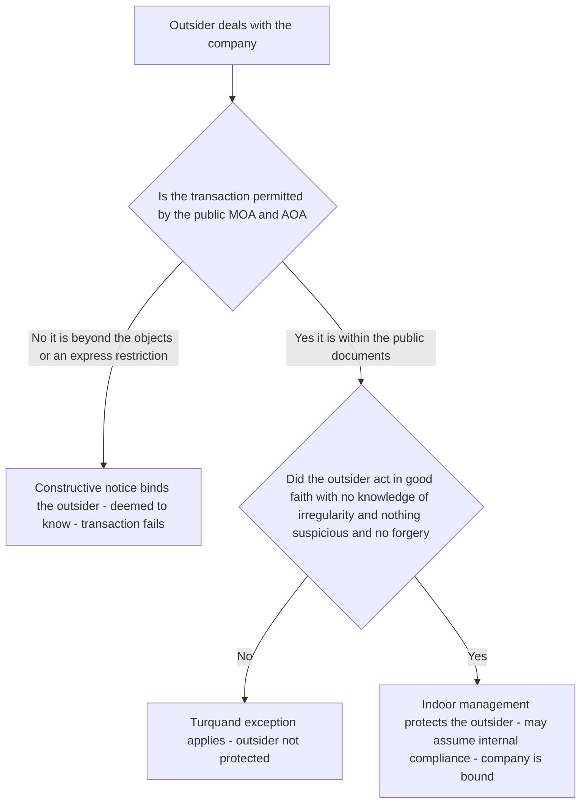
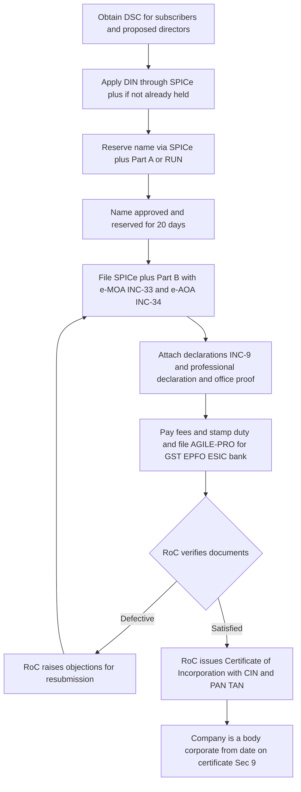
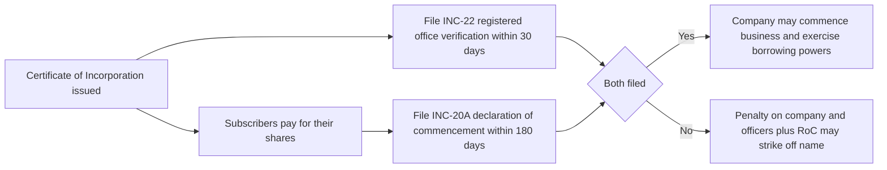

<!-- v2-deep -->

# Chapter 02 — Incorporation of a Company

> Guiding law of these notes: never memorise a section until you have felt the wound it was written to close. A company is an artificial person. It can own property, sue, be sued, borrow crores, and vanish overnight leaving creditors staring at empty offices. The entire law of incorporation exists to answer one dangerous question: *if we are going to let people create an immortal, faceless, limited-liability person out of thin air, how do we stop that person from becoming a weapon?*

---

## 1. The Problem — What goes wrong when a "company" can be born in secret

Imagine there were no incorporation law. Anyone could stand up tomorrow, call themselves "Reliance Global Traders Ltd", collect deposits from the public, sign contracts, and — when things went bad — simply disappear. There would be:

- **No public record.** A supplier extending 90 days credit has no way to check whether the "company" even exists, who owns it, where it is registered, or what it is allowed to do.
- **No accountability trail.** When the entity collapses, whom do you sue? Who were the real humans behind it? Where did the money go?
- **No fixed constitution.** The people running it could claim today they are a shoe business and tomorrow a chit-fund, changing their object whenever convenient, so no investor could ever pin down what their money would be used for.
- **Unlimited fraud by "limited liability".** Limited liability is a gift from society — it says "if the business fails, your personal house is safe." That gift is easily abused: promoters could pile up debts, shield themselves, and walk away rich while creditors starve.
- **The "one-way mirror" problem.** Outsiders dealing with the entity cannot see inside it. They don't know which director is authorised to sign, whether a board meeting really happened, whether the loan was properly approved. Either outsiders bear that risk (and stop dealing) or insiders bear it (and are trapped by their own paperwork). Somebody has to lose.

Every single rule in this chapter is a scar from one of these abuses. Incorporation is not bureaucracy for its own sake — it is the **price of admission** for the extraordinary privileges of separate personality and limited liability. The State says: *you may create this artificial immortal person, but only through a public, recorded, verified birth, with a written constitution, identifiable promoters, and clear rules about who the outside world can trust.*

**Why this matters more than it looks.** Notice that two very different groups need protection, and they pull in opposite directions:

- **Insiders** (members, especially minority members) need protection *from the managers* — that their money is spent only on the stated objects, that the constitution is not rewritten against them overnight.
- **Outsiders** (creditors, suppliers, lenders, employees) need protection *from the company* — that the entity is real, reachable, has genuine capital, and that the person who signed actually had authority.

A well-designed incorporation regime cannot maximise protection for both at once; every doctrine in this chapter is a *negotiated allocation of risk* between these two camps. When you read a rule, always ask: *whose risk did this shift, and to whom?* That single question unlocks almost every exam problem, because the examiner is nearly always testing whether you can identify which camp the law is protecting in a given fact pattern.

---

## 2. The Core Idea — Incorporation as a *public, documented birth in exchange for privilege*

The protective principle is a **bargain**:

> Society grants a company two magical powers — **separate legal personality** (it is a person distinct from its members) and **limited liability** (members risk only what they agreed to invest). In return, the company must be **born on a public register**, carry a **written and published constitution** limiting what it may do, and expose enough **identity and authority information** that the outside world can deal with it safely.

From this one bargain, everything flows:

1. **Public birth (registration with the Registrar of Companies).** A neutral State officer verifies documents and issues a birth certificate — the *Certificate of Incorporation* — which becomes the entity's legal DNA.
2. **A written constitution (MOA + AOA).** The **Memorandum of Association (MOA)** is the company's charter facing *outward* — its name, home State, objects, and liability. The **Articles of Association (AOA)** are the rulebook facing *inward* — how the company governs itself. Because these are public, the world can read the limits before dealing.
3. **Doctrines that split risk fairly between insider and outsider.** *Ultra vires* protects members and creditors from managers exceeding the objects. *Constructive notice* protects the company by deeming outsiders to have read the public documents. *Indoor management (Turquand's rule)* protects outsiders from hidden internal irregularities they could not have discovered.

Hold these three pillars in your head. The rest of the chapter is just detail hanging off them.

**A cleaner mental model — the three questions every rule answers.** If the whole chapter is a bargain, then every rule is one of only three moves in that bargain. Tag each rule you learn with one tag:

| The question | Whose protection | The rules that answer it |
|--------------|------------------|--------------------------|
| *Is this entity real and identifiable?* | Outsiders | Registration (Sec 7), certificate (Sec 9), promoter identity (2(69)), registered office (Sec 12), Sec 10A capital reality |
| *What is it allowed to do, and can I trust the change?* | Insiders / investors | Objects clause, ultra vires, hard MOA alteration (Sec 13), entrenchment (Sec 5) |
| *Can I trust the person in front of me who claims to bind it?* | Outsiders | Constructive notice, indoor management (Turquand), veil-lifting, statutory contract (Sec 10) |

If you can drop any rule from this chapter into one of these three rows, you already understand it. The section number is just an address.

---

## 3. Why it's built this way — the logic behind each safeguard

Before the section numbers, let us reason out *why each protective device exists*, so the numbers stick.

**Why require promoters to be named and accountable?**
Someone conceives the company, arranges its formation, and often profits from selling assets to it. If that person could hide, they could rig the founding deal — e.g., buy land for ₹10 lakh and secretly resell it to the new company for ₹50 lakh. So the law defines the **promoter** and imposes a **fiduciary duty**: full disclosure of any profit, no secret gains. Accountability begins before the company even breathes.

**Why a Memorandum with an objects clause?**
An investor hands money to a company on the faith that it will be used for a *stated purpose*. If managers could spend it on anything, the investor's bet is meaningless. The **objects clause** freezes the purpose in a public document. The doctrine of **ultra vires** then makes any act *beyond* those objects void — not merely voidable — precisely because we want investors to be able to rely on the limit absolutely.

**Why Articles at all, and why can outsiders be bound by them?**
Internal governance rules (who signs, quorum, borrowing limits) must be knowable. Making the AOA public lets counterparties check authority. The flip side — **constructive notice** — deems everyone to have read them, otherwise the public-document system is pointless.

**Why then soften constructive notice with the indoor management rule?**
Because pure constructive notice would be *cruel and impractical*. The public documents show that "the board may authorise a loan," but an outsider can never see whether the board *actually met and voted*. Making outsiders verify internal compliance would freeze commerce. So **Turquand's rule** says: outsiders may assume internal procedures were duly followed. Insider irregularities are the company's problem, not the counterparty's — unless the outsider knew, or the situation was suspicious (forgery, etc.). This is the law balancing the one-way mirror fairly.

**Why a formal registration certificate that is "conclusive"?**
If the validity of a company's birth could be reopened years later ("actually the paperwork was defective"), every contract it ever signed would be under a cloud. So once the Registrar issues the certificate, it is **conclusive evidence** of due incorporation. Certainty for the whole marketplace beats perfect purity of paperwork.

**Why distinguish a *public* company from a *private* company at all?**
The deepest divide in the Act is between companies that may tap the *general public* for money and those that stay close-held. Everything harsher — more members to form (7 vs 2), stricter disclosure, no right to restrict share transfer — attaches to the public company *because it puts the savings of strangers at risk*. The private company [Sec 2(68)] earns lighter treatment by *promising restraint*: it restricts the right to transfer shares, caps members at 200, and prohibits any invitation to the public to subscribe. The moment a company breaks those promises, it forfeits the concessions. So the public/private line is not a formality — it is the law calibrating protection to the width of the public's exposure. *This is why nearly every rule in the chapter has a "public vs private" fork; the examiner tests whether you know which side you are on.*

**Why let founders "entrench" some articles beyond a special resolution?**
Ordinarily majority rules. But a pure majority-rule constitution lets a 51% bloc strip a vulnerable minority (say, an investor who negotiated a veto) the day after signing. Entrenchment lets the constitution bind even the future majority, so bargained-for rights survive. The law tolerates this dilution of majority rule *because the alternative — no enforceable minority protection — would deter the very investment incorporation is meant to attract.*

Now, with the *why* in hand, the sections become obvious rather than arbitrary.

---

## 4. Full Technical Content — section by section, each with its reason

> Statute base: **Companies Act 2013** and the **Companies (Incorporation) Rules, 2014**. Where a precise number or limit is one commonly mis-stated, I flag *"confirm in ICAI material / bare Act."*

### 4.1 Promoters — Section 2(69)

**Definition [Sec 2(69)].** A *promoter* is a person:
(a) **named as such** in the prospectus or in the annual return (Sec 92); **or**
(b) who has **control over the affairs** of the company, directly or indirectly, as shareholder, director or otherwise; **or**
(c) in accordance with whose **advice, directions or instructions** the Board is accustomed to act.

*Why three limbs?* Limb (a) catches the openly named promoter; limb (b) catches the person controlling from the shadows; limb (c) catches the puppet-master behind nominee directors. The definition is drawn wide precisely so a real controller cannot escape duty by staying unnamed.
*Carve-out:* a person acting **merely in a professional capacity** (lawyer, CA, banker advising on formation) is **not** a promoter — otherwise no professional would help form a company.

**Finer distinction the exam tests — *who is NOT* a promoter.** The professional carve-out is narrow: it protects the professional *only while acting in that professional character*. The moment the CA/advocate takes shares to control the venture, or negotiates the founding purchase for a slice of the profit, he crosses into limb (b) and becomes a promoter with full fiduciary duty. *Trap:* the label ("I was only the auditor") does not save you; the **substance of the role** decides. Equally, a person who merely lends money for formation, or a director appointed *after* incorporation who took no part in floating the company, is **not** a promoter — promotion is a pre-birth activity.

**When does promotion begin and end?** It **begins** the moment a person conceives the idea and starts the steps to give the company reality (finding subscribers, negotiating the founding contracts, drafting the MOA). It **ends** when the Board takes over management of the newly-born company — typically once directors are in place and running affairs. This matters because a promoter's fiduciary duty and secret-profit liability attach only to the *promotion period*; a later ordinary transaction is judged by ordinary rules.

**Legal position & duties.** A promoter is **neither an agent nor a trustee** of the company (the company doesn't exist yet), but stands in a **fiduciary relationship** to it. Consequences:
- Must **not make secret profit**; any profit must be **disclosed** to an independent Board or the members and, if undisclosed, is **recoverable** and the contract may be rescinded.
- Must make **full disclosure** of interest in transactions with the company.
- Liable for **misstatements in the prospectus** (Sec 34/35) and may be liable in criminal fraud (Sec 447) for founding frauds.

**The two classic secret-profit patterns (examiner favourite).**
1. **Promoter sells his OWN asset to the company without disclosure.** He bought land for ₹10 lakh before promotion, then sells it to the company for ₹50 lakh. The ₹40 lakh is a **secret profit** *if not disclosed* — the company can either **rescind** the sale and take its money back, or (if it prefers to keep the land) **recover the undisclosed profit**. It cannot generally do both.
2. **Promoter, while already a promoter, buys an asset and flips it to the company.** Here he holds a fiduciary position *at the time of purchase*, so the profit belongs to the company outright — even full disclosure does not let him keep a profit made *out of* the fiduciary relationship without genuine, informed consent.
*The saving grace for the promoter:* disclosure to an **independent Board** or to the **whole body of members/shareholders** legitimises the profit. A disclosure to a Board he himself controls is **no disclosure at all** (the classic *Erlanger v New Sombrero Phosphate* point — disclosure must be to an independent organ).

**Remuneration of promoters.** A promoter has **no automatic right** to recover promotion expenses or claim payment from the company — the company was not a party to any agreement before it existed. In practice he is paid by (a) a lump sum or commission provided for in the articles, (b) sale of his property to the company at a *disclosed* profit, or (c) an option/allotment of shares. *Trap:* a bare clause in the articles is **not a contract** the promoter can sue on (Sec 10 binds members *inter se*, not outsiders — see 4.3); he depends on the company actually honouring it.

**Pre-incorporation (preliminary) contracts.** A company cannot be bound by contracts made *before* it existed — it had no legal capacity to authorise them. So:
- The company is **not bound**, and **cannot sue or be sued** on such a contract, and **cannot ratify** it (there was no principal at the time). *Memory hook: you cannot ratify on behalf of a person who was not yet born.*
- The **promoter is personally liable** on the contract (*Kelner v Baxter* — agents for a non-existent principal are personally bound).
- **Rescue route:** under the **Specific Relief Act 1963 (Secs 15(h) and 19(e))**, if the contract was for the *purposes of the company* and the company *adopts/warrants* it after incorporation, the other party can enforce it against the company. So the modern practical answer is: the company can take the benefit by adoption, but it is not automatic ratification.

**Two conditions the Specific Relief rescue quietly requires (fine distinction):** for the counterparty to enforce against the company, (i) the contract must have been entered into by the promoter **for the purposes of the company**, and (ii) the company must **accept/warrant/adopt** it after incorporation. Miss either and the promoter alone remains liable. *Also note the asymmetry:* Sec 15(h) lets the **other party** enforce against the company, and Sec 19(e) lets the **company** enforce against the other party — but *only if it has adopted the contract and communicated that acceptance*. The company cannot cherry-pick the benefit while denying the burden.

### 4.2 The Memorandum of Association (MOA) — Sections 2(56), 4, 13

**What it is.** The MOA is the company's **charter** — its supreme, outward-facing document defining its relationship with the outside world. *Why supreme?* Because it declares the very identity and boundaries of the artificial person; nothing the company does inside can exceed it.

**Clauses of the MOA [Sec 4] — the mnemonic "N-S-O-L-C-S" (Name, Situation, Object, Liability, Capital, Subscription):**

| # | Clause | What it fixes | Why it exists |
|---|--------|---------------|----------------|
| 1 | **Name** clause | The company's name, ending "Limited" / "Private Limited" (or licensed exception) | Public identity; the suffix warns the world that liability is limited |
| 2 | **Situation / Registered office** clause | The **State** in which the registered office is situated | Fixes jurisdiction — which High Court, which RoC — and a place to serve legal notice |
| 3 | **Object** clause | What the company may do | The heart of *ultra vires*; lets investors know the purpose of their money |
| 4 | **Liability** clause | Whether members' liability is limited by shares, by guarantee, or unlimited | Warns creditors how far members' pockets go |
| 5 | **Capital** clause | Authorised (nominal) share capital and its division | Caps how many shares can be issued; basis for stamp/fee |
| 6 | **Subscription (Association)** clause | Subscribers agree to take at least one share and form the company | The founding act — proof real people chose to associate |

*Finer point on the Situation clause:* the MOA fixes only the **State**, not the exact address. The precise address of the registered office is a **Sec 12** matter, notified in **INC-22**. *Why the split?* Moving office *within* a State does not disturb jurisdiction and should be easy; moving to *another* State changes the High Court and RoC and therefore needs the heavy Sec 13 procedure. Keep "State = MOA/Sec 13" and "address = Sec 12/INC-22" separate — the examiner mixes them.

*Finer point on the Subscription clause:* each subscriber must sign and **take at least one share** and write the number of shares taken against his name. For a company **limited by guarantee**, the equivalent is the guarantee clause, where each member undertakes to contribute a fixed sum to the assets *on winding up* — not now. That guarantee sum, not share capital, is the ceiling of his liability.

*Name-clause safeguards [Sec 4(2)–(4)]:* a name must **not be identical or too nearly resemble** an existing company/trademark, must **not be undesirable** in the Central Government's opinion, and must **not use restricted words** (e.g., "National", "Bank", "Stock Exchange", "Insurance", "Small Company") without approval — *why?* to prevent passing-off and public deception. A proposed name can be **reserved** via **RUN / SPICe+** and is valid for **20 days** (for a new company) from the date of approval — *confirm current limit in ICAI material.* For an **existing company** changing its name, a reserved name is valid **60 days** — *confirm current figure.*

*What if the RoC registers a name that later turns out to be too similar to an existing one?* Sec 16 gives a **rectification of name** remedy: the Central Government may direct a change (the company must comply within a set period), and a proprietor of a registered trademark may apply within a limited window (historically 3 years — *confirm current period*). So a wrong name is not fatal to incorporation; it is *curable* by direction. This dovetails with certificate-conclusiveness: the birth stands, only the label is corrected.

**Object clause under the 2013 Act.** The old split into "main / ancillary / other objects" is gone. Now the MOA states **the objects for which the company is proposed to be incorporated and matters considered necessary in furtherance thereof.** *Why simplified?* Because the old "other objects" list was abused to smuggle in unrelated businesses. *Fine distinction:* powers *reasonably incidental or ancillary* to the stated objects are **implied** even if not written — a manufacturing company may borrow, hire staff, and buy raw material without a separate clause, because those are the necessary means to the stated end. What is *not* implied is a *new line of business*.

**Doctrine of Ultra Vires — the reason the object clause has teeth.**
"*Ultra*" = beyond; "*vires*" = powers. An act **outside the objects clause** is **ultra vires the company** and **void** — it cannot be ratified even by *unanimous* shareholders, because ratification cannot cure something the company never had capacity to do. Leading case: ***Ashbury Railway Carriage & Iron Co. v Riche (1875)*** — a contract to finance railway construction was outside the objects (making railway carriages) and was held void even though every shareholder approved.
Consequences of ultra vires:
- The act/contract is **void ab initio**; neither side can enforce it.
- **Injunction:** any member can restrain the company from an ultra vires act (*Attorney-General v Great Eastern Railway* recognised the doctrine but confined it to genuine excess).
- **Directors personally liable** to restore company funds spent ultra vires (breach of duty).
- **Property acquired** ultra vires is still the company's property; and money/property traceable can be recovered.

**Ultra vires borrowing — a sharper sub-rule.** If a company *borrows* money for an ultra vires purpose, the loan is void and the lender cannot sue *on the loan as a debt*. But equity does not leave the lender wholly stranded: (a) **tracing** — if the borrowed money is still identifiable or was used to buy identifiable assets, the lender can trace and recover it; (b) **subrogation** — if the borrowed money was used to pay off the company's *lawful* (intra vires) debts, the lender steps into the shoes of the paid-off creditor to that extent. *Why?* The company should not be *enriched* by keeping money it had no capacity to borrow. This is a favourite twist: the loan is "void" yet the lender recovers — because recovery rests on tracing/subrogation, not on the void contract.

*Distinguish two "ultra vires" traps (examiner favourite):* an act may be ultra vires **the company** (beyond MOA — void, unrescuable) or merely ultra vires **the directors/Articles** (beyond internal authority but within the company's powers — this **can be ratified** by members). Only the first is fatal. A third, subtler layer: an act *within* the company's objects but done in *breach of a procedural condition* (no resolution passed) is neither — it is an **indoor-management** problem, curable by Turquand for an innocent outsider (see 4.5).

**Alteration of the MOA [Sec 13] — deliberately made hard.**
*Why hard?* Because the MOA is the promise on which outsiders relied; changing it lightly would betray that reliance. General rule: **special resolution (SR)** plus, for sensitive clauses, **extra approval.**

| Clause changed | What is required | Why the extra guard |
|----------------|------------------|----------------------|
| Name | SR **+ Central Government (RoC) approval** | Protects other businesses from confusing name changes |
| Registered office **from one State to another** | SR **+ Central Government (Regional Director) confirmation** [Sec 13(4)] | Shifts jurisdiction; creditors/employees of the old State must be heard |
| Registered office within same State but **different RoC jurisdiction** | SR **+ Regional Director confirmation** | Same protection at RoC level |
| Object clause | **SR** (and if the company raised money from public via prospectus and has unutilised amount, extra disclosure/exit) [Sec 13(8)] | Investors gave money for the old objects; they must be protected |
| Capital clause | SR (with Sec 61/64 procedure) | Alters shareholders' rights |
| Liability clause | Generally not increasable without member consent | You cannot enlarge a member's risk without agreement |

Every alteration must be **filed with the RoC** and takes effect on **registration** of the change. *Fine points:* (i) the **name change** takes effect only when the RoC issues a **fresh certificate of incorporation** reflecting the new name — until then the old name stands; (ii) the special resolution for a name/object change is filed in **MGT-14 within 30 days**; (iii) a registered-office shift *from one State to another* requires an application to the **Regional Director**, advertisement, and an opportunity for creditors and the affected RoC/State to object — because it can prejudice people who trusted the old jurisdiction.

*What the examiner tweaks:* "Can a company shift its registered office from Mumbai (Maharashtra) to Pune (Maharashtra)?" — same State, so no RD confirmation needed *unless* it crosses RoC jurisdiction; ordinary board/SR + INC-22 (and Sec 12 process) suffices. "From Mumbai to Bengaluru?" — different State → **Sec 13(4) + Regional Director confirmation**. Read the geography carefully.

### 4.3 The Articles of Association (AOA) — Sections 2(5), 5, 14

**What it is.** The AOA is the **internal rulebook** — the bye-laws for running the company: share issue and transfer, calls, board and general meetings, voting, directors' powers, dividends, borrowing, winding-up. *Why separate from the MOA?* Because the outside world cares about *what* the company is and may do (MOA), while members care about *how* it is governed (AOA). Two audiences, two documents. **The AOA is subordinate to the MOA** — where they conflict, the MOA prevails; and neither may violate the Act.

**MOA vs AOA — the comparison the exam wants in a table:**

| Feature | Memorandum (MOA) | Articles (AOA) |
|---------|------------------|----------------|
| Nature | Charter; defines the company to the outside world | Bye-laws; regulate internal management |
| Relationship | Supreme; subordinate only to the Act | Subordinate to **both** the Act and the MOA |
| Scope | Powers and objects (what the company *may* do) | The manner of exercising those powers (*how*) |
| Alteration | Hard — SR + often CG/RD approval (Sec 13) | Easier — SR + filing (Sec 14) |
| Effect of an act beyond it | Ultra vires the company → **void**, un-ratifiable | Merely irregular → **ratifiable**; outsiders may invoke Turquand |
| Compulsory? | Every company must have one | A company limited by shares may adopt Table F instead of registering its own |

**Model articles — Tables F, G, H, I, J [Sec 5, Schedule I].** The Act supplies ready-made articles by company type; a company may adopt them wholly, partly, or write its own. *Why offered?* To make formation cheap and to supply sensible defaults. *Default rule:* if a company limited by shares registers **no** articles, **Table F applies automatically**; if it registers articles that are silent on a point, Table F fills the gap unless expressly excluded.

| Table | For which company |
|-------|-------------------|
| **F** | Company limited by **shares** |
| **G** | Company limited by **guarantee having share capital** |
| **H** | Company limited by **guarantee without share capital** |
| **I** | **Unlimited** company having share capital |
| **J** | **Unlimited** company without share capital |

**Entrenchment [Sec 5(3)–(4)] — a lock inside the rulebook.** The articles may contain **entrenchment provisions** — clauses that can be altered only by conditions *more restrictive* than a special resolution (e.g., unanimous consent). *Why allow this?* To let founders/investors protect vital rights (e.g., a minority's veto) from being stripped by a bare majority. **How entrenchment is created matters:** on **formation** it may be included by the subscribers agreeing; **after** formation it can be added only by **all members** of a company (unanimous agreement) — because entrenchment binds everyone's future power, so everyone must consent. Entrenchment must be **noted to the RoC** (in the incorporation forms, or in the amendment filing) so the public knows the extra lock exists. *Fine limit:* entrenchment can make alteration *harder* than an SR, never *easier* — you cannot entrench a clause down to a mere ordinary resolution.

**Alteration of Articles [Sec 14] — easier than MOA, but bounded.** Alterable by **special resolution**, filed with RoC. *Why easier than MOA?* Because articles are the members' own internal arrangement; they should be free to re-govern themselves. **Limits (the guardrails):**
- Cannot conflict with the **MOA** or the **Act**.
- Cannot **increase a member's liability** to contribute more, without written consent (Sec 38 legacy principle carried into Sec 14/Sec 6 supremacy).
- Must be **bona fide for the benefit of the company as a whole**, not to oppress a minority.
- Cannot do anything **illegal or against public policy**, and cannot **override a court/Tribunal order**.
- Converting **private → public** or **public → private** via article change needs the added approvals below (Sec 14 proviso — private conversion needs Central Government/RD approval).
- Cannot be a **breach of contract with an outsider** disguised as a valid alteration — the *power* to alter always exists (a company cannot contract out of its statutory right to alter its articles), but if the alteration breaks a contract, the company must pay **damages** even though the alteration itself is valid (*Southern Foundries v Shirlaw*).

*Deeper why on "cannot contract away the power to alter":* the right to alter articles by SR is a **statutory** right. A company cannot sign away a statutory right by private agreement, because that would let founders freeze governance forever and defeat the Act. So the alteration is *always effective*; the only question is whether it triggers a damages claim for breaking a separate promise. This is a classic two-part answer: **(1) alteration valid; (2) damages payable if it breaches a contract.**

**The AOA + MOA as a contract [Sec 10].** Once registered, the MOA and AOA **bind the company and its members** as if signed by each, creating a **statutory contract**: member-to-company and member-to-member. *Note the classic limit — outsiders get no rights:* in ***Eley v Positive Life Assurance*** a solicitor whose appointment was written into the articles could not enforce it, because the articles are a contract among members *qua members*, not with outsiders. *The subtle corollary:* the contract binds a member only in his **capacity as a member**; a right conferred on a member in some *other* capacity (e.g., as the company's solicitor) is unenforceable through Sec 10, even though he is a member. *And member-to-member:* in some cases a member can enforce the articles *directly against another member* without joining the company (*Rayfield v Hands* — articles requiring directors who are members to buy a retiring member's shares were enforced member-to-member).

### 4.4 Doctrine of Constructive Notice — the price of public documents

Because the MOA and AOA are **registered and open to public inspection**, every person dealing with the company is **deemed to have read them and understood their contents** — whether or not they actually did. This is **constructive notice**. *Why?* Otherwise the whole point of publishing the constitution (letting outsiders check limits) would collapse; people would deal blindly and then claim ignorance. So the doctrine **protects the company**: if you contract with it in a way the public documents forbid, you cannot plead "I didn't know."

**How far does constructive notice reach?** It covers the **contents** of the MOA and AOA (and other documents registered and open to public inspection — e.g., special resolutions filed with the RoC). It does **not** extend to documents that are *not* on the public file (e.g., internal board minutes, the company's private correspondence). This boundary is exactly what makes room for the indoor-management rule: you are deemed to know the *public* limits, but you are *not* deemed to know whether the *private* internal steps were taken.

**A candid caveat the exam sometimes rewards.** Constructive notice is often called a doctrine of *diminishing practical force* — Indian courts have not applied it as harshly as the old English cases, and the indoor-management rule has eaten deeply into it. State it as the *company's* shield, but know that it is the weaker of the pair in practice, because it protects the party (the company) that is better placed to police its own affairs.

### 4.5 Doctrine of Indoor Management (Turquand's Rule) — the humane exception

Constructive notice, left alone, would be brutal: the documents may say "the board *may* borrow if authorised by resolution," but an outsider cannot witness whether the resolution was actually passed. So the courts created the **indoor management rule** (***Royal British Bank v Turquand, 1856***):

> An outsider dealing in good faith is entitled to **assume that all internal/procedural requirements have been duly complied with** ("the indoor management"). They need only ensure the transaction is *permitted* by the public documents; they need not verify that internal formalities *actually happened*.

*Why?* It fairly allocates the one-way-mirror risk. Outsiders can read public documents (so constructive notice binds them there); they *cannot* see inside the boardroom (so indoor irregularities are the company's risk).

**Exceptions — when an outsider CANNOT rely on Turquand's rule:**
1. **Knowledge of irregularity** — the outsider actually knew the internal procedure was not followed.
2. **Suspicion / negligence** — circumstances were suspicious and the outsider failed to inquire (put on inquiry) — *Anand Bihari Lal v Dinshaw*: a person dealing with an accountant who purported to transfer company property should have suspected the lack of authority.
3. **Forgery** — the rule never validates a **forged** document; a forgery is a nullity (***Ruben v Great Fingall Consolidated***). You cannot "assume" a forged signature is genuine.
4. **Acts outside apparent/ostensible authority** — the act was beyond even the *apparent* authority the office holder could have; no reasonable person would assume it (*Kreditbank Cassel v Schenkers* — a branch manager endorsing bills for his own debt).
5. **No knowledge of the articles at all** — a person who never read/relied on the articles cannot claim their benefit (*Rama Corporation v Proved Tin* — you cannot rely on a power you did not know existed).

*Fine line between exceptions 1/2 and the rule:* the outsider is protected only if acting in **good faith**. "Good faith" here means he did not know of the irregularity *and* nothing put a reasonable person on inquiry. A large, unusual transaction, or dealing with an officer for that officer's *personal* benefit, is a red flag that defeats good faith.

*Contrast to nail it:* **Constructive notice protects the company against outsiders** (you're deemed to know the public documents). **Indoor management protects outsiders against the company** (you may assume internal compliance). One shields the company; one shields the counterparty. Examiners love reversing these.

**The doctrines as two gates the outsider must pass:**

*Figure 3: The two-gate test — first clear the public document limit (constructive notice), then claim the internal-compliance assumption (indoor management).*

### 4.6 The Incorporation Procedure and Documents — Sections 3, 7

**Minimum members to form [Sec 3].**

| Company type | Minimum members to subscribe |
|--------------|------------------------------|
| **Public** company | **7** or more |
| **Private** company | **2** or more |
| **One Person Company (OPC)** | **1** |

*Why 7 / 2 / 1?* Public companies raise money from the wide public, so a broad founding base is expected; private companies are close-held; the OPC (a 2013 innovation) legitimises the solo entrepreneur who previously had to find a dummy second member.

**Do not confuse three separate counts (a top exam trap):**

| Count | Public | Private | OPC |
|-------|--------|---------|-----|
| Minimum **members** to form | 7 | 2 | 1 |
| Maximum **members** | No limit | **200** (past+present employee-members excluded) | 1 (+ 1 nominee) |
| Minimum **directors** | 3 | 2 | 1 |
| Maximum directors (Sec 149) | 15 (more by SR) | 15 (more by SR) | 15 |

*Why 200 max for a private company?* Beyond 200 the company is effectively raising from a public-sized crowd; the cap forces genuinely wide ventures into the public regime with its stronger disclosure. *Fine point:* joint holders of a share count as **one** member, and employee-members (present or past who became members while employed) are excluded from the 200 count.

**OPC — the finer eligibility rules the exam probes.** Only a **natural person who is an Indian citizen and resident in India** can form an OPC or be its nominee (*resident = stay in India of a specified number of days in the preceding financial year — verify current threshold, historically 182 then reduced to 120 days for the residency test*). A person can be a member of **only one OPC** and nominee of **only one OPC**. An OPC **cannot** carry out **Non-Banking Financial Investment** activities or be incorporated/converted into a **Sec 8 (charitable)** company. Every OPC must name a **nominee** (in INC-3) who steps in on the sole member's death or incapacity — because a one-person company must not die with its one person; perpetual succession still applies.

**Documents filed for registration [Sec 7(1)] — the birth file.** The application to the RoC (via **SPICe+ / INC-32**, with **e-MOA INC-33** and **e-AOA INC-34**) must include:

| Document | Purpose / the abuse it blocks |
|----------|-------------------------------|
| **MOA & AOA**, signed by subscribers | The constitution — objects, liability, governance |
| **Declaration by professional** (advocate/CA/CS/CWA) and by a subscriber/first director — **INC-8 / part of SPICe+** | States that all Act requirements are complied with — puts a licensed professional's neck on the line against fake filings |
| **Declaration by each subscriber & first director [Sec 7(1)(c)] — INC-9** | Affirms they are **not convicted / not guilty of fraud** in company formation — screens out disqualified founders |
| **Address for correspondence** until registered office is fixed | So the RoC can reach the company from day one |
| **Particulars of subscribers & first directors** (name, DIN, identity/address proof) | Identity trail — the accountability the whole system is built on |
| **Consent of first directors (DIR-2 / included)** and their **DIN** | No one becomes a director without knowing/consenting |
| **Registered office proof** (if given at incorporation; else file **INC-22 within 30 days**) | A real, verifiable place of business |

*Where subscribers sign electronically:* under SPICe+, the e-MOA (INC-33) and e-AOA (INC-34) are signed with **Digital Signature Certificates (DSC)**; physical signing with witnesses survives mainly where a subscriber is a **foreign national** without an Indian DIN/DSC (apostilled/notarised documents). *Why a professional declaration and a subscriber declaration both?* One is an *expert's* assurance of legal compliance (INC-8/professional), the other is the *founders' own* affirmation of clean hands (INC-9) — two independent gatekeepers, so a false birth needs two liars, not one.

**Effect of registration / Certificate of Incorporation [Sec 7(2), 9].**
On satisfaction, the RoC **registers** the documents and issues a **Certificate of Incorporation** with a **Corporate Identity Number (CIN)**. From the date in the certificate:
- The company is **born as a body corporate** [Sec 9] — a **separate legal person**, with **perpetual succession** and a **common seal** (seal now optional), capable of owning property, contracting, suing and being sued in its own name.
- The subscribers become **members**.

**Conclusiveness of the certificate.** Historically the certificate was treated as **conclusive evidence** that all requirements of registration were complied with and the company is duly incorporated — so its validity cannot be questioned merely for a procedural defect. *Why?* Certainty for everyone who later deals with the company. *Classic illustration — the date is conclusive too:* in ***Jubilee Cotton Mills v Lewis*** the certificate was held conclusive even as to the **date** of incorporation, validating an allotment that would otherwise have been premature. **But 2013 added an anti-fraud override [Sec 7(5)–(7)]:** if incorporation was obtained by **furnishing false information / suppressing material facts**, the promoters, first directors and persons making the declaration are liable for **fraud under Sec 447**, and the **Tribunal (NCLT)** may pass orders including regulation of the company, changes to liability of members, or even **removal of the name / winding up.** So: conclusive against *technical* defects, **not** a shield for *fraud*.

**Consequences of incorporation — the famous "separate personality" package.**
Anchor case: ***Salomon v Salomon & Co Ltd (1897)*** — once incorporated, the company is a person **distinct from Salomon himself**; he could be its secured creditor and rank ahead of unsecured creditors, because company debts are the company's, not his. Practical consequences:
- **Separate legal entity:** company owns its assets; members do **not** own company property (***Macaura v Northern Assurance*** — a member could not insure company timber in his own name, having no insurable interest). Indian echo: ***Lee v Lee's Air Farming*** — a sole controlling shareholder could *also* be an employee of "his" company, so his widow got workmen's compensation; the man and the company were two persons.
- **Limited liability:** members risk only unpaid amount on shares (or guarantee sum).
- **Perpetual succession:** members may die or transfer shares; the company lives on. *"Members may come and go, but the company goes on forever."*
- **Capacity to sue and be sued** in its own name; to **contract** and **hold property**.
- **Lifting the corporate veil (the counter-safeguard):** courts/statute will look *behind* the artificial person where it is used for **fraud, tax evasion, to defeat law, or as a sham/agent** — so incorporation cannot be a licence to cheat.

**Lifting the veil — organise the grounds (the exam wants a structure):**

- **Judicial (case-law) grounds:** (i) **fraud / improper conduct** — *Gilford Motor v Horne* (company formed to dodge a non-compete), *Jones v Lipman* (company used to escape a specific-performance decree on a land sale); (ii) **enemy character in wartime** — *Daimler v Continental Tyre* (look at the nationality of the controllers); (iii) **sham / façade / agency** — where the company is a mere cloak or agent of the controllers; (iv) **evasion of tax or a legal obligation** — *Re Sir Dinshaw Maneckjee Petit* (company formed only to split income and dodge tax); (v) **protection of public interest / revenue**.
- **Statutory grounds:** e.g., **fraudulent conduct of business** (officer personal liability), **mis-description of the company** on bills/cheques (signatory personally liable), **furnishing false info at incorporation** (Sec 7(5)–(7)), and liability for certain acts where the company is used to defeat the Act. *Note:* under the 2013 Act the old "reduction of membership below the minimum" personal-liability rule of the 1956 Act was **not carried forward** as a distinct veil-lifting ground — *confirm current position in ICAI material.*

### 4.7 Commencement of Business — Section 10A

**The abuse it fixes.** "Shell" companies were being incorporated with grand paid-up capital figures on paper, never actually receiving the subscription money, then used as fronts. So a **2018 insertion (Sec 10A)** re-introduced a commencement gate for companies **having a share capital and incorporated on or after 2 Nov 2018.**

Such a company **cannot commence business or exercise borrowing powers** unless:
1. Within **180 days** of incorporation, every subscriber files a **declaration (INC-20A)** that they have **paid the value of shares agreed to be taken**; **and**
2. The company has filed **verification of its registered office (INC-22)** with the RoC (within **30 days** of incorporation).

*Consequence of default:* penalty on the company (a fixed sum) and every officer in default (a per-day sum up to a cap — *verify current amounts in ICAI material*), and the **RoC may initiate removal of the company's name** if it believes no business is being carried on. *Memory hook: **180 days to prove the money is real; 30 days to prove the address is real.***

**Fine distinctions on Sec 10A:**
- It applies **only** to a company **having share capital**. A company **not** having share capital (e.g., a Sec 8 company limited by guarantee without capital) is **outside** Sec 10A. *Why?* The mischief was *fake paid-up capital*; a no-capital company has no such figure to fake.
- It bites two things: **commencing business** *and* **exercising borrowing powers**. A newborn cannot even borrow before the declaration — precisely the pipe through which shell frauds ran.
- The declaration is about **actual receipt** of the subscription money, matching the **capital reality** theme of the whole chapter (see the three-questions table in Section 2).

*(Distinguish from the old regime: the 2013 Act originally had a "certificate of commencement" concept under the earlier Sec 11, which was **omitted in 2015**, then the leaner Sec 10A came in 2018. If an old question refers to Sec 11 commencement certificate, note it was omitted — confirm in ICAI material.)*

### 4.8 Conversion Between Company Types

Because circumstances change — a private company wants public funding, or a bloated public company wants to go private, or an OPC outgrows the solo model — the Act provides orderly conversion, each with safeguards for the affected people.

**Private → Public [Sec 14 + Sec 18].** Pass **SR** to alter the AOA (delete the private-company restrictions of Sec 2(68)), increase members to at least 7 and directors to at least 3, file with RoC; the RoC issues a fresh certificate reflecting the changed status. *Why easy-ish?* Going public *increases* transparency and public protection, so the law is less anxious. *Note a "deemed public company" wrinkle:* even a private company that is a **subsidiary of a public company** is treated as a public company for many purposes — *confirm the current effect in ICAI material* — so the private label can be lost by ownership structure, not only by choice.

**Public → Private [Sec 14 + Sec 18].** Needs **SR** *and* approval of the **Regional Director (Central Government)** (post-2018 the power to approve such conversion shifted from the Tribunal to the RD). *Why harder?* Going private *reduces* public oversight and can trap/oppress minority holders and creditors, so an authority must confirm it's fair; creditors and members get a chance to object.

**OPC ↔ Private/Public [Sec 18, Rule 6 & 7 of Incorporation Rules].**
- **OPC → Private/Public:** may convert **voluntarily** (historically only after **2 years** from incorporation, unless thresholds were crossed) or **compulsorily** if it crossed thresholds — historically if **paid-up capital exceeded ₹50 lakh** or **average annual turnover exceeded ₹2 crore**; the **2021 amendment removed these mandatory thresholds and the 2-year wait**, allowing conversion any time — *confirm current position in ICAI material.*
- **Private → OPC:** allowed only for a private company with **paid-up capital and turnover within the OPC-eligibility limits** (historically capital ≤ ₹50 lakh and turnover ≤ ₹2 crore — the 2021 amendment liberalised this, *confirm*), by SR and NOC from members/creditors, since an OPC is meant for small solo ventures.

**Company limited by guarantee / unlimited ↔ limited by shares.** Permitted under **Sec 18 (conversion by alteration of MOA/AOA and re-registration)** with member approval and RoC filing; the conversion does **not** affect existing debts/obligations/contracts — *why?* creditors' rights cannot be wiped out by a mere change of corporate clothing.

**Golden thread of all conversions [Sec 18(3)]:** conversion **does not affect** the debts, liabilities, obligations or contracts incurred before conversion — they continue and may be enforced as if there were no conversion. The company changes its coat, not its history.

---

## 5. Applied Scenarios — reason your way to the answer

**Scenario 1 — The pre-incorporation land deal.**
*Facts:* Promoter P, before "GreenAgro Pvt Ltd" is incorporated, signs a contract in the company's name to buy farmland from F. After incorporation the company refuses to pay, saying "we never signed it." F sues the company.
*Reasoning:* At the date of contract the company did **not exist**, hence had no capacity to contract and cannot **ratify** (no principal existed). Under general company law the company is **not bound**; **P is personally liable** (*Kelner v Baxter*). *However*, under **Specific Relief Act 1963 (Sec 15(h)/19(e))**, since the contract was for the *purposes* of the company, if the company **adopts/warrants** it after incorporation, F can enforce it against the company.
*Outcome:* If the company adopted the contract, F enforces against the company; if not, F's remedy is against **P personally.** The company cannot "ratify," but it **can adopt.**
*Self-check:* We didn't say "ratify" — correct. We required *purpose of the company* + *adoption* — both Specific Relief conditions present. Consistent.

**Scenario 2 — The ultra vires loan vs the irregular loan.**
*Facts A:* A company whose objects are "manufacture of textiles" lends ₹2 crore to finance a friend's film. *Facts B:* The same company borrows ₹2 crore for its textile mill, but the board resolution authorising the borrowing was never actually passed; the lender bank checked the AOA (which permits borrowing on board authorisation) and lent in good faith.
*Reasoning A:* Financing films is **outside the objects** → **ultra vires the company** → the loan is **void**, not ratifiable even unanimously; directors are personally liable to restore funds (Ashbury principle).
*Reasoning B:* Borrowing is **within the objects and powers**; the only defect is an **internal procedural** one (no resolution). The bank read the public documents (constructive notice satisfied) and may **assume internal compliance** under **Turquand's rule** — unless it knew or was put on inquiry. Nothing suspicious here.
*Outcome:* Loan A is void and unenforceable; the company is **not** liable. Loan B **binds the company**; the bank recovers. Same amount, opposite result — because one breached the *outer* limit (MOA) and the other only an *inner* limit (procedure).

**Scenario 2A — the examiner's tweak: ultra vires *borrowing*.**
*Facts:* Reverse Loan A — the *company* borrows ₹2 crore for a purpose outside its objects. The lender wants his money back. Of the ₹2 crore, ₹1.2 crore is still lying in the company's bank account and ₹80 lakh was used to pay off a genuine, lawful trade creditor of the company.
*Reasoning:* The loan is **ultra vires and void**, so the lender cannot sue on it as a debt. But equity gives two recoveries: **tracing** the identifiable ₹1.2 crore still in the account, and **subrogation** for the ₹80 lakh — since it discharged a lawful debt, the lender steps into that creditor's shoes.
*Outcome:* Lender recovers **₹1.2 crore by tracing + ₹80 lakh by subrogation = ₹2 crore in substance**, though *not* "on the loan." *Self-check:* 1.2 + 0.8 = 2.0 crore — reconciles to the amount lent, and every rupee is recovered on a *non-contractual* footing, consistent with the loan being void. The trap avoided: writing "the lender gets nothing because the loan is void."

**Scenario 3 — Separate personality and insurable interest.**
*Facts:* Mr. M owns 99% of "Timber Co Ltd," which owns a stock of timber. M personally insures the timber in *his own name*. Fire destroys it; M claims.
*Reasoning:* On incorporation the timber belongs to the **company**, a separate person; M, though nearly sole owner, has **no insurable interest** in company property (**Macaura principle**). Ownership of shares ≠ ownership of the company's assets.
*Outcome:* The claim **fails.** The very separateness that gives M limited liability also denies him personal ownership of company assets — you cannot enjoy the shield and deny the wall.

**Scenario 4 — The forged share certificate.**
*Facts:* A company's secretary forges the directors' signatures on a share certificate and gives it to T, who claims to be a member relying on Turquand's rule.
*Reasoning:* Turquand's rule lets outsiders assume *procedural regularity*, but it **never validates forgery** (Ruben v Great Fingall). A forged instrument is a **nullity**; there is nothing to "assume regular."
*Outcome:* T acquires **no rights**; the company is not bound.

**Scenario 5 — Shell with no money (Sec 10A).**
*Facts:* "Nimbus Trading Ltd" (share capital) is incorporated on 1 Jan 2025. On day 40 it takes a bank loan and starts trading, but subscribers have not paid for their shares and no INC-20A/INC-22 is filed.
*Reasoning:* Under **Sec 10A**, a company with share capital cannot commence business or borrow until the **INC-20A** declaration of paid subscription (within **180 days**) and **INC-22** office verification (within **30 days**). It borrowed prematurely.
*Outcome:* Penalty on the company and officers in default; the borrowing power was exercised in violation of Sec 10A, and the **RoC may act to strike off** the company for not carrying on genuine business.

**Scenario 6 — The promoter's secret profit (numerical).**
*Facts:* Before promoting "Solaris Energy Ltd", promoter Q buys a plot for ₹40 lakh. Two months later, now actively promoting the company, he sells the *same* plot to Solaris for ₹1 crore, disclosing only to a Board consisting of his two brothers whom he controls. Solaris later discovers the facts.
*Reasoning:* Q made a profit of ₹1 crore − ₹40 lakh = **₹60 lakh**. Disclosure was to a Board he *controls*, which in law is **no disclosure** (must be to an independent Board or the general body of members — *Erlanger*). Two questions decide the remedy: (i) *Did he acquire the plot while already a fiduciary?* He bought it *before* active promotion, so the older pattern applies — the company may either **rescind** (return the plot, get its ₹1 crore back) or, keeping the plot, **recover the undisclosed profit of ₹60 lakh.** It cannot do both.
*Outcome — reconcile both routes:* Route 1 (rescission): company pays back the plot, recovers ₹1 crore → net cash position restored to before the deal. Route 2 (keep + recover profit): company keeps the plot and claws back ₹60 lakh → it has effectively bought a ₹40 lakh plot for ₹40 lakh (₹1 crore paid − ₹60 lakh recovered). *Self-check:* ₹1 crore − ₹60 lakh = ₹40 lakh = Q's original cost — so under Route 2 the company ends up paying exactly cost, stripping Q of the secret gain. Both routes leave Q with **no secret profit**, which is the doctrine's whole point. Consistent.
*Tweak:* if Q had bought the plot *while already a promoter*, the profit would belong to the company **outright** — mere later disclosure could not save even a smaller markup, because a fiduciary may not profit *from* the fiduciary relationship without fully informed consent.

**Scenario 7 — Alteration of articles that breaks a contract (two-part answer).**
*Facts:* "Vertex Ltd's" articles appoint R as managing director for 5 years. Two years in, the majority passes an SR altering the articles to remove the office of MD, and R is ousted. R sues to have the alteration declared void and to keep his post.
*Reasoning:* The power to alter articles by SR is **statutory and cannot be contracted away**, so the **alteration is valid** and R cannot keep the post (Sec 14; *Southern Foundries v Shirlaw* principle). *But* if R had a **separate service contract** (not merely the article), the alteration that makes performance impossible is a **breach**, entitling R to **damages** — not reinstatement.
*Outcome:* Alteration **valid**; R **cannot be reinstated**; R **recovers damages** *only if* he can show a separate binding contract beyond the bare article (recall *Eley* — an article alone gives an outsider-capacity right no standing). *Self-check:* two independent conclusions (validity of alteration; damages for breach) that do not contradict — the classic split answer.

**Scenario 8 — Which conversion route and what survives?**
*Facts:* "Delta Foods Pvt Ltd" wants to raise money from the public and become a public company. It currently has 4 members and 2 directors, and owes ₹3 crore to trade creditors.
*Reasoning:* Private → Public [Sec 14 + 18]: pass **SR** deleting the Sec 2(68) restrictions, raise **members to ≥ 7** and **directors to ≥ 3**, file with RoC; a fresh certificate issues. No Regional Director approval is needed (going *public* increases protection). By **Sec 18(3)**, the ₹3 crore of pre-conversion debt **survives** in full and is enforceable against the (now public) company.
*Outcome:* Delta adds ≥ 3 members and ≥ 1 director, converts by SR + filing, and remains liable for the ₹3 crore. *Self-check:* members 4 → ≥7 (add ≥3), directors 2 → ≥3 (add ≥1), debt unaffected — all three requirements addressed; direction of change (private→public) correctly mapped to the *easier* route. Consistent.

---

## 6. Procedure / Compliance Summary

**Incorporation — step by step (SPICe+ integrated process):**

*Figure 1: The incorporation pipeline — from digital signatures to a living body corporate.*

**Post-incorporation commencement gate (Sec 10A):**

*Figure 2: Sec 10A gate — 30 days to prove the address, 180 days to prove the money.*

**Key forms and timelines:**

| Form | Purpose | Timeline |
|------|---------|----------|
| **SPICe+ (INC-32)** | Integrated incorporation application | At formation |
| **INC-33 / INC-34** | e-MOA / e-AOA | With SPICe+ |
| **INC-9** | Subscriber & first-director declaration (no conviction/fraud) | With SPICe+ |
| **INC-3** | Nominee consent (OPC) | With SPICe+ (for OPC) |
| **AGILE-PRO (INC-35)** | GST, EPFO, ESIC, bank account, profession tax | With SPICe+ |
| **INC-22** | Verification of registered office | Within **30 days** of incorporation |
| **INC-20A** | Declaration for commencement of business | Within **180 days** of incorporation |
| **DIR-12** | Particulars/appointment of directors | As applicable |
| **MGT-14** | File special resolution (name/object/AOA change etc.) | Within **30 days** of the resolution |

**Alteration timelines (memory anchors):** most alterations require a **special resolution** and filing with RoC; registered-office change *outside the State* needs **Regional Director** confirmation; special resolutions are generally filed in **MGT-14 within 30 days**. A **name change** is effective only on issue of a **fresh certificate of incorporation**. *Confirm exact filing windows in ICAI material.*

**Approving authority — one-glance map (who signs off what):**

| Action | Members' resolution | Extra authority |
|--------|---------------------|-----------------|
| Alter Articles (Sec 14) | Special resolution | None (file RoC) |
| Alter object clause (Sec 13) | Special resolution | None (public-money exit if applicable) |
| Change of name (Sec 13) | Special resolution | Central Government / RoC (fresh certificate) |
| Registered office, same State same RoC | Board / SR as applicable | None (INC-22) |
| Registered office, another State (Sec 13(4)) | Special resolution | **Regional Director** confirmation |
| Public → Private conversion | Special resolution | **Regional Director** approval |
| Private → Public conversion | Special resolution | None |

*Figure/aid: the harder the loss of public protection, the higher the authority required.*

---

## 7. Connections — how this chapter wires into the rest of the syllabus

- **Chapter 01 (Preliminary / definitions):** the types of company — public, private [Sec 2(68)/2(71)], OPC [Sec 2(62)], small company [Sec 2(85)], government company [Sec 2(45)], Sec 8 (charitable) company — are the *inputs* to incorporation (minimum members, capital, name suffix). Note **Sec 8** companies are formed by a **licence** and may **omit "Limited"/"Private Limited"** from the name — an exception to the Sec 4 name-suffix rule.
- **Prospectus & Allotment (Sec 23–42):** the promoter's fiduciary duty and pre-incorporation liability flow directly into prospectus mis-statement liability (Sec 34/35) and the concept of a public offer; the Sec 2(69) "named in prospectus" limb links promoter status to prospectus law.
- **Share Capital & Debentures (Sec 43–72):** the capital clause of the MOA, and the alteration of capital (Sec 61/64), connect here; Sec 10A's "payment for shares" links to allotment and to the *actual receipt* of subscription money.
- **Management & Administration / Meetings (Sec 96–122):** special resolutions used to alter MOA/AOA, entrenchment, and MGT-14 filing; the *quorum/board-resolution* internals that Turquand lets outsiders assume.
- **Directors (Sec 149 onward):** first directors, DIN, consent (DIR-2), minimum/maximum directors, and disqualifications screened at incorporation (INC-9).
- **Registered office & name change:** ties to Sec 12 (registered office particulars, display of name, INC-22) and Sec 4 name rules and Sec 16 rectification of name.
- **Winding up / Strike off (Sec 248):** Sec 10A default and non-commencement feed directly into the RoC's power to strike a company off the register.
- **Other laws:** the **Specific Relief Act 1963** (pre-incorporation contracts), the **Indian Contract Act** (capacity to contract — why an unborn company cannot ratify; agent for non-existent principal), and **General Clauses Act** interpretive rules.

---

## 8. Traps & Examiner Tricks

1. **Ratify vs Adopt (pre-incorporation contracts).** The company **cannot ratify** (no principal existed) but **can adopt/enforce** under the Specific Relief Act. Writing "the company ratified" is wrong; "the company adopted" is right.
2. **Ultra vires the company vs ultra vires the directors.** Only *ultra vires the company* (beyond MOA objects) is **void and un-ratifiable**. *Ultra vires the directors/articles* is within company capacity and **can be ratified** by members. Examiners deliberately blur the two.
3. **Constructive notice vs indoor management — who is protected?** Constructive notice **protects the company** (outsider deemed to know public docs). Indoor management **protects the outsider** (may assume internal compliance). Reverse them and you lose the marks.
4. **Turquand exceptions.** Forgery is **never** cured; knowledge or suspicion defeats the rule. A candidate who applies Turquand to a forged document has fallen for the trap (Ruben v Great Fingall).
5. **MOA supremacy.** Where AOA conflicts with MOA, **MOA wins**; where MOA/AOA conflict with the **Act**, the **Act wins.** Both are subordinate to the statute.
6. **Certificate conclusiveness is not a fraud shield.** Post-2013, Sec 7(5)–(7) let the NCLT act (even winding up) where incorporation was by fraud/false info. Old notes calling the certificate "absolutely conclusive" are outdated. *But* it *is* conclusive as to purely technical/procedural defects and even the **date** (Jubilee Cotton Mills).
7. **Sec 11 vs Sec 10A.** The original commencement certificate (Sec 11) was **omitted in 2015**; the current gate is **Sec 10A (2018)** — 180 days / INC-20A. Don't cite the repealed section as live law.
8. **Minimum members trap.** *Members* to **form**: 7 (public) / 2 (private) / 1 (OPC). Don't confuse with *directors* (3 / 2 / 1), with the *maximum* members (200 for private, excluding certain persons), or with *maximum* directors (15).
9. **Name reservation validity.** For a **new** company the reserved name is valid **20 days** from approval; for an **existing** company changing name, **60 days**. *Confirm the current figures; they have changed over time.*
10. **Public→Private needs an authority; Private→Public does not.** Because going private reduces public protection, it needs Regional Director approval; going public increases transparency, so a simple SR + filing suffices.
11. **Salomon / Macaura / Lee trio.** Salomon = separate legal person (limited liability upheld). Macaura = members don't own company assets (no insurable interest). Lee = the same person can be both sole shareholder *and* employee. All three are faces of the *same* separateness principle.
12. **Veil-lifting is the safeguard on the safeguard.** Incorporation grants separateness; veil-lifting withdraws it where used for fraud/evasion/sham. Expect a scenario testing whether the veil should be lifted — organise the answer as *judicial* vs *statutory* grounds.
13. **Ultra vires borrowing is not "lender gets nothing."** The loan is void, yet the lender recovers via **tracing** (money still identifiable) and **subrogation** (money used to pay lawful debts). Writing "void, therefore lender loses everything" is the trap.
14. **State vs address in the situation clause.** The **MOA fixes only the State** (change → Sec 13). The **exact address is Sec 12/INC-22** (change within State → easy). Don't apply Regional Director confirmation to an intra-State, same-RoC shift.
15. **Disclosure to a controlled Board is no disclosure.** A promoter's secret profit is legitimised only by disclosure to an **independent** Board or the **whole body of members** (Erlanger). Disclosure to his own nominees does not save him.
16. **Alteration valid, contract breached — give the two-part answer.** A company cannot contract away its statutory power to alter articles; the alteration stands, but damages may follow for breaking a separate contract (Southern Foundries).
17. **Sec 8 name exception.** A charitable (Sec 8) company may drop "Limited"/"Private Limited." Don't mark such a name as defective under Sec 4.
18. **OPC one-OPC rule.** A natural person can be member of only **one** OPC and nominee of only **one** OPC; OPC cannot do NBFC-investment activity or be a Sec 8 company. These narrow eligibility points are frequent one-mark testers — *confirm current residency-day threshold.*

---

## 9. First-Principles Recap

Strip everything away and this chapter is one sentence: *society will let you conjure an immortal, limited-liability person, but only through a public, verified, documented birth, with a written constitution that fixes what the person is (MOA) and how it runs (AOA), plus a fair set of rules about whom the outside world can trust.*

- The **problem** was faceless, unaccountable, purpose-less entities defrauding the public under the cloak of limited liability.
- The **fix** is registration (public birth), a constitution (MOA outward + AOA inward), and three balancing doctrines: **ultra vires** (managers can't exceed the objects), **constructive notice** (you're deemed to know the public documents), and **indoor management** (but you may assume the hidden internals were done right).
- Every rule answers one of **three questions**: *is the entity real?* (registration, certificate, Sec 10A, office), *what may it do and can I trust a change?* (objects, ultra vires, hard alteration, entrenchment), *can I trust the person binding it?* (constructive notice, Turquand, statutory contract, veil-lifting).
- The **certificate** gives certainty; **Sec 7(5)–(7)** and **veil-lifting** stop that certainty from becoming a fraudster's shield.
- **Sec 10A** ensures the newborn actually has real money and a real address before it trades.
- **Conversion** lets the company change its clothes without escaping its past debts (Sec 18(3)).
- The whole design is a **risk allocation between insiders and outsiders**; when a fact pattern confuses you, ask *whose risk is this rule shifting, and to whom?*

If you can re-derive each section from the abuse it prevents, you never have to memorise it.

---

## 10. Quick-Revision Sheet

| Topic | Section | Key content / limit | One-line why |
|-------|---------|---------------------|--------------|
| Promoter (definition) | **2(69)** | Named, or controls affairs, or Board acts on his instructions | Catch the real controller, named or hidden |
| Promoter duty | (fiduciary) | No secret profit; full disclosure to *independent* Board/members; personally liable pre-incorporation | Founding deal must be honest |
| Pre-incorporation contract | Specific Relief Act **15(h)/19(e)** | Company can't ratify but can **adopt**; promoter personally liable (Kelner v Baxter) | Unborn person has no capacity |
| Formation — min members | **3** | Public **7**, Private **2**, OPC **1** | Match founding base to public exposure |
| Max members / directors | 2(68)/149 | Private max **200** members; directors 3/2/1 min, **15** max | Cap public-sized crowds; ensure a board |
| MOA — clauses | **4** | Name, Situation(State), Object, Liability, Capital, Subscription | Public charter facing outward |
| Name rules | **4(2)-(4), 16** | No identical/undesirable/restricted name; reserved **20 days** (new)/60 (existing); Sec 16 rectification | Prevent deception & passing-off |
| Ultra vires | (Sec 4 objects) | Act beyond objects **void**, un-ratifiable (Ashbury); borrowing recoverable by tracing/subrogation | Protect investors' stated purpose |
| Alter MOA | **13** | SR; +CG for name; +RD for office to another State; object SR; MGT-14 in 30 days | MOA promise not changed lightly |
| AOA | **5, Sch I Tables F–J** | Internal rulebook; model articles; Table F default; **entrenchment** allowed | Governance facing inward |
| Alter AOA | **14** | Special resolution; can't breach MOA/Act or increase liability; can't contract away power (Southern Foundries) | Members re-govern themselves |
| MOA/AOA as contract | **10** | Binds company & members inter se; outsiders excluded (Eley); member-to-member (Rayfield) | Statutory contract |
| Constructive notice | (doctrine) | Outsider deemed to know public docs; weak in practice | Protects the **company** |
| Indoor management | (Turquand) | Outsider may assume internal compliance; not for forgery/knowledge/suspicion/no-authority | Protects the **outsider** |
| Incorporation filing | **7** | SPICe+, e-MOA(33)/e-AOA(34), INC-9 declaration, professional declaration, office proof | Verified public birth |
| Certificate of Incorporation | **7(2), 9** | Body corporate, separate person, perpetual succession, CIN; conclusive even as to date (Jubilee) | The legal DNA |
| Fraud in incorporation | **7(5)-(7)** | Sec 447 fraud; NCLT may wind up/strike off | Certificate is no fraud shield |
| Separate personality | (Salomon/Lee) | Company distinct from members; Macaura – no member insurable interest; Lee – shareholder can be employee | The core magic |
| Veil lifting | (case + statute) | Judicial: fraud/enemy/sham/tax (Gilford, Daimler, Dinshaw); statutory: mis-description, fraudulent business, Sec 7(5) | Safeguard on the safeguard |
| Commencement of business | **10A** | INC-20A within **180 days** + INC-22 within **30 days**; only share-capital companies | No trading by empty shells |
| Registered office verification | **12 / INC-22** | Within **30 days** | A real, reachable address |
| Conversion (general) | **18** | Re-registration; debts survive **[18(3)]** | Change clothes, keep history |
| Private→Public | 14 + 18 | SR + raise members(7)/directors(3), file RoC | Increases transparency – easier |
| Public→Private | 14 + 18 | SR + **Regional Director** approval | Reduces oversight – guarded |
| OPC conversion | 18, Rules 6/7 | Voluntary/compulsory; 2021 removed mandatory thresholds & 2-yr wait | Solo venture outgrows itself |
| Sec 8 company | **8** | Charitable; formed by licence; may drop "Limited"; outside Sec 10A if no capital | Purpose over profit |

*Flag: verify the current name-reservation windows, OPC threshold/residency position (post-2021), Sec 10A penalty amounts, Sec 16 rectification period, and exact filing windows (MGT-14/INC forms) against the latest ICAI Study Material / bare Act before the exam, as these figures have been amended over time.*
