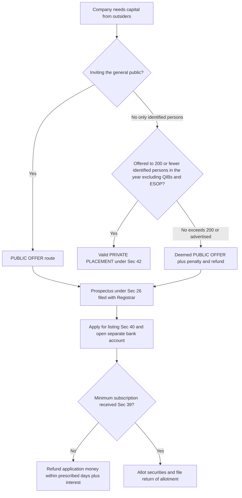
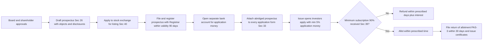
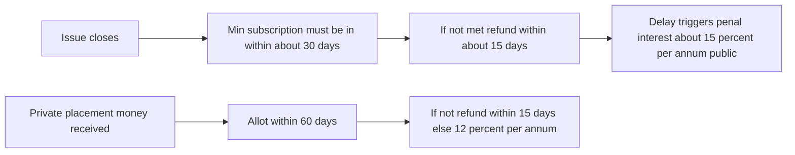

# Chapter 03 — Prospectus & Allotment of Securities

## 1. The Problem — Why This Chapter Exists

Imagine you have savings and no way to grow them. Down the road, a company wants to build a factory but has no money. There is an obvious match: you give them your savings, they give you a slice of ownership (shares) or a promise to repay with interest (debentures). This is the entire point of a **public offer** — a company reaching into the pockets of thousands of strangers to raise capital.

Now look at the asymmetry that makes this dangerous. The company knows **everything** about itself — its real profits, its lawsuits, the fact that the "revolutionary product" is a prototype that has never worked. You, the investor, know **nothing** except what the company chooses to tell you. You are handing over real money based purely on a document the company wrote about itself. The company writes the exam **and** grades it.

History is a graveyard of what happens when this asymmetry is left unregulated:

- **The pumped-up promise.** A company advertises "guaranteed 40% returns, factory already running, orders worth crores in hand." Fifty thousand people invest. The factory is a bare plot of land. The promoters take the money and vanish. This is the classic **misleading prospectus**.
- **The silent omission.** The document is technically all true — but it forgets to mention that the company is being sued for its entire net worth, or that the promoter was convicted of fraud last year. Nothing false was *said*; the killer fact was simply *left out*.
- **The money that never comes back.** The company says "we need ₹100 crore to build the plant." Only ₹10 crore comes in — nowhere near enough to build anything. Instead of returning the ₹10 crore, the company keeps it, limps along, and eventually collapses. Investors lose everything to a project that was never viable.
- **The rich-man's loophole abused on the public.** A company quietly issues shares to "a few select persons" to dodge all the public-offer rules — but "a few select persons" turns out to be thousands of ordinary investors solicited through a WhatsApp campaign. The company got public money while escaping every public-money safeguard.
- **The allotment games.** The company collects application money, then plays favourites — allotting to friends, sitting on refunds for months (earning interest on your money), or issuing shares without ever collecting the minimum needed to function.

Every single provision in this chapter is a scar left by one of these frauds. **Prospectus law is not paperwork — it is the law that forces the informed party to tell the uninformed party the truth, on pain of jail, before it can touch the public's money.** Learn each rule as the answer to a specific cheat, and you will never need to memorise it.

---

## 2. The Core Idea — The Protective Principle

The whole chapter rests on a single principle, borrowed from a phrase the courts have used for over a century:

> **"Disclosure is the price of the privilege of raising public money — and full, honest disclosure at that. The golden rule is that those who issue a prospectus must state the truth without concealment."**

Break this into its working parts:

1. **You may raise money from the public — but only through a controlled, standardised, *written* document (the prospectus).** No verbal promises, no "trust me." A document can be examined, filed, and used as evidence.
2. **That document must contain the whole truth.** Not just no lies (that is the low bar) but no *dangerous silences* either. An omission that misleads is treated exactly like a false statement.
3. **The people who put their names to it are personally on the hook.** Directors, promoters, experts, the company itself — if the document lies, they pay (civil) and can be jailed (criminal). Liability is personal so that no one can hide behind the corporate veil.
4. **The public's money is protected even after it is paid in** — through minimum subscription, escrow-style application accounts, strict refund timelines, and limits on where the money can go.
5. **If you want to escape these rules, you must genuinely not be touching the public** — hence the hard line between a **public offer** and a **private placement**, policed so tightly that any attempt to disguise a public issue as private automatically *becomes* a public issue with all its consequences.

Everything technical that follows is just this principle, sharpened into sections and numbers.

---

## 3. Why It's Built This Way — The Logic of Each Safeguard

Before the section-by-section detail, absorb the *design logic*. If you understand why each safeguard exists, the section numbers become hooks rather than random digits.

| The cheat it stops | The safeguard | The logic |
|---|---|---|
| "I'll just say it verbally / in an ad and deny it later" | Offer to public **must** be by a **prospectus**, a defined written document (Sec 2(70), 26) | A writing can be filed with the Registrar, dated, and produced in court. Speech evaporates; documents accuse. |
| "I'll dodge prospectus rules by not calling it a prospectus" | **Deemed prospectus** (Sec 25) | Substance over form. If the effect is a public offer, the label doesn't matter. |
| "I'll bury the bad facts / omit the lawsuit" | Mandatory contents + **omission = misstatement** (Sec 26, 34, 35) | The dangerous fact is usually the *hidden* one. Silence that misleads must carry the same penalty as a lie, or every fraudster would just stay quiet. |
| "The document lied but I'm a company, sue the empty shell" | **Personal** civil (Sec 35) and criminal (Sec 34) liability of directors, promoters, experts | Deterrence needs a human who can be fined and jailed. Companies don't feel fear; people do. |
| "We collected money for a project we can't fund" | **Minimum subscription** (Sec 39) | If you can't even raise the floor amount, the project is unviable — give the money back before it's wasted. |
| "I'll sit on your refund and earn interest" | Strict **refund timelines** + interest penalty (Sec 39, 40, rules) | Delay itself is a form of theft (time-value of money). Deadlines + penal interest remove the incentive to stall. |
| "I'll route the public issue to escape listing/monitoring" | Money in a **separate bank account**; securities in **demat**; **listing** requirement (Sec 40) | Ring-fence the public's cash so it can't be siphoned, and force transparency through the exchange. |
| "I'll issue to 'a few friends' — actually 5,000 people" | Hard cap on private placement (Sec 42) + auto-conversion to public issue if breached | The exemption is only fair if it's genuinely non-public. Breach the ceiling and you lose the exemption entirely. |
| "I'll keep changing my mind and issue prospectus after prospectus" | **Validity period** of prospectus; **shelf** and **red herring** variants for genuine multi-tranche needs | Give honest issuers efficient tools (shelf/RHP) so they don't need to cheat, while capping staleness. |

Notice the pattern: **each safeguard is a lock, and each lock was fitted after a specific burglary.** Now the details.

---

## 4. Full Technical Content — Section by Section, Each With Its "Why"

> Governing law: **Companies Act 2013, Chapter III — "Prospectus and Allotment of Securities"** (Sections 23 to 42), read with the **Companies (Prospectus and Allotment of Securities) Rules, 2014** and, for listed/public issues, **SEBI (ICDR) Regulations**. Where a precise sub-figure varies by rule amendment, I flag it — always confirm the exact limit in current ICAI material / the bare Act.

### 4.1 The gateway — how a company may issue securities (Sec 23)

**The problem:** A company could raise money through any random channel it invents, escaping oversight. **The fix:** Section 23 lists the *only* permitted routes.

- A **public company** may issue securities: (a) to the public by **prospectus** (public offer); (b) through **private placement** (Sec 42); or (c) through a **rights or bonus issue**. Listed / to-be-listed public issues also attract SEBI ICDR.
- A **private company** may issue securities only by (a) **private placement**, or (b) **rights/bonus issue** — a private company is, by definition, forbidden from inviting the public (Sec 2(68)). That prohibition is *why* it's private.

**Memory hook:** *Public company = three doors (public, private placement, rights/bonus). Private company = two doors (no public door).* The missing door is the whole point of being private.

### 4.2 What a "prospectus" is (Sec 2(70)) and when it's triggered

**Definition — Sec 2(70):** A prospectus is *any document described or issued as a prospectus*, and includes a **red herring prospectus**, a **shelf prospectus**, or **any notice, circular, advertisement or other document inviting offers from the public** for the subscription or purchase of securities.

**The logic of that fat definition:** Notice it doesn't say "a document titled Prospectus." It says *anything that invites the public to subscribe*. This is deliberate — it slams shut the "I didn't call it a prospectus" loophole. The trigger is the **invitation to the public**, not the label.

**"Public" — Sec 2 read with the private-placement rules:** an offer/allotment to **50 or more persons** (excluding QIBs and ESOP employees) in a financial year is deemed to be an **offer to the public**, dragging in the full prospectus regime — even if the company called it "private." (This 50-person trip-wire is the numeric border between Sec 42 and public-offer land.)

### 4.3 The four species of prospectus — each solves a different practical need

**The problem:** One rigid document type can't serve every honest fundraising situation. A giant issuer raising money in tranches, a retail investor who can't read 300 pages, a book-built IPO where the price isn't fixed yet — each needs a tailored instrument. Rather than let issuers improvise (and cheat), the Act gives four **named, regulated** variants.

| Type | Section | The problem it solves | Key feature | The "why" of its rule |
|---|---|---|---|---|
| **Ordinary / full prospectus** | Sec 26 | Baseline public offer | Full disclosure; filed with Registrar before issue | The gold standard — everything must be in it. |
| **Deemed prospectus** | Sec 25 | Company routes shares through an intermediary to dodge prospectus rules | Offer-for-sale document by an issuing house is *deemed* a prospectus of the company | Substance over form — the middleman can't be a laundering point. |
| **Shelf prospectus** | Sec 31 | Frequent issuer (e.g. a bank/NBFC) shouldn't re-file a full prospectus for every tranche | One prospectus valid up to **1 year**; file only a short **information memorandum** for later tranches | Cut repetition for honest repeat issuers; the 1-year cap stops stale disclosure. |
| **Red herring prospectus (RHP)** | Sec 32 | Book-built issues where price/quantity isn't fixed until bidding closes | Filed *before* the offer without complete price/number of securities; the final "closing" prospectus with price is filed after | Lets price be discovered by the market while still forcing near-full disclosure upfront. |
| **Abridged prospectus** | Sec 2(1) + Sec 33 | A 300-page prospectus is unreadable; every application form must still carry the gist | A short-form summary of the prospectus **must accompany every application form** | Retail investors actually read the short one — disclosure is useless if unreadable. |

**Memory hook for the species:**
- **Deemed = disguise** (25, the offer-for-sale trick).
- **Shelf = stock it for a year** (31 → put it "on the shelf").
- **Red Herring = price is Hidden** (32, the "red herring" is the missing price, a deliberate distraction).
- **Abridged = tiny, on the form** (33, attached to the application).

**Red herring detail (Sec 32):** *Red herring* literally means a misleading clue — here, the document that deliberately omits the price. Sequence: file RHP → open bidding → discover price → file the **final prospectus** (with price and number) with the Registrar and SEBI. Variations between RHP and final prospectus must be highlighted.

**Shelf detail (Sec 31):** Prescribed classes of companies (mainly financial institutions, banks, NBFCs — confirm the exact class list) may file a shelf prospectus valid for up to **one year** from the opening of the first offer. For each subsequent offer within that year, they file an **information memorandum** (Form PAS-2) disclosing *new* charges created, changes in financial position, and other material changes. The one-year validity is the anti-staleness guillotine.

### 4.4 Mandatory contents & registration of the prospectus (Sec 26)

**The problem:** If contents were optional, every issuer would disclose only the flattering facts. **The fix:** Sec 26 makes an explicit *minimum* content list, and requires the prospectus be **dated, signed, and filed** with the Registrar **before** it is issued.

Sec 26 broadly requires disclosure of:
- Details of the company, its directors, promoters, and their track record;
- **Objects of the issue** — exactly what the money will be used for (so you can't quietly divert it);
- Capital structure, terms of the issue, and rights attached to the securities;
- **Reports** — auditor's report, financial information, statements by experts;
- Material contracts and litigation;
- Minimum subscription amount, application money, underwriting details;
- A declaration of compliance.

**Registration mechanics:** the prospectus must be signed by every named director/proposed director (or their authorised agent) and **delivered to the Registrar for registration on or before publication**. A prospectus is valid for **90 days** from the date of registration — issue it after that and it's an unauthorised prospectus. **Memory hook:** *26 = "the contents section"; 90 days = one financial quarter of shelf life.*

**Why "objects of the issue" matters:** it is the anchor for later liability. If money raised for Object A is spent on Object B, that misuse traces straight back to this disclosed statement.

### 4.5 Variation in terms & the exit for dissenters (Sec 27) and misuse of application money (Sec 26/27)

**The problem:** Company raises money promising Object A, then the board changes the plan after your cash is in. **The fix — Sec 27:** the objects/terms stated in the prospectus can be varied **only** by a **special resolution** (postal ballot), and dissenting shareholders (those who didn't agree) must be given an **exit opportunity** by promoters/controlling shareholders at a price set per SEBI norms. You are not trapped in a company that changed the deal on you.

### 4.6 The heart of the chapter — Liability for mis-statements (Sec 34 & 35)

This is the most examined pair in the chapter. Understand the *split* between them.

**First, what counts as a "misstatement"?**
- A statement is deemed **untrue** if it is misleading in the form and context in which it appears; and
- An **omission** is treated as a misstatement if the omission is calculated to mislead (Sec 34's framing).
- **The killer principle:** *a half-truth is a whole lie.* Leaving out the pending bankruptcy suit misleads exactly as much as inventing a fake profit.

Now the two liabilities:

#### (a) Criminal liability — Section 34
**When:** the prospectus includes a statement that is **untrue or misleading**, or an **omission calculated to mislead**, and it was issued.
**Who:** every person who **authorised the issue** of the prospectus.
**Punishment:** this attracts the **fraud punishment under Section 447** — imprisonment of **6 months to 10 years** and fine of **the amount involved up to 3× that amount**. (Where the fraud involves public interest, the minimum jail is 3 years.)
**The escape (why it's fair):** a person is **not** criminally liable if they prove **either** (i) the statement/omission was **immaterial**, **or** (ii) they had **reasonable grounds to believe, and did up to the time of issue believe, that the statement was true** or the omission necessary. Honest, diligent belief is a defence — the law punishes fraud, not honest error.

**Memory hook:** *34 = the jail door → routes to 447 (fraud), the harshest section in the Act.* Think "34 knocks on 447's cell."

#### (b) Civil liability — Section 35
**When:** a person **subscribes** for securities **relying on** a prospectus containing an untrue statement and **suffers loss or damage**.
**Who is liable (compensate the investor):**
- every **director** at the time of issue;
- every person who **agreed to be named as a director**;
- every **promoter**;
- every person who **authorised the issue**; and
- an **expert** (to the extent of their part).

**Remedy:** they are **jointly and severally liable** to **compensate** every affected subscriber for loss/damage.
**The defences (why each is fair):** a defendant escapes if they prove:
1. they **withdrew consent** before issue and the prospectus was issued without their authority; **or**
2. it was issued without their **knowledge/consent**, and on becoming aware they gave **public notice**; **or**
3. they had **reasonable grounds to believe** the statement was true (for their own statements) or reasonably relied on an **expert** for the expert's part.
**But note:** where the misstatement was made to defraud/induce, these defences **do not** protect a person, and liability can extend without limit.

**The clean contrast to memorise:**

| | **Sec 34 — Criminal** | **Sec 35 — Civil** |
|---|---|---|
| Purpose | Punish the wrongdoer (society's remedy) | Compensate the victim (investor's remedy) |
| Trigger | Untrue/misleading statement or misleading omission issued | Subscriber **relied** on it and **suffered loss** |
| Need actual investor loss? | **No** — the crime is issuing it | **Yes** — no loss, no compensation |
| Outcome | Jail + fine via **Sec 447** | Pay **compensation** |
| Core defence | Immaterial, or honest reasonable belief | Withdrew consent / no knowledge + public notice / reasonable belief / expert reliance |

**Memory hook:** *34 before 35 = Crime before Compensation (alphabetical C-C, and 34 < 35).* Criminal punishes the act; Civil needs a wounded victim.

#### (c) Fraudulently inducing investment — Section 36
**Problem:** someone lures investors by knowingly false or reckless statements *outside* a formal prospectus (a road-show promise, a deceptive circular). **Fix — Sec 36:** any person who **knowingly or recklessly** makes a false/deceptive/misleading statement to induce persons to invest is liable for **fraud under Sec 447**. Closes the "it wasn't in the prospectus" gap.

#### (d) Class action / remedy route — Section 37
Affected persons (a group of subscribers) may take **action** — including under **Sec 245 class action** — against the company, directors, auditors, and experts. **Why:** one small investor can't afford to sue; collective action makes liability real.

### 4.7 Personation for acquisition of shares (Sec 38)

**Problem:** People apply for shares in **fictitious names** (to grab more of an oversubscribed IPO, or to manipulate allotment). **Fix — Sec 38:** applying under a fictitious name, or making multiple applications under different names, or inducing a company to allot to fictitious persons, is **fraud punishable under Sec 447**. The court may also order **disgorgement** and freezing. **Why so harsh:** fake applications corrupt the fairness of allotment for every genuine investor.

### 4.8 Minimum subscription & application money (Sec 39) — protecting the money at entry

**Problem:** A company collects money for a ₹100-crore project but raises only ₹8 crore. The project is dead on arrival, yet the company keeps the cash. **Fix — Sec 39:**

- **No allotment** shall be made unless the **minimum subscription** stated in the prospectus has been **subscribed** and the application money received (by cheque/other instrument that has been paid). For SEBI-regulated public issues the floor is **90% of the issue**.
- **Application money** per security must be **at least 5% of the nominal amount** of the security (or as SEBI specifies).
- If minimum subscription is **not received within 30 days** of prospectus issue (SEBI norm; the Act says "such period as prescribed"), all application money must be **refunded within the prescribed time** (commonly **15 days** from closure). **Delay → interest** at the prescribed rate (e.g. **15% p.a.**) and the money is deemed held in trust.
- Default in filing the return of allotment / refund carries **fines** on company and officers.

**Memory hooks:** *39 = "the floor". 90% = "you must nearly fill the room before you open the doors." 5% application money = "a small deposit to prove you're serious." 15 days / 15% = "refund fast or pay 15% for stalling."* (Confirm the current % and day figures in ICAI material, as SEBI ICDR fine-tunes them.)

### 4.9 Securities to be dealt in on stock exchange + application money handling (Sec 40)

**Problem:** A public issue with no listing route traps investors in unsellable paper; and pooled application money is a tempting target for siphoning. **Fix — Sec 40:**

- Before issuing a prospectus, a company making a public offer must **apply to one or more stock exchanges** for **listing permission** and state which exchange(s) in the prospectus. **No listing permission → allotment is void**, and money must be **repaid** (with interest if delayed).
- All **application money** received must be kept in a **separate bank account** with a scheduled bank, and used **only** for (i) adjustment against allotment, or (ii) **repayment** where minimum subscription/listing fails. It cannot be dipped into for anything else.
- A company may **pay commission** (underwriting/brokerage) out of this only as permitted.

**Memory hook:** *40 = "the safe" — separate account (ring-fenced cash) + listing (an exit door).* Think "40 locks the money in a safe and cuts an escape hatch."

### 4.10 Global Depository Receipts (Sec 41)

**Problem/need:** an Indian company wants to raise money **abroad**. **Fix — Sec 41:** a company may, after a **special resolution**, issue **depository receipts (GDRs)** in any foreign country in the prescribed manner. (Mechanism-level; know that it needs a **special resolution** and prescribed rules.)

### 4.11 Private placement (Sec 42) — the controlled non-public door

**Problem:** Companies abused "private" issues to raise public money without any public-offer safeguards — soliciting thousands under the "private placement" banner. **Fix — Sec 42** built a tight cage around private placement so it stays genuinely private.

**Definition:** private placement = offer/invitation to subscribe securities to a **select group of identified persons** (identified by the Board) through a **private placement offer letter (Form PAS-4)**, and **not** through a public advertisement/general solicitation.

**The hard limits (each an anti-abuse trip-wire):**

| Rule | Limit | The "why" |
|---|---|---|
| Number of persons | Offer to **≤ 200 persons** in aggregate in a **financial year** (per kind of security), **excluding QIBs and ESOP employees** | The instant it crosses 200 real investors it *is* public — so cap it below public scale. |
| Identified persons | Offer only to persons **named/identified** by the Board; record maintained in **Form PAS-5** | "Select persons" must be genuinely selected in advance, not the general public. |
| No public solicitation | **No advertisement / general media / general solicitation** allowed | Any broadcast to the public destroys the "private" character. |
| Money route | Subscription only by **cheque/DD/banking channel** (no cash), kept in a **separate bank account** | Cash = untraceable; banking channel = audit trail, anti-money-laundering. |
| Application money use | Cannot **utilise** money until **allotment is made and return filed** | Stops the company spending money before the issue is even complete. |
| Time to allot | Allot within **60 days** of receiving money; else **refund within 15 days**; delay → **12% p.a. interest** | Don't sit on private investors' money either. |
| Fresh offer bar | Generally **no fresh offer** while a prior offer is pending/incomplete | Prevents rolling, overlapping issues that dodge the 200 cap. |
| Return of allotment | **Form PAS-3** within **15 days** of allotment | Registrar gets a record; transparency even in private issues. |

**The nuclear consequence (the point of the whole section):** if a company makes an offer/allotment in **breach** of Sec 42 (e.g. exceeds 200 persons, or advertises to the public), the offer is **deemed a public offer** and all provisions of the Act **and SEBI/SCRA** apply — **plus a heavy penalty** (up to the **amount raised or ₹2 crore, whichever lower**) and **refund** to subscribers **within 30 days**. In other words: try to smuggle a public issue through the private door, and the law forcibly re-labels it a public issue with every safeguard attached, and fines you on top.

**Memory hooks for Sec 42:** *42 = "the private club with a 200-seat limit and a strict guest list."* Numbers: **200 members, 60 days to allot, 15 days to refund, 12% penalty interest, PAS-4 letter / PAS-5 register / PAS-3 return.* The forms count **4 → 5 → 3** (offer letter, record of offer, return of allotment).

---

### 4.12 Master diagram — the public-vs-private decision

*Figure 3.1 — The single most important flow: which door you walked through, and what each door demands.*

---

## 5. Applied Scenarios — Reasoning to the Legal Outcome

**Scenario 1 — The optimistic omission.**
*Bright Future Ltd issues a prospectus showing strong projected profits. It does not mention that a supplier has sued it for ₹50 crore — an amount exceeding its net worth. Investors subscribe; when the suit surfaces, the share price collapses. Ravi, who invested relying on the prospectus, loses ₹4 lakh.*

**Reasoning:** Nothing false was stated, but a **material omission calculated to mislead** is treated as a misstatement (Sec 34). Ravi **relied** on the prospectus and **suffered loss** → **civil liability under Sec 35**: the directors, promoters and those who authorised the issue are **jointly and severally liable to compensate** Ravi. Because the omission of a company-threatening lawsuit is plainly *material*, the "immaterial statement" defence fails; a director can only escape by proving he withdrew consent, lacked knowledge and gave public notice, or had reasonable grounds to believe disclosure was unnecessary. Separately, those who **authorised** the misleading prospectus face **criminal liability under Sec 34 → Sec 447** (jail + fine) — and Ravi does **not** need to prove his loss for the *criminal* case, only for compensation. **Outcome:** Ravi recovers compensation; directors risk prosecution.

**Scenario 2 — The "private" issue that wasn't.**
*Zoom Tech Pvt Ltd wants ₹30 crore. It emails a "private placement offer" to 260 hand-picked people and also posts the offer on its public website. 240 subscribe.*

**Reasoning:** Two independent breaches of **Sec 42**: (i) offer to **more than 200 persons** in the year, and (ii) **public solicitation** via the website. Either breach alone destroys the private character. **Consequence:** the offer is **deemed a public offer** — but a *private company cannot make a public offer at all* (Sec 23/2(68)). So the company is doubly exposed: the whole issue is treated as a public offer attracting the full prospectus regime and SEBI/SCRA, **plus** a penalty up to the **amount raised or ₹2 crore (whichever lower)** and **refund within 30 days**. **Outcome:** issue invalid as structured; penalty + mandatory refund; a private company simply cannot cure it by "going public" without first converting.

**Scenario 3 — The underfilled issue.**
*Mega Infra Ltd's prospectus states a minimum subscription needed of ₹100 crore for a plant. By the close, only ₹60 crore (60%) has come in. The board wants to allot anyway and start partial construction.*

**Reasoning:** **Sec 39** bars allotment unless **minimum subscription** (for SEBI issues, **90%**) is received. 60% is below the floor → **no allotment permitted**. The application money must be **refunded** within the prescribed period (commonly 15 days from closure); if the company delays, it must pay **penal interest** (e.g. 15% p.a.) and directors/officers face fines, and the money is deemed held in trust in the **separate account (Sec 40)**. **Outcome:** the board **cannot** allot; it must refund on time or bleed interest. The logic: an underfunded project must return the money, not consume it.

**Scenario 4 — The shelf-and-tranche financier.**
*Steady Finance Ltd, an NBFC, wants to raise debentures four times over the coming year. It dreads filing a full prospectus four times.*

**Reasoning:** This is exactly what **Sec 31 (shelf prospectus)** exists for. Steady Finance (a permitted class) files **one shelf prospectus valid up to 1 year**; for each subsequent tranche it files only an **information memorandum (PAS-2)** disclosing new charges and material changes. **Outcome:** legitimate efficiency — no cheating needed, because the Act already built the honest shortcut.

---

## 6. Procedure / Compliance Summary

### 6.1 Public issue by prospectus — the sequence

*Figure 3.2 — Public-issue compliance chain, each box a statutory checkpoint.*

### 6.2 Key forms & timelines (both routes)

| Form | Purpose | Route |
|---|---|---|
| **PAS-2** | Information memorandum for shelf-prospectus tranches | Public (shelf) |
| **PAS-3** | Return of allotment (file within 15/30 days of allotment) | Both |
| **PAS-4** | Private placement offer-cum-application letter | Private placement |
| **PAS-5** | Record of private placement offers (identified persons) | Private placement |

### 6.3 Refund / allotment timeline (memory strip)

*Figure 3.3 — Two parallel clocks: public-issue refund vs private-placement allot-or-refund. Confirm exact day/percent figures in current ICAI/SEBI material.*

---

## 7. Connections — How This Chapter Links to the Rest

- **Chapter on Incorporation / Types of Companies:** *why* a private company (Sec 2(68)) can't make a public offer flows straight into Sec 23 and Sec 42 here. A **One Person Company** and **private company** are locked out of the public door.
- **Share Capital & Debentures:** allotment completed here becomes the **capital** administered there; **return of allotment (PAS-3)**, share certificates, and calls follow.
- **Sec 447 (Fraud):** the enforcement engine behind Sec 34, 36 and 38 — the same punishment section recurs, so master it once.
- **Sec 245 Class Action & NCLT:** the *forum* where Sec 37 collective remedies are pursued.
- **SEBI Act & SEBI (ICDR) Regulations:** for **listed** public issues, SEBI overlays disclosure, minimum-subscription (90%), and timeline rules on top of the Companies Act — the Act sets the floor, SEBI tightens it.
- **Deposits (Sec 73–76):** contrast — deposits are *borrowing from the public without shares*; both chapters share the theme of protecting public money, but through different machinery.
- **Law of Contract / Misrepresentation:** Sec 34–35 are the company-law specialisation of the general contract idea that inducing a contract by false statements gives rise to liability.

---

## 8. Traps & Examiner Tricks

1. **34 vs 35 swap.** The classic trap: describing Sec 35 as "imprisonment." **Sec 34 = criminal (jail via 447); Sec 35 = civil (compensation).** Civil needs *reliance + actual loss*; criminal does not need a suffering investor.
2. **Omission is not "safe."** Students assume only false *statements* are punishable. A **misleading omission** is expressly a misstatement (Sec 34). *Half-truth = whole lie.*
3. **"Public" is a number, not a vibe.** The **50-person** line (Sec 42 area) converts a "private" offer into a public offer; the **200-person** ceiling caps private placement per year. Don't confuse the two: **50** is the public-offer trip-wire baked into the private-placement rules; **200** is the annual private-placement headcount cap. QIBs and ESOP employees are **excluded** from both counts.
4. **Deemed prospectus (Sec 25) ≠ Red herring (Sec 32).** *Deemed* = an offer-for-sale document dressed up to dodge the rules (disguise). *Red herring* = a genuine prospectus with the **price** left out (book-building). Totally different problems.
5. **Shelf validity is 1 year; prospectus registration validity is 90 days.** Don't cross the numbers.
6. **Private company + public offer = impossible, not merely penalised.** A breach of Sec 42 by a *private* company can't be cured by "treating it as a public offer" because a private company is barred from public offers outright — it must first convert.
7. **Application money ≥ 5%; minimum subscription (SEBI) = 90%.** These are different figures for different things: 5% is per-security upfront money; 90% is how much of the *whole issue* must be subscribed. Confirm current figures.
8. **Expert's defence under Sec 35** protects a director who *reasonably relied on an expert*, but the **expert himself** is liable for *his* part. Don't let the director's shield cover the expert.
9. **"Reasonable belief" defence** (Sec 34/35) must exist **up to the time of issue** — a director who *later* discovers the truth but did nothing loses the shield; but honest belief held throughout is a genuine escape. The law targets fraud, not honest mistake.
10. **Sec 39 "no allotment" is a bar, not a formality.** An allotment made without minimum subscription is **irregular** and refundable — examiners love asking whether the board "can just allot anyway." It cannot.
11. **Sec 42 money can't be touched pre-allotment.** Even in a valid private placement, utilising subscription money before allotment + return filing is a breach.

---

## 9. First-Principles Recap

Strip everything away and rebuild it from the single fault line: **the company knows the truth; the investor does not.** Every rule is one of three moves against that asymmetry:

1. **Force the truth out (disclosure).** A defined written **prospectus** (Sec 2(70), 26) with mandated contents, filed with the Registrar, in variants tuned to honest needs (**deemed 25, shelf 31, red herring 32, abridged 33**). *Because* speech evaporates and omissions kill, everything must be written and complete.

2. **Punish the lie (liability).** **Criminal (Sec 34 → 447)** to deter, **Civil (Sec 35)** to compensate, **fraudulent inducement (36)** and **personation (38)** to close side-doors — all personal, so no one hides behind the company. *Because* deterrence needs a human who can be jailed and a victim who can be paid.

3. **Guard the money (entry controls).** **Minimum subscription (39)** so unviable projects refund; **separate account + listing (40)** to ring-fence cash and give an exit; **private placement cage (42)** so the non-public door can't smuggle a public issue. *Because* money, once pooled, is the thing everyone is really fighting over.

If you can regenerate any section from "which cheat does this stop?", you have understood the chapter, not memorised it.

---

## 10. Quick-Revision Sheet

| Section | Topic | Key number / limit | One-line "why" |
|---|---|---|---|
| **23** | Modes of issue | Public co = 3 doors; Private co = 2 (no public) | Channels the fundraising into controlled routes |
| **2(70)** | Prospectus defined | Any document inviting the public | Kills the "didn't call it a prospectus" loophole |
| **25** | Deemed prospectus | Offer-for-sale via issuing house | Substance over form (disguise) |
| **26** | Contents & registration | Valid **90 days**; filed before issue | Mandatory minimum disclosure |
| **27** | Variation in terms | **Special resolution** + exit to dissenters | Can't change the deal after taking your money |
| **31** | Shelf prospectus | Valid **1 year**; PAS-2 per tranche | Efficiency for frequent honest issuers |
| **32** | Red herring | Price omitted; final prospectus after bidding | Enables book-building price discovery |
| **33** | Abridged prospectus | Must accompany every application form | Retail investors actually read it |
| **34** | Criminal liability | Jail via **Sec 447** (6 mo–10 yr) | Punish issuing an untrue/misleading prospectus |
| **35** | Civil liability | Compensation; joint & several | Compensate subscriber who relied & lost |
| **36** | Fraudulent inducement | Fraud → **447** | Closes the "not in the prospectus" gap |
| **37** | Class action remedy | Group action (see Sec 245) | Makes liability enforceable collectively |
| **38** | Personation | Fraud → **447**; disgorgement | Protects fairness of allotment |
| **39** | Minimum subscription | ≥ **90%** (SEBI); app money ≥ **5%**; refund ~**15 days**/**15%** | No allotment for an underfunded project |
| **40** | Listing + money handling | Separate bank a/c; no listing = void allotment | Ring-fence cash + provide an exit |
| **41** | GDR | **Special resolution** | Route to raise money abroad |
| **42** | Private placement | ≤ **200** persons/yr (ex-QIB/ESOP); allot in **60 days**; refund **15 days**/**12%**; PAS-4/5/3; breach = deemed public + penalty up to amount raised or **₹2 cr** | Keeps the non-public door genuinely non-public |

**Number-memory ladder:**
- **50** = public-offer trip-wire · **200** = private-placement annual cap
- **90 days** = prospectus validity · **1 year** = shelf validity
- **5%** = application money floor · **90%** = minimum subscription (SEBI)
- **60 days** to allot (private) · **15 days** to refund · **12%** (private) / **15%** (public) penal interest
- **34** = Criminal → **447** · **35** = Civil (Compensation) · **447** = the fraud hammer behind 34/36/38

> **Always confirm the exact current percentages, day-counts, and class lists against the latest ICAI study material, the bare Companies Act 2013, the PAS Rules 2014, and SEBI (ICDR) Regulations — SEBI periodically fine-tunes the numeric thresholds while the underlying principles in this chapter stay fixed.**
