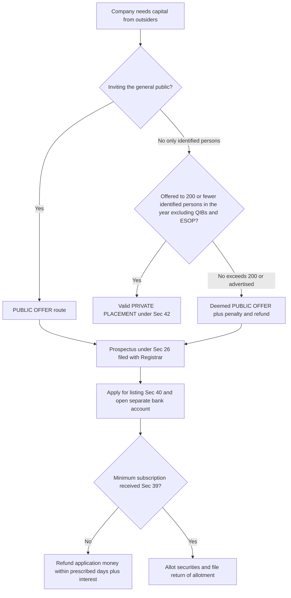
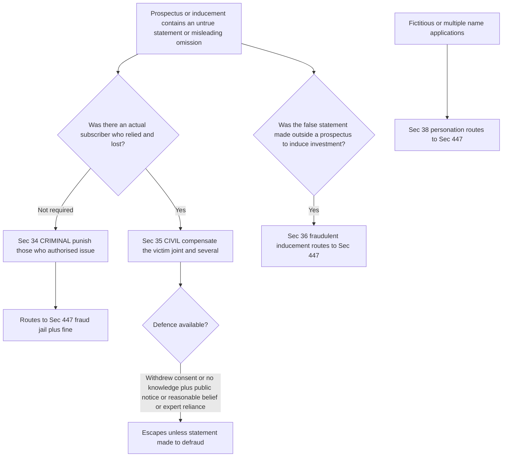
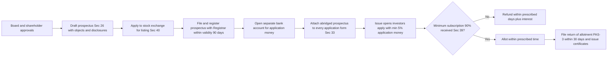
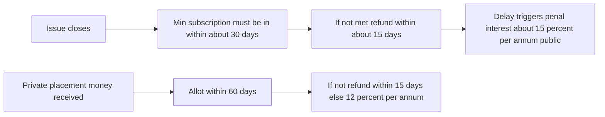

<!-- v2-deep -->

# Chapter 03 — Prospectus & Allotment of Securities

## 1. The Problem — Why This Chapter Exists

Imagine you have savings and no way to grow them. Down the road, a company wants to build a factory but has no money. There is an obvious match: you give them your savings, they give you a slice of ownership (shares) or a promise to repay with interest (debentures). This is the entire point of a **public offer** — a company reaching into the pockets of thousands of strangers to raise capital.

Now look at the asymmetry that makes this dangerous. The company knows **everything** about itself — its real profits, its lawsuits, the fact that the "revolutionary product" is a prototype that has never worked. You, the investor, know **nothing** except what the company chooses to tell you. You are handing over real money based purely on a document the company wrote about itself. The company writes the exam **and** grades it.

History is a graveyard of what happens when this asymmetry is left unregulated:

- **The pumped-up promise.** A company advertises "guaranteed 40% returns, factory already running, orders worth crores in hand." Fifty thousand people invest. The factory is a bare plot of land. The promoters take the money and vanish. This is the classic **misleading prospectus**.
- **The silent omission.** The document is technically all true — but it forgets to mention that the company is being sued for its entire net worth, or that the promoter was convicted of fraud last year. Nothing false was *said*; the killer fact was simply *left out*.
- **The money that never comes back.** The company says "we need ₹100 crore to build the plant." Only ₹10 crore comes in — nowhere near enough to build anything. Instead of returning the ₹10 crore, the company keeps it, limps along, and eventually collapses. Investors lose everything to a project that was never viable.
- **The rich-man's loophole abused on the public.** A company quietly issues shares to "a few select persons" to dodge all the public-offer rules — but "a few select persons" turns out to be thousands of ordinary investors solicited through a WhatsApp campaign. The company got public money while escaping every public-money safeguard.
- **The allotment games.** The company collects application money, then plays favourites — allotting to friends, sitting on refunds for months (earning interest on your money), or issuing shares without ever collecting the minimum needed to function.

Every single provision in this chapter is a scar left by one of these frauds. **Prospectus law is not paperwork — it is the law that forces the informed party to tell the uninformed party the truth, on pain of jail, before it can touch the public's money.** Learn each rule as the answer to a specific cheat, and you will never need to memorise it.

**One deeper layer — why *company law* and not just fraud law?** Ordinary criminal law already punishes cheating. So why a whole special chapter? Because ordinary fraud law is **reactive** — it acts *after* the money is gone, when the promoter has vanished and the cash is spent. Prospectus law is **preventive and structural**: it forces disclosure *before* a rupee changes hands, ring-fences the money *while* it is being collected, and pins personal liability on named humans *in advance* so that deterrence bites before the fraud, not after. The whole chapter is the law shifting from "catch the thief" to "make the theft structurally hard."

---

## 2. The Core Idea — The Protective Principle

The whole chapter rests on a single principle, borrowed from a phrase the courts have used for over a century:

> **"Disclosure is the price of the privilege of raising public money — and full, honest disclosure at that. The golden rule is that those who issue a prospectus must state the truth without concealment."**

Break this into its working parts:

1. **You may raise money from the public — but only through a controlled, standardised, *written* document (the prospectus).** No verbal promises, no "trust me." A document can be examined, filed, and used as evidence.
2. **That document must contain the whole truth.** Not just no lies (that is the low bar) but no *dangerous silences* either. An omission that misleads is treated exactly like a false statement.
3. **The people who put their names to it are personally on the hook.** Directors, promoters, experts, the company itself — if the document lies, they pay (civil) and can be jailed (criminal). Liability is personal so that no one can hide behind the corporate veil.
4. **The public's money is protected even after it is paid in** — through minimum subscription, escrow-style application accounts, strict refund timelines, and limits on where the money can go.
5. **If you want to escape these rules, you must genuinely not be touching the public** — hence the hard line between a **public offer** and a **private placement**, policed so tightly that any attempt to disguise a public issue as private automatically *becomes* a public issue with all its consequences.

Everything technical that follows is just this principle, sharpened into sections and numbers.

**The golden legacy of *New Brunswick* and *Derry v Peek*.** Two ideas from old English cases still drive the entire chapter, and knowing them lets you *derive* the sections:

- The **"golden rule" of disclosure** (from *New Brunswick & Canada Railway Co. v Muggeridge*): those who invite the public must make disclosure with **scrupulous accuracy** — not just avoid falsehood but avoid **concealment of any material fact**. This is the parent of Sec 26 (mandatory contents) and the "omission = misstatement" rule in Sec 34/35.
- The **fraud/negligence split** (from *Derry v Peek*): *Derry v Peek* held that **deceit (fraud)** requires a false statement made *knowingly, without belief in its truth, or recklessly*. Mere honest carelessness was **not** fraud. The public outcry that "an honest-but-careless director escaped" led Parliament to create a **statutory civil liability** that does **not** require proof of fraud — you only prove the statement was untrue, you relied, and you lost. This is exactly why **Sec 35 (civil)** and **Sec 34 (criminal, needs the fraud/447 element)** are two *different* animals: 35 fixed the gap *Derry v Peek* left open.

**Memory hook:** *Golden rule = disclose (parent of 26/34/35). Derry v Peek = why civil (35) is easier to win than criminal (34).*

---

## 3. Why It's Built This Way — The Logic of Each Safeguard

Before the section-by-section detail, absorb the *design logic*. If you understand why each safeguard exists, the section numbers become hooks rather than random digits.

| The cheat it stops | The safeguard | The logic |
|---|---|---|
| "I'll just say it verbally / in an ad and deny it later" | Offer to public **must** be by a **prospectus**, a defined written document (Sec 2(70), 26) | A writing can be filed with the Registrar, dated, and produced in court. Speech evaporates; documents accuse. |
| "I'll dodge prospectus rules by not calling it a prospectus" | **Deemed prospectus** (Sec 25) | Substance over form. If the effect is a public offer, the label doesn't matter. |
| "I'll bury the bad facts / omit the lawsuit" | Mandatory contents + **omission = misstatement** (Sec 26, 34, 35) | The dangerous fact is usually the *hidden* one. Silence that misleads must carry the same penalty as a lie, or every fraudster would just stay quiet. |
| "The document lied but I'm a company, sue the empty shell" | **Personal** civil (Sec 35) and criminal (Sec 34) liability of directors, promoters, experts | Deterrence needs a human who can be fined and jailed. Companies don't feel fear; people do. |
| "We collected money for a project we can't fund" | **Minimum subscription** (Sec 39) | If you can't even raise the floor amount, the project is unviable — give the money back before it's wasted. |
| "I'll sit on your refund and earn interest" | Strict **refund timelines** + interest penalty (Sec 39, 40, rules) | Delay itself is a form of theft (time-value of money). Deadlines + penal interest remove the incentive to stall. |
| "I'll route the public issue to escape listing/monitoring" | Money in a **separate bank account**; securities in **demat**; **listing** requirement (Sec 40) | Ring-fence the public's cash so it can't be siphoned, and force transparency through the exchange. |
| "I'll issue to 'a few friends' — actually 5,000 people" | Hard cap on private placement (Sec 42) + auto-conversion to public issue if breached | The exemption is only fair if it's genuinely non-public. Breach the ceiling and you lose the exemption entirely. |
| "I'll keep changing my mind and issue prospectus after prospectus" | **Validity period** of prospectus; **shelf** and **red herring** variants for genuine multi-tranche needs | Give honest issuers efficient tools (shelf/RHP) so they don't need to cheat, while capping staleness. |
| "I'll spend your application money before the issue even closes" | Money locked in a **separate account**, usable only for allotment or refund (Sec 40, 42) | Pre-allotment the money isn't yet the company's — it's the applicant's, held on a kind of trust. Spending it early is spending money that may have to be returned. |

Notice the pattern: **each safeguard is a lock, and each lock was fitted after a specific burglary.** Now the details.

**A second organising lens — three time-zones of protection.** Every provision fits into one of three phases of the money's journey, and slotting a section into its phase is the fastest way to recall its purpose:

- **BEFORE the money moves (disclosure phase):** Sec 23, 25, 26, 27, 31, 32, 33 — *make the truth visible.*
- **AT the moment of inducement (integrity phase):** Sec 34, 35, 36, 38 — *punish anyone who corrupts the decision to invest.*
- **AFTER the money is collected (custody phase):** Sec 39, 40, 42 (allotment/refund limbs) — *guard, ring-fence, and if the project fails, return the cash.*

If an exam question gives you a fact pattern, first ask "which time-zone are we in?" and the relevant sections almost pick themselves.

---

## 4. Full Technical Content — Section by Section, Each With Its "Why"

> Governing law: **Companies Act 2013, Chapter III — "Prospectus and Allotment of Securities"** (Sections 23 to 42), read with the **Companies (Prospectus and Allotment of Securities) Rules, 2014** and, for listed/public issues, **SEBI (ICDR) Regulations**. Where a precise sub-figure varies by rule amendment, I flag it — always confirm the exact limit in current ICAI material / the bare Act.

### 4.1 The gateway — how a company may issue securities (Sec 23)

**The problem:** A company could raise money through any random channel it invents, escaping oversight. **The fix:** Section 23 lists the *only* permitted routes.

- A **public company** may issue securities: (a) to the public by **prospectus** (public offer); (b) through **private placement** (Sec 42); or (c) through a **rights or bonus issue**. Listed / to-be-listed public issues also attract SEBI ICDR.
- A **private company** may issue securities only by (a) **private placement**, or (b) **rights/bonus issue** — a private company is, by definition, forbidden from inviting the public (Sec 2(68)). That prohibition is *why* it's private.

**Memory hook:** *Public company = three doors (public, private placement, rights/bonus). Private company = two doors (no public door).* The missing door is the whole point of being private.

**Finer distinction the exam tests — "issue of securities" vs "public offer".** A *public offer* is only **one** of the doors. Sec 23 also expressly recognises that a public company can raise money **without** a public offer (rights, bonus, private placement). Students wrongly assume "public company always means public issue." Not so — a public company can and often does raise capital purely by private placement, never touching a prospectus. The label "public company" describes its *constitution* (free transferability, no member cap), not the *method* by which it happens to raise a given round.

**Rights issue (Sec 62) vs bonus issue — the one-line contrast the examiner slips in.** A **rights** issue offers *new* shares to *existing* shareholders in proportion to holdings, for **cash** (pre-emption right). A **bonus** issue capitalises accumulated profits/reserves and gives *free* shares — **no cash flows in**, only reserves convert to capital. Both are "internal" doors (no public), which is *why* even a private company may use them. Detailed mechanics live in the Share Capital chapter; here just know they are permitted routes under Sec 23.

### 4.2 What a "prospectus" is (Sec 2(70)) and when it's triggered

**Definition — Sec 2(70):** A prospectus is *any document described or issued as a prospectus*, and includes a **red herring prospectus**, a **shelf prospectus**, or **any notice, circular, advertisement or other document inviting offers from the public** for the subscription or purchase of securities.

**The logic of that fat definition:** Notice it doesn't say "a document titled Prospectus." It says *anything that invites the public to subscribe*. This is deliberate — it slams shut the "I didn't call it a prospectus" loophole. The trigger is the **invitation to the public**, not the label.

**Dissecting the definition into its four essential ingredients** (the examiner loves "state the essentials of a prospectus"):
1. **A document** — it must be in writing/recorded form (a purely oral invitation, however public, is not a prospectus, though it may be a fraudulent inducement under Sec 36).
2. **An invitation to the public** — the crucial ingredient. An invitation to a *pre-identified select group* (private placement) is not to "the public."
3. **From the public** — to *subscribe for or purchase* securities. A document merely giving information, not inviting money, is not a prospectus.
4. **Securities of a body corporate** — shares, debentures, etc.

**"Issued to the public" — the *Nash v Lynde* / *Pramatha Nath Sanyal* idea.** Whether a document is issued "to the public" is a question of substance. A document handed to a **domestic/private circle** (e.g. relatives, existing business connections) is **not** issued to the public even if several people receive it; conversely, a document that in effect reaches an **anonymous, uncontrolled body** is public even if each copy was addressed to a named person. **Section 42 codifies this** with a bright-line number so we no longer argue case-by-case: cross the person-limit or use general solicitation, and it is public as a matter of law.

**"Public" — Sec 2 read with the private-placement rules:** an offer/allotment to **50 or more persons** (excluding QIBs and ESOP employees) in a financial year is deemed to be an **offer to the public**, dragging in the full prospectus regime — even if the company called it "private." (This 50-person trip-wire is the numeric border between Sec 42 and public-offer land.)

**Trap to pre-empt:** the **50** figure (public-offer trip-wire) and the **200** figure (annual private-placement ceiling) are *different numbers doing different jobs* — see Trap #3 in Part 8. Both **exclude QIBs and ESOP-holders** from the headcount.

**When a prospectus is NOT required (the exemptions the examiner tests).** A prospectus is not needed where there is no invitation *to the public*, notably:
- a genuine **private placement** to identified persons (Sec 42);
- a **rights or bonus** issue to existing members;
- where the offer is a **domestic concern** / not to the public.
Knowing when a document *escapes* the definition is as tested as knowing when it is caught.

### 4.3 The four species of prospectus — each solves a different practical need

**The problem:** One rigid document type can't serve every honest fundraising situation. A giant issuer raising money in tranches, a retail investor who can't read 300 pages, a book-built IPO where the price isn't fixed yet — each needs a tailored instrument. Rather than let issuers improvise (and cheat), the Act gives four **named, regulated** variants.

| Type | Section | The problem it solves | Key feature | The "why" of its rule |
|---|---|---|---|---|
| **Ordinary / full prospectus** | Sec 26 | Baseline public offer | Full disclosure; filed with Registrar before issue | The gold standard — everything must be in it. |
| **Deemed prospectus** | Sec 25 | Company routes shares through an intermediary to dodge prospectus rules | Offer-for-sale document by an issuing house is *deemed* a prospectus of the company | Substance over form — the middleman can't be a laundering point. |
| **Shelf prospectus** | Sec 31 | Frequent issuer (e.g. a bank/NBFC) shouldn't re-file a full prospectus for every tranche | One prospectus valid up to **1 year**; file only a short **information memorandum** for later tranches | Cut repetition for honest repeat issuers; the 1-year cap stops stale disclosure. |
| **Red herring prospectus (RHP)** | Sec 32 | Book-built issues where price/quantity isn't fixed until bidding closes | Filed *before* the offer without complete price/number of securities; the final "closing" prospectus with price is filed after | Lets price be discovered by the market while still forcing near-full disclosure upfront. |
| **Abridged prospectus** | Sec 2(1) + Sec 33 | A 300-page prospectus is unreadable; every application form must still carry the gist | A short-form summary of the prospectus **must accompany every application form** | Retail investors actually read the short one — disclosure is useless if unreadable. |

**Memory hook for the species:**
- **Deemed = disguise** (25, the offer-for-sale trick).
- **Shelf = stock it for a year** (31 → put it "on the shelf").
- **Red Herring = price is Hidden** (32, the "red herring" is the missing price, a deliberate distraction).
- **Abridged = tiny, on the form** (33, attached to the application).

**Deemed prospectus detail (Sec 25) — the two conditions that trigger the "deeming".** A company allots/agrees to allot securities *to an issuing house* (intermediary) with a view to those securities being **offered for sale to the public**. That offer-for-sale document is **deemed to be a prospectus** issued by the *company*, so all liabilities attach to the company and its directors. The deeming presumption is **automatically raised** if **either** of two facts is shown:
1. the offer to the public was made **within 6 months** after the allotment/agreement to the issuing house; **or**
2. at the date of the offer, the company had **not received the whole consideration** for the securities.
The logic: both facts betray that the "sale" to the issuing house was a **conduit**, not a genuine independent sale — so the law looks through the middleman. **Memory hook:** *25 = "six months or not fully paid → the middleman is a mask."*

**Red herring detail (Sec 32):** *Red herring* literally means a misleading clue — here, the document that deliberately omits the price. Sequence: file RHP → open bidding → discover price → file the **final prospectus** (with price and number) with the Registrar and SEBI. Variations between RHP and final prospectus must be highlighted. The RHP must be filed with the Registrar **at least 3 days before** the opening of the subscription list/offer (verify current ICAI material). Upon closing, the **place and time of the closing** and the final price/number are stated in the final prospectus.

**Shelf detail (Sec 31):** Prescribed classes of companies (mainly financial institutions, banks, NBFCs — confirm the exact class list) may file a shelf prospectus valid for up to **one year** from the opening of the first offer. For each subsequent offer within that year, they file an **information memorandum** (Form PAS-2) disclosing *new* charges created, changes in financial position, and other material changes. The one-year validity is the anti-staleness guillotine. **Refinement:** where a company files the information memorandum and receives applications, and a *previous* applicant wishes to **withdraw** because of a material change disclosed in the IM, the company must give that right — the IM is not a rubber stamp; it re-opens consent for material changes.

**Abridged prospectus detail (Sec 33):** A copy of the prospectus (in full) must be **available on request**, but the form that reaches the retail applicant carries the **abridged** version. **Penalty limb the exam tests:** a company that fails to attach an abridged prospectus to the application form (where required) is liable to a **fine per default** (verify current figure). **Exception:** the abridged prospectus need not accompany the form where the form is issued for a *bona fide invitation to underwrite*, or where securities are **not offered to the public** — because the whole point (protecting retail applicants) is absent there.

### 4.4 Mandatory contents & registration of the prospectus (Sec 26)

**The problem:** If contents were optional, every issuer would disclose only the flattering facts. **The fix:** Sec 26 makes an explicit *minimum* content list, and requires the prospectus be **dated, signed, and filed** with the Registrar **before** it is issued.

Sec 26 broadly requires disclosure of:
- Details of the company, its directors, promoters, and their track record;
- **Objects of the issue** — exactly what the money will be used for (so you can't quietly divert it);
- Capital structure, terms of the issue, and rights attached to the securities;
- **Reports** — auditor's report, financial information, statements by experts;
- Material contracts and litigation;
- Minimum subscription amount, application money, underwriting details;
- A declaration of compliance.

**Registration mechanics:** the prospectus must be signed by every named director/proposed director (or their authorised agent) and **delivered to the Registrar for registration on or before publication**. A prospectus is valid for **90 days** from the date of registration — issue it after that and it's an unauthorised prospectus. **Memory hook:** *26 = "the contents section"; 90 days = one financial quarter of shelf life.*

**Documents that must accompany the prospectus at registration (finer point):** the prospectus delivered to the Registrar must be accompanied by **the consent of experts** named in it, copies of **material contracts**, and the **auditor's/expert reports** referred to. If these are missing, registration is defective.

**The expert-consent rule (Sec 26(5) territory).** A prospectus may include a statement by an **expert** (engineer, valuer, accountant, etc.) **only if** the expert is **not connected with** the formation/promotion/management of the company **and** has given **written consent** and has **not withdrawn** it before delivery for registration. **Why:** an "independent expert" who is secretly the promoter's cousin is no safeguard at all — independence is what gives the expert's word its value.

**Why "objects of the issue" matters:** it is the anchor for later liability. If money raised for Object A is spent on Object B, that misuse traces straight back to this disclosed statement. It is also the anchor for Sec 27 (variation of objects) and for the SEBI "monitoring agency" requirement on large issues.

**Consequence of issuing without registration (Sec 26(9)):** issuing a prospectus **not registered** with the Registrar makes the company (and every knowingly-party person) liable to a **penalty** (verify current figure). Registration is a *condition precedent* to a valid public offer, not a formality.

### 4.5 Variation in terms & the exit for dissenters (Sec 27) and misuse of application money (Sec 26/27)

**The problem:** Company raises money promising Object A, then the board changes the plan after your cash is in. **The fix — Sec 27:** the objects/terms stated in the prospectus can be varied **only** by a **special resolution** (passed through **postal ballot**), and dissenting shareholders (those who didn't agree) must be given an **exit opportunity** by promoters/controlling shareholders at a price set per SEBI norms. You are not trapped in a company that changed the deal on you.

**Finer distinctions the exam tests on Sec 27:**
- The special resolution is required for varying **the terms of a contract referred to in the prospectus** or **the objects for which the prospectus was issued** — i.e. both *what* the money is for and the *deal terms* are frozen absent shareholder re-approval.
- The **notice** of the special resolution must be published in newspapers (one English, one vernacular) and on the website, stating the **justification** for variation. Transparency is forced even on the vote itself.
- The **exit offer** to dissenting members is a limb that only applies to companies whose shares are **listed** / that raised money from the public (SEBI-regulated), and the exit price is per SEBI (ICDR/LODR) norms. An unlisted private-placement issuer's dissenter-exit works differently — flag and verify.

**Money-utilisation lock:** money raised for the stated objects **cannot** be applied elsewhere without going through Sec 27. This connects forward to Sec 35/34 liability: diverting funds is not just a Sec 27 breach, it can render the original "objects" statement in the prospectus misleading, exposing the board to mis-statement liability.

### 4.6 The heart of the chapter — Liability for mis-statements (Sec 34 & 35)

This is the most examined pair in the chapter. Understand the *split* between them.

**First, what counts as a "misstatement"?**
- A statement is deemed **untrue** if it is misleading in the form and context in which it appears; and
- An **omission** is treated as a misstatement if the omission is calculated to mislead (Sec 34's framing).
- **The killer principle:** *a half-truth is a whole lie.* Leaving out the pending bankruptcy suit misleads exactly as much as inventing a fake profit.

**Two situations that "deem" a statement untrue (worth stating precisely):**
1. the statement is **misleading in the form and context** in which it is included; **and**
2. where the **omission** of a matter is **calculated to mislead** — the prospectus is then deemed untrue in respect of that omission.

Now the two liabilities:

#### (a) Criminal liability — Section 34
**When:** the prospectus includes a statement that is **untrue or misleading**, or an **omission calculated to mislead**, and it was issued.
**Who:** every person who **authorised the issue** of the prospectus.
**Punishment:** this attracts the **fraud punishment under Section 447** — imprisonment of **6 months to 10 years** and fine of **the amount involved up to 3× that amount**. (Where the fraud involves public interest, the minimum jail is 3 years.)
**The escape (why it's fair):** a person is **not** criminally liable if they prove **either** (i) the statement/omission was **immaterial**, **or** (ii) they had **reasonable grounds to believe, and did up to the time of issue believe, that the statement was true** or the omission necessary. Honest, diligent belief is a defence — the law punishes fraud, not honest error.

**Memory hook:** *34 = the jail door → routes to 447 (fraud), the harshest section in the Act.* Think "34 knocks on 447's cell."

**Threshold nuance for Sec 447 (fraud definition, Sec 447 read with explanation):** "fraud" involves an **act, omission, concealment or abuse of position** with **intent to deceive/gain undue advantage/injure**. The **de-minimis limb**: where the fraud amount is **below ₹10 lakh (or 1% of turnover, whichever lower)** and does **not** involve public interest, a *lighter* punishment applies (imprisonment up to 5 years **or** fine up to ₹50 lakh **or** both) — verify current ICAI figures. This matters because a small mis-statement fraud may not carry the full 6-months-to-10-years band.

#### (b) Civil liability — Section 35
**When:** a person **subscribes** for securities **relying on** a prospectus containing an untrue statement and **suffers loss or damage**.
**Who is liable (compensate the investor):**
- every **director** at the time of issue;
- every person who **agreed to be named as a director**;
- every **promoter**;
- every person who **authorised the issue**; and
- an **expert** (to the extent of their part).

**Remedy:** they are **jointly and severally liable** to **compensate** every affected subscriber for loss/damage.
**The defences (why each is fair):** a defendant escapes if they prove:
1. they **withdrew consent** before issue and the prospectus was issued without their authority; **or**
2. it was issued without their **knowledge/consent**, and on becoming aware they gave **public notice**; **or**
3. they had **reasonable grounds to believe** the statement was true (for their own statements) or reasonably relied on an **expert** for the expert's part.
**But note:** where the misstatement was made to defraud/induce, these defences **do not** protect a person, and liability can extend without limit (Sec 35(3)).

**"Subscribe" — a load-bearing word.** Sec 35 civil liability runs in favour of a person who **subscribed** for securities *relying on the prospectus*. Classic trap: a person who bought shares **in the secondary market** (from another investor on the exchange), *not* on the original allotment, generally **cannot** claim under Sec 35 — they did not "subscribe" on the faith of the prospectus. The prospectus's protective duty runs to the *original allottee*, not to a later purchaser (subject to the deemed-prospectus and continuing-liability nuances). **Reliance** is essential: a subscriber who never read or relied on the prospectus cannot claim its statement caused the loss.

**Rescission — the *contract* remedy that sits alongside Sec 35.** Independent of statutory compensation, a subscriber induced by a *misrepresentation* can **rescind the allotment** (return the shares, get the money back) under general contract law, **provided** he acts **promptly** and **before** any of the four bars arises: (a) **affirmation** (he behaves as owner after learning the truth), (b) **unreasonable delay/laches**, (c) **commencement of winding up**, or (d) **inability to restore** the parties to their original position. **Memory hook:** *Compensation (35) keeps the shares and claims money; Rescission gives back the shares and unwinds the deal — but rescission dies the moment winding up starts.*

**The clean contrast to memorise:**

| | **Sec 34 — Criminal** | **Sec 35 — Civil** |
|---|---|---|
| Purpose | Punish the wrongdoer (society's remedy) | Compensate the victim (investor's remedy) |
| Trigger | Untrue/misleading statement or misleading omission issued | Subscriber **relied** on it and **suffered loss** |
| Need actual investor loss? | **No** — the crime is issuing it | **Yes** — no loss, no compensation |
| Who is caught | Every person who **authorised the issue** | Directors, to-be-named directors, promoters, authorisers, **experts** |
| Outcome | Jail + fine via **Sec 447** | Pay **compensation** (joint & several) |
| Core defence | Immaterial, or honest reasonable belief up to issue | Withdrew consent / no knowledge + public notice / reasonable belief / expert reliance |
| Defence blocked when | (fraud is the charge itself) | Statement made **to defraud** — then no defence, unlimited liability |

**Memory hook:** *34 before 35 = Crime before Compensation (alphabetical C-C, and 34 < 35).* Criminal punishes the act; Civil needs a wounded victim.

**Note on the company's own position.** Sec 35 fixes personal liability on directors/promoters/experts to *compensate*. Whether the **company itself** is liable to compensate the subscriber is nuanced: the company can be sued for **rescission** (unwinding the contract), but ordering the *company* to pay *damages while the subscriber keeps the shares* runs into the old rule (*Houldsworth*-type reasoning) that a member cannot both keep membership and recover damages from the company diminishing its capital — a subtlety usually beyond CA Inter but worth one line to avoid over-stating "the company pays under 35."

#### (c) Fraudulently inducing investment — Section 36
**Problem:** someone lures investors by knowingly false or reckless statements *outside* a formal prospectus (a road-show promise, a deceptive circular). **Fix — Sec 36:** any person who **knowingly or recklessly** makes a false/deceptive/misleading statement, **promise or forecast**, or **dishonestly conceals** material facts, to induce persons to **invest / enter agreements for securities / credit facilities**, is liable for **fraud under Sec 447**. Closes the "it wasn't in the prospectus" gap. **Key distinction from Sec 34:** Sec 34 is tethered to a *prospectus*; Sec 36 catches inducement by **any** means (oral or written, in or out of a prospectus) — the wider net.

#### (d) Class action / remedy route — Section 37
Affected persons (a group of subscribers) may take **action** — including under **Sec 245 class action** — against the company, directors, auditors, and experts, for any misleading statement or the inclusion/omission of any matter in the prospectus. **Why:** one small investor can't afford to sue; collective action makes liability real. Sec 37 is the *gateway*; **Sec 245 (before NCLT)** is the *forum and machinery*.

### 4.7 Personation for acquisition of shares (Sec 38)

**Problem:** People apply for shares in **fictitious names** (to grab more of an oversubscribed IPO, or to manipulate allotment). **Fix — Sec 38:** the following are **fraud punishable under Sec 447**:
- applying for securities under a **fictitious name**;
- making **multiple applications** under **different names or different combinations** of name/surname; or
- otherwise **inducing** a company (directly or indirectly) to allot / register a transfer of securities to **fictitious/other names**.

The court may also order **disgorgement** of the gain and **freezing/seizure** of assets, and any amount received can be transferred to the **Investor Education and Protection Fund (IEPF)**. **Why so harsh:** fake applications corrupt the fairness of allotment for every genuine investor, and in an oversubscribed issue they *steal* allotment from honest applicants. **Compulsory disclosure limb:** the personation warning **must be prominently reproduced** in every prospectus and application form — a deterrent placed where the fraudster will read it.

### 4.8 Minimum subscription & application money (Sec 39) — protecting the money at entry

**Problem:** A company collects money for a ₹100-crore project but raises only ₹8 crore. The project is dead on arrival, yet the company keeps the cash. **Fix — Sec 39:**

- **No allotment** shall be made unless the **minimum subscription** stated in the prospectus has been **subscribed** and the application money received (by cheque/other instrument that has been paid). For SEBI-regulated public issues the floor is **90% of the issue**.
- **Application money** per security must be **at least 5% of the nominal amount** of the security (or as SEBI specifies).
- If minimum subscription is **not received within 30 days** of prospectus issue (SEBI norm; the Act says "such period as prescribed"), all application money must be **refunded within the prescribed time** (commonly **15 days** from closure). **Delay → interest** at the prescribed rate (e.g. **15% p.a.**) and the money is deemed held in trust.
- Default in filing the return of allotment / refund carries **fines** on company and officers (a fixed per-default penalty on the company and every officer in default — verify current figure).

**Why "held in trust" matters conceptually.** Until minimum subscription is met and allotment is validly made, the application money is **not** the company's money — it belongs to the applicants. Treating it as a trust means it cannot be attached by the company's creditors, cannot be spent on operations, and **must** flow back if the floor is missed. This is the doctrinal bridge to Sec 40's *separate bank account*: the account is the *vault* holding trust money.

**Consequence of allotting *without* minimum subscription (irregular allotment).** An allotment made in breach of Sec 39 is **irregular**. Practically: the allotment is liable to be **set aside / refunded**, the applicant can repudiate, and officers face penalty. The examiner's favourite question — "the board argues it can allot the shares actually subscribed and refund the rest" — is answered **No**: the bar is on *making any allotment at all* until the floor is reached; you cannot allot a part-filled issue.

**Memory hooks:** *39 = "the floor". 90% = "you must nearly fill the room before you open the doors." 5% application money = "a small deposit to prove you're serious." 15 days / 15% = "refund fast or pay 15% for stalling."* (Confirm the current % and day figures in ICAI material, as SEBI ICDR fine-tunes them.)

### 4.9 Securities to be dealt in on stock exchange + application money handling (Sec 40)

**Problem:** A public issue with no listing route traps investors in unsellable paper; and pooled application money is a tempting target for siphoning. **Fix — Sec 40:**

- Before issuing a prospectus, a company making a public offer must **apply to one or more stock exchanges** for **listing permission** and state which exchange(s) in the prospectus. **No listing permission → allotment is void**, and money must be **repaid** (with interest if delayed — commonly within 15 days, else penal interest).
- All **application money** received must be kept in a **separate bank account** with a scheduled bank, and used **only** for (i) adjustment against allotment, or (ii) **repayment** where minimum subscription/listing fails. It cannot be dipped into for anything else.
- A company may **pay commission** (underwriting/brokerage) out of this only as permitted (subject to Sec 40(6) limits and the PAS Rules — commission is a legitimate carve-out because it is a genuine cost of raising the money).

**Underwriting commission — the finer figures (verify current ICAI/SEBI):** commission is payable only if **authorised by the articles**, is paid at a rate **not exceeding 5% of the issue price of shares** or the rate in the articles (whichever less), and **2.5% for debentures** or the articles' rate (whichever less), and the fact/rate is disclosed in the prospectus. The cap exists so promoters can't drain the issue proceeds by paying inflated "commission" to cronies.

**Void vs irregular — a distinction worth nailing.** Failure to obtain **listing permission (Sec 40)** makes the allotment **VOID** (a nullity from the start — money must come back). Failure to meet **minimum subscription (Sec 39)** makes the allotment **irregular/barred** (must not be made; if made, liable to be undone). The examiner sometimes swaps these — listing failure = *void*; is the sharper word.

**Memory hook:** *40 = "the safe" — separate account (ring-fenced cash) + listing (an exit door).* Think "40 locks the money in a safe and cuts an escape hatch."

### 4.10 Global Depository Receipts (Sec 41)

**Problem/need:** an Indian company wants to raise money **abroad**. **Fix — Sec 41:** a company may, after a **special resolution**, issue **depository receipts (GDRs)** in any foreign country in the prescribed manner (Companies (Issue of GDRs) Rules). **Mechanism to know:** the company issues shares to a **domestic custodian/overseas depository**, which in turn issues **receipts (GDRs)** to foreign investors; the underlying shares sit with the custodian. The GDR-holder is a *beneficial* holder abroad; the **depository** is the registered member on the Indian register. Requires a **special resolution** and prescribed rules. (Mechanism-level for CA Inter; know the special-resolution requirement and the custodian/depository structure.)

### 4.11 Private placement (Sec 42) — the controlled non-public door

**Problem:** Companies abused "private" issues to raise public money without any public-offer safeguards — soliciting thousands under the "private placement" banner. **Fix — Sec 42** built a tight cage around private placement so it stays genuinely private.

**Definition:** private placement = offer/invitation to subscribe or issue securities to a **select group of identified persons** (identified by the Board) through a **private placement offer letter (Form PAS-4)**, and **not** through a public advertisement/general solicitation.

**The hard limits (each an anti-abuse trip-wire):**

| Rule | Limit | The "why" |
|---|---|---|
| Number of persons | Offer to **≤ 200 persons** in aggregate in a **financial year** (per kind of security), **excluding QIBs and ESOP employees** | The instant it crosses 200 real investors it *is* public — so cap it below public scale. |
| Identified persons | Offer only to persons **named/identified** by the Board; complete record maintained in **Form PAS-5** | "Select persons" must be genuinely selected in advance, not the general public. |
| No public solicitation | **No advertisement / general media / general solicitation** allowed | Any broadcast to the public destroys the "private" character. |
| Minimum investment size | Each identified person's offer subject to a **minimum investment** (verify current figure; historically ₹20,000 of face value per person) | A high per-person floor structurally keeps out the small retail "public." |
| Money route | Subscription only by **cheque/DD/banking channel** (no cash), kept in a **separate bank account** | Cash = untraceable; banking channel = audit trail, anti-money-laundering. |
| Application money use | Cannot **utilise** money until **allotment is made and return (PAS-3) filed** with the Registrar | Stops the company spending money before the issue is even complete. |
| Time to allot | Allot within **60 days** of receiving money; else **refund within 15 days**; delay beyond 15 days → **12% p.a. interest** from expiry of 60th day | Don't sit on private investors' money either. |
| Fresh offer bar | Generally **no fresh offer** while a prior offer is **pending/incomplete** (i.e. not allotted or withdrawn) | Prevents rolling, overlapping issues that dodge the 200 cap. |
| Return of allotment | **Form PAS-3** within **15 days** of allotment | Registrar gets a record; transparency even in private issues. |
| Offer letter numbering | Each PAS-4 is **serially numbered** and addressed specifically to the named person | Prevents the "one letter, mass-photocopied to the public" trick. |

**The nuclear consequence (the point of the whole section):** if a company makes an offer/allotment in **breach** of Sec 42 (e.g. exceeds 200 persons, or advertises to the public), the offer is **deemed a public offer** and all provisions of the Act **and SEBI/SCRA** apply — **plus a heavy penalty** (up to the **amount raised or ₹2 crore, whichever lower**) and **refund** to subscribers **within 30 days** of the penalty order. In other words: try to smuggle a public issue through the private door, and the law forcibly re-labels it a public issue with every safeguard attached, and fines you on top.

**A subtle limb students miss — the "one at a time" and "counting" rules.** The 200-person ceiling is counted **per financial year**, **per kind of security** (separate 200 for equity, separate for a distinct class of debentures — verify current wording), and is **cumulative** across offers in the year. So a company that placed to 150 persons in Round 1 can offer to at most 50 more in Round 2 of the same year. **QIBs and ESOP employees are excluded** from the count — the exclusion exists because QIBs are sophisticated (need no protection) and ESOP is an internal employee matter, not a public solicitation.

**Memory hooks for Sec 42:** *42 = "the private club with a 200-seat limit and a strict guest list."* Numbers: **200 members, 60 days to allot, 15 days to refund, 12% penalty interest, PAS-4 letter / PAS-5 register / PAS-3 return.* The forms count **4 → 5 → 3** (offer letter, record of offer, return of allotment).

---

### 4.12 Master diagram — the public-vs-private decision

*Figure 3.1 — The single most important flow: which door you walked through, and what each door demands.*

### 4.13 The two liability engines at a glance

*Figure 3.2 — How one false statement fans out into criminal, civil, inducement and personation liability.*

---

## 5. Applied Scenarios — Reasoning to the Legal Outcome

**Scenario 1 — The optimistic omission.**
*Bright Future Ltd issues a prospectus showing strong projected profits. It does not mention that a supplier has sued it for ₹50 crore — an amount exceeding its net worth. Investors subscribe; when the suit surfaces, the share price collapses. Ravi, who invested relying on the prospectus, loses ₹4 lakh.*

**Reasoning:** Nothing false was stated, but a **material omission calculated to mislead** is treated as a misstatement (Sec 34). Ravi **relied** on the prospectus and **suffered loss** → **civil liability under Sec 35**: the directors, promoters and those who authorised the issue are **jointly and severally liable to compensate** Ravi. Because the omission of a company-threatening lawsuit is plainly *material*, the "immaterial statement" defence fails; a director can only escape by proving he withdrew consent, lacked knowledge and gave public notice, or had reasonable grounds to believe disclosure was unnecessary. Separately, those who **authorised** the misleading prospectus face **criminal liability under Sec 34 → Sec 447** (jail + fine) — and Ravi does **not** need to prove his loss for the *criminal* case, only for compensation. **Outcome:** Ravi recovers compensation; directors risk prosecution.

**Scenario 2 — The "private" issue that wasn't.**
*Zoom Tech Pvt Ltd wants ₹30 crore. It emails a "private placement offer" to 260 hand-picked people and also posts the offer on its public website. 240 subscribe.*

**Reasoning:** Two independent breaches of **Sec 42**: (i) offer to **more than 200 persons** in the year, and (ii) **public solicitation** via the website. Either breach alone destroys the private character. **Consequence:** the offer is **deemed a public offer** — but a *private company cannot make a public offer at all* (Sec 23/2(68)). So the company is doubly exposed: the whole issue is treated as a public offer attracting the full prospectus regime and SEBI/SCRA, **plus** a penalty up to the **amount raised or ₹2 crore (whichever lower)** and **refund within 30 days**. **Outcome:** issue invalid as structured; penalty + mandatory refund; a private company simply cannot cure it by "going public" without first converting.

**Scenario 3 — The underfilled issue.**
*Mega Infra Ltd's prospectus states a minimum subscription needed of ₹100 crore for a plant. By the close, only ₹60 crore (60%) has come in. The board wants to allot anyway and start partial construction.*

**Reasoning:** **Sec 39** bars allotment unless **minimum subscription** (for SEBI issues, **90%**) is received. 60% is below the floor → **no allotment permitted**. The application money must be **refunded** within the prescribed period (commonly 15 days from closure); if the company delays, it must pay **penal interest** (e.g. 15% p.a.) and directors/officers face fines, and the money is deemed held in trust in the **separate account (Sec 40)**. **Outcome:** the board **cannot** allot; it must refund on time or bleed interest. The logic: an underfunded project must return the money, not consume it.

**Scenario 4 — The shelf-and-tranche financier.**
*Steady Finance Ltd, an NBFC, wants to raise debentures four times over the coming year. It dreads filing a full prospectus four times.*

**Reasoning:** This is exactly what **Sec 31 (shelf prospectus)** exists for. Steady Finance (a permitted class) files **one shelf prospectus valid up to 1 year**; for each subsequent tranche it files only an **information memorandum (PAS-2)** disclosing new charges and material changes. **Outcome:** legitimate efficiency — no cheating needed, because the Act already built the honest shortcut.

**Scenario 5 — The middleman mask (deemed prospectus, with a date twist).**
*Prime Ltd allots its entire fresh issue of shares to Sunrise Securities (an issuing house) on 1 April. On 20 August (i.e. within 6 months), Sunrise publishes an "offer for sale" document offering those shares to the public. The document omits Prime's pending tax demand.*

**Reasoning:** The allotment to an issuing house *followed by* a public offer **within 6 months** raises the statutory presumption under **Sec 25** that the allotment was made *with a view to* public offering. The offer-for-sale document is therefore a **deemed prospectus of Prime Ltd** — so Prime's directors, not merely Sunrise, are liable as if they had issued a prospectus, and the omission of the tax demand triggers **Sec 34/35** exactly as in Scenario 1.
*Examiner tweak:* suppose the public offer instead happened **8 months** later (outside 6 months) **but** Sunrise had **not paid Prime the full consideration** at the date of the offer. **Second limb of Sec 25** independently raises the deeming presumption (consideration not fully received) — so it is *still* a deemed prospectus. Only if the offer is **both** beyond 6 months **and** consideration fully received does the deeming presumption not automatically arise. **Lesson:** the two limbs are *alternative* triggers, not cumulative.

**Scenario 6 — The director who resigned in time.**
*Anita was named as a director in Neo Ltd's draft prospectus. She discovered a false profit figure, **withdrew her consent in writing before the prospectus was issued**, and the company issued it anyway without her authority. A subscriber, Karan, sues her under Sec 35.*

**Reasoning:** Sec 35 fixes liability on directors *at the time of issue*, **but** provides a defence: a person who **withdrew consent before issue** and the prospectus was issued **without his authority or consent** is **not liable**. Anita fits squarely — she can prove withdrawal + issue-without-authority → **no civil liability**. *Examiner tweak:* if Anita had merely *privately* objected but let the prospectus go out with her name and did **nothing public**, or discovered the falsehood *after* issue and stayed silent, she would **lose** the defence — the shield requires action *before* issue (withdrawal) or, for post-issue discovery, **public notice**. **Lesson:** the reasonable-belief/withdrawal defences reward *timely diligence*, not private grumbling.

**Scenario 7 — Numerical: private-placement counting and interest.**
*Vega Ltd (unlisted public company) makes a private placement of equity. In FY it offers to 120 persons in April and 90 more persons in September (all non-QIB, non-ESOP, all identified by the Board). It receives ₹5 crore from the September allottees on 1 October but, due to internal delays, allots only on 20 December.*

**Reasoning — step by step:**
1. **Headcount:** 120 + 90 = **210 persons** in the financial year for the same kind of security (equity). This **exceeds the 200 ceiling** → breach of Sec 42 → the whole thing is **deemed a public offer**, with penalty (up to amount raised or ₹2 crore, whichever lower) and refund within 30 days. *The second tranche should have been capped at 80.*
2. **Timing (assume, arguendo, the headcount were within limit):** money received 1 October; **60 days to allot** expires **30 November**. Allotment on **20 December** is **20 days late**. Sec 42 requires **refund within 15 days** of the 60th day if not allotted; here they neither refunded nor allotted in time. **Penal interest at 12% p.a.** runs on ₹5 crore from **1 December** (expiry of the 60 days) until refund/allotment.
   - Interest ≈ ₹5,00,00,000 × 12% × (20/365) ≈ ₹5,00,00,000 × 0.12 × 0.0548 ≈ **₹3.29 lakh** for the delay period (illustrative; verify exact reckoning convention with ICAI).
**Self-check:** 12% of ₹5 crore per year = ₹60 lakh/year = ₹1.64 lakh per 10 days ≈ ₹3.29 lakh for 20 days. Consistent. **Lesson:** two independent violations (headcount *and* delay) can co-exist; answer each limb separately.

**Scenario 8 — Numerical: minimum subscription and application-money floor.**
*Orbit Ltd makes a public issue of 1 crore equity shares of face value ₹10 each at par. Its prospectus states minimum subscription as 90% of the issue. By closing, applications are received for 85 lakh shares. Application money is set at ₹0.40 per share.*

**Reasoning — step by step:**
1. **Application-money floor (Sec 39):** must be **at least 5% of nominal value** = 5% × ₹10 = **₹0.50 per share**. Orbit set only **₹0.40** → **below the statutory floor** → defective on this ground alone (unless SEBI specifies otherwise for this issue — verify). Correct minimum = ₹0.50.
2. **Minimum subscription:** 90% of 1 crore = **90 lakh shares** required. Only **85 lakh** subscribed (85%) → **floor not met** → **Sec 39 bars any allotment**.
3. **Consequence:** refund all application money within the prescribed period (commonly 15 days from closure); delay → **~15% p.a. penal interest**; money held in trust in the **separate account (Sec 40)**.
   - Application money collected = 85 lakh × ₹0.50 (had it been correctly set) = **₹42.5 lakh** to be refunded; if refunded 10 days late, interest ≈ ₹42.5 lakh × 15% × 10/365 ≈ **₹17,466** (illustrative).
**Self-check:** 15% of ₹42.5 lakh/year = ₹6.375 lakh/year ≈ ₹1,746/day × 10 ≈ ₹17,466. Consistent. **Lesson:** two separate Sec 39 tests — the **per-share money floor (5%)** and the **whole-issue subscription floor (90%)** — are independent; a question can fail on either or both.

---

## 6. Procedure / Compliance Summary

### 6.1 Public issue by prospectus — the sequence

*Figure 3.3 — Public-issue compliance chain, each box a statutory checkpoint.*

### 6.2 Private placement — the parallel sequence

*Figure 3.4 — The Sec 42 private-placement chain, showing the money stays untouchable until allotment plus return filing.*

### 6.3 Key forms & timelines (both routes)

| Form | Purpose | Route |
|---|---|---|
| **PAS-2** | Information memorandum for shelf-prospectus tranches | Public (shelf) |
| **PAS-3** | Return of allotment (file within 15/30 days of allotment) | Both |
| **PAS-4** | Private placement offer-cum-application letter | Private placement |
| **PAS-5** | Record of private placement offers (identified persons) | Private placement |

### 6.4 Refund / allotment timeline (memory strip)

*Figure 3.5 — Two parallel clocks: public-issue refund vs private-placement allot-or-refund. Confirm exact day/percent figures in current ICAI/SEBI material.*

---

## 7. Connections — How This Chapter Links to the Rest

- **Chapter on Incorporation / Types of Companies:** *why* a private company (Sec 2(68)) can't make a public offer flows straight into Sec 23 and Sec 42 here. A **One Person Company** and **private company** are locked out of the public door.
- **Share Capital & Debentures:** allotment completed here becomes the **capital** administered there; **return of allotment (PAS-3)**, share certificates, calls, and the **Sec 62 rights issue** mechanics follow. Underwriting commission (Sec 40) also connects to the share-capital rules.
- **Sec 447 (Fraud):** the enforcement engine behind Sec 34, 36 and 38 — the same punishment section recurs, so master it once (6 months–10 years; 3-year minimum if public interest; lighter band below the de-minimis threshold).
- **Sec 245 Class Action & NCLT:** the *forum* where Sec 37 collective remedies are pursued.
- **SEBI Act & SEBI (ICDR) Regulations:** for **listed** public issues, SEBI overlays disclosure, minimum-subscription (90%), monitoring-agency, and timeline rules on top of the Companies Act — the Act sets the floor, SEBI tightens it.
- **Deposits (Sec 73–76):** contrast — deposits are *borrowing from the public without shares*; both chapters share the theme of protecting public money, but through different machinery.
- **Law of Contract / Misrepresentation:** Sec 34–35 are the company-law specialisation of the general contract idea that inducing a contract by false statements gives rise to liability; **rescission** of allotment is the pure-contract remedy sitting beside statutory compensation.
- **IEPF (Investor Education & Protection Fund):** disgorged gains from Sec 38 personation and unclaimed refunds can flow here — the "downstream" home of protected money.

---

## 8. Traps & Examiner Tricks

1. **34 vs 35 swap.** The classic trap: describing Sec 35 as "imprisonment." **Sec 34 = criminal (jail via 447); Sec 35 = civil (compensation).** Civil needs *reliance + actual loss*; criminal does not need a suffering investor.
2. **Omission is not "safe."** Students assume only false *statements* are punishable. A **misleading omission** is expressly a misstatement (Sec 34). *Half-truth = whole lie.*
3. **"Public" is a number, not a vibe.** The **50-person** line (Sec 42 area) converts a "private" offer into a public offer; the **200-person** ceiling caps private placement per year. Don't confuse the two: **50** is the public-offer trip-wire baked into the private-placement rules; **200** is the annual private-placement headcount cap. QIBs and ESOP employees are **excluded** from both counts.
4. **Deemed prospectus (Sec 25) ≠ Red herring (Sec 32).** *Deemed* = an offer-for-sale document dressed up to dodge the rules (disguise). *Red herring* = a genuine prospectus with the **price** left out (book-building). Totally different problems.
5. **Shelf validity is 1 year; prospectus registration validity is 90 days.** Don't cross the numbers.
6. **Private company + public offer = impossible, not merely penalised.** A breach of Sec 42 by a *private* company can't be cured by "treating it as a public offer" because a private company is barred from public offers outright — it must first convert.
7. **Application money ≥ 5%; minimum subscription (SEBI) = 90%.** These are different figures for different things: 5% is per-security upfront money; 90% is how much of the *whole issue* must be subscribed. Confirm current figures.
8. **Expert's defence under Sec 35** protects a director who *reasonably relied on an expert*, but the **expert himself** is liable for *his* part. Don't let the director's shield cover the expert. Also: an expert must have given **written consent** and be **unconnected** with promotion/management (Sec 26) — a "tame" expert is no defence.
9. **"Reasonable belief" defence** (Sec 34/35) must exist **up to the time of issue** — a director who *later* discovers the truth but did nothing loses the shield; but honest belief held throughout is a genuine escape. The law targets fraud, not honest mistake.
10. **Sec 39 "no allotment" is a bar, not a formality.** An allotment made without minimum subscription is **irregular** and refundable — examiners love asking whether the board "can just allot anyway" or "allot only the part subscribed." It cannot do either.
11. **Sec 42 money can't be touched pre-allotment.** Even in a valid private placement, utilising subscription money before allotment **and** filing of the PAS-3 return is a breach.
12. **Void vs irregular.** Listing-permission failure (**Sec 40**) → allotment **VOID**; minimum-subscription failure (**Sec 39**) → allotment **irregular/barred**. The examiner swaps these to test precision.
13. **Sec 25's two limbs are alternatives.** "Within 6 months" **OR** "consideration not fully received" — *either* triggers the deemed-prospectus presumption. Students wrongly require both.
14. **Secondary-market buyer can't sue under Sec 35.** Sec 35 protects the *subscriber* who relied on the prospectus, not someone who later bought on the stock exchange. "Reliance on the prospectus" and "subscription" are both essential.
15. **Rescission dies at winding-up.** The contract remedy of rescinding an allotment for misrepresentation is lost once winding up commences (or on affirmation/delay/inability to restore) — even though statutory Sec 35 compensation may still be pursued.
16. **Sec 36 is wider than Sec 34.** Sec 34 needs a *prospectus*; Sec 36 catches *any* inducement (a speech, a WhatsApp forward, a forecast) — don't restrict fraudulent-inducement liability to written prospectuses.
17. **"Objects of the issue" can't be silently changed.** Diverting funds needs a **special resolution + dissenter exit (Sec 27)** — and doing it silently can *retrospectively* make the prospectus misleading, dragging in Sec 34/35.
18. **Underwriting commission has caps.** 5% (shares) / 2.5% (debentures) or articles' rate, whichever lower, and must be authorised by articles and disclosed — a favourite one-liner (verify current figures).

---

## 9. First-Principles Recap

Strip everything away and rebuild it from the single fault line: **the company knows the truth; the investor does not.** Every rule is one of three moves against that asymmetry:

1. **Force the truth out (disclosure).** A defined written **prospectus** (Sec 2(70), 26) with mandated contents, filed with the Registrar, in variants tuned to honest needs (**deemed 25, shelf 31, red herring 32, abridged 33**). *Because* speech evaporates and omissions kill, everything must be written and complete. The **golden rule** of *New Brunswick* is the parent of every disclosure clause.

2. **Punish the lie (liability).** **Criminal (Sec 34 → 447)** to deter, **Civil (Sec 35)** to compensate, **fraudulent inducement (36)** and **personation (38)** to close side-doors — all personal, so no one hides behind the company. *Because* deterrence needs a human who can be jailed and a victim who can be paid, and *because Derry v Peek* proved that requiring proof of fraud lets careless directors escape, Sec 35 was built to need only *untruth + reliance + loss*.

3. **Guard the money (entry controls).** **Minimum subscription (39)** so unviable projects refund; **separate account + listing (40)** to ring-fence cash and give an exit; **private placement cage (42)** so the non-public door can't smuggle a public issue. *Because* money, once pooled, is **held on trust** for applicants until validly allotted, it cannot be spent, attached, or trapped in a dead project.

If you can regenerate any section from "which cheat does this stop?", you have understood the chapter, not memorised it. A quick self-test: name the section, then say (a) the cheat it kills, (b) the time-zone (disclose / integrity / custody) it lives in, and (c) its one key number. If all three come instantly, you own it.

---

## 10. Quick-Revision Sheet

| Section | Topic | Key number / limit | One-line "why" |
|---|---|---|---|
| **23** | Modes of issue | Public co = 3 doors; Private co = 2 (no public) | Channels the fundraising into controlled routes |
| **2(70)** | Prospectus defined | Any document inviting the public | Kills the "didn't call it a prospectus" loophole |
| **25** | Deemed prospectus | Within **6 months** OR consideration not fully received | Substance over form (disguise) |
| **26** | Contents & registration | Valid **90 days**; filed before issue; expert consent | Mandatory minimum disclosure |
| **27** | Variation in terms | **Special resolution** (postal ballot) + exit to dissenters | Can't change the deal after taking your money |
| **31** | Shelf prospectus | Valid **1 year**; PAS-2 per tranche | Efficiency for frequent honest issuers |
| **32** | Red herring | Price omitted; final prospectus after bidding | Enables book-building price discovery |
| **33** | Abridged prospectus | Must accompany every application form | Retail investors actually read it |
| **34** | Criminal liability | Jail via **Sec 447** (6 mo–10 yr) | Punish issuing an untrue/misleading prospectus |
| **35** | Civil liability | Compensation; joint & several; **subscriber who relied** | Compensate subscriber who relied & lost |
| **36** | Fraudulent inducement | Fraud → **447**; any means, not just prospectus | Closes the "not in the prospectus" gap |
| **37** | Class action remedy | Group action (see Sec 245) | Makes liability enforceable collectively |
| **38** | Personation | Fraud → **447**; disgorgement; IEPF | Protects fairness of allotment |
| **39** | Minimum subscription | ≥ **90%** (SEBI); app money ≥ **5%**; refund ~**15 days**/**15%** | No allotment for an underfunded project |
| **40** | Listing + money handling | Separate bank a/c; **no listing = VOID allotment**; commission caps | Ring-fence cash + provide an exit |
| **41** | GDR | **Special resolution**; custodian/depository structure | Route to raise money abroad |
| **42** | Private placement | ≤ **200** persons/yr (ex-QIB/ESOP); allot in **60 days**; refund **15 days**/**12%**; PAS-4/5/3; breach = deemed public + penalty up to amount raised or **₹2 cr** | Keeps the non-public door genuinely non-public |

**Number-memory ladder:**
- **50** = public-offer trip-wire · **200** = private-placement annual cap
- **90 days** = prospectus validity · **1 year** = shelf validity · **6 months** = deemed-prospectus window
- **5%** = application money floor · **90%** = minimum subscription (SEBI)
- **60 days** to allot (private) · **15 days** to refund · **12%** (private) / **15%** (public) penal interest
- **5% / 2.5%** = underwriting commission caps (shares / debentures)
- **34** = Criminal → **447** · **35** = Civil (Compensation) · **447** = the fraud hammer behind 34/36/38

**Void vs irregular (one-line):** *No listing (40) = VOID; no minimum subscription (39) = irregular/barred.*

**Forms count:** *PAS-4 (offer) → PAS-5 (record) → PAS-3 (return); PAS-2 = shelf tranche IM.*

> **Always confirm the exact current percentages, day-counts, penalty figures, and class lists against the latest ICAI study material, the bare Companies Act 2013, the PAS Rules 2014, and SEBI (ICDR) Regulations — SEBI periodically fine-tunes the numeric thresholds while the underlying principles in this chapter stay fixed.**
