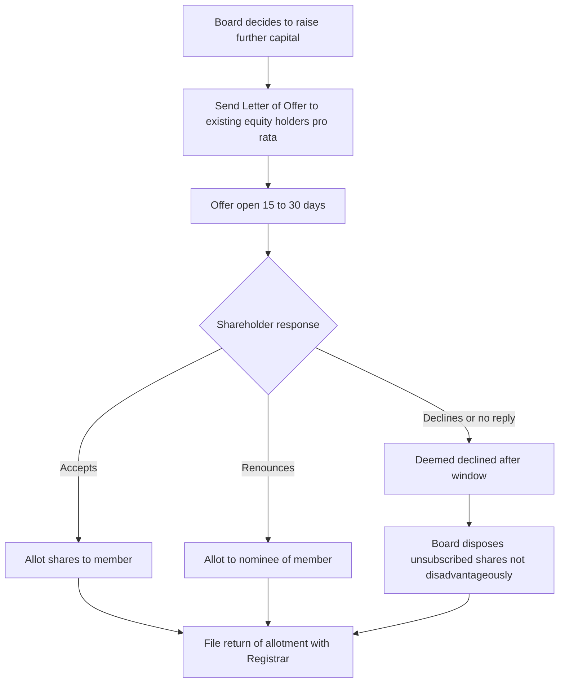
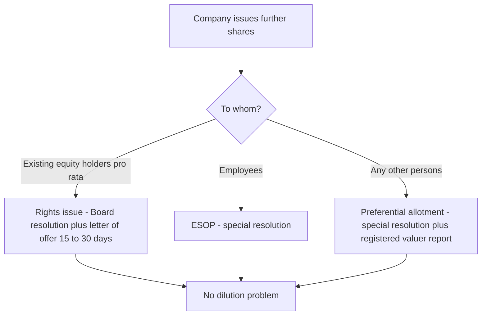
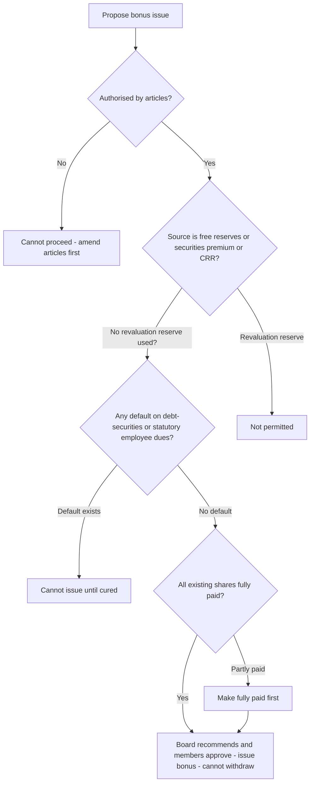

# Chapter 04 — Share Capital & Debentures

## 1. The Problem — Why Money Put Into a Company Keeps Vanishing

Imagine you lend ₹50 lakh to a company. You did not become an owner; you are a creditor. You looked at the company's balance sheet, saw "Share Capital ₹2 crore," and felt safe — that ₹2 crore is the buffer that absorbs losses before your loan is touched. The owners promised to put ₹2 crore of *their own* money at risk, standing behind your loan.

Now imagine three things happen:

1. The directors, who are also the big shareholders, quietly pay that ₹2 crore back to themselves as "return of capital," leaving nothing between your loan and zero.
2. Or the company issues shares to insiders for ₹1 when they are really worth ₹100, diluting everyone else and funnelling value to friends.
3. Or the company borrows ₹10 crore through debentures from thousands of small public investors, spends it, and there is no independent person watching whether the money is safe or the security real.

Every one of these is a **real historical fraud**. Companies were looted from the inside by manipulating capital. The whole architecture of Chapter IV of the Companies Act, 2013 (Sections 43–72) exists to answer one question: *how do we stop the people who control a company from moving capital in ways that betray the outsiders who relied on it — creditors, minority shareholders, and public debenture-holders?*

The single organising villain of this chapter is the **abuse of control over capital**. Everything else is a specific defence against a specific trick.

## 2. The Core Idea — Capital Maintenance and Fair Dealing

Two protective principles run through the entire chapter. If you hold these two, you can *derive* almost every section.

**Principle A — Capital Maintenance.** The share capital a company raised must not leak back out to shareholders through the back door. Creditors extended credit trusting that buffer. So the law makes returning capital to shareholders *hard, rare, court-supervised, and never at the creditors' expense*. This is why reduction of capital (Sec 66) needs Tribunal approval, why buy-back (Sec 68) has ceilings and locks, why dividends can't be paid out of capital, and why shares generally can't be issued at a discount (Sec 53).

**Principle B — Fair Dealing / Equality Among Members.** Within the body of shareholders, no group may use control to enrich itself at another group's expense. Existing shareholders must not be secretly diluted; a class whose rights are altered must consent; new shares must first be offered to existing owners in proportion (rights issue, Sec 62). This is the "no unfair dilution, no unfair preference" principle.

Hold these two lamps up to any provision and its purpose lights up. The section number is just an address; the *reason* is the thing.

## 3. Why It's Built This Way — The Logic of Each Safeguard

Before the technical wall of sections, let's reason out *why* each major safeguard has the shape it has. This is the scaffolding; Part 4 hangs the exact numbers on it.

- **Why forbid issuing shares at a discount (Sec 53)?** If a company could sell ₹10 shares for ₹1, the "capital" figure on the balance sheet becomes a lie — creditors think ₹10 of value backs each share but only ₹1 came in. So discount is banned, *except* the tightly-controlled sweat-equity route (real value came in, just as effort not cash) and the special ESOP/Sec 54 arrangement.

- **Why is a premium (Sec 52) locked into a special reserve?** When shares sell *above* face value, that extra isn't ordinary profit to be handed out as dividend — treating it as distributable profit would let promoters recycle investors' own money back as "returns." So the premium is quarantined in the Securities Premium Account and can be used only for a short capital-like list of purposes.

- **Why must new shares be offered to existing shareholders first (Sec 62 rights issue)?** Because directors could otherwise issue fresh shares to themselves or allies at a low price, shrinking everyone else's percentage. Pre-emption preserves each owner's proportional stake and voting power.

- **Why does altering class rights (Sec 48) need the class's own consent?** Because a controlling group holding ordinary shares could vote to strip preference shareholders of their preference. Only the affected class can agree to have its own rights changed — and even then a dissenting minority can run to the Tribunal.

- **Why is reduction of capital (Sec 66) court-supervised but alteration (Sec 61) not?** Because *reduction* actually shrinks the creditor buffer — it's the dangerous one, so the Tribunal and creditors must be heard. Mere *alteration* (splitting, consolidating, converting) reshuffles the same total capital without returning anything to shareholders, so a Board-plus-ordinary-resolution suffices.

- **Why must debentures to the public have a trustee (Sec 71)?** Ten thousand small debenture-holders cannot each individually police the company. So the law inserts a professional **Debenture Trustee** who holds the security and enforces it on behalf of all — a single watchdog with teeth, replacing a scattered helpless crowd.

Now the technical content will feel like consequences, not commandments.

## 4. Full Technical Content — Section by Section, Each With Its "Why"

### 4.1 Kinds of Share Capital — Section 43

A company limited by shares can have two kinds of share capital:

- **Equity share capital** — (a) with voting rights, or (b) with *differential rights* as to dividend, voting or otherwise (DVR shares), per prescribed rules.
- **Preference share capital** — carries a preferential right to (i) dividend (fixed amount or rate) and (ii) repayment of capital on winding up, *ahead of* equity.

*Why two kinds?* Different investors want different risk. The preference shareholder wants a fixed, priority return (bond-like); the equity shareholder wants the upside and control. Sec 43 simply names the two boxes the law will then regulate. **Note:** a *private company* may, through its articles/memorandum, override Sec 43 and 47 — a relaxation introduced to give small closely-held companies flexibility.

**Preference shares must be redeemable — Section 55.** A company (other than as specially permitted) *cannot issue irredeemable preference shares*. They must be redeemed within **20 years**; except infrastructure projects may issue preference shares redeemable beyond 20 years (redeemable in a phased manner as prescribed). *Why the ban on irredeemable preference?* An irredeemable preferential claim ranking ahead of equity forever is effectively perpetual debt masquerading as capital — it would let promoters bleed a fixed charge on profits indefinitely. Forcing redemption keeps the capital structure honest.

Redemption of preference shares (Sec 55) protects creditors by rule: they can be redeemed **only** out of (a) profits otherwise available for dividend, or (b) proceeds of a *fresh issue* of shares made for the purpose. If redeemed out of profits, an equal amount must be transferred to the **Capital Redemption Reserve (CRR)** — a reserve treated almost like capital. *Why CRR?* If you pay shareholders back out of profits, the buffer would shrink; forcing an equal amount into a locked reserve keeps the total buffer intact. Capital maintenance in action.

### 4.2 Voting Rights — Section 47

Equity: one-share-one-vote, voting proportional to paid-up capital. Preference shareholders normally vote *only* on resolutions that directly affect their rights — but if their dividend is unpaid for **two years or more**, they get voting rights on *every* resolution. *Why?* A preference shareholder is a quiet priority-investor as long as the deal is honoured; the moment the company defaults on their promised dividend for two years, the bargain is broken and they earn a full seat at the table.

### 4.3 Certificate of Shares — Section 46

The share certificate under common seal (if any) is **prima facie evidence** of title. Duplicate certificates fraudulently issued attract heavy penalty. *Why the penalty?* A fake certificate lets a fraudster sell the same shares twice — the deterrent guards the register's integrity.

### 4.4 Application of Premium — Section 52

Where shares are issued at a premium, the aggregate premium goes to the **Securities Premium Account**. It may be applied *only* for:

- issuing fully paid **bonus shares**;
- writing off **preliminary expenses**;
- writing off expenses/commission/discount on issue of shares or debentures;
- providing the **premium payable on redemption** of redeemable preference shares or debentures;
- **buy-back** under Sec 68.

*Why this closed list?* Every permitted use is either capital-like (bonus, buy-back, redemption premium) or a genuine cost of raising the capital. The one thing you may **not** do is pay it out as ordinary dividend — that would return investors' own subscription money to them dressed as profit. Memory hook: securities premium is "capital's cousin," not "profit's sibling."

### 4.5 Prohibition on Issue at a Discount — Section 53

Any issue of shares at a discount (below face value) is **void**. Company and every officer in default face penalty; the company must refund with interest. *The one carve-out:* shares issued at a discount to creditors under a **statutory resolution/scheme of reconstruction (Sec 53(2A))** — e.g. debt converted to equity under RBI-directed restructuring. And **sweat equity (Sec 54)** is a separate, lawful non-cash route, not a "discount." *Why so absolute?* Because a discount silently overstates capital — the balance-sheet buffer becomes fictitious.

### 4.6 Sweat Equity Shares — Section 54

Equity shares issued to **directors or employees** at a discount or for consideration other than cash, for providing **know-how, IP, or value additions**. Conditions:

- Issue authorised by a **special resolution**;
- The resolution specifies number, current market price, consideration, and the class of directors/employees;
- **Not before one year** from the date the company was entitled to commence business;
- Same rank/limitations/rights as ordinary equity.

*Why allow this exception to Sec 53?* Because real value *does* flow in — sweat, brains, patents — just not cash. The special resolution and disclosure guard against directors quietly gifting themselves cheap shares under this banner.

### 4.7 Employee Stock Options (ESOP) — Section 62(1)(b)

A company may offer shares to employees under a scheme of ESOP by a **special resolution** (a private company may use an ordinary resolution). *Why part of Sec 62?* Because giving shares to employees is a form of "further issue" that skips the rights-offer to existing members — so it needs the members' special approval as the price of bypassing pre-emption. (See 4.9.)

### 4.8 Issue of Bonus Shares — Section 63

Bonus shares are fully-paid shares given **free** to existing shareholders out of the company's reserves. May be issued out of:

- free reserves;
- securities premium account;
- capital redemption reserve.

**Not** out of reserves created by revaluation of assets. Conditions: authorised by articles; recommended by Board and approved in general meeting; company not defaulted on debt-securities interest/principal or on statutory dues to employees (PF, gratuity, bonus); partly-paid shares must be made fully paid first; once announced, a bonus issue **cannot be withdrawn**.

*Why forbid revaluation reserves and why the conditions?* A bonus issue converts reserves into capital (capitalisation of profits) — it *strengthens* the buffer, which is fine, but only if the reserves are real. Revaluation "profit" is a paper mark-up, not realised value; letting it become capital would inflate capital on air. The no-default condition stops a company that owes its lenders and workers from playing generous-uncle with shareholders.

### 4.9 Further Issue of Capital — Rights Issue — Section 62

This is the heart of Fair Dealing. Where a company **having a share capital** proposes to increase subscribed capital by issuing further shares, those shares must be offered:

**(a) To existing equity shareholders (Rights Issue)** in proportion to their paid-up capital, by a letter of offer subject to:

- the offer is open for **not less than 15 days and not more than 30 days**; if not accepted within that window it is deemed declined;
- the offer must state the shareholder's **right of renunciation** (they may pass the offer to another person);
- after expiry or on decline, the Board may dispose of the unsubscribed shares in a manner **not disadvantageous** to shareholders and the company.

*For a private company, periods/notice can be shortened with 90% consent.*

**(b) To employees under an ESOP** — special resolution (see 4.7).

**(c) To any other persons (Preferential Allotment / Private Placement)** — if authorised by a **special resolution**, either for cash or other consideration, provided the price is determined by a **registered valuer's** report. *Why the valuer?* Allotting shares to outsiders below fair value is exactly how insiders dilute the rest — an independent valuation blocks the underpricing trick.

**Conversion clause (Sec 62(3)):** where a term-loan from a government/bank includes a term (approved by special resolution *before* the loan) to convert the loan into shares, the rights-offer rule doesn't apply. *Why?* The dilution was consented to in advance, with eyes open.

Memory hook for Sec **62**: think "6-to-2" — the company turns to (6) its own existing owners *first*, employees, then others — pre-emption *first*, outsiders *last*. Window **15–30 days**: minimum 15 (long enough to decide), maximum 30 (not so long it stalls fundraising).

### 4.10 Alteration of Share Capital — Section 61

A limited company with share capital may, **if authorised by its articles**, by an **ordinary resolution** in general meeting:

- **increase** authorised capital;
- **consolidate and divide** shares into larger denomination (note: consolidation that changes voting % of members needs **Tribunal approval**);
- **convert fully paid shares into stock** and vice-versa;
- **sub-divide** shares into smaller denomination (paid-up proportion unchanged);
- **cancel** shares not taken/agreed to be taken (this is *not* a reduction of capital) — called **diminution**.

*Why only an ordinary resolution and no Tribunal?* Because none of these returns money to shareholders or shrinks the real buffer — a ₹10 share split into ten ₹1 shares is the same capital in smaller pieces. It's rearranging furniture, not removing it. Contrast Sec 66 reduction (below), which *does* shrink the buffer and therefore *does* need the Tribunal.

**Notice of alteration — Section 64:** file with Registrar in **Form SH-7 within 30 days** of the resolution. *Why 30 days?* The public register must reflect reality quickly so anyone dealing with the company sees the true capital.

### 4.11 Variation of Shareholders' Rights — Section 48

Where the share capital is divided into different classes, the rights attached to a class may be varied **only**:

- with **written consent of holders of ≥ 3/4 of that class**, or a **special resolution** passed at a separate meeting of that class; **and**
- if the memorandum/articles provide for such variation (or don't prohibit it).

**Protective escape hatch:** if the variation would prejudice another class, that other class must also consent. And a **dissenting minority holding ≥ 10%** of that class (who did not consent) may apply to the **Tribunal within 21 days** to have the variation cancelled; the Tribunal's decision binds all.

*Why 3/4 + a minority veto route?* Class rights are a bargain. Only the class can rewrite its own bargain, and a supermajority (3/4) is required so a bare majority can't bully. Yet even a 3/4 vote might be a controlled block, so a 10% dissenting minority gets a 21-day window to seek Tribunal protection. Fair Dealing with a safety net.

### 4.12 Transfer & Transmission of Securities — Section 56

**Transfer** = a *voluntary* act — you sell/gift your shares. **Transmission** = *operation of law* — death, insolvency, inheritance; no instrument of transfer needed, only proof (succession certificate, etc.).

Procedure for transfer (Sec 56):

- A proper **instrument of transfer (Form SH-4)**, duly stamped, executed by transferor and transferee, must be delivered to the company **within 60 days** of execution.
- The company must **register** the transfer/transmission and deliver certificates **within 1 month** of receipt (for transfer) / other prescribed periods for allotment (2 months from allotment) / debentures (6 months from allotment).
- Refusal to register must be communicated within 30 days, with reasons; the aggrieved person may appeal to the **Tribunal** (30/60 day windows).

*Why the 60-day SH-4 rule and company registration?* Because the share register is the legal record of ownership. Uncontrolled transfers or forged instruments could strip a true owner of their shares, so the law channels every transfer through a stamped, executed, time-bound instrument and gives the wrongly-refused transferee a Tribunal remedy. *Why is transmission lighter?* Because no one is "selling" — the law is simply recognising that ownership passed by death or insolvency, so proof, not an instrument, suffices.

**Nomination — Section 72:** a holder may nominate a person to whom securities vest on death — bypassing succession disputes. *Why?* To spare families the courtroom for a clear, pre-declared wish.

### 4.13 Debentures — Section 71

A **debenture** is a written acknowledgement of debt by the company — includes debenture stock, bonds and any other instrument evidencing a debt, whether or not constituting a charge. It is *borrowing*, not capital: the debenture-holder is a **creditor**, not an owner — no voting rights in the company's general meetings (a debenture cannot carry voting rights, Sec 71(2)).

Key rules of Sec 71:

- A company may issue debentures with an option to **convert** into shares (wholly/partly) — but such conversion at issue must be approved by **special resolution**.
- Debentures **cannot carry voting rights**. *Why?* Voting belongs to owners who bear residual risk; a creditor with a fixed claim shouldn't also steer the company.
- Secured debentures may be issued subject to prescribed terms (e.g. redemption period, charge over assets).
- Where debentures are offered to the **public or to more than 500 persons**, the company **must appoint a Debenture Trustee** *before* the issue and must create a **Debenture Redemption Reserve (DRR)** out of profits available for dividend (as per Rules — thresholds/percentages have been amended over time; **confirm the current DRR requirement in ICAI material / the Companies (Share Capital and Debentures) Rules**).

**Debenture Trustee — the watchdog (Sec 71(5)–(7)):**

- A person cannot be appointed trustee if he is disqualified (e.g. beneficially holds shares, is indebted to the company, or has given a guarantee for the company's debentures) — the trustee must be **independent**.
- Duty: **protect the interests of debenture-holders** and redress their grievances.
- If the trustee believes the company's assets are insufficient to redeem, it may petition the **Tribunal**, which can restrict the company from incurring further liabilities.
- On default in redemption/interest, holders/trustee may apply to the Tribunal, which may **direct redemption forthwith** with interest.
- The company must **pay interest and redeem** per the terms; default triggers Tribunal enforcement and penalties.

*Why the trustee + DRR architecture?* Return to the Part-1 villain: thousands of small public lenders cannot each police the company. The **trustee** is one independent, empowered agent enforcing the security for all. The **DRR** forces the company to set aside profits *while it can*, so cash actually exists at redemption time instead of a hopeful promise. Watchdog (enforcement) + reserve (funds) = the two things scattered creditors lack.

**Debenture Redemption Reserve (DRR)** — a portion of profits ring-fenced solely for redeeming debentures; cannot be used for any other purpose. Capital-maintenance logic applied to debt: don't distribute what you'll owe.

### 4.14 Buy-Back of Securities — Section 68 (cross-reference)

Buy-back = a company purchasing its own shares, extinguishing them. It *returns capital to shareholders*, so it is fenced heavily (this is the flip side of Sec 53's discount ban — here the danger is capital *leaving*):

- Sources: **free reserves, securities premium account, or proceeds of a fresh issue** (never out of an earlier issue of the same kind).
- Ceilings: **≤ 25% of paid-up capital + free reserves** in a year (for equity in a financial year, ≤ 25% of paid-up *equity*); post-buy-back **debt-to-capital-and-free-reserves ratio ≤ 2:1**.
- Authorisation: **Board** (up to 10% of paid-up equity + free reserves) or **special resolution** (up to 25%).
- After buy-back the company must **not make a further issue of the same kind of shares within 6 months** (except bonus/discharge of obligations).
- Amount equal to nominal value of shares bought back must go to the **Capital Redemption Reserve (Sec 69)**.
- **No buy-back within one year** of the previous buy-back.

*Why every ceiling and lock?* Buy-back is a legitimate way to return surplus cash — but unrestrained, it becomes a tool to prop up share price, hand controllers an exit, or hollow out the creditor buffer. The 25% cap, 2:1 debt ratio, CRR transfer, and cooling-off periods each plug one abuse. (Full treatment in the Buy-Back / capital restructuring chapter.)

### 4.15 Reduction of Share Capital — Section 66 (cross-reference)

The most dangerous move — deliberately *shrinking* capital. Requires:

- a **special resolution**, and
- confirmation by the **Tribunal (NCLT)**, which must give **creditors an opportunity to object** and be satisfied their claims are secured/settled.

Forms: extinguish/reduce liability on unpaid capital, cancel lost capital, or pay off surplus capital. *Why Tribunal + creditor hearing?* Because reduction directly removes the buffer creditors relied on — so the state (Tribunal) and the creditors themselves must both sign off. This is Capital Maintenance at its most explicit. (Full treatment in the reduction/restructuring chapter.)

---

## 5. Applied Scenarios — Reasoning to the Legal Outcome

**Scenario 1 — The cheap allotment to a director's cousin.**
Alpha Ltd's board issues 1,00,000 new equity shares to the CFO's cousin at ₹10 (face value) when the shares trade at ₹150, calling it a "strategic investment." Existing shareholders get nothing. *Analysis:* This is a "further issue" under **Sec 62**. Because it goes to an outsider (not existing members pro-rata, not employees), it is a **preferential allotment under Sec 62(1)(c)** — requiring a **special resolution** *and* pricing per a **registered valuer's report**. Issuing at ₹10 against a ₹150 fair value with no valuation and no special resolution is invalid; it unfairly dilutes existing members. *Outcome:* allotment challengeable; the Fair-Dealing principle (independent valuation blocks underpricing) is violated.

**Scenario 2 — Bonus shares from a revaluation reserve.**
Beta Ltd revalues its land upward by ₹5 crore, creating a revaluation reserve, and proposes to issue bonus shares out of it. *Analysis:* **Sec 63** expressly forbids bonus issues out of **revaluation reserves** — that "profit" is an unrealised paper mark-up. Capitalising it would inflate capital on air, misleading creditors. *Outcome:* the bonus issue is impermissible; Beta may use only free reserves, securities premium, or CRR — and only if not in default on its debt-securities or statutory employee dues.

**Scenario 3 — Preference shareholders lose their dividend.**
Gamma Ltd has not paid the fixed dividend on its preference shares for the last two and a half years, and now the equity majority proposes to pass a resolution altering the preference shares' repayment terms. *Analysis:* Two provisions fire. Under **Sec 47**, because the preference dividend is unpaid for ≥ **2 years**, the preference shareholders now vote on **every** resolution — they are no longer silent. Under **Sec 48**, varying their class rights needs their own **3/4 consent / special resolution**, and a dissenting **10%** minority may approach the **Tribunal within 21 days**. *Outcome:* the equity majority cannot unilaterally rewrite preference rights; the broken bargain has armed the preference class.

**Scenario 4 — Public debenture issue with no watchdog.**
Delta Ltd raises ₹40 crore by issuing debentures to 3,000 retail investors, appoints no trustee, and creates no reserve. *Analysis:* Offering debentures to more than 500 persons triggers the mandatory **Debenture Trustee (Sec 71)** appointment *before* issue and a **Debenture Redemption Reserve**. Skipping both leaves 3,000 scattered creditors with no enforcement agent and no ring-fenced redemption fund — precisely the abuse Sec 71 prevents. *Outcome:* the issue is non-compliant; the company and officers face penalty, and investors are left dangerously exposed.

**Scenario 5 — Transfer instrument lodged late.**
Rohan sells shares to Meera; the executed SH-4 is delivered to the company 75 days after execution. *Analysis:* **Sec 56** requires the instrument within **60 days**. Lodged late, the company may refuse to register on that instrument (a fresh/rectified instrument or Tribunal recourse may be needed). *Outcome:* Meera's legal title on the register is jeopardised by the missed 60-day window — the timeline exists to keep the ownership register accurate and forgery-resistant.

---

## 6. Procedure / Compliance Summary

**Rights Issue (Sec 62(1)(a)) — flow:**

*Figure 6.1 — The rights-issue decision path: existing owners first, outsiders only with what's left.*

**Deciding which route a "further issue" takes (Sec 62):**

*Figure 6.2 — Every further issue must pass through one of three gates; the outsider gate is guarded hardest.*

**Deposit-style eligibility test for issuing bonus shares (Sec 63):**

*Figure 6.3 — The bonus-issue gate: real reserves, no defaults, fully-paid base.*

**Key forms & timelines:**

| Event | Form | Timeline |
|---|---|---|
| Alteration of capital (Sec 61/64) | SH-7 | Within **30 days** of resolution |
| Instrument of transfer (Sec 56) | SH-4 | Deliver within **60 days** of execution |
| Register transfer & deliver certificate | — | Within **1 month** of receipt |
| Deliver certificate on allotment (shares) | — | Within **2 months** of allotment |
| Deliver certificate on allotment (debentures) | — | Within **6 months** of allotment |
| Rights offer open period | — | **15 to 30 days** |
| Sec 48 dissenting-minority Tribunal appeal | — | Within **21 days**; minority ≥ **10%** of class |
| Return of allotment (Sec 39) | PAS-3 | Within **30 days** (confirm in Rules) |

## 7. Connections to Other Chapters & Laws

- **Prospectus & Allotment (Chapter on Sec 23–42):** how shares/debentures are *offered* to the public (prospectus, private placement PAS-4, return of allotment PAS-3) precedes and feeds the capital rules here.
- **Buy-back (Sec 68) & Reduction (Sec 66):** the "capital *leaving*" side, cross-referenced in 4.14–4.15; both are pure Capital-Maintenance chapters.
- **Dividend (Sec 123–127):** dividend can be paid only out of profits, never capital — the same maintenance principle; securities premium and CRR are *not* free for dividend.
- **Charges (Sec 77–87):** secured debentures create charges that must be registered — links to Sec 71 secured debentures.
- **Deposits (Sec 73–76):** debentures vs deposits — a convertible/secured debenture may be excluded from "deposit"; watch the boundary.
- **Meetings & Resolutions (Sec 100–117):** ordinary vs special resolution thresholds power almost every action here (alteration = ordinary; sweat equity, preferential allotment, ESOP, reduction, conversion = special).
- **SEBI (ICDR) Regulations:** for listed companies, SEBI rules overlay the Companies Act on rights issues, preferential allotments and buy-backs.

## 8. Traps & Examiner Tricks

- **Alteration (Sec 61) vs Reduction (Sec 66):** the classic trap. *Cancellation of unissued/untaken shares (diminution)* under Sec 61 is **not** a reduction and needs **no Tribunal** — only an ordinary resolution. True reduction (Sec 66) needs special resolution **+ Tribunal + creditor hearing**. Ask: *did money go back to shareholders / did the buffer shrink?* If no → alteration; if yes → reduction.
- **Discount (Sec 53) vs Sweat Equity (Sec 54):** sweat equity *looks* like a discount but is lawful because non-cash value flows in. Don't call sweat equity "void."
- **Securities premium is NOT free profit:** examiners love "can premium be used to pay dividend?" — **No.** Only the closed Sec 52 list.
- **Sec 47 two-year trigger:** preference shareholders get *full* voting rights only after dividend unpaid **two years or more** — not on the first missed dividend.
- **Rights issue window is 15–30 days**, *minimum* 15. A trap answer says "at least 30." Also the offer must mention **renunciation**.
- **Sec 48 minority:** the dissenting minority threshold is **≥ 10%** of the class and the appeal window is **21 days** — don't confuse with the 3/4 consent needed to *pass* the variation.
- **Preference shares must be redeemable within 20 years** (infrastructure exception) — irredeemable preference shares are **prohibited** (Sec 55). A trap offers "perpetual preference shares."
- **Debentures carry no voting rights (Sec 71(2)):** a convertible debenture gains voting rights only *after conversion into shares*, not before.
- **Bonus shares cannot be issued from revaluation reserve** and **cannot be withdrawn once announced** (Sec 63).
- **Private company relaxations:** Sec 43 & 47 (kinds/voting) can be excluded by a private company's MOA/AOA; Sec 62 rights-offer periods can be shortened with 90% consent; ESOP by ordinary resolution. Watch the "private company" flag in the question.
- **Transfer vs Transmission:** transfer needs SH-4 (voluntary); transmission needs only proof (by law — death/insolvency). Examiners swap the definitions.
- **DRR / trustee trigger:** appointment of a Debenture Trustee is mandatory when debentures are offered to the **public or > 500 persons**, and the trustee must be **appointed before** the issue.

## 9. First-Principles Recap

Two lamps light the whole chapter:

1. **Capital Maintenance** — capital must not leak back to shareholders and betray creditors. Hence: no discount (53), premium locked (52), preference redeemable with CRR (55), bonus only from real reserves (63), buy-back capped with CRR (68/69), reduction only under the Tribunal (66), DRR for debentures (71). Every one of these is "keep the buffer honest."

2. **Fair Dealing / Equality** — no control-group may enrich itself at another's expense. Hence: rights issue pre-emption (62), valuer-priced preferential allotment (62), class-consent for variation with a minority veto (48), full voting for defaulted preference (47), special resolution for sweat equity/ESOP (54, 62).

Every section number is just an address for one of these two ideas plugging one specific hole. Ask of any provision: *is this stopping capital from leaking out, or stopping one group from cheating another?* You will place it correctly every time.

## 10. Quick-Revision Sheet

| Section | Topic | Key number / limit | One-line why |
|---|---|---|---|
| 43 | Kinds of share capital | Equity (voting/DVR) + Preference | Name the two boxes |
| 46 | Share certificate | Prima facie evidence | Register integrity |
| 47 | Voting rights | Preference full-vote if dividend unpaid **≥ 2 yrs** | Broken bargain arms the class |
| 48 | Variation of class rights | **3/4** consent; dissent **≥10%** appeal in **21 days** | Only a class rewrites its own bargain |
| 52 | Securities premium | Closed-list uses; **no dividend** | Premium is capital's cousin |
| 53 | Discount prohibited | Issue at discount **void** | Don't fake the buffer |
| 54 | Sweat equity | **Special resolution**; not before **1 yr** of commencement | Real non-cash value in |
| 55 | Preference redemption | Redeem within **20 yrs** (infra exception); CRR | No perpetual priority debt |
| 56 | Transfer/transmission | SH-4 within **60 days**; certificate in **1 month** | Accurate, forgery-proof register |
| 61 | Alteration of capital | **Ordinary resolution**; no Tribunal | Reshuffling, not returning |
| 62 | Further issue / rights | Offer **15–30 days**; renunciation; valuer for outsiders | Existing owners first |
| 63 | Bonus shares | Not from revaluation reserve; **cannot withdraw** | Capitalise only real reserves |
| 64 | Notice of alteration | **SH-7 within 30 days** | Public register current |
| 66 | Reduction of capital | Special resolution **+ Tribunal + creditors** | The buffer actually shrinks |
| 68/69 | Buy-back | **≤25%**; debt ≤ **2:1**; CRR; **1-yr** gap | Capped return of capital |
| 71 | Debentures / trustee | Trustee if **>500** persons; no voting; DRR | One watchdog + a real fund |
| 72 | Nomination | Nominee on death | Skip the succession fight |

**Resolution cheat-line:** *Ordinary* → alteration (61), increase capital. *Special* → sweat equity (54), preferential allotment/ESOP/conversion (62/71), buy-back up to 25% (68), reduction (66). **Tribunal** → reduction (66), class-variation dissent (48), refusal of transfer (56), debenture default (71).

> Where a specific percentage, DRR rate, or day-count is decisive in an exam, confirm the current figure against the latest ICAI study material and the Companies (Share Capital and Debentures) Rules — several thresholds (notably DRR) have been amended since 2013.
