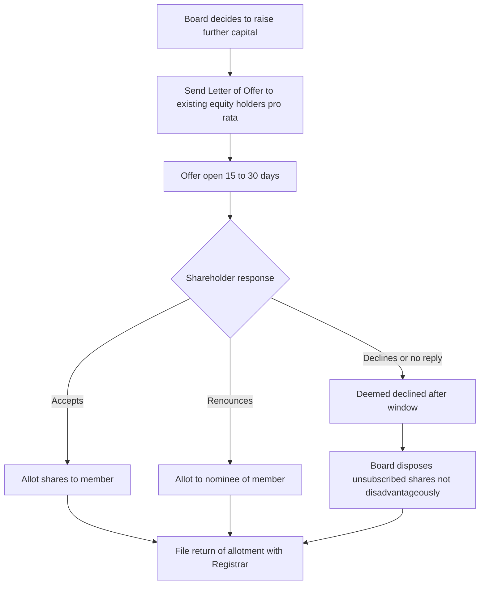
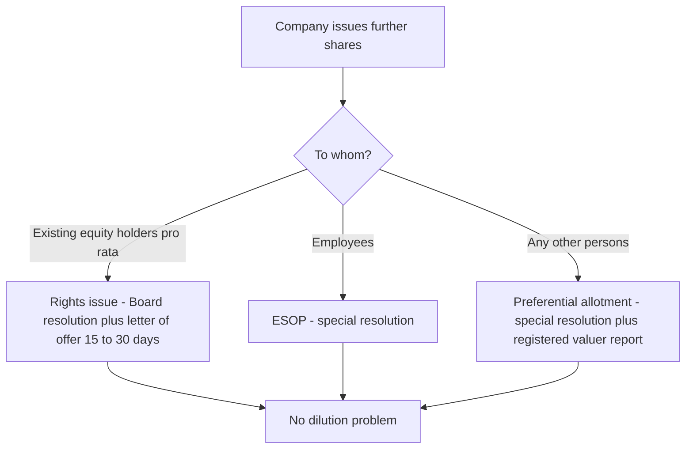
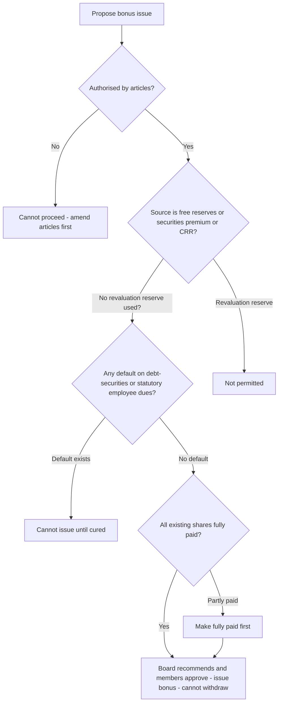
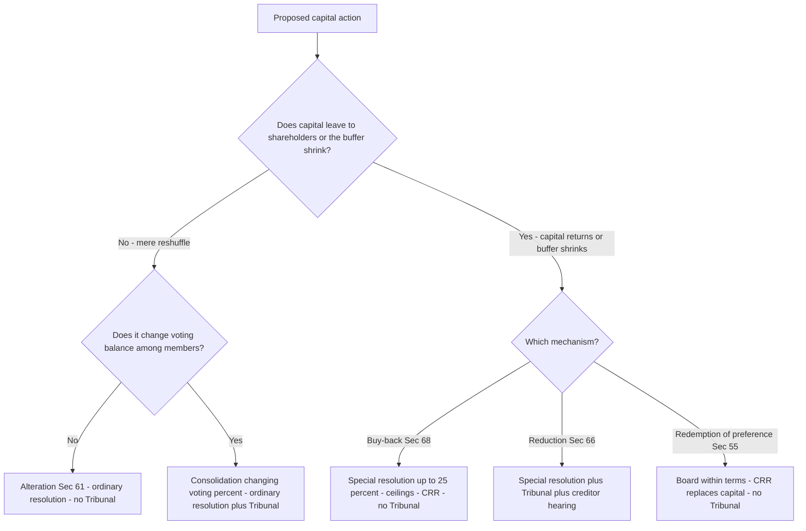
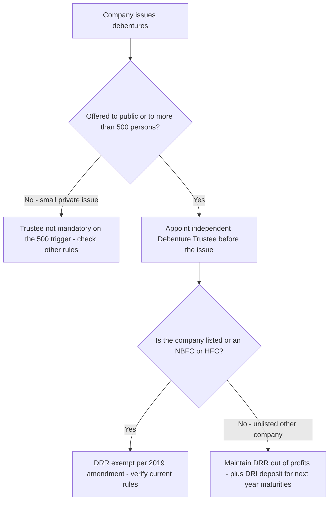

<!-- v2-deep -->

# Chapter 04 — Share Capital & Debentures

## 1. The Problem — Why Money Put Into a Company Keeps Vanishing

Imagine you lend ₹50 lakh to a company. You did not become an owner; you are a creditor. You looked at the company's balance sheet, saw "Share Capital ₹2 crore," and felt safe — that ₹2 crore is the buffer that absorbs losses before your loan is touched. The owners promised to put ₹2 crore of *their own* money at risk, standing behind your loan.

Now imagine three things happen:

1. The directors, who are also the big shareholders, quietly pay that ₹2 crore back to themselves as "return of capital," leaving nothing between your loan and zero.
2. Or the company issues shares to insiders for ₹1 when they are really worth ₹100, diluting everyone else and funnelling value to friends.
3. Or the company borrows ₹10 crore through debentures from thousands of small public investors, spends it, and there is no independent person watching whether the money is safe or the security real.

Every one of these is a **real historical fraud**. Companies were looted from the inside by manipulating capital. The whole architecture of Chapter IV of the Companies Act, 2013 (Sections 43–72) exists to answer one question: *how do we stop the people who control a company from moving capital in ways that betray the outsiders who relied on it — creditors, minority shareholders, and public debenture-holders?*

The single organising villain of this chapter is the **abuse of control over capital**. Everything else is a specific defence against a specific trick.

**Why "capital" is legally special and not just an accounting number.** A shareholder's liability in a limited company is capped at the unpaid amount on his shares (Sec 2(22)/Sec 3). That cap is the great bargain of company law: investors risk only a fixed sum, which is why they invest at all. But the mirror image of limited liability is that creditors have *only* the company's assets to look to — never the shareholders' personal wealth. So the "capital" figure is the price of the limited-liability privilege: in exchange for capping their downside, shareholders promise to keep a stated buffer intact for creditors. Capital rules are simply the enforcement of that promise. Once you see capital as *the consideration creditors received for accepting limited liability*, every "hard, rare, court-supervised" rule about touching it stops looking bureaucratic and starts looking like basic contract enforcement.

**The three victim-groups, kept distinct.** The chapter protects three different outsiders, and the examiner tests whether you know *which* protection fires for *which* victim:

- **Creditors** (including future creditors) — protected by *Capital Maintenance*: discount ban, premium lock, CRR, DRR, Tribunal-supervised reduction.
- **Existing shareholders** as a body — protected by *pre-emption / Fair Dealing*: the rights issue, valuer-priced preferential allotment.
- **A class of shareholders** (e.g. preference holders) against another class — protected by *class consent*: Sec 48 variation, Sec 47 revival of voting.

If you can name the victim, you can usually name the section.

## 2. The Core Idea — Capital Maintenance and Fair Dealing

Two protective principles run through the entire chapter. If you hold these two, you can *derive* almost every section.

**Principle A — Capital Maintenance.** The share capital a company raised must not leak back out to shareholders through the back door. Creditors extended credit trusting that buffer. So the law makes returning capital to shareholders *hard, rare, court-supervised, and never at the creditors' expense*. This is why reduction of capital (Sec 66) needs Tribunal approval, why buy-back (Sec 68) has ceilings and locks, why dividends can't be paid out of capital, and why shares generally can't be issued at a discount (Sec 53).

**Principle B — Fair Dealing / Equality Among Members.** Within the body of shareholders, no group may use control to enrich itself at another group's expense. Existing shareholders must not be secretly diluted; a class whose rights are altered must consent; new shares must first be offered to existing owners in proportion (rights issue, Sec 62). This is the "no unfair dilution, no unfair preference" principle.

Hold these two lamps up to any provision and its purpose lights up. The section number is just an address; the *reason* is the thing.

**A third, quieter principle — Disclosure & Traceability.** Sitting beneath the two lamps is a plumbing principle: *every movement of capital must leave a public paper trail with a deadline.* Form SH-7 for alteration, SH-4 for transfer, PAS-3 for allotment, the register of members, the register of charges — all exist so that an outsider dealing with the company can see the true, current capital position. Capital Maintenance says "don't let it leak"; Disclosure says "and if it moves at all, the world must be able to see it moved." Several "trap" questions are really disclosure-deadline questions (SH-7 in 30 days, SH-4 in 60 days) dressed up as substance.

**The two lamps are in tension — and that tension explains the exceptions.** Pure Capital Maintenance would forbid *ever* issuing shares below face value or *ever* returning cash to owners — but that would strangle legitimate business (rescuing a sick company, rewarding employees, returning genuine surplus). So each apparent "exception" (sweat equity, buy-back, ESOP, Sec 53(2A) discount on debt-conversion) is the point where the law decided the business need outweighs the buffer risk — and *bolted on a safeguard* (special resolution, valuer, ceiling, CRR) to contain the risk it just permitted. When you meet an exception, always ask: *what safeguard replaced the rule?* That pairing is the favourite exam structure.

## 3. Why It's Built This Way — The Logic of Each Safeguard

Before the technical wall of sections, let's reason out *why* each major safeguard has the shape it has. This is the scaffolding; Part 4 hangs the exact numbers on it.

- **Why forbid issuing shares at a discount (Sec 53)?** If a company could sell ₹10 shares for ₹1, the "capital" figure on the balance sheet becomes a lie — creditors think ₹10 of value backs each share but only ₹1 came in. So discount is banned, *except* the tightly-controlled sweat-equity route (real value came in, just as effort not cash) and the special ESOP/Sec 54 arrangement.

- **Why is a premium (Sec 52) locked into a special reserve?** When shares sell *above* face value, that extra isn't ordinary profit to be handed out as dividend — treating it as distributable profit would let promoters recycle investors' own money back as "returns." So the premium is quarantined in the Securities Premium Account and can be used only for a short capital-like list of purposes.

- **Why must new shares be offered to existing shareholders first (Sec 62 rights issue)?** Because directors could otherwise issue fresh shares to themselves or allies at a low price, shrinking everyone else's percentage. Pre-emption preserves each owner's proportional stake and voting power.

- **Why does altering class rights (Sec 48) need the class's own consent?** Because a controlling group holding ordinary shares could vote to strip preference shareholders of their preference. Only the affected class can agree to have its own rights changed — and even then a dissenting minority can run to the Tribunal.

- **Why is reduction of capital (Sec 66) court-supervised but alteration (Sec 61) not?** Because *reduction* actually shrinks the creditor buffer — it's the dangerous one, so the Tribunal and creditors must be heard. Mere *alteration* (splitting, consolidating, converting) reshuffles the same total capital without returning anything to shareholders, so a Board-plus-ordinary-resolution suffices.

- **Why must debentures to the public have a trustee (Sec 71)?** Ten thousand small debenture-holders cannot each individually police the company. So the law inserts a professional **Debenture Trustee** who holds the security and enforces it on behalf of all — a single watchdog with teeth, replacing a scattered helpless crowd.

- **Why can a private company switch off Sec 43 and 47 but not Sec 53 or 66?** Because Sec 43 (kinds) and 47 (voting) govern the *internal* deal *among the members themselves* — and in a closely-held company where everyone knows everyone, the law lets them privately re-arrange their own bargain. But Sec 53 (discount) and Sec 66 (reduction) protect *outsider creditors*, who never sat at that table. **Rule of thumb: a private company may relax the rules that protect only its own members; it can never relax the rules that protect creditors.** This single test predicts almost every private-company exemption in the chapter.

- **Why is a bonus issue *encouraged* (light conditions) while buy-back is *fenced* (heavy conditions)?** Both touch reserves, but in opposite directions. A bonus issue moves reserves *into* capital — the buffer gets **larger and more locked**, so creditors gain; the law only checks that the reserves are real. A buy-back moves reserves *out* to shareholders — the buffer **shrinks**, so creditors lose; hence caps, ratios, CRR, and cooling-off. Direction of travel of the buffer = severity of the safeguard.

Now the technical content will feel like consequences, not commandments.

## 4. Full Technical Content — Section by Section, Each With Its "Why"

### 4.1 Kinds of Share Capital — Section 43

A company limited by shares can have two kinds of share capital:

- **Equity share capital** — (a) with voting rights, or (b) with *differential rights* as to dividend, voting or otherwise (DVR shares), per prescribed rules.
- **Preference share capital** — carries a preferential right to (i) dividend (fixed amount or rate) and (ii) repayment of capital on winding up, *ahead of* equity.

*Why two kinds?* Different investors want different risk. The preference shareholder wants a fixed, priority return (bond-like); the equity shareholder wants the upside and control. Sec 43 simply names the two boxes the law will then regulate. **Note:** a *private company* may, through its articles/memorandum, override Sec 43 and 47 — a relaxation introduced to give small closely-held companies flexibility.

**Finer taxonomy of preference shares (frequently tested labels).** The *same* preference share can carry several attributes, and the examiner tests whether you know that the default is the "safer for the investor" version:

| Attribute | Two flavours | The **default** if silent |
|---|---|---|
| Dividend arrears | **Cumulative** (unpaid dividend accumulates) vs **Non-cumulative** (missed = gone) | **Cumulative** |
| Extra profit share | **Participating** vs **Non-participating** | **Non-participating** |
| Conversion to equity | **Convertible** vs **Non-convertible** | **Non-convertible** |
| Repayment | **Redeemable** (must be, ≤20 yrs) vs Irredeemable | **Redeemable** — irredeemable is *prohibited* (Sec 55) |

*Why do these defaults lean investor-protective?* Because the preference shareholder gave up voting power and upside in exchange for a *promise*; where the terms are silent, the law reads the promise generously so the bargain isn't hollowed out. A trap will say "the company skipped the dividend, so it need not be paid later" — wrong if the shares are (or are silent, hence deemed) cumulative.

**DVR shares — the guardrails.** Differential-rights equity (e.g. shares with 1/10th the votes but higher dividend, or vice versa) is legal but rule-bound to stop promoters from entrenching control with tiny economic stakes. Conditions typically include: authorised by articles and an ordinary resolution; a consistent track of distributable profits / no default in filing or repayment; and a cap on DVR as a proportion of total post-issue paid-up equity. *Verify the current DVR percentage cap and eligibility conditions in the Companies (Share Capital and Debentures) Rules — this figure has been amended.*

**Preference shares must be redeemable — Section 55.** A company (other than as specially permitted) *cannot issue irredeemable preference shares*. They must be redeemed within **20 years**; except infrastructure projects may issue preference shares redeemable beyond 20 years (redeemable in a phased manner as prescribed). *Why the ban on irredeemable preference?* An irredeemable preferential claim ranking ahead of equity forever is effectively perpetual debt masquerading as capital — it would let promoters bleed a fixed charge on profits indefinitely. Forcing redemption keeps the capital structure honest.

Redemption of preference shares (Sec 55) protects creditors by rule: they can be redeemed **only** out of (a) profits otherwise available for dividend, or (b) proceeds of a *fresh issue* of shares made for the purpose. Two more hard rules ride along: **only fully paid-up** preference shares may be redeemed, and the **premium payable on redemption** must be provided (out of profits, or out of securities premium for certain companies). If redeemed out of profits, an equal amount must be transferred to the **Capital Redemption Reserve (CRR)** — a reserve treated almost like capital. *Why CRR?* If you pay shareholders back out of profits, the buffer would shrink; forcing an equal amount into a locked reserve keeps the total buffer intact. Capital maintenance in action.

**Redemption is NOT a reduction of capital.** A frequent conceptual trap: redeeming preference shares looks like the buffer shrinking, so why no Tribunal (unlike Sec 66)? Because the CRR (or the fresh-issue proceeds) *instantly replaces* the redeemed capital rupee-for-rupee — the total buffer never actually falls. The law pre-built the replacement, so it doesn't need the Tribunal to police it. Sec 66 needs the Tribunal precisely *because* nothing replaces the vanished capital.

**Company unable to redeem on due date (Sec 55(3)).** If a company can't redeem, or can't pay accumulated preference dividend, it may — with consent of holders of **≥ 3/4 in value** of those preference shares and with **Tribunal** approval — issue *further redeemable preference shares* equal to the amount due (including dividend), and the unredeemed shares are deemed redeemed. *Why?* A rescue valve: rather than force a solvent-but-illiquid company into default, the law lets it roll over the obligation, but only with a supermajority of the affected class plus the Tribunal — the same "class-consent + court" pattern as Sec 48/66.

### 4.2 Voting Rights — Section 47

Equity: one-share-one-vote, voting proportional to paid-up capital. Preference shareholders normally vote *only* on resolutions that directly affect their rights — but if their dividend is unpaid for **two years or more**, they get voting rights on *every* resolution. *Why?* A preference shareholder is a quiet priority-investor as long as the deal is honoured; the moment the company defaults on their promised dividend for two years, the bargain is broken and they earn a full seat at the table.

**Precision on the two-year trigger (exam-hard).** For **cumulative** preference shares the trigger is dividend unpaid for an *aggregate* of two years or more; for **non-cumulative** it is dividend not paid in respect of a period of two years or more (or for two or more consecutive preceding years — *verify the exact wording in current ICAI material*). The point the examiner tests: it is **two years, not one missed dividend**, and once armed, the preference class votes on *every* resolution, not merely on matters affecting preference rights. A tweak: "dividend unpaid for 18 months" → **not yet** triggered.

**"Resolutions directly affecting their rights."** Even when not in arrears, preference holders always vote on (a) any resolution to wind up the company, and (b) any resolution for repayment or reduction of the preference share capital — because those hit the preference bargain at its core. Their vote value on such matters is proportioned to their paid-up preference capital.

### 4.3 Certificate of Shares — Section 46

The share certificate under common seal (if any) is **prima facie evidence** of title. Duplicate certificates fraudulently issued attract heavy penalty. *Why the penalty?* A fake certificate lets a fraudster sell the same shares twice — the deterrent guards the register's integrity.

**Prima facie, not conclusive.** The subtle point: a certificate is *presumptive* proof, rebuttable by contrary evidence — the **register of members** is the primary legal record of ownership; the certificate is merely the member's portable evidence of what the register says. *Why does this matter?* If a certificate is forged or issued in error, the true position on the register still governs — the company can rectify. A trap treats the certificate as unbeatable title; it isn't.

**Dematerialised shares.** For shares held in demat form there is no physical certificate; the depository's records are the evidence of title. Certain classes of companies must issue securities only in demat form. *Why?* Paper certificates enabled forgery and double-selling; demat closes that hole entirely — the register-integrity purpose of Sec 46 achieved by technology.

### 4.4 Application of Premium — Section 52

Where shares are issued at a premium, the aggregate premium goes to the **Securities Premium Account**. It may be applied *only* for:

- issuing fully paid **bonus shares**;
- writing off **preliminary expenses**;
- writing off expenses/commission/discount on issue of shares or debentures;
- providing the **premium payable on redemption** of redeemable preference shares or debentures;
- **buy-back** under Sec 68.

*Why this closed list?* Every permitted use is either capital-like (bonus, buy-back, redemption premium) or a genuine cost of raising the capital. The one thing you may **not** do is pay it out as ordinary dividend — that would return investors' own subscription money to them dressed as profit. Memory hook: securities premium is "capital's cousin," not "profit's sibling."

**The narrowed list for certain companies (Sec 52(3)).** For companies whose financial statements comply with the notified Accounting Standards (broadly, most operating companies), the securities premium may be applied only for the **first, third, and fourth** purposes above — i.e. **bonus shares, writing off share/debenture issue expenses & commission, and premium on redemption of preference shares or debentures**. Writing off *preliminary expenses* and using premium for *buy-back* are then not available from the premium account for such companies. *Why the split?* The narrower list is even more tightly capital-flavoured; it prevents such companies from quietly consuming the premium reserve on softer items. *Confirm the exact scope against current ICAI material.*

**Securities premium is not "free reserves" for dividend and generally not part of "profits available for dividend."** Restate the core trap: the account is treated *as if it were paid-up capital* for the purpose of Sec 52's restrictions. So "Can we declare dividend out of the securities premium?" → **No.**

### 4.5 Prohibition on Issue at a Discount — Section 53

Any issue of shares at a discount (below face value) is **void**. Company and every officer in default face penalty; the company must refund with interest. *The one carve-out:* shares issued at a discount to creditors under a **statutory resolution/scheme of reconstruction (Sec 53(2A))** — e.g. debt converted to equity under RBI-directed restructuring. And **sweat equity (Sec 54)** is a separate, lawful non-cash route, not a "discount." *Why so absolute?* Because a discount silently overstates capital — the balance-sheet buffer becomes fictitious.

**"Void," not merely "voidable."** The examiner distinction: a discount issue is a legal nullity from the start — no valid allotment ever came into existence, so the allottee must return the shares and the company refund the money with interest. Contrast a *procedural* defect elsewhere that might be voidable/curable. *Why "void"?* Because the harm (fictitious capital) is done the instant the shares are recorded at face value against underpaid cash; only complete unwinding fixes it.

**Discount vs par vs premium — the reference point is always face (nominal) value.** Discount = issue price below face value; premium = above. Market price is irrelevant to Sec 53 — a company may issue at a discount to *market* (e.g. a rights issue priced below the traded price) and that is perfectly legal, because the price is still **at or above face value**. A classic trap conflates "below market" with "at a discount." Only "below face value" engages Sec 53.

### 4.6 Sweat Equity Shares — Section 54

Equity shares issued to **directors or employees** at a discount or for consideration other than cash, for providing **know-how, IP, or value additions**. Conditions:

- Issue authorised by a **special resolution**;
- The resolution specifies number, current market price, consideration, and the class of directors/employees;
- **Not before one year** from the date the company was entitled to commence business;
- Same rank/limitations/rights as ordinary equity.

**Quantitative ceilings (Rules).** A company may issue sweat equity in a year up to **15% of existing paid-up equity capital or shares of issue value ₹5 crore, whichever is higher**, and the **overall** sweat equity issued cannot exceed **25% of the paid-up equity capital at any time** (a recognised **start-up** may issue up to **50%** within its early years). Where sweat equity is issued to directors/managerial personnel for non-cash consideration that does *not* create an identifiable intangible asset, it is expensed. *Verify these percentages and the start-up window against the current Companies (Share Capital and Debentures) Rules — they have been amended.*

*Why allow this exception to Sec 53?* Because real value *does* flow in — sweat, brains, patents — just not cash. The special resolution and disclosure guard against directors quietly gifting themselves cheap shares under this banner. *Why the one-year wait and the ceilings?* A brand-new company has no track record against which to value "know-how," so the law makes it wait; and the 15%/25% caps stop insiders converting the whole company into cheap self-issued equity.

**Sweat equity vs ESOP — don't merge them.** Sweat equity is *issued now* as a reward for value *already provided* (know-how/IP); ESOP is an *option granted now to buy later* as an incentive for future service. Sweat equity shares are subject to a **lock-in (typically 3 years)**; ESOP has a vesting period before exercise. Both need a special resolution (ESOP: ordinary for a private company), but the trap is calling a past-value reward an "option" or vice-versa.

### 4.7 Employee Stock Options (ESOP) — Section 62(1)(b)

A company may offer shares to employees under a scheme of ESOP by a **special resolution** (a private company may use an ordinary resolution). *Why part of Sec 62?* Because giving shares to employees is a form of "further issue" that skips the rights-offer to existing members — so it needs the members' special approval as the price of bypassing pre-emption. (See 4.9.)

**Who is an "employee" for ESOP.** Includes a permanent employee (in India or abroad) and a director (whole-time or not) — but **excludes** (a) a **promoter or person belonging to the promoter group**, and (b) a **director who, directly or indirectly, holds more than 10% of the outstanding equity** (alone or with relatives/body corporate). *Why exclude promoters and 10%-plus directors?* ESOP exists to align *employees'* incentives; letting promoters help themselves under the ESOP banner would just be self-dealing cheap equity — the very abuse Sec 62 guards against.

**Key ESOP mechanics tested:** there must be a **minimum vesting period of one year** between grant and vesting; options are **non-transferable** and cannot be pledged; the exercise price is set by the company (subject to accounting norms). No voting/dividend rights attach until the option is exercised and shares are actually allotted.

### 4.8 Issue of Bonus Shares — Section 63

Bonus shares are fully-paid shares given **free** to existing shareholders out of the company's reserves. May be issued out of:

- free reserves;
- securities premium account;
- capital redemption reserve.

**Not** out of reserves created by revaluation of assets. Conditions: authorised by articles; recommended by Board and approved in general meeting; company not defaulted on debt-securities interest/principal or on statutory dues to employees (PF, gratuity, bonus); partly-paid shares must be made fully paid first; once announced, a bonus issue **cannot be withdrawn**.

**Bonus cannot be in lieu of dividend (Sec 63(3)).** The company may not issue bonus shares *in place of* a dividend. *Why?* A bonus issue capitalises reserves permanently into the buffer; a dividend is a cash return. Letting a company substitute one for the other would let it dodge the dividend rules (and deny shareholders cash they were led to expect) while pretending to be generous. Keep the two mechanisms in their own lanes.

*Why forbid revaluation reserves and why the conditions?* A bonus issue converts reserves into capital (capitalisation of profits) — it *strengthens* the buffer, which is fine, but only if the reserves are real. Revaluation "profit" is a paper mark-up, not realised value; letting it become capital would inflate capital on air. The no-default condition stops a company that owes its lenders and workers from playing generous-uncle with shareholders.

**Effect on share price and total wealth (why bonus is not "free money").** A bonus issue does not enrich shareholders in aggregate — it merely subdivides the same equity into more shares, so the market price falls proportionately. A 1:1 bonus roughly halves the per-share price; a shareholder's *total* value is unchanged. What actually changed on the balance sheet: **reserves fell, paid-up capital rose by the same amount** — capital got bigger and more locked (capital can't be distributed as easily as reserves), which is precisely why creditors don't object. Understanding this is what makes the "why light conditions" reasoning click.

### 4.9 Further Issue of Capital — Rights Issue — Section 62

This is the heart of Fair Dealing. Where a company **having a share capital** proposes to increase subscribed capital by issuing further shares, those shares must be offered:

**(a) To existing equity shareholders (Rights Issue)** in proportion to their paid-up capital, by a letter of offer subject to:

- the offer is open for **not less than 15 days and not more than 30 days**; if not accepted within that window it is deemed declined;
- notice of the offer must be dispatched at least **3 days before** the offer opens;
- the offer must state the shareholder's **right of renunciation** (they may pass the offer to another person);
- after expiry or on decline, the Board may dispose of the unsubscribed shares in a manner **not disadvantageous** to shareholders and the company.

*For a private company, periods/notice can be shortened / dispensed with the consent of ≥ 90% of members.*

**(b) To employees under an ESOP** — special resolution (see 4.7).

**(c) To any other persons (Preferential Allotment / Private Placement)** — if authorised by a **special resolution**, either for cash or other consideration, provided the price is determined by a **registered valuer's** report. *Why the valuer?* Allotting shares to outsiders below fair value is exactly how insiders dilute the rest — an independent valuation blocks the underpricing trick.

**Conversion clause (Sec 62(3)):** where a term-loan from a government/bank includes a term (approved by special resolution *before* the loan) to convert the loan into shares, the rights-offer rule doesn't apply. *Why?* The dilution was consented to in advance, with eyes open.

Memory hook for Sec **62**: think "6-to-2" — the company turns to (6) its own existing owners *first*, employees, then others — pre-emption *first*, outsiders *last*. Window **15–30 days**: minimum 15 (long enough to decide), maximum 30 (not so long it stalls fundraising).

**Renunciation — the feature that makes pre-emption fair AND flexible.** A shareholder who can't or won't put in more money is not trapped: he can *renounce* the offer (in whole or part) to a third party, capturing the value of the "right" itself (see the worked value-of-right calculation in Part 5). So pre-emption protects the passive shareholder economically even when he declines. *Why does this matter for the exam?* A trap says the shareholder "loses everything by not subscribing" — false; he can renounce and monetise the right. Unless renounced or subscribed within the window, however, it lapses.

**Rights issue vs preferential allotment vs private placement — keep the trio straight.**

| Route | To whom | Resolution | Pricing |
|---|---|---|---|
| Rights issue 62(1)(a) | Existing equity holders pro-rata | Board (letter of offer) | Company's choice (≥ face value) |
| Preferential allotment 62(1)(c) | Selected persons (insiders/outsiders) | **Special** | **Registered valuer** report |
| Private placement (Sec 42) | Identified persons, ≤ 200 in a year per kind | Special (offer via PAS-4) | Valuer; money via banking channel only |

Sec 42 (private placement mechanics) and Sec 62(1)(c) (authority for a non-rights allotment) often operate *together* for an outsider issue; the examiner tests whether you invoke *both* the special resolution (62) and the PAS-4 / banking-channel / 200-person discipline (42).

### 4.10 Alteration of Share Capital — Section 61

A limited company with share capital may, **if authorised by its articles**, by an **ordinary resolution** in general meeting:

- **increase** authorised capital;
- **consolidate and divide** shares into larger denomination (note: consolidation that changes voting % of members needs **Tribunal approval**);
- **convert fully paid shares into stock** and vice-versa;
- **sub-divide** shares into smaller denomination (paid-up proportion unchanged);
- **cancel** shares not taken/agreed to be taken (this is *not* a reduction of capital) — called **diminution**.

*Why only an ordinary resolution and no Tribunal?* Because none of these returns money to shareholders or shrinks the real buffer — a ₹10 share split into ten ₹1 shares is the same capital in smaller pieces. It's rearranging furniture, not removing it. Contrast Sec 66 reduction (below), which *does* shrink the buffer and therefore *does* need the Tribunal.

**The one Tribunal exception inside Sec 61 — consolidation that changes voting %.** Normally consolidation is a harmless ordinary-resolution matter, but if consolidating shares into a larger denomination would *alter the proportion of voting rights* between shareholders, Tribunal approval is required. *Why?* Because now it stops being "same capital, bigger pieces" and starts being a Fair-Dealing problem — one group's voting weight shifts against another's. The moment an alteration touches the *balance of power among members*, the law re-inserts a supervisor.

**Diminution vs Reduction — the single most-tested distinction (see Part 8).** Cancelling shares that were *never taken up* (Sec 61 diminution) removes only *unissued authorised* capital — no shareholder is paid, no real buffer moves — so ordinary resolution, no Tribunal. Cancelling *lost* or *surplus* capital, or paying capital back (Sec 66 reduction), touches capital that was actually contributed — hence Tribunal + creditors.

**Notice of alteration — Section 64:** file with Registrar in **Form SH-7 within 30 days** of the resolution. *Why 30 days?* The public register must reflect reality quickly so anyone dealing with the company sees the true capital.

### 4.11 Variation of Shareholders' Rights — Section 48

Where the share capital is divided into different classes, the rights attached to a class may be varied **only**:

- with **written consent of holders of ≥ 3/4 of that class**, or a **special resolution** passed at a separate meeting of that class; **and**
- if the memorandum/articles provide for such variation (or don't prohibit it).

**Protective escape hatch:** if the variation would prejudice another class, that other class must also consent. And a **dissenting minority holding ≥ 10%** of that class (who did not consent) may apply to the **Tribunal within 21 days** to have the variation cancelled; the Tribunal's decision binds all.

*Why 3/4 + a minority veto route?* Class rights are a bargain. Only the class can rewrite its own bargain, and a supermajority (3/4) is required so a bare majority can't bully. Yet even a 3/4 vote might be a controlled block, so a 10% dissenting minority gets a 21-day window to seek Tribunal protection. Fair Dealing with a safety net.

**Who counts in the 10%.** The 10% is measured on the **issued shares of that class**, and the applicants must be persons who **did not consent to or vote for** the variation. *Why exclude consenters?* The remedy exists to protect those *outvoted*, not those who agreed and later regret it. A trap gives a dissenter holding exactly the threshold or counts consenting shares toward the 10%.

**Variation "on the back of" another action.** Class rights can be varied indirectly — e.g. a reduction of capital or a scheme that reshapes one class's entitlement. The courts look at *substance*: if the practical effect alters a class's rights, Sec 48 protections are engaged even if the resolution is dressed as something else. *Why?* Otherwise controllers would relabel a rights-strip as a "reorganisation" to dodge class consent — form must not defeat the Fair-Dealing purpose.

### 4.12 Transfer & Transmission of Securities — Section 56

**Transfer** = a *voluntary* act — you sell/gift your shares. **Transmission** = *operation of law* — death, insolvency, inheritance; no instrument of transfer needed, only proof (succession certificate, etc.).

Procedure for transfer (Sec 56):

- A proper **instrument of transfer (Form SH-4)**, duly stamped, executed by transferor and transferee, must be delivered to the company **within 60 days** of execution.
- The company must **register** the transfer/transmission and deliver certificates **within 1 month** of receipt (for transfer) / other prescribed periods for allotment (2 months from allotment) / debentures (6 months from allotment).
- Refusal to register must be communicated within 30 days, with reasons; the aggrieved person may appeal to the **Tribunal** (30/60 day windows).

*Why the 60-day SH-4 rule and company registration?* Because the share register is the legal record of ownership. Uncontrolled transfers or forged instruments could strip a true owner of their shares, so the law channels every transfer through a stamped, executed, time-bound instrument and gives the wrongly-refused transferee a Tribunal remedy. *Why is transmission lighter?* Because no one is "selling" — the law is simply recognising that ownership passed by death or insolvency, so proof, not an instrument, suffices.

**Private company vs public company refusal.** A **private company's** very definition includes a *restriction on the right to transfer* its shares — so its Board may refuse to register a transfer on grounds permitted by the articles (e.g. pre-emption rights of existing members). Shares of a **public company** are, by contrast, **freely transferable** (Sec 58(2)); the company cannot generally refuse a proper transfer, and a contract for their sale/purchase is enforceable. *Why the asymmetry?* Free transferability is the price a public company pays for public access to capital; a private company's whole character is closely-held, so restricted transfer is intrinsic. The examiner tests whether you apply the *right refusal standard* to the *right company type*.

**Appeal timelines under Sec 58/59 (refusal to register).** For a **private company** the aggrieved person may appeal to the Tribunal within **30 days** of receiving the refusal notice, or within **60 days** of lodging the transfer if no notice was sent. For a **public company**, within **60 days** of refusal notice or **90 days** of lodgment. **Rectification of register (Sec 59)** is the separate remedy where a name is entered or omitted without sufficient cause. *Verify the exact day-counts in current ICAI material.*

**Transmission — the mechanics.** On death, the shares vest in the legal representative; on insolvency, in the assignee/official assignee. The person entitled may either **be registered as a member** himself, or **transfer** the shares to another (a transfer *by* a legal representative is valid even though he is not himself a member). The company registers on proof (succession certificate, probate, letters of administration, or, for small holdings, an indemnity). *Why allow a non-member LR to transfer?* Because forcing the LR to first become a member before selling would be pointless friction over shares he only holds to distribute.

**Nomination — Section 72:** a holder may nominate a person to whom securities vest on death — bypassing succession disputes. *Why?* To spare families the courtroom for a clear, pre-declared wish. **Nomination overrides a will** for the vesting of the shares (the nominee gets the shares on death regardless of testamentary disposition), though downstream questions of *beneficial* entitlement among heirs can still be litigated. A trap pits a will against a nomination — for *vesting*, the nomination prevails.

### 4.13 Debentures — Section 71

A **debenture** is a written acknowledgement of debt by the company — includes debenture stock, bonds and any other instrument evidencing a debt, whether or not constituting a charge. It is *borrowing*, not capital: the debenture-holder is a **creditor**, not an owner — no voting rights in the company's general meetings (a debenture cannot carry voting rights, Sec 71(2)).

**Debenture vs share — the boundary you must be able to draw.**

| | Share | Debenture |
|---|---|---|
| Holder is | Owner / member | Creditor |
| Return | Dividend (out of profits, discretionary) | Interest (contractual, payable even in loss) |
| Voting | Yes (equity) | **No** (Sec 71(2)) |
| On winding up | Paid **last**, after creditors | Paid **before** members |
| Can be issued at discount? | No (Sec 53) | **Yes** (debentures may be issued at a discount) |
| Buy-back / redemption | Sec 68 rules | Redeemed per terms; DRR |

*Why can a debenture be issued at a discount when a share cannot?* Because Sec 53 protects the *capital* buffer; a debenture is debt, not capital, so discounting it doesn't overstate capital — the discount is just the effective interest cost. The examiner loves this asymmetry.

Key rules of Sec 71:

- A company may issue debentures with an option to **convert** into shares (wholly/partly) — but such conversion at issue must be approved by **special resolution**.
- Debentures **cannot carry voting rights**. *Why?* Voting belongs to owners who bear residual risk; a creditor with a fixed claim shouldn't also steer the company.
- Secured debentures may be issued subject to prescribed terms (e.g. redemption period, charge over assets).
- Where debentures are offered to the **public or to more than 500 persons**, the company **must appoint a Debenture Trustee** *before* the issue and must create a **Debenture Redemption Reserve (DRR)** out of profits available for dividend (as per Rules — thresholds/percentages have been amended over time; **confirm the current DRR requirement in ICAI material / the Companies (Share Capital and Debentures) Rules**).

**Types of debentures (labels the examiner uses).** Secured vs unsecured (naked); redeemable vs (formerly) perpetual/irredeemable; convertible (fully/partly — FCD/PCD) vs non-convertible (NCD); registered (transfer by SH-4/instrument) vs bearer (transfer by mere delivery, interest by coupon). *Why know these?* A question may hinge on a single attribute — e.g. a *bearer* debenture transfers by delivery and is a negotiable instrument, whereas a *registered* debenture needs an instrument and entry in the register.

**Debenture Trustee — the watchdog (Sec 71(5)–(7)):**

- A person cannot be appointed trustee if he is disqualified (e.g. beneficially holds shares, is indebted to the company, or has given a guarantee for the company's debentures) — the trustee must be **independent**.
- Duty: **protect the interests of debenture-holders** and redress their grievances.
- If the trustee believes the company's assets are insufficient to redeem, it may petition the **Tribunal**, which can restrict the company from incurring further liabilities.
- On default in redemption/interest, holders/trustee may apply to the Tribunal, which may **direct redemption forthwith** with interest.
- The company must **pay interest and redeem** per the terms; default triggers Tribunal enforcement and penalties.

*Why the trustee + DRR architecture?* Return to the Part-1 villain: thousands of small public lenders cannot each police the company. The **trustee** is one independent, empowered agent enforcing the security for all. The **DRR** forces the company to set aside profits *while it can*, so cash actually exists at redemption time instead of a hopeful promise. Watchdog (enforcement) + reserve (funds) = the two things scattered creditors lack.

**Debenture Redemption Reserve (DRR)** — a portion of profits ring-fenced solely for redeeming debentures; cannot be used for any other purpose. Capital-maintenance logic applied to debt: don't distribute what you'll owe.

**DRR + DRI, and the 2019 exemptions (verify).** Two devices work together: the **DRR** (a *reserve*, i.e. an appropriation of profit, historically 10% of the value of outstanding debentures for those required to maintain it) and the **Debenture Redemption Investment / DRI** (an *actual* deposit/investment of a percentage — historically ~15% — of debentures maturing during the next financial year, in specified liquid instruments by 30 April). The 2019 amendment **removed the DRR requirement for listed companies, and for NBFCs and HFCs** (whether their debentures are issued publicly or privately), on the logic that they are already regulated by SEBI/RBI; **unlisted companies (other than NBFCs/HFCs)** still maintain DRR. *Because these thresholds and exemptions were amended, always state them as "verify current ICAI material / the Companies (Share Capital and Debentures) Rules" in an exam.*

### 4.14 Buy-Back of Securities — Section 68 (cross-reference)

Buy-back = a company purchasing its own shares, extinguishing them. It *returns capital to shareholders*, so it is fenced heavily (this is the flip side of Sec 53's discount ban — here the danger is capital *leaving*):

- Sources: **free reserves, securities premium account, or proceeds of a fresh issue** (never out of an earlier issue of the same kind).
- Ceilings: **≤ 25% of paid-up capital + free reserves** in a year (for equity in a financial year, ≤ 25% of paid-up *equity*); post-buy-back **debt-to-capital-and-free-reserves ratio ≤ 2:1**.
- Authorisation: **Board** (up to 10% of paid-up equity + free reserves) or **special resolution** (up to 25%).
- After buy-back the company must **not make a further issue of the same kind of shares within 6 months** (except bonus/discharge of obligations).
- Amount equal to nominal value of shares bought back must go to the **Capital Redemption Reserve (Sec 69)**.
- **No buy-back within one year** of the previous buy-back.

*Why every ceiling and lock?* Buy-back is a legitimate way to return surplus cash — but unrestrained, it becomes a tool to prop up share price, hand controllers an exit, or hollow out the creditor buffer. The 25% cap, 2:1 debt ratio, CRR transfer, and cooling-off periods each plug one abuse. (Full treatment in the Buy-Back / capital restructuring chapter.)

**Reading the two "25%" ceilings correctly (a notorious trap).** There are *two* ceilings and they use *different bases*: (i) the **overall value** of the buy-back must be ≤ 25% of **paid-up capital + free reserves**; (ii) the **number of equity shares** bought back in a financial year must be ≤ 25% of **paid-up equity capital** *alone*. Candidates blur the two bases. Both ceilings — plus the 2:1 debt ratio and the "shares fully paid-up" condition — must be satisfied *simultaneously*. (See the worked buy-back example in Part 5.)

**Other conditions clustered for recall:** shares bought back must be **fully paid-up**; buy-back completed within **1 year** of the authorising resolution; all bought-back securities **physically destroyed/extinguished within 7 days** of completion; a company cannot buy back through any subsidiary or investment company, or if in default of deposits/interest/dividend/loan repayment (default curable). *Why destroy within 7 days?* So the shares can't be quietly re-issued — extinguishment is what makes buy-back a genuine *return of capital* rather than a temporary parking of shares.

### 4.15 Reduction of Share Capital — Section 66 (cross-reference)

The most dangerous move — deliberately *shrinking* capital. Requires:

- a **special resolution**, and
- confirmation by the **Tribunal (NCLT)**, which must give **creditors an opportunity to object** and be satisfied their claims are secured/settled.

Forms: extinguish/reduce liability on unpaid capital, cancel lost capital, or pay off surplus capital. *Why Tribunal + creditor hearing?* Because reduction directly removes the buffer creditors relied on — so the state (Tribunal) and the creditors themselves must both sign off. This is Capital Maintenance at its most explicit. (Full treatment in the reduction/restructuring chapter.)

**Three faces of reduction, mapped to the buffer.** (1) *Extinguishing/reducing unpaid liability* on partly-paid shares — the company gives up its right to call the uncalled amount; the potential buffer shrinks. (2) *Cancelling lost capital* — writing off capital already gone in losses so the balance sheet tells the truth (no cash leaves, but the nominal buffer is admitted to be smaller). (3) *Paying off surplus/excess capital* — actual cash goes back to shareholders; the buffer physically shrinks. All three need the Tribunal; face (3) is the one creditors fight hardest because real money leaves. **No confirmation is needed to the extent a creditor consents or is secured** — the protection is *for* creditors, so a satisfied creditor removes the obstacle.

---

## 5. Applied Scenarios — Reasoning to the Legal Outcome

**Scenario 1 — The cheap allotment to a director's cousin.**
Alpha Ltd's board issues 1,00,000 new equity shares to the CFO's cousin at ₹10 (face value) when the shares trade at ₹150, calling it a "strategic investment." Existing shareholders get nothing. *Analysis:* This is a "further issue" under **Sec 62**. Because it goes to an outsider (not existing members pro-rata, not employees), it is a **preferential allotment under Sec 62(1)(c)** — requiring a **special resolution** *and* pricing per a **registered valuer's report**. Issuing at ₹10 against a ₹150 fair value with no valuation and no special resolution is invalid; it unfairly dilutes existing members. *Outcome:* allotment challengeable; the Fair-Dealing principle (independent valuation blocks underpricing) is violated.

**Scenario 2 — Bonus shares from a revaluation reserve.**
Beta Ltd revalues its land upward by ₹5 crore, creating a revaluation reserve, and proposes to issue bonus shares out of it. *Analysis:* **Sec 63** expressly forbids bonus issues out of **revaluation reserves** — that "profit" is an unrealised paper mark-up. Capitalising it would inflate capital on air, misleading creditors. *Outcome:* the bonus issue is impermissible; Beta may use only free reserves, securities premium, or CRR — and only if not in default on its debt-securities or statutory employee dues.

**Scenario 3 — Preference shareholders lose their dividend.**
Gamma Ltd has not paid the fixed dividend on its preference shares for the last two and a half years, and now the equity majority proposes to pass a resolution altering the preference shares' repayment terms. *Analysis:* Two provisions fire. Under **Sec 47**, because the preference dividend is unpaid for ≥ **2 years**, the preference shareholders now vote on **every** resolution — they are no longer silent. Under **Sec 48**, varying their class rights needs their own **3/4 consent / special resolution**, and a dissenting **10%** minority may approach the **Tribunal within 21 days**. *Outcome:* the equity majority cannot unilaterally rewrite preference rights; the broken bargain has armed the preference class.

**Scenario 4 — Public debenture issue with no watchdog.**
Delta Ltd raises ₹40 crore by issuing debentures to 3,000 retail investors, appoints no trustee, and creates no reserve. *Analysis:* Offering debentures to more than 500 persons triggers the mandatory **Debenture Trustee (Sec 71)** appointment *before* issue and a **Debenture Redemption Reserve**. Skipping both leaves 3,000 scattered creditors with no enforcement agent and no ring-fenced redemption fund — precisely the abuse Sec 71 prevents. *Outcome:* the issue is non-compliant; the company and officers face penalty, and investors are left dangerously exposed.

**Scenario 5 — Transfer instrument lodged late.**
Rohan sells shares to Meera; the executed SH-4 is delivered to the company 75 days after execution. *Analysis:* **Sec 56** requires the instrument within **60 days**. Lodged late, the company may refuse to register on that instrument (a fresh/rectified instrument or Tribunal recourse may be needed). *Outcome:* Meera's legal title on the register is jeopardised by the missed 60-day window — the timeline exists to keep the ownership register accurate and forgery-resistant.

**Scenario 6 — Redemption of preference shares (worked numerical).**
Epsilon Ltd has **10,000 8% redeemable preference shares of ₹100 each** (fully paid) due for redemption at a **premium of 10%**. It decides to redeem partly from profits and partly from a fresh issue. It makes a **fresh issue of 4,000 equity shares of ₹100 each at par** for the purpose, and uses profits for the rest. Its Securities Premium Account has ₹80,000. *Work it through:*

- Face value to be redeemed = 10,000 × ₹100 = **₹10,00,000**.
- Premium on redemption = 10% × ₹10,00,000 = **₹1,00,000** (provided out of securities premium; ₹80,000 available, balance ₹20,000 out of profits — *for a company under Sec 52(3), premium on redemption is a permitted use of securities premium*).
- Fresh issue proceeds available for redemption (nominal) = 4,000 × ₹100 = **₹4,00,000**.
- Portion of face value redeemed **out of profits** = ₹10,00,000 − ₹4,00,000 = **₹6,00,000**.
- **CRR transfer required** = the nominal amount redeemed out of profits = **₹6,00,000** (Sec 55: an amount equal to the nominal value redeemed otherwise than out of a fresh issue must go to CRR).

*Self-check (buffer test):* Capital left the buffer via redemption of ₹10,00,000 nominal. Replacements: fresh capital raised ₹4,00,000 + CRR created ₹6,00,000 = **₹10,00,000**. The buffer is fully restored — which is exactly *why* Sec 55 needs no Tribunal. *Examiner tweak:* if the fresh issue had been made **at a premium**, only the **nominal (₹4,00,000)** counts as "proceeds of a fresh issue" for reducing the CRR figure — the premium portion does **not** reduce the CRR obligation. And only **fully paid** preference shares could be redeemed in the first place.

**Scenario 7 — Buy-back ceilings (worked numerical, exam-hard).**
Zeta Ltd's balance sheet shows: **Paid-up equity capital ₹50,00,000** (5,00,000 shares of ₹10), **free reserves ₹30,00,000**, **securities premium ₹20,00,000**, and **total secured + unsecured debt ₹1,80,00,000**. It proposes a buy-back by a **special resolution**. *Test each ceiling:*

- **Value ceiling (25% of paid-up capital + free reserves):** 25% × (₹50,00,000 + ₹30,00,000) = **₹20,00,000** maximum spend. (Note: the base for this ceiling is capital + free reserves; securities premium counts within "free reserves"/eligible sources for *funding* but the standard exam base for the 25% value cap is paid-up capital + free reserves — *verify the exact base treatment of securities premium in current ICAI material*.)
- **Quantity ceiling (25% of paid-up equity in a financial year):** 25% × 5,00,000 = **1,25,000 shares** maximum.
- **Post-buy-back debt-equity ratio ≤ 2:1:** after spending, say, ₹20,00,000, equity funds = (₹50,00,000 + ₹30,00,000 + ₹20,00,000 premium) − ₹20,00,000 used = **₹80,00,000**; debt stays ₹1,80,00,000 → ratio = 1,80,00,000 / 80,00,000 = **2.25 : 1**. This **exceeds 2:1**, so the buy-back at the value ceiling is **not permitted** as structured.
- **Maximum buy-back that keeps debt ≤ 2:1:** post-buy-back owned funds must be ≥ ₹90,00,000 (so that 1,80,00,000 / 90,00,000 = 2:1). Pre-buy-back owned funds = ₹1,00,00,000; so the maximum reduction of owned funds = **₹10,00,000**.

*Self-check / binding constraint:* the value cap allows ₹20,00,000 and the quantity cap allows 1,25,000 shares, **but** the 2:1 debt ratio caps the spend at **₹10,00,000** (≈ 1,00,000 shares at ₹10, ignoring premium paid). **The binding limit is the tightest of all constraints** — here the debt-equity ratio. *Lesson:* always compute *all* ceilings and take the **minimum**; the examiner sets the debt high precisely so the debt-ratio, not the 25%, binds. Remember also to transfer the nominal value of shares bought back to **CRR (Sec 69)** and extinguish the shares within **7 days**.

**Scenario 8 — Value of a right in a rights issue (worked numerical).**
Theta Ltd's shares trade at **₹200 (cum-rights)**. It announces a rights issue of **1 new share for every 4 held**, priced at **₹100**. A shareholder holds 400 shares and asks what his "right" is worth if he renounces. *Work it through:*

- Theoretical ex-rights price (TERP) = [(4 × ₹200) + (1 × ₹100)] / (4 + 1) = (₹800 + ₹100) / 5 = **₹180**.
- Value of one right (per new share) = ex-rights price − issue price = ₹180 − ₹100 = **₹80**, i.e. **₹20 per existing share held** (since 4 existing shares carry the right to 1 new share: ₹80 / 4 = ₹20).
- Shareholder holding 400 shares is entitled to **100 new shares**; if he renounces, the right is worth ≈ 100 × ₹80 = **₹8,000**.

*Self-check (wealth is preserved):* If he **subscribes** — before: 400 × ₹200 = ₹80,000; pays 100 × ₹100 = ₹10,000; after: 500 × ₹180 = ₹90,000 = ₹80,000 + ₹10,000. Neutral. If he **renounces** — keeps 400 × ₹180 = ₹72,000 in shares + ₹8,000 for the rights = **₹80,000**. Also neutral. *This is the whole point of pre-emption:* the rights issue neither enriches nor dilutes the existing shareholder **provided** he either subscribes or renounces. He only loses value if he lets the right **lapse** unused — which is why Sec 62 forces the letter of offer and the renunciation option. *Examiner tweak:* if he does nothing and the right lapses, he silently transfers ≈₹8,000 of value to whoever takes up the unsubscribed shares — the harm the section is designed to make him aware of.

---

## 6. Procedure / Compliance Summary

**Rights Issue (Sec 62(1)(a)) — flow:**

*Figure 6.1 — The rights-issue decision path: existing owners first, outsiders only with what's left.*

**Deciding which route a "further issue" takes (Sec 62):**

*Figure 6.2 — Every further issue must pass through one of three gates; the outsider gate is guarded hardest.*

**Deposit-style eligibility test for issuing bonus shares (Sec 63):**

*Figure 6.3 — The bonus-issue gate: real reserves, no defaults, fully-paid base.*

**Which action needs which resolution and whether the Tribunal is involved:**

*Figure 6.4 — Sort any capital action by asking first whether the buffer shrinks, then by mechanism.*

**Deciding the debenture trustee and DRR obligation (Sec 71):**

*Figure 6.5 — The public-debenture safeguards fork on the 500-person trigger and then on the issuer's regulated status.*

**Key forms & timelines:**

| Event | Form | Timeline |
|---|---|---|
| Alteration of capital (Sec 61/64) | SH-7 | Within **30 days** of resolution |
| Instrument of transfer (Sec 56) | SH-4 | Deliver within **60 days** of execution |
| Register transfer & deliver certificate | — | Within **1 month** of receipt |
| Deliver certificate on allotment (shares) | — | Within **2 months** of allotment |
| Deliver certificate on allotment (debentures) | — | Within **6 months** of allotment |
| Rights offer open period | — | **15 to 30 days** |
| Rights offer — dispatch of notice before opening | — | At least **3 days** before opening |
| Sec 48 dissenting-minority Tribunal appeal | — | Within **21 days**; minority ≥ **10%** of class |
| Refusal to register transfer — communicate | — | Within **30 days** of receipt |
| Buy-back — extinguish/destroy securities | — | Within **7 days** of completion |
| Buy-back — complete after authorising resolution | — | Within **1 year** |
| Return of allotment (Sec 39) | PAS-3 | Within **30 days** (confirm in Rules) |

## 7. Connections to Other Chapters & Laws

- **Prospectus & Allotment (Chapter on Sec 23–42):** how shares/debentures are *offered* to the public (prospectus, private placement PAS-4, return of allotment PAS-3) precedes and feeds the capital rules here.
- **Buy-back (Sec 68) & Reduction (Sec 66):** the "capital *leaving*" side, cross-referenced in 4.14–4.15; both are pure Capital-Maintenance chapters.
- **Dividend (Sec 123–127):** dividend can be paid only out of profits, never capital — the same maintenance principle; securities premium and CRR are *not* free for dividend. Note the crossover: bonus shares cannot be issued *in lieu* of dividend (Sec 63(3)).
- **Charges (Sec 77–87):** secured debentures create charges that must be registered — links to Sec 71 secured debentures; a debenture trustee typically holds that charge for all holders.
- **Deposits (Sec 73–76):** debentures vs deposits — a convertible/secured debenture (or one listed and compliant) may be excluded from "deposit"; watch the boundary, since mis-classifying a debenture as a deposit brings in an entirely different (harsher) compliance regime.
- **Meetings & Resolutions (Sec 100–117):** ordinary vs special resolution thresholds power almost every action here (alteration = ordinary; sweat equity, preferential allotment, ESOP, reduction, conversion = special). Special = ≥ 3/4 majority of those voting.
- **Registered Valuer (Sec 247):** the valuer whose report prices preferential allotments and sweat equity — an independent-valuation gate that recurs across the Act.
- **Oppression & Mismanagement (Sec 241–242):** an unfair allotment or a rights-strip that Sec 48/62 didn't catch can still be attacked as oppression of the minority — the residual Fair-Dealing backstop.
- **SEBI (ICDR) Regulations & LODR:** for listed companies, SEBI rules overlay the Companies Act on rights issues, preferential allotments and buy-backs (and DRR exemptions for listed issuers).

## 8. Traps & Examiner Tricks

- **Alteration (Sec 61) vs Reduction (Sec 66):** the classic trap. *Cancellation of unissued/untaken shares (diminution)* under Sec 61 is **not** a reduction and needs **no Tribunal** — only an ordinary resolution. True reduction (Sec 66) needs special resolution **+ Tribunal + creditor hearing**. Ask: *did money go back to shareholders / did the buffer shrink?* If no → alteration; if yes → reduction.
- **Redemption of preference (Sec 55) is not a reduction (Sec 66):** no Tribunal, because CRR or fresh-issue proceeds *replace* the redeemed capital instantly. Only *fully paid* preference shares can be redeemed.
- **Discount (Sec 53) vs Sweat Equity (Sec 54):** sweat equity *looks* like a discount but is lawful because non-cash value flows in. Don't call sweat equity "void."
- **"Below market" is not "at a discount":** Sec 53 measures against **face value**, not market price. A rights issue priced below the market price but above face value is perfectly legal.
- **Securities premium is NOT free profit:** examiners love "can premium be used to pay dividend?" — **No.** Only the closed Sec 52 list (narrowed further by Sec 52(3) for AS-compliant companies).
- **Sec 47 two-year trigger:** preference shareholders get *full* voting rights only after dividend unpaid **two years or more** — not on the first missed dividend, and "18 months" does not trigger it.
- **Cumulative is the default:** if the terms are silent, preference shares are cumulative — a skipped dividend must still be paid later. A trap says silence means non-cumulative.
- **Rights issue window is 15–30 days**, *minimum* 15. A trap answer says "at least 30." Also the offer must mention **renunciation**, and lapse (not renunciation) is what forfeits the shareholder's value.
- **Sec 48 minority:** the dissenting minority threshold is **≥ 10%** of the class and the appeal window is **21 days** — measured on issued shares of that class, and only those who did **not** consent. Don't confuse with the 3/4 consent needed to *pass* the variation.
- **Preference shares must be redeemable within 20 years** (infrastructure exception) — irredeemable preference shares are **prohibited** (Sec 55). A trap offers "perpetual preference shares."
- **Debentures carry no voting rights (Sec 71(2)):** a convertible debenture gains voting rights only *after conversion into shares*, not before. And debentures **may** be issued at a discount (unlike shares).
- **Bonus shares cannot be issued from revaluation reserve**, **cannot be withdrawn once announced**, and **cannot be in lieu of dividend** (Sec 63).
- **Buy-back — compute ALL ceilings and take the minimum:** value cap (25% of paid-up capital + free reserves), quantity cap (25% of paid-up equity, different base), and the post-buy-back **2:1 debt-equity** ratio. The examiner sets the numbers so the debt ratio, not the 25%, is the binding constraint. Shares must be fully paid; extinguish within 7 days; one-year gap; CRR transfer.
- **Private company relaxations follow one rule — "relax member-protections, never creditor-protections":** Sec 43 & 47 (kinds/voting) can be excluded by a private company's MOA/AOA; Sec 62 rights-offer periods can be shortened with 90% consent; ESOP by ordinary resolution. But it can never issue at a discount or reduce capital without the Tribunal. Watch the "private company" flag.
- **Public vs private on transfer refusal:** a public company's shares are *freely transferable* (Sec 58); a private company *restricts* transfer by definition. Applying the wrong refusal standard to the wrong company type is a favourite trap.
- **Transfer vs Transmission:** transfer needs SH-4 (voluntary); transmission needs only proof (by law — death/insolvency). A legal representative can *transfer* without first becoming a member. Examiners swap the definitions.
- **Nomination overrides a will** for the *vesting* of shares on death (Sec 72). A trap pits a later will against an earlier nomination — the nomination governs vesting.
- **DRR / trustee trigger:** appointment of a Debenture Trustee is mandatory when debentures are offered to the **public or > 500 persons**, and the trustee must be **appointed before** the issue and must be **independent** (no shareholding in / indebtedness to the company). DRR has been *exempted* for listed companies and NBFCs/HFCs since 2019 — quote as "verify current Rules."

## 9. First-Principles Recap

Two lamps light the whole chapter:

1. **Capital Maintenance** — capital must not leak back to shareholders and betray creditors. Hence: no discount (53), premium locked (52), preference redeemable with CRR (55), bonus only from real reserves (63), buy-back capped with CRR (68/69), reduction only under the Tribunal (66), DRR for debentures (71). Every one of these is "keep the buffer honest."

2. **Fair Dealing / Equality** — no control-group may enrich itself at another's expense. Hence: rights issue pre-emption (62), valuer-priced preferential allotment (62), class-consent for variation with a minority veto (48), full voting for defaulted preference (47), special resolution for sweat equity/ESOP (54, 62).

Every section number is just an address for one of these two ideas plugging one specific hole. Ask of any provision: *is this stopping capital from leaking out, or stopping one group from cheating another?* You will place it correctly every time.

**The master decision-question for any capital problem.** When a scenario lands, run this cascade: (1) *Is capital coming in or going out?* In → discount/premium/valuer rules (52/53/54/62). Out → maintenance rules (55/63/66/68). (2) *Does the buffer actually shrink, or is it replaced?* Shrinks and unreplaced → Tribunal (66). Replaced by CRR/fresh issue → no Tribunal (55). Merely reshuffled → ordinary resolution (61). (3) *Who is the victim?* Creditor → maintenance; whole body of members → pre-emption (62); a class → consent (48/47). (4) *Is it a private company, and does the relaxed rule protect only members?* If yes, the relaxation may apply. These four questions, in order, decode almost any exam problem in the chapter without memorising a single section number.

## 10. Quick-Revision Sheet

| Section | Topic | Key number / limit | One-line why |
|---|---|---|---|
| 43 | Kinds of share capital | Equity (voting/DVR) + Preference | Name the two boxes |
| 46 | Share certificate | Prima facie (not conclusive) evidence | Register integrity |
| 47 | Voting rights | Preference full-vote if dividend unpaid **≥ 2 yrs** | Broken bargain arms the class |
| 48 | Variation of class rights | **3/4** consent; dissent **≥10%** appeal in **21 days** | Only a class rewrites its own bargain |
| 52 | Securities premium | Closed-list uses; **no dividend**; narrower list under 52(3) | Premium is capital's cousin |
| 53 | Discount prohibited | Issue at discount **void**; measured vs face value | Don't fake the buffer |
| 54 | Sweat equity | **Special resolution**; not before **1 yr**; 15%/25% caps (verify) | Real non-cash value in |
| 55 | Preference redemption | Redeem within **20 yrs** (infra exception); fully paid only; CRR | No perpetual priority debt; buffer replaced |
| 56 | Transfer/transmission | SH-4 within **60 days**; certificate in **1 month** | Accurate, forgery-proof register |
| 58/59 | Refusal / rectification | Appeal 30/60 (pvt) or 60/90 (public) days | Free transfer for public co. |
| 61 | Alteration of capital | **Ordinary resolution**; no Tribunal (consolidation changing votes = Tribunal) | Reshuffling, not returning |
| 62 | Further issue / rights | Offer **15–30 days**; renunciation; valuer for outsiders | Existing owners first |
| 63 | Bonus shares | Not from revaluation reserve; **cannot withdraw**; not in lieu of dividend | Capitalise only real reserves |
| 64 | Notice of alteration | **SH-7 within 30 days** | Public register current |
| 66 | Reduction of capital | Special resolution **+ Tribunal + creditors** | The buffer actually shrinks |
| 68/69 | Buy-back | **≤25%** (two bases); debt ≤ **2:1**; CRR; **1-yr** gap; destroy in **7 days** | Capped return of capital |
| 71 | Debentures / trustee | Trustee if **>500** persons; no voting; may issue at discount; DRR/DRI | One watchdog + a real fund |
| 72 | Nomination | Nominee on death; **overrides will** for vesting | Skip the succession fight |

**Resolution cheat-line:** *Ordinary* → alteration (61), increase capital, ESOP in a private company. *Special* → sweat equity (54), preferential allotment/ESOP/conversion (62/71), buy-back up to 25% (68), reduction (66). **Tribunal** → reduction (66), class-variation dissent (48), refusal of transfer (56/58), consolidation changing voting % (61), inability to redeem preference (55), debenture default (71).

**Buffer-replacement cheat-line:** *Nothing replaces it* → Tribunal (66). *CRR or fresh issue replaces it* → no Tribunal (55, 68/69). *Reserve moves INTO capital* → buffer grows, light conditions (63). *Merely reshuffled* → ordinary resolution (61).

> Where a specific percentage, DRR rate, sweat-equity cap, DVR cap, or day-count is decisive in an exam, confirm the current figure against the latest ICAI study material and the Companies (Share Capital and Debentures) Rules — several thresholds (notably DRR, sweat-equity limits, and DVR caps) have been amended since 2013.
