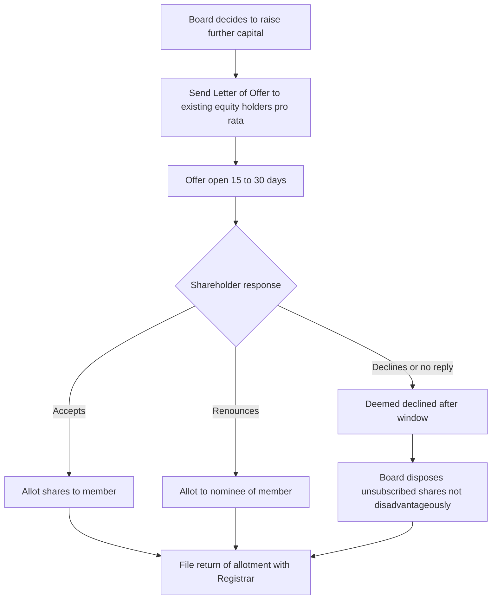
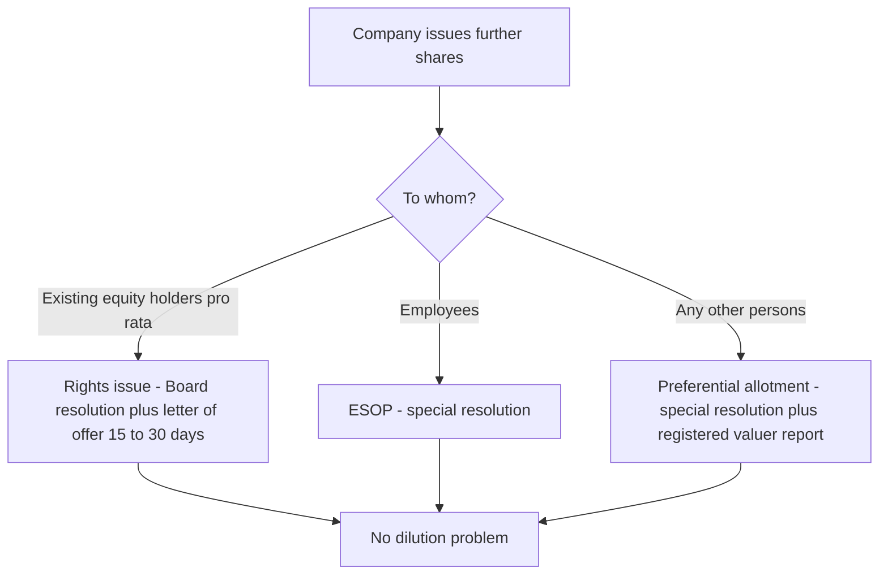
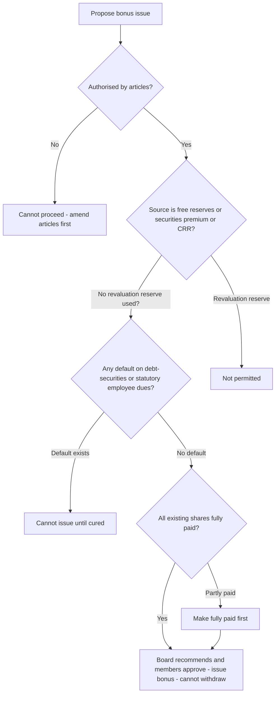
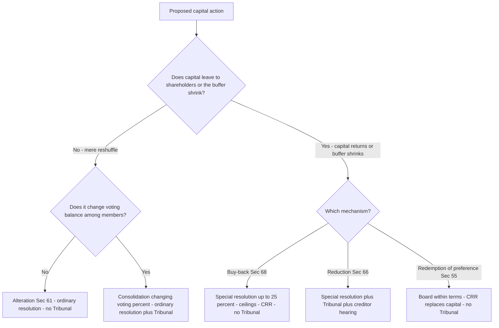
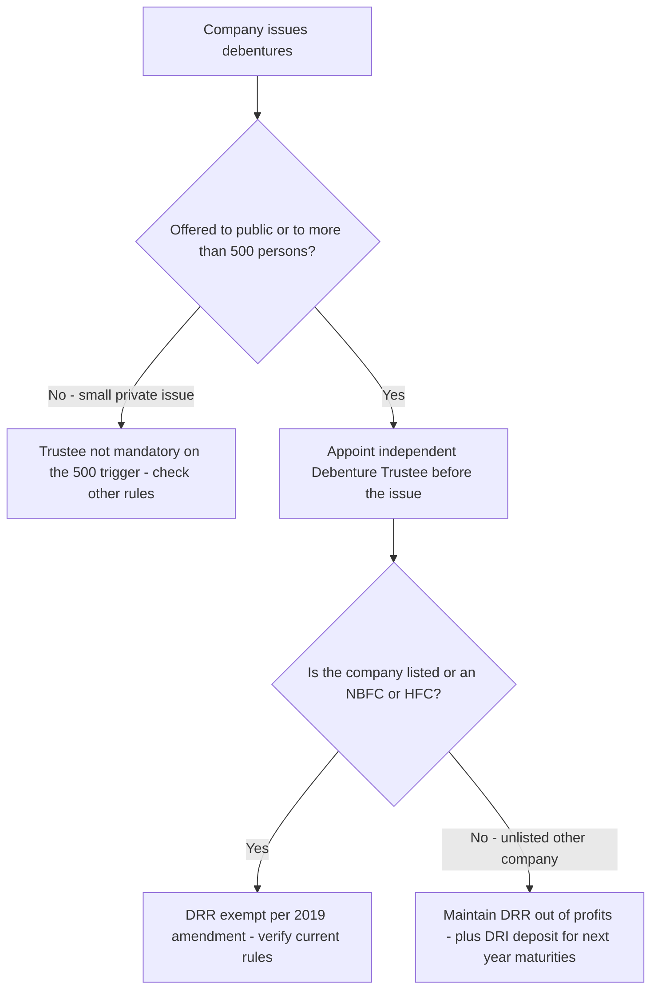
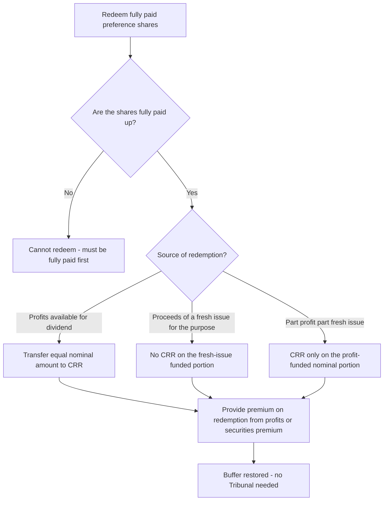
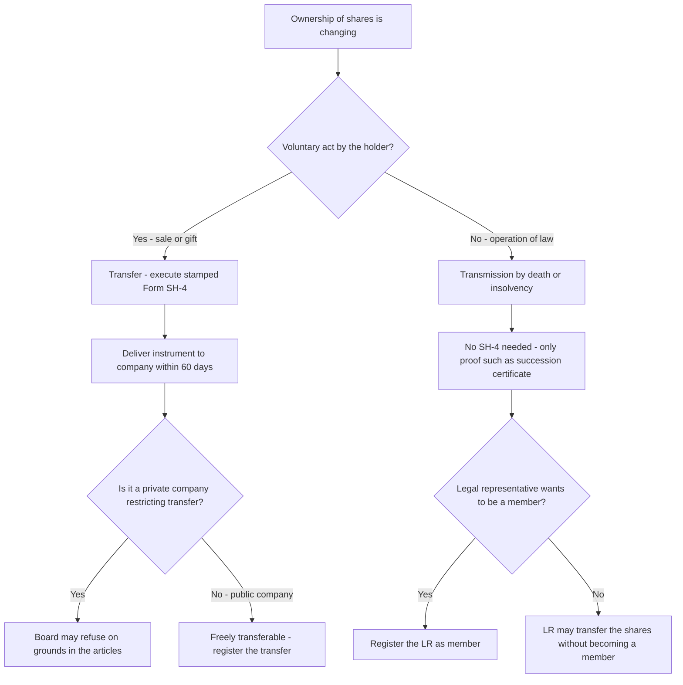

<!-- v2-deep -->

# Chapter 04 — Share Capital & Debentures

## 1. The Problem — Why Money Put Into a Company Keeps Vanishing

Imagine you lend ₹50 lakh to a company. You did not become an owner; you are a creditor. You looked at the company's balance sheet, saw "Share Capital ₹2 crore," and felt safe — that ₹2 crore is the buffer that absorbs losses before your loan is touched. The owners promised to put ₹2 crore of *their own* money at risk, standing behind your loan.

Now imagine three things happen:

1. The directors, who are also the big shareholders, quietly pay that ₹2 crore back to themselves as "return of capital," leaving nothing between your loan and zero.
2. Or the company issues shares to insiders for ₹1 when they are really worth ₹100, diluting everyone else and funnelling value to friends.
3. Or the company borrows ₹10 crore through debentures from thousands of small public investors, spends it, and there is no independent person watching whether the money is safe or the security real.

Every one of these is a **real historical fraud**. Companies were looted from the inside by manipulating capital. The whole architecture of Chapter IV of the Companies Act, 2013 (Sections 43–72) exists to answer one question: *how do we stop the people who control a company from moving capital in ways that betray the outsiders who relied on it — creditors, minority shareholders, and public debenture-holders?*

The single organising villain of this chapter is the **abuse of control over capital**. Everything else is a specific defence against a specific trick.

**Why "capital" is legally special and not just an accounting number.** A shareholder's liability in a limited company is capped at the unpaid amount on his shares (Sec 2(22)/Sec 3). That cap is the great bargain of company law: investors risk only a fixed sum, which is why they invest at all. But the mirror image of limited liability is that creditors have *only* the company's assets to look to — never the shareholders' personal wealth. So the "capital" figure is the price of the limited-liability privilege: in exchange for capping their downside, shareholders promise to keep a stated buffer intact for creditors. Capital rules are simply the enforcement of that promise. Once you see capital as *the consideration creditors received for accepting limited liability*, every "hard, rare, court-supervised" rule about touching it stops looking bureaucratic and starts looking like basic contract enforcement.

**The three victim-groups, kept distinct.** The chapter protects three different outsiders, and the examiner tests whether you know *which* protection fires for *which* victim:

- **Creditors** (including future creditors) — protected by *Capital Maintenance*: discount ban, premium lock, CRR, DRR, Tribunal-supervised reduction.
- **Existing shareholders** as a body — protected by *pre-emption / Fair Dealing*: the rights issue, valuer-priced preferential allotment.
- **A class of shareholders** (e.g. preference holders) against another class — protected by *class consent*: Sec 48 variation, Sec 47 revival of voting.

If you can name the victim, you can usually name the section.

**The four rungs of the capital ladder — a distinction the examiner hides inside every numerical.** "Share capital" is not one number but a descending ladder, and confusing two rungs is the most common silent error in a buy-back, rights-issue or reduction sum:

| Rung | Meaning | Where it bites |
|---|---|---|
| **Authorised (nominal) capital** | The ceiling fixed by the memorandum — the maximum the company *may* issue | Sec 61 increase; SH-7 filing |
| **Issued capital** | The part of authorised capital actually offered for subscription | — |
| **Subscribed capital** | The part of issued capital taken up by members | Base for a "further issue" under Sec 62 |
| **Called-up capital** | The part of subscribed capital the company has demanded be paid | Reduction Sec 66 face (1) |
| **Paid-up capital** | The part of called-up capital actually received | Buy-back ceilings; the buffer creditors see |

The buffer creditors actually rely on is **paid-up** capital plus free reserves — not authorised capital, which is a mere ceiling and can be enormous while paid-up is tiny. When a sum says "paid-up capital ₹50 lakh, authorised ₹5 crore," the ₹5 crore is a decoy; every capital-maintenance ceiling keys off *paid-up*. *Why does the ladder exist?* Because a company needs headroom to grow (a high authorised ceiling) without being forced to issue and without misleading anyone — so the law separates "permission to issue" (authorised) from "value actually contributed" (paid-up), and pins the creditor-protective rules to the latter. A favourite trap computes a 25% buy-back cap on *authorised* rather than *paid-up* capital, inflating the allowable figure tenfold.

**Nominal vs real capital — why "capital" can be honest or a lie.** Face value × number of shares = *nominal* capital, a legal bookkeeping figure. What actually stands behind the creditors is *real* value contributed. Sec 53 (discount ban) exists precisely to keep nominal and real capital equal *at the moment of issue*; the whole capital-maintenance apparatus then works to stop real value draining below nominal *afterwards*. Hold this master sentence: **every rule in the chapter is either (a) making nominal = real at issue, or (b) stopping real from falling below nominal later.** That one line organises all ten parts — Sec 52/53/54/62 police the "at issue" side; Sec 55/63/66/68/71 police the "afterwards" side.

## 2. The Core Idea — Capital Maintenance and Fair Dealing

Two protective principles run through the entire chapter. If you hold these two, you can *derive* almost every section.

**Principle A — Capital Maintenance.** The share capital a company raised must not leak back out to shareholders through the back door. Creditors extended credit trusting that buffer. So the law makes returning capital to shareholders *hard, rare, court-supervised, and never at the creditors' expense*. This is why reduction of capital (Sec 66) needs Tribunal approval, why buy-back (Sec 68) has ceilings and locks, why dividends can't be paid out of capital, and why shares generally can't be issued at a discount (Sec 53).

**Principle B — Fair Dealing / Equality Among Members.** Within the body of shareholders, no group may use control to enrich itself at another group's expense. Existing shareholders must not be secretly diluted; a class whose rights are altered must consent; new shares must first be offered to existing owners in proportion (rights issue, Sec 62). This is the "no unfair dilution, no unfair preference" principle.

Hold these two lamps up to any provision and its purpose lights up. The section number is just an address; the *reason* is the thing.

**A third, quieter principle — Disclosure & Traceability.** Sitting beneath the two lamps is a plumbing principle: *every movement of capital must leave a public paper trail with a deadline.* Form SH-7 for alteration, SH-4 for transfer, PAS-3 for allotment, the register of members, the register of charges — all exist so that an outsider dealing with the company can see the true, current capital position. Capital Maintenance says "don't let it leak"; Disclosure says "and if it moves at all, the world must be able to see it moved." Several "trap" questions are really disclosure-deadline questions (SH-7 in 30 days, SH-4 in 60 days) dressed up as substance.

**The two lamps are in tension — and that tension explains the exceptions.** Pure Capital Maintenance would forbid *ever* issuing shares below face value or *ever* returning cash to owners — but that would strangle legitimate business (rescuing a sick company, rewarding employees, returning genuine surplus). So each apparent "exception" (sweat equity, buy-back, ESOP, Sec 53(2A) discount on debt-conversion) is the point where the law decided the business need outweighs the buffer risk — and *bolted on a safeguard* (special resolution, valuer, ceiling, CRR) to contain the risk it just permitted. When you meet an exception, always ask: *what safeguard replaced the rule?* That pairing is the favourite exam structure.

**Placing any section on the two-lamp grid.** Every provision in the chapter answers to *one* dominant lamp — knowing which tells you what a valid answer must emphasise:

| Dominant lamp | Sections | The sentence a good answer contains |
|---|---|---|
| **Capital Maintenance** (protect creditors' buffer) | 52, 53, 55, 63, 66, 68/69, 71 (DRR/DRI) | "…so the buffer creditors relied on is not depleted." |
| **Fair Dealing** (protect members inter se) | 47, 48, 54, 62 (rights & preferential), ESOP | "…so no controlling group is enriched at another's expense." |
| **Disclosure & Traceability** (public paper trail) | 46, 56, 61/64, 71 (trustee), 42 (PAS-4/PAS-3) | "…so an outsider can see the true, current position." |

*Why does this grid help under exam pressure?* Because it converts a "state the law" question into a "name the lamp, then recite its safeguard" reflex. If you can say *which* outsider the provision protects, the marking points almost write themselves — and mixed questions usually engage **two** lamps at once (e.g. a defaulted-preference scenario fires both Sec 47 *voting revival* under Fair Dealing and, if repayment is proposed, Sec 66/55 under Capital Maintenance).

## 3. Why It's Built This Way — The Logic of Each Safeguard

Before the technical wall of sections, let's reason out *why* each major safeguard has the shape it has. This is the scaffolding; Part 4 hangs the exact numbers on it.

- **Why forbid issuing shares at a discount (Sec 53)?** If a company could sell ₹10 shares for ₹1, the "capital" figure on the balance sheet becomes a lie — creditors think ₹10 of value backs each share but only ₹1 came in. So discount is banned, *except* the tightly-controlled sweat-equity route (real value came in, just as effort not cash) and the special ESOP/Sec 54 arrangement.

- **Why is a premium (Sec 52) locked into a special reserve?** When shares sell *above* face value, that extra isn't ordinary profit to be handed out as dividend — treating it as distributable profit would let promoters recycle investors' own money back as "returns." So the premium is quarantined in the Securities Premium Account and can be used only for a short capital-like list of purposes.

- **Why must new shares be offered to existing shareholders first (Sec 62 rights issue)?** Because directors could otherwise issue fresh shares to themselves or allies at a low price, shrinking everyone else's percentage. Pre-emption preserves each owner's proportional stake and voting power.

- **Why does altering class rights (Sec 48) need the class's own consent?** Because a controlling group holding ordinary shares could vote to strip preference shareholders of their preference. Only the affected class can agree to have its own rights changed — and even then a dissenting minority can run to the Tribunal.

- **Why is reduction of capital (Sec 66) court-supervised but alteration (Sec 61) not?** Because *reduction* actually shrinks the creditor buffer — it's the dangerous one, so the Tribunal and creditors must be heard. Mere *alteration* (splitting, consolidating, converting) reshuffles the same total capital without returning anything to shareholders, so a Board-plus-ordinary-resolution suffices.

- **Why must debentures to the public have a trustee (Sec 71)?** Ten thousand small debenture-holders cannot each individually police the company. So the law inserts a professional **Debenture Trustee** who holds the security and enforces it on behalf of all — a single watchdog with teeth, replacing a scattered helpless crowd.

- **Why can a private company switch off Sec 43 and 47 but not Sec 53 or 66?** Because Sec 43 (kinds) and 47 (voting) govern the *internal* deal *among the members themselves* — and in a closely-held company where everyone knows everyone, the law lets them privately re-arrange their own bargain. But Sec 53 (discount) and Sec 66 (reduction) protect *outsider creditors*, who never sat at that table. **Rule of thumb: a private company may relax the rules that protect only its own members; it can never relax the rules that protect creditors.** This single test predicts almost every private-company exemption in the chapter.

- **Why is a bonus issue *encouraged* (light conditions) while buy-back is *fenced* (heavy conditions)?** Both touch reserves, but in opposite directions. A bonus issue moves reserves *into* capital — the buffer gets **larger and more locked**, so creditors gain; the law only checks that the reserves are real. A buy-back moves reserves *out* to shareholders — the buffer **shrinks**, so creditors lose; hence caps, ratios, CRR, and cooling-off. Direction of travel of the buffer = severity of the safeguard.

- **Why demand an actual DRI deposit on top of the DRR reserve (debentures)?** A DRR is only an *appropriation of profit* — a bookkeeping ring-fence that stops the profit being paid out as dividend, but leaves no guarantee that cash actually exists on redemption day. So the law adds a **Debenture Redemption Investment**: real money parked in specified liquid instruments before each financial year's maturities fall due. Reserve = "don't distribute what you owe"; investment = "and actually hold the cash." Two different failures (distributing the profit vs having no liquid funds) need two different plugs.

- **Why does a nomination (Sec 72) override a will?** Because a share is a contract *with the company*, and the company must be able to pay out on death to one certain, pre-declared person without waiting for probate or refereeing a family dispute. The nomination is the shareholder's own instruction to the company about *vesting*; a will speaks to the estate, not the company. The law privileges the clean, company-facing instruction for vesting, while leaving heirs free to litigate *beneficial* ownership afterwards. Speed of vesting for the company, fairness of ultimate entitlement for the family — both served.

- **Why is a share certificate only *prima facie* evidence while the register is the real record?** Because paper travels and can be forged or duplicated, but the register is the company's single controlled ledger. If the certificate were conclusive, a forger who obtained a duplicate could defeat the true owner. Making the register primary means the truth always has a home the company controls and can rectify (Sec 59).

- **Why cap sweat equity and ESOP as a percentage of paid-up equity rather than banning insider issues outright?** Because the value they bring in (know-how, retained talent) is real and the company genuinely needs it — an outright ban would starve start-ups of their only currency. A *percentage cap* lets the legitimate use through while making it arithmetically impossible for insiders to convert the whole company into cheap self-issued equity. The cap is the pressure valve, not the padlock.

Now the technical content will feel like consequences, not commandments.

## 4. Full Technical Content — Section by Section, Each With Its "Why"

### 4.1 Kinds of Share Capital — Section 43

A company limited by shares can have two kinds of share capital:

- **Equity share capital** — (a) with voting rights, or (b) with *differential rights* as to dividend, voting or otherwise (DVR shares), per prescribed rules.
- **Preference share capital** — carries a preferential right to (i) dividend (fixed amount or rate) and (ii) repayment of capital on winding up, *ahead of* equity.

*Why two kinds?* Different investors want different risk. The preference shareholder wants a fixed, priority return (bond-like); the equity shareholder wants the upside and control. Sec 43 simply names the two boxes the law will then regulate. **Note:** a *private company* may, through its articles/memorandum, override Sec 43 and 47 — a relaxation introduced to give small closely-held companies flexibility.

**Finer taxonomy of preference shares (frequently tested labels).** The *same* preference share can carry several attributes, and the examiner tests whether you know that the default is the "safer for the investor" version:

| Attribute | Two flavours | The **default** if silent |
|---|---|---|
| Dividend arrears | **Cumulative** (unpaid dividend accumulates) vs **Non-cumulative** (missed = gone) | **Cumulative** |
| Extra profit share | **Participating** vs **Non-participating** | **Non-participating** |
| Conversion to equity | **Convertible** vs **Non-convertible** | **Non-convertible** |
| Repayment | **Redeemable** (must be, ≤20 yrs) vs Irredeemable | **Redeemable** — irredeemable is *prohibited* (Sec 55) |

*Why do these defaults lean investor-protective?* Because the preference shareholder gave up voting power and upside in exchange for a *promise*; where the terms are silent, the law reads the promise generously so the bargain isn't hollowed out. A trap will say "the company skipped the dividend, so it need not be paid later" — wrong if the shares are (or are silent, hence deemed) cumulative.

**DVR shares — the guardrails.** Differential-rights equity (e.g. shares with 1/10th the votes but higher dividend, or vice versa) is legal but rule-bound to stop promoters from entrenching control with tiny economic stakes. Conditions typically include: authorised by articles and an ordinary resolution; a consistent track of distributable profits / no default in filing or repayment; and a cap on DVR as a proportion of total post-issue paid-up equity. *Verify the current DVR percentage cap and eligibility conditions in the Companies (Share Capital and Debentures) Rules — this figure has been amended.*

**Preference shares must be redeemable — Section 55.** A company (other than as specially permitted) *cannot issue irredeemable preference shares*. They must be redeemed within **20 years**; except infrastructure projects may issue preference shares redeemable beyond 20 years (redeemable in a phased manner as prescribed). *Why the ban on irredeemable preference?* An irredeemable preferential claim ranking ahead of equity forever is effectively perpetual debt masquerading as capital — it would let promoters bleed a fixed charge on profits indefinitely. Forcing redemption keeps the capital structure honest.

Redemption of preference shares (Sec 55) protects creditors by rule: they can be redeemed **only** out of (a) profits otherwise available for dividend, or (b) proceeds of a *fresh issue* of shares made for the purpose. Two more hard rules ride along: **only fully paid-up** preference shares may be redeemed, and the **premium payable on redemption** must be provided (out of profits, or out of securities premium for certain companies). If redeemed out of profits, an equal amount must be transferred to the **Capital Redemption Reserve (CRR)** — a reserve treated almost like capital. *Why CRR?* If you pay shareholders back out of profits, the buffer would shrink; forcing an equal amount into a locked reserve keeps the total buffer intact. Capital maintenance in action.

**Where the premium *on redemption* comes from — the split rule.** The premium payable when redeemable preference shares are redeemed must be **provided for before redemption**: for companies **not** complying with the notified Accounting Standards (broadly, older/other companies), it may be met **out of profits or out of the securities premium account**; for companies **whose financial statements comply with those Accounting Standards**, the redemption premium must be provided **out of profits** (the securities premium may be used only to the extent permitted, i.e. tied to the premium originally *received* on those very shares) — *verify the exact carve-out against current ICAI material.* *Why restrict the premium source for AS-compliant companies?* To stop a company from using investors' *other* subscription premium to fund a payout premium to preference holders — keeping each pot of premium tied to its own purpose.

**Redemption is NOT a reduction of capital.** A frequent conceptual trap: redeeming preference shares looks like the buffer shrinking, so why no Tribunal (unlike Sec 66)? Because the CRR (or the fresh-issue proceeds) *instantly replaces* the redeemed capital rupee-for-rupee — the total buffer never actually falls. The law pre-built the replacement, so it doesn't need the Tribunal to police it. Sec 66 needs the Tribunal precisely *because* nothing replaces the vanished capital.

**Company unable to redeem on due date (Sec 55(3)).** If a company can't redeem, or can't pay accumulated preference dividend, it may — with consent of holders of **≥ 3/4 in value** of those preference shares and with **Tribunal** approval — issue *further redeemable preference shares* equal to the amount due (including dividend), and the unredeemed shares are deemed redeemed. *Why?* A rescue valve: rather than force a solvent-but-illiquid company into default, the law lets it roll over the obligation, but only with a supermajority of the affected class plus the Tribunal — the same "class-consent + court" pattern as Sec 48/66.

**The two lawful redemption sources, and why "proceeds of a fresh issue" means *nominal* only.** Sec 55 permits redemption *only* from (a) profits otherwise available for dividend, or (b) proceeds of a fresh issue *made for the purpose of redemption*. The precise trap: when the fresh issue is made **at a premium**, only the **nominal (face) value** of the fresh shares counts as "proceeds of a fresh issue" that reduces the CRR obligation — the *premium* collected does **not** reduce the amount to be transferred to CRR. *Why?* Because CRR must be topped up to keep total *capital* constant; the premium is not capital (it is a Sec 52 reserve with its own restricted uses), so it cannot substitute for the capital being redeemed. Another tested precision: the fresh issue must be *for the purpose of redemption* — an unrelated fresh issue made months earlier for working capital does **not** qualify to reduce the CRR.

| Redeemed out of… | CRR transfer needed? | Buffer logic |
|---|---|---|
| Profits available for dividend | **Yes** — equal to nominal redeemed | Profit would have shrunk the buffer; CRR locks it back in |
| Proceeds of a fresh issue (nominal) | **No** — fresh capital already replaced it | New capital rupee-for-rupee replaces the old |
| Part profit + part fresh issue | Yes, only on the *profit-funded* portion | Only the profit-funded slice needs replacing |

**DVR shares — the full conditions grid (frequently examined as a "state the conditions" question).** Differential-rights equity is legal but hedged so promoters can't entrench control on a sliver of economic ownership. Typical conditions under the Rules: (i) authorised by the **articles**; (ii) approved by an **ordinary resolution** (a *postal-ballot* route applies for certain companies); (iii) DVR capped as a **proportion of total post-issue paid-up equity** — *verify the current percentage, which has been amended*; (iv) a track record of **distributable profits** for the relevant preceding years, or **no default** in filing financial statements/annual returns, payment of declared dividend, or repayment of matured deposits/debentures/term loans; (v) no penalty/conviction under specified economic laws in recent years; and (vi) the company must **not convert** existing equity into DVR shares or vice versa. *Why so many conditions?* Each blocks one route by which a controller could grab votes cheaply — the profit/no-default track record proves the company is honest enough to be trusted with a two-tier structure, and the conversion ban stops a mid-stream bait-and-switch of ordinary holders into a diluted voting class.

### 4.2 Voting Rights — Section 47

Equity: one-share-one-vote, voting proportional to paid-up capital. Preference shareholders normally vote *only* on resolutions that directly affect their rights — but if their dividend is unpaid for **two years or more**, they get voting rights on *every* resolution. *Why?* A preference shareholder is a quiet priority-investor as long as the deal is honoured; the moment the company defaults on their promised dividend for two years, the bargain is broken and they earn a full seat at the table.

**Precision on the two-year trigger (exam-hard).** For **cumulative** preference shares the trigger is dividend unpaid for an *aggregate* of two years or more; for **non-cumulative** it is dividend not paid in respect of a period of two years or more (or for two or more consecutive preceding years — *verify the exact wording in current ICAI material*). The point the examiner tests: it is **two years, not one missed dividend**, and once armed, the preference class votes on *every* resolution, not merely on matters affecting preference rights. A tweak: "dividend unpaid for 18 months" → **not yet** triggered.

**"Resolutions directly affecting their rights."** Even when not in arrears, preference holders always vote on (a) any resolution to wind up the company, and (b) any resolution for repayment or reduction of the preference share capital — because those hit the preference bargain at its core. Their vote value on such matters is proportioned to their paid-up preference capital.

**How the proportion is computed (mini-numerical).** Sec 47(2) sets a preference shareholder's voting *weight*, when he does vote, in the same proportion as his paid-up preference capital bears to the *total* paid-up equity **plus** preference capital. So if equity paid-up is ₹80 lakh and preference paid-up is ₹20 lakh, the preference class collectively controls 20/100 = **20%** of the vote on a matter it is entitled to vote on. *Why this ratio and not one-share-one-vote?* Because votes track economic stake in the residual bargain; a preference holder's stake is measured by capital contributed, and the section keeps the arithmetic proportional across both classes so no class is over- or under-weighted relative to the money it actually put in.

**Does the two-year clock reset on part-payment?** Exam-hard tweak: paying *part* of the arrears does not disarm the class if a full two years' worth remains unpaid — the trigger is about the *quantum and duration* of default, not a token payment. Conversely, once the company clears the arrears the preference class reverts to its limited voting rights on the next default cycle. The examiner may give "company paid one of the three years' arrears" — still triggered, because two years remain owed.

### 4.3 Certificate of Shares — Section 46

The share certificate under common seal (if any) is **prima facie evidence** of title. Duplicate certificates fraudulently issued attract heavy penalty. *Why the penalty?* A fake certificate lets a fraudster sell the same shares twice — the deterrent guards the register's integrity.

**Prima facie, not conclusive.** The subtle point: a certificate is *presumptive* proof, rebuttable by contrary evidence — the **register of members** is the primary legal record of ownership; the certificate is merely the member's portable evidence of what the register says. *Why does this matter?* If a certificate is forged or issued in error, the true position on the register still governs — the company can rectify. A trap treats the certificate as unbeatable title; it isn't.

**Dematerialised shares.** For shares held in demat form there is no physical certificate; the depository's records are the evidence of title. Certain classes of companies must issue securities only in demat form. *Why?* Paper certificates enabled forgery and double-selling; demat closes that hole entirely — the register-integrity purpose of Sec 46 achieved by technology.

**Time-limits for issuing certificates — the 2/6/1 cluster (recall anchor).** Under Sec 56, certificates must be delivered within **2 months** of *allotment of shares*, **6 months** of *allotment of debentures*, and **1 month** of *registration of a transfer* (and within 2 months of allotment of *further* shares on a rights/bonus issue). *Why does a certificate even have a deadline?* Because a member with no certificate cannot easily deal with his shares; the deadline forces the company to arm the member with his portable evidence promptly. Failure attracts penalty on the company and officers in default.

**Duplicate certificates and the register of renewed/duplicate certificates.** A duplicate may be issued where the original is lost/destroyed or defaced, but only after prescribed verification, and the issue must be entered in a **register of renewed and duplicate certificates**. *Why the register and heavy penalty for fraudulent duplicates?* Because a bogus duplicate lets a fraudster sell the same shares twice; the register makes every duplicate traceable and deters the fraud that Sec 46 exists to stop.

### 4.4 Application of Premium — Section 52

Where shares are issued at a premium, the aggregate premium goes to the **Securities Premium Account**. It may be applied *only* for:

- issuing fully paid **bonus shares**;
- writing off **preliminary expenses**;
- writing off expenses/commission/discount on issue of shares or debentures;
- providing the **premium payable on redemption** of redeemable preference shares or debentures;
- **buy-back** under Sec 68.

*Why this closed list?* Every permitted use is either capital-like (bonus, buy-back, redemption premium) or a genuine cost of raising the capital. The one thing you may **not** do is pay it out as ordinary dividend — that would return investors' own subscription money to them dressed as profit. Memory hook: securities premium is "capital's cousin," not "profit's sibling."

**The narrowed list for certain companies (Sec 52(3)).** For companies whose financial statements comply with the notified Accounting Standards (broadly, most operating companies), the securities premium may be applied only for the **first, third, and fourth** purposes above — i.e. **bonus shares, writing off share/debenture issue expenses & commission, and premium on redemption of preference shares or debentures**. Writing off *preliminary expenses* and using premium for *buy-back* are then not available from the premium account for such companies. *Why the split?* The narrower list is even more tightly capital-flavoured; it prevents such companies from quietly consuming the premium reserve on softer items. *Confirm the exact scope against current ICAI material.*

**Securities premium is not "free reserves" for dividend and generally not part of "profits available for dividend."** Restate the core trap: the account is treated *as if it were paid-up capital* for the purpose of Sec 52's restrictions. So "Can we declare dividend out of the securities premium?" → **No.**

**Premium can arise even without cash.** Where shares are issued for a **non-cash consideration** (e.g. against acquisition of a business) at a value above face, the excess is still "securities premium" and still locked into the account. *Why?* Because Sec 52 keys off *value received above nominal*, not the *form* (cash or kind) in which it was received — the buffer logic is identical. A trap says "no cash came in, so there is no premium to restrict" — wrong.

**A closed list means genuinely closed — no residual "any other business purpose."** Because the five permitted uses are exhaustive, a company cannot apply the securities premium to write off *trading* losses, pay *dividends*, fund *ordinary capex*, or absorb *revaluation* deficits. The account behaves like paid-up capital: it can only migrate to another capital-flavoured home (bonus, redemption premium, buy-back) or discharge a true cost of raising capital. Memory anchor: *if the use isn't on the list, it isn't allowed — full stop.*

**Premium is booked at allotment, and cannot later be "released."** Once credited, the balance cannot be freed back into distributable profit by a mere board decision — releasing it would require, in substance, a reduction of capital under Sec 66 (because it is treated as capital). This is why a company sitting on a large securities premium cannot simply "reclassify" it to pay a special dividend; the examiner may frame this as a disguised return of capital.

### 4.5 Prohibition on Issue at a Discount — Section 53

Any issue of shares at a discount (below face value) is **void**. Company and every officer in default face penalty; the company must refund with interest. *The one carve-out:* shares issued at a discount to creditors under a **statutory resolution/scheme of reconstruction (Sec 53(2A))** — e.g. debt converted to equity under RBI-directed restructuring. And **sweat equity (Sec 54)** is a separate, lawful non-cash route, not a "discount." *Why so absolute?* Because a discount silently overstates capital — the balance-sheet buffer becomes fictitious.

**"Void," not merely "voidable."** The examiner distinction: a discount issue is a legal nullity from the start — no valid allotment ever came into existence, so the allottee must return the shares and the company refund the money with interest. Contrast a *procedural* defect elsewhere that might be voidable/curable. *Why "void"?* Because the harm (fictitious capital) is done the instant the shares are recorded at face value against underpaid cash; only complete unwinding fixes it.

**Discount vs par vs premium — the reference point is always face (nominal) value.** Discount = issue price below face value; premium = above. Market price is irrelevant to Sec 53 — a company may issue at a discount to *market* (e.g. a rights issue priced below the traded price) and that is perfectly legal, because the price is still **at or above face value**. A classic trap conflates "below market" with "at a discount." Only "below face value" engages Sec 53.

**The consequence machinery of a void issue.** Because a discount issue is void, the remedy is *restitutio in integrum* — the allottee returns the shares and the company **refunds the money with interest** (the Rules/section prescribe the interest rate — *verify current figure*), and the company plus every officer in default face a **penalty**. *Why refund with interest and not merely cancel?* Because the allottee parted with cash on a void allotment; interest compensates for the use of that money and deters companies from trying the manoeuvre "for free."

**The Sec 53(2A) carve-out — discount on conversion of debt.** The one lawful discount is where shares are issued **at a discount to a company's creditors** when their **debt is converted into shares** under a **statutory resolution or a scheme** (e.g. an RBI-directed strategic debt restructuring). *Why permit it here?* Because the alternative is the company's collapse; converting distressed debt to equity below face value is a rescue, and the creditors themselves (the very people the discount ban protects) are the ones consenting and benefiting. The safeguard is that it happens only under a *supervised statutory scheme*, not at the board's whim. Distinguish sharply from **sweat equity (Sec 54)**, which is a *separate lawful route* for non-cash value, not a "discount" at all.

### 4.6 Sweat Equity Shares — Section 54

Equity shares issued to **directors or employees** at a discount or for consideration other than cash, for providing **know-how, IP, or value additions**. Conditions:

- Issue authorised by a **special resolution**;
- The resolution specifies number, current market price, consideration, and the class of directors/employees;
- Same rank/limitations/rights as ordinary equity.

> **Note (post-2017 amendment):** The old requirement that sweat equity could **not** be issued "before one year from the date the company was entitled to commence business" was the erstwhile **Section 54(1)(c)**, which was **omitted by the Companies (Amendment) Act, 2017 (w.e.f. 7 May 2018)**. Under current law there is **no one-year waiting period** — a company (notably a start-up) may issue sweat equity from the outset.

**Quantitative ceilings (Rules).** A company may issue sweat equity in a year up to **15% of existing paid-up equity capital or shares of issue value ₹5 crore, whichever is higher**, and the **overall** sweat equity issued cannot exceed **25% of the paid-up equity capital at any time** (a recognised **start-up** may issue up to **50%** within its early years). Where sweat equity is issued to directors/managerial personnel for non-cash consideration that does *not* create an identifiable intangible asset, it is expensed. *Verify these percentages and the start-up window against the current Companies (Share Capital and Debentures) Rules — they have been amended.*

*Why allow this exception to Sec 53?* Because real value *does* flow in — sweat, brains, patents — just not cash. The special resolution and disclosure guard against directors quietly gifting themselves cheap shares under this banner. *Why the ceilings?* The 15%/25% caps stop insiders converting the whole company into cheap self-issued equity (the old one-year waiting period was omitted w.e.f. 7 May 2018, so a start-up can issue from day one).

**Sweat equity vs ESOP — don't merge them.** Sweat equity is *issued now* as a reward for value *already provided* (know-how/IP); ESOP is an *option granted now to buy later* as an incentive for future service. Sweat equity shares are subject to a **lock-in (typically 3 years)**; ESOP has a vesting period before exercise. Both need a special resolution (ESOP: ordinary for a private company), but the trap is calling a past-value reward an "option" or vice-versa.

**Validity window and pricing discipline.** The special resolution authorising sweat equity is valid for **12 months** from the date of passing — the issue must be *made within* that window or a fresh resolution is needed. *Why a shelf-life?* Because the market price, the class of eligible persons, and the fairness of the deal all go stale; a two-year-old approval could be used to issue cheap shares on outdated valuations. Where sweat equity is issued for **know-how or IP** (an identifiable intangible), the value is capitalised as an asset; where it is issued to directors/managerial personnel and does **not** create an identifiable asset, the amount is **expensed** in the statement of profit and loss — this accounting fork is itself examinable.

**Register and disclosure.** The company must maintain a **Register of Sweat Equity Shares (Form SH-3)** and make full disclosure in the **Board's Report** (number issued, price, consideration, persons, and the percentage of post-issue capital). *Why the register + report?* The whole exception to Sec 53 rests on transparency — an independent reader must be able to see that insiders did not quietly gift themselves equity. Remove the disclosure and the exception would become the very abuse it was carved out of.

**The lock-in reasoning.** Sweat equity shares carry a **lock-in of three years** from allotment (verify current Rules), during which they cannot be transferred. *Why lock them in?* Because the shares reward *value already provided*; a lock-in stops a director from taking cheap shares for "know-how" and immediately dumping them at market for a quick, unearned gain — it forces the recipient to keep skin in the game and aligns him with the value he claims to have added.

### 4.7 Employee Stock Options (ESOP) — Section 62(1)(b)

A company may offer shares to employees under a scheme of ESOP by a **special resolution** (a private company may use an ordinary resolution). *Why part of Sec 62?* Because giving shares to employees is a form of "further issue" that skips the rights-offer to existing members — so it needs the members' special approval as the price of bypassing pre-emption. (See 4.9.)

**Who is an "employee" for ESOP.** Includes a permanent employee (in India or abroad) and a director (whole-time or not) — but **excludes** (a) a **promoter or person belonging to the promoter group**, and (b) a **director who, directly or indirectly, holds more than 10% of the outstanding equity** (alone or with relatives/body corporate). *Why exclude promoters and 10%-plus directors?* ESOP exists to align *employees'* incentives; letting promoters help themselves under the ESOP banner would just be self-dealing cheap equity — the very abuse Sec 62 guards against.

**Key ESOP mechanics tested:** there must be a **minimum vesting period of one year** between grant and vesting; options are **non-transferable** and cannot be pledged; the exercise price is set by the company (subject to accounting norms). No voting/dividend rights attach until the option is exercised and shares are actually allotted.

**The four-stage ESOP timeline — label each stage.** (1) **Grant** — the company gives the employee the *option* (a right, not shares). (2) **Vesting** — after the *minimum one-year* gap the option *vests* (becomes exercisable); the company may set a longer vesting schedule. (3) **Exercise** — the employee *pays the exercise price* and applies; only now is a *share* allotted. (4) **Allotment** — shares issue, and *only from this point* do voting and dividend rights attach. *Why insert the one-year vesting gap?* Because ESOP rewards *continued service*; a gap forces the employee to stay before the incentive matures — a same-day grant-and-exercise would just be cheap equity, not a retention tool. *Trap:* a question grants and "exercises" on the same day, or attaches voting rights at grant — both wrong.

**Employee-side rules and death/disability.** The option **lapses if the employee leaves** before vesting (subject to the scheme), but on **death** the options generally **vest immediately** in the legal heirs, and on **permanent disability** they vest in the employee — *why the compassionate exception?* Because the retention rationale is spent once service ends through no choice of the employee. The company may **not vary** the terms of an outstanding ESOP to the *disadvantage* of option-holders once granted, absent their approval — options, once granted, are a protected expectation.

### 4.8 Issue of Bonus Shares — Section 63

Bonus shares are fully-paid shares given **free** to existing shareholders out of the company's reserves. May be issued out of:

- free reserves;
- securities premium account;
- capital redemption reserve.

**Not** out of reserves created by revaluation of assets. Conditions: authorised by articles; recommended by Board and approved in general meeting; company not defaulted on debt-securities interest/principal or on statutory dues to employees (PF, gratuity, bonus); partly-paid shares must be made fully paid first; once announced, a bonus issue **cannot be withdrawn**.

**Bonus cannot be in lieu of dividend (Sec 63(3)).** The company may not issue bonus shares *in place of* a dividend. *Why?* A bonus issue capitalises reserves permanently into the buffer; a dividend is a cash return. Letting a company substitute one for the other would let it dodge the dividend rules (and deny shareholders cash they were led to expect) while pretending to be generous. Keep the two mechanisms in their own lanes.

*Why forbid revaluation reserves and why the conditions?* A bonus issue converts reserves into capital (capitalisation of profits) — it *strengthens* the buffer, which is fine, but only if the reserves are real. Revaluation "profit" is a paper mark-up, not realised value; letting it become capital would inflate capital on air. The no-default condition stops a company that owes its lenders and workers from playing generous-uncle with shareholders.

**Effect on share price and total wealth (why bonus is not "free money").** A bonus issue does not enrich shareholders in aggregate — it merely subdivides the same equity into more shares, so the market price falls proportionately. A 1:1 bonus roughly halves the per-share price; a shareholder's *total* value is unchanged. What actually changed on the balance sheet: **reserves fell, paid-up capital rose by the same amount** — capital got bigger and more locked (capital can't be distributed as easily as reserves), which is precisely why creditors don't object. Understanding this is what makes the "why light conditions" reasoning click.

**Bonus must fit within *authorised* capital — the ceiling that suddenly matters.** A bonus issue *increases paid-up capital*, so the company must have enough **un-issued authorised capital** to absorb it; if not, it must first pass an **ordinary resolution under Sec 61 to raise the authorised ceiling** (and file SH-7). This is the one place the otherwise-decoy authorised figure becomes the binding constraint. *Examiner tweak:* "Company has authorised ₹1 crore, paid-up ₹90 lakh, proposes a 1:4 bonus (₹22.5 lakh)" — impossible without first increasing authorised capital, because ₹90 lakh + ₹22.5 lakh = ₹112.5 lakh exceeds the ₹1 crore ceiling.

**Mini-numerical — sourcing a bonus issue.** Kappa Ltd has paid-up equity of **₹40,00,000** (4,00,000 shares of ₹10) and reserves: securities premium ₹6,00,000, general (free) reserve ₹18,00,000, revaluation reserve ₹10,00,000, capital redemption reserve ₹4,00,000. It declares a **1:2 bonus** (1 free share for every 2 held). *Work it:* shares to issue = 4,00,000 ÷ 2 = **2,00,000**; amount to capitalise = 2,00,000 × ₹10 = **₹20,00,000**. Permissible sources = securities premium ₹6,00,000 + CRR ₹4,00,000 + free reserve ₹18,00,000 = **₹28,00,000 available**; the ₹10,00,000 **revaluation reserve is excluded** (Sec 63). Since ₹28,00,000 ≥ ₹20,00,000, the bonus is fundable. *Self-check (buffer test):* reserves fall ₹20,00,000, paid-up capital rises ₹20,00,000 — total buffer unchanged in size but *more locked* (capital is harder to distribute than reserves), which is exactly why creditors don't object and the conditions are light. *Trap:* a candidate who includes the ₹10,00,000 revaluation reserve would wrongly conclude ₹38,00,000 is available and might over-issue.

### 4.9 Further Issue of Capital — Rights Issue — Section 62

This is the heart of Fair Dealing. Where a company **having a share capital** proposes to increase subscribed capital by issuing further shares, those shares must be offered:

**(a) To existing equity shareholders (Rights Issue)** in proportion to their paid-up capital, by a letter of offer subject to:

- the offer is open for **not less than 15 days and not more than 30 days**; if not accepted within that window it is deemed declined;
- notice of the offer must be dispatched at least **3 days before** the offer opens;
- the offer must state the shareholder's **right of renunciation** (they may pass the offer to another person);
- after expiry or on decline, the Board may dispose of the unsubscribed shares in a manner **not disadvantageous** to shareholders and the company.

*For a private company, periods/notice can be shortened / dispensed with the consent of ≥ 90% of members.*

**(b) To employees under an ESOP** — special resolution (see 4.7).

**(c) To any other persons (Preferential Allotment / Private Placement)** — if authorised by a **special resolution**, either for cash or other consideration, provided the price is determined by a **registered valuer's** report. *Why the valuer?* Allotting shares to outsiders below fair value is exactly how insiders dilute the rest — an independent valuation blocks the underpricing trick.

**Conversion clause (Sec 62(3)):** where a term-loan from a government/bank includes a term (approved by special resolution *before* the loan) to convert the loan into shares, the rights-offer rule doesn't apply. *Why?* The dilution was consented to in advance, with eyes open.

Memory hook for Sec **62**: think "6-to-2" — the company turns to (6) its own existing owners *first*, employees, then others — pre-emption *first*, outsiders *last*. Window **15–30 days**: minimum 15 (long enough to decide), maximum 30 (not so long it stalls fundraising).

**When Sec 62 does *not* bite — the boundary of pre-emption.** Sec 62 governs an increase in *subscribed* capital by a *further issue of shares*. It therefore does **not** apply to: a **bonus issue** (Sec 63 — no fresh money, everyone gets shares pro-rata anyway); a **conversion of debentures/loans** into shares where the term was approved by special resolution *before* the loan (Sec 62(3)); an **increase of merely authorised** capital (Sec 61 — no shares actually issued yet); or the **redemption** and re-issue mechanics. *Why carve these out?* Because pre-emption exists to stop *dilution by selective fresh issue*; where there is no selective fresh money (bonus), or the dilution was consented to in advance (conversion), or no shares issue at all (authorised increase), the mischief is absent, so the machinery would be pointless friction. A trap forces a rights-offer onto a bonus issue or an authorised-capital increase — neither needs one.

**Government/bank loan-conversion (Sec 62(3)) in depth.** Where a term loan from the **Government** or a **banking/financial institution** contains a term to convert the loan (or interest) into shares, and that term was approved by a **special resolution *before* the loan was raised**, the conversion can proceed **without** a fresh rights-offer. If the Government *directs* conversion in the public interest, the terms (and whether they are just) can be tested before the Tribunal. *Why the pre-approval condition?* Because the whole justification for skipping pre-emption is *prior informed consent* — the members knew and agreed to the potential dilution when they approved the loan terms, so re-offering shares at conversion would be redundant.

**Renunciation — the feature that makes pre-emption fair AND flexible.** A shareholder who can't or won't put in more money is not trapped: he can *renounce* the offer (in whole or part) to a third party, capturing the value of the "right" itself (see the worked value-of-right calculation in Part 5). So pre-emption protects the passive shareholder economically even when he declines. *Why does this matter for the exam?* A trap says the shareholder "loses everything by not subscribing" — false; he can renounce and monetise the right. Unless renounced or subscribed within the window, however, it lapses.

**Rights issue vs preferential allotment vs private placement — keep the trio straight.**

| Route | To whom | Resolution | Pricing |
|---|---|---|---|
| Rights issue 62(1)(a) | Existing equity holders pro-rata | Board (letter of offer) | Company's choice (≥ face value) |
| Preferential allotment 62(1)(c) | Selected persons (insiders/outsiders) | **Special** | **Registered valuer** report |
| Private placement (Sec 42) | Identified persons, ≤ 200 in a year per kind | Special (offer via PAS-4) | Valuer; money via banking channel only |

Sec 42 (private placement mechanics) and Sec 62(1)(c) (authority for a non-rights allotment) often operate *together* for an outsider issue; the examiner tests whether you invoke *both* the special resolution (62) and the PAS-4 / banking-channel / 200-person discipline (42).

**Private placement (Sec 42) — the finer discipline the examiner tests as a standalone.** A private placement is an offer of securities to a *select group of identified persons* through a **private placement offer-cum-application letter (Form PAS-4)**. Key rules to reproduce: (i) the offer may be made to **not more than 200 persons in a financial year** *per kind of security* (excluding QIBs and employees under ESOP); (ii) the minimum investment size and the discipline that money must be received **only through the banking channel** (cheque/demand draft/electronic mode) from the applicant's own bank account — **never in cash**; (iii) the company **cannot utilise the money until the return of allotment (PAS-3) is filed**; (iv) allotment must be completed within **60 days** of receipt of application money, failing which the money is **refunded within 15 days**, and after that with **12% interest**; (v) a company cannot make a *fresh* offer while an earlier offer is pending. *Why so procedural?* Because private placement is the route most open to abuse — quietly parking securities with favoured insiders and recycling their own money — so the law forces identification, a bank-traceable money trail, a hard headcount, and a filing gate before the cash can be touched. Breach converts the "private placement" into a **deemed public offer**, dragging in the entire prospectus regime.

**Disposing of the unsubscribed rights — the "not disadvantageous" standard.** When a rights offer lapses or is declined, the Board may allot the leftover shares to *anyone* — but only in a manner **not disadvantageous to the shareholders and the company** (Sec 62(1)(a)(iii)). *Why the qualifier?* Because the leftover route is the loophole through which directors could hand cheap shares to allies after engineering a lapse; the "not disadvantageous" test keeps the price and terms fair to the body of members even for the crumbs. A trap allows the Board to dump unsubscribed shares on a director at the *rights price* when the market price is far higher — that is *disadvantageous* and impermissible.

### 4.10 Alteration of Share Capital — Section 61

A limited company with share capital may, **if authorised by its articles**, by an **ordinary resolution** in general meeting:

- **increase** authorised capital;
- **consolidate and divide** shares into larger denomination (note: consolidation that changes voting % of members needs **Tribunal approval**);
- **convert fully paid shares into stock** and vice-versa;
- **sub-divide** shares into smaller denomination (paid-up proportion unchanged);
- **cancel** shares not taken/agreed to be taken (this is *not* a reduction of capital) — called **diminution**.

*Why only an ordinary resolution and no Tribunal?* Because none of these returns money to shareholders or shrinks the real buffer — a ₹10 share split into ten ₹1 shares is the same capital in smaller pieces. It's rearranging furniture, not removing it. Contrast Sec 66 reduction (below), which *does* shrink the buffer and therefore *does* need the Tribunal.

**The one Tribunal exception inside Sec 61 — consolidation that changes voting %.** Normally consolidation is a harmless ordinary-resolution matter, but if consolidating shares into a larger denomination would *alter the proportion of voting rights* between shareholders, Tribunal approval is required. *Why?* Because now it stops being "same capital, bigger pieces" and starts being a Fair-Dealing problem — one group's voting weight shifts against another's. The moment an alteration touches the *balance of power among members*, the law re-inserts a supervisor.

**Diminution vs Reduction — the single most-tested distinction (see Part 8).** Cancelling shares that were *never taken up* (Sec 61 diminution) removes only *unissued authorised* capital — no shareholder is paid, no real buffer moves — so ordinary resolution, no Tribunal. Cancelling *lost* or *surplus* capital, or paying capital back (Sec 66 reduction), touches capital that was actually contributed — hence Tribunal + creditors.

**Notice of alteration — Section 64:** file with Registrar in **Form SH-7 within 30 days** of the resolution. *Why 30 days?* The public register must reflect reality quickly so anyone dealing with the company sees the true capital.

**Sub-division keeps the *paid-up proportion* constant — the subtle arithmetic.** When a ₹10 share (₹6 paid-up) is sub-divided into ten ₹1 shares, each new share must remain **60% paid-up** (i.e. ₹0.60 paid on each ₹1 share). *Why must the proportion be preserved?* Because sub-division is meant to be *pure re-denomination* — if the paid-up ratio could shift, the company could conjure "fully paid" shares out of partly-paid ones without anyone paying the balance, quietly inflating real paid-up capital or letting a member escape a call. The examiner tests this by asking the paid-up value of each sub-divided share.

**Consolidation, conversion into stock, and the "no money moves" thread.** Consolidation merges small shares into larger ones; conversion into stock turns fully-paid shares into a fungible "stock" holding (and back). None of these returns cash or changes total capital — which is exactly why an ordinary resolution suffices and the Tribunal stays out. The *only* alteration that pulls in the Tribunal is **consolidation that shifts the voting proportion between members** (a Fair-Dealing problem), because the balance of power among members is the one thing "mere reshuffling" must not silently disturb. Keep the thread: *Sec 61 is the "nobody gets paid, buffer unchanged" section; the instant either fact flips, a different section takes over.*

**Increasing authorised capital is the gateway for bonus and large fresh issues.** A company cannot issue shares beyond its authorised ceiling; so a bonus issue or a big rights issue may first require an **ordinary resolution under Sec 61 to raise the authorised capital**, followed by an **SH-7 filing within 30 days**. This is the one everyday use of the otherwise-decoy authorised figure — link it back to the capital ladder in Part 1.

### 4.11 Variation of Shareholders' Rights — Section 48

Where the share capital is divided into different classes, the rights attached to a class may be varied **only**:

- with **written consent of holders of ≥ 3/4 of that class**, or a **special resolution** passed at a separate meeting of that class; **and**
- if the memorandum/articles provide for such variation (or don't prohibit it).

**Protective escape hatch:** if the variation would prejudice another class, that other class must also consent. And a **dissenting minority holding ≥ 10%** of that class (who did not consent) may apply to the **Tribunal within 21 days** to have the variation cancelled; the Tribunal's decision binds all.

*Why 3/4 + a minority veto route?* Class rights are a bargain. Only the class can rewrite its own bargain, and a supermajority (3/4) is required so a bare majority can't bully. Yet even a 3/4 vote might be a controlled block, so a 10% dissenting minority gets a 21-day window to seek Tribunal protection. Fair Dealing with a safety net.

**Who counts in the 10%.** The 10% is measured on the **issued shares of that class**, and the applicants must be persons who **did not consent to or vote for** the variation. *Why exclude consenters?* The remedy exists to protect those *outvoted*, not those who agreed and later regret it. A trap gives a dissenter holding exactly the threshold or counts consenting shares toward the 10%.

**Variation "on the back of" another action.** Class rights can be varied indirectly — e.g. a reduction of capital or a scheme that reshapes one class's entitlement. The courts look at *substance*: if the practical effect alters a class's rights, Sec 48 protections are engaged even if the resolution is dressed as something else. *Why?* Otherwise controllers would relabel a rights-strip as a "reorganisation" to dodge class consent — form must not defeat the Fair-Dealing purpose.

**Variation vs mere abridgement — the distinction courts draw.** Not every act that *affects* a class amounts to a *variation of rights*. The classic principle: issuing further shares of the *same* class, or a bonus that *dilutes voting power* without touching the *rights attached* to each share, is generally treated as affecting the *enjoyment* of rights, **not** a variation of the rights themselves — so Sec 48 is **not** engaged. But changing the *dividend rate*, the *priority*, the *voting entitlement per share*, or the *redemption terms* **is** a variation. *Why the line?* Because Sec 48 protects the *bundle of rights the share carries*, not the *proportion of the company* a holder happens to enjoy — the latter is protected by pre-emption (Sec 62), not by class consent. A favourite trap calls an ordinary dilution a "variation" to wrongly demand a 3/4 class vote; another calls a genuine rate cut a "mere business decision" to wrongly skip Sec 48.

**Where the articles are silent on variation.** If the memorandum/articles neither *provide for* nor *prohibit* variation, the class-consent machinery of Sec 48 still applies as the default statutory route — the section supplies the procedure. If the articles **prohibit** variation of a class's rights, that prohibition governs and the rights are effectively entrenched. The examiner tests whether you check the articles first.

### 4.12 Transfer & Transmission of Securities — Section 56

**Transfer** = a *voluntary* act — you sell/gift your shares. **Transmission** = *operation of law* — death, insolvency, inheritance; no instrument of transfer needed, only proof (succession certificate, etc.).

Procedure for transfer (Sec 56):

- A proper **instrument of transfer (Form SH-4)**, duly stamped, executed by transferor and transferee, must be delivered to the company **within 60 days** of execution.
- The company must **register** the transfer/transmission and deliver certificates **within 1 month** of receipt (for transfer) / other prescribed periods for allotment (2 months from allotment) / debentures (6 months from allotment).
- Refusal to register must be communicated within 30 days, with reasons; the aggrieved person may appeal to the **Tribunal** (30/60 day windows).

*Why the 60-day SH-4 rule and company registration?* Because the share register is the legal record of ownership. Uncontrolled transfers or forged instruments could strip a true owner of their shares, so the law channels every transfer through a stamped, executed, time-bound instrument and gives the wrongly-refused transferee a Tribunal remedy. *Why is transmission lighter?* Because no one is "selling" — the law is simply recognising that ownership passed by death or insolvency, so proof, not an instrument, suffices.

**Private company vs public company refusal.** A **private company's** very definition includes a *restriction on the right to transfer* its shares — so its Board may refuse to register a transfer on grounds permitted by the articles (e.g. pre-emption rights of existing members). Shares of a **public company** are, by contrast, **freely transferable** (Sec 58(2)); the company cannot generally refuse a proper transfer, and a contract for their sale/purchase is enforceable. *Why the asymmetry?* Free transferability is the price a public company pays for public access to capital; a private company's whole character is closely-held, so restricted transfer is intrinsic. The examiner tests whether you apply the *right refusal standard* to the *right company type*.

**Appeal timelines under Sec 58/59 (refusal to register).** For a **private company** the aggrieved person may appeal to the Tribunal within **30 days** of receiving the refusal notice, or within **60 days** of lodging the transfer if no notice was sent. For a **public company**, within **60 days** of refusal notice or **90 days** of lodgment. **Rectification of register (Sec 59)** is the separate remedy where a name is entered or omitted without sufficient cause. *Verify the exact day-counts in current ICAI material.*

**Transmission — the mechanics.** On death, the shares vest in the legal representative; on insolvency, in the assignee/official assignee. The person entitled may either **be registered as a member** himself, or **transfer** the shares to another (a transfer *by* a legal representative is valid even though he is not himself a member). The company registers on proof (succession certificate, probate, letters of administration, or, for small holdings, an indemnity). *Why allow a non-member LR to transfer?* Because forcing the LR to first become a member before selling would be pointless friction over shares he only holds to distribute.

**Nomination — Section 72:** a holder may nominate a person to whom securities vest on death — bypassing succession disputes. *Why?* To spare families the courtroom for a clear, pre-declared wish. **Nomination overrides a will** for the vesting of the shares (the nominee gets the shares on death regardless of testamentary disposition), though downstream questions of *beneficial* entitlement among heirs can still be litigated. A trap pits a will against a nomination — for *vesting*, the nomination prevails.

**Forged transfer — a nullity that cannot pass title.** A forged instrument of transfer is **void ab initio**; it conveys nothing, and even a company that innocently registers it and issues a fresh certificate cannot deprive the true owner — the register must be **rectified** and the true owner restored (though an innocent *subsequent* purchaser who relied on the company's certificate may have a claim in damages against the company on an estoppel basis). *Why is forgery treated so absolutely?* Because the entire integrity of the register rests on genuine execution; if a forgery could pass title, no owner would ever be safe. Contrast a *genuine but irregular* transfer, which is merely curable. A trap lets a forged transfer stand because a certificate was issued — it cannot.

**Partly-paid shares and the two-party instrument.** An instrument transferring **partly-paid** shares needs the transfer to be executed by *both* transferor and transferee (and the company may give the transferee notice and time to object), because the transferee is taking on the *liability for the unpaid calls*. *Why involve the transferee's signature here especially?* Because a transfer of partly-paid shares shifts a *future obligation to pay* onto a new person — the law will not saddle someone with a liability he never agreed to. For fully-paid shares the concern is lighter.

**Certificate-delivery deadlines — a cluster the examiner rapid-fires.** On **allotment of shares**: within **2 months**; on **allotment of debentures**: within **6 months**; on **registration of a transfer**: within **1 month** of receipt of the instrument. *Why different periods?* Allotment of many shares to the public is a bulk exercise (2 months); a single transfer is quick (1 month); debentures, often issued in large tranches with security formalities, get the longest window (6 months). Memorise them as **2 / 6 / 1**.

### 4.13 Debentures — Section 71

A **debenture** is a written acknowledgement of debt by the company — includes debenture stock, bonds and any other instrument evidencing a debt, whether or not constituting a charge. It is *borrowing*, not capital: the debenture-holder is a **creditor**, not an owner — no voting rights in the company's general meetings (a debenture cannot carry voting rights, Sec 71(2)).

**Debenture vs share — the boundary you must be able to draw.**

| | Share | Debenture |
|---|---|---|
| Holder is | Owner / member | Creditor |
| Return | Dividend (out of profits, discretionary) | Interest (contractual, payable even in loss) |
| Voting | Yes (equity) | **No** (Sec 71(2)) |
| On winding up | Paid **last**, after creditors | Paid **before** members |
| Can be issued at discount? | No (Sec 53) | **Yes** (debentures may be issued at a discount) |
| Buy-back / redemption | Sec 68 rules | Redeemed per terms; DRR |

*Why can a debenture be issued at a discount when a share cannot?* Because Sec 53 protects the *capital* buffer; a debenture is debt, not capital, so discounting it doesn't overstate capital — the discount is just the effective interest cost. The examiner loves this asymmetry.

Key rules of Sec 71:

- A company may issue debentures with an option to **convert** into shares (wholly/partly) — but such conversion at issue must be approved by **special resolution**.
- Debentures **cannot carry voting rights**. *Why?* Voting belongs to owners who bear residual risk; a creditor with a fixed claim shouldn't also steer the company.
- Secured debentures may be issued subject to prescribed terms (e.g. redemption period, charge over assets).
- Where debentures are offered to the **public or to more than 500 persons**, the company **must appoint a Debenture Trustee** *before* the issue and must create a **Debenture Redemption Reserve (DRR)** out of profits available for dividend (as per Rules — thresholds/percentages have been amended over time; **confirm the current DRR requirement in ICAI material / the Companies (Share Capital and Debentures) Rules**).

**Types of debentures (labels the examiner uses).** Secured vs unsecured (naked); redeemable vs (formerly) perpetual/irredeemable; convertible (fully/partly — FCD/PCD) vs non-convertible (NCD); registered (transfer by SH-4/instrument) vs bearer (transfer by mere delivery, interest by coupon). *Why know these?* A question may hinge on a single attribute — e.g. a *bearer* debenture transfers by delivery and is a negotiable instrument, whereas a *registered* debenture needs an instrument and entry in the register.

**Conversion terms — approved *before*, priced *fairly*.** Where debentures carry a conversion option, the terms (ratio, price, timing, and whether wholly or partly convertible) must be fixed and approved by **special resolution** *at or before the issue*, not bolted on later. *Why up-front?* Because conversion dilutes existing equity holders on maturity — they are entitled to know and consent to the dilution *in advance*, the same eyes-open logic as the Sec 62(3) loan-conversion clause. A **compulsorily** convertible debenture (CCD) is treated closer to equity for some regulatory purposes, while an **optionally** convertible one leaves the choice to the holder — a distinction FEMA and accounting care about.

**"Perpetual" debentures are possible; "irredeemable preference shares" are not — don't cross the wires.** A debenture may, in principle, be made **perpetual/irredeemable** (redeemable only on winding up or a remote contingency), because it is *debt* and the company keeps paying interest — the creditor bargained for that. But **preference shares** *cannot* be irredeemable (Sec 55), because a perpetual *priority claim ranking ahead of equity* would be perpetual quasi-capital bleeding the company. *Why the asymmetry?* Debt sits *outside* the capital buffer and is contractually serviced; a perpetual preference sits *inside* the equity stack and would distort it forever. The examiner deliberately swaps these to see if you apply "irredeemable is banned" to the wrong instrument.

**Debenture stock.** "Debenture stock" is a *consolidated, fractionalised* form of borrowing (like stock is to shares) — a single fungible debt divisible into any amount, rather than fixed-denomination debentures. It changes the *form* of holding, not the creditor status.

**Debenture Trustee — the watchdog (Sec 71(5)–(7)):**

- A person cannot be appointed trustee if he is disqualified (e.g. beneficially holds shares, is indebted to the company, or has given a guarantee for the company's debentures) — the trustee must be **independent**.
- Duty: **protect the interests of debenture-holders** and redress their grievances.
- If the trustee believes the company's assets are insufficient to redeem, it may petition the **Tribunal**, which can restrict the company from incurring further liabilities.
- On default in redemption/interest, holders/trustee may apply to the Tribunal, which may **direct redemption forthwith** with interest.
- The company must **pay interest and redeem** per the terms; default triggers Tribunal enforcement and penalties.

*Why the trustee + DRR architecture?* Return to the Part-1 villain: thousands of small public lenders cannot each police the company. The **trustee** is one independent, empowered agent enforcing the security for all. The **DRR** forces the company to set aside profits *while it can*, so cash actually exists at redemption time instead of a hopeful promise. Watchdog (enforcement) + reserve (funds) = the two things scattered creditors lack.

**Who can — and cannot — be a Debenture Trustee (independence in detail).** A person is **disqualified** from being appointed trustee if he (i) **beneficially holds shares** in the company; (ii) is **beneficially entitled to moneys** owed by the company (other than as trustee for the debenture-holders); (iii) has entered into **guarantees** in respect of principal/interest on the debentures; (iv) is a **relative/employee/officer** of the company or otherwise interested in a way that compromises independence. *Why so many disqualifications?* Because a watchdog on the company's payroll is no watchdog — every disqualification removes a channel through which the company could capture or soften the trustee. **Consent** of the person to act as trustee must be obtained, and the appointment named in the offer document. *Duties:* satisfy itself the offer document has no misleading matter, that the assets are sufficient to discharge the debentures, that interest/redemption are paid on time, and to **call a meeting of debenture-holders** and **petition the Tribunal** where the company's assets look insufficient.

**The trustee's escalation ladder.** If the trustee believes assets are insufficient, it may petition the **Tribunal**, which can **restrain the company from incurring further liabilities**; on actual default, the trustee/holders may seek an order for **redemption forthwith with interest**; and directors who default may face penalty. *Why a graduated ladder?* Because the harm ranges from "warning signs" (insufficiency) to "actual default" — each rung gives a proportionate remedy, catching trouble before the money is gone rather than only after.

**Debenture Redemption Reserve (DRR)** — a portion of profits ring-fenced solely for redeeming debentures; cannot be used for any other purpose. Capital-maintenance logic applied to debt: don't distribute what you'll owe.

**DRR + DRI, and the 2019 exemptions (verify).** Two devices work together: the **DRR** (a *reserve*, i.e. an appropriation of profit, historically 10% of the value of outstanding debentures for those required to maintain it) and the **Debenture Redemption Investment / DRI** (an *actual* deposit/investment of a percentage — historically ~15% — of debentures maturing during the next financial year, in specified liquid instruments by 30 April). The 2019 amendment **removed the DRR requirement for listed companies, and for NBFCs and HFCs** (whether their debentures are issued publicly or privately), on the logic that they are already regulated by SEBI/RBI; **unlisted companies (other than NBFCs/HFCs)** still maintain DRR. *Because these thresholds and exemptions were amended, always state them as "verify current ICAI material / the Companies (Share Capital and Debentures) Rules" in an exam.*

**DRI mini-numerical (illustrative — verify current percentages).** Suppose an *unlisted non-NBFC* company has **₹100 crore** of debentures outstanding, of which **₹30 crore** mature in the next financial year, and the Rules require a DRR of 10% of outstanding debentures and a DRI of 15% of debentures maturing next year. *Work it:* DRR to be maintained (a reserve out of profits) = 10% × ₹100 crore = **₹10 crore**; DRI (an actual deposit/investment in specified instruments, to be made **on or before 30 April** of that year) = 15% × ₹30 crore = **₹4.5 crore**. *Self-check on the two devices:* the ₹10 crore DRR merely stops that profit from leaving as dividend; the ₹4.5 crore DRI is *cash actually parked* against the coming year's maturities. They are additive purposes, not alternatives — one guards the profit, the other guards the liquidity. *Because the 10%/15% figures and the exemptions have been amended, flag them as "verify current ICAI material" in any answer.*

**Secured debentures create a charge — the trustee usually holds it.** Where debentures are *secured*, a **charge** is created over the company's assets and must be **registered with the Registrar (Sec 77) within 30 days**; the **debenture trustee** typically holds that charge for all holders collectively. *Why route the security through the trustee?* Because a charge is only worth as much as the person able to enforce it — one professional trustee holding a registered charge for 10,000 holders can foreclose; 10,000 individuals each holding a fractional unregistered claim could not. Security (the charge) + enforcement (the trustee) + registration (public notice under Sec 77) = a real, provable, enforceable protection. An unsecured ("naked") debenture-holder ranks merely as an ordinary unsecured creditor on winding up.

**Debenture cannot be issued to buy the company's own shares circuitously.** Watch a scenario where debenture proceeds are round-tripped to fund a purchase of the company's own shares — this collides with the buy-back and financial-assistance restrictions; the debenture label does not launder a prohibited return of capital. Substance over form, again.

### 4.14 Buy-Back of Securities — Section 68 (cross-reference)

Buy-back = a company purchasing its own shares, extinguishing them. It *returns capital to shareholders*, so it is fenced heavily (this is the flip side of Sec 53's discount ban — here the danger is capital *leaving*):

- Sources: **free reserves, securities premium account, or proceeds of a fresh issue** (never out of an earlier issue of the same kind).
- Ceilings: **≤ 25% of paid-up capital + free reserves** in a year (for equity in a financial year, ≤ 25% of paid-up *equity*); post-buy-back **debt-to-capital-and-free-reserves ratio ≤ 2:1**.
- Authorisation: **Board** (up to 10% of paid-up equity + free reserves) or **special resolution** (up to 25%).
- After buy-back the company must **not make a further issue of the same kind of shares within 6 months** (except bonus/discharge of obligations).
- Amount equal to nominal value of shares bought back must go to the **Capital Redemption Reserve (Sec 69)**.
- **No buy-back within one year** of the previous buy-back.

*Why every ceiling and lock?* Buy-back is a legitimate way to return surplus cash — but unrestrained, it becomes a tool to prop up share price, hand controllers an exit, or hollow out the creditor buffer. The 25% cap, 2:1 debt ratio, CRR transfer, and cooling-off periods each plug one abuse. (Full treatment in the Buy-Back / capital restructuring chapter.)

**Reading the two "25%" ceilings correctly (a notorious trap).** There are *two* ceilings and they use *different bases*: (i) the **overall value** of the buy-back must be ≤ 25% of **paid-up capital + free reserves**; (ii) the **number of equity shares** bought back in a financial year must be ≤ 25% of **paid-up equity capital** *alone*. Candidates blur the two bases. Both ceilings — plus the 2:1 debt ratio and the "shares fully paid-up" condition — must be satisfied *simultaneously*. (See the worked buy-back example in Part 5.)

**Other conditions clustered for recall:** shares bought back must be **fully paid-up**; buy-back completed within **1 year** of the authorising resolution; all bought-back securities **physically destroyed/extinguished within 7 days** of completion; a company cannot buy back through any subsidiary or investment company, or if in default of deposits/interest/dividend/loan repayment (default curable). *Why destroy within 7 days?* So the shares can't be quietly re-issued — extinguishment is what makes buy-back a genuine *return of capital* rather than a temporary parking of shares.

**How the buy-back is carried out — the permitted routes.** A buy-back may be effected (i) from **existing shareholders on a proportionate basis** (a tender offer — fair to all, no favouritism), (ii) from the **open market**, or (iii) from **employees** holding shares under a sweat-equity or ESOP scheme. *Why restrict the routes?* Because an *un*restricted, off-market purchase from a chosen holder would let controllers hand one insider a premium exit while excluding everyone else — the proportionate/tender default is the Fair-Dealing safeguard bolted onto the capital-maintenance ceilings. Note what is **banned outright**: a buy-back through a **subsidiary** (including its own subsidiary) or through any **investment company**, and buy-back **from the open market by a company using borrowed funds in a way that breaches the ratio**.

**Prohibited circumstances (Sec 70).** A company must **not** buy back its shares if it is in **default** in repayment of deposits or interest, redemption of debentures/preference shares, payment of dividend, or repayment of a term loan to a bank/financial institution — **unless the default has been remedied and three years have elapsed** (default is *curable*, but with a cooling wait). Nor can it buy back while it is in default of filing annual returns/financial statements or the annual accounts. *Why bar a defaulting company?* Because returning capital to shareholders while stiffing creditors is the precise inversion of the priority order — creditors must be made whole before owners get anything back.

**The 6-month re-issue bar and the 1-year gap — two different clocks.** After a buy-back the company cannot make a **further issue of the same kind of shares for 6 months** (except a bonus issue or discharge of subsisting obligations like conversion of warrants/ESOP), *and* it cannot undertake **another buy-back for 1 year** from the previous one. *Why two clocks?* The 6-month bar stops a company from buying back (to prop up price) and immediately re-issuing (to raise the cash back) — a pump that would make the whole exercise a sham. The 1-year gap stops serial buy-backs from draining the buffer in rapid succession.

### 4.15 Reduction of Share Capital — Section 66 (cross-reference)

The most dangerous move — deliberately *shrinking* capital. Requires:

- a **special resolution**, and
- confirmation by the **Tribunal (NCLT)**, which must give **creditors an opportunity to object** and be satisfied their claims are secured/settled.

Forms: extinguish/reduce liability on unpaid capital, cancel lost capital, or pay off surplus capital. *Why Tribunal + creditor hearing?* Because reduction directly removes the buffer creditors relied on — so the state (Tribunal) and the creditors themselves must both sign off. This is Capital Maintenance at its most explicit. (Full treatment in the reduction/restructuring chapter.)

**Three faces of reduction, mapped to the buffer.** (1) *Extinguishing/reducing unpaid liability* on partly-paid shares — the company gives up its right to call the uncalled amount; the potential buffer shrinks. (2) *Cancelling lost capital* — writing off capital already gone in losses so the balance sheet tells the truth (no cash leaves, but the nominal buffer is admitted to be smaller). (3) *Paying off surplus/excess capital* — actual cash goes back to shareholders; the buffer physically shrinks. All three need the Tribunal; face (3) is the one creditors fight hardest because real money leaves. **No confirmation is needed to the extent a creditor consents or is secured** — the protection is *for* creditors, so a satisfied creditor removes the obstacle.

**A company in arrears on deposits cannot reduce.** Sec 66 bars a reduction while the company is **in arrears in repayment of any deposits or the interest thereon** — the same "creditors first" logic as the buy-back bar. *Why single out deposits?* Because depositors are typically small, unsecured, and exactly the class the buffer exists to protect; letting a company return capital to owners while defaulting to depositors would invert the priority order at its most vulnerable point.

**The Tribunal order must be filed, and creditors are individually heard.** The Tribunal, before confirming, settles a **list of creditors** entitled to object; any creditor whose debt is not discharged or secured may object, and the Tribunal may dispense with consent only where the debt is secured or provided for. Once confirmed, the order (and the minute of reduced capital) is filed with the Registrar and the reduced figure becomes the company's capital. *Why the individual-creditor list?* Because reduction is the one action that directly removes the buffer, the law does not rely on a blanket process — it identifies each creditor and gives each a personal right to be heard. This individual-hearing feature is what most sharply distinguishes Sec 66 from every "lighter" capital action.

**Reduction vs buy-back vs redemption — the three "capital out" routes side by side.** All three return value toward shareholders, but the safeguards scale with how exposed creditors are left:

| Route | Buffer effect | Replacement | Tribunal? | Creditor hearing? |
|---|---|---|---|---|
| Redemption of preference (Sec 55) | Redeemed shares leave | CRR or fresh issue replaces instantly | No | No |
| Buy-back (Sec 68) | Shares extinguished, buffer shrinks | CRR gets nominal value; caps limit size | No | No — but ceilings + no-default gate |
| Reduction (Sec 66) | Buffer shrinks, nothing replaces it | None | **Yes** | **Yes — individual list** |

*Read the table top to bottom:* the more completely the buffer is *replaced*, the lighter the supervision; reduction sits at the bottom precisely because *nothing* refills the hole.

### 4.16 Calls, Forfeiture, Surrender and Lien — the Life-Cycle of an Unpaid Share

These are governed largely by the **articles (Table F is the model set)** rather than by a single numbered section, but the examiner tests them as the everyday mechanics of *partly-paid* capital — and each maps cleanly onto the two lamps.

- **Calls.** A **call** is the company's demand that members pay some or all of the *uncalled* amount on their partly-paid shares. Calls must be made **bona fide, for the benefit of the company, and on a uniform basis** among shareholders of the same class — *why uniform?* Because selectively calling only some members would be a Fair-Dealing breach, loading the burden unequally. A member who fails to pay a call on the due date may be charged **interest** and, ultimately, have the shares **forfeited**.

- **Forfeiture.** Forfeiture is the company **taking back** shares on which a call is unpaid, extinguishing the defaulter's membership. It is only valid if (i) the **articles authorise** it, (ii) a proper **notice** demanding payment (with interest) and warning of forfeiture is served, giving not less than the prescribed days, and (iii) a **Board resolution** actually forfeits after default continues. *Why the strict procedure?* Because forfeiture strips a member of property without paying him — a drastic power that must be exercised strictly, in good faith, and for non-payment of calls *only* (not to punish a member for other reasons). *Capital angle:* forfeited shares may be **re-issued**, but not at a price that leaves the total received (original amount paid by the defaulter + re-issue price) **below the paid-up/face value** — otherwise the re-issue would sneak past the Sec 53 discount ban.

- **Surrender.** Surrender is the member **voluntarily giving up** partly-paid shares. It is permitted only in narrow circumstances (broadly, where forfeiture would otherwise be justified) — *why the limit?* Because an unrestricted surrender would be a back-door **reduction of capital** dodging Sec 66; the law tolerates it only where it merely short-circuits a forfeiture that could lawfully have happened anyway.

- **Lien.** A company's **lien** is its right to retain, and ultimately sell, a member's shares as security for money he owes the company (typically unpaid calls). It is the company's self-help security over its own shares. *Why allow it?* So the company can recover what a member owes without suing — the lien attaches to the very shares whose calls are unpaid, aligning the security with the debt.

*The unifying thread:* calls, forfeiture, surrender and lien are all machinery for turning *promised* (uncalled) capital into *real* paid-up capital — i.e. for closing the gap between nominal and real capital that Part 1 opened. Every safeguard on them (uniformity, strict notice, no discount re-issue, no disguised reduction) is one of the two lamps applied to that machinery.

---

## 5. Applied Scenarios — Reasoning to the Legal Outcome

**Scenario 1 — The cheap allotment to a director's cousin.**
Alpha Ltd's board issues 1,00,000 new equity shares to the CFO's cousin at ₹10 (face value) when the shares trade at ₹150, calling it a "strategic investment." Existing shareholders get nothing. *Analysis:* This is a "further issue" under **Sec 62**. Because it goes to an outsider (not existing members pro-rata, not employees), it is a **preferential allotment under Sec 62(1)(c)** — requiring a **special resolution** *and* pricing per a **registered valuer's report**. Issuing at ₹10 against a ₹150 fair value with no valuation and no special resolution is invalid; it unfairly dilutes existing members. *Outcome:* allotment challengeable; the Fair-Dealing principle (independent valuation blocks underpricing) is violated.

**Scenario 2 — Bonus shares from a revaluation reserve.**
Beta Ltd revalues its land upward by ₹5 crore, creating a revaluation reserve, and proposes to issue bonus shares out of it. *Analysis:* **Sec 63** expressly forbids bonus issues out of **revaluation reserves** — that "profit" is an unrealised paper mark-up. Capitalising it would inflate capital on air, misleading creditors. *Outcome:* the bonus issue is impermissible; Beta may use only free reserves, securities premium, or CRR — and only if not in default on its debt-securities or statutory employee dues.

**Scenario 3 — Preference shareholders lose their dividend.**
Gamma Ltd has not paid the fixed dividend on its preference shares for the last two and a half years, and now the equity majority proposes to pass a resolution altering the preference shares' repayment terms. *Analysis:* Two provisions fire. Under **Sec 47**, because the preference dividend is unpaid for ≥ **2 years**, the preference shareholders now vote on **every** resolution — they are no longer silent. Under **Sec 48**, varying their class rights needs their own **3/4 consent / special resolution**, and a dissenting **10%** minority may approach the **Tribunal within 21 days**. *Outcome:* the equity majority cannot unilaterally rewrite preference rights; the broken bargain has armed the preference class.

**Scenario 4 — Public debenture issue with no watchdog.**
Delta Ltd raises ₹40 crore by issuing debentures to 3,000 retail investors, appoints no trustee, and creates no reserve. *Analysis:* Offering debentures to more than 500 persons triggers the mandatory **Debenture Trustee (Sec 71)** appointment *before* issue and a **Debenture Redemption Reserve**. Skipping both leaves 3,000 scattered creditors with no enforcement agent and no ring-fenced redemption fund — precisely the abuse Sec 71 prevents. *Outcome:* the issue is non-compliant; the company and officers face penalty, and investors are left dangerously exposed.

**Scenario 5 — Transfer instrument lodged late.**
Rohan sells shares to Meera; the executed SH-4 is delivered to the company 75 days after execution. *Analysis:* **Sec 56** requires the instrument within **60 days**. Lodged late, the company may refuse to register on that instrument (a fresh/rectified instrument or Tribunal recourse may be needed). *Outcome:* Meera's legal title on the register is jeopardised by the missed 60-day window — the timeline exists to keep the ownership register accurate and forgery-resistant.

**Scenario 6 — Redemption of preference shares (worked numerical).**
Epsilon Ltd has **10,000 8% redeemable preference shares of ₹100 each** (fully paid) due for redemption at a **premium of 10%**. It decides to redeem partly from profits and partly from a fresh issue. It makes a **fresh issue of 4,000 equity shares of ₹100 each at par** for the purpose, and uses profits for the rest. Its Securities Premium Account has ₹80,000. *Work it through:*

- Face value to be redeemed = 10,000 × ₹100 = **₹10,00,000**.
- Premium on redemption = 10% × ₹10,00,000 = **₹1,00,000** (provided out of securities premium; ₹80,000 available, balance ₹20,000 out of profits — *for a company under Sec 52(3), premium on redemption is a permitted use of securities premium*).
- Fresh issue proceeds available for redemption (nominal) = 4,000 × ₹100 = **₹4,00,000**.
- Portion of face value redeemed **out of profits** = ₹10,00,000 − ₹4,00,000 = **₹6,00,000**.
- **CRR transfer required** = the nominal amount redeemed out of profits = **₹6,00,000** (Sec 55: an amount equal to the nominal value redeemed otherwise than out of a fresh issue must go to CRR).

*Self-check (buffer test):* Capital left the buffer via redemption of ₹10,00,000 nominal. Replacements: fresh capital raised ₹4,00,000 + CRR created ₹6,00,000 = **₹10,00,000**. The buffer is fully restored — which is exactly *why* Sec 55 needs no Tribunal. *Examiner tweak:* if the fresh issue had been made **at a premium**, only the **nominal (₹4,00,000)** counts as "proceeds of a fresh issue" for reducing the CRR figure — the premium portion does **not** reduce the CRR obligation. And only **fully paid** preference shares could be redeemed in the first place.

**Scenario 7 — Buy-back ceilings (worked numerical, exam-hard).**
Zeta Ltd's balance sheet shows: **Paid-up equity capital ₹50,00,000** (5,00,000 shares of ₹10), **free reserves ₹30,00,000**, **securities premium ₹20,00,000**, and **total secured + unsecured debt ₹1,80,00,000**. It proposes a buy-back by a **special resolution**. *Test each ceiling:*

- **Value ceiling (25% of paid-up capital + free reserves):** 25% × (₹50,00,000 + ₹30,00,000) = **₹20,00,000** maximum spend. (Note: the base for this ceiling is capital + free reserves; securities premium counts within "free reserves"/eligible sources for *funding* but the standard exam base for the 25% value cap is paid-up capital + free reserves — *verify the exact base treatment of securities premium in current ICAI material*.)
- **Quantity ceiling (25% of paid-up equity in a financial year):** 25% × 5,00,000 = **1,25,000 shares** maximum.
- **Post-buy-back debt-equity ratio ≤ 2:1:** after spending, say, ₹20,00,000, equity funds = (₹50,00,000 + ₹30,00,000 + ₹20,00,000 premium) − ₹20,00,000 used = **₹80,00,000**; debt stays ₹1,80,00,000 → ratio = 1,80,00,000 / 80,00,000 = **2.25 : 1**. This **exceeds 2:1**, so the buy-back at the value ceiling is **not permitted** as structured.
- **Maximum buy-back that keeps debt ≤ 2:1:** post-buy-back owned funds must be ≥ ₹90,00,000 (so that 1,80,00,000 / 90,00,000 = 2:1). Pre-buy-back owned funds = ₹1,00,00,000; so the maximum reduction of owned funds = **₹10,00,000**.

*Self-check / binding constraint:* the value cap allows ₹20,00,000 and the quantity cap allows 1,25,000 shares, **but** the 2:1 debt ratio caps the spend at **₹10,00,000** (≈ 1,00,000 shares at ₹10, ignoring premium paid). **The binding limit is the tightest of all constraints** — here the debt-equity ratio. *Lesson:* always compute *all* ceilings and take the **minimum**; the examiner sets the debt high precisely so the debt-ratio, not the 25%, binds. Remember also to transfer the nominal value of shares bought back to **CRR (Sec 69)** and extinguish the shares within **7 days**.

**Scenario 8 — Value of a right in a rights issue (worked numerical).**
Theta Ltd's shares trade at **₹200 (cum-rights)**. It announces a rights issue of **1 new share for every 4 held**, priced at **₹100**. A shareholder holds 400 shares and asks what his "right" is worth if he renounces. *Work it through:*

- Theoretical ex-rights price (TERP) = [(4 × ₹200) + (1 × ₹100)] / (4 + 1) = (₹800 + ₹100) / 5 = **₹180**.
- Value of one right (per new share) = ex-rights price − issue price = ₹180 − ₹100 = **₹80**, i.e. **₹20 per existing share held** (since 4 existing shares carry the right to 1 new share: ₹80 / 4 = ₹20).
- Shareholder holding 400 shares is entitled to **100 new shares**; if he renounces, the right is worth ≈ 100 × ₹80 = **₹8,000**.

*Self-check (wealth is preserved):* If he **subscribes** — before: 400 × ₹200 = ₹80,000; pays 100 × ₹100 = ₹10,000; after: 500 × ₹180 = ₹90,000 = ₹80,000 + ₹10,000. Neutral. If he **renounces** — keeps 400 × ₹180 = ₹72,000 in shares + ₹8,000 for the rights = **₹80,000**. Also neutral. *This is the whole point of pre-emption:* the rights issue neither enriches nor dilutes the existing shareholder **provided** he either subscribes or renounces. He only loses value if he lets the right **lapse** unused — which is why Sec 62 forces the letter of offer and the renunciation option. *Examiner tweak:* if he does nothing and the right lapses, he silently transfers ≈₹8,000 of value to whoever takes up the unsubscribed shares — the harm the section is designed to make him aware of.

**Scenario 9 — Sweat equity ceiling (worked numerical, easy-to-medium).**
Iota Ltd has existing paid-up equity of **₹8,00,00,000** (i.e. ₹8 crore). During the year it wants to issue sweat equity to its two whole-time directors. *Apply the annual ceiling — "15% of existing paid-up equity **or** shares of issue value ₹5 crore, whichever is higher":* 15% × ₹8 crore = **₹1.2 crore**; the higher of ₹1.2 crore and ₹5 crore is **₹5 crore**, so Iota may issue up to **₹5 crore** of sweat equity this year. *Now the overall cap — "≤ 25% of paid-up equity at any time":* 25% × ₹8 crore = **₹2 crore** cumulative outstanding sweat equity. *Reconcile the tension:* the *annual* ceiling permits ₹5 crore, but the *overall* ceiling permits only ₹2 crore of sweat equity to exist at any time — so the **binding limit is ₹2 crore**, not ₹5 crore. *Lesson (mirrors the buy-back logic):* compute *both* the annual and the overall caps and take the **tighter**; here the overall 25% cap binds because the company is small relative to the ₹5-crore annual floor. *Examiner tweak:* had Iota been a **recognised start-up**, the overall cap rises to **50%** (₹4 crore) within the permitted early window — *verify the current start-up percentage and window in the Rules.* All figures flagged: *verify current Companies (Share Capital and Debentures) Rules.*

**Scenario 10 — Class-rights variation with a dissenting minority (reasoning + threshold numerical, medium-hard).**
Lambda Ltd has **2,00,000 preference shares** forming one class. The company proposes to reduce their fixed dividend rate from 10% to 7% — a clear variation of class rights. At a separate class meeting, holders of **1,55,000** preference shares vote in favour, **45,000** against. *Step 1 — was the variation validly passed?* Sec 48 needs **≥ 3/4 of the class** consenting; 1,55,000 / 2,00,000 = **77.5% ≥ 75%**, so the variation **passes**. *Step 2 — can the dissenters still fight?* A dissenting minority holding **≥ 10% of the issued shares of the class**, who did **not** consent, may apply to the **Tribunal within 21 days**. The dissenters hold 45,000 / 2,00,000 = **22.5% ≥ 10%**, so they are **eligible** to apply, and the Tribunal's decision binds all. *Self-check on the two thresholds:* they are *different gates* — 75% is the *pass* threshold (a supermajority so a bare majority can't bully), 10% is the *challenge* threshold (a floor low enough that a genuine outvoted minority can still be heard). Both are satisfied here, so the variation is passed *but* remains open to a 21-day Tribunal challenge. *Examiner tweak 1:* if only 1,45,000 (72.5%) had voted in favour, the variation **fails at Step 1** — no need to reach Sec 48's minority route. *Examiner tweak 2:* if the dissenters held only 15,000 (7.5%), they would be **below the 10% floor** and could not invoke the Tribunal remedy, even though they dissented. *Examiner tweak 3:* if the variation also prejudices the **equity** class, that class must **also** consent — a second, independent gate.

**Scenario 11 — Diminution vs reduction, and the creditor's veto (reasoning, medium).**
Mu Ltd's authorised capital is ₹1 crore; it has issued ₹70 lakh and **₹15 lakh of shares were offered but never taken up**. Separately, ₹12 lakh of its paid-up capital has been **lost in accumulated trading losses**, and it also wishes to **return ₹8 lakh of genuinely surplus cash** to shareholders. Which actions need the Tribunal? *Analyse each against the master question "did real contributed capital move / did the buffer shrink?":* (a) Cancelling the **₹15 lakh never taken up** is **diminution under Sec 61** — it removes only *unissued* capital; no member is paid, no real buffer moves → **ordinary resolution, no Tribunal**. (b) Writing off the **₹12 lakh lost capital** is a **reduction under Sec 66** (cancelling capital unrepresented by available assets) — the nominal buffer is being admitted to be smaller, so → **special resolution + Tribunal**, though *no cash leaves* so creditors rarely object. (c) Returning the **₹8 lakh surplus cash** is a **reduction under Sec 66** where *real money physically leaves* → **special resolution + Tribunal + creditor hearing**, and this is the face creditors fight hardest. *Self-check:* three superficially similar "cancellations," three different answers, sorted purely by whether *contributed* capital moves and whether *cash* leaves. *Examiner tweak:* to the extent a creditor **consents** or is **secured/paid off**, the Tribunal need not require its objection to be resolved — because the whole protection exists *for* creditors, a satisfied creditor removes the obstacle.

**Scenario 12 — Convertible debenture across issue, interest, voting and winding-up (exam-hard, integrated).**
Nu Ltd issues **₹50 crore of partly-convertible debentures (PCDs) at a 2% discount**, carrying 9% interest, to the public (6,000 investors), with a term (approved by special resolution *before* the issue) that 40% of each debenture converts into equity after three years. In year 2 the company makes a loss. A debenture-holder claims (i) the discount issue is void, (ii) she is entitled to vote at the AGM, and (iii) no interest is payable in a loss year. *Resolve each:* (i) **Discount is valid** — Sec 53's ban is on *shares*, not debentures; a debenture may be issued at a discount because it is debt, and the discount is merely the effective interest cost — nominal capital is not overstated. (ii) **No vote** — Sec 71(2): a debenture carries **no voting rights**; the converted portion will carry votes **only after** conversion into shares in year 3, and even then only on the 40% that becomes equity. (iii) **Interest is payable even in a loss year** — interest is a **contractual debt**, not a dividend out of profits; the loss is irrelevant, and non-payment triggers the trustee/Tribunal enforcement route (redemption forthwith with interest). *Also required for compliance:* because the offer exceeds **500 persons**, Nu Ltd must have appointed an **independent Debenture Trustee before the issue** and (if an unlisted non-NBFC) maintain **DRR/DRI**. *Self-check via the share-vs-debenture table:* every one of the holder's three claims fails precisely on a line of that table — discount allowed, no voting, interest contractual — which is why drilling that table pays off. *Examiner tweak:* on winding up, the **60% non-converting portion** ranks as a creditor **ahead of** all members, while the **40% converted** portion, now equity, ranks **last** — the same instrument splits across the creditor/owner line at conversion.

**Scenario 13 — Reduction of capital, all three faces in one balance sheet (worked numerical, hard).**
Omega Ltd's capital: **1,00,000 equity shares of ₹10 each, ₹8 called-up and paid-up** (i.e. ₹2 uncalled), plus accumulated losses of **₹3,00,000** on the assets side that no longer correspond to any real asset, and **₹1,50,000 of genuinely surplus cash** the Board wants to return. It proposes a single Sec 66 scheme: (a) extinguish the **uncalled ₹2 per share**, (b) write off the **₹3,00,000 lost capital**, and (c) **pay back ₹1,50,000 surplus**. *Compute the effect on paid-up capital:* pre-scheme paid-up = 1,00,000 × ₹8 = **₹8,00,000**. Face (a) reduces *liability on uncalled capital* — it lowers the *nominal/called-up* ceiling from ₹10 to ₹8 per share but **does not change paid-up** (already ₹8 paid), so paid-up stays ₹8,00,000; it merely relieves members of a future ₹2,00,000 call. Face (b) writes off ₹3,00,000: paid-up falls to ₹8,00,000 − ₹3,00,000 = **₹5,00,000** (no cash moves — the balance sheet just stops overstating capital). Face (c) returns ₹1,50,000 cash: paid-up falls further to **₹3,50,000** and ₹1,50,000 physically leaves. *Self-check against the buffer:* only face (c) removes *real* value — that is the one creditors fight; faces (a) and (b) shrink only the *nominal/potential* buffer, so creditors object less, but **all three still need special resolution + Tribunal** because each touches *contributed or callable* capital (unlike Sec 61 diminution of *never-issued* shares). *Examiner tweak:* if a creditor's debt is **fully secured**, the Tribunal may confirm faces (a)–(c) **without that creditor's consent**, because the protection exists only for exposed creditors.

**Scenario 14 — The authorised-capital ceiling ambush on a bonus (worked numerical, medium).**
Sigma Ltd: **authorised capital ₹1,00,00,000**, **paid-up equity ₹85,00,000** (8,50,000 shares of ₹10), free reserves ₹60,00,000. It proposes a **1:2 bonus** (one free share for every two held). *Compute the bonus:* new shares = 8,50,000 ÷ 2 = **4,25,000**; capital to be added = 4,25,000 × ₹10 = **₹42,50,000**. *Test the authorised ceiling:* post-bonus paid-up = ₹85,00,000 + ₹42,50,000 = **₹1,27,50,000**, which **exceeds the ₹1,00,00,000 authorised ceiling by ₹27,50,000**. *Outcome:* Sigma **cannot** issue the bonus as proposed until it **first increases authorised capital under Sec 61** (ordinary resolution) to at least ₹1,27,50,000 and files **SH-7 within 30 days**; free reserves being ample (₹60,00,000 ≥ ₹42,50,000) is *necessary but not sufficient*. *Self-check:* two independent gates must both open — (i) enough *distributable reserves* to capitalise (satisfied), and (ii) enough *authorised headroom* to hold the new capital (failed) — and the examiner sets the reserves comfortably high so the *authorised ceiling*, not the reserves, is the binding constraint. This is the mirror image of the buy-back trap: there the decoy was a large authorised figure; here the authorised figure is the *real* constraint precisely because a bonus *raises* paid-up capital.

**Scenario 15 — ESOP to the wrong person (reasoning, medium).**
Pi Ltd's board proposes ESOP grants to four people: (a) Mr A, a permanent employee working at the company's overseas branch; (b) Ms B, a non-executive director holding **3%** of the equity; (c) Mr C, a **promoter** who is also an executive director; and (d) Mr D, an independent director holding **12%** of the equity together with his spouse. *Apply the Sec 62 ESOP eligibility filter:* (a) **Eligible** — a permanent employee *in India or abroad* qualifies. (b) **Eligible** — a director (whole-time or not) qualifies, and 3% is below the 10% bar. (c) **Not eligible** — a **promoter** (or promoter-group person) is excluded outright, *even though* he is also an executive director; the promoter label defeats the employee route. (d) **Not eligible** — a director holding **more than 10%** of equity (here 12%, counting the spouse's holding) is excluded. *Why exclude C and D?* ESOP aligns *employees'* incentives; letting a promoter or a 10%-plus director grant himself cheap equity is self-dealing, the very abuse Sec 62's pre-emption guards against. *Examiner tweak:* had D held exactly **10%**, he would still be **eligible** — the bar is "*more than* 10%," so exactly 10% squeaks through.

**Scenario 16 — Private placement that tips into a public offer (reasoning, hard).**
Rho Ltd makes a private placement of equity to **190 identified persons** in a financial year, receives some application money in **cash** from a few of them, and, before allotting, launches a *second* private placement of the *same* equity to **20 more persons** while the first is still open. *Diagnose each breach under Sec 42:* (i) the headcount is **per kind per financial year** — 190 + 20 = **210 > 200**, breaching the cap; (ii) money **must come through the banking channel**, so the **cash** receipts are impermissible; (iii) a company **cannot float a fresh offer while an earlier one is pending**. *Consequence:* the breaches can render it a **deemed public offer**, dragging in the entire **prospectus regime** (Sec 23–26), with the company and officers liable to refund with interest and to penalties. *Self-check:* three independent Sec 42 disciplines — headcount, banking channel, one-offer-at-a-time — each violated; any *one* can convert a "private" placement into a public one. *Examiner tweak:* **QIBs and ESOP employees are excluded from the 200 count**, so if 30 of the offerees were QIBs, the count would be 180 and the headcount limb would *not* be breached — but the cash-receipt and pending-offer breaches would still stand.

---

## 6. Procedure / Compliance Summary

**Rights Issue (Sec 62(1)(a)) — flow:**

*Figure 6.1 — The rights-issue decision path: existing owners first, outsiders only with what's left.*

**Deciding which route a "further issue" takes (Sec 62):**

*Figure 6.2 — Every further issue must pass through one of three gates; the outsider gate is guarded hardest.*

**Deposit-style eligibility test for issuing bonus shares (Sec 63):**

*Figure 6.3 — The bonus-issue gate: real reserves, no defaults, fully-paid base.*

**Which action needs which resolution and whether the Tribunal is involved:**

*Figure 6.4 — Sort any capital action by asking first whether the buffer shrinks, then by mechanism.*

**Deciding the debenture trustee and DRR obligation (Sec 71):**

*Figure 6.5 — The public-debenture safeguards fork on the 500-person trigger and then on the issuer's regulated status.*

**Redeeming preference shares — which source, and does CRR apply (Sec 55):**

*Figure 6.6 — Redemption always leaves the buffer whole because CRR or fresh capital replaces the redeemed shares rupee for rupee.*

**Routing an ownership change — transfer versus transmission (Sec 56):**

*Figure 6.7 — A voluntary sale runs the SH-4 transfer track while death or insolvency runs the lighter proof-only transmission track.*

**Key forms & timelines:**

| Event | Form | Timeline |
|---|---|---|
| Alteration of capital (Sec 61/64) | SH-7 | Within **30 days** of resolution |
| Instrument of transfer (Sec 56) | SH-4 | Deliver within **60 days** of execution |
| Register transfer & deliver certificate | — | Within **1 month** of receipt |
| Deliver certificate on allotment (shares) | — | Within **2 months** of allotment |
| Deliver certificate on allotment (debentures) | — | Within **6 months** of allotment |
| Rights offer open period | — | **15 to 30 days** |
| Rights offer — dispatch of notice before opening | — | At least **3 days** before opening |
| Sec 48 dissenting-minority Tribunal appeal | — | Within **21 days**; minority ≥ **10%** of class |
| Refusal to register transfer — communicate | — | Within **30 days** of receipt |
| Buy-back — extinguish/destroy securities | — | Within **7 days** of completion |
| Buy-back — complete after authorising resolution | — | Within **1 year** |
| Return of allotment (Sec 39) | PAS-3 | Within **30 days** (confirm in Rules) |

## 7. Connections to Other Chapters & Laws

- **Prospectus & Allotment (Chapter on Sec 23–42):** how shares/debentures are *offered* to the public (prospectus, private placement PAS-4, return of allotment PAS-3) precedes and feeds the capital rules here.
- **Buy-back (Sec 68) & Reduction (Sec 66):** the "capital *leaving*" side, cross-referenced in 4.14–4.15; both are pure Capital-Maintenance chapters.
- **Dividend (Sec 123–127):** dividend can be paid only out of profits, never capital — the same maintenance principle; securities premium and CRR are *not* free for dividend. Note the crossover: bonus shares cannot be issued *in lieu* of dividend (Sec 63(3)).
- **Charges (Sec 77–87):** secured debentures create charges that must be registered — links to Sec 71 secured debentures; a debenture trustee typically holds that charge for all holders.
- **Deposits (Sec 73–76):** debentures vs deposits — a convertible/secured debenture (or one listed and compliant) may be excluded from "deposit"; watch the boundary, since mis-classifying a debenture as a deposit brings in an entirely different (harsher) compliance regime.
- **Meetings & Resolutions (Sec 100–117):** ordinary vs special resolution thresholds power almost every action here (alteration = ordinary; sweat equity, preferential allotment, ESOP, reduction, conversion = special). Special = ≥ 3/4 majority of those voting.
- **Registered Valuer (Sec 247):** the valuer whose report prices preferential allotments and sweat equity — an independent-valuation gate that recurs across the Act.
- **Oppression & Mismanagement (Sec 241–242):** an unfair allotment or a rights-strip that Sec 48/62 didn't catch can still be attacked as oppression of the minority — the residual Fair-Dealing backstop.
- **SEBI (ICDR) Regulations & LODR:** for listed companies, SEBI rules overlay the Companies Act on rights issues, preferential allotments and buy-backs (and DRR exemptions for listed issuers).
- **Winding up / Liquidation (IBC & Sec 327-ish priority):** the whole "buffer" metaphor cashes out here — on liquidation, secured creditors and the trustee's charge rank first, unsecured creditors (naked debenture-holders, depositors) next, **preference shareholders before equity**, and equity **last**. Every capital-maintenance rule in this chapter is really about protecting the people *ahead of* the shareholders in this queue.
- **Accounting Standards / Ind AS:** the *narrowed* securities-premium list (Sec 52(3)), the *expense-vs-capitalise* fork for sweat equity, and the ESOP fair-value charge all sit on accounting rules — the law and the accounting standard interlock, and a question may test the accounting consequence of a legal event.
- **Directors' duties (Sec 166) & related-party transactions (Sec 188):** a cheap preferential allotment to an insider or an unfair buy-back is not only a Sec 62/68 breach but also a breach of directors' fiduciary duty and possibly a related-party transaction needing separate approval — layered liability.
- **Foreign investment (FEMA / FDI):** issue and transfer of shares/debentures to non-residents carry pricing-guideline and reporting overlays; a valuer's report under Sec 62(1)(c) often must also satisfy FEMA pricing — flag the overlay, don't compute it.

## 8. Traps & Examiner Tricks

- **Alteration (Sec 61) vs Reduction (Sec 66):** the classic trap. *Cancellation of unissued/untaken shares (diminution)* under Sec 61 is **not** a reduction and needs **no Tribunal** — only an ordinary resolution. True reduction (Sec 66) needs special resolution **+ Tribunal + creditor hearing**. Ask: *did money go back to shareholders / did the buffer shrink?* If no → alteration; if yes → reduction.
- **Redemption of preference (Sec 55) is not a reduction (Sec 66):** no Tribunal, because CRR or fresh-issue proceeds *replace* the redeemed capital instantly. Only *fully paid* preference shares can be redeemed.
- **Discount (Sec 53) vs Sweat Equity (Sec 54):** sweat equity *looks* like a discount but is lawful because non-cash value flows in. Don't call sweat equity "void."
- **"Below market" is not "at a discount":** Sec 53 measures against **face value**, not market price. A rights issue priced below the market price but above face value is perfectly legal.
- **Securities premium is NOT free profit:** examiners love "can premium be used to pay dividend?" — **No.** Only the closed Sec 52 list (narrowed further by Sec 52(3) for AS-compliant companies).
- **Sec 47 two-year trigger:** preference shareholders get *full* voting rights only after dividend unpaid **two years or more** — not on the first missed dividend, and "18 months" does not trigger it.
- **Cumulative is the default:** if the terms are silent, preference shares are cumulative — a skipped dividend must still be paid later. A trap says silence means non-cumulative.
- **Rights issue window is 15–30 days**, *minimum* 15. A trap answer says "at least 30." Also the offer must mention **renunciation**, and lapse (not renunciation) is what forfeits the shareholder's value.
- **Sec 48 minority:** the dissenting minority threshold is **≥ 10%** of the class and the appeal window is **21 days** — measured on issued shares of that class, and only those who did **not** consent. Don't confuse with the 3/4 consent needed to *pass* the variation.
- **Preference shares must be redeemable within 20 years** (infrastructure exception) — irredeemable preference shares are **prohibited** (Sec 55). A trap offers "perpetual preference shares."
- **Debentures carry no voting rights (Sec 71(2)):** a convertible debenture gains voting rights only *after conversion into shares*, not before. And debentures **may** be issued at a discount (unlike shares).
- **Bonus shares cannot be issued from revaluation reserve**, **cannot be withdrawn once announced**, and **cannot be in lieu of dividend** (Sec 63).
- **Buy-back — compute ALL ceilings and take the minimum:** value cap (25% of paid-up capital + free reserves), quantity cap (25% of paid-up equity, different base), and the post-buy-back **2:1 debt-equity** ratio. The examiner sets the numbers so the debt ratio, not the 25%, is the binding constraint. Shares must be fully paid; extinguish within 7 days; one-year gap; CRR transfer.
- **Private company relaxations follow one rule — "relax member-protections, never creditor-protections":** Sec 43 & 47 (kinds/voting) can be excluded by a private company's MOA/AOA; Sec 62 rights-offer periods can be shortened with 90% consent; ESOP by ordinary resolution. But it can never issue at a discount or reduce capital without the Tribunal. Watch the "private company" flag.
- **Public vs private on transfer refusal:** a public company's shares are *freely transferable* (Sec 58); a private company *restricts* transfer by definition. Applying the wrong refusal standard to the wrong company type is a favourite trap.
- **Transfer vs Transmission:** transfer needs SH-4 (voluntary); transmission needs only proof (by law — death/insolvency). A legal representative can *transfer* without first becoming a member. Examiners swap the definitions.
- **Nomination overrides a will** for the *vesting* of shares on death (Sec 72). A trap pits a later will against an earlier nomination — the nomination governs vesting.
- **DRR / trustee trigger:** appointment of a Debenture Trustee is mandatory when debentures are offered to the **public or > 500 persons**, and the trustee must be **appointed before** the issue and must be **independent** (no shareholding in / indebtedness to the company). DRR has been *exempted* for listed companies and NBFCs/HFCs since 2019 — quote as "verify current Rules."
- **Authorised vs paid-up capital — the decoy in every numerical:** ceilings for buy-back (25%), sweat equity (15%/25%), and the DVR cap are computed on **paid-up equity**, *never* on authorised capital. The examiner plants a huge authorised figure to tempt the wrong base. Only a **bonus issue** genuinely tests the authorised ceiling (because paid-up rises and must stay within authorised).
- **"Proceeds of a fresh issue" for redemption means *nominal only*:** when the fresh issue funding a preference redemption is made at a premium, the **premium does not reduce the CRR** obligation — only the face value counts as capital replacement. And the fresh issue must be made *for the purpose of redemption*.
- **Take the *minimum* of all caps — twice over:** both buy-back (value cap vs quantity cap vs 2:1 debt ratio) *and* sweat equity (annual 15%/₹5cr-higher-of cap vs overall 25% cap) require computing every ceiling and choosing the tightest. Reporting the *larger* figure is the classic error.
- **Securities premium can arise on a non-cash issue** and cannot be "released" to distributable profit without, in substance, a Sec 66 reduction. A trap says "no cash, no premium" or lets the board reclassify premium to fund a special dividend.
- **Private placement (Sec 42) headcount is 200 *per kind, per financial year*** (excluding QIBs and ESOP employees), money **only through banking channel**, and funds **frozen until PAS-3 is filed**. Breach makes it a **deemed public offer**. A trap counts across kinds or across years, or allows cash.
- **Unsubscribed rights shares must be disposed of "not disadvantageously":** the Board cannot dump the leftover on a director at the rights price when the market price is higher — that is disadvantageous to members.
- **Sweat equity has a 12-month resolution shelf-life and a 3-year lock-in** (verify): the approval goes stale after a year and the shares can't be flipped for three. A trap uses a two-year-old resolution or lets a director sell immediately.
- **Secured debentures need a charge registered under Sec 77 within 30 days**; an unsecured "naked" debenture-holder is just an ordinary unsecured creditor on winding up. A trap treats every debenture-holder as secured.
- **Interest on debentures is payable even in a loss year** — it is contractual debt, not a dividend out of profits. A trap withholds interest "because the company made a loss."
- **DRR (a reserve) and DRI (an actual deposit) are additive, not alternatives:** the DRR ring-fences profit; the DRI (by 30 April, in specified instruments) parks real cash for the coming year's maturities. A trap treats maintaining one as satisfying the other.

## 9. First-Principles Recap

Two lamps light the whole chapter:

1. **Capital Maintenance** — capital must not leak back to shareholders and betray creditors. Hence: no discount (53), premium locked (52), preference redeemable with CRR (55), bonus only from real reserves (63), buy-back capped with CRR (68/69), reduction only under the Tribunal (66), DRR for debentures (71). Every one of these is "keep the buffer honest."

2. **Fair Dealing / Equality** — no control-group may enrich itself at another's expense. Hence: rights issue pre-emption (62), valuer-priced preferential allotment (62), class-consent for variation with a minority veto (48), full voting for defaulted preference (47), special resolution for sweat equity/ESOP (54, 62).

Every section number is just an address for one of these two ideas plugging one specific hole. Ask of any provision: *is this stopping capital from leaking out, or stopping one group from cheating another?* You will place it correctly every time.

**The master decision-question for any capital problem.** When a scenario lands, run this cascade: (1) *Is capital coming in or going out?* In → discount/premium/valuer rules (52/53/54/62). Out → maintenance rules (55/63/66/68). (2) *Does the buffer actually shrink, or is it replaced?* Shrinks and unreplaced → Tribunal (66). Replaced by CRR/fresh issue → no Tribunal (55). Merely reshuffled → ordinary resolution (61). (3) *Who is the victim?* Creditor → maintenance; whole body of members → pre-emption (62); a class → consent (48/47). (4) *Is it a private company, and does the relaxed rule protect only members?* If yes, the relaxation may apply. These four questions, in order, decode almost any exam problem in the chapter without memorising a single section number.

**Running the cascade on a fresh problem (worked diagnostic).** *"A closely-held private company wants to return ₹5 lakh of surplus cash to its two shareholders by cancelling some of their fully-paid shares, and its articles permit it."* Run the four questions: **(1) In or out?** Cash is going *out* to owners → a capital-*maintenance* problem. **(2) Buffer shrink or replaced?** Real cash leaves and *nothing* replaces it → this is a **reduction**, not a redemption or a mere reshuffle. **(3) Who is the victim?** *Creditors* — their buffer physically shrinks. **(4) Private company — does the relaxed rule protect only members?** No — reduction (Sec 66) protects *creditors*, so the private-company relaxations **cannot** switch off the Tribunal. *Conclusion in one breath:* despite being a private company with enabling articles, it needs a **special resolution + Tribunal confirmation + creditor hearing under Sec 66**; "cancelling fully-paid shares to return cash" is a textbook reduction, *not* a Sec 61 diminution (which cancels only *never-issued* shares). *Notice you never had to recall a section number until the very end* — the cascade delivered you to Sec 66 by pure reasoning. That is the skill the chapter is really testing.

## 10. Quick-Revision Sheet

| Section | Topic | Key number / limit | One-line why |
|---|---|---|---|
| 43 | Kinds of share capital | Equity (voting/DVR) + Preference | Name the two boxes |
| 46 | Share certificate | Prima facie (not conclusive) evidence | Register integrity |
| 47 | Voting rights | Preference full-vote if dividend unpaid **≥ 2 yrs** | Broken bargain arms the class |
| 48 | Variation of class rights | **3/4** consent; dissent **≥10%** appeal in **21 days** | Only a class rewrites its own bargain |
| 52 | Securities premium | Closed-list uses; **no dividend**; narrower list under 52(3) | Premium is capital's cousin |
| 53 | Discount prohibited | Issue at discount **void**; measured vs face value | Don't fake the buffer |
| 54 | Sweat equity | **Special resolution**; 15%/25% caps (verify); **no 1-yr wait** (omitted w.e.f. 7 May 2018) | Real non-cash value in |
| 55 | Preference redemption | Redeem within **20 yrs** (infra exception); fully paid only; CRR | No perpetual priority debt; buffer replaced |
| 56 | Transfer/transmission | SH-4 within **60 days**; certificate in **1 month** | Accurate, forgery-proof register |
| 58/59 | Refusal / rectification | Appeal 30/60 (pvt) or 60/90 (public) days | Free transfer for public co. |
| 61 | Alteration of capital | **Ordinary resolution**; no Tribunal (consolidation changing votes = Tribunal) | Reshuffling, not returning |
| 62 | Further issue / rights | Offer **15–30 days**; renunciation; valuer for outsiders | Existing owners first |
| 63 | Bonus shares | Not from revaluation reserve; **cannot withdraw**; not in lieu of dividend | Capitalise only real reserves |
| 64 | Notice of alteration | **SH-7 within 30 days** | Public register current |
| 66 | Reduction of capital | Special resolution **+ Tribunal + creditors** | The buffer actually shrinks |
| 68/69 | Buy-back | **≤25%** (two bases); debt ≤ **2:1**; CRR; **1-yr** gap; destroy in **7 days** | Capped return of capital |
| 71 | Debentures / trustee | Trustee if **>500** persons; no voting; may issue at discount; DRR/DRI | One watchdog + a real fund |
| 72 | Nomination | Nominee on death; **overrides will** for vesting | Skip the succession fight |

**Resolution cheat-line:** *Ordinary* → alteration (61), increase capital, ESOP in a private company. *Special* → sweat equity (54), preferential allotment/ESOP/conversion (62/71), buy-back up to 25% (68), reduction (66). **Tribunal** → reduction (66), class-variation dissent (48), refusal of transfer (56/58), consolidation changing voting % (61), inability to redeem preference (55), debenture default (71).

**Buffer-replacement cheat-line:** *Nothing replaces it* → Tribunal (66). *CRR or fresh issue replaces it* → no Tribunal (55, 68/69). *Reserve moves INTO capital* → buffer grows, light conditions (63). *Merely reshuffled* → ordinary resolution (61).

**Numerical-formula cheat-sheet (compute every cap, then take the tightest):**

| Computation | Formula | Base to use | Common trap |
|---|---|---|---|
| Buy-back value cap | 25% × (paid-up capital + free reserves) | **Paid-up**, not authorised | Using authorised capital |
| Buy-back quantity cap | 25% × paid-up **equity** | Paid-up equity alone | Mixing the two bases |
| Buy-back debt test | Post-buy-back debt ÷ owned funds ≤ 2 : 1 | Debt vs (capital + free reserves + premium − spend) | Forgetting this often binds |
| Sweat equity annual cap | Higher of 15% × paid-up equity **or** ₹5 crore | Paid-up equity | Taking the *lower* |
| Sweat equity overall cap | 25% of paid-up equity (start-up 50%) | Paid-up equity, cumulative | Ignoring the overall cap |
| CRR on redemption | Nominal value redeemed **out of profits** | Face value only | Counting fresh-issue premium |
| Value of one right | Ex-rights price − issue price | TERP | Using cum-rights price |
| TERP | [(N × cum-price) + (1 × issue price)] ÷ (N + 1) | N = shares needed per new share | Wrong ratio |
| DRR / DRI | DRR % × outstanding; DRI % × next-year maturities | Two different bases, additive | Treating one as the other |
| Bonus feasibility | Reserves ≥ shares × face; **and** post-bonus paid-up ≤ authorised | Exclude revaluation reserve | Missing the authorised ceiling |

**One-line meta-rule for every numerical:** *identify the correct base (almost always paid-up, never authorised — except the bonus ceiling), compute all applicable caps, and answer with the **minimum**; the examiner rigs the numbers so the constraint you forget is the one that binds.*

**Day-count and threshold recall strip (rapid-fire):** SH-7 in **30 days**; SH-4 lodged within **60 days**; certificate on transfer **1 month**, on share allotment **2 months**, on debenture allotment **6 months**; rights offer open **15–30 days**, notice **3 days** before; Sec 48 dissent appeal **21 days** / minority **≥10%** / pass **≥3/4**; preference full-vote after dividend unpaid **≥2 years**; buy-back extinguish in **7 days**, complete in **1 year**, no re-issue same kind **6 months**, gap between buy-backs **1 year**; preference redeemable within **20 years**; private placement **≤200 persons** per kind/year, allot within **60 days**, refund in **15 days** then 12% interest; charge registration **30 days**; Sec 55(3) roll-over needs **≥3/4** preference consent + Tribunal; DRI deposit by **30 April**. *These numbers are the examiner's favourite single-mark discriminators — over-learn them.*

**Provisions a private company may relax (the "member-protection only" list):** Sec 43 (kinds) & Sec 47 (voting) — excludable by MOA/AOA; Sec 62 rights-offer periods — shortenable with **≥90%** member consent; ESOP — by **ordinary** resolution. **Never relaxable** (creditor-protective): Sec 53 (discount), Sec 66 (reduction), Sec 68/70 (buy-back discipline), Sec 71 (trustee/DRR). *One test: does the rule protect only members, or does it protect creditors? Members-only → relaxable; creditors → never.*

> Where a specific percentage, DRR rate, sweat-equity cap, DVR cap, or day-count is decisive in an exam, confirm the current figure against the latest ICAI study material and the Companies (Share Capital and Debentures) Rules — several thresholds (notably DRR, sweat-equity limits, and DVR caps) have been amended since 2013.
