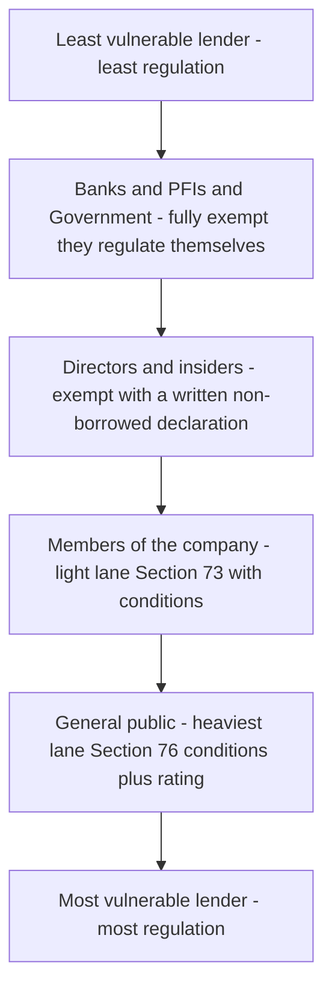
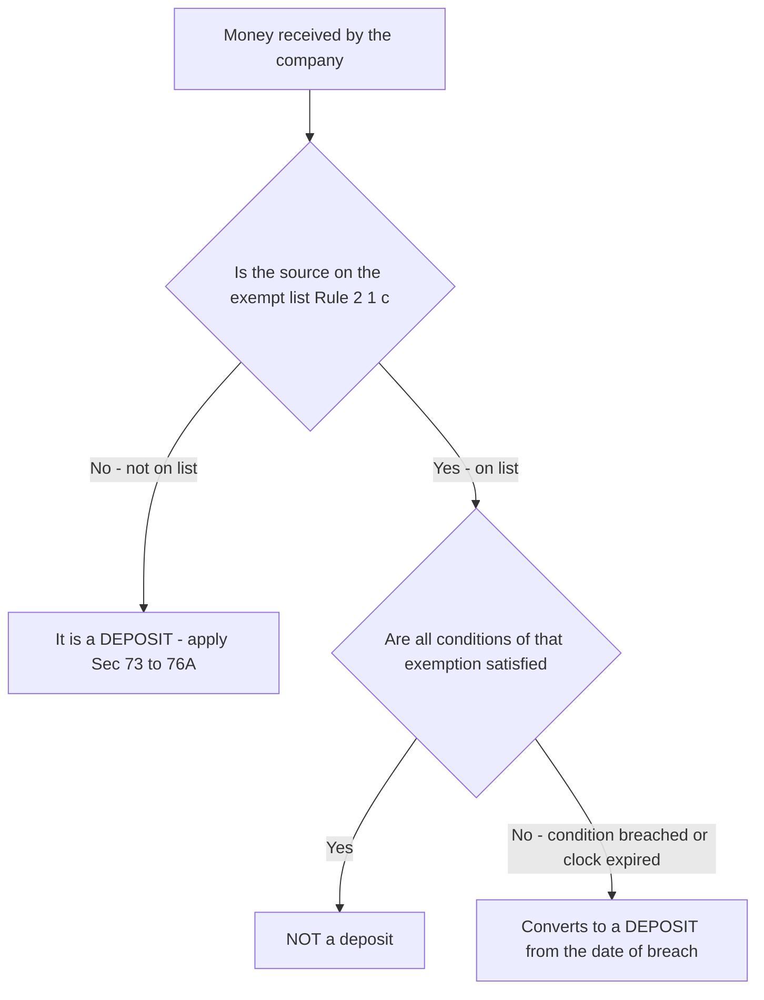
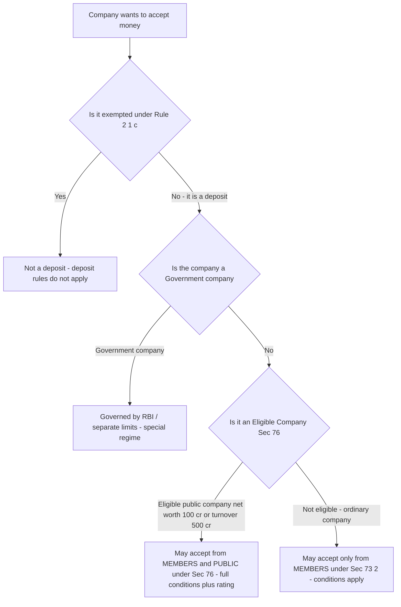
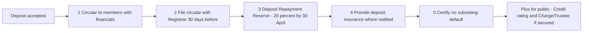
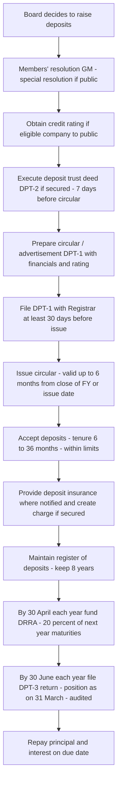
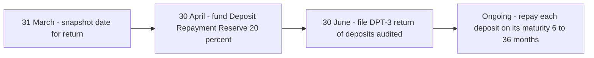

<!-- v2-deep -->

# Chapter 05 — Acceptance of Deposits

> Companies Act 2013 — Sections 73 to 76A, read with the Companies (Acceptance of Deposits) Rules, 2014. Cross-references to Sections 2(31), 2(85), 179, 42, 62 and the CSR/Audit chapters.

---

## 1. The Problem — How Depositors Got Burned

Imagine you run a company. You need money. You have three honest options: sell shares (dilute ownership), borrow from a bank (face collateral checks and interest), or issue debentures (formal, rated, secured). All three have a gatekeeper who asks hard questions.

Now imagine a fourth option that has **no gatekeeper**: put out a newspaper advertisement — *"Invest with us! 15% interest, far above the bank's 7%!"* — and collect money directly from thousands of ordinary members of the public. No collateral. No credit check on you. No trustee watching. Just cash flowing in from schoolteachers, retirees, and small shopkeepers who saw a fat interest rate and believed a glossy promise.

This is a **deposit**: money a company borrows from the public (or its members) *without* the discipline that shares, bank loans, and secured debentures impose.

Here is exactly how this cheated people, historically and repeatedly:

- **The Ponzi trap.** A company with a weak business could offer 15% not because it earned 15%, but because it paid old depositors with new depositors' money. The moment fresh deposits slowed, the pyramid collapsed and the last lakh of depositors lost everything. India saw this again and again with "finance companies" and chit-fund-style operators.
- **The unsecured gap.** A bank lends against collateral; if the borrower defaults, the bank seizes assets. A public depositor gets *nothing* — no charge on assets, no priority in liquidation. They stood behind secured creditors and got the crumbs.
- **The information asymmetry.** The company knew it was insolvent; the depositor, dazzled by the rate, knew nothing. There was no rating, no disclosure, no independent watchdog.
- **The diversion.** Money raised "for the business" was quietly siphoned to promoters' pet projects or personal accounts, leaving nothing to repay.
- **The runaway maturity mismatch.** Companies took *short-term* deposits (repayable in months) and sank them into *long-term* illiquid assets. When deposits matured, there was no cash to repay — a liquidity death spiral.

The abuse is simple to state: **a company can collect the public's savings with a promise, spend or lose the money, and leave the saver with a worthless IOU.** Deposit regulation exists to make that abuse hard, expensive, and — where it still happens — punishable and reversible.

**Why "deposit" and not just "loan"?** A crucial first-principles point students miss: economically a deposit *is* a loan to the company. The law does not regulate it because of what it is called but because of *who* the lender is and *how helpless* they are. A bank lending to a company can protect itself; a retired schoolteacher handing over her savings cannot. The entire chapter is therefore an exercise in **protecting the weak lender**, and every rule you learn is calibrated to how weak (uninformed, unsecured, diffuse) that lender is. Hold that lens and the numbers stop being arbitrary.

---

## 2. The Core Idea — Trust, But Ring-Fence

The protective principle is this:

> **If a company wants to hold the public's money, it must first prove it is safe to hold it, then keep provable safety nets in place, then honour repayment on the dot — and if it defaults, the law claws the money back and punishes the people responsible.**

Deposit law is not a ban. It is a **graduated permission system**. The riskier the source of money (strangers vs. your own members vs. related parties), the more safeguards the law bolts on. And critically, the safeguards are **provable and independent** — a Deposit Repayment Reserve you must actually fund, insurance you must actually buy, a rating an outside agency must actually give, a return you must actually file. The company cannot merely *say* it is safe; it must *demonstrate* safety through instruments other people control.

Three ideas run through the whole chapter:

1. **Members are trusted more than strangers.** Your own shareholders chose to be part of the company and have some voice; the anonymous public has neither. So most private companies can take deposits from members with light conditions, but only strong public companies ("eligible companies") may touch the general public — and even then, heavily fenced.
2. **Every promise must have a matching provision.** Promise to repay in 3 years? Then set aside cash now (the reserve). Say the money is safe? Then insure it. Say you're creditworthy? Then get rated by someone independent.
3. **Default is not just a private breach — it is a public wrong.** Because the victims are diffuse and helpless, the State steps in: the Tribunal can order repayment, and directors face fines and jail.

**The "who is the lender" ladder — the single most useful mental model.** Rank every source of money on one axis of vulnerability, and the whole regulatory intensity falls out automatically:

*Figure 2 — The vulnerability ladder: the more helpless the lender, the more fences the law bolts on.*

Every threshold, every extra form, every additional resolution in this chapter is just a rung on this ladder. When an exam fact pattern names a source of money, place it on this ladder first; the applicable rules follow.

---

## 3. Why It's Built This Way — The Logic of Each Safeguard

Before the technical grind, internalise *why* each fence exists. If you understand the fear each rule answers, you will never confuse the rules.

| The fear (abuse) | The safeguard that answers it | Section / Rule |
|---|---|---|
| Company spends the money and has nothing at maturity | **Deposit Repayment Reserve Account** — park liquid funds equal to a slice of maturing deposits | 73(2)(c) |
| Depositor loses everything on default | **Deposit insurance** (where notified) — an insurer pays out | 73(2)(d) |
| A weak company disguises itself as strong | **Credit rating** by an approved agency, renewed yearly | 76 + Rules |
| Depositor invests blind, no disclosures | **Circular / advertisement** with financials, credit rating, defaults history | 73(2)(a), Rules |
| Company welshes on old promises then raises more | Must **certify no subsisting default** before accepting fresh deposits | 73(2)(e) |
| Money vanishes to promoters | **Charge / trustee** for secured deposits; audited use of funds | Rules |
| Public has no recourse when default happens | **Tribunal power to order repayment; penalties; officer liability** | 73(4), 74, 75, 76A |
| Companies dodge the rules by calling it something else | Broad **definition of "deposit"** with a closed list of exemptions | 2(31), Rule 2(1)(c) |

Notice the architecture: **define widely, exempt narrowly, then fence what remains.** That is the entire chapter in one line.

**A deeper "why" on the three-part architecture.** Each of the three moves defends against a different kind of cheating:

- **Define widely (2(31))** defeats the *relabelling* cheat — calling a deposit an "advance", "loan", or "subscription".
- **Exempt narrowly (Rule 2(1)(c))** avoids over-regulation: money whose source can protect itself (banks, government, sophisticated companies) does not need the shield, so forcing deposit compliance there would only raise the cost of honest capital without protecting anyone. The exemptions are therefore not loopholes — they are *precision*, letting the law aim only at vulnerable savers.
- **Fence what remains (73–76A)** applies graduated protection to exactly the money that is left: the genuinely vulnerable saver's rupee.

Understanding that the exemptions exist to *avoid pointless regulation*, not to help companies escape, is what lets you reason about a novel fact pattern instead of memorising a list.

---

## 4. Full Technical Content — Section by Section, Each With Its Why

### 4.1 What is a "deposit"? — Section 2(31) + Rule 2(1)(c)

**Section 2(31)** gives the deliberately broad definition:

> "Deposit" **includes any receipt of money by way of deposit or loan or in any other form**, by a company, but does **not** include such categories as may be prescribed in consultation with the RBI.

**Why so broad?** Because the cheat was always to *rename* the money — "it's not a deposit, it's an advance / a loan / a subscription / a security". By saying deposit means money received "in any other form", the law defeats the disguise. Substance over label.

The actual carve-outs live in **Rule 2(1)(c) of the Companies (Acceptance of Deposits) Rules, 2014**, which lists **exempted receipts** — money that is *not* treated as a deposit. Learn these as a family, because "is X a deposit?" is the single most common exam question.

**Exempted receipts (NOT deposits) — the logic:** each item is money whose *source already has its own protection*, so deposit rules would be redundant.

| Exempted receipt (not a deposit) | Why it's exempt |
|---|---|
| Money from **Central/State Government**, or guaranteed by them; money from foreign govts/banks/multilateral bodies | The State/multilateral is not a vulnerable public saver |
| **Loans from banks / banking companies / co-op banks** | Banks are their own regulated gatekeepers |
| **Loans from Public Financial Institutions, insurance companies, scheduled banks** | Sophisticated regulated lenders |
| **Commercial paper** or other instruments per RBI guidelines | Already RBI-regulated |
| Inter-corporate: **amount received from another company** | Company-to-company; the lender is not a helpless individual |
| **Subscription money for securities** (share application money) pending allotment — *provided securities are allotted within 60 days*; if not allotted and not refunded within 15 days thereafter, it **becomes a deposit** | Genuine capital-raising, but with an anti-parking clock (see trap below) |
| Money from a **director** — if the director gives a **written declaration that it is not from borrowed funds** | A director has skin in the game and internal knowledge |
| Money from a **member of a private company** / relative of director (with same non-borrowed declaration for relatives per amendments) | Insiders, not the anonymous public |
| **Secured / listed** non-convertible debentures with a charge or a trustee | Debenture regime already protects them |
| **Non-interest-bearing security deposit / advance** for supply of goods or provision of services — *if appropriated within 365 days*; if the company has no legal right to receive it or fails to supply, it **becomes a deposit** | Genuine trade advance, with an anti-parking clock |
| **Advance against immovable property** under an agreement, to be adjusted against the property | Genuine business transaction |
| **Employee security deposit** not exceeding the employee's annual salary, under a non-interest-bearing contract | Genuine employment arrangement |
| **Promoters' unsecured loans** brought in pursuant to a **stipulation by a lending bank/FI** (mandatory promoter contribution) | Forced by the lender; exists only while the bank loan subsists |
| **Startup** money: up to Rs. 25 lakh or more by a convertible note in a single tranche (recognised startups) | Encourage genuine early-stage funding |

> **Memory hook for the clocks:** *Shares 60/15, Trade advance 365.* Share application money must be allotted in **60** days, refunded in **15** after that, else it's a deposit. A trade/service advance must be adjusted in **365** days, else it's a deposit. Money parked "temporarily" past the clock is the classic disguised deposit.

**Finer distinctions the exam probes inside the exemption list:**

- **The promoters' loan exemption is *conditional and temporary*.** It is exempt **only** while (i) the loan is brought in *because a bank/FI stipulated* promoter contribution as a loan condition, and (ii) that bank/FI loan is *still outstanding*. The moment the underlying institutional loan is repaid, the exemption evaporates and the promoter's money must either be repaid or reclassified. Examiners test the case where the bank loan is closed but the promoter's money stays in — it is now a deposit.
- **Employee security deposit — the salary cap is a ceiling, not a target.** If the deposit *exceeds* the employee's annual salary, the **excess** is a deposit (not the whole amount, in the typical reading — but confirm treatment in current ICAI material). It must also be **non-interest-bearing**; add interest and the exemption is lost.
- **"Amount received from another company" — a company, not a firm.** Money from a partnership firm or an LLP is **not** covered by the inter-corporate exemption; only receipts from a *company* qualify. This is a favourite trap: an LLP is not a company.
- **Advance for immovable property must actually be adjusted against that property.** If the deal falls through and the advance is not adjusted or refunded within the stipulated period, it converts to a deposit. The exemption protects a *genuine* transaction, not a parking device.
- **Convertible note (startup) — the instrument matters.** The Rs. 25 lakh convertible-note exemption applies to a **DPIIT-recognised startup** and requires the note to convert into equity or be repaid within the prescribed period (typically within a fixed number of years). A plain interest-bearing loan of Rs. 25 lakh to a non-startup is *not* covered.

**Two "in-between" categories students forget exist:**
- **Amounts non-interest-bearing and kept in trust** and certain **advances received in the course of, or for the purposes of, the business** (e.g., advance for long-term supply/service contracts spanning more than 365 days where accepted as an advance under a contract) can have their own carve-outs — but each rides on a genuine-business condition. Do not over-generalise; *confirm the precise wording in the current Rule.*

**Confirm exact list against the current Rule 2(1)(c) in ICAI material / the bare Rules** — the list has been amended several times and ICAI tests the precise wording.

**Decision flow for "Is this receipt a deposit?" — apply in this order:**

*Figure 4.1 — Exemptions are conditional; a breached condition or an expired clock flips a non-deposit into a deposit.*

---

### 4.2 The three-lane structure: who may take deposits, and from whom

This is the spine of the chapter. There are **three lanes**:

*Figure 4.2 — The deposit-eligibility decision tree: exempt first, then classify the company, then the source.*

**Section 73 — the general rule and the default lane (deposits from members).**

- **Section 73(1):** A company **cannot invite, accept or renew deposits from the public** except as provided in this Chapter. This is the baseline prohibition — the public is off-limits unless you earn the right.
- **Section 73(2):** A company may, after passing a **resolution in general meeting** and subject to the Rules, accept deposits **from its members** on the conditions listed below. This lane is open to companies generally (both private and public that are not "eligible companies"), because members are trusted more than strangers.

**Section 76 — the special lane (eligible companies → public).**

- Only an **"eligible company"** may accept deposits from the **general public**. An eligible company is a **public company** having:
  - **net worth of not less than Rs. 100 crore**, *or*
  - **turnover of not less than Rs. 500 crore**,
  - *and* which has passed a **special resolution** in general meeting and filed it with the Registrar (a special resolution because inviting the public is a graver act than inviting members).
- Section 76 applies **all the Section 73(2) conditions** to eligible companies, **plus** mandatory **credit rating** and (for the invitation) more stringent limits.

> **Memory hook:** *"100 or 500 lets you touch the public."* Net worth **100** crore **OR** turnover **500** crore = eligible. Below that, members-only.

**A subtle point on the special resolution vs. ordinary resolution.** Section 76's own eligibility needs a **special resolution** to *invite the public*. But an eligible company can *also* accept from its **members**, and for that a special resolution is not strictly required — however, in practice ICAI treats the eligible company's public-invitation act as needing a special resolution filed with ROC. Note also the relief: a company that accepts deposits **only from members** and **within the 35% limit** may do so on an **ordinary resolution** and need not treat it as a public invitation. Where the amount from members exceeds the prescribed limit or the company is eligible and going to the public, the higher bar applies. *Verify the precise resolution requirement against current ICAI material — this detail is frequently updated.*

**Private companies — a lighter members' lane.** A private company may accept deposits from its members. The general ceiling is that members' deposits plus paid-up-capital-linked limits apply, but **certain private companies** (e.g., those meeting conditions on borrowings, no default, being a startup for its first 5 years, or a "specified IFSC" / small company category per the Rules) may accept from members **up to 100% of paid-up capital + free reserves + securities premium** and with relaxed compliance — *confirm the exact eligibility conditions and the exemption notification in ICAI material.*

**Which private companies get the 100% relaxation?** Under the MCA exemption notification, a private company may accept from members up to **100%** of (paid-up capital + free reserves + securities premium) and skip several 73(2) conditions (circular, DPT-1 filing, DRRA, insurance) if it satisfies *any one* of these categories:
1. It accepts money from members **not exceeding 100%** of the aggregate above; **or**
2. It is a **startup**, for **5 years** from incorporation; **or**
3. It fulfils **all** of: (a) is **not** an associate or subsidiary of any other company, (b) its **borrowings** from banks/FIs/body corporate are **less than twice its paid-up capital or Rs. 50 crore, whichever is lower**, and (c) it has **not defaulted** in repaying such borrowings at the time of accepting deposits.

Even these relaxed companies must still **file the DPT-3 return** and disclose in the Board's report. The relaxation removes the heavy safety nets, not the reporting. *Confirm categories and figures against the current notification — the borrowings test in particular is examined precisely.*

---

### 4.3 The limits (thresholds) — Rules under Sections 73 & 76

The Rules cap **how much** can be taken, tying the cap to the company's own financial strength (paid-up capital + free reserves + securities premium account). The logic: *you may borrow from savers only in proportion to your own buffer to absorb losses.*

| Lane | Ceiling on deposits (of paid-up capital + free reserves + securities premium) |
|---|---|
| **Ordinary / non-eligible company — from members** [Rule 3(3)] | Up to **35%** |
| **Eligible company — from members** [Rule 3(4)] | Up to **10%** |
| **Eligible company — from public** [Rule 3(4)] | Up to **25%** |
| **Eligible Government company — from public** | Up to **35%** |
| **Exempt private companies (qualifying)** | Up to **100%** of paid-up capital + free reserves + securities premium (members only) |

> **Memory hook:** *Eligible company splits its 35 into 10 + 25.* The **10%** slice is reserved for its own **members**, the **25%** slice for the **public** — total 35%, mirroring the ordinary company's single 35% members' bucket. Government companies get the full **35%** even from the public because there is implicit sovereign backing.

**Reading the limits correctly — three precision points examiners exploit:**
1. **The base is one combined figure:** paid-up **share capital + free reserves + securities premium account**. Not just paid-up capital. Omitting securities premium or free reserves understates the ceiling and yields a wrong answer.
2. **The percentages are *ceilings on the aggregate outstanding*, not per-transaction limits.** You test the *total* deposits outstanding (existing + proposed) against the cap, not each fresh deposit alone.
3. **The eligible company's 10% and 25% are *separate* buckets.** Overshooting the members' 10% is a contravention even if total deposits are within 35%; you cannot borrow the unused public 25% headroom to hold more members' money. Each lane is independently capped.

**Tenure:** A company can accept a deposit for a term of **6 months minimum to 36 months maximum**. *Why the floor and ceiling?* The **6-month floor** stops companies from running quasi-current-account demand deposits (that's banking, which needs an RBI licence). The **36-month ceiling** stops indefinite locking-in of savers' money. (A short-term deposit down to **3 months** is permitted only to meet short-term needs and capped at **10% of paid-up capital + free reserves** — the narrow exception, not the rule.)

**Interest / brokerage:** Cannot exceed the maximum rate prescribed by the **RBI** for NBFC deposits. *Why?* The above-market rate was the Ponzi bait; capping it removes the incentive to lure savers into reckless companies. **Brokerage** is also capped and may be paid only to persons **authorised in writing** to solicit deposits; paying commission to an unauthorised agent, or above the ceiling, is a contravention. A neat exam distinction: **interest** rewards the depositor for the money; **brokerage** rewards the solicitor for bringing the money — both are capped so the cost of chasing deposits cannot spiral into Ponzi territory.

**Premature repayment rule (the "reduce by 1%" idea).** Where a company permits a depositor to withdraw *before* maturity, the interest payable is reduced — the rate is stepped down to the rate applicable to the period the deposit actually ran, and typically further reduced by **1%** (as a penalty for early exit). *Why:* it discourages runs and reflects that the depositor did not honour the agreed tenure. There are narrow exceptions (e.g., early repayment for the company's own restructuring, or death of the depositor, where no penalty stepping applies). *Confirm the exact percentage and exceptions in current ICAI material.*

---

### 4.4 The conditions (the safety nets) — Section 73(2)(a)–(e) and Section 76

Every company accepting deposits must satisfy **all** of these. Learn them as **five promises, each with its provable proof**:

*Figure 4.4 — The chain of conditions: disclose, file, reserve, insure, certify — then repay.*

**(a) Section 73(2)(a) — Circular to members.** Issue a **circular** (for public offers, an **advertisement** in newspapers) showing the company's **financial position, credit rating (if any), total deposits, and the amount due on account of deposits accepted earlier**.
*Why:* directly attacks the **information-asymmetry** abuse. The saver now sees the company's real health and its track record of past deposits before parting with money.

**(b) Section 73(2)(b) — File the circular with the Registrar.** File a copy of the circular **at least 30 days before** issuing it.
*Why:* creates an **independent, dated public record**, so the company cannot later deny what it promised, and the regulator can spot dodgy offers early.

**(c) Section 73(2)(c) — Deposit Repayment Reserve Account (DRRA).** On or **before 30th April** each year, deposit into a **separate bank account** (scheduled bank) a sum **not less than 20%** of the deposits **maturing during the following financial year**, and keep it **only** for repaying those deposits.
*Why:* this is the heart of depositor protection — it directly attacks the **"spent it all, nothing at maturity"** abuse. Real cash, ring-fenced, cannot be touched for anything except repayment. *(Note: originally 15%; increased to **20%** by amendment. Confirm the current figure and date in ICAI material.)*

> **Memory hook:** *"20 by April, for next year's maturity."* Twenty percent, deposited by the thirtieth of April, covering deposits maturing in the coming financial year.

**(d) Section 73(2)(d) — Deposit insurance.** Provide **deposit insurance** in the manner and to the extent prescribed.
*Why:* the last line of defence — if the company still fails, the insurer pays the saver. *(In practice this requirement has repeatedly been **deferred/relaxed** because no viable insurance product emerged. Know the section, and flag that its operation has been postponed — confirm current status in ICAI material.)*

**(e) Section 73(2)(e) — Certify no subsisting default.** Certify that the company **has not defaulted** in the repayment of deposits (or interest) accepted earlier — and if there was a default, that **5 years have elapsed** since it was made good.
*Why:* stops the **serial defaulter** from raising fresh money to plug old holes. A company that already broke a promise must clean its slate before making new ones.

**Additional condition — security.** Deposits may be **secured or unsecured**. If secured, the company must create a **charge on its assets** within the prescribed time and appoint a **trustee for depositors** (execute a deposit trust deed at least 7 days before issuing the circular). Unsecured deposits must be **clearly stated as unsecured** in every document. **Security cap:** the amount of security (charge) must be **at least equal to the amount of deposits (and interest) that remain unsecured**, and the charge is to be created on the company's **tangible assets** — the security cannot exceed the market value of those assets as assessed by a registered valuer. A **partly secured** deposit must disclose the extent to which it is unsecured.
*Why:* attacks the **"no recourse on default"** and **information-asymmetry** abuses simultaneously — a trustee independently watches over the depositors' interest, and savers know exactly whether they have security.

**Who cannot be a deposit trustee.** To keep the watchdog independent, a person cannot act as deposit trustee if he is a **director, KMP, or any other officer or employee of the company**, is **indebted to** the company, has any **material pecuniary relationship**, has entered into a guarantee arrangement for the deposits, or is **related** to anyone in those categories. A trustee can be removed only by an ordinary resolution **after** giving the existing trustee a reasonable opportunity of being heard. *Why:* a captured trustee protects the company, not the depositors — independence is the whole point.

**For eligible companies (Section 76) — extra condition: Credit rating.** Obtain **credit rating every year** from a recognised credit rating agency, disclose it in the circular/advertisement, and ensure the rating is **not below the minimum prescribed**.
*Why:* the public cannot assess a company itself, so an **independent professional gatekeeper** grades it, yearly, so a deteriorating company is caught before it collects more money.

**Validity window of the circular / advertisement.** A circular or advertisement is valid **until the expiry of 6 months from the close of the financial year in which it was issued, or until the date of the AGM (whichever is earlier)**. After that a fresh circular is needed. *Why:* the disclosed financials go stale; a saver in month 11 should not be relying on year-old numbers. Examiners test the company that keeps collecting on an expired circular — a contravention.

---

### 4.5 Repayment, deposit trustee, register, and returns

- **Register of deposits:** The company must maintain, at its registered office, a **register of deposits** with all particulars, preserved for **8 years** from the financial year in which the latest entry is made.
  *Why:* an auditable trail so no deposit can be "forgotten" or hidden.
- **Return of deposits — Form DPT-3:** File a **return of deposits** with the Registrar **on or before 30th June** every year, giving the position as on **31st March**, duly audited. DPT-3 also captures **money received that is not a deposit** (exempted receipts / outstanding loans) — the MCA uses it to keep sight of *all* borrowings.
  *Why:* annual, audited, independent reporting — the regulator sees the true deposit exposure and can act before a collapse.
- **Circular filing — Form DPT-1** (circular/advertisement); **Deposit trust deed — Form DPT-2.**
- **Nomination:** every depositor may nominate a person to whom the deposit devolves on death (parallel to the shareholder nomination machinery) — a small but tested consumer-protection detail.
- **Auditor / director signing:** the circular and the return carry statements *verified/certified* by the company and, where required, the auditor — reinforcing that the disclosures are not mere marketing.

---

### 4.6 Consequences of default — Sections 73(4), 74, 75, 76A

This is where the law bares its teeth. Because the victims are the diffuse public, the sanctions are unusually harsh.

**Section 73(4) — depositor's direct remedy.** If the company **fails to repay** the deposit or interest on the due date, the **depositor may apply to the Tribunal (NCLT)** for an order directing repayment. *Why:* gives the helpless saver a fast, direct route to a court order without suing for breach of contract from scratch.

**Section 74 — repayment of deposits accepted *before* the 2013 Act.** Deposits that existed under the *old* Companies Act 1956 regime had to be dealt with: file a **statement** of such deposits with the Registrar and **repay** them within the time the Tribunal allows (as amended, broadly within the remaining tenure or as extended). The Tribunal can grant time to a company that will suffer if forced to pay immediately, balancing depositor protection against company survival. *Why:* a transition bridge so the new law's protections reach *old* depositors too, without instantly bankrupting companies mid-tenure.

**Section 75 — damages for fraud.** Where a company **fails to repay** and it is proved the deposits were accepted with **intent to defraud** or for a fraudulent purpose, **every officer responsible** becomes **personally liable, without limitation of liability**, for all losses or damages suffered by the depositors — *in addition* to the Section 447 (fraud) punishment.
*Why:* pierces the corporate veil for the worst abuse. When the money was taken by deceit, the individuals — not just the shell company — pay the depositors from their own pockets. This is the anti-Ponzi hammer.

**A litigation detail on Section 75 — the class action.** The suit for damages under Section 75 may be brought by **any depositor** on behalf of, and for the benefit of, **all depositors** affected (a representative/class remedy). *Why:* individual savers each lost too little to sue alone but collectively lost a fortune; the class device makes the remedy economically viable.

**Section 76A — punishment for contravention (the omnibus penalty).** If a company accepts or invites deposits in contravention, or fails to repay within the allowed time:

- The **company** shall pay a **fine of not less than Rs. 1 crore or twice the amount of deposits accepted, whichever is lower, up to Rs. 10 crore**; **plus** the amount due to depositors **with interest**; **and**
- **every officer in default** is punishable with **imprisonment up to 7 years and/or fine of not less than Rs. 25 lakh up to Rs. 2 crore**.
- If it is proved the officer acted with **intent to deceive** the company, shareholders, depositors or creditors, the officer also attracts **Section 447** (fraud).

> **Memory hook for 76A:** *"1 to 10 for the company, 25 lakh to 2 crore + up to 7 years for the officer."* The company's floor fine is the **larger** of a real deterrent; the officer faces **jail**, because deposit fraud steals from the most vulnerable.

**Reading the company's fine correctly (the double "whichever" trap).** The floor of the company fine is *itself* a "whichever is **lower**" between **Rs. 1 crore** and **twice the deposit amount** — then subject to a maximum of **Rs. 10 crore**. So for a *small* contravention (say deposits of Rs. 30 lakh), twice the deposits is Rs. 60 lakh, which is lower than Rs. 1 crore, so the minimum fine is **Rs. 60 lakh**, not Rs. 1 crore. Students wrongly apply a flat "minimum Rs. 1 crore". The "twice the amount" limb exists precisely so a tiny company is not crushed by a Rs. 1 crore floor. **And separately** the depositors must still be repaid principal **plus interest** — the fine is punitive, the repayment is restitutionary; they are additive, not alternatives.

*Why so severe?* Ordinary contract breach hurts one counterparty who chose the deal; deposit default hurts thousands of unsophisticated savers who trusted a public promise. The penalty scales with the social harm.

**Compounding note.** Because Section 76A carries imprisonment as a possible punishment for the officer, certain contraventions may not be freely compoundable in the way purely fine-only defaults are. *Confirm compounding treatment in current ICAI material* — it is an occasional twist in problem questions.

---

## 5. Applied Scenarios — Reasoning to the Right Legal Outcome

**Scenario 1 — The "advance" that overstayed.**
*Facts:* Zenith Pvt Ltd receives Rs. 40 lakh from a customer in April 2025 as an advance against future supply of machinery. By April 2026 (13 months later) no machinery has been supplied and the advance is still sitting in Zenith's account, earning the customer nothing.
*Reasoning:* An advance for supply of goods is an **exempted receipt (not a deposit)** — but **only if appropriated within 365 days**. Once the 365-day clock runs out without supply, and the company has no legal right to retain it, the receipt **converts into a deposit** by operation of Rule 2(1)(c).
*Outcome:* From the moment the 365 days lapse, the Rs. 40 lakh is a **deposit**. Zenith (a private company) can only hold deposits from members; a **customer is not a member**, and Zenith has not complied with Section 73(2). It is now in **contravention** — exposed to Section 76A, and the customer can approach NCLT under 73(4). Lesson: exemptions are conditional; the clock matters.

**Scenario 2 — Members-only company eyes the public.**
*Facts:* Apex Ltd, an unlisted public company with net worth Rs. 60 crore and turnover Rs. 200 crore, wants to raise Rs. 20 crore by advertising deposits to the general public at attractive rates.
*Reasoning:* Only an **eligible company** may take deposits from the public — net worth **≥ 100 crore OR turnover ≥ 500 crore**. Apex has **neither** (60 < 100; 200 < 500). Therefore Apex is **not eligible** and is barred by Section 73(1) from inviting the public.
*Outcome:* Apex may accept deposits **only from its members** under Section 73(2), subject to the **35%** ceiling and all five conditions (circular, DPT-1 filing, DRRA, insurance where notified, no-default certificate). Advertising to the public would breach Section 73(1) and trigger Section 76A. Lesson: the 100/500 test is a hard gate to the public lane.

**Scenario 3 — The reserve that wasn't funded.**
*Facts:* Corley Ltd (eligible company) has Rs. 50 crore of public deposits maturing in FY 2026-27. By 30 April 2026 it has set aside only Rs. 4 crore in the Deposit Repayment Reserve Account, and it used part of even that to pay a supplier.
*Reasoning:* Section 73(2)(c) requires depositing **at least 20%** of deposits maturing next year into a **separate account by 30 April**, usable **only** for repaying those deposits. 20% of Rs. 50 crore = **Rs. 10 crore** required; Corley has Rs. 4 crore, and worse, **diverted** part of the reserve. Both the shortfall and the diversion are contraventions.
*Outcome:* Corley is in **default of a core condition**. The company faces Section 76A penalty; officers who authorised the diversion face fine and possible imprisonment, and if intent to deceive is shown, Section 447. Depositors maturing in FY 2026-27 are precisely the people the reserve was meant to protect. Lesson: the DRRA is real cash, ring-fenced — touching it is not a technical slip, it is the exact abuse the section exists to stop.

**Scenario 4 — Director's loan vs. relative's loan.**
*Facts:* Nova Pvt Ltd receives Rs. 15 lakh from Director A (who declares in writing the money is his own, not borrowed) and Rs. 10 lakh from A's brother.
*Reasoning:* Money from a **director** with a **written non-borrowed declaration** is an **exempted receipt** — not a deposit. Money from a **relative of a director** in a **private company** is also exempt, but the amendments require a similar **written declaration** that it is not from borrowed funds, and it must be disclosed in the Board's report.
*Outcome:* Director A's Rs. 15 lakh is safely **not a deposit**. The brother's Rs. 10 lakh is **not a deposit only if** the written declaration is obtained (Nova being private) and disclosed; without it, it risks reclassification as a deposit. Lesson: the exemption for insiders hinges on the **declaration** — the paperwork is the safeguard against laundering borrowed public money in through the back door.

**Scenario 5 — Computing the members' deposit ceiling (numerical, exam-hard).**
*Facts:* Bright Ltd (an ordinary, non-eligible public company) has: paid-up share capital Rs. 8 crore, securities premium Rs. 2 crore, free reserves Rs. 5 crore, and a revaluation reserve of Rs. 3 crore. It already holds Rs. 4.2 crore of deposits from members. How much *more* can it accept from members?
*Reasoning:* Ordinary company members' limit is **35% of (paid-up capital + free reserves + securities premium)** [Rule 3(3)]. Note the trap: **revaluation reserve is NOT a free reserve** (a free reserve must be available for dividend; a revaluation reserve is an unrealised notional gain, expressly excluded by Section 2(43)). So the base is **8 + 2 + 5 = Rs. 15 crore**, *not* Rs. 18 crore.
*Computation:* Ceiling = 35% × 15 = **Rs. 5.25 crore**. Already outstanding = Rs. 4.2 crore. Headroom = 5.25 − 4.2 = **Rs. 1.05 crore**.
*Self-check:* If Bright accepts Rs. 1.05 crore more, total = Rs. 5.25 crore = exactly 35% of Rs. 15 crore. ✔ Correct. Had we wrongly included the Rs. 3 crore revaluation reserve, we'd have got 35% × 18 = Rs. 6.3 crore ceiling and overstated headroom by Rs. 1.05 crore — a classic marks-losing error.
*Outcome:* Bright may accept a **maximum of Rs. 1.05 crore** further from members. Lesson: get the *base* right (exclude revaluation reserve) before touching the percentage.

**Scenario 6 — Eligible company splitting its buckets (numerical, two-lane).**
*Facts:* Titan Ltd is an eligible company (net worth Rs. 120 crore). Its (paid-up capital + free reserves + securities premium) = Rs. 200 crore. It currently holds Rs. 15 crore of deposits from members and Rs. 40 crore from the public. It wants to accept Rs. 8 crore more from members and Rs. 12 crore more from the public. Is either possible?
*Reasoning:* Eligible company caps are **10% from members** and **25% from public**, tested **separately** [Rule 3(4)].
- Members' ceiling = 10% × 200 = **Rs. 20 crore**. Current members' deposits = Rs. 15 crore → headroom Rs. 5 crore. Proposed Rs. 8 crore **exceeds** the Rs. 5 crore headroom → **not allowed** in full; only Rs. 5 crore more can be taken from members.
- Public ceiling = 25% × 200 = **Rs. 50 crore**. Current public deposits = Rs. 40 crore → headroom Rs. 10 crore. Proposed Rs. 12 crore **exceeds** Rs. 10 crore → only Rs. 10 crore more allowed.
*Self-check:* Members after = 15 + 5 = 20 (=10% ✔). Public after = 40 + 10 = 50 (=25% ✔). Note you **cannot** lend the unused members' room to the public or vice-versa — the buckets are independent, so total 70 crore = 35% is a coincidence of both being full, not a single 35% pool.
*Outcome:* Titan may accept only **Rs. 5 crore more from members** and **Rs. 10 crore more from the public**, not the Rs. 8 + Rs. 12 crore proposed. Lesson: test each lane against its own cap; never merge them into one 35% bucket for an eligible company.

**Scenario 7 — Share application money that turned into a deposit (numerical + date logic).**
*Facts:* Vega Ltd receives Rs. 3 crore as share application money on 1 January 2026 for a proposed allotment. By 2 March 2026 (60 days) the shares are still not allotted. The company neither allots nor refunds until 25 March 2026, when it refunds the full Rs. 3 crore.
*Reasoning:* Share application money is exempt **only if shares are allotted within 60 days**; if not allotted, it must be **refunded within 15 days** of the 60-day expiry. 60 days from 1 Jan = **2 March 2026**. The 15-day refund window then runs to **17 March 2026**. Vega refunded on **25 March** — **8 days late**.
*Outcome:* Because the money was neither allotted within 60 days nor refunded within the next 15 days, the Rs. 3 crore is **deemed a deposit** from the **expiry of the 15 days (i.e., from 18 March 2026)**. Vega — if it is not eligible/compliant — is in contravention for the period the money was a deposit, even though it eventually refunded. Actual refund does not retroactively cure the conversion. Lesson: the 60/15 clock is unforgiving; *lateness converts, and later repayment does not un-convert.*

**Scenario 8 — Small-fine contravention (testing the "twice the deposits" limb).**
*Facts:* Micro Ltd wrongfully accepts Rs. 30 lakh of deposits in contravention of the Chapter and fails to repay. What minimum penalty does the *company* face under Section 76A?
*Reasoning:* The company's minimum fine is the **lower of Rs. 1 crore OR twice the deposits accepted**, capped at Rs. 10 crore, **plus** repayment with interest. Twice Rs. 30 lakh = **Rs. 60 lakh**, which is *lower* than Rs. 1 crore.
*Outcome:* The minimum fine is **Rs. 60 lakh** (not Rs. 1 crore), **plus** repayment of Rs. 30 lakh with interest to depositors, **plus** the officers face Rs. 25 lakh–Rs. 2 crore and/or up to 7 years. Lesson: don't reflexively state "minimum Rs. 1 crore" — the "twice the amount" limb protects small contraveners and is frequently tested.

---

## 6. Procedure / Compliance Summary

*Figure 6 — End-to-end deposit compliance lifecycle, with the two annual anchors: 30 April (reserve) and 30 June (return).*

**Timeline of the recurring dates:**

*Figure 6b — The compliance calendar: snapshot on 31 March, reserve by 30 April, return by 30 June.*

**Key forms:** **DPT-1** (circular/advertisement), **DPT-2** (deposit trust deed), **DPT-3** (annual return of deposits *and* particulars of non-deposit receipts), **DPT-4** (statement of pre-Act deposits under Section 74).

**The four DPT forms as a quick mnemonic:** *One invites, Two protects, Three reports, Four transitions.* DPT-**1** invites (circular/ad); DPT-**2** protects (trust deed for security); DPT-**3** reports (annual return); DPT-**4** transitions (statement of old, pre-2013-Act deposits). Getting a form number wrong is an easy 1-mark loss in a procedural question.

---

## 7. Connections to Other Chapters and Laws

- **Definitions (Ch. on Definitions):** "Deposit" **2(31)**; "private company" **2(68)**; "public company" **2(71)**; "free reserves" **2(43)** feed the ceiling calculations; "relative" **2(77)** governs the insider exemption.
- **Board & General Meeting powers:** the members' **ordinary/special resolution** authorising deposits ties to **Section 179** (Board powers) and the general-meeting machinery of **Sections 96–114**.
- **Share capital vs. deposits:** share application money is exempt *only* if allotted in 60 days — links to **Section 42** (private placement) and **Section 62** (further issue). Money that should have become shares but didn't becomes a deposit.
- **Charges:** secured deposits require **registration of charge** under **Sections 77–87**.
- **Fraud:** Sections 75 and 76A both hook into **Section 447** (punishment for fraud) — the same anti-fraud spine that runs through the whole Act.
- **NBFC / RBI regime:** deposit-taking as a *business* is an NBFC activity regulated by the **RBI Act 1934**; the Companies Act carve-outs are drawn **in consultation with RBI**, and the interest cap references RBI's NBFC ceiling. Banks are excluded because they are separately regulated.
- **Audit & Directors' Report:** the auditor reports on deposit compliance (CARO), and the Board's report discloses details of deposits and any non-compliance.
- **Loans to directors (Section 185) and inter-corporate loans (Section 186):** the *mirror image* of this chapter. Sections 73–76 govern money **flowing into** the company from savers; Sections 185–186 govern money **flowing out** as loans. The inter-corporate *receipt* is exempt here precisely because the *giving* company is separately regulated under 186.
- **Companies (Prospectus and Allotment of Securities):** the anti-parking clock on share application money interlocks with allotment timelines — a receipt straddles two chapters and can be tested from either side.

---

## 8. Traps & Examiner Tricks

1. **"Includes loan" is the whole trap.** A "loan" from the public **is** a deposit. Candidates wrongly assume only fixed-deposit-style receipts count. Under 2(31) money "in any other form" is caught — the exemption list is the *only* escape.
2. **The 60/15 and 365 clocks.** Share application money and trade advances are exempt *only while within their clocks*. Examiners love the fact pattern where the clock has expired — the receipt silently **becomes** a deposit. Watch the dates.
3. **Members vs. public.** Ordinary company = **members only (35%)**. Only an **eligible company** (100 cr net worth OR 500 cr turnover) can touch the **public (25%)**, and its members' slice shrinks to **10%**. Don't apply the 35% members' figure to an eligible company's public deposits.
4. **OR, not AND, for eligibility.** Net worth 100 crore **OR** turnover 500 crore — meeting **either** makes it eligible. Candidates wrongly require both.
5. **Special vs. ordinary resolution.** Public deposits (Section 76) need a **special resolution**; members' deposits (Section 73) need an ordinary resolution in general meeting. Easy to swap.
6. **DRRA percentage and date.** It is **20%** (raised from 15%) of deposits maturing in the **next** financial year, funded by **30 April**. Common wrong answers: "15%", "of total deposits", "by 31 March". The reserve is for **next year's** maturities, not this year's total.
7. **Deposit insurance is on paper but deferred.** Know Section 73(2)(d) exists; also know its operation has been **postponed** repeatedly. Stating it as fully operative can be marked wrong — flag it.
8. **Director vs. relative declaration.** A **director's** loan needs a written declaration it's **not borrowed**. A **relative's** loan is exempt only for **private companies** and (post-amendment) also needs the declaration. Don't extend the relative exemption to public companies.
9. **6 to 36 months, not 6 to 60.** Maximum tenure is **36 months** (3 years), not 5. The **3-month** short-term deposit is a narrow exception capped at 10%.
10. **DPT-3 is not only for deposits.** It also reports **exempted receipts / outstanding loans**. A company with *no* deposits but with loans may still have to file DPT-3. Students think "no deposits, no return" — wrong.
11. **Government company limits differ.** An eligible **Government** company can take **35%** from the public (vs. 25% for a private-sector eligible company) because of implicit State backing.
12. **Section 74 is about *old* deposits.** Don't confuse Section 74 (transition of pre-2013-Act deposits) with the ongoing repayment obligation. Section 74 is a one-time bridge.
13. **Revaluation reserve is NOT a free reserve.** When computing the base for the 35%/10%/25% caps, exclude revaluation reserve and unrealised gains (Section 2(43)). Including it overstates the ceiling — a favourite numerical trap (see Scenario 5).
14. **"Company" ≠ "firm/LLP" in the inter-corporate exemption.** Money from another *company* is exempt; money from a partnership firm or LLP is **not**. Watch the entity type of the lender.
15. **The company fine has a "twice the deposits" floor, not a flat Rs. 1 crore.** For small contraventions the minimum is twice the deposits if that is lower than Rs. 1 crore (Scenario 8). And the fine is **in addition to** repaying depositors with interest, not instead of.
16. **Buckets don't merge for eligible companies.** The 10% members' cap and 25% public cap are tested **separately**; unused headroom in one lane cannot be borrowed by the other (Scenario 6).
17. **Employee security deposit must be non-interest-bearing and within annual salary.** Add interest, or exceed the salary, and the exemption is lost. Also it is a *security* deposit under a contract of employment, not a general loan from an employee.
18. **Later refund does not un-convert a deposit.** Once a receipt has crossed its clock and become a deposit, subsequently refunding it does not erase the contravention for the period it was an unlawful deposit (Scenario 7).
19. **Promoter loan exemption dies with the bank loan.** It is exempt only while the stipulating bank/FI loan subsists; once that loan is repaid, the promoter's money is no longer covered.
20. **Circular has a shelf life.** A circular/advertisement is valid only up to 6 months from the close of the FY or the AGM date, whichever is earlier — collecting on a stale circular is a contravention.

---

## 9. First-Principles Recap

Strip everything away and the chapter is one causal chain:

- A company can collect the **public's savings** with only a **promise**. That promise can be **empty** — spent, lost, or stolen — and the saver is **diffuse, uninformed, and unsecured**. That is the abuse.
- So the law **defines "deposit" widely** (2(31)) to defeat disguises, then **exempts narrowly** (Rule 2(1)(c)) only money whose source already has protection.
- It then **grades permission by risk**: strangers are hardest (only **eligible** public companies, Section 76, with **rating**), members are easier (Section 73), insiders are exempt (director/relative declarations).
- Every promise gets a **provable, independent provision**: disclose (circular), record (file with Registrar), **fund** (20% reserve by 30 April), insure, and certify no default — plus rating and trustee for the riskiest lane.
- It **caps quantity** to the company's own buffer (35% / 10% / 25% / 100%) and **caps price** to RBI's rate so the Ponzi bait disappears.
- And it makes **default a public wrong**: NCLT can order repayment (73(4)), officers can be **personally, unlimitedly liable** for fraud (75), and the omnibus penalty (76A) reaches **Rs. 10 crore** on the company and **7 years' jail** for the officer.

**The one sentence to carry into the hall:** *Define widely, exempt only the self-protected, fence the rest in proportion to how helpless the saver is, force provable safety nets, and punish default as a public wrong.* If you can reconstruct that sentence, you can re-derive almost every rule and number rather than recall it.

Learn the *fears*, and every number — 100, 500, 35, 25, 10, 20%, 60, 15, 365, 6–36 months, 30 April, 30 June — hangs on a reason instead of floating in memory.

---

## 10. Quick-Revision Sheet

| Item | Provision | Number / Limit | The "why" in three words |
|---|---|---|---|
| Definition of deposit | Sec **2(31)** | "loan or any other form" | Defeat disguises |
| Exempted receipts | Rule **2(1)(c)** | closed list | Source already safe |
| Share application money clock | Rule 2(1)(c) | allot in **60** days, refund in **15** | Anti-parking |
| Trade/service advance clock | Rule 2(1)(c) | adjust in **365** days | Anti-parking |
| Inter-corporate receipt | Rule 2(1)(c) | from a **company** only (not firm/LLP) | Lender not helpless |
| Employee security deposit | Rule 2(1)(c) | ≤ annual salary, non-interest | Genuine employment |
| Promoter loan | Rule 2(1)(c) | while bank/FI loan subsists | Forced by lender |
| General prohibition / members' lane | Sec **73** | members-only for ordinary cos | Trust members over public |
| Eligible company (public lane) | Sec **76** | net worth **≥ 100 cr** OR turnover **≥ 500 cr** | Earn the right to the public |
| Resolution needed | Sec 73 / 76 | ordinary (members) / **special** (public) | Graver act, higher bar |
| Limit — ordinary co (members) | Rule 3(3) | **35%** of cap+reserves+premium | Borrow within your buffer |
| Limit — eligible co (members) | Rule 3(4) | **10%** | Reserve slice for insiders |
| Limit — eligible co (public) | Rule 3(4) | **25%** | Fenced public exposure |
| Limit — Govt eligible co (public) | Rule 3(4) | **35%** | Sovereign backing |
| Limit — exempt private co | Notification | up to **100%** (members) | Insider trust |
| Base for the caps | Sec 2(43) | cap + **free** reserves + premium (exclude revaluation) | Real buffer only |
| Tenure | Rules | **6 to 36 months** (short-term 3 mo, ≤10%) | No demand banking, no infinite lock |
| Interest cap / brokerage | Rules | ≤ RBI NBFC max rate; brokerage to authorised persons | Remove Ponzi bait |
| Premature repayment | Rules | rate stepped down, ~**1%** penalty | Discourage runs |
| Circular | Sec **73(2)(a)** / DPT-1 | financials + rating + past deposits | Kill information asymmetry |
| Circular validity | Rules | 6 months from FY close or AGM, earlier | Numbers go stale |
| File circular | Sec **73(2)(b)** | **30 days** before issue | Independent dated record |
| Deposit Repayment Reserve | Sec **73(2)(c)** | **20%** of next-yr maturities, by **30 April**, separate a/c | Real cash for real repayment |
| Deposit insurance | Sec **73(2)(d)** | as prescribed (deferred) | Last line of defence |
| No-default certificate | Sec **73(2)(e)** | 5 yrs since default cured | Stop serial defaulters |
| Credit rating | Sec **76** + Rules | every year, min grade | Independent gatekeeper |
| Deposit trustee / charge | Rules / DPT-2 | trust deed 7 days before circular; independent trustee | Watchdog + recourse |
| Register of deposits | Rules | keep **8 years** | Auditable trail |
| Annual return | Rules / **DPT-3** | by **30 June**, position as on 31 March | Regulator oversight |
| Depositor remedy | Sec **73(4)** | apply to **NCLT** | Fast route for the helpless |
| Pre-Act deposits | Sec **74** / DPT-4 | statement + repay in Tribunal's time | Transition bridge |
| Fraud — personal liability | Sec **75** | unlimited personal liability + Sec 447; class suit | Pierce the veil |
| Contravention penalty | Sec **76A** | company **lower of 1 cr or 2× deposits, up to 10 cr** + repay with interest; officer **25 lakh–2 cr and/or up to 7 yrs** | Social harm = harsh sanction |

> **Confirm the exact current figures (DRRA %, penalty bands, exemption list, insurance status, private-company exemption conditions, premature-repayment penalty) against the latest ICAI Study Material and the bare Companies Act 2013 / Deposit Rules before the exam — these have been amended multiple times.**
