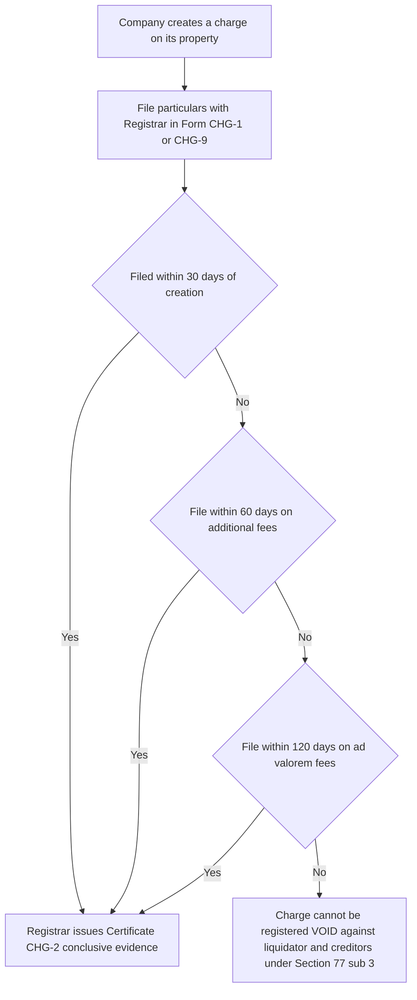

# Chapter 06 — Registration of Charges

> Companies Act 2013 — Chapter VI, Sections 77 to 87, read with the Companies (Registration of Charges) Rules, 2014.

---

## 1. The Problem — the invisible mortgage

Imagine you run a bank. A company called Zenith Manufacturing Ltd walks in and asks for a ₹50 crore loan. It offers its factory, its machinery, and its stock of raw material as security. You inspect the factory — it looks real, it's operating, the machines are humming. Satisfied, you lend the money against a charge on those assets. If Zenith defaults, you seize the factory and recover your money. Simple.

Now here is the abuse. **What if Zenith had *already* pledged that same factory to another bank six months ago?** The factory doesn't *look* mortgaged. A building doesn't wear a sign saying "already promised to State Bank." When Zenith goes bankrupt, both banks show up to seize the same factory. Only one can win. The other lent ₹50 crore against nothing — it was tricked by an asset that was already spoken for.

This is the core problem: **security interests are secret by nature.** Ownership of land can be checked in a land registry, but a *charge* — a claim over an asset that still belongs to and is used by the company — leaves no visible trace. A dishonest company can pledge the same asset to five different lenders, each believing they are first in line. When the crash comes, four of them discover their "security" was an illusion.

The problem is worse than individual fraud. If lenders *cannot trust* that the security offered is genuinely unencumbered, they will do one of two things: refuse to lend, or lend only at ruinous interest rates to cover the risk. Either way, honest companies that genuinely have free assets to pledge suffer, because they cannot credibly *prove* their assets are free. The market for secured credit breaks down for everyone.

There is a second, subtler abuse. Suppose Zenith is sliding toward insolvency. The directors know unsecured trade creditors and workers will soon come knocking. So, at the last minute, the directors quietly create a charge in favour of a friendly party (say, a company owned by the managing director's brother) over all the good assets. Now, when Zenith collapses, that "secured" friend walks away with everything, and the genuine creditors — the suppliers, the employees, the taxman — get nothing. A hidden, unregistered, backdated charge is a perfect tool for **stripping a dying company of its assets** to the benefit of insiders.

So the law must solve two things at once: warn *future* lenders about *existing* claims, and prevent *secret* claims from being used to defeat *genuine* creditors.

---

## 2. The Core Idea — turn a private secret into a public fact

The protective principle is disarmingly simple: **a charge that is not on the public record does not count where it matters most.**

The law does not ban companies from creating charges — borrowing against assets is healthy and normal. Instead, it attaches a condition: if you want your charge to be *effective against the world* (specifically against a liquidator and against other creditors when the company dies), you must **register it publicly** with the Registrar of Companies within a strict time limit. The register is open for anyone to inspect. A new lender can walk in, search the company's file, and see every prior claim on its assets.

This converts an invisible private arrangement into a visible public fact. The logic is a bargain:

- **Register your charge** → the whole world is deemed to know about it → you get priority and your security is safe even in liquidation.
- **Don't register** → the charge is treated as if it never existed *against the liquidator and creditors* → your "security" evaporates exactly when you need it.

Notice the elegance. The law doesn't fine you into compliance (though penalties exist too). It removes the *entire benefit* you were seeking. A secured lender registers not because a policeman forces them to, but because an unregistered charge is worthless as security. The self-interest of the lender is harnessed to produce public disclosure. This is why the duty to register is placed on **both** the company *and* the charge-holder — the charge-holder has the strongest incentive to make sure it actually happens.

---

## 3. Why it's built this way — the logic of each safeguard

Every rule in Chapter VI is a direct answer to a way the system could be gamed. Learn the *attack* and the *rule* becomes obvious.

**"Why a *time limit* of 30 days?"** — Because without a deadline, a company could create a charge today and register it only years later, when a crisis makes it convenient — perhaps backdated to defeat creditors who lent in the meantime. A short, fixed window (30 days from creation) forces the charge onto the public record *promptly*, close to when it was actually created, so the record stays honest and current. A lender searching the file next month sees a near-real-time picture.

**"Why is non-registration void only against the liquidator and creditors, but *not* against the company itself?"** — This is the most misunderstood point, so grasp the logic. The *company* created the charge; the company *knew* about it. It would be absurd to let the company escape its own promise just because it forgot to file a form. So *between the company and the lender*, the charge is perfectly valid — the lender can still sue on the debt. But the registration rule exists to protect *third parties* (other creditors, the liquidator representing all creditors) who *couldn't have known* about the secret charge. So the charge is void only *against those it was meant to warn.* The punishment is precisely targeted at the mischief.

**"Why put the duty on the charge-holder too (Section 78)?"** — Because if only the company had the duty, a colluding company could simply "forget" to register a friendly insider's charge, keeping it secret, then spring it on creditors later. By giving the charge-holder the right and incentive to register (and recover the fee from the company), the law ensures that any *genuine* lender will register to protect itself — and a charge that *nobody* bothers to register looks suspiciously like one meant to stay hidden.

**"Why must satisfaction (repayment) also be registered?"** — Because a *stale* charge is as misleading as a hidden one. If Zenith repays State Bank and the charge is discharged, but the register still shows State Bank's ₹40 crore claim, a new lender will wrongly believe the factory is fully mortgaged and refuse to lend. The company's genuine borrowing capacity is frozen by a ghost entry. So repayment must be recorded within 30 days to *release* the asset on the public record.

**"Why keep TWO registers — one with the Registrar and one at the company?"** — The Registrar's register (Section 81) is the *public, authoritative, searchable* record for outsiders. The company's own register of charges (Section 85) is an *internal* accountability record kept at the registered office, open to members and creditors, so they can monitor how heavily the company has pledged itself without travelling to the Registrar. Two audiences, two registers.

---

## 4. Full Technical Content — section by section, each with its "why"

### 4.1 What is a "charge"? — Section 2(16)

**Definition:** A *charge* means an **interest or lien created on the property or assets of a company or any of its undertakings, or both, as security, and includes a mortgage.**

Unpack it: (a) it's an *interest as security* — the asset stays owned by the company, but a lender has a claim over it; (b) it covers *property or assets* — tangible or intangible; (c) it *includes a mortgage* — so mortgages of immovable property are squarely covered.

*Why so wide?* Because a company could otherwise dress up a security as something not called a "charge" to escape registration. By defining it functionally — *any* interest created *as security* — the law captures the substance, not the label.

**Fixed charge vs Floating charge** — you must know both cold:

| Feature | Fixed Charge | Floating Charge |
|---|---|---|
| Attaches to | A *specific, identified* asset (e.g., a particular building, a named machine) | A *shifting class* of assets (e.g., stock-in-trade, book debts, "all present and future current assets") |
| Company's freedom | Cannot sell/deal with the asset freely without the lender's consent | Can buy, sell, and use the assets in the *ordinary course of business* |
| Nature | Rigid — clamped to one thing | Hovers over a fluctuating pool, like a cloud over a moving crowd |
| Crystallisation | Already fixed | On default/winding-up/cessation of business, it *crystallises* — descends and becomes a fixed charge on whatever assets are in the pool at that moment |

*Why does the distinction matter?* A **fixed charge** gives the lender strong priority over that specific asset but chokes the company's ability to trade it. A **floating charge** lets the company keep running its business (you can't run a shop if every sale needs the bank's sign-off on the inventory), but the lender's security is weaker and shifting — and ranks *behind* certain preferential claims. The memory hook: **fixed = frozen to one asset; floating = free to trade until it crystallises.**

**Crystallisation** — the floating charge "settles" and becomes fixed on: (i) the company defaulting and the lender intervening, (ii) winding-up commencing, or (iii) the company ceasing to carry on business. Logic: the floating charge's whole point was to let the business trade; once the business stops or defaults, there's no reason to keep letting assets slip away, so the charge clamps down.

### 4.2 Duty and time limit to register — Section 77

**The rule:** It is the **duty of the company** creating a charge — whether within or outside India, on its property or undertaking, whether tangible or intangible — to **register the particulars of the charge with the Registrar within 30 days of its creation**, in the prescribed form and on payment of fees.

*Why "within or outside India" and "tangible or intangible"?* To close escape routes. A company can't argue "the asset is abroad" or "it's only intellectual property, not real property" to avoid registration. All security, everywhere, of every kind, counts.

**The extension / condonation timeline** — this is the most tested factual area, and it changed after the **Companies (Amendment) Ordinance / Act, 2019** (effective **2nd November 2018**). You must know *both* regimes because the answer depends on *when the charge was created*.

**Category A — charge created BEFORE 2nd November 2018:**
- Register within **30 days**.
- If missed, the Registrar may, on application (Form CHG-1/CHG-9 + CHG-10 reasons), allow registration within **300 days** of creation on payment of *additional fees*.
- If still not registered within 300 days, the company had to complete it within **six months from 2nd November 2018** on payment of *ad valorem fees*.

**Category B — charge created ON OR AFTER 2nd November 2018:**
- Register within **30 days**.
- If missed, the Registrar may, on application, allow registration within **60 days of creation** on payment of *additional fees* (i.e., a further 30 days).
- If *still* not registered within that 60 days, the company must make a fresh application, and the Registrar may allow registration within a **further 60 days** (so up to **120 days** from creation) on payment of *ad valorem fees*.

**Memory hook for the new regime:** think **30 → 60 → 120**. Base 30 days; buy 30 more (to 60) with additional fees; buy 60 more (to 120) with the heavier *ad valorem* fees. After 120 days, the door is shut — the charge simply cannot be registered under Section 77 for post-2018 charges. *Why the tightening?* The old 300-day/condonation route was being abused to register charges very late; the 2019 amendment slammed the window shut to keep the register honest and current.

**First proviso logic:** the extension never operates automatically — it needs an *application* and *fees*, because the whole point is that late filing is a privilege, not a right, and the fee is the price of the extra risk you created by keeping the charge secret longer.

**Effect of the Registrar's registration — the Certificate:** On registration, the Registrar issues a **certificate of registration (Form CHG-2)**, which is **conclusive evidence** that the requirements of registration have been complied with. *Why conclusive?* So that a lender who has done its duty and holds the certificate need never fear that some technical defect in the filing will later be used to attack its security. Certainty is the product being sold.

**Section 77(3) — the sting:** Notwithstanding anything in any other law, **no charge created by a company shall be taken into account by the liquidator (appointed under this Act or the Insolvency and Bankruptcy Code, 2016) or any other creditor unless it is duly registered and a certificate of registration has been issued.** This is the enforcement engine — explained fully in 4.6.

**Section 77(4):** However, nothing in sub-section (3) prejudices any *contract or obligation for repayment of the money secured*. Translation: the *debt* survives even if the *security* is void. The lender can still sue the company for the money as an unsecured creditor.

### 4.3 Registration by the charge-holder — Section 78

**The rule:** If the *company fails* to register the charge within the (initial 30-day) period, the **person in whose favour the charge is created** (the charge-holder / lender) **may apply to register it.** The Registrar then gives the company 14 days' notice to show why it should not be registered on the charge-holder's application; if the company doesn't register it or show sufficient cause, the Registrar registers it. The charge-holder is entitled to **recover the registration fees from the company.**

*Why give this right to the lender?* Because the lender is the one who *loses everything* if registration fails. Relying on the debtor to protect the creditor's security is naïve. So the law arms the lender with a self-help remedy — register it yourself and bill the company. This is a crucial safeguard: it ensures a genuine charge almost always gets registered, and it exposes charges that *nobody* registers as likely shams.

### 4.4 Modification of charges — Section 79

A "modification" is any change to the terms of an existing charge — e.g., the amount secured increases, the rate of interest changes, the property covered is extended or reduced, or the charge is assigned to a new lender.

**The rule:** The provisions of Section 77 (duty, time limits, certificate, consequences) **apply equally to the modification of a charge.** Registered in **Form CHG-1 (other than debentures) / CHG-9 (debentures)** within the same **30-day** window (with the same extension mechanics).

*Why treat modification like a new registration?* Because a modification changes the picture a new lender relies on. If the secured amount silently jumps from ₹10 crore to ₹40 crore, an outsider trusting the old figure is misled just as badly as by a hidden charge. So every material change must hit the public record on the same terms.

### 4.5 Deemed notice — Section 80

**The rule:** Where a charge is registered under Section 77, **any person acquiring the property, assets or undertaking (or any share/interest therein) is deemed to have notice of the charge from the date of registration.**

This is the doctrine of **constructive (deemed) notice** applied to charges. Once registered, you *cannot* claim "I didn't know." The register is public; the law treats you as having read it.

*Why is this the linchpin?* This is what makes the whole scheme work. Registration is only useful as a *warning* if outsiders are *legally bound* to have heeded the warning. Section 80 says: the information is out there, so you are *deemed* to know it. A person who buys or takes security over a charged asset can't later plead ignorance. This is *exactly why* an honest lender searches the register before lending — because they will be *treated as knowing* whatever it contains.

### 4.6 Effect of non-registration — the "void against liquidator and creditors" rule (Section 77(3))

This is the heart of the chapter. Read it slowly.

**An unregistered charge is:**
- **VALID** as between the company and the charge-holder (the debt and the security agreement bind those two parties — Section 77(4) preserves the repayment obligation).
- **VOID against the liquidator and other creditors** — meaning, in a winding-up or insolvency, the charge is *ignored*. The "secured" lender is demoted to the rank of an *unsecured* creditor and must line up with everyone else, sharing whatever crumbs remain after registered secured creditors are paid.

**Worked logic:** Zenith takes ₹50 crore from Bank X against a factory but *never registers* the charge. Zenith goes into insolvency. Bank X marches in claiming the factory. The liquidator says: "Show me your certificate of registration." Bank X has none. Under Section 77(3), the liquidator **cannot take that charge into account.** Bank X's security is void *against the liquidator.* Bank X now stands as an *unsecured* creditor for its ₹50 crore — likely recovering a few paise on the rupee. Meanwhile, the factory is available to satisfy the *registered* secured creditors and the general pool.

*Why is this the perfect punishment?* Because it strikes at the precise reason the charge existed — to give priority in insolvency. An unregistered charge fails *at the only moment it was supposed to matter.* This makes registration effectively compulsory without banning anything: no rational lender leaves a charge unregistered, because an unregistered charge is not security at all where security counts.

*Why "against the liquidator AND creditors" and not the company?* (Repeat this until it's reflexive.) The rule protects those who *couldn't have known* about the secret charge — the general body of creditors and the liquidator who represents them. The *company* knew — it made the charge — so it can't hide behind non-registration to escape its own bargain.

### 4.7 Satisfaction of charge — Section 82

**The rule:** A company shall give **intimation to the Registrar of the payment or satisfaction (in full)** of any registered charge **within 30 days** from the date of such satisfaction, in **Form CHG-4**.

**Proviso:** The Registrar may, on an application by the company or charge-holder, allow intimation of satisfaction **within 300 days** of the satisfaction on payment of additional fees. (Note: satisfaction retained the 300-day condonation window even after the 2019 amendment tightened *creation* — because a stale *release* is a lesser mischief than a stale *creation*.)

**Procedure (Section 82 read with Section 83):** On receiving the intimation, the Registrar issues a **notice to the charge-holder** calling for a show-cause within 14 days as to why the satisfaction should not be recorded. If no cause is shown, or the charge-holder confirms, the Registrar records a **memorandum of satisfaction (Form CHG-5)** and informs the company. *Exception:* if the intimation is signed by the charge-holder too (i.e., the lender confirms it's paid off), the Registrar can record satisfaction without the 14-day notice — because the person whose interest is being released has already agreed.

*Why 30 days again?* Symmetry and honesty of the register — repayment must be recorded as promptly as creation, so the register never overstates a company's encumbrances.

### 4.8 Registrar's power to record satisfaction/release — Section 83

Even without the company's intimation, the **Registrar may, on evidence to his satisfaction**, enter a memorandum of satisfaction where he is convinced that (a) the debt has been paid or satisfied in whole or in part, or (b) part of the property has been released from the charge or has ceased to form part of the company's property. He must inform the company within 30 days. *Why?* So a company can't keep a paid-off charge alive on the record out of laziness or malice, choking its own credit — the Registrar can clean the record on proof.

### 4.9 Intimation of appointment of a receiver / manager — Section 84

Where a person obtains an order (or appoints a receiver/manager of the company's property under powers in a debenture or charge instrument), that person must give **notice to the company and the Registrar within 30 days**, and the Registrar registers the particulars (**Form CHG-6**). On ceasing to act, a similar notice of cessation is filed. *Why?* A receiver taking control of charged assets is a major event affecting all stakeholders — it must be on the public record.

### 4.10 Company's own Register of Charges — Section 85

**The rule:** Every company shall keep at its **registered office** a **register of charges in Form CHG-7**, containing particulars of *all* charges and floating charges affecting its property, and the instruments creating them.

- The register and instruments of charge are **open to inspection** during business hours by **members and creditors without fee**, and by **any other person on payment of fees**.
- The **instruments creating charges** (or copies) must be preserved for a period.

*Why a second, internal register?* The Registrar's file is authoritative but external. Members and creditors have a direct interest in monitoring how much the company has mortgaged itself, and Section 85 gives them a local, inspectable record at the registered office. Note the access hierarchy: members and creditors (the people with a stake) inspect *free*; strangers pay.

### 4.11 Punishment for contravention — Section 86

**Section 86(1):** If a company contravenes any provision of Chapter VI, the **company** is liable to a penalty, and **every officer of the company in default** is liable to a penalty. (Confirm the exact monetary figures in current ICAI material / the bare Act, as amounts were revised by the 2019 amendment to a civil-penalty structure — the principle is a penalty on the company *and* on each officer in default.)

**Section 86(2):** If **any person wilfully furnishes false or incorrect information, or knowingly suppresses material information** required to be registered under Section 77, he shall be **liable for action under Section 447 (fraud).** *Why the fraud hook?* Because a *lie* on the charge register isn't mere non-compliance — it actively deceives future lenders and can be a tool to defraud creditors, so it attracts the serious anti-fraud machinery.

### 4.12 Rectification by the Central Government — Section 87

**The rule:** The **Central Government** (power delegated to the **Regional Director**) may, on being satisfied that:
- the omission to give intimation of *satisfaction* within time, or
- the omission/misstatement of any particulars in a filing regarding *satisfaction* or *any other entry*,

was **accidental, due to inadvertence, or some other sufficient cause, and not prejudicial to creditors/shareholders**, order that the **time be extended or the omission/misstatement be rectified.**

**Crucial post-2019 point:** After the 2019 amendment, Section 87 **no longer covers condonation of delay in *registering the creation or modification* of a charge** — that is now governed *exclusively* by the tightened Section 77 timeline (the 30→60→120-day regime). Section 87 today is essentially about rectifying the register in relation to **satisfaction** and errors, *not* about reviving a late-registered *creation*. *Why removed?* The whole thrust of the 2019 reform was to stop late registration of charges; leaving a Central Government condonation backdoor open would have defeated that purpose.

---

## 5. Applied Scenarios

**Scenario 1 — The forgotten filing.**
On 10th June 2026, Alpha Ltd creates a charge over its warehouse in favour of Beta Bank for a ₹20 crore loan. Everyone gets busy and nobody files anything. On 20th September 2026, Alpha Ltd is admitted to insolvency. Beta Bank claims the warehouse as secured creditor.

*Reasoning:* The charge was created after 2nd Nov 2018, so the new regime applies. Registration was due by 10th July (30 days). Extension to 60 days (up to 9th August) with additional fees, then to 120 days (up to ~8th October) with ad valorem fees. As of the insolvency date, the charge was **never registered and no certificate issued.** Under **Section 77(3)**, the liquidator/resolution professional **cannot take the charge into account.** Beta Bank's security is **void against the liquidator**; it ranks as an **unsecured creditor** for ₹20 crore (Section 77(4) preserves the debt but not the priority). *Lesson:* the security is worthless precisely when it was needed. Beta Bank should have invoked its **Section 78** right to register the charge itself.

**Scenario 2 — Modification not registered.**
Gamma Ltd has a duly registered charge with Delta Bank securing ₹5 crore. In 2026 they increase the facility to ₹15 crore but never register the modification. Gamma later winds up.

*Reasoning:* Section 79 applies Section 77's regime to modifications. Only the **originally registered ₹5 crore** is protected; the *additional* ₹10 crore secured by the **unregistered modification is void against the liquidator.** Delta Bank is secured for ₹5 crore and unsecured for the extra ₹10 crore. *Lesson:* a modification is as important to register as the original charge — outsiders relied on the ₹5 crore figure on the register.

**Scenario 3 — The ghost charge choking new credit.**
In 2024, Omega Ltd registered a charge with PNB for ₹8 crore. Omega repaid it fully in January 2026 but never filed satisfaction. In June 2026, Omega approaches HDFC for a fresh loan against the same asset. HDFC searches the register, sees PNB's ₹8 crore charge still live, and refuses.

*Reasoning:* Omega breached **Section 82** (satisfaction must be intimated in Form CHG-4 within 30 days). The stale entry misleads HDFC via **Section 80 deemed notice** — HDFC is *entitled* to treat the asset as still charged. Omega can now file satisfaction (within 300 days on additional fees under the proviso), and if PNB cooperates by signing, the Registrar records satisfaction in **Form CHG-5** without the 14-day notice. Alternatively, PNB or Omega can rely on the Registrar's power under **Section 83**, or seek **Section 87** rectification if the omission was inadvertent. *Lesson:* an unrecorded *release* damages the company itself by freezing its borrowing capacity.

**Scenario 4 — The false particulars.**
A director of Sigma Ltd, to make the company look less indebted, knowingly files charge particulars showing ₹2 crore secured when the true figure is ₹12 crore.

*Reasoning:* This is not a mere delay — it is **wilful furnishing of false information under Section 86(2)**, exposing the director to **Section 447 (fraud)** consequences (which are severe — imprisonment and fine). *Lesson:* lying to the register is treated as fraud on future creditors, not a paperwork slip.

---

## 6. Procedure / Compliance Summary

*Figure 6.1 — Decision flow for registering a newly created charge (post-2 Nov 2018 regime).*

*Figure 6.2 — The life-cycle timeline of a charge from creation to release.*

**Forms cheat-sheet:**

| Event | Form | Time limit |
|---|---|---|
| Registration/modification of charge (other than debentures) | CHG-1 | 30 days (ext. 60/120) |
| Registration/modification of charge for debentures | CHG-9 | 30 days (ext. 60/120) |
| Certificate of registration issued by Registrar | CHG-2 | On registration |
| Certificate of modification | CHG-3 | On modification |
| Intimation of satisfaction of charge | CHG-4 | 30 days (ext. 300 days) |
| Memorandum of satisfaction (issued by Registrar) | CHG-5 | On recording |
| Notice of appointment/cessation of receiver or manager | CHG-6 | 30 days |
| Company's own register of charges | CHG-7 | Maintained continuously |
| Application for condonation / to Central Government (RD) | CHG-8 | As applicable |

*(Confirm each form number and fee against current ICAI material / the bare Rules, as e-form numbering is occasionally revised.)*

---

## 7. Connections

- **Insolvency and Bankruptcy Code, 2016:** Section 77(3) expressly ties into the IBC — the *liquidator* under the Code ignores unregistered charges. Whether a creditor is "secured" (and thus enjoys priority in the IBC waterfall) depends on registration under this chapter. This is the practical payoff of the whole scheme.
- **Deposits (Chapter V, Sections 73–76):** Secured deposits require a charge on assets — that charge must be registered under Chapter VI. The two chapters interlock: the *deposit* rules demand security; the *charge* rules make that security real.
- **Prospectus & Debentures:** Debentures are almost always secured by a charge (often a floating charge on the undertaking). Section 71 (debentures) and the debenture trust deed connect to charge registration via Form CHG-9.
- **Doctrine of Constructive Notice (foundational company law):** Section 80 is a statutory application of the broader idea that public documents filed with the Registrar are deemed known to those dealing with the company — the same logic that once underpinned the (now diluted) constructive-notice doctrine for the MOA/AOA.
- **Charges on immovable property** also engage the **Transfer of Property Act, 1882** (mortgages) and, for land, state registration laws — but company-law registration under Section 77 is *additional* and independent.

---

## 8. Traps & Examiner Tricks

1. **"Void against the company" — WRONG.** The charge is void against the *liquidator and creditors*, never against the company. The company is bound; the debt is recoverable (Section 77(4)). Examiners love this trap.
2. **The debt does NOT vanish.** Non-registration kills the *security/priority*, not the *loan*. The lender drops to unsecured status — it doesn't lose the right to be repaid.
3. **Old 300-day rule vs new 30→60→120 rule.** For *creation/modification* of charges made **on or after 2 Nov 2018**, the maximum is **120 days** — the 300-day route is *gone*. The 300-day window survives **only for satisfaction (Section 82)** and for charges created *before* 2 Nov 2018. Mixing these up is the classic error.
4. **Section 87 no longer condones late *creation*.** Post-2019, you cannot run to the Central Government to revive a charge you failed to register in time. Section 87 is now about *satisfaction*/rectification. Don't cite it for late registration of a new charge.
5. **Whose duty to register?** *Primarily the company* (Section 77); the *charge-holder* may do it if the company fails (Section 78) and recover the fee. Both have standing — a question saying "only the company can register" is false.
6. **Fixed vs floating — crystallisation.** A floating charge is *not* fixed to specific assets until it *crystallises* (default / winding-up / cessation of business). Until then the company trades the assets freely. Watch for questions testing whether a company could sell charged stock — under a floating charge, yes; under a fixed charge, no.
7. **Certificate is conclusive evidence.** Once CHG-2 is issued, the *fact of due registration* cannot be challenged for technical defects. Don't say registration can be "reopened" for a filing error.
8. **Two registers, don't conflate.** Section 81 = Registrar's public register. Section 85 = company's own register at its registered office. Members/creditors inspect the company's register *free*; others pay.
9. **Satisfaction needs the charge-holder's confirmation or a 14-day notice.** The Registrar won't just delete a charge on the company's say-so alone unless the charge-holder has signed off or been notified (Section 82/83). This protects the lender from a company falsely claiming repayment.
10. **False information = fraud (447), not a mere penalty.** Distinguish *delay* (penalty under 86(1)) from *lying* (fraud under 86(2)/447).

---

## 9. First-Principles Recap

Strip everything away and the chapter is one idea: **a security you keep secret is a security the law won't honour where it counts.**

- Charges are *invisible* — an asset can be pledged without any outward sign → future lenders can be tricked, and dying companies can be stripped by insider charges. **(The problem.)**
- The fix: **make the charge public** by registering it with the Registrar within a tight window → outsiders can search and are *deemed to know* (Section 80). **(The core idea.)**
- To make the public record *trustworthy*, the law adds: a **prompt deadline** (30 days, extendable but capped), a **charge-holder's self-help right** (Section 78), mandatory **registration of modifications** (Section 79) and **satisfactions** (Section 82) so the record is neither stale nor understated, and a **company-level register** (Section 85) for direct stakeholder monitoring. **(The safeguards.)**
- Enforcement is by *removing the benefit*, not just fining: an unregistered charge is **void against the liquidator and creditors** (Section 77(3)) — worthless in insolvency — while remaining valid between company and lender (Section 77(4)), because the rule protects only those who *couldn't have known*. **(The mechanism.)**
- Lies on the register escalate to **fraud** (Sections 86(2)/447), because a false entry actively deceives. **(The backstop.)**

Every section number is just a labelled bolt in this single machine for turning private security into public fact.

---

## 10. Quick-Revision Sheet

| Section | Subject | Key content / limit |
|---|---|---|
| **2(16)** | Definition of *charge* | Interest/lien on company property as security; *includes mortgage* |
| **77** | Duty to register | Company must register within **30 days**; post-2 Nov 2018: ext. to **60 days** (additional fee) then **120 days** (ad valorem); pre-2 Nov 2018: up to **300 days**; Certificate **CHG-2** is *conclusive evidence*; **77(3)** unregistered charge void vs liquidator/creditors; **77(4)** debt survives |
| **78** | Registration by charge-holder | If company fails, *lender* may register (14-day notice to company) and **recover fee** from company |
| **79** | Modification | Section 77 rules apply to modifications; **30 days**; Form **CHG-1/CHG-9** |
| **80** | Deemed notice | Anyone acquiring the property is **deemed to have notice** from date of registration |
| **81** | Registrar's register of charges | Public, searchable register kept by the Registrar |
| **82** | Satisfaction | Intimate within **30 days** (ext. **300 days** on additional fee); Form **CHG-4** → Registrar records **CHG-5** |
| **83** | Registrar's power | Registrar may enter satisfaction/release on evidence; inform company in 30 days |
| **84** | Receiver/Manager | Notice to company + Registrar within **30 days**; Form **CHG-6** |
| **85** | Company's register of charges | Kept at registered office, Form **CHG-7**; open to members/creditors *free*, others on fee |
| **86** | Punishment | **86(1)** penalty on company + every officer in default; **86(2)** wilful false info → **Section 447 (fraud)** |
| **87** | Rectification by CG (RD) | Extend time / rectify for **satisfaction** & errors if accidental/inadvertent & not prejudicial; **NOT** for late registration of creation post-2019 |

**Time-limit memory hooks:**
- **30 – 60 – 120**: register a charge (base → additional fee → ad valorem), post-2018.
- **30 → 300**: satisfaction intimation (Section 82) — the only place 300 days still lives (besides pre-2018 charges).
- **30 days everywhere else**: modification (79), receiver (84) — the "30-day habit" of Chapter VI.
- **Void where it counts, valid where it was made**: void vs liquidator/creditors, valid vs company.

*(Where exact penalty amounts or a form number is needed, verify against current ICAI study material / the amended bare Act, as figures were revised by the Companies (Amendment) Act, 2019 and subsequent notifications.)*
