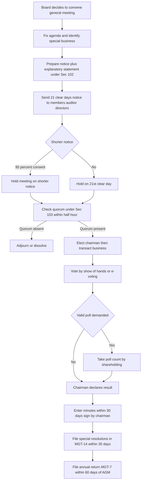
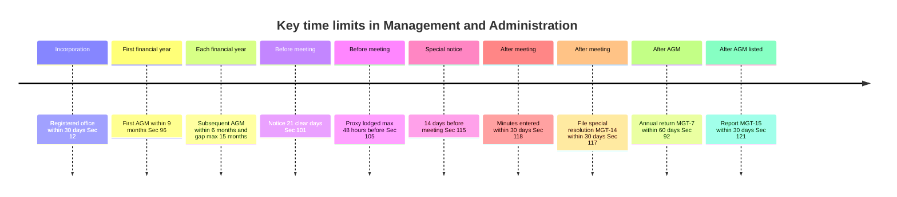
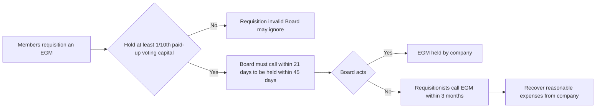
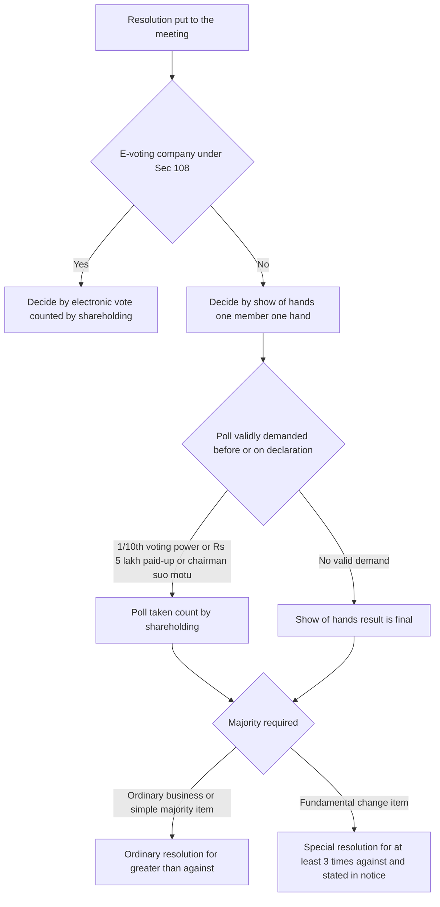
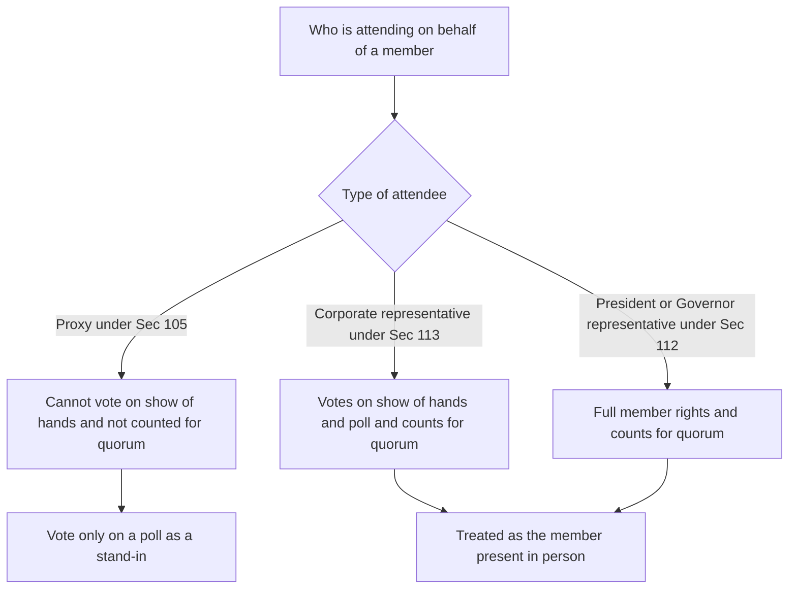

<!-- v2-deep -->

# Chapter 07 — Management & Administration

> Companies Act 2013 — Chapter VII, Sections 88 to 122, read with Section 12 (registered office) and the Companies (Management and Administration) Rules, 2014. Confirm exact rule numbers in the latest ICAI material / bare Act, as rules are periodically amended.

---

## 1. The Problem — power without a paper trail

A company is a strange creature. It owns property, signs contracts, sues and is sued — yet it has no body, no voice, no signature of its own. Every act it performs is really an act of *some human being* claiming to speak for it: a director, a manager, a majority of shareholders in a room. This is the source of an entire family of abuses.

**Abuse one — the vanishing company.** Suppose you are a supplier who sold ₹20 lakh of goods on credit to Orion Traders Ltd. Orion defaults. You go to sue. But *where* is Orion? A company is not a place. If the law let a company exist without a fixed, publicly known address, a fraudster could incorporate a company, collect money, and then simply be *unfindable*. Nobody could serve a legal notice, no regulator could inspect, no creditor could knock on a door.

**Abuse two — the secret owner.** You want to know who really controls Orion — because you are deciding whether to trust it, or because you are a regulator hunting for money laundering. The directors say "the shareholders own it." But the share register might list a nominee — a driver, a clerk, a shell — who *holds* the shares while a hidden person pulls the strings. Ownership becomes a hall of mirrors.

**Abuse three — the phantom meeting.** The company's biggest decisions — changing its constitution, removing a director, approving a merger — are supposed to be made by the *members* collectively. But what stops the directors from claiming a meeting happened when it didn't? Or holding it at 6 a.m. in a remote village with 4 hours' notice so no dissenting shareholder can attend? Or letting the chairman "declare" a resolution passed by show of hands when the hands actually said no? Or writing minutes afterward that record a decision nobody made?

**Abuse four — the frozen minority.** Even when a real meeting happens, a shareholder with 5% might be steamrolled — denied notice, denied the chance to send someone in their place, denied an accurate count of votes, denied even the right to *see* what was decided.

**Abuse five — the moving target.** Even once you have found the company and its owners, its *shape* keeps changing — shares are transferred, directors resign, new capital is raised, control quietly shifts. A snapshot taken at incorporation is worthless a year later. Without a periodic, standardized re-statement of the company's structure, every dealing would require a private investigation. The law's answer to a *moving* target is a *dated* record: registers updated within days, and an annual return frozen at the financial year-end.

Every one of these is a way to exercise the company's enormous power *without accountability*. Chapter VII of the Companies Act 2013 is the law's answer: it forces the company to have a **findable address**, a **truthful record of who owns and controls it**, a **regular public report of its state**, and a **fair, provable, well-documented process for every collective decision.**

Notice the *design pattern* underneath all five abuses: each is an attempt to break the link between an *act* and the *legitimate authority* for that act. The registered office links the company to a place; the register links shares to owners; SBO disclosure links owners to the human behind them; notice and quorum link a resolution to the informed will of the members; minutes link the record to what actually happened. Chapter VII is, at bottom, one long exercise in **keeping every act tethered to its source of authority so the tether can be pulled and tested later.**

---

## 2. The Core Idea — every collective act must be visible, fair, and recorded

The unifying principle of "Management & Administration" is this: **because a company acts only through people, the law surrounds every act with three guarantees — visibility, fairness, and a permanent record — so that power can always be traced back to a legitimate source.**

Break it into its three pillars:

1. **Visibility (where and who).** The company must have a registered office that never hides (Section 12), a register of members that names its owners (Section 88), disclosure of who *beneficially* owns shares behind nominees (Sections 89–90), and an annual return that snapshots the whole picture for the public (Section 92).

2. **Fairness of decision-making (how members decide).** No decision counts unless the members had a genuine, informed opportunity to participate: adequate notice (Section 101), an honest explanation of what they are voting on (Section 102), a minimum turnout (quorum, Section 103), the right to send a proxy (Section 105), and a fair way to count votes — show of hands, poll, e-voting, or postal ballot (Sections 107–110).

3. **Proof (the permanent record).** A decision that cannot be proved is a decision that can be denied or invented. So resolutions must be filed (Section 117) and minutes must be kept as near-conclusive evidence (Section 118).

The elegance is that each rule is a *fix for a specific cheat*. You never need to memorize a bare number — you reconstruct it from the abuse it stops.

**A finer distinction the exam tests — the three "audiences" of Chapter VII.** Every rule here serves one of three audiences, and knowing which one lets you predict the rule:

- **Outsiders (creditors, the public, regulators)** get *outward-facing* disclosure — publication under Section 12, the annual return filed with the Registrar (Section 92), and filed resolutions (Section 117). These are pushed *out* to the ROC/public.
- **Members** get *inward-facing* participation and inspection rights — notice, explanatory statement, proxy, poll, inspection of registers and general-meeting minutes.
- **The company itself** gets *internal certainty* — the register as its source of truth about whom to pay and invite, and minutes as evidence that its own decisions were validly taken.

When an exam question asks whether *X* is entitled to *Y* (e.g. "can a creditor inspect the minute book?"), first ask *which audience the rule serves*. A creditor is an outsider — he gets the filed return, not the internal minute book. That single reflex disposes of a whole class of questions.

---

## 3. Why it's built this way — the logic of each safeguard

**"Why must a company have a registered office within 30 days (Section 12)?"** Because a company that cannot be *served* cannot be *sued* or *regulated*. The registered office is the company's legal home — the single address where every notice, summons, and communication is validly delivered. Thirty days from incorporation is enough time to arrange premises but short enough that the company cannot operate for months as an untraceable ghost.

**"Why publish the name and address on every document and outside the office?"** Because people dealing with the company must instantly know *whom they are dealing with* and that it is a *limited* entity (so they are on notice that shareholders' liability is capped). Painting the name outside the office and printing the CIN on letterheads turns the company's identity into a public, unavoidable fact.

**"Why a register of members (Section 88), when share certificates already exist?"** Because a certificate is in *one person's pocket*; the register is the company's *single source of truth* about who its members are at any moment. Dividends, voting rights, and notices all flow from the register. Without it, ownership disputes would be unwinnable and the company wouldn't know whom to pay or invite.

**"Why force disclosure of *beneficial* interest (Section 89) and *significant beneficial owners* (Section 90)?"** Because the register names the *legal* holder, who may be a mere nominee. The real mischief — tax evasion, money laundering, benami control, evading takeover thresholds — hides in the gap between the *name on the register* and the *person who enjoys the benefit*. Sections 89 and 90 close that gap by compelling the hidden beneficiary to step into the light.

**"Why an annual return (Section 92) on top of financial statements?"** Because financial statements show the *money*; the annual return shows the *structure* — who the members are, how shares moved, who the directors and KMP are, indebtedness, and compliance. It is the yearly "census" of the company, filed with the Registrar so any outsider can reconstruct the company's shape without visiting it.

**"Why compel an AGM every year (Section 96)?"** Because directors, once in the saddle, have every incentive to *avoid* facing the owners. Left alone they would present accounts late, never stand for re-election, and never answer questions. A mandatory annual meeting forces a yearly reckoning: accounts are laid, auditors and directors face the members, dividends are declared. It is the heartbeat of accountability.

**"Why 21 clear days' notice (Section 101)?"** Because a decision taken by ambush is not a decision by the members — it is a decision by whoever controls the calendar. A fixed, generous notice period guarantees every member, however small or distant, has real time to study the agenda, form a view, and arrange to attend or appoint a proxy.

**"Why an explanatory statement for special business (Section 102)?"** Because a bare agenda line ("to consider item 5") tells a member *nothing*. Directors could bury a self-serving related-party deal under a vague heading. Section 102 forces full disclosure of *what* the resolution really does and *who* is materially interested, so consent is *informed*, not blind.

**"Why a quorum (Section 103)?"** Because two people in a room cannot bind thousands of owners. A minimum turnout ensures a decision reflects a meaningful cross-section of members, not a stealth meeting of insiders.

**"Why the right to a proxy (Section 105)?"** Because a member who cannot physically attend would otherwise be *disenfranchised*. The proxy lets absent owners still cast their weight, so control cannot be seized simply by whoever shows up in person.

**"Why a poll (Section 109) when a show of hands already exists?"** Because a show of hands counts *heads*, not *shares* — one tycoon holding 60% has the same single hand as a man holding one share. That is absurd for a body where power tracks capital. A poll re-counts by *shareholding*, so the true owners' weight prevails when it matters. E-voting (Section 108) and postal ballot (Section 110) extend the same fairness to those who never enter the room.

**"Why ordinary vs special resolutions (Section 114)?"** Because not all decisions are equal. Routine matters need a simple majority; but decisions that *change the fundamental bargain* — altering the constitution, reducing capital, winding up — could crush a large minority. Requiring a 75% supermajority for these means no faction can rewrite the deal without overwhelming consent.

**"Why file resolutions (Section 117) and keep minutes (Section 118)?"** Because the entire edifice collapses if decisions can be *invented or denied* after the fact. Filed resolutions put major acts on the public record; minutes, signed and dated within 30 days, are near-**conclusive evidence** that the meeting happened and decided what they say. Proof is the final safeguard.

**A deeper "why" the exam rewards — why *thresholds* take the shape they do.** Notice the recurring numbers: **1/10th (10%)** to *force* the Board's hand (requisition an EGM, demand a poll, circulate a resolution); **95%** to *waive* a protection (short notice); **75%** to *change the bargain* (special resolution); **1% or ₹5 lakh** merely to *put an item on the calendar* (special notice). The pattern is a sliding scale of *how much consensus the law demands for how disruptive the act is*. Forcing a meeting only inconveniences the Board, so a modest 10% suffices. Waiving everyone's notice right strips a protection, so near-unanimity (95%) is demanded. Rewriting the constitution binds dissenters permanently, so an overwhelming 75% is required. Once you see thresholds as *priced by disruption*, you can often reconstruct the right number by asking "how badly does this act hurt a dissenting minority?"

---

## 4. Full Technical Content — section by section, each with its "why"

### 4.1 Registered office & publication — Section 12

- **The rule:** A company must have a registered office **within 30 days of incorporation** and at all times thereafter, capable of receiving and acknowledging all communications and notices. *Why: a fixed legal home so the company is always findable.*
- **Verification:** The company must furnish verification of the registered office to the Registrar within 30 days in **Form INC-22**. *Why: prevents a fake or borrowed address.*
- **Publication (Section 12(3)):** Every company must —
  - Paint/affix its **name and registered-office address** outside every office/place of business, in legible letters, in English and the local language;
  - Have its **name engraved** on its seal (if it has one);
  - Print name, registered-office address, **CIN**, telephone/fax/email/website on all business letters, billheads, notices and official publications;
  - **One Person Company** must additionally print the words "One Person Company" in brackets below its name. *Why: instant identification and notice of limited liability.*
- **Change of registered office:** Notice of any change filed with Registrar within **15 days** in Form INC-22. *Why: keeps the "findable home" current.*
  - Change **within same city/town/village** — Board resolution suffices.
  - Change **outside local limits but within same ROC jurisdiction / state** — **special resolution**.
  - Change from **one state to another**, or shifting ROC — special resolution **plus approval of the Central Government (Regional Director)**. *Why: an interstate move can strip a state's creditors and revenue of local jurisdiction, so a higher authority polices it.*
- **The four-tier ladder made precise (a favourite MCQ).** Read the tiers as *ascending disruption*:
  1. **Same town** → nobody's convenience is disturbed → Board resolution.
  2. **Different town, same ROC/state** → some members must travel further → **special resolution**.
  3. **Different ROC within the same state** → additionally requires **Regional Director confirmation** (the ROC of record changes even though the state does not — verify current position in ICAI material, as this tier is frequently mis-stated).
  4. **Different state** (which alters the memorandum's *situation clause*) → special resolution **plus** RD approval **plus** consequent alteration of the memorandum under Section 13. *Why the escalation: the further the move, the more creditors and members it can prejudice, so the higher the sign-off.*
- **Default (Section 12(8)):** Company and every officer in default liable to a penalty of **₹1,000 per day** of default, up to a **maximum of ₹1,00,000.**
- **Trap — Section 12(9):** If the Registrar has reasonable cause to believe the company is **not carrying on business**, he may cause a **physical verification** of the registered office; if found in default, he may initiate action to **strike off** the company. *Why: an address with no real business is the classic shell-company red flag.*
- **"Capable of receiving and acknowledging" — the working test.** The office need not be *owned* by the company; leased or licensed premises suffice, provided the company can lawfully receive communications there. A registered office that is merely a nameplate on a chartered accountant's door, with no capacity to receive and *acknowledge* notices, fails the section even if INC-22 was filed. The exam sometimes hides this: a validly *filed* office that cannot in fact receive notice is still a default.
- **Edge case — "at all times thereafter."** The 30-day clock is only for the *first* office. A company that lets its office lapse mid-life (e.g. lease expires, no replacement) is in continuing default from day one of the gap — there is no fresh 30-day grace. Contrast the *change* of office, which does get its own 15-day filing window.

### 4.2 Register of members and other security holders — Section 88

- **The rule:** Every company shall keep and maintain a **register of members** (equity and preference separately), a **register of debenture-holders**, and a **register of any other security holders**. *Why: the single source of truth on ownership.*
- **Index (Section 88(2)):** Where members exceed **50**, an index of names must be maintained (unless the register itself is in a form serving as an index). *Why: usability — you must be able to find a member fast.*
- **Foreign register (Section 88(4)):** A company may keep a **foreign register** of members/debenture-holders/other security holders residing outside India. *Why: practical access for overseas holders.* The foreign register is deemed **part of the principal register**; a **duplicate** must be kept at the registered office and updated. *Why: the head office must always mirror the whole picture, so India-based inspection is never defeated by parking members abroad.*
- **Rule detail:** Registers maintained in **Form MGT-1** (members) etc.; entries within **7 days** of the Board (or its committee) approving allotment or transfer.
- **The register vs the depository — a modern subtlety.** For shares held in **dematerialised** form, the company relies on the records of the **depository** (NSDL/CDSL); the depository's records are treated as the corresponding register. The exam may ask "who maintains ownership records for demat shares?" — the answer keys on the depository, not a physical MGT-1. *Why: dematerialisation moves the "single source of truth" into the depository system, but the *concept* — one authoritative ownership record — is unchanged.*
- **Default (Section 88(5)):** Company liable to penalty and every officer in default liable to penalty. *(Confirm the exact revised penalty figures in current ICAI material — amended by the Amendment Acts.)*
- **Edge case — beneficial owner does NOT go on the register.** A recurring trap: the register under Section 88 records the *registered/legal* holder only. The *beneficial* owner declared under Section 89 is recorded on the company's Section 89 records and reported in **MGT-6**, not entered as a member in MGT-1. The register names the nominee; the beneficiary is disclosed alongside, never substituted in.

### 4.3 Declaration of beneficial interest — Section 89

- **The problem:** The register names the *legal* holder, who may only be a **nominee** for someone else who truly enjoys the dividends and rights.
- **The rule:**
  - The person whose name is entered but who **does not hold the beneficial interest** (the registered owner / nominee) must file a declaration in **Form MGT-4** within **30 days**.
  - The person who **holds the beneficial interest** but is not the registered owner must declare in **Form MGT-5** within **30 days** of acquiring it.
  - The **company**, on receiving these, must record it and file a return in **Form MGT-6** with the Registrar within **30 days.**
- **Consequence (Section 89(8)):** Until the declaration is made, **no right in the shares** (e.g. voting) shall be **enforceable** by the beneficial owner. *Why: removes the benefit of hiding — an undeclared beneficiary cannot use the very rights he concealed.*
- **A precise reading of 89(8) the exam tests.** The bar on enforcement runs against the **beneficial owner's rights**, and it lasts *until* the declaration is filed — it is a *suspension*, not a permanent forfeiture. File MGT-5, and the rights revive prospectively. Meanwhile the *registered* holder (the nominee on the register) may still, on the face of the register, exercise rights and receive notices; the company is entitled to treat the register as true. So a resolution passed on votes cast by the *registered* nominee is not automatically void merely because the beneficiary hadn't declared.
- **Section 89(10) definition:** "Beneficial interest" includes, directly or indirectly through contract/arrangement, the right to exercise **any or all rights attached** to a share (voting, dividend, transfer, etc.).
- **Section 89 vs Section 90 — the distinction to lock in.** Section 89 catches a **simple, single-layer nominee** ("A holds *for* B"). It has **no percentage threshold** — even one share held on trust triggers it. Section 90 catches the **ultimate controlling individual** behind possibly many layers, and *does* have a threshold (10%). Both may bite at once: A holds 12% as nominee for B (Section 89 declarations), and B, being an individual with ≥10% beneficial interest, is also an **SBO** (Section 90 in BEN-1).

### 4.4 Significant Beneficial Owner (SBO) — Section 90

- **The deeper problem:** Even Section 89 only catches simple nominee arrangements. Control can hide behind **layers of companies and trusts**. Section 90 hunts the *ultimate individual* controlling a company.
- **Who is an SBO:** An **individual** who, acting alone or together, or through one or more persons/trusts, holds **beneficial interest of at least 10%** of shares (or voting rights, or right to receive dividend), **or** exercises **significant influence or control** over the company (threshold prescribed by rules — confirm the 10% figure in current SBO Rules).
- **"Individual" is load-bearing.** An SBO is always a *natural person*. If the immediate holder is a body corporate, trust, partnership, or pooled vehicle, you must **look through** it to the individual at the top of the chain. The whole point of Section 90 is that a corporate owner is never the final answer — you keep climbing until you reach a human. Exam trap: naming a holding *company* as the SBO is wrong; name the individual controlling that holding company.
- **Duties:**
  - The SBO must declare his interest to the company in **Form BEN-1**.
  - The company files a return in **Form BEN-2** with the Registrar.
  - The company maintains a **register of SBOs in Form BEN-3.**
  - The company must **give notice (Form BEN-4)** to any person it believes to be, or to know of, an SBO.
- **Enforcement teeth (Section 90(7)–(9)):** If a person fails to respond, the company may apply to the **Tribunal** for an order imposing **restrictions on the shares** (transfer, dividend, voting suspended). *Why: freezes the very shares used to hide, forcing disclosure.* The Tribunal application is made **within a prescribed period** of the person's failure, and the order can be lifted once disclosure is made.
- **Exemption:** Certain holdings (e.g. by IEPF Authority, mutual funds, holding reporting companies) are exempt. *Why: these are already transparent/regulated.*
- **Why "significant influence or control" is a *second, independent* limb.** A person can be an SBO with **less than 10% of shares** if they nonetheless exercise significant influence or control — e.g. through a shareholders' agreement, a golden share, or the right to appoint a majority of directors. The 10% test catches *economic* ownership; the influence/control test catches *de facto* command. The exam sometimes gives a fact pattern with 8% shareholding but a right to appoint the board — that person is still an SBO.

### 4.5 Place of keeping registers & returns — Section 94

- **The rule:** Registers under Section 88 and copies of annual returns are kept at the **registered office.** They may be kept **elsewhere in India** where more than **1/10th of members reside**, if approved by a **special resolution.** *Why: brings records physically closer to where owners actually are, but only with supermajority consent to prevent hiding records in an inconvenient place.*
- **Inspection:** Members/debenture-holders may inspect **free of charge**; others on payment of prescribed fee. Copies to be provided within the prescribed period. *Why: transparency is meaningless without access.*
- **Two conditions, both mandatory.** Keeping registers away from the registered office needs **both** (a) more than one-tenth of members *residing* at that other place, **and** (b) a *special resolution*. Missing either defeats it. A common trap gives a special resolution but only 8% of members residing there — the shift is invalid because the residence limb fails.
- **Amendment note:** The earlier requirement to file a copy of a proposed special resolution in advance with the Registrar (old Section 94 proviso) was **omitted** by the 2017 Amendment — confirm current position.

### 4.6 Annual Return — Section 92

- **The rule:** Every company shall prepare an annual return in **Form MGT-7** (small companies and OPC use **MGT-7A**) containing, as they stood at the **close of the financial year**, particulars of: registered office, principal business activities; holding/subsidiary/associate companies; shares, debentures, other securities and shareholding pattern; members and debenture-holders with **changes** since last year; promoters, directors, KMP and changes; meetings of members/Board/committees and attendance; remuneration of directors and KMP; penalties/punishments and compounding; matters relating to certification of compliances; shareholding of the FII; and other prescribed matters.
- **"As they stood at the close of the financial year" — the freeze date.** Every figure in the return is a snapshot at FY-end, not at the AGM date and not at filing date. If a director resigns *after* year-end but before filing, the return still shows the year-end position (with changes disclosed). *Why: a census needs a single, common cut-off so successive years' returns are comparable and outsiders know exactly what date the picture depicts.*
- **Signing:** Signed by a **director and the Company Secretary**; where there is no CS, by a **company secretary in practice.**
- **Signing for OPC and small companies (post-amendment).** For an **OPC and small company**, the annual return may be signed by the **company secretary**, or where there is no CS, **by the director** of the company. *(Confirm current wording — the relaxation was introduced to ease compliance for the smallest companies.)*
- **Certification (Section 92(2)):** A **listed company** or a company with **paid-up capital ≥ ₹10 crore** or **turnover ≥ ₹50 crore** must have the annual return **certified by a company secretary in practice** in **Form MGT-8.** *Why: independent professional attestation for larger companies where errors affect many.*
- **Filing (Section 92(4)):** File with the Registrar within **60 days of the AGM**; if no AGM is held, within 60 days of the date the AGM *should* have been held, with reasons for not holding it. *Why: a fixed public deadline keeps the census current.*
- **The "no AGM held" branch — worth stressing.** The 60-day clock does not disappear just because the company skipped its AGM. It runs from **the last date on which the AGM *ought* to have been held**, and the return must **state the reasons** for the failure. *Why: a defaulting company cannot buy itself indefinite delay in filing simply by also defaulting on the AGM — two wrongs don't extend the deadline.*
- **Abridged / web note:** The requirement for an **extract of the annual return (MGT-9)** in the Board's report was replaced — companies now place the annual return on the **website** and give the web link in the Board's report. *(Confirm current wording.)*
- **Default (Section 92(5)/(6)):** Company and every officer in default liable to penalty (₹ per day continuing default, subject to cap); a PCS certifying wrongly is liable to penalty. *(Confirm exact revised figures.)*

*The census reflex — remember MGT: **M**embers, **G**overnance, **T**ransactions all get filed on Forms MGT.*

### 4.7 Annual General Meeting — Section 96

- **The rule:** Every company **other than a One Person Company** must hold an AGM **every year.**
- **Gaps and first AGM:**
  - First AGM: within **9 months** from the close of the **first** financial year. (If held, no AGM needed in the year of incorporation.)
  - Subsequent AGMs: within **6 months** from the close of the financial year.
  - Gap between two AGMs **not more than 15 months.**
  - The Registrar may, for special reasons, **extend** the time for holding an AGM (not the first AGM) by up to **3 months.** *Why: rare genuine difficulties (e.g. delayed accounts) accommodated, but the first AGM is never extendable.*
- **How the three limits interact — a subtlety examiners exploit.** For a *subsequent* AGM you must satisfy **all** the applicable limits at once: within 6 months of FY-end **and** no more than 15 months after the last AGM. Where an extension is granted, the **15-month gap and the 6-month rule are read with the extension** — the extension moves the deadline, so a gap that would otherwise breach 15 months can become lawful. But the **first AGM's 9 months can never be extended** — if you see "first AGM" and "extension" in the same sentence, the extension is a red herring.
- **Time and place:** Held during **business hours (9 a.m. to 6 p.m.)**, on a day that is **not a National Holiday**, at the registered office or some other place within the **city/town/village** where the registered office is situated. (Unlisted companies may hold the AGM **anywhere in India** if all members consent — 2017 Amendment.) *Why: no ambush at odd hours or unreachable places.*
- **"National Holiday" is a defined term, not "public holiday."** A National Holiday is one *declared* by the Central Government (e.g. Republic Day, Independence Day, Gandhi Jayanti). A meeting on a *state* festival or a bank holiday that is not a declared National Holiday is *not* barred on that ground. The exam plays on the loose word "holiday" — read for "National Holiday."
- **Business:** *Ordinary business* — (a) consideration of financial statements and reports; (b) declaration of dividend; (c) appointment of directors in place of those retiring; (d) appointment/re-appointment of auditors and fixing remuneration. Everything else is *special business* needing an explanatory statement.
- **The four ordinary-business items — memorize the closed list.** *Only* these four are ordinary business, and they arise *only* at an AGM (an EGM has no ordinary business — every item at an EGM is special business and needs an explanatory statement). Trap: examiners describe an EGM approving "adoption of accounts" as ordinary business — at an EGM there is no such category, so it needs Section 102 disclosure.
- **Default (Section 99):** If an AGM is not held, company and every officer in default liable to a fine up to **₹1,00,000**, and **₹5,000 per day** for continuing default.

### 4.8 Tribunal's power to call meetings — Sections 97 & 98

- **Section 97 — default in holding AGM:** If a company fails to hold an AGM, **any member** may apply to the **Tribunal**, which may **call/direct the calling of** an AGM and give ancillary directions (including that **one member present in person or by proxy shall constitute the meeting**). *Why: members are not left helpless when directors stonewall.*
- **Section 98 — impracticability:** If for any reason it is **impracticable** to call or conduct a meeting (other than an AGM), the Tribunal may, on its own motion or on application of a director/member, **order a meeting** to be called and conducted as it directs. *Why: deadlock (e.g. quorum can never be met because a faction boycotts) must not paralyse the company.*
- **Section 97 vs 98 — draw the line cleanly.** Section 97 is triggered *only* by a **default in holding the AGM** and is invoked *only by a member*. Section 98 covers **any meeting other than an AGM** (including a Board meeting or an EGM) that has become **impracticable** to call or conduct, and can be invoked by a **director or member, or by the Tribunal itself**. A quick decision rule: *AGM not held → Section 97; any other meeting impracticable → Section 98.*
- **The "one member is quorum" power is the killer feature.** Both sections let the Tribunal direct that **one member present shall constitute the meeting**, overriding Section 103's numerical quorum. This is precisely how a boycotting majority (who deny quorum) is defeated — the Tribunal simply removes the quorum obstacle. Exam favourite: a 50-50 deadlock where one faction never attends; the remedy is a Tribunal-ordered meeting with a one-member quorum.

### 4.9 Extraordinary General Meeting — Section 100

- **The idea:** Any general meeting **other than the AGM** is an EGM — for urgent matters that cannot wait.
- **Who calls it:**
  - The **Board** may call an EGM whenever it thinks fit.
  - The Board **must** call an EGM on a valid **requisition** by members holding at least **1/10th of the paid-up share capital** carrying voting rights (or, for a company without share capital, 1/10th of total voting power).
  - The Board must proceed to call the meeting **within 21 days** to be held **within 45 days** of receiving the requisition.
  - If the Board fails, the **requisitionists themselves** may call the EGM within **3 months** of the requisition; reasonable expenses are **recovered from the company** (and may be deducted from defaulting directors' fees). *Why: owners can force a reckoning even against an unwilling Board.*
- **The requisition's content requirements.** A valid requisition must **set out the matters** for which the meeting is required and be **signed** by the requisitionists and **deposited at the registered office**. A requisition that names no business is invalid; the Board is not obliged to act on a blank demand. *Why: the Board must know what it is being forced to convene, and the notice to members must state the purpose.*
- **The 3-month window explained precisely.** The requisitionists' self-called meeting must be **held within 3 months** from the date of deposit of the requisition — not merely *called* within 3 months. And it must be called **in the same manner** as the Board would (broadly, proper notice to members). *Why: the self-help route is a substitute for Board action, so it inherits the same procedural discipline.*
- **Place (2017 Amendment proviso):** An EGM of a **wholly-owned subsidiary of a company incorporated outside India** may be held **anywhere in the world**; other companies' EGMs are held in India.
- **Contrast with the AGM's place rule.** The AGM must generally be within the city/town/village of the registered office (relaxed for unlisted companies with all members' consent). The EGM has no such city-limit rule in the Act's body — its only special geography rule is the "anywhere in the world" relaxation for the wholly-owned foreign subsidiary. Don't import the AGM's city restriction into EGMs.

### 4.10 Notice of meeting — Section 101

- **The rule:** A general meeting is called by giving **not less than 21 clear days' notice** in writing or electronic mode.
- **"Clear days":** Exclude the **day of service** and the **day of the meeting**; add ~2 days for postal service where notice is sent by post. *Why: 21 *usable* days, not 21 counted-from-the-envelope.*
- **Working the "clear days" arithmetic.** Suppose notice is *served* on 1 August for a meeting. Exclude 1 August (day of service). If sent by post, notice is deemed served **48 hours after posting**, so a notice *posted* on 1 August is *served* on 3 August; you then exclude 3 August and the meeting day, and count 21 full days in between. The earliest lawful meeting date is therefore roughly **3 + 21 + 1 = 25 August at the earliest** (verify the exact deeming rule in current material). The exam almost always tests whether you (a) exclude both ends and (b) add the postal 48 hours.
- **Shorter notice:** A meeting may be called on **shorter notice** if consented to by:
  - **AGM** — **95%** of the members entitled to vote;
  - **other meetings (EGM)** — members holding **95%** of the paid-up voting capital (or 95% of voting power where no share capital). *Why: near-unanimity means nobody is ambushed.*
- **A precise distinction inside the 95% rule.** For an **AGM**, the 95% is of *members entitled to vote* — a **head/number** test blended with entitlement. For an **EGM** of a company with share capital, the 95% is of the **paid-up voting capital** — a *value* test. The exam sometimes swaps these to trip you. Read carefully whether it asks for 95% of *members* (AGM) or 95% of *capital/voting power* (EGM).
- **To whom (Section 101(3)):** To every **member, legal representative of a deceased member, assignee of an insolvent member, auditor, and every director.**
- **Contents:** Place, date, day, hour of the meeting, and the **agenda.** Accidental omission to give notice to, or non-receipt by, any member does **not** invalidate proceedings (Section 101(4)) — *provided the omission was truly accidental, not deliberate.*
- **The "accidental omission" safe harbour, dissected.** Section 101(4) protects the meeting only where the failure is (a) *accidental* and (b) *omission to give* notice OR *non-receipt* by the member despite the notice being sent. It does **not** protect a *deliberate* exclusion (e.g. leaving a dissenting shareholder off the list to prevent objection) — that voids the proceedings. Nor does it cure a *systemic* failure (e.g. forgetting a whole class of members) that goes beyond a stray oversight. The single word "accidental" is where marks are won or lost.

### 4.11 Statement to be annexed to notice — Section 102

- **The rule:** For every item of **special business**, the notice must annex an **explanatory statement** setting out —
  - the **material facts** concerning each item;
  - the **nature of the concern or interest**, financial or otherwise, of **every director, manager, KMP and their relatives** in each item;
  - where an item relates to another company, the **shareholding interest** in that other company of every director/KMP/their relatives, **if it is 2% or more.**
- **The 2% shareholding trigger — read it exactly.** The 2%-or-more disclosure bites only for the *cross-holding in the other company* limb, and it aggregates the holdings of the director/KMP/manager *and their relatives*. Below 2%, that particular cross-holding need not be disclosed — but the *general* duty to disclose the **nature of concern or interest** (the first two bullets) has **no** threshold. Trap: candidates apply the 2% floor to the whole section; it applies only to the "shares in the other company" disclosure.
- **What counts as "special business" — the default rule.** At an AGM, everything *except* the four ordinary-business items is special business. At an EGM, **all** business is special business. So the explanatory statement is the *norm*, not the exception, at an EGM.
- **Consequence of default (Section 102(4)):** If, as a result of non-disclosure or insufficient disclosure, any **benefit accrues** to a director/promoter/manager/KMP/relative, they must **compensate the company** to the extent of the benefit. Default also attracts a penalty of **₹50,000 or 5 times the benefit, whichever is more.** *Why: disgorges the profit gained through concealment — you cannot keep what you hid.*
- **Disgorgement is compensation, not a fine — keep them separate.** Section 102(4) produces *two* distinct liabilities: (1) the interested person must **hand back the benefit** to the company (restitution, measured by the benefit), and (2) a **penalty** of ₹50,000 or 5× the benefit, whichever is higher. A common error is to treat the "5× benefit" as the amount returned to the company — no: the company gets the *actual benefit* back, and the *penalty* is separately the greater of ₹50,000 or 5× benefit.

### 4.12 Quorum — Section 103

- **The rule (public company):** Minimum members personally present —
  - **5** members if the number of members on the date of meeting is **≤ 1,000**;
  - **15** members if members are **> 1,000 but ≤ 5,000**;
  - **30** members if members are **> 5,000.**
- **Private company:** **2 members** personally present. *Why: smaller bodies need a smaller floor.*
- **"Personally present" — and how representatives change the count.** Quorum requires members *personally present*. A **proxy does NOT count** toward quorum. But a **corporate representative under Section 113** and a **representative of the President/Governor under Section 112** *do* count as the member being "personally present." So a public company meeting attended by 5 corporate representatives (each representing a member company) *has* quorum; the same meeting with 5 proxies does *not*. This proxy-vs-representative distinction is the single most tested point in the whole chapter.
- **If quorum absent within half an hour:**
  - Meeting called on **requisition** by members → **dissolved.**
  - Any other meeting → **adjourned** to the same day next week, same time and place (or as the Board decides). If quorum is still absent at the adjourned meeting within half an hour, the **members present shall be the quorum.** *Why: a persistently boycotting faction cannot paralyse the company forever.*
- **Why requisitioned meetings are *dissolved*, not adjourned.** A requisitioned EGM exists only because the requisitionists demanded it. If they themselves cannot muster quorum, there is no public interest in keeping the machinery running — so the law simply *dissolves* it (the requisitionists failed their own meeting). A Board-called or AGM meeting, by contrast, serves the company at large, so it is *adjourned* and then proceeds with whoever turns up. Reason it out and you never confuse the two outcomes.
- **Edge case — quorum must persist or only be present at the start?** The Act fixes quorum at the *commencement* (within half an hour of the appointed time). Whether business already validly commenced is vitiated by members later leaving depends on the articles/Secretarial Standards — SS-2 generally requires quorum to be present *throughout*. For the exam, state the statutory rule (quorum within half an hour) and note SS-2's throughout-requirement as the prudent standard.

### 4.13 Chairman, proxies and voting — Sections 104 to 108

- **Chairman (Section 104):** Unless the articles provide otherwise, members personally present **elect a chairman by show of hands**; if a poll is demanded on the election of chairman, it is taken **forthwith.** *Why: a meeting needs a neutral steward from the first minute.*
- **Proxy (Section 105):**
  - Any member entitled to attend and vote may appoint a **proxy** to attend and vote **on a poll** on his behalf.
  - A proxy **need not be a member.**
  - **A proxy cannot vote on a show of hands** and (unless articles allow) **cannot speak.** *Why: a proxy is a stand-in vote-carrier, not a debater.*
  - **Members of a company not having share capital** cannot appoint a proxy unless the articles allow; a **Section 8 company** member may appoint a proxy only if the proxy is also a member.
  - **Proxy instrument** must be deposited **not more than 48 hours** before the meeting. *Why: gives the company time to verify without letting last-minute forgeries slip in.*
  - **Aggregation limit (Rules):** A person can act as proxy for **not more than 50 members** and members holding in aggregate **not more than 10% of total voting share capital**; but a member holding **more than 10%** may appoint a **single** proxy who then cannot be proxy for anyone else. *Why: prevents proxy-farming to hijack meetings.*
  - Notice of the meeting must state, "with reasonable prominence," that a member entitled to attend and vote may appoint a proxy.
- **"Not more than 48 hours" — the direction of the limit matters.** Section 105 caps the *maximum* advance deposit at 48 hours; a company **cannot** require proxies to be lodged, say, 72 hours before — any article demanding more than 48 hours' advance deposit is void *to that extent*. The purpose is member-protective: it stops companies from setting an impossibly early cut-off. Trap: candidates read "48 hours" as a *minimum* and think a proxy lodged 24 hours before is late — it is perfectly valid.
- **The 50-members / 10% proxy-farming cap, worked.** One person may hold proxies for at most **50 members** *and* those members must together hold **≤ 10%** of the total voting share capital. Both limits apply simultaneously. Exception: a *single* member holding **more than 10%** may appoint one proxy for himself, but that proxy is then *locked* to him and cannot also carry other members' proxies. *Why: this stops a mass round-up of small holders' proxies to manufacture control while still letting a large single holder be represented.*
- **Restriction on voting rights (Section 106):** Articles may bar a member from voting if **calls are unpaid** or the company has a lien/exercised a right over his shares. Except as so provided, a member's voting right cannot otherwise be restricted. *Why: you shouldn't vote with shares you haven't fully paid for.*
- **Voting by show of hands (Section 107):** At any general meeting a resolution is decided by a **show of hands** in the first instance, unless a poll is demanded (Section 109) or e-voting is used. *One member = one hand, regardless of shareholding — the flaw a poll cures.*
- **Show of hands is unavailable where e-voting applies.** For companies that must provide **e-voting** (Section 108), a resolution is *not* decided by show of hands — the electronic vote (counting by shareholding) governs, because show of hands would be meaningless where most members voted remotely by value. Trap: a listed company "declaring a resolution passed on a show of hands" is procedurally wrong.
- **Voting through electronic means (Section 108):** **Prescribed classes** of companies (notably **listed companies and those with ≥ 1,000 members**) must provide members the facility to exercise their vote by **electronic means (remote e-voting).** *Why: extends the franchise to owners who cannot travel — especially scattered public shareholders.*

### 4.14 Poll — Section 109

- **The rule:** Before or on the declaration of the result of a show of hands, a **poll** may be **demanded** by —
  - In a company **having share capital** — members holding at least **1/10th of the total voting power** or holding **paid-up shares of ≥ ₹5,00,000** (in aggregate);
  - In a company **without share capital** — members having at least **1/10th of the total voting power.**
- **The chairman** may also **order a poll suo motu.**
- **Timing:** A poll on **adjournment** or **election of chairman** is taken **forthwith**; any other poll within **48 hours.** *Why: procedural matters can't wait; substantive ones get a short verification window.*
- **Effect:** On a poll, votes are counted by **shareholding** — the true weight of capital prevails. A demand for a poll may be **withdrawn** by the person(s) who made it.
- **The two alternative thresholds are disjunctive — and the ₹5 lakh limb is generous to small blocs.** A demand is valid if *either* the 1/10th voting-power test *or* the ₹5,00,000 aggregate paid-up value test is met. In a large company the ₹5 lakh test is often *easier* than 10% (10% of a huge company is enormous), so a modest coalition can still force a poll. Reason: the law wants a poll to be *demandable* whenever a meaningful economic stake objects to a heads-count result.
- **"Before or on the declaration of the result of the show of hands" — the timing window.** The demand must be made *at latest* when the show-of-hands result is declared. Once the chairman has declared the show-of-hands result **and** the moment has passed, a belated poll demand is out of time. This is why in Scenario B (below) Mr. Rao demands the poll *immediately* on declaration — he is inside the window.
- **A validly demanded poll cannot be refused.** The chairman has *no discretion* to reject a poll demand that meets the threshold — his only role is to fix the manner and (for substantive items) the time within 48 hours. Refusal is illegal and the show-of-hands "result" never becomes final.

### 4.15 Postal ballot — Section 110

- **The idea:** Some decisions are put to members **entirely by post/e-voting** without a physical meeting — every member votes from home.
- **The rule:** A company **may**, and in respect of items of business the Central Government declares to be transacted **only by postal ballot**, **shall**, get any resolution passed by means of a **postal ballot** (which includes voting by electronic means).
- **Exception:** **Ordinary business** and any business in respect of which **directors or auditors have a right to be heard** cannot be transacted by postal ballot. *Why: matters requiring live debate/hearing need a meeting.*
- **Reasoning out the exception.** The four ordinary-business items (accounts, dividend, retiring directors, auditors) and matters where the auditor/director has a *right to be heard* (e.g. removal of an auditor, removal of a director) all involve a *live confrontation* — the person affected is entitled to appear and speak. A postal ballot has no floor for a hearing, so these are *structurally* incompatible with it. Once you see *why*, you can predict any new item: if someone has a right to be heard, it cannot go to postal ballot.
- **OPC / ≤ 200 members:** A **2017 Amendment proviso** allows any item required to be transacted by postal ballot to instead be transacted at a **general meeting** by a company that is required to provide **e-voting** to its members.
- **Deeming (Section 110(2)):** A resolution assented to by the requisite majority through postal ballot is **deemed to have been duly passed at a general meeting.**
- **Why the deeming clause matters.** Because a postal-ballot resolution is *deemed passed at a general meeting*, it carries the **same legal force** as a meeting resolution — a special resolution passed by postal ballot is a valid special resolution for filing under Section 117, for altering the articles, etc. The exam sometimes suggests a postal-ballot special resolution is "weaker" or needs ratification at a meeting — it does not.
- **Items generally requiring postal ballot (Rules):** e.g. alteration of the objects clause; change of registered office outside local limits; variation of rights attached to a class of shares; buy-back; election of a small shareholders' director; sale of the whole/substantially the whole of an undertaking; giving loans/guarantees beyond limits. *(Confirm the current list in the Management & Administration Rules.)*

### 4.16 Circulation of members' resolution — Section 111

- **The rule:** Members holding the requisite stake (as for a requisition under Section 100 — **1/10th** of voting capital, or 100 members holding shares on which prescribed aggregate paid-up sum has been paid) can require the company to (a) give **notice of a resolution** they intend to move, and (b) **circulate a statement** (up to ~1,000 words) about any matter on the agenda. *Why: the minority gets a voice on the official agenda, not just a heckle from the floor.*
- Expenses are borne by the requisitionists unless the company resolves otherwise. The company may apply to have a defamatory statement not circulated.
- **Circulation (Sec 111) vs requisition (Sec 100) — same threshold, different weapon.** Both use the 1/10th test, but they do different things: Section 100 forces the company to *hold a whole meeting*; Section 111 merely forces it to *put the minority's resolution/statement onto an already-scheduled meeting's papers*. Section 111 is the *cheaper, narrower* tool — use it to get an item onto the next AGM rather than to convene a fresh EGM.

### 4.17 Representation — Sections 112 & 113

- **Section 112:** The **President of India** or a **Governor of a State**, if a member, may appoint a person to act as its **representative** at meetings, who then enjoys the same rights as an individual member. *Why: the State as shareholder needs a human proxy.*
- **Section 113:** A **body corporate** that is a member may, by **resolution of its Board**, authorise a person as its **representative**; that representative may exercise **all the rights** of the member, including voting on a show of hands and a poll, and is counted for **quorum.** *Why: a company-member also acts only through a human — this makes that human fully empowered (unlike a mere proxy).*
  - **Trap:** A **corporate representative** (Section 113) is *not* the same as a **proxy** (Section 105). The representative counts for quorum and can vote on a show of hands; a proxy does neither.
- **The full comparison — proxy vs corporate representative vs presidential representative.**

| Feature | Proxy (Sec 105) | Corporate representative (Sec 113) | President/Governor rep (Sec 112) |
|---|---|---|---|
| Appointed by | Any individual member | A body-corporate member (by Board resolution) | President of India / Governor |
| Instrument | Proxy form, lodged ≤ 48 hrs before | Board resolution authorising the person | Order/appointment by the President/Governor |
| Counts for quorum | **No** | **Yes** | **Yes** |
| Vote on show of hands | **No** | **Yes** | **Yes** |
| Speak at meeting | Generally **no** | **Yes** | **Yes** |
| Nature | A limited agent for voting on a poll | The member "in person" through a human | The State member "in person" through a human |

- *Why the representative is more powerful than a proxy:* a body corporate or the State has **no physical body at all** — it can *only ever* act through a nominated human. So the law treats that human as the member itself present, not as a mere vote-carrier. An individual member, by contrast, *could* attend in person, so his proxy is a lesser stand-in.

### 4.18 Ordinary and special resolutions — Section 114

- **Ordinary resolution (Section 114(1)):** Passed when votes cast **in favour exceed the votes cast against** (a **simple majority**) by members entitled to vote, in person or by proxy/postal ballot.
- **Special resolution (Section 114(2)):** (a) the **intention to propose it as a special resolution** is stated in the notice; and (b) votes cast **in favour are not less than three times** the votes cast against — i.e. a **75% supermajority.** *Why: fundamental changes need overwhelming, not bare, consent.*
- **"Three times the votes against" is about votes *cast*, not total membership.** The 75% is computed on **votes actually cast** (for + against), ignoring abstentions and absentees. So 300 for and 100 against passes (300 ≥ 3 × 100), even if thousands of members stayed away. Trap: candidates compute 75% of *total shares/members*; the test is 75% of *votes cast*.
- **Both limbs are mandatory — the notice limb is a killer.** A resolution that gets 99% support but was *not described in the notice as a special resolution* is **not** a valid special resolution — it fails limb (a). Conversely, stating "special resolution" in the notice but only achieving a simple majority fails limb (b). The exam loves a fact pattern satisfying one limb only.
- **When a special resolution is required (examples to remember):** change of name; alteration of the **articles**, and the objects clause of the **memorandum**; shift of registered office outside local limits/to another state; **reduction of share capital** (Section 66); **buy-back** (Section 68); issue of **sweat equity** and **private placement/preferential allotment**; loans and investments beyond Section 186 limits; voluntary winding-up; conversion of a public company into private; removal of an auditor before term; keeping registers at a place other than the registered office (Section 94). *(A resolution is *ordinary* unless the Act or articles specifically demand a *special* one — that is the default.)*

### 4.19 Resolutions requiring special notice — Section 115

- **The rule:** Where the Act or the articles require **special notice** for a resolution, notice of the **intention to move** it must be given to the company by members holding **not less than 1% of total voting power** or **shares on which ₹5,00,000 aggregate has been paid up**, at least **14 days before the meeting** (excluding the day of receipt and day of meeting). The company then notifies members. *Why: certain sensitive resolutions (e.g. **removing a director** under Section 169, or **appointing an auditor other than the retiring one**) must not surprise the person affected — they get advance warning and a chance to be heard.*
- **Special notice is a *members-to-company* notice, not a *company-to-members* notice.** Two notices are in play: (1) the **members** give the *company* 14 days' special notice of their intention to move the resolution; (2) the *company* then gives the *members* notice of that resolution (broadly with the ordinary meeting notice, at least 7 days before, or by public advertisement if that's not practicable). Trap: candidates confuse the 14-day member-to-company notice with the 21-day meeting notice — they are separate.
- **Special notice ≠ special resolution.** Removal of a director (Sec 169) and appointing an auditor other than the retiring one are passed as **ordinary resolutions** but require **special notice**. The "special" describes the *notice*, not the *majority*. This is one of the most common traps in the chapter — a resolution can need special notice yet only a simple majority.

### 4.20 Resolution passed at adjourned meeting — Section 116

- A resolution passed at an **adjourned meeting** is treated as passed on the **date it was actually passed**, not on any earlier date. *Why: prevents back-dating the effect of a decision to before it was really taken.*
- **Contrast with Section 103's adjournment for want of quorum.** Section 116 is a *dating* rule (the resolution's effective date is the adjourned-meeting date). Section 103 is a *quorum* rule (an adjourned meeting for want of quorum proceeds with those present). Both involve "adjournment," but they answer different questions — *when is it effective* (116) vs *is it validly constituted* (103). Read which one the question is really asking.

### 4.21 Resolutions and agreements to be filed — Section 117

- **The rule:** A copy of every resolution or agreement of the specified types, together with the explanatory statement (if any), must be **filed with the Registrar in Form MGT-14 within 30 days.**
- **Which resolutions must be filed (Section 117(3)):** **all special resolutions**; resolutions of the Board or agreements that the company has **agreed to** which bind classes of members though not all agreed; resolutions requiring a company to be **wound up voluntarily**; resolutions passed under **Section 179(3)** (key Board powers — e.g. borrowing, investing, issuing securities); and others prescribed. *Why: the public record must capture every fundamental and financially significant decision.*
- **Some ordinary resolutions must also be filed — don't equate MGT-14 with "special only."** Filing under Section 117 is *not* limited to special resolutions. Certain **ordinary** resolutions (e.g. those under Section 179(3) passed by the Board, and specified Board resolutions) also go into MGT-14. The exam trap is "only special resolutions need MGT-14" — false; the trigger is *type of decision*, not the majority used.
- **Default:** Company and every officer in default (including liquidator) liable to penalty. *(Confirm revised figures.)*
- **Consequence of non-filing for validity.** Non-filing attracts penalties but does not, by itself, make the *underlying resolution void* between the company and members; however, until filed, certain acts (e.g. those requiring registration to be effective against outsiders) may not bind third parties. State it as "penalty for the company/officers, and the resolution may not be effective against outsiders until filed" (confirm precise wording in current material).
- **Exemption:** **Banking company** resolutions granting loans / giving guarantees in the ordinary course of business are exempt from filing.

### 4.22 Minutes — Section 118

- **The rule:** Every company must keep **minutes** of every **general meeting**, every meeting of the **Board and its committees**, and every resolution passed by **postal ballot**, in books kept for that purpose, with pages consecutively numbered.
- **Time limit:** Minutes must be entered within **30 days** of the meeting.
- **Signing:** Each page initialled/signed and the last page signed and dated by the **chairman** of that meeting or the **chairman of the next meeting.** *Why: authentication ties the record to a responsible person.*
- **Why the "chairman of the next meeting" fallback exists.** If the chairman of a meeting dies, resigns, or is unavailable before signing, the minutes would otherwise be unsignable and lose evidentiary force. Letting the *next* meeting's chairman sign keeps the record alive. Note the 30-day entry limit still runs — the fallback is about *signing*, not about extending the entry deadline.
- **Contents & fairness (Section 118(5)–(6)):** Minutes must contain a **fair and correct summary.** The chairman has discretion to **exclude** matters that are defamatory, irrelevant, or detrimental to the company's interests — but must include **all appointments of officers.**
- **The chairman's exclusion discretion is bounded.** He may leave out material that is *defamatory, irrelevant/immaterial, or detrimental to the company's interests* — but the discretion is **conclusive** on *those grounds only*, and he **must** record **all appointments of officers** made at the meeting. He cannot use the discretion to bury an inconvenient-but-material decision. Trap: a chairman omitting a validly passed resolution he dislikes is acting *outside* the discretion.
- **Evidentiary force (Section 118(8)):** Minutes kept in accordance with this section are **evidence of the proceedings**; where minutes exist, the meeting is **deemed to have been duly held and convened**, all proceedings deemed duly taken, and all appointments valid, **until the contrary is proved.** *Why: this is the whole point — near-conclusive proof that stops decisions being invented or denied.*
- **"Until the contrary is proved" — a rebuttable, not conclusive, presumption.** The minutes raise a *presumption* of regularity that shifts the burden onto whoever disputes the meeting — but it can be *rebutted* by contrary evidence (e.g. proof no notice was sent). Exam trap: describing minutes as "conclusive proof" is slightly wrong — they are *presumptive/prima facie* evidence, valid *until the contrary is proved*.
- **No tampering (Section 118(7)/(9)):** Minutes are **not to be altered** and must follow **Secretarial Standards (SS-1 for Board, SS-2 for general meetings)** issued by ICSI and approved by the Central Government. *Why: a record you can edit later proves nothing.*
- **Default (Section 118(11)/(12)):** Penalty on the company and officer in default; a person who **tampers** with minutes is punishable. *(Confirm figures.)*

### 4.23 Inspection of minute books — Section 119

- **General-meeting** minute books are kept at the **registered office**, open to **inspection by members free of charge** during business hours, and members are entitled to a **copy within 7 working days** on payment of prescribed fee. *Why: owners must be able to check what was decided in their name.*
- **Board** minutes are **not** open to member inspection (they are management-confidential).
- **Why the sharp line between GM minutes and Board minutes.** General-meeting minutes record what the *members themselves* decided — they have every right to see their own collective acts. Board minutes record *management* deliberations, which may contain commercially sensitive strategy; letting every member (some of whom may be competitors' proxies) read them would chill candid discussion. So members get GM minutes but *not* Board minutes. Trap: an option offering "member inspection of Board minutes" is always wrong.
- **The 7-*working*-days subtlety.** The copy must be furnished within **seven working days** (not calendar days) of the request — weekends/holidays are excluded from the count. Combine this with the free-of-charge *inspection* but *fee-bearing* copy: inspection is free, a copy costs the prescribed fee.

### 4.24 Maintenance in electronic form; AGM report; OPC — Sections 120–122

- **Section 120:** Prescribed classes of companies must keep registers, returns, records and minutes in **electronic form** (with prescribed security). *Why: modern, tamper-evident, searchable records.*
- **Section 121 (Report on AGM):** Every **listed public company** must prepare a **report on each AGM** confirming it was convened, held and conducted as per the Act and Rules, and file it with the Registrar in **Form MGT-15 within 30 days** of the AGM. *Why: independent assurance for public investors that the AGM was proper.*
- **Section 121 applies to *listed public* companies only.** An unlisted public company or a private company files **no** MGT-15. Trap: applying the AGM report to every public company. The audience clue: MGT-15 exists for *public investors in the securities market*, so it tracks *listing*, not mere public status.
- **Section 122 (Applicability to OPC):** Sections 98 and 100 to 111 (general-meeting machinery) **do not apply** to a **One Person Company.** For an OPC, where the **sole member** takes a decision requiring a resolution, it is **entered in the minutes book, signed and dated by the member**, and that date is deemed the date of the meeting. *Why: a one-person company has nobody to "meet" — the fiction of a meeting is replaced by a signed minute.*
- **What Section 122 does NOT switch off.** The exemption is precise: Sections **98 and 100–111** don't apply to an OPC. Sections on registers (88–90), annual return (92), minutes (118), and filing (117) still apply. And an OPC is *already* exempt from holding an AGM by Section 96 itself (not by 122). So an OPC still keeps minutes and files an annual return — it merely skips the *meeting-convening* machinery. Trap: assuming an OPC is exempt from *all* of Chapter VII.

---

## 5. Applied Scenarios — facts → analysis → conclusion

**Scenario A — The 20-days notice.**
*Facts:* Vega Ltd (unlisted, 300 members) calls its AGM giving 20 clear days' notice. Only 90% of members entitled to vote consented to short notice. A member challenges the resolutions passed.
*Analysis:* Section 101 requires **21 clear days.** A shorter notice is valid only if **95%** of members entitled to vote consent (Section 101(1) proviso). Here consent is only 90%, so the statutory threshold fails; the notice is invalid and the meeting is not validly convened.
*Conclusion:* The AGM is **invalidly called**; resolutions passed are liable to be set aside. Vega must re-issue proper notice.

**Scenario B — The show-of-hands tycoon.**
*Facts:* At Nimbus Ltd's EGM, a resolution to sell an undertaking is put to a **show of hands** and declared *lost* 8 hands to 5. Mr. Rao, present and holding **30% of the paid-up capital**, immediately demands a poll. The chairman refuses, saying "the hands have spoken."
*Analysis:* Under **Section 109**, a poll may be demanded by members holding **≥ 1/10th of voting power** or ₹5,00,000 paid-up value. Mr. Rao alone holds 30% — well above the threshold — so his demand is **valid and must be honoured.** A show of hands counts heads, not shares; the poll re-counts by shareholding. The chairman **cannot refuse** a validly demanded poll. Note also that sale of substantially the whole undertaking needs a **special resolution** (and typically postal ballot), reinforcing that the show-of-hands result was never final.
*Conclusion:* The refusal is **illegal**; the poll must be taken (within 48 hours), and the result on a poll — reflecting Rao's 30% — governs.

**Scenario C — The buried related-party deal.**
*Facts:* Comet Ltd's AGM notice lists "Item 6 — to consider and approve a contract." The explanatory statement omits that the contract is with a firm in which Director X holds a **40% interest**. The resolution passes; X's firm earns ₹15 lakh.
*Analysis:* Item 6 is **special business** requiring a **Section 102** explanatory statement disclosing the **nature and extent of X's interest.** The omission means consent was not informed. Under **Section 102(4)**, because a benefit accrued to a director through non-disclosure, **X must compensate the company** to the extent of the benefit (₹15 lakh), plus penalty (₹50,000 or 5× benefit, whichever higher).
*Conclusion:* X must **disgorge ₹15 lakh** to Comet Ltd and faces penalty; the resolution is vulnerable to challenge.

**Scenario D — The stonewalling Board.**
*Facts:* Members holding 12% of Polaris Ltd's paid-up voting capital requisition an EGM to remove a director. The Board sits on it for two months and does nothing.
*Analysis:* Under **Section 100**, a valid requisition needs **≥ 1/10th** — 12% qualifies. The Board must call the meeting **within 21 days** to be held within **45 days.** Having failed, the **requisitionists may themselves call** the EGM within **3 months** of the requisition, and recover **reasonable expenses from the company** (deductible from the defaulting directors' fees).
*Conclusion:* The members can **self-convene the EGM** and reclaim costs; the directors' inaction does not defeat them.

**Scenario E — The one-member "meeting."**
*Facts:* Sirius (OPC) Ltd's sole member wants to shift the registered office and asks whether he must hold a general meeting and issue 21 days' notice.
*Analysis:* Under **Section 122**, Sections 100–111 (including notice and quorum) **do not apply to an OPC.** The sole member simply **records the decision in the minutes book, signs and dates it**; that date is the deemed meeting date.
*Conclusion:* **No formal meeting or 21-day notice is needed** — a signed, dated minute suffices.

**Scenario F — The proxy that thought it was a quorum (numerical, exam-hard).**
*Facts:* Draco Ltd is a public company with **1,200 members**. At an EGM, the following persons are physically present: **3 individual members in person**, **4 proxies** (each holding a proxy for a different absent member), and **2 corporate representatives** duly authorised under Section 113 by two member-companies. The chairman counts "3 + 4 + 2 = 9 present, quorum met" and starts business.
*Analysis:* Since members number **> 1,000 but ≤ 5,000**, the quorum under **Section 103** is **15 members personally present.** Now count only those who count *toward quorum*: the **3 individual members** count; the **2 corporate representatives** count (Section 113 treats them as the member in person); but the **4 proxies do NOT count** toward quorum (Section 105). So the true quorum count is **3 + 2 = 5**, far below the required **15**. The chairman's arithmetic wrongly included proxies.
*Verification:* Required 15; validly counted 5; shortfall 10. Even if all 4 proxies were re-characterised as members (they cannot be), 3 + 4 + 2 = 9 is still below 15 — so on no view is quorum met.
*Conclusion:* **Quorum is absent.** Being an EGM *not* called on requisition, it is **adjourned to the same day next week, same time and place**; if quorum is still absent within half an hour then, the **members present shall be the quorum**. Any "business" transacted at the first sitting is void for want of quorum.

**Scenario G — Counting a special resolution on a poll (numerical, reconciled).**
*Facts:* At Lyra Ltd's AGM, a special resolution to alter the articles is put to a poll. Votes cast: **6,20,000 shares in favour, 1,90,000 against, 40,000 abstain.** The notice had described the item as a special resolution. A dissenting member argues it failed because "in favour" is under 75% of the total 12,00,000 issued shares.
*Analysis:* Section 114(2) requires (a) the special-resolution intent stated in the notice — satisfied; and (b) votes **in favour ≥ 3 × votes against**, computed on votes **cast**, not on total issued capital. Votes cast = 6,20,000 + 1,90,000 = 8,10,000 (abstentions and absentees are ignored). Test: is 6,20,000 ≥ 3 × 1,90,000 = 5,70,000? **Yes** (6,20,000 > 5,70,000).
*Verification:* In-favour share of votes cast = 6,20,000 / 8,10,000 = **76.5%**, which is ≥ 75%. The dissenter's "75% of total issued shares" test is the wrong denominator.
*Conclusion:* The special resolution is **validly passed.** The abstaining 40,000 and any non-voting shares are irrelevant to the ratio.

**Scenario H — First AGM and the tempting extension (numerical, trap).**
*Facts:* Rigel Ltd is incorporated on **10 June 2025** and closes its first financial year on **31 March 2026.** Facing delayed accounts, it asks the Registrar to extend its **first AGM** by 3 months. Separately, its accountant claims the first AGM can be held as late as 15 months after incorporation.
*Analysis:* The **first AGM** must be held within **9 months of the close of the first financial year** — i.e. by **31 December 2026** (9 months after 31 March 2026). The Registrar's power to extend by up to 3 months applies to *subsequent* AGMs **only** — the **first AGM cannot be extended.** The "15 months" gap rule governs the *interval between two AGMs*, not the timing of the first, so the accountant's claim is a category error.
*Verification:* Close of first FY = 31 Mar 2026; + 9 months = 31 Dec 2026 → the outer limit for the first AGM. No extension available; the 15-month/6-month rules do not yet apply because there is no *previous* AGM.
*Conclusion:* Rigel must hold its first AGM **by 31 December 2026**; the extension request must be refused for a first AGM.

**Scenario I — Special notice, wrong majority assumed.**
*Facts:* Members holding **1.2% of Antares Ltd's voting power** give the company notice 20 days before the AGM of their intention to move a resolution to **remove a director** under Section 169. The company secretary insists the resolution needs a **special resolution (75%)** to pass.
*Analysis:* Section 169 requires **special notice** (governed by Section 115), which needs members holding **≥ 1%** of voting power (or ₹5,00,000 paid-up) to give the company at least **14 days'** notice — both satisfied (1.2% > 1%, 20 days > 14 days). But removal of a director is passed by an **ordinary resolution** (simple majority), *not* a special resolution — "special notice" describes the *notice*, not the *majority*. The director is entitled to be heard and to make representations.
*Conclusion:* The special notice is **valid**; the resolution to remove needs only a **simple majority** (ordinary resolution) with special notice — the secretary's "75%" requirement is wrong.

---

## 6. Procedure / Compliance summary

*Figure 1 — the end-to-end life of a general meeting, from convening to post-meeting filings.*

*Figure 2 — the timeline of statutory deadlines a company must never miss.*

*Figure 3 — the members' self-help route when the Board refuses to call an EGM under Section 100.*

*Figure 4 — how a resolution is voted and which majority decides it, from show of hands through poll to the ordinary-versus-special test.*

*Figure 5 — the decisive proxy-versus-representative distinction that governs quorum and show-of-hands voting.*

---

## 7. Connections — how this chapter links to the rest of the Act

- **To incorporation (Ch. 2):** The registered office (Section 12) is fixed at birth and its CIN comes from incorporation; publication carries forward the identity created there. The interstate shift of the registered office also triggers a memorandum alteration under **Section 13**.
- **To share capital (Ch. 4):** Voting rights, class rights, and their **variation** (Section 48) are exercised through the meeting machinery here; **buy-back** (Section 68) and **reduction** (Section 66) need special resolutions passed under Section 114.
- **To Board of Directors (Ch. 11–13):** Directors are **appointed and retire by rotation at the AGM** (Section 152); **removal** of a director (Section 169) uses **special notice** (Section 115) but only an **ordinary resolution**. Board resolutions under **Section 179(3)** feed into the filing net of Section 117.
- **To audit (Ch. 10):** Auditor appointment/removal happens at general meetings; removal before term needs special notice and Central Government approval, and appointment of an auditor other than the retiring one needs special notice.
- **To related-party transactions (Section 188):** Section 102's disclosure of interest is the meeting-level cousin of the substantive RPT controls; Section 184's Board-level disclosure of interest is its boardroom counterpart.
- **To Secretarial Standards:** SS-1 and SS-2 (ICSI) operationalise Sections 118 and the meeting rules — the exam expects awareness that they are **mandatory.**
- **To inspection/investigation (Ch. 14):** Accurate registers and minutes are what inspectors rely on; SBO disclosure (Section 90) feeds anti-money-laundering enforcement.
- **To dividend (Ch. 8):** Declaration of dividend is *ordinary business* at the AGM (Section 96) and flows from the register of members (Section 88), which fixes *who* is entitled to be paid.

---

## 8. Traps & Examiner Tricks

1. **"Clear days" is the classic trap.** 21 clear days **excludes** both the day of sending and the day of the meeting, plus ~2 days for postal transit. Counting 21 from the notice date is wrong.
2. **Proxy vs corporate representative.** A **proxy (Sec 105)** cannot vote on a show of hands, cannot (usually) speak, and is **not counted for quorum.** A **corporate representative (Sec 113)** can do all three. Examiners love blurring the two.
3. **Show of hands vs poll.** Show of hands = **one member one vote (heads)**; poll = **votes by shareholding.** A validly demanded poll **overrides** the show-of-hands result and the chairman **cannot refuse** it.
4. **Special resolution ≠ two-thirds.** It is votes in favour **≥ 3× votes against**, i.e. **75%**, *and* the notice must state the intention to move it as special. Missing either limb defeats it. The 75% is of votes **cast**, not of total membership.
5. **First AGM = 9 months; subsequent AGM = 6 months; max gap 15 months.** And the **first AGM cannot be extended** — only later AGMs get up to a 3-month extension.
6. **Quorum thresholds (public co.) key on member count: 5 / 15 / 30** for ≤1,000 / >1,000–5,000 / >5,000. Private company is always **2.** Watch the boundary values, and remember **proxies don't count** toward quorum while corporate/State representatives do.
7. **Requisition threshold is 1/10th (10%),** the same as for a poll's voting-power test and Section 111 circulation — but the **₹5,00,000 paid-up value** alternative applies only to the **poll** and **special-notice** tests, not to the EGM requisition.
8. **Postal ballot cannot be used for ordinary business** or matters where directors/auditors have a right to be heard.
9. **Proxy deposit is "not more than 48 hours before"** — a company demanding proxies be lodged more than 48 hours in advance is acting invalidly. The 48 hours is a *maximum*, not a minimum.
10. **Section 102(4) remedy is disgorgement + penalty**, not just a fine — the interested person **compensates the company** for the benefit gained, and *separately* pays a penalty of ₹50,000 or 5× the benefit.
11. **Board minutes are NOT open to members** (Section 119 covers only general-meeting minutes). A question offering member inspection of Board minutes is a trap.
12. **OPC exemption (Sec 122):** no AGM, and Sections 100–111 don't apply — but the sole member must still **record and sign** the decision, and the OPC still keeps registers, files the annual return, and keeps minutes.
13. **Accidental omission of notice (Sec 101(4))** does not void the meeting — but **deliberate** omission does. The word "accidental" is load-bearing.
14. **Special notice ≠ special resolution.** Removal of a director (Sec 169) needs **special notice** but passes by an **ordinary resolution**. The "special" attaches to the *notice*, not the *majority*.
15. **Minutes are "evidence until the contrary is proved," not "conclusive proof."** The presumption of regularity is *rebuttable*.
16. **SBO is always an *individual*.** Naming a holding company as the SBO is wrong — look through to the natural person; and the influence/control limb can catch someone below 10%.
17. **Section 97 vs 98.** AGM not held → member applies under **Section 97**; any *other* meeting impracticable → **Section 98** (also on the Tribunal's own motion). Both can order a *one-member quorum*.
18. **MGT-14 is not "special resolutions only."** Certain Board/ordinary resolutions (Sec 179(3)) also require filing within 30 days.

---

## 9. First-Principles Recap

Start from the single truth that a company has **no mind and no hands of its own**. Everything follows:

- Because it has no body, it needs a **fixed address** to be found and served → *registered office (Sec 12)*.
- Because it acts for owners who may hide behind nominees, the law must **name the owners and unmask the real ones** → *register of members (Sec 88), beneficial-interest and SBO disclosure (Secs 89–90)*.
- Because outsiders can't see inside, the company must **publish an annual census** → *annual return (Sec 92)*.
- Because directors won't face owners voluntarily, the law **forces an annual reckoning** → *AGM (Sec 96)*, with a **member/Tribunal fallback** when they stonewall (Secs 97–98, 100).
- Because a decision by ambush isn't a decision by the members, the law guarantees **notice, information, turnout, representation, and fair counting** → *Secs 101–113*.
- Because some decisions rewrite the fundamental bargain, they need **overwhelming consent** → *special resolution (Sec 114)*, and sensitive ones need **advance warning** → *special notice (Sec 115)*.
- Because a decision that can't be proved can be invented or denied, everything must be **filed and minuted as evidence** → *Secs 117–121*.
- And because a one-person company has nobody to meet, the meeting fiction is replaced by a **signed minute** → *Sec 122*.

Master the abuse, and the section number is just a label you can recover on demand.

**One more layer — reconstructing the *thresholds* from first principles.** When a number slips your memory, ask "what is this threshold *for*?" — the answer usually reproduces the figure:
- To *force* the Board to act against its will (requisition, poll, circulation), the law asks a **minority** stake — **1/10th (10%)** — because the act only inconveniences management.
- To merely *put an item on the calendar* (special notice), an even smaller **1% (or ₹5 lakh)** suffices, because the item still faces a full vote.
- To *waive* everyone's protection (short notice), the law demands **near-unanimity — 95%** — because a protection is being surrendered.
- To *change the constitution* and bind dissenters forever (special resolution), it demands a **supermajority — 75%** of votes cast.

The thresholds are *priced by how much a dissenting minority is hurt* — remember the pricing and you regenerate the numbers.

---

## 10. Quick-Revision Sheet

### Key sections at a glance

| Section | Subject | One-line core |
|---|---|---|
| 12 | Registered office & publication | Office within **30 days**; name/CIN published; change filed in **15 days** |
| 88 | Register of members / debenture / other security holders | Maintain in **MGT-1** etc.; index if members **> 50** |
| 89 | Declaration of beneficial interest | **MGT-4/5/6**, each within **30 days**; undeclared rights unenforceable |
| 90 | Significant Beneficial Owner | Individual with **≥ 10%** or control; **BEN-1/2/3/4**; Tribunal can freeze shares |
| 92 | Annual return | **MGT-7 / 7A**; file within **60 days of AGM**; **MGT-8** certification for large cos |
| 94 | Place of keeping registers | At registered office; elsewhere by **special resolution** + >1/10th members residing |
| 96 | AGM | 1st within **9 months**; later within **6 months**; gap ≤ **15 months**; business hours, not a national holiday |
| 97 / 98 | Tribunal calls meeting | Default in AGM (member applies) / impracticability (any other meeting) |
| 100 | EGM | Board, or requisition by **≥ 1/10th**; Board calls in **21 days**, holds in **45**; else requisitionists in **3 months** |
| 101 | Notice | **21 clear days**; shorter needs **95%** consent |
| 102 | Explanatory statement | Special business; disclose cross-holding ≥ **2%**; default → **disgorge benefit + penalty** |
| 103 | Quorum | Public **5/15/30** by member count; Private **2**; proxies don't count |
| 105 | Proxy | Need not be member; no show-of-hands vote; lodge **≤ 48 hrs** before; max **50 members / 10%** |
| 106 | Restriction on voting | Only for unpaid calls / lien |
| 107 / 108 | Show of hands / e-voting | Heads first; e-voting for listed & **≥ 1,000** members (then no show of hands) |
| 109 | Poll | Demand by **1/10th** voting power or **₹5,00,000** paid-up; counted by shareholding; chairman can't refuse |
| 110 | Postal ballot | Not for ordinary business / right-to-be-heard items; deemed passed at GM |
| 111 | Members' resolution circulation | Same **1/10th** threshold |
| 112 / 113 | State / corporate representative | Full member rights; count for quorum; vote on show of hands & poll |
| 114 | Ordinary / special resolution | Ordinary = simple majority; Special = **for ≥ 3× against (75% of votes cast)** + stated in notice |
| 115 | Special notice | Members **≥ 1%** or ₹5,00,000; **14 days** before meeting; often ordinary majority |
| 116 | Adjourned-meeting resolution | Passed on actual date, no back-dating |
| 117 | Filing of resolutions | **MGT-14** within **30 days**; all special resolutions + Sec 179(3) |
| 118 | Minutes | Enter within **30 days**; signed by chairman; **evidence until contrary proved**; SS-1/SS-2 |
| 119 | Inspection of minutes | GM minutes open to members; **copy in 7 working days**; Board minutes closed |
| 120 / 121 / 122 | E-records / AGM report / OPC | Electronic records; **listed** **MGT-15** in 30 days; OPC exempt from Secs 98, 100–111 |

### Time-limits table

| Trigger | Limit | Section / Form |
|---|---|---|
| Registered office after incorporation | 30 days | Sec 12 / INC-22 |
| Notice of change of registered office | 15 days | Sec 12 / INC-22 |
| Declaration of beneficial interest | 30 days each | Sec 89 / MGT-4,5,6 |
| First AGM | 9 months from 1st FY end | Sec 96 |
| Subsequent AGM | 6 months from FY end; gap ≤ 15 months | Sec 96 |
| ROC extension of AGM (not first) | up to 3 months | Sec 96 |
| Board to call requisitioned EGM | 21 days to call, 45 days to hold | Sec 100 |
| Requisitionists' self-called EGM | within 3 months | Sec 100 |
| Notice of general meeting | 21 clear days | Sec 101 |
| Proxy instrument deposit | not more than 48 hours before | Sec 105 |
| Poll (other than chairman/adjournment) | within 48 hours | Sec 109 |
| Special notice by members | 14 days before meeting | Sec 115 |
| Company's notice to members of special-notice resolution | at least 7 days before | Sec 115 |
| Entry of minutes | 30 days | Sec 118 |
| Copy of GM minutes to member | 7 working days | Sec 119 |
| Filing of resolutions (MGT-14) | 30 days | Sec 117 |
| Filing annual return (MGT-7) | 60 days from AGM | Sec 92 |
| Report on AGM (listed, MGT-15) | 30 days from AGM | Sec 121 |

### Resolution-type quick map

| Decision | Resolution |
|---|---|
| Adoption of accounts, dividend, retiring-director & auditor appointment | **Ordinary** (ordinary business) |
| Change of name, alter articles, alter objects | **Special** |
| Shift registered office outside local limits / to another state | **Special** (+ RD approval for interstate) |
| Reduction of capital (Sec 66), buy-back (Sec 68), sweat equity, private placement | **Special** |
| Loans/investments beyond Sec 186 limits | **Special** |
| Keeping registers away from registered office (Sec 94) | **Special** |
| Voluntary winding-up | **Special** |
| Removal of director (Sec 169) / auditor before term | **Ordinary + special notice (Sec 115)** |
| Appointment of auditor other than retiring auditor | **Ordinary + special notice (Sec 115)** |

### Thresholds quick map

| Threshold | Used for |
|---|---|
| **1/10th (10%)** of paid-up voting capital / voting power | Requisition an EGM (Sec 100); demand a poll — voting-power limb (Sec 109); circulate a resolution (Sec 111) |
| **₹5,00,000** aggregate paid-up value | Demand a poll (Sec 109); special notice (Sec 115) — *alternative* limb |
| **1%** of total voting power | Special notice by members (Sec 115) |
| **2% or more** cross-holding | Disclosure in explanatory statement (Sec 102) |
| **95%** | Consent to shorter notice — members entitled to vote (AGM) / voting capital (EGM) (Sec 101) |
| **75%** (for ≥ 3× against, of votes cast) | Special resolution (Sec 114) |
| **> 50 members** | Index of members required (Sec 88) |
| **≥ 10%** beneficial interest / control | Significant Beneficial Owner (Sec 90) |

> Reminder: a resolution is **ordinary by default** — a **special** resolution is needed **only** where the Act or the articles expressly say so. When in doubt in the exam, quote the specific section demanding "special resolution."

*Confirm exact penalty figures and any rule-number changes against the latest ICAI Study Material and the amended bare Act before the exam, as the Amendment Acts of 2017, 2019 and 2020 revised several penalties from "fine" to "penalty".*
