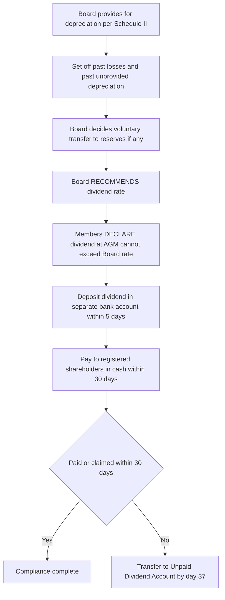
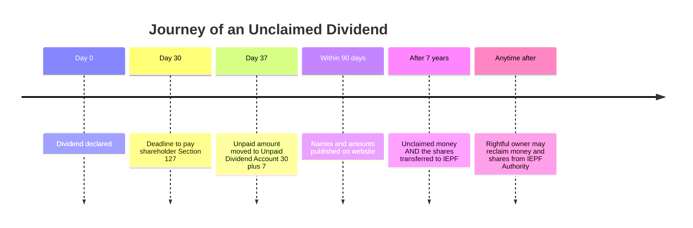
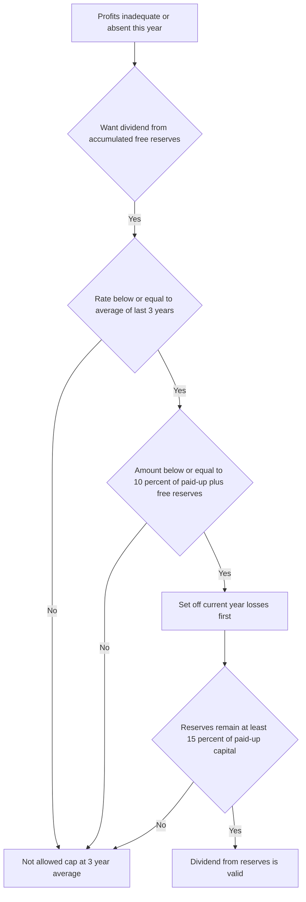
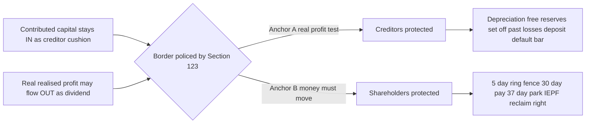
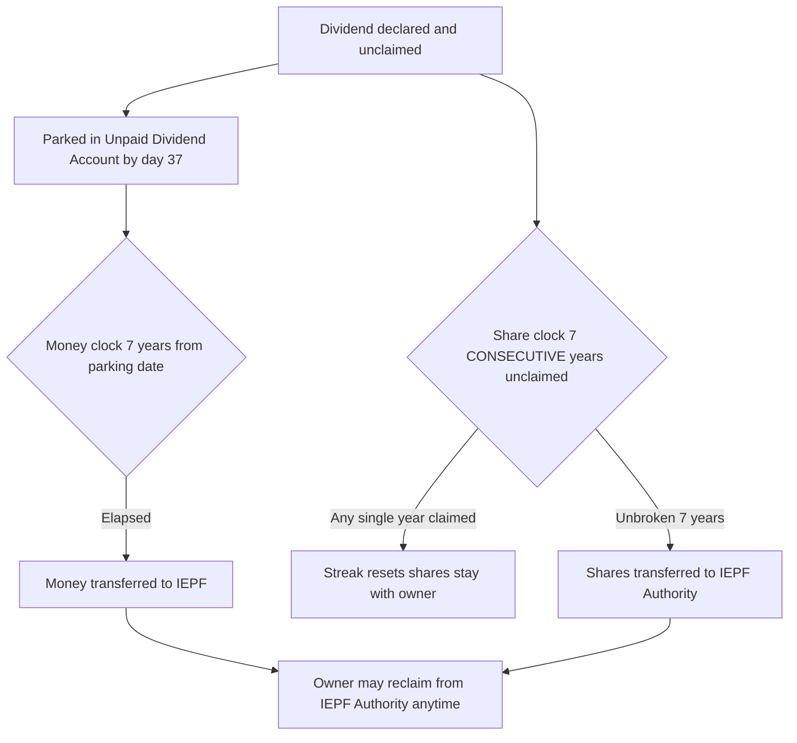

<!-- v2-deep -->

# Chapter 08 — Declaration & Payment of Dividend

## 1. The Problem — the "eating the seed corn" con

Imagine a company as a walled garden. Inside the walls live two very different groups who both want money out of it.

- **Shareholders** are the owners. They put in capital hoping the garden throws off fruit (profit). They want that fruit handed to them — the fruit is called **dividend**.
- **Creditors** — banks, debenture-holders, trade suppliers, workers owed wages — lent the company money or goods. They do **not** share in profit. Their deal is simpler and older: "You owe me a fixed sum. Pay me back." They are protected by a promise called **limited liability's flip side**: the shareholders can lose only what they put in, so in exchange, the capital the shareholders put in must stay *inside the walls* as a cushion for creditors. This is the **doctrine of capital maintenance** — the single most important idea in this entire chapter.

Now the abuse. Suppose a company had a bad year — it actually *lost* money. But the directors (who are usually the big shareholders) want cash out. So they simply pay themselves a fat dividend anyway, funded not from profit but by **digging into the capital cushion** — selling assets, dipping into share capital, or paying out of borrowed money. The garden's protective wall is quietly dismantled brick by brick and handed to the owners. When creditors later come knocking, the cupboard is bare.

This is the corporate equivalent of a farmer **eating the seed corn** — consuming the very thing that was supposed to guarantee next year's crop and everyone's debts. Or think of it as a shopkeeper paying himself a "salary" out of the till that holds his suppliers' unpaid bills.

Three specific frauds the law had to stop:

1. **Dividend out of capital** — paying owners from the creditor cushion, leaving debts unbacked.
2. **Dividend out of unreal / paper profits** — showing profit only because depreciation was skipped or a one-time asset revaluation was booked, then paying real cash against that fake profit.
3. **Dividend declared but never actually paid** — the company announces a dividend (pumping up its share price and reputation), shareholders relax, but the money is never sent, or small unclaimed amounts sit in the company's account **forever**, quietly financing the company for free.

Chapter VIII of the Companies Act, 2013 (**Sections 123 to 127**) exists to defeat exactly these three abuses. Read every rule below as an answer to "which of these three cons is this stopping?"

**Why the historical judges got here first.** Long before the 2013 Act, English courts had already fought this war. In *Flitcroft's Case (1882)* directors who paid dividends out of capital were held **personally liable to refund** the money — because they had breached the trust that capital is a fund for creditors. In *Verner v. General & Commercial Investment Trust (1894)* the court accepted that a *revenue* (trading) loss need not always block a dividend if the paid-up capital is otherwise intact, but a **loss of fixed capital** is a different matter. The Indian statute simply **codifies and tightens** this common-law instinct into hard, testable rules. Knowing the case-law origin helps you answer "why" questions the examiner slips in: the rules are not arbitrary bureaucracy — they are a two-century-old anti-fraud reflex written down.

**A fourth, subtler abuse worth naming.** Beyond the three headline cons, the Act also guards against **discrimination between shareholders of the same class** and against **paying the wrong person** when ownership is mid-transfer (Section 126). Dividend must go to whoever is the *registered* holder on the record date, in proportion to paid-up value (Section 51), and the company cannot cherry-pick who gets paid within a class. Keep this in your back pocket for scenario questions where shares change hands around the record date.

---

## 2. The Core Idea — dividend is a *reward from real profit*, never a *withdrawal of the cushion*

Strip everything down and the law says one sentence:

> **Dividend may be paid ONLY out of profits that are genuinely earned and genuinely realised — never out of the capital that protects creditors.**

Everything else — the depreciation rule, the transfer-to-reserves rule, the rule about past reserves, the deposit-in-a-separate-account rule — is just plumbing that *guarantees* the profit is real and *guarantees* the money actually reaches the shareholder.

Two mental anchors carry the whole chapter:

- **Anchor A — "Real profit test."** Before a rupee leaves as dividend, the company must prove the profit is real: depreciation charged, past losses absorbed, no paper gains counted.
- **Anchor B — "Money must actually move."** Once declared, dividend becomes a **debt the company owes**. The law then chases that money — into the shareholder's hand within 30 days, and if unclaimed, eventually into a public fund (IEPF) rather than letting the company keep it.

Anchor A protects **creditors** (don't touch the cushion). Anchor B protects **shareholders** (you were promised it, you will get it). Hold those two and you can reconstruct almost every section.

**A third anchor hides between them — "Declaration is a switch, not a promise."** The single most conceptually loaded fact in the chapter is the *moment* a dividend legally crystallises. Before declaration, a dividend is merely a *hope*; shareholders have **no enforceable right** to it, and the Board's recommendation can be withdrawn. The instant it is **declared** (by members for a final dividend, by the Board for an interim), it flips into an **enforceable debt** owed by the company (*Bacha F. Guzdar v. CIT* recognises dividend as the shareholder's own income once it accrues). This one-way switch explains three otherwise-puzzling rules at once:

- **A declared final dividend cannot be revoked** — you cannot cancel a debt already owed. (An *interim* dividend, being a Board act, is on a slightly different footing — see 4.5 — but once actually declared and set apart, it too is generally treated as a debt.)
- **The 30-day payment clock and the separate-account rule** exist *because* a debt now exists and the creditor-shareholder must be paid.
- **Interest penalties** (12%/18%) make sense only against a *debt* — you don't pay interest on a mere intention.

Memorise the switch: **recommendation = reversible hope; declaration = irreversible debt.** Half the tricky MCQs turn on which side of the switch the facts sit.

---

## 3. Why It's Built This Way — the logic of capital protection

Why not just let companies pay whatever dividend they like? Because of the grand bargain of **limited liability**.

A shareholder in a limited company can never be forced to pay the company's debts beyond their shareholding. That is a huge gift — it makes investing safe and makes capitalism possible. But it creates a moral hazard: if owners can't be chased personally, what stops them from stripping the company of cash the moment trouble looms and leaving creditors with an empty shell?

The law's answer is a trade: **"You get limited liability, but in return, the capital you contribute is locked in as a permanent guarantee fund for creditors. You may take out the *profit* the business earns on top of that capital — but you may never take out the capital itself."**

That is the **capital maintenance doctrine**, and dividend law is its front line. This is also why:

- **Depreciation is compulsory before dividend** — because if you don't recognise that your machines are wearing out, your "profit" is fake; you'd be distributing the value of the wasting asset (a slice of capital) disguised as profit.
- **A dividend once declared can't be revoked** — because it becomes a debt owed to shareholders, and you can't just cancel debts.
- **Unclaimed dividend can't be kept** — because if the company keeps money it owes, it's effectively getting an interest-free loan from forgetful investors, and over decades that money would silently vanish into the company. The IEPF forces it into public custody.

Understand it as: **profit flows OUT (reward), capital stays IN (guarantee).** The border between "out" and "in" is policed by Section 123.

**Why the border is drawn at *realised* profit, not just *positive* profit.** A deeper first-principle: creditors are paid in **cash**, not in accounting entries. A revaluation surplus, a mark-to-market gain, or an unrealised foreign-exchange gain can make the profit-and-loss account look healthy while **not a single rupee of spendable cash** has entered the business. If the law allowed dividends against such gains, the company would have to **borrow or sell assets** to fund the cash payout — which is exactly "paying dividend out of capital" wearing a disguise. So the border is placed one notch stricter than "profit exists": it demands profit that is **both earned and realised in cash form**. This is why Section 2(43) surgically excludes notional, unrealised and revaluation gains from "free reserves." Hold this and you never fall for the "but the balance sheet shows a surplus!" trap.

**Why creditors outrank owners in the queue — the residual-claimant logic.** Shareholders are, by design, the **residual claimants**: they get what is *left over* after everyone else is paid. That is the flip side of the *upside* they enjoy (unlimited profit potential) — they must sit *last* in the payout queue. Every dividend rule that says "pay the creditor first" (S.123(6) deposit-defaulters; the depreciation and past-loss set-off gates; the reserve floor in Rule 3) is just this queue being enforced. Owners eat only after the business's obligations are covered — never before.

---

## 4. Full Technical Content — section by section, each with its "why"

Chapter VIII, Companies Act 2013 = **Sections 123–127**, supported by the **Companies (Declaration and Payment of Dividend) Rules, 2014** and the **IEPF Authority (Accounting, Audit, Transfer and Refund) Rules, 2016**.

First, a vocabulary fix, because the exam loves it:

- **Dividend** is *not defined* precisely in the Act except in **Section 2(35)**: *"dividend includes any interim dividend."* That inclusion exists to slam shut a loophole — see interim dividend below. Beyond that, dividend means a **shareholder's share of distributed profit**, in proportion to the amount paid-up on their shares (Section 51 allows dividend on paid-up basis).
- **Final dividend** — recommended by the Board, **declared by members** at the AGM.
- **Interim dividend** — declared by the **Board alone** between two AGMs.

**Two further definitional distinctions the examiner exploits:**

- **"Declared" vs "Paid."** These are separate legal events with separate consequences. *Declaration* creates the debt (and starts the 30-day clock and the reserve/depreciation gates must already be satisfied). *Payment* is the discharge of that debt (posting the warrant / crediting the bank). A dividend can be validly *declared* yet unlawfully *unpaid* — that is precisely the Section 127 offence. Never treat the two words as synonyms in an answer.
- **Dividend on the *paid-up* amount, not the *face* amount (Section 51).** If a shareholder has a ₹10 face-value share on which only ₹6 is paid up, dividend accrues on ₹6, not ₹10 — unless the articles authorise otherwise and calls are uniform. This lets the examiner set a numerical trap where partly-paid shares are lurking in the share capital. Always check the *paid-up* figure, not the nominal one.

### 4.1 Section 123(1) — the sources of dividend (the "Real Profit" gate)

**The abuse it kills:** paying dividend out of capital or out of fake profit.

Dividend (for any financial year) may be **declared or paid ONLY out of** one or more of these three sources:

| # | Permitted source | The condition attached | Why the condition exists |
|---|---|---|---|
| (a) | **Profits of the company for the current year**, arrived at **after providing for depreciation** per Section 123(2) | Depreciation must be charged as per Schedule II | Un-depreciated "profit" is partly the melting value of assets = capital in disguise |
| (b) | **Profits of any previous financial year(s)** left undistributed, again **after providing for depreciation** for those years | Same depreciation discipline for past years | Stops reviving old paper profits |
| (c) | **Money provided by Central or State Government** for payment of dividend under a guarantee | Only where such a guarantee exists | Narrow, government-backed exception |

**Critical rule embedded here — free reserves only.** The first proviso to Section 123(1) says a company **cannot declare dividend unless carried-over previous losses AND depreciation not provided in previous years are first set off against the current year's profit.** You must heal the past before you feast in the present. (This defeats the trick of ignoring accumulated losses to show a distributable profit.)

**Free reserves definition — Section 2(43):** reserves available for distribution as dividend *as per the latest audited balance sheet*, **but EXCLUDING**:
- any **unrealised gains, notional gains or revaluation of assets** (a revaluation surplus is a paper gain — the asset hasn't been sold, so no real cash exists), and
- any **change in carrying amount** of an asset or liability on measurement at fair value.

**Memory hook:** "Free" means **free of fantasy** — no revaluation, no notional, no fair-value pumping. Only cash-real reserves.

**Finer distinctions the exam tests on sources:**

- **Capital profits are distributable only under strict conditions.** A profit on sale of a fixed asset or a capital reserve is *generally not* distributable as dividend, because it is not a trading profit. The classical view (*Lubbock v. British Bank of South America*) permits distribution of a **realised** capital profit only if (i) the articles permit, (ii) it is a *realised* (cash) profit, and (iii) a proper revaluation of **all** assets still leaves a surplus. In practice for CA Inter, treat capital reserves as **non-distributable** unless the facts expressly satisfy these conditions.
- **Securities premium and Capital Redemption Reserve are NOT free reserves.** They are "reserves" but are ring-fenced by statute (S.52, S.55) for specific uses (issuing bonus shares, writing off preliminary expenses, buy-back, etc.) and can **never** be paid out as dividend. A favourite trap is to bundle a large securities premium into "reserves available for dividend" — it is not.
- **Debit balance of P&L (accumulated losses) reduces the pool.** Before any figure is called "distributable," accumulated losses and unprovided depreciation are netted off (first proviso). The examiner may give you a fat reserves figure alongside a big carried-forward loss and expect you to net them.
- **What "profits for the year" means net of tax.** Distributable profit is the profit *after* providing for depreciation **and** for tax; you cannot distribute a pre-tax figure. This is rarely stated but occasionally tested numerically.

### 4.2 Section 123(2) — Depreciation is compulsory

**The abuse it kills:** dividend out of profit that only *looks* like profit because the wearing-out of assets was ignored.

Depreciation must be provided in accordance with **Schedule II** (which prescribes useful lives of assets, replacing the old rate-based Schedule XIV). No skipping depreciation to inflate distributable profit.

**Why:** A factory machine worth ₹100 that will be worthless in 10 years costs the business ₹10 of value every year. If you don't book that ₹10, your profit is overstated by ₹10, and paying it out hands shareholders a piece of the machine (capital), not earnings.

**Deeper points on depreciation the examiner probes:**

- **Both current-year AND arrears of depreciation.** It is not enough to charge this year's depreciation; the first proviso to S.123(1) requires that depreciation **not provided in earlier years** must *also* be made good before distributing current profit. Two years of skipped depreciation cannot be quietly forgotten.
- **Schedule II is useful-life-based, not rate-based.** Under the old Schedule XIV you looked up a *rate*; under Schedule II you are given a *useful life* and must derive the charge (SLM or WDV). If a company adopts a **different useful life** than Schedule II indicates, it must **disclose and justify** it via technical advice — it cannot use this as a backdoor to under-depreciate and inflate distributable profit.
- **Depreciation is compulsory even in a bumper-profit year.** Some students think depreciation only matters when profits are thin. Wrong — it is an *always-on* gate (see Trap 12). The size of profit is irrelevant to the *duty* to depreciate.

### 4.3 Section 123(1) second proviso — Transfer to reserves is now VOLUNTARY

**The old regime vs new — a favourite exam trap.**

Under the Companies Act **1956**, transferring a slice of profit to reserves before dividend was **compulsory** (graded rates up to 10% depending on the dividend rate).

Under the **2013 Act, Section 123(1), it is entirely voluntary** — a company *may*, before declaring dividend, transfer **such percentage of its profits as it considers appropriate** to the reserves. There is **no minimum** and **no maximum** compulsory transfer.

**Why the change:** Parliament decided the earlier straitjacket was paternalistic; boards should decide retention policy. The creditor cushion is now protected by the *depreciation + free-reserves + no-capital* rules rather than a forced reserve transfer.

**Trap:** If a question says "the company must transfer X% to reserves before dividend," that is **1956-law and WRONG under the 2013 Act.**

**Nuance — voluntary for the *general* case, but Rule 3 imposes a *conditional* floor.** Do not overstate the freedom. It is true that no *pre-dividend* transfer is mandatory when you are paying out of the **current year's** profits. But the moment you dip into **past accumulated reserves in a lean year** (Rule 3, para 4.4), a **15% reserve floor** kicks in as a *post-withdrawal* constraint. So the honest statement is: "Transfer *to* reserves is voluntary; but *withdrawal from* reserves is capped, leaving a mandatory 15% floor." Examiners love catching students who over-generalise "reserves are entirely voluntary now."

### 4.4 Section 123(1) third proviso + Rule 3 — Dividend out of PAST (accumulated) reserves in a loss/low-profit year

**The abuse it kills:** a company has a bad year (inadequate or nil profit) but wants to keep up appearances and still pay a dividend by raiding accumulated reserves recklessly — potentially draining the cushion.

The law permits it **but only within strict limits**, set out in the **Companies (Declaration and Payment of Dividend) Rules, 2014, Rule 3.** In case of **inadequacy or absence of profits** in a year, a company may declare dividend out of **accumulated profits transferred to free reserves in previous years**, subject to **all four** of these caps:

| Cap | The rule | Purpose of the cap |
|---|---|---|
| **1. Rate cap** | Rate of dividend ≤ **average of the rates** at which dividend was declared in the **immediately preceding THREE years** | You can't suddenly pay a lavish dividend from reserves — pay only your normal historical rate |
| **2. Amount cap** | Total amount drawn from accumulated profits ≤ **1/10th (10%) of the sum of paid-up share capital + free reserves** as per the latest audited financial statement | Limits the total bite taken out of the cushion in any one bad year |
| **3. Set-off first** | The amount so drawn shall **first be used to set off losses** incurred in the financial year in which dividend is declared | Don't pay dividend while the current year is bleeding — plug the hole first |
| **4. Balance floor** | After such withdrawal, the **balance of reserves shall not fall below 15%** of its paid-up share capital as per the latest audited financial statement | A permanent minimum reserve floor — the cushion can be dented but never destroyed |

**Special relief note:** The **rate cap (Cap 1)** does **not apply** to a company that has **not declared any dividend in each of the three preceding financial years** (a first-timer or a long-dry company isn't punished by having a "zero average").

**Memory hook — "3-10-plug-15":**
- **3** years' average rate,
- **10%** max amount,
- **plug** current losses first,
- **15%** reserve floor remains.

**Reading each cap at first principles (why four, not one):** The four caps attack the raid from four different angles, and each is a separate safety catch:
- The **rate cap** stops the *per-share generosity* running wild — you keep to your *habitual* dividend, not a lean-year bonanza.
- The **amount cap** limits the *absolute rupees* leaving the cushion in a single bad year — independent of rate, so even a low rate on a huge capital base is bounded.
- The **set-off** ensures you *cannot bleed and feast simultaneously* — losses of the year are healed before any distribution.
- The **floor** guarantees a *permanent minimum core* of reserves survives — the cushion can be dented, never emptied.
Because they operate on different variables (rate, amount, current loss, residual balance), **all four must be satisfied simultaneously** — passing three and failing one still kills the dividend. Numerical questions almost always plant exactly one binding constraint; your job is to find which one bites.

**Edge cases and examiner tweaks on Rule 3:**

- **"Free reserves" for the 10% and 15% tests excludes revaluation.** The base for both the amount cap and the floor uses *free reserves* per S.2(43) — so if the balance sheet reserves include a revaluation surplus, **strip it out first**. A classic tweak: the sum given includes a "General reserve" (counts) plus a "Revaluation reserve" (does *not* count).
- **Only reserves built from *profits* qualify** as the source. You can draw from accumulated **free reserves** (e.g. General Reserve, surplus in P&L) — not from Capital Redemption Reserve, Securities Premium, or Revaluation Reserve.
- **"Inadequacy or absence of profits" is the trigger.** If current profits are *adequate*, Rule 3 does not apply at all and you simply pay from current profit under S.123(1) with no rate/amount caps. The examiner may hide an adequate profit and see if you needlessly apply the caps.
- **The floor is measured on the *latest audited* balance sheet's paid-up capital**, not a mid-year figure. If a fresh issue of shares happened after year-end, use the audited figure unless facts say otherwise (flag if ambiguous).
- **Rate for the 3-year average uses years in which dividend was *declared*.** If in one of the three years no dividend was declared, that year counts as **0%** in the average — *unless* the "no dividend in all three years" relief applies (then the rate cap simply drops away).

### 4.5 Section 123(3) — Interim dividend

**The abuse Section 2(35) + 123(3) kill:** the "interim" escape hatch. Historically directors argued that an *interim* dividend (declared mid-year by the Board without waiting for the AGM) wasn't a "real" dividend, so the safeguards didn't apply — letting them push cash out mid-year without the full-profit discipline. Section 2(35) — *"dividend includes any interim dividend"* — plugs this: **every rule about real profits applies to interim dividend too.**

Rules for interim dividend under **Section 123(3):**

- The **Board of Directors** may declare interim dividend during any financial year **or at any time between the closure of a financial year and the AGM**, out of:
  - the **surplus in the profit & loss account**, **and/or**
  - **profits of the financial year for which such interim dividend is sought to be declared**, and/or
  - **profits generated up to the quarter** preceding the date of declaration.
- **Loss-protection brake:** If the company has **incurred a loss during the current financial year up to the end of the quarter immediately preceding the date of declaration** of interim dividend, then the interim dividend **shall NOT be declared at a rate higher than the average dividend declared during the immediately preceding THREE financial years.**

**Why the brake:** an interim dividend is declared *before* the year's final results are known — it's a bet on profits that may not materialise. If the company is *already* in the red for the year so far, the law caps the rate to the historical average so directors can't gamble the cushion on optimism.

**Key contrasts (exam gold):**
- Final dividend → **recommended by Board, DECLARED by members** at AGM (members can reduce but **not increase** the Board's recommended rate).
- Interim dividend → **declared by the Board**, no member approval needed.
- Both, once declared, become a debt and follow the payment rules below.

**Sharper interim-dividend distinctions:**

- **Interim can be paid out of the *current* year's surplus P&L, but NOT out of past reserves under the ordinary Rule 3 raid.** The source list in S.123(3) is: surplus in P&L brought forward + current-year profit + profit up to the preceding quarter. The general practice is that an interim dividend is **not** funded by a Rule-3-style reserve raid; the profit must be genuinely available at the interim stage.
- **The loss-brake looks at the year "up to the end of the preceding quarter," not the whole year.** So a company loss-making in Q1–Q2 but declaring interim in Q3 is judged on the **cumulative loss up to end of Q2**. If cumulatively profitable up to that point, the brake does not bite even if one interim quarter was weak.
- **Board's discretion is real but not unlimited.** The Board *may* declare interim dividend — it is a power, not a duty — and it can also *rescind* an interim dividend **before it is actually paid/parted with**, because unlike a members-declared final dividend, an unpaid interim declaration is generally treated as revocable by the Board that made it. Once the money is set apart in the separate account and becomes payable, though, treat it as a debt. (If asked, note the final vs interim revocability distinction — it is a subtle but examinable point.)
- **Same depreciation and free-reserve discipline applies** — because S.2(35) folds interim into "dividend," every S.123(1)/(2) gate applies mutatis mutandis.

### 4.6 Section 123(4) — Deposit into a separate bank account

**The abuse it kills:** "declared but not paid." A company announces a dividend (great for its image and share price) but keeps the cash mingled in its working accounts and drips it out — or never pays.

**Rule:** The amount of dividend (including interim) **must be deposited in a SEPARATE bank account within 5 days** of declaration. This ring-fences the money so it can't be used for anything else. It is *earmarked* the moment it's declared.

**Why 5 days and why a *scheduled bank*:** the short 5-day window denies the company any meaningful chance to *use* the money for operations, and the separate account creates a **traceable, ring-fenced pool** so that if the company later fails, the dividend money is identifiable and not swept into the general estate for creditors. Note this is a *scheduled bank* account — the same custodial logic as the later Unpaid Dividend Account. A common tweak: the 5 days runs from **declaration**, not from the AGM notice or the record date.

### 4.7 Section 123(5) — How and to whom dividend is paid

- Dividend is payable **only to the registered shareholder**, or to their order, or to their banker.
- Dividend must be paid in **cash** — **NOT in kind**. ("Cash" includes cheque, warrant, or **electronic mode**.)
  - **Why no dividend in kind:** to stop companies fobbing off shareholders with unsaleable inventory or inflated-value assets instead of real money. *(Exception you should note: the prohibition on payment in kind does not bar the capitalisation of profits/reserves through a bonus issue, or buy-back, or a scheme of arrangement where shares of another company are distributed — those are governed by separate sections. Confirm nuance in ICAI material.)*

**Finer "to whom" distinctions:**

- **Registered holder on the record date wins.** Even if a shareholder has *sold* the shares but the transfer is not yet registered, the company pays the **registered** holder (subject to S.126 abeyance where a transfer is lodged). Beneficial ownership does not entitle you to be paid by the company until you are on the register.
- **"Or to his order, or to his banker."** The company can lawfully route payment as the registered holder directs (e.g. to a nominated bank). This is why one of the S.127 exceptions covers "shareholder gave directions that could not be complied with."
- **Cash includes electronic mode** — NEFT/RTGS/ECS is fully compliant; indeed for listed companies electronic credit is the norm. Do not mark electronic payment as "non-cash."

### 4.8 Section 123(6) — Defaulters cannot declare dividend

A company which **fails to comply with Sections 73 and 74** (acceptance and repayment of **deposits**) shall **not, so long as such failure continues, declare any dividend** on its equity shares.

**Why:** You cannot reward owners while you are defaulting on repaying depositors (a class of creditor). Creditors before owners — the capital-protection hierarchy in action.

**Precision points:** the bar operates *only while the failure continues* — once the S.73/74 default is cured, the company may resume declaring dividend. The bar is on **equity** dividend as worded; and it applies to *declaration* (the switch), so a company under a subsisting deposit default cannot even take the first step. This is the cleanest illustration in the chapter of the residual-claimant queue: **depositor-creditors are paid before owner-shareholders, full stop.**

### 4.9 Section 124 — Unpaid / Unclaimed Dividend and the journey to the IEPF

**The abuse it kills:** small dividends left unclaimed by forgetful or untraceable shareholders sitting in the company's account **indefinitely**, effectively becoming a free perpetual loan to the company — and eventually being absorbed by it.

Here is the full lifecycle (this is heavily examined — learn the timeline):

1. **If dividend is not paid or claimed within 30 days** of declaration (i.e. it's now "unpaid/unclaimed"), the company must, **within 7 days** after those 30 days expire (**i.e. by day 37**), transfer the total unpaid/unclaimed amount to a special account called the **"Unpaid Dividend Account"** opened in a scheduled bank. *(30 + 7 = 37 days total.)*
2. **Penalty for delay:** if the company defaults in transferring, it must pay **interest @ 12% p.a.** on the amount not transferred, from the date of default — and the interest accrues to the benefit of the members in proportion.
3. **Transparency:** within **90 days** of transferring to the Unpaid Dividend Account, the company must place a **statement of names, last-known addresses and unpaid amounts on its website** (and the IEPF website), so rightful owners can find their money.
4. **The 7-year rule → IEPF:** Any money in the Unpaid Dividend Account that **remains unpaid/unclaimed for 7 years** from the date it was first transferred to that account **must be transferred to the Investor Education and Protection Fund (IEPF)** established under Section 125. Interest accrued is also transferred.
5. **Shares follow the dividend — the sting in the tail:** Under **Section 124(6)**, **all shares in respect of which dividend has not been paid or claimed for 7 consecutive years** shall **also be transferred to the IEPF** (in the name of the IEPF Authority). *This is the big trap — not just the money, the actual shares move.* The shareholder isn't wiped out permanently — they can **claim both the shares and the dividends back** from the IEPF Authority by following the refund procedure.

**Penalty (Section 124(7)):** If a company fails to comply with Section 124, the **company is punishable with a fine** and **every officer in default** likewise (learn the range from the current bare Act — historically ₹5 lakh–₹25 lakh for the company and ₹1 lakh–₹5 lakh for officers; *confirm exact current figures in ICAI material / bare Act as fine amounts have been amended*).

**Two heavily-tested subtleties on the "7 consecutive years" share transfer:**

- **"Consecutive" is the operative word — one claim resets the clock.** If the shareholder claims *even one* year's dividend during the seven-year run, the shares are **not** transferred, because the seven years must be *unbroken*. A classic tweak: shareholder ignored dividends for six years, claimed in year five, then went silent — the count restarts, so no share transfer yet.
- **The money clock and the share clock are measured differently.** The *money* goes to IEPF 7 years after it was **transferred to the Unpaid Dividend Account** (i.e. roughly 7 years + 37 days from declaration). The *shares* go to IEPF after **7 consecutive years** in which dividend was unpaid/unclaimed. Keep the two "sevens" mentally separate.
- **The transfer of shares is *without prejudice* to the owner's reclaim right** — see S.125. And if the shares are transferred, any subsequent benefits (bonus, splits, further dividends) also flow to the IEPF and are reclaimable together.

### 4.10 Section 125 — The Investor Education and Protection Fund (IEPF)

**The purpose:** rather than let abandoned investor money enrich the company, pool it into a public fund used to **educate and protect investors** and to **refund rightful claimants**.

**What gets credited to the IEPF (Section 125(2)) — learn the main heads:**
- amounts in **Unpaid Dividend Accounts** unclaimed for 7 years;
- **application money** received for securities and due for refund, unclaimed for 7 years;
- **matured deposits** and **matured debentures** with companies, unclaimed for 7 years;
- **interest** accrued on all the above;
- **sale proceeds of fractional shares** on bonus/merger, and **redemption of preference shares** amounts, unclaimed for 7 years;
- grants and donations by Central Govt, State Govts, companies or other institutions;
- **interest/income earned** on investments of the Fund.

**Administered by:** the **IEPF Authority** (Section 125(5)/(6)), a statutory body under the Central Government.

**Use of the Fund (Section 125(3)):** refund of unclaimed dividends/deposits/debentures/application money **to rightful claimants**; promotion of **investor education, awareness and protection**; distribution of disgorged amounts to eligible/identifiable victims; reimbursement of legal expenses in class actions, etc.

**The refund right (Section 125(3)(a)):** the rightful owner is **never permanently deprived** — they may apply to the IEPF Authority and **reclaim** the transferred amount and/or shares. This is the humane counterweight: the company can't keep the money, but the investor can always get it back.

**Distinctions the exam plants around the IEPF:**

- **Not everything credited is dividend.** The Fund is a *catch-all* for abandoned investor money — matured deposits, matured debentures, refundable application money, redemption amounts, sale proceeds of fractional shares. A trap MCQ lists these and asks "which does NOT go to IEPF after 7 years?" — the answer is usually something like *current* (un-matured) deposits or *general reserves*, which are not abandoned investor entitlements.
- **The refund is claimed from the IEPF *Authority*, not the company.** After transfer, the company is *functus officio* on that money/shares — the claimant must apply to the Authority (Form IEPF-5 in practice). Answering "claim it back from the company" is wrong once transfer has happened.
- **IEPF is distinct from general revenue.** Money in the IEPF does **not** become government tax revenue; it is held for investor benefit and refunds. This distinguishes India's regime from a simple "escheat to the state."

### 4.11 Section 126 — Right to dividend, rights shares and bonus shares kept in abeyance

**The abuse it kills:** uncertainty over who owns dividend/rights/bonus when shares are **caught mid-transfer** (transfer deed lodged but not yet registered).

**Rule:** Where a transfer of shares has been lodged but not yet registered, the company must:
- **transfer the dividend to the Unpaid Dividend Account** (unless the registered holder authorises paying it to the transferee), and
- **keep in abeyance** (hold) any **rights shares** offer and any **bonus shares** in relation to those shares, until the transfer is registered.

**Why:** prevents dividend/benefits being paid to the "wrong" person while ownership is legally in limbo.

**Sharper reading:** note the asymmetry — the **dividend (cash)** is *parked* in the Unpaid Dividend Account (so it is safe and can go to whoever is finally registered), whereas the **rights and bonus entitlements** are *held in abeyance* (not issued to anyone) until registration. Cash is safest parked; share entitlements are safest frozen. The one escape valve is that the **registered holder can authorise** the company to pay the dividend to the *transferee* — respecting the parties' own arrangement. Section 126 is the practical companion to S.123(5)'s "pay the registered holder" rule: it tells you what to do when the register itself is mid-update.

### 4.12 Section 127 — Punishment for failure to pay declared dividend

**The abuse it kills:** the ultimate "declared but not paid" — the company announces a dividend, creating a legal debt, then simply doesn't pay it within the deadline.

**Rule:** Where a dividend has been **declared but not paid or the warrant not posted within 30 days** from declaration:
- **Every director** who is knowingly a party to the default is **punishable with imprisonment up to 2 years AND fine of not less than ₹1,000 for every day the default continues**; and
- the **company is liable to pay simple interest @ 18% p.a.** during the period the default continues.

**Note the escalation:** 18% here vs 12% under Section 124 — Section 127 punishes *not paying the shareholder at all* (worse) more harshly than *not transferring unclaimed money to the special account* (Section 124).

**Five exceptions — when NON-payment within 30 days is NOT an offence (learn these; classic exam):**
1. Dividend **could not be paid due to operation of law** (e.g. a court order restrains payment);
2. A shareholder **gave directions** about payment that couldn't be complied with, and this was communicated to them;
3. There is a **dispute over the right to receive** the dividend;
4. The dividend was **lawfully adjusted** by the company against a sum **due from the shareholder** (a set-off);
5. The **non-payment was not due to any default of the company** (e.g. shareholder's address unknown / instrument returned undelivered).

**Why exceptions exist:** the crime is *wrongful* withholding. If the company did nothing wrong — it was ready and willing to pay but the law, a dispute, or the shareholder blocked it — there's no culpability.

**Precision the examiner rewards on S.127:**

- **The offence attaches to "every director who is a party to the default," not automatically all directors.** A director who genuinely had no knowledge of and was not party to the default may escape. This mirrors the general "officer in default" logic — so a nominee/independent director not involved may not be jailed.
- **"Paid" includes posting the warrant.** The duty is discharged when the company *dispatches* the instrument within 30 days, even if it reaches late through no fault of the company (dovetails with exception 5).
- **The five exceptions are the crux of most 6-mark questions.** The most common scenario tests exception 4 (lawful set-off — the shareholder owes the company a call in arrears, so the company adjusts the dividend against it) or exception 5 (returned-undelivered warrant / unknown address). If the facts fit an exception, there is *no* offence and *no* 18% interest — say so explicitly.
- **18% is the company's civil liability; jail + ₹1,000/day is the director's criminal liability.** Keep the two consequences separate in your answer — they run in parallel, on different persons.

---

## 5. Applied Scenarios — facts → analysis → conclusion

### Scenario 1 — The revaluation dividend

**Facts:** Zenith Ltd earned an operating profit of ₹40 lakh this year but wants to declare a dividend of ₹1.2 crore. Its accountant points out that the company revalued its head-office building upward this year, creating a **revaluation surplus of ₹1 crore**, and proposes treating that surplus as a "free reserve" available for dividend.

**Analysis:** Section 123(1) permits dividend only out of profits (current/past, after depreciation) or free reserves. **Free reserves are defined in Section 2(43) to specifically EXCLUDE any surplus arising from revaluation of assets** — it is an *unrealised/notional* gain; the building hasn't been sold, so there is no real cash behind it. Distributing against it would be paying dividend out of a paper profit, i.e. effectively out of capital.

**Conclusion:** The ₹1 crore revaluation surplus is **not distributable**. Zenith can pay dividend only from its ₹40 lakh real profit (after depreciation) plus any genuine accumulated free reserves — subject, if it dips into reserves, to Rule 3 caps.

### Scenario 2 — The bad-year dividend from reserves

**Facts:** Orion Ltd has **paid-up capital ₹50 lakh** and **free reserves ₹80 lakh**. This year profits are negligible, but it wants to keep its dividend record intact. Its dividend rates in the last three years were **12%, 10% and 8%**. It proposes a **14%** dividend funded from accumulated reserves. It also has a current-year loss of ₹3 lakh.

**Analysis:** This is a dividend out of past reserves in a year of inadequate profit → **Rule 3** applies with its four caps.
- **Rate cap:** average of last 3 years = (12+10+8)/3 = **10%**. Proposed 14% **exceeds** the cap → not allowed; max rate is **10%**.
- **Amount cap:** max withdrawal = 10% of (paid-up capital + free reserves) = 10% of (₹50L + ₹80L) = **₹13 lakh**.
- **Set-off first:** the current-year loss of ₹3 lakh must be **set off** from the amount drawn before any distribution.
- **Reserve floor:** after withdrawal, reserves must stay ≥ 15% of paid-up capital = 15% of ₹50L = **₹7.5 lakh**; drawing up to ₹13L from ₹80L leaves ₹67L, comfortably above the floor.

**Conclusion:** Orion may declare dividend from reserves but **only at 10% (not 14%)**, capped at ₹13 lakh total drawdown, with the ₹3 lakh loss plugged first, and reserves left above ₹7.5 lakh. The 14% proposal is **invalid**.

### Scenario 2A — Same facts, but the floor bites (examiner tweak)

**Facts:** Same Orion Ltd, but rewrite the balance sheet: **paid-up capital ₹50 lakh**, **free reserves only ₹14 lakh** (the rest of what looked like reserves was a ₹66 lakh **revaluation reserve**, which does not count). Three-year dividend rates were 12%, 10%, 8%; it proposes 10% funded from reserves; no current-year loss.

**Analysis:** Work each cap and find the binding one.
- **Rate cap:** 3-year average = 10%. Proposed 10% is within the cap. ✔
- **Amount cap:** 10% of (₹50L + ₹14L *free* reserves) = 10% of ₹64L = **₹6.4 lakh**. (The ₹66L revaluation reserve is stripped out under S.2(43) — the classic tweak.)
- **Dividend needed for 10% on ₹50L capital** = **₹5 lakh**. That is within the ₹6.4L amount cap. ✔
- **Floor test:** minimum reserves to retain = 15% of ₹50L = **₹7.5 lakh**. But *free* reserves are only ₹14L. After drawing ₹5L, free reserves would fall to **₹9L** — still above ₹7.5L. ✔ *However*, had the dividend needed ₹7L, reserves would drop to ₹7L, **below the ₹7.5L floor → invalid.**

**Reconciliation / self-check:** Maximum drawable respecting *both* the amount cap (₹6.4L) and the floor (can reduce ₹14L down to ₹7.5L, i.e. draw ≤ ₹6.5L) = the *lower* of the two = **₹6.4 lakh**. A 10% dividend needs only ₹5L, so it is valid; but a 12%+ dividend (needing ≥ ₹6L, still under ₹6.4L amount cap yet check floor: ₹14L − ₹6L = ₹8L > ₹7.5L ✔) — so even 12% by *amount/floor* would pass, but it fails the **rate cap (max 10%)**. This shows how **different caps bind at different rates** — the rate cap is decisive here, exactly as intended.

**Conclusion:** Orion may pay up to 10% (rate cap) from free reserves; the revaluation reserve is invisible to all three numeric tests. **Lesson: always convert "reserves" to "free reserves" before touching Rule 3.**

### Scenario 3 — The forgotten dividend and the vanishing shares

**Facts:** In FY 2017-18, Vega Ltd declared a dividend of ₹5,000 to Mr. A, who never claimed it (wrong address on record). Every year since, his dividends went unclaimed too. It is now FY 2025-26. Vega's board says: "It's our money now, he never claimed it."

**Analysis:** Under **Section 124(1)**, unclaimed dividend had to be moved to the **Unpaid Dividend Account within 37 days** of each declaration. Under **Section 124(5)**, amounts unclaimed for **7 years** from that transfer must go to the **IEPF**. The FY2017-18 dividend crossed 7 years — it belongs in the IEPF now. Crucially, under **Section 124(6)**, because **dividends were unclaimed for 7 consecutive years, the SHARES themselves must be transferred to the IEPF Authority** — Vega cannot keep them either.

**Conclusion:** Vega's claim is wrong on both counts. The money goes to the IEPF, and Mr. A's **shares are transferred to the IEPF Authority**. However, Mr. A is not destroyed — under **Section 125(3)(a)** he may apply to the **IEPF Authority and reclaim both his shares and all the dividends**.

### Scenario 3A — The interrupted seven years (examiner tweak)

**Facts:** Same as Scenario 3, but this time Mr. A *did* claim his FY2021-22 dividend (he happened to update his address that one year), then went silent again. It is now FY 2025-26.

**Analysis:** The share transfer under S.124(6) requires **seven *consecutive* years** of unpaid/unclaimed dividend. Mr. A's claim in FY2021-22 **broke the streak**. The seven-year count restarts from the next unclaimed year. As of FY2025-26, no unbroken seven-year run exists, so his **shares are NOT transferred to the IEPF**. (Individual dividend *amounts* older than 7 years from their own transfer date may still individually reach the IEPF, but the *shares* stay with Mr. A.)

**Conclusion:** The single act of claiming one year's dividend **saved the shares**. This is the "consecutive" trap in action — a one-word difference flips the answer.

### Scenario 4 — The interim dividend gamble

**Facts:** Comet Ltd's board wants to declare an interim dividend at **20%** in December. But for the nine months to end-September (the quarter immediately preceding), the company has actually **made a loss**. Its dividend over the previous three years averaged **11%**.

**Analysis:** Under **Section 123(3)**, if a company has **incurred a loss in the current financial year up to the end of the quarter immediately preceding** the declaration of interim dividend, the interim dividend rate **cannot exceed the average of the last three years' rates**. Here the company is loss-making for the period, so the cap = **11%**.

**Conclusion:** Comet **cannot declare 20%**; the interim dividend is capped at **11%**. This brake stops directors from gambling the creditor cushion on the hope of a year-end turnaround.

### Scenario 4A — The set-off exception to non-payment (examiner tweak)

**Facts:** Sirius Ltd declares a final dividend of ₹8,000 to Mr. B. Mr. B holds partly-paid shares on which a **call of ₹5,000 is in arrears**. The company pays Mr. B only ₹3,000, adjusting ₹5,000 against his unpaid call. Mr. B complains to the ROC that the company failed to pay his full ₹8,000 dividend within 30 days and demands 18% interest and prosecution of directors under S.127.

**Analysis:** Section 127's **fourth exception** expressly protects a company that **lawfully adjusts a declared dividend against a sum due from the shareholder**. A call in arrears is exactly such a debt (and the articles, following Table F, generally permit this set-off). The company was *ready and willing* to satisfy the dividend; it simply applied part of it to Mr. B's own debt. There is therefore **no default**, **no 18% interest**, and **no director liability**.

**Conclusion:** The company acted lawfully. Mr. B is entitled only to the **₹3,000 net**; his complaint fails. *Lesson: whenever a shareholder owes the company money, check exception 4 before concluding non-payment is an offence.*

### Scenario 5 — Declared but unpaid

**Facts:** Nova Ltd declared a final dividend at the AGM on 1 August. By 15 September, warrants still haven't been posted to shareholders, and there's no legal impediment. A director claims "declaration is enough; payment can wait."

**Analysis:** Under **Section 127**, a declared dividend must be **paid / warrant posted within 30 days**. The deadline was 31 August; it's now overdue with no valid excuse (none of the five exceptions applies). Consequence: **every defaulting director** faces **imprisonment up to 2 years and fine ≥ ₹1,000/day** of continued default, and the **company pays interest @ 18% p.a.** for the default period.

**Conclusion:** The director is wrong. Declaration created a **debt**; non-payment within 30 days is a punishable offence.

### Scenario 6 — The deposit-defaulter who wants to reward owners

**Facts:** Polaris Ltd has ₹2 crore of matured public deposits it has **failed to repay** (a subsisting default under S.74). The company nonetheless had a good trading year and the Board wants to recommend a 15% equity dividend to keep shareholders happy. Is it allowed?

**Analysis:** **Section 123(6)** bars a company that has failed to comply with S.73/74 (deposits) from declaring **any dividend on its equity shares** *so long as the failure continues*. The good trading year is irrelevant — the gate is about the *creditor default*, not profitability. The residual-claimant queue forbids paying owners while depositor-creditors go unpaid.

**Reconciliation / self-check:** Would the answer change if Polaris first *repaid* the deposits? Yes — the bar operates "so long as such failure continues." Cure the default, and the company may then declare dividend (subject to all the S.123(1)/(2) real-profit gates). So the fix is: **repay depositors first, then reward owners.**

**Conclusion:** Polaris **cannot** declare the 15% dividend while the deposit default subsists. It must clear the deposit default first; only then does the dividend gate open.

### Scenario 7 — Members trying to raise the Board's rate

**Facts:** At Rigel Ltd's AGM, the Board recommended a final dividend of 10%. A group of members, buoyant about the results, moves to *increase* it to 14% and also proposes declaring an *extra* dividend on some reserves. The chairman is unsure.

**Analysis:** Members **declare** the final dividend but **cannot exceed** the rate recommended by the Board — they may only **accept or reduce** it. The rationale is that only the Board has visibility into the company's liquidity, commitments and the real-profit gates; letting a buoyant meeting vote itself a larger payout would reopen the very capital-raid risk the chapter guards against. Members therefore cannot vote 14%.

**Conclusion:** The maximum members can declare is **10%** (the Board's recommended rate); they may reduce it (say to 8%) but not raise it. The proposal to declare 14% is **out of order**.

---

## 6. Procedure / Compliance Summary

### Final dividend — the full flow

*Figure 1 — The life of a final dividend from real-profit gate to the unpaid-dividend fork.*

### The unpaid-dividend timeline to IEPF

*Figure 2 — Time-limits every examiner tests: 30, 37, 90 days and 7 years.*

### Dividend-out-of-reserves decision tree (Rule 3)

*Figure 3 — The 3-10-plug-15 gate for raiding past reserves in a lean year.*

### The two protected groups and the border they defend

*Figure 4 — One border, two anchors, two protected groups — the whole chapter on a page.*

### Which sevens are which — the two IEPF clocks

*Figure 5 — The money clock and the share clock run on different rules — do not merge them.*

### Compliance checklist

| Step | Requirement | Section / Rule | Time limit |
|---|---|---|---|
| Charge depreciation | Per Schedule II | 123(2) | Before declaring |
| Set off past losses / depreciation | Mandatory | 123(1) 1st proviso | Before declaring |
| Transfer to reserves | Voluntary, any % | 123(1) 2nd proviso | Optional |
| Dividend from past reserves | 3-10-plug-15 caps | Rule 3 | If profits inadequate |
| Deposit in separate account | Ring-fence the cash | 123(4) | Within 5 days |
| Pay shareholder (cash) | To registered holder | 123(5), 127 | Within 30 days |
| Transfer to Unpaid Dividend A/c | If unclaimed | 124(1) | Within 37 days |
| Publish unclaimed list on website | Transparency | 124(2) | Within 90 days |
| Transfer to IEPF (money + shares) | If 7 years unclaimed | 124(5), 124(6), 125 | After 7 years |

---

## 7. Connections — how this chapter wires into the rest of the Act

- **Capital maintenance family:** Dividend law (S.123) is one pillar; the others are **reduction of capital (S.66)**, **buy-back of securities (S.68)**, and the **prohibition on a company buying its own shares (S.67)**. All four police the same border: capital must not leak out to shareholders except through tightly controlled gates.
- **Deposits (S.73–74):** Section 123(6) directly links here — deposit-defaulters can't pay dividend. Creditors (depositors) outrank owners.
- **Accounts & audit (S.128–138):** "Profit" for dividend is measured from the audited financial statements; depreciation per **Schedule II**; free reserves per the **latest audited balance sheet**.
- **Bonus issue (S.63):** A bonus issue *capitalises* reserves into shares — the opposite of dividend (which distributes them as cash). Note free reserves used differently; and a bonus issue is the one lawful "dividend in kind"-adjacent route (shares, not cash), governed by its own section.
- **Preference shares (S.55):** Preference shareholders get dividend *before* equity, at a fixed rate — the "preference." Cumulative preference dividends in arrears must be cleared before equity gets anything. Section 123 sources still govern.
- **AGM (S.96) & Board powers (S.179):** Final dividend is a piece of **ordinary business at the AGM**; interim dividend is a **Board power** exercised via a board resolution.
- **Calls in arrears (Table F / S.49–50):** enables the S.127 exception-4 set-off — dividend adjusted against a shareholder's unpaid call (see Scenario 4A).
- **CSR (S.135):** "Net profit" definitions differ between dividend and CSR — don't confuse them.
- **Section 51 (dividend on paid-up basis):** dividend accrues on the *paid-up*, not face, value — the anchor for partly-paid-share numericals.

---

## 8. Traps & Examiner Tricks

1. **"Transfer to reserves is compulsory."** FALSE under the 2013 Act — it's **voluntary** (S.123(1)). The compulsory graded transfer was **1956 law**. Classic trap. *(But remember the Rule 3 15% floor is a conditional exception — see Trap 15.)*
2. **Members increasing the dividend at AGM.** Members can **declare** the dividend but **cannot exceed** the rate recommended by the Board. They may only **reduce** it.
3. **Revaluation surplus as "free reserve."** Never distributable — **S.2(43)** excludes revaluation / notional / unrealised gains. Also excludes fair-value re-measurement changes.
4. **The 37-day figure.** Unclaimed dividend → Unpaid Dividend Account is **30 + 7 = 37 days**, NOT 30 and NOT 7 alone.
5. **Only the money moves to IEPF? No — the SHARES move too** (S.124(6)) after 7 consecutive years of unclaimed dividend. Very frequently tested.
6. **"Money in IEPF is lost forever."** FALSE — the rightful owner can **always reclaim** money AND shares from the IEPF Authority (S.125(3)(a)).
7. **12% vs 18% interest.** S.124 default (failure to transfer to Unpaid Dividend A/c) = **12% p.a.**; S.127 (failure to pay declared dividend to shareholder) = **18% p.a.** Don't swap them.
8. **Dividend in kind.** Prohibited — dividend must be paid in **cash** (includes cheque/warrant/electronic). A company can't distribute goods as dividend.
9. **Interim dividend loss-brake.** If loss up to the preceding quarter, interim rate ≤ **3-year average**. Students forget this and let the Board declare any rate.
10. **Deposit-defaulter paying dividend.** S.123(6) bars it while default under S.73/74 continues.
11. **"Dividend must be paid within 30 days of the AGM."** Careful — it's 30 days **from declaration** (for final, declaration is at the AGM; for interim, from the Board's declaration).
12. **Depreciation optional if profits are huge?** Never — depreciation per Schedule II is **always** mandatory before dividend (S.123(2)).
13. **Set-off of past losses.** Must set off **carried-over losses AND unprovided past depreciation** before declaring — even out of current profits (1st proviso to S.123(1)).
14. **"Consecutive" in the share-transfer rule.** The 7 years for the *share* transfer (S.124(6)) must be **unbroken** — one claim resets the clock. Distinguish from the *money* clock (7 years from each parking date).
15. **Over-generalising "reserves are voluntary."** Transfer *to* reserves is voluntary; but *withdrawal from* reserves in a lean year leaves a mandatory **15% floor** (Rule 3). Both statements are true — quote the right one for the right fact.
16. **Securities premium / CRR treated as distributable.** They are statutory reserves ring-fenced for specific uses — **never** dividend. Also strip **revaluation reserve** out of "free reserves" before any Rule 3 computation.
17. **Members vs Board — who declares which.** Final = members declare (Board recommends); interim = Board declares. Swapping these is a common slip.
18. **All four Rule 3 caps must pass, together.** Passing three and failing one still kills the dividend — find the *binding* constraint in numericals.
19. **Dividend on face value vs paid-up value.** Accrues on **paid-up** amount (S.51). Partly-paid shares are a numerical trap.
20. **S.127 exceptions overlooked.** If facts fit an exception (operation of law, shareholder's directions, dispute, lawful set-off, no company default), there is **no offence and no 18% interest** — do not mechanically convict.

---

## 9. First-Principles Recap

Rebuild the whole chapter from two seeds:

**Seed 1 — Protect the creditor's cushion (capital maintenance).**
Because shareholders enjoy limited liability, the capital they contribute is frozen as a guarantee for creditors. Therefore dividend may leave the company **only from real, realised profit**, never from capital. From this single idea you regenerate:
- pay only out of current/past **profits after depreciation** or a government guarantee (S.123(1));
- **depreciation is compulsory** (S.123(2)) — unreal profit = capital in disguise;
- **free reserves exclude revaluation/notional gains** (S.2(43)) — paper profit isn't cash;
- **set off past losses first** (1st proviso);
- raiding reserves in a lean year is fenced by **3-10-plug-15** (Rule 3);
- **deposit-defaulters can't pay dividend** (S.123(6)) — creditors before owners;
- interim dividend gets the **loss-brake** (S.123(3)) because it bets on unearned profit.

**Seed 2 — Once promised, the money must actually reach the shareholder (and never silently vanish into the company).**
A declared dividend is a **debt**. From this you regenerate:
- **deposit in a separate account in 5 days** (S.123(4)) — ring-fence it;
- **pay in cash within 30 days**, else criminal liability + **18%** interest (S.127);
- unclaimed → **Unpaid Dividend Account in 37 days** + **12%** interest on default (S.124);
- unclaimed for **7 years → money AND shares to IEPF** (S.124/125);
- but the owner can **always reclaim** from the IEPF Authority.

**The hinge between the two seeds — the declaration switch.** Seed 1 governs everything *before* the switch (can we lawfully declare?); Seed 2 governs everything *after* it (a debt now exists — chase the money). The switch itself explains irrevocability, the payment clock, and the interest penalties. If you can locate any fact on the timeline — *before* the switch (real-profit gates) or *after* it (payment machinery) — you can derive the applicable rule without memorising it.

Two seeds, one hinge, two protected groups (creditors, shareholders), one border (profit out, capital in). Master the border and the switch, and the sections are inevitable, not arbitrary.

---

## 10. Quick-Revision Sheet

### Key sections at a glance

| Section / Rule | Deals with | One-line essence |
|---|---|---|
| **S.2(35)** | Definition | "Dividend includes interim dividend" |
| **S.2(43)** | Free reserves | Distributable reserves EXCLUDING revaluation / notional / unrealised gains |
| **S.51** | Paid-up basis | Dividend on paid-up, not face, value |
| **S.123(1)** | Sources | Current profit / past profit (after depreciation) / govt guarantee; set off past losses first; reserve transfer VOLUNTARY |
| **S.123(2)** | Depreciation | Compulsory per Schedule II before dividend (current + arrears) |
| **Rule 3** | Dividend from past reserves | 3-year avg rate, 10% amount cap, plug losses, 15% reserve floor (on *free* reserves) |
| **S.123(3)** | Interim dividend | Board declares; loss-brake caps rate at 3-year average |
| **S.123(4)** | Separate account | Deposit within 5 days |
| **S.123(5)** | Mode | Cash only, to registered holder; no dividend in kind |
| **S.123(6)** | Deposit-defaulters | Cannot declare dividend while S.73/74 default continues |
| **S.124** | Unpaid dividend | Unpaid A/c in 37 days; 12% default interest; 90-day website disclosure; 7-yr rule; shares also to IEPF (7 consecutive years) |
| **S.125** | IEPF | Fund for investor education + refunds; owner can reclaim from Authority |
| **S.126** | Abeyance | Dividend parked, rights/bonus held pending transfer registration |
| **S.127** | Non-payment | Pay in 30 days else director jail up to 2 yrs + ₹1,000/day; company 18% interest; 5 exceptions |

### Time-limits & thresholds table

| Item | Limit |
|---|---|
| Deposit dividend in separate bank account | **5 days** from declaration |
| Pay dividend to shareholder | **30 days** from declaration |
| Transfer unclaimed dividend to Unpaid Dividend A/c | **37 days** (30 + 7) |
| Publish unclaimed list on website | **90 days** of transfer to Unpaid Dividend A/c |
| Money unclaimed → transfer to IEPF | **7 years** from parking in Unpaid Dividend A/c |
| Shares → transfer to IEPF | **7 consecutive years** of unpaid/unclaimed dividend |
| Interest — failure to transfer to Unpaid Dividend A/c (S.124) | **12% p.a.** |
| Interest — failure to pay declared dividend (S.127) | **18% p.a.** |
| Rate cap on dividend from past reserves (Rule 3) | ≤ **average of last 3 years** |
| Amount cap on dividend from past reserves (Rule 3) | ≤ **10%** of (paid-up capital + free reserves) |
| Minimum reserve floor after such withdrawal (Rule 3) | **15%** of paid-up capital |
| Director imprisonment for non-payment (S.127) | up to **2 years** |
| Fine per day of default (S.127) | ≥ **₹1,000/day** |
| Compulsory transfer to reserves before dividend | **NIL — voluntary** under 2013 Act |

### 15-second mnemonics
- **Sources:** *"Profit now, profit before, or Government's door"* (S.123(1)).
- **Reserves raid:** *"3-10-plug-15"* — and always on **free** reserves.
- **Timeline:** *"5 to ring-fence, 30 to pay, 37 to park, 90 to publish, 7 years to IEPF."*
- **Interest:** *"12 for parking late, 18 for paying never."*
- **The sting:** *"Seven years unclaimed — money AND shares gone to IEPF (but reclaimable)."*
- **The switch:** *"Recommend = reversible hope; declare = irreversible debt."*
- **The queue:** *"Creditors before owners — always."*

> **Confirm in the current bare Act / ICAI material:** exact fine ranges under S.124(7) and S.127 (amended over time), and the precise wording of Schedule II useful lives. The principles and time-limits above are the examinable core.
