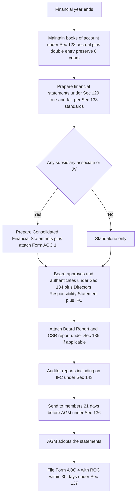
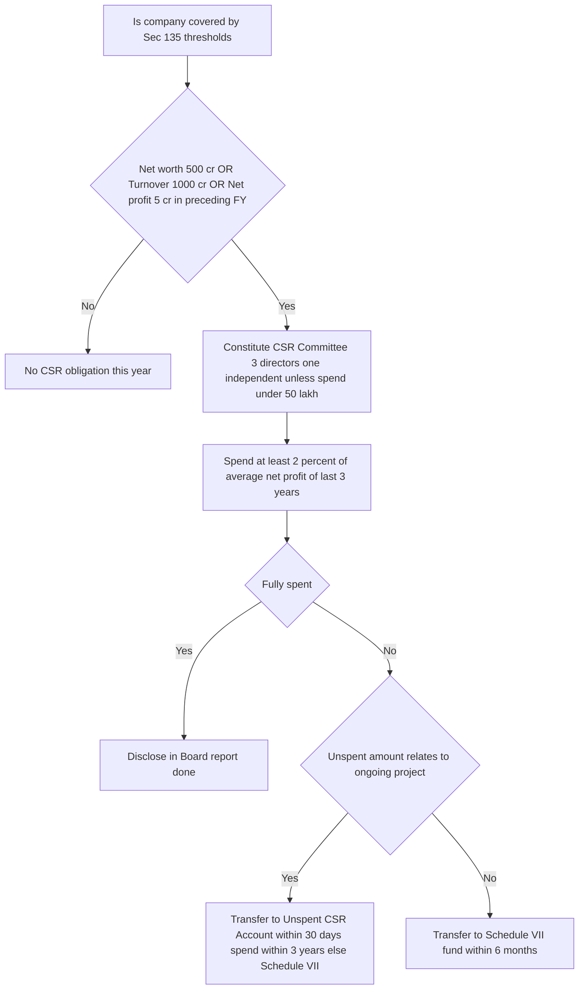
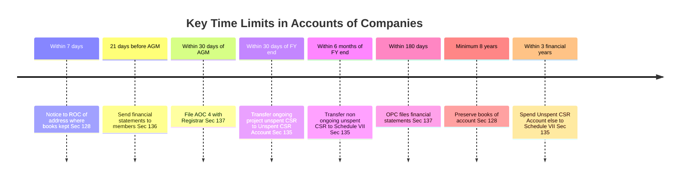
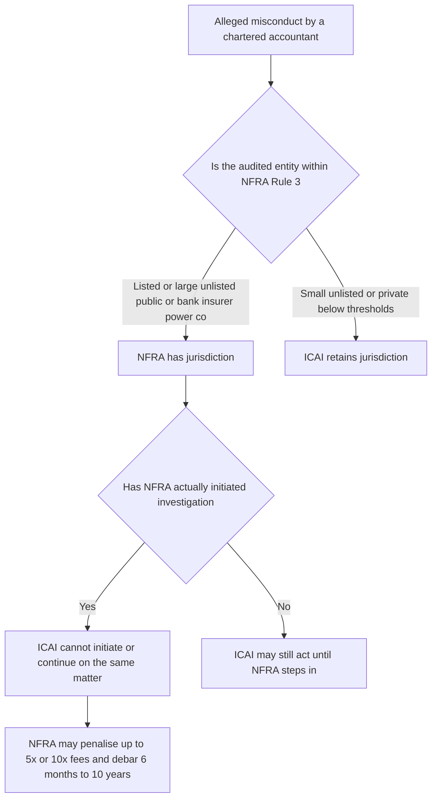
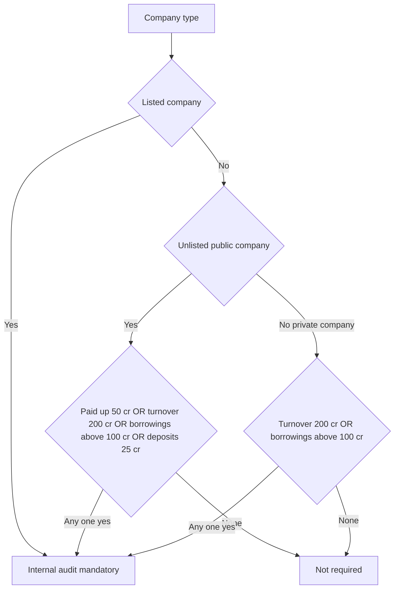

<!-- v2-deep -->

# Chapter 09 — Accounts of Companies

> Chapter IX of the Companies Act 2013 — Sections 128 to 138. The chapter that turns a company from a private black box into a place a stranger can safely lend to, invest in, or regulate.

---

## 1. The Problem — Why Would Anyone Trust a Company They Cannot See Inside?

A company is a legal fiction. It has no conscience, no fear of hell, and — crucially — **limited liability**. The people who run it (the Board) are almost never the people who fund it (thousands of scattered shareholders and lenders). This split between **management and ownership** is the original sin that the entire law of accounts exists to police.

Left unregulated, here is exactly how people cheated:

- **The vanishing books.** A director who kept the books in his own head, or in a locked drawer, or destroyed them the night before an inspection, could deny a fraud ever happened. No records, no proof, no liability.
- **The rosy picture.** Management could paint the company as wildly profitable to keep the share price up, keep drawing salaries and dividends, and keep lenders lending — right up to the morning it collapses. Investors lose money they were *lured* into.
- **The invisible subsidiary trick.** A parent company would shove its losses, its debts, its garbage into a subsidiary and show only the clean parent to the world. The group is rotten but each individual balance sheet looks fine. (Enron did exactly this with "special purpose entities.")
- **The controls that never existed.** Cash walks out, purchases are inflated to pay kickbacks, sales are invented — all because no one built a *system* to catch it, and no one was accountable for the absence of that system.
- **The company that took society's resources and gave nothing back.** Large, profitable companies use public infrastructure, public goods, public trust — and historically returned zero to the society that enabled them.

Every section from 128 to 138 is a **fix for one of these specific abuses**. Do not memorise them as a list. Read each as a plugged loophole.

The famous frauds behind this chapter — **Satyam (2009)** in India (₹7,000+ crore of fictitious cash and fabricated books) and **Enron/WorldCom** globally — are the reason Parliament tightened accounts, controls, and created a super-regulator (NFRA). Satyam is *why* internal financial controls and NFRA exist in their current form.

**The deeper first-principle — information asymmetry.** Economists have a name for the original sin: *information asymmetry*. The manager knows the true state of the company; the outside investor does not. Left alone, this asymmetry produces two failures. First, **adverse selection** — if investors cannot tell good companies from bad, they price *every* company as average, which drives honest companies out of the market and leaves it to the liars (the "market for lemons"). Second, **moral hazard** — once you have my money, you have every incentive to take risks or siphon value because the downside is mostly mine. The law of accounts is a machine for *shrinking the asymmetry*: mandatory books shrink it, standardised true-and-fair statements shrink it, named signatures shrink it, an independent auditor and regulator shrink it. Read Chapter IX as one long war on information asymmetry and every rule suddenly has an obvious purpose.

**Why the State, and not the market, fixes this.** A natural objection: if disclosure is valuable, companies would disclose voluntarily to attract cheaper capital, and the market would reward transparency. Partly true — but disclosure is a *public good*. One honest company's disclosure benefits the whole market (comparability), yet costs that one company alone, so each individually under-provides it, and the *format* would fragment (everyone inventing their own "profit"). Worse, the party who decides whether to disclose is the very party who profits from hiding. Only a mandatory, standardised, enforced regime solves a collective-action problem of this shape. That is the jurisprudential reason accounts law is *compulsory* rather than *contractual*.

---

## 2. The Core Idea — "Record It, Present It Truthfully, Prove You Controlled It, Give Back, and Let a Watchdog Check."

Strip the chapter to one sentence and it says:

> **A company must keep honest books (128), turn them into a true-and-fair public statement signed by accountable humans (129 + 134), prove it had systems to prevent lies (134 IFC + 143 auditor check), share its surplus with society if it is large (135 CSR), and submit to an independent quality regulator (132 NFRA) — with everything ultimately *filed* on public record.**

The five moves, in order of the information's life:

| Move | Section | What it forces |
|------|---------|----------------|
| 1. **Capture** the truth | 128 | Keep proper books of account, accrual + double-entry, for 8 years |
| 2. **Present** the truth | 129, 133 | True-and-fair financial statements per notified accounting standards |
| 3. **Consolidate** the truth | 129(3) | If you have subsidiaries, show the *whole group*, not just the clean parent |
| 4. **Own** the truth | 134 | Board must sign, report, and declare its internal controls |
| 5. **Give back** from the truth | 135 | Large companies must spend 2% on CSR |
| 6. **Police** the truth | 132 (NFRA), 137/138 | Independent regulator + mandatory filing + internal audit |

Everything else is detail hanging off this skeleton.

**The information supply chain — a mental model.** Think of financial information as a product moving down an assembly line, where each section is a *quality gate* that the product must pass before moving on:

> **Transactions → [128 books] → [129/133 statements] → [134 Board owns and signs] → [143 auditor independently checks] → [136 members receive] → [137 public filing] → [132 regulator spot-checks the checkers].**

If any gate is weak, everything downstream is contaminated — false books (128) poison the statements (129), which poison the audit (143), which mislead members (136) and the public (137). This is *why* the sections are studied together and *why* the penalties escalate as you move downstream: a lie caught at the books stage is an error; the same lie that survives to the public-filing stage is a fraud that has already deceived the market.

---

## 3. Why It's Built This Way — The Design Logic

**Why *mandatory* and not voluntary?** Because the people who benefit from lying (management) are the very people who would choose whether to disclose. You can never let the fox decide whether to install the henhouse camera. So the law removes discretion.

**Why *accrual and double-entry* (128)?** Cash accounting hides the truth beautifully — you can look rich simply by not paying your bills yet. Accrual forces you to recognise a liability the moment it arises, and double-entry means every rupee has a source and a use, so fabrication requires *two* consistent lies, not one. Harder to cook.

**Why *true and fair* rather than merely "correct" (129)?** "Correct" invites malicious compliance — technically-accurate numbers arranged to mislead. "True and fair" is a *higher, purposive* standard: the overall impression must not deceive. It defeats the letter-of-the-law cheat.

**Why make *specific humans sign* (134)?** A statement no one signs is a statement no one can be jailed for. Signatures convert "the company misled us" (unpunishable abstraction) into "*you*, Chairman, and *you*, CFO, certified this" (a defendant).

**Why *consolidation* (129(3))?** Because economic reality follows control, not legal boundaries. If you control it, its losses are your losses. Consolidation refuses to let a corporate group hide behind the separate legal personality of its own subsidiaries.

**Why *CSR as law* (135)?** India is the first major economy to make CSR statutorily mandatory (with teeth). The logic: large companies extract enormous value from society and the commons; a modest, transparent 2% giveback, *governed and disclosed*, is the price of that licence. Making it "comply-or-explain," and later "comply-or-transfer-and-explain," stops it being empty PR.

**Why a *separate NFRA* (132)?** Because the accounting profession policing itself (ICAI) has an inherent conflict — auditors are members, and members were signing off on frauds like Satyam. An *independent* regulator with the power to investigate and debar breaks that cosy circle for the largest, most systemically-important companies.

**Why *retention for 8 years* rather than forever (128)?** Two opposing forces meet at "8." Push it too short and a fraud that surfaces years later becomes unprovable. Push it to "forever" and you impose an unbounded storage cost on every honest company for the sake of the rare late fraud. Eight years is Parliament's balance point — long enough to survive most limitation periods and investigation cycles, short enough to be a finite burden. And the moment the law *is actively looking* (an investigation is ordered), the ceiling lifts: the Central Government can extend retention, because now the marginal record could be the missing evidence.

**Why *thresholds* everywhere (135 CSR, 138 internal audit, 132 NFRA)?** Every one of these obligations is *costly* — a CSR committee, an internal-audit function, NFRA scrutiny. The law applies each burden only where the *stakes* justify the *cost*: large net worth, large turnover, large borrowings, public listing. Below the line, a lighter regime (or the annual statutory audit alone) is deemed proportionate. This is the recurring "proportionality" logic — memorise the *shape* (size triggers heavier duty) and the specific numbers become easier to place.

**Why penalties shifted from *imprisonment* to *money* (2019/2020 amendments)?** Parliament decriminalised many *procedural, non-fraudulent* defaults (late filing, technical non-compliance) to unclog courts and improve ease-of-doing-business, while *retaining* criminal liability where dishonesty/fraud is present. The design principle: reserve jail for *lying*, use monetary and per-day penalties for *lateness and sloppiness*. This is why 128 (false/absent books, close to fraud) still carries imprisonment, while 137 (late filing) is a fine-plus-per-day regime.

---

## 4. Full Technical Content — Section by Section, Each Wrapped in Its Why

### Section 128 — Books of Account

**The abuse it kills:** the vanishing/incomplete/one-sided books. If records can be sloppy, absent, or destroyed, fraud is unprovable.

**Definition (read with Sec 2(13)):** "Books of account" includes records of all sums received and expended, all sales and purchases of goods and services, assets and liabilities, and (for prescribed companies) cost records under Sec 148.

**What 128 requires:**
- Every company shall **keep proper books of account** giving a **true and fair view** of its affairs, **including its branches**.
- Kept on **accrual basis** and according to the **double-entry** system. *(Why: as explained — hardest to fabricate.)*
- Kept at the **registered office**. *(Why: a fixed, known, regulator-reachable location.)*
- May be kept at **another place in India** if the Board so decides — but the company must **file a notice with the Registrar (ROC) in writing within 7 days** giving the full address. *(Why: flexibility, but the regulator must always know where to find them.)*

**Branch offices (128(2)):** where a company has a branch (in India or abroad), it is deemed to comply if *proper books relating to the branch's transactions* are kept at the branch and **summarised returns are sent periodically to the registered office** (or the other place where books are kept). *(Why: you cannot run a global operation with every ledger physically at one desk, but the head office must still be able to see and consolidate the whole.)*

**Right of inspection (128(3)–(4)):** the books and other papers shall be **open to inspection by any director** during business hours. For *financial information maintained outside India*, the director's inspection right is exercised by making a **request** in the prescribed manner (Rule 4 — the summarised financial info must be produced within a period, not instantly, and inspection is by the director *in person*, not by proxy/agent, unless authorised). *(Why the friction on foreign records: balance a director's oversight right against the practical reality of overseas storage — but never let "it's abroad" become a permanent shield.)* **Trap:** the inspection right is the *director's*; a member/shareholder has **no** general right under 128 to inspect the books of account.

**Electronic mode (Rule 3):** Books may be kept in electronic form. They must:
- remain **accessible in India** so as to be usable for subsequent reference;
- be **retained completely in the format in which originally generated** (or a converted format not altering accuracy);
- have information **capable of being displayed in legible form**;
- maintain a **proper system for storage, retrieval, display or printout** and not be disposed of/rendered unusable unless permitted by law;
- have **back-ups kept on servers physically located in India** on a **periodic basis** (as prescribed — daily back-up under current Rules; verify current ICAI material);
- and the company must **intimate the ROC annually** (at the time of filing financial statements) the name/address of the **service provider**, the **IP address**, and the **location of the service provider/servers**. *(Why: to stop the "the server is offshore, we cannot produce records" dodge and to know exactly where the data physically lives.)*

**Retention period — the number to memorise:** books together with vouchers must be preserved in good order for **not less than 8 financial years** immediately preceding the current year. If the company had been in existence for **less than 8 years**, then for **all preceding years**. If an **investigation** has been ordered under Chapter XIV, the Central Government may direct retention for **longer**. *(Why 8? Long enough to cover the limitation and investigation window; longer if the law is actively looking.)*

**Who is responsible (the "officer in default"):** the **Managing Director, the whole-time director in charge of finance, the Chief Financial Officer (CFO)**, or any other person of the company charged by the Board with the duty of complying with 128. *(Why name them: no anonymous blame — the persons *charged with the duty* are the defendants, so a company cannot leave the role vacant to create deniability.)*

**Penalty for contravention:** the responsible persons are punishable with **imprisonment up to 1 year, or fine of ₹50,000 up to ₹5,00,000, or both.** *(A rare provision carrying imprisonment — signalling how central honest books are; note this was *not* decriminalised in 2019/2020 precisely because absent/false books sit next to fraud.)*

**Finer distinction — books of account vs "books and papers" vs "financial statements."** These three are not synonyms and the examiner exploits it. *Books of account* (2(13)) are the primary transaction records (cash, sales, purchases, assets, liabilities, cost records). *Books and papers* (2(12)) is a **wider** set — includes books of account, deeds, vouchers, writings, documents, minutes and registers *in any form*. *Financial statements* (2(40)) are the **output** — the balance sheet, P&L, cash flow, etc. Sequence: books and papers ⊃ books of account → financial statements.

> **Memory hook — "128 = the *foundation stone*."** 1-2-8 → *keep it at 1 place (registered office), for a minimum retention, prove it in India.* Everything downstream is built on these books being real.

---

### Section 129 — Financial Statements

**The abuse it kills:** the rosy-picture and the invisible-subsidiary tricks.

**"Financial statements" (Sec 2(40))** includes: (i) **Balance Sheet**, (ii) **Statement of Profit and Loss** (or Income & Expenditure account for non-profit-oriented), (iii) **Cash Flow Statement**, (iv) **Statement of Changes in Equity** (if applicable), and (v) any explanatory note annexed to, or forming part of, the above — i.e. the **Notes**. *(Exemption: a **One Person Company, small company, dormant company, and specified private company/start-up** need NOT include a Cash Flow Statement.)*

*(Why the cash-flow exemption for the small: a cash-flow statement is disproportionately burdensome for a tiny company, and its creditors are few and close. Proportionality again.)*

**Core mandate of 129(1):**
- Financial statements shall give a **true and fair view** of the state of affairs.
- Shall **comply with the accounting standards** notified under **Sec 133**.
- Shall be in the **form(s) in Schedule III**.

*(The "true and fair" + "accounting standards" + "prescribed form" trio is the anti-manipulation lock: you cannot invent your own favourable presentation.)*

**The disclosure-vs-secrecy carve-out (proviso to 129(1)):** insurance, banking, and companies generating/supplying electricity, and any other class governed by a special Act, follow the forms prescribed by *that* Act — and 129 does not, in respect of those items, force Schedule III. *(Why: where a specialised regulator (IRDAI, RBI) already prescribes a form suited to that industry's risks, a one-size-fits-all would be worse, not better.)* **Trap:** the carve-out does not exempt these companies from *true and fair* — it only changes the *form*.

**129(2):** the Board shall **lay** the financial statements before the company at **every AGM**. *(Links to Sec 96 AGM and to the 136/137 clocks.)*

**129(3)–(4) — Consolidated Financial Statements (CFS):**
- Where a company has one or more **subsidiaries, associates, or joint ventures**, it shall **prepare a consolidated financial statement** of the company **and all** subsidiaries/associates/JVs, in the same form and manner as its own, laid before the AGM **in addition to** its standalone statements. *(Why: show the whole group; kill the hide-losses-in-a-sub trick.)*
- The Explanation clarifies that "subsidiary" here **includes associate and joint venture** for consolidation purposes.
- A separate statement (**Form AOC-1**) containing the salient features of each subsidiary/associate/JV's financials must be attached.
- **Manner of consolidation:** in accordance with Schedule III and the applicable accounting standards (**AS 21/23/27** or **Ind AS 110/111/28** depending on the framework). *(You need only know which standards govern; the mechanics belong to Accounting/FR.)*

**Rule 6 relaxations from CFS (Companies (Accounts) Rules) — the fine print examiners love:** a company need not prepare CFS if it meets **all** of: (a) it is a **wholly-owned subsidiary**, or a partially-owned subsidiary of another company and *all its other members* (including those not otherwise entitled to vote) have been **intimated in writing and do not object**; (b) it is **not listed / not in the process of listing** in India or abroad; and (c) its **ultimate or intermediate holding company files CFS** with the ROC in compliance with the applicable standards. *(Why: avoid pointless duplicate consolidation when a parent already consolidates the very same numbers.)* There is also a relaxation for a company that has **only associates/JVs and no subsidiary** in certain circumstances — *verify current Rule 6 wording in ICAI material, as this has been amended.*

**129(5):** If the financial statements **do not comply** with accounting standards, the company must **disclose in its financial statements the deviation, the reasons, and the financial effect** arising from the deviation. *(Why: forced confession beats silent non-compliance — the deviation becomes visible and quantified, not hidden.)*

**129(6):** the Central Government may, on its own or on application, **exempt any class of companies** from any requirement of 129 in the public interest. *(An escape valve for genuinely special cases — but a *government* decision, not a self-serve exemption.)*

**129(7) — Penalty:** the MD/WTD in charge of finance/CFO/any other person charged with compliance is punishable with **imprisonment up to 1 year, or fine ₹50,000 to ₹5,00,000, or both**, for failing to comply with 129. *(Retains imprisonment — false presentation is close to fraud.)*

> **Note / confirm in bare Act:** exact CFS applicability for a company with *only* associates/JVs (no subsidiary) and the small-company CFS relaxations are subject to Rule 6 of the Companies (Accounts) Rules — confirm current exemptions in ICAI material.

---

### Section 133 — Central Government Prescribes Accounting Standards

**The abuse it kills:** every company inventing its own "accounting method" so numbers are non-comparable and manipulable.

- The Central Government **prescribes the accounting standards** recommended by **ICAI** in consultation with and after examination by the **National Financial Reporting Authority (NFRA)**. *(Why the chain: professional expertise (ICAI) + independent oversight (NFRA) + legal force (CG). No single body controls the rules.)*
- These are the **AS / Ind AS** you apply. *(A common, mandatory yardstick makes companies comparable and lies detectable.)*

**AS vs Ind AS — which company applies which (know the map, not the paragraphs):** the *Companies (Indian Accounting Standards) Rules 2015* create a phased roadmap. Broadly: **Ind AS** (converged with IFRS) applies **mandatorily** to listed companies and large companies above net-worth thresholds (₹250 crore and their holding/subsidiary/associate/JV companies), and to all banks/NBFCs/insurers per their own roadmaps; **AS** (the older standards) continue for the rest. *(Why a roadmap rather than a big-bang: forcing every small company onto complex IFRS-converged standards overnight would be ruinous; the law converges the *large and listed* first, where global comparability matters most.)* **Exam tip:** you are unlikely to be tested on exact Ind AS applicability dates in Law — but know that **133 is the hook** on which the whole AS/Ind AS edifice hangs, and that the *legal force* of a standard comes from the CG's notification under 133, not from ICAI recommending it.

*(Deeper why — the separation of powers in standard-setting: ICAI *recommends* (expertise), NFRA *examines* (independent quality check), the CG *notifies* (democratic/legal legitimacy). No actor can both write the rules and escape scrutiny — the same anti-self-dealing design that runs through the whole chapter.)*

---

### Section 134 — Financial Statement, Board's Report, and the Directors' Responsibility Statement

**The abuse it kills:** the unsigned, unaccountable statement — and management pretending they had controls when they had none.

**134(1) — Signing (authentication):**
- Financial statements, including consolidated ones, must be **approved by the Board** and signed on behalf of the Board by:
  - the **Chairperson** (if authorised by the Board) **OR** by **two directors**, one of whom shall be the **Managing Director**, and
  - the **CEO** (if he is a director), the **CFO**, and the **Company Secretary**, wherever they are appointed.
- For a **One Person Company**, signature by **one director** suffices.

*(Why the multiple signatures: spread accountability across the people who actually run and account for the company. You cannot all claim ignorance.)*

**Sequence trap (very commonly tested):** the correct order is (i) financial statements are **approved by the Board** → (ii) then **signed/authenticated** by the requisite persons → (iii) then the **auditor makes his report** on them → (iv) then they are **issued/circulated/laid**. The auditor reports on statements *already authenticated* by the Board — you cannot flip the order.

**134(2):** the **auditor's report** shall be attached to every financial statement.

**134(3) — The Board's Report** must be attached to the financial statements and must include, among many items:
- the **web-address**, if any, where the annual return has been placed (post-amendment this replaced the earlier "extract of annual return MGT-9") — *verify current ICAI position*,
- number of **Board meetings**,
- **Directors' Responsibility Statement** (below),
- details of **fraud reported by auditors** other than those reportable to the Central Government (Sec 143(12)),
- a statement on **declaration by independent directors** (Sec 149(6)),
- company's policy on **directors' appointment and remuneration** (Sec 178) — for prescribed companies,
- explanations or comments by the Board on every **qualification, reservation, adverse remark or disclaimer** made by the **auditor** and by the **company secretary in practice** in the secretarial audit report, *(Why: force management to publicly answer the auditor's red flags — the Board cannot stay silent on a qualification)*
- particulars of **loans, guarantees, investments** (Sec 186),
- particulars of **related party contracts/arrangements** in **Form AOC-2** (Sec 188),
- state of the company's affairs; amounts, if any, carried to **reserves**; **dividend** recommended,
- **conservation of energy, technology absorption, foreign exchange** earnings/outgo,
- development and implementation of a **risk management policy**,
- **CSR policy and report** (Sec 135, in the prescribed format),
- statement on the **formal annual evaluation** of the Board's performance (listed companies and prescribed public companies),
- **material changes and commitments** affecting the financial position occurring between the year-end and the date of the report,
- details of significant/material orders passed by regulators/courts affecting going concern, and adequacy of internal financial controls **with reference to the financial statements**.

*(Note the finer distinction: the Board reports on IFC "**with reference to the financial statements**" — i.e. controls over financial reporting — which is narrower than the full IFC concept defined in 134(5)(e). The auditor's 143(3)(i) opinion is also on IFC over financial reporting. Watch this scope word.)*

**Abridged Board's Report for OPC and small companies (134(3A)):** the Central Government may prescribe an **abridged Board's report** for OPCs and small companies. *(Proportionality — the full 134(3) laundry list is disproportionate for the very small.)*

**134(3)(c) + 134(5) — Directors' Responsibility Statement (DRS):** the directors must affirmatively state that:
1. applicable **accounting standards** were followed, with proper explanation of material departures;
2. **accounting policies** were selected and applied consistently, with judgements and estimates that are reasonable and prudent, to give a true and fair view;
3. proper and sufficient care was taken for **maintenance of adequate accounting records** in accordance with the Act, to safeguard assets and prevent/detect fraud and other irregularities;
4. the accounts were prepared on a **going concern** basis;
5. **(for listed companies)** the directors had laid down **Internal Financial Controls (IFC)** to be followed by the company and that such IFC are **adequate and operating effectively**;
6. the directors devised proper systems to ensure **compliance with all applicable laws** and that such systems were adequate and operating effectively.

**Trap on scope:** point 5 (IFC declaration in the DRS) applies to **listed companies only**. Points 1–4 and 6 apply to *all* companies. The examiner asks "is a private company's DRS required to state that IFC are operating effectively?" — answer: **no**, that specific clause is for listed companies. (But *auditor* reporting on IFC under 143(3)(i) has its own applicability — do not merge the two tests.)

**Internal Financial Controls — the definition to memorise (Explanation to 134(5)(e)):** IFC means the **policies and procedures adopted by the company for ensuring the orderly and efficient conduct of its business, including adherence to company's policies, the safeguarding of its assets, the prevention and detection of frauds and errors, the accuracy and completeness of the accounting records, and the timely preparation of reliable financial information.**

*(Why IFC exists: post-Satyam, "we didn't know the cash was fake" is no longer a defence. Directors must *build systems* to catch fraud and then *certify* those systems work. The auditor independently reports on IFC adequacy under Sec 143(3)(i). This is the "prove you controlled it" pillar — the law shifts liability from "did you know?" to "did you build a system that *should* have known?")*

**134(7):** a signed copy of every financial statement (including CFS) shall be **issued, circulated or published** together with the auditor's report and the Board's report. *(You cannot publish the numbers stripped of the audit opinion and Board report — the package travels together.)*

**134(8) — Penalty:** company punishable with fine of **₹3,00,000**; and every officer in default with fine of **₹50,000**. *(Post-2020 amendment reframed this as a monetary penalty — no imprisonment for a 134 default, reflecting the "reserve jail for fraud" policy; confirm current figures in ICAI material.)*

> **Memory hook — 134 = "the *signature and confession* section."** Sign it (134(1)), report it (134(3)), and *swear you controlled it* (134(5) DRS + IFC).

---

### Section 135 — Corporate Social Responsibility (CSR)

**The abuse it kills:** the extractive company that takes from society and returns nothing — and the fake, unbudgeted "charity" used as PR without governance.

**Applicability — the three trigger thresholds (any ONE, in the *immediately preceding financial year*):**

| Trigger | Threshold |
|---------|-----------|
| **Net worth** | ₹500 crore or more |
| **Turnover** | ₹1,000 crore or more |
| **Net profit** | ₹5 crore or more |

If a company crosses **any one**, Sec 135 applies. *(Why "any one": you cannot be huge on two metrics and dodge by being small on the third.)*

**Ceasing to be covered (proviso, post-2020):** a company that *ceases* to meet the thresholds for **three consecutive financial years** is **not required** to constitute a CSR Committee or comply, until it meets a threshold again. *(Why: a one-off spike shouldn't chain a company to CSR forever; sustained size does.)*

**The CSR Committee (135(1)):** such a company must constitute a **CSR Committee of the Board** with **3 or more directors, at least one being an independent director**. *(For a company not required to appoint an independent director, 2 directors suffice.)* *(Why a Board committee: CSR is a governance duty, not a marketing budget.)*

**Relaxation (135(9)):** where the amount to be spent does **not exceed ₹50 lakh**, the requirement to constitute a **CSR Committee is not applicable**, and the **functions of the Committee are discharged by the Board** itself. *(Proportionality — a tiny CSR spend does not warrant a standing committee.)*

**The 2% obligation (135(5)):** the Board shall ensure the company spends, in every financial year, **at least 2% of the average net profits** made during the **three immediately preceding financial years** (or such preceding years as available, if incorporated less than 3 years ago) on CSR activities per its policy.

- "**Net profit**" is computed as per **Sec 198** (with prescribed adjustments — e.g. it *excludes* profits from overseas branches and dividends received from other companies in India that are already covered by/complying with Sec 135, to avoid double-counting). *(Why Sec 198: a single, manipulation-resistant profit definition shared with managerial remuneration.)*
- **Local area preference:** the company shall give preference to the **local area(s)** where it operates. *(Why: those most affected by the company's operations should benefit first.)*

**Impact assessment and administrative overheads (Rules):** companies of a prescribed size undertaking large projects must conduct **impact assessment** through independent agencies; and **administrative overheads** are capped (currently **5%** of total CSR expenditure). Surplus arising from CSR activities shall **not** form part of business profit and must be ploughed back into CSR/transferred to the Unspent Account/Schedule VII. *(Verify current percentages in ICAI material.)*

**The "comply or explain" → "comply or *transfer*" evolution — this is the heavily-tested part:**
- If the company **fails to spend** the 2%, the Board must, in its report, **specify the reasons** for not spending.
- **Unspent amount tied to an *ongoing project* (135(6)):** must be transferred within **30 days** of the end of the financial year to a **special account** — the **"Unspent CSR Account"** — opened in any scheduled bank, and **spent within 3 financial years** from the date of such transfer towards the policy; if still unspent after those 3 years, transferred to a **Schedule VII fund** (e.g. PM National Relief Fund / PM CARES) within **30 days** of the completion of the third financial year.
- **Unspent amount *not* tied to an ongoing project (135(5) 2nd proviso):** must be transferred within **6 months** of the end of the financial year to a **fund specified in Schedule VII**.

*(Why the ongoing-project distinction: genuine multi-year projects (a school, a hospital) legitimately can't spend all at once, so the law gives them a 3-year ring-fenced runway; money with no genuine plan must go to a public fund, not sit idle as a fake "commitment.")*

**What is an "ongoing project"? (definition matters):** a **multi-year project** undertaken by a company in fulfilment of its CSR obligation, **having a timeline not exceeding 3 years** (excluding the financial year in which it commenced), and includes a project initially not so approved but whose duration is *subsequently extended* by the Board (within the overall limits). *(The 4-year practical span: commencement year + up to 3 more.)* **Trap:** if a project is *not* an ongoing project as defined, unspent money on it takes the **6-month Schedule VII** route, not the 30-day Unspent-Account route.

**Excess spending set-off (135(5) proviso):** if a company spends **more** than the 2% requirement in a year, it may **set off the excess** against the CSR obligation of the succeeding **3 financial years**, subject to (a) the excess not including surplus from CSR activities, and (b) a **Board resolution** to that effect. *(Why: reward front-loading of genuine CSR; don't penalise generosity by treating it as a wash.)*

**Penalty (135(7)) for default in transferring/spending:** the **company** is liable to a penalty of **twice the amount** required to be transferred (to the Unspent CSR Account or Schedule VII fund), **or ₹1 crore, whichever is less**; and **every officer in default** is liable to **one-tenth of the amount** required to be so transferred, **or ₹2 lakh, whichever is less**. *(Why a *money* penalty pegged to the unspent sum: it removes the incentive to save money by not spending — non-compliance now costs *more* than compliance. Note this is a **civil penalty** adjudicated by the Registrar/adjudicating officer, not a criminal fine — CSR default was decriminalised in 2020.)*

**Where CSR money may go (Schedule VII):** eradicating hunger, poverty and malnutrition; promoting education; promoting gender equality and empowering women; environmental sustainability; protection of national heritage/art/culture; measures for the benefit of armed-forces veterans/war widows; training to promote sports; contribution to the PM National Relief Fund / PM CARES / other CG funds; contributions to incubators/research funded by government or specified institutions; rural development; slum area development; disaster management; etc. *(Activities in the *normal course of business* do NOT count as CSR — else every company would relabel its ordinary operations as charity. **One-time exception historically:** contributions related to COVID-19 R&D — verify current relevance.)*

**What is NOT CSR (Rules — commonly tested exclusions):** activities in the **normal course of business** (with a limited exception for companies engaged in R&D of new vaccines/drugs/medical devices for FY 2020-21 to 2022-23, subject to conditions); activities **outside India** (except training of Indian sports personnel); contribution to a **political party** (Sec 182); benefits to **employees** (as defined under the Code on Wages); activities **fulfilling other statutory obligations**; and CSR discharged on a **sponsorship basis** deriving marketing benefit for the company's products.

> **Memory hook — "500 / 1000 / 5" and "2% of last 3 years."** Net worth 500 cr, Turnover 1000 cr, Profit 5 cr → spend 2% of the trailing-3-year average. Unspent + ongoing = 30 days to Unspent Account, 3 years to use, else Schedule VII. Unspent + not ongoing = 6 months to Schedule VII.

---

### Section 136 — Right of Members to Copies

**The abuse it kills:** hiding the finished statements from the very owners entitled to see them.

- A **copy of the financial statements** (including CFS, auditor's report, and every attached document) must be **sent to every member, every trustee for debenture-holders, and every other person entitled**, **at least 21 clear days before the AGM**. *(Why 21 days: enough time to read and challenge before voting.)*
- **Shorter notice:** statements may be sent less than 21 days before the AGM if **agreed** by members holding, if the company has a share capital, **majority in number entitled to vote and representing not less than 95% of the paid-up share capital** (or, having no share capital, 95% of total voting power) — the same "consent to shorter notice" logic as the AGM itself. *(Why: the protection is for members; members can waive it by a high supermajority.)*
- **Listed companies:** may send a **statement containing the salient features (Form AOC-3 / AOC-3A)** instead of the full documents, and/or place the documents on the **website**, subject to conditions — with full copies furnished on member request, free of cost. *(Why: full financials of a large listed company are a phone-book; a salient-features route plus web-access balances cost and access.)*
- A **listed company** must also place its financial statements (including CFS) and all documents on its **website**; and a company with a **subsidiary** must place *separate audited accounts of each subsidiary* on the website and provide copies on request.

---

### Section 137 — Filing with the Registrar

**The abuse it kills:** keeping the truth private. Disclosure to members is not enough; the *public* and creditors need it too.

- A copy of the **financial statements duly adopted at the AGM** (including CFS and all attachments) must be **filed with the ROC in Form AOC-4 (and AOC-4 CFS / AOC-4 XBRL where applicable) within 30 days of the AGM**. *(Why 30 days and public: creditors and future investors — who never attend the AGM — rely on the public record.)*
- **Statements not adopted at AGM (or adjourned AGM):** the *unadopted* financial statements are filed within 30 days of the AGM as **provisional**, and the *adopted* ones filed within 30 days of the **adjourned AGM** at which they are adopted. *(No limbo — even un-adopted numbers go on record, flagged as provisional.)*
- **If the AGM is not held:** the statements must still be filed **within 30 days of the last date on which the AGM should have been held**, together with a **statement of the facts and reasons** for not holding it. *(No AGM is not an escape from filing.)*
- **OPC:** file within **180 days** from the close of the financial year (it holds no AGM; the *member's signature* on the statements adopts them).
- **Foreign subsidiary accounts:** where the company has *subsidiaries incorporated outside India* that are not required to get their accounts audited, the un-audited accounts (or the salient features) are attached, in the prescribed manner.
- **Penalty (137(3)):** the **company** is liable to a penalty of **₹10,000 + ₹100 per day** of continuing default, **subject to a maximum of ₹2,00,000**; the **MD/CFO** (or in their absence, any director charged, or all directors) is liable to **₹10,000 + ₹100 per day**, subject to a maximum of **₹50,000**. *(A per-day penalty makes delay progressively painful — confirm exact caps in ICAI material.)*

*(Deeper why — filing is the moment the information becomes a **public good**. Sections 128–136 build and share the truth *inside* the company's circle (Board, members, debenture trustees). Section 137 pushes it *outside* to the whole world via the ROC/MCA public register, where a prospective creditor, a job applicant, a competitor, a journalist or a regulator can pull it. This is why 137 is the terminal gate of the "information supply chain" model in Part 2.)*

---

### Section 138 — Internal Audit

**The abuse it kills:** the absence of any *ongoing, internal* check between the annual statutory audits — the gap in which fraud grows for a whole year unnoticed.

- **Prescribed classes** of companies must appoint an **internal auditor** — who may be a **chartered accountant** (whether or not in practice), a **cost accountant**, or **such other professional** as decided by the Board — to conduct internal audit of the functions and activities of the company. *(Note: the internal auditor **may be an individual, a partnership firm or a body corporate**, and **may be an employee** of the company; independence is desirable but not a statutory bar in the way it is for a statutory auditor.)*
- The **Board**, in consultation with the internal auditor, formulates the **scope, functioning, periodicity and methodology** for conducting internal audit. *(Why: internal audit serves *management/the Board* — it is a management tool, so the Board scopes it. Contrast: the statutory auditor serves the *members*, so members appoint and scope him.)*
- **Who is caught (Rule 13):**
  - **Every listed company;**
  - **Unlisted public company** with **paid-up capital ≥ ₹50 crore** during the preceding FY, OR **turnover ≥ ₹200 crore**, OR **outstanding loans/borrowings from banks/PFIs > ₹100 crore** at any point during the preceding FY, OR **outstanding deposits ≥ ₹25 crore** at any point during the preceding FY (any one);
  - **Private company** with **turnover ≥ ₹200 crore**, OR **outstanding loans/borrowings from banks/PFIs > ₹100 crore** at any point during the preceding FY (any one). *(A private company is judged on only two of the four metrics — no paid-up-capital or deposits test.)*

*(Why size-based: internal audit is costly; the law imposes it where the money at stake and public interest justify it. Below the threshold, the annual statutory audit is deemed enough.)*

**Three audits, one company — the distinction table (examiners love mixing these up):**

| Feature | Internal audit (138) | Statutory audit (139–143) | Cost audit (148) |
|---|---|---|---|
| Serves | Management / Board | Members / shareholders | CG / cost governance |
| Appointed by | Board | Members (AGM) | Board (on Committee/CG basis) |
| Who can do it | CA, CMA, other professional, employee | Practising CA only | Practising Cost Accountant |
| Frequency | Ongoing / periodic | Annual | Annual (for prescribed industries) |
| Report to | Board/management | Members | CG (in prescribed form) |

> **Note:** internal audit (138, ongoing, management-facing) is distinct from **statutory audit** (Sec 139–143, annual, shareholder-facing) and from **cost audit** (Sec 148). Do not conflate them.

---

### Section 132 — National Financial Reporting Authority (NFRA)

**The abuse it kills:** the profession judging itself. When auditors *are* ICAI members and ICAI both sets standards and disciplines members, a Satyam-scale audit failure can slip through. NFRA breaks the conflict for the biggest players.

**What NFRA is:** an **independent regulator** constituted by the Central Government to oversee **accounting and auditing standards and the quality of audits** of specified large/public-interest entities.

**Its powers/functions (132(2)–(4)):**
- **Recommend** accounting and auditing policies and standards to the CG (feeds into Sec 133).
- **Monitor and enforce compliance** with those standards.
- **Oversee the quality of service** of the professions associated with ensuring compliance, and suggest measures for improvement.
- **Investigate**, either *suo motu* or on a **reference by the Central Government**, into **matters of professional or other misconduct** committed by any **member or firm of chartered accountants** in respect of prescribed companies/bodies corporate. **Where NFRA has initiated an investigation, no other institute or body (i.e. ICAI) shall initiate or continue any proceeding** in respect of the same matter — one forum, no forum-shopping or double jeopardy.
- Has, for investigation, the **same powers as a civil court under the Code of Civil Procedure** (summoning and enforcing attendance, requiring discovery and production of documents, receiving evidence on affidavit, etc.).

**Its penalty powers where professional/other misconduct is proved (132(4)(c)):**
- **Monetary penalty:** for **individuals**, not less than **₹1 lakh**, extendable up to **5 times the fees received**; for **firms**, not less than **₹5 lakh**, extendable up to **10 times the fees received**.
- **Debarment:** of the member or firm from being appointed as an **auditor or internal auditor** or from undertaking any audit / valuation for a period of **6 months to 10 years**, as NFRA may decide. *(Why so severe: an auditor's signature is a public trust; abusing it must end careers, not just cost a fine.)*

**Who NFRA covers (Rule 3 — jurisdiction, "class of companies"):** broadly — **companies whose securities are listed** on any stock exchange in India or outside India; **unlisted public companies** having paid-up capital **≥ ₹500 crore** OR turnover **≥ ₹1,000 crore** OR aggregate **outstanding loans, debentures and deposits ≥ ₹500 crore** as on the preceding 31 March; **insurance, banking, and electricity-generating/supplying companies** governed by special Acts; and any **body corporate/company/person referred by the Central Government** in the public interest. *(Why only the big/public-interest ones: NFRA is a heavy instrument reserved for systemically important entities; smaller companies stay under ICAI's disciplinary jurisdiction. Verify current Rule 3 figures.)*

**Structure and appeals:** NFRA consists of a **chairperson** and members appointed by the CG, with a **division for enforcement** kept separate from the standard-setting function (an internal separation to prevent the investigator from also writing the rules). Appeals against NFRA orders lie to the **Appellate Tribunal (NCLAT)** as prescribed (originally an "Appellate Authority" was contemplated; appeals now lie to NCLAT — verify current position).

**The jurisdiction hand-off — the single most-tested NFRA point:** the *default* disciplinary forum for a CA's professional misconduct is **ICAI** (under the Chartered Accountants Act 1949). NFRA is an **overriding, exclusive** jurisdiction that switches on **only** for (i) the specified large/public-interest companies in Rule 3, **and** (ii) once NFRA *actually initiates*. For everyone else — the small unlisted private company's auditor — **ICAI retains jurisdiction**.

> **Memory hook — "NFRA = the *auditor's auditor*."** It stands above the profession for the largest companies, so the watchmen are themselves watched.

---

## 5. Applied Scenarios (Facts → Analysis → Conclusion)

**Scenario A — The offshore-server dodge.**
*Facts:* Zenith Ltd keeps all its books of account only on a cloud server physically located in Singapore. During an ROC inspection, Zenith says the records "cannot be produced immediately" as the server is abroad. Is Zenith compliant with Sec 128?
*Analysis:* Sec 128 read with Rule 3 permits electronic books, **but** they must remain **accessible in India** for subsequent reference, and a **back-up on servers physically located in India** must be maintained, with **annual intimation to the ROC** of the service provider's name, IP address and server location. Zenith's Singapore-only storage, with no India back-up and non-availability on inspection, defeats the very purpose of the rule (regulator reachability).
*Conclusion:* **Contravention of Sec 128.** The MD/CFO/officer in default is liable — imprisonment up to 1 year and/or fine ₹50,000–₹5,00,000.

**Scenario B — The clean parent, the dirty subsidiary.**
*Facts:* Apex Ltd is highly profitable on a standalone basis. It has pushed ₹300 crore of losses and debt into its 90%-owned subsidiary, Nadir Pvt Ltd. Apex lays only its **standalone** financial statements before the AGM, arguing Nadir is a "separate legal person."
*Analysis:* Separate legal personality is real for liability, but Sec **129(3)** overrides it for *reporting*: where a company has subsidiaries (including associates/JVs), it **must** prepare **Consolidated Financial Statements** covering the whole group and lay them before the AGM **in addition** to standalone statements, with **Form AOC-1** salient features attached. Showing only the clean parent is precisely the abuse 129(3) was written to stop. Apex is not a wholly-owned subsidiary of anyone and is presumably not itself consolidated upward, so no Rule 6 relaxation applies.
*Conclusion:* Apex is in **default of Sec 129(3)/(4)**; the responsible officers face imprisonment up to 1 year and/or fine ₹50,000–₹5,00,000. The consolidated picture (which reveals the group's true, weaker position) must be presented.

**Scenario C — CSR: "we'll spend it later."**
*Facts:* Meridian Ltd had a net profit of ₹8 crore in FY 2025-26 (crossing the ₹5 crore trigger). Its 2% CSR obligation on the trailing-three-year average works out to ₹15 lakh. It identifies an **ongoing** three-year school-construction project but spends only ₹5 lakh this year, leaving ₹10 lakh unspent. It does nothing with the balance and simply notes "will spend next year" in the Board's report.
*Analysis:* Because the unspent ₹10 lakh relates to an **ongoing project**, Sec **135(6)** requires transfer to a **special "Unspent CSR Account"** in a scheduled bank **within 30 days** of the financial year-end, to be spent within **3 financial years**. Merely noting an intention in the Board's report is insufficient for ongoing-project money.
*Conclusion:* **Default under Sec 135.** Failure to transfer attracts the 135(7) penalty — company liable to pay **twice the unspent amount or ₹1 crore, whichever is less** (here 2 × ₹10 lakh = ₹20 lakh, which is less than ₹1 crore, so **₹20 lakh**); officers in default **one-tenth of the unspent amount or ₹2 lakh, whichever is less** (here 1/10 × ₹10 lakh = ₹1 lakh, less than ₹2 lakh, so **₹1 lakh** per officer). Meridian should have opened the Unspent CSR Account and transferred ₹10 lakh within 30 days.

**Scenario D — The unsigned truth.**
*Facts:* Solaris Ltd's financial statements are approved by the Board but signed only by the Company Secretary; no director signs. The CFO argues "the Board approved them, that's enough."
*Analysis:* Sec **134(1)** requires signature **on behalf of the Board** by the **Chairperson if authorised, or by two directors one of whom is the MD**, plus the **CEO (if director), CFO, and CS** where appointed. Board *approval* and Board *authentication by named directors* are different acts; the DRS accountability under 134(5) attaches to directors, not the CS alone. The auditor cannot even validly report until the statements are authenticated.
*Conclusion:* The statements are **not validly authenticated**; Sec 134 is contravened. Correct course: obtain signatures of the requisite directors + CFO + CS before the statements are issued/filed.

**Scenario E — Which regulator disciplines the auditor?**
*Facts:* The statutory auditor of a **listed** company, Titan Ltd, is alleged to have colluded in overstating revenue. Both ICAI and NFRA appear interested in investigating.
*Analysis:* Titan is a listed company — squarely within NFRA's Rule 3 jurisdiction. Under Sec **132(4)**, where NFRA has initiated investigation into professional misconduct for a prescribed company, **no other institute or body (ICAI) may initiate or continue** proceedings on the same matter. NFRA can impose penalty (up to 5×/10× fees) and **debar 6 months to 10 years**.
*Conclusion:* **NFRA has exclusive jurisdiction** here; ICAI stands down for this matter. (For a small unlisted private company outside Rule 3, ICAI would retain jurisdiction.)

**Scenario F — The CSR threshold that flickers on and off (new).**
*Facts:* Vertex Ltd's net profit was ₹6 crore in FY 2023-24 (crossing ₹5 crore), then fell to ₹2 crore, ₹1.5 crore and ₹1 crore in the next three years, with net worth and turnover always below the triggers. Vertex constituted a CSR Committee in FY 2024-25. Its finance head asks whether Vertex must keep the Committee and keep spending in FY 2027-28.
*Analysis:* Sec 135 applies if **any one** trigger is crossed in the *immediately preceding* FY. Vertex crossed the ₹5-crore-profit trigger in FY 2023-24, so it was covered for FY 2024-25 and had to spend 2% of the average net profit of the three preceding years. But the post-2020 proviso says a company that **ceases to meet the thresholds for three consecutive financial years** is no longer required to constitute a Committee or comply until it crosses again. After FY 2024-25, Vertex is below all thresholds for FY 2025-26, 2026-27 and 2027-28 — three consecutive years.
*Conclusion:* For FY 2027-28 (having failed the thresholds for three consecutive preceding years), Vertex is **no longer required** to maintain the CSR Committee or spend, until it crosses a threshold again. **But note**: for the *first* year it fell out (based on the immediately-preceding-year test), obligations may still have run — the "three consecutive years" relaxation is the *exit* rule, applied prospectively. *(Verify the exact interplay of the "immediately preceding FY" applicability test and the "three consecutive years" cessation proviso against current ICAI material — examiners test precisely this seam.)*

**Scenario G — Internal audit: private vs public metrics (new).**
*Facts:* Orion Pvt Ltd (private company) has paid-up capital of ₹80 crore, turnover of ₹150 crore, outstanding bank borrowings of ₹40 crore, and public deposits of ₹30 crore. Its director insists internal audit is mandatory because "paid-up capital is ₹80 crore, well above ₹50 crore."
*Analysis:* The ₹50-crore *paid-up-capital* test and the ₹25-crore *deposits* test under Rule 13 apply to **unlisted public companies**, **not to private companies**. A **private** company is caught **only** if (a) turnover ≥ ₹200 crore, or (b) outstanding loans/borrowings from banks/PFIs > ₹100 crore. Orion's turnover (₹150 cr) is below ₹200 cr and its borrowings (₹40 cr) are below ₹100 cr. Paid-up capital and deposits are **irrelevant** for a private company.
*Conclusion:* Orion Pvt Ltd is **not required** to appoint an internal auditor under Sec 138. The director has applied the wrong metric set — a classic threshold trap.

**Scenario H — Excess CSR spend and set-off (new numerical).**
*Facts:* Helios Ltd is covered by Sec 135. Its 2% obligation is ₹40 lakh in FY 2025-26, but it spends ₹70 lakh (₹30 lakh of it from a genuine external CSR budget, none of it surplus from CSR activities). In FY 2026-27 its 2% obligation is ₹50 lakh. Can Helios spend less than ₹50 lakh next year?
*Analysis:* Under the 135(5) proviso, excess CSR spend may be **set off against the obligation of the succeeding three financial years**, subject to the excess excluding any surplus from CSR activities and a **Board resolution** authorising the set-off. Helios's excess in FY 2025-26 = ₹70 lakh − ₹40 lakh = **₹30 lakh**, and it is not surplus-derived, so it qualifies.
*Conclusion:* If the Board passes the enabling resolution, Helios may set off the ₹30 lakh excess, reducing its FY 2026-27 effective spend to ₹50 lakh − ₹30 lakh = **₹20 lakh** of fresh spending (with ₹30 lakh met by carried-forward excess). **Reconciliation check:** total CSR economically borne across the two years = ₹70 lakh + ₹20 lakh = ₹90 lakh = the two-year statutory obligation (₹40 lakh + ₹50 lakh). The set-off neither over- nor under-charges the company — it merely times the spending. Consistent.

---

## 6. Procedure / Compliance Summary

*Figure 1 — The life of a company's accounts from books to public filing.*

*Figure 2 — CSR decision tree under Section 135.*

*Figure 3 — Every statutory clock in this chapter on one timeline.*

*Figure 4 — Who disciplines the auditor NFRA versus ICAI jurisdiction gate.*

*Figure 5 — Section 138 internal audit applicability by class of company.*

**One-page compliance checklist:**
1. Keep books at registered office (or file ROC notice within 7 days if elsewhere); accrual + double entry; India back-up; annual intimation of server details. **[128]**
2. Prepare true-and-fair statements per Sec 133 standards, Schedule III form. **[129, 133]**
3. If group exists → prepare CFS + AOC-1 (unless Rule 6 relaxation applies). **[129(3)]**
4. Board approves + authenticates (two directors incl. MD, CEO, CFO, CS) + DRS + IFC declaration. **[134]**
5. Attach Board's Report with all 134(3) contents + CSR report. **[134, 135]**
6. Auditor's report incl. IFC opinion. **[143]**
7. Circulate to members ≥ 21 days pre-AGM. **[136]**
8. Adopt at AGM; file AOC-4 within 30 days. **[137]**
9. CSR: spend 2%; transfer unspent per ongoing/non-ongoing rule. **[135]**
10. Appoint internal auditor if threshold crossed. **[138]**

---

## 7. Connections — How This Chapter Wires into the Rest of the Act

- **Sec 139–143 (Audit & Auditors):** the natural sequel. The financial statements *prepared* under this chapter are *checked* by the auditor next chapter. **Sec 143(3)(i)** auditor's opinion on **IFC** directly closes the loop opened by 134(5) DRS. **Sec 143(12)** fraud reporting feeds back into the Board's Report (134(3)).
- **Sec 92 (Annual Return):** filed alongside accounts as the other half of the annual disclosure; the Board's report links to it (web-address of the annual return).
- **Sec 96 (AGM):** accounts are *laid* and *adopted* here; the 21-day (136) and 30-day (137) clocks pivot on the AGM date.
- **Sec 123 (Dividend):** you can only declare dividend out of profits *as computed under these accounts* — dishonest accounts would corrupt dividend law too.
- **Sec 148 (Cost Records & Cost Audit):** an extension of "books of account" for specified industries; cost records are part of the books under 128 read with 2(13).
- **Sec 447 (Fraud):** the ultimate backstop — falsified books/statements can escalate to the fraud offence with harsh imprisonment; this is why 128/129 retained imprisonment while procedural defaults were decriminalised.
- **Sec 198 (Net profit calculation):** the shared engine for CSR spend (135) and managerial remuneration (197) — learn it once, use it twice.
- **Sec 149(6), 177, 178:** independent directors, audit committee, and nomination/remuneration committee — the governance scaffolding that the Board's Report (134(3)) must disclose.
- **Sec 2(40), 2(13), 2(12), 2(85), 2(6), 2(87):** "financial statement," "book of account," "books and papers," "small company," "associate," "subsidiary" — the definitions that switch exemptions and consolidation on and off.

---

## 8. Traps & Examiner Tricks

1. **"Books at registered office — file within how many days if kept elsewhere?"** Answer: **7 days'** written notice to ROC. Students confuse this with the 30-day filing of AOC-4. Different clocks.
2. **8 years, not 7, not 10.** Retention of books = **minimum 8 financial years** (longer if investigation ordered; if the company is younger than 8 years, then for all its years). A classic one-mark trap.
3. **CSR trigger is "any ONE," not "all three."** And it is measured in the **immediately preceding** financial year. Also: the **2%** is of the **average of the last 3 years'** net profits (Sec 198 basis) — students wrongly apply 2% of the current year.
4. **Ongoing project → 30 days → Unspent CSR Account (3 years). Non-ongoing → 6 months → Schedule VII directly.** The two routes are the single most-tested CSR point. Mixing them loses marks. Remember the definition of "ongoing project" (multi-year, ≤ 3 years excluding commencement year).
5. **Cash Flow Statement exemption.** OPC, small company, dormant company (and specified start-ups) are **not** required to include a Cash Flow Statement in their financial statements. Examiners love asking "which company need not prepare a cash flow statement?"
6. **Consolidation covers associates & JVs, not just subsidiaries.** The trap: "Company has no subsidiary, only an associate — must it consolidate?" Generally yes (confirm current Rule 6 relaxations, including the WOS/intermediate-parent exemption).
7. **NFRA vs ICAI jurisdiction.** Once NFRA *initiates* on a *Rule-3 (large/listed/public-interest)* company's misconduct matter, **ICAI cannot proceed** on the same matter. NFRA does **not** cover every company — the small unlisted/private stays with ICAI.
8. **Internal audit (138) ≠ statutory audit (139).** Internal audit is ongoing and management-facing; an internal auditor **may be an employee** and need not be a practising CA; thresholds differ by company type. Don't quote statutory-audit rules for an internal-audit question. **Private company** is tested on only turnover (₹200 cr) and borrowings (>₹100 cr) — *not* paid-up capital or deposits.
9. **"Approved by Board" ≠ "authenticated/signed."** Sec 134(1) needs specific signatories (two directors incl. MD, plus CEO/CFO/CS). Board approval alone is not authentication. And the auditor reports *after* authentication — the sequence is testable.
10. **CSR is "comply or explain" — but for unspent amounts it is now "comply or *transfer* and explain," with a *monetary (civil) penalty*.** The old idea that "CSR has no penalty" is outdated after the 2019/2020 amendments. Penalty = twice the unspent amount or ₹1 crore, whichever is less (company); one-tenth or ₹2 lakh, whichever is less (officer).
11. **Activities in the normal course of business do NOT count as CSR.** A pharma company giving away medicines it sells cannot count that as CSR. Nor can political contributions, employee benefits, activities outside India (except training Indian sportspersons), or marketing-driven sponsorships.
12. **"True and fair," not "true and correct."** The statutory phrase is *true and fair view*. Writing "true and correct" can cost you the definitional mark.
13. **IFC-in-DRS is a *listed-company* clause (134(5)(e)).** A private company's DRS need not certify that IFC are operating effectively. Do not blanket-apply it to all companies. (But this is separate from the *auditor's* 143(3)(i) IFC-reporting test — keep the two apart.)
14. **Director's inspection right, not member's.** Under 128(3) the *director* may inspect the books of account; a shareholder has no general 128 inspection right. Examiners swap the two.
15. **NFRA penalty numbers: 5× for individuals, 10× for firms; debarment 6 months–10 years.** Students flip the individual/firm figures or forget the debarment band.
16. **137 penalty is a *per-day* penalty with a cap.** ₹10,000 + ₹100/day, capped (₹2,00,000 company / ₹50,000 officer). Late filing is decriminalised (civil penalty), unlike false books under 128.

---

## 9. First-Principles Recap

Forget every section number for a moment and rebuild the chapter from the human problem:

> *A company is money that strangers handed to managers they will never meet.*

1. Those managers could **lie about what happened** → so the law forces **honest, tamper-resistant books** (accrual + double-entry, 8-year retention, India-reachable). **[128]**
2. They could **present those books misleadingly** → so the law demands a **true-and-fair** statement in a **standard form** using **common accounting standards**. **[129, 133]**
3. They could **hide the rot in a subsidiary** → so the law demands the **whole group be consolidated**. **[129(3)]**
4. No one could be **blamed** for a faceless document → so the law makes **named humans sign** and **swear their controls worked** (DRS + IFC). **[134]**
5. The company could **take from society and give nothing** → so if it is **large**, it must **give back 2%**, transparently governed, with money it doesn't spend **ring-fenced or surrendered**. **[135]**
6. The truth could stay **private** → so it must be **shown to members** (21 days) and **filed publicly** (30 days). **[136, 137]**
7. Fraud could grow **between annual audits** → so large companies run **internal audit** all year. **[138]**
8. The **auditors themselves** could be captured → so an **independent regulator** watches the biggest ones. **[132 — NFRA]**

Every number in the Quick-Revision Sheet below is just one of these eight sentences wearing a section number.

**The three recurring design patterns — spot them and the chapter compresses.** Notice that the *same three ideas* recur across sections, so you are really memorising three patterns, not fifty rules:
- **Proportionality by size** — heavier duties attach to bigger/public entities (CSR 135, internal audit 138, NFRA 132, cash-flow exemption 129, abridged report 134(3A)). Learn the *shape* first, the numbers second.
- **Named human accountability** — every duty lands on the MD/WTD-finance/CFO/CS, never on an anonymous "company" (128, 129, 134, 137). No faceless defaults.
- **Reserve criminality for dishonesty** — imprisonment survives where the default borders fraud (128 false books, 129 false statements); everything procedural (134, 135, 137) became a civil/monetary penalty in 2019/2020. Where you see jail, ask "is this close to lying?" — the answer is yes.

---

## 10. Quick-Revision Sheet

### Sections at a glance

| Sec | Title | Core purpose (the "why") | Must-know number |
|-----|-------|--------------------------|------------------|
| **128** | Books of account | Honest, tamper-proof, reachable records | 7 days ROC notice if kept elsewhere; **8 years** retention; accrual + double-entry; imprisonment up to 1 yr |
| **129** | Financial statements | Truthful presentation; whole-group view | True & fair; **CFS + AOC-1** if group; deviation must be disclosed (129(5)) |
| **132** | NFRA | Independent regulator over the profession | Penalty individual **1 lakh–5×** fees / firm **5 lakh–10×** fees; debar **6 months–10 years** |
| **133** | Accounting standards | Common yardstick; comparability | CG prescribes on ICAI + NFRA advice (AS/Ind AS) |
| **134** | Board report + DRS + IFC | Named accountability; prove controls | Sign: 2 directors incl. MD + CEO/CFO/CS; DRS 6 points; IFC definition; IFC-clause = listed only |
| **135** | CSR | Large firms give back to society | Trigger **500cr / 1000cr / 5cr**; spend **2%** of avg last-3-yr profit |
| **136** | Members' copies | Owners see before they vote | **21 days** before AGM (waivable by 95%) |
| **137** | Filing with ROC | Public & creditors see the truth | **AOC-4 within 30 days** of AGM; OPC **180 days**; penalty ₹10,000 + ₹100/day |
| **138** | Internal audit | Catch fraud between annual audits | Thresholds by company class (Rule 13); auditor may be employee/CA/CMA |

### CSR thresholds & routes

| Item | Rule |
|------|------|
| Applicability (any one, preceding FY) | Net worth ≥ ₹500 cr / Turnover ≥ ₹1,000 cr / Net profit ≥ ₹5 cr |
| Cessation (relaxation) | Below all thresholds for **3 consecutive FYs** → no longer required until crossed again |
| CSR Committee | 3+ directors, ≥1 independent (waived if spend ≤ ₹50 lakh → Board acts) |
| Spend | 2% of average net profit (Sec 198 basis) of last 3 FYs; local-area preference |
| Unspent — ongoing project | → Unspent CSR A/c within **30 days**; use within **3 years**; else Schedule VII within 30 days of year-3 end |
| Unspent — non-ongoing | → Schedule VII fund within **6 months** |
| Excess spend | Set off against next **3 FYs** (Board resolution; not surplus-derived) |
| Penalty (135(7)) | Company: 2× unspent or ₹1 cr (lower). Officer: 1/10 unspent or ₹2 lakh (lower). Civil penalty |

### Key time limits

| Time | Event | Sec |
|------|-------|-----|
| 7 days | Notice to ROC of address of books | 128 |
| 21 days before AGM | Send statements to members | 136 |
| 30 days of AGM | File AOC-4 | 137 |
| 30 days of FY end | Transfer ongoing-project unspent CSR | 135 |
| 6 months of FY end | Transfer non-ongoing unspent CSR | 135 |
| 180 days of FY close | OPC files statements | 137 |
| 3 financial years | Spend Unspent CSR Account | 135 |
| 8 years (min) | Preserve books of account | 128 |
| 6 months–10 years | NFRA debarment band | 132 |

### Definitions to reproduce verbatim
- **Financial statement (2(40))** = Balance Sheet + P&L (or Income & Expenditure) + Cash Flow + Statement of Changes in Equity (if any) + Notes. *(Cash flow exempt for OPC/small/dormant.)*
- **Internal Financial Controls (Expl. to 134(5)(e))** = policies and procedures for orderly and efficient conduct of business, adherence to company policies, safeguarding of assets, prevention and detection of frauds and errors, accuracy and completeness of accounting records, and timely preparation of reliable financial information.
- **Ongoing project** = a multi-year CSR project with a timeline **not exceeding 3 years** (excluding the commencement year), including a project whose duration is subsequently extended by the Board.
- **Standard phrase:** financial statements must give a **"true and fair view."**

> **Confirm in ICAI/bare Act before the exam:** current monetary penalty figures under 134(8), 137(3), and 132 (revised by the Companies Amendment Acts 2019/2020); the precise CFS relaxations under Rule 6 of the Companies (Accounts) Rules; the interplay of the "immediately preceding FY" CSR test with the "three consecutive years" cessation proviso; the current electronic-books back-up periodicity and CSR administrative-overhead cap; and NFRA Rule 3 threshold figures — these have been amended and ICAI study material carries the exam-authoritative numbers.
