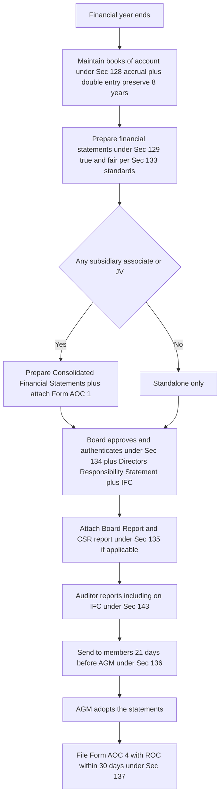
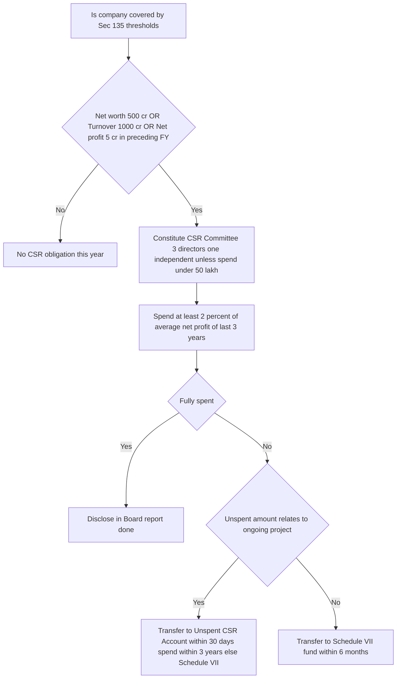
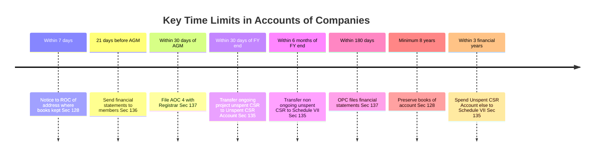

# Chapter 09 — Accounts of Companies

> Chapter IX of the Companies Act 2013 — Sections 128 to 138. The chapter that turns a company from a private black box into a place a stranger can safely lend to, invest in, or regulate.

---

## 1. The Problem — Why Would Anyone Trust a Company They Cannot See Inside?

A company is a legal fiction. It has no conscience, no fear of hell, and — crucially — **limited liability**. The people who run it (the Board) are almost never the people who fund it (thousands of scattered shareholders and lenders). This split between **management and ownership** is the original sin that the entire law of accounts exists to police.

Left unregulated, here is exactly how people cheated:

- **The vanishing books.** A director who kept the books in his own head, or in a locked drawer, or destroyed them the night before an inspection, could deny a fraud ever happened. No records, no proof, no liability.
- **The rosy picture.** Management could paint the company as wildly profitable to keep the share price up, keep drawing salaries and dividends, and keep lenders lending — right up to the morning it collapses. Investors lose money they were *lured* into.
- **The invisible subsidiary trick.** A parent company would shove its losses, its debts, its garbage into a subsidiary and show only the clean parent to the world. The group is rotten but each individual balance sheet looks fine. (Enron did exactly this with "special purpose entities.")
- **The controls that never existed.** Cash walks out, purchases are inflated to pay kickbacks, sales are invented — all because no one built a *system* to catch it, and no one was accountable for the absence of that system.
- **The company that took society's resources and gave nothing back.** Large, profitable companies use public infrastructure, public goods, public trust — and historically returned zero to the society that enabled them.

Every section from 128 to 138 is a **fix for one of these specific abuses**. Do not memorise them as a list. Read each as a plugged loophole.

The famous frauds behind this chapter — **Satyam (2009)** in India (₹7,000+ crore of fictitious cash and fabricated books) and **Enron/WorldCom** globally — are the reason Parliament tightened accounts, controls, and created a super-regulator (NFRA). Satyam is *why* internal financial controls and NFRA exist in their current form.

---

## 2. The Core Idea — "Record It, Present It Truthfully, Prove You Controlled It, Give Back, and Let a Watchdog Check."

Strip the chapter to one sentence and it says:

> **A company must keep honest books (128), turn them into a true-and-fair public statement signed by accountable humans (129 + 134), prove it had systems to prevent lies (134 IFC + 143 auditor check), share its surplus with society if it is large (135 CSR), and submit to an independent quality regulator (132 NFRA) — with everything ultimately *filed* on public record.**

The five moves, in order of the information's life:

| Move | Section | What it forces |
|------|---------|----------------|
| 1. **Capture** the truth | 128 | Keep proper books of account, accrual + double-entry, for 8 years |
| 2. **Present** the truth | 129, 133 | True-and-fair financial statements per notified accounting standards |
| 3. **Consolidate** the truth | 129(3) | If you have subsidiaries, show the *whole group*, not just the clean parent |
| 4. **Own** the truth | 134 | Board must sign, report, and declare its internal controls |
| 5. **Give back** from the truth | 135 | Large companies must spend 2% on CSR |
| 6. **Police** the truth | 132 (NFRA), 137/138 | Independent regulator + mandatory filing + internal audit |

Everything else is detail hanging off this skeleton.

---

## 3. Why It's Built This Way — The Design Logic

**Why *mandatory* and not voluntary?** Because the people who benefit from lying (management) are the very people who would choose whether to disclose. You can never let the fox decide whether to install the henhouse camera. So the law removes discretion.

**Why *accrual and double-entry* (128)?** Cash accounting hides the truth beautifully — you can look rich simply by not paying your bills yet. Accrual forces you to recognise a liability the moment it arises, and double-entry means every rupee has a source and a use, so fabrication requires *two* consistent lies, not one. Harder to cook.

**Why *true and fair* rather than merely "correct" (129)?** "Correct" invites malicious compliance — technically-accurate numbers arranged to mislead. "True and fair" is a *higher, purposive* standard: the overall impression must not deceive. It defeats the letter-of-the-law cheat.

**Why make *specific humans sign* (134)?** A statement no one signs is a statement no one can be jailed for. Signatures convert "the company misled us" (unpunishable abstraction) into "*you*, Chairman, and *you*, CFO, certified this" (a defendant).

**Why *consolidation* (129(3))?** Because economic reality follows control, not legal boundaries. If you control it, its losses are your losses. Consolidation refuses to let a corporate group hide behind the separate legal personality of its own subsidiaries.

**Why *CSR as law* (135)?** India is the first major economy to make CSR statutorily mandatory (with teeth). The logic: large companies extract enormous value from society and the commons; a modest, transparent 2% giveback, *governed and disclosed*, is the price of that licence. Making it "comply-or-explain," and later "comply-or-transfer-and-explain," stops it being empty PR.

**Why a *separate NFRA* (132)?** Because the accounting profession policing itself (ICAI) has an inherent conflict — auditors are members, and members were signing off on frauds like Satyam. An *independent* regulator with the power to investigate and debar breaks that cosy circle for the largest, most systemically-important companies.

---

## 4. Full Technical Content — Section by Section, Each Wrapped in Its Why

### Section 128 — Books of Account

**The abuse it kills:** the vanishing/incomplete/one-sided books. If records can be sloppy, absent, or destroyed, fraud is unprovable.

**Definition (read with Sec 2(13)):** "Books of account" includes records of all sums received and expended, all sales and purchases of goods and services, assets and liabilities, and (for prescribed companies) cost records under Sec 148.

**What 128 requires:**
- Every company shall **keep proper books of account** giving a **true and fair view** of its affairs, **including its branches**.
- Kept on **accrual basis** and according to the **double-entry** system. *(Why: as explained — hardest to fabricate.)*
- Kept at the **registered office**. *(Why: a fixed, known, regulator-reachable location.)*
- May be kept at **another place in India** if the Board so decides — but the company must **file a notice with the Registrar (ROC) in writing within 7 days** giving the full address. *(Why: flexibility, but the regulator must always know where to find them.)*

**Electronic mode (Rule):** Books may be kept in electronic form. They must remain **accessible in India** so as to be usable for subsequent reference, and back-ups of books maintained on servers **physically located in India** must be kept on servers physically located in India **on a periodic basis** (annual intimation to ROC of the service provider details). *(Why: to stop the "the server is offshore, we cannot produce records" dodge.)*

**Retention period — the number to memorise:** books together with vouchers must be preserved in good order for **not less than 8 financial years** immediately preceding the current year. If an **investigation** has been ordered, the Central Government may direct retention for **longer**. *(Why 8? Long enough to cover the limitation and investigation window; longer if the law is actively looking.)*

**Who is responsible (the "officer in default"):** the **Managing Director, the whole-time director in charge of finance, the Chief Financial Officer (CFO)**, or any other person charged by the Board. *(Why name them: no anonymous blame.)*

**Penalty for contravention:** the responsible persons are punishable with **imprisonment up to 1 year, or fine of ₹50,000 up to ₹5,00,000, or both.** *(A rare provision carrying imprisonment — signalling how central honest books are.)*

> **Memory hook — "128 = the *foundation stone*."** 1-2-8 → *keep it at 1 place (registered office), for a minimum retention, prove it in India.* Everything downstream is built on these books being real.

---

### Section 129 — Financial Statements

**The abuse it kills:** the rosy-picture and the invisible-subsidiary tricks.

**"Financial statements" (Sec 2(40))** includes: (i) **Balance Sheet**, (ii) **Statement of Profit and Loss** (or Income & Expenditure account for non-profit-oriented), (iii) **Cash Flow Statement**, (iv) **Statement of Changes in Equity** (if applicable), and (v) **Notes**. *(Exemption: a **One Person Company, small company, dormant company, and specified private company/start-up** need NOT include a Cash Flow Statement.)*

**Core mandate of 129(1):**
- Financial statements shall give a **true and fair view** of the state of affairs.
- Shall **comply with the accounting standards** notified under **Sec 133**.
- Shall be in the **form(s) in Schedule III**.

*(The "true and fair" + "accounting standards" + "prescribed form" trio is the anti-manipulation lock: you cannot invent your own favourable presentation.)*

**The disclosure-vs-secrecy carve-out:** insurance, banking, and electricity companies (governed by their own special Acts) follow those forms — 129 does not force a one-size-fits-all where a specialised regulator already prescribes.

**129(3)–(4) — Consolidated Financial Statements (CFS):**
- Where a company has one or more **subsidiaries, associates, or joint ventures**, it shall **prepare a consolidated financial statement** of the company **and all** subsidiaries/associates/JVs, in the same form and manner as its own, laid before the AGM **in addition to** its standalone statements. *(Why: show the whole group; kill the hide-losses-in-a-sub trick.)*
- "Subsidiary" here **includes associate and joint venture** for consolidation purposes.
- A separate statement (**Form AOC-1**) containing the salient features of each subsidiary/associate/JV's financials must be attached.

**129(5):** If the financial statements **do not comply** with accounting standards, the company must **disclose the deviation, the reasons, and the financial effect**. *(Why: forced confession beats silent non-compliance.)*

**129(7) — Penalty:** the MD/WTD in charge of finance/CFO/other responsible person is punishable with **imprisonment up to 1 year, or fine ₹50,000 to ₹5,00,000, or both**, for failing to comply with 129.

> **Note / confirm in bare Act:** exact CFS applicability for a company with *only* associates/JVs (no subsidiary) and the small-company CFS relaxations are subject to Rule 6 of the Companies (Accounts) Rules — confirm current exemptions in ICAI material.

---

### Section 133 — Central Government Prescribes Accounting Standards

**The abuse it kills:** every company inventing its own "accounting method" so numbers are non-comparable and manipulable.

- The Central Government **prescribes the accounting standards** recommended by **ICAI** in consultation with and after examination by the **National Financial Reporting Authority (NFRA)**. *(Why the chain: professional expertise (ICAI) + independent oversight (NFRA) + legal force (CG). No single body controls the rules.)*
- These are the **AS / Ind AS** you apply. *(A common, mandatory yardstick makes companies comparable and lies detectable.)*

---

### Section 134 — Financial Statement, Board's Report, and the Directors' Responsibility Statement

**The abuse it kills:** the unsigned, unaccountable statement — and management pretending they had controls when they had none.

**134(1) — Signing (authentication):**
- Financial statements, including consolidated ones, must be **approved by the Board** and signed on behalf of the Board by:
  - the **Chairperson** (if authorised) **OR** by **two directors**, one of whom shall be the **Managing Director**, and
  - the **CEO** (if a director), the **CFO**, and the **Company Secretary**, wherever they are appointed.
- For a **One Person Company**, signature by **one director** suffices.

*(Why the multiple signatures: spread accountability across the people who actually run and account for the company. You cannot all claim ignorance.)*

**134(3) — The Board's Report** must be attached to the financial statements and must include, among many items:
- extract of annual return / web-link to annual return (Sec 92),
- number of **Board meetings**,
- **Directors' Responsibility Statement** (below),
- details of **fraud reported by auditors** (Sec 143(12)),
- declaration by **independent directors**,
- company's policy on **directors' appointment and remuneration**,
- explanations to every **qualification/adverse remark** made by the auditor and the company secretary in practice, *(Why: force management to publicly answer the auditor's red flags)*
- particulars of **loans, guarantees, investments** (Sec 186),
- particulars of **related party contracts** in **Form AOC-2** (Sec 188),
- **conservation of energy, technology absorption, foreign exchange** earnings/outgo,
- **risk management policy**,
- **CSR policy and report** (Sec 135),
- statement on **formal annual evaluation** of the Board (listed/prescribed cos),
- **material changes** and commitments affecting financial position after the year-end.

**134(3)(c) + 134(5) — Directors' Responsibility Statement (DRS):** the directors must affirmatively state that:
1. applicable **accounting standards** were followed;
2. **accounting policies** were selected and applied consistently, with prudent judgements, to give a true and fair view;
3. proper and sufficient care was taken for **maintenance of adequate accounting records** to safeguard assets and prevent/detect fraud;
4. the accounts were prepared on a **going concern** basis;
5. **(for listed companies)** the directors had laid down **Internal Financial Controls (IFC)** and that such IFC are **adequate and operating effectively**;
6. the directors devised proper systems to ensure **compliance with all applicable laws** and that such systems were adequate and operating effectively.

**Internal Financial Controls — the definition to memorise (Explanation to 134(5)(e)):** IFC means the **policies and procedures adopted by the company for ensuring the orderly and efficient conduct of its business, including adherence to company's policies, the safeguarding of its assets, the prevention and detection of frauds and errors, the accuracy and completeness of the accounting records, and the timely preparation of reliable financial information.**

*(Why IFC exists: post-Satyam, "we didn't know the cash was fake" is no longer a defence. Directors must *build systems* to catch fraud and then *certify* those systems work. The auditor independently reports on IFC adequacy under Sec 143(3)(i).)*

**134(8) — Penalty:** company punishable with fine of **₹3,00,000**; and every officer in default with fine of **₹50,000**. *(Post-2020 amendment reframed several accounts penalties as monetary; confirm current figures in ICAI material.)*

> **Memory hook — 134 = "the *signature and confession* section."** Sign it (134(1)), report it (134(3)), and *swear you controlled it* (134(5) DRS + IFC).

---

### Section 135 — Corporate Social Responsibility (CSR)

**The abuse it kills:** the extractive company that takes from society and returns nothing — and the fake, unbudgeted "charity" used as PR without governance.

**Applicability — the three trigger thresholds (any ONE, in the *immediately preceding financial year*):**

| Trigger | Threshold |
|---------|-----------|
| **Net worth** | ₹500 crore or more |
| **Turnover** | ₹1,000 crore or more |
| **Net profit** | ₹5 crore or more |

If a company crosses **any one**, Sec 135 applies. *(Why "any one": you cannot be huge on two metrics and dodge by being small on the third.)*

**The CSR Committee (135(1)):** such a company must constitute a **CSR Committee of the Board** with **3 or more directors, at least one being an independent director**. *(For a company not required to appoint an independent director, 2 directors suffice.)* *(Why a Board committee: CSR is a governance duty, not a marketing budget.)*

**Relaxation:** where the amount to be spent does **not exceed ₹50 lakh**, the requirement to constitute a **CSR Committee is not applicable**, and the Board itself discharges the functions.

**The 2% obligation (135(5)):** the Board shall ensure the company spends, in every financial year, **at least 2% of the average net profits** made during the **three immediately preceding financial years** (or years available, if incorporated later) on CSR activities per its policy.

- "**Net profit**" is computed as per **Sec 198** (with prescribed exclusions — e.g. profits from overseas branches, dividends from other CSR-covered companies). *(Why Sec 198: a single, manipulation-resistant profit definition.)*

**The "comply or explain" → "comply or *transfer*" evolution — this is the heavily-tested part:**
- If the company **fails to spend** the 2%, the Board must, in its report, **specify the reasons** for not spending.
- **Unspent amount tied to an *ongoing project*:** must be transferred within **30 days** of the end of the financial year to a **special account** — the **"Unspent CSR Account"** — in a scheduled bank, and **spent within 3 financial years**; if still unspent after 3 years, transferred to a **Schedule VII fund** (e.g. PM National Relief Fund) within **30 days** of the end of the third year.
- **Unspent amount *not* tied to an ongoing project:** must be transferred within **6 months** of the end of the financial year to a **fund specified in Schedule VII**.

*(Why the ongoing-project distinction: genuine multi-year projects (a school, a hospital) legitimately can't spend all at once, so the law gives them a 3-year ring-fenced runway; money with no genuine plan must go to a public fund, not sit idle as a fake "commitment.")*

**Excess spending set-off:** if a company spends **more** than required, it may **set off the excess** against the obligation for the succeeding **3 financial years** (subject to conditions/board resolution).

**Penalty (135(7)) for default in transferring/spending:** company liable to pay **twice the unspent amount** required to be transferred (or ₹1 crore, whichever is **less**); every officer in default liable to **one-tenth of the unspent amount** (or ₹2 lakh, whichever is **less**). *(Why a *money* penalty pegged to the unspent sum: it removes the incentive to save money by not spending — non-compliance now costs *more* than compliance.)*

**Where CSR money may go (Schedule VII):** eradicating hunger/poverty, education, gender equality, environmental sustainability, protection of heritage, measures for armed-forces veterans, sports, PM relief funds, technology incubators, rural/slum development, disaster management, etc. *(Activities in the *normal course of business* do NOT count as CSR — else every company would relabel its ordinary operations as charity.)*

> **Memory hook — "500 / 1000 / 5" and "2% of last 3 years."** Net worth 500 cr, Turnover 1000 cr, Profit 5 cr → spend 2% of the trailing-3-year average. Unspent + ongoing = 30 days to Unspent Account, 3 years to use, else Schedule VII. Unspent + not ongoing = 6 months to Schedule VII.

---

### Section 136 — Right of Members to Copies

**The abuse it kills:** hiding the finished statements from the very owners entitled to see them.

- A **copy of the financial statements** (including CFS, auditor's report, and every attached document) must be **sent to every member, trustee for debenture-holders, and every person entitled**, **at least 21 days before the AGM**. *(Why 21 days: enough time to read and challenge before voting.)*
- Listed companies may send a **statement of salient features (Form AOC-3)** or place documents on the website, subject to conditions.

---

### Section 137 — Filing with the Registrar

**The abuse it kills:** keeping the truth private. Disclosure to members is not enough; the *public* and creditors need it too.

- A copy of the **adopted financial statements** (with CFS and all attachments) must be **filed with the ROC in Form AOC-4 (and AOC-4 CFS / XBRL where applicable) within 30 days of the AGM**. *(Why 30 days and public: creditors and future investors — who never attend the AGM — rely on the public record.)*
- **If the AGM was not held**, the statements must still be filed **within 30 days of the last date on which the AGM should have been held**, with reasons. *(No AGM is not an escape from filing.)*
- **OPC:** file within **180 days** from the close of the financial year (it holds no AGM).
- **Penalty (137(3)):** company fined **₹10,000 + ₹100 per day** of continuing default (subject to a cap); the MD/CFO/officer in default similarly fined. *(A per-day penalty makes delay progressively painful — confirm exact caps in ICAI material.)*

---

### Section 138 — Internal Audit

**The abuse it kills:** the absence of any *ongoing, internal* check between the annual statutory audits — the gap in which fraud grows for a whole year unnoticed.

- **Prescribed classes** of companies must appoint an **internal auditor** (a chartered accountant, cost accountant, or such professional/ employee as the Board decides) to conduct internal audit of functions and activities.
- **Who is caught (Rule 13):**
  - **Every listed company;**
  - **Unlisted public company** with **paid-up capital ≥ ₹50 crore**, OR **turnover ≥ ₹200 crore**, OR **outstanding loans/borrowings from banks/PFIs > ₹100 crore**, OR **outstanding deposits ≥ ₹25 crore** (any one);
  - **Private company** with **turnover ≥ ₹200 crore**, OR **outstanding loans/borrowings > ₹100 crore** (any one).

*(Why size-based: internal audit is costly; the law imposes it where the money at stake and public interest justify it. Below the threshold, the annual statutory audit is deemed enough.)*

> **Note:** internal audit (138, ongoing, management-facing) is distinct from **statutory audit** (Sec 139–143, annual, shareholder-facing) and from **cost audit** (Sec 148). Do not conflate them.

---

### Section 132 — National Financial Reporting Authority (NFRA)

**The abuse it kills:** the profession judging itself. When auditors *are* ICAI members and ICAI both sets standards and disciplines members, a Satyam-scale audit failure can slip through. NFRA breaks the conflict for the biggest players.

**What NFRA is:** an **independent regulator** constituted by the Central Government to oversee **accounting and auditing standards and the quality of audits** of specified large/public-interest entities.

**Its powers/functions (132(2)–(4)):**
- **Recommend** accounting and auditing policies and standards to the CG (feeds into Sec 133).
- **Monitor and enforce compliance** with those standards.
- **Oversee the quality of service** of the professions and suggest improvements.
- **Investigate**, either *suo motu* or on CG reference, into **matters of professional or other misconduct** by any chartered accountant or CA firm relating to prescribed companies. **Where NFRA is investigating, no other body (i.e. ICAI) may proceed** on the same matter — one forum, no double jeopardy or forum-shopping.
- Has the powers of a **civil court** (summoning, discovery, evidence).

**Its penalty powers where misconduct is proved:**
- **Penalty:** not less than **₹1 lakh**, extendable to **5 times the fees received** (for individuals); not less than **₹5 lakh**, extendable to **10 times the fees received** (for firms).
- **Debarment** of the member/firm from practice / from being appointed as auditor for a period of **6 months to 10 years**. *(Why so severe: an auditor's signature is a public trust; abusing it must end careers, not just cost a fine.)*

**Who NFRA covers (Rule 3 — jurisdiction):** broadly, **listed companies; unlisted public companies above prescribed thresholds** (paid-up capital ₹500 cr / turnover ₹1,000 cr / aggregate loans-debentures-deposits ₹500 cr as on the preceding 31 March); **insurance, banking, electricity companies**; and bodies referred by the CG. *(Why only the big/public-interest ones: NFRA is a heavy instrument reserved for systemically important entities; smaller companies stay under ICAI.)*

**Appeals:** against NFRA orders lie to the **Appellate Tribunal (NCLAT / the Appellate Authority)** as prescribed.

> **Memory hook — "NFRA = the *auditor's auditor*."** It stands above the profession for the largest companies, so the watchmen are themselves watched.

---

## 5. Applied Scenarios (Facts → Analysis → Conclusion)

**Scenario A — The offshore-server dodge.**
*Facts:* Zenith Ltd keeps all its books of account only on a cloud server physically located in Singapore. During an ROC inspection, Zenith says the records "cannot be produced immediately" as the server is abroad. Is Zenith compliant with Sec 128?
*Analysis:* Sec 128 read with the Accounts Rules permits electronic books, **but** they must remain **accessible in India** for subsequent reference, and a **back-up on servers physically located in India** must be maintained. Zenith's Singapore-only storage, with no India back-up and non-availability on inspection, defeats the very purpose of the rule (regulator reachability).
*Conclusion:* **Contravention of Sec 128.** The MD/CFO/officer in default is liable — imprisonment up to 1 year and/or fine ₹50,000–₹5,00,000.

**Scenario B — The clean parent, the dirty subsidiary.**
*Facts:* Apex Ltd is highly profitable on a standalone basis. It has pushed ₹300 crore of losses and debt into its 90%-owned subsidiary, Nadir Pvt Ltd. Apex lays only its **standalone** financial statements before the AGM, arguing Nadir is a "separate legal person."
*Analysis:* Separate legal personality is real for liability, but Sec **129(3)** overrides it for *reporting*: where a company has subsidiaries (including associates/JVs), it **must** prepare **Consolidated Financial Statements** covering the whole group and lay them before the AGM **in addition** to standalone statements, with **Form AOC-1** salient features attached. Showing only the clean parent is precisely the abuse 129(3) was written to stop.
*Conclusion:* Apex is in **default of Sec 129(3)/(4)**; the responsible officers face imprisonment up to 1 year and/or fine ₹50,000–₹5,00,000. The consolidated picture (which reveals the group's true, weaker position) must be presented.

**Scenario C — CSR: "we'll spend it later."**
*Facts:* Meridian Ltd had a net profit of ₹8 crore in FY 2025-26 (crossing the ₹5 crore trigger). Its 2% CSR obligation on the trailing-three-year average works out to ₹15 lakh. It identifies an **ongoing** three-year school-construction project but spends only ₹5 lakh this year, leaving ₹10 lakh unspent. It does nothing with the balance and simply notes "will spend next year" in the Board's report.
*Analysis:* Because the unspent ₹10 lakh relates to an **ongoing project**, Sec **135(6)** requires transfer to a **special "Unspent CSR Account"** in a scheduled bank **within 30 days** of the financial year-end, to be spent within **3 financial years**. Merely noting an intention in the Board's report is insufficient for ongoing-project money.
*Conclusion:* **Default under Sec 135.** Failure to transfer attracts the 135(7) penalty — company liable to pay **twice the unspent amount or ₹1 crore, whichever is less**; officers in default **one-tenth of the unspent amount or ₹2 lakh, whichever is less**. Meridian should have opened the Unspent CSR Account and transferred ₹10 lakh within 30 days.

**Scenario D — The unsigned truth.**
*Facts:* Solaris Ltd's financial statements are approved by the Board but signed only by the Company Secretary; no director signs. The CFO argues "the Board approved them, that's enough."
*Analysis:* Sec **134(1)** requires signature **on behalf of the Board** by the **Chairperson if authorised, or by two directors one of whom is the MD**, plus the **CEO (if director), CFO, and CS** where appointed. Board *approval* and Board *authentication by named directors* are different acts; the DRS accountability under 134(5) attaches to directors, not the CS alone.
*Conclusion:* The statements are **not validly authenticated**; Sec 134 is contravened. Correct course: obtain signatures of the requisite directors + CFO + CS before the statements are issued/filed.

**Scenario E — Which regulator disciplines the auditor?**
*Facts:* The statutory auditor of a **listed** company, Titan Ltd, is alleged to have colluded in overstating revenue. Both ICAI and NFRA appear interested in investigating.
*Analysis:* Titan is a listed company — squarely within NFRA's Rule 3 jurisdiction. Under Sec **132(4)**, where NFRA has initiated investigation into professional misconduct for a prescribed company, **no other institute or body (ICAI) may initiate or continue** proceedings on the same matter. NFRA can impose penalty (up to 5×/10× fees) and **debar 6 months to 10 years**.
*Conclusion:* **NFRA has exclusive jurisdiction** here; ICAI stands down for this matter. (For a small unlisted private company outside Rule 3, ICAI would retain jurisdiction.)

---

## 6. Procedure / Compliance Summary

*Figure 1 — The life of a company's accounts from books to public filing.*

*Figure 2 — CSR decision tree under Section 135.*

*Figure 3 — Every statutory clock in this chapter on one timeline.*

**One-page compliance checklist:**
1. Keep books at registered office (or file ROC notice within 7 days if elsewhere); accrual + double entry; India back-up. **[128]**
2. Prepare true-and-fair statements per Sec 133 standards, Schedule III form. **[129, 133]**
3. If group exists → prepare CFS + AOC-1. **[129(3)]**
4. Board approves + authenticates (two directors incl. MD, CEO, CFO, CS) + DRS + IFC declaration. **[134]**
5. Attach Board's Report with all 134(3) contents + CSR report. **[134, 135]**
6. Auditor's report incl. IFC opinion. **[143]**
7. Circulate to members ≥ 21 days pre-AGM. **[136]**
8. Adopt at AGM; file AOC-4 within 30 days. **[137]**
9. CSR: spend 2%; transfer unspent per ongoing/non-ongoing rule. **[135]**
10. Appoint internal auditor if threshold crossed. **[138]**

---

## 7. Connections — How This Chapter Wires into the Rest of the Act

- **Sec 139–143 (Audit & Auditors):** the natural sequel. The financial statements *prepared* under this chapter are *checked* by the auditor next chapter. **Sec 143(3)(i)** auditor's opinion on **IFC** directly closes the loop opened by 134(5) DRS. **Sec 143(12)** fraud reporting feeds back into the Board's Report (134(3)).
- **Sec 92 (Annual Return):** filed alongside accounts as the other half of the annual disclosure; the Board's report links to it.
- **Sec 96 (AGM):** accounts are *laid* and *adopted* here; the 21-day (136) and 30-day (137) clocks pivot on the AGM date.
- **Sec 123 (Dividend):** you can only declare dividend out of profits *as computed under these accounts* — dishonest accounts would corrupt dividend law too.
- **Sec 148 (Cost Records & Cost Audit):** an extension of "books of account" for specified industries.
- **Sec 447 (Fraud):** the ultimate backstop — falsified books/statements can escalate to the fraud offence with harsh imprisonment.
- **Sec 198 (Net profit calculation):** the shared engine for CSR spend and managerial remuneration — learn it once, use it twice.
- **Sec 2(40), 2(13), 2(85) (definitions):** "financial statement," "book of account," "small company" — the definitions that switch exemptions on and off.

---

## 8. Traps & Examiner Tricks

1. **"Books at registered office — file within how many days if kept elsewhere?"** Answer: **7 days'** written notice to ROC. Students confuse this with the 30-day filing of AOC-4. Different clocks.
2. **8 years, not 7, not 10.** Retention of books = **minimum 8 financial years** (longer if investigation ordered). A classic one-mark trap.
3. **CSR trigger is "any ONE," not "all three."** And it is measured in the **immediately preceding** financial year. Also: the **2%** is of the **average of the last 3 years'** net profits — students wrongly apply 2% of the current year.
4. **Ongoing project → 30 days → Unspent CSR Account (3 years). Non-ongoing → 6 months → Schedule VII directly.** The two routes are the single most-tested CSR point. Mixing them loses marks.
5. **Cash Flow Statement exemption.** OPC, small company, dormant company (and specified start-ups) are **not** required to include a Cash Flow Statement in their financial statements. Examiners love asking "which company need not prepare a cash flow statement?"
6. **Consolidation covers associates & JVs, not just subsidiaries.** The trap: "Company has no subsidiary, only an associate — must it consolidate?" Generally yes (confirm current Rule 6 relaxations).
7. **NFRA vs ICAI jurisdiction.** Once NFRA takes up a prescribed company's misconduct matter, **ICAI cannot proceed** on the same matter. And NFRA covers **large/listed/public-interest** entities — *not* every company.
8. **Internal audit (138) ≠ statutory audit (139).** Internal audit is ongoing and management-facing; thresholds differ by company type. Don't quote statutory-audit rules for an internal-audit question.
9. **"Approved by Board" ≠ "authenticated/signed."** Sec 134(1) needs specific signatories (two directors incl. MD, plus CEO/CFO/CS). Board approval alone is not authentication.
10. **CSR is "comply or explain" — but for unspent amounts it is now "comply or *transfer* and explain," with a *monetary penalty*.** The old idea that "CSR has no penalty" is outdated after the 2019/2020 amendments. Penalty = twice the unspent amount or ₹1 crore, whichever is less.
11. **Activities in the normal course of business do NOT count as CSR.** A pharma company giving away medicines it sells cannot count that as CSR.
12. **"True and fair," not "true and correct."** The statutory phrase is *true and fair view*. Writing "true and correct" can cost you the definitional mark.

---

## 9. First-Principles Recap

Forget every section number for a moment and rebuild the chapter from the human problem:

> *A company is money that strangers handed to managers they will never meet.*

1. Those managers could **lie about what happened** → so the law forces **honest, tamper-resistant books** (accrual + double-entry, 8-year retention, India-reachable). **[128]**
2. They could **present those books misleadingly** → so the law demands a **true-and-fair** statement in a **standard form** using **common accounting standards**. **[129, 133]**
3. They could **hide the rot in a subsidiary** → so the law demands the **whole group be consolidated**. **[129(3)]**
4. No one could be **blamed** for a faceless document → so the law makes **named humans sign** and **swear their controls worked** (DRS + IFC). **[134]**
5. The company could **take from society and give nothing** → so if it is **large**, it must **give back 2%**, transparently governed, with money it doesn't spend **ring-fenced or surrendered**. **[135]**
6. The truth could stay **private** → so it must be **shown to members** (21 days) and **filed publicly** (30 days). **[136, 137]**
7. Fraud could grow **between annual audits** → so large companies run **internal audit** all year. **[138]**
8. The **auditors themselves** could be captured → so an **independent regulator** watches the biggest ones. **[132 — NFRA]**

Every number in the Quick-Revision Sheet below is just one of these eight sentences wearing a section number.

---

## 10. Quick-Revision Sheet

### Sections at a glance

| Sec | Title | Core purpose (the "why") | Must-know number |
|-----|-------|--------------------------|------------------|
| **128** | Books of account | Honest, tamper-proof, reachable records | 7 days ROC notice if kept elsewhere; **8 years** retention; accrual + double-entry |
| **129** | Financial statements | Truthful presentation; whole-group view | True & fair; **CFS + AOC-1** if group; deviation must be disclosed (129(5)) |
| **132** | NFRA | Independent regulator over the profession | Penalty up to **5× / 10×** fees; debar **6 months–10 years** |
| **133** | Accounting standards | Common yardstick; comparability | CG prescribes on ICAI + NFRA advice (AS/Ind AS) |
| **134** | Board report + DRS + IFC | Named accountability; prove controls | Sign: 2 directors incl. MD + CEO/CFO/CS; DRS 6 points; IFC definition |
| **135** | CSR | Large firms give back to society | Trigger **500cr / 1000cr / 5cr**; spend **2%** of avg last-3-yr profit |
| **136** | Members' copies | Owners see before they vote | **21 days** before AGM |
| **137** | Filing with ROC | Public & creditors see the truth | **AOC-4 within 30 days** of AGM; OPC **180 days** |
| **138** | Internal audit | Catch fraud between annual audits | Thresholds by company class (Rule 13) |

### CSR thresholds & routes

| Item | Rule |
|------|------|
| Applicability (any one, preceding FY) | Net worth ≥ ₹500 cr / Turnover ≥ ₹1,000 cr / Net profit ≥ ₹5 cr |
| CSR Committee | 3+ directors, ≥1 independent (waived if spend ≤ ₹50 lakh) |
| Spend | 2% of average net profit (Sec 198 basis) of last 3 FYs |
| Unspent — ongoing project | → Unspent CSR A/c within **30 days**; use within **3 years**; else Schedule VII within 30 days of year 3 end |
| Unspent — non-ongoing | → Schedule VII fund within **6 months** |
| Penalty (135(7)) | Company: 2× unspent or ₹1 cr (lower). Officer: 1/10 unspent or ₹2 lakh (lower) |

### Key time limits

| Time | Event | Sec |
|------|-------|-----|
| 7 days | Notice to ROC of address of books | 128 |
| 21 days before AGM | Send statements to members | 136 |
| 30 days of AGM | File AOC-4 | 137 |
| 30 days of FY end | Transfer ongoing-project unspent CSR | 135 |
| 6 months of FY end | Transfer non-ongoing unspent CSR | 135 |
| 180 days of FY close | OPC files statements | 137 |
| 3 financial years | Spend Unspent CSR Account | 135 |
| 8 years (min) | Preserve books of account | 128 |

### Definitions to reproduce verbatim
- **Financial statement (2(40))** = Balance Sheet + P&L (or Income & Expenditure) + Cash Flow + Statement of Changes in Equity (if any) + Notes. *(Cash flow exempt for OPC/small/dormant.)*
- **Internal Financial Controls (Expl. to 134(5)(e))** = policies and procedures for orderly and efficient conduct of business, adherence to company policies, safeguarding of assets, prevention and detection of frauds and errors, accuracy and completeness of accounting records, and timely preparation of reliable financial information.
- **Standard phrase:** financial statements must give a **"true and fair view."**

> **Confirm in ICAI/bare Act before the exam:** current monetary penalty figures under 134(8), 137(3), and 132 (revised by the Companies Amendment Acts 2019/2020); the precise CFS relaxations under Rule 6 of the Companies (Accounts) Rules; and NFRA Rule 3 threshold figures — these have been amended and ICAI study material carries the exam-authoritative numbers.
