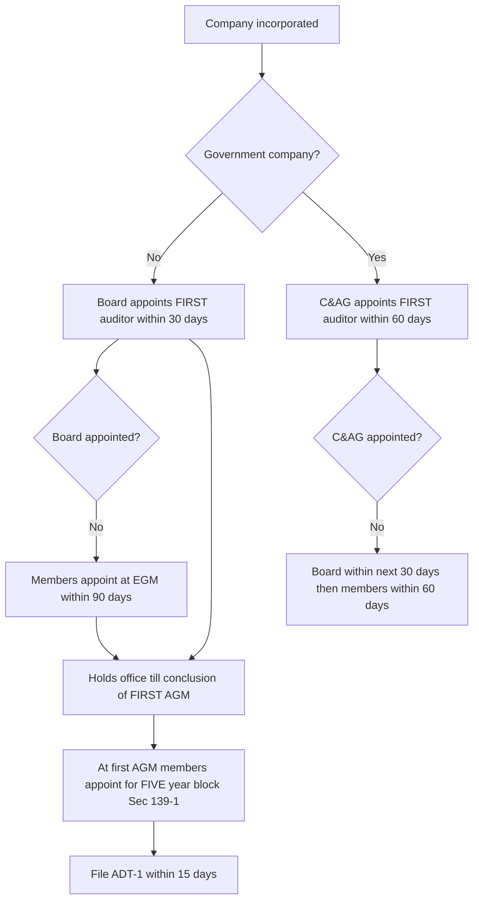
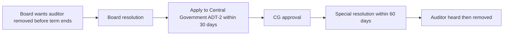
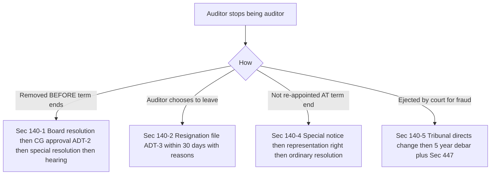
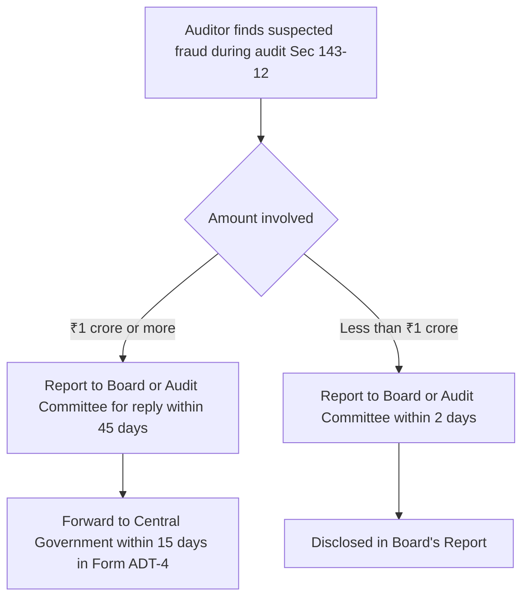
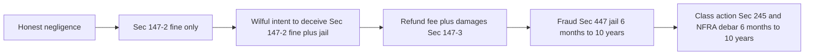

<!-- v2-deep -->

# Chapter 10 — Audit & Auditors

> Chapter XI of the Companies Act 2013, Sections 139 to 148, read with the Companies (Audit and Auditors) Rules 2014.

---

## 1. The Problem — Who watches the people who spend other people's money?

Start with the raw situation a company creates.

A company is a machine for pooling money from **many** people (shareholders, banks, debenture-holders, the public) and handing physical control of that money to a **few** people (the Board and management). The people who own the money do **not** run the business. The people who run the business do **not** own most of the money. This is the classic **agency gap**: the manager (agent) has custody, the owner (principal) has the risk.

Now watch what naturally goes wrong:

- The directors prepare the accounts **themselves**. So the same people who decide how the money was spent also decide how to *describe* how it was spent. A director who wasted crores can simply draw a rosy balance sheet and a shareholder sitting 800 km away has **no way to know**.
- A shareholder cannot walk into the warehouse and count the stock. A depositor cannot inspect the loan ledgers. The information is locked inside the company, written by the very people whose performance it grades.
- Historically this produced disaster after disaster — inflated profits to justify fat dividends and higher share prices, hidden losses, fictitious sales, siphoning through fake vendors. **Satyam (2009)** in India is the textbook case: over ₹7,000 crore of cash and bank balances simply did not exist, yet the audited accounts said they did.

So the deep problem is a **trust gap built into the corporate form itself**. Ownership is separated from control, and the controllers write their own report card. Without an outside check, "limited liability company" would just be a licence to raise public money and lie about it.

The law's answer is deceptively simple: force every company to appoint an **independent expert** — the **auditor** — whose only job is to look at the accounts management prepared and tell the *owners* (not management) whether those accounts are **true and fair**. Every rule in this chapter exists to make that watchdog (a) qualified, (b) genuinely independent, and (c) unable to be quietly silenced.

**Why "true and fair" and not "true and correct".** Notice the exact statutory phrase is *true and fair view*, never "true and correct". This is deliberate and heavily examined. Accounts are built on **estimates and judgements** — depreciation rates, provision for doubtful debts, useful life of assets, warranty provisions. No such figure is arithmetically "correct"; it is an honest estimate. So the law asks the auditor to certify that the picture is **not misleading** (fair) and grounded in fact (true) — not that every rupee is mathematically exact. An auditor who understands this will never over-promise, and an examiner who asks "does the auditor guarantee the accounts are correct?" is baiting a wrong answer: the auditor gives an **opinion**, not a guarantee, and is a **watchdog, not a bloodhound** (the classic *Kingston Cotton Mill* idea — reasonable skill and care, not suspicion of everyone).

**Why an *independent* expert and not an internal one.** A company already has an *internal auditor* and a finance department full of competent accountants. Why insist on an outsider? Because competence is not the scarce ingredient — **independence** is. An internal person depends on management for salary, promotion and continued employment; the moment their report threatens the boss, self-interest overwhelms honesty. The statutory auditor is engineered so that management holds as few levers over them as the law can manage. Keep this distinction ready: *competence detects fraud; independence makes the auditor willing to report it.* Sec 141 protects the first, Secs 139(2), 140 and 144 protect the second.

---

## 2. The Core Idea — An independent referee appointed *by the owners*, reporting *to the owners*, whom management cannot fire

Hold three ideas in your head and the whole chapter falls into place:

1. **The auditor is the shareholders' agent, not management's.** That is why the auditor is appointed by the **members in general meeting** (Sec 139), reports **to the members** (Sec 143), and can only be removed with heavy safeguards (Sec 140). Management pays the auditor but does not *own* the auditor.

2. **Independence is the whole ballgame.** A watchdog that is friends with, financially entangled with, or dependent on the person it watches is worthless. So the Act attacks every channel of capture: who *can* be an auditor (Sec 141 eligibility/disqualification), how long they can stay (Sec 139 rotation), and what *other* money they may earn from the client (Sec 144 prohibited services).

3. **Powers must match duty.** You cannot ask a watchdog to certify the truth and then lock the records away from it. So Sec 143 gives the auditor a **right of access at all times** to all books and the power to demand information — and pairs it with a **duty to report** including a duty to blow the whistle on fraud.

Mnemonic for the section spine: **"139 hire, 140 fire, 141 who's fit, 142 pay, 143 do the job, 144 don't moonlight, 145 sign, 146 attend, 147 punish, 148 cost."**

**The four "capture routes" the whole chapter is fighting.** Every provision maps to blocking exactly one of these. If you can name the route, you can regenerate the rule:

| Capture route | How management would use it | Provision that blocks it |
|---|---|---|
| **Selection** | Hand-pick a compliant auditor | Members appoint (139); disqualifications (141) |
| **Money** | Buy silence via fees, loans, side-consulting | Remuneration via GM (142); indebtedness/security caps (141(3)); Sec 144 ban |
| **Tenure/familiarity** | Let the relationship go stale until the auditor is "one of us" | Rotation (139(2)) |
| **Termination** | Fire the auditor the instant it barks | Removal gate (140(1)); representation rights (140(4)) |

Carry this table into the exam. When a question describes a *fact pattern* (a loan, a long tenure, a proposed removal), first ask "which capture route is this?" — the answer points you straight to the section.

---

## 3. Why it's built this way — design choices and the abuse each one blocks

| Design choice | The abuse it kills |
|---|---|
| Appointed **by members**, not the Board | Stops management from hand-picking a friendly auditor and reporting to itself |
| **First auditor by Board within 30 days** | A company must not operate even one day without a watchdog |
| **Five-year term with ratification removed**, then **rotation** | A cosy multi-decade relationship breeds "audit capture" — familiarity that dulls scepticism |
| **Rotation of firm/partner** (Sec 139(2)) | Prevents the auditor from becoming, in effect, part of management |
| **Sec 141 disqualifications** (no shareholding, no loans, no business relationship, indebtedness cap) | Removes every financial hook management could use to buy silence |
| **Sec 144 ban on non-audit services** | Stops the auditor auditing its *own* consultancy work — you cannot mark your own homework |
| **Sec 140 removal needs Central Government + special resolution** | Stops management from sacking an honest auditor who refuses to sign |
| **Sec 143 right of access "at all times"** | Stops management from starving the auditor of records |
| **Sec 143(12) fraud reporting** | Turns the auditor from a passive certifier into an active gatekeeper |
| **Sec 147 penalties + Sec 245 class action + civil liability** | Gives the duty teeth; an unenforced duty is decoration |

The unifying logic: **remove every reason and every route for the auditor to be captured, then arm the auditor with access and back it with liability.**

**The five recognised threats to independence (the conceptual grid).** ICAI's own framework (Code of Ethics) names five threats, and every Companies Act safeguard is aimed at one of them. Knowing the grid lets you *explain* a rule in a theory answer instead of merely reciting it:

- **Self-interest threat** — the auditor gains financially from the client (shareholding, loans, large fees, a guarantee). → Sec 141(3)(d), Sec 142.
- **Self-review threat** — the auditor would have to audit its *own* earlier work. → Sec 144 (and cost-audit/statutory-audit firewall in 148).
- **Advocacy threat** — the auditor promotes the client's position (e.g. acting as investment banker raising the client's capital). → Sec 144 (investment banking/advisory ban).
- **Familiarity threat** — long or close association dulls scepticism. → Sec 139(2) rotation; Sec 141(3)(f) relative-is-a-director bar.
- **Intimidation threat** — the client pressures the auditor (threat of removal, of losing the fee). → Sec 140 removal gate; Sec 140(4) representation right.

**Why these are *rules*, not mere *ethical guidance*.** ICAI's Code of Ethics already tells a CA to stay independent. Why did Parliament re-legislate the same idea as hard black-letter law with fines and jail? Because ethics is *self-policed by the profession*, and after Satyam the state judged self-policing insufficient for the money at stake. A rule with a criminal penalty and an external regulator (NFRA) removes the auditor's *discretion* to rationalise a compromise. This is the through-line to Sec 147 and Sec 132 at the end of the chapter.

---

## 4. Full Technical Content — section by section, each with its "why"

### 4.1 Sec 139 — Appointment of Auditors

**Why:** If the Board appointed the auditor, the watched would choose the watcher. So the power sits with the **members**, and gaps (first year, casual vacancies) are plugged so no company is ever unwatched.

**(a) First auditor of a company (other than a Government company) — Sec 139(6)**
- Appointed by the **Board within 30 days** of registration.
- If the Board fails, the **members appoint within 90 days** at an **extraordinary general meeting (EGM)**.
- Holds office **till the conclusion of the first AGM**.
- *Why 30 days:* the company starts transacting immediately; it needs a watchdog from day one, and the Board is the only body that exists before the first AGM.
- *Fine distinction — the 90 days runs from where?* The members' 90-day window runs from **registration/incorporation**, not from the expiry of the Board's 30 days. So it is not "30 + 90"; the members must act within 90 days of incorporation. Examiners love to imply "120 days" — reject it.

**(b) First auditor of a Government company — Sec 139(7)**
- Appointed by the **Comptroller and Auditor-General of India (C&AG) within 60 days** of registration.
- If C&AG fails → **Board within 30 next days** → if Board fails → **members within 60 days** at EGM.
- *Why C&AG:* public money, so the state's own auditor leads.
- *"Government company" defined (Sec 2(45)):* one in which **≥ 51% of the paid-up share capital** is held by the Central Government, a State Government, or partly by both — **including a subsidiary of a Government company**. Trap: a company where the government holds *49%* is **not** a Government company, so C&AG does **not** appoint — the ordinary Sec 139(6)/(1) route applies. Watch the percentage in the fact pattern.

**(c) Subsequent auditor — non-Government company — Sec 139(1)**
- Appointed by **members at the first AGM**, to hold office **from the conclusion of that AGM till the conclusion of the sixth AGM** — i.e. a **5-year block** (subject to Sec 139(2) rotation).
- The appointment must be **confirmed/agreed** by obtaining the auditor's written consent and a **certificate** (Sec 139(1) proviso + Rule 4) that the appointment is within limits and the auditor is eligible under Sec 141.
- Company must **inform the auditor** of the appointment and **file Form ADT-1 with the Registrar within 15 days** of the meeting.
- *Whose obligation is ADT-1?* A frequent trap: the **company**, not the auditor, files ADT-1. (Conversely, on resignation the **auditor** files ADT-3.) Match the form to the party.
- **Annual ratification is NO LONGER required.** The original 2013 Act had a proviso requiring members to *ratify* the appointment at every AGM; this was **omitted by the Companies (Amendment) Act 2017 (w.e.f. 7 May 2018)**. *Why removed:* yearly ratification was a backdoor to pressure the auditor annually — defeating the point of a secure 5-year term. **Trap: if a question is set in the old framework it may still mention ratification; for current law, ratification is gone.**
- *What "till the sixth AGM" really counts.* The term spans **five AGMs of intervening accounts** (the 2nd, 3rd, 4th, 5th and 6th). It is not "five calendar years" — it is five audited financial years, ending at the conclusion of the sixth AGM. If AGMs are delayed, the term still ends at the sixth AGM, not at a fixed date.

**(d) Subsequent auditor — Government company — Sec 139(5)**
- Appointed by **C&AG within 180 days** from the commencement of the financial year; holds office till conclusion of the AGM.
- *Contrast to lock in:* for a Government company the C&AG appoints **every year** (180-day clock, office till that AGM); there is **no 5-year block and no Sec 139(2) rotation** applied through members — the C&AG controls tenure. This is a clean point examiners test by mixing the two regimes.

**Memory hook for the timeline:** *First auditor = fast (30/90 days). Subsequent = five-year settled term. Government = C&AG leads with longer clocks (60/180).*

*Figure 4.1 — Appointment pathways ensure a company is never left without a watchdog.*

**(e) Rotation of auditors — Sec 139(2)** (the anti-familiarity rule)

**Why:** An auditor who has served the same client for decades becomes emotionally and commercially embedded — the "familiarity threat". Fresh eyes catch what tired eyes rationalise. So certain classes of company **must rotate**.

Applies to:
- Every **listed company**, and
- The following **classes of unlisted companies** (Rule 5):
  - **Unlisted public companies** with **paid-up share capital ≥ ₹10 crore**;
  - **Private companies** with **paid-up share capital ≥ ₹50 crore**;
  - **Any company** (public or private) having **public borrowings from banks/financial institutions/public deposits ≥ ₹50 crore**.

*Who is carved OUT of rotation:* **One Person Companies (OPCs)** and **small companies** are **exempt** from Sec 139(2) rotation regardless of the numbers. This is the same exemption philosophy that runs through the Act — the compliance burden of forced rotation is disproportionate for the smallest entities. Trap: a question may hand you a private company below the ₹50 crore thresholds; such a company is **not** subject to rotation at all.

Rotation limits:
- An **individual** auditor may not serve **more than one term of 5 consecutive years**.
- An **audit firm** may not serve **more than two terms of 5 consecutive years** (i.e. 10 years).
- After the maximum, a **cooling-off period of 5 years** before re-appointment in the same company.
- **Common-partner anti-avoidance:** an incoming firm that shares a common partner with the outgoing firm (whose tenure expired) cannot be appointed for the cooling-off period — otherwise firms would just swap names.
- **"Same network" anti-avoidance:** the restriction extends to audit firms **under the same network** or operating under a common brand/trade name — you cannot dodge rotation by moving the engagement to a sister firm in the network.
- Members may, by resolution, provide for **rotating the audit partner and team** at intervals, or that the firm's audit be conducted by **more than one auditor (joint audit)**.
- Transitional rule: companies existing on commencement had **3 years** to comply.
- *How past tenure is counted:* the period the individual/firm has **already served before the commencement** of these provisions is **counted** toward the 5/10-year limit. So a firm that had already audited a company for 8 years did not get a fresh 10 years — its remaining runway was reduced. This "look-back" is what makes the rotation real rather than a fresh start for incumbents.

**Memory hook:** *Individual = 1×5, Firm = 2×5, then sit out 5.*

**Worked micro-example on rotation counting.** A firm has audited Listed Co since FY 2010-11 continuously. It has completed two 5-year blocks by end of FY 2019-20 (10 years). Can it be re-appointed at the 2020 AGM? **No** — it has exhausted 2×5 and must cool off for **5 years**; the earliest it can return is after five financial years out. During cooling-off, no firm sharing a common partner or in the same network may step in as a substitute. Conclusion: an unrelated firm must be appointed for the next block.

---

### 4.2 Sec 140 — Removal, Resignation and the special notice route

**Why:** The single most dangerous moment for independence is when the auditor is about to say something management hates. If management could just fire the auditor, the watchdog could be muzzled the instant it barks. So removal is deliberately **hard**, resignation is made **transparent**, and a member's right to change the auditor is **procedurally controlled**.

**(a) Removal before expiry of term — Sec 140(1)**
Requires **all** of:
1. A **Board resolution**, then
2. **Application to the Central Government** (Form ADT-2) within **30 days** of the Board resolution, then
3. A **special resolution** of members within **60 days** of receiving CG approval, and
4. The auditor must be given a **reasonable opportunity of being heard**.

*Why the CG gate:* it inserts a neutral outsider between management and the sack, so an honest auditor cannot be quietly removed for doing the job.

*Sequence trap — the order is fixed.* Board resolution **first**, then CG application, then special resolution. A common wrong answer flips it (special resolution first). The special resolution is passed **after** CG approval; passing it before is procedurally void. Also note **both** a Board resolution *and* a special resolution are needed — an ordinary resolution never suffices for removal before term.

**(b) Resignation — Sec 140(2) & (3)**
- A resigning auditor must file **Form ADT-3** with the company and the Registrar (and with the C&AG for Government companies) within **30 days** of resignation, stating the **reasons and facts** for resigning.
- Penalty for default: **₹50,000 or the auditor's remuneration, whichever is less**, plus **₹500 per day** of continuing default (capped — confirm the current cap of ₹5 lakh in the bare Act). *(verify current figures in latest ICAI material / bare Act)*
- *Why:* a corrupt resignation ("I quit for personal reasons") could hide the fact that the auditor fled rather than sign off on fraud. Forcing disclosure of *reasons* exposes it.
- *Who is penalised?* The **auditor** (the resigning person/firm) bears this penalty — not the company. Contrast the removal default, where the company/officers are exposed. Match the defaulter to the duty.

**(c) Auditor NOT re-appointed — right to representation — Sec 140(4)**
Where a **special notice** is given for a resolution appointing *someone other than the retiring auditor*, or expressly providing that the retiring auditor shall **not** be re-appointed:
- The company must send a copy to the **retiring auditor**.
- The retiring auditor may make a **written representation** and require it to be **circulated to members**; if not circulated in time, it must be **read out at the meeting**.
- *Safety valve against abuse of the representation right:* on the company's or any aggrieved person's application, the **Tribunal** may order that the representation **need not be circulated or read out** if satisfied the right is being **abused to secure needless publicity for defamatory matter**. So the megaphone is not unconditional — it can be silenced by the NCLT if misused.
- *Why:* gives the ousted watchdog a megaphone to the owners, so a whistle-blowing auditor cannot be silently swapped out.
- *Key contrast with 140(1):* this is **NOT removal**. The auditor's term is ending naturally (or a fresh appointment is proposed); the members are simply choosing not to continue them. Hence **no CG approval and no special resolution** — a **special notice** plus an **ordinary resolution** at the meeting suffices. The single most common cross-wiring in the exam is confusing 140(1) (removal mid-term: CG + special resolution) with 140(4) (non-reappointment at term end: special notice + representation).

**(d) Tribunal-ordered removal — Sec 140(5)**
If the **Tribunal (NCLT)** is satisfied — on its own motion or on application by the CG or any person — that the auditor has **acted fraudulently or abetted/colluded in fraud**, it may **direct the company to change the auditor**. An auditor removed this way is **debarred for 5 years** and is liable under Sec 447 (fraud).
- *Interim power:* where the CG applies, the Tribunal may order that the auditor **cannot function as auditor** and the CG may appoint another auditor in the interim.
- *Debarment scope:* the 5-year bar applies to the individual **or firm**; and where a firm's partner acted fraudulently with connivance, the firm too is liable jointly and severally. *Why:* the state needs a fast route to eject a captured or crooked auditor without waiting for the members.

*Figure 4.2 — Removal is deliberately slow and gated so honest auditors cannot be muzzled.*

**The three "ways an auditor leaves" — never confuse them.** This is the single most examined distinction in the chapter, so hold all three side by side:

*Figure 4.3 — Four exits with four completely different procedures.*

---

### 4.3 Sec 141 — Eligibility, Qualifications and Disqualifications

**Why:** Two separate threats. (1) **Competence** — an unqualified person cannot detect sophisticated fraud, so only a **Chartered Accountant** may audit. (2) **Independence** — a qualified person who is financially or personally entangled with the client will not *want* to detect fraud, so a long list of relationships disqualifies.

**Eligibility — Sec 141(1) & (2):**
- Only a person who is a **Chartered Accountant** (holding a certificate of practice under the CA Act 1949) is qualified.
- A **firm** (including an **LLP**) may be appointed if a **majority of its partners** practising in India are qualified CAs. Only the CA partners may **sign** on behalf of the firm.
- *Fine point on mixed firms:* a firm may have some non-CA partners (e.g. an LLP with a company secretary or cost accountant partner) and still be eligible **provided the majority of partners practising in India are CAs**; but the audit report can be signed **only by a CA partner authorised** to do so. So eligibility is a firm-level test; signing is an individual CA-level test.

**Disqualifications — Sec 141(3):** a person is NOT eligible if they are —
- (a) a **body corporate** other than an LLP — *why: limited liability would let the auditor hide behind a corporate veil and dilute accountability;*
- (b) an **officer or employee** of the company — *why: you cannot audit yourself;*
- (c) a **partner or employee of an officer/employee** of the company — *why: closes the proxy loophole;*
- (d) a person (or their **relative or partner**) who —
  - **holds any security or interest** in the company / its subsidiary / holding / associate / fellow-subsidiary. **Relaxation:** a *relative* may hold securities of **face value up to ₹1,00,000** (Rule 10; a corrective window of 60 days applies if the limit is inadvertently exceeded, e.g. by a bonus/rights issue);
  - is **indebted** to the company (etc.) for an amount **exceeding ₹5,00,000**;
  - has given a **guarantee/security** for a third party's debt to the company **exceeding ₹1,00,000**;
  - *why: any of these gives management money-power over the auditor;*
- (e) a person or firm having a **business relationship** (directly or indirectly) with the company / subsidiary / holding / associate — beyond permitted professional/ordinary commercial arm's-length transactions — *why: a commercial dependence is a leash;*
- (f) a person whose **relative is a director or is in the employment of the company as a director or KMP** — *why: family loyalty defeats independence;*
- (g) a person in **full-time employment elsewhere**, OR who (with partners) already holds appointment as auditor of **more than 20 companies** (the ceiling; excludes OPCs, dormant, small companies and private companies with paid-up capital < ₹100 crore for counting purposes) — *why: an overloaded auditor cannot do a real audit;*
- (h) a person **convicted of an offence involving fraud** and **less than 10 years** have elapsed since conviction — *why: a proven fraudster is unfit to certify honesty;*
- (i) a person who, directly or indirectly, renders **prohibited services under Sec 144** — links the disqualification list to the non-audit-services ban.

**"Relative" — the precise net (Sec 2(77) + Rules).** Disqualification (d) and (f) turn on who counts as a *relative*. A relative means members of a **Hindu Undivided Family**, **spouse**, and persons related in the **prescribed manner** — the prescribed list is: **father (incl. step-father), mother (incl. step-mother), son (incl. step-son), son's wife, daughter, daughter's husband, brother (incl. step-brother), sister (incl. step-sister).** Trap: a **cousin, nephew, uncle, or son-in-law's relatives** are **not** relatives for this purpose; and note the list is **not fully symmetric** (e.g. brother's wife is generally not covered). If a question puts securities in the hands of the auditor's *brother* — covered; in the hands of a *cousin* — not covered.

**The security/indebtedness limits — read them precisely.** Three separate figures, three separate persons-in-scope, and one crucial asymmetry:
- **Securities/interest (₹1 lakh face value):** the base rule bars *any* holding by the **auditor, relative or partner**; the **₹1 lakh relaxation applies ONLY to a relative**, not to the auditor or partner themselves. So if the **auditor personally** holds even one share, they are disqualified — there is **no** ₹1 lakh cushion for the auditor. The cushion is a concession to the fact that an auditor cannot fully control a relative's investments.
- **Indebtedness (exceeds ₹5 lakh):** disqualified if the auditor/relative/partner **owes** the company (or its holding/subsidiary/associate) more than ₹5 lakh. *Direction matters:* this is the auditor **owing** the company. A normal creditor relationship (the company owing the auditor fees) is not this disqualification.
- **Guarantee/security (exceeds ₹1 lakh):** disqualified if they have given a guarantee or provided security for a **third party's** indebtedness to the company beyond ₹1 lakh.

**Vacation of office — Sec 141(4):** if an auditor **incurs any Sec 141(3) disqualification after appointment**, they must **vacate office immediately**, and it is treated as a **casual vacancy** (filled under Sec 139(8)). *Why immediate:* independence is a **continuing** condition, not a one-time entry test. An auditor who buys shares in the client mid-term, or whose daughter marries a director, becomes disqualified the moment it happens.

**Casual vacancy — Sec 139(8)** (worth memorising because it interlocks with 141(4)):
- Caused by **resignation** → filled by **Board within 30 days** AND **approved by members at a general meeting within 3 months** of the Board's recommendation; holds office till the next AGM.
- Caused by any **other reason** (death, disqualification, etc.) → filled by the **Board within 30 days**.
- In a **Government company** → filled by the **C&AG within 30 days**; failing which the Board within next 30 days.
- *Why resignation needs member approval but other causes don't:* resignation is a **voluntary** act that could conceal a dispute with management, so the members are brought in to bless the replacement; death/disqualification are **involuntary** events with nothing to hide, so the Board alone plugs the gap quickly.

**Memory hook for the money limits:** *"1-5-1": relative securities ₹1 lakh, indebtedness ₹5 lakh, guarantee ₹1 lakh.* Ceiling of companies = **20**.

**The 20-company ceiling — how to count correctly.** The ceiling in 141(3)(g) is **per individual CA** (20 companies), and for a **firm** it is **20 per partner** who is a CA and not otherwise disqualified. What you **exclude** from the count: **OPCs, small companies, dormant companies, and private companies with paid-up capital below ₹100 crore.** So a CA can audit hundreds of small/OPC/dormant entities and still have 20 slots for the countable classes. Trap: an examiner lists "auditor of 22 companies" but several are OPCs or small companies — after excluding them the countable figure may be well under 20, so no breach.

---

### 4.4 Sec 142 — Remuneration of Auditor

**Why:** Whoever controls the auditor's pay controls the auditor. So the *fixing* of remuneration is tied back to the appointing body.
- Remuneration is fixed in the **general meeting** or in the manner the meeting determines (the first auditor's remuneration may be fixed by the **Board**).
- It **includes** expenses incurred in connection with the audit and any facility extended, but **excludes** any sum paid for **other services** rendered at the company's request.
- *Why the exclusion is stated:* it forces a clean line between audit fees and other-service fees — the very entanglement Sec 144 targets. It also stops management from dressing up a fat "consulting fee" as audit remuneration to inflate the auditor's dependence quietly.
- *Fine point:* although members fix remuneration, the **Board fixes the first auditor's** pay because there are no members-in-AGM yet at that stage — the same logic as the Board appointing the first auditor. And where an Audit Committee exists (Sec 177), remuneration typically flows on its recommendation. The examinable one-liner: **first auditor's remuneration = Board; thereafter = general meeting (or as it determines).**

---

### 4.5 Sec 143 — Powers and Duties of Auditors

**Why:** A duty to certify the truth is meaningless without the *power* to reach the truth, and a power to inspect is pointless without a *duty* to report honestly. Sec 143 supplies both blades.

**Powers — Sec 143(1):**
- **Right of access at all times** to the **books of account and vouchers** of the company, wherever kept, and of its **subsidiaries and associate companies** (to the extent needed for consolidation).
- **Right to require information and explanation** from officers as the auditor thinks necessary — with specific inquiry duties (loans properly secured, whether book entries are prejudicial, whether personal expenses charged to revenue, whether shares allotted for cash actually received cash, etc.).
- *Why "at all times":* management must not be able to stall by saying "come back later"; delay is the friend of fraud.
- *The proviso (subsidiary access) is a right, not a courtesy:* the parent's auditor's right of access to a subsidiary's records exists so that consolidated financial statements can be honestly audited — a parent could otherwise hide losses inside a subsidiary the parent auditor cannot see.

**Duty — the audit report — Sec 143(2) & (3):**
The auditor reports **to the members** on the accounts and on every financial statement, stating whether they give a **true and fair view**. The report must state, among other things:
- whether they obtained all **information and explanations** necessary;
- whether **proper books of account** have been kept;
- whether the balance sheet and P&L **agree with the books**;
- whether the accounts comply with **accounting standards**;
- any **observation or qualification** and its effect;
- whether any director is **disqualified from being a director** under Sec 164(2);
- whether the company has **adequate internal financial controls (IFC)** and their operating effectiveness (for applicable companies);
- **disclosure of any pending litigation, foreseeable losses on long-term contracts including derivatives, delays in transferring amounts to the Investor Education and Protection Fund**, etc. (Rule 11).
- *Why report to members:* re-states the core idea — the auditor serves the owners, not the Board.

**The four types of audit opinion (heavily examined as theory).** "True and fair" is not binary; the auditor calibrates the report to what they found:
- **Unmodified (clean) opinion** — accounts give a true and fair view.
- **Qualified opinion** — "true and fair **except for**" a specific matter that is material but **not pervasive**.
- **Adverse opinion** — the accounts do **not** give a true and fair view; the misstatement is **material and pervasive**.
- **Disclaimer of opinion** — the auditor **cannot form** an opinion (e.g. denied access, insufficient evidence) — the matter is pervasive to the auditor's ability to conclude.
*Why the graded scale matters:* it lets the auditor tell the owners *precisely how bad* the problem is. Trap: a "disclaimer" is about **lack of evidence**, an "adverse" is about **presence of material error** — do not swap them.

**Duty when the answer is unsatisfactory — Sec 143(3) proviso / (4):** where any of the required matters is answered **in the negative or with a qualification**, the report must state the **reasons** for it. A qualification without reasons is itself a defective report.

**The "true and fair" duty & CARO:** the government also mandates the **Companies (Auditor's Report) Order (CARO 2020)** for prescribed companies, requiring the auditor to comment on specific risk areas (fixed assets/property, inventory, related-party loans, statutory dues, fraud reported, whistle-blower complaints, etc.). *Why: a free-form report let auditors bury bad news; CARO forces a checklist of the areas fraud usually hides in.* *Who is exempt from CARO:* banking companies, insurance companies, Sec 8 (charitable) companies, OPCs, small companies, and certain small private companies — the reporting burden is aimed at entities with public/creditor stakes.

**Duty to sign — Sec 145:** only the person appointed as auditor (or a partner so authorised) may **sign** the report; qualifications/observations/adverse remarks are **read before the company in general meeting** and are **open to inspection** by members.

**Right to attend meetings — Sec 146:** the auditor is entitled to receive notice of and attend **general meetings** (personally or through an authorised representative who is qualified to be an auditor) and be heard on any part concerning them. *Why: so the auditor can defend a qualified report directly to the owners, not have it spun by management.* *Trap:* attendance is a **right, not always a duty** — the Act lets the company require the auditor's attendance, but the core point examiners test is the **right** to attend and be heard, which management cannot deny.

**Fraud reporting — Sec 143(12)** (the gatekeeper duty — heavily examined):
If, in the course of the audit, the auditor has **reason to believe** an **offence of fraud** is being or has been committed **against the company by officers or employees**:
- If the amount is **₹1 crore or more** → report to the **Central Government** (route: to the Board/Audit Committee first for reply within **45 days**, then to the CG within **15 days** along with the reply, in **Form ADT-4**) within the prescribed time.
- If the amount is **less than ₹1 crore** → report to the **Board or Audit Committee** within **2 days**, and the matter is **disclosed in the Board's Report** (nature, amount, parties involved, remedial action).
- Failure to report is punishable under **Sec 143(15)** — for a listed company **₹5 lakh** and for others **₹1 lakh** (fine range; *verify current figures in the bare Act*).
- **Protection:** no auditor is liable for anything done or said in **good faith** in reporting; and the duty extends to **cost auditors, secretarial auditors and branch auditors** too.
- *Scope trap 1 — "against the company":* the duty is triggered by fraud **against the company by its officers/employees**. Fraud **by the company against third parties** is not the trigger of 143(12) (though it may surface elsewhere). Read the direction of the fraud.
- *Scope trap 2 — "reason to believe":* the trigger is **reason to believe**, a lower bar than proof. The auditor does not wait for certainty; a well-grounded suspicion during the audit activates the duty.
- *Why:* pre-2013, auditors could see fraud and stay silent ("not my job to police management"). Sec 143(12) converts the auditor into an **active whistle-blower** — the direct legislative response to Satyam.

**Branch audit — Sec 143(8):**
- Accounts of a **branch** may be audited by the **company's auditor** OR by **another qualified person** (a "branch auditor") appointed under Sec 139.
- A **foreign branch** may be audited by the company's auditor or by a person qualified under the **laws of that foreign country** (an accountant duly qualified there).
- The **branch auditor sends a report to the company's (principal) auditor**, who deals with it in the main audit report **as they consider necessary**.
- *Why:* a company may have branches across the country/world that one auditor cannot physically cover; but the **principal auditor stays responsible for consolidation**, so accountability is not fragmented. The principal auditor is **not automatically bound** by the branch report — they exercise their own judgement on how to treat it.

*Figure 4.4 — The fraud-reporting duty turns the auditor from passive certifier into gatekeeper.*

---

### 4.6 Sec 144 — Auditor NOT to render certain services (the independence firewall)

**Why:** The deepest capture is not a bribe — it is a **conflict of interest disguised as extra business**. If the same firm designs a company's accounting system, keeps its books, values its assets, then *audits* those very outputs, it is grading its own work and will never flag its own mistakes. Sec 144 draws a firewall: an auditor may not, directly or indirectly, render the following **prohibited services** to the company, its **holding** or **subsidiary**:

1. **Accounting and book-keeping** services;
2. **Internal audit**;
3. **Design and implementation of any financial information system**;
4. **Actuarial** services;
5. **Investment advisory** services;
6. **Investment banking** services;
7. **Rendering of outsourced financial services**;
8. **Management services**;
9. **Any other service prescribed**.

"Directly or indirectly" is defined widely to catch services rendered through **relatives, the auditor's firm, its network, or any entity in which the auditor has significant influence** — closing the "we'll just route it through an affiliate" loophole. Precisely, for an **individual** auditor it captures services rendered by the auditor, their **relative** or **any entity in which the auditor/relative has interest**; for a **firm** it captures services by the firm, its **partners**, its **parent/subsidiary/associate** entity, or **any entity whose name/brand/trademark** is used by the firm.
- *Why the exact list:* each item is a service whose *output the auditor would otherwise have to audit* — self-review threat (accounting, book-keeping, internal audit, FIS design) — or which makes the auditor an **advocate** for the client (investment banking/advisory). Permitted work (e.g. tax representation, statutory certification the law requires, other attest services) stays allowed because it does not create a self-review or advocacy conflict.
- *The transition each auditor had to make:* auditors already providing these services when the section came into force had to **cease before the first financial year** on/after commencement. So the firewall applied prospectively but promptly.
- **Memory hook:** *"A-I-D-A-I-I-O-M" — Accounting, Internal audit, Design of FIS, Actuarial, Investment advisory, Investment banking, Outsourced financial, Management."*
- *Trap — what is NOT on the list:* **tax representation/return filing, statutory certifications required by law, and other permitted attest services are allowed** (subject to the Board/Audit Committee approving them). Examiners bait with "the auditor also files the company's tax returns — is this barred?" — generally **no**, tax work is not in the Sec 144 list, though good governance routes it through the Audit Committee.

---

### 4.7 Sec 147 — Punishment / Auditor Liability

**Why:** A duty with no penalty is advice. Liability is what makes the watchdog bite.

**Company default (Sec 147(1)):** if a company contravenes Secs 139–146, the **company** is liable to fine (₹25,000–₹5,00,000) and **every officer in default** to fine (₹10,000–₹1,00,000) — *confirm current figures.*

**Auditor default (Sec 147(2)):**
- If an auditor contravenes Sec 139, 143, 144 or 145 → fine **₹25,000 to ₹5,00,000** or **four times the remuneration, whichever is less**.
- If the contravention was **wilful and with intent to deceive** the company/shareholders/creditors/tax authorities → **imprisonment up to 1 year + fine ₹50,000 up to ₹25,00,000 (or 8× remuneration, whichever is less)**. *(verify current figures)*
- *The two-tier design:* an **honest mistake or negligence** attracts only a fine; **wilful deceit** adds **imprisonment**. The dividing line is *mens rea* (intent) — the same distinction that runs through the whole penal scheme of the Act.

**Consequences of a wilful/fraudulent default — Sec 147(3):**
- **Refund the remuneration** received; and
- **Pay damages** to the company, statutory bodies or any person for loss arising from **incorrect or misleading statements** in the audit report.

**Firm-level liability — Sec 147(4)/(5):** where the auditor is a **firm** and the wrongdoing was committed **knowingly or with the connivance of a partner**, the **firm and the concerned partner(s) are jointly and severally liable** civilly and criminally.
- *Why joint-and-several partner liability:* stops a firm from ring-fencing the guilty partner and hiding behind the entity. But note the **criminal** liability attaches to the **partner(s) who acted or connived**, not automatically to innocent partners — criminal guilt needs personal fault; civil joint-and-several liability is broader.

**Other liability channels:**
- **Sec 447 (fraud)** — for fraudulent conduct, imprisonment **6 months to 10 years** + fine of the amount involved up to **3× the amount involved** (minimum imprisonment rises to 3 years where the fraud involves public interest). *Verify current figures.*
- **Sec 245 — class action** — members/depositors may sue the auditor/audit firm for damages for any improper or misleading statement or fraudulent/unlawful conduct. Where the firm is sued, liability can attach to the **firm and each responsible partner**.
- **NFRA (Sec 132)** — the **National Financial Reporting Authority** can investigate professional misconduct of auditors of prescribed (large/listed) companies, **debar** an auditor/firm for **6 months to 10 years**, and impose monetary penalties (for individuals and firms). Once NFRA takes up a matter, **ICAI's disciplinary jurisdiction over that matter is ousted** — a frequently tested "who regulates whom" point. *Why NFRA exists:* after major scandals, self-regulation by ICAI alone was seen as insufficient for the biggest companies; NFRA is an **independent public regulator** of auditors.
- **Professional misconduct under the Chartered Accountants Act 1949** — disciplinary action by ICAI for auditors of companies **outside** NFRA's remit.

**The liability ladder (from lightest to gravest).** Carry this ordering — examiners ask "what liabilities can an errant auditor face?":

*Figure 4.5 — Auditor liability escalates with intent, from a fine to jail to debarment.*

---

### 4.8 Sec 148 — Cost Records and Cost Audit (basics)

**Why:** In regulated or resource-heavy industries (power, telecom, pharma, cement, sugar, fertilisers, defence, etc.), the *cost* of production is a matter of **public interest** — it feeds price regulation, subsidy claims, anti-dumping and consumer protection. A normal financial audit checks whether the accounts are true and fair; it does **not** verify whether the *costing* is honest. So the Act creates a **separate cost audit**.

- The **Central Government** may, by order, direct that specified classes of companies (engaged in **production of prescribed goods or provision of prescribed services**) maintain **cost records** in their books, subject to turnover/thresholds prescribed in the **Companies (Cost Records and Audit) Rules 2014**.
- Where required, the audit of such cost records is done by a **Cost Accountant** (member of the Institute of Cost Accountants of India) — **not a Chartered Accountant**. *Why: costing is the cost accountant's professional domain.*
- The **cost auditor is appointed by the Board** (on the Audit Committee's recommendation where applicable) — **contrast with the financial auditor appointed by members**. Remuneration is **fixed by the Board and ratified by members** (mirror-image of the financial auditor, where members fix and — historically — ratified).
- **Disqualifications:** a person disqualified under Sec 141 cannot be a cost auditor; and the **financial (statutory) auditor cannot also be the cost auditor** — same self-review firewall logic as Sec 144.
- The cost auditor submits the **cost audit report to the Board (Form CRA-3)**; the company files it with the **Central Government (Form CRA-4)** within the prescribed time (30 days of receipt from the cost auditor). Cost records are maintained in **Form CRA-1**; the cost auditor is appointed via **Form CRA-2**.
- The provisions of **Sec 143** (powers/duties) apply to a cost auditor **as they apply to a financial auditor** — so the cost auditor has the same access and reporting spine, **including the Sec 143(12) fraud-reporting duty.**
- *Two-threshold logic in the Rules:* the Rules typically set **one threshold for maintaining cost records** and a **higher threshold for cost audit** — a company may have to keep records without being subject to a full cost audit. (*Verify current turnover limits in the latest Cost Records and Audit Rules.*)

**Memory hook:** *Financial audit = CA, appointed by members, is the account true and fair. Cost audit = Cost Accountant, appointed by Board, is the costing honest. CRA-1 records, CRA-2 appoint, CRA-3 report to Board, CRA-4 file with CG.*

**Financial auditor vs cost auditor — the exam contrast table:**

| Dimension | Financial (statutory) auditor | Cost auditor |
|---|---|---|
| Who is eligible | Chartered Accountant / CA firm | Cost Accountant (ICMAI) |
| Governing sections | 139–147 | 148 (with 143 applied) |
| Appointed by | **Members** (first auditor by Board) | **Board** (AC recommendation) |
| Remuneration | Members / general meeting | Board, **ratified by members** |
| Reports to | **Members** | **Board** (then company files with CG) |
| Certifies | Accounts true and fair | Cost records maintained and correct |
| Key forms | ADT-1 to ADT-4 | CRA-1 to CRA-4 |

---

## 5. Applied Scenarios (facts → analysis → conclusion)

**Scenario A — The relative's shares.**
*Facts:* CA Ramesh is proposed as auditor of Zeta Ltd. His wife holds equity shares in Zeta Ltd of **face value ₹1,60,000**.
*Analysis:* Sec 141(3)(d)(i) disqualifies a person if the person, **or their relative or partner**, holds any security in the company. A **relative** is allowed a corrective face-value limit of **₹1,00,000** (Rule 10). ₹1,60,000 exceeds that limit. (Note the limit is on **face value**, not market value — a classic trap.) A spouse is a "relative" under Sec 2(77).
*Conclusion:* Ramesh is **disqualified**. He can be appointed only if the excess holding is corrected within the prescribed **60-day** window; otherwise he must vacate/decline.

**Scenario B — The consulting firm that also audits.**
*Facts:* PQR & Associates are the statutory auditors of Nova Ltd. Nova's Board asks them to **design and implement Nova's new ERP-based financial information system** for a separate fee.
*Analysis:* Sec 144 prohibits an auditor from rendering **"design and implementation of any financial information system"** to the audited company, directly or indirectly. Auditing a financial system you built yourself is self-review — the very conflict the firewall blocks.
*Conclusion:* PQR & Associates **cannot** provide that service while acting as auditor. Doing so would breach Sec 144, trigger disqualification under Sec 141(3)(i) and penalties under Sec 147.

**Scenario C — The auditor who smells fraud.**
*Facts:* During the audit of Orion Ltd, auditor CA Sneha finds strong evidence that the CFO has siphoned **₹3.2 crore** through fake vendors.
*Analysis:* Sec 143(12) requires an auditor with reason to believe an offence of fraud against the company by an officer/employee to report it. Since the amount is **₹1 crore or more**, the route is: report to the **Board/Audit Committee** seeking a reply within **45 days**, then forward to the **Central Government within 15 days in Form ADT-4**. Silence attracts penalty under Sec 143(15); good-faith reporting is protected.
*Conclusion:* Sneha **must** report to the CG via the ADT-4 route. She is not liable for reporting in good faith; she **would** be liable for failing to report.

**Scenario D — Management tries to sack the auditor mid-term.**
*Facts:* The Board of Delta Ltd, unhappy that its auditor intends to qualify the accounts, passes a resolution to remove the auditor and appoint a friendlier firm immediately.
*Analysis:* Removal **before expiry of term** requires the full Sec 140(1) gauntlet: Board resolution → **application to the Central Government (ADT-2) within 30 days** → **special resolution** of members within 60 days of CG approval → auditor given a **reasonable opportunity of being heard**. A Board resolution alone is void.
*Conclusion:* Delta cannot remove the auditor by Board action. Without CG approval and a special resolution, the removal is **invalid** — the safeguard exists precisely to stop this.

**Scenario E — Too many audits.**
*Facts:* CA Vikram already holds appointment as auditor in **19 companies** (excluding OPCs, small and dormant companies). Two public companies each with paid-up capital ₹200 crore now offer him appointment.
*Analysis:* Sec 141(3)(g) caps a person at **20 companies** for the countable classes. He has 19 countable; both offered companies (paid-up ₹200 crore, so ≥ ₹100 crore) are **countable**. Accepting **both** would make 21.
*Conclusion:* He may accept **one** (reaching 20) but **not both**. Accepting both would disqualify him.

**Scenario F — The indebtedness trap with direction and threshold.**
*Facts:* CA Meera is proposed as auditor of Helix Ltd. (i) She has taken a car loan of **₹6,00,000** from Helix Ltd. In a variant, (ii) she has taken **₹4,00,000**; in another variant, (iii) it is Helix Ltd that owes **her** ₹6,00,000 in unpaid professional fees.
*Analysis:* Sec 141(3)(d)(ii) disqualifies where the auditor is **indebted to the company exceeding ₹5,00,000**. (i) ₹6,00,000 owed **by** her **to** Helix exceeds ₹5,00,000 → **disqualified**. (ii) ₹4,00,000 is within the ₹5,00,000 limit → **not** disqualified on this ground. (iii) The direction is reversed — the **company owes her**; this is not "indebtedness of the auditor" under (d)(ii), so this ground does not disqualify (though excessive/unusual dues could raise a business-relationship question under (e)).
*Conclusion:* Disqualified in variant (i); eligible in (ii) and (iii) on this ground. *Lesson:* check **both** the amount and the **direction** of the debt.

**Scenario G — Firm rotation with a common partner.**
*Facts:* AB & Co has audited Listed Star Ltd for two consecutive 5-year terms (10 years) and must rotate off. Star's Board proposes to appoint **CD & Co**, which shares one common partner, Mr. X, with AB & Co.
*Analysis:* Sec 139(2) imposes a **5-year cooling-off** on AB & Co, and the **common-partner anti-avoidance** rule bars appointing a firm that has a **common partner** with the outgoing firm during the cooling-off period. CD & Co shares partner X with AB & Co.
*Conclusion:* CD & Co **cannot** be appointed during AB & Co's cooling-off period. Star must appoint a firm with **no common partner** (and not in AB & Co's network). *Variant:* if Mr. X **retires from AB & Co** before the appointment so there is no longer a common partner, the bar on that specific ground falls away — but network-firm and brand-name restrictions still apply.

**Scenario H — Casual vacancy: resignation vs death.**
*Facts:* (i) The auditor of Comet Ltd **resigns** mid-term. (ii) In a variant, the auditor **dies** mid-term.
*Analysis:* Sec 139(8): a casual vacancy by **resignation** is filled by the **Board within 30 days** **and** must be **approved by members** at a general meeting within **3 months** of the Board's recommendation. A vacancy by **any other cause** (death, disqualification) is filled by the **Board within 30 days** — **no** separate member approval required.
*Conclusion:* (i) Board fills within 30 days **plus** members approve within 3 months; holds office till next AGM. (ii) Board alone fills within 30 days. *Lesson:* resignation is voluntary and possibly contentious, so members are brought in; death is involuntary, so speed alone matters.

**Scenario I — Non-reappointment, not removal.**
*Facts:* At the AGM of Nimbus Ltd, some members want to appoint a **new** firm instead of the retiring auditor. They give **special notice** for a resolution to that effect.
*Analysis:* This is **Sec 140(4)** (not re-appointing a retiring auditor), **not** Sec 140(1) removal. Requirements: special notice → company sends a copy to the retiring auditor → the retiring auditor may make a **written representation** and require it circulated/read out → decision by **ordinary resolution**. **No CG approval and no special resolution** are needed. If the representation is being used to secure needless defamatory publicity, the Tribunal may order it not be circulated.
*Conclusion:* The retiring auditor can be replaced by **ordinary resolution** with representation rights; management/members do **not** need CG sanction because the term is ending, not being cut short.

---

## 6. Procedure / Compliance Summary

**Appointment of first auditor (non-Govt):** Board meeting within 30 days → pass resolution → obtain written consent + Sec 139(1) certificate → intimate auditor → (no ADT-1 mandatory for first auditor per general view; confirm) holds office till first AGM.

**Appointment of subsequent auditor:** Obtain consent + eligibility certificate (Rule 4) → members pass ordinary resolution at AGM for 5-year block → company intimates auditor → **file Form ADT-1 within 15 days**.

**Casual vacancy (resignation):** Board fills within 30 days → members approve within 3 months → holds office till next AGM.

**Casual vacancy (other cause, e.g. death/disqualification):** Board fills within 30 days (no member approval needed).

**Removal before term:** Board resolution → **ADT-2 to CG within 30 days** → CG approval → special resolution within 60 days → opportunity of hearing.

**Non-reappointment (retiring auditor):** Special notice → copy to retiring auditor → representation circulated/read out → ordinary resolution (no CG, no special resolution).

**Resignation:** Auditor files **ADT-3 within 30 days** stating reasons (with C&AG too, for Govt companies).

**Fraud report (≥₹1 cr):** Board/Audit Committee (45-day reply window) → **ADT-4 to CG within 15 days**.

**Fraud report (<₹1 cr):** Board/Audit Committee within 2 days → disclosed in Board's Report.

**Cost audit:** Board appoints cost auditor (**CRA-2**) → records in **CRA-1** → report to Board (**CRA-3**) → file with CG (**CRA-4**).

| Form | Purpose |
|---|---|
| ADT-1 | Notice of appointment of auditor to Registrar (by the **company**, within 15 days) |
| ADT-2 | Application to CG for removal of auditor before term |
| ADT-3 | Notice of resignation by auditor (by the **auditor**, within 30 days, with reasons) |
| ADT-4 | Report of fraud (≥₹1 crore) to Central Government |
| CRA-1 / CRA-2 / CRA-3 / CRA-4 | Cost records / appointment / cost audit report to Board / filing with CG |

---

## 7. Connections — how this chapter wires into the rest of the Act

- **Sec 128–129 (Books of account & financial statements):** the auditor audits what these sections require management to prepare. The duty in 143 presupposes the records in 128.
- **Sec 133 (Accounting Standards):** the benchmark against which the auditor tests "true and fair"; a departure must be reported.
- **Sec 134 (Board's Report):** small frauds (<₹1 cr) reported under 143(12) are disclosed here; the auditor's qualifications feed the Board's responsibility statement.
- **Sec 164(2) (Director disqualification):** the auditor must state in the report whether any director is disqualified — the audit is a checkpoint for board hygiene too.
- **Sec 177 (Audit Committee):** in prescribed companies the Audit Committee recommends appointment/remuneration of the auditor, approves permitted non-audit services, and receives fraud reports — an extra independence layer between management and auditor.
- **Sec 132 (NFRA):** the external regulator that disciplines auditors of large/listed companies and ousts ICAI jurisdiction for those matters.
- **Sec 245 (Class action) & Sec 447 (Fraud):** the liability muscle behind Sec 147.
- **CARO 2020:** the risk-area checklist bolted onto Sec 143.
- **Chartered Accountants Act 1949:** supplies *who* is a CA and the disciplinary machinery for professional misconduct outside NFRA's remit.
- **Cost and Works Accountants Act 1959 (ICMAI):** supplies *who* is a Cost Accountant for Sec 148.

The through-line: every neighbouring section either **feeds the auditor information**, **defines the standard the auditor certifies against**, or **provides the consequence when the auditor or company fails**.

---

## 8. Traps & Examiner Tricks

- **Ratification is gone.** The proviso to Sec 139(1) requiring annual ratification was **omitted (w.e.f. 7 May 2018)**. Old materials still say "ratify at every AGM." For current law, do **not** require ratification.
- **Face value vs market value.** The relative's securities limit (₹1,00,000) is on **face value**. A question giving *market value* is baiting you.
- **Auditor has no ₹1 lakh cushion.** The ₹1 lakh securities relaxation is for a **relative** only. The **auditor/partner** holding *any* security is disqualified.
- **Direction of the debt.** Indebtedness (>₹5 lakh) means the **auditor owes the company**. The company owing the auditor is not this disqualification.
- **Individual vs firm rotation.** Individual = **one** 5-year term; firm = **two** 5-year terms; **then 5-year cooling-off**. Do not mix them up. Past service is **counted** (look-back), not reset.
- **Common partner / same network.** During cooling-off, no firm sharing a common partner **or in the same network / brand** may be appointed.
- **Who appoints whom.** Financial auditor → **members**. First auditor → **Board (30 days)**. Government company → **C&AG**. Cost auditor → **Board**. Casual vacancy by resignation needs **members' approval within 3 months**; by other reasons **Board alone**.
- **Removal vs non-reappointment.** *Removal before term* = Sec 140(1) with **CG approval + special resolution**. Merely **not re-appointing** at AGM via special notice = Sec 140(4) (representation rights, **ordinary resolution**) — no CG approval. Examiners swap these.
- **Sequence of removal.** Board resolution → CG (ADT-2) → special resolution. Passing the special resolution before CG approval is void.
- **Fraud thresholds.** **₹1 crore** is the line. ≥₹1 cr → CG via **ADT-4** (45-day + 15-day route). <₹1 cr → Board/Audit Committee within **2 days** + Board's Report. Learn both timelines.
- **"Against the company" fraud only.** Sec 143(12) triggers on fraud **against the company by officers/employees**, on **reason to believe** (not proof).
- **Body corporate can't audit — but LLP can.** Sec 141(3)(a) bars body corporates **other than LLPs**.
- **Sec 144 "directly or indirectly."** Routing a prohibited service through a relative, network firm or affiliate is still a breach. But **tax representation / statutory certification** is **not** on the prohibited list.
- **Government company % test.** ≥51% government holding. 49% is **not** a Government company — C&AG does not appoint.
- **Cost audit ≠ financial audit.** Cost auditor is a **Cost Accountant** appointed by the **Board**; the statutory auditor **cannot** also be the cost auditor. Remuneration = Board **ratified by members**.
- **Ceiling of 20 companies** excludes OPCs, dormant, small companies and (for counting) private companies with paid-up capital below ₹100 crore. For a firm it is **20 per partner**.
- **Opinion types.** Disclaimer = **lack of evidence**; adverse = **material and pervasive error**. Do not swap.
- **"At all times" access** — no examiner should catch you saying the auditor needs permission to inspect books.
- **Who files which form.** Company files **ADT-1**; auditor files **ADT-3**. Mixing these up is a giveaway.
- **NFRA vs ICAI.** For companies within NFRA's remit, NFRA disciplines and **ICAI jurisdiction is ousted** for that matter.

---

## 9. First-Principles Recap

Strip everything away and one sentence remains: **a company separates the people who own the money from the people who spend it, and lets the spenders write the report on the spending — so the law inserts an independent expert, chosen by and reporting to the owners, whom the spenders cannot silence.**

From that single idea, every rule regenerates:
- To make the watchdog **loyal to owners** → appoint by members (139), report to members (143), hard to remove (140).
- To make it **competent** → only a CA (141(1)).
- To make it **independent** → no financial or family hooks (141(3)), no self-review consulting (144), rotate before it goes native (139(2)).
- To let it **do the job** → access at all times + power to demand information (143(1)).
- To make it **bite** → duty to report fraud (143(12)) and heavy civil/criminal liability plus NFRA (147, 132, 447, 245).

If you forget a threshold, ask "which capture route or blindness is this closing?" and the provision reappears. And if you forget a *procedure*, ask "is management trying to choose, pay, keep, or fire the auditor?" — each verb points to its section (141/139 choose, 142/144 pay, 139(2) keep, 140 fire).

**One-line test of understanding.** If you can explain *why the first auditor is chosen by the Board but every later auditor by the members*, you have the whole chapter: before the first AGM the owners have not yet assembled, so the only existing organ (the Board) plugs the gap temporarily — but the moment the owners can meet, the power reverts to them, because the auditor is theirs.

---

## 10. Quick-Revision Sheet

**Key sections**

| Section | Deals with |
|---|---|
| 139(1) | Subsequent auditor — members, 5-year block |
| 139(2) | Rotation of auditors |
| 139(5)/(7) | Government company auditor — C&AG |
| 139(6) | First auditor — Board within 30 days |
| 139(8) | Casual vacancy |
| 140(1) | Removal before term — CG + special resolution |
| 140(2)/(3) | Resignation — ADT-3 within 30 days |
| 140(4) | Representation on non-reappointment |
| 140(5) | Tribunal-ordered removal for fraud |
| 141 | Eligibility, qualifications, disqualifications |
| 142 | Remuneration |
| 143 | Powers and duties; 143(8) branch audit; 143(12) fraud reporting |
| 144 | Prohibited non-audit services |
| 145 | Signing of audit report |
| 146 | Right to attend general meetings |
| 147 | Punishment / liability |
| 148 | Cost records and cost audit |
| 132 | NFRA (external regulator) |

**Key limits and time-frames**

| Item | Limit / Time |
|---|---|
| First auditor — Board appoints | within **30 days** of incorporation |
| First auditor — members (if Board fails) | within **90 days** at EGM |
| Government first auditor — C&AG | within **60 days** |
| Government subsequent auditor — C&AG | within **180 days** of FY start |
| Subsequent auditor term | **5 years** (till 6th AGM) |
| Rotation — individual / firm | **1×5 yrs / 2×5 yrs**, cooling-off **5 yrs** |
| ADT-1 filing (by company) | within **15 days** of appointment |
| Removal application to CG (ADT-2) | within **30 days** of Board resolution |
| Special resolution after CG approval | within **60 days** |
| Resignation (ADT-3, by auditor) | within **30 days** |
| Casual vacancy by resignation — member approval | within **3 months** |
| Casual vacancy by other cause — Board fills | within **30 days** |
| Relative's securities (face value) | up to **₹1,00,000** (correct within **60 days** if exceeded) |
| Indebtedness disqualification | exceeding **₹5,00,000** |
| Guarantee/security disqualification | exceeding **₹1,00,000** |
| Ceiling on number of company audits | **20** countable companies (per partner for a firm) |
| Fraud reporting threshold to CG | **₹1 crore** (ADT-4; 45-day + 15-day route) |
| Fraud below threshold — to Board/AC | within **2 days**, disclosed in Board's Report |
| Auditor conviction bar | fraud conviction within last **10 years** |
| NFRA debarment | **6 months to 10 years** |
| Cost audit report — company files CRA-4 with CG | within **30 days** of receipt |

**Rotation rule in one line:** *Individual 1×5, firm 2×5, then cool off 5 — no common-partner or same-network swap; past service counts.*

**Sec 144 prohibited-services hook:** *A-I-D-A-I-I-O-M* (Accounting, Internal audit, Design of FIS, Actuarial, Investment advisory, Investment banking, Outsourced financial, Management).

**Money-limit hook:** *1-5-1* — relative securities **₹1 lakh**, indebtedness **₹5 lakh**, guarantee **₹1 lakh**.

**Exit routes hook:** *Removed (140-1: CG + SR), Resigns (140-2: ADT-3), Not re-appointed (140-4: special notice + representation), Ejected for fraud (140-5: Tribunal + 5-yr bar).*

> Where exact penalty figures or fine caps are stated above, **confirm the current amounts in the latest ICAI study material / bare Act**, as monetary penalties are periodically amended.
