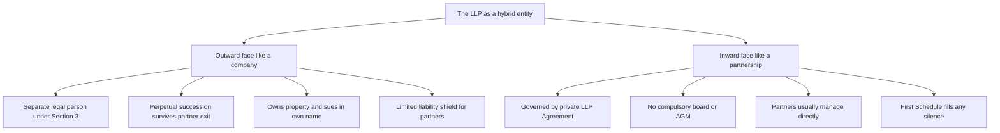
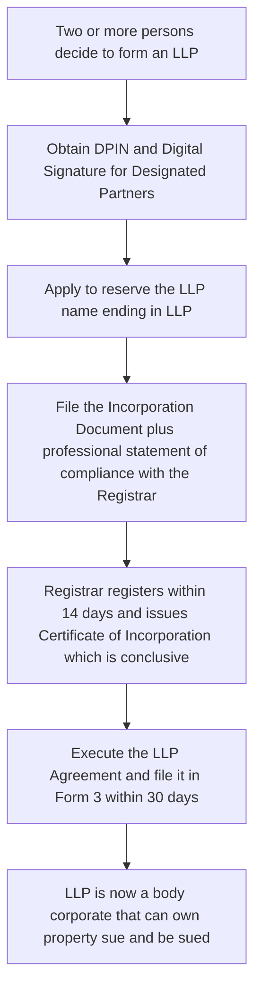
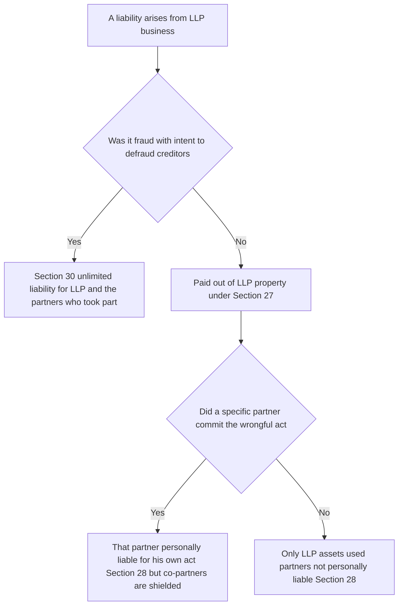
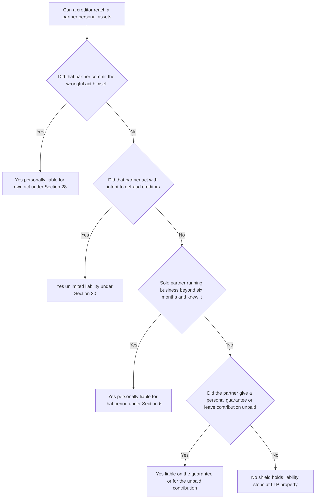

<!-- v2-deep -->

# Chapter 11 — The Limited Liability Partnership Act 2008

## 1. The Problem — Two doors, each with a trap

Imagine you are three chartered accountants, or three architects, or two friends with a software idea in 2005. You want to go into business together. India offers you exactly two legal front doors, and each one has a knife hidden behind it.

**Door 1 — The traditional Partnership (Indian Partnership Act, 1932).** It is beautiful for one reason: it is *flexible and cheap*. You and your partners simply agree — orally or on a stamp paper — how you'll share profits, who does what, how decisions get made. No minimum capital, no board meetings, no filing your accounts with a government registry for the whole world to read. You just *run the business*.

But behind this door is the trap that has ruined countless families: **unlimited, joint and several liability.** If your firm borrows Rs. 2 crore and the business collapses, the creditor does not politely limit himself to the firm's assets. He comes for your *personal house, your car, your savings* — and not just for your share, for the *entire* debt. Worse, under the "agency" principle of partnership, you are liable for the wrongful acts of your *co-partner*. Your partner in Chennai signs a reckless contract; the creditor sells *your* house in Delhi. You did nothing wrong, yet you pay everything. A traditional firm also cannot own property in its own name, cannot sue in its own name cleanly, and legally *dies* every time a partner leaves or dies (no perpetual succession). And the Partnership Act capped partners at a small number, choking growth.

**Door 2 — The Company (then Companies Act 1956).** This door solves the liability trap perfectly: **limited liability.** Your risk is capped at the money you put in. The company is a separate legal person — it owns property, sues, and survives its members. Wonderful.

But behind *this* door is a different knife: **rigidity and cost.** A company forces on you a rigid internal architecture you never asked for — a board of directors distinct from the shareholders, statutory board meetings and AGMs with quorum and notice rules, maintenance of statutory registers, mandatory audit regardless of size, filing of annual returns and financials, restrictions on how directors are paid, and a mountain of ongoing compliance. For a two-person consultancy, this is like being forced to wear a suit of armour to walk to the corner shop. The *governance* of a company is designed for a large body of passive investors and professional managers who are *different people* — but in a small professional firm, the owners *are* the managers. The company form doesn't fit them.

So the real-world abuse/failure was this: **professionals and small entrepreneurs were forced to choose between losing their house (partnership) or drowning in paperwork built for someone else (company).** There was no vehicle that gave you the *internal freedom of a partnership* and the *external shield of a company* at the same time. Talented people either stayed small to avoid personal ruin, or incorporated a company and suffocated, or took on unlimited risk and got wiped out by a partner's mistake.

**Why India needed this specifically in the professional context.** Professional-services regulation added its own twist. Chartered accountants, company secretaries and cost accountants were, under their own governing statutes, historically barred from practising through *limited-liability companies* — the regulator wanted a real human answerable for professional negligence, not a faceless corporate shield. Yet a single negligent audit could bankrupt every partner of a firm through joint liability, even partners in a different city who never touched the file. The LLP was the tailored answer: it lets a professional firm cap the *innocent* partner's exposure while still exposing the *negligent* partner personally. This is why the LLP is often described as the vehicle "built for professionals first."

The Limited Liability Partnership Act, 2008 (in force largely from 31 March 2009, with the LLP Rules 2009) was written to build a *third door* with neither knife behind it.

## 2. The Core Idea — A body corporate that thinks like a partnership

The LLP is a deliberate **hybrid**. Hold these three ideas together and the whole Act unfolds from them:

1. **Outside, it behaves like a company.** It is a *body corporate* — a separate legal person with its own name, its own property, perpetual succession (it survives partners leaving or dying), and its own liability. So creditors deal with *the LLP*, not with the partners' personal wealth.

2. **Inside, it behaves like a partnership.** The relationship *among* the partners is governed by a private contract — the **LLP Agreement** — which they write however they like. No compulsory board, no compulsory AGM, no rigid capital rules. Mutual rights and duties are whatever the partners agree.

3. **The shield is the whole point.** Each partner's liability is *limited* to their agreed contribution. Critically, **one partner is not liable for the wrongful acts of another partner** — the very trap of traditional partnership is deleted. You answer for your own misconduct, not your co-partner's.

The one-line mental model: **"An LLP is a partnership that has been given a company's skin."** The skin (separate entity + limited liability) faces the world; the partnership beats inside.

**The two-personality diagram — hold both faces in mind at once.**

*Figure 0 — One entity, two faces: the company skin faces creditors, the partnership heart faces the partners.*

**A subtle but examinable point — the LLP is a *body corporate* but NOT a *company*.** These are not synonyms. Every company is a body corporate, but not every body corporate is a company. An LLP is a body corporate created by the LLP Act, whereas a company is a body corporate created by the Companies Act. So when a question asks "Is an LLP a company?" the answer is a firm **no** — it is a *body corporate that is a separate legal entity*, which is a wider category. Examiners exploit the loose everyday habit of calling any registered business "a company."

## 3. Why it's built this way — Design choices as answers to abuses

Every peculiar rule in the Act is a patch for a specific way the earlier forms failed. Read the Act as a list of fixes:

- **Why a "body corporate" and not just a contract?** Because the partnership's fatal flaw was that it had *no separate existence* — no perpetual succession, no property-owning capacity, and partners were personally exposed. Making the LLP a body corporate (Section 3) surgically removes all of those.

- **Why must there be at least 2 partners, but no maximum?** The minimum of 2 preserves the essential "partner-*ship*" idea (you can't have a partnership with yourself). Removing the maximum fixes the old Partnership Act's cap that strangled large professional firms (think big audit or law firms with hundreds of partners).

- **Why invent "Designated Partners"?** A company has directors who are personally accountable to the regulator for compliance. A pure partnership has *nobody* the government can hold responsible for filings. If the LLP is going to enjoy limited liability, the State demands *at least someone* be personally answerable for the paperwork and legal compliance. Designated Partners are that named, accountable human interface — the price of the shield.

- **Why must at least one Designated Partner be resident in India?** So the regulator always has *somebody within reach of Indian jurisdiction* to summon. Limited liability must not become a way for everyone to hide abroad.

- **Why is the LLP Agreement optional-but-backstopped by the First Schedule?** Freedom of contract is the whole selling point, so the Act won't force terms on you. But if partners are careless and write nothing (or leave gaps), disputes would be chaos — so the **First Schedule** supplies default rules that apply *unless the agreement says otherwise*. Flexibility with a safety net.

- **Why does the shield have exceptions (fraud carve-out)?** Because limited liability is a privilege, not a license to cheat. If partners use the LLP to defraud creditors, the law must be able to *pierce* the shield — otherwise the form becomes a fraud machine. Hence Section 30.

- **Why allow conversion *into* an LLP but make conversion out harder?** Government policy wanted to *migrate* businesses into this transparent, filed, limited-liability form. So conversion from firm/private company/unlisted public company *into* LLP is expressly enabled (Schedules 2–4).

- **Why cap the partner's exposure at "contribution" rather than at zero?** The shield is not a free pass — it protects *personal* assets beyond what the partner agreed to risk. A partner who promised to contribute Rs. 10 lakh but has not yet paved it in remains liable to bring in that Rs. 10 lakh; the LLP and its creditors can look to that unpaid contribution. The line is drawn at the *bargain the partner struck*, not at nothing. This mirrors "unpaid share capital" in company law — the shareholder is liable up to the unpaid amount on the shares.

- **Why insist on public filing (Forms 3, 4, 8, 11)?** Because limited liability *externalises* risk onto creditors — they can only recover from the entity, not the humans. In exchange, the State forces the entity to be *transparent*: who the partners are, when they change, and whether the entity is solvent. Disclosure is the *quid pro quo* of the shield. A partnership hides; an LLP must show.

Once you see each provision as a plugged hole, you never have to memorise them as arbitrary facts.

## 4. Full Technical Content — Section by section, each with its "why"

> Reminder: cite the exact sections in the exam. Where a precise number or figure is one that ICAI periodically revises (especially small-LLP thresholds and penalty amounts under the 2021 amendment), I flag it — **confirm the current figure in ICAI material / the bare Act.**

### 4.1 Nature and Definition — Sections 2 and 3

**Section 3 — LLP is a body corporate.** An LLP is a **body corporate** formed and incorporated under this Act, and is a **legal entity separate from its partners**. It has **perpetual succession** — a change in partners does not affect its existence, rights, or liabilities.

*Why:* This single section imports the two "company-like" virtues the partnership lacked — separate personality and perpetual succession — killing the "firm dies when a partner leaves" problem.

**Section 2 — Key definitions** (know these precisely):
- *Business* includes every trade, profession, service and occupation. (*Why broad:* the LLP was designed for professionals, not just traders.)
- *Partner* means any person who becomes a partner in accordance with the LLP agreement.
- *Designated Partner* means a partner designated as such under Section 7.
- *LLP Agreement* means the written agreement between the partners, or between the LLP and its partners, determining their mutual rights and duties.
- *Body corporate* is defined to include an LLP, a company, and an LLP incorporated outside India — but *excludes* a corporation sole, co-operative society, and other bodies notified by the Central Government.
- *Foreign LLP* — an LLP formed/incorporated outside India which establishes a place of business in India.

**Finer definitional distinctions the exam probes.** Three points hide in Section 2 that students skate over:
1. *Business includes "profession."* This is deliberate and load-bearing — it is *why* CAs, lawyers and doctors can practise through an LLP at all. If "business" were limited to trade, the professional use-case (the whole reason the Act exists) would collapse.
2. *"Body corporate" excludes a co-operative society and a corporation sole.* Examiners love asking whether a co-operative society is a body corporate for LLP purposes — the answer is **no**, it is expressly carved out.
3. *An LLP incorporated outside India is still a "body corporate"* under the definition, but it becomes a *Foreign LLP* only when it *establishes a place of business in India*. Foreign incorporation alone does not make it a "Foreign LLP" in the Section 2 sense — the *place of business in India* is the trigger.

**Section 4 — Indian Partnership Act 1932 does NOT apply.** The provisions of the Partnership Act, 1932 do not apply to an LLP.

*Why:* An LLP is a creature of *this* Act. The old partnership law (with its unlimited-liability agency rules) is exactly what we are escaping, so it is switched off. This is a favourite exam trap — students wrongly assume the 1932 Act governs LLPs.

**Section 14 — Effect of registration.** On incorporation an LLP can, in its own name: (a) **sue and be sued**; (b) **acquire, own, hold and dispose of property** (movable/immovable, tangible/intangible); (c) **have a common seal, if it chooses** (a seal is optional); and (d) do all other lawful acts a body corporate may do.

*Why:* These are the concrete practical powers a traditional firm lacked. Note the seal is *optional* — flexibility again.

### 4.2 Nature of Liability — Section 27 and 28 (the heart of the shield)

**Section 27 — Extent of liability of the LLP.**
- An LLP is **not bound** by anything done by a partner in dealing with a person **if** (a) the partner **has no authority** to act for the LLP in that matter, *and* (b) the other person **knows** the partner has no authority *or* does not know/believe him to be a partner. (*Why:* protects the LLP from unauthorised acts, but only where the outsider was on notice.)
- The LLP **is liable** if a partner is liable for a **wrongful act or omission** done in the *course of the business* of the LLP or *with its authority*.
- **The liabilities of the LLP are met out of the property of the LLP.**

*Why the last line is gold:* it locates the debt on the *entity's* assets — the firewall between business debt and personal wealth.

**Reading Section 27 as a two-limb test (this is where marks are won).** The "not bound" limb is a cumulative test — *both* conditions must be satisfied for the LLP to escape:
- Limb (a): the partner in fact had **no authority** for that act; **and**
- Limb (b): the outsider **knew** of the lack of authority **or** did not even believe him to be a partner.

If the outsider honestly believed the partner had authority and did not know otherwise, the LLP **is** bound even by an unauthorised act — because the LLP put that person forward as a partner and must bear the cost of that appearance (the same *apparent/ostensible authority* logic as agency law). The examiner's tweak: change one fact — "the supplier had been told the partner could not sign contracts above Rs. 5 lakh" — and suddenly limb (b) is met, so the LLP escapes. Watch the outsider's *knowledge*.

**Section 28 — Extent of liability of a partner.**
- A partner is **not personally liable**, directly or indirectly, for an obligation of the LLP (whether arising in contract or otherwise) **solely by reason of being a partner.**
- **A partner is NOT liable for the wrongful act or omission of any OTHER partner.**
- BUT a partner *remains* personally liable for **his own** wrongful act or omission.

*Why:* This is the exact reversal of the traditional partnership's cruelty. In a 1932 firm, every partner is an agent of every other, so all are liable for one's wrong. Section 28 cuts that chain: you carry only your own sins.

**The three key words: "solely by reason of being a partner."** The shield attaches to *status*, not to *conduct*. It removes liability that would arise *merely because you are a partner*. It does **not** remove liability that arises from *your own act*. So the shield is porous in exactly one direction — your personal wrongdoing punches straight through it. A partner who personally guarantees an LLP loan is liable on the *guarantee* (a separate contract), not "solely by reason of being a partner" — so Section 28 gives him no protection there. This is a favourite hidden fact: a personal guarantee defeats the shield for that debt.

**Memory hook — "Your own sin, your own skin."** The shield covers you for the *firm's* debts and your *partner's* wrongs; it does *not* cover your *own* wrongdoing.

### 4.3 The exceptions that keep the shield honest — Sections 30 and 31

**Section 30 — Unlimited liability in case of fraud.**
If the LLP or any of its partners acts **with intent to defraud** creditors or for any fraudulent purpose, the **liability of the LLP and the partners who acted with such intent is UNLIMITED.** (A partner who was *not* party to the fraud keeps the shield.) There are also penalties — fine and imprisonment for those involved.

*Why:* Limited liability is a privilege granted for honest enterprise. The moment it is weaponised to cheat creditors, the law strips it away. This is the "anti-abuse" valve.

**The mental-element trap in Section 30.** The section bites only on *intent* — "with intent to defraud" or "for any fraudulent purpose." Mere *negligence*, bad judgment, or an honest business failure does **not** trigger Section 30, however large the loss. So an LLP that goes bankrupt through incompetence keeps its shield; an LLP that borrows money it *never intended to repay* loses it. The examiner's tweak: "the partners were reckless / careless / over-optimistic" — that is **not** fraud; do not apply Section 30. Only *dishonest intent* strips the shield. Also note the carve-out protects the *innocent* partner — Section 30 reaches only "the partners who acted with such intent," never a partner who knew nothing.

**Section 31 — Whistle-blowing protection.** The Tribunal may reduce or waive penalties for a partner/employee who provides useful information leading to conviction, and such persons are protected from discharge/demotion/harassment for whistle-blowing.

*Why:* Encourages insiders to expose fraud — supports Section 30's enforcement.

### 4.4 Partner as agent — Section 26

**Section 26 — Every partner is the agent of the LLP, but NOT of the other partners.**

*Why this careful wording:* In a 1932 firm each partner is agent of the firm *and* of the co-partners (that mutual agency is what spread liability). The LLP keeps partners as agents of the *entity* (so they can transact for it) but severs the agency *between partners* — which is precisely what makes Section 28's no-cross-liability rule coherent.

**Why the "agent of the LLP only" design is internally consistent.** Trace the logic chain and you see the Act is a single coherent machine, not a list of rules:
- Because a partner is agent of the **LLP** (S. 26), his authorised acts bind the **LLP** (S. 27) — so the entity, not the partners personally, carries the deal.
- Because a partner is **not** agent of the **other partners** (S. 26), his wrong cannot be imputed to them — which is exactly what S. 28 then states as no-cross-liability.
- Both rest on the entity having its own personality (S. 3) and its own property to pay from (S. 27).

Knock out any one and the others wobble. The exam reward for seeing this: you can *derive* S. 28 from S. 26 rather than memorise it.

### 4.5 Partners — Sections 5, 6, 7

**Section 5 — Who can be a partner.** Any *individual* or *body corporate* may be a partner. An individual **cannot** be a partner if: (a) declared of **unsound mind** by a competent court and the finding is in force; (b) an **undischarged insolvent**; or (c) has **applied to be adjudicated an insolvent** and the application is pending.

*Why body-corporate partners allowed:* fixes another partnership limitation — a company could not be a partner in a 1932 firm in the same clean way. It lets corporate groups structure joint ventures through LLPs.

**Fine distinctions on capacity.** (i) The disqualification for unsound mind requires a *finding by a competent court that is currently in force* — a partner who is merely eccentric, or was once ill but recovered, is not disqualified. (ii) An *undischarged* insolvent is disqualified, but a person who was insolvent and has since obtained an **order of discharge** is fine again — the word "undischarged" is doing real work. (iii) A minor cannot be a partner in an LLP — unlike the 1932 Act, which allowed a minor to be *admitted to the benefits* of a firm with consent. The LLP Act has no such minor-benefit route; a partner must be a person competent to contract or a body corporate. This 1932-vs-LLP contrast on minors is a classic tweak.

**Section 6 — Minimum number of partners.**
- An LLP must have **at least two partners**.
- If the number falls below 2 and the LLP carries on business for **more than six months** while so reduced, then the **sole remaining partner** who *knows* he is carrying on business alone becomes **personally liable** (jointly with the LLP) for obligations incurred during that period.

*Why the 6-month grace:* people leave; forcing instant dissolution would be harsh. But the shield is a group privilege — run it alone beyond six months and you personally lose the shield for that period. **Contrast trap:** there is **no upper limit** on partners (unlike a private company's 200-member cap).

**Three conditions must stack for personal liability under S. 6(2).** The sole partner is exposed only where *all* of these are true: (a) the LLP carried on business; (b) for **more than** six months while below the minimum; **and** (c) the person *knew* he was the only partner during that time. Miss any one and the shield survives:
- If a *second* partner is inducted on day 179, the six months never elapse — no personal liability.
- Liability attaches only to obligations incurred *during the excess period*, not to debts that arose while there were still two partners.
- The liability is *joint with the LLP* — the creditor can still pursue LLP assets first; the sole partner is an *additional* target, not the only one.

**Section 7 — Designated Partners (DPs).**
- **Every LLP must have at least TWO Designated Partners** who are **individuals** (a body corporate can be a partner but obviously cannot itself be a DP — its *nominee individual* can).
- **At least ONE Designated Partner must be RESIDENT IN INDIA.** "Resident in India" means a person who has **stayed in India for at least 120 days during the financial year** (this figure was amended — earlier it was 182 days; **confirm the current threshold in ICAI material / bare Act**).
- Every DP must obtain a **Designated Partner Identification Number (DPIN)** and give **prior consent** to act.
- If no partner is a DP, or if at any time there is only one DP, **every partner is deemed to be a Designated Partner.** (*Why:* ensures accountability never lapses.)

*Why DPs exist:* they are the humans **responsible for compliance** — doing all acts, matters and things required to be done by the LLP under the Act (filings, statements of account, etc.) and are **liable to all penalties** imposed on the LLP for contravention of those provisions. They are the LLP's answerable face to the Registrar.

**Deeper points on DPs the exam tests.**
- *DPIN vs DIN.* A DP needs a Designated Partner Identification Number. In practice the MCA has merged the two identifiers so that a DIN can serve as DPIN and vice-versa, but for exam wording the Act speaks of **DPIN** — do not confuse it with the plain "Partner" who needs *no* identification number at all. Only *designated* partners need the number.
- *Consent and its filing.* A DP's prior consent must be filed with the Registrar in the prescribed form. Someone cannot be made a DP against their will or by surprise.
- *The "deemed DP" safety net is automatic.* If an LLP is left with fewer than two DPs (say one DP resigns), the Act *automatically* deems **every partner** to be a DP so that compliance responsibility never falls into a vacuum — the State always has someone to hold responsible. This is the accountability twin of the S. 6 minimum-partner rule.
- *A DP is always also a partner.* You cannot be a DP without first being a partner — "designated" is a *layer added on top of* partner status, not a separate office. So an outside professional manager who is not a partner cannot be a DP.

**Memory hook — "2 DPs, 1 in India, both individuals."**

### 4.6 Incorporation — Sections 11, 12, 13, 15, 16

The birth sequence:

**Section 11 — Incorporation document.** Two or more persons *associated for carrying on a lawful business with a view to profit* subscribe their names to an **incorporation document** and file it with the **Registrar** (of the State in which the registered office is situated), along with a **statement** (by an advocate/CA/CS/Cost Accountant engaged in formation *and* by a subscriber) that all requirements of the Act regarding incorporation have been complied with.

The incorporation document must state: name of the LLP; proposed business; address of registered office; name and address of each partner; name and address of the designated partners; and other prescribed details.

*Why the professional's statement:* a compliance gate-keeper certifying legality *before* the shield is granted.

**Two hidden requirements in Section 11.** (i) The business must be "**with a view to profit**" — an LLP cannot be formed for a *not-for-profit / charitable* object. This is a genuine difference from a company, which *can* be formed for charitable purposes (Section 8 company). If a question says "they formed an LLP to run a free school with no profit motive," flag it: the profit-motive requirement is not satisfied. (ii) The statement of compliance is a *two-signature* requirement — it needs *both* a named professional (advocate/CA/CS/CMA) engaged in the formation *and* a subscriber to the incorporation document. A false statement here carries penal consequences, which is *why* the gate is trustworthy.

**Section 12 — Incorporation by registration.** The Registrar registers the document (within 14 days) and issues a **Certificate of Incorporation**, signed and sealed. The certificate is **conclusive evidence** that the LLP is incorporated.

*Why "conclusive":* gives certainty — outsiders can rely on the certificate and need not investigate the formation process.

**Section 13 — Registered office and service.** Every LLP must have a **registered office** to which communications may be addressed. A document may be served by sending it there by post/prescribed manner. Change of registered office must be filed with the Registrar.

**Section 15 — Name.** Every LLP's name must **end with "Limited Liability Partnership" or "LLP"**. The name must **not be undesirable** or identical/too similar to an existing LLP, company, or registered trademark.

*Why the mandatory suffix:* it *warns the world* that they are dealing with a limited-liability entity — creditors are on notice that recovery is capped at the LLP's assets. (Same logic as "Ltd"/"Pvt Ltd" for companies.)

**Section 16–17 — Reservation and change of name.** A name can be reserved by application; the Central Government can direct a change of name if it is identical/too nearly resembling another, or was obtained by wrong information.

**Section 21 — Publication of name and limited liability.** Every LLP must ensure its **name, registered-office address and registration number** appear on its invoices and official correspondence. Penalty for default.

*Why:* continuous public notice of limited-liability status — the "warning label" must stay on.

### 4.7 The LLP Agreement — Sections 22, 23 and the First Schedule

**Section 22 — Effect of incorporation on partners.** The persons who subscribed to the incorporation document are the LLP's partners on incorporation. Afterwards, a person may become a partner per the LLP agreement.

**Section 23 — Relationship of partners.**
- The **mutual rights and duties** of the partners, and of the LLP and its partners, are governed by the **LLP Agreement**.
- The agreement (and any changes) must be **filed with the Registrar** in the prescribed form (Form 3) within prescribed time.
- **In the absence of agreement** on any matter, the mutual rights and duties are determined by the provisions in the **FIRST SCHEDULE.**

*Why the First Schedule fallback:* freedom to contract, but no vacuum. If partners forget to address, say, profit-sharing, the Schedule fills the gap.

**Key default rules in the First Schedule (apply *only if the agreement is silent*):**
- All partners are entitled to **share equally** in the capital, profits and losses.
- The LLP must **indemnify** each partner for payments made in the ordinary and proper conduct of business.
- Every partner may **take part in the management** of the LLP.
- **No partner is entitled to remuneration** for acting in the business/management. (*A crucial default trap.*)
- **No person may be introduced as a partner without the consent of ALL existing partners.**
- Any *ordinary* matter is decided by a **majority** of partners, and every partner has **one vote**; but **no change in the nature of the business** may be made without the consent of **all** partners.
- The LLP must keep **records and accounts** open to inspection by any partner.
- **Disputes** among partners not resolved by the agreement go to arbitration-style resolution / the mechanism provided.

*Why "no remuneration by default" and "equal share by default":* these mirror the classic partnership defaults — the Act deliberately makes the LLP *feel* like a partnership when the parties say nothing.

**The "gap-by-gap" nature of the First Schedule — a point students misread.** The Schedule does not switch *on or off as a whole*. It applies matter-by-matter: on *every specific point* where the agreement is silent, the corresponding Schedule default fills in — even if the agreement covers other points. So a one-line agreement that says only "profits shared 60:40" *displaces* the equal-sharing default but leaves *every other* default (no remuneration, unanimous consent for new partners, equal management rights) fully in force. Examiner tweak: "the agreement fixed profit ratios but said nothing about salary" — the salary default (no remuneration) still applies. Read the agreement clause-by-clause against the Schedule.

**The unanimity vs majority split — worth memorising the boundary.** Under the Schedule, *ordinary* matters go by simple majority (one vote each), but three things need the consent of **all** partners: (i) introducing a **new partner**; (ii) changing the **nature of the business**; and — as a general matter of contract — (iii) any change to the **LLP Agreement** itself. The logic: majority rule for day-to-day operation, unanimity for anything that alters the fundamental *bargain* each partner joined on. A question that slips a "the majority voted to admit a new partner" fact is testing whether you know admission needs *unanimity*, not a majority.

**Memory hook — "Silence speaks the First Schedule."**

### 4.7A Contribution — Sections 32 and 33

**Section 32 — Form of contribution.** A partner's contribution may be **tangible or intangible**, movable or immovable — including **money, promissory notes, other agreements to contribute cash or property, and contracts for services performed or to be performed** (i.e. *sweat equity* / know-how). The monetary value of a non-cash contribution is accounted for and disclosed as prescribed.

**Section 33 — Obligation to contribute.** The obligation of a partner to contribute money or property is as set out in the **LLP Agreement**. A creditor who *dealt with the LLP without knowledge* of, but *relying on*, an obligation in the agreement (or an amendment) may **enforce** the original obligation even if the agreement is later changed to reduce it.

*Why these matter:* they define *what the shield is measured against.* A partner's liability is "limited to contribution" — so the Act must say what a contribution *is* (S. 32: even services count) and *when it is enforceable* (S. 33: a creditor who relied on a promised contribution can hold the partner to it). This closes an obvious abuse: partners promising Rs. 50 lakh to attract a lender, then quietly amending the agreement down to Rs. 5 lakh. **Trap:** the reduction does **not** bind a creditor who already relied on the higher figure. *(Note: the LLP Act has **no minimum contribution / minimum capital** requirement — confirm in ICAI material — which is another point of flexibility over the old company minimum-capital rules.)*

### 4.8 Cessation, changes and their filing — Sections 24, 25

**Section 24 — Cessation of partnership interest.** A person ceases to be a partner: (a) as per the **agreement**; or, if the agreement is silent, (b) by giving **30 days' notice** in writing to the other partners; or on **death**, **dissolution** of the LLP, being declared of **unsound mind**, or being **adjudged insolvent**.

Important protections:
- A former partner (or their estate) is **entitled to receive** their capital contribution and their share of accumulated profits (less losses), unless the agreement provides otherwise.
- A person who has ceased to be a partner is **still regarded, in relation to a third party, as a partner** *until* the third party has notice of the cessation *or* notice is delivered to the Registrar.

*Why the "still regarded as partner" rule:* protects outsiders who dealt with the firm believing X was a partner — the shield can't be used to spring surprises on creditors. Notice to the Registrar/third party is the cut-off. Compare Section 31/32 "holding out" logic of the 1932 Act.

**What a ceased partner does *not* get, and a key limit.** The former partner is entitled to money — the return of contribution and the share of accumulated profits — but is **not** entitled to *interfere in the management* of the LLP or to *demand the LLP be wound up* merely because he has left. His interest converts into a **financial claim**, not a continuing right to run the business. Also, the "still a partner to third parties until notice" rule protects *creditors*, but it does not resurrect the ex-partner's *management rights* — it only keeps his *liability* exposure alive toward outsiders who did not know he had left. Distinguish the *inward* effect (he is out; interest becomes a debt) from the *outward* effect (to un-notified outsiders he still looks like a partner).

**Section 25 — Registration of changes in partners.** A partner must inform the LLP of changes in his name/address; the LLP must **file notice with the Registrar within 30 days** of a person becoming or ceasing to be a partner. Penalties for default.

*Why:* keeps the public register accurate — the whole limited-liability bargain depends on outsiders being able to trust the register.

### 4.9 Financial disclosure and solvency — Sections 34, 35

**Section 34 — Maintenance of books of account, other records and audit.**
- Every LLP must maintain **proper books of account** (may be on cash or accrual basis, double-entry) at its registered office.
- Every LLP must prepare a **Statement of Account and Solvency** within **six months from the end of the financial year** and file it with the Registrar (Form 8).
- Accounts are **audited** as prescribed — but **small LLPs are exempt from audit**: audit is required only if **turnover exceeds Rs. 40 lakh** *or* **contribution exceeds Rs. 25 lakh** (**confirm current thresholds in ICAI material / bare Act**).

*Why the audit exemption:* answers the "company drowns small firms in compliance" complaint — tiny LLPs are spared mandatory audit, but larger ones must be audited to protect creditors.

**Precision on the audit test — it is disjunctive ("OR").** An LLP must be audited if it crosses **either** limb — turnover over Rs. 40 lakh **or** contribution over Rs. 25 lakh. So an LLP with only Rs. 10 lakh turnover but Rs. 30 lakh contribution **must** be audited (it crossed the contribution limb), and vice-versa. Students who read it as "AND" wrongly exempt such an LLP. Also note the *financial year* for an LLP is prescribed as ending **31 March** — an LLP cannot freely pick a December year-end the way a foreign-controlled company sometimes could; this fixes the reporting calendar and is worth stating in a well-organised answer.

**Section 35 — Annual Return.** Every LLP must file an **Annual Return** with the Registrar within **60 days of the close of the financial year** (Form 11). Penalty for default.

*Why two filings:* the Statement of Account & Solvency (Form 8) shows the *financial* picture; the Annual Return (Form 11) shows the *structural* picture (who the partners are). Together they keep the register honest — the transparency the State demands in exchange for the shield.

**A clean way to never swap the two deadlines.** Tie the deadline to *what the document is about*:
- The **Annual Return (Form 11)** is about *people/structure* — quick to compile, so a *short* window: **60 days**.
- The **Statement of Account & Solvency (Form 8)** is about *money* — you must close the books first, so a *long* window: **6 months**.
"Structure is quick — 60 days; accounts need closing — 6 months." Once you anchor the deadline to the *reason* for it, you will never reverse them under exam pressure.

### 4.10 Conversion into an LLP — Sections 55, 56, 57 and Schedules 2, 3, 4

The Act actively *invites* existing businesses to migrate into the LLP form:

| Converting from | Section | Schedule |
|---|---|---|
| Firm (partnership) → LLP | **Section 55** | **Second Schedule** |
| Private company → LLP | **Section 56** | **Third Schedule** |
| Unlisted public company → LLP | **Section 57** | **Fourth Schedule** |

**Common conditions / effects of conversion (from the Schedules):**
- **Firm → LLP:** *all* partners of the firm, and no one else, must become partners of the LLP (partners must be the *same* people).
- **Company → LLP:** *all* shareholders of the company, and no one else, become partners; there must be **no security interest (charge)** subsisting on the company's assets at the time of application; and (for the exam) generally the company must be up to date on filings.
- On registration, the Registrar issues a **Certificate of Registration** as an LLP.
- **All assets, liabilities, rights, privileges, obligations and undertakings** of the firm/company **vest in the LLP** automatically, and the firm/company is **deemed dissolved** and removed from the records of the Registrar of Firms/Companies. No separate conveyance is needed.
- **Continuing liability of partners on conversion:** for a period (commonly **60 days**), the LLP must ensure that every official correspondence bears a statement that it was converted from a firm/company and the details thereof.
- Existing agreements, contracts, and legal proceedings continue in favour of / against the LLP.

*Why conversion "vests everything automatically":* to make migration frictionless — otherwise every asset and contract would have to be individually re-assigned, which would kill adoption. **Note:** there is **no direct statutory route to convert an LLP into a company** under the LLP Act itself (that pathway is dealt with, if at all, under the Companies Act 2013 read with rules — **confirm in ICAI material**). This asymmetry reflects the policy of *pulling* businesses into the LLP form.

**Two conversion sub-traps worth carrying into the hall.**
1. *"No listed public company can convert."* Only an **unlisted** public company may convert (S. 57). A *listed* company cannot use this route — its dispersed public shareholders cannot all become partners, which would defeat the "all shareholders and no one else become partners" condition.
2. *Old liabilities survive conversion.* Conversion is **not** a way to escape the firm's/company's past debts. Every liability *vests in the LLP* and continues; and for the notice period the correspondence must disclose the conversion so creditors are not misled. A question suggesting "they converted to an LLP to wipe out the firm's earlier loan" is wrong — the loan follows the assets into the LLP. Additionally, partners of a *firm* who were personally liable for pre-conversion obligations generally remain personally liable for those *pre-conversion* debts; the shield protects them going *forward*, not retrospectively.

### 4.11 Winding up and dissolution — Sections 63–65

An LLP may be wound up either **voluntarily** or **by the Tribunal (NCLT)** (Section 64). Grounds for winding up by the Tribunal include: the LLP *decides* to be wound up by Tribunal; number of partners reduced below 2 for **more than 6 months**; inability to pay its debts; acting against the sovereignty/integrity/security of India; default in filing the Statement of Account & Solvency or Annual Return for **five consecutive financial years**; or the Tribunal being of the opinion that it is **just and equitable** to wind it up.

*Why these grounds:* they mirror the abuses the disclosure regime targets — a chronic non-filer (5 years) has defeated the transparency bargain and loses the right to exist.

*(There is also a simpler "strike-off" route for defunct LLPs under the rules — confirm the procedural detail in ICAI material.)*

**Voluntary vs Tribunal winding up — keep the two apart.** *Voluntary* winding up is *partner-initiated* (the partners resolve to wind up, subject to creditor protection). *Tribunal* winding up is *court-driven* on the statutory grounds above. The two grounds students most often mis-cite: it is **below 2 partners for more than 6 months** (not "immediately") and **default in filing for 5 consecutive financial years** (not one or two). Note the neat link back to earlier sections — the *same* 6-month threshold that triggers S. 6(2) personal liability *also* becomes a winding-up ground under S. 64, and the *same* filing duties in S. 34/35 become a winding-up ground when chronically breached. The Act is self-referential: disobeying the shield's conditions eventually dissolves the shielded entity.

### 4.12 Foreign LLPs and miscellaneous

- **Section 59 — Foreign LLPs:** a Foreign LLP establishing a place of business in India must comply with prescribed regulations. (*Why:* extends the register/notice regime to foreign entities operating here.)
- **Section 58 — Registrar's certificate of registration on conversion** is conclusive.
- **Compromise, arrangement, amalgamation** of LLPs — Sections 60–62 (Tribunal-driven, mirroring company law).

## 5. Applied Scenarios — Facts → Analysis → Conclusion

**Scenario A — The reckless co-partner.**
*Facts:* Anil, Bina and Chetan run "ABC Consultants LLP". Chetan, acting alone and negligently, gives disastrous professional advice to a client who then sues for Rs. 1 crore. The LLP's assets are only Rs. 30 lakh. The client wants to attach Anil's and Bina's personal flats.

*Analysis:* Under **Section 27**, the LLP is liable for a partner's wrongful act done in the course of its business, and that liability is met out of **LLP property**. Under **Section 28**, Anil and Bina are **not liable for Chetan's wrongful act** and are not personally liable merely for being partners. **Chetan**, however, remains personally liable for **his own** wrongful act (Section 28 proviso). No fraud is alleged, so Section 30 doesn't bite.

*Conclusion:* The client recovers Rs. 30 lakh from the LLP's assets and may pursue **Chetan personally** for the balance. **Anil's and Bina's flats are safe.** ("Your own sin, your own skin.")

**Scenario B — The vanishing partner and the trusting supplier.**
*Facts:* Deepa retires from "DEF Traders LLP" on 1 April. The LLP does not file notice with the Registrar. On 20 May, a supplier, who had earlier dealt with Deepa and did not know of her exit, extends credit to the LLP believing Deepa is still a partner. The LLP defaults.

*Analysis:* Under **Section 24**, a person who has ceased to be a partner is still **regarded as a partner in relation to a third party** until the third party has **notice** of the cessation *or* notice is filed with the **Registrar**. Here neither had happened by 20 May. Note also **Section 25** obliges the LLP to file the change within 30 days — breached.

*Conclusion:* As against this particular supplier, **Deepa may still be treated as a partner** for that transaction because the required notice had not been given. Lesson: cessation must be *published/filed* to be effective against outsiders. (This mirrors "holding out" logic and shows the shield can't ambush creditors.)

**Scenario C — Silence in the agreement.**
*Facts:* Two friends form "GH Designs LLP" but, in a hurry, never sign an LLP Agreement. G works full-time and demands a salary of Rs. 50,000 per month and a 70% profit share (arguing he does more work). H disagrees.

*Analysis:* Where the agreement is silent, **Section 23(4)** makes the **First Schedule** govern. Under the First Schedule: partners **share profits equally**, and **no partner is entitled to remuneration** for managing the business.

*Conclusion:* G is entitled to **50%** of profits, **not 70%**, and to **no salary** — unless they *agree otherwise in writing* (and file it). "Silence speaks the First Schedule." The remedy is to actually draft and file an LLP Agreement.

**Scenario D — Down to one partner.**
*Facts:* "JK Ventures LLP" had two partners; one dies on 1 January. The survivor, K, continues the business alone and by 15 August (over 6 months later) the LLP incurs a large debt.

*Analysis:* **Section 6(2):** if the LLP carries on business with fewer than 2 partners for **more than six months**, the person who is the sole partner *and knows it* becomes **personally liable** (jointly with the LLP) for obligations incurred *during* that excess period. Six months from 1 January ends around 1 July; the August debt falls in the exposed window.

*Conclusion:* K is **personally liable** for the August debt — the shield lapses for solo operation beyond six months. K should have inducted a second partner before July. (If sustained, this is also a ground for winding up under Section 64.)

**Scenario E — The fraudulent shield.**
*Facts:* Partners in "LM Exports LLP" deliberately take large advances from creditors intending never to deliver, siphoning the money out, planning to hide behind limited liability.

*Analysis:* **Section 30** — where the LLP or its partners act with **intent to defraud creditors**, the liability of the LLP *and* of the partners who acted with such intent is **UNLIMITED**, plus penalties.

*Conclusion:* The fraudulent partners **lose the shield entirely** and are personally liable without limit; a non-participating partner keeps the shield. Limited liability is for honest business, not fraud.

**Scenario F — The unpaid contribution (numerical).**
*Facts:* In "PQR Tech LLP" the LLP Agreement records agreed contributions: P Rs. 20 lakh (fully paid), Q Rs. 15 lakh (only Rs. 5 lakh actually brought in), R Rs. 10 lakh (fully paid). The LLP owes trade creditors Rs. 60 lakh and its realisable assets are only Rs. 35 lakh. Q argues that, thanks to limited liability, he owes nothing personally.

*Analysis:* Limited liability under **Section 28** caps a partner's exposure at his *agreed contribution*, but a **promised-but-unpaid** contribution is still owed to the LLP under **Sections 32–33**. Q agreed to contribute Rs. 15 lakh and has paid only Rs. 5 lakh, so Rs. 10 lakh remains an enforceable obligation. The shield does **not** wipe out a contribution the partner *undertook to bring in*.
- Assets available to creditors: Rs. 35 lakh (LLP realisable assets) + Rs. 10 lakh (Q's unpaid contribution recoverable into the LLP) = **Rs. 45 lakh.**
- Shortfall to creditors: Rs. 60 lakh − Rs. 45 lakh = **Rs. 15 lakh**, which (absent fraud under S. 30 or a personal guarantee) creditors **cannot** recover from P, Q or R personally.

*Reconciliation / self-check:* P has paid Rs. 20 lakh, Q must still pay Rs. 10 lakh (total Q exposure Rs. 15 lakh = his agreed cap — consistent with S. 28), R has paid Rs. 10 lakh. No partner pays more than his agreed contribution. Total contributions if all fully paid = 20 + 15 + 10 = **Rs. 45 lakh**, exactly the pool available once Q pays up — figures reconcile.

*Conclusion:* Q is wrong. He must bring in the unpaid **Rs. 10 lakh**; beyond that, the partners are shielded and creditors bear the Rs. 15 lakh shortfall. *(Examiner tweak: if the agreement had been quietly amended to cut Q's contribution to Rs. 5 lakh **after** a creditor lent money relying on the Rs. 15 lakh figure, S. 33 lets that creditor still enforce the original Rs. 15 lakh against Q.)*

**Scenario G — The relied-upon contribution that was later reduced.**
*Facts:* "STU Infra LLP" shows in its filed agreement that partner S will contribute Rs. 40 lakh. A bank, relying on this, lends Rs. 30 lakh. Six months later the partners amend the agreement to reduce S's contribution to Rs. 8 lakh, and S brings in only Rs. 8 lakh. The LLP defaults; assets fall short by Rs. 22 lakh.

*Analysis:* Under **Section 33(2)**, a creditor who *extended credit relying on* an obligation in the agreement may enforce the **original** obligation despite a later reduction, *unless it had notice of the change* or consented to it. The bank lent Rs. 30 lakh on the strength of S's Rs. 40 lakh promise before the reduction.

*Conclusion:* The bank can hold **S to the original Rs. 40 lakh** contribution to the extent needed to satisfy its Rs. 30 lakh claim — so S must bring in enough to cover the Rs. 22 lakh shortfall (well within Rs. 40 lakh). The later amendment does not defeat the bank. *Lesson:* limited liability protects the honest downgrade of *future* commitments, never the retrospective cheating of a creditor who already relied.

**Scenario H — Body corporate as partner and the DP requirement.**
*Facts:* "XY Ventures LLP" is to be formed by exactly two partners: an individual, Mr. X, and a private company, Y Pvt Ltd. The promoters propose that X and Y Pvt Ltd will be the two Designated Partners. Both X and Y Pvt Ltd's board are resident/registered in India.

*Analysis:* A body corporate **can** be a *partner* (S. 5), so Y Pvt Ltd's partnership is fine. But under **S. 7**, every DP must be an **individual**. Y Pvt Ltd, being a body corporate, **cannot itself be a DP** — it can only act through a **nominee individual**. An LLP needs **at least two DPs who are individuals**, with at least one resident in India.

*Conclusion:* The proposal fails. To be valid, the two DPs must be **individuals** — e.g. Mr. X and a **nominee individual of Y Pvt Ltd** — with at least one of them resident in India. *(Tweak: if the LLP ended up with only one valid DP, S. 7's safety net would deem **every** partner a DP — but Y Pvt Ltd still cannot personally be a DP; its nominee would carry the role.)*

## 6. Procedure / Compliance Summary

**A. Incorporation flow**

*Figure 1 — From decision to a living body corporate: name, document, certificate, agreement.*

**B. Annual / ongoing compliance**

| Compliance | Provision | Form | Time limit |
|---|---|---|---|
| File LLP Agreement / changes | S. 23 | Form 3 | Within 30 days |
| Notify change of partners | S. 25 | Form 4 | Within 30 days |
| Annual Return | S. 35 | Form 11 | Within **60 days** of close of FY |
| Statement of Account & Solvency | S. 34 | Form 8 | Within **6 months** of end of FY |
| Audit (if turnover > Rs. 40 lakh or contribution > Rs. 25 lakh) | S. 34 | — | With annual accounts |
| Name/LLP status on correspondence | S. 21 | — | Continuous |

*(Confirm current forms, thresholds and any late-fee/penalty figures in ICAI material / MCA rules.)*

**C. The liability decision tree**

*Figure 2 — Where the money comes from: fraud breaks the shield, own-wrong reaches one partner, everything else stops at the LLP's assets.*

**D. Conversion flow**

*Figure 3 — Migration into an LLP: conditions, certificate, automatic vesting, dissolution of the old entity.*

**E. When can a partner's personal wealth be reached — the exhaustive map**

*Figure 5 — The only five doors through the shield: own wrong, fraud, solo beyond six months, personal guarantee, and unpaid contribution.*

## 7. Connections — how this chapter links to the rest of the syllabus

- **Companies Act 2013 — "Body corporate" and "separate legal personality":** the LLP borrows the *Salomon v. Salomon* principle (separate entity, limited liability) that you studied for companies. The **piercing of the veil** for fraud (Section 30 LLP) is the cousin of lifting the corporate veil under company law.
- **Indian Partnership Act 1932:** the deliberate *contrast*. LLP switches the 1932 Act **off** (Section 4), deletes mutual agency between partners (Section 26), and the **First Schedule defaults** are consciously modelled on 1932 defaults (equal profit share, no remuneration, unanimous consent for new partners) — so learning one reinforces the other. Note the *minor* contrast: a minor can be admitted to the benefits of a 1932 firm but **cannot** be an LLP partner.
- **Number of members / "association of persons" rule (S. 464 Companies Act):** the old ceiling on partners that the LLP abolishes (no maximum).
- **Interpretation of Statutes:** the "conclusive evidence" clauses (certificates) are a neat example of a *conclusive proof* provision — no evidence may be led to contradict them. The *matter-by-matter* fallback of the First Schedule is a good illustration of a *default rule* that yields to express contract.
- **NCLT jurisdiction:** winding up and compromise/arrangement of LLPs go to the **Tribunal**, the same forum you meet in company law.
- **Unpaid share capital analogy:** an unpaid LLP *contribution* (S. 32–33) behaves like *unpaid share capital* on partly-paid shares — the owner's exposure is capped at the amount agreed but *not yet brought in*.

## 8. Traps & Examiner Tricks

1. **"The Partnership Act 1932 governs LLPs." FALSE.** Section 4 expressly disapplies it. Classic trap.
2. **Minimum vs maximum partners.** Minimum **2** partners; **NO maximum**. (Don't confuse with a private company's 200-member cap.) Minimum **2 Designated Partners**, at least one **resident in India**, both **individuals**.
3. **Falling below 2 partners.** Not instant death — a **6-month** grace; only *after* 6 months does the **sole knowing partner** become personally liable. (Winding-up ground kicks in only after 6 months too.)
4. **The residency figure.** Often tested. Currently a DP must have stayed in India **≥ 120 days** in the FY (amended down from 182) — **confirm the current figure.** Don't blindly write 182.
5. **"A partner is liable for a co-partner's wrongful act." FALSE** (Section 28) — that's the *old* partnership rule. But a partner **is** liable for his **own** wrongful act, and **all fraudsters** lose the shield (Section 30).
6. **Remuneration by default.** If the agreement is silent, **no partner gets a salary** and **profits are shared equally** — even if one partner works far more. Examiners love the "he does more work" fact pattern.
7. **Common seal is OPTIONAL** (Section 14). Don't say it's mandatory.
8. **Two annual filings, two different deadlines:** Annual Return (Form 11) within **60 days**; Statement of Account & Solvency (Form 8) within **6 months**. Swapping these is a common slip.
9. **Body corporate can be a PARTNER but cannot be a DESIGNATED PARTNER** (only individuals can be DPs — a corporate partner acts through its nominee).
10. **Cessation needs notice to bind outsiders** (Section 24): a retired partner can still be treated as a partner by a creditor until notice reaches the third party *or* the Registrar.
11. **Certificate of Incorporation is CONCLUSIVE evidence** (Section 12) — outsiders can't challenge the formation.
12. **No direct LLP → company conversion under the LLP Act.** Conversion runs *into* the LLP (firm/company → LLP), not the other way in this Act. Don't assert a symmetrical route.
13. **Audit exemption thresholds:** turnover **> Rs. 40 lakh** OR contribution **> Rs. 25 lakh** triggers audit — below both, exempt. Reversing the "OR" into "AND" is a trap.
14. **Registrar, not RoC of companies for firms:** LLPs register with the **Registrar (of LLPs)** under this Act — think MCA/Registrar, not the Registrar of Firms.
15. **"LLP is a company." FALSE.** It is a **body corporate** and a separate legal entity, but *not* a company. Every company is a body corporate; not every body corporate is a company.
16. **An LLP cannot be formed for a charitable / not-for-profit object** — Section 11 requires "a view to profit." A company *can* (Section 8). Don't equate them here.
17. **Only an UNLISTED public company can convert** to an LLP (S. 57). A *listed* company cannot.
18. **Fraud needs INTENT** (Section 30). Mere negligence, recklessness or honest business failure does **not** strip the shield — only *dishonest intent* does.
19. **Minor cannot be an LLP partner** — unlike a minor admitted to the *benefits* of a 1932 firm.
20. **Reduced contribution does not defeat a relying creditor** (Section 33) — a creditor who lent on the original figure can still enforce it despite a later amendment.
21. **Limited liability is capped at CONTRIBUTION, not at zero** — an *unpaid* agreed contribution is still recoverable into the LLP. And a *personal guarantee* by a partner is enforceable outside the shield entirely.
22. **No minimum capital / minimum contribution** requirement for an LLP *(confirm)* — a point of flexibility, not a compliance requirement to state as mandatory.

## 9. First-Principles Recap

Start from the pain and rebuild the Act:

1. **The pain:** partnership = flexible but personally ruinous (unlimited + liable for partner's wrongs + dies on exit). Company = safe but rigid and expensive.
2. **The invention:** give a partnership a **company's skin.** → **Section 3:** body corporate, separate entity, perpetual succession.
3. **Put the shield in:** debts hit the **entity's** property (S. 27); a partner isn't liable just for being one and isn't liable for a *co-partner's* wrong (S. 28). To make that coherent, sever mutual agency (S. 26).
4. **Define what the shield is measured against:** contribution can be cash, property or even services (S. 32), and an agreed contribution stays enforceable so a relying creditor is not cheated (S. 33).
5. **Keep the shield honest:** fraud → **unlimited** liability (S. 30); solo-running past 6 months → personal liability (S. 6).
6. **Keep the inside free:** mutual rights = **private LLP Agreement** (S. 23); gaps filled *matter-by-matter* by the **First Schedule** (equal share, no salary, unanimous new-partner consent).
7. **Make someone answerable to the State** (price of the shield): **2 Designated Partners, 1 resident, both individuals** (S. 7), responsible for filings and penalties; if they lapse, *every* partner is deemed a DP.
8. **Warn and inform the world** (so creditors accept a capped recovery): mandatory **"LLP" suffix** (S. 15), name on correspondence (S. 21), public **register** kept current by filing changes (S. 25) and annual disclosures — Annual Return (S. 35) and Statement of Account & Solvency (S. 34).
9. **Invite migration:** convert firm/private/unlisted-public company **into** an LLP with **automatic vesting** (S. 55–57, Schedules 2–4) — but old liabilities follow the assets in.
10. **Dissolve the entity that breaks the bargain:** solo beyond 6 months, chronic 5-year non-filing, inability to pay debts, or just-and-equitable → winding up by the Tribunal (S. 64).

If you can regenerate the section numbers from *why each one had to exist*, you have understood, not memorised.

## 10. Quick-Revision Sheet

**Key sections at a glance**

| Section | Content |
|---|---|
| S. 2 | Definitions (partner, DP, LLP agreement, body corporate, foreign LLP) |
| S. 3 | LLP is a **body corporate**, separate entity, perpetual succession |
| S. 4 | **Partnership Act 1932 does NOT apply** |
| S. 5 | Who can be a partner (individual/body corporate; not unsound-mind/insolvent; no minor) |
| S. 6 | **Min 2 partners**; below 2 for **> 6 months** → sole partner personally liable; **no maximum** |
| S. 7 | **Min 2 Designated Partners**, both individuals, **≥1 resident in India**; DPIN; consent; deemed-DP safety net |
| S. 11–12 | Incorporation document + professional statement; Certificate of Incorporation (**conclusive**) |
| S. 13 | Registered office |
| S. 14 | Powers: sue/be sued, own property, **optional** common seal |
| S. 15 | Name must end with **"LLP"/"Limited Liability Partnership"** |
| S. 21 | Name & registration number on correspondence |
| S. 22–23 | Partners; **LLP Agreement** governs mutual rights; **First Schedule** fills gaps matter-by-matter |
| S. 24 | Cessation of partner; notice needed to bind third parties; interest becomes a financial claim |
| S. 25 | File change of partners within **30 days** |
| S. 26 | Partner is agent of the **LLP**, not of other partners |
| S. 27 | LLP's liability met out of **LLP property**; two-limb "not bound" test |
| S. 28 | Partner **not liable for co-partner's** wrong; liable for **own** wrong |
| S. 30 | **Fraud (with intent) → unlimited** liability + penalties; innocent partner shielded |
| S. 31 | Whistle-blower protection |
| S. 32–33 | Contribution (cash/property/services); agreed contribution enforceable by relying creditor |
| S. 34 | Books; **Statement of Account & Solvency** (Form 8) within **6 months**; audit exemption |
| S. 35 | **Annual Return** (Form 11) within **60 days** |
| S. 55–57 | Conversion **into** LLP (Firm / Pvt Co / Unlisted Public Co) — Schedules 2/3/4 |
| S. 63–65 | Winding up (voluntary / by Tribunal) & dissolution |

**Limits & thresholds table**

| Item | Figure |
|---|---|
| Minimum partners | 2 |
| Maximum partners | None |
| Minimum Designated Partners | 2 (individuals) |
| DPs resident in India | At least 1 |
| Residency test for a DP | Stay ≥ **120 days** in the FY *(confirm)* |
| Minimum capital / contribution | None *(confirm)* |
| Grace period below 2 partners before personal liability | **6 months** |
| Certificate of Incorporation issued within | 14 days |
| File LLP Agreement / changes (Form 3) | 30 days |
| Notify change of partners (Form 4) | 30 days |
| Annual Return (Form 11) | **60 days** of FY close |
| Statement of Account & Solvency (Form 8) | **6 months** of FY end |
| Audit required if turnover > | **Rs. 40 lakh** *(confirm)* |
| Audit required if contribution > | **Rs. 25 lakh** *(confirm)* |
| Cessation default notice period (agreement silent) | **30 days** |
| Non-filing ground for winding up | **5 consecutive** FYs |
| Cessation notice / "still a partner to outsiders" until | Notice to third party or Registrar |

**The four one-liners to never forget**
1. *"A partnership wearing a company's skin"* — flexibility inside, shield outside (S. 3, S. 23, S. 28).
2. *"Your own sin, your own skin"* — you answer for your own wrong, never your partner's (S. 28), and fraud kills the shield (S. 30).
3. *"Silence speaks the First Schedule"* — no agreement → equal shares, no salary, unanimous new partners (S. 23).
4. *"2 DPs, 1 in India, both individuals"* — the accountable human face that pays for the shield (S. 7).

**The five doors through the shield (never miss one in a liability answer)**
Own wrongful act (S. 28) · Fraud with intent (S. 30) · Solo beyond 6 months (S. 6) · Personal guarantee (outside the Act) · Unpaid agreed contribution (S. 32–33).

---

**Contrast table — LLP vs Company vs Traditional Partnership** *(examiner favourite)*

| Feature | Traditional Partnership (1932) | LLP (2008) | Company (2013) |
|---|---|---|---|
| Governing law | Indian Partnership Act 1932 | LLP Act 2008 | Companies Act 2013 |
| Separate legal entity | **No** | **Yes** | **Yes** |
| Perpetual succession | No (ends on death/exit) | **Yes** | **Yes** |
| Liability of owners | **Unlimited**, joint & several | **Limited** to contribution | Limited to shares/guarantee |
| Liable for partner's/co-owner's wrong | **Yes** (mutual agency) | **No** (S. 28) | N/A |
| Min / Max members | 2 / capped (small) | 2 / **no max** | Pvt 2–200; Public 7–no max; OPC 1 |
| Minor as member | Can be admitted to benefits | **No** | No (as member/shareholder) |
| Internal governance | Free (agreement) | **Free (LLP Agreement)** | Rigid (Board, AGM, statutory registers) |
| Compulsory audit | No | **Only above thresholds** | **Yes** (generally) |
| Managed by | Partners | Partners / Designated Partners | Directors (distinct from shareholders) |
| Public filing of accounts | No | **Yes** (Form 8/11) | **Yes** |
| Can own property / sue in own name | No (through partners) | **Yes** | **Yes** |
| Charitable / not-for-profit object | Possible | **Not permitted** (view to profit) | Possible (Section 8) |
| Name must end with | — | **"LLP"** | "Limited"/"Private Limited" |

*Figure 4 (table) — The third door: LLP takes the freedom column from partnership and the shield column from company.*
