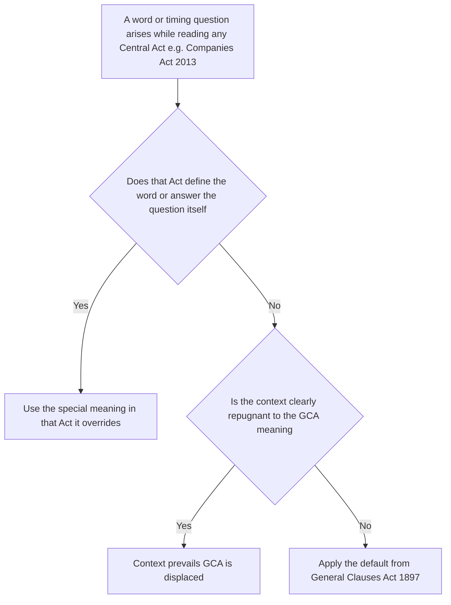
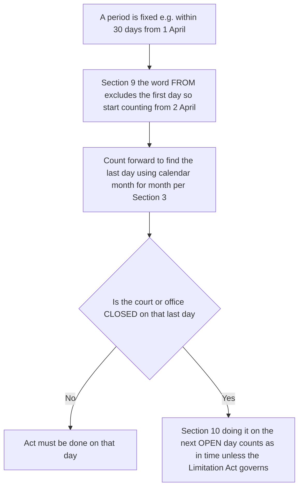
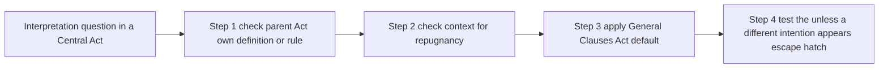

# Chapter 12 — The General Clauses Act 1897

> The General Clauses Act, 1897 — the "law about laws." Central Act No. 10 of 1897, containing 30-odd sections that supply the default meanings and interpretation rules for **every** Central Act and Regulation, including the Companies Act 2013.

---

## 1. The Problem — every statute re-inventing the wheel (and contradicting itself)

Imagine Parliament is drafting a new law — say the Companies Act. The draftsman writes "any **person** who contravenes this section shall be liable…". Immediately a question arises: does "person" mean only a living human being? What about a *company*? A *partnership firm*? A *trust*? If "person" means only humans, then a company could break the law and no one could be prosecuted, because a company is not a human.

So the draftsman stops and writes a definition: *"In this Act, 'person' includes a company, an association, and a body of individuals whether incorporated or not."* Good. Now he writes "the annual return shall be filed within one **month**." New question: is a month 30 days? 31? The calendar month? So he stops and defines "month" too. Then "year." Then "immovable property." Then "good faith." Then "oath." The Act balloons with dozens of definitions that have **nothing to do with company law** — they are just plumbing that every statute needs.

Now multiply this across **hundreds** of Central Acts. The Income-tax Act, the Negotiable Instruments Act, the Contract Act, the SEBI Act — each one separately defining "person," "month," "year," "government," "immovable property." This creates three disasters:

**Disaster 1 — bloat and waste.** The same twenty definitions are copied into hundreds of statutes. Parliament wastes time; the statute book swells with repetition.

**Disaster 2 — inconsistency.** Because each draftsman writes his own version, "month" might mean a calendar month in one Act and 30 days in another. "Person" might include companies in one law and exclude them in another. A citizen reading two laws cannot know which meaning applies. The law becomes a lottery.

**Disaster 3 — silent gaps.** Worse than inconsistency is *silence*. Suppose an Act says "file within one month" but forgets to say what happens if the **last day is a Sunday** and the court is closed. Or a new Act **repeals** an old one, but a prosecution was already pending under the old Act — does the repeal wipe out the case, letting the accused walk free on a technicality? If every statute is silent on these mechanical questions, courts must guess, and guesses differ.

There is a fourth, subtler abuse. When a new law repeals an old one, a clever defendant argues: "The offence I committed was under the *old* Act. The old Act no longer exists — it was repealed. Therefore there is no law under which I can be punished." Without a rule to the contrary, **repeal becomes an amnesty** for everyone with a pending case. Rights that had already accrued, liabilities already incurred, penalties already earned — all could evaporate the moment Parliament modernised a statute.

So the real problem is this: **statutes need a huge amount of shared, boring, mechanical machinery** — definitions, timing rules, repeal-survival rules, service rules — and if each statute must supply its own, the result is bloated, contradictory, and full of exploitable gaps.

---

## 2. The Core Idea — one master dictionary + rulebook that sits behind all laws

The solution is beautifully economical: **write the boring machinery ONCE, in a single meta-statute, and declare that it applies by default to every other Central Act unless that Act says otherwise.**

The General Clauses Act 1897 is that meta-statute. Think of it as two things bundled together:

1. **A default dictionary** (Section 3) — supplying the standard meaning of common words like "person," "month," "year," "immovable property," "good faith," "government," "offence." Any Central Act that uses these words gets the GCA meaning *automatically*, without repeating the definition — **unless** that Act supplies its own definition or the context clearly requires otherwise.

2. **A default rulebook** (Sections 5–30) — supplying standard rules for the mechanical questions every statute faces: *When does a law come into force? How do you count "from" and "to" dates? What if the last day is a holiday? What survives when a law is repealed? How is a document "served by post"? Does "he" include "she," and does the singular include the plural?*

The governing principle is the phrase you will see again and again: **"unless there is anything repugnant in the subject or context"** and **"unless a different intention appears."** This makes the GCA a **fallback, not a dictator.** It fills silences. If the Companies Act 2013 defines "financial year" its own way (and it does, in Section 2(41)), that special definition *wins*. But where the Companies Act is *silent* — say, on how to count a 30-day period, or what "good faith" means, or whether "person" includes a firm — the GCA quietly supplies the answer.

This is why the GCA is often called an **aid to interpretation** rather than a substantive law. It does not create rights or offences of its own. It is the invisible interpretive layer that makes every other Act complete, consistent, and gap-free. Learn it once; it pays interest across the entire statute book.

*The GCA as a default layer behind every Central Act.*

---

## 3. Why it's built this way — the logic behind each design choice

Every feature of the GCA answers a specific way the system could break. Learn the threat and the rule becomes obvious.

**"Why make the definitions merely a *default* rather than absolute?"** — Because a single meaning cannot fit every context. "Person" must include companies in tax law, but in a marriage law "person" clearly means a human. So the GCA gives a sensible standard meaning but always yields to the individual Act's own definition or to an obviously different context. It fills gaps without straitjacketing Parliament.

**"Why does the GCA apply only to Central Acts and Central-made Regulations?"** — Because Parliament can only legislate defaults for its *own* laws. State legislatures each have their own General Clauses Acts for state laws. The Central GCA governs Central Acts (and Regulations, and — via Section 30 — Ordinances). This is federalism: each legislature supplies the machinery for its own statute book.

**"Why does a repealed law's *effect* survive (Section 6)?"** — Precisely to defeat the "repeal is an amnesty" trick from Section 1. If repeal automatically wiped out all pending cases and accrued rights, then every legal modernisation would be a jailbreak, and no one would ever collect a debt or finish a prosecution begun under an old law. Section 6 says: repeal changes the law *going forward*, but it does **not** unwind the past — rights already accrued, liabilities already incurred, penalties already earned, and proceedings already begun all survive. The old law is dead for the future but its completed effects live on.

**"Why a special rule for counting 'from' and 'to' (Section 9)?"** — Because otherwise every deadline is ambiguous. "Within 30 days *from* 1st April" — is the 1st itself day one, or day zero? Different assumptions produce different deadlines and different winners in litigation. Section 9 fixes a single convention: the word **"from"** *excludes* the opening day; the word **"to"** *includes* the closing day. One rule, applied everywhere, kills the ambiguity.

**"Why a rule for holidays (Section 10)?"** — Because a citizen should not lose a right through no fault of his own. If the last day to file falls on a Sunday when the court is bolted shut, punishing him for filing on Monday would be unjust — he *could not* have filed on time. Section 10 says: if the office is closed on the last day, doing the act on the *next open day* counts as on-time. It protects diligence against the accident of the calendar.

**"Why deem postal service complete on posting (Section 27)?"** — Because otherwise a dishonest recipient could defeat every notice simply by refusing to receive it or denying it arrived. If service depended on proof of *actual receipt*, the recipient controls whether the law reaches him. Section 27 shifts the risk: once the sender correctly addresses, pre-pays, and posts by registered post, service is *presumed* effected in the ordinary course — and it is now the *recipient's* burden to prove it did not arrive. The sender, who did everything right, is protected.

**"Why say 'he' includes 'she' and singular includes plural (Section 13)?"** — Pure economy again. Without it, a draftsman must write "he or she," "the director or directors," endlessly. Section 13 lets statutes be written in the singular masculine as shorthand, read to cover all genders and numbers, saving oceans of words while closing the gap a literalist might exploit ("the Act says 'he,' so it doesn't apply to a woman director").

**"Why say a power to make rules includes the power to amend or rescind them (Section 21)?"** — Because a power frozen at first use is useless. If the government could issue a notification but never modify it, every rule would be permanent and un-fixable. Section 21 reads a *continuing* power into every rule-making power: whoever can make can also add to, amend, vary, or rescind — using the same procedure. It keeps delegated legislation alive and correctable.

---

## 4. Full Technical Content — section by section, each with its "why"

The GCA has three functional blocks: **(A) Preliminary & Definitions** (Ss. 1–4), **(B) General Rules of Construction** (Ss. 5–13 and the timing/gender rules), and **(C) Powers, Functionaries, and Supplemental rules** (Ss. 14–30). For the CA Intermediate exam, master the definitions in Section 3 and the construction rules in Sections 5–27.

### 4.1 Preliminary — Sections 1 to 4

- **Section 1 — Short title and extent.** The Act is the "General Clauses Act, 1897" and extends to the whole of India. *Why:* housekeeping — it names itself and fixes its territorial reach.
- **Section 3 — Definitions.** The heart of the dictionary. It defines around 65 terms that apply to the GCA itself and to *all Central Acts and Regulations made after the commencement of this Act*, **unless there is anything repugnant in the subject or context.** That closing phrase is the whole philosophy: these meanings are defaults, displaced by context.
- **Section 4 — Application of definitions to earlier Acts.** Some (not all) of the Section 3 definitions are extended to Central Acts made *before* 1897 as well. *Why:* to give even older statutes the benefit of the standard meanings, so the whole statute book — old and new — reads consistently.

### 4.2 The important general definitions — Section 3

These are the exam-favourite definitions. Each is a default meaning that flows silently into the Companies Act and every other Central Act. (Sub-clause numbers below follow the bare Act; **confirm exact clause numbers in ICAI material / bare Act**, as they shift slightly across editions.)

| Term (Section 3 clause) | Default meaning under the GCA | The "why" / the trap it closes |
|---|---|---|
| **Affidavit** [3(3)] | *Includes* affirmation and declaration, in the case of persons by law allowed to affirm or declare instead of swearing. | So a person whose religion or conscience forbids oaths can still give sworn evidence — no one is shut out of the legal process. |
| **Financial Year** [3(21)] | The year commencing on the **1st day of April**. | Fixes a uniform accounting year. *Trap:* the Companies Act 2013 has its **own** definition in **Section 2(41)** — for company law that special one governs. GCA fills only where an Act is silent. |
| **Good Faith** [3(22)] | A thing is done in "good faith" where it is in fact done **honestly, whether it is done negligently or not.** | The GCA test is **honesty, not care.** *Contrast trap:* under the Indian Penal Code, "good faith" requires **due care and attention** — the opposite emphasis. Examiners love this clash. |
| **Government / the Government** [3(23)] | *Includes* both the **Central Government** and any **State Government**. | Prevents a defendant arguing a duty owed to "the Government" meant only one tier. |
| **Immovable Property** [3(26)] | *Includes* **land, benefits to arise out of land, and things attached to the earth or permanently fastened to anything attached to the earth.** | A broad, inclusive definition so mortgages, easements, and rights over land are all covered. |
| **Movable Property** [3(36)] | Property of **every description, except immovable property.** | Defined as the *residue* — whatever is not immovable is movable. Clean and gap-free. |
| **Local Authority** [3(31)] | A municipal committee, district board, body of port commissioners, or other authority legally entitled to, or entrusted by government with, the **control or management of a municipal or local fund.** | Identifies bodies that handle public local money, for statutes conferring powers or duties on them. |
| **Month** [3(35)] | A month reckoned according to the **British (Gregorian) calendar.** | So "one month" runs from a date in one calendar month to the corresponding date in the next — **not** a fixed 30 days. This changes deadline maths. |
| **Year** [3(66)] | A year reckoned according to the **British calendar** (i.e., 1 January to 31 December). | Uniform calendar year unless the Act says otherwise (e.g., financial year). |
| **Oath** [3(39)] | *Includes* affirmation and declaration in the case of persons allowed to affirm/declare instead of swearing. | Same inclusiveness principle as "affidavit." |
| **Offence** [3(38)] | Any **act or omission made punishable by any law for the time being in force.** | Note "act **or omission**" — failing to do a required thing is an offence too. And "for the time being in force" ties it to current law. |
| **Person** [3(42)] | *Includes* any **company or association or body of individuals, whether incorporated or not.** | The keystone definition. It lets statutes bind and prosecute **companies and firms**, not just humans. Without it, corporate liability would collapse. |
| **Registered** (re a document) [3(49)] | Registered in India under the law for the registration of documents (the Registration Act) for the time being in force. | Ties the word to the actual registration regime. |
| **Rule** [3(51)] | A rule made in exercise of a power conferred by any enactment; *includes* a Regulation made as a rule under any enactment. | Distinguishes delegated rules from the parent Act. |
| **Document** [3(18)] | Any matter expressed or described upon any substance by letters, figures, or marks, intended to be used for recording that matter. | Broad enough to cover writings, maps, inscriptions — anything recording meaning. |
| **Imprisonment** [3(27)] | Imprisonment of either description (rigorous or simple) as defined in the Indian Penal Code. | Borrows the IPC meaning so sentencing terms are consistent. |
| **Swear / Oath** & **Writing** [3(65)] | Expressions referring to "writing" are construed as *including* printing, lithography, photography, and other modes of representing or reproducing words in visible form. | So "in writing" future-proofs against new recording technologies. |

**Why definitions matter for a company-law paper:** the Companies Act 2013 constantly uses words like "person," "document," "month," "immovable property," "good faith," "registered." Where the 2013 Act does not itself define them (and it does not define most), the GCA meaning is what a court applies. So these are not trivia — they are the *actual* operative meanings in your main Act.

### 4.3 Coming into operation — Section 5

**Problem it fixes:** A Bill becomes an Act, but *from which moment* is it binding law? If the Act itself forgets to say, when does it start?

**Rule (Section 5):** Where any Central Act is **not expressed to come into operation on a particular day**, it comes into operation on the day it **receives the assent** — of the President (after the Constitution; of the Governor-General before it). *Why:* fills the silence with a definite, verifiable moment — assent — so there is never a limbo period of doubt.

**Fine point (interpretation of "commencement"):** an enactment comes into force at the **beginning of the day** on which it commences — i.e., the immediately preceding midnight. So a law commencing "on 1 April" is in force from the first instant of 1 April.

### 4.4 Effect of repeal — Section 6 (the star section)

**Problem it fixes:** the "repeal-as-amnesty" abuse. When a new Central Act repeals an old one, does everything done under the old law vanish?

**Rule (Section 6):** Where any Central Act or Regulation *made after the commencement of the GCA* repeals any enactment, then **unless a different intention appears**, the repeal shall **NOT**:

| Section 6 clause | The repeal does NOT… | Reason |
|---|---|---|
| **6(a)** | revive anything not in force or existing at the time the repeal takes effect | Repealing Law B does not resurrect the older Law A that B had itself replaced — no zombies. |
| **6(b)** | affect the **previous operation** of the repealed enactment or anything **duly done or suffered** under it | Past actions stand; you cannot un-ring the bell. |
| **6(c)** | affect any **right, privilege, obligation or liability acquired, accrued or incurred** under the repealed enactment | Accrued rights and liabilities survive — a debt owed stays owed. |
| **6(d)** | affect any **penalty, forfeiture or punishment incurred** for any offence under the repealed enactment | Guilt already incurred is not washed away by repeal. |
| **6(e)** | affect any **investigation, legal proceeding or remedy** in respect of the above; such proceeding may be **continued or enforced** as if the repealing Act had not been passed | Pending cases proceed to conclusion under the old law. |

**Memory hook — the "5 survivors" (a-b-c-d-e):** No-revival, Previous operation, Accrued rights, incurred Penalties, pending Proceedings. Repeal kills the law's *future*; Section 6 preserves its *finished past.*

**Crucial qualifier — "unless a different intention appears."** If the repealing Act *itself* says the old proceedings die, that wins. Section 6 is a default, not a straitjacket.

### 4.5 Repeal-and-re-enactment; textual amendments — Sections 6A, 7, 8, 24

- **Section 6A — Repeal of an Act that only made a textual amendment.** If Act X merely inserted/amended words into Act Y, and X is later repealed, the *amendment already made to Y* is **not undone** (unless a different intention appears). *Why:* an amending Act, once it has done its surgery, is spent; repealing the spent scalpel does not reverse the surgery.
- **Section 7 — Revival of repealed enactments.** To *revive* a wholly or partly repealed enactment, the reviving Act must **expressly state** the revival. *Why:* revival is a serious step; it must be deliberate and explicit, never accidental.
- **Section 8 — Construction of references to repealed enactments.** Where an Act is repealed and **re-enacted** (with or without modification), any reference in another law to the repealed provision is read as a reference to the **corresponding provision** in the new law. *Why:* so a repeal-and-replace does not silently break every cross-reference in the statute book.
- **Section 24 — Continuation of orders, rules, etc.** Where a law is repealed and re-enacted, any rule, notification, order, appointment, etc. made under the old law **continues in force** as if made under the new law, so far as consistent, until superseded. *Why:* avoids a governance vacuum between old and new regimes.

### 4.6 Computation of time — Sections 9 and 10

These two are the arithmetic engine of every deadline.

- **Section 9 — "from" and "to."** In any Central Act, to express the *first* in a series of days or any other period of time, use the word **"from"** — and that first day is **EXCLUDED.** To express the *last*, use **"to"** — and that last day is **INCLUDED.** Mnemonic: **"From = First out; To = Terminal in."**

- **Section 10 — court/office closed on the last day.** Where any act or proceeding is directed to be done in a **court or office** on a certain day or within a prescribed period, and the court/office is **closed** on that day (or the last day of the period), the act is deemed done **in time** if done on the **next day the court/office is open.** *Proviso:* Section 10 does **NOT apply** to acts/proceedings governed by the **Limitation Act, 1963** (which has its own equivalent rule in its Section 4). *Why the carve-out:* to avoid two overlapping holiday rules for the same limitation matter.

*Counting a deadline the GCA way — Sections 9 and 10 working together.*

### 4.7 Gender, number, and continuing powers — Sections 13, 14, 16, 21, 22

- **Section 13 — Gender and number.** In every Central Act, unless the context otherwise requires: **(1)** words importing the **masculine gender** are taken to **include females**; **(2)** words in the **singular include the plural**, and vice versa. *Why:* lets statutes be drafted compactly while covering everyone.
- **Section 14 — Powers exercisable "from time to time."** Where a power is conferred by a Central Act, it may be exercised **from time to time** as occasion requires (unless a different intention appears). *Why:* a power is not exhausted by a single use.
- **Section 16 — Power to appoint includes power to suspend or dismiss.** The authority that can *appoint* a person can also **suspend or dismiss** that person (unless a different intention appears). *Why:* accountability — whoever hires can fire.
- **Section 21 — Power to make also power to amend/rescind.** A power to issue **notifications, orders, rules or bye-laws** *includes* the power to **add to, amend, vary, or rescind** them, exercised the **same way** and subject to the same conditions as the original power. *Why:* keeps delegated legislation living and correctable. (Note: this applies to *executive/legislative* instruments, not to quasi-judicial orders, which cannot be casually reopened.)
- **Section 22 — Anticipatory action between passing and commencement.** Where an Act is not yet in force but empowers rule-making, the rules may be **made in advance** so they are ready the moment the Act commences (though they take effect only on commencement). *Why:* prevents a machinery gap on day one.

### 4.8 Offences, fines, and double jeopardy — Sections 25, 26

- **Section 25 — Recovery of fines.** Provisions of the Code of Criminal Procedure for the time being in force relating to recovery of fines apply to fines imposed under any Act (unless the Act says otherwise). *Why:* one uniform machinery to collect fines.
- **Section 26 — Offence punishable under two or more enactments.** Where an act or omission is an offence under **two or more enactments**, the offender may be **prosecuted and punished under either or any** of them — **but shall NOT be punished twice for the same offence.** *Why:* mirrors the *double jeopardy* protection (Article 20(2) of the Constitution). You can be *charged* under multiple laws, but not *punished twice* for one wrong.

### 4.9 Service of documents by post — Section 27

**Problem it fixes:** a recipient dodging notices by denying receipt.

**Rule (Section 27):** Where any Central Act requires a document to be **served by post** (whether the word used is "serve," "give," "send" or the like), then **unless a different intention appears**, service is **deemed to be effected** by: **(1)** properly **addressing**, **(2)** **pre-paying**, and **(3)** **posting by registered post** a letter containing the document — and **unless the contrary is proved**, service is deemed to have occurred **at the time the letter would be delivered in the ordinary course of post.**

**Two limbs to memorise:**
- **Presumption of *effecting* service** = arises on correct addressing + pre-paying + registered posting.
- **Presumption of *time* of service** = ordinary course of post — but **rebuttable** ("unless the contrary is proved").

*Why:* the sender who does everything right is protected; the burden shifts to the recipient to disprove delivery. This section is directly relevant to serving notices under the Companies Act 2013.

### 4.10 Reach into Ordinances — Section 30

Section 30 applies the GCA's rules to **Ordinances** promulgated by the President/Governor as if they were Central Acts. *Why:* an Ordinance is temporary law with full force; it needs the same interpretive machinery.

---

## 5. Applied Scenarios — facts → legal analysis → conclusion

**Scenario 1 — "Person" includes a company (Section 3(42)).**
*Facts:* A penal section of a Central Act says "**any person** who fails to file the prescribed statement shall be punishable with fine." Zenith Ltd, a company, fails to file. Zenith argues: "A company is not a *person* — it is an artificial entity, not a human being — so I cannot be prosecuted."
*Analysis:* The Act does not itself define "person," so the GCA default applies. Under **Section 3(42)**, "person" *includes* any company or body of individuals, incorporated or not. Nothing in the penal context is repugnant to that meaning — indeed the section is aimed at filing entities like companies.
*Conclusion:* "Person" covers Zenith Ltd. The company can be prosecuted and fined. Its argument fails.

**Scenario 2 — Repeal does not kill a pending prosecution (Section 6).**
*Facts:* Mr A committed an offence under the (imaginary) Old Regulation Act, 2010. A prosecution was launched. In 2024, Parliament repeals the 2010 Act and replaces it with a new Act. The new Act is silent on pending cases. Mr A moves to quash the prosecution, arguing the offence-creating law no longer exists.
*Analysis:* The repeal is by a Central Act made after 1897, so **Section 6** applies **unless a different intention appears** — and here the new Act is silent, so no contrary intention. Under **Section 6(c), (d) and (e)**, the repeal does not affect a liability *incurred*, a penalty *incurred*, or a *legal proceeding* in respect of an offence under the repealed Act; such proceeding may be **continued as if the Act had not been repealed.**
*Conclusion:* The prosecution survives and continues to judgment under the old law. Mr A cannot escape via the repeal.

**Scenario 3 — Counting "30 days from" with a closed office (Sections 9 and 10).**
*Facts:* A Central Act requires a return to be filed **"within 30 days from 1st April."** Counting 30 days, the last day works out to **1st May**, which happens to be a public holiday when the filing office is closed. The company files on **2nd May.** The department alleges late filing.
*Analysis:* Under **Section 9**, "**from** 1st April" **excludes** 1st April; counting begins 2nd April. The 30th day is the last day. Under **Section 10**, because the office was **closed** on that last day (1st May), doing the act on the **next open day** (2nd May) is deemed done **in time** — provided this is not a matter governed by the Limitation Act, 1963.
*Conclusion:* The filing on 2nd May is **in time**. No late-filing default.

**Scenario 4 — "Good faith": honesty vs. due care (Section 3(22) vs IPC).**
*Facts:* A public officer, acting under a Central Act (not the IPC), makes an honest but *negligent* decision. He claims protection for acts done "in good faith." Opposing counsel says his negligence destroys good faith.
*Analysis:* For the Central Act in question, the GCA definition governs. Under **Section 3(22)**, a thing is done in good faith if done **honestly, whether negligently or not.** Negligence does *not* by itself negate good faith under the GCA. (Only if the statute were the **IPC**, whose own definition requires *due care and attention*, would negligence defeat good faith.)
*Conclusion:* Under the GCA standard, the officer acted in good faith despite the negligence; the protection holds.

**Scenario 5 — Service by post presumed effected (Section 27).**
*Facts:* A company sends a statutory notice to a member by **registered post**, correctly addressed and pre-paid. The member later claims he "never received it" and the notice is invalid.
*Analysis:* The Act requires service "by post." Under **Section 27**, service is **deemed effected** by correctly addressing, pre-paying and posting by registered post; and deemed to occur when the letter would arrive in the ordinary course — **unless the contrary is proved.** A bare denial of receipt is generally not enough to rebut the presumption without cogent evidence.
*Conclusion:* Service is presumed valid; the burden lies on the member to prove non-delivery. His unsupported denial likely fails.

---

## 6. Procedure / Compliance summary — how to *use* the GCA when reading any Act

The GCA is not "complied with" like a filing requirement; it is *applied* as an interpretive tool. The disciplined method:

1. **Read the operative provision** in the Central Act you are working with (e.g., a Companies Act section).
2. **Spot the machinery word or question** — a defined term ("person," "month," "immovable property"), a timing phrase ("within…from…"), a repeal, or a service requirement.
3. **Check the parent Act first.** Does *that* Act define the term or answer the question itself? If yes → the special provision **overrides** the GCA. (Companies Act 2013 examples: "financial year" in Section 2(41), "person"-related terms in Section 2.)
4. **Check the context.** Is the GCA's default meaning *repugnant* to the subject or context? If clearly yes → context prevails.
5. **Otherwise apply the GCA default** — the Section 3 definition, or the relevant construction rule (Ss. 5–27).
6. **Watch the "unless a different intention appears" escape hatch** in Sections 6, 21, 27, etc. — always ask whether the specific Act has displaced the default.

*Decision order — special provision beats general default.*

---

## 7. Connections — where the GCA plugs into the rest of the syllabus

- **Companies Act 2013 (the whole paper).** Every undefined common word in the 2013 Act draws its meaning from the GCA — "person," "document," "month," "immovable property," "good faith," "registered," "writing." When a Companies Act section sets a deadline "within X days from," you compute it with **Sections 9 and 10.** When a notice must be "served by post," **Section 27** governs the presumption.
- **Interpretation of Statutes (companion chapter).** The GCA is the *statutory* limb of interpretation; the common-law rules (literal, golden, mischief, harmonious construction; internal/external aids) are the *judicial* limb. Together they form the complete toolkit. The GCA supplies fixed defaults; the interpretation rules resolve genuine ambiguity the GCA does not touch.
- **The Constitution.** Section 26 (no double punishment) mirrors **Article 20(2)** (double jeopardy). Section 5 (commencement on assent) connects to the President's assent power under **Article 111.**
- **Limitation Act, 1963.** Section 10's proviso *carves out* Limitation-Act matters, which have their own holiday rule (Section 4 of that Act). Know the boundary.
- **General procedure across all Central Acts** — FEMA, LLP Act, IBC, etc. — all inherit the GCA defaults, making this chapter's payoff far larger than its size.

---

## 8. Traps & Examiner Tricks

1. **"Financial year" trap.** The GCA says financial year starts **1st April (Section 3(21))** — but the **Companies Act 2013 has its OWN definition in Section 2(41).** For company-law questions, the special definition governs; the GCA fills only where the Act is silent. Examiners test whether you know special beats general.
2. **"Good faith" — honesty vs. due care.** GCA = **honest, negligence irrelevant.** IPC = **due care and attention required.** The examiner presents a negligent-but-honest actor and asks which standard applies — answer depends on *which Act* governs the matter.
3. **"From" and "to" (Section 9).** Students routinely include the first day. Remember: **"from" excludes the first day; "to" includes the last day.** A single day's error flips the answer.
4. **Section 10 does NOT apply to Limitation-Act matters.** Don't blindly extend "office closed → next open day" to every deadline; the Limitation Act 1963 governs its own matters (its Section 4).
5. **"Month" = calendar month, not 30 days (Section 3(35)).** "One month from 15th January" ends **15th February**, not "January 15 + 30 days." A trap when a February is involved.
6. **Section 6 "unless a different intention appears."** The 5 survivors of repeal are a *default.* If the repealing Act expressly ends pending proceedings, Section 6 yields. Never state Section 6 as absolute.
7. **Section 26 — prosecuted vs. punished.** You *may be prosecuted under multiple laws* but **not punished twice.** Students wrongly say "cannot be prosecuted under two Acts." The bar is on double *punishment*, not double *prosecution*.
8. **Section 27 — "unless the contrary is proved."** The *time* of service is a **rebuttable** presumption. Don't call it conclusive.
9. **GCA governs only CENTRAL Acts/Regulations (and Ordinances via Section 30).** State laws follow their own State General Clauses Acts. Don't apply the Central GCA to a State statute.
10. **The GCA is a *default*, not a command.** Its recurring phrase — "unless there is anything repugnant in the subject or context" / "unless a different intention appears" — means the parent Act and context always win. Treating GCA meanings as mandatory-everywhere is the deepest error.
11. **Section 21 vs. quasi-judicial orders.** Power to make rules/notifications includes power to amend/rescind — but this does **not** let an authority casually reopen a *quasi-judicial* order once passed.

---

## 9. First-Principles Recap — rebuild the whole chapter from one idea

Start from a single frustration: **every statute needs the same boring machinery** — a dictionary of common words and a rulebook for timing, repeal, and service. Copying that machinery into each Act would cause **bloat, contradiction, and exploitable gaps.**

The fix: **write the machinery once, in a meta-law, and make it the silent default behind every Central Act — overridable whenever the specific Act speaks.** That meta-law is the **General Clauses Act, 1897.**

From that one idea, everything follows:
- **A default dictionary (Section 3)** — so "person" covers companies, "month" means a calendar month, "good faith" means honesty, and every Central Act reads consistently.
- **Commencement rule (Section 5)** — assent fixes the start moment, so no law floats in limbo.
- **Repeal-survival (Section 6)** — because repeal must change the *future*, not erase the *finished past*; otherwise every modernisation is an amnesty. The **5 survivors**: no-revival, previous operation, accrued rights, incurred penalties, pending proceedings.
- **Timing arithmetic (Sections 9 & 10)** — "from" excludes, "to" includes; a closed office on the last day forgives you to the next open day — so deadlines are certain and diligence isn't punished by the calendar.
- **Economy rules (Sections 13, 14, 16, 21, 22)** — "he" includes "she," singular includes plural, powers are continuing and amendable — so statutes stay compact yet complete.
- **Fair-process rules (Sections 26, 27)** — no double punishment; postal service is presumed once you post correctly — so process is fair to both sides.

And over all of it hangs the master switch: **"unless a different intention appears."** The GCA never overrides a statute that speaks for itself; it only fills silences. That is why it is called an **aid to interpretation** — the invisible layer that makes every other Indian Central Act complete.

---

## 10. Quick-Revision Sheet

**Key sections at a glance:**

| Section | Topic | One-line rule |
|---|---|---|
| **1** | Short title & extent | "General Clauses Act, 1897"; extends to whole of India. |
| **3** | Definitions | ~65 default meanings for all Central Acts, **unless context repugnant.** |
| **3(21)** | Financial Year | Year commencing **1st April** (Companies Act Sec 2(41) overrides for company law). |
| **3(22)** | Good Faith | Done **honestly, whether negligently or not** (contrast IPC = due care). |
| **3(23)** | Government | Includes **both Central and State** Government. |
| **3(26)** | Immovable Property | Includes land, benefits from land, things attached to earth. |
| **3(35)** | Month | Reckoned by the **British/Gregorian calendar** (not 30 days). |
| **3(36)** | Movable Property | Everything **except** immovable property. |
| **3(38)** | Offence | Any **act or omission** punishable by law in force. |
| **3(42)** | Person | **Includes company, association, body of individuals**, incorporated or not. |
| **3(66)** | Year | Reckoned by the **British calendar** (1 Jan–31 Dec). |
| **5** | Commencement | If Act silent, in force on the day of **assent**; effective from start of that day. |
| **6** | Effect of repeal | 5 survivors: no-revival / previous operation / accrued rights / incurred penalties / pending proceedings — **unless different intention.** |
| **6A** | Repeal of amending Act | Amendment already made is **not undone.** |
| **7** | Revival | Must be **expressly** stated. |
| **8** | References to repealed Act | Read as reference to **corresponding re-enacted provision.** |
| **9** | "From / To" | **"From"** excludes first day; **"to"** includes last day. |
| **10** | Office closed | Act done on **next open day** is in time — **not** for Limitation-Act matters. |
| **13** | Gender & number | Masculine includes feminine; singular includes plural (and vice versa). |
| **14** | Powers | Exercisable **from time to time.** |
| **16** | Power to appoint | Includes power to **suspend or dismiss.** |
| **21** | Power to make | Includes power to **add / amend / vary / rescind** (same procedure). |
| **22** | Anticipatory rules | Rules may be made **before commencement**, effective on commencement. |
| **24** | Continuation | Rules/orders under repealed law **continue** under re-enacted law. |
| **25** | Recovery of fines | CrPC fine-recovery machinery applies. |
| **26** | Two enactments | May be **prosecuted under either**, but **not punished twice.** |
| **27** | Service by post | Deemed effected by correctly **addressing + pre-paying + registered posting**; time = ordinary course, **rebuttable.** |
| **30** | Ordinances | GCA rules apply to Ordinances too. |

**Time-limits / thresholds table:**

| Item | GCA rule |
|---|---|
| First day of a period expressed by "from" | **Excluded** (Section 9). |
| Last day of a period expressed by "to" | **Included** (Section 9). |
| Last day is a holiday / office closed | Do it on the **next open day** = in time (Section 10). |
| Section 10 exception | Does **not** apply to Limitation Act, 1963 matters. |
| "Month" | **Calendar month** (Section 3(35)). |
| "Year" / "Financial Year" | Calendar year / **1 April**-start year (Ss. 3(66), 3(21)). |
| Commencement when Act silent | Day of **assent** (Section 5). |
| Repeal survivors | **5 things** protected under Section 6(a)–(e). |
| Double punishment | **Barred**; double prosecution permitted (Section 26). |

**Master mnemonics:**
- **GCA = Dictionary + Rulebook**, both **default only** ("unless a different intention appears").
- **Section 6 survivors** — *"No zombies, Past stands, Rights kept, Penalties due, Cases go on."*
- **Section 9** — *"From = First out, To = Terminal in."*
- **Section 27** — *"Address + Pre-pay + Registered post = served."*

> Exam note: where this chapter gives a Section 3 sub-clause number, **confirm the exact clause number against the current bare Act / ICAI study material**, as sub-clause numbering is renumbered across editions; the *principle* of each definition is stable and is what carries marks.
